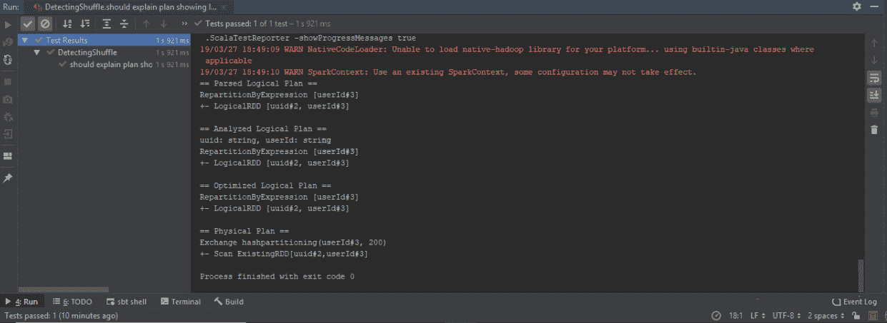

# 九、避免打乱和降低操作成本

在这一章中，我们将学习如何避免打乱并降低我们工作的操作成本，以及如何检测流程中的打乱。然后，我们将在 Apache Spark 中测试导致打乱的操作，以找出何时我们应该非常小心，以及应该避免哪些操作。接下来，我们将学习如何改变具有广泛依赖性的作业的设计。之后，我们将使用`keyBy()`操作来减少打乱，在本章的最后一节，我们将看到如何使用自定义分区来减少数据的打乱。

在本章中，我们将涵盖以下主题:

*   检测进程中的打乱
*   测试导致 Apache Spark 打乱的操作
*   改变具有广泛依赖性的作业的设计
*   使用`keyBy()`操作减少打乱
*   使用自定义分区器减少无序播放

# 检测进程中的打乱

在本节中，我们将学习如何检测进程中的打乱。

在本节中，我们将涵盖以下主题:

*   加载随机分区的数据
*   使用有意义的分区键发出重新分区
*   通过解释查询来理解无序播放是如何发生的

我们将加载随机分区的数据，看看数据是如何以及在哪里加载的。接下来，我们将使用一个有意义的分区密钥发布一个分区。然后，我们将使用确定性且有意义的密钥将数据重新分配给适当的执行器。最后，我们将使用`explain()`方法解释我们的查询，并理解打乱。这里，我们有一个非常简单的测试。

我们将创建一个包含一些数据的数据框架。例如，我们创建了一个带有一些随机 UID 和 T1 的 T0，在 T2 创建了另一个带有随机 ID 的输入，以及 T3 的最后一条记录。让我们假设这些数据是通过外部数据系统加载的。数据可以从 HDFS 或数据库加载，如卡珊德拉或 NoSQL:

```py
class DetectingShuffle extends FunSuite {
  val spark: SparkSession = SparkSession.builder().master("local[2]").getOrCreate()

  test("should explain plan showing logical and physical with UDF and DF") {
    //given
    import spark.sqlContext.implicits._
    val df = spark.sparkContext.makeRDD(List(
      InputRecord("1234-3456-1235-1234", "user_1"),
      InputRecord("1123-3456-1235-1234", "user_1"),
      InputRecord("1123-3456-1235-9999", "user_2")
    )).toDF()
```

在加载的数据中，我们的数据没有预定义或有意义的分区，这意味着输入记录号 1 可以首先在执行器中结束，记录号 2 可以其次在执行器中结束。因此，即使数据来自同一个用户，我们也可能会为特定用户执行操作。

如前一章[第八章](08.html)、*不可变设计*所述，我们使用了`reducebyKey()`方法，即获取用户标识或特定标识来减少特定键的所有值。这是一个非常常见的操作，但带有一些随机分区。使用有意义的键来`repartition`数据是一个很好的做法。

在使用`userID`的同时，我们将使用`repartition`，其方式是结果将记录具有相同用户 ID 的数据。所以`user_1`会成为第一个执行人:

```py
//when
    val q = df.repartition(df("userId"))
```

第一个执行者将拥有`userID`的所有数据。如果`InputRecord("1234-3456-1235-1234", "user_1")`在执行器 1 上，`InputRecord("1123-3456-1235-1234", "user_1")`在执行器 2 上，在对来自执行器 2 的数据进行分区后，我们需要将其发送给执行器 1，因为它是该分区键的父级。这导致了打乱。打乱是由加载没有被有效分区或根本没有被分区的数据引起的。我们需要处理我们的数据，以便能够对特定的键执行操作。

我们可以进一步`repartition`数据，但是应该在我们链的开始做。让我们开始测试来解释我们的查询:

```py
 q.explain(true)
```

我们正在对逻辑计划中的`userID`表达式进行重新分区，但是当我们检查物理计划时，它显示使用了散列分区，并且我们将对`userID`值进行散列。因此，我们扫描所有 rdd 和所有具有相同哈希的密钥，并将其发送到相同的执行器，以实现我们的目标:



在下一节中，我们将测试在 Apache Spark 中导致打乱的操作。

# 测试导致 Apache Spark 打乱的操作

在本节中，我们将测试导致 Apache Spark 打乱的操作。我们将涵盖以下主题:

*   对两个数据帧使用连接
*   使用两个不同分区的数据帧
*   测试导致打乱的连接

连接是一个导致打乱的特定操作，我们将使用它来连接我们的两个数据帧。我们将首先检查它是否会导致打乱，然后我们将检查如何避免它。为了理解这一点，我们将使用两个不同分区的数据帧，并检查连接两个未分区或随机分区的数据集或数据帧的操作。这将导致打乱，因为如果两个数据集在不同的物理机器上，就没有办法用相同的分区键连接它们。

在加入数据集之前，我们需要将它们发送到同一个物理机器。我们将使用以下测试。

我们需要创建`UserData`，这是我们已经看到的一个案例类。它有用户标识和数据。我们有用户标识，即`user_1`、`user_2`、`user_4`:

```py
test("example of operation that is causing shuffle") {
    import spark.sqlContext.implicits._
    val userData =
    spark.sparkContext.makeRDD(List(
        UserData("user_1", "1"),
        UserData("user_2", "2"),
        UserData("user_4", "200")
    )).toDS()
```

然后，我们创建一些类似于用户标识(`user_1`、`user_2`和`user_3`)的事务数据:

```py
val transactionData =
    spark.sparkContext.makeRDD(List(
        UserTransaction("user_1", 100),
        UserTransaction("user_2", 300),
        UserTransaction("user_3", 1300)
    )).toDS()
```

我们通过使用来自`UserData`和`transactionData`的`userID`列在`UserData`上使用`joinWith`交易。由于我们已经发出了`inner`连接，结果有两个元素，因为记录和事务之间有一个连接，即`UserData`和`UserTransaction`。但是`UserData`没有交易，`Usertransaction`没有用户数据:

```py
//shuffle: userData can stay on the current executors, but data from
//transactionData needs to be send to those executors according to joinColumn
//causing shuffle
//when
val res: Dataset[(UserData, UserTransaction)]
= userData.joinWith(transactionData, userData("userId") === transactionData("userId"), "inner")
```

当我们连接数据时，数据没有被分区，因为这是 Spark 的一些随机数据。它无法知道用户标识列是分区键，因为它无法猜到这一点。由于它不是预分区的，要连接两个数据集中的数据，需要将用户标识中的数据发送给执行器。因此，将会有许多来自执行器的数据打乱，这是因为数据没有被分区。

让我们解释查询，执行断言，并通过开始测试来显示结果:

```py
//then
 res.show()
 assert(res.count() == 2)
 }
}
```

我们可以看到如下结果:

```py
+------------+-------------+
|         _1 |           _2|
+----------- +-------------+
+ [user_1,1] | [user_1,100]|
| [user_2,2] | [user_2,300]|
+------------+-------------+
```

我们有`[user_1,1]`和`[user_1,100]`，也就是`userID`和`userTransaction`。看起来连接工作正常，但是让我们看看这个物理参数。我们让`SortMergeJoin`对第一个数据集和第二个数据集使用`userID`，然后我们使用`Sort`和`hashPartitioning`。

在上一节*检测进程*中的打乱时，我们使用了`partition`方法，该方法下面使用了`hashPartitioning`。虽然我们正在使用`join`，但我们仍然需要使用哈希分区，因为我们的数据没有被正确分区。因此，我们需要对第一个数据集进行分区，因为会有大量的打乱，然后我们需要对第二个数据集做完全相同的事情。同样，打乱将进行两次，一旦该数据在连接的字段上被分区，该连接可以是执行器本地的。

执行物理计划后会有一个记录断言，声明`userID`用户数据 one 和用户事务`userID` one 在同一个执行器上。没有`hashPartitioning`，就没有保证，因此我们需要进行分区。

在下一节中，我们将学习如何更改具有广泛依赖关系的作业的设计，因此我们将看到如何在对两个数据集执行连接时避免不必要的打乱。

# 改变具有广泛依赖性的作业的设计

在本节中，我们将更改对非分区数据执行`join`的作业。我们将改变具有广泛依赖性的工作的设计。

在本节中，我们将涵盖以下主题:

*   使用公共分区键对数据帧进行重新分区
*   理解预分区数据的连接
*   明白我们避免了打乱

我们将使用公共分区键在数据帧上使用`repartition`方法。我们看到，当发出连接时，下面会发生重新分区。但是通常，当使用 Spark 时，我们希望在数据帧上执行多个操作。因此，当我们执行与其他数据集的连接时，需要再次执行`hashPartitioning`。如果我们在加载数据时一开始就进行分区，我们将避免再次进行分区。

这里，我们有我们的示例测试用例，其中的数据是我们之前在*测试操作中使用的，导致了 Apache Spark* 部分的混乱。我们有用户标识为–`user_1`、`user_2`、`user_4`的三条记录的`UserData`，以及用户标识为–`user_1`、`user_2`、`user_3`的`UserTransaction`数据:

```py
test("example of operation that is causing shuffle") {
    import spark.sqlContext.implicits._
    val userData =
        spark.sparkContext.makeRDD(List(
            UserData("user_1", "1"),
            UserData("user_2", "2"),
            UserData("user_4", "200")
        )).toDS()
```

然后，我们需要`repartition`数据，这是第一件非常重要的事情。我们正在使用`userId`列重新划分我们的`userData`:

```py
val repartitionedUserData = userData.repartition(userData("userId"))
```

然后，我们将使用`userId`列对数据进行重新分区，这次是`transactionData`:

```py
 val repartitionedTransactionData = transactionData.repartition(transactionData("userId"))
```

一旦我们对数据进行了重新分区，我们就可以保证任何具有相同分区键的数据——在本例中，它是`userId`——都将落在同一个执行器上。正因为如此，我们重新分区的数据不会有打乱，连接会更快。最终，我们能够加入，但这次我们加入的是预分区数据:

```py
//when
//data is already partitioned using join-column. Don't need to shuffle
val res: Dataset[(UserData, UserTransaction)]
= repartitionedUserData.joinWith(repartitionedTransactionData, userData("userId") === transactionData("userId"), "inner")
```

我们可以使用以下代码显示我们的结果:

```py
 //then
 res.show()
 assert(res.count() == 2)
 }
}
```

输出如下图所示:


在前面的截图中，我们有用户标识和交易的物理计划。我们对用户标识数据的用户标识列以及事务数据执行哈希分区。连接数据后，我们可以看到数据是正确的，并且有一个物理连接计划。

这一次，物理计划有点不同。

我们有一个`SortMergeJoin`操作，我们正在对我们的数据进行排序，这些数据已经在我们的执行引擎的上一步中进行了预分区。这样，我们的 Spark 引擎将执行排序合并连接，在这里我们不需要散列连接。它将正确地对数据进行排序，并且连接会更快。

在下一节中，我们将使用`keyBy()`操作来进一步减少打乱。

# 使用 keyBy()操作减少无序播放

在本节中，我们将使用`keyBy()`操作来减少打乱。我们将涵盖以下主题:

*   加载随机分区的数据
*   尝试以有意义的方式对数据进行预分区
*   利用`keyBy()`功能

我们将加载随机分区的数据，但这次使用的是 RDD API。我们将以有意义的方式对数据进行重新分区，并提取下面的信息，类似于数据框架和数据集应用编程接口。我们将学习如何利用`keyBy()`函数给我们的数据一些结构，并在 RDD 应用编程接口中进行预分区。

这是我们将在本节中使用的测试。我们正在创建两个随机输入记录。第一条记录有一个随机用户标识`user_1`，第二条记录有一个随机用户标识`user_1`，第三条记录有一个随机用户标识`user_2`:

```py
test("Should use keyBy to distribute traffic properly"){
    //given
    val rdd = spark.sparkContext.makeRDD(List(
        InputRecord("1234-3456-1235-1234", "user_1"),
        InputRecord("1123-3456-1235-1234", "user_1"),
        InputRecord("1123-3456-1235-9999", "user_2")
    ))
```

我们将使用`rdd.toDebugString`提取 Spark 下面正在发生的事情:

```py
println(rdd.toDebugString)
```

此时，我们的数据是随机分布的，用户标识字段的记录可能在不同的执行器上，因为 Spark 执行引擎无法猜测`user_1`是否是对我们有意义的键，或者`1234-3456-1235-1234`是否是。我们知道`1234-3456-1235-1234`不是一把有意义的钥匙，它是一个唯一的标识符。使用该字段作为分区键会给我们一个随机分布和大量的打乱，因为当您使用唯一字段作为分区键时，没有数据局部性。

Spark 不可能知道同一个用户 ID 的数据会落在同一个执行器上，这就是为什么在对数据进行分区时，我们需要使用用户 ID 字段，要么是`user_1`、`user_1`，要么是`user_2`。为了在 RDD API 中实现这一点，我们可以在数据中使用`keyBy(_.userId)`，但这一次它将改变 RDD 类型:

```py
val res = rdd.keyBy(_.userId)
```

如果我们检查 RDD 类型，我们会看到，这一次，RDD 不是输入记录，但它是字符串和输入记录的 RDD。字符串是我们在这里期望的字段类型，它是`userId`。我们还将在结果上使用`toDebugString`提取关于`keyBy()`功能的信息:

```py
println(res.toDebugString)
```

一旦我们使用`keyBy()`，同一用户 ID 的所有记录都会落在同一个执行者身上。正如我们已经讨论过的，这可能是危险的，因为如果我们有一个偏斜键，这意味着我们有一个基数非常高的键，我们可能会耗尽内存。此外，对结果的所有操作都是按键进行的，因此我们将对预分区数据进行操作:

```py
res.collect()
```

让我们开始这个测试。输出如下:


我们可以看到，我们的第一个调试字符串非常简单，只有 RDD 上的集合，但是第二个有点不同。我们有一个`keyBy()`方法，我们在它下面做一个 RDD。我们的孩子 RDD 和父母 RDD 来自第一部分，*测试操作导致了 ApacheSpark*的打乱，从我们扩展 RDD 开始。这是由`keyBy()`方法发布的亲子链。

在下一节中，我们将使用自定义分区器来进一步减少无序播放。

# 使用自定义分区器减少无序播放

在本节中，我们将使用自定义分区器来减少无序播放。我们将涵盖以下主题:

*   实现自定义分区器
*   在 Spark 上使用带有`partitionBy`方法的分割器
*   验证我们的数据是否正确分区

我们将使用我们的定制逻辑实现一个定制的分区器，它将对数据进行分区。它将通知 Spark 每个记录应该落在哪里和哪个执行者。我们将在 Spark 上使用`partitionBy`方法。最后，我们将验证我们的数据是否被正确分区。为了测试的目的，我们假设我们有两个执行者:

```py
import com.tomekl007.UserTransaction
import org.apache.spark.sql.SparkSession
import org.apache.spark.{Partitioner, SparkContext}
import org.scalatest.FunSuite
import org.scalatest.Matchers._

class CustomPartitioner extends FunSuite {
val spark: SparkContext = SparkSession.builder().master("local[2]").getOrCreate().sparkContext

test("should use custom partitioner") {
//given
val numberOfExecutors = 2
```

让我们假设我们希望将我们的数据均匀地分割成`2`个执行器，并且具有相同密钥的数据实例将落在相同的执行器上。所以，我们输入的数据是一个`UserTransactions` : `"a"`、`"b"`、`"a"`、`"b"`和`"c"`的列表。价值观不那么重要，但我们需要记住它们，以便以后测试行为。对于给定的`UserTransactions`，该`amount`为`100`、`101`、`202`、`1`和`55`:

```py
val data = spark
    .parallelize(List(
        UserTransaction("a", 100),
        UserTransaction("b", 101),
        UserTransaction("a", 202),
        UserTransaction("b", 1),
        UserTransaction("c", 55)
```

当我们做一个`keyBy`时，`(_.userId)`被传递给我们的分割器，所以当我们发出`partitionBy`时，我们需要扩展`override`方法:

```py
).keyBy(_.userId)
.partitionBy(new Partitioner {
    override def numPartitions: Int = numberOfExecutors
```

`getPartition`法取一个`key`，就是`userId`。密钥将在这里传递，类型将是字符串:

```py
override def getPartition(key: Any): Int = {
    key.hashCode % numberOfExecutors
    }
})
```

这些方法的签名是`Any`，所以我们需要`override`它，并且还要覆盖分区的数量。

然后我们打印我们的两个分区，`numPartitions`返回`2`的值:

```py
println(data.partitions.length)
```

`getPartition`非常简单，因为它采用了`hashCode`和`numberOfExecutors`模块。它确保同一把钥匙落在同一名执行者身上。

当我们得到一个迭代器时，我们将为相应的分区映射每个分区。这里，我们以`amount`为测试目的:

```py
//when
val res = data.mapPartitions[Long](iter =>
iter.map(_._2).map(_.amount)
).collect().toList
```

最终，我们断言`55`、`100`、`202`、`101`和`1`；订单是随机的，因此不需要处理订单:

```py
//then
res should contain theSameElementsAs List(55, 100, 202, 101, 1)
}
}
```

如果我们还想，我们应该使用`sortBy`方法。让我们开始这个测试，看看我们的自定义分区器是否如预期的那样工作。现在我们可以开始了。我们有`2`分区，所以工作正常，如下图截图所示:


# 摘要

在本章中，我们学习了如何检测进程中的打乱。我们介绍了导致 Apache Spark 混乱的测试操作。我们还学习了如何在 RDD 使用分区。如果需要分区数据，知道如何使用 API 是很重要的，因为 RDD 仍然被广泛使用，所以我们使用`keyBy`操作来减少打乱。我们还学习了如何使用自定义分区器来减少无序播放。

在下一章中，我们将学习如何使用 Spark API 以正确的格式保存数据。