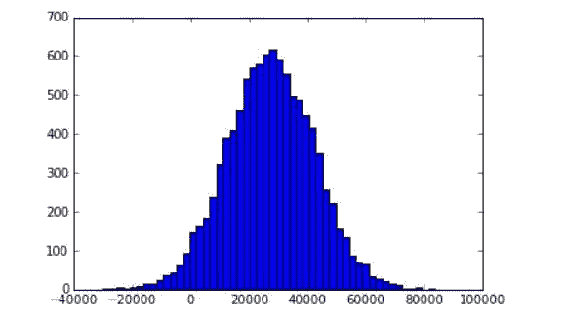
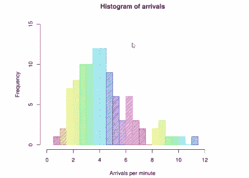
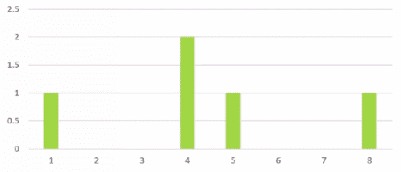
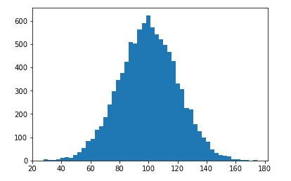
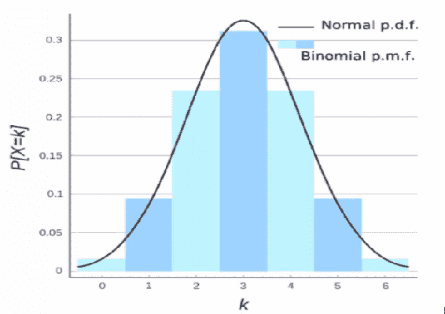
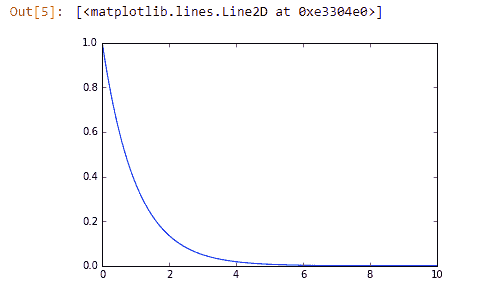
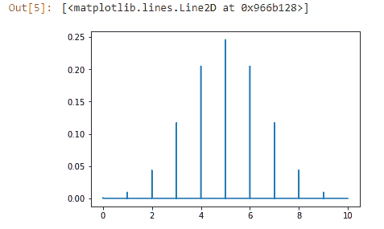
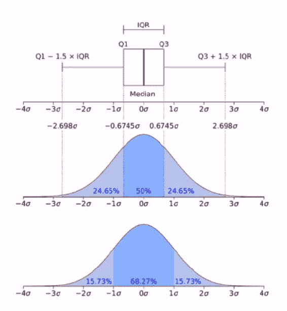

# 二、统计和概率复习，以及 Python 实践

在这一章中，我们将回顾一些统计和概率的概念，这可能会让你们中的一些人重温一下。 如果你想成为一名数据科学家，这些概念是很重要的。 我们将通过示例更好地理解这些概念。 我们还将了解如何使用实际的 Python 代码实现这些示例。

在本章中，我们将介绍以下主题：

*   您可能遇到的数据类型以及如何相应地处理它们
*   平均值、中位数、模式、标准差和方差的统计概念
*   概率密度函数和概率质量函数
*   数据分布的类型及其绘制方法
*   理解百分位数和矩

# 数据类型

好的，如果你想成为一名数据科学家，我们需要谈谈你可能会遇到的数据类型，如何对它们进行分类，以及如何以不同的方式对待它们。 让我们深入研究一下您可能会遇到的不同类型的数据：


这看起来很简单，但我们必须从简单的东西开始，然后逐步发展到更复杂的数据挖掘和机器学习。 了解您处理的是哪种类型的数据非常重要，因为不同的技术可能会有不同的细微差别，这取决于您处理的是哪种数据。 因此，如果您愿意的话，有几种类型的数据，我们将主要关注三种特定类型的数据。 它们是：

*   数字数据
*   分类数据
*   序数数据

同样，对于不同类型的数据，您可能会使用不同的技术变体，因此在分析数据时，您需要始终记住要处理的是哪种类型的数据。

# 数字数据

让我们从数字数据开始。 它可能是最常见的数据类型。 基本上，它代表了一些你可以测量的可量化的东西。 例如，人的高度、页面加载时间、股票价格等等。 千变万化的东西，可以测量的东西，有多种可能性的东西。 现在基本上有两种数字数据，所以如果你愿意的话，可以说是一种味道。

# 离散数据

有离散的数据，它是以整数为基础的，例如，可以是某种事件的计数。 例如，一位顾客一年内买了多少东西。 嗯，那只能是离散值。 他们买了一件，或者他们买了两件，或者他们买了三件。 他们不可能买，2.25 件或者四分之三件。 它是一个有整数限制的离散值。

# 连续数据

另一种类型的数字数据是连续数据，这是一种有无限可能性的东西，你可以把它分解成分数。 因此，例如，回到人的身高，人的可能高度是无限的。 你可能有 5 英尺 10.37625 英寸高，或者在一个网站上做类似结账这样的事情所需的时间可能是任何一种巨大的可能性，就你所知的 10.7625 秒，或者给定的一天有多少降雨。 再说一次，这里有无限的精确度。 这是一个连续数据的例子。

简单地说，数字数据是可以用数字进行定量测量的东西，它可以是离散的，可以是基于整数的，就像事件计数一样，也可以是连续的，在这种情况下，可以有无限范围的精度可用于该数据。

# 分类数据

我们将要讨论的第二类数据是分类数据，这是没有固有数字含义的数据。

大多数情况下，您不能真正将一个类别与另一个类别直接进行比较。 比如性别，是/否问题，种族，居住地，产品类别，政党；你可以给这些类别分配数字，通常你会这样做，但这些数字没有固有的意义。


例如，我可以说德克萨斯州的面积大于佛罗里达州的面积，但我不能仅仅说德克萨斯州比佛罗里达州大，它们只是类别。 对他们来说，没有真正的数字可量化的意义，只是我们对不同事物进行分类的方式。

现在再说一遍，我可能会对每个州进行某种数字赋值。 我的意思是，我可以说佛罗里达州是 3 号州，德克萨斯州是 4 号州，但是 3 号和 4 号之间没有真正的关系，对，这只是一个更简洁地表示这些类别的缩写。 同样，分类数据没有任何内在的数字意义；这只是您选择根据类别划分一组数据的一种方式。

# 序数数据

你经常听到的关于数据类型的最后一种分类是顺序数据，这是一种数字和分类数据的混合。 一个常见的例子是电影或音乐的星级评分，或者你有什么。


在这种情况下，我们有分类数据，可能是 1 到 5 星，其中 1 可能代表差，5 可能代表优秀，但它们确实有数学意义。 我们知道 5 意味着它比 1 好，所以这是一种不同类别之间有数字关系的数据的情况。 所以，我可以说 1 星小于 5 星，我可以说 2 星小于 3 星，我可以说 4 星在质量方面大于 2 星。 现在你也可以把恒星的实际数量想象成离散的数字数据。 因此，这绝对是这些类别之间的一条细微的界限，在许多情况下，你实际上可以互换地对待它们。

所以，现在你就知道了，这三种不同的类型。 有数字的、分类的和顺序的数据。 让我们看看它是不是陷进去了。 别担心，我不会让你交作业的。

**快速测验：**对于这些示例中的每一个，数据是数字的、分类的还是有序的？

1.  让我们从你的油箱里有多少汽油开始。 你认为如何？ 嗯，正确的答案是数字。 它是一个连续的数值，因为在你的储罐里，气体的可能性是无限的。 我的意思是，是的，可能有一个上限，你可以容纳多少气体，但你有多少气体，可能的值是多少，没有穷尽的数字。 可能是坦克的四分之三，也可能是坦克的十六分之七，也可能是坦克的*1/pi*，我的意思是谁知道呢，对吧？

2.  如果你的总体健康状况从 1 分到 4 分，这些选择对应于差、中等、好和极好这四个类别，你会怎么想呢？ 你认为如何？ 这是有序数据的一个很好的例子。 这很像我们的电影评分数据，同样，取决于你如何建模，你可能也可以把它当作离散的数字数据，但从技术上讲，我们把它称为序数数据。
3.  你同学的比赛怎么样？ 这是一个非常清楚的分类数据的例子。 你不能真的把紫色人和绿色人相比，对吧，他们只是紫色和绿色，但它们是你可能想要研究和理解的类别，在其他方面有什么不同。
4.  你同学的年龄是多少年？ 有点像刁钻的问题；如果我说它必须是一个整数值，比如 40 年、50 岁或 55 岁，那就是离散的数字数据，但如果我有更高的精度，比如 40 年零 3 个月零 2.67 天，那就是连续的数字数据，但无论哪种方式，它都是数字数据类型。
5.  最后，在商店里花的钱。 再说一次，这可能是连续数字数据的一个例子。 因此，这一点同样重要，因为您可能会对不同类型的数据应用不同的技术。

例如，在某些概念中，我们为分类数据执行一种类型的实现，而为数值数据执行不同类型的实现。

这就是你需要知道的关于你通常会找到的不同类型的数据的全部内容，这也是我们在本书中将重点关注的。 它们都是非常简单的概念：有数字、分类和顺序数据，数字数据可以是连续的，也可以是离散的。 根据您要处理的数据类型，您可能会对数据应用不同的技术，我们将在整本书中看到这一点。 让我们继续前进吧。

# 平均值、中位数和模式

让我们稍微复习一下统计数据 101。 这就像小学的东西，但最好再来一遍，看看这些不同的技巧是如何使用的：均值、中位数和模式。 我相信您以前听说过这些术语，但是看看它们的用法有什么不同是很好的，所以让我们来深入了解一下。

对于你们大多数人来说，这应该是一次回顾，快速复习一下，因为我们实际上已经开始深入研究一些真实的统计数据了。 让我们看看一些实际的数据，并弄清楚如何衡量这些东西。

# 吝啬的 / 刻薄的 / 中间的 / 中庸的

正如你可能知道的，平均数只是平均数的另一个名称。 要计算数据集的平均值，您所要做的就是将所有值相加，然后除以您拥有的值的数量。

*Sum of samples/Number of samples*

让我们以这个例子为例，它计算了我家附近每间房子的平均(平均)孩子数量。

比方说，我挨家挨户走访我的邻居，问每个人，他们家有几个孩子。 (顺便说一句，这是离散数字数据的一个很好的例子；还记得上一节的内容吗？)。 比方说，我四处走走，发现第一个房子里没有孩子，第二个房子有两个孩子，第三个家庭有三个孩子，以此类推。 我收集了这个离散数字数据的小数据集，要算出平均值，我要做的就是把它们加在一起，除以我去过的房子的数量。

我住的这条街的每家每户儿童人数：

*0，2，3，2，1，0，0，2，0*

平均值为*(0+2+3+2+1+0+0+2+0)/9=1.11*

结果是 0+2+3 加上所有这些数字除以我看过的房屋总数，也就是 9，在我的样本中，每间房子的平均孩子数是 1.11。 所以，你就知道了，我的意思是。

# 中间值 / 三角形中线 / 梯形中位线

中位数略有不同。 计算数据集的中位数的方法是对所有值进行排序(升序或降序)，然后取中间的值。

例如，让我们使用相同的社区儿童数据集

*0，2，3，2，1，0，0，2，0*

我会按数字排序，我可以取数据中间的数字，结果是 1。

*0，0，0，0，1，2，2，2，3*

同样，我要做的就是获取数据，按数字排序，然后取中心点。

If you have an even number of data points, then the median might actually fall in between two data points. It wouldn't be clear which one is actually the middle. In that case, all you do is, take the average of the two that do fall in the middle and consider that number as the median.

# 异常值因子

在前面每个家庭的孩子数量的例子中，中位数和平均数非常接近，因为没有太多的异常值。 我们有 0 个、1 个、2 个或 3 个孩子，但我们没有一个有 100 个孩子的古怪家庭。 这将真正扭曲平均数，但它可能不会对中位数产生太大变化。 这就是为什么中位数通常是一个非常有用的东西，但往往被忽视了。

Median is less susceptible to outliers than the mean.

人们有时有用统计数字误导人们的倾向。 我会尽我所能在整本书中不断指出这一点。

例如，你可以谈论美国的平均或平均家庭收入，我去年查到的实际数字是 7.2 万美元左右，但这并不能真正准确地描述典型的美国人的收入。 这是因为，如果你看一下收入中位数，它要低得多，只有 51,939 美元。 为什么会这样呢？ 嗯，因为收入不平等。 美国有少数非常富有的人，很多国家也是如此。 美国甚至不是最糟糕的，但你知道那些亿万富翁，那些生活在华尔街、硅谷或其他超级富豪地区的超级富豪，他们歪曲了平均水平。 但它们的数量如此之少，以至于它们对中位数的影响并不是很大。

这是一个很好的例子，在这个例子中，中位数比平均数更能反映典型的人或数据点的情况。 每当有人谈到平均值时，你就必须考虑数据分布是什么样子的。 有没有可能歪曲这一均值的异常值？ 如果答案可能是肯定的，你也应该问中位数，因为这通常比平均数或平均数提供了更多的洞察力。

# 方法 / 模式 / 时尚

最后，我们将讨论模式。 这在实践中并不经常出现，但你不能不谈论模式就谈到平均数和中位数。 All 模式表示，是数据集中最常见的值。

让我们回到我的例子，每个房子里有多少孩子。

*0，2，3，2，1，0，0，2，0*

每个值有多少个：

*0：4，1：1，2：3，3：1*

模式为 0

如果我只看一下出现频率最高的数字，结果是 0，因此这个数据的模式是 0。 在这个社区，一个给定的房子里最常见的孩子数量是没有孩子，这就是所有的意思。

这实际上是一个关于连续数据和离散数据的很好的例子，因为这只对离散数据有效。 如果我有一个连续的数据范围，那么我真的不能谈论出现的最常见的值，除非我以某种方式将其量化为离散值。 因此，我们已经在这里遇到了一个数据类型很重要的示例。

Mode is usually only relevant to discrete numerical data, and not to continuous data.

许多真实世界的数据往往是连续的，所以也许这就是为什么我不太了解模式的原因，但我们在这里看到它是为了完整。

你就知道了：简而言之：中庸、中庸和时尚。 这是你能做的最基本的统计数据，但我希望你能在中位数和均值之间做出选择的重要性有了一些新的认识。 他们可以讲述非常不同的故事，但人们往往会在他们的头脑中将他们等同起来，所以要确保你是一个负责任的数据科学家，并以一种传达你试图表达的意义的方式来表达数据。 如果您试图显示一个典型的值，通常中位数会比平均值更好，因为会出现异常值，所以请记住这一点。 让我们继续前进吧。

# 在 Python 中使用均值、中值和模式

让我们开始用 Python 进行一些真正的编码，看看如何在 IPython Notebook 文件中使用 Python 计算平均值、中位数和模式。

因此，如果您愿意，请继续打开本节数据文件中的`MeanMedianMode.ipynb`文件，我强烈建议您这样做。 如果您需要返回到前面关于从哪里下载这些材料的部分，请执行此操作，因为您将需要这些文件用于该部分。 让我们潜入水中吧！

# 使用 NumPy 软件包计算平均值

我们要做的是创建一些虚假的收入数据，回到上一节中的示例。 我们将创建一些假数据，在这个例子中，典型的美国人年收入约为 27,000 美元，我们将假设这是一个正态分布，标准差为 15,000。 所有的数字都是完全虚构的，如果你还不知道什么是正态分布和标准差，请不要担心。 我将在本章稍后讨论这一点，但我只想让您知道这些不同的参数在本例中代表了什么。 稍后它就会变得有意义了。

在我们的 Python 笔记本中，请记住将 NumPy 包导入到 Python 中，这使得计算平均值、中位数和模式变得非常容易。 我们将使用`import numpy as np`指令，这意味着从现在开始我们可以使用`np`作为调用`numpy`的简写。

然后，我们将使用`np.random.normal`函数创建一个名为`incomes`的数字列表。

```py
import numpy as np 

incomes = np.random.normal(27000, 15000, 10000) 
np.mean(incomes) 

```

`np.random.normal`函数的三个参数意味着我希望数据以`27000`为中心，标准差为`15000`，并且我希望 python 在这个列表中创建`10000`个数据点。

一旦我这样做了，我就计算这些数据点的平均值，或者只通过对我的数据列表`incomes`调用`np.mean`来计算平均值。 就这么简单。

让我们继续运行它。 确保您选择了该代码块，然后您可以点击 Play 按钮来实际执行它，由于这些收入数字有一个随机分量，所以每次我运行它时，我都会得到一个略微不同的结果，但它应该总是非常接近`27000`。

```py
Out[1]: 27173.098561362742

```

好了，这就是在 Python 中计算平均值的全部方法，只需使用 NumPy(`np.mean`)就可以非常简单。 你不需要写一大堆代码，或者把所有的东西加起来，然后计算你有多少项，然后做除法。 NumPy 的意思是，为你做所有这些。

# 使用 matplotlib 可视化数据

让我们将这些数据可视化，使其更有意义一些。 还有另一个名为`matplotlib`的包，我们以后也会更多地讨论这个包，但是这个包让我可以在 IPython 笔记本上绘制漂亮的图形，所以它是可视化数据和查看情况的一种简单方法。

在本例中，我们使用`matplotlib`创建将收入数据分解为`50`个不同存储桶的直方图。 所以基本上，我们把我们的连续数据离散化，然后我们可以调用 show on`matplotlib.pyplot`来实际显示这个直方图。 请参阅以下代码：

```py
%matplotlib inline 
import matplotlib.pyplot as plt 
plt.hist(incomes, 50) 
plt.show() 

```

继续，选择代码块并点击播放。 它实际上将为我们创建一个新的图表，如下所示：



如果您不熟悉直方图或需要刷新，那么解释这一点的方法是，对于我们将数据离散化到其中的每个存储桶，都会显示该数据的频率。

例如，大约 27,000 个左右，我们可以看到，对于每个给定值范围，该邻域中大约有**600**个数据点。 有很多人在 27,000 人左右，但当你算上像**80,000**这样的异常值时，并不是很多，显然有一些穷人甚至在**-40,000**负债，但同样，他们非常罕见，也不太可能，因为我们定义了一个正态分布，这就是正态概率曲线的样子。 同样，我们稍后会更详细地讨论这一点，但如果你还不知道的话，我只是想让你明白这一点。

# 使用 NumPy 软件包计算中位数

好的，计算中位数和计算平均值一样简单。 就像我们有 NumPy`mean`一样，我们也有一个 NumPy`median`函数。

我们可以只对`incomes`使用`median`函数，这是我们的数据列表，这将给出中位数。 在这种情况下，这一数字为 26,911 美元，与 26988 美元的平均值相差不大。 同样，初始数据是随机的，因此您的值将略有不同。

```py
np.median(incomes) 

```

以下是前面代码的输出：

```py
Out[4]: 26911.948365056276 

```

我们不希望看到很多异常值，因为这是一个很好的正态分布。 当你没有太多奇怪的异常值时，中位数和平均值将是可比较的。

# 异常值的影响分析

为了证明这一点，让我们加上一个离群值。 我们会选择唐纳德·特朗普(Donald Trump)；我认为他有资格成为局外人。 我们继续把他的收入加进去吧。 因此，我将使用`np.append`手动将其添加到数据中，假设将 10 亿美元(显然不是唐纳德·特朗普的实际收入)添加到收入数据中。

```py
incomes = np.append(incomes, [1000000000]) 

```

我们将要看到的是，这个异常值实际上不会对中位数产生很大影响，您知道，它仍然是 26,911 美元左右的值，因为我们实际上没有改变中间点的位置，只有一个值，如下例所示：

```py
np.median(incomes) 

```

这将输出以下内容：

```py
Out[5]: 26911.948365056276 

```

这将产生新的输出：

```py
np.mean(incomes) 

```

以下是前面代码的输出：

```py
Out[5]:127160.38252311043 

```

啊哈，那你就知道了！ 这是一个很好的例子，说明了中庸和刻薄，尽管人们倾向于用平凡的语言将它们等同起来，但它们可以非常不同，讲述一个非常不同的故事。 因此，一个离群值导致这个数据集中的平均年收入超过 127160 美元，但对于这个数据集中的普通人来说，更准确的情况是接近 27,000 美元。 我们的平均值刚刚被一个大的异常值歪曲了。

这个故事的寓意是：如果你怀疑其中可能存在离群值，就拿任何谈论平均数或平均数的人持保留态度，收入分配肯定就是一个例子。

# 使用 SciPy 软件包的计算模式

最后，让我们来看一下模式。 我们将只生成一组随机整数，准确地说是 500 个，范围在`18`和`90`之间。 我们将为人们创造一堆虚假的年龄。

```py
ages = np.random.randint(18, high=90, size=500) 
ages 

```

您的输出将是随机的，但应该类似于以下屏幕截图：


现在，SciPy 有点像 NumPy，是一组非常方便的统计函数，因此我们可以使用以下语法从 SciPy 导入`stats`。 这和我们以前看到的有点不同。

```py
from scipy import stats 
stats.mode(ages) 

```

代码的意思是，从`scipy`包导入`stats`(我将把包称为`stats`)，Tha 意味着我不需要像以前使用 NumPy 那样拥有别名，只是使用不同的方式即可。 这两种方式都有效。 然后，我对`ages`使用了`stats.mode`函数，这是我们的随机年龄列表。 当我们执行上面的代码时，我们会得到以下输出：

```py
Out[11]: ModeResult(mode=array([39]), count=array([12])) 

```

因此，在本例中，实际模式是`39`，结果是该数组中最常见的值。 它实际上发生了`12`次。

现在如果我真的创建一个新的分布，我会期待一个完全不同的答案，因为这个数据真的是完全随机的，这些数字是什么。 让我们再次执行上面的代码块来创建一个新的发行版。

```py
ages = np.random.randint(18, high=90, size=500) 
ages 

```

```py
from scipy import stats 
stats.mode(ages) 

```

将方程随机化的输出如下所示：


确保您选择了该代码块，然后您可以点击 Play 按钮来实际执行它。

在本例中，模式以数字`29`结束，出现了`14`次。

```py
Out[11]: ModeResult(mode=array([29]), count=array([14])) 

```

所以，这是一个非常简单的概念。 你可以再做几次，只是为了好玩。 这有点像在玩轮盘赌。 我们将再次创建新的分发。

简而言之，这就是平均值、中位数和模式值。 使用 SciPy 和 NumPy 包可以非常简单地做到这一点。

# 一些练习

在这一部分，我要给你们布置一个小作业。 如果你打开`MeanMedianExercise.ipynb`文件，有一些东西你可以玩。 我希望你们卷起袖子，真正试着做到这一点。

在文件中，我们有一些随机的电子商务数据。 此数据表示的是每个事务花费的总金额，同样，就像我们前面的示例一样，它只是数据的正态分布。 我们可以运行它，你们的作业是继续使用 NumPy 软件包找出这个数据的平均值和中位数。 这几乎是你能想象到的最简单的任务。 您需要的所有技术都在我们前面使用的`MeanMedianMode.ipynb`文件中。

这里的重点并不是要挑战您，而是让您实际编写一些 Python 代码，并说服自己，您实际上可以得到一个结果，并在这里实现一些事情。 所以，继续玩这个游戏吧。 如果您想要更多地使用它，请随意使用这里的数据分布，看看您可以对数字产生什么影响。 尝试添加一些异常值，就像我们对收入数据所做的那样。 这就是学习这些东西的方法：掌握基础知识，高级知识就会随之而来。 尽情享受吧，尽情享受吧。

一旦你准备好了，让我们继续我们的下一个概念，标准差和方差。

# 标准差和方差

让我们来谈谈标准差和方差。 您可能以前听说过这些概念和术语，但让我们更深入地了解它们的真正含义以及如何计算它们。 这是对数据分布范围的衡量，几分钟后它会变得更有意义。

标准差和方差是数据分布的两个基本量，你会在本书中反复看到。 所以，让我们看看是什么，如果你需要复习的话。

# 不同 / 不和 / 变异 / 方差

让我们看看直方图，因为方差和标准差都是关于数据的分布，即数据集的分布形状。 看看下面的直方图：



比方说，我们有一些关于飞机抵达机场频率的数据，例如，这个直方图表明我们大约每分钟有 4 架飞机到达，这发生在我们查看这些数据的大约 12 天内。 然而，我们也有这些离群值。 我们有一天非常慢，每分钟只有一个人到达，我们只有一天非常快，几乎每分钟有 12 个人到达。 因此，读取直方图的方法是查找给定值的桶，这会告诉你该值在数据中出现的频率，直方图的形状可以告诉你很多关于给定数据集的概率分布的信息。

我们从这些数据中得知，我们的机场很可能每分钟有 4 个左右的航班，但不太可能是 1 到 12 个，我们还可以具体讨论介于这两个数字之间的所有数字的概率。 因此，不仅每分钟不太可能有 12 个航班到达，每分钟也不太可能有 9 个航班到达，而且一旦我们开始达到 8 个左右，情况就会开始好转。 柱状图可以提供很多信息。

Variance measures how *spread-out* the data is.

# 测量方差

我们通常把方差称为西格玛的平方，你很快就会知道为什么，但现在，你只需要知道方差是平均值的平方差的平均值。

1.  要计算数据集的方差，首先要计算其平均值。 假设我有一些可以代表任何东西的数据。 比方说排队一个小时的最大人数。 在第一个小时里，我看到一个人在排队，然后是 4 个人，然后是 5 个人，然后是 4 个人，然后是 8 个人。
2.  计算方差的第一步就是找出该数据的平均值。 我把它们加起来，把总和除以数据点的数量，结果是 4.4，这是排队的平均人数*(1+4+5+4+8)/5=4.4*。
3.  现在，下一步是找出每个数据点的平均值之间的差异。 我知道平均数是 4.4。 因此，对于我的第一个数据点，我有 1，所以*1-4.4=-3.4*，下一个数据点是 4，所以 4-4.4=-0.4*4-4.4=-0.4*，依此类推。 好的，我最后得到了这些正负数字，它们表示每个数据点的平均值*(-3.4，-0.4，0.6，-0.4，3.6)*的方差。
4.  现在我需要的是表示整个数据集的方差的单个数字。 接下来我要做的是找出这些差异的平方。 我只是要把那些与平均值的原始差别逐一进行分析，并将它们平方。 这有几个不同的原因：

让我们看看那里发生了什么，所以(-3.4)<sup class="calibre33">2</sup>是一个正 11.56，而(-0.4)<sup class="calibre33">2</sup>最终是一个小得多的数字，也就是 0.16，因为这更接近于 4.4 的平均值。 同样，(0.6)<sup class="calibre33">2</sup>接近平均值，只有 0.36。 但是当我们得到正的异常值时，(3.6)<sup class="calibre33">2</sup>最终是 12.96。 这给了我们：*(11.56，0.16，0.36，0.16，12.96)。*

要得到实际的方差值，我们只需取所有这些平方差的平均值。 所以我们把所有这些平方差加起来，把总和除以 5，这是我们拥有的值的数量，我们最终得到的方差是 5.04。


好的，这就是所有的变化。

# 均方差，标准差

通常，我们更多地讨论标准差而不是方差，结果是标准差就是方差的平方根。 就这么简单。

所以，如果我的方差是*5.04*，标准差是*2.24*。 现在你明白为什么我们说方差=(σ)<sup class="calibre33">2</sup>了。 这是因为σ本身代表标准差。 所以，如果我取(σ)<sup class="calibre33">2</sup>的平方根，我得到σ。 在本例中，该值最终为 2.24。


# 用标准差识别异常值

下面是我们在前面的示例中查看的用于计算方差的实际数据的直方图。



现在我们看到，数字**4**在我们的数据集中出现了两次，然后是一个**1**、一个**5**和一个**8**。

标准差通常被用作考虑如何识别数据集中的异常值的一种方法。 如果我说如果我在平均值 4.4 的一个标准差之内，那就被认为是正态分布中的典型数值。 但是，您可以在上图中看到，数字**1**和**8**实际上位于该范围之外。 所以如果我取 4.4 加或减 2.24，我们最终得到**7**和**2**，**1**和**8**都在标准差范围之外。 所以我们可以从数学上说，1 和 8 是异常值。 我们不需要猜测和观察它。 现在，对于一个数据点与平均值的标准差有多少，你认为什么是异常值，仍然需要做出判断。

You can generally talk about how much of an outlier a data point is by how many standard deviations (or sometimes how many-sigmas) from the mean it is.

这就是你会看到在现实世界中使用的标准差。

# 总体方差与样本方差

标准差和方差之间有一些细微差别，这就是当你谈论总体和样本方差时。 如果你使用的是一组完整的数据，一组完整的观测数据，那么你就得完全按照我说的做。 你只需取平均值的所有平方差的平均值，这就是你的方差。

但是，如果您正在采样数据，也就是说，如果您只是为了简化计算而获取数据的子集，那么您必须做一些稍微不同的事情。 不是除以样本数，而是除以样本数减 1。让我们看一个例子。

我们将使用我们刚刚为排队的人研究的样本数据。 我们把方差的平方和除以 5，也就是我们拥有的数据点的数量，得到 5.04。

*σ<sup class="calibre33">2</sup>=(11.56+0.16+0.36+0.16+12.96)/5=5.04*

如果我们看一下样本方差，它由 S<sup class="calibre33">2</sup>表示，它是方差的平方和除以 4，即*(n-1)*。 这给了我们样本方差，结果是 6.3。

*S<sup class="calibre33">2</sup>=(11.56+0.16+0.36+0.16+12.96)/4=6.3*

再说一次，如果这是我们从更大的数据集中获取的某种样本，这就是你要做的。 如果它是一个完整的数据集，则除以实际数字。 好的，这就是我们计算总体和样本方差的方法，但是它背后的实际逻辑是什么呢？

# 数学解释

至于为什么总体和样本方差之间存在差异，它涉及到非常奇怪的关于概率的事情，你可能不想想太多，它需要一些奇特的数学符号，我尽量避免在这本书中使用符号，因为我认为概念更重要，但这是足够基本的东西，你会一遍又一遍地看到它。

正如我们已经看到的，总体方差通常被指定为σ平方(σ<sup class="calibre33">2</sup>)，σ(σ)是标准差，我们可以说它是每个数据点 X 减去平均值µ的平方和，即每个样本平方对 N 的方差，即数据点的数量，我们可以用下面的公式来表示它：


*   X 表示每个数据点
*   µ表示平均值
*   N 表示数据点的数量

样本方差同样指定为 S<sup class="calibre33">2</sup>，公式如下：


*   X 表示每个数据点
*   M 表示平均值
*   N-1 表示数据点的数量减去 1

非那样做不行。

# 直方图上的标准差和方差分析

让我们在这里编写一些代码，并尝试一些标准差和方差。 因此，如果您调出`StdDevVariance.ipynb`文件 IPython Notebook，并跟随我在这里。 请一定要做，因为最后有一项活动我想让你试一试。 我们在这里要做的事情与前面的示例一样，所以从下面的代码开始：

```py
%matplotlib inline 
import numpy as np 
import matplotlib.pyplot as plt 
incomes = np.random.normal(100.0, 20.0, 10000) 
plt.hist(incomes, 50) 
plt.show() 

```

我们使用`matplotlib`来绘制一些正态分布的随机数据的直方图，我们称之为`incomes`。 我们说它将以`100`为中心(希望这是小时费率或其他什么，而不是每年或某种奇怪的面值)，标准偏差为`20`和`10,000`数据点。

让我们继续执行上面代码块并绘制它，如下图所示：



我们有 10,000 个以 100 为中心的数据点。 在正态分布和标准差 20 的情况下，这是衡量这些数据扩散的一个指标，你可以看到最常见的出现在 100 左右，随着我们离这一点越来越远，事情发生的可能性变得越来越小。 我们指定的 20 的标准偏差点在 80 左右和 120 左右。 你可以在直方图中看到，这是事情开始急剧下降的点，所以我们可以说，超出标准差界限的事情是不寻常的。

# 使用 Python 计算标准差和方差

现在，NumPy 也使得计算标准差和方差变得非常容易。 如果您想要计算我们生成的这个数据集的实际标准差，只需在数据集本身调用`std`函数即可。 因此，当 NumPy 创建列表时，它不只是一个普通的 Python 列表，它实际上附加了一些额外的内容，这样您就可以在上面调用函数，比如`std`表示标准偏差。 我们现在就开始吧：

```py
incomes.std() 

```

这给出了类似以下输出的结果(请记住，我们使用的是随机数据，因此您的数据不会与我的完全相同)：

```py
20.024538249134373 

```

当我们执行该操作时，我们会得到一个非常接近 20 的数字，因为这是我们在创建随机数据时指定的数字。 我们想要的标准差是 20。果然是 20.02，非常接近。

变化只是调用`var`的问题。

```py
incomes.var() 

```

这给我提供了以下信息：

```py
400.98213209104557 

```

它相当接近 400，也就是 20<sup class="calibre33">2</sup>。 是的，所以这个世界是有意义的！ 标准差就是方差的平方根，或者你可以说方差是标准差的平方。 果然，这是可行的，所以世界按照它应该的方式运转。

# 你自己试试吧

我想让你们深入到这里，真正地玩弄它，让它变得真实，所以尝试不同的参数来产生正常的数据。 请记住，这是对数据分布形状的度量，所以如果我更改中心点会发生什么？ 有关系吗？ 它真的会影响形状吗？ 你为什么不试一试，找出答案呢？

尝试调整我们指定的实际标准偏差，看看它对图形形状有什么影响。 也许试一下标准差为 30，你知道，你可以看到它实际上是如何影响事物的。 让我们把它做得更戏剧化，比如 50。 就拿 50 块来玩吧。 你会看到图表开始变得更胖了。 玩弄不同的价值观，感受一下这些价值观是如何运作的。 这是真正直观地了解标准差和方差的唯一方法。 尝试一些不同的例子，看看它所产生的效果。

这就是实际中的标准差和方差。 你在那里接触到了一些东西，我希望你能稍微熟悉一下。 这些都是非常重要的概念，我们将在整本书中大量讨论标准差，毫无疑问，在你的数据科学生涯中也是如此，所以请确保你对此有所了解。 让我们继续前进吧。

# 概率密度函数和概率质量函数

我们已经在本书中的一些例子中看到了一些正态分布函数的例子。 这是一个概率密度函数的例子，还有其他类型的概率密度函数。 因此，让我们深入研究一下它的真正含义，以及它们的其他一些例子。

# 概率密度函数和概率质量函数

我们已经看到了一些正态分布函数的例子，我们在这本书中已经看到了一些代码。 这是一个概率密度函数的例子，还有其他类型的概率密度函数。 让我们来看看这到底是什么意思，还有其他的一些例子。

# 概率密度函数

让我们来讨论概率密度函数，我们已经在书中用到了其中的一个。 我们只是没有这么叫它。 让我们把我们已经讨论过的一些东西正式化。 例如，我们已经见过几次正态分布，这是概率密度函数的一个例子。 下图是正态分布曲线的示例


从概念上讲，很容易尝试将此图视为给定值出现的概率，但当您谈论连续数据时，这有点误导。 因为在连续的数据分布中有无限多个实际可能的数据点。 可能是 0，也可能是 0.001，也可能是 0.00001，所以一个非常具体的值发生的实际概率是非常非常小的，无限小的。 概率密度函数真实地告诉我们给定范围内的值出现的概率。 所以这就是你必须思考的方式。

例如，在上图所示的正态分布中，在平均值(**0**)和平均值(**1σ**)的一个标准差之间，有**34.1%**的概率值落在该范围内。 你可以把它收紧或展开，计算出实际值，但这就是考虑概率密度函数的方式。 对于给定的值范围，它为您提供了一种找出该范围发生的概率的方法。

*   你可以在图中看到，当你接近平均值(**0**)，在一个标准差内(**-1σ**和**1σ**)，你很有可能落在那里。 我的意思是，如果你把 34.1 和 34.1 相加，相当于 68.2%，你就会得到着陆的概率，离平均值只有一个标准差。
*   然而，当你得到两到三个标准偏差(**-3σ**到**-2σ**和**2σ**到**3σ**)时，我们下降到略高于 4%(准确地说，是 4.2%)。
*   如果超过三个标准差(**-3σ**和**3σ**)，那么我们的误差就不到 1%。

因此，图表只是可视化和谈论给定数据点发生的概率的一种方式。 同样，概率分布函数给出了数据点落入给定值的某个给定范围内的概率，而正态函数只是概率密度函数的一个例子。 稍后我们再来看一些。

# 概率质量函数

现在，当你处理离散数据时，关于有无穷多个可能值的细微差别消失了，我们称之为不同的东西。 这是一个概率质量函数。 如果你在处理离散数据，你可以谈论概率质量函数。 下面是一张图表，可以帮助将这一点可视化：



例如，您可以在图中所示的黑色曲线上绘制连续数据的正态概率密度函数，但是如果我们像对直方图那样将其量化为离散数据集，我们可以说数字 3 出现设定的次数，实际上可以说数字 3 出现的概率略高于 30%。 概率质量函数是我们可视化离散数据发生概率的方式，它看起来很像直方图，因为它基本上就是直方图。

Terminology difference: A probability density function is a solid curve that describes the probability of a range of values happening with continuous data. A probability mass function is the probabilities of given discrete values occurring in a dataset.

# 数据分布的类型

让我们来看一些概率分布函数和数据分布的一般真实示例，更多地了解数据分布以及如何将它们可视化并在 Python 中使用它们。

来吧，打开书本上的`Distributions.ipynb`，如果你愿意，你可以跟我一起来。

# 均匀分布

让我们从一个非常简单的例子开始：均匀分布。 均匀分布只是意味着一个值在给定范围内出现的概率是平坦的恒定的。

```py
import numpy as np 
Import matplotlib.pyplot as plt 

values = np.random.uniform(-10.0, 10.0, 100000) 
plt.hist(values, 50) 
plt.show() 

```

因此，我们可以使用 NumPy`random.uniform`函数创建均匀分布。 前面的代码说，我想要一个范围在`-10`和`10`之间的均匀分布的随机值集，并且我想要它们的`100000`。 如果我随后创建这些值的直方图，您可以看到它如下所示。


在该数据中出现任何给定值或值范围的可能性几乎相等。 所以，与正态分布不同的是，在正态分布中，我们看到的值集中在平均值附近，而均匀分布在您定义的范围内的任何给定值上都有相等的概率。

那么这个的概率分布函数会是什么样子呢？ 嗯，我预计基本上不会看到超出**-10**或超出**10**的范围。 但当我在**-10**和**10**之间时，我会看到一条平坦的线，因为这两个值范围中的任何一个出现的概率都是恒定的。 在均匀分布中，你会看到概率分布函数上有一条平坦的直线，因为概率基本上是恒定的。 每个值、每个值范围都有与任何其他值相同的出现机会。

# 正态分布或高斯分布

现在我们已经在本书中看到了正态分布函数，也称为高斯分布函数。 实际上，您可以在 Python 中可视化这些内容。 在`scipy.stats.norm`包函数中有一个称为`pdf`(概率密度函数)的函数。

因此，让我们看一下下面的示例：

```py
from scipy.stats import norm 
import matplotlib.pyplot as plt 

x = np.arange(-3, 3, 0.001) 
plt.plot(x, norm.pdf(x)) 

```

在前面的示例中，我们使用`arange`函数创建了一个 x 值列表，用于绘制-3 到 3 之间的范围，其间的增量为 0.001。 这些是图表上的 x 值，我们将用这些值绘制*x*轴。 *y*轴将是正态函数`norm.pdf`，即正态分布的概率密度函数，关于这些 x 值。 我们最终得到以下输出：


具有正态分布的 pdf 函数看起来就像我们在上一节中所做的那样，即我们提供的给定数字的正态分布，其中 0 表示平均值，数字**-3**、**-2**、**-1**、**1**、**2**和**3**是标准差。

现在，我们将生成服从正态分布的随机数。 我们已经这样做过几次了，就当这是一次复习吧。 请参阅以下代码块：

```py
import numpy as np 
import matplotlib.pyplot as plt 

mu = 5.0 
sigma = 2.0 
values = np.random.normal(mu, sigma, 10000) 
plt.hist(values, 50) 
plt.show() 

```

在上面的代码中，我们使用了 NumPy 包的`random.normal`函数，第一个参数`mu`表示您想要将数据居中的平均值。 `sigma`是该数据的标准差，基本上就是它的分布。 然后，我们使用正态概率分布函数(这里是`10000`)指定我们想要的数据点的数量。 所以这是一种使用概率分布函数，在这种情况下是正态分布函数，来产生一组随机数据的方法。 然后，我们可以使用划分为`50`个桶的直方图来绘制并显示它。 以下输出是我们最终得到的结果：


它看起来或多或少像一个正态分布，但由于有一个随机元素，它不会是一条完美的曲线。 我们谈论的是概率；有些事情并不完全是它们应有的样子。

# 指数概率分布或幂律

你经常看到的另一个分布函数是指数概率分布函数，它以指数的方式下降。

当你谈论指数下降时，你预计会看到一条曲线，在零附近发生事情的可能性很大，但是，当你离它更远的时候，它会很快地下降。 自然界中有很多东西都是这样的。

要在 Python 中做到这一点，就像我们在`scipy.stats`中对`norm.pdf`有一个函数一样，我们在 Python 中也有一个`expon.pdf`或指数概率分布函数来做到这一点，我们可以执行与在这里使用指数分布的正态分布相同的语法，如以下代码块所示：

```py
from scipy.stats import expon 
import matplotlib.pyplot as plt 

x = np.arange(0, 10, 0.001) 
plt.plot(x, expon.pdf(x)) 

```

同样，在上面的代码中，我们使用 NumPy`arange`函数创建 x 值，以创建步长为`0.001`的介于`0`和`10`之间的一组值。 然后，我们沿着 y 轴绘制这些 x 值，y 轴被定义为函数`expon.pdf(x)`。 产出看起来像是指数下降。 如以下截图所示：



# 二项式概率质量函数

我们还可以可视化概率质量函数。 这被称为二项式概率质量函数。 同样，我们将使用与前面相同的语法，如以下代码所示：

```py
from scipy.stats import expon 
import matplotlib.pyplot as plt 

x = np.arange(0, 10, 0.001) 
plt.plot(x, expon.pdf(x)) 

```

因此，我们不使用`expon`或`norm`，而只使用`binom`。 提醒一下：概率质量函数处理离散数据。 我们一直都是这样，真的，这只是你怎么想的。

回到我们的代码，我们在`0`和`10`之间创建了一些离散的`x`值，间距为`0.01`，我们说我想用这些数据绘制一个二项式概率质量函数。 使用`binom.pmf`函数，我实际上可以使用两个形状参数`n`和`p`指定该数据的形状。 在本例中，它们分别是`10`和`0.5`。 输出如下图所示：



如果你想尝试不同的值，看看它有什么影响，这是一个直观了解这些形状参数如何作用于概率质量函数的好方法。

# 泊松概率质量函数

最后，你们可能听说过的另一个分布函数是泊松概率质量函数，它有一个非常特殊的应用。 它看起来很像正态分布，但有点不同。

这里的想法是，如果你有一些关于在给定时间段内发生的事情的平均数量的信息，这个概率质量函数可以给你一种方法来预测在给定的未来一天获得另一个值的几率。

举个例子，假设我有一个网站，平均每天有 500 名访问者。 我可以使用泊松概率质量函数来估计在特定日期看到其他值的概率。 例如，我平均每天有 500 名访问者，那么在给定的一天内看到 550 名访问者的可能性有多大？ 这就是泊松概率质量函数可以提供给您的结果。请看下面的代码：

```py
from scipy.stats import poisson 
import matplotlib.pyplot as plt 

mu = 500 
x = np.arange(400, 600, 0.5) 
plt.plot(x, poisson.pmf(x, mu)) 

```

在这个代码示例中，我是说我的平均种植面积是 500 亩。 我将设置一些 x 值，以查看间隔为`0.5`的`400`和`600`之间的值。 我将使用`poisson.pmf`函数对其进行绘图。 假设服从正态分布，我可以使用该图来查找获得任何非`500`特定值的几率：


结果表明，在某一天看到**550**访客的几率约为**0.002**，或者说 0.2%的概率。 非常有趣。

好的，这些是你在现实世界中可能会遇到的一些常见的数据分布。

Remember we used a probability distribution function with continuous data, but when we're dealing with discrete data, we use a probability mass function.

这就是概率密度函数和概率质量函数。 基本上，这是一种可视化和测量给定范围的值在数据集中出现的实际概率的方法。 非常重要的信息和需要理解的非常重要的事情。 我们将一遍又一遍地使用这个概念。 好了，我们继续吧。

# 百分位数和矩

接下来，我们将讨论百分位数和时刻。 你总是在新闻里听到百分位数。 收入最高的 1%的人：这是百分位数的一个例子。 我们将解释这一点，并举一些例子。 然后，我们将讨论矩，一个非常奇特的数学概念，但事实证明，它在概念上很容易理解。 让我们深入讨论百分位数和时刻，这是统计学中的几个非常基本的概念，但同样，我们正在努力做更难的事情，所以请容忍我，让我们回顾一下这篇文章。

# 百分位数

让我们看看百分位数是什么意思。 基本上，如果您要对数据集中的所有数据进行排序，给定的百分位数就是数据的百分比小于您所处位置的点。

你看到的一个经常被谈论的常见例子是收入分配。 当我们谈到第 99 个百分位数，或百分之一，想象一下，你把这个国家每个人的所有收入，在这个例子中是美国，按照收入进行排序。 第 99 个百分位数将是全国 99%的其他人的收入低于这个数字的收入。 这是理解它的一种非常简单的方式。

In a dataset, a percentile is the point at which *x%* of the values are less than the value at that point.

下图是收入分配的示例：


上图显示了收入分配数据的示例。 例如，在第 99 个百分位数，我们可以说 99%的数据点(代表美国人)年收入低于 506553 美元，1%的人年收入超过 506553 美元。 相反，如果你是一个百分之一的人，你一年的收入超过 506,553 美元。 祝贺你!。 但如果你是一个更典型的中位数人，第 50 个百分位数定义了一半人赚得比你少，另一半人赚得比你多的点，这就是中位数的定义。 第 50 个百分位数与中位数相同，根据这个数据集，它将是 42,327 美元。 因此，如果你在美国的年收入是 42327 美元，你的收入正好是这个国家的收入中位数。

你可以在上面的图表中看到收入分配的问题。 事情往往非常集中在图表的高端，这是目前该国的一个非常大的政治问题。 我们将拭目以待，但这超出了本书的范围。 简而言之，这就是百分位数。

# 四分位数

百分位数也用于讨论分布中的四分位数。 为了更好地理解这一点，我们来看看正态分布。

下面是一个说明正态分布百分位数的示例：



看看上图中的正态分布，我们可以讨论四分位数。 中间的四分位数 1(Q1)和四分位数 3(Q3)只是包含 50%数据的点，因此 25%位于中位数的左侧，25%位于中位数的右侧。

本例中的中位数恰好接近平均值。 例如，当我们谈论分布时，**四分位数范围**(**IQR**)是分布中间包含 50%值的区域。

图像的最上面部分是我们所说的盒子和胡须图的一个例子。 先别担心箱子边上的东西。 这会让人有点困惑，我们稍后会讨论这一点。 尽管它们被称为四分位数 1(Q1)和四分位数 3(Q1)，但它们并不真正代表 25%的数据，但不要对此感到不安。 将重点放在中间的四分位数代表 25%的数据分布这一点上。

# 在 Python 中计算百分位数

让我们看一些使用 Python 的百分位数的更多示例，并对其进行更多的概念化。 如果您愿意，请继续打开`Percentiles.ipynb`文件，我再次鼓励您这样做，因为我希望您稍后再尝试一下。

让我们首先生成一些随机分布的正态数据，或者正态分布的随机数据，而不是参考下面的代码块：

```py
%matplotlib inline 
import numpy as np 
import matplotlib.pyplot as plt 

vals = np.random.normal(0, 0.5, 10000) 

plt.hist(vals, 50) 
plt.show() 

```

在这个例子中，我们要做的是生成一些以零为中心的数据，即平均值为零，标准差为`0.5`，我将用这个分布来生成`10000`个数据点。 然后，我们要画一个直方图，看看我们能得出什么。


生成的直方图看起来非常像正态分布，但是因为有一个随机分量，所以在本例中我们有一个接近-2 偏差的异常值。 事情在平均值上有一点倾斜，在那里有一点随机的变化，让事情变得有趣。

NumPy 提供了一个非常方便的百分位数函数，它将为您计算该分布的百分位值。 因此，我们使用`np.random.normal`创建了我们的`vals`数据列表，我可以使用以下代码调用`np.percentile`函数来计算第 50 个百分位值：

```py
np.percentile(vals, 50) 

```

以下是前面代码的输出：

```py
0.0053397035195310248

```

结果是产量是 0.005。 所以请记住，第 50 个百分位数只是中位数的另一个名称，在这个数据中，中位数非常接近于零。 你可以在图表中看到我们稍微向右倾斜了一点，所以这并不太令人惊讶。

我想计算第 90 个百分位数，这给出了 90%的数据小于该值的点。 我们可以使用以下代码轻松实现这一点：

```py
np.percentile(vals, 90) 

```

下面是该代码的输出：

```py
Out[4]: 0.64099069837340827 

```

这个数据的第 90 个百分位数结果是 0.64，所以它在这里，基本上，在这一点上，只有不到 90%的数据小于那个值。 我可以相信这一点。 10%的数据大于 0.64，90%的数据大于 0.65。

让我们计算第 20 个百分位值，这将给出 20%的值小于我得出的数字的点。 同样，我们只需要对代码进行非常简单的修改：

```py
np.percentile(vals, 20) 

```

这将提供以下输出：

```py
Out[5]:-0.41810340026619164 

```

第 20 个百分位数的计算结果是-0.4，大致如此，我再次相信这一点。 也就是说，20%的数据位于-0.4 的左侧，反之，80%的数据更大。

如果您想了解这些断点在数据集中的位置，百分位函数是计算它们的一种简单方法。 如果这是一个代表收入分布的数据集，我们只需调用`np.percentile(vals, 99)`并计算出第 99 个百分位数。 你可以弄清楚那些一直在谈论的百分之一的人到底是谁，如果你是他们中的一员。

好了，现在要把你的手弄脏了。 我想让你玩弄一下这些数据。 这是一个 IPython 笔记本，这是有原因的，所以你可以弄乱它，弄乱代码，尝试不同的标准偏差值，看看它对数据形状有什么影响，以及这些百分位数最终落在哪里，例如。 尝试使用较小的数据集大小，并在其中添加更多的随机变化。 只需熟悉它，玩弄它，然后发现您实际上可以做这些事情，并编写一些真正有效的代码。

# 片刻 / 重大 / 力矩 / 时机

下面我们来谈一下朋友圈。 时刻是一个花哨的数学短语，但实际上你不需要数学学位就能理解它。 直觉上，这比听起来简单得多。

这是统计和数据科学领域的人喜欢使用花哨的术语来让自己听起来非常聪明的例子之一，但这些概念实际上非常容易理解，这也是你在本书中将反复听到的主题。

基本上，矩是测量数据分布、概率密度函数或任何东西形状的方法，真的。 在数学上，我们有一些非常奇特的符号来定义它们：


如果你懂微积分，其实这并不是一个复杂的概念。 我们取每个值之间的差值，从某个值提升到 n 次方，其中 n 是矩数，然后在整个函数中从负无穷大到无穷大进行积分。 但直觉上，它比微积分容易得多。

Moments can be defined as quantitative measures of the shape of a probability density function.

准备好的?。 我们开始吧！

1.  第一个时刻就是您正在查看的数据的平均值。 就这样。 第一个时刻是平均值，平均值。 就这么简单。
2.  第二个时刻是方差。 就这样。 数据集的二阶矩与方差值相同。 这些东西自然而然地从数学中脱颖而出，这可能看起来有点令人毛骨悚然，但想想看。 方差实际上是基于与平均值的差值的平方，所以想出一种数学的方式来表示方差与平均值相关并不是很夸张，对吧。 就这么简单。

3.  Now when we get to the third and fourth moments, things get a little bit trickier, but they're still concepts that are easy to grasp. The third moment is called skew, and it is basically a measure of how lopsided a distribution is.

    

*   你可以在上面的两个例子中看到，如果我的尾巴在左边更长，那么这是负的歪斜，如果我的尾巴在右边更长，那就是正的歪斜。 虚线显示了正态分布的形状在没有偏斜的情况下会是什么样子。 在左边的虚线，我会得到一个负的歪斜，或者在另一边，在这个例子中，是一个正的歪斜。 好了，这就是所有的歪斜。 它基本上是把尾巴伸展到一边或另一边，它是衡量分布有多不平衡，或分布有多不对称的一种衡量标准。

4.  第四个时刻被称为峰度。 哇，这是个花哨的词！ 真正的问题是，尾巴有多厚，峰顶有多尖。 再说一次，它是数据分布形状的衡量标准。 下面是一个例子：


*   您可以看到，峰值越高，峰度值就越高。 最上面的曲线比最下面的曲线具有更高的峰度。 这是一个非常微妙的区别，但尽管如此，还是有区别的。 它基本上衡量了您的数据达到峰值的程度。

让我们回顾一下：第一个矩是均值，第二个矩是方差，第三个矩是偏态，第四个矩是峰度。 我们已经知道均值和方差是什么了。 歪斜是指数据有多不平衡，其中一条尾巴可能伸展得有多长。 峰度是指数据分布是如何达到峰值，如何压缩在一起的。

# 在 Python 中计算矩

让我们在 Python 中玩耍，实际计算这些时刻，看看您是如何做到这一点的。 要玩这个游戏，请继续打开`Moments.ipynb`，您可以跟我一起来这里。

让我们再次创建随机数据相同正态分布。 同样，我们将以 0 为中心，以 0.5 个标准差和 10,000 个数据点为中心，并绘制出来：

```py
import numpy as np 
import matplotlib.pyplot as plt 

vals = np.random.normal(0, 0.5, 10000) 

plt.hist(vals, 50) 
plt.show() 

```

同样，我们得到了一组随机生成的数据，这些数据的正态分布在零附近。


现在，我们找到均值和方差。 我们以前已经做过了；NumPy 只给出了一个`mean`和`var`函数来计算它。 因此，我们只需调用`np.mean`来找出第一个时刻，这只是一个表示平均值的花哨词汇，如以下代码所示：

```py
np.mean(vals)

```

在我们的示例中，这给出了以下输出：

```py
Out [2]:-0.0012769999428169742

```

输出结果非常接近于零，就像我们期望的以零为中心的正态分布数据一样。 因此，到目前为止，世界是有意义的。

现在我们找到了第二个时刻，这只是方差的另一个名称。 正如我们之前看到的，我们可以使用以下代码来实现这一点：

```py
np.var(vals)

```

提供以下输出：

```py
Out[3]:0.25221246428323563

```

这个输出结果大约是 0.25，再一次，这是一个很好的健全性检查。 记住，标准差是方差的平方根。 如果你取 0.25 的平方根，结果是 0.5，这是我们在创建此数据时指定的标准偏差，所以同样，这也是正确的。

第三个时刻是扭曲的，要做到这一点，我们需要使用 SciPy 包而不是 NumPy。 但是，这又一次内置于任何科学计算程序包中，如 EnThink Canopy 或 Anaconda。 一旦有了 SciPy，函数调用就和前两个一样简单：

```py
import scipy.stats as spsp.skew(vals)

```

这将显示以下输出：

```py
Out[4]: 0.020055795996111746

```

我们可以只调用`vals`列表上的`sp.skew`，这将给出偏斜值。 因为这是以零为中心的，所以它应该是几乎为零的偏斜。 事实证明，在随机变化的情况下，它确实有一点向左倾斜，实际上，这与我们在图表中看到的形状是一致的。 看起来我们确实有点消极。

第四个时刻是峰度，用来描述尾巴的形状。 同样，对于应该约为`zero.SciPy`的正态分布，它为我们提供了另一个简单的函数调用

```py
sp.kurtosis(vals)

```

下面是输出结果：

```py
Out [5]:0.059954502386585506

```

事实上，它确实被证明是零。 峰度通过两种相互关联的方式揭示了我们的数据分布：尾巴的形状，或者如果我把尾巴压下来，峰顶有多尖，同样地，如果我往下推那个分布，你可以想象这是一种分散的东西，让尾巴稍微胖一点，峰顶稍微低一点。 这就是峰度的意思，在这个例子中，峰度接近于零，因为它只是一个简单的正态分布。

如果您想尝试使用它，请继续，并再次尝试修改发行版。 让它以 0 以外的值为中心，看看这是否真的会改变什么。 应该是吗？ 确实不应该这样，因为这些都是对分布形状的测量，它并不能很好地说明分布的确切位置。 这是形状的一种衡量标准。 这就是这些时刻的意义所在。 继续尝试，尝试不同的中心值，尝试不同的标准偏差值，看看它对这些值有什么影响，它根本不会改变。 当然，你会期待均值这样的东西改变，因为你改变的是平均值，但是方差、歪斜，也许不会改变。 玩一玩，找出答案。

在那里，你可以看到百分位数和瞬间。 百分位数是一个非常简单的概念。 片刻听起来很难，但实际上很容易理解如何做到这一点，而且在 Python 中也很容易。 现在你已经把它藏在腰带里了。 是时候继续前进了。

# 简略的 / 概括的 / 简易判罪的 / 简易的

在本章中，我们了解了您可能遇到的数据类型(数字、分类和顺序数据)，以及如何对它们进行分类，以及如何根据您处理的数据类型对它们进行不同处理。 我们还介绍了平均数、中位数和模数的统计概念，我们也看到了在中位数和平均数之间进行选择的重要性，而且由于异常值，中位数往往比平均数更好。

接下来，我们分析了如何在 IPython 笔记本文件中使用 Python 计算平均值、中位数和模式。 我们深入学习了标准差和方差的概念以及如何在 Python 中计算它们。 我们看到它们是衡量数据分布扩散程度的指标。 我们还看到了一种使用概率密度函数和概率质量函数可视化和测量给定范围的值在数据集中出现的实际概率的方法。

我们大体上了解了数据分布的类型(均匀分布、正态分布或高斯分布、指数概率分布、二项概率质量函数、泊松概率质量函数)，以及如何使用 Python 可视化它们。 我们分析了百分位数和矩的概念，并了解了如何使用 Python 计算它们。

在下一章中，我们将更广泛地介绍`matplotlib`库的使用，并深入探讨协方差和相关性等更高级的主题。