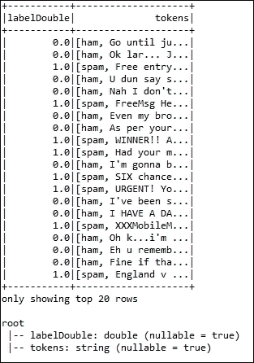
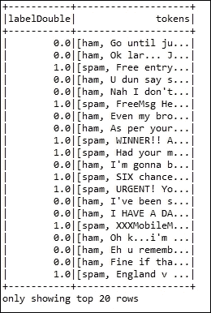
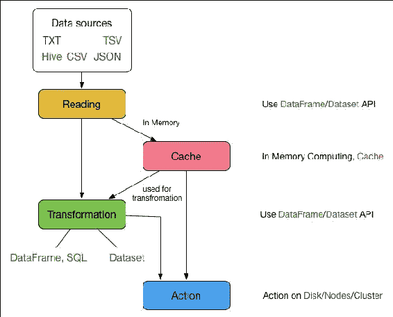

# 三、通过理解数据来理解问题

本章将详细介绍数据框架、数据集和**弹性分布式数据集** ( **RDD** )应用编程接口，用于处理结构化数据目标，以提供对可用数据的机器学习问题的基本理解。在本章的最后，您将能够轻松地将基础应用于复杂的数据操作。将使用 RDD、数据框架和基于数据集的数据操作与 Spark 中的基本抽象进行一些比较，以显示在编程和性能方面的两种改进。此外，我们将引导您走上正确的道路，以便您能够使用 Spark 将 RDD 或数据对象保存在内存中，从而在后期的并行操作中有效地重用它。简而言之，本章将涵盖以下主题:

*   分析和准备您的数据
*   弹性分布式数据集(RDD)基础
*   数据集基础
*   来自字符串和类型化类的数据集
*   Spark 和数据科学家，工作流程
*   深入 Spark

# 分析和准备您的数据

在实践中，有几个因素会影响给定任务上的**机器学习** ( **ML** )应用的成功。因此，实验数据集的表示和质量首先被认为是第一类实体。拥有更好的数据总是明智的。例如，不相关和冗余的数据、具有空值的数据特征或有噪声的数据导致不可靠的信息源。数据集的不良属性使得机器学习模型训练阶段的知识发现过程更加繁琐和耗时。

因此，数据预处理将在整个 ML 工作流步骤中贡献大量的计算时间。正如我们在上一章所述，除非你知道你的可用数据，否则很难理解问题本身。此外，了解数据将有助于你阐明你的问题。与此同时，更重要的是，在尝试将 ML 算法应用于某个问题之前，首先您必须确定该问题是否真的是机器学习问题，以及 ML 算法是否可以直接应用于解决该问题。你需要做的下一步是了解机器学习课程。从技术上来说，你需要知道一个识别出的问题是否属于分类、聚类、规则收回或回归类。

为了简单起见，我们假设您有一个机器学习问题。现在，您需要进行一些数据预处理，包括数据清理、规范化、转换、特征提取和选择等步骤。数据预处理工作流步骤的产物是最终的训练集，通常用于构建/训练 ML 模型。

在前一章中，我们还讨论了机器学习算法在模型构建和反馈过程中从数据和活动中学习。对于您想要解决的问题，为您的算法提供正确的数据至关重要。即使您有好的数据(或者更准确地说，结构良好的数据)，您也需要确保数据处于适当的规模，使用编程语言解析的众所周知的格式，最重要的是，是否还包括最有意义的特性。

在本节中，您将学习如何准备您的数据，以便您的机器学习算法自动达到最佳性能。整体数据处理是一个巨大的课题；然而，我们将尝试在 *[第 6 章](06.html#1ENBI2-0b803698e2de424b8aa3c56ad52b005d "Chapter 6.  Building Scalable Machine Learning Pipelines")**构建可扩展的机器学习管道*中涵盖制作一些大规模机器学习应用的基本技术。

## 数据准备流程

如果您在数据处理和准备步骤中更加专注和自律，您很可能会在第一时间获得更一致和更好的结果。然而，数据准备是一个由几个步骤组成的繁琐过程。然而，为机器学习算法准备数据的过程可以总结为三个步骤:

*   数据选择
*   数据预处理
*   数据转换

### 数据选择

这一步将着重于选择您将在机器学习应用开发和部署中使用和处理的所有可用数据集的子集。人们总是强烈要求在机器学习应用开发中包含所有可用的数据，因为更多的数据将提供更多的功能。换句话说，持众所周知的格言，*越多越好*。然而，本质上，这可能不是所有情况下都是如此。在你真正回答这个问题之前，你需要考虑你需要有什么数据。最终目标是提供一个特定假设的解决方案。首先，您可能也在对数据做一些假设。虽然这很难，但是如果你是这个问题的领域专家，你可以做一些假设，在应用你的 ML 算法之前至少了解一些见解。但是，请注意记录这些假设，以便您可以在以后需要时测试它们。我们将提出一些常见问题，帮助您思考数据选择过程:

*   第一个问题是，*你现有的数据有多少？*例如，范围可以是整个时间、数据库表、连接的系统文件等等。因此，更好的做法是确保您对所有可以使用的东西都有清晰的理解和低级结构，或者非正式地持有可用的资源(当然也包括可用的数据和计算资源)。
*   第二个问题有点诡异！*哪些数据尚不可用，但对解决问题很重要？*在这种情况下，您可能必须等待数据可用，或者您至少可以使用一些生成器或软件生成或模拟这些类型的数据。
*   第三个问题可能是:*解决问题不需要哪些数据？*这再次意味着冗余，因此排除这些冗余或不需要的数据几乎总是比完全包含它更容易。你可能想知道是否要记下你排除的数据，为什么？我们认为应该是肯定的，因为您可能在后期需要一些琐碎的数据。

而且，在实践中这种情况下小问题或者小游戏，玩具比赛的数据早就已经会为你选好了；因此，你根本不需要担心！

### 数据预处理

选择要使用的数据后，您需要考虑如何使用数据以及所需的正确利用率。这个预处理步骤将解决一些步骤或技术，用于将所选数据转换成一个表单，以便在模型构建和验证步骤中使用和应用。使用的三个最常见的数据预处理步骤是格式化、清理和数据采样:

*   **格式化**:所选数据的形状可能不太好，因此可能不适合您直接使用。通常，您的数据可能是原始数据格式(平面文件格式，如文本格式或较少使用的专有格式)，如果您足够幸运，那么数据可能在关系数据库中。如果是这种情况，那么最好应用一些转换步骤(例如，将关系数据库转换为它的格式，因为使用 Spark 您不能进行任何转换)。如前所述，Spark 的优势在于它支持多种文件格式。因此，我们将能够在以下几节中利用这一点。
*   **清理**:通常情况下，您将使用的数据会附带许多不需要的记录，或者有时会缺少记录条目。这个清理过程处理丢失数据的删除或修复。可能总有一些微不足道或不完整的数据对象，解决它们应该是第一要务。因此，可能需要从数据集中删除、忽略或删除这些实例来解决这个问题。此外，如果隐私或安全是一个问题，因为针对某些属性的敏感信息的存在，这些属性需要匿名化或从数据中完全删除(如果合适的话)。
*   **采样**:第三步是对格式化和清理后的数据集进行采样。通常需要采样，因为有时可用数据量很大，或者记录数量很大。然而，我们主张尽可能多地使用数据。另一个原因是，在整个机器学习过程中，更多的数据会导致更长的执行时间。如果是这种情况，这也会增加算法的运行时间，并且需要更强大的计算基础设施。因此，在考虑整个数据集之前，您可以对所选数据取一个较小的代表性样本，这对于探索和原型化机器学习解决方案来说可能要快得多。很明显，无论您为机器学习应用开发和商业化申请了什么样的机器学习工具，数据都会影响您需要执行的预处理。

### 数据转换

在选择合适的数据源并对这些数据进行预处理之后，最后一步是对处理后的数据进行转换。在这一步中，您的特定 ML 算法和问题领域的知识将受到影响。三种常见的数据转换技术是缩放属性、分解和属性聚合。这一步骤通常也称为特征工程，将在下一章中详细讨论:

*   **标度**:预处理后的数据可能包含各种数量和单位的混合标度的属性，例如美元、千克和销量。然而，机器学习方法具有相同尺度内的数据属性，例如给定特征的最小和最大值在 0 和 1 之间。因此，请考虑对已处理数据执行适当缩放所需的任何要素缩放。
*   **分解**:数据可能具有一些特征，这些特征代表了一个复杂的概念，当您将数据集分割成基本部分时，机器学习算法会提供更强大的响应。例如，假设一天由 24 小时、1，440 分钟和 86，400 秒组成，这些时间又可以进一步分割。可能某个特定的时间或一天中只有几个小时与要调查和解决的问题相关。因此，考虑适当的特征提取和选择，以对处理后的数据进行适当的分解。
*   **聚集**:通常分离或分散的特征在它们的。但是，这些功能可以聚合成一个对您试图解决的问题更有意义的功能。例如，每次客户登录一个在线购物网站时，该网站上会显示几个数据实例。通过丢弃额外的实例，这些数据对象可以聚合成登录次数的计数。因此，请考虑适当的要素聚合来正确处理数据。

Apache Spark 的分布式数据结构包括 RDD、数据框架和数据集，通过这些数据结构，您可以高效地执行数据预处理。这些数据结构在处理数据方面具有不同的优势和性能。在接下来的部分中，我们将分别描述这些数据结构，并展示如何使用它们处理大型数据集的示例。

# 弹性分布式数据集基础

在[第 1 章](01.html#DB7S2-0b803698e2de424b8aa3c56ad52b005d "Chapter 1. Introduction to Data Analytics with Spark")、*用 Spark* 介绍数据分析时，我们已经简单描述了弹性分布式数据集，包括数据转换和动作以及缓存机制。我们还指出，rdd 基本上是一个不可变的记录集合，只能通过映射、筛选、分组等操作来创建。在本章中，我们将使用 Spark 的本机数据结构进行数据操作和数据预处理，用于通常称为垃圾邮件过滤的实际机器学习应用。Spark 提供了另外两个更高标签的 API，如用于数据操作的 DataFrame 和 Datasets。

然而，我们将在这里显示包括 RDD 在内的所有 API，因为您可能需要这个 API 来处理更复杂的数据操作。我们参考了 Spark 编程指南中关于 Spark 动作和操作的一些常用定义。

正如我们已经讨论过的使用动作和转换的 RDD 操作的一些基础。rdd 可以通过稳定的存储(如 **Hadoop 分布式文件系统** ( **HDFS** )和现有 rdd 上的转换来创建。Spark 定期记录这些转换，同时通过一组转换而不是实际数据创建关系数据库，因此，从技术上讲，原始 RDD 和数据集不会发生变化。

可以从现有数据集创建转换后的数据集；然而，在 Spark 中不可能出现相反的情况。在数据集上完成计算后，操作会向驱动程序返回一个值。例如，根据 Spark 编程准则，映射是一种转换，它使用一个函数传递每个 Dataset 元素，并返回一个代表和保存结果的全新 RDD。相比之下，reduce 也是一个动作，它通过使用一个函数聚合 RDD 的所有元素，并将一个全新的 RDD 作为最终结果返回给驱动程序。

从技术上讲，假设我们有一个文本文件，其中包含一系列用逗号分隔的数字(即 CSV 文件)。现在读完同样的内容，你会得到一个 RDD，因此，你可能需要计算每个数字的频率。为此，您需要将 RDD 转换为键值对，其中键是数字，值是每个数字的频率。

另一方面，您可能需要通过执行一些操作来收集驱动程序中的结果。在接下来的几节中，我们将通过展示一些基于实际机器学习问题的例子来提供一些有用主题的更多细节，例如转换和动作。

## 读取数据集

为了从不同的数据源(如本地文件系统、HDFS、卡珊德拉、糖化血红蛋白等)读取数据集，Spark 提供了不同的易于使用的 API。它支持不同的数据表示，包括文本文件、序列文件、Hadoop 输入格式、CSV、TSV、TXT、MD、JSON 等数据格式。输入应用编程接口或方法支持在压缩文件、目录和通配符上运行。例如，*表 1* 列出了阅读格式。`textFile()`方法从目录`/my/directory:`中读取不同的文件格式，如`.txt`和`.gz`

<colgroup class="calibre11"><col class="calibre12"></colgroup> 
| textFile("/my/directory ")，textFile("/my/directory/*。txt ")，textFile("/my/directory/*。gz”)。 |

表 1:读取文件格式

### 读取文件

您可能需要从本地或 HDFS 读取数据集。以下代码显示了从存储在本地计算机或 HDFS 的给定数据集创建关系数据库的不同方法。

但是，在使用 Spark 读写之前，我们需要通过 Spark 会话创建 Spark 入口点，该会话可以实例化如下:

```scala
static SparkSession spark = SparkSession 
      .builder() 
      .appName("JavaLDAExample") 
      .master("local[*]") 
      .config("spark.sql.warehouse.dir", "E:/Exp/") 
      .getOrCreate(); 

```

这里，Spark SQL 仓库被设置为`E:/Exp/`路径。您应该根据您使用的操作系统类型相应地设置您的路径。好了，现在我们有了我们的 Spark 会话作为变量`spark`，让我们看看如何轻松地使用它来读取文本文件。

#### 从文本文件中读取

它使用`SparkContext()`的`textFile()`方法，并返回包含一组行的字符串的 RDD。在[第 1 章](01.html#DB7S2-0b803698e2de424b8aa3c56ad52b005d "Chapter 1. Introduction to Data Analytics with Spark")、*使用 Spark* 介绍数据分析时，我们解释了什么是 SparkContext。然而，Spark 上下文是 Spark 应用的入口点。假设我们有一个名为`1.txt`的数据集，其中包含一些作为非结构化文本的推文数据。您可以从 Packt 材料下载数据并存储在`project_path/input/test/`目录下，定义如下:

```scala
String csvFile = "input/test/1.txt"; 
RDD<String> distFile = spark.sparkContext().textFile(csvFile, 2); 

```

这里我们已经创建了一个字符串的 RDDs，它与变量`distFile`一起存储在两个分区中。然而，要使用 Java，RDD 必须转换成 JavaRDD。让我们通过调用`toJavaRDD()`方法来实现，如下所示:

```scala
JavaRDD<String> distFile2 = distFile.toJavaRDD(); 

```

#### 从一个目录中读取多个文本文件

它将以(文件名和内容)对的形式返回 RDD。假设我们在目录`csvFiles/`中存储了多个要读取的文件，定义如下:

```scala
RDD<Tuple2<String, String>> distFile = spark.sparkContext().wholeTextFiles("csvFiles/*.txt", 2); 
JavaRDD<Tuple2<String, String>> distFile2 = distFile.toJavaRDD(); 

```

请注意，当 RDD 中的数据对象不在主内存或硬盘中时，我们需要在 RDD 上执行分区以增加并行度。

### 阅读现有收藏

创建 RDD 的第二个来源是驱动程序的集合，比如包含整数的列表 a。在深入研究之前，让我们用另一种方式初始化 Spark，如下所示:

```scala
SparkConf conf = new SparkConf().setAppName("SampleAppliation").setMaster("local[*]"); 
JavaSparkContext sc = new JavaSparkContext(conf); 

```

这里，Java Spark 上下文可以作为变量`sc`使用。这一次，我们已经创建了 Spark 上下文，因此我们将能够在不使用`toJavaRDD()`方法的情况下创建字符串的 Java RDDs。

现在，您可以通过使用 Spark Context 的并行化方法来实现，如下所示:

*   **读取整数列表**:返回一个并行的整数 RDD:

    ```scala
          List<Integer> list = Arrays.asList(1,2,3,4,5); 
          JavaRDD<Integer> rdd = sc.parallelize(list); 

    ```

*   **读取配对列表**:返回配对列表的并行`pairRDD`(整数，字符串):

    ```scala
          List<Tuple2<Integer, String>> pairs = Arrays.asList( 
                    new Tuple2<>(1, "Hello"), 
                    new Tuple2<>(2, "World"), 
                    new Tuple2<>(3, "How are you?")); 
          JavaPairRDD<Integer, String> pairRDD = sc.parallelizePairs(pairs); 

    ```

## RDD 预处理

为了继续我们在前一节开始的关于数据预处理的讨论，我们将在这一节展示一个机器学习问题的例子以及如何使用 RDD 预处理数据集。

我们正在考虑**垃圾邮件过滤器**应用，它是 s 监督学习问题的一个流行示例。问题是从收到的邮件中预测和识别垃圾邮件(请参考*表 2* )。像往常一样，为了训练模型，您必须使用历史数据(您在一个偶数年的几天、几小时或几个月内收到的历史电子邮件)来训练模型。预处理任务的最终输出是制作特征向量或提取特征，包括其标签或类别。通常，您可能会执行以下步骤:

*   **停止单词移除**:文本文件可能包含一些对特征向量无用或冗余的单词，例如*和*、*的*和的*，因为这些在所有形式的英语句子中都很常见。另一个原因是它们在决定垃圾邮件或火腿状态时没有太大的意义，或者它们可能包含微不足道的意义。因此，在进行下一步之前，需要从电子邮件数据集中过滤掉这些单词。*
*   **Lemmatization**: Some words possessing the same meaning but with different endings, need to be readjusted in order to make them consistent across the data set and if they all carry the same form will be easier to make them transform into feature vectors. For example, *attached*, *attachment*, and *attach* could all be represented and later on interpreted as e-mail *attachments*. The `SMSSpamCollection` Dataset was downloaded from the UCI ML repositories at [https://archive.ics.uci.edu/ml/machine-learning-databases/00228/](https://archive.ics.uci.edu/ml/machine-learning-databases/00228/).

    请注意，在这个阶段，为了简单起见，电子邮件正文中的所有单词通常都会转换为小写。现在，让我们看看下表:

    <colgroup class="calibre11"><col class="calibre12"></colgroup> 
    | 哈姆:你在做什么？你好吗？汉:好的，家-我...。国王夫人 u oni。哈姆:不要这么早说...加州大学已经那么说了。哈姆:我在卢顿的号码是 0125698789，如果你在，给我打电话！H*垃圾邮件:FreeMsg: Txt: CALL to No: 86888 &立即申领您的 3 小时通话时间奖励，从您的手机使用！ubscribe6 GBP/mnth Inc 3 小时 16 停？txtStop 哈姆:湿婆在宿舍啊哈。哈姆:因为我和达伦出去购物了，所以我打电话给他，问他想要什么礼物。然后他开始猜我的妻子是谁，最后他猜对了达伦·勒。垃圾邮件:阳光小测验！如果你能说出澳大利亚的首都，赢得一台超级索尼影碟机？文本 MQUIZ 到 82277。B |

    表 2:包含火腿和垃圾邮件的训练集的测试文件

*   **Removal of non-words**: Numbers and punctuation have to be removed too. However, we will not show here all the possible transformation for pre-processing data due to page limitation and brevity, but we will try to show some basic transformations and actions for pre-processing segment of the Dataset that contains some labels data as spam or ham presented in *Table 2*. Where the Dataset or e-mails are labelled as ham or spam followed by the message or e-mails. Ham means non-spam and spams are identified as junk emails messages.

    使用 RDD 的整体预处理可以使用以下步骤来描述。我们需要的第一步是使用 RDD 运算和变换准备特征向量。其余步骤如下:

*   **Reading Dataset**: The following code is for reading Dataset that creates a `linesRDD` of strings from the `SMSSpamCollection` Dataset. Please download this Dataset from the Packt materials and store it in your disk or HDFS in  `Project+path/input/` directory. A detailed description of this Dataset will be provided later on:

    ```scala
          String filePath = "input/SMSSpamCollection.txt"; 
          JavaRDD<String> linesRDD = sc.textFile(filePath); 

    ```

    然而，`linesRDD`既包含垃圾邮件，也包含 ham 消息。因此，我们需要从文件中分离垃圾邮件和 ham 消息。

*   **过滤掉垃圾邮件**:为了从现有的关系数据库中过滤数据，Spark 提供了一个名为`filter()`的方法，该方法返回一个只包含所选元素的新数据集。在下面的代码中，您可以看到我们已经传递了`new Function()`作为参数，该参数接受了两个类型为字符串和布尔的参数`filter()`方法。基本上，Spark APIs 非常依赖将函数传递给驱动程序，以便在集群上运行。创建函数有两种方法，包括:

    ```scala
          JavaRDD<String> spamRDD = linesRDD.filter(new Function<String,   
            Boolean>() { 
            @Override 
            public Boolean call(String line) throws Exception { 
              return line.split("\t")[0].equals("spam");}}); 

    ```

    *   实现函数接口要么创建匿名内部类，要么命名一个内部类，并将其实例传递给 Spark
    *   使用 lambda 表达式(您必须安装 Java 8 才能利用 lambda 表达式)
    *   我们使用的以下代码段解释了匿名类的概念，它是一个包含`call()`方法的参数，如果该行包含单词`spam`，该方法将返回`true`:
*   过滤掉 ham 消息:同样，我们可以过滤掉 ham 消息，如下所示:

    ```scala
          JavaRDD<String> hamRDD = linesRDD.filter(new Function<String,  
           Boolean>() { 
           @Override 
           public Boolean call(String line) throws Exception { 
             return line.split("\t")[0].equals("ham"); 
            } 
         }); 

    ```

*   **Split the words from the lines**: To extract the features and labels from each line, we need to split those using space or tab characters. After that, we can have the lines without the spam or ham words.

    下面的代码段显示了垃圾邮件和火腿特征与行的分离。我们使用了`map`变换，通过函数`call`传递现有 RDD 的每一行，返回一个新的 RDD。这里`call`方法总是返回一个单一的项目。你会发现与后面章节的`flatMap`有所不同:

    ```scala
          JavaRDD<String> spam = spamRDD.map(new Function<String, String>() { 
            @Override 
            public String call(String line) throws Exception {       
             return line.split("\t")[1]; 
            } 
         }); 

    ```

输出:`ham.collect()`:


图 1:垃圾邮件 RDD 的快照

```scala
      JavaRDD<String> ham = hamRDD.map(new Function<String, String>() { 
        @Override 
        public String call(String line) throws Exception {     
          return line.split("\t")[1]; 
      } 
      }); 

```

输出:`ham.collect()`:


图 2:火腿 RDD 的快照

*   **从垃圾邮件 RDD** 的行中拆分单词:在我们分别获得针对垃圾邮件和火腿 RDDs 的特征行后，我们必须拆分单词，以便将来制作特征向量。下面的代码通过返回单词列表 RDD 用空格进行分割。call 方法返回每行的单词列表:

```scala
      JavaRDD<ArrayList<String>> spamWordList = spam.map(new  
        Function<String, ArrayList<String>>() { 
          @Override 
      public ArrayList<String> call(String line) throws Exception{ 
            ArrayList<String> words = new ArrayList<>(); 
            words.addAll(Arrays.asList(line.split(" "))); 
            return words; 
          }}); 
      JavaRDD<ArrayList<String>> hamWordList = ham.map(new Function<String,  
        ArrayList<String>>() { 
          @Override 
      public ArrayList<String> call(String line) throws Exception{   
            ArrayList<String> words = new ArrayList<>(); 
            words.addAll(Arrays.asList(line.split(" "))); 
            return words;} 
      }); 

```

*   **制作标签和特征对 RDD** :现在我们有了两个垃圾邮件和火腿的 RDD。我们想分别用 1.0 或 0.0 来标记垃圾邮件和垃圾单词或特征。为了便于使用，我们可以再次为每一行创建一个新的包含 RDD 元组的标签和特征或单词列表。在下面的代码中，我们使用`Tuple2`来配对。您也可以使用`JavaPairRDD`制作一对标签和特征:

    ```scala
          JavaRDD<Tuple2<Double, ArrayList<String>>> spamWordsLabelPair =  
          spamWordList.map(new Function<ArrayList<String>, Tuple2<Double,  
              ArrayList<String>>>() { 
              @Override 
                public Tuple2<Double, ArrayList<String>> call( 
                ArrayList<String> v1) throws Exception {     
                return new Tuple2<Double, ArrayList<String>>(1.0, v1); 
              }}); 
          JavaRDD<Tuple2<Double, ArrayList<String>>> hamWordsLabelPair =  
          hamWordList.map(new Function<ArrayList<String>, Tuple2<Double,  
              ArrayList<String>>>() { 
              @Override 
              public Tuple2<Double, ArrayList<String>> call( 
                ArrayList<String> v1) throws Exception {     
                return new Tuple2<Double, ArrayList<String>>(0.0, v1); 
              }}); 

          [Output: print spamWordsLabelPair2.collect() using for loop] 
          1.0: [FreeMsg:, Txt:, CALL, to, No:, 86888, &, claim, your, reward, 
          of, 3, hours, talk, time, to, use, from, your, phone, now!, 
          ubscribe6GBP/, mnth, inc, 3hrs, 16, stop?txtStop] 
          1.0: [Sunshine, Quiz!, Win, a, super, Sony, DVD, recorder,
          if, you, canname, the, capital, of, Australia?, Text, MQUIZ, 
          to, 82277., B] 

    ```

*   **两个 RDD 的结合**:现在我们在*表 2* 中有了数据集的两个标签，垃圾邮件和火腿的特征对 RDD。现在，为了制作训练数据集，我们可以将这两个关系数据库连接成一个。Spark 有一个`union()`方法可以返回一个新的 RDD，包含数据集和参数或另一个数据集的并集:

    ```scala
          JavaRDD<Tuple2<Double, ArrayList<String>>> train_set =  
          spamWordsLabelPair.union(hamWordsLabelPair); 

    ```

*   计算前面操作的所有行，称为转换。这将在每种情况下从工作节点中的现有数据集返回一个新数据集。如果您想在驱动程序中返回或打印结果，这将被称为操作操作。Spark 支持几种内置方法作为动作。`count()`方法计算数据集中的元素数量:

    ```scala
          System.out.println(train_set.count()); 
          The following output is 8

    ```

*   **Printing the RDD**: The `collect()` and `take()` are also action method that are used to print or collect the Dataset as an array in the driver program, where, `take()` takes an argument of, say *n* that returns the first n elements of that Dataset. The following code segments print the first 10 elements or tuples out of the train set:

    ```scala
          for (Tuple2<Double, ArrayList<String>> tt : train_set.collect()) { 
              System.out.println(tt._1 + ": " + tt._2.toString()); } 

    ```

    输出如下:

    ```scala
          1.0: [FreeMsg:, Txt:, CALL, to, No:, 86888,
           &, claim, your, reward, of, 3, hours, talk, time, to, use, from,
           your, phone, now!, ubscribe6GBP/, mnth, inc, 3hrs, 16, stop?txtStop] 
          1.0: [Sunshine, Quiz!, Win, a, super, Sony, DVD, recorder, if, 
          you, canname, the, capital, of, Australia?, Text, MQUIZ, 
          to, 82277., B] 
          0.0: [What, you, doing?, how, are, you?] 
          0.0: [Ok, lar..., Joking, wif, u, oni...] 
          0.0: [dun, say, so, early, hor..., U, c, already, then, say...] 
          0.0: [MY, NO., IN, LUTON, 0125698789, RING, ME, IF, UR, AROUND!, H*] 
          0.0: [Siva, is, in, hostel, aha:-.] 
          0.0: [Cos, i, was, out, shopping, wif, darren, jus, now,
           n, i, called, 
          him, 2, ask, wat, present, he, wan, lor., Then, he, 
          started, guessing, 
          who, i, was, wif, n, he, finally, guessed, darren, lor.] 

    ```

*   **将结果保存在本地文件系统中**:有时您可能需要将文件系统中的 RDD 保存为文本。您可以使用以下代码直接保存您的 RDDs:

    ```scala
          train_set.saveAsTextFile("output.txt"); 

    ```

### 从 SMSSpamCollection 数据集获得洞察力

以下源代码显示了基本的 ham 和垃圾邮件统计信息:

```scala
String path = "input/SMSSpamCollection.txt";     
RDD<String> lines = spark.sparkContext().textFile(path, 2); 
System.out.println(lines.take(10)); 

JavaRDD<Row> rowRDD = lines.toJavaRDD().map( new Function<String, Row>() { 
    public Row call(String line) throws Exception { 
      return RowFactory.create(line); 
      }}); 
System.out.println(rowRDD.collect()); 
List<StructField> fields = new ArrayList<StructField>(); 
fields.add(DataTypes.createStructField("line", DataTypes.StringType, true)); 
org.apache.spark.sql.types.StructType schema = DataTypes.createStructType(fields); 
Dataset<Row> df = spark.sqlContext().createDataFrame(rowRDD, schema); 
df.select("line").show(); 
Dataset<Row> spam = df.filter(df.col("line").like("%spam%")); 
Dataset<Row> ham = df.filter(df.col("line").like("%ham%")); 
System.out.println(spam.count()); 
System.out.println(ham.count()); 
spam.show(); 

```

上述代码生成以下垃圾邮件和垃圾邮件计数:

```scala
747 
4831 

```

这意味着在 5578 封电子邮件中`747`封是垃圾邮件，`4,831`封被标记为火腿或非垃圾邮件。换句话说，垃圾邮件和火腿的比例分别为 13.40%和 86.6%。

## 使用键/值对

本小节描述了数据分析中经常需要的键/值对，尤其是在文本处理中。

### map opair()

该方法将返回(K，V)对的数据集，其中 K 是键，V 是值。例如，如果您有一个包含整数列表的 RDD，那么您想要计算列表中重复条目的数量，那么第一个任务是将每个数字映射为 1。之后你可以对它进行缩小操作。代码生成如下所示的输出和缓存:

```scala
JavaRDD<Integer> rdd = sc.parallelize(Arrays.asList(1,2,1,3,4,5)); 
JavaPairRDD<Integer, Integer> pairs = rdd.mapToPair( 
  new PairFunction<Integer, Integer, Integer>() { 
    @Override 
    public Tuple2<Integer, Integer> call(Integer x) { 
      return new Tuple2<>(x, 1); 
    } 
}).cache(); 

[Output: pairs.collect()] 
[(1,1), (2,1), (1,1), (3,1), (4,1), (5,1)] 

```

## 更多关于转化

在本节中，您可以看到更多关于转换的内容，包括相似类型方法之间的一些差异。本节主要讨论`map`和`flatMap`、`groupByKey`、`reduceByKey`和`aggregateByKey`、`sortByKey`和`sortBy`。然而，感兴趣的读者可以参考[2]中的 RDD 操作的 Spark 编程指南。

### 地图和平面图

`flatMap`类似于我们在前面例子中展示的映射，但是每个输入项或每次调用匿名类的`call()`方法都可以映射到零个或多个输出项。因此，`call()`函数返回一个序列，而不是像地图一样的一个项目。例如，对于跟随 RDD 的输入，输出应该如下:

```scala
JavaRDD<String> rdd = sc.parallelize(Arrays.asList("Hello World!", 
  "How are you.")); 
JavaRDD<String> words = rdd 
  .flatMap(new FlatMapFunction<String, String>() { 
    @Override 
    public Iterable<String> call(String t) throws Exception { 
      return Arrays.asList(t.split(" ")); 
    }}); 

[output: words.collect()] 
[Hello, World!, How, are, you.] 

```

对于前面的例子，您不能执行映射操作，因为映射的`call()`方法只返回一个对象，而不是一系列对象。

### groupByKey、reduceByKey 和 aggregateByKey

为了在预处理数据集时执行一些操作，您可能需要根据键值进行一些聚合，例如求和和求平均值。Spark 提供了一些进行这类操作的方法。假设，您有以下几对 RDD，您希望基于键对值进行分组，并进行一些聚合:

```scala
JavaPairRDD<Integer, Integer> rdd_from_integer = sc 
.parallelizePairs(Arrays.asList( new Tuple2<>(1, 1),  
new Tuple2<>(1, 1), new Tuple2<>(3, 2), 
new Tuple2<>(5, 1), new Tuple2<>(5, 3)), 2);  

```

你想做的聚合可以通过 Spark 的三种方法完成，包括`groupByKey`、`reduceByKey`、`aggregateByKey`。但是它们在性能、效率和执行操作的灵活性方面有所不同，例如计数、计算汇总统计数据、从数据集中找到唯一的元素等等。`groupByKey`方法返回(k，`Iterable<v>`)对的数据集，其中 k 是键，`Iterable<v>`是键 k 的值序列。使用该方法的前一个数据集的输出如下所示，它显示了每个键的集合值:

```scala
[Output: pairs.groupByKey(2).collect() ] 

```


图 3:使用 groupBykey 的配对

为了使每个唯一键的值之和最小，`groupByKey`在性能方面是低效的，因为它没有组合执行映射侧。你必须做更多的转换来明确地做这个求和。因此，它增加了网络输入/输出和洗牌的规模。通过`reduceByKey`或`aggregateByKey`可以获得更好的性能，因为它们执行地图侧组合。

这些方法返回包含每个键聚合结果的数据集，例如每个键的值的总和。下面的代码显示了这些方法的操作，这些方法返回(k，v)对的数据集，其中键的值(v)由给定的函数聚合。

`reduceByKey`取一个减少每个键的值的函数，而`aggregateByKey`取两个函数，其中第一个函数用于指定聚合将如何在每个分区内发生，第二个函数用于指定聚合将如何在分区之间发生:

*   代码:`reduceByKey()` :

    ```scala
          JavaPairRDD<Integer, Integer> counts = rdd 
            .reduceByKey(new Function2<Integer, Integer, Integer>() { 
              @Override 
              public Integer call(Integer a, Integer b) { 
                return a + b;}}); 

    ```

*   代码:`aggregateByKey()` :

    ```scala
          JavaPairRDD<Integer, Integer> counts = pairs.aggregateByKey(0, 
              new Function2<Integer, Integer, Integer>() { 
                @Override 
                public Integer call(Integer v1, Integer v2) { 
                  return v1 + v2; 
                } 
                }, new Function2<Integer, Integer, Integer>() { 
                @Override 
                public Integer call(Integer v1, Integer v2) { 
                      return v1 + v2; 
                    } 
                  }); 

    ```

对于这两种情况，输出如下所示:

输出:`counts.collect()`:


图 4: RDD 使用计数

### 排序键和排序方式

排序是数据预处理中常见的操作。Spark 提供了两种方法，将一个数据集转换为另一个包含`sortByKey`和`sortBy`的排序成对数据集。例如，我们有一个数据集，如下所示:

```scala
List<Tuple2<Integer, Integer>> pairs = new ArrayList<>(); 
pairs.add(new Tuple2<>(1, 5)); 
pairs.add(new Tuple2<>(4, 2)); 
pairs.add(new Tuple2<>(-1, 1)); 
pairs.add(new Tuple2<>(1, 1)); 

```

`sortByKey()`方法对(k，v)对执行，并以升序或降序返回按键排序的(k，v)对。您也可以通过提供一个比较器作为参数来自定义排序。下面的代码显示了前面数据集的关键字排序:

*   代码:`sortByKey()`:

```scala
      JavaPairRDD<Integer, Integer> rdd = sc.parallelizePairs(pairs); 
      JavaPairRDD<Integer, Integer> sortedRDD=rdd.sortByKey(Collections.
      <Integer> reverseOrder(), false); 
      [Output: sortedRDD.collect()] 

```


图 5:使用排序键的配对

`sortBy()`方法将函数作为参数，您可以通过键或值来指定排序方法。下面的代码显示了根据前面数据集的值进行的排序:

*   代码:`sortBy()`:

```scala
      JavaRDD<Tuple2<Integer, Integer>> rdd_new = sc.parallelize(pairs); 
      JavaRDD<Tuple2<Integer, Integer>> sortedRDD=rdd.sortBy( 
      new Function<Tuple2<Integer, Integer>, Integer>() { 
      @Override 
          public Integer call(Tuple2<Integer, Integer> t) { 
              return t._2(); 
          } 
      ,} true, 2);
```

输出:`sortedRDD.collect()`:


图 6:使用排序方式的配对

# 数据集基础

正如[第 1 章](01.html#DB7S2-0b803698e2de424b8aa3c56ad52b005d "Chapter 1. Introduction to Data Analytics with Spark")、*Spark 数据分析简介*中所讨论的，在 Spark 2.0.0 版本中，数据框架仍然是 Scala、Python 和 R 的主要计算抽象，然而，在使用 Java 时，同样的东西将被数据集所取代。因此，行类型的数据集将在本书中使用。

数据集是由行构成的分布式数据集合。这是这是与 Spark SQL 模块交互的更方便的方式之一。

换句话说，它可以被认为是类似于**关系数据库** ( **RDB** )格式的表格数据的等效实体..与数据框和 RDD 等其他数据抽象一样，数据集也可以从各种数据源创建，如结构化数据文件(TSV、CSV、JSON 和 TXT)、配置单元表、辅助存储、外部数据库或现有的关系数据库和数据框。然而，在 Spark 2.0.0 版本中，基于 Java 的计算不支持数据框，但是您正在使用 Python、Scala 或 R 开发您的应用，您仍然可以使用数据框。

在接下来的几节中，您将找到使用数据集的操作和动作，以及如何从不同的源创建数据集。

## 读取数据集以创建数据集

如上所述，数据集是从 Spark 1.5.0 版本引入的 Spark SQL 模块的一个组件。因此，所有功能的所有入口点都是从 Spark `SQLContext`的初始化开始的。基本上，Spark SQL 用于执行作为基本 SQL 语法或 HiveQL 编写的 SQL 查询。

在另一种编程语言中运行 SQL 时，数据集对象将返回。以下代码段将初始化 Spark 上下文中的`SQLContext`。另一方面，您可能需要初始化`HiveContext`，以便从配置单元中读取数据集。您还可以创建一个不同的上下文，如`HiveContext`，它提供了`SQLContext`基本功能的超集:

```scala
JavaSparkContext sc = new JavaSparkContext("local","DFDemo"); 
SQLContext sqlContext = new org.apache.spark.sql.SQLContext(sc); 

```

### 从文件中读取

例如，您有一个如这里所示的 JSON 文件。现在，您想使用 SQL 上下文来读取这个文件，它基本上返回一个数据帧，您可以在其中执行所有基本的 SQL 操作和 Spark 的其他 DSL 操作:

```scala
[Input File] 
{"name":"Michael"} 
{"name":"Andy", "age":30} 
{"name":"Justin", "age":19} 
[Code]    
Dataset<Row> df = sqlContext.read().json("people.json");    

[Output: df.show()] 
+----+-------+ 
| age|   name| 
+----+-------+ 
|null|Michael| 
|  30|   Andy| 
|  19| Justin| 
+----+-------+ 

```

### 从蜂巢中阅读

下面的代码与 hive 上下文连接，在 Hive 上下文中创建一个表，并将人员 JSON 文件加载到 hive create 中。数据帧的输出将与上面相同:

```scala
The code is as follows:]hiveContext.sql("CREATE TEMPORARY TABLE people USING  
org.apache.spark.sql.json OPTIONS ( path "people.json" )"); 
Dataset<Row> results = hiveContext.sql("SELECT * FROM people "); 
results.show(); 

```

## 数据集预处理

在前面的章节中，我们已经描述了一个实际的机器学习应用的 RDD 预处理。现在，我们将使用**数据帧** ( **DF** )应用编程接口执行相同的示例。你会发现操纵`SMSSpamCollection`数据集非常容易(参见[http://www.dt.fee.unicamp.br/~tiago/smsspamcollection/](http://www.dt.fee.unicamp.br/~tiago/smsspamcollection/))。我们将通过标记垃圾邮件和火腿邮件来准备一个训练集，从而展示相同的示例:

*   **Reading a Dataset:** You can read that Dataset using the Spark session variable `spark`that we have to initialize before using it. After reading the file as Dataset the output will be a tabular format of a single column. The default name of this column is `value`:

    ```scala
          Dataset<Row> df = spark.read().load("input/SMSSpamCollection.txt"); 
          df.show(); 

    ```

    输出:

    

    图 7:垃圾短信数据集的快照

*   **从现有数据集**创建行 RDD:从前面的输出中，您可以看到一列包含所有行。为了制作标签和要素等两个栏目，我们必须对其进行拆分。因为数据集是不可变的，所以不能修改现有的列或数据集。因此，您必须使用现有数据集创建新数据集。这里，代码将数据集转换为 RDD，即行数据集的集合。行是一个接口，它代表关系运算符的一行输出。您可以使用 Spark:

    ```scala
             JavaRDD<Row> rowRDD = df.toJavaRDD(); 

    ```

    的`RowFactory`类创建一个新行
*   **从现有的行 RDD** 创建新的行 RDD:在拥有行 RDD 之后，您可以执行正常的地图操作，这些操作都包含行数据集，但有两个值。下面的代码对每一行进行拆分，并返回一个新行:

    ```scala
          JavaRDD<Row> splitedRDD = rowRDD.map(new Function<Row, Row>() { 
               @Override 
              public Row call(Row r) throws Exception { 
                String[] split = r.getString(0).split("\t"); 
                return RowFactory.create(split[0],split[1]); 
              }}); 

    ```

*   **Create Dataset from Row RDD**: Now you have Row RDD, which contains two values for each Row. For creating a DF, you have to define the column names or schemas and its data types. There are two methods to define including inferring the schema using reflection and programmatically specify the schema. The methods are as follows:
    *   第一种方法基本上使用 POJO 类，字段名是模式
    *   The 2nd method create list of StruchFields by defining the datatypes and create the structype. For this example, we have used the 2nd method for creating DF from existing row RDD as shown here:

        ```scala
              List<StructField> fields  = new ArrayList<>(); 
              fields.add(DataTypes.createStructField("labelString", 
              DataTypes.StringType, true)); 
              fields.add(DataTypes.createStructField("featureString",  
              DataTypes.StringType, true)); 
              org.apache.spark.sql.types.StructType schema = DataTypes 
              .createStructType(fields); 
              Dataset<Row> schemaSMSSpamCollection = sqlContext 
              .createDataFrame(splitedRDD, schema); 
              schemaSMSSpamCollection.printSchema(); 
              [Output: schemaSMSSpamCollection.printSchema()] 

        ```

        

        图 8:集合的模式

*   **Adding a new column**: Now that we have the DF of two columns. But we want to add new columns which convert the `labledSting` to `labedDouble` and `featureString` to `featureTokens`. You can do it similarly as previous code. After adding to new fields create new schema. Then create new DF after having normal map transformation in existing DF. The following code gives output of new DF having four columns:

    ```scala
          fields.add(DataTypes.createStructField("labelDouble",  
          DataTypes.DoubleType, true)); 
          fields.add(DataTypes.createStructField("featureTokens",  
          DataTypes.StringType, true)); 
          org.apache.spark.sql.types.StructType schemaUpdated =  
          DataTypes.createStructType(fields); 
          Dataset Row> newColumnsaddedDF = sqlContext 
          .createDataFrame(schemaSMSSpamCollection.javaRDD().map( 
          new Function<Row, Row>() { 
              @Override 
              public Row call(Row row) throws Exception { 
                double label; 
                if(row.getString(0).equalsIgnoreCase("spam")) 
                  label = 1.0; 
                else 
                  label = 0.0; 
                String[] split = row.getString(1).split(" "); 
                ArrayList<String> tokens = new ArrayList<>(); 
                for(String s:split) 
                  tokens.add(s.trim()); 
                return RowFactory.create(row.getString(0), 
           row.getString(1),label, tokens.toString()); 
              }}), schemaUpdated);   
          [Output: newColumnsaddedDF.show()] 

    ```

    

    图 9:添加新列后的数据集

*   **Some Dataset operations**: For data manipulation DF provides domain specific language in Java, Scala and others. You can do select, counting, filter, `groupBy` and so on operations into a DF. The following codes show some operations on the above DF:

    ```scala
          newColumnsaddedDF.select(newColumnsaddedDF.col("labelDouble"),
          newColumnsaddedDF.col("featureTokens")).show(); 

    ```

    

    图 10:显示标签和特征的数据集

    ```scala
          newColumnsaddedDF.filter(newColumnsaddedDF.col
          ("labelDouble").gt(0.0)).show(); 

    ```

    

    图 11:显示标签已被转换为双精度值的数据集

    ```scala
          newColumnsaddedDF.groupBy("labelDouble").count().show(); 

    ```

    

    图 12:显示操作后的数据集统计信息

## 关于数据集操作的更多信息

本节将描述如何在 DF 上使用 SQL 查询以及跨数据集创建数据集的不同方法。本节将主要讨论在数据框架上运行 SQL 查询和从 JavaBean 创建数据框架。然而，感兴趣的读者可以参考[3]中的 SQL 操作的 Spark 编程指南。

### 在数据集上运行 SQL 查询

Spark 的`SQLContext`有`sql`方法，可以让应用运行 SQL 查询。该方法返回一个数据帧作为结果:

*   [`FilternewColumnsAddedDF.createOrReplaceTempView`(`SMSSpamCollection`)]:

    ```scala
          Dataset<Row> spam = spark.sqlContext().sql("SELECT * FROM 
          SMSSpamCollection
          WHERE labelDouble=1.0"); 
          spam.show();  

    ```

    以下是前面代码的输出:

    

    图 13:使用 SQL 查询检索与图 11 相同的结果

*   Count:

    ```scala
          Dataset<Row> counts = sqlContext.sql("SELECT labelDouble, COUNT(*)  
          AS count FROM SMSSpamCollection GROUP BY labelDouble"); 
          counts.show(); 

    ```

    输出:

    

    图 14:显示数据集统计数据

## 从 Java Bean 创建数据集

您可以从 Java Bean 创建数据集；不需要以编程方式定义模式。例如，您可以在以下代码中看到名为 Bean 的**普通旧 Java 对象** ( **POJO** ):

```scala
public class SMSSpamBean implements Serializable { 
  private String labelString; 
  private String featureString; 
public SMSSpamBean(String labelString, String featureString) { 
    super(); 
    this.labelString = labelString; 
    this.featureString = featureString; 
  } 
  public String getLabelString() { 
    return labelString; 
  } 
  public void setLabelString(String labelString) { 
    this.labelString = labelString; 
  } 
  public String getFeatureString() { 
    return featureString; 
  }  public void setFeatureString(String featureString) {    this.featureString = featureString; 
  }}  

```

创建测向:

```scala
JavaRDD<SMSSpamBean> smsSpamBeanRDD =  rowRDD.map(new Function<Row, SMSSpamBean>() { 
      @Override 
    public SMSSpamBean call(Row r) throws Exception { 
        String[] split = r.getString(0).split("\t"); 
        return new SMSSpamBean(split[0],split[1]); 
      }});   
Dataset<Row> SMSSpamDF = spark.sqlContext().createDataFrame(smsSpamBeanRDD, SMSSpamBean.class); 
SMSSpamDF.show();   

```

以下输出如下:


图 15:对应的特征和标签字符串

# 来自字符串和类型化类的数据集

如前所述，数据集是一个类型化的、不可变的对象集合。数据集基本上映射到关系模式。借助数据集抽象，Spark 引入了一个新概念，称为编码器。编码器有助于实体转换，例如 JVM 对象和相应表格表示之间的转换。你会发现这个 API 和 RDDs 转换非常相似，比如`map, mapToPair, flatMap`或者`filter.`

我们将在下一节展示使用数据集应用编程接口的垃圾邮件过滤器示例。它使用读取文本文件，并以表格格式返回数据集。然后像 RDDs 一样执行映射转换，通过添加额外的编码器参数来制作(标签、标记)列。这里，我们使用了`SMSSpamTokenizedBean`类的 bean 编码器。

在本小节中，我们将展示如何从字符串和类型化类`SMSSpamTokenizedBean`创建数据集。让我们首先创建 Spark 会话，如下所示:

```scala
static SparkSession spark = SparkSession.builder() 
      .appName("DatasetDemo") 
      .master("local[*]") 
      .config("spark.sql.warehouse.dir", "E:/Exp/") 
      .getOrCreate(); 

```

现在从表示`Dataset<String>`的`smm`过滤数据集创建一个字符串类型的新数据集，并显示如下结果:

```scala
Dataset<String> ds = spark.read().text("input/SMSSpamCollection.txt").as(org.apache.spark.sql.Encoders.STRING()); 
ds.show(); 

```

下面是前面代码的输出:


图 16:显示了使用数据集的垃圾邮件过滤数据集的快照

现在，让我们通过映射之前创建的字符串数据集，从类型化类`SMSSpamTokenizedBean`创建第二个数据集，如下所示:

```scala
Dataset<SMSSpamTokenizedBean> dsSMSSpam = ds.map( 
new MapFunction<String, SMSSpamTokenizedBean>() { 
          @Override 
public SMSSpamTokenizedBean call(String value) throws Exception { 
      String[] split = value.split("\t"); 
      double label; 
      if(split[0].equalsIgnoreCase("spam")) 
          label = 1.0; 
      else 
          label=0.0; 
ArrayList<String> tokens = new ArrayList<>(); 
  for(String s:split) 
    tokens.add(s.trim());           
      return new SMSSpamTokenizedBean(label, tokens.toString()); 
         } 
}, org.apache.spark.sql.Encoders.bean(SMSSpamTokenizedBean.class)); 

```

现在让我们打印数据集及其模式，如下所示:

```scala
dsSMSSpam.show(); 
dsSMSSpam.printSchema(); 

```

以下输出为:



图 17:显示令牌和标签以及模式的下侧

现在，如果您想要将此类型化数据集转换为类型行，那么您可以使用`toDF()`方法，并且为了在新的`Dataset<Row>`中进一步创建临时视图，您可以轻松使用`createOrReplaceTempView()`方法，如下所示:

```scala
Dataset<Row> df = dsSMSSpam.toDF(); 
df.createOrReplaceTempView("SMSSpamCollection");      

```

类似地，您可能希望通过调用 show `method()`来查看相同的数据集，如下所示:

```scala
df.show(); 

```

输出:



图 18:对应的标签和标记。标签被转换为双精度值

现在我们来探究一下类型化类`SMSSpamTokenizedBean`。该类作为标记文本的 Java 标记化 bean 类工作。从技术上讲，这个类接受输入，然后设置标签，然后获取标签。其次，还设置并获取垃圾邮件过滤的令牌。包括 setter 和方法，这里是类:

```scala
public class SMSSpamTokenizedBean implements Serializable { 
private Double labelDouble; 
private String tokens;     
public SMSSpamTokenizedBean(Double labelDouble, String tokens) { 
  super(); 
  this.labelDouble = labelDouble; 
  this.tokens = tokens; 
  } 
  public Double getLabelDouble() { 
    return labelDouble; 
  } 
  public void setLabelDouble(Double labelDouble) { 
    this.labelDouble = labelDouble; 
  } 
  public String getTokens() { 
    return tokens; 
  } 
  public void setTokens(String tokens) { 
    this.tokens = tokens; 
  }} 

```

## RDD、数据框和数据集的比较

将数据集作为 Spark 的新数据结构有一些目标。虽然 RDD 应用编程接口非常灵活，但有时优化处理更难。另一方面，数据框架应用编程接口非常容易优化，但它缺乏 RDD 的一些好功能。因此，数据集的目标是允许用户轻松地表达对象上的转换，并提供 Spark SQL 执行引擎的优势(性能和健壮性)。

数据集可以在不反序列化对象的情况下执行许多操作，如排序或洗牌。为此，它需要一个显式编码器，用于将对象序列化为二进制格式。它能够将给定对象(Bean)的模式映射到 Spark SQL 类型系统。另一方面，关系数据库是基于运行时反射的序列化，改变数据集对象类型的操作也需要新类型的编码器。

# Spark 和数据科学家工作流程

如上所述，数据科学家的一个共同任务是选择数据，数据预处理(格式化、清理和采样)和数据转换(缩放、分解和聚合)将原始数据转换成可以传递到机器学习模型中以构建模型的格式。随着实验数据集规模的增加，传统的单节点数据库将无法处理这类数据集，因此，您需要切换到像 Spark 这样的大数据处理计算。幸运的是，我们有 Spark 作为一个可扩展的分布式计算系统来配合您的数据集，这是一个很好的选择。



图 19:数据科学家使用 Spark 的工作流程

现在让我们进入正题，作为一名数据科学家，首先你必须阅读不同格式的数据集。然后阅读数据集将为您提供我们已经描述过的关系数据库、数据框架和数据集的概念。您可以将数据集缓存到主内存中；您可以将读取的数据集从数据框架、SQL 或作为数据集进行转换。最后，您将执行一个操作，将数据转储到磁盘、计算节点或集群。我们在这里描述的步骤基本上形成了一个工作流程，您将使用 Spark 进行基本的数据处理，如图 1 所示。

# 深入 Spark

在本节中，我们将向您展示 Spark 的高级功能，包括共享变量(广播变量和累加器)的使用，并将讨论它们的基本概念。但是，我们将在后面的章节中讨论数据分区。

## 共享变量

上下文编程中共享变量的概念并不新鲜。许多函数和并行方法需要使用的变量称为共享变量。Spark 有一些机制来使用或实现共享变量。在 spark 中，函数被传递给一个 spark 操作，就像在远程集群节点上执行 map 或 reduce 一样。代码或函数作为节点上变量的单独副本工作，结果的更新不会传播回驱动程序。然而，Spark 为两种常见的使用模式提供了两种类型的共享变量:广播变量和累加器。

### 广播变量

广播变量提供了将只读变量保存在本地机器上的工具，而不是将副本发送到计算节点或驱动程序。以高效的方式向每个节点提供大型输入数据集的副本。它还降低了通信成本，因为 Spark 使用了高效的广播。可以通过调用`SparkContext.broadcast(v)`从变量`v`创建广播变量。下面的代码显示了这一点:

```scala
Broadcast<int[]> broadcastVariable=sc.broadcast(new int[] {2,3,4}); 
int[] values = broadcastVariable.value(); 
for(int i:values){ 
  System.out.println(i);} 

```

### 累加器

累加器是另一个共享变量，可用于实现计数器(如在 MapReduce 中)或总和。Spark 只支持数字类型的累加器。但是，您也可以使用现有技术添加对新数据类型的支持[1]。它是通过调用以下命令从初始值`val`创建的:

```scala
SparkContext. accumulator(val) 

```

下面的代码显示了累加器用于添加数组元素的用法:

```scala
Accumulator<Integer> accumulator = sc.accumulator(0); 
sc.parallelize(Arrays.asList(1, 5, 3, 4)) 
.foreach(x -> accumulator.add(x));   
System.out.println(accumulator.value()); 

```

Spark APIs 中有很多类型和方法需要知道。然而，更多的细节讨论不在本书的讨论范围之内。

### 类型

感兴趣的读者应参考以下网页上的 Spark 和相关材料:

星火编程指南:[http://spark.apache.org/docs/latest/programming-guide.html](http://spark.apache.org/docs/latest/programming-guide.html)。

Spark RDD 运营:[http://spark . Apache . org/docs/latest/programming-guide . html # rdd-operations](http://spark.apache.org/docs/latest/programming-guide.html#rdd-operations)。

Spark SQL 操作:[http://spark . Apache . org/docs/latest/SQL-编程-指南. html](http://spark.apache.org/docs/latest/sql-programming-guide.html) 。

# 总结

在本章中，我们使用关系数据库、数据集和数据框架应用编程接口应用了基本的数据操作。我们还学习如何通过这些 API 进行一些复杂的数据操作。我们试图专注于数据操作，以理解一个实用的机器学习问题垃圾邮件过滤。除此之外，我们还展示了如何读取不同来源的数据。以垃圾邮件过滤为例，分析和准备您的数据以了解垃圾邮件过滤。

然而，我们没有开发任何完整的机器学习应用，因为我们的目标只是向您展示实验数据集上的基本数据操作。我们打算在[第 6 章](06.html#1ENBI2-0b803698e2de424b8aa3c56ad52b005d "Chapter 6.  Building Scalable Machine Learning Pipelines")、*构建可扩展的机器学习管道*中开发完整的 ML 应用。

应该使用哪些特征来创建预测模型不仅是一个至关重要的问题，也是一个困难的问题，可能需要对要回答的问题领域有深入的了解。可以自动选择数据中最有用或与某人正在处理的问题最相关的特征。考虑到这些问题，下一章将详细介绍特征工程，解释为什么要应用它以及特征工程中的一些最佳实践。一些仍然不清楚的话题将在下一章中更清楚。