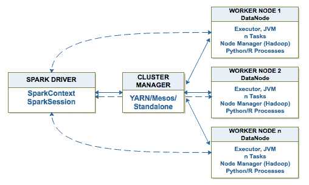
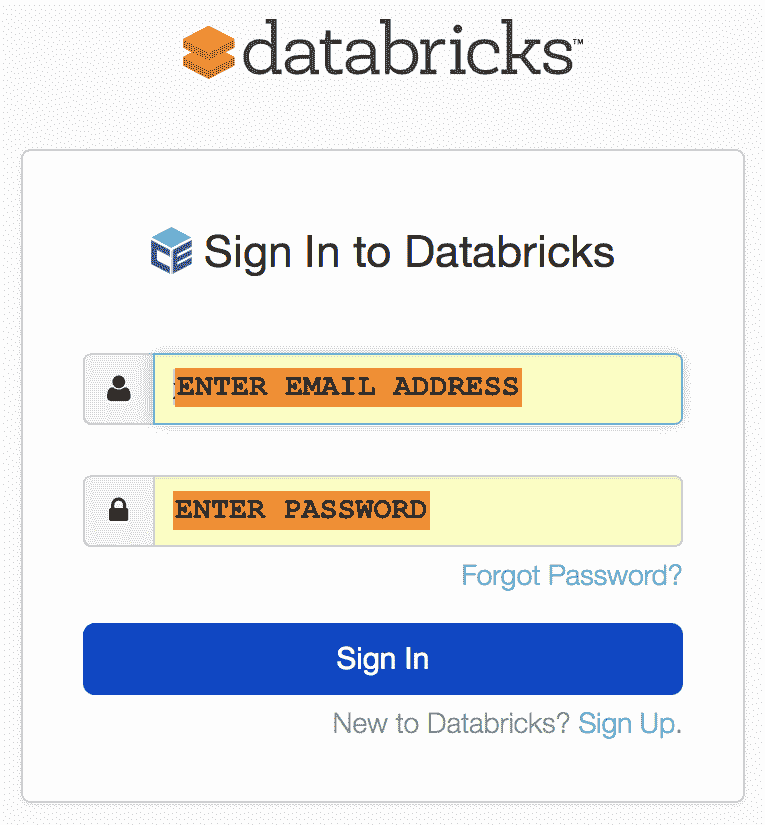
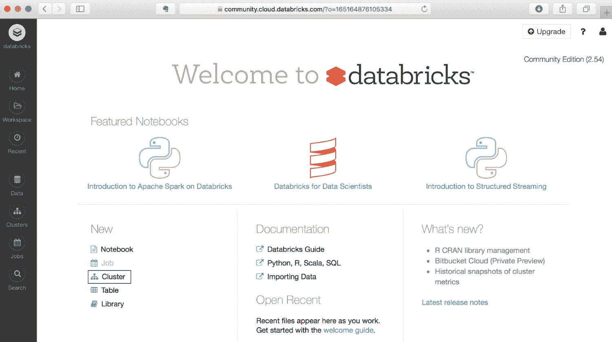
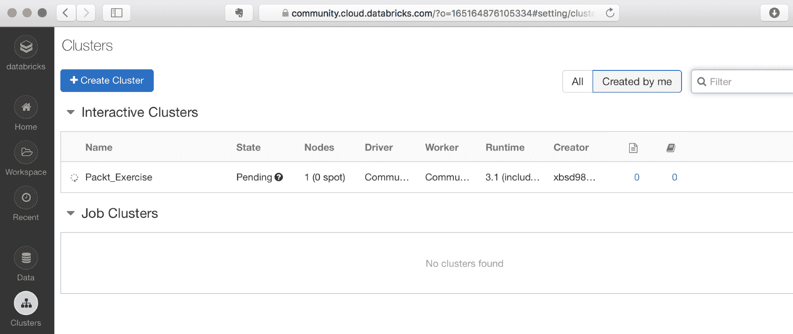
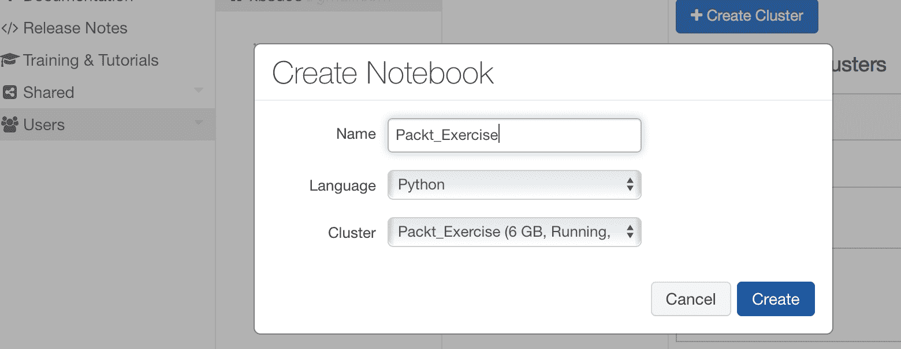
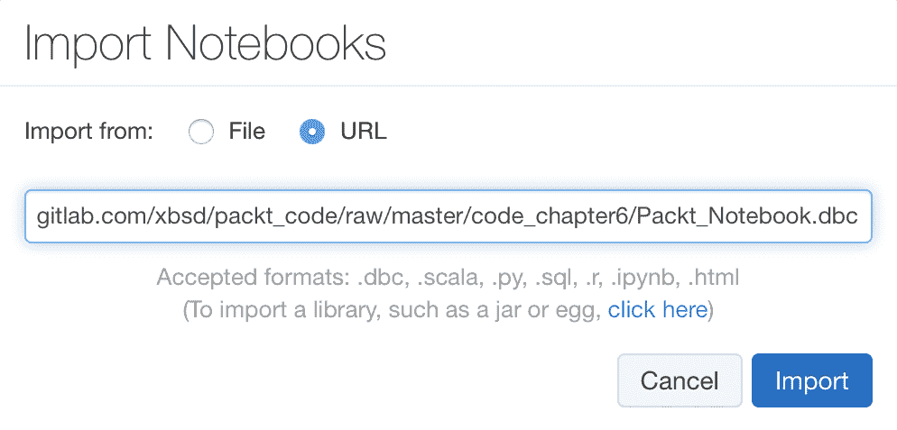

# 六、大数据分析的 Spark

随着 Hadoop 和相关技术在各自生态系统中的使用日益突出，Hadoop 运营模型的一些明显和突出的缺陷也变得明显起来。 特别是，对 MapReduce 范例的根深蒂固的依赖，以及与 MapReduce 相关的其他方面，使 Hadoop 生态系统的真正功能性使用成为可能，只有在各自技术上投入了大量资金的大公司才能使用。

在 2011 年**加州大学伯克利分校电气工程和计算机科学**(**EECS**)年度研究研讨会上，Ian Stoica([https://amplab.cs.berkeley.edu/about/](https://amplab.cs.berkeley.edu/about/))教授在演讲中宣布了在该大学成立一个新研究小组的设想。 它为成为一个将深刻改变大数据格局的关键单位奠定了基础。 **AMPLab**于 2011 年 2 月推出，旨在通过集成算法、机器和人员来提供可扩展的统一解决方案，无需任何重大的重新设计工作即可满足未来需求。

由 AMPLab 计划演变而来的最广为人知和使用最广泛的项目是 Spark，它可以说是 Hadoop 生态系统的一个更好的替代方案--或者更准确地说，是*扩展*。

在本章中，我们将访问 Spark 的一些显著特征，并以如何使用 Spark 的实际教程结束。 我们将讨论的主题包括：

*   Spark 的出现
*   “Spark”中的理论概念
*   Spark 的核心组件
*   Spark 建筑
*   Spark 解决方案
*   Spark 教程

# Spark 的出现

当 Spark 的第一个版本在 2014 年发布时，Hadoop 自 2009 年以来已经在商业领域享受了几年的增长。 尽管 Hadoop 使用广泛可访问的分布式计算方法解决了高效分析大型 TB 级数据集的主要障碍，但它仍然存在阻碍其更广泛接受的不足。

# Hadoop 的局限性

Hadoop 的一些常见限制如下：

*   **I/O 绑定操作**：由于依赖本地磁盘存储来保存和检索数据，在 Hadoop 中执行的任何操作都会产生 I/O 开销。 在涉及数百台服务器的数千个数据块的较大数据集的情况下，这个问题变得更加严重。 公平地说，协调并发 I/O 操作(通过 HDFS)的能力构成了 Hadoop 世界中分布式计算的基础。 然而，跨不同用例和数据集高效地利用该功能和*调优*Hadoop 集群需要大量甚至是不成比例的专业知识。 因此，工作负载的 I/O 受限特性成为在超大型数据集上使用 Hadoop 的一个阻碍因素。 例如，机器学习用例需要数百次迭代操作，这意味着系统在每次迭代时都会产生 I/O 开销。
*   **MapReduce 编程(MR)模型**：正如本书前面部分所讨论的，Hadoop 中的所有操作都需要按照 MapReduce 编程模型来表示问题-也就是说，用户必须用键-值对来表示问题，其中每个键-值对都可以独立计算。 在 Hadoop 中，编写高效的 MapReduce 程序(主要是用 Java 编写)绝非易事，尤其是对于 Java 和/或 Hadoop 的新手。
*   **非 MR 用例**：由于依赖于 MapReduce，其他更常见、更简单的概念，如筛选器、联接等，也必须用 MapReduce 程序来表示。 因此，跨主键的两个文件的联接必须采用键-值对方法。 这意味着，如果没有大量的编程努力，无论是简单的操作还是复杂的操作都很难实现。
*   **编程 API**：Java 作为整个 Hadoop 的中心编程语言的使用意味着，为了能够正确地管理和使用 Hadoop，开发人员必须对 Java 以及 JVM 调优、垃圾收集等相关主题有很强的了解。 这也意味着，使用其他流行语言(如 R、Python 和 Scala)的开发人员几乎没有资源来重用他们的解决方案，或者至少用他们最熟悉的语言实现他们的解决方案。
*   总体而言，尽管 Hadoop 世界支持大数据革命，但它还没有能够使大数据技术在广泛范围内的使用民主化。

AMPLab 的团队很早就意识到了这些缺点，并着手创建 Spark 来解决这些问题，并希望在这个过程中开发出一种新的、更好的替代方案。

# 克服 Hadoop 的局限性

现在，我们将了解前面部分讨论的一些限制，并了解 Spark 如何解决这些问题，因为它为 Hadoop 生态系统提供了一个更好的替代方案。

一开始需要记住的一个关键区别是，Spark 不需要 Hadoop 来运行。 事实上，除了 HDFS 之外，Spark 访问数据的底层后端可以是 HBase、Have 和 Cassandra 等技术。

这意味着希望利用独立 Spark 系统的组织可以在不构建单独的 Hadoop 基础设施(如果还不存在)的情况下这样做。

Spark 解决方案如下：

*   **I/O 绑定操作**：与 Hadoop 不同，Spark 可以存储和访问存储在*内存*中的数据，即 RAM-如前所述，它比从磁盘读取数据快 1000 倍以上。 随着 SSD 驱动器(当今企业系统中的标准)的出现，这一差异已显著降低。 最新的 NVMe 驱动器每秒可提供高达 3-5 GB(千兆字节)的带宽。 然而，RAM 的读取速度平均约为每秒 25-30 GB，与从较新的存储技术读取相比，仍快 5-10 倍。 因此，能够在 RAM 中存储数据可将读取 Spark 操作数据所需的时间缩短 5 倍或更多。 这是对 Hadoop 操作模型的重大改进，Hadoop 操作模型的所有操作都依赖于磁盘读取。 特别是，机器学习中涉及迭代操作的任务极大地受益于 Spark 存储和从内存读取数据的功能。
*   **MapReduce 编程(MR)模型**：虽然 MapReduce 是用户可以从 Hadoop 平台获益的主要编程模型，但 Spark 没有同样的要求。 这对于更复杂的用例特别有用，比如涉及不容易*并行化的计算的定量分析，*比如机器学习算法。 通过将编程模型与平台分离，Spark 允许用户编写和执行用各种语言编写的代码，而无需强制任何特定的编程模型作为先决条件。
*   **非 MR 用例**：Spark SQL、Spark Streaming 和 Spark 生态系统的其他组件提供了一组丰富的功能，允许用户执行常见任务，如 SQL 连接、聚合和相关的类似数据库的操作，而无需利用其他外部解决方案。 Spark SQL 查询通常针对存储在配置单元中的数据执行(JSON 是另一种选择)，该功能也可以在 R 和 Python 等其他 Spark API 中使用。
*   **编程 API**：Spark 中最常用的 API 是 Python、Scala 和 Java。 对于 R 程序员来说，有一个称为`SparkR`的单独包，它允许从 R 直接访问 Spark 数据。这是 Hadoop 和 Spark 之间的一个主要区别因素，通过以这些语言公开 API，Spark 可以立即被更多的开发人员社区访问。 在数据科学和分析中，Python 和 R 是最重要的语言选择，因此，任何 Python 或 R 程序员都可以利用 Spark，学习曲线比 Hadoop 简单得多。 此外，Spark 还包括一个用于即席分析的交互式外壳。

# “Spark”中的理论概念

以下是 Spark 中的核心概念：

*   弹性分布式数据集
*   有向无环图
*   SparkContext
*   DataFrames
*   操作和转换
*   Spark 展开选项

# 弹性分布式数据集

**弹性分布式数据集**，通常称为**RDD**s，是 Spark 中使用的主要数据结构。 RDDS 本质上是以分布式方式跨 Spark 集群存储的记录集合。 RDDS 是*不可变的*，也就是说，一旦创建就不能更改。 跨节点存储的 RDDS 可以并行访问，因此本机支持并行操作。

用户不需要编写单独的代码来获得并行化的好处，但只需运行 Spark 平台原生的特定命令，就可以获得数据的*操作和转换*的好处。 由于 RDDS 也可以存储在内存中，因此作为一个额外的好处，并行操作可以直接作用于内存中的数据，而不会招致昂贵的 I/O 访问代价。

# 有向无环图

在计算机科学和数学术语中，有向无环图表示通过单向边(或**线**)连接的节点对(也称为**个顶点**)。 也就是说，给定节点 A 和节点 B，边可以连接 AàB 或 BàA，但不能同时连接两者。 换句话说，任何一对节点之间都不存在循环关系。

Spark 利用 DAG 的概念构建内部工作流，该工作流描述 Spark 作业中的不同处理阶段。 从概念上讲，这类似于创建获得特定输出所需的一系列步骤的虚拟流程图。 例如，如果所需的输出涉及生成文档中的字数，那么中间步骤 map-Shuffle-Reduce 可以表示为一系列导致最终结果的操作。 通过维护这样的**映射**，Spark 能够跟踪操作中涉及的依赖关系。 更具体地说，RDDS 是**节点**，本节后面讨论的转换是 DAG 的**边**。

# SparkContext

SparkContext 是所有 Spark 操作的入口点，应用通过它连接到 Spark 集群的资源。 它初始化 Spark 的一个实例，然后可以用来创建 RDDS、对 RDDS 执行操作和转换，以及提取数据和其他 Spark 功能。 SparkContext 还初始化进程的各种属性，例如应用名称、核心数量、内存使用参数和其他特征。 总的来说，这些属性包含在对象 SparkConf 中，该对象作为参数传递给 SparkContext。

`SparkSession`是一个新的抽象，用户通过它启动与 Spark 的连接。 它是 Spark 2.0.0 之前的`SparkContext`中提供的功能的超集。 但是，实践者仍然交替使用`SparkSession`和`SparkContext`来表示同一个实体；也就是说，与`Spark.SparkSession`交互的主要模式本质上结合了 SparkContext 和`HiveContext`的功能。

# DataFrames

Spark 中的 DataFrame 是组织成行和列的原始数据。 这在概念上类似于 CSV 文件或 SQL 表。 通过使用 R、Python 和其他 Spark API，用户可以使用用于过滤、聚合和更一般地操作数据的常用 Spark 命令与 DataFrame 进行交互。 DataFrame 中包含的数据在物理上位于 Spark 群集的多个节点上。 然而，通过在**DataFrame**中表示它们，它们似乎是一个内聚的数据单元，而没有暴露底层操作的复杂性。

请注意，DataFrame 与 Spark 中使用的另一个常用术语 DataSet 不同。 数据集指的是 Spark 群集中保存的实际数据。 DataFrame 是数据集的表格表示形式。

从 Spark 2.0 开始，DataFrame 和 DataSet API 被合并，DataFrame 实质上表示 Row 的数据集。 也就是说，DataFrame 仍然是希望利用 Python 和 R 与 Spark 数据交互的用户的主要抽象。

# 操作和转换

Spark 操作有两种类型：

*   变换
*   行动 / 活动 / 情节

**转换**指定常规数据操作，如过滤数据、联接数据、执行聚合、采样数据等。 执行代码中包含转换操作的行时，转换不返回任何结果。 相反，该命令在执行时会用相应的操作请求补充 Spark 的内部 DAG。 常见转换的示例包括：`map`、`filter`、`groupBy`、`union`、`coalesce`等。

**另一方面，操作**返回结果。 也就是说，它们执行用户可能在相应的 RDD 上指定的一系列转换(如果有的话)，并产生输出。 换句话说，操作触发 DAG 中步骤的执行。 常见操作包括：`reduce`、`collect`、`take`、`aggregate`、`foreach`等。

Note that RDDs are immutable. They cannot be changed; transformations and actions will always produce new RDDs, but never modify existing ones.

# Spark 展开选项

Spark 可以在各种模式下部署。 最重要的是：

*   **独立模式**：作为不依赖于任何外部群集管理器的独立群集
*   **Amazon EC2**：在 Amazon Web Services 的 EC2 实例上，它可以从 S3 访问数据
*   **Apache Yar**：Hadoop ResourceManager

其他选项包括**Apache Mesos**和**Kubernetes。**

Further details can be found at the Spark documentation website, [https://spark.apache.org/docs/latest/index.html](https://spark.apache.org/docs/latest/index.html).

# Spark API 接口

Spark 平台可以通过 Python、Scala、R 和 Java 提供的 Spark API 轻松访问。 它们共同使得在 Spark 中处理数据变得简单且可广泛访问。 在 Spark 项目的初始阶段，它只支持 Scala/Java 作为主要 API。 然而，因为 Spark 的主要目标之一是为不同的开发人员提供一个简单的接口，所以在 Scala API 之后是一个 Python 和 R API。

在 Python 中，PySpark 包已经成为 Python 开发社区广泛使用的编写 Spark 应用的标准。 在 R 中，用户通过 SparkR 包与 Spark 进行交互。 这对于可能也对 Spark 生态系统中存储的数据感兴趣的 R 开发人员很有用。 这两种语言在数据科学界都非常流行，因此，Python 和 RAPI 的引入为**Big Data**Analytics on Spark for Analysis 用例的大众化奠定了基础。

# Spark 中的核心部件

以下组件在 Spark 中非常重要：

*   Spark 芯
*   Spark SQL
*   Spark 流
*   GraphX
*   MLlib

# Spark 芯

Spark Core 在 Spark 中提供了基本功能，如使用 RDDS、执行操作和转换，以及更多的管理任务(如存储、高可用性和其他主题)。

# Spark SQL

Spark SQL 为用户提供了使用标准 SQL 命令查询存储在 Apache Have 中的数据的能力。 这为开发人员提供了一种使用常见 SQL 术语通过 Spark SQL 接口与数据集交互的方法，从而增加了可访问性的额外级别。 托管底层数据的平台不仅限于 Apache Have，还可以包括 JSON、Parquet 等。

# Spark 流

Spark 的流媒体组件允许用户与网络相关内容等流媒体数据进行交互。 它还包括高可用性等企业特征。 Spark 可以从各种中间件和数据流服务(如 Apache Kafka、Apache Flume 和 Amazon Web Services 等供应商提供的基于云的解决方案)读取数据。

# GraphX

Spark 的 GraphX 组件支持基于图形的操作，类似于支持专用数据结构的图形数据库等技术。 这使得使用、访问和表示相互连接的数据点(如社交网络)变得容易。 除了分析，Spark GraphX 平台还支持图形算法，这些算法对于需要按比例表示关系的业务用例非常有用。 例如，信用卡公司使用类似于 Spark 的 GraphX 组件的基于 Graph 的数据库来构建检测具有相似特征的用户的推荐引擎。 这些特征可能包括购买习惯、地点、人口统计以及其他定性和定量因素。 在这些情况下使用 Graph 系统允许公司建立网络，其中节点表示个人，边表示关系度量，以找到它们之间的共同特征。

# MLlib

MLlib 是 Spark 生态系统的旗舰组件之一。 它提供了一个可扩展的高性能接口，用于在 Spark 中执行资源密集型机器学习任务。 此外，MLlib 可以本机连接到 HDFS、HBase 和 Spark 支持的其他底层存储系统。 由于这种多功能性，用户不需要依赖预先存在的 Hadoop 环境就可以开始使用 MLlib 中内置的算法。 MLlib 中支持的一些算法包括：

*   **分类**：Logistic 回归
*   **回归**：广义线性回归、生存回归等
*   决策树、随机森林和梯度增强树
*   **建议**：交替最小二乘
*   **聚类**：K-均值、高斯混合和其他
*   **主题建模**：潜在 Dirichlet 分配
*   **Apriori**：频繁项集，关联规则

ML 工作流实用程序包括：

*   **特征变换**：标准化、规范化等
*   ML 管道施工
*   模型评估和超参数整定
*   **ML 持久性**：保存和加载模型和管道

# Spark 的架构

Spark 由 3 个主要架构组件组成：

*   SparkSession/SparkContext
*   群集管理器
*   工作节点(托管执行器进程)

如前所述，**SparkSession/SparkContext**，或者更一般的 Spark 驱动程序，是所有 Spark 应用的入口点。 SparkContext 将用于创建 RDD 并对 RDD 执行操作。 SparkDriver 向工作节点发送指令以调度任务。

**集群管理器**在概念上类似于 Hadoop 中的资源管理器，实际上，其中一个受支持的解决方案是 YAR。 其他集群管理器包括 Mesos。 Spark 也可以在独立模式下运行，在这种情况下不需要纱线/中间件。 集群管理器协调工作节点之间的通信，管理节点(如启动、停止等)，并执行其他管理任务。

**工作节点**是托管 Spark 应用的服务器。 每个应用都有自己独特的**执行器进程**，即执行实际操作和转换任务的进程。 通过分配专用的执行器进程，Spark 可确保任何特定应用中的问题不会影响其他应用。 Worker 节点由 Executor、JVM 和 Spark 应用所需的 Python/R/其他应用进程组成。 请注意，在 Hadoop 中，工作节点和数据节点是一个相同的节点：



# Spark 解决方案

Spark 可以直接从[partk.apache.org](http://spark.apache.org/)获得，它是一个开源解决方案。 **Databricks**是 Spark 商业解决方案的领先提供商。 对于那些熟悉 Python、R、Java 或 Scala 编程的人来说，开始使用 Spark 所需的时间很短，因为有了高效的接口，比如允许用户只使用 Python 就可以在 Spark 中工作的 PySpark API。

基于云的 Spark 平台，如 Databricks Community Edition，提供了使用 Spark 的简单方法，而无需安装和配置 Spark。 因此，希望使用 Spark 进行编程和相关任务的用户可以更快地上手，而无需花费时间在管理任务上。

# Spark 练习

在本节中，我们将在 Databricks 的 Community Edition 上创建一个帐户，并完成一个实践练习，该练习将引导读者了解操作、转换和 RDD 概念的基本知识。

# 注册 Databricks 社区版

以下步骤概述了注册**Databricks Community Edition**的流程：

1.  转到[https://databricks.com/try-databricks](https://databricks.com/try-databricks)：


2.  单击今天开始按钮并输入您的信息：


3.  确认您已阅读并同意弹出菜单中的条款(向下滚动至**同意**按钮的底部)：


4.  检查您的电子邮件以获取来自 Databricks 的确认电子邮件，然后单击链接确认您的帐户：


5.  单击链接确认您的帐户后，您将进入登录屏幕，在此您可以使用您注册帐户时使用的电子邮件地址和密码进行登录：



6.  登录后，点击集群设置 Spark 集群，如下图所示：



7.  输入`Packt_Exercise`作为集群名称，然后单击页面顶部的创建集群按钮：


8.  这将启动 Spark 集群的启动过程，我们将在该集群上使用 IPython 笔记本执行 Spark 命令。 IPython Notebook 是一个常用 IDE 的名称，它是一种基于 Web 的开发应用，用于编写和测试 Python 代码。 笔记本还可以通过使用内核来支持其他语言，但出于本练习的目的，我们将重点介绍 Python 内核。

一段时间后，状态将从 Pending 变为 Running：



几分钟后状态更改为正在运行：


9.  单击**Workspace**(左手边栏)并选择**Options**、**Users**|(`Your userid`)，然后单击您的电子邮件地址旁边的下拉箭头。 选择创建|笔记本：


10.  在弹出屏幕中，输入`Packt_Exercise`作为笔记本的名称，然后单击 Create 按钮：



11.  单击**Create**按钮后，您将直接进入笔记本，如下面的屏幕截图所示。 这是 Spark Notebook，您可以在其中执行下面几节中给出的其余代码。 如图所示，应在笔记本的单元格中键入代码。 输入代码后，按*Shift+Enter*执行相应的单元格：


12.  在接下来的几个练习中，您可以将文本复制粘贴到笔记本的单元格中。 或者，您也可以导入笔记本并将其直接加载到您的工作区中。 如果这样做，您将不需要键入命令(尽管键入命令会让您更熟悉实际操作)。
13.  复制-粘贴命令的另一种方法是：您可以通过单击导入来导入笔记本，如以下屏幕截图所示：


14.  在弹出菜单中输入以下**URL**(选择**URL**作为**从**导入选项)：



15.  然后，该笔记本将显示在您的电子邮件 ID 下。单击该笔记本的名称以加载它：


# Spark 练习-与 Spark 一起动手(Databricks)

本笔记本基于 Databricks([https://databricks.com/](https://databricks.com/))提供的教程。 本教程将使用 Databricks 的社区版 Spark 进行，可以在[https://databricks.com/try-databricks](https://databricks.com/try-databricks)上注册。 Databricks 是 Spark 商业和企业支持版本的领先提供商。

在本教程中，我们将介绍一些在 Spark 中使用的基本命令。 我们鼓励用户尝试更广泛的 Spark 教程和笔记本，这些教程和笔记本可以在网上找到更详细的例子。

Spark 的 Python API 文档可以在[https://spark.apache.org/docs/latest/api/python/pyspark.html#pyspark.sql](https://spark.apache.org/docs/latest/api/python/pyspark.html#pyspark.sql)找到。

这本书的数据被导入到 Databricks 的 Spark 平台。 有关导入数据的更多信息，请转到**导入数据**-**数据库**([https://docs.databricks.com/user-guide/importing-data.html](https://docs.databricks.com/user-guide/importing-data.html))。

```py
# COMMAND ----------

# The SparkContext/SparkSession is the entry point for all Spark operations
# sc = the SparkContext = the execution environment of Spark, only 1 per JVM
# Note that SparkSession is now the entry point (from Spark v2.0)
# This tutorial uses SparkContext (was used prior to Spark 2.0)

from pyspark import SparkContext
# sc = SparkContext(appName = "some_application_name") # You'd normally run this, but in this case, it has already been created in the Databricks' environment

# COMMAND ----------

quote = "To be, or not to be, that is the question: Whether 'tis nobler in the mind to suffer The slings and arrows of outrageous fortune, Or to take Arms against a Sea of troubles, And by opposing end them: to die, to sleep No more; and by a sleep, to say we end the heart-ache, and the thousand natural shocks that Flesh is heir to? 'Tis a consummation devoutly to be wished. To die, to sleep, To sleep, perchance to Dream; aye, there's the rub, for in that sleep of death, what dreams may come, when we have shuffled off this mortal coil, must give us pause."

# COMMAND ----------
sparkdata = sc.parallelize(quote.split(' '))

# COMMAND ----------
print "sparkdata = ", sparkdata
print "sparkdata.collect = ", sparkdata.collect
print "sparkdata.collect() = ", sparkdata.collect()[1:10]

# COMMAND ----------
# A simple transformation - map
def mapword(word):
 return (word,1)

print sparkdata.map(mapword) # Nothing has happened here
print sparkdata.map(mapword).collect()[1:10] # collect causes the DAG to execute

# COMMAND ----------
# Another Transformation

def charsmorethan2(tuple1):
 if len(tuple1[0])>2:
 return tuple1
 pass

rdd3 = sparkdata.map(mapword).filter(lambda x: charsmorethan2(x))
# Multiple Transformations in 1 statement, nothing is happening yet
rdd3.collect()[1:10] 
# The DAG gets executed. Note that since we didn't remove punctuation marks ... 'be,', etc are also included

# COMMAND ----------
# With Tables, a general example
cms = sc.parallelize([[1,"Dr. A",12.50,"Yale"],[2,"Dr. B",5.10,"Duke"],[3,"Dr. C",200.34,"Mt. Sinai"],[4,"Dr. D",5.67,"Duke"],[1,"Dr. E",52.50,"Yale"]])

# COMMAND ----------
def findPayment(data):
 return data[2]

print "Payments = ", cms.map(findPayment).collect()
print "Mean = ", cms.map(findPayment).mean() # Mean is an action

# COMMAND ----------
# Creating a DataFrame (familiar to Python programmers)

cms_df = sqlContext.createDataFrame(cms, ["ID","Name","Payment","Hosp"])
print cms_df.show()
print cms_df.groupby('Hosp').agg(func.avg('Payment'), func.max('Payment'),func.min('Payment'))
print cms_df.groupby('Hosp').agg(func.avg('Payment'), func.max('Payment'),func.min('Payment')).collect()
print
print "Converting to a Pandas DataFrame"
print "--------------------------------"
pd_df = cms_df.groupby('Hosp').agg(func.avg('Payment'), func.max('Payment'),func.min('Payment')).toPandas()
print type(pd_df)
print
print pd_df

# COMMAND ----------
wordsList = ['to','be','or','not','to','be']
wordsRDD = sc.parallelize(wordsList, 3) # Splits into 2 groups
# Print out the type of wordsRDD
print type(wordsRDD)

# COMMAND ----------
# Glom coallesces all elements within each partition into a list
print wordsRDD.glom().take(2) # Take is an action, here we are 'take'-ing the first 2 elements of the wordsRDD
print wordsRDD.glom().collect() # Collect

# COMMAND ----------
# An example with changing the case of words
# One way of completing the function
def makeUpperCase(word):
 return word.upper()

print makeUpperCase('cat')

# COMMAND ----------
upperRDD = wordsRDD.map(makeUpperCase)
print upperRDD.collect()

# COMMAND ----------
upperLambdaRDD = wordsRDD.map(lambda word: word.upper())
print upperLambdaRDD.collect()

# COMMAND ----------

# Pair RDDs
wordPairs = wordsRDD.map(lambda word: (word, 1))
print wordPairs.collect()

# COMMAND ----------

# #### Part 2: Counting with pair RDDs 
# There are multiple ways of performing group-by operations in Spark
# One such method is groupByKey()
# 
# ** Using groupByKey() **
# 
# This method creates a key-value pair whereby each key (in this case word) is assigned a value of 1 for our wordcount operation. It then combines all keys into a single list. This can be quite memory intensive, especially if the dataset is large.

# COMMAND ----------
# Using groupByKey
wordsGrouped = wordPairs.groupByKey()
for key, value in wordsGrouped.collect():
 print '{0}: {1}'.format(key, list(value))

# COMMAND ----------
# Summation of the key values (to get the word count)
wordCountsGrouped = wordsGrouped.map(lambda (k,v): (k, sum(v)))
print wordCountsGrouped.collect()

# COMMAND ----------

# ** (2c) Counting using reduceByKey **
# 
# reduceByKey creates a new pair RDD. It then iteratively applies a function first to each key (i.e., within the key values) and then across all the keys, i.e., in other words it applies the given function iteratively.

# COMMAND ----------

wordCounts = wordPairs.reduceByKey(lambda a,b: a+b)
print wordCounts.collect()

# COMMAND ----------
# %md
# ** Combining all of the above into a single statement **

# COMMAND ----------

wordCountsCollected = (wordsRDD
 .map(lambda word: (word, 1))
 .reduceByKey(lambda a,b: a+b)
 .collect())
print wordCountsCollected

# COMMAND ----------

# %md
# 
# This tutorial has provided a basic overview of Spark and introduced the Databricks community edition where users can upload and execute their own Spark notebooks. There are various in-depth tutorials on the web and also at Databricks on Spark and users are encouraged to peruse them if interested in learning further about Spark.
```

# 简略的 / 概括的 / 简易判罪的 / 简易的

在本章中，我们将了解 Spark 的一些核心功能，Spark 是当今大数据领域最突出的技术之一。 Spark 自 2014 年问世以来已经迅速成熟，当时它作为大数据解决方案发布，缓解了 Hadoop 的许多缺点，如 I/O 争用等。

今天，Spark 有几个组件，包括专门用于流媒体分析和机器学习的组件，并且正在积极开发中。 Databricks 是 Spark 商业支持版本的领先提供商，还托管了一个非常方便的基于云的 Spark 环境，任何用户都可以免费访问有限的资源。 这大大降低了进入的门槛，因为用户不需要安装完整的 Spark 环境来学习和使用该平台。

在下一章中，我们将开始讨论机器学习。 在本节之前，本文的大部分内容都集中在大规模数据的管理上。 有效地利用数据并从数据中获得*洞察力*始终是最终目标。 为了做到这一点，我们需要使用今天已经变得司空见惯的高级算法技术。 下一章将讨论机器学习的基本原理，随后我们将在接下来的一章中更深入地研究这一主题领域。