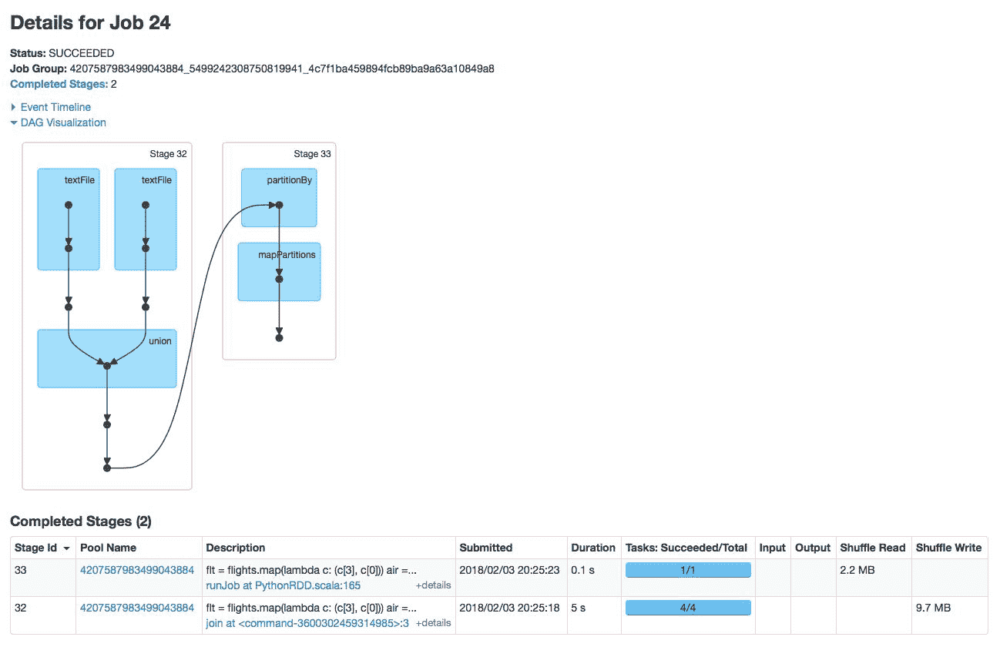
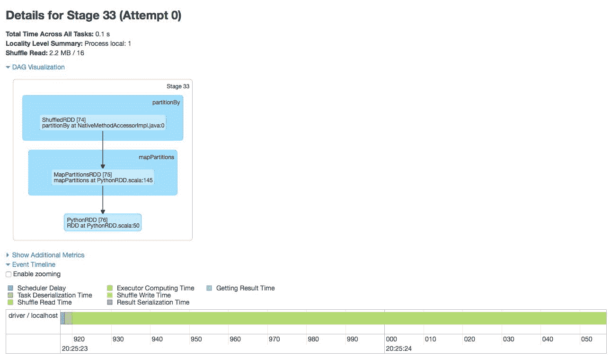
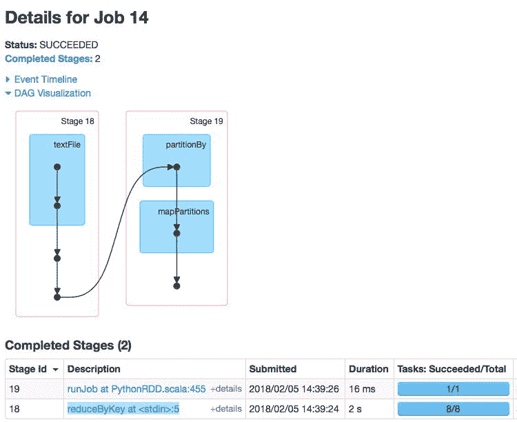

# 二、使用关系数据库抽象数据

在本章中，我们将介绍如何使用 Apache Spark 弹性分布式数据集。您将学习以下食谱:

*   创建 RDDs
*   从文件中读取数据
*   RDD 变革概述
*   RDD 行动概述
*   使用 RDDs 的陷阱

# 介绍

**弹性分布式数据集** ( **RDDs** )是分布在 Apache Spark 集群中的不可变 JVM 对象的集合。请注意，如果您是 Apache Spark 的新手，您可能希望在开始时跳过这一章，因为 Spark 数据帧/数据集非常容易开发，并且通常具有更快的性能。关于 Spark 数据帧的更多信息可以在下一章中找到。

RDD 是 Apache Spark 最基本的数据集类型；对 Spark 数据帧的任何操作最终都会将*转化为对 RDDs 上的转换和操作的高度优化的执行(参见[第 3 章](3.html#3IE3G0-dc04965c02e747b9b9a057725c821827)、*在*简介*一节中关于催化剂优化器的段落)。**

RDD 中的数据基于一个密钥被分割成块，然后分散在所有执行器节点上。rdd 具有很高的弹性，也就是说，当相同的数据块跨多个执行器节点复制时，能够从任何问题中快速恢复。因此，即使一个执行器出现故障，另一个执行器仍然会处理数据。这允许您通过利用多个节点的能力，非常快速地对数据集执行函数计算。RDDs 保留应用于每个块的所有执行步骤的日志。除了数据复制之外，这还加快了计算速度，如果出现任何问题，RDDs 仍然可以恢复由于执行器错误而丢失的那部分数据。

虽然在分布式环境中丢失节点是很常见的(例如，由于连接问题、硬件问题)，但数据的分发和复制可以防止数据丢失，而数据谱系则允许系统快速恢复。

# 创建 RDDs

对于这个配方，我们将通过在 PySpark 中生成数据来创建一个 RDD。要在 Apache Spark 中创建 RDD，您需要首先安装 Spark，如前一章所示。您可以使用 PySpark shell 和/或 Jupyter 笔记本来运行这些代码示例。

# 准备好

我们需要一个工作安装的 Spark。这意味着您将遵循上一章中概述的步骤。提醒一下，要为本地 Spark 集群启动 PySpark shell，您可以运行以下命令:

```py
./bin/pyspark --master local[n]
```

其中`n`为芯数。

# 怎么做...

要快速创建一个 RDD，通过 bash 终端在你的机器上运行 PySpark，或者你可以在 Jupyter 笔记本上运行同样的查询。在 PySpark 中创建 RDD 有两种方法:您可以使用`parallelize()`方法——一个集合(一些元素的列表或数组)或者引用位于本地或通过外部源的一个(或多个)文件，如后续菜谱中所述。

以下代码片段使用`sc.parallelize()`方法创建您的 RDD ( `myRDD`):

```py
myRDD = sc.parallelize([('Mike', 19), ('June', 18), ('Rachel',16), ('Rob', 18), ('Scott', 17)])
```

要查看 RDD 内部的内容，您可以运行以下代码片段:

```py
myRDD.take(5)
```

输出如下:

```py
Out[10]: [('Mike', 19), ('June', 18), ('Rachel',16), ('Rob', 18), ('Scott', 17)]
```

# 它是如何工作的...

让我们分解一下前面代码片段中的两个方法:`sc.parallelize()`和`take()`。

# Spark 上下文并行化方法

在封面下，有相当多的动作发生在你创作 RDD 的时候。让我们从 RDD 的创作开始，分解这段代码片段:

```py
myRDD = sc.parallelize( [('Mike', 19), ('June', 18), ('Rachel',16), ('Rob', 18), ('Scott', 17)])
```

首先关注`sc.parallelize()`方法中的语句，我们首先创建了一个由数组列表(即`('Mike', 19), ('June', 19), ..., ('Scott', 17)`)组成的 Python 列表(即`[A, B, ..., E]`)。`sc.parallelize()`方法是 SparkContext 的`parallelize`方法，用于创建并行集合。这允许 Spark 将数据分布在多个节点上，而不是依赖单个节点来处理数据:


现在我们已经创建了`myRDD`作为并行集合，Spark 可以对这些数据进行并行操作。一旦创建，分布式数据集(`distData`)就可以并行操作。例如，我们可以调用`myRDD.reduceByKey(add)`将列表中按键分组的相加；我们在本章后面的章节中有 RDD 操作的方法。

# 。采取(...)方法

现在您已经创建了您的 RDD ( `myRDD`)，我们将使用`take()`方法将值返回到控制台(或笔记本单元格)。我们现在将执行一个 RDD 动作(在后续的食谱中有更多的信息)，`take()`。请注意，PySpark 中的一种常见方法是使用`collect()`，它将您的 RDD 中的所有值从 Spark 工作节点返回给驱动程序。在处理大量数据时会有性能影响，因为这意味着大量数据会从 Spark 工作节点传输到驱动程序。对于少量的数据(比如这个食谱)，这是完全可以的，但是，作为一个习惯，你应该总是使用`take(n)`方法来代替；它返回 RDD 的第一个`n`元素，而不是整个数据集。这是一种更有效的方法，因为它首先扫描一个分区，并使用这些统计信息来确定返回结果所需的分区数量。

# 从文件中读取数据

对于这个食谱，我们将通过读取 PySpark 中的本地文件来创建一个 RDD。要在 Apache Spark 中创建 rdd，您需要首先安装 Spark，如前一章所述。您可以使用 PySpark shell 和/或 Jupyter 笔记本来运行这些代码示例。请注意，虽然此方法专用于读取本地文件，但类似的语法也可以应用于 Hadoop、AWS S3、Azure WASBs 和/或 Google 云存储:

| 存储类型 | 例子 |
| 本地文件 | `sc.textFile('/local folder/filename.csv')` |
| Hadoop HDFS | `sc.textFile('hdfs://folder/filename.csv')` |
| AWS S3([https://docs . AWS . Amazon . com/EMR/latest/release guide/EMR-spark-configure . html](https://docs.aws.amazon.com/emr/latest/ReleaseGuide/emr-spark-configure.html)) | `sc.textFile('s3://bucket/folder/filename.csv')` |
| azure WaSs([https://docs . Microsoft . com/en-us/azure/hdinsight/hdinsight-Hadoop-use-blob-storage](https://docs.microsoft.com/en-us/azure/hdinsight/hdinsight-hadoop-use-blob-storage)) | `sc.textFile('wasb://bucket/folder/filename.csv')` |
| 谷歌云存储([https://Cloud . Google . com/data roc/docs/concepts/connectors/云存储#other_sparkhadoop_clusters](https://cloud.google.com/dataproc/docs/concepts/connectors/cloud-storage#other_sparkhadoop_clusters) ) | `sc.textFile('gs://bucket/folder/filename.csv')` |
| DBFS 数据库 | `sc.textFile('dbfs://folder/filename.csv')` |

# 准备好

在本食谱中，我们将阅读一个制表符分隔(或逗号分隔)的文件，所以请确保您有一个文本(或 CSV)文件可用。为了您的方便，您可以从[下载`airport-codes-na.txt`和`departuredelays.csv`文件。确保您的本地 Spark 集群可以访问此文件(例如，`~/data/flights/airport-codes-na.txt`)。](https://github.com/drabastomek/learningPySpark/tree/master/Chapter03/flight-data)

# 怎么做...

一旦您通过 bash 终端启动了 PySpark shell(或者您可以在 Jupyter 笔记本中运行相同的查询)，请执行以下查询:

```py
myRDD = (sc.textFile('~/data/flights/airport-codes-na.txt', minPartitions=4, use_unicode=True).map(lambda element: element.split("\t")))
```

如果运行的是 Databricks，则相同的文件已经包含在`/databricks-datasets`文件夹中；命令是:

`myRDD = sc.textFile('/databricks-datasets/flights/airport-codes-na.txt').map(lambda element: element.split("\t"))`

运行查询时:

```py
myRDD.take(5)
```

结果输出是:

```py
Out[22]:  [[u'City', u'State', u'Country', u'IATA'], [u'Abbotsford', u'BC', u'Canada', u'YXX'], [u'Aberdeen', u'SD', u'USA', u'ABR'], [u'Abilene', u'TX', u'USA', u'ABI'], [u'Akron', u'OH', u'USA', u'CAK']]
```

再深入一点，让我们确定 RDD 的行数。请注意，后续食谱中包含了更多关于 RDD 动作的信息，如`count()`:

```py
myRDD.count()# Output# Out[37]: 527
```

此外，让我们找出支持此 RDD 的分区数量:

```py
myRDD.getNumPartitions()# Output# Out[33]: 4
```

# 它是如何工作的...

通过`take`读取文件和返回值的第一个代码片段可以分解为两个部分:`sc.textFile()`和`map()`。

# 。文本文件(...)方法

为了读取文件，我们通过以下命令使用 SparkContext 的`textFile()`方法:

```py
(sc.textFile('~/data/flights/airport-codes-na.txt', minPartitions=4, use_unicode=True))
```

只需要第一个参数，按照`~/data/flights/airport-codes-na.txt`指示文本文件的位置。还有两个可选参数:

*   `minPartitions`:表示组成 RDD 的最小分区数。Spark 引擎通常可以根据文件大小来确定分区的最佳数量，但是出于性能原因，您可能希望更改分区的数量，从而能够指定最小数量。
*   `use_unicode`:如果您正在处理 Unicode 数据，请启用此参数。

请注意，如果您要在没有后续`map()`函数的情况下执行此语句，则生成的 RDD 将不会引用制表符分隔符——基本上是字符串列表，即:

```py
myRDD = sc.textFile('~/data/flights/airport-codes-na.txt')myRDD.take(5)# Out[35]:  [u'City\tState\tCountry\tIATA', u'Abbotsford\tBC\tCanada\tYXX', u'Aberdeen\tSD\tUSA\tABR', u'Abilene\tTX\tUSA\tABI', u'Akron\tOH\tUSA\tCAK']
```

# 。地图(...)方法

为了理解带有 RDD 的制表符分隔符，我们将使用`.map(...)`函数将数据从字符串列表转换为列表列表:

```py
myRDD = (sc.textFile('~/data/flights/airport-codes-na.txt').map(lambda element: element.split("\t")))
```

该地图转换的关键组件是:

*   `lambda`:由单个表达式组成的匿名函数(即没有名称定义的函数)
*   `split`:我们使用 PySpark 的 split 函数(在`pyspark.sql.functions`内)来围绕正则表达式模式拆分字符串；在这种情况下，我们的分隔符是制表符(即`\t`)

将`sc.textFile()`和`map()`函数放在一起，我们可以读取文本文件，并通过制表符分隔符进行分割，以生成由并行列表集合组成的 RDD:

```py
Out[22]:  [[u'City', u'State', u'Country', u'IATA'], [u'Abbotsford', u'BC', u'Canada', u'YXX'], [u'Aberdeen', u'SD', u'USA', u'ABR'], [u'Abilene', u'TX', u'USA', u'ABI'], [u'Akron', u'OH', u'USA', u'CAK']]
```

# 分区和性能

在本食谱的前面，如果我们在没有为此数据集指定`minPartitions`的情况下运行`sc.textFile()`，我们将只有两个分区:

```py
myRDD = (sc.textFile('/databricks-datasets/flights/airport-codes-na.txt').map(lambda element: element.split("\t")))myRDD.getNumPartitions()# OutputOut[2]: 2
```

但是如前所述，如果指定了`minPartitions`标志，那么您将获得指定的四个分区(或更多):

```py
myRDD = (sc.textFile('/databricks-datasets/flights/airport-codes-na.txt', minPartitions=4).map(lambda element: element.split("\t")))myRDD.getNumPartitions()# OutputOut[6]: 4
```

RDD 分区的一个关键方面是，分区越多，并行度越高。拥有更多分区可能会提高查询性能。对于食谱的这一部分，让我们使用稍微大一点的文件`departuredelays.csv`:

```py
# Read the `departuredelays.csv` file and count number of rowsmyRDD = (sc.textFile('/data/flights/departuredelays.csv').map(lambda element: element.split(",")))myRDD.count()# Output Duration: 3.33sOut[17]: 1391579# Get the number of partitionsmyRDD.getNumPartitions()# Output:Out[20]: 2
```

如前面的代码片段所述，默认情况下，Spark 将创建两个分区，并花费 3.33 秒(在我的小集群上)来计算出发延迟 CSV 文件中的 139 万行。

执行相同的命令，但也指定`minPartitions`(在这种情况下，八个分区)，你会注意到`count()`方法在 2.96 秒内完成(而不是八个分区的 3.33 秒)。请注意，这些值可能因您的计算机配置而异，但关键的一点是，由于并行化，修改分区数量可能会导致更快的性能。查看以下代码:

```py
# Read the `departuredelays.csv` file and count number of rowsmyRDD = (sc.textFile('/data/flights/departuredelays.csv', minPartitions=8).map(lambda element: element.split(",")))myRDD.count()# Output Duration: 2.96sOut[17]: 1391579# Get the number of partitionsmyRDD.getNumPartitions()# Output:Out[20]: 8
```

# RDD 变革概述

如前所述，有两种类型的操作可用于在 RDD 中塑造数据:转换和操作。顾名思义，*将一个 RDD 变成另一个 T2。换句话说，它采用一个现有的 RDD，并将其转换为一个或多个输出 rdd。在前面的方法中，我们使用了`map()`函数，这是一个转换的例子，通过标签分隔符分割数据。*

转换是懒惰的(不像动作)。只有当一个动作在 RDD 上被调用时，它们才会被执行。比如调用`count()`函数就是一个动作；更多信息可在下一节的行动。

# 准备好

该配方将读取一个制表符分隔(或逗号分隔)的文件，因此请确保您有一个文本(或 CSV)文件可用。为了您的方便，您可以从[下载`airport-codes-na.txt`和`departuredelays.csv`文件。确保您的本地 Spark 集群可以访问此文件(例如，`~/data/flights/airport-codes-na.txt`)。](https://github.com/drabastomek/learningPySpark/tree/master/Chapter03/flight-data)

如果运行的是 Databricks，则相同的文件已经包含在`/databricks-datasets`文件夹中；命令是

`myRDD = sc.textFile('/databricks-datasets/flights/airport-codes-na.txt').map(lambda line: line.split("\t"))`

下一节中的许多转换将使用 RDDs `airports`或`flights`；让我们使用下面的代码片段来设置它们:

```py
# Setup the RDD: airportsairports = (sc.textFile('~/data/flights/airport-codes-na.txt').map(lambda element: element.split("\t")))airports.take(5)# OutputOut[11]:  [[u'City', u'State', u'Country', u'IATA'], [u'Abbotsford', u'BC', u'Canada', u'YXX'], [u'Aberdeen', u'SD', u'USA', u'ABR'], [u'Abilene', u'TX', u'USA', u'ABI'], [u'Akron', u'OH', u'USA', u'CAK']]# Setup the RDD: flightsflights = (sc.textFile('/databricks-datasets/flights/departuredelays.csv').map(lambda element: element.split(",")))flights.take(5)# Output[[u'date', u'delay', u'distance', u'origin', u'destination'],  [u'01011245', u'6', u'602', u'ABE', u'ATL'],  [u'01020600', u'-8', u'369', u'ABE', u'DTW'],  [u'01021245', u'-2', u'602', u'ABE', u'ATL'],  [u'01020605', u'-4', u'602', u'ABE', u'ATL']]
```

# 怎么做...

在本节中，我们列出了常见的 Apache Spark RDD 转换和代码片段。更完整的列表可以在[https://spark . Apache . org/docs/latest/rdd-programming-guide . html # transformations](https://spark.apache.org/docs/latest/rdd-programming-guide.html#transformations)、[https://spark . Apache . org/docs/latest/API/python/py spark . html # py spark 上找到。RDD](https://spark.apache.org/docs/latest/api/python/pyspark.html#pyspark.RDD) 和[https://training.databricks.com/visualapi.pdf](https://training.databricks.com/visualapi.pdf)。

转换包括以下常见任务:

*   从文本文件中删除标题行:`zipWithIndex()`
*   从您的 RDD 选择列:`map()`
*   运行`WHERE`(过滤)条款:`filter()`
*   获取不同的值:`distinct()`
*   获取分区数:`getNumPartitions()`
*   确定分区的大小(即每个分区内的元素数量):`mapPartitionsWithIndex()`

# 。地图(...)转换

`map(f)`变换返回一个新的 RDD，它是通过函数`f`传递每个元素而形成的。

请看下面的代码片段:

```py
# Use map() to extract out the first two columnsairports.map(lambda c: (c[0], c[1])).take(5)
```

这将产生以下输出:

```py
# Output[(u'City', u'State'),  (u'Abbotsford', u'BC'),  (u'Aberdeen', u'SD'),
```

```py
(u'Abilene', u'TX'),  (u'Akron', u'OH')]
```

# 。过滤器(...)转换

`filter(f)`变换基于选择`f`函数返回真的元素返回新的 RDD。因此，请看下面的代码片段:

```py
# User filter() to filter where second column == "WA"(airports.map(lambda c: (c[0], c[1])).filter(lambda c: c[1] == "WA").take(5))
```

这将产生以下输出:

```py
# Output[(u'Bellingham', u'WA'),(u'Moses Lake', u'WA'),  (u'Pasco', u'WA'),  (u'Pullman', u'WA'),  (u'Seattle', u'WA')]
```

# 。平面地图(...)转换

`flatMap(f) `变换类似于地图，但新 RDD 将所有元素(即一系列事件)展平。让我们看看下面的片段:

```py
# Filter only second column == "WA", # select first two columns within the RDD,# and flatten out all values(airports.filter(lambda c: c[1] == "WA").map(lambda c: (c[0], c[1])).flatMap(lambda x: x).take(10))
```

前面的代码将产生以下输出:

```py
# Output[u'Bellingham',  u'WA',  u'Moses Lake',  u'WA',  u'Pasco',  u'WA',  u'Pullman',  u'WA',  u'Seattle',  u'WA']
```

# 。distinct()转换

`distinct()`转换返回一个新的 RDD，其中包含了源 RDD 的独特元素。因此，请看下面的代码片段:

```py
# Provide the distinct elements for the # third column of airports representing# countries(airports.map(lambda c: c[2]).distinct().take(5))
```

这将返回以下输出:

```py
# Output[u'Canada', u'USA', u'Country']    
```

# 。样本(...)转换

`sample(withReplacement, fraction, seed)`变换基于随机种子采样数据的一部分，有或没有替换(`withReplacement`参数)。

请看下面的代码片段:

```py
# Provide a sample based on 0.001% the# flights RDD data specific to the fourth# column (origin city of flight)# without replacement (False) using random# seed of 123 (flights.map(lambda c: c[3]).sample(False, 0.001, 123).take(5))
```

我们可以预期以下结果:

```py
# Output[u'ABQ', u'AEX', u'AGS', u'ANC', u'ATL'] 
```

# 。加入(...)转换

`join(RDD')`变换在调用 RDD *(键，val_left)* 和 RDD *(键，val_right)* 时，返回*(键，(val_left，val_right))* 的 RDD。通过左外部联接、右外部联接和完全外部联接支持外部联接。

请看下面的代码片段:

```py
# Flights data#  e.g. (u'JFK', u'01010900')flt = flights.map(lambda c: (c[3], c[0]))# Airports data# e.g. (u'JFK', u'NY')air = airports.map(lambda c: (c[3], c[1]))# Execute inner join between RDDsflt.join(air).take(5)
```

这将为您提供以下结果:

```py
# Output[(u'JFK', (u'01010900', u'NY')),  (u'JFK', (u'01011200', u'NY')),  (u'JFK', (u'01011900', u'NY')),  (u'JFK', (u'01011700', u'NY')),  (u'JFK', (u'01010800', u'NY'))]
```

# 。重新分区(...)转换

`repartition(n)`转换通过在网络上随机重组和均匀分布数据，将 RDD 重新划分为`n`分区。如前所述，这可以通过并发运行更多并行线程来提高性能。下面的代码片段正是这样做的:

```py
# The flights RDD originally generated has 2 partitions flights.getNumPartitions()# Output2 # Let's re-partition this to 8 so we can have 8 # partitionsflights2 = flights.repartition(8)# Checking the number of partitions for the flights2 RDDflights2.getNumPartitions()# Output8
```

# 。zipWithIndex()转换

`zipWithIndex()`转换将元素索引附加到 RDD。当想要删除文件的标题行(第一行)时，这非常方便。

请看下面的代码片段:

```py
# View each row within RDD + the index # i.e. output is in form ([row], idx)ac = airports.map(lambda c: (c[0], c[3]))ac.zipWithIndex().take(5)
```

这将产生以下结果:

```py
# Output[((u'City', u'IATA'), 0),  ((u'Abbotsford', u'YXX'), 1),  ((u'Aberdeen', u'ABR'), 2),  ((u'Abilene', u'ABI'), 3),  ((u'Akron', u'CAK'), 4)]
```

要从数据中删除标题，可以使用以下代码:

```py
# Using zipWithIndex to skip header row# - filter out row 0# - extract only row info(ac.zipWithIndex().filter(lambda (row, idx): idx > 0).map(lambda (row, idx): row).take(5))
```

前面的代码将跳过标题，如下所示:

```py
# Output[(u'Abbotsford', u'YXX'),  (u'Aberdeen', u'ABR'),  (u'Abilene', u'ABI'),  (u'Akron', u'CAK'),  (u'Alamosa', u'ALS')]
```

# 。reduceByKey(...)转换

`reduceByKey(f)`变换通过使用`f`键来减少 RDD 元素。`f`函数应该是可交换的和关联的，这样它可以被正确地并行计算。

请看下面的代码片段:

```py
# Determine delays by originating city# - remove header row via zipWithIndex() #   and map() (flights.zipWithIndex().filter(lambda (row, idx): idx > 0).map(lambda (row, idx): row).map(lambda c: (c[3], int(c[1]))).reduceByKey(lambda x, y: x + y).take(5))
```

这将生成以下输出:

```py
# Output[(u'JFK', 387929),  (u'MIA', 169373),  (u'LIH', -646),  (u'LIT', 34489),  (u'RDM', 3445)]
```

# 。sortByKey(...)转换

`sortByKey(asc)`转换通过*键*命令*(键，值)* RDD，并以升序或降序返回一个 RDD。请看下面的代码片段:

```py
# Takes the origin code and delays, remove header# runs a group by origin code via reduceByKey()# sorting by the key (origin code)(flights.zipWithIndex().filter(lambda (row, idx): idx > 0).map(lambda (row, idx): row).map(lambda c: (c[3], int(c[1]))).reduceByKey(lambda x, y: x + y).sortByKey().take(50))
```

这将产生以下输出:

```py
# Output[(u'ABE', 5113),  (u'ABI', 5128),  (u'ABQ', 64422),  (u'ABY', 1554),  (u'ACT', 392),...]
```

# 。工会(...)转换

`union(RDD)`转换返回一个新的 RDD，它是源和参数 RDDs 的结合。请看下面的代码片段:

```py
# Create `a` RDD of Washington airportsa = (airports.zipWithIndex().filter(lambda (row, idx): idx > 0).map(lambda (row, idx): row).filter(lambda c: c[1] == "WA"))# Create `b` RDD of British Columbia airportsb = (airports.zipWithIndex().filter(lambda (row, idx): idx > 0).map(lambda (row, idx): row).filter(lambda c: c[1] == "BC"))# Union WA and BC airportsa.union(b).collect()
```

这将生成以下输出:

```py
# Output[[u'Bellingham', u'WA', u'USA', u'BLI'],[u'Moses Lake', u'WA', u'USA', u'MWH'],[u'Pasco', u'WA', u'USA', u'PSC'],[u'Pullman', u'WA', u'USA', u'PUW'],[u'Seattle', u'WA', u'USA', u'SEA'],...[u'Vancouver', u'BC', u'Canada', u'YVR'],[u'Victoria', u'BC', u'Canada', u'YYJ'], [u'Williams Lake', u'BC', u'Canada', u'YWL']]
```

# 。mappartitionswithin index(-我...。)转换

`mapPartitionsWithIndex(f)`类似于 map，但在每个分区上分别运行`f`功能，并提供分区的索引。确定分区内的数据偏差非常有用(检查下面的代码片段):

```py
# Source: https://stackoverflow.com/a/38957067/1100699def partitionElementCount(idx, iterator):count = 0for _ in iterator:count += 1return idx, count# Use mapPartitionsWithIndex to determine flights.mapPartitionsWithIndex(partitionElementCount).collect()
```

前面的代码将产生以下结果:

```py
# Output[0,  174293,  1,  174020,  2,  173849,  3,  174006,  4,  173864,  5,  174308,  6,  173620,  7,  173618]
```

# 它是如何工作的...

回想一下，转换采用一个现有的 RDD，并将其转换为一个或多个输出 rdd。它也是一个懒惰的过程，直到一个动作被执行才被启动。在下面的连接示例中，操作是`take()`函数:

```py
# Flights data#  e.g. (u'JFK', u'01010900')flt = flights.map(lambda c: (c[3], c[0]))# Airports data# e.g. (u'JFK', u'NY')air = airports.map(lambda c: (c[3], c[1]))# Execute inner join between RDDsflt.join(air).take(5)# Output[(u'JFK', (u'01010900', u'NY')),  (u'JFK', (u'01011200', u'NY')),  (u'JFK', (u'01011900', u'NY')),  (u'JFK', (u'01011700', u'NY')),  (u'JFK', (u'01010800', u'NY'))]
```

为了更好地理解运行这个连接时发生了什么，让我们回顾一下 Spark UI。每个 Spark 会话都会启动一个基于网络的用户界面，默认情况下，该界面位于端口`4040`，例如`http://localhost:4040`。它包括以下信息:

*   调度程序阶段和任务的列表
*   RDD 大小和内存使用的摘要
*   环境情报中心
*   关于正在运行的执行者的信息

有关更多信息，请参考位于[https://spark.apache.org/docs/latest/monitoring.html](https://spark.apache.org/docs/latest/monitoring.html)的 ApacheSpark 监控文档页面。

To dive deeper into Spark internals, a great video is Patrick Wendell's *Tuning and Debugging in Apache* *Spark* video, which is available at [https://www.youtube.com/watch?v=kkOG_aJ9KjQ](https://www.youtube.com/watch?v=kkOG_aJ9KjQ).

从下面的 DAG 可视化中可以看出，join 语句和前面的两个映射转换有一个创建两个阶段(阶段 32 和阶段 33)的作业(作业 24):



Details for Job 24

让我们深入探讨这两个阶段:


Details of Stage 32

为了更好地理解第一阶段(阶段 32)中执行的任务，我们可以深入了解该阶段的 DAG 可视化以及事件时间线:

*   两个`textFile`标注用于提取两个不同的文件(`departuredelays.csv`和`airport-codes-na.txt`
*   一旦`map`功能完成，为了支持`join`，Spark 执行`UnionRDD`和`PairwiseRDD`来执行作为`union`任务一部分的连接背后的基本操作

在下一阶段，`partitionBy`和`mapPartitions`任务在通过`take()`功能提供输出之前对分区进行洗牌和重新映射:



Details of Stage 33 Note that that if you execute the same statements without the `take()` function (or some other *action*), only *transformation* operations will be executed with nothing showing up in the Spark UI denoting lazy processing.

例如，如果您要执行以下代码片段，请注意输出是指向 Python RDD 的指针:

```py
# Same join statement as above but no action operation such as take()flt = flights.map(lambda c: (c[3], c[0]))air = airports.map(lambda c: (c[3], c[1]))flt.join(air)# OutputOut[32]: PythonRDD[101] at RDD at PythonRDD.scala:50
```

# RDD 行动概述

如前几节所述，有两种类型的 Apache Spark RDD 操作:转换和操作。一个*动作*在数据集上运行一个计算后，返回一个值给驾驶员，通常是在工人身上。在前面的食谱中，`take()`和`count()` RDD 操作是*动作*的例子。

# 准备好

该配方将读取一个制表符分隔(或逗号分隔)的文件，因此请确保您有一个文本(或 CSV)文件可用。为了您的方便，您可以从学习[http://bit.ly/2nroHbh](http://bit.ly/2nroHbh)下载`airport-codes-na.txt`和`departuredelays.csv`文件。确保您的本地 Spark 集群可以访问此文件(`~/data/flights/airport-codes-na.txt`)。

如果运行的是 Databricks，则相同的文件已经包含在`/databricks-datasets`文件夹中；命令是

`myRDD = sc.textFile('/databricks-datasets/flights/airport-codes-na.txt').map(lambda line: line.split("\t"))`

下一节中的许多转换将使用 RDDs `airports`或`flights`；让我们使用下面的代码片段来设置它们:

```py
# Setup the RDD: airportsairports = (sc.textFile('~/data/flights/airport-codes-na.txt').map(lambda element: element.split("\t")))airports.take(5)# OutputOut[11]:  [[u'City', u'State', u'Country', u'IATA'], [u'Abbotsford', u'BC', u'Canada', u'YXX'], [u'Aberdeen', u'SD', u'USA', u'ABR'], [u'Abilene', u'TX', u'USA', u'ABI'], [u'Akron', u'OH', u'USA', u'CAK']]# Setup the RDD: flightsflights = (sc.textFile('~/data/flights/departuredelays.csv', minPartitions=8).map(lambda line: line.split(",")))flights.take(5)# Output[[u'date', u'delay', u'distance', u'origin', u'destination'],  [u'01011245', u'6', u'602', u'ABE', u'ATL'],  [u'01020600', u'-8', u'369', u'ABE', u'DTW'],  [u'01021245', u'-2', u'602', u'ABE', u'ATL'],  [u'01020605', u'-4', u'602', u'ABE', u'ATL']]
```

# 怎么做...

以下列表概述了常见的 Apache Spark RDD 转换和代码片段。更完整的列表可以在 Apache Spark 文档中找到，RDD 编程指南|转换，网址为[。RDD](https://spark.apache.org/docs/latest/rdd-programming-guide.html#transformations) ，以及[https://training.databricks.com/visualapi.pdf](https://training.databricks.com/visualapi.pdf)的基本核心和中级 Spark 操作。

# 。采取(...)行动

我们已经讨论过这个问题，但是，为了完整起见，`take(*n*)`动作返回一个包含 RDD 元素的数组。请看下面的代码:

```py
# Print to console the first 3 elements of# the airports RDDairports.take(3)
```

这将生成以下输出:

```py
# Output[[u'City', u'State', u'Country', u'IATA'], [u'Abbotsford', u'BC', u'Canada', u'YXX'], [u'Aberdeen', u'SD', u'USA', u'ABR']]
```

# 。收集()操作

我们还提醒您不要使用此操作；`collect()` 将所有元素从工人返回给司机。因此，请看下面的代码:

```py
# Return all airports elements# filtered by WA stateairports.filter(lambda c: c[1] == "WA").collect()
```

这将生成以下输出:

```py
# Output[[u'Bellingham', u'WA', u'USA', u'BLI'],  [u'Moses Lake', u'WA', u'USA', u'MWH'],  [u'Pasco', u'WA', u'USA', u'PSC'],  [u'Pullman', u'WA', u'USA', u'PUW'],  [u'Seattle', u'WA', u'USA', u'SEA'],  [u'Spokane', u'WA', u'USA', u'GEG'],  [u'Walla Walla', u'WA', u'USA', u'ALW'],  [u'Wenatchee', u'WA', u'USA', u'EAT'],  [u'Yakima', u'WA', u'USA', u'YKM']]
```

# 。减少(...)行动

`reduce(f)`动作通过`f`聚合 RDD 元素。`f`函数应该是可交换的和关联的，这样它可以被正确地并行计算。请看下面的代码:

```py
# Calculate the total delays of flights# between SEA (origin) and SFO (dest),# convert delays column to int # and summarizeflights\.filter(lambda c: c[3] == 'SEA' and c[4] == 'SFO')\.map(lambda c: int(c[1]))\.reduce(lambda x, y: x + y)
```

这将产生以下结果:

```py
# Output22293
```

然而，我们需要在这里做一个重要的说明。使用`reduce()`时，减速器功能需要是关联的、可交换的；也就是说，元素和操作数顺序的改变不会改变结果。

结合规则:`(6 + 3) + 4 = 6 + (3 + 4)` 交换规则:` 6 + 3 + 4 = 4 + 3 + 6`

如果忽略上述规则，可能会出现错误。

举个例子，看看下面的 RDD(只有一个分区！):

`data_reduce = sc.parallelize([1, 2, .5, .1, 5, .2], 1)`

减少数据以将当前结果除以后续结果，我们期望值为 10:

`works = data_reduce.reduce(lambda x, y: x / y)`

将数据划分为三个分区会产生不正确的结果:

`data_reduce = sc.parallelize([1, 2, .5, .1, 5, .2], 3) data_reduce.reduce(lambda x, y: x / y)`

它会产生`0.004`。

# 。count()操作

`count()`动作返回 RDD 元素的数量。请参见以下代码:

```py
(flights.zipWithIndex().filter(lambda (row, idx): idx > 0).map(lambda (row, idx): row).count())
```

这将产生以下结果:

```py
# Output1391578
```

# 。saveAsTextFile(-我...。)操作

`saveAsTextFile()`动作将您的 RDD 保存到文本文件中；请注意，每个分区都是一个单独的文件。请参见以下片段:

```py
# Saves airports as a text file#   Note, each partition has their own file
```

```py
# saveAsTextFileairports.saveAsTextFile("/tmp/denny/airports")
```

这实际上会保存以下文件:

```py
# Review file structure# Note that `airports` is a folder with two# files (part-zzzzz) as the airports RDD is # comprised of two partitions./tmp/denny/airports/_SUCCESS/tmp/denny/airports/part-00000/tmp/denny/airports/part-00001
```

# 它是如何工作的...

回想一下，在数据集上运行计算后，操作会向驱动程序返回一个值，通常是在工作机上。一些 Spark 动作的例子包括`count()`和`take()`；在这一部分，我们将关注`reduceByKey()`:

```py
# Determine delays by originating city# - remove header row via zipWithIndex() #   and map() flights.zipWithIndex()\.filter(lambda (row, idx): idx > 0)\.map(lambda (row, idx): row)\.map(lambda c: (c[3], int(c[1])))\.reduceByKey(lambda x, y: x + y)\.take(5)# Output[(u'JFK', 387929),  (u'MIA', 169373),  (u'LIH', -646),  (u'LIT', 34489),  (u'RDM', 3445)]
```

为了更好地理解运行这个连接时发生了什么，让我们回顾一下 Spark UI。每个 Spark 会话都会启动一个基于网络的用户界面，默认情况下，该界面位于端口`4040`，例如`http://localhost:4040`。它包括以下信息:

*   调度程序阶段和任务的列表
*   RDD 大小和内存使用的摘要
*   环境情报中心
*   关于正在运行的执行者的信息

有关更多信息，请参考位于[https://spark.apache.org/docs/latest/monitoring.html](https://spark.apache.org/docs/latest/monitoring.html)的 ApacheSpark 监控文档页面。

To dive deeper into Spark internals, a great video is Patrick Wendell's *Tuning and Debugging in Apache Spark* video, which is available at [https://www.youtube.com/watch?v=kkOG_aJ9KjQ](https://www.youtube.com/watch?v=kkOG_aJ9KjQ).

下面是前面代码片段的 DAG 可视化，在调用`reduceByKey()`动作时执行；请注意，作业 14 仅代表 DAG 的`reduceByKey()`部分。上一个作业已经执行并返回了基于`zipWithIndex()`转换的结果，这不包括在**作业 14** 中:



深入探究构成每个阶段的任务，注意大部分工作是在**第 18 阶段**完成的。请注意最终处理数据的八个并行任务，从从文件中提取数据(`/tmp/data/departuredelays.csv`)到并行执行`reduceByKey()`:


Details of Stage 18

一些重要的标注如下:

*   Spark 的`reduceByKey(f)`假设`f`函数是可交换和关联的，因此可以并行正确计算。正如 Spark UI 中所指出的，所有八个任务都并行处理数据提取(`sc.textFile`)和`reduceByKey()`，从而提供更快的性能。
*   如本食谱的*准备*部分所述，我们执行`sc.textFile($fileLocation, minPartitions=8)..`。这迫使 RDD 有八个分区(至少八个分区)，这意味着并行执行八个任务:


现在您已经执行了`reduceByKey()`，我们将运行`take(5)`，它执行另一个阶段，将八个分区从工人洗牌到单个驱动程序节点；这样，可以收集数据以便在控制台中查看。

# 使用 RDDs 的陷阱

与使用 rdd 相关的关键问题是，它们可能需要大量时间来掌握。运行函数运算符(如 map、reduce 和 shuffle)的灵活性允许您对数据执行各种各样的转换。但是随着这种权力而来的是巨大的责任，并且有可能写出低效的代码，比如使用`GroupByKey`；更多信息可以在[的*避开 GroupByKey* 中找到。](https://databricks.gitbooks.io/databricks-spark-knowledge-base/content/best_practices/prefer_reducebykey_over_groupbykey.html)

通常，与 Spark 数据帧相比，使用 RDDs 时的性能通常较低，如下图所示:


Source: Introducing DataFrames in Apache Spark for Large Scale Data Science at https://databricks.com/blog/2015/02/17/introducing-dataframes-in-spark-for-large-scale-data-science.html It is also important  to note that with Apache Spark 2.0+, datasets have functional operators (giving you flexibility similar to RDDs), yet also utilize the catalyst optimizer, providing faster performance. More information on datasets will be discussed in the next chapter. 

RDDs 速度慢的原因——尤其是在 PySpark 的环境中——是因为每当使用 RDDs 执行 PySpark 程序时，执行该作业都会有潜在的巨大开销。如下图所示，在 PySpark 驱动程序中，`Spark Context`使用`Py4j`使用`JavaSparkContext`启动 JVM。任何 RDD 变换最初都被映射到 Java 中的`PythonRDD`对象。

一旦这些任务被推送到 Spark 工作器，`PythonRDD`对象使用管道发送要在 Python 中处理的代码和数据来启动 Python `subprocesses`:


虽然这种方法允许 PySpark 将数据的处理分配给多个工作人员的多个 Python `subprocesses`，但正如您所看到的，Python 和 JVM 之间存在大量的上下文切换和通信开销。

关于 PySpark 性能的一个优秀资源是霍尔登·卡劳的*提高 PySpark 性能:在[http://bit.ly/2bx89bn](http://bit.ly/2bx89bn)的 JVM* 之外的 Spark 性能。

当使用 Python UDFs 时，这一点更加明显，因为在使用 Python UDF 之前，所有数据都需要传输到驱动程序，所以性能会明显降低。请注意，矢量化的 UDF 是作为 Spark 2.3 的一部分引入的，它将提高 PySpark UDF 的性能。更多信息请参考[https://databricks . com/blog/2017/10/30/introduced-UDFs-for-PySpark . html](https://databricks.com/blog/2017/10/30/introducing-vectorized-udfs-for-pyspark.html)上的*为 PySpark* 引入矢量化 UDFs。

# 准备好了

与前面几节一样，让我们利用`flights`数据集，并针对该数据集创建一个 RDD 和一个数据框:

```py
## Create flights RDDflights = sc.textFile('/databricks-datasets/flights/departuredelays.csv')\.map(lambda line: line.split(","))\.zipWithIndex()\.filter(lambda (row, idx): idx > 0)\.map(lambda (row, idx): row)# Create flightsDF DataFrameflightsDF = spark.read\.options(header='true', inferSchema='true').csv('~/data/flights/departuredelays.csv')flightsDF.createOrReplaceTempView("flightsDF")
```

# 怎么做...

在本节中，我们将运行相同的`group by`语句——一个通过使用`reduceByKey()`的 RDD，一个通过使用 Spark SQL `GROUP BY`的数据帧。对于此查询，我们将对按始发城市分组的时间延迟进行求和，并根据始发城市进行排序:

```py
# RDD: Sum delays, group by and order by originating cityflights.map(lambda c: (c[3], int(c[1]))).reduceByKey(lambda x, y: x + y).sortByKey().take(50)# Output (truncated)# Duration: 11.08 seconds[(u'ABE', 5113),  (u'ABI', 5128),  (u'ABQ', 64422),  (u'ABY', 1554),  (u'ACT', 392),... ]
```

对于这个特定的配置，提取列、执行`reduceByKey()`汇总数据、执行`sortByKey()`排序，然后将值返回给驱动程序需要 11.08 秒:

```py
# RDD: Sum delays, group by and order by originating cityspark.sql("select origin, sum(delay) as TotalDelay from flightsDF group by origin order by origin").show(50)# Output (truncated)# Duration: 4.76s+------+----------+ |origin|TotalDelay| +------+----------+ | ABE  |      5113| | ABI  |      5128|| ABQ  |     64422| | ABY  |      1554| | ACT  |       392|...+------+----------+ 
```

Spark 数据框有许多优点，包括但不限于以下几点:

*   您可以执行 Spark SQL 语句(不仅仅是通过 Spark 数据框架应用编程接口)
*   有一个与您的数据相关联的模式，因此您可以指定列名而不是位置
*   在此配置和示例中，查询在 4.76 秒内完成，而 RDDs 在 11.08 秒内完成

It is impossible to improve your RDD query by specifying `minPartitions` within `sc.textFile()` when originally loading the data to increase the number of partitions:
`flights = sc.textFile('/databricks-datasets/flights/departuredelays.csv', minPartitions=8), ...`

```py
flights = sc.textFile('/databricks-datasets/flights/departuredelays.csv', minPartitions=8), ...
```

对于此配置，相同的查询在 6.63 秒内返回。虽然这种方法更快，但它仍然比数据帧慢；一般来说，默认配置下，数据帧开箱即用的速度更快。

# 它是如何工作的...

为了更好地理解以前的 RDD 和数据框的性能，让我们返回到 Spark 用户界面。首先，当我们运行`flights` RDD 查询时，会执行三个独立的作业，如以下截图中的 Databricks 社区版所示:


这些作业中的每一个都产生它们自己的一组阶段，以最初读取文本(或 CSV)文件，执行`reduceByKey()`，并执行`sortByKey()`功能:


用两个额外的作业来完成`sortByKey()`的执行:


可以观察到，通过直接使用 RDDs，可能会产生大量开销，生成多个作业和阶段来完成单个查询。

在 Spark 数据帧的情况下，对于这个查询，由具有两个阶段的单个作业组成要简单得多。请注意，Spark UI 有许多特定于数据框的设置任务，例如`WholeStageCodegen`和`Exchange`，它们显著提高了 Spark 数据集和数据框查询的性能。有关 Spark SQL 引擎催化剂优化器的更多信息，请参见下一章:

