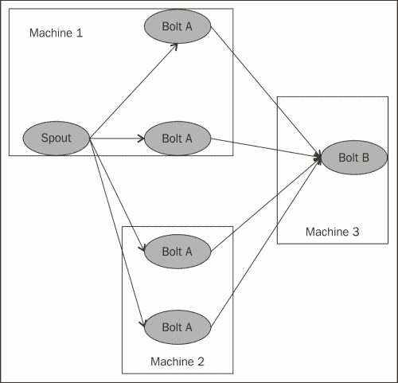

# 九、Storm 管理和维护

在本章中，您将了解 Storm 集群的缩放。您还将看到如何调整 Storm 拓扑工作器和并行性。

我们将涵盖以下主题:

*   添加新的主管节点
*   设置工人和平行度以增强处理
*   解决纷争

# 扩展 Storm 集群–添加新的主管节点

在生产中，最常见的情况之一是处理需求超出了集群的规模。然后，缩放变得必要；有两种选择:我们可以执行垂直扩展，增加更多的计算能力，或者我们可以使用水平扩展，增加更多的节点。后者更具成本效益，也使集群更加健壮。

以下是向 Storm 集群添加新节点时要执行的步骤:

1.  通过提取下载的 ZIP 文件，下载并安装 0.9.2 版本的 Storm，因为它在集群的其余部分中使用。
2.  创建所需的目录:

    ```scala
    sudo mkdir –p /usr/local/storm/tmp

    ```

3.  所有 Storm 节点、Nimbus 节点和管理器都需要一个位置来存储本地磁盘上与配置相关的少量数据。请确保您创建了目录，并在所有 Storm 节点上分配了读/写权限。
4.  为日志创建所需的目录，如下所示:

    ```scala
    sudo mkdir –p /mnt/app_logs/storm/storm_logs

    ```

5.  Update the `storm.yaml` file with necessary changes for Nimbus and Zookeeper:

    ```scala
    #storm.zookeeper.servers: This is a list of the hosts in the  Zookeeper cluster for Storm cluster
    storm.zookeeper.servers: 
      - "<IP_ADDRESS_OF_ZOOKEEPER_ENSEMBLE_NODE_1>"
      - "<IP_ADDRESS_OF_ZOOKEEPER_ENSEMBLE_NODE_2>"
    #storm.zookeeper.port: Port on which zookeeper cluster is running.
      storm.zookeeper.port: 2182
    #For our installation, we are going to create this directory in  /usr/local/storm/tmp location.
    storm.local.dir: "/usr/local/storm/tmp"
    #nimbus.host: The nodes need to know which machine is the #master  in order to download topology jars and confs. This #property is  used for the same purpose.
    nimbus.host: "<IP_ADDRESS_OF_NIMBUS_HOST>"
    #storm.messaging.netty configurations: Storm's Netty-based  #transport has been overhauled to significantly improve  #performance through better utilization of thread, CPU, and  #network resources, particularly in cases where message sizes  #are small. In order to provide netty support, following  #configurations need to be added :
    storm.messaging.transport:"backtype.storm.messaging.netty.Context"
    storm.messaging.netty.server_worker_threads:1
    storm.messaging.netty.client_worker_threads:1
    storm.messaging.netty.buffer_size:5242880
    storm.messaging.netty.max_retries:100
    storm.messaging.netty.max_wait_ms:1000
    storm.messaging.netty.min_wait_ms:100
    ```

    管理端口的插槽值如下:

    <colgroup class="calibre19"><col class="calibre20"></colgroup> 
    | `supervisor.slots.ports` |
    | - 6700 |
    | - 6701 |
    | - 6702 |
    | - 6703 |

6.  在`~/.bashrc`文件中设置`STORM_HOME`环境，并在`PATH`环境变量中添加暴风的`bin`目录。这是为了从任何位置执行 Storm 二进制文件而添加的。要添加的条目如下:

    ```scala
    STORM_HOME=/usr/local/storm
    PATH=$PATH:$STORM_HOME/bin

    ```

7.  在以下每台机器和节点上更新`/etc/hosts`:
    *   光轮机器:这样做是为了给正在添加的新主管添加一个条目
    *   所有现有的主管计算机:这是为了给正在添加的新主管添加一个条目
    *   新的主管节点:这样做是为了添加 nimbus 条目，为所有其他主管添加条目，并为 Zookeeper 节点添加条目

以下是 IP 10.46.205.248 和`sup-flm-1.mydomain.com`主机的示例片段:

```scala
10.192.206.160    sup-flm-2\. mydomain.net
10.4.27.405       nim-zkp-flm-3\. mydomain.net
```

添加主管后，启动流程，它应该在用户界面上可见，如下图所示:


请注意，前面截图中的第一行指向新添加的主管；它总共有 16 个插槽，`0`插槽正在使用，因为它刚刚被添加到集群中。

# 扩展 Storm 集群并重新平衡拓扑

一旦添加了新的管理器，下一个显而易见的步骤将是重新平衡在集群上执行的拓扑，以便负载可以被新添加的管理器分担。

## 使用图形用户界面进行重新平衡

在 Nimbus UI 上提供了重新平衡选项，在这里可以选择要重新平衡的拓扑，然后使用 GUI 中的选项。拓扑根据指定的超时耗尽。在此期间，它停止接受来自喷口的任何消息，内部队列中的消息被处理，一旦完全清除，工作人员和任务被重新分配。用户还可以选择使用重新平衡选项增加或减少各种螺栓和喷嘴的平行度。以下屏幕截图描述了如何使用 Storm 用户界面选项重新平衡拓扑:


## 使用命令行界面进行重新平衡

重新平衡的第二个选项是使用 Storm 命令行界面。对此的命令如下:

```scala
storm rebalance mystormtopology -n 5 -e my-spout=3 -e my-bolt=10

```

这里，`–n`指定了重新平衡后分配给拓扑的工人数量，`-e my-spout`表示分配给喷口的平行度，类似地`–e my-bolt`表示分配给螺栓的平行度。在前面的命令中，我们从 Storm 安装 JAR 下的`bin`目录中执行了 Storm 外壳，同时通过改变喷口和螺栓的平行度来重新平衡 Storm 拓扑。

可以从 Storm 用户界面验证对前面命令执行的更改。

# 设置工人和平行度以增强加工

Storm 是一个高度可扩展、分布式和容错的实时并行处理计算框架。请注意，重点是可伸缩性、分布式和并行处理——嗯，我们已经知道 Storm 以集群模式运行，因此以其基本性质分布在中。可伸缩性在上一节已经讨论过了；现在，让我们仔细看看并行性。我们在前面的章节中向您介绍了这个概念，但是现在我们将让您了解如何调整它以达到期望的性能。以下几点是这方面的关键标准:

*   拓扑在启动时会分配一定数量的工作人员。
*   拓扑中的每个组件(螺栓和喷口)都有指定数量的执行器与之关联。这些执行器为拓扑的每个运行组件指定并行度。
*   Storm 的整体效率和速度因素是由 Storm 的并行特性驱动的，但我们需要了解一件事:所有归因于并行的执行器都在分配给拓扑的有限工作人员集中运行。因此，我们需要明白，增加并行性只会在一定程度上有助于实现效率，但除此之外，执行者还会为资源而斗争。超出这一增加的并行度将不会提高提取效率，但是增加分配给拓扑的工作人员将会提高计算效率。

在效率方面需要理解的另一点是网络延迟；我们将在下面的章节中探讨这一点。

## 场景 1

下图展示了一个简单的拓扑结构，有三个移动部件:一个喷口和两个螺栓。这里，所有组件都在集群中的独立节点上执行，因此每个元组都必须进行两次网络跳跃才能完成其执行。


假设我们对吞吐量不满意，决定增加并行度。当我们试图进入这项技术的时候，出现的问题是在哪里增加它，增加多少。这可以根据螺栓的容量来计算，这应该可以从 Storm 用户界面中看到。下面的截图说明了这一点:


这里，圈出的值是第二个螺栓的容量，大约是 0.9，并且已经是红色的，这意味着这个螺栓工作过度，在这里增加平行度应该会有所帮助。当螺栓容量超过`1`时，任何拓扑实际上都将断开并停止打包。为了解决这个问题，让我们看看下一个场景，它为这个问题提供了一个解决方案。

## 场景二

在这里，我们已经根据 **Bolt B** 过载并增加了并行度的认识采取了行动，如下图所示:



上图中的描述了一个场景，该场景捕获了集群中不同节点上螺栓和喷口的各种实例的分布。在这里，我们根据螺栓过载的认识采取了行动，我们观察了容量，并通过蛮力，仅增加了该螺栓的平行度。

现在，我们已经做到了这一点，实现了所需的并行性；现在让我们看看网络延迟，根据节点之间有多少元组在移动(节点间通信是分布式计算设置中的一个强制性元素):

*   50%的流量在**机器 1** 和**机器 2** 的喷口之间跳跃
*   50%的流量在**机器 1** 和**机器 3** 之间跳跃
*   100%的流量在**机器 2** 和**机器 3** 之间跳跃

现在让我们看另一个平行度略有变化的例子。

## 场景 3

场景 3 是本例设置中最可能的最优场景，其中我们非常有效地使用了网络和并行，如下图所示:


上图说明了我们从并行性使用中获得的最大好处。如果你看一下上图，你会发现我们实现了高效率，没有网络跳跃；两全其美。

我想说明的是，应该通过司法手段改变并行性，同时牢记网络延迟、跳数和本地化处理速度的影响。

# Storm 故障排除

作为开发人员，我们需要接受事情确实会出错，需要调试的现实。本节将帮助你有效地处理这种情况。首先要理解编程世界的两个根本咒语:

*   工作吧，就好像所有可能破碎的东西都会破碎
*   任何可能损坏的东西都可以修复

接受现实后，让我们首先通过了解什么可能失败来解决问题，然后清楚地了解我们应该从哪里开始分析，以帮助我们处理 Storm 集群的任何情况。让我们抓住向我们展示问题的各种指针，从而引导我们找到未来的解决方案。

## Storm 界面

首先，让我们了解 UI 本身存在哪些统计数据和指标。最新的用户界面有多个指标，让我们了解集群中的正在进行什么，以及可能会出现什么问题(以防万一)。

让我们看看**集群概要**需要的 Storm 用户界面，例如，在我的例子中`http:// ip of nimbus:8080`是`http://10.4.2.122:8080`，我的用户界面进程在具有这个 IP: 10.4.2.122 的光轮机器上执行。


在前面的截图中，我们可以看到以下参数:

*   正在使用的 Storm 版本在第一列。
*   Nimbus 的正常运行时间(第二列)告诉我们 Nimbus 节点自上次重启以来已经运行了多长时间。正如我们所知，Nimbus 仅在提交拓扑结构时，或者当主管或工作人员停止工作并再次委派任务时才需要。在重新平衡拓扑的过程中，还需要启动 Nimbus。
*   第三列给出了集群中主管的数量。
*   第四列、第五列和第六列显示了已使用的工作者插槽的数量、可用的工作者插槽的数量以及 Storm 管理器中工作者插槽的总数。这是一个非常重要的统计数据。在任何一个生产等级集群中，总应该有一些工人倒下或者一两个主管被杀的规定。因此，我建议您的群集上始终有足够的空闲插槽来容纳这种突然的故障。
*   第七列和第八列指定拓扑中的移动任务，即根据系统中运行的任务和执行器的数量。

我们来看看 Storm UI 打开页面的第二部分；这一个捕获拓扑摘要:


本节描述了 Storm 捕获的各种参数，并在拓扑级别显示:

*   第一列和第二列分别显示拓扑的**名称**字段和拓扑的 **Id** 字段。
*   第三列读取拓扑的状态，对于正在执行和处理的拓扑，状态为**活动**。
*   第四列显示拓扑启动以来的正常运行时间。
*   接下来的三列显示 **Numworkers** 、 **Num tasks** 和**Num executors**；这些是拓扑性能非常重要的方面。在调整性能时，必须意识到仅仅增加**数量任务**和**数量执行器**字段值可能不会带来更高的效率。如果工作人员数量少，而我们只是增加执行器和任务的数量，那么由于工作人员数量有限，资源的匮乏程度很高，因此拓扑性能会恶化。

类似地，如果我们将太多的工作人员分配到一个没有足够的执行器和任务来利用他们的拓扑结构中，我们会因为保持它们被阻塞和空闲而浪费宝贵的资源。

另一方面，如果我们有大量的工作人员和大量的执行者和任务，性能可能会由于网络延迟而下降。

在陈述了这些事实之后，我想强调一个事实，即性能调优应该谨慎而明智地进行，以得出适合我们试图实现的用例的数字。

下面的屏幕截图根据统计数据捕获了主管的详细信息，以及相应的信息:


*   第一列有主管的 **Id** 字段，第二列有主管进程正在运行的**主机**字段的名称。
*   第三列记录主管已经运行的时间。
*   第五列和第六列分别记录了监控器上可用的插槽数量和使用的插槽数量。这两个数字提供了一个非常重要的指标，即有多少插槽可用以及使用了多少。它们帮助我们判断和理解主管在什么容量下工作，以及他们有多少带宽来处理故障情况；例如，我的所有主管都在以 100%的容量运行，因此在这种情况下，我的集群无法处理任何故障。

以下截图是从 Storm 用户界面捕获的，描述了主管及其属性:


上一节向我们详细介绍了监管槽、超时等。这些值在`storm.yaml`上指定，但可以从 UI 中验证。比如我这里的`http:// ip of nimbus:8080`就是`http://10.4.2.122:8080`，我的 UI 进程在拥有这个 IP: 10.4.2.122 的 Nimbus 机器上执行，如下图截图所示:


现在在下面截图中描述的部分，你可以通过深入拓扑细节来进入。这可以通过单击任意拓扑名称在 Storm 用户界面上实现。本节包含拓扑组件的详细信息，包括螺栓、喷口的级别以及它们的详细信息，如下图所示:


前面的截图有详细信息，从分配给每个组件的执行器或任务的数量，到螺栓或喷口发出的元组的数量，以及**有向无环图** ( **DAG** )中转移到下一个组件的元组的数量。

拓扑详细信息页面上应注意的其他细节如下:

*   **最后 10 分钟螺栓的容量**:这个应该远低于 1。
*   **执行延迟**是以毫秒为单位的时间:这决定了通过这个组件执行一个元组需要多长时间。如果这个值太高，那么我们可能希望将执行分成两个或更多的螺栓，以利用并行性并具有更好的效率。
*   **已执行**:存储该组件成功执行的元组数量。
*   **进程延迟**:该值显示组件执行元组所花费的平均总时间。应该使用执行延迟来分析该值。这些是可能发生的实际案例:
    *   **执行延迟**和**处理延迟**都很低(这是最好的情况)
    *   **执行延迟**较低，但进程延迟非常高(这意味着实际执行时间与总执行时间相比较低，增加并行度可能有助于提高效率)
    *   **执行延迟**和**进程延迟**都很高(同样，增加并行度可能会有所帮助)

## Storm 日志

如果事情没有按预期进行，下一个需要调试的地方是 Storm 日志。首先需要知道 Storm 日志的位置，Storm 日志也会在`storm-0.9.2-incubating.zip\apache-storm-0.9.2-incubating\logback\cluster.xml`更新`cluster.xml`上的路径:

```scala
<appender class="ch.qos.logback.core.rolling.RollingFileAppender"  name="A1">
  <!—update this as below  <file>${storm.home}/logs/${logfile.name}</file> -->
 <file>/mnt/app_logs/storm/storm_logs/${logfile.name}</file>
  <rollingPolicy  class="ch.qos.logback.core.rolling.FixedWindowRollingPolicy">
    <fileNamePattern>${storm.home}/logs/${logfile.name}.%i </fileNamePattern>
    <minIndex>1</minIndex>
    <maxIndex>9</maxIndex>
</rollingPolicy>
<triggeringPolicy  class="ch.qos.logback.core.rolling.SizeBasedTriggeringPolicy">
    <maxFileSize>100MB</maxFileSize>
</triggeringPolicy>
  <encoder>
    <pattern>%d{yyyy-MM-dd HH:mm:ss} %c{1} [%p] %m%n</pattern>
  </encoder>
</appender>
```

现在粗体显示的行为您提供了创建 Storm 日志的路径/位置。让我们仔细看看不同的 Storm 守护进程创建了哪些类型的日志。

Nimbus 节点日志可以通过在 shell 上使用以下命令获得:

```scala
Cd /mnt/my_logs/strom/storm_logs
ls-lart

```

以下截图显示了 Nimbus 日志目录的列表:


请注意，我们有`nimbus.log`，其中有关于 Nimbus 启动、错误和信息日志的详细信息；`ui.log`是在我们启动 Storm UI 应用程序的节点上创建的。

可以通过在 shell 中使用以下命令来获取主管节点上的日志:

```scala
Cd /mnt/my_logs/strom/storm_logs
ls-lart

```

主管日志目录的列表如下图所示:


可以查看主管日志和工人日志。主管日志记录主管启动、任何错误等详细信息。工作日志是开发人员的拓扑日志以及各种螺栓和喷嘴的 Storm 日志出现的地方。

因此，如果我们想解决 Storm 守护进程的问题，我们可以看看`nimbus.log`和`supervisor.log`。如果您有问题，那么您需要使用相应的工作日志进行调试。[第 4 章](04.html#page "Chapter 4\. Storm in a Clustered Mode")、*集群模式下的 Storm*已经讲述了光轮和工作节点故障的场景。

现在让我们想象一个场景。我是一名开发人员，其拓扑结构的表现不如预期，我怀疑其中一个螺栓的功能不如预期。所以我们需要调试工作日志，找到根本原因。现在我们需要从多个主管和众多工作日志中找出要查看的工作日志；我们将从 Storm UI 中获取这些信息。请执行以下步骤:

1.  打开**Storm UI** 点击麻烦的拓扑。
2.  Click on the suspected bolt or spout of the topology. A screen analogous to what is shown in this screenshot should appear:

    

下面是调试这个螺栓的线索；我将在`supervisor5`和`supervisor6`上查看`worker-6705.log`的`Supervisor5`和`Supervisor6`。

# 测验时间

问题 1 .陈述以下陈述是真是假:

1.  拓扑正在执行时，不能将 Storm 节点添加到群集中。
2.  拓扑无法经受 Storm 节点故障。
3.  在集群中的每个节点上都创建了 Storm 日志。
4.  创建 Storm 日志的位置是可配置的。

问题 2 .填空:

1.  _____ 是群集的心跳跟踪器。
2.  ___________ 是拓扑提交和重新平衡所必需的守护程序。
3.  _____ 文件保存拓扑的工作配置。

问题 3 .执行以下用例来查看 Storm 的内部结构:

1.  启动 nimbus，查看`nimbus.log`看看成功的创业应该是什么样子。
2.  启动主管并检查`Supervisor.log`以查看成功的启动应该是什么样子。
3.  提交拓扑，说一个简单的`WordCount`拓扑，算出`worker.log`文件创建。
4.  更新`log4j.properties`更改日志级别，验证其影响。

# 总结

在本章中，我们已经介绍了 Storm 在添加新节点、重新平衡和消除拓扑方面的维护概念。我们已经理解并调整了内部结构，例如`numtasks`和并行性，以及`numworkers`和网络延迟。你学会了定位和破译 Storm 组件的日志。您还了解了 Storm 用户界面的指标及其对拓扑性能的影响。

在下一章中，我们将讨论 Storm 的高级概念，包括微批处理和 Trident APIs。