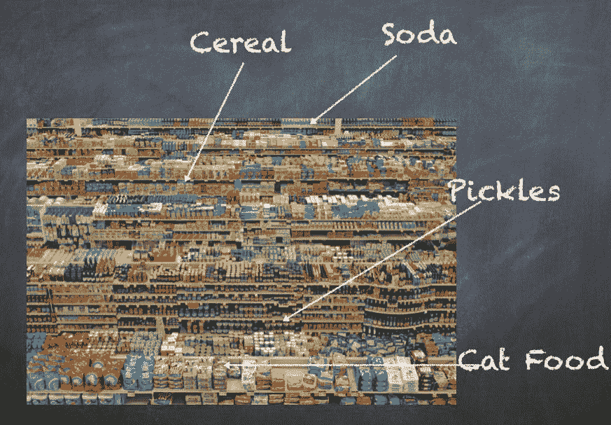
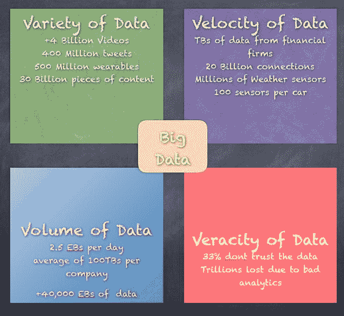
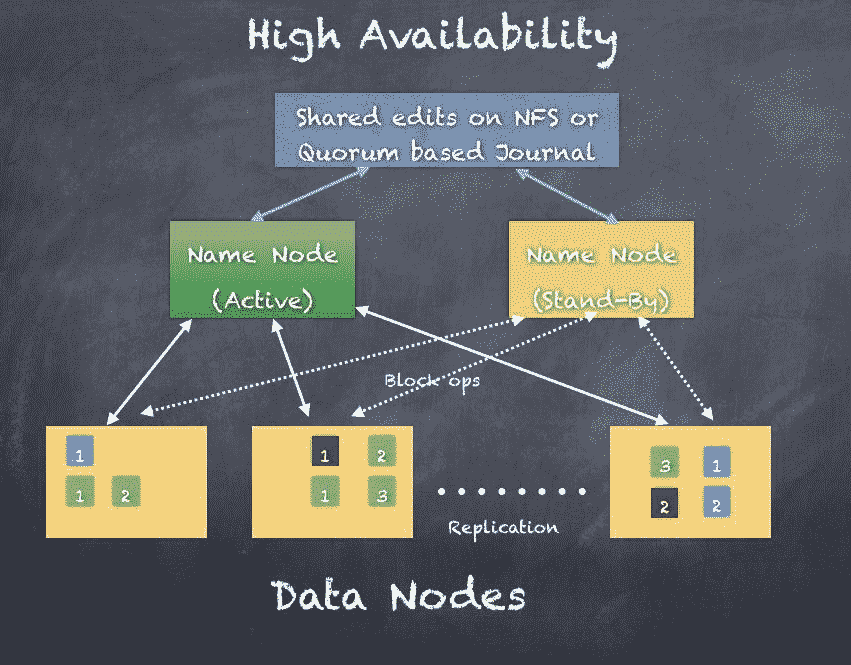
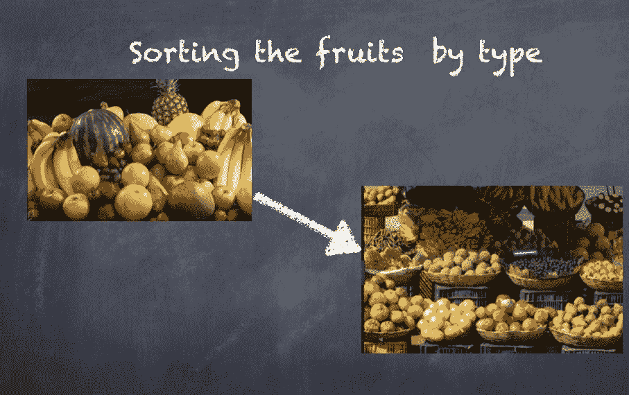
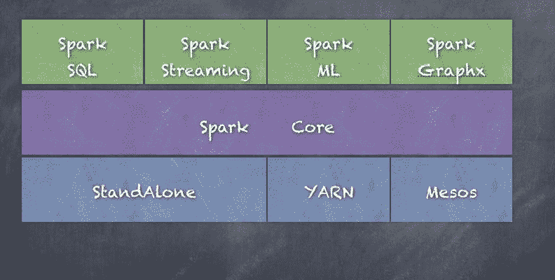
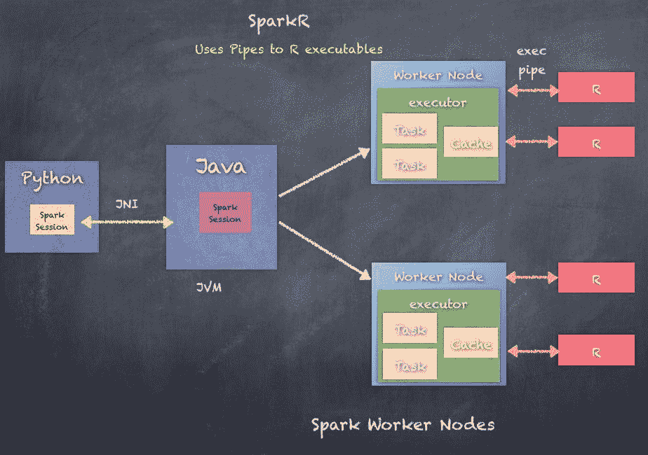

# 五、应对大数据——Spark 来了

An approximate answer to the right problem is worth a good deal more than an exact answer to an approximate problem. - John Tukey

在本章中，您将学习数据分析和大数据；我们看到了大数据带来的挑战以及如何应对这些挑战。您将学习分布式计算和函数式编程建议的方法；我们介绍谷歌的 MapReduce、Apache Hadoop，最后介绍 Apache Spark，看看他们是如何接受这种方法和这些技术的。

简而言之，本章将涵盖以下主题:

*   数据分析导论
*   大数据介绍
*   使用 Apache Hadoop 的分布式计算
*   ApacheSpark 来了

# 数据分析导论

**数据分析**是在检查数据时应用定性和定量技术的过程，目的是提供有价值的见解。数据分析使用各种技术和概念，可以提供探索数据**探索数据分析** ( **EDA** )以及对数据得出结论**验证数据分析** ( **CDA** )的手段。EDA 和 CDA 是数据分析的基本概念，理解两者之间的区别很重要。

EDA 涉及用于探索数据的方法、工具和技术，旨在发现数据中的模式以及数据各种元素之间的关系。CDA 涉及方法、工具和技术，用于根据假设和统计技术或对数据的简单观察，对特定问题提供见解或结论。

理解这些想法的一个快速例子是一家杂货店，它要求你给他们一些方法来提高销售额和客户满意度，并保持低运营成本。

下面是一家杂货店，有各种产品的过道:

假设杂货店的所有销售额都存储在某个数据库中，并且您可以访问过去 3 个月的数据。通常，企业会将数据存储数年，因为您需要一段时间内的足够数据来建立任何假设或观察任何模式。在本例中，我们的目标是根据客户购买产品的方式，在不同的通道中更好地放置产品。一种假设是，顾客经常购买既与眼睛平齐又靠得很近的产品。例如，如果牛奶在商店的一个角落，酸奶在商店的另一个角落，一些顾客可能会选择牛奶或酸奶，然后离开商店，导致生意损失。更不利的影响可能会导致顾客选择另一家商品摆放更好的商店，因为如果感觉*的东西在这家商店很难找到*。一旦这种感觉产生，它也会渗透到朋友和家人身上，最终导致不好的社交表现。这种现象在现实世界中并不少见，导致一些企业成功，而另一些企业失败，而两者在产品和价格上似乎非常相似。

有很多方法可以解决这个问题，从客户调查到专业统计人员再到机器学习科学家。我们的方法将是了解我们仅从销售交易中能得到什么。

以下是事务可能是什么样子的示例:

作为 EDA 的一部分，您可以遵循以下步骤:

1.  计算*每天平均购买的产品数量=一天内售出的所有产品总数/第*天*第*天的总收货数量。
2.  对最近 1 周、1 月和 1 季度重复上述步骤。

3.  试着理解周末和工作日以及一天中的时间(早上、中午和晚上)是否有区别
4.  对于每个产品，创建一个所有其他产品的列表，以查看哪些产品通常是一起购买的(相同的收据)
5.  对 1 天、1 周、1 个月和 1 个季度重复上述步骤。
6.  尝试通过交易数量(按降序排序)来确定哪些产品应该放得更近。

一旦我们完成了前面的 6 个步骤，我们就可以尝试为 CDA 得出一些结论。

让我们假设这是我们得到的输出:

| **项** | **一周中的某一天** | **数量** |
| 牛奶 | 星期日 | One thousand two hundred and forty-four |
| 面包 | 星期一 | Two hundred and forty-five |
| 牛奶 | 星期一 | One hundred and ninety |

在这种情况下，我们可以说**牛奶**在*周末*买得更多，所以最好在周末增加牛奶产品的数量和种类。请看下表:

| **第 1 项** | **第 2 项** | **数量** |
| 牛奶 | 蛋 | Three hundred and sixty |
| 面包 | 奶酪 | Three hundred and thirty-five |
| 奥尼恩斯（姓氏） | 番茄 | Three hundred and ten |

在这种情况下，我们可以说**牛奶**和**鸡蛋**被*更多的*顾客一次购买，然后是**面包**和**奶酪。**所以，我们可以建议商店重新调整过道和货架，将**牛奶**和**鸡蛋** *移近*。

我们有两个结论:

*   **牛奶**在*周末、*买的比较多，所以最好周末增加奶制品的数量和种类。
*   **牛奶**和**鸡蛋**被*更多*顾客一次购买，其次是**面包**和**奶酪。**所以，我们可以建议商店重新调整过道和货架，将**牛奶**和**鸡蛋** *移近*。

Conclusions are usually tracked over a period of time to evaluate the gains. If there is no significant impact on sales even after adopting the preceding two recommendations for 6 months, we simply invested in the recommendations which are not able to give you a good Return On Investment (ROI).

同样，您也可以对利润率和定价优化进行一些分析。这就是为什么你通常会看到一件单品的价格高于购买的同一件单品的多个数字的平均值。7 美元买一瓶洗发水，12 美元买两瓶洗发水。

Think about other aspects you can explore and recommend for the grocery store. For example, can you guess which products to position near checkout registers just based on fact that these have no affinity toward any particular product--chewing gum, magazines, and so on.

数据分析计划支持多种业务用途。例如，银行和信用卡公司分析取款和支出模式，以防止欺诈和身份盗窃。广告公司分析网站流量，以确定很有可能转化为客户的潜在客户。百货商店分析顾客数据，以确定更好的折扣是否有助于促进销售。手机运营商可以想出定价策略。有线电视公司一直在寻找可能流失的客户，除非给出一些报价或促销价格来留住他们的客户。医院和制药公司分析数据，以提出更好的产品，并检测处方药的问题或衡量处方药的性能。

# 在数据分析过程中

数据分析应用不仅仅是分析数据。在计划任何分析之前，还需要投入时间和精力收集、集成和准备数据，检查数据质量，然后开发、测试和修订分析方法。一旦数据准备就绪，数据分析师和科学家就可以使用统计方法(如 SAS)或使用 Spark ML 的机器学习模型来探索和分析数据。数据本身由数据工程团队准备，数据质量团队检查收集的数据。数据治理也成为确保正确收集和保护数据的一个因素。另一个不太为人所知的角色是数据管理员，他专门了解数据的字节、数据的确切来源、发生的所有转换以及业务真正需要的数据列或字段。

Various entities in the business might be dealing with addresses differently, **123 N Main St** as opposed to **123 North Main Street.** But, our analytics depends on getting the correct address field; otherwise both the addresses mentioned above will be considered different and our analytics will not have the same accuracy.

分析过程从基于分析师可能需要的数据仓库的数据收集开始，收集组织中的各种数据(销售、营销、员工、薪资、人力资源等)。数据管理员和治理团队在这里非常重要，以确保收集到正确的数据，并且即使最终用户都是员工，任何被视为机密或私人的信息也不会被意外导出。

Social Security Numbers or full addresses might not be a good idea to include in analytics as this can cause a lot of problems to the organization.

必须建立数据质量流程，以确保正在收集和设计的数据是正确的，并且符合数据科学家的需求。在此阶段，主要目标是发现并修复可能影响分析需求准确性的数据质量问题。常见的技术是分析数据和清理数据，以确保数据集中的信息是一致的，并且删除任何错误和重复记录。

来自不同源系统的数据可能需要使用各种数据工程技术进行组合、转换和标准化，例如分布式计算或 MapReduce 编程、流处理或 SQL 查询，然后存储在亚马逊 S3、Hadoop 集群、网络连接存储或存储区域网络存储设备或传统数据仓库(如 Teradata)上。数据准备或工程工作涉及为计划的分析用途操纵和组织数据的技术。

一旦我们准备好数据并检查质量，数据科学家或分析师可以使用这些数据，实际的分析工作就开始了。数据科学家现在可以使用预测建模工具和语言(如 SAS、Python、R、Scala、Spark、H2O 等)来构建分析模型。该模型最初针对部分数据集运行，以在*训练阶段*测试其准确性。在任何分析项目中，训练阶段的几次迭代都是常见的和预期的。在模型级别上进行调整之后，或者有时一直到数据管家去获取或修复一些正在收集或准备的数据，模型输出往往会变得越来越好。最后，当进一步的调整没有明显改变结果时，达到稳定状态；此时，我们可以认为模型已经准备好投入生产使用。

现在，该模型可以在生产模式下针对整个数据集运行，并根据我们训练模型的方式生成结果或结果。在构建分析时所做的选择，无论是统计还是机器学习，都会直接影响模型的质量和目的。你不能看着食品杂货的销售额，就能知道亚洲人买的牛奶是否比墨西哥人多，因为这需要人口统计数据中的额外因素。同样，如果我们的分析侧重于客户体验(产品的退货或更换)，那么它所基于的技术和模型与我们试图侧重于收入或追加销售客户的情况不同。

You will see various machine learning techniques in later chapters.

因此，分析应用可以通过几个学科、团队和技能集来实现。分析应用可以用来生成报告，一直到自动触发业务操作。例如，您可以简单地创建每日销售报告，每天早上 8 点通过电子邮件发送给所有经理。但是，您也可以与业务流程管理应用或一些定制的股票交易应用集成，以采取动作，如购买、出售或股票市场活动警报。你也可以考虑接收新闻文章或社交媒体信息，以进一步影响将要做出的决定。

数据可视化是数据分析的一个重要部分，当您查看大量指标和计算时，很难理解数字。相反，人们越来越依赖**商业智能** ( **BI** )工具，如 Tableau、QlikView 等来探索和分析数据。当然，大规模的可视化，如显示全国所有优步汽车或显示纽约市供水的热图，需要更多的定制应用或专门工具来构建。

管理和分析数据一直是所有行业中许多不同规模组织面临的挑战。企业一直在努力寻找一种实用的方法来获取关于客户、产品和服务的信息。当公司只有少数顾客购买他们的一些商品时，这并没有那么困难。这不是一个大的挑战。但随着时间的推移，市场上的公司开始增长。事情变得更加复杂。现在，我们有品牌信息和社交媒体。我们有通过互联网买卖的东西。我们需要拿出不同的解决方案。网络开发、组织、定价、社交网络和细分；我们正在处理大量不同的数据，在处理、管理、组织和试图从数据中获得一些洞察力时，这些数据会带来更多的复杂性。

# 大数据介绍

如前所述，数据分析结合了技术、工具和方法来探索和分析数据，从而为业务产生可量化的结果。结果可能是简单地选择一种颜色来绘制店面，或者是对顾客行为进行更复杂的预测。随着业务的增长，越来越多的分析方法开始出现。在 20 世纪 80 年代或 90 年代，我们所能得到的只有一个 SQL 数据仓库；如今，许多外部因素都在影响着企业的经营方式。

Twitter, Facebook, Amazon, Verizon, Macy's, and Whole Foods are all companies that run their business using data analytics and base many of the decisions on it. Think about what kind of data they are collecting, how much data they might be collecting, and then how they might be using the data.

让我们看看前面看到的杂货店例子。如果商店开始扩大业务，建立 100 家商店会怎么样。自然，销售交易必须以比单一商店多 100 倍的规模收集和存储。但是，再也没有企业独立运作了。从当地新闻、推文、yelp 评论、客户投诉、调查活动、其他商店的竞争、不断变化的人口统计数据或当地经济等方面，有很多信息。所有这些附加数据都有助于更好地理解客户行为和收入模型。

例如，如果我们看到对商店停车设施的负面情绪越来越多，那么我们可以对此进行分析，并采取纠正措施，例如验证停车或与城市公共交通部门协商，以提供更频繁的火车或公共汽车，从而达到更好的效果。

这种数量和种类不断增加的数据虽然提供了更好的分析，但也给试图存储、处理和分析所有数据的业务信息技术组织带来了挑战。事实上，看到大量的数据并不少见。

Every day, we create more than 2 quintillion bytes of data (2 Exa Bytes), and it is estimated that more than 90% of the data has been generated in the last few years alone.
**1 KB = 1024 Bytes**
**1 MB = 1024 KB**
**1 GB = 1024 MB**
**1 TB = 1024 GB ~ 1,000,000 MB**
**1 PB = 1024 TB ~ 1,000,000 GB ~ 1,000,000,000 MB**
**1 EB = 1024 PB ~ 1,000,000 TB ~ 1,000,000,000 GB ~ 1,000,000,000,000 MB**

20 世纪 90 年代以来如此大量的数据，以及理解和理解数据的需要，产生了术语*大数据*。

The term big data, which spans computer science and statistics/econometrics, probably originated in the lunch-table conversations at Silicon Graphics in the mid-1990s, in which John Mashey figured prominently.

2001 年，时任咨询公司 Meta Group Inc(被 Gartner 收购)分析师的道格·兰尼(Doug Laney)提出了 3Vs(品种、速度和数量)的概念。现在，我们指的是 4 Vs，而不是 3Vs，增加了 3Vs 的数据准确性。

# 大数据的 4 Vs

以下是用于描述大数据属性的大数据 4 个 Vs。

# 数据的多样性

数据可以来自天气传感器、汽车传感器、人口普查数据、脸书更新、推文、交易、销售和营销。数据格式既有结构化的，也有非结构化的。数据类型也可以不同；二进制、文本、JSON 和 XML。

# 数据速度

您可以从数据仓库、批处理模式文件档案、近乎实时的更新或您刚刚预订的优步座驾的即时实时更新中获取数据。

# 数据量

数据可以收集和存储一小时、一天、一个月、一年或十年。对于许多公司来说，数据量正在增长到 100 倍。

# 数据的准确性

可以对数据进行分析，以获得可操作的见解，但是由于跨数据源分析了如此多的所有类型的数据，因此很难确保正确性和准确性证明。

以下是大数据的 4 个方面:

为了理解所有数据并将数据分析应用于大数据，我们需要扩展数据分析的概念，以更大的规模处理大数据的 4 个方面。这不仅改变了用于分析数据的工具、技术和方法，也改变了我们处理问题的方式。如果 SQL 数据库在 1999 年用于某个企业的数据，那么现在为了处理同一企业的数据，我们将需要一个分布式 SQL 数据库，它可以扩展并适应大数据空间的细微差别。

大数据分析应用通常包括来自内部系统和外部来源的数据，例如由第三方信息服务提供商汇编的天气数据或消费者人口数据。此外，流分析应用在大数据环境中变得越来越普遍，因为用户希望对通过 Spark 的 Spark 流模块或其他开源流处理引擎(如 Flink 和 Storm)输入 Hadoop 系统的数据进行实时分析。

早期的大数据系统大多部署在内部，尤其是在收集、组织和分析大量数据的大型组织中。但是云平台供应商，如**亚马逊网络服务** ( **AWS** )和微软，已经使得在云中建立和管理 Hadoop 集群变得更加容易，像 Cloudera 和 Hortonworks 这样的 Hadoop 供应商也是如此，它们支持在 AWS 和微软 Azure 云上分发大数据框架。用户现在可以在云中加速集群，根据需要运行多长时间，然后让它们离线，基于使用情况的定价不需要持续的软件许可。

可能会让组织在大数据分析计划上陷入困境的潜在陷阱包括缺乏内部分析技能，以及雇佣经验丰富的数据科学家和数据工程师来填补空白的高昂成本。

通常涉及的数据量及其多样性会导致数据质量、一致性和治理等领域的数据管理问题；此外，在大数据架构中使用不同的平台和数据存储会导致数据孤岛。此外，将 Hadoop、Spark 和其他大数据工具集成到满足组织大数据分析需求的内聚体系结构中，对于许多信息技术和分析团队来说是一个具有挑战性的命题，他们必须确定正确的技术组合，然后将这些组合在一起。

# 使用 Apache Hadoop 的分布式计算

我们的世界充满了各种设备，从智能冰箱、智能手表、电话、平板电脑、笔记本、机场的自助服务亭、自动取款机向您发放现金，还有更多。我们能够做几年前甚至无法想象的事情。Instagram、Snapchat、Gmail、脸书、Twitter 和 Pinterest 是我们现在如此习惯的几个应用；很难想象有一天无法访问这些应用。

随着云计算的出现，只需点击几下鼠标，我们就可以在 AWS、Azure(微软)或谷歌云等平台上启动 100 台机器，并使用巨大的资源来实现我们的各种业务目标。

云计算向我们介绍了 IaaS、PaaS 和 SaaS 的概念，这使我们能够构建和运营可扩展的基础架构，为所有类型的用例和业务需求提供服务。

**IaaS** (**Infrastructure as a Service**) - Reliable-managed hardware is provided without the need for a Data center, power cords, Airconditioning, and so on.
**PaaS** (**Platform as a Service**) - On top of IaaS, managed platforms such as Windows, Linux , Databases and so on are provided.
**SaaS** (**Software as a Service**) - On top of SaaS, managed services such as SalesForce, [Kayak.com](https://www.kayak.co.in/?ispredir=true) and so on are provided to everyone.

幕后是高度可扩展的分布式计算世界，这使得存储和处理 PB (PetaBytes)数据成为可能。

1 ExaByte = 1024 PetaBytes (50 Million Blue Ray Movies)
1 PetaByte = 1024 Tera Bytes (50,000 Blue Ray Movies)
1 TeraByte = 1024 Giga Bytes (50 Blue Ray Movies)
Average size of 1 Blue Ray Disc for a Movie is ~ 20 GB

现在，分布式计算的范例实际上并不是一个真正的新课题，几十年来，主要是在研究机构以及一些商业产品公司以某种形式或形式进行研究。**大规模并行处理** ( **MPP** )是几十年前在海洋学、地震监测和太空探索等几个领域使用的范例。Teradata 等多家公司也实施了 MPP 平台，并提供商业产品和应用。最终，谷歌和亚马逊等科技公司将可扩展分布式计算的利基领域推向了一个新的发展阶段，最终导致伯克利大学创建了 Apache Spark。

谷歌发布了一篇关于**地图缩减** ( **MR** )以及**谷歌文件系统** ( **GFS** )的论文，将分布式计算的原理带给了大家。当然，这需要归功于道格·卡特，他通过实施谷歌白皮书中给出的概念和向世界介绍 Hadoop 使这一切成为可能。

Apache Hadoop 框架是一个用 Java 编写的开源软件框架。框架提供的两个主要领域是存储和处理。对于存储，Apache Hadoop 框架使用 **Hadoop 分布式文件系统** ( **HDFS** )，它基于 2003 年 10 月发布的 Google 文件系统论文。对于处理或计算，该框架依赖于 MapReduce，它基于 2004 年 12 月发布的一篇关于 MR 的谷歌论文。

The MapReduce framework evolved from V1 (based on Job Tracker and Task Tracker) to V2 (based on YARN).

# Hadoop 分布式文件系统(HDFS)

HDFS 是一个用 Java 实现的基于软件的文件系统，位于本地文件系统之上。HDFS 背后的主要概念是，它将文件划分为块(通常为 128 MB)，而不是将文件作为一个整体来处理。这允许许多功能，例如分发、复制、故障恢复，更重要的是使用多台机器对数据块进行分布式处理。

Block sizes can be 64 MB, 128 MB, 256 MB, or 512 MB, whatever suits the purpose. For a 1 GB file with 128 MB blocks, there will be 1024 MB / 128 MB = 8 blocks. If you consider replication factor of 3, this makes it 24 blocks.

HDFS 提供具有容错和故障恢复的分布式存储系统。HDFS 有两个主要组件:名称节点和数据节点。名称节点包含文件系统所有内容的所有元数据。数据节点连接到名称节点，并依赖该名称节点来获取与文件系统中的内容相关的所有元数据信息。如果名称节点不知道任何信息，数据节点将无法将其提供给任何想要读取/写入 HDFS 的客户端。

以下是 HDFS 的建筑:

名称节点和数据节点是 JVM 进程，因此任何支持 Java 的机器都可以运行名称节点或数据节点进程。只有一个名称节点(如果算上高可用性部署，第二个名称节点也会在那里)，但是有 100 个(如果不是 1000 个)数据节点。

It is not advisable to have 1000s of DataNodes because all operations from all the DataNodes will tend to overwhelm the NameNode in a real production environment with a lot of data-intensive applications.

集群中单个命名节点的存在大大简化了系统的架构。名称节点是所有 HDFS 元数据的仲裁器和存储库，任何想要读取/写入数据的客户端都需要首先联系名称节点以获取元数据信息。数据从不直接流过名称节点，这允许 100 个数据节点(数据的字节)由一个名称节点管理。

HDFS 支持传统的分层文件组织，其目录和文件类似于大多数其他文件系统。您可以创建、移动和删除文件和目录。名称节点维护文件系统名称空间，并记录文件系统的所有更改和状态。应用可以指定应由 HDFS 维护的文件副本的数量，该信息也由名称节点存储。

HDFS 旨在以分布式方式在大型数据节点集群中的机器上可靠地存储非常大的文件。为了处理复制、容错以及分布式计算，HDFS 将每个文件存储为一系列块。

名称节点做出所有关于数据块复制的决定。这主要取决于以心跳间隔定期从集群中的每个数据节点接收的数据块报告。块报告包含数据节点上所有块的列表，然后名称节点将其存储在其元数据存储库中。

名称节点将所有元数据存储在内存中，并为从 HDFS 读取/向其写入的客户端的所有请求提供服务。但是，由于这是维护有关 HDFS 的所有元数据的主节点，因此维护一致且可靠的元数据信息至关重要。如果这些信息丢失，将无法访问 HDFS 上的内容。

为此，HDFS 名称节点使用了一个名为编辑日志的事务日志，它持久地记录文件系统元数据的每一个变化。创建新文件会更新编辑日志，移动文件、重命名文件或删除文件也会更新编辑日志。整个文件系统命名空间，包括块到文件和文件系统属性的映射，存储在一个名为`FsImage`的文件中。**命名节点**也将所有内容保存在内存中。当一个名称节点启动时，它加载编辑日志，并且`FsImage`初始化自己来设置 HDFS。

然而，数据节点对 HDFS 一无所知，完全依赖于存储的数据块。数据节点完全依赖名称节点来执行任何操作。即使当客户端想要连接以读取文件或写入文件时，也是名称节点告诉客户端连接到哪里。

# HDFS 高可用性

HDFS 是一个主从集群，名称节点为主节点，100 个(如果不是 1000 个)数据节点为从节点，由主节点管理。这会在集群中引入一个**单点故障** ( **SPOF** )，就好像主名称节点由于某种原因关闭，整个集群将无法使用。HDFS 1.0 支持一个额外的主节点，称为**辅助名称节点**，以帮助恢复集群。这是通过维护文件系统所有元数据的副本来完成的，绝不是需要手动干预和维护工作的高可用性系统。HDFS 2.0 通过增加对完全**高可用性** ( **高可用性**)的支持，将这一点提升到了一个新的水平。

高可用性的工作方式是让两个名称节点处于主动-被动模式，这样一个名称节点是主动的，另一个是被动的。当主名称节点出现故障时，被动名称节点将接管主节点的角色。

下图显示了主动-被动名称节点对的部署方式:

# HDFS 联邦

HDFS 联合是一种使用多个名称节点来扩展文件系统命名空间的方式。与第一个 HDFS 版本不同，第一个版本仅使用单个名称节点管理整个集群，随着集群规模的增长，该版本的扩展效果并不理想，而 HDFS 联盟可以支持更大的集群，并使用多个联盟名称节点水平扩展名称节点或名称服务。请看下图:

# HDFS 快照

Hadoop 2.0 还增加了一项新功能:对存储在数据节点上的文件系统(数据块)进行快照(只读拷贝和写时拷贝)。使用快照，您可以使用名称节点的数据块元数据无缝地获取目录副本。快照创建是即时的，不需要干扰其他常规 HDFS 操作。

以下是快照如何在特定目录上工作的说明:

# HDFS·里德

客户端连接到名称节点，并使用文件名询问文件。名称节点查找文件的块位置，并将其返回给客户端。然后，客户端可以连接到数据节点并读取所需的数据块。名称节点不参与数据传输。

以下是来自客户端的读取请求流程。首先，客户端获取位置，然后从数据节点中提取块。如果一个数据节点在中间发生故障，那么客户端将从另一个数据节点获得该数据块的副本。

# HDFS 写作

客户端连接到名称节点，并请求名称节点让它写入 HDFS。名称节点查找信息并规划数据块、用于存储数据块的数据节点以及要使用的复制策略。名称节点不处理任何数据，只告诉客户端在哪里写入。一旦第一个数据节点收到数据块，根据复制策略，名称节点会告诉第一个数据节点还可以复制到哪里。因此，从客户端接收到的数据节点会将数据块发送到第二个数据节点(数据块的副本应该写入该节点)，然后第二个数据节点会将其发送到第三个数据节点(如果复制因子为 3)。

以下是来自客户端的写请求流。首先，客户端获取位置，然后写入第一个数据节点。接收数据块的数据节点将数据块复制到应该保存数据块副本的数据节点。对于从客户端写入的所有块，都会发生这种情况。如果一个数据节点在中间发生故障，则该数据块将被复制到由名称节点确定的另一个数据节点。

到目前为止，我们已经看到 HDFS 如何使用块、名称节点和数据节点提供分布式文件系统。一旦数据以 PB 规模存储，实际处理数据以服务于业务的各种用例也很重要。

MapReduce 框架是在 Hadoop 框架中创建的，用于执行分布式计算。我们将在下一节中进一步研究这一点。

# MapReduce 框架

**MapReduce** ( **MR** )框架使您能够编写分布式应用，以可靠和容错的方式处理来自 HDFS 等文件系统的大量数据。当您想要使用 MapReduce 框架来处理数据时，它通过创建作业来工作，然后在框架上运行作业来执行所需的任务。

MapReduce 作业通常通过将输入数据拆分到以并行方式运行 **Mapper** 任务的工作节点上来工作。此时，在 HDFS 级别发生的任何故障或映射器任务的故障都会被自动处理为容错。一旦地图绘制完成，结果将通过网络复制到运行**减速器**任务的其他机器上。

理解这个概念的一个简单方法是，想象你和你的朋友想把成堆的水果分类放入盒子里。为此，你要给每个人分配一个任务，让他们检查一篮子生水果(全部混在一起)，然后把水果分成不同的盒子。然后每个人对这篮水果做同样的事情。

最后，你会从你所有的朋友那里得到很多盒水果。然后，你可以分配一个小组，把同一种水果放在一个盒子里，给盒子称重，然后密封盒子进行运输。

下面描述了拿果篮和按水果类型分类水果的想法:

MapReduce 框架由单个资源管理器和多个节点管理器组成(通常节点管理器与 HDFS 的数据节点共存)。当应用想要运行时，客户端启动应用主服务器，然后它与资源管理器协商以容器的形式获取集群中的资源。

A container represents CPUs (cores) and memory allocated on a single node to be used to run tasks and processes. Containers are supervised by the node manager and scheduled by the resource manager.
Examples of containers:
1 core + 4 GB RAM
2 cores + 6 GB RAM
4 cores + 20 GB RAM

一些容器被指定为映射器，另一些被指定为缩减器；所有这些都是由应用主服务器和资源管理器协调的。这个框架被称为**又一个资源协商者** ( **纱**)

以下是对纱的描述:

展示 MapReduce 框架工作原理的一个经典示例是字数统计示例。以下是处理输入数据的各个阶段，首先将输入拆分到多个工作节点，然后最终生成输出字数:

虽然 MapReduce 框架在世界各地都非常成功，并被大多数公司采用，但它确实遇到了一些问题，主要是因为它处理数据的方式。一些技术已经出现，试图使 MapReduce 更容易使用，如 Hive 和 Pig，但复杂性仍然存在。

Hadoop MapReduce 有几个限制，例如:

*   基于磁盘的处理导致的性能瓶颈
*   批处理不能满足所有需求
*   编程可能冗长而复杂
*   任务的调度很慢，因为没有太多的资源重用
*   没有好的方法来进行实时事件处理
*   机器学习耗时太长，因为通常 ML 涉及迭代处理，而 MR 对此来说太慢

Hive was created by Facebook as a SQL-like interface to MR. Pig was created by Yahoo with a scripting interface to MR. Moreover, several enhancements such as Tez (Hortonworks) and LLAP (Hive2.x) are in use, which makes use of in-memory optimizations to circumvent the limitations of MapReduce.

在下一节中，我们将看看 Apache Spark，它已经解决了 Hadoop 技术的一些限制。

# ApacheSpark 来了

Apache Spark 是一个跨不同工作负载和平台的统一分布式计算引擎。Spark 可以连接到不同的平台，并使用各种范例(如 Spark streaming、Spark ML、Spark SQL 和 Spark GraphX)处理不同的数据工作负载。

Apache Spark 是一个快速的内存数据处理引擎，具有优雅而富有表现力的开发 API，允许数据工作者高效地执行需要快速交互访问数据集的流式机器学习或 SQL 工作负载。Apache Spark 由 Spark 核心和一组库组成。核心是分布式执行引擎，Java、Scala 和 Python APIs 为分布式应用开发提供了一个平台。在核心之上构建的额外库允许流、SQL、图形处理和机器学习的工作负载。例如，Spark ML 是为数据科学设计的，它的抽象使数据科学变得更容易。

Spark 提供实时流、查询、机器学习和图形处理。在 Apache Spark 之前，我们必须针对不同类型的工作负载使用不同的技术，一种用于批处理分析，一种用于交互式查询，一种用于实时流处理，另一种用于机器学习算法。然而，Apache Spark 只需使用 Apache Spark 就可以完成所有这些任务，而不是使用不总是集成的多种技术。

Using Apache Spark, all types of workload can be processed and Spark also supports Scala, Java, R, and Python as a means of writing client programs.

Apache Spark 是一个开源的分布式计算引擎，与 MapReduce 范式相比，它具有关键优势:

*   尽可能使用内存处理
*   用于批处理、实时工作负载的通用引擎
*   与纱和介子兼容
*   与 HBase、Cassandra、MongoDB、HDFS、亚马逊 S3 以及其他文件系统和数据源集成良好

Spark 早在 2009 年就在伯克利创建了，是构建 Mesos 项目的结果，Mesos 是一个支持不同类型集群计算系统的集群管理框架。请看下表:

| 版本 | 发布日期 | 里程碑 |
| Zero point five | 2012-10-07 | 非生产用途的第一个可用版本 |
| Zero point six | 2013-02-07 | 具有各种变化的点发布 |
| Zero point seven | 2013-07-16 | 具有各种变化的点发布 |
| Zero point eight | 2013-12-19 | 具有各种变化的点发布 |
| Zero point nine | 2014-07-23 | 具有各种变化的点发布 |
| One | 2014-08-05 | 第一个生产就绪、向后兼容的版本。Spark 批处理，流，鲨鱼，MLLib，GraphX |
| One point one | 2014-11-26 | 具有各种变化的点发布 |
| One point two | 2015-04-17 | 结构化数据，SchemaRDD(后来发展成数据框架) |
| One point three | 2015-04-17 | API 提供统一的 API 来读取结构化和半结构化的源代码 |
| One point four | 2015-07-15 | Spark，数据框架应用编程接口，钨改进 |
| One point five | 2015-11-09 | 具有各种变化的点发布 |
| one point six | 2016-11-07 | 引入数据集 DSL |
| Two | 2016-11-14 | 数据帧和数据集应用编程接口作为最大流、结构化流，SparkR 改进。 |
| Two point one | 2017-05-02 | 事件时间水印，ML，GraphX 改进 |

2.2 has been released 2017-07-11 which has several improvements especially Structured Streaming which is now GA.

Spark 是一个分布式计算平台，具有以下几个特点:

*   通过简单的应用编程接口透明地处理多个节点上的数据
*   弹性处理故障
*   必要时将数据溢出到磁盘，但主要使用内存
*   支持 Java、Scala、Python、R 和 SQL APIs
*   相同的 Spark 代码可以独立运行，在 Hadoop 纱线、Mesos 和云中运行

Scala features such as implicits, higher-order functions, structured types, and so on allow us to easily build DSL's and integrate them with the language.

Apache Spark 不提供存储层，依赖 HDFS 或亚马逊 S3 等。因此，即使 Apache Hadoop 技术被 Apache Spark 取代，HDFS 仍然需要提供一个可靠的存储层。

Apache Kudu provides an alternative to HDFS and there is already integration between Apache Spark and Kudu Storage layer, further decoupling Apache Spark and the Hadoop ecosystem.

Hadoop 和 Apache Spark 都是流行的大数据框架，但它们并不真正服务于相同的目的。虽然 Hadoop 提供了分布式存储和 MapReduce 分布式计算框架，但另一方面，Spark 是一个在其他技术提供的分布式数据存储上运行的数据处理框架。

Spark 通常比 MapReduce 快得多，因为它处理数据的方式。MapReduce 使用 Disk 操作对拆分进行操作，Spark 对数据集的操作效率比 MapReduce 高得多，Apache Spark 性能提升背后的主要原因是高效的堆外内存处理，而不是仅仅依赖于基于磁盘的计算。

MapReduce's processing style can be sufficient if you were data operations and reporting requirements are mostly static and it is okay to use batch processing for your purposes, but if you need to do analytics on streaming data or your processing requirements need multistage processing logic, you will probably want to want to go with Spark.

Spark 堆栈有三层。最底层是集群管理器，它可以是独立的、纱式的或 Mesos 的。

Using local mode, you don't need a cluster manager to process.

在中间，在集群管理器之上，是 Spark 核心层，它提供了执行任务调度和与存储交互的所有底层 API。

顶部是在 Spark 核心之上运行的模块，例如提供交互式查询的 Spark SQL、用于实时分析的 Spark 流、用于机器学习的 Spark ML 和用于图形处理的 Spark GraphX。

这三层如下:

如前图所示，各种库，如 Spark SQL、Spark streaming、Spark ML 和 GraphX 都位于 Spark core(即中间层)之上。底层显示了各种集群管理器选项。

现在让我们简单地看一下每个组件:

# Spark 芯

Spark core 是 Spark 平台的底层通用执行引擎，所有其他功能都建立在此基础上。Spark 核心包含运行作业所需和其他组件所需的基本 Spark 功能。它在外部存储系统中提供内存计算和引用数据集，最重要的是**弹性分布式数据集** ( **RDD** )。

此外，Spark core 包含用于访问各种文件系统的逻辑，如 HDFS、亚马逊 S3、HBase、Cassandra、关系数据库等。Spark core 还提供支持联网、安全、调度和数据洗牌的基本功能，为分布式计算构建一个高度可扩展、容错的平台。

We cover Spark core in detail in [Chapter 6](06.html#55U1S1-21aec46d8593429cacea59dbdcd64e1c), *Start Working with Spark - REPL* and RDDs and [Chapter 7](07.html#6A5N81-21aec46d8593429cacea59dbdcd64e1c), *Special RDD Operations*.

在许多用例中，建立在关系数据库之上并由 Spark SQL 引入的数据框架和数据集正在成为关系数据库之上的规范。RDDs 在处理完全非结构化的数据方面仍然更加灵活，但是在未来的数据集中，API 可能最终会成为核心 API。

# Spark SQL

Spark SQL 是 Spark core 之上的一个组件，它引入了一个名为 **SchemaRDD** 的新数据抽象，为结构化和半结构化数据提供支持。Spark SQL 提供了使用 Spark 和 Hive QL 支持的 SQL 子集来操作大量分布式结构化数据的功能。Spark SQL 通过数据框架和数据集简化了结构化数据的处理，作为钨倡议的一部分，其性能要高得多。Spark SQL 还支持在各种结构化格式和数据源、文件、拼花、orc、关系数据库、Hive、HDFS、S3 等之间读写数据。Spark SQL 提供了一个名为 **Catalyst** 的查询优化框架来优化所有操作，以提高速度(与 RDDs 相比，Spark SQL 要快几倍)。Spark SQL 还包括一个节俭服务器，外部系统可以使用它通过 Spark SQL 使用经典的 JDBC 和 ODBC 协议来查询数据。

We cover Spark SQL in detail in [Chapter 8](08.html#75QNI1-21aec46d8593429cacea59dbdcd64e1c), *Introduce a Little Structure - Spark SQL*.

# Spark 流

Spark streaming 利用 Spark core 的快速调度功能，通过从各种来源(如 HDFS、卡夫卡、Flume、推特、ZeroMQ、驱动程序等)接收实时流数据来执行流分析。Spark streams 使用微批量数据来处理大块数据，并使用一个称为数据流的概念，Spark streams 可以在 RDDs 上操作，在 Spark 核心 API 中应用转换和动作作为常规 RDDs。Spark 流操作可以使用各种技术从故障中自动恢复。Spark 流可以与其他 Spark 组件结合在一个程序中，将实时处理与机器学习、SQL 和图形操作统一起来。

We cover Spark streaming in detail in the [Chapter 9](09.html#8IL201-21aec46d8593429cacea59dbdcd64e1c), *Stream Me Up, Scotty - Spark Streaming*.

此外，新的结构化流应用编程接口使 Spark 流程序更类似于 Spark 批处理程序，并且还允许在流数据之上进行实时查询，这与 Spark 2.0+之前的 Spark 流库是复杂的。

# Spark GraphX

GraphX 是一个基于 Spark 的分布式图形处理框架。图是由顶点和连接它们的边组成的数据结构。GraphX 提供了构建图形的功能，表示为 Graph RDDs。它提供了一个用于表示图形计算的应用编程接口，可以通过使用 Pregel 抽象应用编程接口来建模用户定义的图形。它还为这种抽象提供了优化的运行时。GraphX 还包含了图论中最重要算法的实现，比如页面排名、连通分量、最短路径、SVD++，等等。

We cover Spark Graphx in detail in [Chapter 10](10.html#9MSNC1-21aec46d8593429cacea59dbdcd64e1c), *Everything is Connected - GraphX*.

一个名为 GraphFrames 的较新模块正在开发中，这使得使用基于数据框的图形进行图形处理变得更加容易。GraphX 之于 RDDs 就像 GraphFrames 之于数据帧/数据集一样。此外，这是目前独立于 GraphX，并有望支持所有功能的 GraphX 在未来，当有可能切换到 GraphFrames。

# SparkML

MLlib 是 Spark core 之上的分布式机器学习框架，处理用于以 RDDs 形式转换数据集的机器学习模型。Spark MLlib 是一个机器学习算法库，提供各种算法，如逻辑回归、朴素贝叶斯分类、**支持向量机** ( **支持向量机**)、决策树、随机森林、线性回归、**交替最小二乘** ( **ALS** )和 k 均值聚类。Spark ML 与 Spark core、Spark streaming、Spark SQL 和 GraphX 集成得非常好，提供了一个真正集成的平台，数据可以是实时的，也可以是批量的。

We cover Spark ML in detail in [Chapter 11](#523VK1-21aec46d8593429cacea59dbdcd64e1c), *Learning Machine Learning - Spark MLlib and ML*.

此外，PySpark 和 SparkR 也可以作为与 Spark 集群交互和使用 Python 和 R APIs 的手段。Python 和 R 集成真正向数据科学家和机器学习建模者群体开放了 Spark，因为数据科学家通常使用的最常见语言是 Python 和 R，这就是 Spark 支持 Python 集成和 R 集成的原因，从而避免了学习 Scala 新语言的昂贵过程。另一个原因是，可能有很多用 Python 和 R 编写的现有代码，如果我们能够利用其中的一些代码，这将提高团队的工作效率，而不是从头开始构建一切。

像 Jupyter 和 Zeppelin 这样的笔记本技术越来越受欢迎和使用，这使得与 Spark 的交互变得更加容易，但在 Spark ML 中尤其有用，因为它有很多假设和分析。

# 派斯巴基派斯巴基派斯巴基派斯巴基派斯巴基派斯巴基派斯巴基派斯巴基派斯巴基派斯巴基派斯巴基派斯巴基

PySpark 使用基于 Python 的`SparkContext`和 Python 脚本作为任务，然后使用套接字和管道将执行的进程连接到基于 Java 的 Spark 集群和 Python 脚本之间进行通信。PySpark 还使用了`Py4J`，这是一个集成在 PySpark 中的流行库，允许 Python 与基于 Java 的 rdd 动态接口。

Python must be installed on all worker nodes running the Spark executors.

以下是 PySpark 如何通过在 Java 处理的脚本和 Python 脚本之间进行通信来工作:

# SparkR

`SparkR`是一个 R 包，提供了一个轻量级的前端来使用来自 R. SparkR 的 Apache Spark，提供了一个支持选择、过滤、聚合等操作的分布式数据帧实现。SparkR 还支持使用 MLlib 的分布式机器学习。SparkR 使用基于 R 的`SparkContext`和 R 脚本作为任务，然后使用 JNI 和管道来执行进程，以在基于 Java 的 Spark 集群和 R 脚本之间进行通信。

R must be installed on all worker nodes running the Spark executors.

以下是 SparkR 如何通过在 Java 处理的脚本和 R 脚本之间进行通信来工作:

# 摘要

我们探讨了 Hadoop 和 MapReduce 框架的发展，讨论了纱、HDFS 概念、HDFS 读写、关键特性以及挑战。然后，我们讨论了 Apache Spark 的发展，Apache Spark 最初创建的原因，以及它可以为大数据分析和处理带来的价值。

最后，我们还查看了 Apache Spark 中的各种组件，即 Spark 核心、Spark SQL、Spark 流、Spark GraphX 和 Spark ML，以及 PySpark 和 SparkR，作为将 Python 和 R 语言代码与 Apache Spark 集成的一种手段。

现在我们已经看到了大数据分析、Hadoop 分布式计算平台的空间和发展，以及 Apache Spark 的最终发展，以及 Apache Spark 如何解决一些挑战的高级概述，我们准备开始学习 Spark 以及如何在我们的用例中使用它。

在下一章中，我们将更深入地研究 Apache Spark，并开始在[第 6 章](06.html#55U1S1-21aec46d8593429cacea59dbdcd64e1c)、*开始与 Spark - REPL 和 RDDs* 合作的引擎盖下研究它是如何工作的。