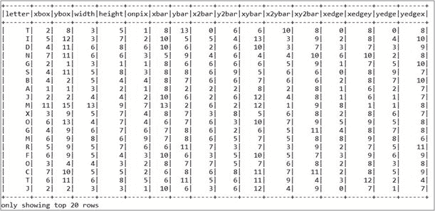
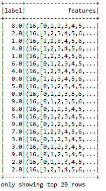
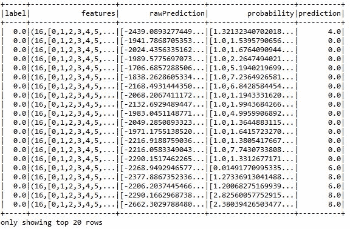
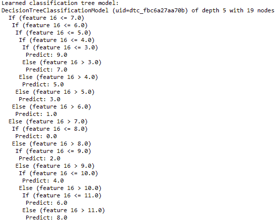

# 十三、我叫贝叶斯，朴素的贝叶斯

"Prediction is very difficult, especially if it's about the future"

-尼尔斯波尔

**机器学习(ML)** 与大数据的结合是一种激进的结合，在学术界和工业界的研究领域产生了一些巨大的影响。此外，许多研究领域也正在进入大数据领域，因为数据集正以前所未有的方式从各种来源和技术中生成和产生，通常被称为**数据洪流**。这给 ML、数据分析工具和算法带来了巨大的挑战，以从大数据标准(如容量、速度和多样性)中找到真正的**价值**。然而，从这些庞大的数据集中做出预测从来都不容易。

考虑到这一挑战，在这一章中，我们将深入挖掘 ML，并了解如何使用简单而强大的方法来构建可扩展的分类模型，甚至更多。简而言之，本章将涵盖以下主题:

*   多项式分类
*   贝叶斯推理
*   朴素贝叶斯
*   决策树
*   朴素贝叶斯与决策树

# 多项式分类

在 ML 中，**多项式**(也称为多类)分类是将数据对象或实例分类为两个以上类的任务，即具有两个以上的标签或类。将数据对象或实例分为两类称为**二进制分类**。更具体地说，在多项式分类中，每个训练实例属于受`N >=2`支配的 N 个不同类中的一个。目标是构建一个模型，正确预测新实例所属的类。可能有许多场景具有数据点所属的多个类别。然而，如果一个给定点属于多个类别，这个问题会平凡地分解成一组未链接的二元问题，这些问题可以使用二元分类算法自然地解决。

Readers are suggested not be confused distinguishing the multiclass classification with multilabel classification, where multiple labels are to be predicted for each instance. For more on Spark-based implementation for the multilabel classification, interested readers should refer to [https://spark.apache.org/docs/latest/mllib-evaluation-metrics.html#multilabel-classification](https://spark.apache.org/docs/latest/mllib-evaluation-metrics.html#multilabel-classification).

多类分类技术可以分为如下几类:

*   转换为二进制
*   二进制扩展
*   层次分类

# 转换为二进制

利用转化为二进制技术，一个多类分类问题可以转化为多个二进制分类问题的等价策略。换句话说，这种技术可以被称为一种*问题转换技术*。从理论和实践的角度进行详细讨论超出了本章的范围。因此，这里我们只讨论一个名为**One-Vs-The-Rest**(**OVTR**)算法的问题转化技巧的例子作为这一类的代表。

# 使用“一体对其余”方法进行分类

在本小节中，我们将描述一个使用 OVTR 算法执行多类分类的示例，方法是将问题转换为等价的多个二进制分类问题。OVTR 策略分解了这个问题，并为每个类训练每个二进制分类器。换句话说，OVTR 分类器策略包括为每个类拟合一个二进制分类器。然后，它将当前类的所有样本视为阳性样本，因此其他分类器的其他样本被视为阴性样本。

这无疑是一种模块化的机器学习技术。然而，不利的一面是，这种策略需要来自多类族的基本分类器。原因是分类器必须产生一个真实值，也称为*置信度得分*，而不是实际标签的预测。这种策略的第二个缺点是，如果数据集(又名训练集)包含离散的类标签，这些最终会导致模糊的预测结果。在这种情况下，可以为单个样本预测多个类别。为了使前面的讨论更清楚，现在让我们看一个如下的例子。

假设我们有一组分为三类的 50 个观测值。因此，我们也将使用与之前相同的逻辑来选择反面例子。对于培训阶段，我们有以下设置:

*   **分类器 1** 有 30 个正例和 20 个负例
*   **分类器 2** 有 36 个正例，14 个负例
*   **分类器 3** 有 14 个正例，24 个负例

另一方面，对于测试阶段，假设我有一个新的实例需要分类到前面的一个类中。当然，三个分类器中的每一个都会产生一个与估计值相关的概率。这是对一个实例在分类器中属于负例子还是正例子的概率的估计？在这种情况下，我们应该总是比较一个类中的正概率和其他类中的正概率。现在对于 *N* 类，我们将有一个测试样本的阳性类的 *N* 概率估计。将它们进行比较，无论哪个概率最大 *N* 概率都属于该特定类别。Spark 使用 OVTR 算法提供多类到二进制的约简，其中**逻辑回归**算法被用作基本分类器。

现在让我们看另一个真实数据集的例子，演示 Spark 如何使用 OVTR 算法对所有特征进行分类。OVTR 分类器最终从光学字符阅读器数据集预测手写字符。但是，在深入演示之前，让我们先探索一下 OCR 数据集，以获得数据的探索性质。需要注意的是，当光学字符识别软件第一次处理文档时，它会将纸张或任何对象分成一个矩阵，使得网格中的每个单元格包含一个字形(也称为不同的图形形状)，这只是从纸张或对象中引用字母、符号或数字或任何上下文信息的一种复杂方式。

为了演示 OCR 管道，让我们假设文档只包含英文字母字符，这些字母字符将字形与 26 个大写字母之一相匹配，即 *A* 到 *Z* 。我们将使用来自 *UCI 机器学习数据库*的光学字符识别字母数据集。数据集用 W *表示。弗雷*和 *D. J. Slate。*在探索数据集时，您应该观察 26 个英文大写字母的 20，000 个示例。用大写字母书写的字母可以使用 20 种不同的、随机重塑和扭曲的黑白字体作为不同形状的字形来打印。简而言之，预测 26 个字母中的所有字符会将问题本身变成一个包含 26 个类的多类分类问题。因此，二进制分类器将不能满足我们的目的。


**Figure 1**: Some of the printed glyphs (Source: Letter recognition using Holland-style adaptive classifiers, ML, V. 6, p. 161-182, by W. Frey and D.J. Slate [1991])

上图显示了我之前解释的图像。*数据集*提供了一些以这种方式扭曲的打印字形的示例；因此，对于计算机来说，字母的识别在计算上具有挑战性。然而，这些字形很容易被人类识别。下图显示了前 20 行的统计属性:



**Figure 2:** The snapshot of the dataset shown as the data frame

# 光学字符识别数据集的探索和准备

根据数据集描述，使用计算机上的光学字符识别阅读器扫描字形，然后自动将其转换为像素。因此，所有 16 个统计属性(在**图 2** 中)也被记录到计算机中。黑色像素在盒子不同区域的集中提供了一种使用光学字符识别或机器学习算法来区分 26 个字母的方法。

Recall that **support vector machines** (**SVM**), Logistic Regression, Naive Bayesian-based classifier, or any other classifier algorithms (along with their associated learners) require all the features to be numeric. LIBSVM allows you to use a sparse training dataset in an unconventional format. While transforming the normal training dataset to the LIBSVM format. Only the nonzero values that are also included in the dataset are stored in a sparse array/matrix form. The index specifies the column of the instance data (feature index). However, any missing data is taken as holding zero value too. The index serves as a way to distinguish between the features/parameters. For example, for three features, indices 1, 2, and 3 would correspond to the *x*, *y*, and *z* coordinates, respectively. The correspondence between the same index values of different data instances is merely mathematical when constructing the hyperplane; these serve as coordinates. If you skip any index in between, it should be assigned a default value of zero.

在大多数实际情况下，我们可能需要针对所有特征点对数据进行标准化。简而言之，我们需要将当前以制表符分隔的 OCR 数据转换为 LIBSVM 格式，以使训练步骤更容易。因此，我假设您已经下载了数据，并使用自己的脚本将其转换为 LIBSVM 格式。下图显示了转换为由标签和要素组成的 LIBSVM 格式的结果数据集:


**Figure 3:** A snapshot of 20 rows of the OCR dataset in LIBSVM format Interested readers can refer to the following research article for gaining in-depth knowledge: *Chih-Chung Chang* and *Chih-Jen Lin*, *LIBSVM: a library for support vector machines*, *ACM Transactions on Intelligent Systems and Technology*, 2:27:1--27:27, 2011\. You can also refer to a public script provided on my GitHub repository at [https://github.com/rezacsedu/RandomForestSpark/](https://github.com/rezacsedu/RandomForestSpark/) that directly converts the OCR data in CSV into LIBSVM format. I read the data about all the letters and assigned a unique numeric value to each. All you need is to show the input and output file path and run the script.

现在让我们深入这个例子。我将要演示的示例有 11 个步骤，包括数据解析、Spark 会话创建、模型构建和模型评估。

**第一步。创建 Spark 会话** -通过指定主网址、Spark SQL 仓库和应用名称创建 Spark 会话，如下所示:

```scala
val spark = SparkSession.builder.master("local[*]") //change acordingly.config("spark.sql.warehouse.dir", "/home/exp/").appName("OneVsRestExample") .getOrCreate()

```

**第二步。加载、解析和创建数据帧** -从 HDFS 或本地磁盘加载数据文件并创建数据帧，最后数据帧结构如下所示:

```scala
val inputData = spark.read.format("libsvm").load("data/Letterdata_libsvm.data")inputData.show()

```

**第三步。生成训练和测试集来训练模型** -让我们通过将 70%用于训练和 30%用于测试来生成训练和测试集:

```scala
val Array(train, test) = inputData.randomSplit(Array(0.7, 0.3))

```

**第四步。实例化基本分类器** -这里基本分类器充当多类分类器。在这种情况下，可以通过指定参数(如最大迭代次数、公差、回归参数和弹性网络参数)来实例化逻辑回归算法。

请注意，当因变量为二分(二元)时，逻辑回归是一种合适的回归分析。像所有回归分析一样，逻辑回归是一种预测分析。逻辑回归用于描述数据，并解释一个因变量和一个或多个标称、序数、区间或比率水平自变量之间的关系。

For a a Spark-based implementation of the Logistic Regression algorithm, interested readers can refer to [https://spark.apache.org/docs/latest/mllib-linear-methods.html#logistic-regression](https://spark.apache.org/docs/latest/mllib-linear-methods.html#logistic-regression).

简而言之，以下参数用于训练逻辑回归分类器:

*   `MaxIter`:指定最大迭代次数。总的来说，越多越好。
*   `Tol`:这是停止标准的公差。一般来说，越少越好，这有助于模型得到更集中的训练。默认值为 1E-4。
*   `FirIntercept`:这表示在生成概率解释时是否要截取决策函数。
*   `Standardization`:这表示一个布尔值，取决于是否想要标准化训练。
*   `AggregationDepth`:越多越好。
*   `RegParam`:这表示回归参数。大多数情况下，越少越好。
*   `ElasticNetParam`:这表示更高级的回归参数。大多数情况下，越少越好。

但是，您可以根据问题类型和数据集属性将拟合截距指定为真或假的`Boolean`值:

```scala
 val classifier = new LogisticRegression().setMaxIter(500)          .setTol(1E-4)                                                                                                  .setFitIntercept(true).setStandardization(true) .setAggregationDepth(50) .setRegParam(0.0001) .setElasticNetParam(0.01)

```

**第五步。实例化 OVTR 分类器** -现在实例化一个 OVTR 分类器，将多类分类问题转换为多个二进制分类，如下所示:

```scala
val ovr = new OneVsRest().setClassifier(classifier)

```

这里`classifier`是逻辑回归估计量。现在是训练模型的时候了。

**第六步。训练多类模型** -让我们使用如下训练集训练模型:

```scala
val ovrModel = ovr.fit(train)

```

**第七步。在测试集**上对模型评分-我们可以使用变压器(即`ovrModel`)在测试数据上对模型评分，如下所示:

```scala
val predictions = ovrModel.transform(test)

```

**第八步。评估模型** -在这一步中，我们将预测第一列中字符的标签。但在此之前，我们需要实例化一个`evaluator`来计算分类性能指标，如准确度、精确度、召回率和`f1`度量，如下所示:

```scala
val evaluator = new MulticlassClassificationEvaluator().setLabelCol("label").setPredictionCol("prediction")    val evaluator1 = evaluator.setMetricName("accuracy")val evaluator2 = evaluator.setMetricName("weightedPrecision")val evaluator3 = evaluator.setMetricName("weightedRecall")val evaluator4 = evaluator.setMetricName("f1")

```

**第九步。计算性能指标** -计算测试数据的分类准确度、精确度、召回率、`f1`度量和误差，如下所示:

```scala
val accuracy = evaluator1.evaluate(predictions)val precision = evaluator2.evaluate(predictions)val recall = evaluator3.evaluate(predictions)val f1 = evaluator4.evaluate(predictions)

```

**第十步。**打印性能指标:

```scala
println("Accuracy = " + accuracy)println("Precision = " + precision)println("Recall = " + recall)println("F1 = " + f1)println(s"Test Error = ${1 - accuracy}")

```

您应该按照以下方式观察该值:

```scala
Accuracy = 0.5217246545696688Precision = 0.488360500637862Recall = 0.5217246545696688F1 = 0.4695649096879411Test Error = 0.47827534543033123

```

**第 11 步。**停止 Spark 会话:

```scala
spark.stop() // Stop Spark session

```

这样，我们可以在不牺牲问题类型的情况下，将一个多项式分类问题转化为多个二进制分类问题。然而，从第 10 步中，我们可以观察到分类精度一点也不好。这可能是因为几个原因，例如我们用来训练模型的数据集的性质。更重要的是，我们在训练逻辑回归模型时没有调整超参数。此外，在执行转换时，OVTR 不得不牺牲一些准确性。

# 层次分类

在分层分类任务中，分类问题可以通过将输出空间分成树来解决。在该树中，父节点被分成多个子节点。这个过程一直持续到每个子节点描述一个类。基于层次分类技术已经提出了几种方法。计算机视觉就是这样一个领域的例子，在这个领域中，识别图片或文字是使用分层处理的事情。对这个分类器的广泛讨论超出了本章的范围。

# 二进制扩展

这是一种扩展现有二进制分类器以解决多类分类问题的技术。为了解决多类分类问题，已经提出并开发了几种基于神经网络、离散时间树、随机森林、k 近邻、朴素贝叶斯和 SVM 的算法。在接下来的部分中，我们将讨论朴素贝叶斯和 DT 算法作为这一类别的两个代表。

现在，在开始使用朴素贝叶斯算法解决多类分类问题之前，让我们在下一节简要概述一下贝叶斯推理。

# 贝叶斯推理

在本节中，我们将简要讨论**贝叶斯推理** ( **BI** )及其基础理论。读者将从理论和计算的角度熟悉这个概念。

# 贝叶斯推理综述

贝叶斯推理是基于贝叶斯定理的统计方法。它用于更新假设的概率(作为一个强有力的统计证明)，以便统计模型可以重复更新以获得更精确的学习。换句话说，在贝叶斯推断方法中，所有类型的不确定性都是根据统计概率来揭示的。这是理论和数理统计中的一项重要技术。我们将在后面的章节中广泛讨论贝叶斯定理。

此外，贝叶斯更新在数据集序列的增量学习和动态分析中占主导地位。例如，时间序列分析、生物医学数据分析中的基因组测序、科学、工程、哲学和法律是贝叶斯推理被广泛使用的一些例子。从哲学角度和决策理论来看，贝叶斯推理与预测概率密切相关。然而，这个理论更正式地被称为**贝叶斯概率**。

# 什么是推论？

推断或模型评估是在最后更新从模型导出的结局概率的过程。因此，所有的概率证据最终都是已知的，从而可以在使用贝叶斯模型进行分类分析时更新观察结果。稍后，通过实例化数据集中所有观察值的一致性，将这些信息提取到贝叶斯模型中。被提取到模型中的规则被称为先验概率，其中在参考某些相关观察之前评估一个概率，特别是主观地或基于所有可能的结果被给予相同概率的假设。当所有的证据都被称为后验概率时，信念就被计算出来了。这些后验概率反映了基于更新证据计算的假设水平。

贝叶斯定理用于计算表示两个前因后果的后验概率。基于这些前因，先验概率和似然函数从用于模型适应性的新数据的统计模型中导出。我们将在后面的章节中进一步讨论贝叶斯定理。

# 它是如何工作的？

这里我们讨论一个统计推断问题的一般设置。首先，从数据中，我们估计了期望的数量，也可能有未知的数量我们想要估计。它可能只是一个响应变量或预测变量、一个类、一个标签，或者只是一个数字。如果你熟悉*常客*方法，你可能知道在这种方法中，未知量`θ`被假设为一个固定(非随机)量，由观测数据估计。

然而，在贝叶斯框架中，一个未知量`θ`被视为随机变量。更具体地说，假设我们对`θ`的分布有一个初步的猜测，这通常被称为**先验分布**。现在，在观察了一些数据之后，`θ`的分布被更新了。该步骤通常使用贝叶斯规则执行(更多细节，请参考下一节)。这就是为什么这种方法被称为贝叶斯方法。然而，简而言之，从先验分布，我们可以计算未来观测的预测分布。

这种朴实无华的过程可以被证明是在众多论证的帮助下进行不确定推理的适当方法。然而，这种一致性是与这些论点的合理性的明确原则保持一致的。尽管有这些强有力的数学证据，许多机器学习从业者对使用贝叶斯方法感到不舒服，并且有点不情愿。这背后的原因是，他们通常认为后验概率或先验的选择是任意和主观的；然而，在现实中，这是主观的，但不是武断的。

Inappropriately, many Bayesians don't really think in true Bayesian terms. One can, therefore, find many pseudo-Bayesian procedures in the literature, in which models and priors are used that cannot be taken seriously as expressions of prior belief. There may also be computational difficulties with the Bayesian approach. Many of these can be addressed using **Markov chain Monte Carlo** methods, which are another main focus of my research. The details of this approach will be clearer as you go through this chapter.

# 朴素贝叶斯

在 ML 中，**朴素贝叶斯** ( **NB** )是基于众所周知的贝叶斯定理的概率分类器的一个例子，其特征之间具有很强的独立性假设。我们将在本节中详细讨论朴素贝叶斯。

# 贝叶斯定理综述

在概率论中，**贝叶斯定理**描述了基于与特定事件相关的条件的先验知识的事件概率。这是托马斯·贝叶斯牧师最初提出的概率定理。换句话说，它可以被视为一种理解概率论是如何真实的以及如何受到一条新信息影响的方式。例如，如果癌症与年龄有关，关于*年龄*的信息可以用来更准确地评估一个人患癌症的概率*。*

贝叶斯定理的数学表述如下:


在上式中， *A* 和 *B* 是带有 *P (B) ≠ 0、*的事件，其他术语可以描述如下:

*   *P* ( *A* )和 *P* ( *B* )是观察 *A* 和 *B* 而不考虑对方的概率(即独立性)
*   *P* ( *A* | *B* )是观察事件 *A* 的条件概率，假设 *B* 为真
*   *P* ( *B* | *A* )是观察事件 *B* 的条件概率，假设 *A* 为真

你可能知道，哈佛大学的一项著名研究表明，只有 10%的快乐的人是富有的。然而，你可能会认为这个统计数据非常有说服力，但你可能会有兴趣知道富人也真的快乐的百分比*。*贝叶斯定理帮助您了解如何使用两个额外的线索来计算这个保留统计量:

1.  总体快乐的人的百分比，即 *P(A)。*
2.  总体上有钱的人的百分比，也就是 *P(B)。*

贝叶斯定理背后的关键思想是考虑到整体比率**来反转统计。**假设以下信息作为先验信息可用:

 **1.  40%的人是快乐的，而且 *= > P(A)。*
2.  5%的人富有 *= > P(B)。*

现在我们来考虑一下哈佛的研究是否正确，即 *P(B|A) = 10%* 。现在有钱人幸福的分数，也就是*P(A | B)*可以计算如下:

*P(A | B)= { P(A)* P(B | A)}/P(B)=(40% * 10%)/5% = 80%*

因此，大多数人也是幸福的！不错。为了更清楚，为了简单起见，现在让我们假设全世界的人口是 1000。然后，根据我们的计算，有两个事实存在:

*   事实 1:这告诉我们有 400 人是幸福的，哈佛的研究告诉我们，这些幸福的人中有 40 人也是富有的。
*   事实 2:总共有 50 个富人，所以快乐的比例是 40/50 = 80%。

This proves the Bayes theorem and its effectiveness. However, more comprehensive examples can be found at [https://onlinecourses.science.psu.edu/stat414/node/43](https://onlinecourses.science.psu.edu/stat414/node/43).

# 我叫贝叶斯，朴素的贝叶斯

我是贝叶斯，朴素贝叶斯(NB)。我是一个基于**最大后验** ( **地图**)原理的成功分类器。作为一个分类器，我是高度可扩展的，在一个学习问题中，需要许多参数在变量(特征/预测因子)的数量上是线性的。我有几个属性，比如，我的计算速度比较快，如果你能雇我来分类一些我实现起来比较简单的东西，我可以很好地处理高维数据集。此外，我可以处理数据集中缺失的值。尽管如此，我还是可以适应的，因为模型可以用新的训练数据修改，而不需要重建模型。

In Bayesian statistics, a MAP estimate is an estimate of an unknown quantity that equals the mode of the posterior distribution. The MAP estimate can be used to obtain a point estimate of an unobserved quantity on the basis of empirical data.

听起来有点像詹姆斯·邦德电影？嗯，你/我们可以认为一个分类员是 007 号特工，对吗？开玩笑的。我相信我不是，因为像先验概率和条件概率这样的朴素贝叶斯分类器的参数是通过一组确定性的步骤来学习或确定的:这涉及到两个非常琐碎的操作，这两个操作在现代计算机上可以非常快，即计数和除法。没有*迭代*。没有*纪元*。没有*对成本方程*的优化(它可能是复杂的，平均为三次量级，或者至少为平方量级的复杂性)。没有*误差反向传播*。没有涉及*求解矩阵方程*的操作。这些使得朴素贝叶斯及其整体训练速度更快。

但是，在雇佣这个代理之前，你/我们可以发现他的优缺点，这样我们就可以像使用王牌一样使用这个代理，只利用它的最好的一面。下面这张表总结了这种代理的优缺点:

| **代理人** | **优点** | cons | **在**更好 |
| **朴素贝叶斯(NB)** | -计算速度快-易于实施-适用于高尺寸-可以处理缺失的值-需要少量数据来训练模型-它是可扩展的-适应性强，因为可以用新的训练数据修改模型，而无需重建模型 | -依赖于独立性假设，因此如果假设不满足，则表现不佳-相对较低的精度-如果没有类别标签和某个属性值一起出现，则基于频率的概率估计将为零 | -当数据有大量缺失值时-当特征之间的相互依赖性相似时-垃圾邮件过滤和分类-对关于技术、政治、体育等的新闻文章进行分类。-文本挖掘 |

**Table 1:** Pros and the cons of the Naive Bayes algorithm

# 用 NB 构建可扩展分类器

在本节中，我们将看到一个使用**朴素贝叶斯** ( **NB** )算法的分步示例。如前所述，NB 是高度可扩展的，在学习问题中，需要许多变量(特征/预测因子)数量呈线性的参数。这种可扩展性使得 Spark 社区能够使用这种算法对大规模数据集进行预测分析。目前星火 MLlib 中 NB 的实现支持多项式 NB 和伯努利 NB。

Bernoulli NB is useful if the feature vectors are binary. One application would be text classification with a bag of words (BOW) approach. On the other hand, multinomial NB is typically used for discrete counts. For example, if we have a text classification problem, we can take the idea of Bernoulli trials one step further and instead of BOW in a document we can use the frequency count in a document.

在本节中，我们将看到如何通过结合 Spark 机器学习 API(包括 Spark MLlib、Spark ML 和 Spark SQL)从基于**笔的手写数字识别**数据集预测数字:

**第一步。数据收集、预处理和探索** -基于笔的手写数字识别数据集从 UCI 机器学习资源库下载，网址为[https://www . csie . NTU . edu . tw/~ cjlin/libsvmtols/datasets/multi class/pendigits。](https://www.csie.ntu.edu.tw/~cjlin/libsvmtools/datasets/multiclass/pendigits)该数据集是在从 44 个书写者各收集大约 250 个数字样本后生成的，以 100 毫秒的固定时间间隔与笔的位置相关。然后每个数字被写入一个 500×500 像素的盒子里。最后，这些图像被缩放到 0 到 100 之间的整数值，以在每个观察之间创建一致的缩放。一种众所周知的空间重采样技术被用于在弧形轨迹上获得 3 个和 8 个规则间隔的点。通过基于 3 个或 8 个采样点的(x，y)坐标绘制这些采样点，可以将采样图像以及从点到点的线可视化；如下表所示:

| 一组 | '0' | '1' | '2' | '3' | '4' | '5' | '6' | '7' | '8' | '9' | 总数 |
| 培养 | Seven hundred and eighty | Seven hundred and seventy-nine | Seven hundred and eighty | Seven hundred and nineteen | Seven hundred and eighty | Seven hundred and twenty | Seven hundred and twenty | seven hundred and seventy-eight；eat | Seven hundred and eighteen | Seven hundred and nineteen | Seven thousand four hundred and ninety-three |
| 试验 | Three hundred and sixty-three | Three hundred and sixty-four | Three hundred and sixty-four | Three hundred and thirty-six | Three hundred and sixty-four | Three hundred and thirty-five | Three hundred and thirty-six | Three hundred and sixty-four | Three hundred and thirty-five | Three hundred and thirty-six | Three thousand four hundred and ninety-seven |

Table 2: Number of digits used for the training and the test set

如上表所示，训练集由 30 个作者编写的样本组成，测试集由 14 个作者编写的样本组成。


Figure 4: Example of digit 3 and 8 respectively

关于这个数据集的更多信息可以在[上找到。下图显示了数据集快照示例的数字表示:](http://archive.ics.uci.edu/ml/machine-learning-databases/pendigits/pendigits-orig.names)



Figure 5: A snap of the 20 rows of the hand-written digit dataset

现在，为了使用自变量(即特征)预测因变量(即标签)，我们需要训练一个多类分类器，因为如前所示，数据集现在有九个类，即九个手写数字。对于预测，我们将使用朴素贝叶斯分类器并评估模型的性能。

**第二步。**加载所需的库和包:

```scala
import org.apache.spark.ml.classification.NaiveBayesimport org.apache.spark.ml.evaluation.MulticlassClassificationEvaluatorimport org.apache.spark.sql.SparkSession

```

**第三步。**创建活动的 Spark 会话:

```scala
val spark = SparkSession.builder.master("local[*]").config("spark.sql.warehouse.dir", "/home/exp/").appName(s"NaiveBayes").getOrCreate()

```

请注意，这里主网址已经设置为`local[*]`，这意味着您机器的所有内核都将用于处理 Spark 作业。您应该根据需求相应地设置 SQL 仓库和其他配置参数。

**第四步。创建数据帧** -将以 LIBSVM 格式存储的数据加载为数据帧:

```scala
val data = spark.read.format("libsvm").load("data/pendigits.data")

```

对于数字分类，输入特征向量通常是稀疏的，应该提供稀疏向量作为输入以利用稀疏性。由于训练数据只使用一次，而且数据集的大小相对较小(即几兆字节)，如果您多次使用数据帧，我们可以缓存它。

**第五步。准备培训和测试集** -将数据分成培训和测试集(25%用于测试):

```scala
val Array(trainingData, testData) = data.randomSplit(Array(0.75, 0.25), seed = 12345L)

```

**第六步。训练朴素贝叶斯模型** -使用如下训练集训练朴素贝叶斯模型:

```scala
val nb = new NaiveBayes()val model = nb.fit(trainingData)

```

**第七步。在测试集**上计算预测值-使用模型转换器计算预测值，最后根据每个标签显示预测值，如下所示:

```scala
val predictions = model.transform(testData)predictions.show()

```



**Figure 6:** Prediction against each label (that is, each digit)

从上图中可以看出，有些标签预测准确，有些错误。同样，我们需要知道加权精度、精确度、召回率和 f1 度量，而不是天真地评估模型。

**第八步。评估模型** -选择预测和真实标签，计算测试误差和分类性能指标，如准确度、精确度、召回率和 f1 度量，如下所示:

```scala
val evaluator = new MulticlassClassificationEvaluator().setLabelCol("label").setPredictionCol("prediction")    val evaluator1 = evaluator.setMetricName("accuracy")val evaluator2 = evaluator.setMetricName("weightedPrecision")val evaluator3 = evaluator.setMetricName("weightedRecall")val evaluator4 = evaluator.setMetricName("f1")

```

**第九步。计算性能指标** -计算测试数据的分类准确度、精确度、召回率、f1 测量值和误差，如下所示:

```scala
val accuracy = evaluator1.evaluate(predictions)val precision = evaluator2.evaluate(predictions)val recall = evaluator3.evaluate(predictions)val f1 = evaluator4.evaluate(predictions)

```

**第十步。**打印性能指标:

```scala
println("Accuracy = " + accuracy)println("Precision = " + precision)println("Recall = " + recall)println("F1 = " + f1)println(s"Test Error = ${1 - accuracy}")

```

您应该遵循以下值:

```scala
Accuracy = 0.8284365162644282Precision = 0.8361211320692463Recall = 0.828436516264428F1 = 0.8271828540349192Test Error = 0.17156348373557184

```

表演没那么差。但是，您仍然可以通过执行超参数调整来提高分类精度。通过交叉验证和训练分割选择合适的算法(即分类器或回归器)，还有机会提高预测精度，这将在下一节中讨论。

# 帮我调一下音！

你已经知道我的利弊了，我有一个坏处就是，我的分类准确率比较低。然而，如果你调整我，我可以表现得更好。我们应该相信朴素贝叶斯吗？如果是这样，难道不应该看看如何提高这家伙的预测性能吗？假设使用网络垃圾邮件数据集。首先，我们应该观察 NB 模型的性能，然后我们将看到如何使用交叉验证技术来提高性能。

从[http://www . csie . NTU . edu . tw/~ cjlin/libsvmtols/datasets/binary/WebSpam _ WC _ normalized _ trigram . SVM . bz2](http://www.csie.ntu.edu.tw/~cjlin/libsvmtools/datasets/binary/webspam_wc_normalized_trigram.svm.bz2)下载的 web Spam 数据集包含特征和对应的标签，即 spam 或 ham。因此，这是一个有监督的机器学习问题，这里的任务是预测给定的消息是垃圾邮件还是 ham(即不是垃圾邮件)。原始数据集大小为 23.5 GB，其中类被标记为+1 或-1(即二进制分类问题)。后来，我们用 0.0 替换了-1，用 1.0 替换了+1，因为朴素贝叶斯不允许使用有符号整数。修改后的数据集如下图所示:


**Figure 7:** A snapshot of the 20 rows of the WebSpam dataset

首先，我们需要导入必要的包，如下所示:

```scala
import org.apache.spark.ml.classification.NaiveBayesimport org.apache.spark.ml.evaluation.MulticlassClassificationEvaluatorimport org.apache.spark.sql.SparkSessionimport org.apache.spark.ml.Pipeline;import org.apache.spark.ml.PipelineStage;import org.apache.spark.ml.classification.LogisticRegressionimport org.apache.spark.ml.evaluation.BinaryClassificationEvaluatorimport org.apache.spark.ml.feature.{HashingTF, Tokenizer}import org.apache.spark.ml.linalg.Vectorimport org.apache.spark.ml.tuning.{CrossValidator, ParamGridBuilder}

```

现在创建 Spark 会话作为代码的入口点，如下所示:

```scala
val spark = SparkSession.builder.master("local[*]").config("spark.sql.warehouse.dir", "/home/exp/").appName("Tuned NaiveBayes").getOrCreate()

```

让我们加载网络垃圾邮件数据集，并准备训练集来训练朴素贝叶斯模型，如下所示:

```scala
// Load the data stored in LIBSVM format as a DataFrame.val data = spark.read.format("libsvm").load("hdfs://data/ webspam_wc_normalized_trigram.svm")// Split the data into training and test sets (30% held out for testing)val Array(trainingData, testData) = data.randomSplit(Array(0.75, 0.25), seed = 12345L)// Train a NaiveBayes model with using the training setval nb = new NaiveBayes().setSmoothing(0.00001)val model = nb.fit(trainingData)

```

在前面的代码中，设定种子是再现性所必需的。现在让我们对验证集进行如下预测:

```scala
val predictions = model.transform(testData)predictions.show()

```

现在让我们获取`evaluator`并计算分类性能指标，如准确度、精确度、召回率和`f1`度量，如下所示:

```scala
val evaluator = new MulticlassClassificationEvaluator().setLabelCol("label").setPredictionCol("prediction")    val evaluator1 = evaluator.setMetricName("accuracy")val evaluator2 = evaluator.setMetricName("weightedPrecision")val evaluator3 = evaluator.setMetricName("weightedRecall")val evaluator4 = evaluator.setMetricName("f1")

```

现在，让我们计算并打印性能指标:

```scala
val accuracy = evaluator1.evaluate(predictions)val precision = evaluator2.evaluate(predictions)val recall = evaluator3.evaluate(predictions)val f1 = evaluator4.evaluate(predictions)   // Print the performance metricsprintln("Accuracy = " + accuracy)println("Precision = " + precision)println("Recall = " + recall)println("F1 = " + f1)println(s"Test Error = ${1 - accuracy}")

```

您应该会收到以下输出:

```scala
Accuracy = 0.8839357429715676Precision = 0.86393574297188752Recall = 0.8739357429718876F1 = 0.8739357429718876Test Error = 0.11606425702843237

```

尽管准确度处于令人满意的水平，但我们可以通过应用交叉验证技术来进一步提高准确度。技术如下:

*   通过将 NB 估计器链接为管道的唯一阶段来创建管道
*   现在准备参数网格进行调优
*   执行 10 倍交叉验证
*   现在使用训练集拟合模型
*   计算验证集上的预测

交叉验证等模型调优技术的第一步是管道创建。可以通过链接转换器、估计器和相关参数来创建管道。

**第一步。管道创建** -让我们创建一个朴素贝叶斯估计器(在下面的例子中`nb`是一个估计器)，并通过如下链接估计器来创建一个管道:

```scala
val nb = new NaiveBayes().setSmoothing(00001)val pipeline = new Pipeline().setStages(Array(nb))

```

A pipeline can be considered as the data workflow system for training and prediction using the model. ML pipelines provide a uniform set of high-level APIs built on top of [DataFrames](https://spark.apache.org/docs/latest/sql-programming-guide.html) that help users create and tune practical machine learning pipelines. DataFrame, transformer, estimator, pipeline, and parameter are the five most important components in Pipeline creation. For more on Pipeline, interested readers should refer to [https://spark.apache.org/docs/latest/ml-pipeline.html](https://spark.apache.org/docs/latest/ml-pipeline.html)

在前面的例子中，我们的管道中唯一的阶段是估计器，它是一种算法，用于拟合数据帧以产生一个转换器，从而确保训练成功进行。

**第二步。创建网格参数** -让我们使用`ParamGridBuilder`来构建一个要搜索的参数网格:

```scala
val paramGrid = new ParamGridBuilder().addGrid(nb.smoothing, Array(0.001, 0.0001)).build()

```

**第三步。执行 10 倍交叉验证** -我们现在将管道视为一个评估器，将其包装在一个交叉验证器实例中。这将允许我们共同选择所有管道阶段的参数。一个`CrossValidator`需要一个估计器，一组估计器`ParamMaps`，和一个评估器。请注意，这里的评估器是一个`BinaryClassificationEvaluator`，它的默认度量是`areaUnderROC`。但是，如果您将评估者用作`MultiClassClassificationEvaluator`，您也可以使用其他绩效指标:

```scala
val cv = new CrossValidator().setEstimator(pipeline).setEvaluator(new BinaryClassificationEvaluator).setEstimatorParamMaps(paramGrid).setNumFolds(10)  // Use 3+ in practice

```

**第四步。**将交叉验证模型与训练集进行如下拟合:

```scala
val model = cv.fit(trainingData)

```

**第五步。**计算性能如下:

```scala
val predictions = model.transform(validationData)predictions.show()

```

**第六步。**获取评估器，计算性能指标，并显示结果。现在让我们获取`evaluator`并计算分类性能指标，如准确性、精确度、召回率和 f1 度量。这里`MultiClassClassificationEvaluator`将用于准确度、精密度、召回率和 f1 测量:

```scala
val evaluator = new MulticlassClassificationEvaluator().setLabelCol("label").setPredictionCol("prediction")    val evaluator1 = evaluator.setMetricName("accuracy")val evaluator2 = evaluator.setMetricName("weightedPrecision")val evaluator3 = evaluator.setMetricName("weightedRecall")val evaluator4 = evaluator.setMetricName("f1")

```

现在计算测试数据的分类精度、精确度、召回率、f1 测量值和误差，如下所示:

```scala
val accuracy = evaluator1.evaluate(predictions)val precision = evaluator2.evaluate(predictions)val recall = evaluator3.evaluate(predictions)val f1 = evaluator4.evaluate(predictions)

```

现在让我们打印性能指标:

```scala
println("Accuracy = " + accuracy)println("Precision = " + precision)println("Recall = " + recall)println("F1 = " + f1)println(s"Test Error = ${1 - accuracy}")

```

您现在应该会收到如下结果:

```scala
Accuracy = 0.9678714859437751Precision = 0.9686742518830365Recall = 0.9678714859437751F1 = 0.9676697179934564Test Error = 0.032128514056224855

```

现在这个比上一个好多了，对吧？请注意，由于数据集和您的平台的随机分割，您可能会收到稍微不同的结果。

# 决策树

在本节中，我们将详细讨论 DT 算法。还将讨论朴素贝叶斯和数据挖掘的比较分析。DTs 通常被认为是一种用于解决分类和回归任务的监督学习技术。决策支持工具是一种简单的决策支持工具，它使用树状图(或决策模型)及其可能的结果，包括偶然事件结果、资源成本和效用。从技术上讲，DT 中的每个分支都代表了统计概率上的一个可能的决策、事件或反应。

与朴素贝叶斯相比，DT 是一种稳健得多的分类技术。原因是起初 DT 将特征分为训练集和测试集。然后它产生一个很好的概括来推断预测的标签或类别。最有趣的是，DT 算法可以同时处理二类和多类分类问题。


**Figure 8:** A sample decision tree on the admission test dataset using the Rattle package of R

例如，在前面的示例图中，DTs 从准入数据中学习用一组`if...else`决策规则来近似正弦曲线。数据集包含每个申请入学的学生的记录，比如说一所美国大学。每条记录包含研究生记录考试分数、CGPA 分数和列的排名。现在我们必须根据这三个特征(变量)来预测谁有能力。在训练 DT 模型和修剪树中不需要的分支后，DTs 可以用来解决这类问题。一般来说，更深的树表示更复杂的决策规则和更适合的模型。因此，树越深，决策规则越复杂，模型越拟合。

If you would like to draw the preceding figure, just run my R script, execute it on RStudio, and feed the admission dataset. The script and the dataset can be found in my GitHub repository at [https://github.com/rezacsedu/AdmissionUsingDecisionTree](https://github.com/rezacsedu/AdmissionUsingDecisionTree).

# 使用 DTs 的优点和缺点

在雇佣我之前，你可以从表 3 中发现我的优缺点和我什么时候工作最好，这样你就不会有任何迟到的遗憾了！

| **代理人** | **优点** | cons | **在**更好 |
| **决策树** | -易于实施、培训和解释-树木可以被可视化-几乎不需要数据准备-建模和预测时间更少-可以处理数字和分类数据-使用统计测试验证模型的可能性-对噪声和缺失值具有鲁棒性-高精度 | -对于大而复杂的树，很难解释-重复可能发生在同一子树中-对角线决策边界可能存在的问题-DT 学习者可以创建不能很好地概括数据的超复杂树-有时，由于数据中的小变量，DTs 可能不稳定-学习 DTs 本身是一个 NP 完全问题(又名。不确定多项式时间完全问题)-如果某些课程占主导地位，DTs 学习者会创建有偏见的树 | -瞄准高度准确的分类-医疗诊断和预后-信用风险分析 |

**Table 3:** Pros and cons of the decision tree

# 决策树与朴素贝叶斯

如上表所述，DTs 非常容易理解和调试，因为它们对训练数据集具有灵活性。他们将同时处理分类和回归问题。

如果您试图从分类或连续值中预测值，DTs 将处理这两个问题。因此，如果您只有表格数据，将它输入到 DT，它将构建模型来对您的数据进行分类，而不需要任何额外的前期或手动干预。总之，DTs 的实现、训练和解释都非常简单。用很少的数据准备，DTs 可以用更少的预测时间建立模型。如前所述，它们可以处理数字和分类数据，并且对噪声和缺失值非常稳健。他们很容易使用统计测试来验证模型。更有趣的是，构建的树可以可视化。总的来说，它们提供了非常高的精度。

然而，不利的一面是，DTs 有时倾向于训练数据的过拟合问题。这意味着您通常必须修剪树，并找到一个最佳的树，以获得更好的分类或回归精度。此外，重复可能发生在同一个子树中。有时，它还会产生对角决策边界的问题，即过度拟合和欠拟合。此外，DT 学习者可以创建不能很好地概括数据的过于复杂的树，这使得整体解释变得困难。由于数据中的小变量，DTs 可能不稳定，因此学习 DT 本身就是一个 NP 完全问题。最后，如果某些类支配其他类，DT 学习者会创建有偏见的树。

Readers are suggested to refer to *Tables 1* and *3* to get a comparative summary between Naive Bayes and DTs.

另一方面，在使用朴素贝叶斯的时候有一句话: *NB 要求你手工建立一个分类*。没有办法向它提供一堆表格数据，它会为分类选择最好的特征。然而，在这种情况下，选择正确的特性和重要的特性取决于用户，也就是你。另一方面，DTs 将从表格数据中选择最佳特征。鉴于这一事实，您可能需要将朴素贝叶斯与其他统计技术相结合，以帮助实现最佳特征提取，并在以后对它们进行分类。或者，使用 DTs 在精度、召回率和 f1 度量方面获得更好的准确性。朴素贝叶斯的另一个积极的方面是，它将作为一个连续的分类器来回答。然而，缺点是它们更难调试和理解。当训练数据在低数据量下没有好的特征时，朴素贝叶斯做得很好。

总之，如果你经常试图从这两个中选择更好的分类器，最好测试每一个来解决一个问题。我的建议是使用您拥有的训练数据构建一个 DT 和一个朴素贝叶斯分类器，然后使用可用的性能指标比较性能，然后根据数据集的性质决定哪一个最能解决您的问题。

# 用 DT 算法构建可扩展分类器

正如您已经看到的，使用 OVTR 分类器，我们在光学字符识别数据集上观察到以下性能指标值:

```scala
Accuracy = 0.5217246545696688Precision = 0.488360500637862Recall = 0.5217246545696688F1 = 0.4695649096879411Test Error = 0.47827534543033123

```

这意味着该数据集上模型的精度非常低。在本节中，我们将看到如何使用 DT 分类器来提高性能。将使用相同的光学字符识别数据集显示 Spark 2.1.0 的示例。该示例将有几个步骤，包括数据加载、解析、模型训练，最后是模型评估。

由于我们将使用相同的数据集，为了避免冗余，我们将跳过数据集探索步骤，进入示例:

**第一步。**按照以下步骤加载所需的库和包:

```scala
import org.apache.spark.ml.Pipeline // for Pipeline creationimport org.apache.spark.ml.classification.DecisionTreeClassificationModel import org.apache.spark.ml.classification.DecisionTreeClassifier import org.apache.spark.ml.evaluation.MulticlassClassificationEvaluator import org.apache.spark.ml.feature.{IndexToString, StringIndexer, VectorIndexer} import org.apache.spark.sql.SparkSession //For a Spark session

```

**第二步。**创建活动的 Spark 会话，如下所示:

```scala
val spark = SparkSession.builder.master("local[*]").config("spark.sql.warehouse.dir", "/home/exp/").appName("DecisionTreeClassifier").getOrCreate()

```

请注意，这里主网址已经设置为`local[*]`，这意味着您机器的所有内核都将用于处理 Spark 作业。您应该根据需求相应地设置 SQL 仓库和其他配置参数。

**第三步。创建数据帧** -按照以下步骤将存储在 LIBSVM 格式中的数据加载为数据帧:

```scala
val data = spark.read.format("libsvm").load("datab/Letterdata_libsvm.data")

```

对于数字的分类，输入特征向量通常是稀疏的，应该提供稀疏向量作为输入以利用稀疏性。由于训练数据只使用一次，而且数据集的大小相对较小(即几兆字节)，如果您多次使用数据帧，我们可以缓存它。

**第四步。标签索引** -索引标签，向标签列添加元数据。然后，让我们适应整个数据集，以包括索引中的所有标签:

```scala
val labelIndexer = new StringIndexer().setInputCol("label").setOutputCol("indexedLabel").fit(data)

```

**第五步。识别分类特征** -以下代码段自动识别分类特征并对其进行索引:

```scala
val featureIndexer = new VectorIndexer().setInputCol("features").setOutputCol("indexedFeatures").setMaxCategories(4).fit(data)

```

在这种情况下，如果要素的数量超过四个不同的值，它们将被视为连续的。

**第六步。准备培训和测试集** -将数据分成培训和测试集(25%用于测试):

```scala
val Array(trainingData, testData) = data.randomSplit(Array(0.75, 0.25), 12345L)

```

**第七步。**按照以下步骤训练 DT 模型:

```scala
val dt = new DecisionTreeClassifier().setLabelCol("indexedLabel").setFeaturesCol("indexedFeatures")

```

**第八步。**将索引标签转换回原始标签，如下所示:

```scala
val labelConverter = new IndexToString().setInputCol("prediction").setOutputCol("predictedLabel").setLabels(labelIndexer.labels)

```

**第九步。创建一个 DT 管道** -让我们通过一起改变索引器、标签转换器和树来创建一个 DT 管道:

```scala
val pipeline = new Pipeline().setStages(Array(labelIndexer,featureIndexer, dt, labelconverter))

```

**第十步。运行索引器** -使用变压器训练模型并运行索引器:

```scala
val model = pipeline.fit(trainingData)

```

**第 11 步。在测试集**上计算预测值-使用模型转换器计算预测值，最后根据每个标签显示预测值，如下所示:

```scala
val predictions = model.transform(testData)predictions.show()

```


**Figure 9:** Prediction against each label (that is, each letter)

从上图可以看出，有些标签预测准确，有些预测错误。然而，我们知道加权精度、精确度、召回率和 f1 度量，但是我们需要首先评估模型。

**第 12 步。评估模型** -选择预测和真实标签，计算测试误差和分类性能指标，如准确度、精确度、召回率和 f1 度量，如下所示:

```scala
val evaluator = new MulticlassClassificationEvaluator().setLabelCol("label").setPredictionCol("prediction")    val evaluator1 = evaluator.setMetricName("accuracy")val evaluator2 = evaluator.setMetricName("weightedPrecision")val evaluator3 = evaluator.setMetricName("weightedRecall")val evaluator4 = evaluator.setMetricName("f1")

```

**第十三步。计算性能指标** -计算测试数据的分类准确度、精确度、召回率、f1 测量值和误差，如下所示:

```scala
val accuracy = evaluator1.evaluate(predictions)val precision = evaluator2.evaluate(predictions)val recall = evaluator3.evaluate(predictions)val f1 = evaluator4.evaluate(predictions)

```

**第 14 步。**打印性能指标:

```scala
println("Accuracy = " + accuracy)println("Precision = " + precision)println("Recall = " + recall)println("F1 = " + f1)println(s"Test Error = ${1 - accuracy}")

```

您应该遵循以下值:

```scala
Accuracy = 0.994277821625888Precision = 0.9904583933020722Recall = 0.994277821625888F1 = 0.9919966504321712Test Error = 0.005722178374112041

```

现在表现很出色，对吧？但是，您仍然可以通过执行超参数调整来提高分类精度。通过交叉验证和训练分割选择合适的算法(即分类器或回归器)，还有机会提高预测精度。

**第 15 步。**打印 DT 节点:

```scala
val treeModel = model.stages(2).asInstanceOf[DecisionTreeClassificationModel]println("Learned classification tree model:\n" + treeModel.toDebugString)

```

最后，我们将在 DT 中打印几个节点，如下图所示:



**Figure 10:** A few decision tree nodes that were generated during the model building

# 摘要

在这一章中，我们讨论了 ML 中的一些高级算法，并发现如何使用简单而强大的贝叶斯推理方法来构建另一种分类模型，即多项式分类算法。此外，还从理论和技术角度对朴素贝叶斯算法进行了广泛的讨论。最后，对数据挖掘算法和朴素贝叶斯算法进行了比较分析，并给出了一些指导原则。

在下一章*、*中，我们将更深入地挖掘 ML，并了解如何利用 ML 对属于无监督观察数据集的记录进行聚类。****