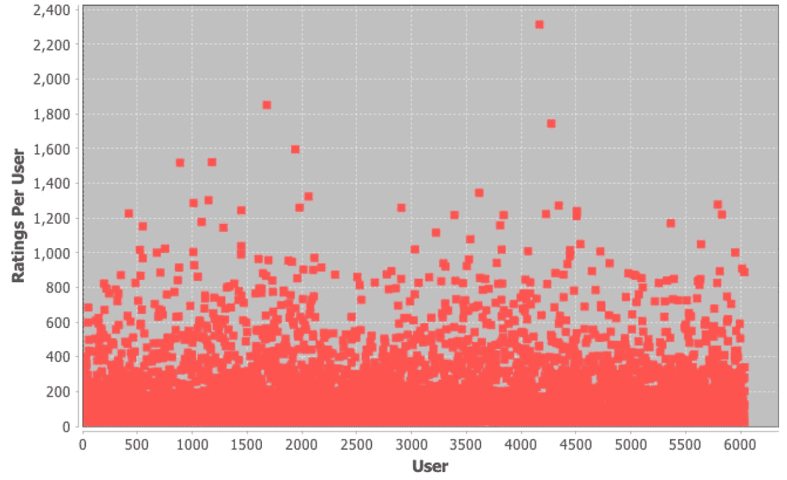
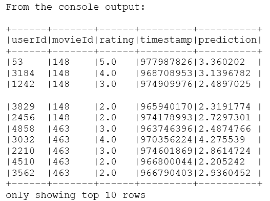
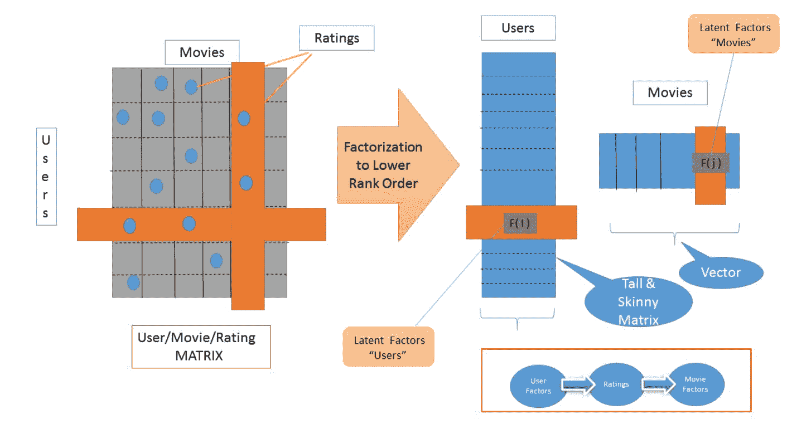
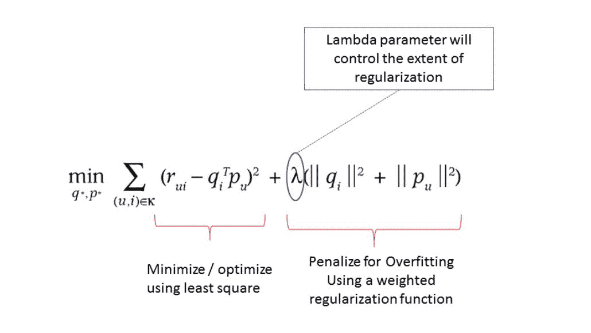

# 七、可随 Spark 扩展的推荐引擎

在本章中，我们将介绍:

*   在 Spark 2.0 中设置可伸缩推荐引擎所需的数据
*   探索星火 2.0 推荐系统的电影数据细节
*   探索星火 2.0 推荐系统的评分数据细节
*   在 Spark 2.0 中使用协作过滤构建可扩展的推荐引擎

# 介绍

在前面的章节中，我们使用了简短的配方和极其简化的代码来演示管理 Spark 机器库的基本构造块和概念。在这一章中，我们介绍了一个更发达的应用，它使用 Spark 的 API 和工具来解决特定的机器学习库领域。本章食谱数量较少；然而，我们进入了一个更 ML 的应用设置。

在本章中，我们使用矩阵分解技术来探索推荐系统及其实现，该技术利用了被称为**交替最小二乘** ( **ALS** )的潜在因素模型。简而言之，当我们试图将一个大的用户项目评分矩阵分解成两个排名较低、较瘦的矩阵时，我们经常会面临一个非常难以解决的非线性或非凸优化问题。恰好我们非常擅长通过固定一条腿，部分解决另一条腿，然后来回(因此交替)来解决凸优化问题；我们可以使用已知的优化技术并行地更好地解决这个因式分解(从而发现一组潜在因素)。

我们使用一个流行的数据集(电影镜头数据集)来实现推荐引擎，但与其他章节不同的是，我们使用了两个食谱来探索数据，并展示了如何将 JFreeChart 流行库等图形元素引入到您的 Spark 机器学习工具包中。

下图显示了本章中演示 ALS 推荐应用的概念和方法流程:


推荐引擎已经存在了很长时间，并在 20 世纪 90 年代的早期电子商务系统中使用，使用的技术从硬编码的产品关联到由概要驱动的基于内容的推荐。现代系统使用**协作过滤** ( **CF** )来解决早期系统的缺点，并解决在现代商业系统(例如，亚马逊、网飞、易贝、新闻等)中竞争所必需的规模和延迟(例如，最大 100 毫秒及以下)。

现代系统使用基于历史交互和记录(页面视图、购买、评级等)的 CF。这些系统解决了两个主要问题，主要是可伸缩性和稀疏性(也就是说，我们没有所有电影或歌曲的所有评级)。大多数系统使用交替最小二乘和加权λ正则化的变体，可以在大多数主要平台上并行化(例如，Spark)。话虽如此，一个为商业目的实现的实用系统使用许多增强来处理当今生态系统中存在的偏见(也就是说，不是所有的电影和用户都是平等的)和时间问题(也就是说，用户的选择会改变，项目的库存会改变)。在智能和领先的电子商务系统上工作过之后，构建一个有竞争力的推荐者不是一个纯粹的方法，而是一个实用的方法，它使用多种技术，以最低限度的利用所有三种技术(协作过滤、基于内容的过滤和相似性)得出亲和矩阵/热图作为上下文。

鼓励读者查阅白皮书和资料，其中提到了推荐系统中的冷启动问题。

为了设置上下文，下图提供了可用于构建推荐系统的方法的高级分类。我们简要介绍了每个系统的一些优缺点，但重点介绍了 Spark 中可用的矩阵分解(潜在因素模型)。虽然**单值分解** ( **SVD** )和**替代最小二乘** ( **ALS** )都是可用的，但由于 SVD 在处理缺失数据等方面的缺点，我们专注于用 MovieLens 数据实现 ALS。我们将在[第 11 章](11.html#EN3LS0-4d291c9fed174a6992fd24938c2f9c77)、*大数据高维诅咒*中详细探讨 SVD。


下一节将解释正在使用的推荐引擎技术。

# 内容过滤

内容过滤是推荐引擎的原始技术之一。它依靠用户档案来提出建议。这种方法主要依赖于预先存在的用户简档(类型、人口统计、收入、地理位置、邮政编码)和库存(产品、电影或歌曲的特征)来推断属性，然后可以对属性进行过滤和操作。主要问题是，预先存在的知识往往是不完整的，而且来源昂贵。这项技术已经有十多年的历史了，现在仍在实践中。

# 协同过滤

协同过滤是现代推荐系统的主力，它依赖于生态系统中的用户交互而不是简档来做出推荐。

这种技术依赖于过去的用户行为和产品评级，并且不假设任何预先存在的知识。简而言之，用户对库存项目进行评级，假设客户的口味会随着时间的推移保持相对稳定，这可以用来提供建议。话虽如此，一个智能系统将根据任何可用的上下文对推荐进行扩充和重新排序(例如，用户是从中国登录的女性)。

这类技术的主要问题是冷启动，但其不受域限制、准确性更高、易于扩展的优势使其成为大数据时代的赢家。

# 邻域法

该技术主要实现为**加权局部邻域**。就其核心而言，它是一种相似性技术，严重依赖于对项目和用户的假设。虽然该技术易于理解和实现，但该算法缺乏可扩展性和准确性。

# 潜在因素模型技术

这种技术试图通过推断从评级中推断出的第二组潜在因素来解释用户对库存商品(例如，亚马逊上的产品)的评级。这种力量来自于这样一个事实，即你不需要提前知道这些因素(类似于 PCA 技术)，但它们只是从评级本身推断出来的。我们使用矩阵分解技术导出潜在因素，这种技术因其极高的可扩展性、预测的准确性和灵活性而广受欢迎(它们考虑了用户和库存的偏差和时间特性)。

*   **奇异值分解(SVD)** : SVD 从早期就已经出现在 Spark 中，但是我们建议不要将其作为核心技术使用，因为它在现实生活中处理数据稀疏性(例如，用户通常不会对所有内容进行评级)、过度拟合和排序(我们真的需要产生最底层的 1000 条推荐吗？).
*   **随机渐变体面** ( **SGD** ): SGD 易于实现，并且由于其一次查看一部电影和一个用户/项目向量的方法而具有更快的运行时间(选择一部电影并为该用户稍微更新简档，而不是批处理方法)。我们可以根据需要使用 Spark 中的矩阵工具和 SGD 来实现这一点。
*   **交替最小二乘** ( **ALS** ):请在踏上这段旅程之前先看看 ALS。在 Spark 中提供，ALS 可以从一开始就利用并行化。Spark 在引擎盖下实现全矩阵分解，与大家普遍认为 Spark 使用半分解相反。我们鼓励读者自己参考源代码来验证这一点。Spark 为**显式**(评级可用)和**隐式**(需要间接推断-例如，播放曲目的时间长度而不是评级)提供了 API。我们通过引入数学和直觉来阐述我们的观点，从而讨论食谱本身的偏见和时间问题。

# 在 Spark 2.0 中设置可伸缩推荐引擎所需的数据

在这个方法中，我们检查了 MovieLens 公共数据集的下载，并对数据进行了第一次探索性查看。我们将使用基于 MovieLens 数据集中客户评级的明确数据。MovieLens 数据集包含来自 6，000 个用户的 4，000 部电影的 1，000，000 个评分。

您将需要以下命令行工具之一来检索指定的数据:`curl`(推荐用于 Mac)或`wget`(推荐用于 Windows 或 Linux)。

# 怎么做...

1.  您可以从使用以下任一命令下载数据集开始:

```scala
wget http://files.grouplens.org/datasets/movielens/ml-1m.zip
```

您也可以使用以下命令:

```scala
curl http://files.grouplens.org/datasets/movielens/ml-1m.zip -o ml-1m.zip
```

2.  现在您需要解压缩 ZIP 文件:

```scala
unzip ml-1m.zipcreating: ml-1m/inflating: ml-1m/movies.datinflating: ml-1m/ratings.datinflating: ml-1m/READMEinflating: ml-1m/users.dat
```

该命令将创建一个名为`ml-1m`的目录，其中包含解压缩的数据文件。

3.  换入目录`m1-1m`:

```scala
cd m1-1m
```

4.  现在，我们通过验证`movies.dat`中的数据是如何格式化的来开始数据探索的第一步:

```scala
head -5 movies.dat1::Toy Story (1995)::Animation|Children's|Comedy2::Jumanji (1995)::Adventure|Children's|Fantasy3::Grumpier Old Men (1995)::Comedy|Romance4::Waiting to Exhale (1995)::Comedy|Drama5::Father of the Bride Part II (1995)::Comedy
```

5.  现在我们来看一下评级数据，了解它是如何格式化的:

```scala
head -5 ratings.dat1::1193::5::9783007601::661::3::9783021091::914::3::9783019681::3408::4::9783002751::2355::5::978824291
```

# 它是如何工作的...

MovieLens 数据集是原始网飞 KDD 杯数据集的绝佳替代品。这个数据集有多个集合，从小的(100 K 集合)到大的(1 M 和 20 M 集合)。对于那些对调整源代码以添加自己的增强(例如，变更正则化技术)感兴趣的用户来说，数据集的范围使得研究缩放效果和查看性能曲线与每位高管的 Spark 利用率之间的关系变得容易，因为数据从 100 K 缩放到 20 M。

下载网址是[http://grouplens.org/datasets/movielens/](http://grouplens.org/datasets/movielens/)。

# 还有更多...

仔细看看我们从哪里下载的数据，因为更多的数据集可在[http://files.grouplens.org/datasets/](http://files.grouplens.org/datasets/)使用。

下图描述了数据的大小和范围。在这一章中，我们使用了小型设备，因此它可以在资源有限的小型笔记本上轻松运行。


Source: MovieLens

# 请参见

请通读包含在将数据解压缩到的目录中的自述文件。自述文件包含有关数据文件格式和数据描述的信息。

还有一个 MovieLens 基因组标签集可以参考。

*   计算标签-电影 1100 万
*   来自 1100 个标签池的相关性分数
*   适用于一万部电影

有兴趣探索网飞原始数据集的，请访问[http://academic torrents . com/details/9b 13183 C4 d 60676 b 773 c 9 e2cd 6 de 5 e 5542 ce 9a](http://academictorrents.com/details/9b13183dc4d60676b773c9e2cd6de5e5542cee9a)网址。

# 探索星火 2.0 推荐系统的电影数据细节

在这个食谱中，我们将通过将数据解析成 Scala `case`类并生成一个简单的度量来开始探索电影数据文件。这里的关键是获得对我们数据的理解，因此在后期阶段，如果出现模糊的结果，我们将有一些洞察力来对我们结果的正确性做出明智的结论。

这是探索电影数据集的两个方法中的第一个。数据探索是统计分析和机器学习中重要的第一步。

快速理解数据的最好方法之一是生成数据可视化，我们将使用 JFreeChart 来实现这一点。确保您对数据感到满意并直接了解每个文件中的内容及其试图讲述的故事非常重要。

在我们做任何其他事情之前，我们必须始终探索、理解和可视化数据。ML 和其他系统的大多数性能和失误可以追溯到对数据如何布局以及它如何随时间变化缺乏理解。如果我们看一下这个食谱中第 14 步给出的图表，我们会立即意识到这些年来电影的分布并不均匀，而是以高峰度倾斜。虽然我们不打算在本书中探讨这个属性的优化和采样，但它对电影数据的性质提出了一个重要的观点。

# 怎么做...

1.  在 IntelliJ 或您选择的 IDE 中启动一个新项目。确保包含必要的 JAR 文件。

2.  JFreeChart JAR 可以从[https://sourceforge.net/projects/jfreechart/files/](https://sourceforge.net/projects/jfreechart/files/)网站下载。

3.  请确保 JFreeChart 库及其依赖项(JCommon)在本章的类路径中。

4.  我们为 Scala 程序定义了包信息:

```scala
package spark.ml.cookbook.chapter7
```

5.  导入必要的包:

```scala
import java.text.DecimalFormatimport org.apache.log4j.{Level, Logger}import org.apache.spark.sql.SparkSessionimport org.jfree.chart.{ChartFactory, ChartFrame, JFreeChart}import org.jfree.chart.axis.NumberAxisimport org.jfree.chart.plot.PlotOrientationimport org.jfree.data.xy.{XYSeries, XYSeriesCollection}
```

6.  我们现在定义一个 Scala `case class`来建模电影数据:

```scala
case class MovieData(movieId: Int, title: String, year: Int, genre: Seq[String])
```

7.  让我们定义一个函数，在稍后调用的窗口中显示一个 JFreeChart。该软件包中有许多图表和绘图选项可供探索:

```scala
def show(chart: JFreeChart) {val frame = new ChartFrame("plot", chart)frame.pack()frame.setVisible(true)}
```

8.  在这一步中，我们定义了一个函数，用于将一行数据从`movie.dat`文件解析到我们的电影`case class`中:

```scala
def parseMovie(str: String): MovieData = {val columns = str.split("::")*assert*(columns.size == 3)val titleYearStriped = """\(|\)""".r.replaceAllIn(columns(1), " ")val titleYearData = titleYearStriped.split(" ")*MovieData*(columns(0).toInt,titleYearData.take(titleYearData.size - 1).mkString(" "),titleYearData.last.toInt,columns(2).split("|"))}
```

9.  我们准备开始构建我们的`main`函数，所以让我们从定义我们的`movie.dat`文件的位置开始:

```scala
 val movieFile = "../data/sparkml2/chapter7/movies.dat"
```

10.  创建 Spark 的会话对象和设置配置:

```scala
val spark = SparkSession.*builder*.master("local[*]").appName("MovieData App").config("spark.sql.warehouse.dir", ".").config("spark.executor.memory", "2g").getOrCreate()
```

11.  日志消息的交错导致难以读取的输出；因此，将记录级别设置为`ERROR`:

```scala
Logger.getLogger("org").setLevel(Level.ERROR)
```

12.  从数据文件创建所有电影的数据集:

```scala
import spark.implicits._val movies = spark.read.textFile(movieFile).map(parseMovie)  
```

13.  将所有电影按年份分组，使用 Spark SQL 发布:

```scala
movies.createOrReplaceTempView("movies")val moviesByYear = spark.sql("select year, count(year) as count from movies group by year order by year")
```

14.  我们现在显示一个直方图，其中电影按发行年份分组:

```scala
val histogramDataset = new XYSeriesCollection()val xy = new XYSeries("")moviesByYear.collect().foreach({row => xy.add(row.getAs[Int]("year"), row.getAs[Long]("count"))})histogramDataset.addSeries(xy)val chart = ChartFactory.createHistogram("", "Year", "Movies Per Year", histogramDataset, PlotOrientation.VERTICAL, false, false, false)val chartPlot = chart.getXYPlot()val xAxis = chartPlot.getDomainAxis().asInstanceOf[NumberAxis]xAxis.setNumberFormatOverride(new DecimalFormat("####"))show(chart)
```

15.  查看制作的图表，以获得电影数据集的良好感觉。数据可视化至少有两到四种其他方式，读者可以探索这些方式。


16.  我们通过停止 Spark 会话来关闭程序:

```scala
spark.stop()  
```

# 它是如何工作的...

当程序开始执行时，我们在驱动程序中初始化了一个 SparkContext 来开始处理数据的任务。这意味着数据必须适合驱动程序的内存(用户的工作站)，在这种情况下，这不是服务器的要求。必须设计出可替代的分而治之的方法来处理极端数据集(部分检索和目的地的组装)。

我们继续将数据文件加载并解析到具有电影数据类型的数据集中。然后，电影数据集按年分组，生成按年键控的电影地图，并附有一桶桶相关的电影。


接下来，我们用与特定年份相关的电影数量计数提取年份，以生成直方图。然后我们收集数据，导致整个结果数据收集在驱动程序上具体化，并将其传递给 JFreeChart 来构建数据可视化。

# 还有更多...

由于 Spark SQL 的灵活性，您需要了解我们对它的使用。更多信息见[http://spark . Apache . org/docs/latest/SQL-programming-guide . html # running-SQL-query-programming](http://spark.apache.org/docs/latest/sql-programming-guide.html#running-sql-queries-programmatically)。

# 请参见

有关使用 JFreeChart 的更多信息，请参考位于[http://www.jfree.org/jfreechart/api.html](http://www.jfree.org/jfreechart/api.html)的 JFreechart 应用编程接口文档。

你可以在 JFreeChart 的[http://www.tutorialspoint.com/jfreechart/](http://www.tutorialspoint.com/jfreechart/)链接找到一个很好的教程。

JFreeChart 本身的链接是[http://www.jfree.org/index.html](http://www.jfree.org/index.html)。

# 探索星火 2.0 推荐系统的评分数据细节

在本食谱中，我们从用户/评级的角度探索数据，以了解数据文件的性质和属性。我们将通过将数据解析成 Scala 案例类并生成可视化来深入了解评级数据文件。评级数据稍后将用于为我们的推荐引擎生成功能。我们再次强调，任何数据科学/机器学习练习的第一步都应该是数据的可视化和探索。

同样，快速理解数据的最好方法是生成数据可视化，我们将使用 JFreeChart 散点图来实现这一点。快速浏览由 JFreeChart 图产生的按等级划分的*用户的图表*，显示出与带有异常值的多项式分布的相似性，并且当等级增加时稀疏性增加。

# 怎么做...

1.  在 IntelliJ 或您选择的 IDE 中启动一个新项目。确保包含必要的 JAR 文件。

2.  我们为 Scala 程序定义了包信息:

```scala
package spark.ml.cookbook.chapter7
```

3.  导入必要的包:

```scala
import java.text.DecimalFormatimport org.apache.log4j.{Level, Logger}import org.apache.spark.sql.SparkSessionimport org.jfree.chart.{ChartFactory, ChartFrame, JFreeChart}import org.jfree.chart.axis.NumberAxisimport org.jfree.chart.plot.PlotOrientationimport org.jfree.data.xy.{XYSeries, XYSeriesCollection}
```

4.  我们现在定义一个 Scala `case class`来建模评级数据:

```scala
case class Rating(userId: Int, movieId: Int, rating: Float, timestamp: Long)
```

5.  让我们定义一个在窗口中显示 JFreeChart 的函数:

```scala
def show(chart: JFreeChart) {val frame = new ChartFrame("plot", chart)frame.pack()frame.setVisible(true)}
```

6.  在这一步中，我们定义了一个函数，用于将来自`ratings.dat`文件的单行数据解析为等级`case class`:

```scala
def parseRating(str: String): Rating = {val columns = str.split("::")assert(columns.size == 4)Rating(columns(0).toInt, columns(1).toInt, columns(2).toFloat, columns(3).toLong)}
```

7.  我们已经准备好开始构建我们的`main`函数，所以让我们从我们的`ratings.dat`文件的位置开始:

```scala
val ratingsFile = "../data/sparkml2/chapter7/ratings.dat"
```

8.  创建 Spark 的配置，Spark 会话。在本例中，我们首次展示了如何在小型笔记本上设置 Spark 执行器内存(例如 2gb)。如果要使用大型数据集(144 MB 集)，则必须增加此分配:

```scala
val spark = SparkSession.*builder*.master("local[*]").appName("MovieRating App").config("spark.sql.warehouse.dir", ".").config("spark.executor.memory", "2g").getOrCreate()
```

9.  日志消息的交错导致难以读取的输出；因此，将记录级别设置为`ERROR`:

```scala
Logger.getLogger("org").setLevel(Level.ERROR)
```

10.  从数据文件中创建包含所有评级的数据集:

```scala
import spark.implicits._val ratings = spark.read.textFile(ratingsFile).map(*parseRating*)
```

11.  现在，我们将评级数据集转换为内存表视图，在这里我们可以执行 Spark SQL 查询:

```scala
ratings.createOrReplaceTempView("ratings")
```

12.  我们现在生成一个按用户分组的所有用户评分列表，以及它们的总数:

```scala
val resultDF = spark.sql("select ratings.userId, count(*) as count from ratings group by ratings.userId")resultDF.show(25, false);
```

从控制台输出:


13.  显示散点图，显示每个用户的评分。我们选择一个散点图来展示一种不同的方式来查看上一个配方的数据。我们鼓励读者探索标准化技术(例如，移除均值)或波动变化机制(例如，GARCH)，以探索该数据集的自回归条件异方差属性(这超出了本书的范围)。建议读者查阅任何先进的时间序列书，以了解时间序列的时变波动性，以及如何在使用前纠正这一点。

```scala
val scatterPlotDataset = new XYSeriesCollection()val xy = new XYSeries("")resultDF.collect().foreach({r => xy.add( r.getAs[Integer]("userId"), r.getAs[Integer]("count")) })scatterPlotDataset.addSeries(xy)val chart = ChartFactory.*createScatterPlot*("", "User", "Ratings Per User", scatterPlotDataset, PlotOrientation.*VERTICAL*, false, false, false)val chartPlot = chart.getXYPlot()val xAxis = chartPlot.getDomainAxis().asInstanceOf[NumberAxis]xAxis.setNumberFormatOverride(new DecimalFormat("####"))
```

14.  显示图表:

```scala
*show*(chart)
```



15.  我们通过停止 Spark 会话来关闭程序:

```scala
spark.stop()
```

# 它是如何工作的...

我们首先将数据文件加载并解析为具有数据类型评级的数据集，最后将其转换为数据帧。然后，数据框被用来执行一个 Spark SQL 查询，该查询按用户对所有评级及其总计进行分组。

我们在第 3 章*中探讨了数据集/数据框架，Spark 的机器学习三大数据火枪手-完美结合*，但我们鼓励用户刷新并深入挖掘数据集/数据框架 API。对于每个 Spark 开发人员来说，充分理解 API 及其概念(惰性实例化、分段、流水线和缓存)至关重要。


最后，我们将数据的结果集传递给 JFreeChart 散点图组件来显示我们的图表。

# 还有更多...

Spark DataFrame 是组织成命名列的分布式数据集合。所有数据框操作也自动并行化并分布在集群上。此外，数据帧像关系数据库一样被懒散地评估。

# 请参见

关于数据框架的文档可以在[http://spark . Apache . org/docs/latest/SQL-programming-guide . html](http://spark.apache.org/docs/latest/sql-programming-guide.html)上找到。

在[http://www.tutorialspoint.com/jfreechart/](http://www.tutorialspoint.com/jfreechart/)链接可以找到一个关于 JFreeChart 的好教程。

JFreeChart 可从[http://www.jfree.org/index.html](http://www.jfree.org/index.html)网址下载。

# 在 Spark 2.0 中使用协作过滤构建可扩展的推荐引擎

在这个食谱中，我们将展示一个推荐系统，它利用了一种被称为协同过滤的技术。在核心，协同过滤分析用户自身与库存(例如电影、书籍、新闻文章或歌曲)之间的依赖关系，以基于一组称为**潜在因素**的次要因素(例如，女性/男性、快乐/悲伤、主动/被动)来识别用户与项目的关系。这里的关键是你不需要提前知道潜在的因素。

推荐将通过 ALS 算法产生，这是一种协作过滤技术。在高层次上，协同过滤需要基于收集先前已知的偏好，结合许多其他用户的偏好，来预测用户可能对什么感兴趣。我们将使用来自 MovieLens 数据集的评分数据，并将其转换为推荐算法的输入要素。

# 怎么做...

1.  在 IntelliJ 或您选择的 IDE 中启动一个新项目。确保包含必要的 JAR 文件。

2.  我们为 Scala 程序定义了包信息:

```scala
package spark.ml.cookbook.chapter7
```

3.  导入必要的包:

```scala
import org.apache.log4j.{Level, Logger}import org.apache.spark.sql.SparkSessionimport org.apache.spark.ml.recommendation.ALS
```

4.  我们现在定义了两个 Scala 案例类，来模拟电影和收视率数据:

```scala
case class Movie(movieId: Int, title: String, year: Int, genre: Seq[String])case class FullRating(userId: Int, movieId: Int, rating: Float, timestamp: Long)
```

5.  在这一步中，我们定义函数，用于将来自`ratings.dat`文件的单行数据解析为等级`case class`，并将来自`movies.dat`文件的单行数据解析为电影`case class`:

```scala
def parseMovie(str: String): Movie = {val columns = str.split("::")*assert*(columns.size == 3)val titleYearStriped = """\(|\)""".r.replaceAllIn(columns(1), " ")val titleYearData = titleYearStriped.split(" ")*Movie*(columns(0).toInt,titleYearData.take(titleYearData.size - 1).mkString(" "),titleYearData.last.toInt,columns(2).split("|"))}def parseFullRating(str: String): FullRating = {val columns = str.split("::")*assert*(columns.size == 4)*FullRating*(columns(0).toInt, columns(1).toInt, columns(2).toFloat, columns(3).toLong)}
```

6.  我们已经准备好开始构建我们的`main`功能，所以让我们从`movie.dat`和`ratings.dat`文件的位置开始:

```scala
val movieFile = "../data/sparkml2/chapter7/movies.dat"val ratingsFile = "../data/sparkml2/chapter7/ratings.dat"
```

7.  创建 SparkSession 对象及其相关配置:

```scala
val spark = SparkSession.builder.master("local[*]").appName("MovieLens App").config("spark.sql.warehouse.dir", ".").config("spark.executor.memory", "2g").getOrCreate()
```

8.  日志消息的交错导致难以读取的输出；因此，将记录级别设置为`ERROR`:

```scala
Logger.getLogger("org").setLevel(Level.ERROR)
```

9.  创建一个包含所有评级的数据集，并将其注册为内存中的临时视图，以便可以使用 SQL 进行查询:

```scala
val ratings = spark.read.textFile(ratingsFile).map(*parseFullRating*)val movies = spark.read.textFile(movieFile).map(*parseMovie*).cache()movies.createOrReplaceTempView("movies")
```

10.  对视图执行 SQL 查询:

```scala
val rs = spark.sql("select movies.title from movies")rs.show(25)
```

从控制台输出:


11.  我们将评级数据分为训练和测试数据集。训练数据将用于训练交替最小二乘推荐机器学习算法，测试数据将用于评估预测和测试数据之间的准确性:

```scala
val splits = ratings.randomSplit(*Array*(0.8, 0.2), 0L)val training = splits(0).cache()val test = splits(1).cache()val numTraining = training.count()val numTest = test.count()*println*(s"Training: $numTraining, test: $numTest.")
```

12.  现在创建一个用户标识为零的虚拟用户，生成一个包含多个评级的数据集。该用户将允许我们稍后更好地理解由 ALS 算法计算的预测:

```scala
val testWithOurUser = spark.createDataset(Seq(FullRating(0, 260, 0f, 0), // Star Wars: Episode IV - A New HopeFullRating(0, 261, 0f, 0), // Little WomenFullRating(0, 924, 0f, 0), // 2001: A Space OdysseyFullRating(0, 1200, 0f, 0), // AliensFullRating(0, 1307, 0f, 0) // When Harry Met Sally...)).as[FullRating]val trainWithOurUser = spark.createDataset(Seq(FullRating(0, 76, 3f, 0), // ScreamersFullRating(0, 165, 4f, 0), // Die Hard: With a VengeanceFullRating(0, 145, 2f, 0), // Bad BoysFullRating(0, 316, 5f, 0), // StargateFullRating(0, 1371, 5f, 0), // Star Trek: The Motion PictureFullRating(0, 3578, 4f, 0), // GladiatorFullRating(0, 3528, 1f, 0) // Prince of Tides)).as[FullRating]
```

13.  使用数据集联合方法将`testWithOurUser`追加到原始训练集中。另外，在原始训练集和免费资源测试集上使用`unpersist`方法:

```scala
val testSet = test.union(testWithOurUser)test.unpersist()val trainSet = training.union(trainWithOurUser)training.unpersist()
```

14.  创建 ALS 对象并设置参数。

使用训练数据集获取模型。

```scala
val als = new ALS().setUserCol("userId").setItemCol("movieId").setRank(10).setMaxIter(10).setRegParam(0.1).setNumBlocks(10)val model = als.fit(trainSet.toDF)
```

15.  我们让模型在测试数据集上工作:

```scala
val predictions = model.transform(testSet.toDF())predictions.cache()predictions.show(10, false)
```

从控制台输出:



16.  构建一个内存中的表，其中包含 Spark SQL 查询的所有预测:

```scala
val allPredictions = predictions.join(movies, movies("movieId") === predictions("movieId"), "left")
```

17.  从表中检索评级和预测，并在控制台中显示前 20 行:

```scala
allPredictions.select("userId", "rating", "prediction", "title")show(false)
```

从控制台输出:


18.  现在获取特定用户的电影预测:

```scala
allPredictions.select("userId", "rating", "prediction", "title").where("userId=0").show(false)
```

从控制台输出:


19.  我们通过停止 Spark 会话来关闭程序:

```scala
spark.stop()
```

# 它是如何工作的...

由于程序的复杂性，我们提供一个概念性的解释，然后继续解释程序的细节。

下图描述了 ALS 的概念视图，以及它如何分解用户/电影/评分矩阵，这是一个从高阶到低阶的高瘦矩阵，以及一个潜在因素向量:f(用户)和 f(电影)。



另一种思考方式是，这些因素可以用来将电影放置在 *n* 维空间中，该空间将与给定用户的给定推荐相匹配。总是希望将机器学习视为维度变量空间中的搜索查询。需要记住的一点是，潜在因子(学习的几何空间)不是预先定义的，可以低至 10 到 100 或 1000，这取决于正在搜索或分解的内容。因此，我们的建议可以被视为在 n 维空间中放置一个概率质量。下图提供了一个可能的双因素模型(二维)的极其简化的视图来证明这一点:


虽然 ALS 的实现因系统而异，但其核心是一种带有加权正则化的迭代全因子分解方法(在 Spark 中)。Spark 的文档和教程提供了对实际数学和算法本质的洞察。它将算法描述如下:


理解该公式/算法的最佳方式是将其视为一种迭代设备，该设备试图通过在输入之间交替来发现潜在因素(即，固定一个输入，然后近似/优化另一个输入，然后来回)，同时试图相对于加权λ的正则化惩罚最小化最小平方误差(MSE)。下一节将提供更详细的解释。

程序流程如下:

*   该示例首先从电影数据集加载收视率和电影数据。然后，加载的数据被转换成 Scala 案例类进行进一步处理。下一步是将评级数据划分为训练集和测试集。训练集数据用于训练机器学习算法。训练是机器学习中用于建立模型的过程，以便它能够提供所需的适当结果。测试数据将用于验证最后一步的结果。
*   虚拟用户(即用户标识零)步骤配置了原始数据集中没有的单个用户，通过动态创建带有随机信息的数据集，并最终将其附加到训练集中，来帮助洞察结果。ALS 算法是通过将训练集数据传递给它来调用的，该数据由用户标识、电影标识和评级组成，随后从 Spark 生成一个矩阵分解模型。为用户标识零和测试数据集执行预测生成。
*   最终结果是通过将分级信息与电影数据相结合来显示的，因此结果可以被理解并显示在估计分级旁边的原始分级中。最后一步是计算生成评级的均方根误差，现有评级包含在测试数据集中。RMSE 会告诉我们火车模型有多精确。

# 还有更多...

人们经常与肌萎缩侧索硬化症斗争，尽管它的核心是一个简单的线性代数运算，带有额外的正则化惩罚。ALS 的强大之处在于其并行化和处理规模的能力(例如 Spotify)。

通俗地说，肌萎缩侧索硬化症包括以下内容:

*   有了 ALS，你基本上要把一个很大的评分矩阵 X (1 亿加用户根本不是一个拉伸)和用户产品评分分解成 A 和 B 两个矩阵，排名靠后(见任何一本线性代数入门书)。问题是它往往成为一个非常难解决的非线性优化问题。为了补救 ALS，您引入了一个简单的解决方案(**A****交替**)，其中您固定一个矩阵，并使用最小二乘法部分求解另一个分支(另一个矩阵)进行优化( **LS** 代表**最小二乘**)。一旦这一步完成，然后你交替，但这一次你修复第二条腿(矩阵)和解决第一个。
*   为了控制过拟合，我们在原始方程中引入了一个正则化分支。这一步通常是加权正则化，由参数λ控制，参数λ控制惩罚或展平的量。
*   简而言之，使这变得有趣的是，这种方法矩阵分解非常适合并行操作，这是 Spark 的核心专长。

为了深入了解 ALS 算法，我们引用了两篇被认为是该领域经典的原创论文:

从 ACM 数字图书馆使用[http://dl.acm.org/citation.cfm?id=1608614](http://dl.acm.org/citation.cfm?id=1608614)链接。

来自 IEEE 数字图书馆[http://ieeexplore.ieee.org/xpl/login.jsp?tp=&a number = 5197422&URL = http % 3A % 2F % 2 fieeexplore . IEEE . org % 2 fxpls % 2 fabs _ all . JSP % 3 farnumber % 3d 5197422](http://ieeexplore.ieee.org/xpl/login.jsp?tp=&arnumber=5197422&url=http%3A%2F%2Fieeexplore.ieee.org%2Fxpls%2Fabs_all.jsp%3Farnumber%3D5197422)。

下图从一个更数学的角度显示了 ALS，来自之前引用的原始论文:



使用排名度量度量类来评估模型性能。参数类似于用于回归模型评估(二元和多项式)的类别:

*   回忆
*   精确
*   措施

MLlib 提供的 RankingMetrics 类可用于评估模型和量化模型有效性。

排名指标应用编程接口文档可在[http://spark . Apache . org/docs/latest/API/Scala/index . html # org . Apache . spark . mllib . evaluation .排名指标](http://spark.apache.org/docs/latest/api/scala/index.html#org.apache.spark.mllib.evaluation.RankingMetrics)中找到。

# 请参见

探索 ALS 应用编程接口的 Spark 2.0 ML 文档:

*   [https://spark . Apache . org/docs/latest/mllib-协同过滤. html](https://spark.apache.org/docs/latest/mllib-collaborative-filtering.html)
*   [https://spark . Apache . org/docs/latest/API/Scala/index . html # org . Apache . spark . ml . recommend . als](https://spark.apache.org/docs/latest/api/scala/index.html#org.apache.spark.ml.recommendation.ALS)
*   [https://spark . Apache . org/docs/latest/API/Scala/index . html # org . Apache . spark . ml . recommend . alsmodel](https://spark.apache.org/docs/latest/api/scala/index.html#org.apache.spark.ml.recommendation.ALSModel)

Spark 2.0 MLlib 文档可在[https://spark . Apache . org/docs/latest/API/Scala/index . html # org . Apache . spark . MLlib . recommend . ALS](https://spark.apache.org/docs/latest/api/scala/index.html#org.apache.spark.mllib.recommendation.ALS)上获得。

ALS 参数及其默认值使用默认参数构建 ALS 实例，如下所示:

```scala
{numBlocks: -1, rank: 10, iterations: 10, lambda: 0.numBlocks: -1,rank: 10,iterations: 10,lambda: 0.01,implicitPrefs: false,alpha: 1.0
```

# 处理训练的隐含输入

有时实际的观察(评级)不可用，必须处理隐含的反馈参数。这可以简单到订婚期间听了哪个音轨，看了多长时间的电影，或者上下文(提前索引)或者是什么导致了切换(在开始、中间或特定场景附近放弃的网飞电影)。第三个配方中提供的例子通过使用`ALS.train()`处理明确的反馈。

Spark ML 库提供了一种替代方法`ALS.trainImplicit()`，它有四个超参数来控制算法和处理隐式数据。如果您有兴趣测试这个(它非常类似于显式方法)，您可以使用 1，000，000 首歌曲数据集进行简单的训练和预测。您可以从[http://labrosa.ee.columbia.edu/millionsong/](http://labrosa.ee.columbia.edu/millionsong/)网址下载数据集进行实验。

协同过滤的利弊如下:

| **优点** | cons |
| 可攀登的 | 冷启动问题

*   Add new items to inventory

*   New users added to the ecosystem

 |
| 发现没有配置文件的难以找到且通常虚假的数据属性 | 需要大量数据 |
| 更准确 |  |
| 轻便的 |  |