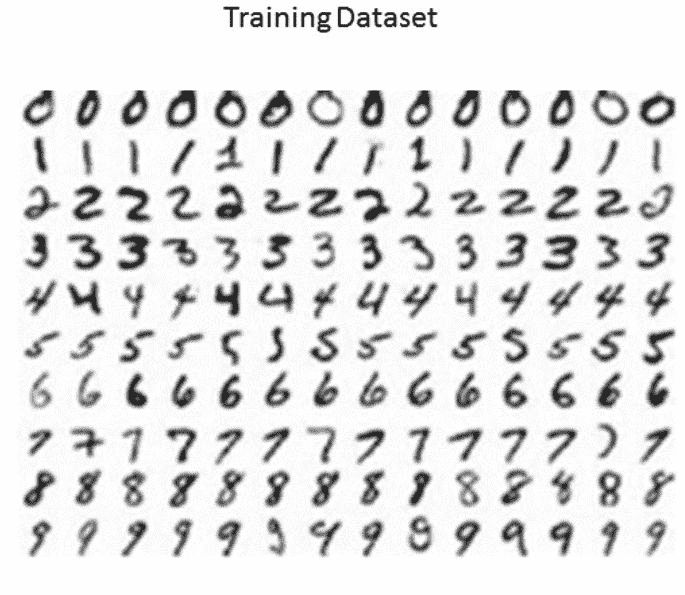
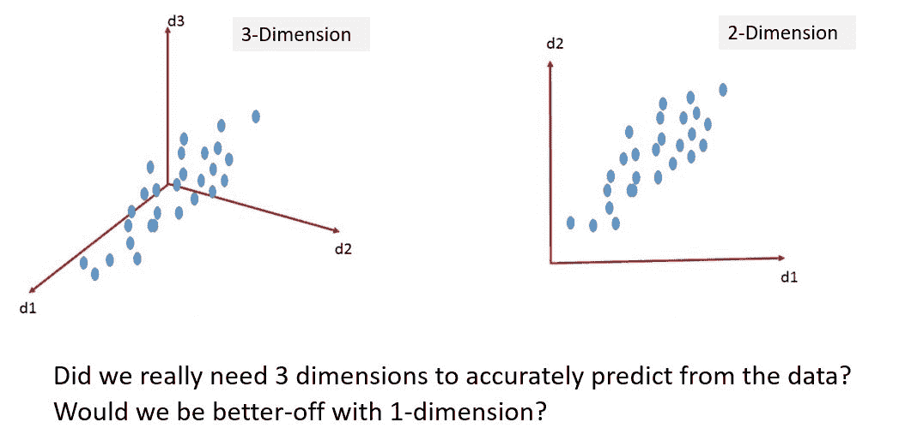
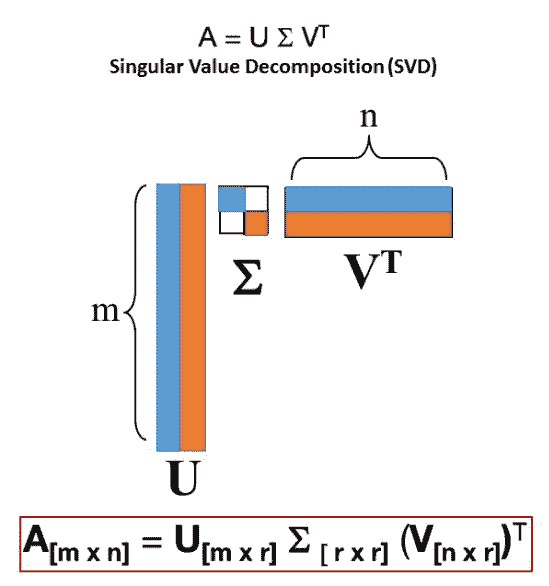
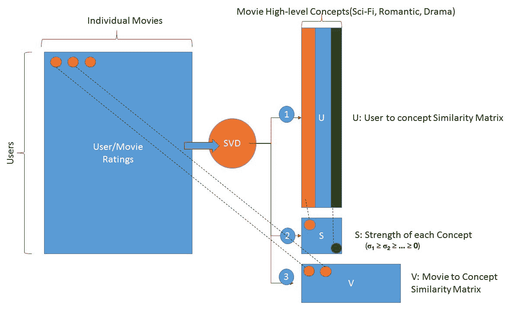
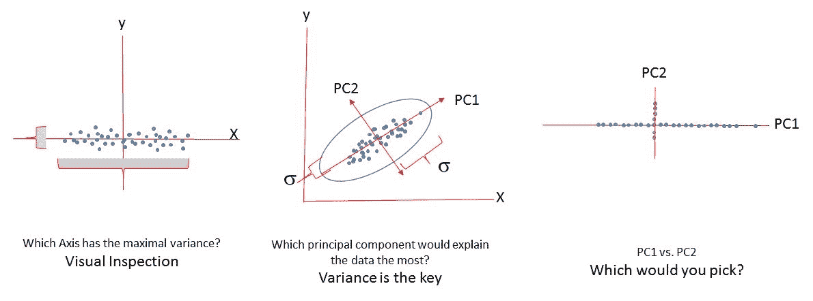
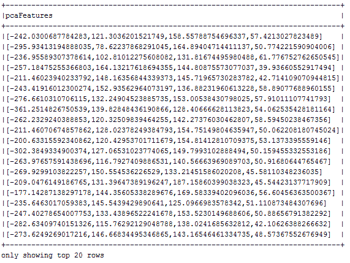

# 十一、大数据的高维诅咒

在本章中，我们将涵盖以下主题:

*   摄取和准备 CSV 文件以便在 Spark 中处理的两种方法
*   **奇异值分解** ( **奇异值分解**)降低 Spark 中的高维度
*   **主成分分析** ( **PCA** )选出 Spark 中最有效的机器学习潜在因素

# 介绍

维度的诅咒不是一个新的术语或概念。这个术语最初是由 r .贝尔曼在处理动态规划问题(贝尔曼方程)时创造的。机器学习中的核心概念指的是这样一个问题，即随着我们增加维度(轴或特征)的数量，训练数据(样本)的数量保持不变(或相对较低)，这导致我们的预测精度较低。这种现象也被称为*休斯效应*，以 G. Hughes 的名字命名，讲的是当我们给问题空间引入越来越多的维度时，搜索空间快速(指数)增加所带来的问题。这有点违反直觉，但是如果样本的数量没有随着你增加更多的维度而以同样的速度增长，你实际上会得到一个不太精确的模型！

简而言之，大多数机器学习算法本质上是统计的，它们试图通过在训练期间分割空间以及对每个子空间中每个类的数量进行某种计数来学习目标空间的属性。维数灾难是由于数据样本越来越少造成的，当我们增加更多的维数时，这可以帮助算法进行判别和学习。一般来说，如果我们在密集的 *D* 维度上有 *N* 个样本，那么我们需要 *(N) <sup class="calibre28">D</sup>* 个样本来保持样本密度不变。

例如，假设您有 10 个患者数据集，这些数据集是沿两个维度(身高、体重)测量的。这导致二维平面中有 10 个数据点。如果我们开始引入其他维度，如地区、卡路里摄入量、种族、收入等，会发生什么？在这种情况下，我们仍然有 10 个观察点(10 名患者)，但在一个更大的六维空间中。随着新维度的引入，样本数据(训练所需)无法指数级扩展，这被称为**维度诅咒**。

让我们看一个图形示例来显示搜索空间相对于数据样本的增长。下图描述了在 5 x 5 (25 个像元)中测量的一组五个数据点。当我们增加另一个维度时，预测精度会发生什么变化？我们在 125 个三维单元中仍然有五个数据点，这导致了大量的稀疏子空间，无法帮助最大似然算法更好地学习(辨别)，因此导致了更低的精度:


我们的目标应该是努力达到接近最优的特征或尺寸数量，而不是增加越来越多的特征(最大特征或尺寸)。毕竟，如果只是增加越来越多的特征或维度，难道不应该有更好的分类错误吗？一开始这似乎是一个好主意，但大多数情况下的答案是“否”，除非你能指数级地增加样本，这在几乎所有情况下都既不实际也不可能。

让我们看看下图，它描述了学习误差与特征总数的关系:


在前一节中，我们研究了维度诅咒之外的核心概念，但我们没有谈论它的其他副作用或如何处理诅咒本身。正如我们之前看到的，与普遍的看法相反，不是维度本身，而是样本与搜索空间之比的减少，这随后导致预测不太准确。

想象一个简单的 ML 系统，如下图所示。此处显示的 ML 系统采用 MNIST([http://yann.lecun.com/exdb/mnist/](http://yann.lecun.com/exdb/mnist/))类型的手写数据集，并希望对其进行自我训练，以便能够预测包裹上使用的六位数邮政编码:



Source: MNIST

尽管 MNIST 数据是 20 x 20，但为了使问题更加明显，让我们假设每个数字都有一个 40 x 40 像素的补丁，需要存储、分析，然后用于未来的预测。如果我们假设黑/白，那么*表观*维数为 2(40x 40)或 21600，这是很大的。下一个应该问的问题是:给定数据的 21600 个表观维度，我们工作所需的实际维度是什么？如果我们查看从 40 x 40 补丁中提取的所有可能的样本，其中有多少实际上在寻找数字？一旦我们更仔细地看这个问题，我们会看到“实际”维度(也就是说，被限制在一个更小的流形子空间中，这个空间是一个笔画用来构成数字的空间。实际上，实际的子空间要小得多，并且不是随机分布在 40×40 的面片上)实际上要小得多！这里发生的是，实际数据(人类绘制的数字)存在于小得多的维度中，并且很可能被限制在子空间中的一小组流形中(也就是说，数据生活在某个子空间周围)。为了更好地理解这一点，从一个 40 x 40 的补丁中抽取 1000 个随机样本，并目视检查这些样本。有多少看起来像 3、6 或 5？

当我们添加维度时，我们可能会无意中通过向系统引入噪声来增加错误率，因为如果测量本身引入噪声，将没有足够的样本来准确预测或简单地采取行动。添加更多维度的常见问题如下:

*   更长的计算时间
*   噪音增加
*   保持相同的学习/预测速率需要更多的样本
*   由于稀疏空间中缺少可操作的样本，数据被过度拟合

图片展示可以帮助我们理解*表观尺寸*和*实际尺寸*之间的差异，以及为什么在这种情况下*越少越多*:



我们想要减少维度的原因可以表达为以下能力:

*   更好地可视化数据
*   压缩数据并降低存储需求
*   提高信噪比
*   实现更快的运行时间

# 特征选择与特征提取

我们有两个选项，特征选择和特征提取，可以用来将维度缩小到更易于管理的空间。这些技术中的每一种都是一门独特的学科，有自己的方法和复杂性。尽管它们听起来一样，但它们非常不同，需要单独处理。

下图提供了一个思维导图，比较了特征选择和特征提取，以供参考。虽然特征选择(也称为特征工程)超出了本书的范围，但我们通过详细的方法介绍了两种最常见的特征提取技术(PCA 和 SVD):


选择最大似然算法的一组特征或输入的两种技术是:

*   **特征选择**:在这项技术中，我们使用我们的领域知识来选择最能描述数据中方差的特征子集。我们试图做的是选择能帮助我们预测结果的最佳因变量(特征)。这种方法通常被称为“特征工程”，需要数据工程师或领域专家才能有效。

例如，我们可能会看到 200 个独立变量(维度、特征)，这些变量是为物流分类器提出的，用于预测芝加哥市的房子是否会出售。在与拥有 20 多年芝加哥市场房屋买卖经验的房地产专家交谈后，我们发现在最初提出的 200 个维度中，只有 4 个维度(如卧室数量、价格、总平方英尺面积和学校质量)足以进行预测。虽然这很棒，但它通常非常昂贵、耗时，并且需要领域专家来分析和提供指导。

*   **特征提取**:这是指使用映射函数将高维数据映射到低维空间的更具算法性的方法。例如，将三维空间(例如，身高、体重、眼睛颜色)映射到一维空间(例如，潜在因素)，可以捕获数据集中几乎所有的变化。

我们在这里试图做的是提出一组潜在因素，这些潜在因素是原始因素的组合(通常是线性的)，但可以准确地捕捉和解释数据。比如我们用文字来描述通常以 10 <sup class="calibre28">6</sup> 到 10 <sup class="calibre28">9</sup> 空间结尾的文档，但是用更抽象、更高层次的话题(比如，爱情、战争、和平、科学、艺术等等)来描述文档不是更好吗？为了更好地进行文本分析，我们真的需要查看或包含每个单词吗？代价是什么？

特征提取是关于降维的算法方法，它本身是从“表观维度”到“实际维度”的映射的代理。

# 摄取和准备 CSV 文件以便在 Spark 中处理的两种方法

在这个食谱中，我们探索了阅读、解析和为一个典型的 ML 程序准备一个 CSV 文件。一个**逗号分隔值** ( **CSV** )文件通常将表格数据(数字和文本)存储在纯文本文件中。在典型的 CSV 文件中，每一行都是一条数据记录，大多数情况下，第一行也称为标题行，它存储字段的标识符(通常称为字段的列名)。每条记录由一个或多个字段组成，用逗号分隔。

# 怎么做...

1.  示例 CSV 数据文件来自电影分级。文件可在[http://files . group lens . org/datasets/movie lens/ml-latest-small . zip](http://files.grouplens.org/datasets/movielens/ml-latest-small.zip)中检索。

2.  一旦文件被提取，我们将使用`ratings.csv`文件为我们的 CSV 程序加载数据到 Spark。CSV 文件如下所示:

| 用户 Id | **电影 Id** | **评级** | **时间戳** |
| one | Sixteen | four | One billion two hundred and seventeen million eight hundred and ninety-seven thousand seven hundred and ninety-three |
| one | Twenty-four | One point five | One billion two hundred and seventeen million eight hundred and ninety-five thousand eight hundred and seven |
| one | Thirty-two | four | One billion two hundred and seventeen million eight hundred and ninety-six thousand two hundred and forty-six |
| one | Forty-seven | four | One billion two hundred and seventeen million eight hundred and ninety-six thousand five hundred and fifty-six |
| one | Fifty | four | One billion two hundred and seventeen million eight hundred and ninety-six thousand five hundred and twenty-three |
| one | One hundred and ten | four | One billion two hundred and seventeen million eight hundred and ninety-six thousand one hundred and fifty |
| one | One hundred and fifty | three | One billion two hundred and seventeen million eight hundred and ninety-five thousand nine hundred and forty |
| one | One hundred and sixty-one | four | One billion two hundred and seventeen million eight hundred and ninety-seven thousand eight hundred and sixty-four |
| one | One hundred and sixty-five | three | One billion two hundred and seventeen million eight hundred and ninety-seven thousand one hundred and thirty-five |
| one | Two hundred and four | Zero point five | One billion two hundred and seventeen million eight hundred and ninety-five thousand seven hundred and eighty-six |
| ... | ... | ... | ... |

3.  在 IntelliJ 或您选择的 IDE 中启动一个新项目。确保包含必要的 JAR 文件。

4.  设置程序将驻留的包位置:

`package spark.ml.cookbook.chapter11`。

5.  为 Spark 导入必要的包以访问集群并`Log4j.Logger`减少 Spark 产生的输出量:

```scala
import org.apache.log4j.{Level, Logger}import org.apache.spark.sql.SparkSession
```

6.  创建 Spark 的配置和 Spark 会话，以便我们可以访问集群:

```scala
Logger.getLogger("org").setLevel(Level.ERROR)val spark = SparkSession.builder.master("local[*]").appName("MyCSV").config("spark.sql.warehouse.dir", ".").getOrCreate()
```

7.  我们以文本文件的形式读入 CSV 文件:

```scala
// 1\. load the csv file as text fileval dataFile = "../data/sparkml2/chapter11/ratings.csv"val file = spark.sparkContext.textFile(dataFile)
```

8.  我们处理数据集:

```scala
val headerAndData = file.map(line => line.split(",").map(_.trim))val header = headerAndData.firstval data = headerAndData.filter(_(0) != header(0))val maps = data.map(splits => header.zip(splits).toMap)val result = maps.take(10)result.foreach(println)
```

应该提到的是，这里的`split`函数仅用于演示目的，在生产中应该使用更健壮的标记器技术。

9.  首先，我们修剪该行，删除任何空白，并将 CSV 文件加载到`headerAndData` RDD 中，因为`ratings.csv`确实有一个标题行。

10.  然后，我们读取第一行作为标题，并将其余数据读入数据 RDD。任何进一步的计算都可以使用数据 RDD 来执行机器学习算法。出于演示目的，我们将标题行映射到数据 RDD，并打印出前 10 行。

在应用控制台中，您将看到以下内容:

```scala
Map(userId -> 1, movieId -> 16, rating -> 4.0, timestamp -> 1217897793)Map(userId -> 1, movieId -> 24, rating -> 1.5, timestamp -> 1217895807)Map(userId -> 1, movieId -> 32, rating -> 4.0, timestamp -> 1217896246)Map(userId -> 1, movieId -> 47, rating -> 4.0, timestamp -> 1217896556)Map(userId -> 1, movieId -> 50, rating -> 4.0, timestamp -> 1217896523)Map(userId -> 1, movieId -> 110, rating -> 4.0, timestamp -> 1217896150)Map(userId -> 1, movieId -> 150, rating -> 3.0, timestamp -> 1217895940)Map(userId -> 1, movieId -> 161, rating -> 4.0, timestamp -> 1217897864)Map(userId -> 1, movieId -> 165, rating -> 3.0, timestamp -> 1217897135)Map(userId -> 1, movieId -> 204, rating -> 0.5, timestamp -> 1217895786)
```

11.  还有另一种选择是在 Spark-CSV 包的帮助下将 CSV 文件加载到 Spark 中。

要利用此功能，您需要下载以下 JAR 文件并将其放在类路径中:[http://repo 1 . maven . org/maven 2/com/databrics/spark-CSV _ 2.10/1 . 4 . 0/spark-CSV _ 2.10-1 . 4 . 0 . JAR](http://repo1.maven.org/maven2/com/databricks/spark-csv_2.10/1.4.0/spark-csv_2.10-1.4.0.jar)

由于 Spark-CSV 包也依赖于`common-csv`，您需要从以下位置获取`common-csv` JAR 文件:[https://commons . Apache . org/proper/commons-CSV/download _ CSV . CGI](https://commons.apache.org/proper/commons-csv/download_csv.cgi)

我们得到`common-csv-1.4-bin.zip`并提取出`commons-csv-1.4.jar`，并将前面的两个罐子放在类路径中。

12.  我们使用带有以下代码的 Databricks `spark-csv`包加载 CSV 文件。它将在成功加载 CSV 文件后创建一个数据框对象:

```scala
// 2\. load the csv file using databricks packageval df = spark.read.format("com.databricks.spark.csv").option("header", "true").load(dataFile)
```

13.  我们从数据帧中注册了一个名为`ratings`的内存临时视图:

```scala
df.createOrReplaceTempView("ratings")val resDF = spark.sql("select * from ratings")resDF.show(10, false)
```

然后，我们对该表使用一个 SQL 查询，并显示 10 行。在控制台中，您将看到以下内容:


14.  可以对先前创建的数据帧执行进一步的机器学习算法。

15.  然后，我们通过停止 Spark 会话来关闭程序:

```scala
spark.stop()
```

# 它是如何工作的...

在旧版本的 Spark 中，我们需要使用一个特殊的包来读入 CSV，但是我们现在可以利用`spark.sparkContext.textFile(dataFile)`来摄取文件。开始语句的`Spark`是 Spark 会话(集群的句柄)，可以通过创建阶段命名为任何您喜欢的名称，如下所示:

```scala
val spark = SparkSession.builder.master("local[*]").appName("MyCSV").config("spark.sql.warehouse.dir", ".").getOrCreate()spark.sparkContext.textFile(dataFile)spark.sparkContext.textFile(dataFile)
```

Spark 2.0+使用`spark.sql.warehouse.dir`而不是`hive.metastore.warehouse.dir`来设置存放表格的仓库位置。`spark.sql.warehouse.dir`的默认值为`System.getProperty("user.dir")`。

详见`spark-defaults.conf`。

展望未来，我们更喜欢这种方法，而不是获取特殊包和依赖的 JAR，如本食谱的第 9 步所述，接下来是第 10 步:

```scala
spark.read.format("com.databricks.spark.csv").option("header", "true").load(dataFile)
```

这演示了如何使用该文件。

# 还有更多...

CSV 文件格式有很多变体。用逗号分隔字段的基本思想很清楚，但也可以是制表符或其他特殊字符。有时甚至标题行也是可选的。

CSV 文件由于其可移植性和简单性而被广泛用于存储原始数据。它可以跨不同的应用移植。我们将介绍两种简单而典型的方法来将一个示例 CSV 文件加载到 Spark 中，并且可以很容易地修改它以适合您的用例。

# 请参见

*   有关 Spark-CSV 包的更多信息，请访问[https://github.com/databricks/spark-csv](https://github.com/databricks/spark-csv)

# 奇异值分解在 Spark 降维中的应用

在这个食谱中，我们将直接从线性代数中探索一种降维方法，称为**奇异值分解** ( **奇异值分解**)。这里的重点是提出一组低秩矩阵(通常是三个)，这些矩阵近似于原始矩阵，但数据要少得多，而不是选择使用大的 *M* 乘 *N* 矩阵。

奇异值分解是一种简单的线性代数技术，它将原始数据转换为特征向量/特征值低秩矩阵，该矩阵可以在更有效的低秩矩阵系统中捕获大多数属性(原始维度)。

下图描述了如何使用奇异值分解来降维，然后使用 S 矩阵来保留或消除从原始数据中导出的更高级概念(即列/特征比原始矩阵少的低秩矩阵):



# 怎么做...

1.  我们将使用电影分级数据进行奇异值分解分析。movieLens 1M 数据集包含约 100 万条记录，这些记录由 6000 名 movieLens 用户制作的约 3900 部电影的匿名评分组成。

The dataset can be retrieved at: [http://files.grouplens.org/datasets/movielens/ml-1m.zip](http://files.grouplens.org/datasets/movielens/ml-1m.zip)

数据集包含以下文件:

*   `ratings.dat`:包含用户 ID、电影 ID、收视率和时间戳
*   `movies.dat`:包含电影 ID、片名和流派
*   `users.dat`:包含用户 ID、性别、年龄、职业和邮政编码

2.  我们将使用`ratings.dat`进行奇异值分解分析。`ratings.dat`的样本数据如下所示:

```scala
1::1193::5::9783007601::661::3::9783021091::914::3::9783019681::3408::4::9783002751::2355::5::9788242911::1197::3::9783022681::1287::5::9783020391::2804::5::9783007191::594::4::9783022681::919::4::9783013681::595::5::9788242681::938::4::978301752
```

我们将使用以下程序将数据转换为评分矩阵，并将其拟合到 SVD 算法模型中(在本例中，我们总共有 3，953 列):

|  | **电影 1** | **电影 2** | **电影...** | **电影 3953** |
| 用户 1 | one | four | - | three |
| 用户 2 | five | - | Two | one |
| 用户... | - | three | - | Two |
| 用户号 | Two | four | - | five |

3.  在 IntelliJ 或您选择的 IDE 中启动一个新项目。确保包含必要的 JAR 文件。

4.  设置程序将驻留的包位置:

`package spark.ml.cookbook.chapter11`。

5.  为 Spark 会话导入必要的包:

```scala
import org.apache.log4j.{Level, Logger}import org.apache.spark.mllib.linalg.distributed.RowMatriximport org.apache.spark.mllib.linalg.Vectorsimport org.apache.spark.sql.SparkSession
```

6.  创建 Spark 的配置和 Spark 会话，以便我们可以访问集群:

```scala
Logger.getLogger("org").setLevel(Level.ERROR)val spark = SparkSession.builder.master("local[*]").appName("MySVD").config("spark.sql.warehouse.dir", ".").getOrCreate()    
```

7.  我们在原始原始数据文件中读到:

```scala
val dataFile = "../data/sparkml2/chapter11/ratings.dat"//read data file in as a RDD, partition RDD across <partitions> coresval data = spark.sparkContext.textFile(dataFile)
```

 **8.  我们对数据集进行预处理:

```scala
//parse data and create (user, item, rating) tuples***val** ratingsRDD = data.map(line => line.split(**"::"**)).map(fields => (fields(0).toInt, fields(1).toInt, fields(2).toDouble))*
```

 *由于我们对评分更感兴趣，所以我们从数据文件、`fields(0)`、`fields(1)`和`fields(2)`中提取`userId`、`movieId`和评分值，并根据记录创建评分 RDD。

9.  然后，我们找出收视率数据中有多少电影可用，并计算最大电影指数:

```scala
val items = ratingsRDD.map(x => x._2).distinct()val maxIndex = items.max + 1
```

基于该数据集，我们总共获得了 3953 部电影。

10.  我们使用 RDD 的`groupByKey`功能将所有用户的电影项目分级放在一起，因此单个用户的电影分级被分组在一起:

```scala
val userItemRatings = ratingsRDD.map(x => (x._1, ( x._2, x._3))).groupByKey().cache()userItemRatings.take(2).foreach(println)
```

然后我们打印出前两条记录来查看集合。因为我们可能有一个大数据集，所以我们缓存 RDD 以提高性能。

在控制台中，您将看到以下内容:

```scala
(4904,CompactBuffer((2054,4.0), (588,4.0), (589,5.0), (3000,5.0), (1,5.0), ..., (3788,5.0)))(1084,CompactBuffer((2058,3.0), (1258,4.0), (588,2.0), (589,4.0), (1,3.0), ..., (1242,4.0)))
```

在前面的记录中，用户标识为`4904`。对于电影 ID `2054`，评分为`4.0`，电影 ID 为`588`，评分为`4`等等。

11.  然后，我们创建一个稀疏向量来存放数据:

```scala
val sparseVectorData = userItemRatings.map(a=>(a._1.toLong, Vectors.sparse(maxIndex,a._2.toSeq))).sortByKey()sparseVectorData.take(2).foreach(println)
```

然后，我们将数据转换成更有用的格式。我们使用`userID`作为关键字(排序)，并创建一个稀疏向量来存放电影评分数据。

在控制台中，您将看到以下内容:

```scala
(1,(3953,[1,48,150,260,527,531,588,...], [5.0,5.0,5.0,4.0,5.0,4.0,4.0...]))(2,(3953,[21,95,110,163,165,235,265,...],[1.0,2.0,5.0,4.0,3.0,3.0,4.0,...]))
```

在前面的打印输出中，对于用户`1`，总共有`3,953`部电影。电影 ID `1`，评分为`5.0`。稀疏向量包含一个`movieID`数组和一个等级值数组。

12.  我们只需要用于奇异值分解分析的评级矩阵:

```scala
val rows = sparseVectorData.map{a=> a._2}
```

前面的代码将得到稀疏向量部分，并创建一个行 RDD。

13.  然后，我们基于 RDD 创建一个行矩阵。一旦创建了行矩阵对象，我们就可以调用 Spark 的`computeSVD`函数来计算矩阵的奇异值分解:

```scala
val mat = new RowMatrix(rows)val col = 10 //number of leading singular valuesval computeU = trueval svd = mat.computeSVD(col, computeU)
```

14.  上述参数也可以根据我们的需要进行调整。一旦我们计算出奇异值分解，我们就可以得到模型数据。

15.  我们打印出奇异值:

```scala
println("Singular values are " + svd.s)println("V:" + svd.V)
```

您将在控制台上看到以下输出:


16.  从星火大师(`http://localhost:4040/jobs/`)中，你应该会看到如下截图所示的追踪:


17.  然后，我们通过停止 Spark 会话来关闭程序:

```scala
spark.stop()
```

# 它是如何工作的...

这项工作的核心是通过声明一个`RowMatrix()`，然后调用`computeSVD()`方法将矩阵分解成小得多的子组件，但以惊人的精度逼近原始矩阵:

```scala
valmat = new RowMatrix(rows)val col = 10 //number of leading singular valuesval computeU = trueval svd = mat.computeSVD(col, computeU)
```

奇异值分解是一种实矩阵或复矩阵的因子分解技术。它的核心是一个直的线性代数，实际上是从主成分分析本身推导出来的。这个概念广泛应用于推荐系统(ALS，SVD)，主题建模(LDA)和文本分析，从原始的高维矩阵中导出概念。让我们尝试概述这一点，而不要深入到 SVD 分解中什么进什么出的数学细节。下图描述了该降维方法及其数据集(`MovieLens`)与奇异值分解的关系:



# 还有更多...

我们最终将得到基于原始数据集的更高效(低排序)的计算矩阵。

下面的等式描述了 *m x n* 的数组的分解，这个数组很大，很难处理。方程的右侧有助于解决分解问题，这是奇异值分解技术的基础。


以下步骤提供了一个逐步分解奇异值分解的具体示例:

*   考虑一个 1，000 x 1，000 的矩阵，它提供 1，000，000 个数据点(M=用户，N =电影)。
*   假设有 1000 行(观察数)和 1000 列(电影数)。
*   假设我们使用 Spark 的 SVD 方法将 A 分解成三个新矩阵。
    *   矩阵`U [m x r]`有 1000 行，现在只有 5 列(`r=5`；`r`可以认为是概念)
    *   矩阵`S [ r x r ]`保存奇异值，奇异值是每个概念的强度(只对对角线感兴趣)
    *   矩阵`V [n x r ]`有右奇异值向量(`n= Movies`、`r = concepts`，如言情、科幻等)

*   让我们假设分解后，我们得到了五个概念(浪漫、科幻剧、外国、纪录片和冒险)

*   低等级有什么帮助？

    *   最初我们有 100 万个兴趣点
    *   在奇异值分解之后，甚至在我们开始使用奇异值(矩阵 S 的对角线)选择我们想要保留的东西之前，我们最终得到的兴趣点总数= U(1，000 x 5) + S (5 x 5) + V(1，000 x 5)中的成员
    *   我们现在有 5，000+25+5，000，大约是 10，000 个数据点，比使用 100 万个数据点(矩阵 A，1，000 x 1，000)要少得多
    *   选择奇异值的行为让我们可以决定我们想保留多少，想扔掉多少(你真的想向用户展示最低的 900 部电影推荐吗——它有价值吗？)

# 请参见

*   行矩阵的文档可在[http://spark . Apache . org/docs/latest/API/Scala/index . html # org . Apache . spark . mllib . linalg . distributed . row matrix](http://spark.apache.org/docs/latest/api/scala/index.html#org.apache.spark.mllib.linalg.distributed.RowMatrix)和[http://spark . Apache . org/docs/latest/API/Scala/index . html # org . Apache . spark . mllib . linalg . singularvaluedecomposition](http://spark.apache.org/docs/latest/api/scala/index.html#org.apache.spark.mllib.linalg.SingularValueDecomposition)找到

# 主成分分析在 Spark 中选择最有效的机器学习潜在因素

在本食谱中，我们使用**主成分分析** ( **主成分分析**)将高维数据(表观维度)映射到低维空间(实际维度)。很难相信，但是主成分分析早在 1901 年就有了它的根源(见 K. Pearson 的著作)，并在 20 世纪 30 年代由 H. Hotelling 再次独立出来。

主成分分析试图以最大化沿着垂直轴的方差的方式挑选新的成分，并有效地将高维原始特征转换到具有派生成分的低维空间，该派生成分可以以更简洁的形式解释该变化(区别类)。

下图描述了主成分分析之外的直觉。现在让我们假设我们的数据有两个维度(x，y)，我们要问数据的问题是，大部分变异(和辨别)是否只能用一个维度来解释，或者更准确地说，用原始特征的线性组合来解释:



# 怎么做...

1.  克利夫兰心脏病数据库是 ML 研究人员使用的公开数据集。数据集包含十几个字段，克利夫兰数据库的实验集中在简单地试图区分疾病的存在(值 1，2，3)和不存在(值 0)(在目标列，第 14 列)。

2.  克利夫兰心脏病数据集可在[获得。](http://archive.ics.uci.edu/ml/machine-learning-databases/heart-disease/processed.cleveland.data)

3.  数据集包含以下属性(年龄、性别、cp、trestbps、chol、fbs、restecg、thalach、exang、oldpeak、slope、ca、thal、num)，如下表标题所示:

For a detailed explanation on the individual attributes, refer to: [http://archive.ics.uci.edu/ml/datasets/Heart+Disease](http://archive.ics.uci.edu/ml/datasets/Heart+Disease)

4.  数据集如下所示:

| **年龄** | **性** | CP | **三个位元** | **chol** | **fbs** | **残留 cg** | thal ach | exang | **oldpeak** | **坡度** | **ca** | thal | 中的 |
| Sixty-three | one | one | One hundred and forty-five | Two hundred and thirty-three | one | Two | One hundred and fifty | Zero | Two point three | three | Zero | six | Zero |
| Sixty-seven | one | four | One hundred and sixty | Two hundred and eighty-six | Zero | Two | One hundred and eight | one | One point five | Two | three | three | Two |
| Sixty-seven | one | four | One hundred and twenty | Two hundred and twenty-nine | Zero | Two | One hundred and twenty-nine | one | Two point six | Two | Two | seven | one |
| Thirty-seven | one | three | One hundred and thirty | Two hundred and fifty | Zero | Zero | One hundred and eighty-seven | Zero | Three point five | three | Zero | three | Zero |
| Forty-one | Zero | Two | One hundred and thirty | Two hundred and four | Zero | Two | One hundred and seventy-two | Zero | One point four | one | Zero | three | Zero |
| Fifty-six | one | Two | One hundred and twenty | Two hundred and thirty-six | Zero | Zero | One hundred and seventy-eight | Zero | Zero point eight | one | Zero | three | Zero |
| Sixty-two | Zero | four | One hundred and forty | Two hundred and sixty-eight | Zero | Two | One hundred and sixty | Zero | Three point six | three | Two | three | three |
| Fifty-seven | Zero | four | One hundred and twenty | Three hundred and fifty-four | Zero | Zero | One hundred and sixty-three | one | Zero point six | one | Zero | three | Zero |
| Sixty-three | one | four | One hundred and thirty | Two hundred and fifty-four | Zero | Two | One hundred and forty-seven | Zero | One point four | Two | one | seven | Two |
| Fifty-three | one | four | One hundred and forty | Two hundred and three | one | Two | One hundred and fifty-five | one | Three point one | three | Zero | seven | one |
| Fifty-seven | one | four | One hundred and forty | One hundred and ninety-two | Zero | Zero | One hundred and forty-eight | Zero | Zero point four | Two | Zero | six | Zero |
| Fifty-six | Zero | Two | One hundred and forty | Two hundred and ninety-four | Zero | Two | One hundred and fifty-three | Zero | One point three | Two | Zero | three | Zero |
| Fifty-six | one | three | One hundred and thirty | Two hundred and fifty-six | one | Two | One hundred and forty-two | one | Zero point six | Two | one | six | Two |
| forty-four | one | Two | One hundred and twenty | Two hundred and sixty-three | Zero | Zero | One hundred and seventy-three | Zero | Zero | one | Zero | seven | Zero |
| fifty-two | one | three | One hundred and seventy-two | One hundred and ninety-nine | one | Zero | One hundred and sixty-two | Zero | Zero point five | one | Zero | seven | Zero |
| Fifty-seven | one | three | One hundred and fifty | One hundred and sixty-eight | Zero | Zero | One hundred and seventy-four | Zero | one point six | one | Zero | three | Zero |
| ... | ... | ... | ... | ... | ... | ... | ... | ... | ... | ... | ... | ... | ... |

5.  在 IntelliJ 或您选择的 IDE 中启动一个新项目。确保包含必要的 JAR 文件。

6.  设置程序将驻留的包位置:

`package spark.ml.cookbook.chapter11`。

7.  为 Spark 会话导入必要的包:

```scala
import org.apache.log4j.{Level, Logger}import org.apache.spark.ml.feature.PCAimport org.apache.spark.ml.linalg.Vectorsimport org.apache.spark.sql.SparkSession
```

8.  创建 Spark 的配置和 Spark 会话，以便我们可以访问集群:

```scala
Logger.getLogger("org").setLevel(Level.ERROR)val spark = SparkSession.builder.master("local[*]").appName("MyPCA").config("spark.sql.warehouse.dir", ".").getOrCreate()
```

9.  我们读入原始原始数据文件并计算原始数据:

```scala
val dataFile = "../data/sparkml2/chapter11/processed.cleveland.data"val rawdata = spark.sparkContext.textFile(dataFile).map(_.trim)println(rawdata.count())
```

在控制台中，我们得到以下信息:

```scala
303
```

10.  我们预处理数据集(有关详细信息，请参见前面的代码):

```scala
val data = rawdata.filter(text => !(text.isEmpty || text.indexOf("?") > -1)).map { line =>val values = line.split(',').map(_.toDouble)Vectors.dense(values)}println(data.count())data.take(2).foreach(println)
```

在前面的代码中，我们过滤了丢失的数据记录，并使用 Spark DenseVector 来托管数据。过滤掉丢失的数据后，我们在控制台中获得以下数据计数:

```scala
297
```

记录打印，`2`，如下图所示:

```scala
[63.0,1.0,1.0,145.0,233.0,1.0,2.0,150.0,0.0,2.3,3.0,0.0,6.0,0.0][67.0,1.0,4.0,160.0,286.0,0.0,2.0,108.0,1.0,1.5,2.0,3.0,3.0,2.0]
```

11.  我们从数据 RDD 创建一个数据帧，并创建一个用于计算的主成分分析对象:

```scala
val df = sqlContext.createDataFrame(data.map(Tuple1.apply)).toDF("features")val pca = new PCA().setInputCol("features").setOutputCol("pcaFeatures").setK(4).fit(df)
```

12.  主成分分析模型的参数显示在前面的代码中。我们将`K`值设置为`4`。`K`表示完成降维算法后，我们感兴趣的前 K 个主成分的个数。

13.  矩阵应用编程接口也提供了一种替代方案:`mat.computePrincipalComponents(4)`。在这种情况下，`4`代表降维完成后的前 K 个主成分。

14.  我们使用转换函数进行计算，并在控制台中显示结果:

```scala
val pcaDF = pca.transform(df)val result = pcaDF.select("pcaFeatures")result.show(false)
```

控制台上将显示以下内容。

您看到的是四个新的 PCA 组件(PC1、PC2、PC3 和 PC4)，它们可以替代原来的 14 个功能。我们已经成功地将高维空间(14 维)映射到低维空间(4 维):



15.  从星火主(`http://localhost:4040/jobs`)还可以跟踪作业，如下图所示:


16.  然后，我们通过停止 Spark 会话来关闭程序:

```scala
spark.stop()
```

# 它是如何工作的...

加载和处理数据后，主成分分析的核心工作通过以下代码完成:

```scala
val pca = new PCA().setInputCol("features").setOutputCol("pcaFeatures").setK(4).fit(df)
```

`PCA()`调用允许我们选择需要多少组件(`setK(4)`)。在这个配方中，我们选择了前四个成分。

目标是从原始的高维数据中找到一个较低维度的空间(一个缩减的主成分分析空间)，同时保留结构属性(数据沿主成分轴的方差)，使得在没有原始高维空间要求的情况下，可以最大程度地区分标记数据。

下图显示了一个主成分分析图表示例。降维后，它将看起来像下面这样——在这种情况下，我们可以很容易地看到，大部分方差是由前四个主成分解释的。如果您快速检查图表(红线)，您会看到方差在第四个分量之后消失的速度有多快。这种类型的拐点图(方差对分量数)帮助我们快速选择需要的分量数(在本例中，四个分量)来解释大部分方差。概括地说，几乎所有的方差(绿线)都可以累计归属于前四个分量，因为它几乎达到 1.0，而每个单独分量的贡献量可以同时通过红线追踪:


上图描述了“凯泽法则”，这是选择组件数量最常用的方法。为了制作图表，可以使用 R 来绘制特征值与主成分的关系，或者使用 Python 编写自己的图表。在 R 中绘制图表见密苏里大学以下链接: [http://web .密苏里. edu/~ Huang f/data/mv notes/Documents/PCA _ in _ R _ 2 . html](http://web.missouri.edu/~huangf/data/mvnotes/Documents/pca_in_r_2.html)。如上所述，图表与凯泽规则有关，凯泽规则指出特定主成分中加载的相关变量越多，该因素在汇总数据时就越重要。在这种情况下，特征值可以被认为是一种指标，衡量一个组件总结数据的好坏(在最大方差的方向上)。

使用主成分分析类似于我们试图学习数据分布的其他方法。我们仍然需要每个属性的平均值和 K(要保留的组件数量)，这只是一个估计的协方差。简而言之，降维是因为我们忽略了方差最小的方向(主成分分析)。请记住，PCA 可能很难，但你可以控制会发生什么以及保留多少(使用膝图选择 K 或要保留的组件数量)。

计算主成分分析有两种方法:

*   协方差法
*   **奇异值分解** ( **奇异值分解**

我们将在这里概述协方差矩阵方法(直线特征向量和特征值加对中)，但请随意参考奇异值分解配方(*奇异值分解(SVD)以减少 Spark*中的高维度)，因为它与主成分分析相关。

简单地说，使用协方差矩阵方法的主成分分析算法包括以下内容:

1.  给定一个 N 乘 M 的矩阵:
    1.  N =训练数据的总数
    2.  m 是一个特定的维度(或特征)
    3.  M×N 的交集是对样本值的调用
2.  计算平均值:


3.  Center (normalize) the data by subtracting the average from each observation:

    

4.  Construct the covariance matrix:

    

5.  计算协方差矩阵的特征向量和特征值(这很简单，但请记住，不是所有的矩阵都可以分解)。
6.  选择特征值最大的特征向量。
7.  特征值越大，对分量方差的贡献越大。

# 还有更多...

在这个方法中使用主成分分析的最终结果是，原来 14 个维度的搜索空间(与 14 个特征相同)减少到 4 个维度，解释了原始数据集中几乎所有的变化。

主成分分析不是一个纯粹的最大似然概念，在最大似然运动之前，它已经在金融领域使用了很多年。主成分分析的核心是使用正交变换(每个分量垂直于另一个分量)将原始特征(表观尺寸)映射到一组新导出的尺寸，从而消除大多数冗余和共线属性。派生(实际潜在尺寸)组件是原始属性的线性组合。

虽然使用 RDD 从头开始编程主成分分析很容易，但学习它的最好方法是尝试使用神经元网络实现进行主成分分析，并查看中间结果。你可以在咖啡馆(在 Spark 上)或者仅仅在火炬上这样做，看看这是一个直线的变换，尽管它周围有神秘的东西。从本质上来说，无论使用协方差矩阵还是奇异值分解进行分解，主成分分析都是线性代数的直接练习。

Spark 通过 GitHub 上的源代码在降维和特征提取部分提供了主成分分析的例子。

# 请参见

*   PCA 的文档可以在[http://spark . Apache . org/docs/latest/API/Scala/index . html # org . Apache . spark . ml . feature . PCA](http://spark.apache.org/docs/latest/api/scala/index.html#org.apache.spark.ml.feature.PCA)[和](http://spark.apache.org/docs/latest/api/scala/index.html#org.apache.spark.ml.feature.PCA)[http://spark . Apache . org/docs/latest/API/Scala/index . html # org . Apache . spark . ml . feature . pcamodel](http://spark.apache.org/docs/latest/api/scala/index.html#org.apache.spark.ml.feature.PCAModel)找到

关于主成分分析的使用和缺点的一些注意事项:

*   一些数据集是互斥的，因此特征值不会下降(矩阵需要每个单独的值)。例如，以下向量(. 5，0，0)，(0，. 5，0，0)，(0，0，. 5，0)和(0，0，0，. 5)......不允许任何特征值下降。
*   主成分分析本质上是线性的，试图通过使用均值和协方差矩阵来学习高斯分布。
*   有时两个相互平行的高斯分布不允许主成分分析找到正确的方向。在这种情况下，PCA 最终会终止并找到一些方向并输出，但它们是最好的吗？***