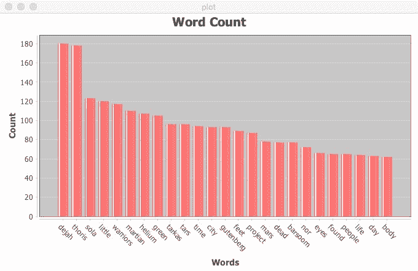
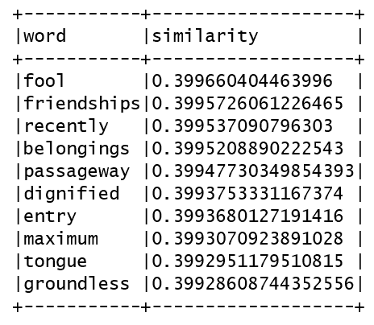
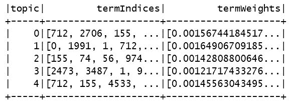

# 十二、使用 Spark 2.0 ML 库实现文本分析

在本章中，我们将介绍以下食谱:

*   用 Spark 做词频——所有重要的事情
*   使用 Word2Vec 显示与 Spark 相似的单词
*   为现实生活中的星火 ML 项目下载维基百科的完整转储
*   在 Spark 2.0 中使用潜在语义分析进行文本分析
*   Spark 2.0 中基于潜在狄利克雷分配的主题建模

# 介绍

文本分析处于机器学习、数学、语言学和自然语言处理的交叉点。文本分析，在旧文献中称为文本挖掘，试图从非结构化和半结构化数据中提取信息并推断更高级别的概念、情感和语义细节。需要注意的是，传统的关键词搜索不足以处理嘈杂、模糊和不相关的标记和概念，这些标记和概念需要根据实际上下文进行过滤。

最终，我们试图为给定的一组文档(文本、推文、网络和社交媒体)做的是，确定通信的主旨是什么，以及它试图传达什么概念(主题和概念)。如今，将文档分解成不同的部分和分类太原始了，不能被认为是文本分析。我们可以做得更好。

Spark 提供了一套工具和设施来使文本分析变得更容易，但这取决于用户将这些技术结合起来，形成一个可行的系统(例如，KKN 聚类和主题建模)。

值得一提的是，许多商用系统使用多种技术的组合来得出最终答案。虽然 Spark 有足够多的技术在规模上非常有效，但不难想象任何文本分析系统都可以从图形模型(即 GraphFrame、GraphX)中受益。下图总结了 Spark 为文本分析提供的工具和设施:


文本分析是一个即将到来的重要领域，因为它应用于许多领域，如安全、客户参与、情感分析、社交媒体和在线学习。使用文本分析技术，人们可以将传统的数据存储(即结构化数据和数据库表)与非结构化数据(即客户评论、情感和社交媒体交互)结合起来，以确定更高的理解顺序和更完整的业务部门视图，这在以前是不可能的。在与选择社交媒体和非结构化文本作为主要沟通方式的千禧一代打交道时，这一点尤其重要。


非结构化文本的主要挑战是，您不能使用传统的数据平台化工具(如 ETL)来提取和强制对数据排序。我们需要新的数据争论、最大似然和统计方法，以及能够提取信息和洞察力的自然语言处理技术。社交媒体和客户互动，如呼叫中心的电话录音，包含了宝贵的信息，在不失去竞争优势的情况下，这些信息再也不能被忽视。

我们不仅需要文本分析来处理静态的大数据，还必须考虑动态的大数据，如推文和流，才能有效。

有几种方法可以处理非结构化数据。下图描述了当今工具包中的技术。虽然基于规则的系统可以很好地适用于有限的文本和域，但由于其特定的决策边界被设计为在特定的域中有效，因此它不能推广。较新的系统使用统计和自然语言处理技术来实现更好的准确性和规模。


在本章中，我们将介绍四种方法和两个真实数据集，以展示 Spark 处理大规模非结构化文本分析的能力。

首先，我们从一个简单的食谱开始，不仅模仿早期的网络搜索(关键词频率)，而且以原始代码格式提供对 TF-IDF 的洞察。这个方法试图找出一个单词或短语在文档中出现的频率。虽然听起来不可思议，但这项技术已经获得了美国专利！

其次，我们从一个众所周知的算法 Word2Vec 开始，它试图回答这个问题，如果我给你一个词，你能告诉我周围的词，或者它的邻居是什么吗？这是一种使用统计技术在文档中查询同义词的好方法。

第三，我们实现了一个**潜在语义分析** ( **LSA** )这是一种话题抽取的形式。这种方法是科罗拉多大学博尔德分校发明的，一直是社会科学的主力。

第四，我们实现了一个**潜在狄利克雷分配** ( **LDA** )来演示主题建模，其中抽象概念被提取，并以可扩展和有意义的方式与短语或单词(即，不太原始的构造)相关联(例如，家、幸福、爱、母亲、家庭宠物、孩子、购物和聚会可以被提取到单个主题中)。


# 用 Spark 做词频——所有重要的事情

对于这个食谱，我们将从古腾堡计划下载一本书的文本格式，来自[http://www.gutenberg.org/cache/epub/62/pg62.txt](http://www.gutenberg.org/cache/epub/62/pg62.txt)。

古腾堡计划提供超过 50，000 本各种格式的免费电子书供人类消费。请阅读他们的使用条款；让我们不要使用命令行工具来下载任何书籍。

当你看文件的内容时，你会注意到这本书的标题和作者是*《火星公主的古腾堡计划》电子书*，作者是埃德加·赖斯·巴勒斯。

This eBook is for the use of anyone, anywhere, at no cost, and with almost no restrictions whatsoever. You may copy it, give it away, or reuse it under the terms of the Project Gutenberg License included with this eBook online at [http://www.gutenberg.org/](http://www.gutenberg.org/).

然后，我们使用下载的书来演示 Scala 和 Spark 的经典字数统计程序。这个例子刚开始看起来有点简单，但是我们开始了文本处理的特征提取过程。此外，对计算文档中单词出现次数的一般理解将大大有助于我们理解 TF-IDF 的概念。

# 怎么做...

1.  在 IntelliJ 或您选择的 IDE 中启动一个新项目。确保包含必要的 JAR 文件。

2.  配方的`package`说明如下:

```scala
package spark.ml.cookbook.chapter12
```

3.  为 Scala、Spark 和 JFreeChart 导入必要的包:

```scala
import org.apache.log4j.{Level, Logger}import org.apache.spark.sql.SQLContextimport org.apache.spark.{SparkConf, SparkContext}import org.jfree.chart.axis.{CategoryAxis, CategoryLabelPositions}import org.jfree.chart.{ChartFactory, ChartFrame, JFreeChart}import org.jfree.chart.plot.{CategoryPlot, PlotOrientation}import org.jfree.data.category.DefaultCategoryDataset
```

4.  我们将定义一个函数，在窗口中显示我们的 JFreeChart:

```scala
def show(chart: JFreeChart) {val frame = new ChartFrame("", chart)frame.pack()frame.setVisible(true)}
```

5.  让我们定义图书文件的位置:

```scala
val input = "../data/sparkml2/chapter12/pg62.txt"
```

6.  使用工厂生成器模式创建带有配置的 Spark 会话:

```scala
val spark = SparkSession.builder *.master(**"local[*]"**).appName(**"ProcessWordCount"**).config(**"spark.sql.warehouse.dir"**, **"."**).getOrCreate()**import** spark.implicits._*
```

 *7.  我们应该将日志级别设置为警告，否则输出将很难遵循:

```scala
Logger.getRootLogger.setLevel(Level.*WARN*)
```

8.  我们在稍后将用作过滤器的停止词文件中读到:

```scala
val stopwords = scala.io.Source.fromFile("../data/sparkml2/chapter12/stopwords.txt").getLines().toSet
```

9.  停止词文件包含在匹配或比较文档时不显示相关值的常用词，因此它们将被过滤器从术语库中排除。
10.  我们现在加载该书来标记、分析、应用停止词、过滤、计数和排序:

```scala
val lineOfBook = spark.sparkContext.textFile(input).flatMap(line => line.split("\\W+")).map(_.toLowerCase).filter( s => !stopwords.contains(s)).filter( s => s.length >= 2).map(word => (word, 1)).reduceByKey(_ + _).sortBy(_._2, false)
```

11.  我们选择频率最高的前 25 个单词:

```scala
val top25 = lineOfBook.take(25)
```

12.  我们遍历生成的 RDD 中的每个元素，生成一个类别数据集模型来构建单词出现的图表:

```scala
val dataset = new DefaultCategoryDataset()top25.foreach( {case (term: String, count: Int) => dataset.setValue(count, "Count", term) })
```

显示字数的条形图:

```scala
val chart = ChartFactory.createBarChart("Term frequency","Words", "Count", dataset, PlotOrientation.VERTICAL,false, true, false)val plot = chart.getCategoryPlot()val domainAxis = plot.getDomainAxis();domainAxis.setCategoryLabelPositions(CategoryLabelPositions.DOWN_45);show(chart)
```

下图显示了字数:



13.  我们通过停止 SparkContext 来关闭程序:

```scala
spark.stop()
```

# 它是如何工作的...

我们首先加载下载的书籍，并通过正则表达式对其进行标记。下一步是将所有标记转换为小写，并从标记列表中排除停止单词，然后过滤掉任何长度小于两个字符的单词。

停止词和一定长度的词的去除减少了我们必须处理的特征的数量。这可能看起来不明显，但是基于各种处理标准的特定单词的移除减少了我们的机器学习算法稍后将处理的维数。

最后，我们按照降序对结果字数进行排序，取前 25 名，我们为其显示了一个条形图。

# 还有更多...

在这个食谱中，我们有了关键词搜索的基础。理解主题建模和关键词搜索之间的区别很重要。在关键字搜索中，我们尝试根据出现的情况将短语与给定的文档相关联。在这种情况下，我们将向用户指出出现次数最多的一组文档。

# 请参见

开发人员可以尝试作为扩展的该算法的下一步是添加权重并得出加权平均值，但是 Spark 提供了一个工具，我们将在即将到来的食谱中对其进行探索。

# 使用 Word2Vec 显示与 Spark 相似的单词

在这个食谱中，我们将探索 Word2Vec，这是 Spark 评估单词相似性的工具。Word2Vec 算法的灵感来自于普通语言学中的*分布假设*。在核心，它试图说的是，在相同的上下文(即，与目标的距离)中出现的标记倾向于支持相同的原始概念/意义。

Word2Vec 算法是由谷歌的一组研究人员发明的。请参考*中提到的白皮书，还有更多...*更详细描述 Word2Vec 的配方部分。

# 怎么做...

1.  在 IntelliJ 或您选择的 IDE 中启动一个新项目。确保包含必要的 JAR 文件。

2.  配方的`package`说明如下:

```scala
package spark.ml.cookbook.chapter12
```

3.  为 Scala 和 Spark 导入必要的包:

```scala
import org.apache.log4j.{Level, Logger}import org.apache.spark.ml.feature.{RegexTokenizer, StopWordsRemover, Word2Vec}import org.apache.spark.sql.{SQLContext, SparkSession}import org.apache.spark.{SparkConf, SparkContext}
```

4.  让我们定义图书文件的位置:

```scala
val input = "../data/sparkml2/chapter12/pg62.txt"
```

5.  使用工厂生成器模式创建带有配置的 Spark 会话:

```scala
val spark = SparkSession.builder.master("local[*]").appName("Word2Vec App").config("spark.sql.warehouse.dir", ".").getOrCreate()import spark.implicits._
```

6.  我们应该将日志级别设置为警告，否则输出将很难遵循:

```scala
Logger.getRootLogger.setLevel(Level.WARN)
```

7.  我们载入书籍并将其转换为数据帧:

```scala
val df = spark.read.text(input).toDF("text")
```

8.  现在，我们利用 Spark 的正则表达式标记器将每一行转换成一个单词包，将每个术语转换成小写，并过滤掉字符长度小于 4 的任何术语:

```scala
val tokenizer = new RegexTokenizer().setPattern("\\W+").setToLowercase(true).setMinTokenLength(4).setInputCol("text").setOutputCol("raw")val rawWords = tokenizer.transform(df)
```

9.  我们通过使用 Spark 的`StopWordRemover`类删除停止词:

```scala
val stopWords = new StopWordsRemover().setInputCol("raw").setOutputCol("terms").setCaseSensitive(false)val wordTerms = stopWords.transform(rawWords)
```

10.  我们应用 Word2Vec 机器学习算法来提取特征:

```scala
val word2Vec = new Word2Vec().setInputCol("terms").setOutputCol("result").setVectorSize(3).setMinCount(0)val model = word2Vec.fit(wordTerms)
```

11.  我们从书中找到了火星人的十个同义词:

```scala
val synonyms = model.findSynonyms("martian", 10)
```

12.  显示模型找到的十个同义词的结果:

```scala
synonyms.show(false)
```



13.  我们通过停止 SparkContext 来关闭程序:

```scala
spark.stop()
```

# 它是如何工作的...

Spark 中的 Word2Vec 使用的是跳跃式语法，而不是**连续的单词包** ( **CBOW** )更适合一个**神经网络** ( **NN** )。其核心是，我们试图计算单词的表示。强烈建议用户理解本地表示和分布式表示之间的区别，这与单词本身的明显含义非常不同。

如果我们对单词使用分布式向量表示，相似的单词自然会在向量空间中紧密地落在一起，这是一种理想的模式抽象和操作的概括技术(也就是说，我们将问题简化为向量算法)。

对于给定的一组单词 *{Word <sub class="calibre64">1、</sub> Word <sub class="calibre64">2，....清理并准备处理的单词</sub>n}*定义序列的最大似然函数(例如，对数似然)，然后继续最大化似然(即典型的最大似然)。对于熟悉 NN 的人来说，这是一个简单的多类 softmax 模型。


我们首先将免费书籍加载到内存中，并将其标记为术语。这些术语然后被转换成小写，我们过滤掉任何少于四个的单词。我们最后应用停止词，然后是 Word2Vec 计算。

# 还有更多...

无论如何你会发现类似的词？能解决这个问题的算法有多少种，又是如何变化的？Word2Vec 算法已经存在了一段时间，并且有一个名为 CBOW 的对应物。请记住，Spark 提供了 skip-gram 方法作为实现技术。

Word2Vec 算法的变化如下:

*   **连续词包(CBOW)** :给定一个中心词，周围有哪些词？
*   **Skip-gram** :如果我们知道周围的单词，我们能猜出缺少的单词吗？

该算法有一个变种叫做**负采样跳格模型** ( **SGNS** )，似乎比其他变种表现更好。

共现是 CBOW 和 skip-gram 的基本概念。即使 skip-gram 不直接使用共现矩阵，它也在间接使用它。

在这个食谱中，我们使用了自然语言处理中的*停止词*技术，在运行我们的算法之前有一个更干净的语料库。停止词是英语单词，如“*”，需要删除，因为它们无助于改善结果。*

 *另一个重要的概念是*词干*，这里不涉及，但会在后面的食谱中演示。词干去除了多余的人工语言，将单词还原为词根(例如，*工程*、*工程师*、*工程师*变成了*工程*，这就是词根)。

在以下网址找到的白皮书应该对 Word2Vec 提供更深入的解释:

[http://arxiv.org/pdf/1301.3781.pdf](http://arxiv.org/pdf/1301.3781.pdf)

# 请参见

Word2Vec 配方的文档:

*   `Word2Vec()`:[http://spark . Apache . org/docs/latest/API/Scala/index . html # org . Apache . spark . ml . feature . word 2 vec](http://spark.apache.org/docs/latest/api/scala/index.html#org.apache.spark.ml.feature.Word2Vec)
*   `Word2VecModel()`:[http://spark . Apache . org/docs/latest/API/Scala/index . html # org . Apache . spark . ml . feature . word 2 vec model](http://spark.apache.org/docs/latest/api/scala/index.html#org.apache.spark.ml.feature.Word2VecModel)
*   `StopWordsRemover()`:[http://spark . Apache . org/docs/latest/API/Scala/index . html # org . Apache . spark . ml . feature . stop words remover](http://spark.apache.org/docs/latest/api/scala/index.html#org.apache.spark.ml.feature.StopWordsRemover)

# 为现实生活中的星火 ML 项目下载维基百科的完整转储

在这个食谱中，我们将下载并探索维基百科的一个转储，这样我们就可以有一个真实的例子。我们将在本食谱中下载的数据集是维基百科文章的转储。你要么需要命令行工具**卷曲**，要么需要浏览器来检索一个压缩文件，这个时候大约是 13.6 GB。由于大小的原因，我们推荐使用 curl 命令行工具。

# 怎么做...

1.  您可以使用以下命令开始下载数据集:

```scala
curl -L -O http://dumps.wikimedia.org/enwiki/latest/enwiki-latest-pages-articles-multistream.xml.bz2
```

2.  现在您想要解压缩 ZIP 文件:

```scala
bunzip2 enwiki-latest-pages-articles-multistream.xml.bz2
```

这将创建一个名为`enwiki-latest-pages-articles-multistream.xml`的未压缩文件，大约 56 GB。

3.  让我们看看维基百科的 XML 文件:

```scala
head -n50 enwiki-latest-pages-articles-multistream.xml<mediawiki xmlns=http://www.mediawiki.org/xml/export-0.10/ xmlns:xsi="http://www.w3.org/2001/XMLSchema-instance" xsi:schemaLocation="http://www.mediawiki.org/xml/export-0.10/ http://www.mediawiki.org/xml/export-0.10.xsd" version="0.10" xml:lang="en"> <siteinfo> 
    <sitename>Wikipedia</sitename> 
    <dbname>enwiki</dbname> 
    <base>https://en.wikipedia.org/wiki/Main_Page</base> 
    <generator>MediaWiki 1.27.0-wmf.22</generator> 
    <case>first-letter</case> 
    <namespaces> 
      <namespace key="-2" case="first-letter">Media</namespace> 
      <namespace key="-1" case="first-letter">Special</namespace> 
      <namespace key="0" case="first-letter" /> 
      <namespace key="1" case="first-letter">Talk</namespace> 
      <namespace key="2" case="first-letter">User</namespace> 
      <namespace key="3" case="first-letter">User talk</namespace> 
      <namespace key="4" case="first-letter">Wikipedia</namespace> 
      <namespace key="5" case="first-letter">Wikipedia talk</namespace> 
      <namespace key="6" case="first-letter">File</namespace> 
      <namespace key="7" case="first-letter">File talk</namespace> 
      <namespace key="8" case="first-letter">MediaWiki</namespace> 
      <namespace key="9" case="first-letter">MediaWiki talk</namespace> 
      <namespace key="10" case="first-letter">Template</namespace> 
      <namespace key="11" case="first-letter">Template talk</namespace> 
      <namespace key="12" case="first-letter">Help</namespace> 
      <namespace key="13" case="first-letter">Help talk</namespace> 
      <namespace key="14" case="first-letter">Category</namespace> 
      <namespace key="15" case="first-letter">Category talk</namespace> 
      <namespace key="100" case="first-letter">Portal</namespace> 
      <namespace key="101" case="first-letter">Portal talk</namespace> 
      <namespace key="108" case="first-letter">Book</namespace> 
      <namespace key="109" case="first-letter">Book talk</namespace> 
      <namespace key="118" case="first-letter">Draft</namespace> 
      <namespace key="119" case="first-letter">Draft talk</namespace> 
      <namespace key="446" case="first-letter">Education Program</namespace> 
      <namespace key="447" case="first-letter">Education Program talk</namespace> 
      <namespace key="710" case="first-letter">TimedText</namespace> 
      <namespace key="711" case="first-letter">TimedText talk</namespace> 
      <namespace key="828" case="first-letter">Module</namespace> 
      <namespace key="829" case="first-letter">Module talk</namespace> 
      <namespace key="2300" case="first-letter">Gadget</namespace> 
      <namespace key="2301" case="first-letter">Gadget talk</namespace> 
      <namespace key="2302" case="case-sensitive">Gadget definition</namespace> 
      <namespace key="2303" case="case-sensitive">Gadget definition talk</namespace> 
      <namespace key="2600" case="first-letter">Topic</namespace> 
    </namespaces> 
  </siteinfo> 
  <page> 
    <title>AccessibleComputing</title> 
    <ns>0</ns> 
    <id>10</id> 
    <redirect title="Computer accessibility" />
```

# 还有更多...

我们建议以块的形式处理 XML 文件，并在实验中使用采样，直到准备好提交最终作业。这将节省大量的时间和精力。

# 请参见

维基下载的文档可在[https://en.wikipedia.org/wiki/Wikipedia:Database_download](https://en.wikipedia.org/wiki/Wikipedia:Database_download)获得。

# 在 Spark 2.0 中使用潜在语义分析进行文本分析

在这个食谱中，我们将利用维基百科上的文章数据来探索 LSA。LSA 翻译成分析一个文档语料库，以发现这些文档中隐藏的意义或概念。

在本章的第一个食谱中，我们介绍了 TF(即术语频率)技术的基础。在这个配方中，我们使用哈希函数来计算 TF，并使用 IDF 将模型拟合到计算的 TF 中。其核心是，LSA 对词频文档使用**奇异值分解** ( **奇异值分解**)来降维，从而提取最重要的概念。还有其他我们需要做的清理步骤(例如，停止单词和词干)，这些步骤将在我们开始分析之前清理单词包。

# 怎么做...

1.  在 IntelliJ 或您选择的 IDE 中启动一个新项目。确保包含必要的 JAR 文件。

2.  配方的包装说明如下:

```scala
package spark.ml.cookbook.chapter12
```

3.  为 Scala 和 Spark 导入必要的包:

```scala
import edu.umd.cloud9.collection.wikipedia.WikipediaPageimport edu.umd.cloud9.collection.wikipedia.language.EnglishWikipediaPageimport org.apache.hadoop.fs.Pathimport org.apache.hadoop.io.Textimport org.apache.hadoop.mapred.{FileInputFormat, JobConf}import org.apache.log4j.{Level, Logger}import org.apache.spark.mllib.feature.{HashingTF, IDF}import org.apache.spark.mllib.linalg.distributed.RowMatriximport org.apache.spark.sql.SparkSessionimport org.tartarus.snowball.ext.PorterStemmer
```

以下两个语句导入了处理维基百科 XML 转储/对象所需的`Cloud9`库工具包元素。`Cloud9`是一个库工具包，它使开发人员更容易访问、争论和处理维基百科的 XML 转储。有关更多详细信息，请参见下面几行代码:

```scala
import edu.umd.cloud9.collection.wikipedia.WikipediaPageimport edu.umd.cloud9.collection.wikipedia.language.EnglishWikipediaPage
```

维基百科是一个免费的知识体，可以通过以下维基百科下载链接作为 XML 块/对象的转储免费下载:

[https://en . Wikipedia . org/wiki/Wikipedia:database _ download](https://en.wikipedia.org/wiki/Wikipedia:Database_download)

使用`Cloud9`工具包可以轻松处理文本及其结构的复杂性，该工具包便于使用前面列出的`import`语句访问和处理文本。

以下链接提供了一些关于`Cloud9`库的信息:

*   主页见[https://lintool . github . io/Cloud9/docs/content/Wikipedia . html](https://lintool.github.io/Cloud9/docs/content/wikipedia.html)。
*   源代码见[http://grepcode . com/file/repo 1 . maven . org/maven 2/edu . UMD/cloud 9/2 . 0 . 0/edu/UMD/cloud 9/collection/Wikipedia/wikipediage . Java](http://grepcode.com/file/repo1.maven.org/maven2/edu.umd/cloud9/2.0.0/edu/umd/cloud9/collection/wikipedia/WikipediaPage.java)和[http://grepcode . com/file/repo 1 . maven . org/maven 2/edu . UMD/cloud 9/2 . 0 . 1/edu/UMD/cloud 9/collection/Wikipedia/language/English](http://grepcode.com/file/repo1.maven.org/maven2/edu.umd/cloud9/2.0.1/edu/umd/cloud9/collection/wikipedia/language/EnglishWikipediaPage.java)

接下来，执行以下步骤:

1.  我们定义了一个函数来解析维基百科页面并返回页面的标题和内容文本:

```scala
def parseWikiPage(rawPage: String): Option[(String, String)] = {val wikiPage = new EnglishWikipediaPage()WikipediaPage.*readPage*(wikiPage, rawPage)if (wikiPage.isEmpty|| wikiPage.isDisambiguation|| wikiPage.isRedirect|| !wikiPage.isArticle) {None} else {Some(wikiPage.getTitle, wikiPage.getContent)}}
```

2.  我们定义了一个简短的函数，将波特词干算法应用于术语:

```scala
def wordStem(stem: PorterStemmer, term: String): String = {stem.setCurrent(term)stem.stem()stem.getCurrent}
```

3.  我们定义了一个函数，将页面的内容文本标记为术语:

```scala
def tokenizePage(rawPageText: String, stopWords: Set[String]): Seq[String] = {val stem = new PorterStemmer()rawPageText.split("\\W+").map(_.toLowerCase).filterNot(s => stopWords.contains(s)).map(s => wordStem(stem, s)).filter(s => s.length > 3).distinct.toSeq}
```

4.  让我们定义维基百科数据转储的位置:

```scala
val input = "../data/sparkml2/chapter12/enwiki_dump.xml"
```

5.  为 Hadoop XML 流创建作业配置:

```scala
val jobConf = new JobConf()jobConf.set("stream.recordreader.class", "org.apache.hadoop.streaming.StreamXmlRecordReader")jobConf.set("stream.recordreader.begin", "<page>")jobConf.set("stream.recordreader.end", "</page>")
```

6.  我们为 Hadoop XML 流处理设置了数据路径:

```scala
FileInputFormat.addInputPath(jobConf, new Path(input))
```

7.  使用工厂构建器模式创建带有配置的`SparkSession`:

```scala
val spark = SparkSession.builder*.master(**"local[*]"**).appName(**"ProcessLSA App"**).config(**"spark.serializer"**, **"org.apache.spark.serializer.KryoSerializer"**).config(**"spark.sql.warehouse.dir"**, **"."**).getOrCreate()*
```

 *8.  我们应该将日志级别设置为警告，否则输出将很难遵循:

```scala
Logger.getRootLogger.setLevel(Level.WARN)
```

9.  我们开始将庞大的维基百科数据转储到文章页面中，并提取文件样本:

```scala
val wikiData = spark.sparkContext.hadoopRDD(jobConf,classOf[org.apache.hadoop.streaming.StreamInputFormat],classOf[Text],classOf[Text]).sample(false, .1)
```

10.  接下来，我们将样本数据处理成包含标题和页面上下文文本元组的 RDD:

```scala
val wikiPages = wikiData.map(_._1.toString).flatMap(*parseWikiPage*)
```

11.  我们现在输出我们将处理的维基百科文章的数量:

```scala
println("Wiki Page Count: " + wikiPages.count())
```

12.  我们将用于过滤页面内容文本的停止字加载到内存中:

```scala
val stopwords = scala.io.Source.fromFile("../data/sparkml2/chapter12/stopwords.txt").getLines().toSet
```

13.  我们将页面内容文本标记化，将其转化为术语以供进一步处理:

```scala
val wikiTerms = wikiPages.map{ case(title, text) => tokenizePage(text, stopwords) }
```

14.  我们使用 Spark 的`HashingTF`类来计算标记化页面上下文文本的术语频率:

```scala
val hashtf = new HashingTF()val tf = hashtf.transform(wikiTerms)
```

15.  我们采用术语频率，并利用 Spark 的 IDF 类计算反向文档频率:

```scala
val idf = new IDF(minDocFreq=2)val idfModel = idf.fit(tf)val tfidf = idfModel.transform(tf)
```

16.  我们使用逆文档频率生成`RowMatrix`并计算奇异值分解:

```scala
tfidf.cache()val rowMatrix = new RowMatrix(tfidf)val svd = rowMatrix.computeSVD(k=25, computeU = true)println(svd)
```

**U** :行是文档，列是概念。

**S** :元素会是每个概念的量的变化。

**V** :行是术语，列是概念。

17.  我们通过停止 SparkContext 来关闭程序:

```scala
spark.stop()
```

# 它是如何工作的...

该示例首先使用 Cloud9 Hadoop XML 流工具加载维基百科 XML 转储，以处理庞大的 XML 文档。一旦我们解析出页面文本，标记化阶段就调用将我们的维基百科页面文本流转换成标记。在标记化阶段，我们使用了波特词干分析器来帮助将单词简化为通用的基本形式。

更多关于炮泥的详细信息可在[https://en.wikipedia.org/wiki/Stemming](https://en.wikipedia.org/wiki/Stemming)获得。

下一步是在每个页面标记上使用 Spark HashingTF 来计算术语频率。此阶段完成后，我们利用 Spark 的 IDF 生成反向文档频率。

最后，我们使用 TF-IDF API 并应用奇异值分解来处理因子分解和降维。

下面的截图显示了配方的步骤和流程:


Cloud9 Hadoop XML 工具和其他几个必需的依赖项可以在以下位置找到:

*   [:http://central . maven . org/maven 2/info/bliki/wiki/bliki-core/3 . 0 . 19/bliki-core-3 . 0 . 19 . jar](http://central.maven.org/maven2/info/bliki/wiki/bliki-core/3.0.19/bliki-core-3.0.19.jar)
*   `cloud9-2.0.1.jar`:[http://central . maven . org/maven 2/edu/UMD/cloud 9/2 . 0 . 1/cloud 9-2 . 0 . 1 . jar](http://central.maven.org/maven2/edu/umd/cloud9/2.0.1/cloud9-2.0.1.jar)
*   `hadoop-streaming-2.7.4.jar`:[http://central . maven . org/maven 2/org/Apache/Hadoop/Hadoop-streaming/2 . 7 . 4/Hadoop-streaming-2 . 7 . 4 . jar](http://central.maven.org/maven2/org/apache/hadoop/hadoop-streaming/2.7.4/hadoop-streaming-2.7.4.jar)
*   `lucene-snowball-3.0.3.jar`:[http://central . maven . org/maven 2/org/Apache/Lucene/Lucene-雪球/3 . 0 . 3/Lucene-雪球-3.0.3.jar](http://central.maven.org/maven2/org/apache/lucene/lucene-snowball/3.0.3/lucene-snowball-3.0.3.jar)

# 还有更多...

现在应该很明显，即使 Spark 没有提供直接的 LSA 实现，TF-IDF 和 SVD 的结合将让我们构建大语料库矩阵，然后将其分解为三个矩阵，这可以帮助我们通过 SVD 应用降维来解释结果。我们可以专注于最有意义的聚类(类似于推荐算法)。

奇异值分解将把术语频率文档(即按属性排列的文档)分解为三个不同的矩阵，这三个矩阵从一个难以处理且成本高昂的大矩阵中提取 *N* 个概念(即我们示例中的 *N=27* )的效率要高得多。在 ML 中，相对于其他变体，我们总是更喜欢又高又瘦的矩阵(在这种情况下，就是 *U* 矩阵)。

以下是用于 SVD 的技术:


SVD 的主要目标是降维，以治愈期望的(即顶级 *N* )主题或抽象概念。我们将使用以下输入来获得下一节中陈述的输出。

作为输入，我们将取一个大矩阵 *m x n* ( *m* 是文档的数量， *n* 是术语或属性的数量)。

这是我们应该得到的输出:


有关 SVD 的更详细示例和简短教程，请参见以下链接:

*   [http://home . iitk . AC . in/~ crkrish/MLT/preferences/linalgwithsvd . pdf](http://home.iitk.ac.in/~crkrish/MLT/PreRequisites/linalgWithSVD.pdf)
*   [http://Dave Tang . org/file/奇异值分解 _Tutorial.pdf](http://davetang.org/file/Singular_Value_Decomposition_Tutorial.pdf)

您也可以参考 RStudio 的一篇文章，该文章可通过以下链接获得:

[http://rstudio-pubs-static . S3 . Amazon ws . com/222293 _ 1c40 c75 D7 FAA 42869 cc 59 df 879547 C2 b . html](http://rstudio-pubs-static.s3.amazonaws.com/222293_1c40c75d7faa42869cc59df879547c2b.html)

# 请参见

SVD 已经在[第 11 章](11.html#EN3LS0-4d291c9fed174a6992fd24938c2f9c77)、*高* *的诅咒-大数据中的维度*中有详细介绍。

有关奇异值分解的图示，请参见[第 11 章](11.html#EN3LS0-4d291c9fed174a6992fd24938c2f9c77)、*大数据中的高维诅咒*中使用奇异值分解(SVD)解决高维问题的配方*。*

更多关于`SingularValueDecomposition()`的详细信息可以在[http://spark . Apache . org/docs/latest/API/Scala/index . html # org . Apache . spark . mllib . linalg . singularvaluedecomposition](http://spark.apache.org/docs/latest/api/scala/index.html#org.apache.spark.mllib.linalg.SingularValueDecomposition)上找到。

`RowMatrix()`详情请参考[。](http://spark.apache.org/docs/latest/api/scala/index.html#org.apache.spark.mllib.linalg.distributed.RowMatrix)

# Spark 2.0 中基于潜在狄利克雷分配的主题建模

在本食谱中，我们将通过利用潜在狄利克雷分配从一组文档中推断主题来演示主题模型的生成。

在前面的章节中，我们已经介绍了 LDA 在聚类和主题建模中的应用，但是在这一章中，我们将展示一个更详细的例子，展示它在使用更真实和复杂的数据集进行文本分析中的应用。

我们还应用了自然语言处理技术，如词干和停止词，为线性判别分析问题的解决提供了一种更现实的方法。我们试图做的是发现一组潜在因素(即不同于原始因素)，这些潜在因素可以在减少的计算空间中以更有效的方式求解和描述解。

使用 LDA 和话题建模时总会出现的第一个问题是 w *狄利克雷是什么？*狄利克雷只是一种分布类型，仅此而已。详情请见明尼苏达大学以下链接:[http://www . TC . umn . edu/~ horte 005/docs/Dirichlet distribution . pdf](http://www.tc.umn.edu/~horte005/docs/Dirichletdistribution.pdf)。

# 怎么做...

1.  在 IntelliJ 或您选择的 IDE 中启动一个新项目。确保包含必要的 JAR 文件。

2.  配方的`package`说明如下:

```scala
package spark.ml.cookbook.chapter12
```

3.  为 Scala 和 Spark 导入必要的包:

```scala
import edu.umd.cloud9.collection.wikipedia.WikipediaPageimport edu.umd.cloud9.collection.wikipedia.language.EnglishWikipediaPageimport org.apache.hadoop.fs.Pathimport org.apache.hadoop.io.Textimport org.apache.hadoop.mapred.{FileInputFormat, JobConf}import org.apache.log4j.{Level, Logger}import org.apache.spark.ml.clustering.LDAimport org.apache.spark.ml.feature._import org.apache.spark.sql.SparkSession
```

4.  我们定义了一个函数来解析维基百科页面并返回页面的标题和内容文本:

```scala
def parseWikiPage(rawPage: String): Option[(String, String)] = {val wikiPage = new EnglishWikipediaPage()WikipediaPage.*readPage*(wikiPage, rawPage)if (wikiPage.isEmpty|| wikiPage.isDisambiguation|| wikiPage.isRedirect|| !wikiPage.isArticle) {None} else {*Some*(wikiPage.getTitle, wikiPage.getContent)}}
```

5.  让我们定义维基百科数据转储的位置:

```scala
val input = "../data/sparkml2/chapter12/enwiki_dump.xml"
```

6.  我们为 Hadoop XML 流创建了一个作业配置:

```scala
val jobConf = new JobConf()jobConf.set("stream.recordreader.class", "org.apache.hadoop.streaming.StreamXmlRecordReader")jobConf.set("stream.recordreader.begin", "<page>")jobConf.set("stream.recordreader.end", "</page>")
```

7.  我们为 Hadoop XML 流处理设置了数据路径:

```scala
FileInputFormat.addInputPath(jobConf, new Path(input))
```

8.  使用工厂构建器模式创建带有配置的`SparkSession`:

```scala
val spark = SparkSession.builder.master("local[*]").appName("ProcessLDA App").config("spark.serializer",   "org.apache.spark.serializer.KryoSerializer").config("spark.sql.warehouse.dir", ".").getOrCreate()
```

9.  我们应该将日志级别设置为警告，否则输出将很难遵循:

```scala
Logger.getRootLogger.setLevel(Level.WARN)
```

10.  我们开始将庞大的维基百科数据转储到文章页面中，并提取文件样本:

```scala
val wikiData = spark.sparkContext.hadoopRDD(jobConf,classOf[org.apache.hadoop.streaming.StreamInputFormat],classOf[Text],classOf[Text]).sample(false, .1)
```

11.  接下来，我们将样本数据处理成一个包含标题和页面上下文文本元组的 RDD，最终生成一个数据帧:

```scala
val df = wiki.map(_._1.toString).flatMap(parseWikiPage).toDF("title", "text")
```

12.  现在，我们使用 Spark 的`RegexTokenizer`为每个维基百科页面将数据框的文本列转换为原始单词:

```scala
val tokenizer = new RegexTokenizer().setPattern("\\W+").setToLowercase(true).setMinTokenLength(4).setInputCol("text").setOutputCol("raw")val rawWords = tokenizer.transform(df)
```

13.  下一步是通过从标记中移除所有停止单词来过滤原始单词:

```scala
val stopWords = new StopWordsRemover().setInputCol("raw").setOutputCol("words").setCaseSensitive(false)val wordData = stopWords.transform(rawWords)
```

14.  我们通过使用 Spark 的`CountVectorizer`类为过滤后的标记生成术语计数，从而生成包含列特征的新数据框:

```scala
val cvModel = new CountVectorizer().setInputCol("words").setOutputCol("features").setMinDF(2).fit(wordData)val cv = cvModel.transform(wordData)cv.cache()
```

“MinDF”指定了为了包含在词汇表中必须出现的不同文档术语的最小数量。

15.  我们现在调用 Spark 的 LDA 类来生成主题和主题的令牌分布:

```scala
val lda = new LDA().setK(5).setMaxIter(10).setFeaturesCol("features")val model = lda.fit(tf)val transformed = model.transform(tf)
```

“K”指的是要执行的主题数量和“最大”迭代次数。

16.  我们最后描述了生成的前五个主题并显示:

```scala
val topics = model.describeTopics(5)topics.show(false)
```



17.  现在显示与它们相关的主题和术语:

```scala
val vocaList = cvModel.vocabularytopics.collect().foreach { r => {println("\nTopic: " + r.get(r.fieldIndex("topic")))val y = r.getSeq[Int](r.fieldIndex("termIndices")).map(vocaList(_)).zip(r.getSeq[Double](r.fieldIndex("termWeights")))y.foreach(println)}}
```

控制台输出如下:


18.  我们通过停止 SparkContext 来关闭程序:

```scala
spark.stop()
```

# 它是如何工作的...

我们从加载维基百科文章的转储开始，并使用 Hadoop XML 利用流工具应用编程接口将页面文本解析为令牌。特征提取过程利用几个类来设置 LDA 类的最终处理，让令牌从 Spark 的`RegexTokenize`、`StopwordsRemover`和`HashingTF`流出。一旦我们有了术语频率，数据就被传递到 LDA 类，用于将文章聚集在几个主题下。

Hadoop XML 工具和其他几个必需的依赖项可以在以下网址找到:

*   [:http://central . maven . org/maven 2/info/bliki/wiki/bliki-core/3 . 0 . 19/bliki-core-3 . 0 . 19 . jar](http://central.maven.org/maven2/info/bliki/wiki/bliki-core/3.0.19/bliki-core-3.0.19.jar)
*   `cloud9-2.0.1.jar`:[http://central . maven . org/maven 2/edu/UMD/cloud 9/2 . 0 . 1/cloud 9-2 . 0 . 1 . jar](http://central.maven.org/maven2/edu/umd/cloud9/2.0.1/cloud9-2.0.1.jar)
*   `hadoop-streaming-2.7.4.jar`:[http://central . maven . org/maven 2/org/Apache/Hadoop/Hadoop-streaming/2 . 7 . 4/Hadoop-streaming-2 . 7 . 4 . jar](http://central.maven.org/maven2/org/apache/hadoop/hadoop-streaming/2.7.4/hadoop-streaming-2.7.4.jar)
*   `lucene-snowball-3.0.3.jar`:[http://central . maven . org/maven 2/org/Apache/Lucene/Lucene-雪球/3 . 0 . 3/Lucene-雪球-3.0.3.jar](http://central.maven.org/maven2/org/apache/lucene/lucene-snowball/3.0.3/lucene-snowball-3.0.3.jar)

# 还有更多...

请参见[第 8 章](08.html#BUDHI0-4d291c9fed174a6992fd24938c2f9c77)、*使用 Apache Spark 2.0* 的无监督聚类将文档和文本分类为主题的方法 LDA，了解 LDA 算法本身的更详细解释。

以下来自*机器学习研究杂志(JMLR)* 的白皮书为那些想要进行广泛分析的人提供了全面的治疗方法。这是一篇写得很好的论文，一个有统计学和数学基础背景的人应该能够毫无问题地完成它。

关于 JMLR 的更多详情，请参考[http://www.jmlr.org/papers/volume3/blei03a/blei03a.pdf](http://www.jmlr.org/papers/volume3/blei03a/blei03a.pdf)链接；另一个链接是[。](https://www.cs.colorado.edu/~mozer/Teaching/syllabi/ProbabilisticModels/readings/BleiNgJordan2003.pdf)

# 请参见

*   构造器文档可在[http://spark . Apache . org/docs/latest/API/Scala/index . html # org . Apache . spark . ml . clustering . LDA](http://spark.apache.org/docs/latest/api/scala/index.html#org.apache.spark.ml.clustering.LDA)获得
*   LDAModel 的文档可在[http://spark . Apache . org/docs/latest/API/Scala/index . html # org . Apache . spark . ml . clustering . LDAModel](http://spark.apache.org/docs/latest/api/scala/index.html#org.apache.spark.ml.clustering.LDAModel)获得

有关以下内容，请参见 Spark 的 Scala 应用编程接口文档:

*   分布式数据模型
*   EMLDAOptimizer
*   lanoptimizer
*   LocalLDAModel
*   在线优化器***