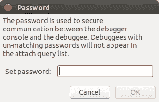

# 六、Storm 实战

在前面的章节中，我们看到了 Storm 拓扑的工作示例，有简单的也有复杂的。 但是，在这样做的过程中，我们跳过了您在开发自己的拓扑时需要的一些工具和技术：

*   Storm 是运行代码的一个很好的环境，但是部署到 Storm(甚至在您的本地计算机上)会增加复杂性并花费额外的时间。 我们将看看如何在Storm之外测试你的喷嘴和螺栓。
*   当组件在 Storm 内部运行时，它们不能从控制台读取，这会阻止使用标准 Python 调试器 PDB。 本章演示 Winpdb，这是一个适用于在 Storm 中调试组件的交互式调试工具。
*   Storm 让您可以轻松地利用许多服务器的能力，但是代码的性能仍然很重要。 在本章中，我们将看到一些测量拓扑组件性能的方法。

# 测试螺栓

Storm 使部署和运行 Python 拓扑变得容易，但是在 Storm 中开发和测试它们是具有挑战性的，无论是在独立 Storm 中运行还是在完整 Storm 部署中运行：

*   Storm 会代表您启动程序-不仅是您的 Python 代码，还包括辅助 Java 进程
*   它控制 Python 组件的标准输入和输出通道
*   Python 程序必须定期响应心跳消息，否则会被 Storm 关闭

这使得使用用于其他 Python 代码段的典型工具和技术(例如从命令行运行和使用 PDB 调试的常用技术)调试 Storm 拓扑变得困难。

Petrel 的模拟模块可以帮助我们做到这一点。 它提供了一个简单、独立的 Python 容器，用于测试简单拓扑并验证是否返回了预期结果。

在 Petrel 术语中，**简单**拓扑是一种只输出到缺省流并且没有分支或循环的拓扑。 `run_simple_topology()`假设列表中的第一个组件是喷嘴，将每个组件的输出传递给序列中的下一个组件。

## 示例-测试 SplitSentenceBolt

让我们来看一个例子。 下面是[第 3 章](3.html "Chapter 3. Introducing Petrel")中第一个示例中的`splitsentence.py`文件，*介绍了 Petrel*，并添加了单元测试：

```py
from nose.tools import assert_equal

from petrel import mock, storm
from petrel.emitter import BasicBolt

from randomsentence import RandomSentenceSpout

class SplitSentenceBolt(BasicBolt):
    def __init__(self):
        super(SplitSentenceBolt, self).__init__(script=__file__)

    def declareOutputFields(self):
        return ['word']

    def process(self, tup):
        words = tup.values[0].split(" ")
        for word in words:
          storm.emit([word])

def test():
    bolt = SplitSentenceBolt()
    mock_spout = mock.MockSpout(
        RandomSentenceSpout.declareOutputFields(),
        [["Madam, I'm Adam."]])

    result = mock.run_simple_topology(
        None, [mock_spout, bolt], result_type=mock.LIST)
        assert_equal([['Madam,'], ["I'm"], ['Adam.']], result[bolt])

def run():
    SplitSentenceBolt().run()
```

要运行测试，请输入以下命令：

```py
pip install nosetests
```

1.  首先，通过运行以下命令安装Python`nosetests`库：

    ```py
    pip install nosetests
    ```

2.  接下来，运行该行：

    ```py
    nosetests -v splitsentence.py
    ```

如果一切正常，您将看到以下输出：

```py
splitsentence.test ... ok

----------------------------------------------------------------------
Ran 1 test in 0.001s

OK
```

Nose 是一个功能非常强大的工具，有很多功能。 我们不会在这里详细介绍它，但是您可以在[https://nose.readthedocs.org/en/latest/](https://nose.readthedocs.org/en/latest/)找到文档。

## 示例-使用 WordCountBolt 测试 SplitSentenceBolt

下一个示例显示如何测试一系列相关组件。 在下面的代码中，我们看到了测试`SplitSentenceBolt`和`WordCountBolt`之间交互的`wordcount.py`的新版本：

```py
from collections import defaultdict

from nose.tools import assert_equal

from petrel import mock, storm
from petrel.emitter import BasicBolt

from randomsentence import RandomSentenceSpout
from splitsentence import SplitSentenceBolt

class WordCountBolt(BasicBolt):
    def __init__(self):
        super(WordCountBolt, self).__init__(script=__file__)
        self._count = defaultdict(int)

    @classmethod
    def declareOutputFields(cls):
        return ['word', 'count']

    def process(self, tup):
        word = tup.values[0]
        self._count[word] += 1
        storm.emit([word, self._count[word]])

def test():
    ss_bolt = SplitSentenceBolt()
    wc_bolt = WordCountBolt()

    mock_spout = mock.MockSpout(
        RandomSentenceSpout.declareOutputFields(),
        [["the bart the"]])

     result = mock.run_simple_topology(
       None,
       [mock_spout, ss_bolt, wc_bolt],
       result_type=mock.LIST)
       assert_equal([['the', 1], ['bart', 1], ['the', 2]], result[wc_bolt])

def run():
    WordCountBolt().run()
```

测试非常简单；我们只实例化两个组件，并在调用`mock.run_simple_topology()`时以正确的顺序包含它们。

### 备注

两个示例测试在调用`run_simple_topology()`时都指定了`result_type=mock.LIST`。 此参数选项告诉 Petrel 在返回输出元组时使用哪种格式。 选项包括：

`STORM_TUPLE`

`LIST`

`TUPLE`

`NAMEDTUPLE`

通常，`LIST`是输出字段数量较少的组件的理想选择，而`NAMEDTUPLE`对于较大数量的字段更具可读性(也就是说，通过允许测试按字段名而不是数字索引访问结果字段)。 如果测试需要检查结果的其他属性(例如，较少使用的流属性)，则`STORM_TUPLE`非常有用。

# 调试

到目前为止，我们已经使用日志消息和自动化测试调试了拓扑。 这些技术非常强大，但是有时可能需要直接在 Storm 环境中进行调试。 例如，问题可能是：

*   依赖于以特定用户身份运行
*   仅在实际数据中出现
*   仅当有多个组件实例并行运行时才会发生

本节介绍一个用于在 Storm 中进行调试的工具。

Winpdb 是一个可移植的、基于 GUI 的 Python 调试器，支持嵌入式调试。 如果您不熟悉术语“嵌入式调试”，请注意这一点：它仅仅意味着 Winpdb 可以附加到以某种其他方式启动的程序，而不一定是从 WinDbg 或命令 shell。 因此，它非常适合于调试在 Storm 中运行的 Petrel 组件。

# 安装 Winpdb

激活 Petrel虚拟环境，然后使用`pip`进行安装：

```py
source <virtualenv directory>/bin/activate
pip install winpdb
```

## 添加 Winpdb 断点

在`splitsentence.py`文件中，在`run()`函数的开头添加以下：

```py
import rpdb2
rpdb2.start_embedded_debugger('password')
```

`'password'`值可以是任何值；这只是您将在下一步中用于附加到`splitsentence.py`的密码。

当这行代码执行时，脚本将冻结 5 分钟的默认时间，等待调试器附加。

## 启动并附加调试器

现在运行拓扑：

```py
petrel submit --config topology.yaml
```

一旦您看到来自 spout 的 log消息，您就会知道拓扑已经启动并且正在运行，这样您就可以连接调试器了。

只需运行`winpdb`即可启动`Winpdb`。

有关如何使用 winpdb 进行嵌入式调试的更多详细信息，请参阅[http://winpdb.org/docs/embedded-debugging/](http://winpdb.org/docs/embedded-debugging/)上的文档。

窗口出现时，从菜单中选择**文件**|**附加**。 将出现密码对话框。 在这里，输入您传递给`start_embedded_debugger()`的相同密码，然后单击**确定**按钮，如下面的屏幕截图所示：



接下来，选择要附加的进程并单击**确定**，如以下屏幕截图所示：


现在您将看到Winpdb 主窗口，断点下面的行高亮显示。 如果您使用过其他调试器，Winpdb 应该很容易使用。 如果您需要有关使用 Winpdb 的帮助，以下教程非常适合您：

[https：//code.google.com/p/winpdb/wiki/DebuggingTutorial](https://code.google.com/p/winpdb/wiki/DebuggingTutorial).


# 分析拓扑的性能

性能可能是任何应用的关注点。 Storm拓扑也是如此，也许更是如此。

当您试图通过拓扑推送大量数据时，原始性能当然是一个问题--更快的组件意味着可以处理更多的数据。 但了解各个组件的元组处理性能也很重要。 此信息可通过两种方式使用。

第一个是知道哪些组件速度较慢，因为这会告诉您，如果您试图使代码更快，应该将注意力集中在哪里。 一旦知道哪个组件(或多个组件)速度较慢，就可以使用 Python cProfile 模块([http://pymotw.com/2/profile/](http://pymotw.com/2/profile/))和行分析器([https://github.com/rkern/line_profiler](https://github.com/rkern/line_profiler))等工具来了解代码将大部分时间花在哪里。

即使在分析之后，某些组件仍会比其他组件更快。 在这种情况下，了解组件之间的相对性能可以帮助您配置拓扑以获得最佳性能。

第二点有些微妙，所以让我们看一个例子。 在下面的代码中，我们看到字数统计拓扑中的两个Storm 组件的日志摘录。 这些日志消息由 Petrel 自动生成。 第一个是分句螺栓，第二个是字数螺栓：

```py
[2015-05-07 22:51:44,772][storm][DEBUG]BasicBolt profile: total_num_tuples=79, num_tuples=79, avg_read_time=0.002431 (19.1%), avg_process_time=0.010279 (80.7%), avg_ack_time=0.000019 (0.2%)
[2015-05-07 22:51:45,776][storm][DEBUG]BasicBolt profile: total_num_tuples=175, num_tuples=96, avg_read_time=0.000048 (0.5%), avg_process_time=0.010374 (99.3%), avg_ack_time=0.000025 (0.2%)
[2015-05-07 22:51:46,784][storm][DEBUG]BasicBolt profile: total_num_tuples=271, num_tuples=96, avg_read_time=0.000043 (0.4%), avg_process_time=0.010417 (99.3%), avg_ack_time=0.000026 (0.2%)
[2015-05-07 22:51:47,791][storm][DEBUG]BasicBolt profile: total_num_tuples=368, num_tuples=97, avg_read_time=0.000041 (0.4%), avg_process_time=0.010317 (99.4%), avg_ack_time=0.000021 (0.2%)
```

## 分句螺栓测井

以下是分句螺栓日志：

```py
[2015-05-07 22:51:44,918][storm][DEBUG]BasicBolt profile: total_num_tuples=591, num_tuples=591, avg_read_time=0.001623 (95.8%), avg_process_time=0.000052 (3.1%), avg_ack_time=0.000019 (1.1%)
[2015-05-07 22:51:45,924][storm][DEBUG]BasicBolt profile: total_num_tuples=1215, num_tuples=624, avg_read_time=0.001523 (94.7%), avg_process_time=0.000060 (3.7%), avg_ack_time=0.000025 (1.5%)
[2015-05-07 22:51:46,930][storm][DEBUG]BasicBolt profile: total_num_tuples=1829, num_tuples=614, avg_read_time=0.001559 (95.4%), avg_process_time=0.000055 (3.3%), avg_ack_time=0.000021 (1.3%)
[2015-05-07 22:51:47,938][storm][DEBUG]BasicBolt profile: total_num_tuples=2451, num_tuples=622, avg_read_time=0.001547 (95.7%), avg_process_time=0.000049 (3.0%), avg_ack_time=0.000020 (1.3%)
```

## 字数螺栓测井

这些日志表明，拆分语句螺栓花费 0.010338 秒来处理和确认每个元组(0.010317+0.000021)，而单词计数螺栓花费 0.000069 秒(0.000049+0.000020)来处理和确认每个元组。 分句螺栓的速度较慢，这表明您可能想要比单词计数螺栓更多的分句螺栓实例。

### 备注

为什么在前面的计算中没有考虑读取时间？ 读取时间包括从 Storm 读取元组所用的 CPU 时间，但也包括等待(即休眠)元组到达所花费的时间。 如果上游组件提供数据的速度很慢，我们不想将该时间计入我们的组件。 因此，为简单起见，我们在计算中省略了读取时间。

当然，每个元组的性能只是情况的一部分。 您还必须考虑要处理的元组的绝对数量。 在前面日志覆盖的 4 秒内，分句闪电接收了 97 个元组(句子)，而单词计数闪电接收了 622 个元组(单词)。 现在，我们将这些数字应用于每个元组的处理时间：

```py
0.010338 seconds/tuple * 97 tuples = 1.002786 seconds (Split sentence)
0.000069 seconds/tuple * 622 tuples = 0.042918 seconds (Word count)
```

拆分语句螺栓使用的总时间要长得多(大约是 23 倍)，我们在配置拓扑的并行性时应该考虑到这一点。 例如，我们可以按如下方式配置`topology.yaml`：

```py
petrel.parallelism.splitsentence: 24
petrel.parallelism.wordcount: 1
```

通过以这种方式配置拓扑，我们有助于确保在高流量速率下，有足够的分句螺栓以避免成为瓶颈，从而使字数螺栓始终处于忙碌状态。

### 备注

上一节中的日志使用了一个版本的拆分语句螺栓，该版本被故意修改为运行速度较慢，并使示例更清晰。

# 摘要

在本章中，您学习了一些有助于您更高效地构建自己的拓扑的技能。 在开发管口或螺栓时，可以在将它们组装成完整拓扑并在 Storm 上展开之前对它们进行单独测试。 如果您遇到仅在 Storm 中运行时才会出现的棘手问题，您可以使用 Winpdb 作为日志消息的补充(或替代)。 当您的代码工作时，您可以深入了解哪些组件占用的时间最多，这样您就可以专注于提高这些领域的性能。 有了这些技能，您现在就可以开始构建自己的拓扑了。 祝好运!