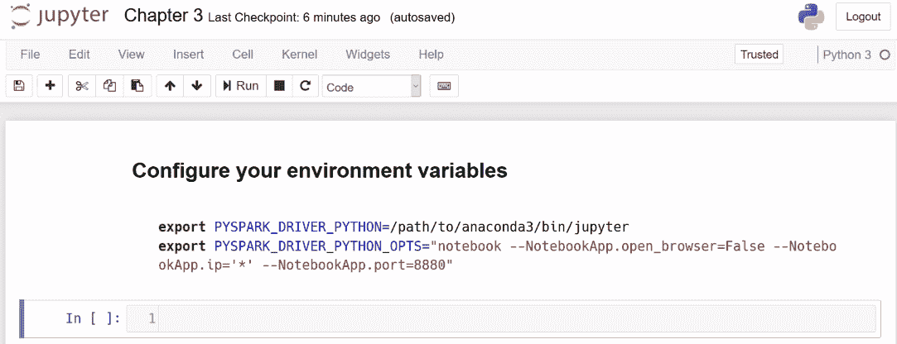

# 三、Spark笔记本的大数据清理和整理

在本章中，我们将了解大数据清理以及与 Spark 笔记本的整理。我们还将了解在笔记本应用上使用 Spark 如何让我们有效地使用 RDDs。我们将使用Spark笔记本快速迭代想法，并对 rdd 进行采样/过滤，以挑选出相关的数据点。我们还将学习如何分割数据集并使用集合运算创建新的组合。

在本章中，我们将讨论以下主题:

*   使用Spark笔记本快速迭代想法
*   对 rdd 进行采样/过滤，以挑选出相关数据点
*   拆分数据集并创建一些新的组合

# 使用Spark笔记本快速迭代想法

在本节中，我们将回答以下问题:

*   什么是Spark笔记本？
*   如何启动Spark笔记本？
*   如何使用Spark笔记本？

让我们从为 Spark 建立一个类似 Jupyter 笔记本的环境开始。Spark Notebook 只是一个使用 Scala 和 Spark 的交互式和反应性数据科学环境。

如果我们查看 GitHub 页面([https://github.com/spark-notebook/spark-notebook](https://github.com/spark-notebook/spark-notebook))，我们可以看到 Notebooks 所做的实际上非常简单，如下图截图所示:


如果我们看一个 Spark Notebook，我们可以看到它们看起来非常像 Python 开发人员使用的东西，这就是 Jupyter Notebooks。您有一个文本框，允许您输入一些代码，然后执行文本框下面的代码，这类似于笔记本格式。这使我们能够利用 Apache Spark 和大数据生态系统进行可重复的分析。

因此，我们可以按原样使用 Spark Notebooks，只需转到 Spark Notebook 网站并单击“快速入门”即可开始使用该 Notebook，如下图所示:


我们需要确保我们运行的是 Java 7。我们可以看到文档中也提到了设置步骤，如下图所示:


星火笔记本的主网站是`spark-notebook.io`，在这里我们可以看到很多选项。下面的截图显示了其中的一些:


我们可以下载 TAR 文件并解压。你可以使用Spark笔记本，但我们将在本书中使用 Jupyter 笔记本。因此，回到 Jupyter 环境，我们可以查看 PySpark 附带的代码文件。在`Chapter 3`笔记本中，我们包含了一种设置环境变量的便捷方式，让 PySpark 与 Jupyter 一起工作，如下图截图所示:



首先，我们需要在环境中创建两个新的环境变量。如果你使用的是 Linux，可以使用 Bash RC。如果您正在使用 Windows，您所需要做的就是更改和编辑您的系统环境变量。有多个在线教程可以帮助您做到这一点。我们在这里要做的是编辑或包含`PYSPARK_DRIVER_PYTHON`变量，并将其指向您的 Jupyter Notebook 安装。如果你在 Anaconda 上，你可能会被指向 Anaconda Jupyter Bash 文件。既然我们在 WinPython 上，我已经把它指向了我的 WinPython Jupyter Notebook Bash 文件。我们要导出的第二个环境变量就是`PYSPARK_DRIVER_PYTHON_OPTS`。

其中一个建议是，我们在选项中包含笔记本文件夹和笔记本应用，要求它不要在浏览器中打开，并告诉它绑定到哪个端口。实际上，如果您在 Windows 和 WinPython 环境中，那么您在这里并不真正需要这一行，您可以简单地跳过它。完成后，只需从命令行重启您的 PySpark。将会发生的是，它不再拥有我们之前看到的控制台，而是直接启动到一个 Jupyter Notebook 实例中，此外，我们可以像在 Jupyter Notebook 中一样使用 Spark 和 SparkContext 变量。所以，让我们测试如下:

```py
sc
```

我们立即访问我们的`SparkContext`，告诉我们 Spark 是版本`2.3.3`，我们的`Master`在`local`，而`AppName`是 Python SparkShell ( `PySparkShell`)，如以下代码片段所示:

```py
SparkContext
Spark UI
Version
 v2.3.3
Master
 local[*]
AppName
 PySparkShell
```

所以，现在我们知道如何在 Jupyter 创建一个类似笔记本的环境。在下一节中，我们将研究采样和过滤 rdd 以挑选相关的数据点。

# 对 rdd 进行采样/过滤，以挑选出相关数据点

在本节中，我们将研究采样和过滤 rdd，以提取相关数据点。这是一个非常强大的概念，允许我们规避大数据的限制，并对特定样本执行计算。

现在让我们来看看抽样不仅能加速我们的计算，还能很好地近似我们试图计算的统计量。为此，我们首先导入`time`库，如下所示:

```py
from time import time
```

接下来我们要做的是查看 KDD 数据库中包含单词`normal`的行或数据点:

```py
raw_data = sc.textFile("./kdd.data.gz")
```

我们需要创建一个`raw_data`的样本。我们将样本存储到`sample`变量中，我们从`raw_data`采样，不需要更换。我们对 10%的数据进行采样，并提供`42`作为我们的随机种子:

```py
sampled = raw_data.sample(False, 0.1, 42)
```

接下来要做的是链接一些`map`和`filter`函数，就像我们在处理未采样数据集时通常做的那样:

```py
contains_normal_sample = sampled.map(lambda x: x.split(",")).filter(lambda x: "normal" in x)
```

接下来，我们需要计算一下计算样本中的行数需要多长时间:

```py
t0 = time()
num_sampled = contains_normal_sample.count()
duration = time() - t0
```

我们在此发布计数声明。正如您从上一节所知，这将触发 PySpark 中`contains_normal_sample`中定义的所有计算，我们将记录样本计数发生之前的时间。我们还记录了样本计数后的时间，这样我们就可以看到观察样本需要多长时间。完成后，让我们看看下面的代码片段中`duration`有多长:

```py
duration
```

输出如下:

```py
23.724565505981445
```

我们花了 23 秒来运行这个超过 10%数据的操作。现在，让我们看看如果我们对所有数据运行相同的转换会发生什么:

```py
contains_normal = raw_data.map(lambda x: x.split(",")).filter(lambda x: "normal" in x)
t0 = time()
num_sampled = contains_normal.count()
duration = time() - t0
```

我们再来看看`duration`:

```py
duration 
```

这将提供以下输出:

```py
36.51565098762512
```

有一个小的区别，因为我们正在比较`36.5`秒和`23.7`秒。然而，随着数据集变得更加多样化，以及处理的数据量变得更加复杂，这种差异会变得更大。这样做的好处是，如果你通常在做大数据，用一个小样本数据来验证你的答案是否有意义可以帮助你更早地发现错误。

最后要看的是我们如何使用`takeSample`。我们需要做的就是使用以下代码:

```py
data_in_memory = raw_data.takeSample(False, 10, 42)
```

正如我们之前了解到的，当我们呈现新的函数时，我们称之为`takeSample`，它会给我们`10`个带有`42`随机种子的项目，我们现在将把它们放入内存中。现在这个数据在内存中，我们可以使用原生 Python 方法调用相同的`map`和`filter`函数，如下所示:

```py
contains_normal_py = [line.split(",") for line in data_in_memory if "normal" in line]
len(contains_normal_py)
```

输出如下:

```py
1
```

我们现在已经通过引入`data_in_memory`完成了`contains_normal`函数的计算。这很好地说明了 PySpark 的力量。

我们最初采集了 10，000 个数据点的样本，结果机器崩溃了。所以在这里，我们就拿这十个数据点来看看是否包含`normal`这个词。

我们可以看到，计算是在前面的代码块中完成的，与我们在 PySpark 中进行计算相比，它花费了更长的时间并使用了更多的内存。这就是我们使用 Spark 的原因，因为 Spark 允许我们并行化任何大数据集，并使用并行方式对其进行操作，这意味着我们可以用更少的内存和时间做更多的事情。在下一节中，我们将讨论使用集合操作拆分数据集和创建新的组合。

# 拆分数据集并创建一些新的组合

在这一节中，我们将研究使用集合运算拆分数据集和创建新的组合。我们将学习减法，尤其是笛卡儿减法。

让我们回到 Jupyter 笔记本的`Chapter 3`，我们一直在观察数据集中包含`normal`这个词的行。让我们试着找出所有不包含`normal`这个词的行。一种方法是使用`filter`功能查看没有`normal`的线条。但是，我们可以在 PySpark 中使用一些不同的东西:一个名为`subtract`的函数来获取整个数据集，并减去包含单词`normal`的数据。让我们看看下面的片段:

```py
normal_sample = sampled.filter(lambda line: "normal." in line)
```

然后，我们可以通过从整个样本中减去`normal`得到不包含单词`normal`的交互或数据点，如下所示:

```py
non_normal_sample = sampled.subtract(normal_sample)
```

我们取`normal`样本，从整个样本中减去它，这是整个数据集的 10%。让我们发布如下一些计数:

```py
sampled.count()
```

这将为我们提供以下输出:

```py
490705
```

如你所见，10%的数据集给了我们`490705`个数据点，在其中，我们有许多包含`normal`这个词的数据点。要找出其计数，请编写以下代码:

```py
normal_sample.count()
```

这将为我们提供以下输出:

```py
97404
```

所以，这里有`97404`个数据点。如果我们对正常样本进行计数，因为我们只是简单地从另一个样本中减去一个样本，那么计数应该大约略低于 400，000 个数据点，因为我们有 490，000 个数据点减去 97，000 个数据点，结果应该是 390，000。让我们看看使用下面的代码片段会发生什么:

```py
non_normal_sample.count()
```

这将为我们提供以下输出:

```py
393301
```

不出所料，它返回了一个值`393301`，这验证了我们的假设，即减去包含`normal`的数据点就得到所有的非正常数据点。

现在我们来讨论另一个函数，叫做`cartesian`。这允许我们给出两个不同特征的不同值之间的所有组合。让我们在下面的代码片段中看看这是如何工作的:

```py
feature_1 = sampled.map(lambda line: line.split(",")).map(lambda features: features[1]).distinct()
```

这里，我们使用`,`来拆分`line`功能。因此，我们将拆分逗号分隔的值，对于拆分后得到的所有特性，我们采用第一个特性，并找到该列的所有不同值。我们可以对第二个特性重复此操作，如下所示:

```py
feature_2 = sampled.map(lambda line: line.split(",")).map(lambda features: features[2]).distinct()
```

所以，我们现在有两个特点。通过发出我们之前看到的`collect()`呼叫，我们可以如下查看`feature_1`和`feature_2`中的实际项目:

```py
f1 = feature_1.collect()
f2 = feature_2.collect()
```

让我们按如下方式来看每一个:

```py
f1
```

这将提供以下结果:

```py
['tcp', 'udp', 'icmp']
```

所以，`f1`有三个值；让我们检查一下`f2`如下:

```py
f2
```

这将为我们提供以下输出:


`f2`有更多的值，我们可以使用`cartesian`功能收集`f1`和`f2`之间的所有组合，如下所示:

```py
len(feature_1.cartesian(feature_2).collect())
```

这将为我们提供以下输出:

```py
198
```

这就是我们如何使用`cartesian`函数来寻找两个特征之间的笛卡尔乘积。在这一章中，我们看了Spark笔记本；采样、过滤和拆分数据集；以及用集合运算创建新的组合。

# 摘要

在这一章中，我们看了快速迭代的Spark笔记本。然后，我们使用采样或过滤来挑选相关的数据点。我们还学习了如何使用集合操作分割数据集和创建新的组合。

在下一章中，我们将讨论将数据聚合和汇总成有用的报告。