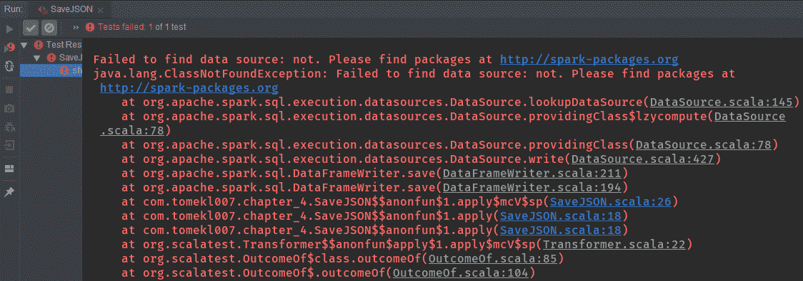
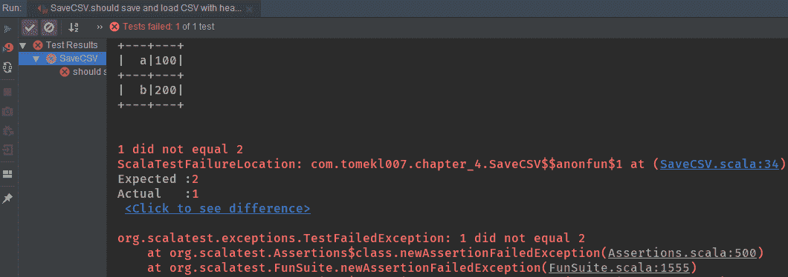

# 十、以正确的格式保存数据

在前面的章节中，我们将重点放在处理和加载数据上。我们了解了 Spark 的转换、动作、加入、打乱和其他方面。

在本章中，我们将学习如何以正确的格式保存数据，以及如何使用 Spark 的标准 API 以纯文本格式保存数据。我们还将利用 JSON 作为数据格式，并学习如何使用标准 API 来保存 JSON。Spark 有一种 CSV 格式，我们也将利用这种格式。然后，我们将学习更高级的基于模式的格式，其中需要支持来导入第三方依赖项。接下来，我们将使用 Avro 和 Spark，并学习如何使用和保存数据的列格式称为拼花。到本章结束时，我们还将学习如何检索数据，以验证数据是否以正确的方式存储。

在本章中，我们将涵盖以下主题:

*   以纯文本格式保存数据
*   利用 JSON 作为数据格式
*   表格格式–CSV
*   使用带 Spark 的 Avro
*   柱状格式——拼花

# 以纯文本格式保存数据

在本节中，我们将学习如何以纯文本格式保存数据。将涵盖以下主题:

*   以纯文本格式保存数据
*   加载纯文本数据
*   测试

我们将以纯文本格式保存数据，并研究如何将其保存到 Spark 目录中。然后我们将加载纯文本数据，然后测试并保存它，以检查我们是否可以产生相同的结果代码。这是我们的`SavePlainText.scala`文件:

```py
package com.tomekl007.chapter_4

import java.io.File

import com.tomekl007.UserTransaction
import org.apache.spark.sql.SparkSession
import org.apache.spark.{Partitioner, SparkContext}
import org.scalatest.{BeforeAndAfterEach, FunSuite}
import org.scalatest.Matchers._

import scala.reflect.io.Path

class SavePlainText extends FunSuite with BeforeAndAfterEach{
    val spark: SparkContext = SparkSession.builder().master("local[2]").getOrCreate().sparkContext

    private val FileName = "transactions.txt"

    override def afterEach() {
        val path = Path (FileName)
        path.deleteRecursively()
    }

    test("should save and load in plain text") {
        //given
        val rdd = spark.makeRDD(List(UserTransaction("a", 100), UserTransaction("b", 200)))

        //when
        rdd.coalesce(1).saveAsTextFile(FileName)

        val fromFile = spark.textFile(FileName)

        fromFile.collect().toList should contain theSameElementsAs List(
            "UserTransaction(a,100)", "UserTransaction(b,200)"
            //note - this is string!
        )
    }
}
```

我们将需要一个`FileName`变量，在我们的例子中，它将是一个文件夹名，然后 Spark 将在下面创建几个文件:

```py
import java.io.File
import com.tomekl007.UserTransaction
import org.apache.spark.sql.SparkSession
import org.apache.spark.{Partitioner, SparkContext}
import org.scalatest.{BeforeAndAfterEach, FunSuite}
import org.scalatest.Matchers._
import scala.reflect.io.Path
class SavePlainText extends FunSuite with BeforeAndAfterEach{
    val spark: SparkContext = SparkSession.builder().master("local[2]").getOrCreate().sparkContext
    private val FileName = "transactions.txt"
```

我们将在测试用例中使用`BeforeAndAfterEach`在每次测试后清理我们的目录，这意味着路径应该递归删除。整个路径在测试后被删除，因为需要重新运行测试而不会失败。我们需要在第一次运行时注释掉以下代码，以研究保存的文本文件的结构:

```py
//override def afterEach() {
//         val path = Path (FileName)
//         path.deleteRecursively()
//     }

//test("should save and load in plain text") {
```

然后，我们将创建一个包含两个事务的 RDD，`UserTransaction("a", 100)`和`UserTransaction("b", 200)`:

```py
val rdd = spark.makeRDD(List(UserTransaction("a", 100), UserTransaction("b", 200)))
```

然后我们将我们的数据`coalesce`到一个分区。`coalesce()`是一个很重要的方面。如果我们想把我们的数据保存在一个文件中，我们需要`coalesce`把它保存到一个文件中，但是这样做有一个重要的含义:

```py
rdd.coalesce(1).saveAsTextFile(FileName)
```

如果我们`coalesce`将其保存到一个文件中，那么只有一个执行器可以将数据保存到我们的系统中。这意味着保存数据将非常慢，并且还存在内存不足的风险，因为所有数据都将发送给一个执行器。一般来说，在生产环境中，我们根据可用的执行器将它保存为许多分区，甚至乘以它自己的因子。所以，如果我们有 16 个执行人，那么我们可以保存到`64`。但这导致了`64`文件。出于测试目的，我们将把它保存到一个文件中，如前面的代码片段所示:

```py
rdd.coalesce (numPartitions = 1).saveAsTextFile(FileName)
```

现在，我们将加载数据。我们只需要将文件名传递给`TextFile`方法，它就会返回`fromFile`:

```py
    val fromFile = spark.textFile(FileName)
```

然后我们断言我们的数据，这将产生`theSameElementsAS List`、`UserTransaction(a,100)`和`UserTransaction(b,200)`:

```py
    fromFile.collect().toList should contain theSameElementsAs List(
      "UserTransaction(a,100)", "UserTransaction(b,200)"
      //note - this is string!
    )
  }
}
```

需要注意的重要一点是，对于字符串列表，Spark 不知道我们数据的模式，因为我们是以纯文本保存的。

这是保存纯文本时需要注意的一点，因为加载数据并不容易，因为我们需要手动将每个字符串映射到`UserTransaction`。因此，我们将不得不手动解析每一条记录，但是，出于测试目的，我们将把我们的事务当作字符串。

现在，让我们开始测试，看看创建的文件夹的结构:


在前面的截图中，我们可以看到我们的测试通过了，得到`transactions.txt`。在文件夹里，我们有四个文件。第一个是`._SUCCESS.crc`，表示保存成功。接下来，我们有`.part-00000.crc`，来控制和验证一切正常工作，这意味着保存是正确的。然后我们有`_SUCCESS`和`part-00000`，这两个文件都有校验和，但是`part-00000`也有所有的数据。然后，我们还有`UserTransaction(a,100)`和`UserTransaction(b,200)`:


在下一节中，我们将了解如果增加分区数量会发生什么。

# 利用 JSON 作为数据格式

在本节中，我们将利用 JSON 作为数据格式，并将我们的数据保存在 JSON 中。将涵盖以下主题:

*   以 JSON 格式保存数据
*   正在加载 JSON 数据
*   测试

这些数据是人类可读的，比简单的纯文本更有意义，因为它携带了一些模式信息，比如字段名称。然后，我们将学习如何以 JSON 格式保存数据并加载我们的 JSON 数据。

我们将首先创建`UserTransaction("a", 100)`和`UserTransaction("b", 200)`的数据帧，并使用`.toDF()`保存数据帧应用编程接口:

```py
val rdd = spark.sparkContext
         .makeRDD(List(UserTransaction("a", 100), UserTransaction("b", 200)))
         .toDF()
```

然后我们将发布`coalesce()`，这次我们将取值为`2`，我们将有两个结果文件。然后，我们将发布`write.format`方法，同样，我们需要指定一种格式，为此我们将使用`json`格式:

```py
rdd.coalesce(2).write.format("json").save(FileName)
```

如果我们使用不支持的格式，我们将得到一个例外。让我们通过输入来源`not`来测试这一点:

```py
rdd.coalesce(2).write.format("not").save(FileName)
```

我们将得到诸如“`This format is not expected`”、“`Failed to find data source: not`”和“`There is no such data source`”这样的例外:



在我们最初的 JSON 代码中，我们将指定格式，我们需要将其保存到`FileName`。如果我们想阅读，我们需要将其指定为`read`模式，并添加文件夹的路径:

```py
val fromFile = spark.read.json(FileName)
```

借此机会，我们评论一下`afterEach()`来调查一下产生的 JSON:

```py
// override def afterEach() {
// val path = Path(FileName)
// path.deleteRecursively()
// }
```

让我们开始测试:

```py
 fromFile.show()
 assert(fromFile.count() == 2)
 }
}
```

输出如下:

```py
+------+------+
|amount|userId|
|   200|     b|
|   100|     a|
+------+------+
```

在前面的代码输出中，我们可以看到我们的测试通过了，并且数据帧包含了所有有意义的数据。

从输出中，我们可以看到 DataFrame 具有所需的所有模式。它有`amount`和`userId`，非常好用。

`transactions.json`文件夹有两部分——一部分是`r-00000`，另一部分是`r-00001`，因为我们发布了两个分区。如果我们将数据保存在一个有 100 个分区的生产系统中，我们将得到 100 个零件文件，而且每个零件文件都有一个 CRC 校验和文件。

这是第一个文件:

```py
{"userId":"a","amount":"100"}
```

这里，我们有一个带有模式的 JSON 文件，因此，我们有一个`userID`字段和`amount`字段。

另一方面，我们有第二个文件，第二个记录也有`userID`和`amount`:

```py
{"userId":"b","amount":"200"}
```

这样做的好处是，Spark 能够从模式中推断数据，并被加载到具有适当命名和类型的格式化数据帧中。然而，缺点是每条记录都有一些额外的开销。每个记录都需要有一个字符串，在每个字符串中，如果我们有一个文件有数百万个文件，而我们没有压缩它，将会有大量的开销，这是不理想的。

JSON 是人类可读的，但是另一方面，它消耗了大量的资源，就像用于压缩、读取和写入的 CPU，以及用于开销的磁盘和内存。除了 JSON，还有更好的格式，我们将在下面的章节中介绍。

在下一节中，我们将查看表格格式，其中我们将介绍一个经常用于导入到微软 Excel 或谷歌电子表格的 CSV 文件。对于数据科学家来说，这也是一种非常有用的格式，但仅限于使用较小的数据集。

# 表格格式–CSV

在本节中，我们将介绍文本数据，但采用表格格式——CSV。将涵盖以下主题:

*   以 CSV 格式保存数据
*   正在加载 CSV 数据
*   测试

保存 CSV 文件甚至比 JSON 和纯文本更复杂，因为我们需要指定是否要在 CSV 文件中保留数据的标题。

首先，我们将创建一个数据帧:

```py
test("should save and load CSV with header") {
 //given
 import spark.sqlContext.implicits._
 val rdd = spark.sparkContext
 .makeRDD(List(UserTransaction("a", 100), UserTransaction("b", 200)))
 .toDF()
```

然后，我们将使用`write`格式的 CSV。我们还需要说明我们不想在其中包含`header`选项:

```py
//when
rdd.coalesce(1)
    .write
    .format("csv")
    .option("header", "false")
    .save(FileName)
```

然后我们将进行测试，验证条件是`true`还是`false`:

```py
    //when
    rdd.coalesce(1)
      .write
      .format("csv")
      .option("header", "true")
      .save(FileName)  
```

此外，我们不需要添加任何额外的依赖来支持 CSV，就像以前版本中所要求的那样。

然后我们将指定`read`模式，它应该类似于`write`模式，我们需要指定我们是否有一个`header`:

```py
val fromFile = spark.read.option("header", "false").csv(FileName)
```

让我们开始测试并检查输出:

```py
+---+---+
|_c0|_c1|
+---+---+
|  a|100|
|  b|200|
+---+---+
```

在前面的代码输出中，我们可以看到数据被加载，但是我们丢失了模式。`c0`和`c1`是 Spark 创建的第 0 列(`c0`)和第 1 列(`c1`)的别名。

因此，如果我们指定`header`应该保留该信息，让我们在`write`和`read`指定`header`:

```py
val fromFile = spark.read.option("header", "true).csv(FileName)
```

我们将指定`header`应保留我们的信息。在下面的输出中，我们可以看到关于模式的信息在整个读写操作中被感知到:

```py
+------+------+
|userId|amount|
+------+------+
|     a|   100|
|     b|   200|
+------+------+
```

让我们看看如果我们有`header`和`read`没有它会发生什么。我们的测试应该会失败，如下面的代码截图所示:



在前面的截图中，我们可以看到我们的测试失败了，因为我们没有一个模式，因为我们在没有标题的情况下阅读。第一条记录是`header`，被视为列值。

让我们尝试一种不同的情况，我们在没有`header`的情况下写作，在有`header`的情况下阅读:

```py
  //when
 rdd.coalesce(1)
     .write
     .format("csv")
     .option("header", "false")
     .save(FileName)

val fromFile = spark.read.option("header", "false").csv(FileName)
```

我们的测试将再次失败，因为这一次，我们将我们的第一条记录视为标题记录。

让我们用`header`设置读写操作，并在删除之前添加的注释后测试我们的代码:

```py
override def afterEach() {
    val path = Path(FileName)
    path.deleteRecursively()
}
```

CSV 和 JSON 文件将有模式，但开销更小。因此，它甚至可能比 JSON 更好。

在下一节中，我们将看到如何使用 Spark 作为一个整体来使用基于模式的格式。

# 使用带 Spark 的 Avro

到目前为止，我们已经研究了基于文本的文件。我们使用纯文本、JSON 和 CSV。JSON 和 CSV 比纯文本更好，因为它们携带了一些模式信息。

在这一节中，我们将看到一个名为 Avro 的高级模式。将涵盖以下主题:

*   以 Avro 格式保存数据
*   正在加载 Avro 数据
*   测试

Avro 中嵌入了模式和数据。这是一种二进制格式，不可读。我们将学习如何以 Avro 格式保存数据，加载它，然后测试它。

首先，我们将创建我们的用户事务:

```py
 test("should save and load avro") {
 //given
 import spark.sqlContext.implicits._
 val rdd = spark.sparkContext
     .makeRDD(List(UserTransaction("a", 100), UserTransaction("b", 200)))
     .toDF()
```

然后我们将做一个`coalesce`并写一个 Avro:

```py
 //when
 rdd.coalesce(2)
     .write
     .avro(FileName)
```

在使用 CSV 时，我们指定了类似 CSV 的格式，当我们指定 JSON 时，这也是一种格式。但是在 Avro，我们有一个方法。该方法不是标准的 Spark 方法；它来自第三方图书馆。要获得 Avro 支持，我们需要访问`build.sbt`并添加来自`com.databricks`的`spark-avro`支持。

然后我们需要导入正确的方法。我们将导入`com.databricks.spark.avro._`来给我们扩展 Spark 数据帧的隐式函数:

```py
import com.databricks.spark.avro._
```

我们实际上使用的是一个 Avro 方法，我们可以看到`implicit class`接受一个`DataFrameWriter`类，并以 Spark 格式写入我们的数据。

在我们之前使用的`coalesce`代码中，我们可以使用`write`，指定格式，并执行一个`com.databricks.spark.avro`类。`avro`是不把`com.databricks.spark.avro`写成一个整体串的捷径:

```py
//when
 rdd.coalesce(2)
     .write.format(com.databricks.spark.avro)
     .avro(FileName)
```

简而言之，不需要指定格式；只需应用隐式`avro`方法即可。

让我们注释掉代码，并删除 Avro 来检查它是如何保存的:

```py
// override def afterEach() {
    // val path = Path(FileName)
    // path.deleteRecursively()
// }
```

如果我们打开`transactions.avro`文件夹，我们有两个部分— `part-r-00000`和`part-r-00001`。

第一部分将有二进制数据。它由许多二进制记录和一些人类可读的数据组成，这就是我们的模式:


我们有两个字段— `user ID`，它是一个类型字符串或 null，以及`name` : `amount`，它是一个整数。作为一个基本类型，JVM 不能有空值。需要注意的重要一点是，在生产系统中，我们必须保存非常大的数据集，并且会有成千上万的记录。模式总是在每个文件的第一行。如果我们也检查第二部分，我们会看到有完全相同的模式和二进制数据。

通常，如果您有一个复杂的模式，我们只有一行或多行，但它仍然是非常少量的数据。

我们可以看到，在结果数据集中，我们有`userID`和`amount`:

```py
+------+------+
|userId|amount|
+------+------+
|     a|   100|
|     b|   200|
+------+------+
```

在前面的代码块中，我们可以看到模式是在文件中描述的。虽然是二进制文件，但是我们可以提取。

在下一节中，我们将看到柱状格式——拼花。

# 柱状格式——拼花

在本节中，我们将研究第二种基于模式的格式，Parquet。将涵盖以下主题:

*   以拼花格式保存数据
*   正在加载拼花数据
*   测试

这是一种列格式，因为数据是按列存储的，而不是按行存储的，就像我们在 JSON、CSV、纯文本和 Avro 文件中看到的那样。

对于大数据处理和加快处理速度来说，这是一种非常有趣和重要的格式。在本节中，我们将重点关注向 Spark 添加 Parquet 支持，将数据保存到文件系统中，再次重新加载，然后进行测试。拼花类似于 Avro，因为它给你一个`parquet`方法，但这一次，它是一个稍微不同的实现。

在`build.sbt`文件中，对于 Avro 格式，我们需要添加一个外部依赖，但是对于 Parquet，我们已经在 Spark 中有了这个依赖。所以，拼花是 Spark 的出路，因为它在标准包装内。

让我们看看`SaveParquet.scala`文件中用于保存和加载拼花文件的逻辑。

首先，我们合并两个分区，指定格式，然后指定我们要保存`parquet`:

```py
package com.tomekl007.chapter_4

import com.databricks.spark.avro._
import com.tomekl007.UserTransaction
import org.apache.spark.sql.SparkSession
import org.scalatest.{BeforeAndAfterEach, FunSuite}

import scala.reflect.io.Path

class SaveParquet extends FunSuite with BeforeAndAfterEach {
  val spark = SparkSession.builder().master("local[2]").getOrCreate()

  private val FileName = "transactions.parquet"

  override def afterEach() {
    val path = Path(FileName)
    path.deleteRecursively()
  }

  test("should save and load parquet") {
    //given
    import spark.sqlContext.implicits._
    val rdd = spark.sparkContext
      .makeRDD(List(UserTransaction("a", 100), UserTransaction("b", 200)))
      .toDF()

    //when
    rdd.coalesce(2)
      .write
      .parquet(FileName)
```

`read`方法也实现了完全相同的方法:

```py
    val fromFile = spark.read.parquet(FileName)

    fromFile.show()
    assert(fromFile.count() == 2)
  }

}
```

让我们开始这个测试，但是在此之前，我们将在我们的`SaveParquet.scala`文件中注释掉以下代码，以查看文件的结构:

```py
//    override def afterEach() {
//    val path = Path(FileName)
//    path.deleteRecursively()
//  } 
```

一个新的`transactions.parquet`文件夹被创建，我们在里面有两个部分— `part-r-00000`和`part-r-00001`。但是，这一次，格式完全是二进制的，并且嵌入了一些元数据。

我们嵌入了元数据以及属于`string`类型的`amount`和`userID`字段。部分`r-00000`完全相同，嵌入了模式。因此，拼花也是一种基于模式的格式。当我们阅读数据时，我们可以看到我们有`userID`和`amount`列可用。

# 摘要

在本章中，我们学习了如何以纯文本格式保存数据。我们注意到，当我们没有正确加载数据时，模式信息会丢失。然后，我们学习了如何利用 JSON 作为数据格式，并看到 JSON 保留了模式，但是它有很多开销，因为模式是针对每个记录的。然后我们了解了 CSV，发现 Spark 已经嵌入了对它的支持。然而，这种方法的缺点是模式不是关于记录的特定类型，标签需要隐式推断。在本章的最后，我们介绍了 Avro 和 Parquet，它们的柱状格式也嵌入了 Spark。

在下一章中，我们将使用 Spark 的键/值 API。