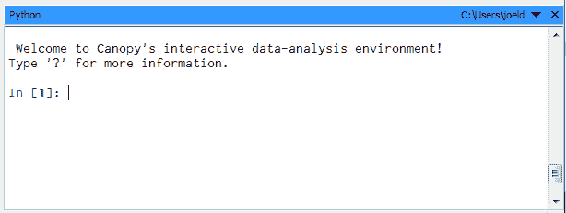

# 一、开始

由于您还需要获取与本书相关的代码和示例数据，所以让我先向您展示如何获取这些代码，然后我们就可以开始了。 我们得先做些准备工作。 首先，让我们来获取本书所需的代码和数据，这样您就可以继续学习并实际处理一些代码。 要做到这一点，最简单的方法是直接执行此操作-*开始*。

在本章中，我们将首先在工作的 Python 环境中安装并做好准备：

*   安装 EnThink 天篷
*   安装 Python 库
*   如何使用 IPython/Jupyter 笔记本
*   如何使用、阅读和运行本书的代码文件
*   然后，我们将进入理解 Python 代码的速成课程：
*   Python 基础知识-第 1 部分
*   了解 Python 代码
*   正在导入模块
*   尝试使用列表
*   元组
*   Python 基础知识-第 2 部分
*   运行 Python 脚本

一旦我们设置了您的环境并熟悉了本章中的 Python，您将拥有使用 Python 进行一次令人惊叹的数据科学之旅所需的一切。

# 安装 EnThink 天篷

让我们开始着手，安装您需要的东西，以便在您的桌面上使用数据科学实际开发 Python 代码。 我将指导您安装一个名为 EnThink Canopy 的包，该包包含开发环境和您需要预安装的所有 Python 包。 它让生活变得非常简单，但是如果您已经了解 Python，那么您的 PC 上可能已经有一个现有的 Python 环境，如果您想继续使用它，也许可以。

最重要的是，您的 Python 环境安装了 Python 3.5 或更高版本，它支持 Jupyter 笔记本(因为我们将在本课程中使用它)，并且您的环境中安装了本书所需的密钥包。 我将在几个简单的步骤中确切地解释如何实现完全安装-这将是非常简单的。

让我们先来概述一下那些关键的软件包，其中大部分都会自动为我们安装。 Canopy 将为我们安装 Python3.5，以及我们需要的其他一些包，包括：`scikit_learn`、`xlrd`和`statsmodels`。 我们需要手动使用`pip`命令来安装一个名为`pydot2plus`的软件包。 这将是它-这是非常容易与树冠！

一旦完成了下面的安装步骤，我们就有了实际启动和运行所需的一切，所以我们将打开一个小示例文件，真正地做一些数据科学工作。 现在，让我们尽快为您准备好所需的一切：

1.  您需要的第一件事是一个用于 Python 代码的开发环境，称为 IDE。 我们在这本书中要用到的是“启迪树冠”。 这是一个科学的计算环境，它将在这本书中很好地发挥作用：


2.  要安装 Canopy，只需转到[www.entught.com](http://www.enthought.com)并单击 Downloads：Canopy：


3.  EnThink Canopy 是免费的，对于 Canopy Express 版-这就是你想要的这本书。 然后，您必须选择您的操作系统和体系结构。 对我来说，这是 Windows 64 位操作系统，但你需要根据你的操作系统点击相应的下载按钮，并使用 Python3.5 选项：


4.  在这一步我们不需要给他们任何个人信息。 有一个非常标准的 Windows 安装程序，所以只需下载：


5.  下载之后，我们继续打开 Canopy 安装程序，并运行它！ 您可能希望在同意之前阅读许可证，这取决于您，然后只需等待安装完成。
6.  在安装过程结束时点击 Finish 按钮后，允许它自动启动 Canopy。 您将看到 Canopy 然后自行设置 Python 环境，这很棒，但这需要一两分钟的时间。
7.  一旦安装程序完成了对 Python 环境的设置，您应该会看到一个如下图所示的屏幕。 上面写着欢迎来到 Canopy 和一堆友好的大按钮：


8.  最美妙的是，这本书几乎所有你需要的东西都预装了 EnsidedCanopy，这就是我推荐使用它的原因！
9.  我们只需要设置最后一件事，所以请继续单击 Canopy Welcome 屏幕上的 Editor 按钮。 然后，您将看到编辑器屏幕出现，如果您在底部的窗口中向下单击，我希望您只需键入：

```py
!pip install pydotplus 

```

10.  下面是当您在 Canopy Editor 窗口底部键入上述行时屏幕上的显示效果；当然，不要忘记按下 Return 按钮：


11.  点击 Return 按钮，这将安装一个额外的模块，在本书后面，当我们讨论决策树和渲染决策树时，我们需要这个额外的模块。
12.  一旦它安装完**pydotplus**，它应该会返回并说它已成功安装，瞧，您现在已经具备了开始使用所需的一切！ 此时，安装已经完成-但让我们再执行几个步骤来确认我们的安装运行良好。

# 对安装进行测试运行

1.  现在让我们对您的安装进行一次测试运行。 第一件要做的事实际上是完全关闭天篷的窗户！ 这是因为我们实际上不会在这个 Canopy 编辑器中编辑和使用我们的代码。 取而代之的是，我们将使用一种叫做 IPython Notebook 的东西，它现在也被称为 Jupyter Notebook。
2.  让我向你展示一下它是如何工作的。 如果您现在在操作系统中打开一个窗口来查看下载的随附图书文件，如本书的前言所述。 它应该与您为本书下载的`.ipynb`代码文件集类似：


现在转到列表中的 Outliers 文件，即`Outliers.ipynb`文件，双击它，应该会出现的情况是，它将首先启动 Canopy，然后它将启动您的 Web 浏览器！ 这是因为 IPython/Jupyter 笔记本实际上存在于您的 Web 浏览器中。 一开始可能会有一个小停顿，第一次可能会有点困惑，但你很快就会习惯这个想法。

你应该很快就会看到 Canopy 出现，对我来说，我默认的网页浏览器 Chrome 也会出现。 您应该看到以下 Jupyter Notebook 页面，因为我们双击了`Outliers.ipynb`文件：


如果你看到这个屏幕，这意味着你的安装一切正常，你已经准备好开始阅读这本书的其余部分了！

# 如果您偶尔在打开 IPNYB 文件时遇到问题

只是偶尔，我注意到当您双击`.ipynb`文件时，事情可能会出一点问题。 别慌！ 只是有时，Canopy 可能会变得有点不稳定，您可能会看到一个正在寻找密码或令牌的屏幕，或者您可能偶尔会看到一个屏幕显示它根本无法连接。

如果这两件事中的任何一件发生在你身上，不要惊慌，它们只是随机的怪癖，有时事情只是没有按正确的顺序启动，或者它们在你的 PC 上没有及时启动，这是正常的。

您所要做的就是返回并尝试再次打开该文件。 有时需要尝试两到三次才能正确加载，但如果你尝试几次，它最终应该会弹出，像我们之前看到的关于处理异常值的 Jupyter Notebook 屏幕，就是你应该看到的。

# 使用和了解 IPython(Jupyter)笔记本

祝贺您的安装！ 现在让我们探索如何使用 Jupyter 笔记本，也就是众所周知的 IPython 笔记本。 如今，更现代的名字是 Jupyter Notebook，但很多人仍然称它为 IPython Notebook，因此我认为对于工作的开发人员来说，这些名字是可以互换的。 我还发现 IPython Notebook 这个名字帮助我记住了笔记本文件名的后缀`.ipynb`，您将在这本书中非常熟悉！

好的，现在让我们再次从头开始--第一次探索 IPython/Jupyter Notebook(IPython/Jupyter Notebook)。 如果您尚未这样做，请导航到`DataScience`文件夹，我们已在该文件夹下载了本书的所有资料。 对于我来说，这就是`E:DataScience`，如果您在前面的安装部分没有这样做，请现在双击并打开`Outliers.ipynb`文件。

现在，当我们双击这个 IPython`.`**`ipynb`**文件时，首先它将启动 Canopy，如果它还没有启动的话，然后它将启动一个网络浏览器。 下面是`Outliers`笔记本电脑网页在我的浏览器中的完整外观：


正如您在这里看到的，笔记本的结构使得我可以在实际代码本身中散布我的小笔记和注释，并且您实际上可以在 Web 浏览器中运行这些代码！？ 所以，这是一种非常方便的格式，我可以给你一些参考，你可以在以后的生活中使用它来提醒你自己这些算法是如何工作的，我们将会讨论这些算法，并实际地试验它们，并亲自操作它们。这是一种非常方便的形式，你可以在以后的生活中使用它来提醒你自己这些算法是如何工作的。

IPython/Jupyter 笔记本文件的工作方式是，它们实际上是从浏览器内部运行的，就像网页一样，但它们是由您安装的 Python 引擎支持的。 因此，您应该会看到一个与上一个屏幕截图中显示的屏幕类似的屏幕。

当您在浏览器中向下滚动笔记本时，您会注意到有代码块。 它们很容易识别，因为它们包含我们的实际代码。 请在离顶部很近的 Exliers 笔记本中找到此代码的代码框：

```py
%matplotlib inline 
import numpy as np 

incomes = np.random.normal(27000, 15000, 10000) 
incomes = np.append(incomes, [1000000000]) 

import matplotlib.pyplot as plt 
plt.hist(incomes, 50) 
plt.show() 

```

在这里，让我们快速查看一下这段代码。 我们在这个代码中设置了一些收入分配。 我们正在模拟一群人的收入分配，为了说明离群值可能对这种分配产生的影响，我们模拟了唐纳德·特朗普(Donald Trump)加入其中，扰乱收入分配的平均值。 顺便说一句，我不是在发表政治声明，这一切都是在特朗普成为政治家之前做的。 所以你知道，完全公开在那里。

我们可以通过单击笔记本中的任何代码块来选择它。 因此，如果您现在单击包含我们刚才在上面看到的代码的代码块，我们就可以点击顶部的 Run 按钮来运行它。 下面是屏幕顶部的区域，您可以在其中找到 Run 按钮：


在选定代码块的情况下单击 Run 按钮，将重新生成此图形：


同样，我们可以单击稍低一点的下一个代码块，您将发现包含以下单行代码的代码块：

```py
incomes.mean() 

```

如果选择包含此行的代码块，并单击 Run 按钮来运行代码，您将看到下面的输出，由于该异常值的影响，结果是一个非常大的值，如下所示：

```py
127148.50796177129

```

让我们继续往前走，找点乐子。 在下一个代码块中，您将看到以下代码，它试图检测唐纳德·特朗普(Donald Trump)等离群值，并将其从数据集中删除：

```py
def reject_outliers(data): 
    u = np.median(data) 
    s = np.std(data) 
    filtered = [e for e in data if (u - 2 * s < e < u + 2 * s)] 
    return filtered 

filtered = reject_outliers(incomes) 
plt.hist(filtered, 50) 
plt.show() 

```

因此，在笔记本中选择相应的代码块，然后再次按 Run 按钮。 执行此操作时，您将看到以下图表：


现在我们看到了一个更好的直方图，它代表了更典型的美国人--现在我们已经剔除了把事情搞砸的离群值。

至此，您已经掌握了开始学习本课程所需的一切。 我们有您需要的所有数据、所有脚本以及 Python 和 Python 笔记本的开发环境。 那么，让我们一起摇滚吧。 接下来，我们将做一个关于 Python 本身的小速成课程，即使您熟悉 Python，它也可能是一个很好的小复习课程，所以您可能会想不管怎样都要看它。 让我们潜入水中学习 Python。

# Python 基础知识-第 1 部分

如果您已经了解 Python，那么您可以跳过接下来的两节。 但是，如果您需要复习一下，或者如果您以前没有使用过 Python，那么您会想要完成这些操作。 关于 Python 脚本语言，您需要了解一些奇怪的事情，所以让我们深入研究一下，通过编写一些实际的代码来学习一些 Python。

就像我之前说的，在这本书的要求中，你应该有某种编程背景才能在这本书中取得成功。 您已经用某种语言编写过代码，即使是脚本语言 JavaScript，我并不关心它是 C++、Java 还是其他语言，但是如果您是 Python 的新手，我将在这里给您上一点速成教程。 在这一节中，我将直接深入讨论一些示例。

Python 与您可能见过的其他语言有一些不同之处，所以我只想介绍一下 Python 与您可能使用过的其他脚本语言的不同之处，而实现这一点的最好方法是查看一些真实的示例。 让我们深入研究一下一些 Python 代码：


如果您打开这个类的`DataScience`文件夹(您在前面的部分中下载了这个文件夹)，您应该会找到一个`Python101.ipynb`文件；继续并双击它。 如果一切都安装正确，它应该会在 Canopy 中打开，它应该看起来有点像下面的屏幕截图：


New versions of Canopy will open the code in your web browser, not the Canopy editor! This is okay!

有关 Python 的一件很酷的事情是，使用 Python 运行代码有几种方法。 您可以将其作为脚本运行，就像使用普通编程语言一样。 您还可以在名为*IPython Notebook*的东西中编写代码，这就是我们在这里使用的东西。 就是这种格式，你实际上有了一个类似网络浏览器的视图，你可以用 HTML 标记的东西给自己写一些小的符号和注释，你也可以嵌入真正使用 Python 解释器运行的实际代码。

# 了解 Python 代码

我想给您提供的第一个 Python 代码示例就在这里。 下面的代码块代表了一些真实的 Python 代码，我们实际上可以在整个笔记本页面的这个视图中运行这些代码，但现在让我们放大并查看该代码：


我们来看看是怎么回事。 我们有一个数字列表和 Python 中的列表，有点像其他语言中的数组。 它由这些方括号表示：


我们有一个列表的数据结构，它包含从 1 到 6 的数字，然后迭代该列表中的每个数字，我们会说`for number in listOfNumbers:`，这是用于迭代一组内容和冒号的 Python 语法。

Tabs and whitespaces have real meaning in Python, so you can't just format things the way you want to. You have to pay attention to them.

我想指出的一点是，在其他语言中，通常会有一个方括号或某种花括号来表示我在`for`循环、`if`块或某种代码块中，但在 Python 中，这些都是用空格指定的。 Tab 实际上很重要，它告诉 Python 哪个代码块中有什么：

```py
for number in listOfNumbers: 
    print number, 
    if (number % 2 == 0): 
        print ("is even")
    else: 
        print ("is odd") 

print ("Hooray! We're all done.")

```

您会注意到，在这个`for`块中，我们在整个块中有一个 Tab，对于每个`number in listOfNumbers`，我们将执行由一个*Tab*Stop 插入的所有代码。 我们将打印数字，逗号只是表示我们之后不会换一行。 我们将在它之后立即打印其他内容，`if (number % 2 = 0)`，我们会说它是`even`。 否则，我们将把它设为`odd`，完成后，我们将打印出`All done`：


您可以在代码正下方看到输出。 我之前运行了输出，因为我实际上已经将它保存在我的笔记本中，但是如果您想要自己实际运行它，您只需在该块中单击，然后单击 Play 按钮，我们将实际执行它，然后再执行一次。 为了让您自己相信它确实在做一些事情，让我们将`print`语句更改为其他语句，比方说，`Hooray! We're all done. Let's party!`如果我现在运行它，您可以看到，我的消息确实已经更改了：


因此，我想再次强调的是，空格很重要。 您将使用缩进或制表符指定一起运行的代码块，例如`for`循环或`if then`语句，因此请记住这一点。 另外，也要注意你的结肠。 你会注意到很多这样的子句都是以冒号开头的。

# 正在导入模块

与任何语言一样，Python 本身的功能也相当有限。 使用 Python 进行机器学习、数据挖掘和数据科学的真正威力在于可用于此目的的所有外部库的威力。 其中一个库称为`NumPy`，或 Numic Python，例如，在这里我们可以`import`这个`Numpy`包，它作为`np`包含在 Canopy 中。

这意味着我将把`NumPy`包称为`np`，我可以随心所欲地称它为任何名称。 我可以将其命名为`Fred`或`Tim`，但最好坚持使用实际有意义的内容；现在我将其命名为`NumPy`包`np`，我可以使用`np`来引用它：

```py
import numpy as np

```

在本例中，我将调用作为`NumPy`包的一部分提供的`random`函数，并调用其 Normal 函数，以使用这些参数实际生成随机数的正态分布并将其打印出来。 因为它是随机的，所以我每次都会得到不同的结果：

```py
import numpy as npA = np.random.normal(25.0, 5.0, 10)print (A)

```

输出应如下所示：


果然，我得到了不同的结果。 这真是太酷了。

# 数据结构

让我们继续讨论数据结构。 如果您需要暂停一下，让事情稍微深入一些，或者您想多玩一点这些东西，请随意这样做。 学习这些东西最好的方法就是潜入并进行实际的实验，所以我绝对鼓励大家这样做，这就是为什么我要给你们提供可用的 IPython/Jupyter 笔记本，这样你们就可以真正进入，弄乱代码，用它做不同的事情。

例如，这里我们有一个围绕`25.0`的分布，但让我们围绕`55.0`进行分布：

```py
import numpy as npA = np.random.normal(55.0, 5.0, 10)print (A)

```

嘿，我所有的号码都变了，现在更接近 55 了，怎么样？


好的，让我们在这里稍微讨论一下数据结构。 正如我们在第一个示例中看到的，您可以拥有一个列表，语法如下所示。

# 尝试使用列表

```py
x = [1, 2, 3, 4, 5, 6]print (len(x))

```

例如，您可以说，调用一个列表`x`，并将其分配给数字`1`到`6`，这些方括号表示我们使用的是 Python 列表，这些是不可变的对象，我可以向其中添加内容，并根据需要重新排列。 有一个名为`len`的内置函数用于确定列表的长度，如果我键入`len(x)`，它将返回数字`6`，因为我的列表中有 6 个数字。

为了确保，并再次强调这实际上是在这里运行真实的代码，让我们在其中添加另一个数字，例如`4545`。 如果运行此命令，您将得到`7`，因为现在该列表中有 7 个数字：

```py
x = [1, 2, 3, 4, 5, 6, 4545]print (len(x))

```

上一个代码示例的输出如下所示：

```py
7

```

回到那里的原始示例。 现在，您还可以对列表进行切片。 如果您想要获取列表的子集，有一个非常简单的语法可以做到这一点：

```py
x[3:]

```

上述代码示例的输出如下所示：

```py
[1, 2, 3]

```

# 前冒号

例如，如果您想要获取列表的前三个元素，即元素号 3 之前的所有元素，我们可以说`:3`来获得前三个元素`1`、`2`和`3`，如果您考虑一下那里发生了什么，就像大多数语言中的索引一样，我们从 0 开始计数。 所以元素 0 是`1`，元素 1 是`2`，元素 2 是`3`。 既然我们说我们想要第三元素之前的所有东西，这就是我们要得到的。

So, you know, never forget that in most languages, you start counting at 0 and not 1.

这可能会使事情变得混乱，但在这种情况下，它确实有直观的意义。 你可以把那个冒号想象成我想要所有东西的意思，我想要前三个元素，我可以再次把它改成四个，以表明我们实际上是在做一些真实的事情：

```py
x[:4]

```

上述代码示例的输出如下所示：

```py
[1, 2, 3, 4]

```

# 冒号后

现在如果我把冒号放在`3`的另一边，也就是说我想要`3`之后的所有东西，所以`3`之后。 如果我说`x[3:]`，那就是给我第三个元素，0，1，2，3，以及它之后的所有东西。 所以在这个例子中它将返回 4，5 和 6，好吗？

```py
x[3:]

```

输出如下：

```py
[4, 5, 6]

```

您可能希望保留这个 IPython/Jupyter 笔记本文件。 这是一个很好的参考，因为有时它可能会混淆分片操作符是否包含该元素，或者它是否符合或不包含该元素。 所以最好的办法就是在这里玩玩，提醒自己。

# 否定句法

您还可以做的另一件事是使用这个否定语法：

```py
x[-2:]

```

输出如下：

```py
[5, 6]

```

通过说`x[-2:]`，这意味着我想要列表中的最后两个元素。 这意味着从末尾向后倒退两个，就会得到`5`和`6`，因为这是我清单上的最后两件事。

# 将列表添加到列表

您还可以更改周围的列表。 假设我想要向列表中添加一个列表。 为此，我可以使用`extend`函数，如以下代码块所示：

```py
x.extend([7,8])x

```

上述代码的输出如下：

```py
[1, 2, 3, 4, 5, 6, 7, 8]

```

我有我的列表`1`，`2`，`3`，`4`，`5`，`6`。 如果我想扩展它，我可以说我在这里有一个新的列表，`[7, 8]`，那个括号表示这是一个自身的新列表。 这可能是一个隐含的列表，你知道，它是内联的，它可以被另一个变量引用。 你可以看到，一旦我这样做了，我得到的新列表实际上有`7`，`8`的列表附加到它的末尾。 因此，通过使用另一个列表扩展该列表，我有了一个新列表。

# 追加函数

如果您只想向该列表中再添加一件东西，您可以使用`append`函数。 所以我只想把数字`9`放在最后，我们开始：

```py
x.append(9)x

```

上述代码的输出如下：

```py
[1, 2, 3, 4, 5, 6, 7, 8, 9]

```

# 复杂的数据结构

您还可以拥有包含列表的复杂数据结构。 所以你不需要仅仅把数字放进去；你实际上可以把字符串放进去。 你可以在里面填上数字。 你可以把其他的清单放进去。 无所谓。 Python 是一种弱类型语言，因此您几乎可以将任何类型的数据放在您想要的任何位置，这通常是一件可以做的事情：

```py
y = [10, 11, 12]listOfLists = [x, y]listOfLists

```

在前面的示例中，我有第二个列表，其中包含我要调用的`10`、`11`、`12`。 我将创建一个包含两个列表的新列表。 这能让你头脑发热吗？ 我们的`listofLists`列表将包含`x`列表和`y`列表，这是非常合理的做法。 您可以在这里看到，我们有一个方括号表示`listofLists`列表，在其中，我们有另一组方括号表示该列表中的每个单独列表：

```py
[[ 1, 2, 3, 4, 5, 6, 7, 8, 9 ], [10, 11, 12]]

```

所以，有时候像这样的东西会派上用场。

# 取消参照单个元素

如果要取消引用列表中的单个元素，只需使用如下方括号：

```py
y[1]

```

上述代码的输出如下：

```py
11

```

因此`y[1]`将返回元素`1`。 记住，`y`中有`10`、`11`、`12`-观察前面的例子，我们从 0 开始计数，所以元素 1 实际上是列表中的第二个元素，或者在本例中是数字`11`，对吗？

# 排序函数

最后，让我们使用一个内置的排序函数：

```py
z = [3, 2, 1]z.sort()z

```

因此，如果我从 List`z`开始，即`3,``2`和`1`，我可以对该列表调用 Sort，现在将按顺序对`z`进行排序。 上述代码的输出如下：

```py
[1, 2, 3]

```

# 反向排序

```py
z.sort(reverse=True)z

```

上述代码的输出如下：

```py
[3, 2, 1]

```

如果需要进行反向排序，只需将`reverse=True`作为属性，作为`sort`函数中参数，这会将其返回到`3`、`2`、`1`。

如果你需要让它沉浸在其中，你可以随时回去多读一点。

# 元组

元组就像列表一样，只是它们是不可变的，所以您实际上不能扩展、追加或排序它们。 它们就是它们，它们的行为就像列表一样，只是您不能更改它们，而且您使用圆括号而不是方括号来指示它们是不变的并且是元组，而不是列表。 所以你可以看到它们的工作方式在其他方面大同小异：

```py
#Tuples are just immutable lists. Use () instead of []x = (1, 2, 3)len(x)

```

前面代码的输出如下所示：

```py
3

```

我们可以说`x= (1, 2, 3)`。 我仍然可以使用`length - len`来说明该元组中有三个元素，即使您不熟悉术语`tuple`，`tuple`实际上可以包含您想要的任意多个元素。 尽管听起来像是基于数字 3 的拉丁语，但这并不意味着你有三样东西在里面。 通常，它里面只有两样东西。 你想要多少就有多少，真的。

# 取消参照图元

我们还可以取消引用元组的元素，因此元素编号 2 将再次成为第三个元素，因为我们从 0 开始计数，这将返回以下屏幕截图中的数字`6`：

```py
y = (4, 5, 6)y[2]

```

上述代码的输出如下所示：

```py
6

```

# 元组列表

我们也可以像处理列表一样，使用元组作为列表的元素。

```py
listOfTuples = [x, y]listOfTuples

```

上述代码的输出如下所示：

```py
[(1, 2, 3), (4, 5, 6)]

```

我们可以创建一个包含两个元组的新列表。 所以在前面的例子中，我们有`(1, 2, 3)`的`x`元组和`(4, 5, 6)`的`y`元组；然后我们列出了这两个元组的列表，然后我们得到了这个结构，其中我们用方括号表示一个列表，该列表包含由圆括号表示的两个元组，在我们进行数据科学或任何类型的数据管理或处理时，元组通常用到的一件事就是在输入数据被读入时使用它来为输入数据赋值。 我想向您介绍一下以下示例中发生的事情：

```py
(age, income) = "32,120000".split(',')print (age)print (income)

```

上述代码的输出如下所示：

```py
32120000

```

假设我们有一行输入数据进入，它是一个逗号分隔的值文件，其中包含年龄，比如`32`，用逗号分隔，用收入分隔，比如那个年龄的`120000`，只是为了编造一些东西。 我能做的是，当每一行进入时，我可以调用它的`split`函数，将其实际分离成两个用逗号分隔的值，然后获取拆分产生的元组，并将其一次性赋值给两个变量-`age`和`income`-通过定义年龄、收入的元组，并表示我希望将其设置为等于从`split`函数得出的元组。

因此，这基本上是一种常用的速记方式，用于一次将多个字段赋给多个变量。 如果我运行它，您可以看到，由于那里的小技巧，`age`变量实际上被赋给了`32`和`income`到`120,000`。 在执行此类操作时需要小心，因为如果在生成的元组中没有预期的字段数或元素数，如果尝试分配的内容比这里预期的要多或少，就会出现异常。

# 字典 / 参考书 / 词典

最后，我们将在 Python 中看到的最后一个数据结构是字典，您可以将其视为其他语言中的映射或哈希表。 这是一种基本上拥有一种迷你数据库的方式，一种内置到 Python 中的键/值数据存储。 比方说，我想建立一本关于“星际迷航”中的船只和船长的小词典：


我可以设置`captains = {}`，其中花括号表示空字典。 现在我可以使用这种语法在我的字典中分配条目，所以我可以说`captains`对于`Enterprise`是`Kirk`，对于`Enterprise D`是`Picard`，对于`Deep Space Nine`是`Sisko`，对于`Voyager`是`Janeway`。 现在，基本上，我有了这个查询表，它将把船名与它们的船长联系起来，我可以说，例如，`print captains["Voyager"]`，然后我返回`Janeway`。

这是一个非常有用的工具，基本上可以进行某种查找。 假设您在数据集中有某种类型的标识符，该标识符映射到某个人类可读的名称。 当你把它打印出来的时候，你可能会用字典来真正地查找它。

我们还可以看到，如果你试图查找一些不存在的东西，会发生什么。 我们可以在字典上使用`get`函数来安全地返回条目。 因此，在本例中，`Enterprise`在我的字典中有一个条目，它只返回`Kirk`，但是如果我在字典上调用`NX-01`船，我从未定义过该船的船长，所以在本例中它返回一个`None`值，这比引发异常要好，但您需要知道这是一种可能性：

```py
print (captains.get("NX-01"))

```

上述代码的输出如下：

```py
None

```

船长是乔纳森·阿切尔，但你知道，我现在有点太书呆子了。

# 遍历条目

```py
for ship in captains:     print (ship + ": " + captains[ship])

```

上述代码的输出如下：


让我们看一个遍历字典中的条目的小示例。 如果我想遍历字典中的每一条船并打印出`captains`，我可以在`captains`中键入`ship`，这将遍历字典中的每个键。 然后我可以打印出每艘船船长的查询值，这就是我得到的输出。

这就对了。 这基本上是您将在 Python 中遇到的主要数据结构。 还有一些其他的，比如套装，但我们在这本书中不会真正用到它们，所以我认为这足以让你开始学习。 让我们在下一节深入研究更多 Python 细微差别。

# Python 基础知识-第 2 部分

除了*Python 基础知识-第 1 部分*之外，现在让我们尝试更详细地掌握 Python 概念。

# Python 中的函数

让我们讨论一下 Python 中的函数。 与其他语言一样，您可以使用函数反复使用不同的参数重复一组操作。 在 Python 中，执行此操作的语法如下所示：

```py
def SquareIt(x):    return x * xprint (SquareIt(2))

```

上述代码的输出如下：

```py
4

```

您可以使用`def`关键字声明一个函数。 它只说明这是一个函数，我们将调用该函数`SquareIt`，然后参数列表被放在圆括号内。 这个特殊的函数只接受一个参数，我们称之为`x`。 同样，请记住空格在 Python 中很重要。 这个函数不会有任何花括号或任何东西。 它由空格严格定义。 因此，我们有一个冒号，表示此函数声明行已结束，但它由一个或多个制表符组成的事实告诉解释器，我们实际上位于`SquareIt`函数中。

因此，`def SquareIt(x):`tab 返回`x * x`，这将返回此函数中`x`的平方。 我们可以继续试一试。 `print squareIt(2)`是我们调用该函数方式。 它看起来就像是用任何其他语言写的一样，真的。 这应该返回数字`4`；我们运行代码，实际上它确实运行了。 太棒了！ 这很简单，这就是函数的全部功能。 显然，如果我愿意，我可以有多个参数，甚至可以有任意多的参数。

现在，你可以用 Python 中的函数做一些奇怪的事情，这是一种很酷的事情。 您可以做的一件事是传递函数，就像它们是参数一样。 让我们仔细看看这个示例：

```py
#You can pass functions around as parametersdef DoSomething(f, x):    return f(x)print (DoSomething(SquareIt, 3))

```

上述代码的输出如下所示：

```py
9

```

现在我有一个名为`DoSomething`，`def DoSomething`的函数，它将接受两个参数，一个将调用`f`，另一个将调用`x`，如果发生这种情况，我实际上可以为其中一个参数传入一个函数。 所以，想一想这一点。 更有意义地看一下这个例子。 在这里，`DoSomething(f,x):`将返回`x`的`f`；它基本上会调用以 x 为参数的 f 函数，并且在 Python 中没有强类型，所以我们只需确保为第一个参数传入的实际上是一个函数，这样才能正常工作。

例如，我们将指定 print`DoSomething`，对于第一个参数，我们将传入`SquareIt`(实际上是另一个函数)和数字`3`。 这应该做的是用`SquareIt`函数和`3`参数做一些事情，它将返回`(SquareIt, 3)`，而我上次检查的`3`的平方是`9`，果然，它确实起作用了。

这对您来说可能是一个新的概念，将函数作为参数传递，所以如果您需要在这里停留一分钟，请等待，让它沉浸其中，并尝试一下，请随意这样做。 再一次，我鼓励你停下来，按照你自己的节奏来做这件事。

# Lambda 函数-函数式编程

还有一件类似 Python 的事情，您可能在其他语言中看不到，那就是 lambda 函数的概念，它被称为**函数式编程**。 其想法是您可以将一个简单的函数包含到一个函数中。 举个例子最能说明问题：

```py
#Lambda functions let you inline simple functionsprint (DoSomething(lambda x: x * x * x, 3))

```

上述代码的输出如下：

```py
27

```

我们将打印`DoSomething`，并记住我们的第一个参数是一个函数，因此我可以使用`lambda`关键字内联声明该函数，而不是传入命名函数。 Lambda 基本上意味着我正在定义一个暂时存在的未命名函数。 它是暂时的，它接受一个参数`x`。 在这里的语法中，`lambda`表示我定义了某种内联函数，后跟它的参数列表。 它只有一个参数`x`和冒号，后面跟着该函数的实际操作。 我将采用`x`参数并将其自身相乘三次，基本上得到一个参数的立方体。

在本例中，`DoSomething`将传入这个 lambda 函数作为第一个参数，它计算`x`和`3`参数的立方体。 那么这到底是怎么回事呢？ 这个`lambda`函数本身就是一个函数，它被传递到上一个示例中的`DoSomething`中的`f`中，这里的`x`将是`3`。 这将返回`x`的`f`，这将结束对值`3`执行 lambda 函数。 因此，`3`进入我们的`x`参数，我们的 lambda 函数将其转换为`3`乘以`3`乘以`3`，当然，也就是`27`。

现在，当我们开始做 MapReduce 和 Spark 之类的事情时，这个问题会出现很多。 因此，如果我们稍后将讨论 Hadoop 的各种技术，这是一个需要理解的非常重要的概念。 再一次，我鼓励你花点时间去领会这一点，如果你需要的话，去了解那里发生了什么。

# 了解布尔表达式

布尔表达式语法有点奇怪或不寻常，至少在 Python 中是这样：

```py
print (1 == 3)

```

上述代码的输出如下：

```py
False

```

像往常一样，我们有双等号，可以测试两个值是否相等。 所以`1`等于`3`，不是，所以`False`。 值`False`是由 F 指定的特殊值。记住，当您尝试测试时，当您执行布尔操作时，相关的关键字是带 T 的`True`和带 F 的`False`。这与我使用过的其他语言略有不同，所以请记住这一点。

```py
print (True or False)

```

上述代码的输出如下：

```py
True

```

嗯，`True`或`False`是`True`，因为其中一个是`True`，你运行它，它就会返回`True`。

# If 语句

```py
print (1 is 3)

```

前面代码的输出如下所示：

```py
False

```

我们可以做的另一件事是使用`is`，这在某种程度上等同于相等。 它是一种更像 Python 的相等表示，所以`1 == 3`与`1 is 3`是一样的，但这被认为是更 Python 式的方式。 因此，`1 is 3`返回为`False`，因为`1`不是`3`。

# If-Else 循环

```py
if 1 is 3:    print "How did that happen?"elif 1 > 3:    print ("Yikes")else:    print ("All is well with the world")

```

上述代码的输出如下：

```py
All is well with the world

```

我们也可以在这里做`if-else`和`else-if`块。 让我们来做一些更复杂的事情。 如果`1 is 3`，我会打印`How did that happen?`，但当然`1`不是`3`，所以我们将后退到`else-if`块，否则，如果`1`不是`3`，我们将测试是否`1 > 3`。 嗯，这也不是真的，但如果是这样，我们打印`Yikes`，我们最终会陷入这个将打印`All is well with the world`的通用`else`子句。

事实上，`1`不是`3`，`1`也不大于`3`，果然是`All is well with the world`。 所以，你知道，其他语言都有非常相似的语法，但这些都是 Python 的特点，以及如何执行`if-else`或`else-if`块。 所以，再说一次，你可以随心所欲地把这本笔记本放在身边。 这可能是以后很好的参考。

# 环绕 / 绕行 / 打环 / 翻筋斗

我想在 Python 基础知识中介绍的最后一个概念是循环，我们已经看到了几个这样的示例，但让我们再来看一个：

```py
for x in range(10): print (x),

```

前面代码的输出如下所示：

```py
0 1 2 3 4 5 6 7 8 9

```

例如，我们可以使用此范围运算符自动定义范围内的数字列表。 因此，如果我们在`range(10)`中指定`for x`，`range 10`将生成一个从`0`到`9`的列表，通过在该列表中指定`x`，我们将迭代该列表中的每个条目并将其打印出来。 再说一次，`print`语句后面的逗号说，不要给我换行，只要继续往前走就行了。 因此，其输出结果是列表中的所有元素都被逐个打印出来。

为了做一些稍微复杂一些的事情，我们将做一些类似的事情，但这一次我们将展示`continue`和`break`是如何工作的。 与在其他语言中一样，您实际上可以选择跳过循环迭代的其余处理，或者提前停止循环的迭代：

```py
for x in range(10):    if (x is 1): continue if (x > 5):    break print (x),

```

上述代码的输出如下：

```py
0 2 3 4 5

```

在本例中，我们将遍历从 0 到 9 的值，如果碰到数字 1，我们将在打印之前继续。 我们基本上会跳过数字 1，如果数字大于`5`，我们将中断循环并完全停止处理。 我们期望的输出是打印数字`0`到`5`，除非是`1`，在这种情况下，我们将跳过数字`1`，果不其然，它就是这么做的。

# While 循环

另一种语法是 WHILE 循环。 这是您在大多数语言中看到的一种标准循环语法：

```py
x = 0while (x < 10):    print (x),    x += 1

```

前面代码的输出如下所示：

```py
0 1 2 3 4 5 6 7 8 9

```

我们也可以说，从`x = 0`和`while (x < 10):`开始，打印出来，然后将`x`递增`1`。 这将一次又一次地进行，递增 x 直到它小于 10，在这一点上我们退出`while`循环，我们就完成了。 所以它和这里的第一个例子做了同样的事情，只是风格不同而已。 它使用`while`循环打印数字`0`到`9`。 这里只有几个例子，没什么太复杂的。 同样，如果您以前做过任何类型的编程或脚本编写，那么这应该非常简单。

现在，为了让大家真正理解这一点，我在整章中一直在说，进去吧，把你的手弄脏，玩一玩。 所以我要让你这么做。

# 探险活动

这是一项活动，对你来说是一个小小的挑战：


这里有一个很好的小代码块，您可以在其中开始编写自己的 Python 代码，运行它，并使用它，所以请这样做。 您面临的挑战是编写一些代码来创建整数列表，循环遍历该列表中的每个元素，到目前为止非常简单，并且只打印偶数。

现在这应该不会太难。 这本笔记本上有做所有这些事情的例子；你所要做的就是把它放在一起，让它运行起来。 所以，重点不是要给你一些困难的东西。 我只想让您在编写自己的 Python 代码、实际运行它并看到它运行时有一些信心，所以请这样做。 我绝对鼓励你们在这里保持互动。 所以，祝你好运，欢迎来到 Python。

这就是你们的 Python 速成课程，显然，只是一些非常基础的东西。 随着我们在整本书中介绍越来越多的示例，这将变得越来越有意义，因为您有更多的示例可供查看，但是如果您在这一点上确实感到有点害怕，那么可能您对编程或脚本编程有点太陌生了，在继续前进之前先去修改一下 Python 可能是个好主意，但是如果您对到目前为止所看到的非常满意，那么让我们继续前进，我们将继续前进。

# 运行 Python 脚本

在整本书中，我们将使用我们到目前为止一直关注的 IPython/Jupyter Notebook 格式(即`.ipynb`文件)，对于这样的一本书来说，这是一种很好的格式，因为它允许我在里面放一些代码块，并在它周围放一些文本和其他东西来解释它在做什么，你可以现场实验。

当然，从这个角度来看这很棒，但在现实世界中，您可能不会使用 IPython/Jupyter 笔记本在生产环境中实际运行 Python 脚本，所以让我简单介绍一下运行 Python 代码的其他方式，以及运行 Python 代码的其他交互方式。 所以这是一个相当灵活的系统。 我们来看看。

# 除了 IPython/Jupyter 笔记本之外，还有更多选择

我想确保您知道运行 Python 代码的方式不止一种。 现在，在整本书中，我们将使用 IPython/Jupyter Notebook 格式，但在现实世界中，您不会将代码作为笔记本运行。 您将把它作为独立的 Python 脚本运行。 所以我只想确保你知道如何做到这一点，看看它是如何运作的。


让我们回到书中提到的第一个例子，只是为了说明空格的重要性。 我们只需选择该代码并将其从笔记本格式复制出来，然后将其粘贴到一个新文件中。

这可以通过单击最左边的 New 按钮来完成。 因此，让我们创建一个新文件并将其粘贴到其中，然后保存该文件并将其命名为`test.py`，其中`py`是我们为 Python 脚本提供的通常扩展名。 现在，我可以用几种不同的方式来处理这个问题。

# 在命令提示符下运行 Python 脚本

我实际上可以在命令提示符下运行该脚本。 如果我转到 Tools(工具)，我可以转到 Canopy Command Prompt(Canopy 命令提示符)，这将打开一个命令窗口，其中已经准备好了运行 Python 所需的所有环境变量。 我只需键入`python test.py`并运行脚本，结果就会出来：


所以在现实世界中，你可能会做这样的事情。 可能在 Crontab 或类似的东西上，谁知道呢？ 但在生产中运行真正的脚本就是这么简单。 现在可以关闭命令提示符。

# 使用 Canopy IDE

回过头来看，我还可以从 IDE 中运行该脚本。 所以在 Canopy 中，我可以进入 Run 菜单。 我可以转到 Run|Run File，或者单击小播放图标，这也将执行我的脚本，并在输出窗口的底部看到结果，如下面的屏幕截图所示：


这是另一种方式，最后，您还可以在底部的交互式提示符中以交互方式运行脚本。 我实际上可以一次输入一个 Python 命令，然后让它们在下面的环境中执行和保留：


例如，我可以说`stuff`，使它成为`list`调用，然后有`1`、`2`、`3`、`4`，现在我可以说`len(stuff)`，这将得到`4`：


我可以说，`for x in stuff:print x`，我们得到的输出为`1 2 3 4`：


所以你可以看到，当你进入底部的交互提示符时，你可以编写一些脚本，一次执行一件事情。 在这个例子中，`stuff`是我们创建的一个变量，一个驻留在内存中的列表，它有点像这个环境中其他语言中的全局变量。

现在，如果我确实想要重置此环境，如果我想要摆脱`stuff`并重新开始，您可以转到此处的 Run 菜单，您可以说 Restart Kernel，这将以一张白纸打乱您的位置：



因此，现在我有了一个全新的 Python 环境，在本例中，我怎么称呼它呢？ 类型`stuff`和`stuff`尚不存在，因为我有一个新环境，但我可以将其设置为其他类型，如`[4, 5, 6]`；运行它，它就在那里：


现在有了运行 Python 代码的三种方式：IPython/Jupyter Notebook，我们将在整本书中使用它，因为它是一个很好的学习工具，您也可以将脚本作为独立的脚本文件运行，还可以在交互式命令提示符下执行 Python 代码。

现在你有了它，你有三种不同的方式来运行 Python 代码，并在生产中试验和运行东西。 所以请记住这一点。 我们将在这本书的其余部分使用笔记本，但同样，当时间到来时，您可以选择其他选项。

# 简略的 / 概括的 / 简易判罪的 / 简易的

在这一章中，我们从构建本书最重要的垫脚石-安装 EnThink Canopy 开始我们的旅程。 然后，我们开始安装其他库和安装不同类型的包。 在各种 Python 代码的帮助下，我们还掌握了一些 Python 的基础知识。 我们介绍了模块、列表以及元组等基本概念，最终通过更好地了解 Python 中的函数和循环，进一步了解了 Python 基础知识。 最后，我们从运行一些简单的 Python 脚本开始。

在下一章中，我们将继续理解统计和概率的概念。