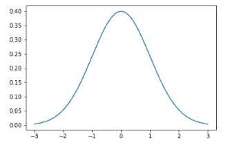
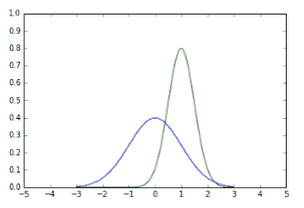
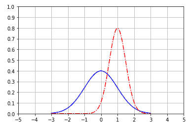
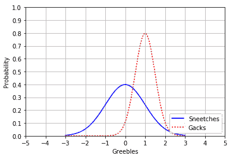
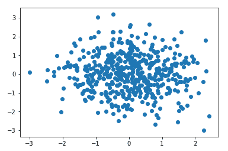

# 三、Matplotlib 与高级概率概念

在经历了上一章中一些比较简单的统计和概率概念之后，我们现在将注意力转向一些更高级的主题，您需要熟悉这些主题才能最大限度地利用本书的其余部分。 别担心，它们不是太复杂。 首先，让我们来找点乐子，看看`matplotlib`库的一些令人惊叹的绘图功能。

在本章中，我们将介绍以下主题：

*   使用`matplotlib`包绘制图形
*   了解协方差和相关性以确定数据之间的关系
*   用实例理解条件概率
*   理解贝叶斯定理及其重要性

# Matplotlib 的速成课程

你的数据的好坏取决于你能把它呈现给其他人，所以让我们来讨论一下如何绘制和绘制你的数据，以及如何把它呈现给其他人，让你的图表看起来更漂亮。 我们将更详细地介绍 Matplotlib，并对其进行测试。

我将向您展示一些技巧，告诉您如何使您的图表尽可能美观。 让我们来玩玩图表吧。 把你的作品拍成漂亮的照片总是很好的。 这将在您的工具箱中提供更多工具，用于使用不同类型的图形可视化不同类型的数据，并使其看起来更美观。 我们会使用不同的颜色，不同的线条风格，不同的轴，诸如此类的东西。 不仅重要的是使用图表和数据可视化来尝试在数据中找到有趣的模式，而且将您的发现很好地呈现给非技术受众也很有趣。 不再多此一举，让我们深入到 Matplotlib。

去吧，打开`MatPlotLib.ipynb`文件，你可以和我一起玩这些东西。 我们先画一张简单的折线图。

```py
%matplotlib inline 

from scipy.stats import norm 
import matplotlib.pyplot as plt 
import numpy as np 

x = np.arange) 

plt.plot(x, norm.pdf(x)) 
plt.show() 

```

因此，在本例中，我将`matplotlib.pyplot`导入为`plt`，因此，从现在开始，我们可以在本笔记本中将其称为`plt`。 然后，我使用`np.arange(-3, 3, 0.001)`创建一个 x 轴，以 0.001 为增量填充`-3`和`3`之间的值，并使用`pyplot`的`plot()`函数绘制`x`。y 函数将是`norm.pdf(x)`。因此，我将基于`x`值创建一个正态分布的概率密度函数，我将使用`scipy.stats norm`包来实现这一点。

把它与上一章的概率密度函数联系起来，这里我们用`matplotlib`绘制一个正态概率密度函数。 因此，我们只需调用`pyplot`的`plot()`方法来设置绘图，然后使用`plt.show()`显示它。当我们运行前面的代码时，我们会得到以下输出：



这就是我们得到的：一个包含所有默认格式的非常小的图形。

# 在一个图形上生成多个绘图

比方说我想一次策划不止一件事。 在调用 show 之前，您实际上可以多次调用 Plot，以便向图形中实际添加多个函数。 让我们看一下以下代码：

```py
plt.plot(x, norm.pdf(x)) 
plt.plot(x, norm.pdf(x, 1.0, 0.5)) 
plt.show() 

```

在这个例子中，我调用了一个正态分布的原始函数，但我也会在这里呈现另一个正态分布，平均值在`1.0`左右，标准差在`0.5`左右。 然后，我将把这两个放在一起展示，这样你们就可以看到它们之间的比较。


您可以看到，默认情况下，`matplotlib`会自动为每个图形选择不同的颜色，这非常方便。

# 将图表另存为图像

如果我想要将此图形保存到文件中，也许我想要将其包含在文档或其他文件中，我可以执行类似以下代码的操作：

```py
plt.plot(x, norm.pdf(x)) 
plt.plot(x, norm.pdf(x, 1.0, 0.5)) 
plt.savefig('C:\\Users\\Frank\\MyPlot.png', format='png') 

```

不只是调用`plt.show()`，我还可以调用`plt.savefig()`，其中包含我想要保存该文件的位置和格式。

如果您正在进行操作，则需要将其更改为您的计算机上存在的实际路径。 您的系统上可能没有`Users\Frank`文件夹。 还要记住，如果您在 Linux 或 MacOS 上，您将使用正斜杠而不是反斜杠，并且不会有驱动器号。 对于所有这些 Python 笔记本，每当您看到这样的路径时，请确保将其更改为在您的系统上工作的实际路径。 我现在使用的是 Windows，而且我确实有一个`Users\Frank`文件夹，所以我可以继续运行它。 如果我在`Users\Frank`下检查我的文件系统，我就可以打开并查看一个`MyPlot.png`文件，并且我可以在任何我想要的文档中使用它。


这真是太酷了。 另一件需要快速注意的事情是，根据您的设置，您在保存文件时可能会遇到权限问题。 您只需要找到适合您的文件夹即可。 在 Windows 上，您的`Users\Name`文件夹通常是安全的选择。 好了，我们继续吧。

# 调整轴线

假设我不喜欢上一张图中该值的轴的默认选择。 它会自动将其与您能找到的最紧凑的轴值集相匹配，这通常是一件好事，但有时您希望以绝对比例进行操作。 请看以下代码：

```py
axes = plt.axes() 
axes.set_xlim([-5, 5]) 
axes.set_ylim([0, 1.0]) 
axes.set_xticks([-5, -4, -3, -2, -1, 0, 1, 2, 3, 4, 5]) 
axes.set_yticks([0, 0.1, 0.2, 0.3, 0.4, 0.5, 0.6, 0.7, 0.8, 0.9, 1.0]) 
plt.plot(x, norm.pdf(x)) 
plt.plot(x, norm.pdf(x, 1.0, 0.5)) 
plt.show() 

```

在本例中，我首先使用`plt.axes`获得轴。 一旦我有了这些轴对象，我就可以调整它们。 通过调用`set_xlim`，我可以设置 x 范围从-5 到 5，通过设置`set_ylim`，我可以设置 y 范围从 0 到 1。您可以在下面的输出中看到，我的 x 值从`-5`到`5`，y 从 0 到 1。我还可以显式控制轴上刻度线的位置。 因此，在前面的代码中，我要使用`set_xticks()`和`set_yticks()`函数将 x 刻度设为`-5`、`-4`、`- 3`等，并使用`set_xticks()`和`set_yticks()`函数将 y 刻度从 0 到 1 递增 0.1。 现在，我可以使用`arange`函数更简洁地完成此操作，但关键是您可以显式控制这些刻度线发生的确切位置，您也可以跳过一些刻度线。 你可以以任何你想要的增量或任何你想要的分布来拥有它们。 除此之外，这都是一回事。

一旦我调整了我的轴，我就用我想要绘制的函数调用`plot()`，并调用`show()`来显示它。 果然，结果就在这里。



# 添加格线

如果我想在我的图表中使用网格线怎么办？ 嗯，想法是一样的。 我所要做的就是在从`plt.axes()`返回的轴上调用`grid()`。

```py
axes = plt.axes() 
axes.set_xlim([-5, 5]) 
axes.set_ylim([0, 1.0]) 
axes.set_xticks([-5, -4, -3, -2, -1, 0, 1, 2, 3, 4, 5]) 
axes.set_yticks([0, 0.1, 0.2, 0.3, 0.4, 0.5, 0.6, 0.7, 0.8, 0.9, 1.0]) 
axes.grid() 
plt.plot(x, norm.pdf(x)) 
plt.plot(x, norm.pdf(x, 1.0, 0.5)) 
plt.show() 

```

通过执行上面的代码，我得到了漂亮的小网格线。 这使得查看特定点的位置更容易一些，尽管它会使事情变得有点混乱。 这是一个有点风格的选择。


# 更改线型和颜色

如果我想玩线条类型和颜色的游戏呢？ 你也可以这么做。

```py
axes = plt.axes() 
axes.set_xlim([-5, 5]) 
axes.set_ylim([0, 1.0]) 
axes.set_xticks([-5, -4, -3, -2, -1, 0, 1, 2, 3, 4, 5]) 
axes.set_yticks([0, 0.1, 0.2, 0.3, 0.4, 0.5, 0.6, 0.7, 0.8, 0.9, 1.0]) 
axes.grid() 
plt.plot(x, norm.pdf(x), 'b-') 
plt.plot(x, norm.pdf(x, 1.0, 0.5), 'r:') 
plt.show() 

```

在前面的代码中，实际上在`plot()`函数的末尾有一个额外的参数，我可以在其中传递一个描述线条样式的小字符串。 在第一个示例中，`b-`表示我想要一条蓝色的实线。 `b`代表蓝色，破折号表示实线。 对于我的第二个`plot()`函数，我将用红色绘制它，这就是`r`的意思，冒号表示我将用虚线绘制它。


如果我运行它，您可以在上面的图表中看到它的作用，并且您可以更改不同类型的线条样式。

此外，您还可以使用双破折号(`--`)。

```py
axes = plt.axes() 
axes.set_xlim([-5, 5]) 
axes.set_ylim([0, 1.0]) 
axes.set_xticks([-5, -4, -3, -2, -1, 0, 1, 2, 3, 4, 5]) 
axes.set_yticks([0, 0.1, 0.2, 0.3, 0.4, 0.5, 0.6, 0.7, 0.8, 0.9, 1.0]) 
axes.grid() 
plt.plot(x, norm.pdf(x), 'b-') 
plt.plot(x, norm.pdf(x, 1.0, 0.5), 'r--') 
plt.show() 

```

前面的代码为您提供了红线虚线作为线条样式，如下图所示：


我也可以做点划线组合(`-.`)。

```py
axes = plt.axes() 
axes.set_xlim([-5, 5]) 
axes.set_ylim([0, 1.0]) 
axes.set_xticks([-5, -4, -3, -2, -1, 0, 1, 2, 3, 4, 5]) 
axes.set_yticks([0, 0.1, 0.2, 0.3, 0.4, 0.5, 0.6, 0.7, 0.8, 0.9, 1.0]) 
axes.grid() 
plt.plot(x, norm.pdf(x), 'b-') 
plt.plot(x, norm.pdf(x, 1.0, 0.5), 'r-.') 
plt.show() 

```

您将获得类似于以下图表图像的输出：



所以，这些都是不同的选择。 我甚至可以用垂直斜杠把它变成绿色(`g:`)。

```py
axes = plt.axes() 
axes.set_xlim([-5, 5]) 
axes.set_ylim([0, 1.0]) 
axes.set_xticks([-5, -4, -3, -2, -1, 0, 1, 2, 3, 4, 5]) 
axes.set_yticks([0, 0.1, 0.2, 0.3, 0.4, 0.5, 0.6, 0.7, 0.8, 0.9, 1.0]) 
axes.grid() 
plt.plot(x, norm.pdf(x), 'b-') 
plt.plot(x, norm.pdf(x, 1.0, 0.5), ' g:') 
plt.show() 

```

我将获得以下输出：


如果您愿意，可以尝试不同的值，这样就可以获得不同的线条样式。

# 为轴添加标签并添加图例

你更常做的事情就是给你的斧头贴上标签。 你永远不会想要在真空中呈现数据。 你肯定想告诉人们它代表了什么。 为此，可以使用`plt`上的`xlabel()`和`ylabel()`函数在轴上实际放置标签。 我将 x 轴标记为 greeble，y 轴标记为概率。 您还可以添加图例插图。 通常情况下，这是相同的，但为了表明它是独立设置的，我还在下面的代码中设置了一个图例：

```py
axes = plt.axes() 
axes.set_xlim([-5, 5]) 
axes.set_ylim([0, 1.0]) 
axes.set_xticks([-5, -4, -3, -2, -1, 0, 1, 2, 3, 4, 5]) 
axes.set_yticks([0, 0.1, 0.2, 0.3, 0.4, 0.5, 0.6, 0.7, 0.8, 0.9, 1.0]) 
axes.grid() 
plt.xlabel('Greebles') 
plt.ylabel('Probability') 
plt.plot(x, norm.pdf(x), 'b-') 
plt.plot(x, norm.pdf(x, 1.0, 0.5), 'r:') 
plt.legend(['Sneetches', 'Gacks'], loc=4) 
plt.show() 

```

在图例中，您基本上传入了要为每个图形命名的列表。 所以，我的第一个图形将被称为 Sneetches，我的第二个图形将被称为 Gacks，`loc`参数指示您想要它的位置，其中`4`代表右下角。 让我们继续运行代码，您应该会看到以下内容：



您可以看到，我正在为 Sneetches 和 Gacks 绘制问候语与概率的对比图。 这是苏斯博士给你的推荐信。 这就是如何设置轴、标签和图例。

# 一个有趣的例子

这里有一个有趣的小例子。 如果您熟悉网络漫画 XKCD，在 Matplotlib 中有一点复活节彩蛋，在那里您可以实际以 XKCD 的方式绘制东西。 下面的代码显示了如何做到这一点。

```py
plt.xkcd() 

fig = plt.figure() 
ax = fig.add_subplot(1, 1, 1) 
ax.spines['right'].set_color('none') 
ax.spines['top'].set_color('none') 
plt.xticks([]) 
plt.yticks([]) 
ax.set_ylim([-30, 10]) 

data = np.ones(100) 
data[70:] -= np.arange(30) 

plt.annotate( 
    'THE DAY I REALIZED\nI COULD COOK BACON\nWHENEVER I WANTED', 
    xy=(70, 1), arrowprops=dict(arrowstyle='->'), xytext=(15, -10)) 

plt.plot(data) 

plt.xlabel('time') 
plt.ylabel('my overall health') 

```

在本例中，调用`plt.xkcd()`将 Matplotlib 置于 XKCD 模式。 这样做之后，东西就会自动变成一种带有漫画字体和弯弯曲曲的线条的风格。 这个简单的小例子将显示一个有趣的小图表，我们绘制了你的健康与时间的关系，一旦你意识到你可以随时做培根，你的健康就会急剧下降。 我们在那里所做的就是使用`xkcd()`方法进入该模式。 您可以看到以下结果：


这里有一些有趣的 Python，我们实际上是如何将这个图表组合在一起的。 我们首先制作一条数据线，它只是 100 个数据点上的值 1。 然后，我们使用旧的 Python 列表切片操作符取取值 70 之后的所有内容，并从 30 个项目的子列表中减去 0 到 30 的范围。 这样做的效果是，当你超过 70 时，会线性地减去一个更大的值，这会导致这条线在 70 点之后向下移动到 0。

因此，这是一些 Python 列表切分的小示例，并创造性地使用`arange`函数来修改数据。

# 生成饼图

现在，要返回到真实世界，我们可以通过在 Matplotlib 上调用`rcdefaults()`来移除 XKCD 模式，我们可以在这里返回到正常模式。

如果您想要一个饼图，您所要做的就是调用`plt.pie`，并给它一个数组，其中包含您的值、颜色、标签，以及您是否要分解项目，如果要分解项目，则要分解项目的数量。 代码如下：

```py
# Remove XKCD mode: 
plt.rcdefaults() 

values = [12, 55, 4, 32, 14] 
colors = ['r', 'g', 'b', 'c', 'm'] 
explode = [0, 0, 0.2, 0, 0] 
labels = ['India', 'United States', 'Russia', 'China', 'Europe'] 
plt.pie(values, colors= colors, labels=labels, explode = explode) 
plt.title('Student Locations') 
plt.show() 

```

您可以在这段代码中看到，我正在创建一个带有值`12`、`55`、`4`、`32`和`14`的饼图。 我将为每个值指定显式颜色，并为每个值指定显式标签。 我把这块馅饼中的俄罗斯部分炸开了 20%，给这个情节起了一个名为《学生所在地》的标题，并将其展示出来。 以下是您应该看到的输出：


非那样做不行。

# 生成条形图

如果我想生成条形图，那也很简单。 这是一种类似于饼图的想法。 让我们看一下下面的代码。

```py
values = [12, 55, 4, 32, 14] 
colors = ['r', 'g', 'b', 'c', 'm'] 
plt.bar(range(0,5), values, color= colors) 
plt.show() 

```

我已经定义了一个值数组和一个颜色数组，并且只绘制数据。 上面的代码使用`values`数组中的 y 值和`colors`数组中列出的显式颜色列表绘制从 0 到 5 的范围。 继续展示吧，这就是你的条形图：


# 生成散点图

散点图是我们在本书中经常看到的。 因此，假设您有几个不同的属性想要为同一组人或事物绘制。 例如，我们可以根据每个人的收入绘制年龄图，其中每个点代表一个人，轴代表这些人的不同属性。

使用散点图的方法是使用您想要定义的两个轴调用`plt.scatter()`，即包含您想要相互绘制的数据的两个属性。

假设我在`X`和`Y`中有一个随机分布，我将它们分散在散点图上，然后显示出来：

```py
from pylab import randn 

X = randn(500) 
Y = randn(500) 
plt.scatter(X,Y) 
plt.show() 

```

您将获得以下散点图作为输出：



这就是它看起来的样子，相当酷。 你可以在中心看到一种浓度，因为正态分布在两个轴上都用到了，但是因为它是随机的，所以这两个轴之间没有真正的相关性。

# 生成直方图

最后，我们将提醒自己直方图是如何工作的。 我们在书中已经见过很多次了。 让我们看一下以下代码：

```py
incomes = np.random.normal(27000, 15000, 10000) 
plt.hist(incomes, 50) 
plt.show() 

```

在本例中，我把以 27,000 为中心的正态分布称为正态分布，其标准偏差为 15,000，数据点为 10,000。 然后，我只需调用`pyplot`的直方图函数，即`hist()`，并指定输入数据和我们想要在直方图中分组的存储桶的数量，然后我调用`show()`，剩下的就神奇了。


# 生成盒子和胡须图

最后，让我们来看看盒子和胡须的情节。 还记得在上一章中，当我们讨论百分位数时，我略微提到了这一点。

同样，在方框和胡须图中，方框表示 50%的数据所在的两个内部四分位数。 相反，另有 25%位于该框的两侧；胡须(在我们的示例中为虚线)表示除异常值之外的数据范围。

我们将盒子和胡须图中的异常值定义为超过四分位数范围的 1.5 倍或盒子大小的任何值。 所以，我们把盒子的大小乘以 1.5，在那之前，在有点的胡须上，我们称这些部分为外四分位数。 但外四分位数之外的任何东西都被认为是异常值，这就是外四分位数以外的线所代表的。 这就是我们根据盒子和胡须图的定义来定义异常值的地方。

关于盒子和胡须的情节，有几点需要记住：

*   它们对于可视化数据的扩散和倾斜非常有用
*   框中间的线表示数据的中位数，框表示第一个和第三个四分位数的边界
*   一半的数据存在于框内
*   “胡须”表示数据的范围--除了绘制在胡须之外的异常值。
*   离群值是四分位间隔范围的 1.5 倍或更多。

现在，在这里给你举个例子，我们已经创建了一个假的数据集。 下面的示例创建介于-40 和 60 之间的均匀分布的随机数，以及高于`100`和低于`-100`的几个异常值：

```py
uniformSkewed = np.random.rand(100) * 100 - 40 
high_outliers = np.random.rand(10) * 50 + 100 
low_outliers = np.random.rand(10) * -50 - 100 
data = np.concatenate((uniformSkewed, high_outliers, low_outliers)) 
plt.boxplot(data) 
plt.show() 

```

在代码中，我们有一个均匀的随机数据分布(`uniformSkewed`)。 然后，我们在高端(`high_outliers`)上添加了一些离群值，还添加了一些负的离群值(`low_outliers`)。 然后，我们将这些列表连接在一起，并从使用 NumPy 创建的这三个不同的集合中创建单个数据集。 然后，我们采用统一数据和一些异常值的组合数据集，并使用`plt.boxplot()`绘制，这就是如何得到盒子和胡须图的方法。 调用`show()`将其可视化，就可以了。


您可以看到，该图显示了表示所有数据的 50%内部的框，然后我们有这些离群线，我们可以在其中看到位于该范围内的每个单独的离群值的小叉号(在您的版本中可能是圆圈)。

# 你自己试试吧

好的，这就是你在马普洛特利布的速成课程。 是时候拿到它了，并且在这里做一些练习。

作为你们的挑战，我想让你们做一个散点图，代表你们根据年龄和看电视时间编造的随机数据，你们可以做任何你们想做的事情，真的。 如果你的脑海中有一个你喜欢玩的不同的虚构数据集，那就尽情享受吧。 创建一个散点图，将两组随机数据相互对照，并标记您的轴。 让它看起来漂亮，玩它，玩得开心。 您需要的所有参考和示例都应该在这本 IPython 笔记本中。 这是一种小抄，如果你愿意的话，对于不同的事情，你可能需要做的是生成不同类型的图形和不同样式的图形。 我希望它被证明是有用的。 现在是回到统计数据的时候了。

# 协方差和相关性

接下来，我们将讨论协方差和相关性。 假设我有两个不同的属性，我想看看它们是否彼此相关。 本节将为您提供执行此操作所需的数学工具，我们将深入研究一些示例，并使用 Python 实际计算协方差和相关性。 这些是测量一组数据中两个不同属性是否相互关联的方法，这可能是一件非常有用的事情。

# 定义概念

假设我们有一个散点图，每个数据点代表我们测量的一个人，我们在一个轴上画出他们的年龄，在另一个轴上画出他们的收入。 这些点中的每一个都代表一个人，例如，它们的 x 值表示他们的年龄，y 值表示他们的收入。 这完全是我编造的，这是假数据。


现在，如果我有一个散点图，看起来像上图左边的那个，你会看到这些值往往散布在各处，这会告诉你，根据这些数据，年龄和收入之间没有真正的相关性。 对于任何给定的年龄，收入的范围可能很大，而且往往集中在中间，但我们并没有真正看到年龄和收入这两个不同属性之间的非常明确的关系。 相比之下，在右边的散点图中，你可以看到年龄和收入之间有非常清晰的线性关系。

所以，协方差和相关性给了我们一种方法来衡量这些东西之间的关联有多紧密。 我希望左侧散点图中的数据具有很低的相关性或协方差，但右侧散点图中的数据具有非常高的协方差和相关性。 这就是协方差和相关性的概念。 它衡量了我正在测量的这两个属性似乎相互依赖的程度。

# 度量协方差

用数学方法测量协方差有点困难，但我会试着解释一下。 以下是步骤：

*   将这两个变量的数据集视为高维向量
*   将这些转换为平均值的方差向量
*   取这两个向量的点积(它们之间夹角的余弦)
*   除以样本大小

更重要的是，你要了解如何使用它以及它的含义。 要真正推导出它，请将数据的属性视为高维向量。 我们要对每个数据点的每个属性执行的操作是计算每个点的平均值的方差。 所以现在我有了这些高维向量，每个数据点，每个人，如果你愿意，对应一个不同的维度。

在这个高维空间中，我有一个向量，它代表一个属性的平均年龄的所有方差。 然后我有了另一个向量，它代表了其他一些属性，比如收入，与平均值之间的所有方差。 然后我要做的就是取这些向量，来测量每个属性的平均值的方差，然后取这两个属性之间的点积。 从数学上讲，这是一种测量这些高维向量之间夹角的方法。 因此，如果它们最终彼此非常接近，这就告诉我，这些方差在这些不同的属性上几乎是同步移动的。 如果我把最后一个点积除以样本大小，我就得到了协方差值。

现在你再也不用自己费劲地计算了。 我们将了解如何在 Python 中以简单的方式完成此操作，但从概念上讲，这就是它的工作方式。

现在协方差的问题是它可能很难解释。 如果我有一个接近于零的协方差，我知道这说明这些变量之间没有太大的相关性，但是协方差越大，就意味着它们之间存在一定的关系。 但是多大才算大呢？ 根据我使用的单位不同，可能会有非常不同的方式来解释这些数据。 这是一个相关性可以解决的问题。

# 联系 / 关联 / 相互关系 / 相关数

相关性通过每个属性的标准差归一化所有东西(只需将协方差除以两个变量的标准差，即可归一化事物)。 通过这样做，我可以非常清楚地说，相关性为-1 意味着存在完美的负相关性，因此当一个值增加时，另一个值减少，反之亦然。 相关性为 0 表示这两组属性之间根本没有相关性。 相关性为 1 将意味着完全相关，其中这两个属性的移动方式与您查看不同数据点的方式完全相同。

Remember, correlation does not imply causation. Just because you find a very high correlation value does not mean that one of these attributes causes the other. It just means there's a relationship between the two, and that relationship could be caused by something completely different. The only way to really determine causation is through a controlled experiment, which we'll talk about more later.

# 在 Python 中计算协方差和相关性

好的，让我们用一些实际的 Python 代码来处理这里的协方差和相关性。 所以，从概念上讲，你可以把协方差看作是从每个属性的平均值中提取这些多维方差向量，然后计算它们之间的角度，作为协方差的度量。 做这件事的算术比听起来简单得多。 我们谈论的是高维矢量。 这听起来像斯蒂芬·霍金(Stephen Hawking)的东西，但实际上，从数学的角度来看，这是相当简单的。

# 计算相关性-艰难的方式

我将以一种艰难的方式开始做这件事。 NumPy 确实有一种方法可以为您计算协方差，我们稍后会讨论这一点，但现在我想展示的是，您实际上可以从基本原理开始计算协方差：

```py
%matplotlib inline 

import numpy as np 
from pylab import * 

def de_mean(x): 
    xmean = mean(x) 
    return [xi - xmean for xi in x] 

def covariance(x, y): 
    n = len(x) 
    return dot(de_mean(x), de_mean(y)) / (n-1) 

```

协方差同样被定义为两个向量之间的夹角的量度，即对给定数据集的平均值的偏差和对相同数据的数据点的另一组给定数据的平均值的偏差的向量的点积。 在这种情况下，我们将其除以 n-1，因为我们实际上是在处理样本。

所以`de_mean()`，我们与平均值函数的偏差是接收一组数据，`x`，实际上是一个列表，它计算的是这组数据的平均值。 `return`行包含一些 Python 技巧。 语法是这样的：我将创建一个新列表，遍历`x`中的每个元素，将其命名为`xi`，然后返回整个数据集的`xi`和平均值`xmean`之间的差值。 此函数返回一个新的数据列表，该列表表示每个数据点与平均值的偏差。

我的`covariance()`函数将对传入的两组数据执行此操作，除以数据点的数量减 1。还记得上一章中关于样本与总体的内容吗？ 嗯，这一点在这里开始发挥作用了。 然后我们就可以使用这些函数，看看会发生什么。

为了扩展这个例子，我将编造一些数据，试图找到页面速度之间的关系，也就是页面在网站上呈现的速度和人们花费的金额之间的关系。 例如，在亚马逊，我们非常关心页面呈现的速度与人们在体验之后花费多少钱之间的关系。 我们想知道网站的速度和人们在网站上实际花费了多少钱之间是否存在真正的关系。 这是一种可以让你找到答案的方法。 让我们只为页面速度和购买金额生成一些正态分布的随机数据，因为它是随机的，所以它们之间不会有真正的相关性。

```py
pageSpeeds = np.random.normal(3.0, 1.0, 1000) 
purchaseAmount = np.random.normal(50.0, 10.0, 1000) 

scatter(pageSpeeds, purchaseAmount) 

covariance (pageSpeeds, purchaseAmount) 

```

因此，就像这里的理智检查一样，我们将从散点图开始绘制这些内容：


您将看到，由于每个属性上的正态分布，它倾向于聚集在中间，但两者之间没有真正的关系。 对于任何给定的页面速度，所花费的量是多种多样的，对于任何给定的量，所花费的页面速度也是多种多样的，因此，除了随机性或正态分布的性质之外，没有真正的相关性。 果然，如果我们计算这两组属性的协方差，我们最终得到一个非常小的值-0.07。 所以这是一个非常小的协方差值，接近于零。 这意味着这两件事之间没有真正的关系。

现在让我们让生活变得更有趣一点。 让我们实际将购买量作为页面速度的真实函数。

```py
purchaseAmount = np.random.normal(50.0, 10.0, 1000) / pageSpeeds 

scatter(pageSpeeds, purchaseAmount) 

covariance (pageSpeeds, purchaseAmount) 

```

在这里，我们保持了一点随机性，但我们在这两组值之间创造了一种真正的关系。 对于给定的用户，他们遇到的页面速度和他们花费的金额之间存在真正的关系。 如果我们绘制出来，我们可以看到以下输出：


你可以看到，实际上有一条小曲线，这里的东西往往是紧密排列的。 在接近底部的时候，事情变得有点摇摇欲坠，只是因为事情的结果是随机的。 如果我们计算协方差，我们最终会得到一个更大的值，-8，而这个数字的大小才是重要的。 这个符号，无论是正的还是负的，只是意味着正相关或负相关，但值 8 表示这个值比零高得多。 所以这里面有一些事情在发生，但是再一次很难解释 8 的实际意思。

这就是相关性的用武之地，我们用标准差对一切进行归一化，如下面的代码所示：

```py
def correlation(x, y): 
stddevx = x.std() 
stddevy = y.std() 
return covariance(x,y) / stddevx / stddevy  #In real life you'd check for divide by zero here 

correlation(pageSpeeds, purchaseAmount) 

```

同样，从基本原理出发，我们可以获取两组属性之间的相关性，计算每组属性的标准差，然后计算这两组属性之间的协方差，然后除以每个数据集的标准差。 这就给出了相关值，归一化为-1 到 1。我们最终得到的值是-0.4，这告诉我们这两件事之间在负方向上存在一定的相关性：


这不是一条完美的线，应该是-1，但这里面有一些有趣的事情。

A -1 correlation coefficient means perfect negative correlation, 0 means no correlation, and 1 means perfect positive correlation.

# 计算相关性-NumPy 方法

现在，NumPy 实际上可以使用`corrcoef()`函数为您计算相关性。 让我们看一下以下代码：

```py
np.corrcoef(pageseeds, purchaseAmount) 

```

这一行给出以下输出：

```py
array([(1\.         ,-046728788], 
      [-0.46728788], 1\.       ]) 

```

所以，如果我们想以一种简单的方式来做这件事，我们可以只使用`np.corrcoef(pageSpeeds, purchaseAmount)`，它返回给您的是一个数组，它为您提供了您传递的数据集的每种可能组合之间的相关性。 读取输出的方法是：1 表示`pageSpeeds`与`pageSpeeds`与`purchaseAmount`与其自身之间存在完美的相关性，这是意料之中的。 但是，当您开始比较`pageSpeeds`与`purchaseAmount`或`purchaseAmount`与`pageSpeeds`时，最终得到的值是-0.4672，这大致就是我们用硬方法进行比较时得到的值。 精度误差会很小，但这并不重要。

现在，我们可以通过构建一个完全线性的关系来强制实现完美关联，让我们来看一个这样的例子：

```py
purchaseAmount = 100 - pageSpeeds * 3 

scatter(pageSpeeds, purchaseAmount) 

correlation (pageSpeeds, purchaseAmount) 

```

再说一次，这里我们预计相关性为-1，表示完美的负相关性，实际上，这就是我们最终得到的结果：。


再次提醒大家：相关性并不意味着因果关系。 如果人们的网页速度更快，他们可能会花更多的钱，也许这仅仅意味着他们能负担得起更好的互联网连接。 也许这并不意味着你的页面呈现速度和人们花费的多少之间确实存在因果关系，但它告诉你有一种有趣的关系值得更多地研究。 如果不做实验，你就不能说任何关于因果关系的话，但是相关性可以告诉你你可能想要做什么实验。

# 相关活动

所以把你的手弄脏，卷起袖子，我想让你使用`numpy.cov()`函数。 这实际上是让 NumPy 为您计算协方差的一种方法。 我们了解了如何使用`corrcoef()`函数计算相关性。 因此，返回并仅使用`numpy.cov()`函数重新运行这些示例，看看是否得到相同的结果。 它应该非常接近，所以不要使用我从头开始编写的协方差函数，只需使用 NumPy，看看是否可以得到相同的结果。 同样，本练习的目的是让您熟悉使用 NumPy 并将其应用于实际数据。 所以去做吧，看看你会得到什么。

这就是理论和实践中的协方差和相关性。 这是一个非常有用的技巧，所以一定要记住这一节。 让我们继续前进吧。

# 条件概率

接下来，我们将讨论条件概率。 这是一个非常简单的概念。 它试图计算出在其他事情发生的情况下发生事情的可能性。 虽然听起来很简单，但实际上很难理解其中的一些细微差别。 所以，多喝一杯咖啡，确保你的思维上限是开着的，如果你已经准备好接受一些更具挑战性的概念。 我们开始吧。

条件概率是衡量发生在彼此身上的两件事情之间关系的一种方法。 假设我想要找出一个事件发生的概率，因为另一个事件已经发生了。 条件概率为你提供了解决这个问题的工具。

我试图用条件概率找出的是，如果我有两个相互依赖的事件。 也就是说，这两种情况都发生的概率是多少？

在数学符号中，我们在这里表示事物的方式是，*P(A，B)*表示 A 和 B 彼此独立出现的概率。 也就是说，不管其他情况如何，这两种情况发生的概率是多少。

而这个符号，*P(B|A)*，被理解为给定 A 的 B 的概率。那么，假设事件 A 已经发生，B 的概率是多少？ 这有点不同，这些事情是这样相关的：


在给定 A 的情况下，B 的概率等于 A 和 B 发生的概率超过 A 单独出现的概率，所以这就梳理出 B 的概率依赖于 A 的概率。

在这里举个例子会更有意义，所以请耐心听我说。

假设我给你们两个测试，我的读者们，你们中 60%的人通过了这两个测试。 现在第一个测试更简单了，你们中 80%的人通过了那个测试。 我可以利用这些信息计算出通过第一次测试的读者也通过了第二次测试的百分比。 这里有一个真实的例子，说明在给定 A 的情况下，B 的概率与 A 和 B 的概率之间的差异。

我将用 A 表示通过第一个测试的概率，用 B 表示通过第二个测试的概率。 我想要的是，假设你通过了第一个测试，那么通过第二个测试的概率，也就是*P(B|A)*。


假设你们通过了第一个测试，那么通过第二个测试的概率等于通过两个测试的概率*P(A，B)*(我知道你们中 60%的人都通过了这两个测试)除以通过第一个测试的概率*P(A)*，也就是 80%。 结果是 60%的人通过了两个测试，80%的人通过了第一个测试，因此，假设你通过了第一个测试，那么通过第二个测试的可能性就是 75%。

好的，要理解这个概念有点困难。 我花了一小段时间才真正领悟到某件事发生的概率和两件事发生的概率之间的区别，而这两件事是彼此无关的。 在继续下一步之前，请确保您内在化了这个示例以及它是如何真正工作的。

# Python 中的条件概率练习

好的，让我们继续使用一些真实的 Python 代码来执行另一个更复杂的示例。 然后，我们可以看到如何使用 Python 实际实现这些想法。

让我们把条件概率付诸行动，用一些虚构的数据来计算年龄和买东西之间是否有关系。 请往前走，打开这里的`ConditionalProbabilityExercise.ipynb`，如果你愿意，请跟我来。

我要做的是编写一些 Python 代码来创建一些假数据：

```py
from numpy import random 
random.seed(0) 

totals = {20:0, 30:0, 40:0, 50:0, 60:0, 70:0} 
purchases = {20:0, 30:0, 40:0, 50:0, 60:0, 70:0} 
totalPurchases = 0 
for _ in range(100000): 
    ageDecade = random.choice([20, 30, 40, 50, 60, 70]) 
    purchaseProbability = float(ageDecade) / 100.0 
    totals[ageDecade] += 1 
    if (random.random() < purchaseProbability): 
        totalPurchases += 1 
        purchases[ageDecade] += 1 

```

我要做的是把 10 万个虚拟人随机分配到不同的年龄段。 他们可能是 20 多岁、30 多岁、40 多岁、50 多岁、60 多岁或 70 多岁。 我还会给他们分配一些他们在一段时间内购买的东西，我会根据他们的年龄来权衡购买的可能性。

这段代码最终做的是使用 NumPy 中的`random.choice()`函数将每个人随机分配到一个年龄组。 然后我会分配一个购买的概率，我对它进行了加权，这样年轻人就不太可能比老年人买东西了。 我要检查 10 万人，然后把所有东西加起来，最后得到两本 Python 字典：一本给我每个年龄段的总人数，另一本给我每个年龄段内购买的总人数。 我还会记录一下全部购买的商品数量。 让我们继续运行该代码。

如果您想花一秒钟时间仔细阅读一下头脑中的代码，并弄清楚它是如何工作的，那么您可以选择 IPython Notebook。 您也可以稍后再讨论这一点。 让我们来看看我们最终得到了什么。


我们的`totals`字典告诉我们每个年龄段有多少人，而且分布相当均匀，就像我们预期的那样。 事实上，每个年龄段的购买量都在随着年龄的增长而增加，所以 20 岁的人只买了大约 3000 件东西，70 岁的人买了大约 11000 件东西，总体来说，整个人口购买了大约 45000 件东西。

让我们用这些数据来玩弄条件概率的概念。 让我们先来计算一下，假设你已经 30 多岁了，买东西的概率有多大。 如果我们调用 Purchase E，那么它的符号将是*P(E|F)*，如果您已经 30 多岁了，则表示 F。

现在我们有了这个奇特的方程，它给了你一个计算*P(E|F)*的方法，给定了*P(E，F)*和*P(E)*，但我们不需要它。 你不能一看到什么就盲目地应用方程式。 你必须直观地思考你的数据。 它告诉我们什么？ 考虑到你已经 30 多岁了，我想知道你买东西的可能性有多大。 好的，我有所有的数据，我需要直接计算出来。

```py
PEF = float(purchases[30]) / float(totals[30]) 

```

我的购物桶里有 30 岁的人买了多少东西，我知道有多少 30 岁的人。 所以我可以把这两个数字相除，得出 30 岁购物者与 30 岁购物者的比率。 然后，我可以使用打印命令将其输出：

```py
print ("P(purchase | 30s): ", PEF) 

```

考虑到你 30 多岁，年龄在 30%左右，我最终得出了购买某件东西的可能性：

```py
P(purchase | 30s): 0.2992959865211 

```

请注意，如果您使用的是 Python 2，则 print 命令没有方括号，因此应该是：

```py
print "p(purchase | 30s): ", PEF 

```

如果我想找出*P(F)*，这只是总体 30 岁的概率，我可以取 30 岁的总人数除以我数据集中的人数，即 100,000：

```py
PF = float(totals[30]) / 100000.0 
print ("P(30's): ", PF) 

```

同样，如果您使用的是 Python2，请删除 print 语句周围的括号。这应该会给出以下输出：

```py
P(30's): 0.16619 

```

我知道出现在你的`30s`中的可能性大约是 16%。

现在我们将找出*P(E)*，它只表示购买某物的总体概率，而不考虑您的年龄：

```py
PE = float(totalPurchases) / 100000.0 
print ("P(Purchase):", PE) 

P(Purchase): 0.45012 

```

在本例中，这相当于 45%左右。 我只需把每个人不分年龄购买的物品总数除以总人数，就可以得到购买的总概率。

好的，我这有什么？ 假设你 30 多岁，我买东西的概率大约是 30%，然后我买东西的总体概率大约是 45%。

现在，如果 E 和 F 是独立的，如果年龄不重要，那么我预计*P(E|F)*与*P(E)*大致相同。 我预计，假设你 30 多岁，买东西的概率与总体买东西的概率大致相同，但事实并非如此，对吧？ 因为它们是不同的，这告诉我，不知何故，它们实际上是相互依赖的。 这是使用条件概率来梳理数据中的这些依赖关系的一种小方法。

让我们在这里做一些更多的记号工作。 如果你看到像*P(E)P(F)*这样的东西在一起，那就意味着把这些概率相乘在一起。 我可以用总体购买概率乘以进入您的`30s`的总体概率：

```py
print ("P(30's)P(Purchase)", PE * PF) 

P(30's)P(Purchase) 0.07480544280000001 

```

这相当于 7.5%左右。

仅从概率的工作方式，我就知道，如果我想要得到两件事情同时发生的概率，那就等同于将它们各自的概率相乘。 所以，*P(E，F)*的发生，和*P(E)P(F)*是一样的。

```py
print ("P(30's, Purchase)", float(purchases[30]) / 100000.0) 
P(30's, Purchase) 0.04974 

```

现在，由于数据的随机分布，这并不是完全相同的事情。 请记住，我们在这里谈论的是概率，但它们在同一个大体范围内，所以这是有道理的，大约 5%对 7%，足够接近了。

现在这又不同于*P(E|F)*，所以同时在你的`30s`和购买东西的概率与给定你在你的`30s`的情况下买东西的概率是不同的。

现在让我们在这里做一个小小的理智检查。 我们可以检查一下我们在前面的条件概率部分看到的公式，也就是说，假设你在你的`30s`里，买东西的概率等于你在你的`30s`里，买东西的概率大于买东西的概率。 也就是说，我们检查*P(E|F)是否=P(E，F)/P(F)*。

```py
(float(purchases[30]) / 100000.0) / PF  

```

这为我们提供了：

```py
Out []:0.29929598652145134 

```

果然，它确实奏效了。 如果我把你在你的`30s`中的东西的购买概率除以整体概率，我们最终得到大约 30%，这几乎就是我们最初对*P(E|F)*得出的结果。 所以方程式起作用了，耶！

好的，你很难理解其中的一些东西。 我知道这有点令人困惑，但如果你需要的话，再看一遍，研究一下，确保你明白这里发生了什么。 我已经试着在这里举了足够多的例子来说明思考这个问题的不同组合。 一旦你把它内化了，我将挑战你，让你自己在这里做一点实际的工作。

# 条件概率分配

我想要您做的是修改上一节中使用的以下 Python 代码。

```py
from numpy import random 
random.seed(0) 

totals = {20:0, 30:0, 40:0, 50:0, 60:0, 70:0} 
purchases = {20:0, 30:0, 40:0, 50:0, 60:0, 70:0} 
totalPurchases = 0 
for _ in range(100000): 
ageDecade = random.choice([20, 30, 40, 50, 60, 70]) 
purchaseProbability = 0.4 
totals[ageDecade] += 1 
if (random.random() < purchaseProbability): 
totalPurchases += 1 
purchases[ageDecade] += 1 

```

修改它，使其实际上不存在购买和年龄之间的依赖关系。 让这也成为一个均匀分布的机会。 看看这对你的结果有什么影响。 你最终会不会得到一个非常不同的条件概率，即处于你的`30s`状态，并且购买某物的概率与购买某物的总体概率有很大的不同？ 这对您的数据以及这两个不同属性之间的关系有何启示？ 请继续尝试，并确保您可以从这些数据中实际获得一些结果，并了解发生了什么，我将在一分钟内介绍我自己对该练习的解决方案。

这就是条件概率，无论是在理论上还是在实践中。 你可以看到它有很多细微的差别，还有很多令人困惑的符号。 如果您需要理解它，请返回并再次阅读这一部分。 我给你们布置了一个家庭作业，所以现在就去做吧，看看你们是否能真正修改我在 IPython 笔记本中的代码，为不同年龄段的人产生恒定的购买概率。 回来后，我们将看看我是如何解决这个问题的，以及我的结果是什么。

# 我的任务解决方案

作业做了吗？ 要是那样就好了。 让我们来看看我对这个问题的解决方案，看看条件概率如何告诉我们，在一个假数据集中，年龄和购买概率之间是否存在关系。

提醒你一下，我们想做的是去掉年龄和购买概率之间的依赖关系，看看我们是否能在我们的条件概率值中反映这一点。 以下是我得到的信息：

```py
from numpy import random 
random.seed(0) 

totals = {20:0, 30:0, 40:0, 50:0, 60:0, 70:0} 
purchases = {20:0, 30:0, 40:0, 50:0, 60:0, 70:0} 
totalPurchases = 0 
for _ in range(100000): 
    ageDecade = random.choice([20, 30, 40, 50, 60, 70]) 
    purchaseProbability = 0.4 
    totals[ageDecade] += 1 
    if (random.random() < purchaseProbability): 
        totalPurchases += 1 
        purchases[ageDecade] += 1 

```

我在这里所做的是，我采用了原始的代码片段来创建我们的年龄组字典，以及每个年龄组为 10 万随机人购买了多少钱。 我没有让购买概率依赖于年龄，而是将其设定为 40%的恒定概率。 现在我们只是将人们随机分配到一个年龄组，他们都有相同的购买概率。 让我们继续运行它。

这一次，如果我计算*P(E|F)*，也就是在你穿着你的`30s`的情况下买东西的概率，我得出了大约 40%。

```py
PEF = float(purchases[30]) / float(totals[30]) 
print ("P(purchase | 30s): ", PEF) 

P(purchase | 30s):  0.398760454901 

```

如果我将其与总体购买概率进行比较，也就是 40%左右。

```py
PE = float(totalPurchases) / 100000.0 
print ("P(Purchase):", PE) 

P(Purchase): 0.4003 

```

我可以在这里看到，假设你穿着你的`30s`，购买某件东西的概率与你的年龄无关的购买某物的概率大致相同(即，*P(E|F)*相当接近*P(E)*)。 这表明这两件事之间没有真正的关系，事实上，我知道从这个数据中也没有。

现在在实践中，你可能只看到随机的机会，所以你会想要观察不止一个年龄段的人。 您可能希望查看多个数据点，以确定是否真的存在关系，但这表明在我们修改的示例数据中，年龄和购买概率之间没有关系。(=

这就是条件概率在起作用。 希望您的解决方案相当接近，并有类似的结果。 如果没有，回去研究我的解决方案。 它就在这本书的数据文件中，ConditionalProbabilitySolution.ipynb，如果您需要打开它并研究它并玩弄它。 显然，数据的随机性会使您的结果略有不同，这将取决于您对总体购买概率所做的选择，但这就是我们的想法。

现在，让我们来看看贝叶斯定理。

# 贝斯（概率）定理

现在您了解了条件概率，您可以理解如何应用基于条件概率的贝叶斯定理。 这是一个非常重要的概念，特别是如果你要进入医学领域，但它也是广泛适用的，你很快就会明白为什么。

你会经常听到这件事，但并不是很多人真正理解它的含义和意义。 当人们用统计数据误导你时，它有时可以非常定量地告诉你，所以让我们看看它是如何工作的。

首先，让我们从更高的层次来讨论贝叶斯定理。 贝叶斯定理很简单：A 给定 B 的概率等于 A 乘以给定 A 的 B 的概率除以 B 的概率，所以你可以用你想要的任何东西替换 A 和 B。


The key insight is that the probability of something that depends on B depends very much on the base probability of B and A. People ignore this all the time.

一个常见的例子是药物测试。 我们可能会说，假设你的测试呈阳性，那么你实际服用某种药物的可能性有多大。 贝叶斯定理之所以重要，是因为它指出，这在很大程度上取决于 A 的概率和 B 的概率。假设你检测呈阳性，那么成为吸毒者的概率很大程度上取决于吸毒者的总体概率和检测呈阳性的总体概率。 毒品测试是否准确的概率在很大程度上取决于人群中吸毒的总体概率，而不仅仅是测试的准确性。

这也意味着，给定 A 的 B 的概率与给定 B 的 A 的概率不同。也就是说，假设你检测呈阳性，成为吸毒者的概率可能与假设你是吸毒者的检测呈阳性的概率非常不同。 你可以看到这是怎么回事。 这是一个非常现实的问题，医学上的诊断测试或药物测试会产生很多假阳性。 您仍然可以说，测试检测到用户的概率可能非常高，但这并不一定意味着在您测试呈阳性的情况下成为用户的概率很高。 这是两件不同的事情，贝叶斯定理让你可以量化这种差异。

让我们更深入地理解这个例子。

同样，药物测试可能是应用贝叶斯定理来证明观点的一个常见例子。 即使是高度精确的药检也可能产生比真阳性更多的假阳性。 因此，在我们的例子中，我们将提出一种药物测试，它可以在 99%的时间内准确识别药物使用者，并对 99%的非使用者准确地得出阴性结果，但只有 0.3%的总人口实际使用了有问题的药物。 所以我们真正成为毒品使用者的可能性很小。 99%的看似非常高的准确率实际上并不够高，对吧？

我们可以计算出如下的数学公式：

*   事件 A=是药物使用者
*   事件 B=药物检测呈阳性

所以设事件 A 表示您是某种药物的使用者，事件 B 表示您使用此药物测试的药物检测呈阳性。

我们需要计算出总体上正面测试的可能性。 我们可以通过将您是用户的测试呈阳性的概率和您不是用户的测试呈阳性的概率之和来计算。 因此，在本例中，P(B)等于 1.3%(0.99x0.003+0.01x0.997)。 所以我们有一个概率 B，也就是在不了解你任何其他信息的情况下，药物检测呈阳性的概率。

让我们计算一下，假设你的测试呈阳性，那么你服用这种药物的可能性有多大。


假设你实际上是一名吸毒者，检测结果呈阳性的概率等于总体吸毒率*(P(A))*，即 3%(你知道 3%的人口是吸毒者)乘以*P(B|A)*，即假设你是吸毒者，检测呈阳性的概率除以整体检测呈阳性的概率，即 1.3%。 同样，这项测试听起来有 99%的非常高的准确率。 我们有 0.3%的人口使用药物，乘以 99%的准确率除以总体阳性测试的概率，即 1.3%。 所以，如果你的测试呈阳性，那么你实际使用这种药物的可能性只有 22.8%。 因此，即使这项药检有 99%的准确率，但在大多数检测呈阳性的病例中，它仍然会提供错误的结果。

Even though *P(B|A)* is high (99%), it doesn't mean *P(A|B)* is high.

人们一直忽视了这一点，所以如果要从贝叶斯定理中吸取什么教训的话，那就是对这类事情持保留态度。 将贝叶斯定理应用于这些实际问题，你会经常发现，如果你在处理一个给定问题的总体发生率较低的问题，那么听起来准确率很高的东西实际上可能会产生非常具误导性的结果。 我们在癌症筛查和其他类型的医学筛查中也看到了同样的情况。 这是一个非常现实的问题；有很多人因为不理解贝叶斯定理而变得非常、非常真实和非常不必要的手术。 如果你要进入大数据的医疗行业，请记住这个定理。

这就是贝叶斯定理。 永远记住，给定其他事物的概率与反过来不是一回事，它实际上在很大程度上取决于你正在测量的这两种事物的基本概率。 这是一件非常重要的事情，要牢记在心，并始终牢记这一点来看待你的结果。 贝叶斯定理给了你量化这种影响的工具。 我希望它被证明是有用的。

# 简略的 / 概括的 / 简易判罪的 / 简易的

在本章中，我们讨论了如何绘制和绘制您的数据，以及如何使用 Python 中的`matplotlib`库使您的图形看起来美观。 我们还介绍了协方差和相关性的概念。 我们查看了一些示例，并使用 Python 计算出协方差和相关性。 我们分析了条件概率的概念，并看了一些例子来更好地理解它。 最后，我们看到了贝叶斯定理及其重要性，特别是在医学领域。

在下一章中，我们将讨论预测模型。