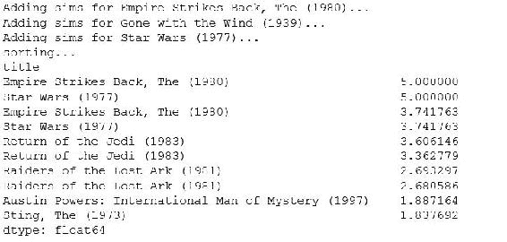

# 推荐系统

让我们来谈谈我个人的专业领域--“欧洲”推荐系统，也就是那些可以根据别人的所作所为向人们推荐东西的系统。 我们将看一些这方面的例子，以及几种实现这一点的方法。 具体地说，有两种技术称为基于用户的协作过滤和基于项目的协作过滤。 那么，让我们一头扎进去吧。

我职业生涯的大部分时间是在[Amazon.com](http://amazon.com)和[imdb.com](http://imdb.com)度过的，我在那里做的很多事情都是开发推荐系统；像*买这个的人也买了*，或者*给你推荐*，以及为人们做电影推荐的东西。 所以，这是我个人非常了解的事情，我希望能与大家分享其中的一些知识。 我们将逐步介绍以下主题：

*   什么是推荐系统？
*   基于用户的协同过滤
*   基于项目的协同过滤
*   寻找电影的相似之处
*   向人们推荐电影
*   改进推荐者的结果

# 什么是推荐系统？

嗯，就像我说的，亚马逊是一个很好的例子，也是我非常熟悉的一个例子。 因此，如果你去他们的推荐部分，如下图所示，你可以看到它会根据你过去在网站上的行为推荐你可能有兴趣购买的东西。


推荐系统可能包括你打分的东西，或者你买的东西，以及其他数据。 我不能透露细节，因为他们会追捕我，你知道，会对我做坏事。 但是，这是相当酷的。 你也可以把在亚马逊上购买功能的*人看作是推荐系统的一种形式。*

不同之处在于，你在亚马逊推荐页面上看到的推荐是基于你过去的所有行为，而购买了这个的人*也购买了*或*查看了这个的人也查看了*，诸如此类的东西，只是基于你现在正在看的东西，并向你展示与之相似的东西，你可能也会感兴趣。 而且，事实证明，无论如何，你现在正在做的事情可能是你感兴趣的最强烈的信号。

另一个示例来自 Netflix，如下图所示(下图是 Netflix 的截图)：


他们有各种各样的功能，根据你过去喜欢或看过的电影，尝试推荐新电影或其他你还没有看过的电影，并按类型进行细分。 他们对事物有一种不同的看法，他们试图找出他们认为你最喜欢的类型或类型的电影，然后向你展示这些类型的更多结果。 所以，这是另一个有效的推荐系统的例子。

它的全部意义在于帮助你发现一些你以前可能不知道的东西，所以这是相当酷的。 你知道，它给了个人电影、书籍、音乐或其他任何东西一个被以前可能从未听说过的人发现的机会。 所以，你知道，它不仅是很酷的技术，它还有点公平的竞争环境，并帮助新的项目被大众发现。 所以，它在当今社会扮演着非常重要的角色，至少我是这么认为的！ 有几种方法可以做到这一点，我们将在本章中介绍主要的方法。

# 基于用户的协同过滤

首先，让我们谈谈根据你过去的行为推荐一些东西。 有一种技术叫做基于用户的协作过滤，它的工作原理如下：

Collaborative filtering, by the way, is just a fancy name for saying recommending stuff based on the combination of what you did and what everybody else did, okay? So, it's looking at your behavior and comparing that to everyone else's behavior, to arrive at the things that might be interesting to you that you haven't heard of yet.

1.  这里的想法是，我们建立了一个矩阵，其中包含每个用户曾经购买、观看或评分的所有内容，或者任何您想要作为系统基础的感兴趣的信号。 因此，基本上，我们为系统中的每个用户安排了一行，该行包含了他们所做的所有可能表明他们对给定产品感兴趣的事情。 假设有一张表，我有行的用户，每列都是一项，好吗？ 这可能是一部电影，一个产品，一个网页，任何东西；你可以用它做很多不同的事情。
2.  然后，我使用该矩阵来计算不同用户之间的相似度。 因此，我基本上将每一行视为一个向量，我可以根据用户的行为计算每个向量之间的相似度。
3.  两个喜欢相同事物的用户彼此会非常相似，然后我可以根据这些相似分数对其进行排序。 如果我能根据用户过去的行为找到所有与你相似的用户，那么我就能找到与我最相似的用户，并推荐他们喜欢而我还没有看过的东西。

让我们来看一个真实的例子，它会更有意义一些：


让我们假设上图中这位善良的女士看了《星球大战》和《帝国反击战》，她很喜欢这两部电影。 所以，我们有一个用户向量，这位女士，给《星球大战》和《帝国反击战》打了 5 星的评分。

我们还可以说，前卫的莫霍克人先生来了，他只看了《星球大战》。 这是他唯一看过的东西，他还不知道帝国反击战，不知何故，他生活在一个奇怪的宇宙里，在那里他不知道实际上有很多很多星球大战电影，实际上每年都在增长。

当然，我们可以说，这位先生实际上和另一位女士很相似，因为他们都很喜欢《星球大战》，所以他们的相似性得分可能相当不错，我们可以说，好吧，好吧，这位女士享受到了什么他还没有看过的东西？ 《帝国反击战》就是其中之一，所以我们可以根据这两位用户对《星球大战》的喜好，得出这两位用户相似的信息，发现这位女士也喜欢《帝国反击战》，然后把它作为一个很好的推荐给埃德基·莫霍克曼先生。

然后我们可以向他推荐“帝国反击战”，他可能会喜欢，因为在我看来，这实际上是一部更好的电影！ 但我不会在这里和你打极客战争。

# 基于用户的协作过滤的局限性

现在，不幸的是，基于用户的协作过滤有一些局限性。 当我们思考人际关系，并根据物品和人之间的关系或诸如此类的东西来推荐东西时，我们的大脑倾向于人与人之间的关系。 因此，我们希望找到与您相似的人，并推荐他们喜欢的东西。 这是一种直观的做法，但不是最好的做法！ 以下是基于用户的协作过滤的一些限制列表：

*   一个问题是人们反复无常，他们的品味总是在变化。 所以，也许上一个例子中那位善良的女士经历了一个短暂的科幻动作片阶段，然后她克服了这一阶段，也许在她生命的后期，她开始更多地投身于电视剧、浪漫电影或浪漫喜剧。 那么，如果我那个急躁的莫霍克男人仅仅根据她早年的科幻时期就得到了和她高度相似的结果，而我们最终向他推荐了浪漫喜剧，会发生什么呢？ 那会很糟糕的。 我的意思是，从我们计算相似性分数的方式来看，有一些保护措施，但它仍然会污染我们的数据，人们的品味可能会随着时间的推移而改变。 因此，将人与人进行比较并不总是一件简单的事情，因为人是会变的。
*   另一个问题是，人通常比你的系统中的东西多得多，所以世界上有 70 亿人，而且还在继续计算，世界上可能没有 70 亿部电影，或者你可能会推荐的 70 亿个项目。 查找系统中所有用户之间的所有相似性的计算问题可能比查找系统中项目之间的相似性大得多。 因此，通过将系统的重点放在用户身上，你会让你的计算问题变得比实际需要的要难得多，因为你有很多用户，如果你为一家成功的公司工作，至少希望你会这样做。
*   最后一个问题是人们会做坏事。 有一个非常真实的经济动机来确保你的产品或你的电影或任何被推荐给人们的东西，有些人试图玩弄系统，让他们的新电影、新产品、或他们的新书或任何东西都能做到这一点。

It's pretty easy to fabricate fake personas in the system by creating a new user and having them do a sequence of events that likes a lot of popular items and then likes your item too. This is called a **shilling attack**, and we want to ideally have a system that can deal with that.

在基于用户的协作过滤中，有关于如何检测和避免这些先令攻击的研究，但一个更好的方法是使用一种完全不同的方法，这种方法不那么容易受到系统的影响。

这就是基于用户的协作过滤。 同样，这也是一个简单的概念--你根据用户的行为来观察他们之间的相似之处，并推荐用户喜欢的、你还没有见过的与你相似的东西。 现在，正如我们所说的那样，这确实有其局限性。 那么，让我们来讨论一下如何用一种叫做基于项目的协作过滤技术来颠覆这一切。

# 基于项目的协同过滤

现在，让我们尝试使用一种名为基于项目的协作过滤技术来解决基于用户的协作过滤中的一些缺点，我们将看到它如何才能更强大。 这实际上是亚马逊在幕后使用的技术之一，他们已经公开谈论过这一点，所以我可以告诉你这么多，但让我们看看为什么这是一个如此伟大的想法。 使用基于用户的协作过滤，我们的推荐基于人与人之间的关系，但如果我们将其颠倒过来，并基于项目之间的关系进行推荐，结果会怎样呢？ 这就是基于项目的协作过滤。

# 了解基于项目的协作过滤

这将借鉴一些真知灼见。 首先，我们谈到了人们的反复无常--他们的品味可能会随着时间的推移而改变，所以根据过去的行为将一个人与另一个人进行比较变得相当复杂。 人们有不同的阶段，他们有不同的兴趣，你可能不会把处于同一阶段的人相互比较。 但是，物品永远是任何东西。 电影永远是电影，它永远不会改变。 星球大战将永远是星球大战，直到乔治·卢卡斯稍微修改一下，但在很大程度上，物品不会像人一样改变。 因此，我们知道这些关系更持久，在计算物品之间的相似性时，你可以进行更多的直接比较，因为它们不会随着时间的推移而改变。

另一个好处是，你想推荐的东西通常比你推荐的人要少。 再说一次，世界上有 70 亿人，你可能没有在你的网站上提供 70 亿的东西来推荐给他们，所以你可以通过评估项目之间的关系而不是用户来节省大量的计算资源，因为你的项目可能会比你系统中的用户少。 这意味着您可以更频繁地运行您的推荐，使其更新、更新、更好！ 您可以使用更复杂的算法，因为您需要计算的关系较少，这是一件好事！

这也更难玩弄系统。 所以，我们谈到了玩弄基于用户的协作过滤方法是多么容易，只需创建一些虚假用户，喜欢一堆流行的东西，然后再创造出你想要推广的东西。 有了基于项目的协作过滤，这就变得困难得多。 你必须让系统认为物品之间存在关系，而且由于你可能没有能力根据许多其他用户创建与其他物品有虚假联系的假物品，因此玩基于物品的协作过滤系统要困难得多，这是一件好事。

当我谈到游戏系统的话题时，另一件重要的事情是确保人们用他们的钱投票。 避免先令攻击或人们试图玩弄你的推荐系统的一般技术，是确保信号行为是基于人们实际花钱的基础上的。 所以，当你把推荐建立在人们实际购买了什么，而不是他们看了什么或点击了什么的基础上，你总是会得到更好、更可靠的结果，好吗？

# 基于项目的协作过滤是如何工作的？

好的，让我们来谈谈基于项目的协作过滤是如何工作的。 它与基于用户的协作过滤非常相似，但我们关注的不是用户，而是项目。

那么，让我们回到电影推荐的例子。 我们要做的第一件事就是找出同一人看的每一对电影。 所以，我们仔细检查并找到每一部由相同的人观看的电影，然后我们测量所有观看这部电影的人彼此之间的相似性。 因此，通过这种方式，我们可以根据观看这两部电影的人的评分来计算两部不同电影之间的相似性。

那么，让我们假设我有一对电影，好吗？ 也许“星球大战”和“帝国”会反击。 我找到了一份所有看过这两部电影的人的名单，然后我将他们的评分进行了比较，如果他们相似，那么我可以说这两部电影是相似的，因为他们的评分都是由看过这两部电影的人得出的。 这就是这里的大意。 这是一种方法，有不止一种方法！

然后我可以根据电影对所有东西进行排序，然后根据所有相似电影的相似程度，我的结果是*人喜欢也喜欢*的人，或者*人给这个评分很高的人也给这个打了很高的分数*，以此类推。(T0)喜欢的人也喜欢，或者*的人也给这个打了很高的分数*，以此类推。 就像我说的，这只是一种方式。

这是基于项目的协作过滤的第一步--首先，我根据观看每对给定电影的人的关系来查找电影之间的关系。 当我们看一下下面的示例时，它会更有意义：


比方说，上图中我们这位年轻漂亮的女士看了《星球大战》和《帝国反击战》，对这两部电影都很喜欢，所以给他们打了五星之类的分数。 现在，前卫的莫霍克人先生出现了，他也看过《星球大战》和《帝国反击战》，也很喜欢这两部电影。 因此，在这一点上，我们可以说这是一种关系，基于这两个喜欢这两部电影的用户，星球大战和帝国反击战之间有一个相似之处。

我们要做的是看每一对电影。 我们有一对星球大战和帝国反击战，然后我们看看所有看过这两部电影的用户，就是这两个人，如果他们都喜欢他们，那么我们可以说他们彼此相似。 或者，如果他们都不喜欢他们，我们也可以说他们很相似，对吗？ 所以，我们只是看看这对电影中这两个用户与这两部电影相关的行为的相似度得分。

于是，Moustachy Lumberjack Hipster Man 先生出现了，他看着帝国反击，他生活在一个奇怪的世界，在那里他看着帝国反击，但他不知道星球大战第一部电影的存在。


很好，我们根据这两个人的行为计算了《帝国反击战》和《星球大战》之间的关系，所以我们知道这两部电影是相似的。 因此，鉴于希普斯特曼喜欢“帝国反击战”，我们可以很有信心地说，他也会喜欢“星球大战”，然后我们就可以把这部电影推荐给他作为他的首选电影。 如下图所示：


你可以看到，你最终得到的结果非常相似，但我们有点颠倒了整件事。 因此，我们没有把系统的重点放在人与人之间的关系上，而是把重点放在了物品之间的关系上，而这些关系仍然基于所有观看它们的人的聚合行为。 但从根本上说，我们关注的是物品之间的关系，而不是人与人之间的关系。 明白了?

# 使用 Python 进行协作过滤

好的，那我们开始吧！ 我们有一些 Python 代码将使用 Pandas，以及我们可以使用的所有其他工具，来用令人惊讶的少量代码来创建电影推荐。

我们要做的第一件事是在实践中向您展示基于项目的协作过滤。 所以，我们会建立*的人也看了*基本上，你知道，*的人对事物的评价也很高*，所以建立了这些电影和电影的关系。 因此，我们将以我们从电影镜头项目中获得的真实数据为基础。 所以，如果你去 MovieLens.org，那里实际上有一个开放的电影推荐系统，人们可以在那里给电影评分，并获得新电影的推荐。

而且，他们使所有潜在的数据对我们这样的研究人员都是公开的。 所以，我们将使用一些真实的电影评级数据--它有点过时了，大概有 10 年了，所以请记住这一点，但我们最终要使用的是真实的行为数据。 我们将用它来计算电影之间的相似度。 而且，这些数据本身也是有用的。 你可以用这些数据来表示*喜欢的人也喜欢*。 假设我正在看一部电影的网页。 然后系统会说：*如果你喜欢这部电影，考虑到你正在看它，你可能对它感兴趣，那么你可能也会喜欢这些电影*。 这就是推荐系统的一种形式，即使我们甚至不知道你是谁。

现在，这是真实世界的数据，所以我们会遇到一些真实世界的问题。 我们最初的一组结果看起来不会很好，所以我们会花一点额外的时间试图找出原因，这是你作为一名数据科学家花大量时间做的事情-纠正这些问题，然后回去再运行一次，直到我们得到有意义的结果。

最后，我们将全面进行基于项目的协作过滤，我们会根据个人的行为向他们推荐电影。 所以，让我们开始吧，让我们开始吧！

# 寻找电影的相似之处

让我们应用基于项目的协作过滤的概念。 首先，电影的相似性--找出哪些电影与其他电影相似。 尤其是，我们会根据用户评分数据，找出哪些电影与《星球大战》相似，然后看看我们能从中得到什么。 让我们潜入水中吧！

好的，让我们继续计算基于项目的协作过滤的前半部分，即寻找项目之间的相似性。 下载并打开`SimilarMovies.ipynb`文件。


在这种情况下，我们将基于用户行为来查看电影之间的相似性。 而且，我们将使用 GroupLens 项目中的一些真实的电影评级数据。 GroupLens.org 提供真实的电影评分数据，由真人使用[MovieLens.org](http://MovieLens.org)网站对电影进行评分，并获得他们想看的新电影的推荐。

我们已经将您需要的 GroupLens 数据集中的数据文件包含在课程材料中，我们需要做的第一件事是将这些数据文件导入到 Pandas DataFrame 中，我们将在这个示例中真正看到 Pandas 的全部功能。 这是相当酷的东西！

# 理解代码

我们要做的第一件事是将`u.data`文件作为 MovieLens 数据集的一部分导入，它是一个制表符分隔的文件，其中包含数据集中的所有评级。

```py
import pandas as pd 

r_cols = ['user_id', 'movie_id', 'rating'] 
ratings = pd.read_csv('e:/sundog-consult/packt/datascience/ml-100k/u.data',                        sep='\\t', names=r_cols, usecols=range(3)) 

```

请注意，您需要将此处的路径添加到计算机上存储下载的 MovieLens 文件的位置。 因此，它的工作方式是，即使我们在 Pandas 上调用`read_csv`，我们也可以指定不同于逗号的分隔符。 在这种情况下，它是一个标签。

我们基本上是说获取`u.data`文件中的前三列，并将其导入到一个新的 DataFrame 中，其中有三列：`user_id`、`movie_id`和`rating`。

我们在这里得到的是一个 DataFrame，每`user_id`都有一行，它标识了一些人，然后，对于他们评分的每一部电影，我们都有`movie_id`，这是对给定电影的一些数字缩写，所以《星球大战》可能是电影 53 或其他什么，他们的评级，你知道，1 到 5 星。 所以，我们这里有一个数据库，一个 DataFrame，记录每个用户和他们评分的每一部电影，好吗？

现在，我们希望能够处理电影片名，这样我们就可以更直观地解释这些结果，所以我们将使用它们的人类可读的名称。

如果你使用的是一个真正庞大的数据集，你应该把它保存到最后，因为你想要处理数字，它们更紧凑，尽可能长时间。 不过，出于示例和教学的目的，我们会保留标题，这样您就可以看到发生了什么。

```py
m_cols = ['movie_id', 'title'] 
movies = pd.read_csv('e:/sundog-consult/packt/datascience/ml-100k/u.item',                      sep='|', names=m_cols, usecols=range(2)) 

```

有一个单独的数据文件，其中包含名为`u.item`的 MovieLens 数据集，它以竖线分隔，我们导入的前两列将是该电影的`movie_id`和`title`。 因此，现在我们有了两个 DataFrame：`r_cols`拥有所有的用户评级，`m_cols`拥有每个`movie_id`的所有标题。 然后，我们可以使用熊猫中神奇的`merge`功能将它们混合在一起。

```py
ratings = pd.merge(movies, ratings) 

```

让我们添加一个`ratings.head()`命令，然后运行这些单元格。 我们最终得到的结果类似于下表。 那真是太快了！


我们最终得到一个新的 DataFrame，它包含用户评分的每一部电影的`user_id`和评级，我们同时拥有`movie_id`和`title`，我们可以读取并查看它的真实内容。 因此，读取的方法是`user_id`数字`308`给`Toy Story (1995)`电影`4`明星评级，`user_id`数字`287`给`Toy Story (1995)`电影`5`明星评级，以此类推。 而且，如果我们继续关注越来越多的 DataFrame，我们会看到不同电影的不同收视率。

现在，熊猫的真正魔力出现了。 所以，我们真正想要的是基于观看每一对电影的所有用户来看电影之间的关系，所以我们最后需要一个矩阵，包括每部电影和每一位用户，以及每一位用户给每一部电影的所有评分。 Pandas 中的`pivot_table`命令可以为我们做到这一点。 它基本上可以根据给定的 DataFrame 构造一个新表，几乎可以以您想要的任何方式构造。 为此，我们可以使用以下代码：

```py
movieRatings = ratings.pivot_table(index=['user_id'],                                   columns=['title'],values='rating') 
movieRatings.head() 

```

因此，我们使用此代码的意思是-将我们的收视率 DataFrame 创建一个名为`movieRatings`的新 DataFrame，我们希望它的索引是用户 ID，所以我们将为每个`user_id`创建一行，并且我们将使每一列都是电影的标题。(=。 因此，对于在 DataFrame 中遇到的每个标题，我们都将有一个列，并且每个单元格都将包含`rating`值(如果存在的话)。 那么，让我们继续运行它。

最后，我们得到了一个新的 DataFrame，如下表所示：


这对我们来说是多么令人惊讶的事情。 现在，您将看到一些`NaN`值，它代表**而不是一个数字**，这就是 Pandas 如何表示缺少的值。 所以，解释的方式是，`user_id`号`1`没有看电影`1-900 (1994)`，但是`user_id`号`1`确实看了`101 Dalmatians (1996)`，并给它打了`2`星。 `user_id`号`1`也看了`12 Angry Men (1957)`，给它打了`5`星，但是没有看电影，比如说`2 Days in the Valley (1996)`，好吗？ 所以，我们在这里得到的基本上是一个稀疏矩阵，它包含每个用户和每一部电影，在用户给电影评分的每个交叉点都有一个评分值。

所以，你现在可以看到，我们可以非常容易地提取用户观看的每一部电影的矢量，我们还可以提取每一位给给定电影评分的用户的矢量，这就是我们想要的。 因此，这对基于用户和基于项目的协作过滤都很有用，对吗？ 如果我想要找到用户之间的关系，我可以查看这些用户行之间的相关性，但是如果我想要找到电影之间的相关性，对于基于项目的协作过滤，我可以根据用户行为查看列之间的相关性。 因此，这就是真正的*颠覆用户与基于项目的相似性*发挥作用的地方。

现在，我们将使用基于项目的协作过滤，因此我们希望提取列，为此，让我们运行以下代码：

```py
starWarsRatings = movieRatings['Star Wars (1977)'] 
starWarsRatings.head() 

```

现在，在此帮助下，让我们继续提取评级为`Star Wars (1977)`的所有用户：


而且，我们可以看到，事实上，大多数人都看过`Star Wars (1977)`并给它打了分，每个人都喜欢它，至少在我们从 DataFrame 头部获取的这个小样本中是这样。 因此，我们最终得到了一组用户 ID 及其对`Star Wars (1977)`的评分。 用户 ID`3`没有给`Star Wars (1977)`评级，所以我们有一个`NaN`值，表示那里缺少一个值，但这没有关系。 我们希望确保保留那些缺失的值，以便可以直接比较不同电影中的列。 那么，我们该怎么做呢？

# Corrwith 函数

嗯，Pandas 为我们提供了方便，并且有一个`corrwith`函数，您可以在下面的代码中看到它，我们可以使用它：

```py
similarMovies = movieRatings.corrwith(starWarsRatings) 
similarMovies = similarMovies.dropna() 
df = pd.DataFrame(similarMovies) 
df.head(10) 

```

该代码将继续将给定列与 DataFrame 中的每隔一列进行关联，并计算关联分数并将其返回给我们。 所以，我们在这里做的是在整个`movieRatings`DataFrame 上使用`corrwith`，也就是整个用户电影评分矩阵，只将它与`starWarsRatings`列关联，然后用`dropna`删除所有缺失的结果。 因此，我们只剩下具有相关性的项目，其中有不止一个人查看它，我们基于这些结果创建一个新的 DataFrame，然后显示前 10 个结果。 所以，再说一遍，我只想重述一下：

1.  我们将在“星球大战”和其他所有电影之间建立关联度分数。
2.  去掉所有的`NaN`值，这样我们就只有实际存在的电影相似性，超过一个人给它打分。
3.  并且，我们将根据结果构造一个新的 DataFrame，并查看前 10 个结果。

下面是以下截图所示的结果：


我们最终得到了《星球大战》每部电影之间的相关性分数结果，例如，我们可以看到，与电影`'Til There Was You (1997)`的相关性分数高得令人惊讶，与电影`1-900 (1994)`的相关性是负的，而与`101 Dalmatians (1996)`的相关性非常弱。

现在，我们所要做的就是根据相似度得分进行排序，我们应该有星球大战中最相似的电影，对吗？ 我们就这么做吧。

```py
similarMovies.sort_values(ascending=False) 

```

只需在生成的 DataFrame 上调用`sort_values`，同样，Pandas 让它变得非常容易，我们可以说是`ascending=False`，实际上是按照相关性分数以相反的顺序进行排序。 所以，让我们这样做：


好的，所以`Star Wars (1977)`非常接近榜首，因为它和它本身很相似，但是这些其他的东西是什么呢？ 什么鬼东西？ 在前面的输出中，我们可以看到一些电影，例如：`Full Speed (1996)`、`Man of the Year (1995)`、`The Outlaw (1943)`。 这些都是，你知道，相当晦涩难懂的电影，其中大多数我甚至从未听说过，但它们与星球大战有着完美的关联。 这有点奇怪！ 所以，很明显我们做错了什么。 会是什么呢？

嗯，事实证明这是一个非常合理的解释，这是一个很好的教训，为什么当你完成任何一种数据科学任务时，你总是需要检查你的结果-质疑结果，因为通常你会遗漏一些东西，可能你需要清理你的数据中的一些东西，可能你做错了什么。 但你也应该始终对你的结果持怀疑态度，不要只相信它们，好吗？ 如果你这样做，你会有麻烦的，因为如果我真的把这些作为推荐给喜欢星球大战的人，我会被解雇的。 别被炒鱿鱼！ 注意你的成绩！ 因此，让我们深入了解下一节中的错误之处。

# 提高电影相似度的效果

让我们找出我们的电影相似之处出了什么问题。 我们做了所有这些激动人心的工作，根据电影的用户评分向量来计算电影之间的相关性分数，而我们得到的结果有点糟糕。 所以，提醒你一下，我们用这种方法寻找了类似于“星球大战”的电影，结果在最上面有一堆奇怪的推荐，它们有着完美的相关性。

而且，大多数都是非常晦涩难懂的电影。 你觉得那里可能会发生什么事？ 嗯，有一件事可能说得通，假设我们有很多人在看“星球大战”和其他一些晦涩难懂的电影。 我们最终会得到这两部电影之间很好的相关性，因为它们被星球大战联系在一起，但归根结底，我们真的想把我们的推荐建立在一两个看了一些默默无闻的电影的人的行为上吗？

可能不会！ 我的意思是，是的，世界上的两个人，或者不管它是什么，看了这部电影全速，除了星球大战，他们都喜欢它，也许这对他们来说是一个很好的推荐，但对世界其他地方来说可能不是一个好的推荐。 我们需要对我们的相似之处有某种程度的信心，强制规定有多少人观看了一部给定的电影的最低限度。 我们不能仅仅根据一两个人的行为来判断一部电影好不好。

因此，让我们尝试使用以下代码将这种洞察力付诸实践：

```py
import numpy as np 
movieStats = ratings.groupby('title').agg({'rating': [np.size, np.mean]}) 
movieStats.head() 

```

我们要做的就是找出那些实际上并没有被很多人评分的电影，然后把它们扔掉，看看我们能得到什么。 所以，要做到这一点，我们将采用原始的收视率 DataFrame，我们将会说`groupby('title')`，熊猫又一次拥有了各种各样的魔力。 而且，这基本上将构建一个新的 DataFrame，它将给定标题的所有行聚合到一行中。

我们可以说，我们希望具体汇总评分，并且我们希望显示每部电影的大小、评分数量和平均得分(该电影的平均评分)。 因此，当我们这样做时，我们最终得到如下结果：


这告诉我们，例如，对于电影`101 Dalmatians (1996)`，`109`人给这部电影打了分，他们的平均评分是 2.9 星，所以分数真的不是很高！ 所以，如果我们看看这些数据，我们可以说，好吧，我认为默默无闻的电影，比如`187 (1997)`，有`41`的评分，但`101 Dalmatians (1996)`，我听说过，你知道`12 Angry Men (1957)`，我听说过。 在 100 分左右的收视率似乎有一个自然的分界值，也许这就是事情开始变得有意义的魔力分界值。

让我们继续下去，去掉评分少于 100 人的电影，是的，你知道我在这一点上是凭直觉来做的。 正如我们稍后将讨论的，有更多原则性的方法来做到这一点，在这些方法中，你可以在不同的阈值上进行实验和训练/测试实验，以找到真正表现最好的那个。 但首先，让我们用我们的常识过滤掉评分不到 100 人的电影。 再说一次，熊猫让这件事变得非常容易。 让我们用下面的例子来解决这个问题：

```py
popularMovies = movieStats['rating']['size'] >= 100 
movieStats[popularMovies].sort_values([('rating', 'mean')], ascending=False)[:15] 

```

我们可以这样说，一个新的 DataFrame`popularMovies`将通过查看`movieStats`来构建，我们将只选取评级大小大于或等于`100`的行，然后我将根据`mean`评级对其进行排序，只是为了好玩，看看收视率最高、收视率最高的电影。


我们这里有一个超过 100 人评分的电影列表，根据他们的平均评分进行排序，这本身就是一个推荐系统。 这些都是收视率很高的热门电影。 `A Close Shave (1995)`显然，这是一部非常好的电影，很多人观看了它，他们真的很喜欢它。

再说一次，这是一个非常古老的数据集，来自 90 年代末，所以即使你可能不熟悉这部电影`A Close Shave (1995)`，也可能值得回去重新发现它；把它加到你的 Netflix 上！`Schindler's List (1993)`这并不令人惊讶，它在大多数顶级电影排行榜上都位居榜首。 `The Wrong Trousers (1993)`，这是一部默默无闻的电影的另一个例子，这部电影显然很好，也很受欢迎。 因此，仅仅通过这样做，那里就已经有了一些有趣的发现。

现在情况看起来好一点了，所以让我们继续进行我们的新的星球大战 DataFrame 推荐，类似于星球大战的电影，我们只根据这个新的 DataFrame 中出现的电影来推荐。 所以，我们将使用`join`操作，将原来的`similarMovies`DataFrame 加入到这个新的 DataFrame 中，这个新的 DataFrame 只包含收视率超过 100 的电影，好吗？

```py
df = movieStats[popularMovies].join(pd.DataFrame(similarMovies, columns=['similarity'])) 
df.head() 

```

在这段代码中，我们基于`similarMovies`创建一个新的 DataFrame，其中我们提取`similarity`列，将其与我们的`movieStats`DataFrame(即我们的`popularMovies`DataFrame)连接起来，然后查看合并的结果。 这就是我们的输出！


现在，仅限于评分超过 100 人的电影，我们才有了与《星球大战》相似的分数。 因此，现在我们需要做的就是使用以下代码对其进行排序：

```py
df.sort_values(['similarity'], ascending=False)[:15] 

```

在这里，我们对它进行反向排序，我们只需看一下前 15 个结果。 如果现在运行该命令，应该会看到以下内容：


这开始看起来好一点了！ 所以，`Star Wars (1977)`排在首位是因为它与自身相似，`The Empire Strikes Back (1980)`是 2 号，`Return of the Jedi (1983)`是 3 号，`Raiders of the Lost Ark (1981)`，4 号。你知道，它仍然不完美，但这些更有意义，对吗？ 所以，你可能会认为原版三部曲中的三部星球大战电影彼此相似，这个数据可以追溯到接下来的三部电影之前，而且`Raiders of the Lost Ark (1981)`在风格上也是一部与星球大战非常相似的电影，排在第四位。所以，我开始对这些结果感觉好一点了。 还有改进的余地，但是嘿！ 我们得到了一些有意义的结果，呼-呼！

现在，在理想的情况下，我们也会过滤掉星球大战，你不会想要寻找与你开始时的电影本身的相似之处，但我们稍后会担心这个问题！ 所以，如果你想多玩一点，就像我说的，100 是最低收视率的一个随意的界限。 如果您确实想尝试不同的截止值，我鼓励您回去这样做。 看看这对结果有什么影响。 你知道，你可以在上表中看到，我们真正喜欢的结果实际上有 100 多个共同的评分。 因此，我们最终得到了相当高的`Austin Powers: International Man of Mystery (1997)`评分，只有`130`评分，所以可能 100 分还不够高！`Pinocchio (1940)`偷偷进入`101`评分，与《星球大战》不太相似，所以，你可能想考虑更高的门槛，看看会有什么效果。

Please keep in mind too, this is a very small, limited dataset that we used for experimentation purposes, and it's based on very old data, so you're only going to see older movies. So, interpreting these results intuitively might be a little bit challenging as a result, but not bad results.

现在让我们继续进行全面的基于项目的协作过滤，我们使用一个更完整的系统向人们推荐电影，我们下一步要做的就是这样做。

# 向人们推荐电影

好的，让我们实际建立一个成熟的推荐系统，它可以查看系统中每个人的所有行为信息，以及他们评分的电影，并使用这些信息为我们数据集中的任何给定用户制作最好的推荐电影。 有点令人惊讶，你会惊讶于它是多么的简单。 我们走吧!

让我们开始使用`ItemBasedCF.ipynb`文件，并从导入已有的 MovieLens 数据集开始。 同样，我们现在使用的是它的一个子集，它只包含 10 万个收视率。 但是，你可以从 GroupLens.org 获得更大的数据集-高达数百万的评分；如果你愿意的话。 但请记住，当你开始处理真正的大数据时，你会突破你在一台机器上可以做的事情和熊猫可以处理的极限。 不再赘述，下面是第一段代码：

```py
import pandas as pd 

r_cols = ['user_id', 'movie_id', 'rating'] 
ratings = pd.read_csv('e:/sundog-consult/packt/datascience/ml-100k/u.data',                            sep='\t', names=r_cols, usecols=range(3)) 

m_cols = ['movie_id', 'title'] 
movies = pd.read_csv('e:/sundog-consult/packt/datascience/ml-100k/u.item',                      sep='|', names=m_cols, usecols=range(2)) 

ratings = pd.merge(movies, ratings) 

ratings.head() 

```

与前面一样，我们将导入`u.data`文件，该文件包含每个用户的所有个人评分以及他们评分的电影，然后将其与电影标题绑定在一起，这样我们就不必只使用数字电影 ID 了。 继续点击 Run 单元格按钮，我们将得到以下 DataFrame。


例如，读取的方法是`user_id`数字`308`被评为`Toy Story (1995)``4`星，而`user_id`数字`66`被评为`Toy Story (1995)``3`星。 而且，这将包含每个用户、每部电影的每个分级。

同样，就像前面一样，我们在 Pandas 中使用非常棒的`pivot_table`命令根据信息构造一个新的 DataFrame：

```py
userRatings = ratings.pivot_table(index=['user_id'],                                  columns=['title'],values='rating') 
userRatings.head() 

```

这里，每一行都是`user_id`，列由我的数据集中所有唯一的电影标题组成，每个单元格都包含一个评级：


我们最终得到的是前面输出中显示的这个非常有用的矩阵，它包含每行的用户和每列的电影。 这个矩阵中的每一部电影，我们基本上都有每个用户的评分。 例如，`user_id`数字`1`给了`101 Dalmatians (1996)`2 星级评级。 而且，所有这些`NaN`值都表示丢失的数据。 因此，这只是表明，例如，`user_id`数字`1`没有给电影`1-900 (1994)`评分。

再说一次，这是一个非常有用的矩阵。 如果我们做的是基于用户的协作过滤，我们可以计算每个单独的用户评分向量之间的相关性，以找到相似的用户。 因为我们正在进行基于项目的协作过滤，所以我们对列之间的关系更感兴趣。 例如，在任意两列之间计算相关性分数，这将给出给定电影对的相关性分数。 那么，我们该怎么做呢？ 事实证明，熊猫也让这件事变得非常容易。

它有一个内置的`corr`函数，可以实际计算在整个矩阵中找到的每个列对的相关分数-几乎就像他们在考虑我们一样。

```py
corrMatrix = userRatings.corr() 
corrMatrix.head() 

```

让我们继续运行前面的代码。 这是一件计算量相当大的事情，所以需要一段时间才能真正得出结果。 但是，这就是我们要说的！


那么，我们在前面的输出中得到了什么呢？ 我们这里有一个新的 DataFrame，其中每一部电影都在行和列中。 因此，我们可以查看任意两部给定电影的交集，并根据我们最初在这里获得的`userRatings`数据找出它们之间的相关性分数。 多酷啊？ 例如，电影`101 Dalmatians (1996)`当然与其自身完全相关，因为它具有相同的用户评分向量。 但是，如果你看看`101 Dalmatians (1996)`电影和`12 Angry Men (1957)`电影的关系，它的相关性分数要低得多，因为这两部电影非常不同，这是有道理的，对吗？

我现在有了这个奇妙的矩阵，它可以给我任何两部电影彼此之间的相似度得分。 这有点令人惊讶，对我们将要做的事情非常有用。 现在，就像前面一样，我们必须处理虚假的结果。 所以，我不想看那些建立在少量行为信息基础上的关系。

事实证明，Pandas`corr`函数实际上有几个您可以给它提供的参数。 一种是您想要使用的实际相关计分方法，所以我会说使用`pearson`相关性。

```py
corrMatrix = userRatings.corr(method='pearson', min_periods=100) 
corrMatrix.head() 

```

你会注意到它还有一个你可以给它的`min_periods`参数，基本上就是说我只想让你考虑相关分数，在这个例子中，至少有 100 个人给这两部电影评分。 运行它将消除仅仅建立在少数人基础上的虚假关系。 以下是我们在运行代码后获得的矩阵：


这与我们在项目相似性练习中所做的略有不同，在项目相似性练习中，我们只是丢弃了所有评分低于 100 人的电影。 我们在这里做的是，剔除那些不到 100 人给这两部电影打分的电影相似之处，好吗？ 因此，您可以在前面的矩阵中看到，我们有更多的`NaN`值。

事实上，即使是与自己相似的电影也会被扔掉，例如，电影`1-900 (1994)`大概只有不到 100 人观看，所以它完全被扔掉了。 然而，这部电影`101 Dalmatians (1996)`的相关性得分为`1`，在这个数据集的小样本中，实际上没有一部电影是彼此不同的，有 100 个共同观看了这两部电影的人。 但是，有足够多的电影存活下来，以获得有意义的结果。

# 用一个例子来理解电影推荐

那么，我们如何处理这些数据呢？ 嗯，我们想做的是给人们推荐电影。 我们这样做的方式是，我们查看一个特定人的所有评分，找到与他们评分的东西相似的电影，这些电影都是推荐给该人的候选影片。

让我们从创建一个虚假的人开始，为其创建推荐。 实际上，我已经手动向我们正在处理的 MovieLens 数据集中添加了一个假用户，ID 号`0`。 您可以使用以下代码看到该用户：

```py
myRatings = userRatings.loc[0].dropna() 
myRatings 

```

这将提供以下输出：


这有点像我这样的人，喜欢《星球大战》和《帝国反击战》，但讨厌电影《乱世佳人》。 所以，这代表了一个真正喜欢星球大战，但不喜欢老式浪漫电视剧的人，好吗？ 因此，我给`The Empire Strikes Back (1980)`和`Star Wars (1977)`打了`5`星，给`Gone with the Wind (1939)`打了`1`星。 所以，我要试着为这个虚构的用户寻找推荐。

那么，我该怎么做呢？ 那么，让我们从创建一个名为`simCandidates`的系列开始，我会仔细检查我评分的每一部电影。

```py
simCandidates = pd.Series() 
for i in range(0, len(myRatings.index)): 
    print "Adding sims for " + myRatings.index[i] + "..." 
    # Retrieve similar movies to this one that I rated 
    sims = corrMatrix[myRatings.index[i]].dropna() 
    # Now scale its similarity by how well I rated this movie 
    sims = sims.map(lambda x: x * myRatings[i]) 
    # Add the score to the list of similarity candidates 
    simCandidates = simCandidates.append(sims) 

#Glance at our results so far: 
print "sorting..." 
simCandidates.sort_values(inplace = True, ascending = False) 
print simCandidates.head(10) 

```

对于范围`0`中的`i`到我在`myRatings`中的分级数，我会将类似的电影与我分级的电影相加。 因此，我将使用`corrMatrix`DataFrame，这个神奇的数据帧具有所有电影的相似性，我将使用`myRatings`创建一个相关性矩阵，删除所有缺失的值，然后我将根据我对电影的评分来衡量得出的相关性分数。

所以，这里的想法是，我要把“帝国反击战”的所有相似之处都做一遍，比如，我会把它都放大 5 倍，因为我真的很喜欢“帝国反击战”。 但是，当我浏览并得到《乱世佳人》的相似之处时，我只会把它们加 1，因为我不喜欢《乱世佳人》。 所以，这会给和我喜欢的电影相似的电影更多的力量，给和我不喜欢的电影相似的电影更少的力量，好吗？

所以，我只是浏览并建立了这个相似候选人的列表，如果你愿意的话，推荐候选人，对结果进行排序，并将它们打印出来。 让我们看看我们得到了什么：



嘿，那些看起来还不错，对吧？ 因此，很明显，`The Empire Strikes Back (1980)`和`Star Wars (1977)`位居榜首，因为我明确地喜欢这些电影，我已经看过它们并给它们打分了。 但是，排在榜首的是`Return of the Jedi (1983)`，这是我们预期的和`Raiders of the Lost Ark (1981)`。

让我们开始进一步细化这些结果。 我们看到我们得到了重复的值。 如果我们有一部电影与我评分的不止一部电影相似，它将在结果中返回不止一次，所以我们希望将它们结合在一起。 如果我真的有同样的电影，也许应该加在一起，形成一个综合的，更强的推荐分数。 例如，“绝地归来”类似于“星球大战”和“帝国反击战”。 我们要怎么做呢？

# 使用 GROUPBY 命令合并行

我们将继续探索这一点。 我们将再次使用`groupby`命令将同一电影的所有行组合在一起。 接下来，我们将汇总它们的相关性分数，并查看结果：

```py
simCandidates = simCandidates.groupby(simCandidates.index).sum() 
simCandidates.sort_values(inplace = True, ascending = False) 
simCandidates.head(10) 

```

结果如下：


嘿，这看起来真的很棒！

所以`Return of the Jedi (1983)`以 7 分高居榜首，`Raiders of the Lost Ark (1981)`以 5 分紧随其后，然后我们开始看`Indiana Jones and the Last Crusade (1989)`，还有更多的电影，`The Bridge on the River Kwai (1957)`，`Back to the Future (1985),``The Sting (1973`)。 这些都是我真正喜欢看的电影！ 你知道，我其实也喜欢老式的迪士尼电影，所以`Cinderella (1950)`并不像看起来那么疯狂。

我们需要做的最后一件事是过滤掉我已经评分过的电影，因为推荐你已经看过的电影是没有意义的。

# 使用 DROP 命令删除条目

因此，我可以使用以下代码快速删除恰好在原始评级系列中的任何行：

```py
filteredSims = simCandidates.drop(myRatings.index) 
filteredSims.head(10) 

```

运行它将让我看到最终的前 10 名结果：


现在我们有了它！`Return of the Jedi (1983)`，`Raiders of the Lost Ark (1981)`，`Indiana Jones and the Last Crusade (1989)`，所有关于我的虚拟用户的排名靠前的结果，它们都是有意义的。 我正在看一些适合家庭的电影，你知道，`Cinderella (1950)`，`The Wizard of Oz (1939)`，`Dumbo (1941)`，悄悄进入，可能是基于《乱世佳人》的存在，尽管它是向下加权的，它仍然在那里，而且还在计算中。 现在我们有了我们的结果，所以。 这就对了！ 相当酷！

我们实际上已经为给定用户生成了推荐，并且我们可以为整个 DataFrame 中的任何用户生成推荐。 所以，如果你想的话就去玩吧。 我还想谈谈如何让你的手变得更脏一点，并利用这些结果；试着改进它们。

这是一门艺术，你知道，你需要不断重复和尝试不同的想法和不同的技术，直到你得到越来越好的结果，而且你几乎可以永远这样做。 我是说，我用它做了整个职业生涯。 所以，我不指望你在接下来的 10 年里像我一样尝试完善这一点，但有一些简单的事情你可以做，所以让我们来谈谈这一点。

# 改进推荐结果

作为一项练习，我想挑战你去把这些建议做得更好。 所以，让我们谈谈我的一些想法，也许你也会有一些你自己的想法，你可以实际尝试和试验；亲手动手，试着做出更好的电影推荐。

好的，这些推荐结果还有很大的改进空间。 我们做出了很多决定，关于如何根据你对该项目的评分来权衡不同的推荐结果，或者你想为给两部给定电影评分的最低人数选择什么门槛。 所以，有很多东西你可以调整，有很多不同的算法你可以尝试，你可以从试图从系统中做出更好的电影推荐中获得很多乐趣。 所以，如果你觉得自己能胜任，我向你发起挑战，让你去做这件事！

以下是一些关于如何实际尝试改进本章中的结果的想法。 首先，您可以继续操作`ItembasedCF.ipynb`文件并对其进行修补。 例如，我们看到相关方法实际上有一些用于相关性计算的参数，我们在示例中使用了 Pearson，但还有其他参数，您可以查看并试用，看看它对结果有什么影响。 我们使用的最小周期值是 100，可能太高了，也可能太低了；我们只是随意选择了它。 如果你使用这种价值会发生什么？ 例如，如果你降低这个数字，我希望你看一些你可能从未听说过的新电影，但对那个人来说可能仍然是一个很好的推荐。 或者，如果你把它调得更高，你会发现，你除了大片什么都不知道。

有时你必须考虑你想要的推荐系统的结果是什么。 在给人们放映他们听过的电影和没听过的电影之间，有没有一个很好的平衡？ 对于这些人来说，发现新电影与通过看了很多他们听说过的电影而对推荐系统有信心相比，有多重要呢？ 再说一次，这是一种艺术。

尽管我不喜欢《乱世佳人》，但我们还可以在结果中看到很多与《乱世佳人》相似的电影，这一点我们也可以改进。 你知道，我们对这些结果的权重低于我喜欢的电影的相似度，但也许那些电影实际上应该受到惩罚。 如果我那么讨厌《乱世佳人》，也许《乱世佳人》和《绿野仙踪》的相似之处应该受到惩罚，你知道的，他们的得分应该降低，而不是提高。

这是另一个简单的修改，您可以随意修改。 我们的用户评分数据集中可能有一些离群值，如果我扔掉那些评分高得离谱的人怎么办？ 也许他们在歪曲一切。 你可以试着识别这些用户，然后把他们扔出去，这是另一个想法。 而且，如果你真的想要一个大项目，如果你真的想埋头做这件事，你可以通过使用训练/测试技术来评估这个推荐引擎的结果。 那么，如果不是让一个任意的推荐分数来汇总每部电影的相关性分数，而是实际上将其缩小到每部给定电影的预测评级，那会怎么样呢？

如果我的推荐系统的输出是一部电影和我对这部电影的预测评分，在训练/测试系统中，我实际上可以试着计算出我预测用户实际上看过和评分过的电影的准确度有多高？ 好吧?。 所以，我可以把一些评分数据放在一边，看看我的推荐系统能多好地预测用户对这些电影的评分。 而且，这将是一个量化和原则性的方式来衡量这个推荐引擎的误差。 但是，再说一次，这是一门艺术，而不是一门科学。 尽管 Netflix 奖实际上使用的是他们特别使用的误差度量，称为均方根误差，但这真的是一个好的推荐系统的衡量标准吗？

基本上，你是在衡量你的推荐系统预测一个人已经看过的电影的评级的能力。 但是，推荐引擎的目的难道不是推荐一个人没有看过的、他们可能喜欢的电影吗？ 这是两码事。 所以不幸的是，测量你真正想要测量的东西并不是很容易。 所以，有时候，你确实需要听从你的直觉。 而且，衡量推荐引擎结果的正确方式是衡量你试图通过它推广的结果。

也许我是想让人们看更多的电影，或者给新电影打更高的分，或者买更多的东西。 在一个真实的网站上运行实际的受控实验将是优化这一点的正确方式，而不是使用列车/测试。 所以，你知道，我在那里讲得比我应该讲的更详细一些，但教训是，你不能总是白纸黑字地思考这些事情。 有时候，你不能直接和定量地测量事物，你必须使用一点常识，这就是一个例子。

无论如何，这些都是关于如何返回并改进我们写的推荐引擎的结果的一些想法。 所以，请随意摆弄它，看看你是否可以随意改进它，并从中获得一些乐趣。 这实际上是这本书中非常有趣的一部分，所以我希望你喜欢它！

# 简略的 / 概括的 / 简易判罪的 / 简易的

所以，去试一试吧！ 看看你能不能在我们初步结果的基础上改进一下。 有一些简单的想法可以试着让这些建议变得更好，也有一些复杂得多的想法。 现在，答案没有对错；我不会要求你们交出你们的作品，我也不会评论你们的作品。 你知道，你决定玩弄它，熟悉它，进行实验，看看你会得到什么结果。 这就是重点-只是让您更熟悉使用 Python 来处理这类事情，并更熟悉基于项目的协作过滤背后的概念。

在这一章中，我们研究了不同的推荐系统--我们排除了基于用户的协作过滤系统，而直接进入了基于项目的系统。 然后我们使用了熊猫的各种功能来生成和改进我们的结果，我希望你已经看到了熊猫的力量。

在下一章中，我们将介绍更高级的数据挖掘和机器学习技术，包括 K 近邻。 我期待着向您解释这些内容，看看它们是如何有用的。