# 九、Apache Spark——关于大数据的机器学习

到目前为止，在这本书中，我们已经讨论了很多可以在您的数据科学职业生涯中使用的通用数据挖掘和机器学习技术，但它们都在您的桌面上运行。 因此，使用 Python 和 SCRICKIT-LEARN 等技术，您只能运行一台机器能够处理的尽可能多的数据。

现在，每个人都在谈论大数据，你很可能正在为一家确实有大数据要处理的公司工作。 大数据意味着你不能真正控制所有的东西，你不能真正在一个系统上解决所有的问题。 你需要实际使用整个云的资源，一个计算资源集群来计算它。 这就是Apache·斯帕克的用武之地。 Apache Spark 是一个非常强大的工具，用于管理大数据，并对大数据集进行机器学习。 在本章结束时，您将深入了解以下主题：

*   安装和使用 Spark
*   **弹性分布式数据集**(**RDDS**)
*   **MLlib**(**机器学习库**)
*   Spark 中的决策树
*   Spark 中的 K-均值聚类

# 安装 Spark

在本节中，我将让您使用 Apache Spark 进行设置，并向您展示一些实际使用 Apache Spark 来解决一些问题的示例，这些问题与我们过去在本书中使用一台计算机解决的问题相同。 我们需要做的第一件事是在您的计算机上设置 Spark。 因此，在接下来的几节中，我们将向您介绍如何做到这一点。 这是非常直截了当的事情，但也有一些问题。 因此，不要跳过这些部分；要使 Spark 成功运行，特别是在 Windows 系统上，需要特别注意几件事。 让我们在您的系统上设置 Apache Spark，这样您就可以真正开始使用它了。

目前，我们将仅在您自己的桌面上运行此程序。 但是，我们在本章将要编写的相同程序可以在实际的 Hadoop 集群上运行。 因此，您可以使用我们在本地桌面上以 Spark 独立模式编写并运行的这些脚本，并实际从实际 Hadoop 群集的主节点运行它们，然后让它扩展到 Hadoop 群集的全部功能，并以这种方式处理海量数据集。 尽管我们将设置为在您自己的计算机上本地运行，但请记住，这些相同的概念也将向上扩展到在集群上运行。

# 在 Windows 上安装 Spark

在 Windows 上安装 Spark 涉及几个步骤，我们将在这里引导您完成这些步骤。 我只是假设您使用的是 Windows，因为大多数人在家里使用这本书。 稍后我们将讨论一下如何处理其他操作系统。 如果您已经熟悉了在计算机上安装程序和处理环境变量，那么您只需拿出下面的小诀窍就可以去做了。 如果您不太熟悉 Windows 的内部结构，我将在接下来的几节中一步一步地向您介绍。 以下是针对 Windows 专业人士的快速步骤：

1.  **安装 JDK**：您需要首先安装 JDK，这是一个 Java 开发工具包。 如果需要的话，你可以去 Sun 的网站下载并安装它。 我们需要 JDK，因为尽管我们在本课程中将使用 Python 进行开发，但它会在幕后转换为 Scala 代码，而 Spark 就是在本地开发的。 而 Scala 则在 Java 解释器之上运行。 因此，为了运行 Python 代码，您需要一个 Scala 系统，该系统将作为 Spark 的一部分默认安装。 此外，我们需要 Java，或者更具体地说，需要 Java 的解释器来实际运行 Scala 代码。 这就像一块技术层蛋糕。
2.  **安装 Python**：显然您将需要 Python，但是如果您已经读到书中的这一点，那么您应该已经设置了一个 Python 环境，很有可能是使用 EnThink Canopy。 所以，我们可以跳过这一步。
3.  **安装适用于 Hadoop 的 Spark 预建版本**：幸运的是，Apache 网站提供了 Spark 的预建版本，这些版本开箱即用，是为最新的 Hadoop 版本预编译的。 您不需要构建任何东西，您只需将其下载到您的计算机上，并将其粘贴到正确的位置，就可以很好地完成大部分工作。
4.  **创建一个 conf/log4j.properties 文件**：我们有一些配置事项需要处理。 我们要做的一件事是调整警告级别，这样我们在运行作业时就不会收到一堆警告垃圾邮件。 我们将详细讲解如何做到这一点。 基本上，您需要重命名其中一个属性文件，然后调整其中的错误设置。
5.  **添加一个 SPARK_HOME 环境变量**：接下来，我们需要设置一些环境变量，以确保您可以从您可能拥有的任何路径实际运行 SPARK。 我们将添加一个 SPARK_HOME 环境变量，指向您安装 Spark 的位置，然后将`%SPARK_HOME%\bin`添加到您的系统路径中，以便当您运行 Spark Submit 或 PySpark 或任何您需要的 Spark 命令时，Windows 将知道在哪里可以找到它。
6.  **设置 HADOOP_HOME 变量**：在 Windows 上，我们还有一件事需要做，我们还需要设置一个`HADOOP_HOME`变量，因为即使您没有在独立系统上使用 Hadoop，它也会期望找到一点 Hadoop。
7.  **安装 winutils.exe**：最后，我们需要安装一个名为`winutils.exe`的文件。 在本书的资源中有一个指向`winutils.exe`的链接，因此您可以在那里找到它。

如果您想更详细地介绍这些步骤，可以参考下面的部分。

# 在其他操作系统上安装 Spark

关于在其他操作系统上安装 Spark 的快速说明：基本上相同的步骤也适用于它们。 主要区别在于您如何在系统上设置环境变量，以便在您登录时自动应用这些变量。 这将因操作系统的不同而有所不同。 MacOS 的工作方式与 Linux 的各种版本不同，因此您必须至少稍微熟悉一下 Unix 终端命令提示符的使用，以及如何操作您的环境来实现这一点。 但大多数进行开发的 MacOS 或 Linux 用户已经掌握了这些基础知识。 当然，如果不是在 Windows 上，也不需要`winutils.exe`。 因此，这些就是在不同操作系统上安装的主要区别。

# 安装 Java 开发工具包

要安装 Java Development Kit，请返回浏览器，打开一个新选项卡，然后搜索`jdk`(Java Development Kit 的缩写)。 这将把您带到 Oracle 站点，您可以从该站点下载 Java：


在 Oracle 网站上，单击 JDK 下载。 现在，单击 Accept License Agreement(接受许可协议)，然后可以选择适用于您的操作系统的下载选项：


对我来说，它将是 64 位的 Windows，等待 198MB 的 Good 才能下载：


下载完成后，找到安装程序并启动其运行。 请注意，在这里我们不能只接受 Windows 安装程序中的默认设置。 这是一个特定于 Windows 的解决方法，但在撰写本书时，Spark 的当前版本是 2.1.1，结果发现 Spark 2.1.1 在 Windows 上的 Java 上存在问题。 问题是，如果您将 Java 安装到的路径中包含空格，它将无法工作，因此我们需要确保将 Java 安装到没有空格的路径中。 这意味着即使您已经安装了 Java，也不能跳过这一步，所以让我向您展示如何做到这一点。 在安装程序上，单击 Next，您将看到，如下面的屏幕所示，它希望默认安装到`C:\Program Files\Java\jdk`路径，无论版本是什么：


`Program Files`路径中的空格会带来麻烦，所以让我们单击更改...。 按钮并安装到`c:\jdk`，这是一个很好的简单路径，易于记忆，并且其中没有空格：

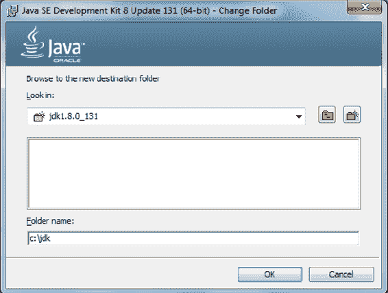

现在，它还想安装 Java Runtime 环境，所以为了安全起见，我还打算将其安装到没有空格的路径。

在 JDK 安装的第二步，我们应该在屏幕上显示以下内容：


我还将更改该目标文件夹，并为此创建一个名为`C:\jre`的新文件夹：


好的，安装成功。 喔！

现在，您需要记住我们安装 JDK 的路径，在我们的例子中是`C:\jdk`。 我们在这里还有几步要走。 接下来，我们需要安装 Spark 本身。

# 安装 Spark

让我们回到这里的一个新浏览器选项卡，转到[spk.apache.org](http://spark.apache.org)，然后单击 Download Spark 按钮：


现在，我们在本书中使用了 Spark 2.1.1，但是任何 2.0 以上的版本都应该可以很好地工作。


确保您获得的是预置版本，并选择 Direct Download(直接下载)选项，这样所有这些默认设置都是完美的。 继续，单击说明编号 4 旁边的链接下载该软件包。

现在，它下载一个您可能不熟悉的**TGZ**(GZip 中的**Tar)文件。 老实说，对于 Spark 来说，Windows 在某种程度上是事后才想到的，因为在 Windows 上，你不会有一个内置的实用程序来实际解压缩 TGZ 文件。 这意味着您可能需要安装一个，如果您还没有安装的话。 我使用的是 WinRAR，您可以从[www.rarlab.com](http://www.rarlab.com)获取它。 如果需要，请转到下载页面，下载 WinRAR 32 位或 64 位安装程序，具体取决于您的操作系统。 正常安装 WinRAR，这将允许您在 Windows 上实际解压缩 TGZ 文件：**

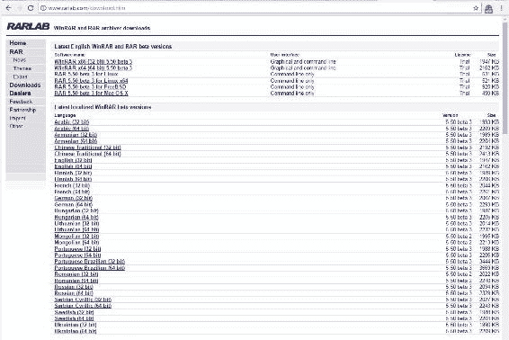

因此，让我们继续解压 TGZ 文件。 我将打开我的`Downloads`文件夹，找到我们下载的 Spark 归档文件，然后继续右键单击该归档文件，并将其解压到我选择的文件夹中--现在我只打算将其放在我的`Downloads`文件夹中。 在这一点上，WinRAR 再次为我做这件事：


因此，我现在应该在我的`Downloads`文件夹中有一个与该包相关联的文件夹。 让我们打开它，这就是 Spark 本身。 您应该会看到类似如下所示的文件夹内容。 因此，您需要将其安装在您可以记住的位置：


显然您不想将其留在`Downloads`文件夹中，所以让我们继续在这里打开一个新的文件资源管理器窗口。 我转到我的`C`驱动器并创建了一个新文件夹，我们将其命名为`spark`。 所以，我的 Spark 装置将会在`C:\spark`。 再说一次，很容易记住。 打开那个文件夹。 现在，我返回到我下载的`spark`文件夹，使用*Ctrl*+*A*选择 Spark 分发中的所有内容，使用*Ctrl*+*C*复制它，然后返回到我想要放置它的`C:\spark`，使用*Ctrl*+*V*粘贴它：


记住粘贴的是`spark`文件夹的内容，而不是`spark`文件夹本身，这一点非常重要。 所以，我现在应该拥有我的`C`驱动器和一个`spark`文件夹，其中包含 Spark 发行版中的所有文件和文件夹。

嗯，我们还需要配置一些东西。 因此，当我们在`C:\spark`中时，让我们打开`conf`文件夹，为了确保我们不会被日志消息垃圾邮件打死，我们将在这里更改日志记录级别设置。 因此，要执行此操作，请右键单击`log4j.properties.template`文件并选择 Rename：


删除文件名的`.template`部分，使其成为实际的`log4j.properties`文件。 Spark 将使用此命令配置其日志记录：


现在，在某种文本编辑器中打开此文件。 在 Windows 上，您可能需要右键单击此处并选择打开方式，然后选择写字板。 在文件中，找到`log4j.rootCategory=INFO`：


让我们将其更改为`log4j.rootCategory=ERROR`，这样可以消除运行程序时打印出的所有垃圾日志的杂乱无章。 保存文件，然后退出编辑器。

到目前为止，我们安装了 Python、Java 和 Spark。 现在，我们需要做的下一件事是安装一些可以欺骗您的 PC 以为 Hadoop 存在的东西，同样，这一步只在 Windows 上是必要的。 因此，如果您使用的是 Mac 或 Linux，则可以跳过这一步。

我有一个小文件可以用来解决这个问题。 让我们转到[http://media.sundog-soft.com/winutils.exe](http://media.sundog-soft.com/winutils.exe)。 下载`winutils.exe`将为您提供一小段可执行文件的副本，这可以用来欺骗 Spark，使其认为您实际上拥有 Hadoop：


现在，由于我们将在本地桌面上运行脚本，这没什么大不了的，我们不需要真正安装 Hadoop。 这正好绕过了在 Windows 上运行 Spark 的另一个怪癖。 现在，我们有了它，让我们在`Downloads`文件夹中找到它，*Ctrl*+*C*复制它，然后转到我们的`C`驱动器，为它创建一个居住的地方：


因此，在根`C`驱动器中再次创建一个新文件夹，我们将其命名为`winutils`：


现在，让我们打开这个`winutils`文件夹，并在其中创建一个`bin`文件夹：


现在，在这个`bin`文件夹中，我希望您粘贴我们下载的`winutils.exe`文件。 因此，您应该有`C:\winutils\bin`，然后是`winutils.exe`：


下一步仅在某些系统上是必需的，但为了安全起见，请在 Windows 上打开命令提示符。 你可以进入开始菜单，进入 Windows 系统，然后点击命令提示符。 在这里，我希望您键入`cd c:\winutils\bin`，这是我们粘贴`winutils.exe`文件的位置。 现在，如果您键入`dir`，您应该会在那里看到该文件。 现在键入`winutils.exe chmod 777 \tmp\hive`。 这只是确保您实际成功运行 Spark 所需的所有文件权限都已到位，没有任何错误。 现在您可以关闭命令提示符，因为您已经完成了该步骤。 哇，信不信由你，我们差不多做完了。

现在我们需要设置一些环境变量才能正常工作。 我将向您展示如何在 Windows 上做到这一点。 在 Windows 10 上，您需要打开开始菜单，然后转到 Windows 系统|控制面板以打开控制面板：

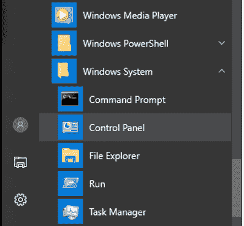

在控制面板中，单击系统和安全：


然后，单击 System(系统)：


然后从左侧列表中单击高级系统设置：


在此处，单击环境变量...：


我们将获得以下选项：

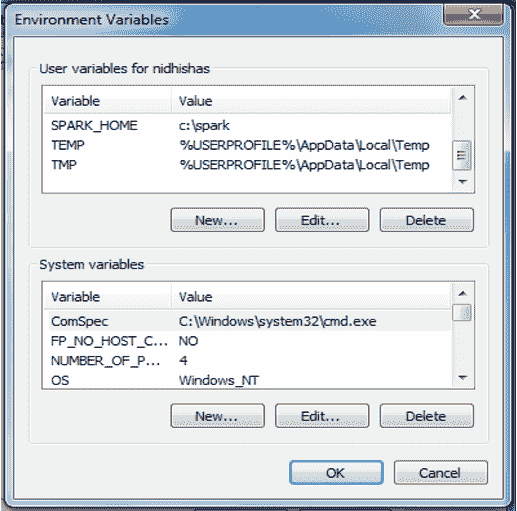

现在，这是一种非常特定于 Windows 的设置环境变量的方法。 在其他操作系统上，您将使用不同的进程，因此您必须考虑如何在它们上安装 Spark。 在这里，我们将设置一些新的用户变量。 单击第一个新建...。 按钮，并将其命名为`SPARK_HOME`，如下所示，全部大写。 这将指向我们安装 Spark 的位置，对我们来说是`c:\spark`，因此键入该变量作为变量值，然后单击 OK：


我们还需要设置`JAVA_HOME`，因此请单击新建...。 再次输入`JAVA_HOME`作为变量名。 我们需要将其指向我们安装 Java 的位置，对我们来说是`c:\jdk`：


我们还需要设置`HADOOP_HOME`，这是我们安装`winutils`包的位置，因此我们将其指向`c:\winutils`：


到现在为止还好。 我们需要做的最后一件事是修改我们的路径。 这里应该有一个 PATH 环境变量：


单击 PATH 环境变量，然后单击 Edit...，并添加新路径。 这将是`%SPARK_HOME%\bin`，我将添加另一个，`%JAVA_HOME%\bin`：

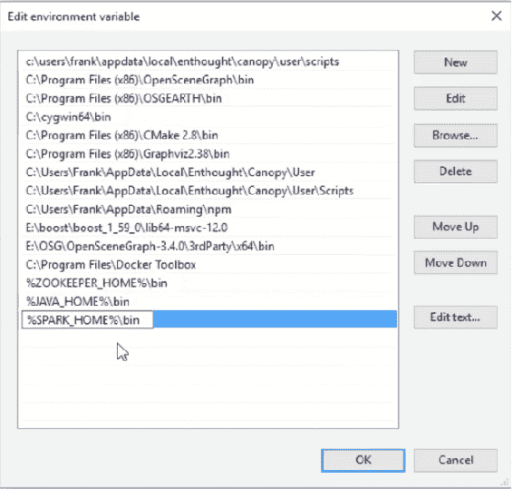

基本上，这使得 Spark 的所有二进制可执行文件都可以在 Windows 上使用，无论您从哪里运行它。 单击此菜单和前两个菜单上的确定。 我们终于把一切都安排好了。

# Spark游戏攻略

让我们从 Apache Spark 的高级概述开始，看看它是什么，有什么好处，以及它是如何工作的。

Spark是什么？ 嗯，如果你去 Spark 网站，他们会给你一个非常高级的、手摇的答案，“一个用于大规模数据处理的快速而通用的引擎。” 它会切，会切，还会帮你洗衣服。 嗯，不完全是。 但它是一个用于编写作业或脚本的框架，可以处理非常大量的数据，并且它可以为您管理跨计算集群分布处理。 基本上，Spark 的工作原理是让您将数据加载到这些称为弹性分布式数据存储(RDDS)的大型对象中。 它可以自动执行基于这些 RDDS 的转换和创建动作的操作，您可以将其视为大数据帧。

它的美妙之处在于，Spark 将自动并优化地将处理分散到整个计算机群集(如果您有可用的计算机群集)。 您不再局限于在一台机器或一台机器的内存上所能做的事情。 实际上，您可以将其扩展到一组机器可用的所有处理能力和内存上，而且，在当今这个时代，计算相当便宜。 实际上，你可以通过亚马逊的 Elastic MapReduce 服务在集群上租用时间，只需花几美元就可以在整个集群的计算机上租用一些时间，并运行你无法在自己的台式机上运行的作业。

# 它是可扩展的

Spark 的可扩展性如何？ 那么，让我们在这里更具体地说明它是如何工作的。


它的工作方式是，你编写一个驱动程序，这只是一个看起来就像任何其他 Python 脚本的小脚本，它使用 Spark 库来实际编写你的脚本。 在该库中，您定义了所谓的 Spark 上下文，它是您在 Spark 中进行开发时在其中工作的根对象。

从那时起，Spark 框架就可以为您接管和分发东西了。 因此，如果您在自己的计算机上以独立模式运行，就像我们将在接下来的部分中所做的那样，很明显，所有这些都会留在您的计算机上。 但是，如果您在集群管理器上运行，Spark 可以找出这一点并自动利用它。 Spark 实际上有它自己的内置集群管理器，您甚至可以在没有安装 Hadoop 的情况下单独使用它，但是如果您确实有一个 Hadoop 集群可用，它也可以使用它。

Hadoop 不仅仅是 MapReduce；实际上，Hadoop 中有一个称为 YAR 的组件，它分离了 Hadoop 的整个集群管理部分。 Spark 可以与纱线交互，以便实际使用它在该 Hadoop 集群可用的资源之间最佳地分配处理组件。

在集群内，您可能有单独的执行器任务正在运行。 它们可能在不同的计算机上运行，也可能在同一台计算机的不同内核上运行。 它们各自都有各自的缓存和各自运行的任务。 驱动程序、Spark 上下文和集群管理器协同工作，协调所有这些工作，并将最终结果返回给您。

它的美妙之处在于，您所要做的就是编写初始的小脚本，即驱动程序，它使用 Spark 上下文在高级别上描述您想要对这些数据进行的处理。 Spark 与您正在使用的集群管理器一起工作，计算出如何展开和分发它，这样您就不必担心所有这些细节。 显然，如果它不起作用，您可能不得不进行一些故障排除，以确定您手头是否有足够的可用资源来完成任务，但是，从理论上讲，这一切都是魔术。

# 它很快的

斯帕克有什么大不了的？ 我的意思是，有类似的技术，如 MapReduce，已经存在得更久了。 不过 Spark 速度很快，他们在网站上声称，Spark“在内存中运行作业时比 MapReduce 快 100 倍，在磁盘上快 10 倍。” 当然，这里的关键词是“最高”，你的里程数可能会有所不同。 我想我从来没有见过比 MapReduce 运行得那么快的东西。 一些精心设计的 MapReduce 代码实际上仍然非常高效。 但我要说的是，Spark 确实让很多常见的操作变得更容易。 MapReduce 迫使您将事情真正分解为映射器和减速器，而 Spark 则稍微高一点。 你不必总是花太多心思去做正确的事情。

这在一定程度上导致了 Spark 如此快速的另一个原因。 它有一个 DAG 引擎，一个有向无环图。 哇，这又是一个花哨的词。 什么意思？ Spark 的工作方式是，您编写一个描述如何处理数据的脚本，您可能会有一个基本上类似于数据框的 RDD。 您可以对其进行某种转换，或对其进行某种操作。 但是，在您实际对该数据执行操作之前，实际上什么都不会发生。 在这一点上，斯帕克会说：“嗯，好的。所以，这就是你想要的最终结果。为了达到这一点，我还必须做什么其他的事情，以及什么是制定达到这一点的最佳策略？” 因此，在幕后，它将找出拆分处理的最佳方式，并分发信息以获得您正在寻找的最终结果。 所以，这里的关键是，Spark 一直等到你告诉它实际产生结果，只有在那个时候，它才会真正去找出如何产生那个结果。 所以，这是一个很酷的概念，这是它很多效率的关键。

# 它很年轻

Spark 是一项非常热门的技术，而且相对年轻，所以它仍然非常新兴，变化很快，但很多大人物都在使用它。 例如，亚马逊，eBay，NASA 喷气推进实验室，Groupon，TripAdvisor，雅虎，以及许多其他公司都在使用它。 我肯定有很多公司在使用它，但如果你去[http://spark.apache.org/powered-by.html](http://spark.apache.org/powered-by.html)的 Spark Apache Wiki 页面。

实际上，你可以查到使用 Spark 解决现实世界数据问题的知名大公司的名单。 如果你担心你进入了这里的前沿，不要担心，你和一些在生产中使用 Spark 来解决实际问题的大人物是很好的伙伴。 在这一点上，它是相当稳定的东西。

# 这并不难

这也没那么难。 您可以选择使用 Python、Java 或 Scala 进行编程，它们都是围绕我前面描述的相同概念构建的，即弹性分布式数据集，简称 RDD。 我们将在本章接下来的章节中更详细地讨论这一点。

# Spark 的组件

Spark 实际上有许多不同的组件，它们都是由这些组件组成的。 所以有一个 Spark Core，它可以让你只使用 Spark Core 函数就可以做任何你想做的事情，但是在 Spark 之上还有一些其他的东西也是很有用的。

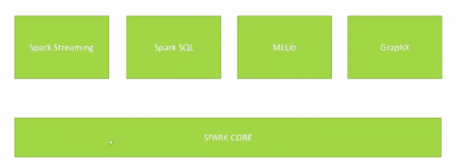

*   **Spark Streaming**：Spark Streaming 是一个允许您实际实时处理数据的库。 数据可以源源不断地从网络日志流入服务器，而 Spark Streaming 可以帮助您在移动过程中实时处理这些数据，直到永远。
*   **Spark SQL**：这允许您将数据实际视为 SQL 数据库，并在其上实际发出 SQL 查询，如果您已经熟悉 SQL，这将是一件很酷的事情。
*   **MLlib**：这是我们将在本节中重点关注的内容。 它实际上是一个机器学习库，允许您执行常见的机器学习算法，并在幕后使用 Spark 在集群中实际分布处理。 与其他方式相比，您可以在更大的数据集上执行机器学习。
*   **GraphX**：这不是用来制作漂亮的图表和图形的。 它是指网络理论意义上的图。 以社交网络为例，这是一个图表的例子。 GraphX 只有几个函数可以让您分析信息图表的属性。

# Python 与 Scala for Spark

当我教人们关于 Apache Spark 的知识时，我确实有时会因为使用 Python 而受到一些抨击，但有一种方法让我发疯。 的确，很多人在编写 Spark 代码时使用 Scala，因为 Spark 本身就是用来开发的。 因此，强制 Spark 将 Python 代码转换为 Scala，然后在一天结束时转换为 Java 解释器命令，这会带来一些开销。

但是，Python 要容易得多，而且您不需要编译。 管理依赖关系也容易得多。 你可以真正把你的时间集中在算法和你正在做的事情上，而不是花在实际构建、运行和编译的细节上，以及所有这些胡说八道的事情上。 另外，很明显，这本书到目前为止一直专注于 Python，在这些讲座中继续使用我们学到的知识并坚持使用 Python 是有意义的。 以下是这两种语言利弊的快速总结：

| **Python** | 发文：2013 年 2 月 10 日星期日下午 12：00 |
| 

*   There is no need to compile, manage dependencies, and so on.
*   Less coding overhead
*   You already know that Python
*   Let's focus on concepts rather than new languages

 | 

*   Scala may be a more popular choice for Spark.
*   Spark is built in Scala, so writing code in Scala for Spark
*   As far as it is concerned, it is "native". New functions and libraries are often given priority to Scala.

 |

然而，我要说的是，如果你在现实世界中做一些 Spark 编程，人们很有可能正在使用 Scala。 不过，不要太担心这一点，因为在 Spark 中，Python 和 Scala 代码看起来非常相似，因为它都围绕着相同的 RDD 概念。 语法略有不同，但差别不大。 如果您知道如何使用 Python 来执行 Spark，那么学习如何在 Scala 中使用它并不是一个很大的飞跃，真的。 下面是两种语言中相同代码的快速示例：

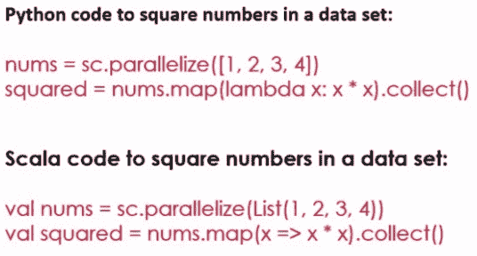

所以，这就是 Spark 本身的基本概念，为什么它如此重要，以及它是如何如此强大地让你在非常大的数据集上运行机器学习算法，或者实际上是任何算法。 现在让我们更详细地讨论它是如何做到这一点的，以及弹性分布式数据集的核心概念。

# Spark 和弹性分布式数据集(RDD)

让我们更深入地了解一下 Spark 是如何工作的。 我们将讨论弹性分布式数据集，即 RDDS。 这在某种程度上是您在 Spark 中编程时使用的核心，我们将提供一些代码片段来尝试使其成为现实。 我们将在这里给你们上一堂ApacheSpark速成班。 它比我们在接下来的几节中要深入得多，但我只会给你一些基本的知识，让你真正理解这些例子中发生的事情，并希望能让你开始并朝着正确的方向前进。

如前所述，Spark 最基本的部分称为弹性分布式数据集(RDD)，这将是您用来实际加载和转换的对象，并从您试图处理的数据中获得您想要的答案。 这是一件需要理解的非常重要的事情。 RDD 中的最后一个字母代表 DataSet，归根结底就是数据集；它只是一堆可以包含几乎任何内容的信息。 但关键是 R 和第一个 D。

*   **Resilient**：它具有弹性，因为 Spark 可以确保，如果您在群集上运行此程序，并且其中一个群集出现故障，它可以自动恢复并重试。 现在，请注意，这种韧性只能到此为止。 如果您没有足够的资源可用于尝试运行的作业，它仍然会失败，您将不得不向其添加更多资源。 它可以恢复的东西只有那么多；它重试给定任务的次数是有限制的。 但它确实尽了最大努力，以确保在面对不稳定的集群或不稳定的网络时，它仍然会继续尽最大努力运行到完成。
*   **分布式**：显然，它是分布式的。 使用 Spark 的全部意义在于，您可以使用它来解决大数据问题，在这种情况下，您可以跨计算机集群的整个 CPU 和内存能力实际分配处理。 它可以水平分布，因此您可以抛出任意多台计算机来处理给定的问题。 问题越大，计算机就越多；在那里可以做的事情真的没有上限。

# SparkContext 对象

您总是通过获取 SparkContext 对象来启动 Spark 脚本，而这个对象体现了 Spark 的核心。 它将为您提供用于处理的 RDDS，因此它将生成您在处理中使用的对象。

你知道，当你实际编写 Spark 程序时，你实际上不会太多地考虑 SparkContext，但它在某种程度上是底层在幕后为你运行它们。 如果您在 Spark shell 中以交互方式运行，那么它已经有一个`sc`对象可供您使用，您可以使用该对象来创建 RDDS。 但是，在独立脚本中，您必须显式创建 SparkContext，且必须注意使用参数，因为您实际上可以告诉 Spark 上下文您希望如何分发它。 我应该利用我所拥有的每一个核心吗？ 我应该在群集上运行还是只在本地计算机上独立运行？ 因此，这就是您设置 Spark 将如何运行的基本设置的地方。

# 正在创建 RDDS

让我们来看一些实际创建 RDDS 的小代码片段，我认为这一切都会开始变得更有意义。

# 使用 Python 列表创建 RDD

下面是一个非常简单的例子：

```py
nums = parallelize([1, 2, 3, 4]) 

```

如果我只想从一个普通的旧 Python 列表中创建一个 RDD，我可以调用 Spark 中的`parallelize()`函数。 这将把一列内容(在本例中只有数字 1、2、3、4)转换为名为`nums`的 RDD 对象。

这是创建 RDD 的最简单的情况，只需根据硬编码的内容列表即可。 这份清单可能来自任何地方；它也不一定是硬编码的，但这有点违背了大数据的目的。 我的意思是，如果我必须将整个数据集加载到内存中，然后才能从它创建 RDD，那还有什么意义呢？

# 从文本文件加载 RDD

我还可以从文本文件加载 RDD，它可以在任何地方。

```py
sc.textFile("file:///c:/users/frank/gobs-o-text.txt")  

```

在这个例子中，我有一个巨大的文本文件，它是整个百科全书之类的。 我在这里从本地磁盘读取该文件，但如果我想要在分布式 AmazonS3 存储桶上托管此文件，也可以使用 s3n；如果我想引用存储在分布式 HDFS 集群(如果您不熟悉 HDFS，则表示 Hadoop Distributed File System)上的数据，我也可以使用 s3n。 在处理大数据和使用 Hadoop 集群时，数据通常位于该集群中。

该行代码实际上会将文本文件每一行都转换为 RDD 中自己的行。 因此，您可以将 RDD 看作一个行数据库，在本例中，它会将我的文本文件加载到 RDD 中，其中每行每行都包含一行文本。 然后，我可以在该 RDD 中进行进一步处理，以解析或拆分该数据中的分隔符。 但这就是我开始的地方。

还记得我们在书的前面谈到的 ETL 和 ELT 吗？ 这是一个很好的示例，说明您可能实际将原始数据加载到系统中，并在用于查询数据的系统本身上执行转换。 您可以获取根本未处理的原始文本文件，并使用 Spark 的功能将其实际转换为更结构化的数据。

它还可以与蜂窝之类的东西对话，因此，如果你的公司已经建立了一个蜂窝数据库，你可以创建一个基于你的 Spark 上下文的蜂窝上下文。 多酷啊？ 请看下面的示例代码：

```py
hiveCtx = HiveContext(sc)  rows = hiveCtx.sql("SELECT name, age FROM users")  

```

您实际上可以创建一个 RDD，在本例中称为行，它是通过在您的配置单元数据库上实际执行 SQL 查询而生成的。

# 创建 RDDS 的方式更多

创建 RDDS 的方法也有更多。 您可以从 JDBC 连接创建它们。 基本上，任何支持 JDBC 的数据库都可以与 Spark 对话，并从中创建 RDDS。 Cassandra、HBase、Elasticsearch、JSON 格式的文件、CSV 格式的文件、序列文件、对象文件以及其他一些压缩文件(如 ORC)都可以用来创建 RDDS。 我不想详细介绍所有这些内容，如果需要，您可以找到一本书来查找这些内容，但重点是，从数据创建 RDD 非常容易，无论它在本地文件系统上还是在分布式数据存储上。

同样，RDD 只是一种加载和维护大量数据并一次性跟踪这些数据的方法。 但是，从概念上讲，在您的脚本中，RDD 只是一个包含大量数据的对象。 你不必考虑规模，因为 Spark 会为你做到这一点。

# RDD 操作

现在，您可以在 RDDS 上做两种不同类型的事情，一旦有了它们，就可以进行转换，也可以进行操作。

# 变换

让我们先来讨论一下转换。 变换就是它们听起来的样子。 这是一种获取 RDD 并根据您提供的函数将 RDD 中的每一行转换为新值的方法。 让我们来看看其中的一些函数：

*   **map()和 flatmap()**：`map`和`flatmap`是您最常看到的函数。 这两个函数都将接受您能想象到的任何函数，也就是将 RDD 的一行作为输入，然后它将输出转换后的行。 例如，您可能从 CSV 文件获取原始输入，而您的`map`操作可能获取该输入，并根据逗号分隔符将其拆分成单独的字段，然后返回一个 Python 列表，该列表以更结构化的格式包含该数据，您可以对其执行进一步处理。 您可以将映射操作链接在一起，因此一个`map`的输出可能最终会创建一个新的 RDD，然后对该 RDD 执行另一个转换，以此类推。 同样，关键是，Spark 可以将这些转换分布在整个集群中，因此它可能会将 RDD 的一部分放在一台计算机上进行转换，而将 RDD 的另一部分放在另一台计算机上进行转换。

正如我所说的，`map`和`flatmap`是您将看到的最常见的转换。 唯一的区别是`map`只允许您为每行输出一个值，而`flatmap`将允许您为给定行实际输出多个新行。 因此，您实际上可以创建比开始使用`flatmap.`时更大的 RDD 或更小的 RDD

*   **filter()**：`filter`如果您要做的只是创建一个布尔函数，说明“此行是否应该保留？是或否”，则可以使用`filter`。
*   **DISTINCT()**：`distinct`是一种不太常用的转换，它只返回 RDD 中的 DISTINCT 值。
*   **Sample()**：此函数允许您从 RDD 中随机抽样
*   **并集()、交集()、差集()和笛卡尔集()**：您可以执行交集操作，如并集、交集、减法，甚至生成 RDD 中存在的每个笛卡尔组合。

# 使用 map()

下面是一个小示例，说明您可以如何在工作中使用 map 函数：

```py
rdd = sc.parallelize([1, 2, 3, 4]) 
rdd.map(lambda x: x*x) 

```

假设我从列表 1，2，3，4 创建了一个 RDD。然后，我可以使用一个λ函数 x 调用`rdd.map()`，该函数接受每一行，即该 RDD 的每个值，称为 x，然后应用 x 乘以 x 的函数来平方它。 如果我然后收集这个 RDD 的输出，它将是 1、4、9 和 16，因为它将获取该 RDD 的每个单独条目并将其平方，然后将其放入新的 RDD 中。

如果您不记得什么是 lambda 函数，我们在本书前面已经讨论过了，但是作为一个复习，lambda 函数只是定义在线函数的一种速记。 因此，`rdd.map(lambda x: x*x)`与单独的函数`def squareIt(x): return x*x`完全相同，也就是`rdd.map(squareIt)`。

这只是您想要作为转换传入的非常简单的函数的缩写。 它消除了将其实际声明为其自身的单独命名函数的需要。 这就是函数式编程的全部思想。 顺便说一句，你现在可以说你懂函数式编程了！ 但实际上，它只是一种速记符号，用于将函数内联定义为`map()`函数的参数的一部分，或对此进行任何转换。

# 行动 / 活动 / 情节

当您想要实际获得结果时，还可以对 RDD 执行操作。 以下是您可以执行的操作的一些示例：

*   `collect()`：您可以在 RDD 上调用 Collect()，它将返回一个普通的旧 Python 对象，然后您可以遍历并打印结果，或者将结果保存到文件中，或者做任何您想做的事情。
*   `count()`：您还可以调用`count()`，这将强制它实际计算此时 RDD 中有多少条目。
*   `countByValue()`：此函数将给出该 RDD 中每个唯一值出现的次数的细目。
*   `take()`：您还可以使用`take()`从 RDD 中采样，这将从 RDD 中随机抽取一些条目。
*   `top()`：`top()`如果您只是想为了调试目的浏览一下其中的内容，`top()`将提供该 RDD 中的前几个条目。
*   `reduce()`：更强大的操作是`reduce()`，它实际上允许您将相同的公共键值组合在一起。 您还可以在键值数据的上下文中使用 RDDS。 `reduce()`函数允许您定义一种将给定键的所有值组合在一起的方法。 它在精神上与 MapReduce 非常相似。 `reduce()`基本上类似于 MapReduce 中的`reducer()`，而`map()`类似于`mapper()`。 因此，使用这些函数实际执行 MapReduce 作业并将其转换为 Spark 通常非常简单。

还要记住，除非您调用一个操作，否则 Spark 中不会实际发生任何事情。 一旦你调用了这些动作方法中的一个，那就是 Spark 走出去，用有向无环图施展它的魔力的时候，实际上是计算得到你想要的答案的最佳方式。 但请记住，在该行动发生之前，什么都不会真正发生。 所以，当您编写 Spark 脚本时，这有时会让您犯错，因为您可能会在其中有一条小的打印语句，您可能希望得到一个答案，但直到实际执行操作时，它才会真正出现。

简而言之，这就是Spark 101。 这些都是 Spark 编程所需的基础知识。 基本上，什么是 RDD，您可以对 RDD 做些什么。 一旦你理解了这些概念，你就可以编写一些 Spark 代码了。 现在让我们改变策略，讨论 MLlib，以及 Spark 中的一些特定功能，这些功能允许您使用 Spark 进行机器学习算法。

# MLlib 简介

幸运的是，在进行机器学习时，您不必在 Spark 中费力地做事情。 它有一个名为 MLlib 的内置组件，它位于 Spark Core 之上，这使得使用海量数据集执行复杂的机器学习算法变得非常容易，并将处理分布在整个计算机群集上。 所以，非常激动人心的东西。 让我们更多地了解它的功能。

# 一些 MLlib 功能

那么，MLlib 可以做些什么呢？ 嗯，一个是特征提取。

您可以在规模上做的一件事是词频和文档频率倒置，这对于创建搜索索引非常有用。 我们将在本章后面实际介绍一个这样的例子。 同样关键的是，它可以使用海量数据集在整个集群中做到这一点，这样你就有可能用它来制作你自己的网络搜索引擎。 它还提供基本的统计函数、卡方检验、皮尔逊或斯皮尔曼相关性，以及一些更简单的功能，如最小、最大、均值和方差。 这些数据本身并不是非常令人兴奋，但令人兴奋的是，你实际上可以计算一个庞大的数据集的方差或平均值或任何东西，或者相关分数，它实际上会将该数据集分成不同的块，并在必要时在整个集群中运行。

因此，即使其中一些操作不是非常有趣，但有趣的是它可以在多大的规模下操作。 它还可以支持线性回归和逻辑回归等功能，因此，如果您需要将一个函数与大量数据进行匹配，并将其用于预测，您也可以这样做。 它还支持支持向量机。 我们正在研究一些更花哨的算法，一些更先进的东西，这些算法也可以使用 Spark 的 MLlib 扩展到海量数据集。 MLlib 中内置了一个朴素的贝叶斯分类器，所以，还记得我们在本书前面构建的垃圾邮件分类器吗？ 实际上，您可以使用 Spark 对整个电子邮件系统执行此操作，并根据需要进行扩展。

决策树，我在机器学习中最喜欢的东西之一，也得到了 Spark 的支持，我们将在本章后面给出一个例子。 我们还将介绍 K-Means 聚类，您可以使用 K-Means 以及使用 Spark 和 MLlib 的海量数据集进行聚类。 甚至主成分分析和**SVD**(**奇异值分解**)也可以用 Spark 来完成，我们也会有一个这样的例子。 最后，MLlib 内置了一个名为交替最小二乘的推荐算法。 就我个人而言，我得到的结果好坏参半，你知道，这对我的品味来说有点太黑箱了，但我是一个推荐系统势利眼的人，所以还是持保留态度吧！

# 特殊 MLlib 数据类型

使用 MLlib 通常非常简单，只需要调用一些库函数。 它确实引入了一些新的数据类型；但是，您需要了解这些数据类型，其中之一就是向量。

# 矢量数据类型

还记得我们在书的前面做电影相似性和电影推荐的时候吗？ 矢量的一个例子可以是给定用户评分的所有电影的列表。 有两种类型的向量，稀疏的和密集的。 让我们来看一个这样的例子。 世界上有许许多多的电影，一个密集的向量实际上代表了每一部电影的数据，无论用户是否真的观看了它。 例如，假设我有一个用户看了“玩具总动员”，显然我会存储他们对“玩具总动员”的评分，但如果他们没有看电影“星球大战”，我实际上会存储“星球大战”没有数字的事实。 所以，我们最终会用一个密集的向量来占据所有这些丢失的数据点的空间。 稀疏向量只存储存在的数据，所以它不会在丢失数据上浪费任何内存空间，好吧。 因此，它是内部表示向量的一种更紧凑的形式，但很明显，这在处理过程中引入了一些复杂性。 所以，如果你知道你的向量中会有很多丢失的数据，这是一个节省内存的好方法。

# LabeledPoint 数据类型

还出现了一种`LabeledPoint`数据类型，听起来就是这样，一个点有某种关联的标签，用人类可读的术语来表达该数据的含义。

# 评级数据类型

最后，如果您在 MLlib 中使用推荐，您将会遇到一种`Rating`数据类型。 此数据类型可以接受代表 1-5 或 1-10 的评级，无论一个人的星级是什么，并使用该评级自动通知产品推荐。

因此，我认为您最终拥有了开始使用所需的一切，让我们深入研究并实际查看一些真实的 MLlib 代码并运行它，然后它将变得更有意义。

# 基于 MLlib 的 Spark 中的决策树

好的，让我们使用 Spark 和 MLlib 库构建一些决策树，这是非常酷的东西。 无论你把这本书的课程材料放在哪里，我要你现在就去那个文件夹。 确保您完全关闭了 Canopy，或者您正在使用的任何用于 Python 开发的环境，因为我想确保您是从这个目录启动的，好吗？ 找到`SparkDecisionTree`脚本，然后双击该脚本以打开 Canopy：


到目前为止，我们的代码一直使用 IPython 笔记本，但在 Spark 中不能很好地使用这些笔记本。 使用 Spark 脚本，您需要将它们实际提交到 Spark 基础设施，并以一种非常特殊的方式运行它们，我们很快就会看到这是如何工作的。

# 探索决策树代码

因此，我们现在只看一个原始的 Python 脚本文件，没有 IPython 笔记本的任何常见修饰。 让我们来看看剧本里发生了什么。


我们会慢慢来看，因为这是你在这本书中看到的第一个 Spark 脚本。

首先，我们将从`pyspark.mllib`导入 Spark 的机器学习库中所需的位。

```py
from pyspark.mllib.regression import LabeledPoint 
from pyspark.mllib.tree import DecisionTree 

```

我们需要`LabeledPoint`类，这是`DecisionTree`类所需的数据类型，以及从`mllib.tree`导入的`DecisionTree`类本身。

接下来，您看到的几乎每个 Spark 脚本都将包括此行，我们将在其中导入`SparkConf`和`SparkContext`：

```py
from pyspark import SparkConf, SparkContext 

```

这是创建`SparkContext`对象所必需的，该对象在某种程度上是您在 Spark 中执行的所有操作的根。

最后，我们将从`numpy`导入数组库：

```py
from numpy import array 

```

是的，您仍然可以在 Spark 脚本中使用`NumPy`和`scikit-learn`以及您想要的任何内容。 首先，您只需确保这些库安装在您想要在其上运行它的每台计算机上。

如果您在集群上运行，您需要确保那些 Python 库以某种方式已经就位，并且您还需要了解 Spark 不会使 SCRICKIT 学习方法(例如，神奇地可伸缩)变得可伸缩。 您仍然可以在给定的 map 函数或类似的上下文中调用这些函数，但它只能在该进程中的那台机器上运行。 不要过于依赖这些东西，但是对于像管理数组这样简单的事情来说，这完全是可以做的事情。

# 创建 SparkContext

现在，我们将首先设置我们的`SparkContext`，并给它一个`SparkConf`，一个配置。

```py
conf = SparkConf().setMaster("local").setAppName("SparkDecisionTree") 

```

这个配置对象表示，我要将主节点设置为“`local`”，这意味着我只在自己的本地台式机上运行，而不是实际上在集群上运行，我只会在一个进程中运行。 我还打算给它命名为“`SparkDecisionTree`”，你可以叫它任何你想要的名字，Fred，Bob，Tim，任何你想要的名字。 这就是这个作业的外观，就像您稍后在 Spark 控制台中查看它一样。

然后，我们将使用该配置创建我们的`SparkContext`对象：

```py
sc = SparkContext(conf = conf) 

```

这给了我们一个`sc`对象，我们可以使用它来创建 RDDS。

接下来，我们有一系列函数：

```py
# Some functions that convert our CSV input data into numerical 
# features for each job candidate 
def binary(YN): 
    if (YN == 'Y'): 
        return 1 
    else: 
        return 0 

def mapEducation(degree): 
    if (degree == 'BS'): 
        return 1 
    elif (degree =='MS'): 
        return 2 
    elif (degree == 'PhD'): 
        return 3 
    else: 
        return 0 

# Convert a list of raw fields from our CSV file to a 
# LabeledPoint that MLLib can use. All data must be numerical... 
def createLabeledPoints(fields): 
    yearsExperience = int(fields[0]) 
    employed = binary(fields[1]) 
    previousEmployers = int(fields[2]) 
    educationLevel = mapEducation(fields[3]) 
    topTier = binary(fields[4]) 
    interned = binary(fields[5]) 
    hired = binary(fields[6]) 

    return LabeledPoint(hired, array([yearsExperience, employed, 
        previousEmployers, educationLevel, topTier, interned])) 

```

现在让我们先介绍一下这些函数，稍后我们再来讨论它们。

# 导入和清理我们的数据

让我们来看一下在此脚本中实际执行的第一段 Python 代码。

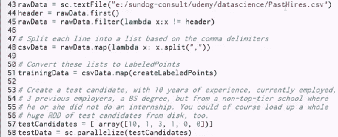

我们要做的第一件事是加载这个`PastHires.csv`文件，这与我们在本书前面的决策树练习中使用的文件相同。

让我们快速停顿一下，提醒自己该文件的内容。 如果你没记错的话，我们有很多应聘者的特征，我们有一个关于我们是否聘用这些人的字段。 我们想要做的是建立一棵决策树来预测--我们会不会雇佣一个具备这些属性的人？

现在，让我们快速浏览一下`PastHires.csv`，它将是一个 Excel 文件。

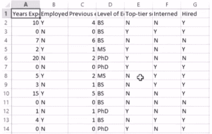

您可以看到 Excel 实际上将其导入到一个表中，但是如果您查看原始文本，您会发现它是由逗号分隔值组成的。

第一行是每个栏目的实际标题，所以我们上面有的是之前工作的年限，是应聘者目前工作的年限，以前的雇主的数量，教育水平，他们是否上过一流的学校，他们在校期间是否有实习机会，最后，我们试图预测的目标，他们最终是否得到了工作机会。 现在，我们需要将这些信息读取到 RDD 中，这样我们就可以对其进行处理。

让我们回到我们的脚本：

```py
rawData = sc.textFile("e:/sundog-consult/udemy/datascience/PastHires.csv") 
header = rawData.first() 
rawData = rawData.filter(lambda x:x != header) 

```

我们需要做的第一件事是读取 CSV 数据，然后我们将丢弃第一行，因为这是我们的标题信息，记住。 所以，这里有一个小窍门可以做到这一点。 我们首先将该文件中的每一行都导入到原始数据 RDD 中，我可以随心所欲地称其为任何名称，但我们将其命名为`sc.textFile`。 SparkContext 有一个`textFile`函数，它将获取一个文本文件并创建一个新的 RDD，其中 RDD 的每一项都由一行输入组成。

Make sure you change the path to that file to wherever you actually installed it, otherwise it won't work.

现在，我将使用`first`函数从该 RDD 中提取第一行，即第一行。 因此，现在标题 RDD 将包含一个条目，该条目就是该行的列标题。 现在，看看上面的代码中发生了什么，我正在对包含 CSV 文件中所有信息的原始数据使用`filter`，并且我正在定义一个`filter`函数，该函数只允许行在该行不等于初始标题行的内容时通过。 我在这里所做的是，我已经获取了原始的 CSV 文件，并且通过只允许不等于第一行的行继续存在来去除第一行，并且我再次将其返回到`rawData`rdd 变量。 因此，我采用`rawData`，过滤掉第一行，并创建一个只包含数据本身的新`rawData`。 到目前为止和我在一起吗？ 没那么复杂。

现在，我们将使用`map`函数。 我们下一步需要做的是开始从这些信息中构建更多的结构。 现在，我的 RDD 的每一行都只是一行文本，它是逗号分隔的文本，但它仍然只是一大行文本，我想要获取逗号分隔值列表，并将其实际拆分成单独的字段。 最后，我希望将每个 RDD 从包含一串用逗号分隔的信息的文本行转换为 Python 列表，该列表为我拥有的每一列信息都有实际的单独字段。 这就是这个 lambda 函数的作用：

```py
csvData = rawData.map(lambda x: x.split(",")) 

```

它调用内置的 Python 函数`split`，该函数将接受一行输入，并将其拆分为逗号字符，然后将其划分为以逗号分隔的每个字段的列表。

这个 map 函数的输出是一个名为`csvData`的新 RDD，其中我传入了一个 lambda 函数，该函数只是根据逗号将每行分割成多个字段。 此时，`csvData`是一个 RDD，它在每一行上都包含一个列表，其中每个元素都是我的源数据中的一列。 现在，我们快到了。

事实证明，为了将决策树与 MLlib 一起使用，需要满足几个条件。 首先，输入必须是 LabeledPoint 数据类型的形式，并且本质上必须是数字。 因此，我们需要将所有原始数据转换为 MLlib 实际可以使用的数据，这就是我们前面跳过的`createLabeledPoints`函数所做的事情。 我们马上就会讲到这一点，首先是对它的要求：

```py
trainingData = csvData.map(createLabeledPoints) 

```

我们将在`csvData`上调用一个 map，并向其传递`createLabeledPoints`函数，该函数将把每一个输入行转换为最终更接近我们想要的内容。 那么，让我们看看`createLabeledPoints`做了什么：

```py
def createLabeledPoints(fields): 
    yearsExperience = int(fields[0]) 
    employed = binary(fields[1]) 
    previousEmployers = int(fields[2]) 
    educationLevel = mapEducation(fields[3]) 
    topTier = binary(fields[4]) 
    interned = binary(fields[5]) 
    hired = binary(fields[6]) 

    return LabeledPoint(hired, array([yearsExperience, employed, 
        previousEmployers, educationLevel, topTier, interned])) 

```

它接受一个字段列表，为了再次提醒您它看起来是什么样子，让我们再次调出那个`.csv`Excel 文件：


因此，在这一点上，每个 RDD 条目都有一个字段，它是一个 Python 列表，其中第一个元素是多年的经验，第二个元素是使用的，依此类推。 这里的问题是，我们希望将这些列表转换为标签点，并且希望将所有内容转换为数字数据。 因此，所有这些是和否的答案都需要转换为 1 和 0。 这些体验级别需要从学位名称转换为某个数字序数值。 例如，我们可能会将值 0 分配给没有受过教育的人，一个可以表示学士学位，两个可以表示 MS，三个可以表示博士学位。 同样，所有这些 yes/no 值都需要转换为 0 和 1，因为在一天结束时，进入决策树的所有内容都需要是数字的，这就是`createLabeledPoints`所做的。 现在，让我们回过头来看一下代码：

```py
def createLabeledPoints(fields): 
    yearsExperience = int(fields[0]) 
    employed = binary(fields[1]) 
    previousEmployers = int(fields[2]) 
    educationLevel = mapEducation(fields[3]) 
    topTier = binary(fields[4]) 
    interned = binary(fields[5]) 
    hired = binary(fields[6]) 

    return LabeledPoint(hired, array([yearsExperience, employed, 
        previousEmployers, educationLevel, topTier, interned])) 

```

首先，它接受我们的`StringFields`列表，准备将其转换为`LabeledPoints`，其中标签是目标值-此人是否被录用？0 或 1-后跟一个由我们关心的所有其他字段组成的数组。 因此，这就是如何创建`DecisionTree MLlib`类可以使用的`LabeledPoint`。 因此，您可以在上面的代码中看到，我们正在将多年的经验从字符串转换为整数值，并且对于所有的 yes/no 字段，我们将调用这个`binary`函数，这是我在代码顶部定义的，但我们还没有讨论：

```py
def binary(YN): 
    if (YN == 'Y'): 
        return 1 
    else: 
        return 0 

```

它所做的就是将字符 yes 转换为 1，否则返回 0。 所以，Y 会变成 1，N 会变成 0。 类似地，我有一个`mapEducation`函数：

```py
def mapEducation(degree): 
    if (degree == 'BS'): 
        return 1 
    elif (degree =='MS'): 
        return 2 
    elif (degree == 'PhD'): 
        return 3 
    else: 
        return 0 

```

正如我们前面讨论的，这只是以与 yes/no 字段完全相同的方式将不同类型的度数转换为序号数值。

提醒一下，下面这行代码让我们浏览了这些函数：

```py
trainingData = csvData.map(createLabeledPoints) 

```

此时，在使用`createLabeledPoints`函数映射 RDD 之后，我们现在有了一个`trainingData`RDD，这正是 MLlib 构建决策树所需要的。

# 创建一个测试候选项并构建我们的决策树

让我们创建一个我们可以使用的小测试候选人，这样我们就可以使用我们的模型来实际预测是否会雇用新人。 我们要做的是创建一个测试候选项，它由一个数组组成，每个字段的值与 CSV 文件中的值相同：

```py
testCandidates = [ array([10, 1, 3, 1, 0, 0])] 

```

让我们快速将该代码与 Excel 文档进行比较，以便您可以看到数组映射：


同样，我们需要将它们映射回它们最初的列表示，因此，10，1，3，1，0，0 表示之前有 10 年的工作经验，现在受雇，三个以前的雇主，拥有理科学士学位，没有上过一流的学校，也没有实习过。 如果我们愿意，我们实际上可以创建一个充满候选对象的整个 RDD，但我们现在只做一个。

接下来，我们将使用 Parallelize 将该列表转换为 RDD：

```py
testData = sc.parallelize(testCandidates) 

```

这没什么新鲜事。 好了，现在让我们来看看下一个代码块：

```py
model = DecisionTree.trainClassifier(trainingData, numClasses=2, 
                    categoricalFeaturesInfo={1:2, 3:4, 4:2, 5:2}, 
                    impurity='gini', maxDepth=5, maxBins=32) 

```

我们将调用`DecisionTree.trainClassifier`，这实际上将构建我们的决策树本身。 我们传入我们的`trainingData`，它只是一个充满`LabeledPoint`数组的 RDD，`numClasses=2`，因为我们基本上有一个是或否的预测，这个人会不会被录用？ 下一个参数称为`categoricalFeaturesInfo`，这是一个 Python 字典，它将字段映射到每个字段中的类别数。 所以，如果你有一个特定领域的连续范围，比如工作经验的年数，你根本不会在这里指定，但对于本质上是分类的领域，比如他们有什么学位，比如他们有什么学位，就会说 fieldID3，映射到所获得的学位，这有四种不同的可能性：没有受过教育，学士，硕士和博士学位。 对于所有的 yes/no 字段，我们将它们映射到两个可能的类别，yes/no 或 0/1 是我们将其转换为的类别。

继续我们的`DecisionTree.trainClassifier`调用，我们将在测量熵时使用`'gini'`杂质度量。 我们的`maxDepth`是 5，这只是我们能走多远的上限，如果你愿意，它可以更大。 最后，如果可能的话，`maxBins`只是权衡计算开销的一种方式，因此它至少需要是每个特性中包含的最大类别数。 记住，在我们调用一个动作之前，什么都不会发生，所以我们将实际使用这个模型来预测我们的应试者。

我们使用我们的`DecisionTree`模型，该模型包含一个根据我们的测试训练数据训练的决策树，我们告诉它对我们的测试数据进行预测：

```py
predictions = model.predict(testData) 
print ('Hire prediction:') 
results = predictions.collect() 
for result in results: 
     print (result) 

```

我们将得到一个预测列表，然后我们可以遍历这些预测。 因此，`predict`返回一个普通的老式 Python 对象，并且是我可以`collect`执行的操作。 让我稍微改写一下：`collect`将根据我们的预测返回一个 Python 对象，然后我们可以遍历该列表中的每一项并打印预测结果。

我们还可以使用`toDebugString`打印出决策树本身：

```py
print('Learned classification tree model:') 
print(model.toDebugString()) 

```

这实际上会打印出它在内部创建的决策树的一小部分表示，您可以在自己的头脑中进行操作。 所以，这也是一件很酷的事。

# 运行脚本

好的，请随意花点时间，多看一下这个脚本，消化一下正在发生的事情，但是，如果您准备好了，让我们继续实际运行这个野兽吧。 因此，要做到这一点，您不能直接从 Canopy 运行它。 我们将转到工具菜单并打开 Canopy 命令提示符，这只会打开一个 Windows 命令提示符，其中包含在 Canopy 中运行 Python 脚本所需的所有环境变量。 确保工作目录是您安装所有课程材料的目录。

我们所需要做的就是调用`spark-submit`，所以这是一个允许您从 Python 运行 Spark 脚本的脚本，然后是脚本的名称`SparkDecisionTree.py`。 这就是我要做的一切。

```py
spark-submit SparkDecisionTree.py 

```

按下 Return 键，它就会离开。 同样，如果我在集群上执行此操作，并相应地创建了我的`SparkConf`，这实际上会分发到整个集群，但目前，我们只是在我的计算机上运行它。 完成后，您应该会看到以下输出：

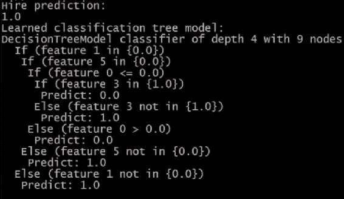

所以，在上图中，你可以看到我们在上面放入的测试人员中，我们预测这个人会被录用，我还打印出了决策树本身，所以这是很酷的。 现在，让我们再次调出该 Excel 文档，以便将其与输出进行比较：


我们可以走过去看看是什么意思。 所以，在我们的输出决策树中，我们实际上得到的深度是 4，有 9 个不同的节点，如果我们再次提醒自己这些不同的字段对应的是什么，那么读取的方法是：如果(0 中的特征 1)，那么这意味着如果受雇人员是否，那么我们下拉到特征 5。这个列表是从零开始的，所以我们的 Excel 文档中的特征 5 是实习。 我们可以这样说：这个人目前没有工作，没有实习，没有之前几年的工作经验，有学士学位，我们不会雇用这个人。 然后我们谈到 Else 子句。 如果那个人有更高的学位，我们就会雇佣他们，这仅仅是基于我们所拥有的数据，我们对他们进行了培训。 因此，您可以计算出这些不同的功能 ID 在原始数据中的含义，记住，您总是从 0 开始计数，并相应地进行解释。 请注意，在它看到的这个可能的类别列表中，所有分类特征都用布尔值表示，而连续数据用小于或大于关系的数字表示。

现在你有了它，一个使用 Spark 和 MLlib 构建的实际决策树，它实际上是有效的，有意义的。 非常棒的东西。

# Spark 中的 K-均值聚类

好的，让我们看一下在 MLlib 中使用 Spark 的另一个例子，这一次我们将研究 k-Means 群集，就像我们在决策树中所做的那样，我们将采用与使用 SCISKIT 相同的示例-Learn，我们将在 Spark 中使用它，这样它实际上可以扩展到一个海量数据集。 所以，再一次，我已经确保关闭所有其他的东西，我将进入我的图书资料，打开`SparkKMeans`Python 脚本，让我们来研究一下里面发生了什么。

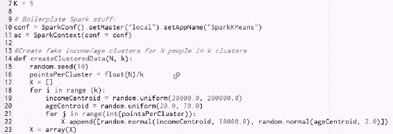

好的，再来一次，我们从一些样板开始。

```py
from pyspark.mllib.clustering import KMeans 
from numpy import array, random 
from math import sqrt 
from pyspark import SparkConf, SparkContext 
from sklearn.preprocessing import scale 

```

我们将从集群`MLlib`包中导入`KMeans`包，从`numpy`中导入数组和随机数组，因为同样，我们可以自由使用您想要的任何东西，这是一天结束时的 Python 脚本，而`MLlib`通常需要`numpy`数组作为输入。 我们将导入`sqrt`函数和常见的样板内容，我们需要`SparkConf`和`SparkContext`，几乎每次都需要从`pyspark`导入。 我们还将从`scikit-learn`导入 Scale 函数。 同样，只要您确保要在其上运行此作业的每台计算机上都安装了`scikit-learn`，那么使用`scikit-learn`是可以的，而且不要仅仅因为您在 Spark 上运行它就认为`scikit-learn`会神奇地自我扩展。 但是，因为我只将它用于缩放函数，所以它是可以的。 好的，让我们来安排一下吧。

我将首先创建一个全局变量：

```py
 K=5 

```

在本例中，我将使用 K 值 5 运行 k-Means 群集，这意味着有五个不同的群集。 然后，我将继续设置一个仅在我自己的桌面上运行的本地`SparkConf`：

```py
conf = SparkConf().setMaster("local").setAppName("SparkKMeans") 
sc = SparkContext(conf = conf) 

```

我将把应用程序的名称设置为`SparkKMeans`，并创建一个`SparkContext`对象，然后我可以使用该对象创建在本地计算机上运行的 RDDS。 现在我们将跳过`createClusteredData`函数，转到运行的第一行代码。

```py
data = sc.parallelize(scale(createClusteredData(100, K)))  

```

1.  我们要做的第一件事是通过在我创建的一些假数据中并行化来创建一个 RDD，这就是`createClusteredData`函数所做的。 基本上，我告诉你要创建 100 个数据点围绕着 K 个质心聚集，这和我们在本书前面使用 k-Means 聚类时看到的代码几乎相同。 如果你想复习一下，那就回去看看那一章吧。 基本上，我们要做的是创建一组随机质心，我们通常会围绕这些质心分布一些年龄和收入数据。 因此，我们正在做的是试图根据人们的年龄和收入对他们进行分类，我们正在编造一些数据点来做到这一点。 这将返回我们的假数据的`numpy`数组。
2.  一旦结果从`createClusteredData`返回，我就会调用`scale`，这将确保我的年龄和收入处于可比较的范围内。 现在，还记得我们学习过的那一节吗？我们说你必须记住数据规范化。 这是其中一个很重要的例子，所以我们用`scale`对数据进行归一化，这样我们就可以从 k-均值中得到好的结果。
3.  最后，我们使用`parallelize`将结果数组列表并行化为 RDD。 现在我们的数据 RDD 包含了我们所有的假数据。 我们所要做的就是对我们的训练数据调用`KMeans.train`，这比决策树更容易。

```py
clusters = KMeans.train(data, K, maxIterations=10, 
        initializationMode="random") 

```

我们传入我们想要的簇数，我们的 K 值，这个参数给它要做的处理量设定了一个上限；然后我们告诉它使用默认的初始化模式 k-Means，在这种模式下，我们只需在开始迭代之前随机地为我们的簇挑选初始质心，然后返回我们可以使用的模型。 我们称它为`clusters`。

好了，现在我们可以玩那个群集了。

让我们从打印出每个点的群集分配开始。 因此，我们将获取原始数据，并使用 lambda 函数对其进行转换：

```py
resultRDD = data.map(lambda point: clusters.predict(point)).cache() 

```

这个函数只是将每个点转换成根据我们的模型预测的簇数。 再说一次，我们只是采用数据点的 RDD。 我们调用`clusters.predict`来计算 k-Means 模型将它们分配给哪个群集，我们只需将结果放入`resultRDD`。 现在，我想在这里指出的一件事是上面代码中的缓存调用。

在执行 Spark 时，重要的一点是，无论何时要调用 RDD 上的多个操作，首先缓存它都很重要，因为当您调用 RDD 上的操作时，Spark 会触发并计算出它的 DAG，以及如何以最佳方式获得该结果。

它将会爆炸，并实际执行所有操作以获得结果。 因此，如果我对同一个 RDD 调用两个不同的操作，它实际上会对该 RDD 求值两次，如果您想避免所有额外的工作，可以缓存您的 RDD，以确保它不会多次重新计算它。

通过这样做，我们可以确保这两个后续操作执行正确的操作：

```py
print ("Counts by value:") 
counts = resultRDD.countByValue() 
print (counts) 

print ("Cluster assignments:") 
results = resultRDD.collect() 
print (results) 

```

为了得到一个实际的结果，我们要做的是使用`countByValue`，这将给我们返回一个 RDD，它包含每个簇中有多少个点。 请记住，`resultRDD`当前已将每个单独的点映射到它最终得到的集群，因此现在我们可以使用`countByValue`对每个给定集群 ID 看到的值进行计数。然后，我们可以轻松地打印出该列表。 我们还可以查看 RDD 的原始结果，通过对它调用`collect`，这将返回每个点的聚类分配，我们可以打印出所有的结果。

# 在误差平方和集合内(WSSSE)

现在，我们如何衡量我们的集群有多好呢？ 好的，其中一个度量被称为集合内平方误差和，哇，听起来很奇妙！ 这是一个很大的术语，我们需要一个缩写，WSSSE。 我们只需查看每个点到其质心(每个群集中的最终质心)的距离，取误差的平方，并对整个数据集进行求和。 它只是衡量每个点离其质心有多远。 显然，如果我们的模型有很大的误差，那么它们往往会离可能适用的质心很远，因此，例如，我们需要更高的 K 值。 我们可以继续计算该值，并使用以下代码将其打印出来：

```py
def error(point): 
    center = clusters.centers[clusters.predict(point)] 
    return sqrt(sum([x**2 for x in (point - center)])) 

WSSSE = data.map(lambda point: error(point)).reduce(lambda x, y: x + y) 
print("Within Set Sum of Squared Error = " + str(WSSSE)) 

```

首先，我们定义了这个`error`函数，它计算每个点的平方误差。 它只取每个簇的点到质心的距离，并将其相加。 为此，我们获取源数据，对其调用 lambda 函数，该函数实际计算每个质心中心点的误差，然后我们可以在这里将不同的操作链接在一起。

首先，我们调用`map`来计算每个点的误差。 然后，为了获得表示整个数据集的最终总计，我们对该结果调用`reduce`。 所以，我们用`data.map`来计算每个点的误差，然后`reduce`把所有这些误差加在一起。 这就是小 lambda 函数的作用。 这基本上是一种奇特的方式，意思是“我希望您将此 RDD 中的所有内容加在一个最终结果中。”`reduce`将获取整个 RDD，一次两个内容，并使用您提供的任何函数将它们组合在一起。 我在上面提供的函数是“将我组合在一起的两行相加。”

如果我们在 RDD 的每个条目中都这样做，我们最终会得到一个最终的总和。 仅仅总结一组值看起来可能有点费解，但通过这种方式，我们能够确保在需要的情况下可以实际分发此操作。 实际上，我们可以在一台机器上计算一段数据的和，在另一台机器上计算另一段数据的和，然后将这两个和合并成最终结果。 这个`reduce`函数表示，如何获取此操作的任意两个中间结果，并将它们组合在一起？

再说一次，如果你想要理解这一点，你可以花点时间再盯着它看一会儿。 这里没有什么花哨的事情，但有几点很重要：

*   如果您想要确保不对要多次使用的 RDD 进行不必要的重新计算，我们介绍了缓存的使用。
*   我们介绍了`reduce`函数的用法。
*   我们这里还有几个有趣的映射器函数，因此在这个示例中有很多值得学习的地方。

到头来，它只会执行 k-均值聚类，所以让我们继续运行它。

# 运行代码

转到工具菜单的 Canopy 命令提示符，然后键入：

```py
spark-submit SparkKMeans.py  

```

按下 Return 键，它就会离开。 在这种情况下，您可能需要等待片刻才能看到输出出现在您面前，但您应该看到如下所示：


成功了，太棒了！ 记住，我们要求的输出是，首先，计算每个簇中有多少个点。 这告诉我们，簇 0 有 21 个点，簇 1 有 20 个点，以此类推。 它最终相当均匀地分布，所以这是一个好兆头。

接下来，我们打印出每个点的聚类分配，如果你还记得，编造这个数据的原始数据是按顺序进行的，所以你看到所有的 3 在一起，所有的 1 在一起，所有的 4 在一起，看起来好像开始有点混淆了 0 和 2，但总的来说，它似乎在揭示我们最初创建数据时使用的集群方面做得很好。(编者注：这句话的意思是：“我知道你的想法是什么？)”“。

最后，我们计算了 WSSSE 度量，在本例中为 19.97。 所以，如果你想玩这个游戏，我鼓励你这么做。 当您增加或减少 K 的值时，您可以看到错误度量发生了什么，并想一想为什么会发生这种情况。 您还可以试验一下，如果不对所有数据进行标准化，会发生什么情况，这实际上会以一种有意义的方式影响您的结果吗？ 这真的是一件重要的事情吗？ 您还可以在模型本身上试验`maxIterations`参数，并很好地了解这对最终结果有什么影响，以及它有多重要。 所以，你可以随意摆弄它，进行实验。 这是使用 MLlib 和 Spark 以可伸缩方式完成的 k-Means 集群。 很酷的东西。

# TF-IDF

因此，我们的 MLlib 的最后一个示例将使用一种称为词语频率反转文档频率(TF-IDF)的东西，它是许多搜索算法的基本构建块。 像往常一样，这听起来很复杂，但并不像听起来那么糟糕。

所以，首先，让我们谈谈 TF-IDF 的概念，以及我们如何使用它来解决搜索问题。 我们实际上要用 TF-IDF 做的是使用 MLlib 中的 Apache Spark 为维基百科创建一个基本的搜索引擎。 这是不是太棒了？ 我们开始吧。

TF-IDF 代表词频(Term Frequency)和反向文档频率(Inverse Document Frequency)，在给定较大的文档体的情况下，这两个度量基本上是紧密相关的，用于进行搜索并计算出给定单词与文档的相关性。 例如，维基百科上的每一篇文章都可能有一个与之相关联的词频，互联网上的每一页都可能有一个与该文档中出现的每个单词相关联的词频。 听起来很奇特，但正如您将看到的，这是一个相当简单的概念。

*   **所有术语频率**表示给定单词在给定文档中出现的频率。 那么，在一个网页中，在维基百科的一篇文章中，在任何一个文档中，一个给定的单词有多常见？ 你知道，这个词在文档中所有词中出现的比率是多少？ 就这样。 这就是所有的词频。
*   **文档频率**是相同的概念，但这一次是该单词在整个文档语料库中的频率。 那么，这个词在我拥有的所有文档、所有网页、维基百科上的所有文章中出现的频率有多高？ 例如，像“a”或“the”这样的常见单词会有非常高的文档频率，我希望它们也会有非常高的词频，但这并不一定意味着它们与给定的文档相关。

你可以在某种程度上看出我们要做的是什么。 所以，假设我们对一个给定的单词有非常高的词频和非常低的文档频率。 这两件事的比率可以让我衡量这个词与文档的相关性。 因此，如果我看到一个在给定文档中经常出现的单词，但在整个文档空间中出现的频率不是很高，那么我知道这个单词可能对这个特定的文档表达了一些特殊的含义。 它可能会传达这份文件的实际内容。

那就是特遣部队-以色列国防军。 它只代表术语频率 x 反向文档频率，这只是术语频率对文档频率的一种奇特方式，也就是一种奇妙的方式，即与它在整个文档中出现的频率相比，这个词在文档中出现的频率有多高？ 就这么简单。

# TF-IDF 在实践中的应用

在实践中，我们如何使用它有一些细微差别。 例如，我们使用倒数文档频率的实际对数，而不是原始值，这是因为实际上词频往往呈指数分布。 因此，考虑到单词的整体受欢迎程度，通过使用日志，我们最终得到了稍微更好的单词权重。 显然，这种方法有一些局限性，其中之一是我们基本上假设文档只不过是一袋单词，我们假设单词之间没有关系。 显然，情况并不总是这样，实际上解析出它们可能是工作的一部分，因为您必须处理同义词和单词的各种时态、缩写、大写、拼写错误等问题。 这又回到了清理数据是您作为数据科学家工作的一大部分的想法，尤其是当您处理自然语言处理的东西时更是如此。 幸运的是，有一些库可以帮助您解决这一问题，但这是一个真正的问题，它将影响您的结果质量。

我们在 TF-IDF 中使用的另一个实现技巧是，为了节省空间和提高效率，我们实际上将每个单词映射到一个数值(我们称之为散列值)，而不是存储实际的字符串词及其词频和倒数文档频率。 我们的想法是，我们有一个函数，它可以接受任何单词，查看它的字母，并以某种相当均匀的方式将其赋给一个范围内的一组数字。 这样，我们可以将该散列值指定为 10，而不是使用“表示”这个词，然后我们就可以从现在开始将“表示”这个词称为“10”。 现在，如果散列值的空间不够大，最终可能会出现不同的单词由相同的数字表示，这听起来比实际情况更糟糕。 但是，您知道，您希望确保您有一个相当大的散列空间，因此这种情况不太可能发生。 这些称为散列冲突。 它们可能会引起问题，但在现实中，人们在英语中常用的单词只有这么多。 你可以带着 10 万左右逃脱惩罚，一切都很好。

在规模上做到这一点是困难的部分。 如果你想在整个维基百科上做这件事，那么你必须在一个集群上运行它。 但为了便于讨论，我们现在只使用维基百科的一小部分数据在我们自己的桌面上运行。

# 使用 TF-IDF

我们怎样才能把它变成一个实际的搜索问题呢？ 一旦我们有了 TF-IDF，我们就有了每个单词与每个文档的相关性的度量。 我们该怎么处理它？ 好的，你可以做的一件事是计算我们在整个文档中遇到的每个单词的 TF-IDF，然后，假设我们想要搜索一个给定的词，一个给定的词。 假设我们想要搜索“在我的维基百科文章集中，哪篇维基百科文章与葛底斯堡最相关？” 我可以根据他们在葛底斯堡的 TF-IDF 分数对所有文档进行排序，只需获得排名靠前的结果，这些就是我在葛底斯堡的搜索结果。 就这样。 只需取你的搜索词，计算 TF-IDF，得到排名靠前的结果。 就这样。

显然，在现实世界中，需要搜索的东西远不止这些。 谷歌有一大批人在研究这个问题，实际上这个问题要复杂得多，但这实际上会给你一个有效的搜索引擎算法，产生合理的结果。 让我们继续下去，看看这一切是如何运作的。

# 用 Spark MLlib 搜索维基百科

我们将使用 MLlib 中的 Apache Spark 为一段维基百科构建一个实际的工作搜索算法，并且我们将在不到 50 行的代码中完成所有这些工作。 这可能是整本书里我们做的最酷的事了！

进入您的课程材料并打开`TF-IDF.py`脚本，这将使用以下代码打开 Canopy：


现在，让我们退一步，让它深入了解我们实际上正在创建一个有效的搜索算法，以及在这里的不到 50 行代码中使用它的几个例子，并且它是可伸缩的。 我可以在集群上运行它。 这是一种令人惊奇的感觉。 让我们逐步了解一下代码。

# 导入语句

我们将从导入在 Python 中运行的任何 Spark 脚本所需的`SparkConf`和`SparkContext`库开始，然后使用以下命令导入`HashingTF`和`IDF`。

```py
from pyspark import SparkConf, SparkContext 
from pyspark.mllib.feature import HashingTF 
from pyspark.mllib.feature import IDF 

```

因此，这就是在我们的文档中计算词频(`TF`)和逆文档频率(`IDF`)的方法。

# 创建初始 RDD

我们将从创建 LOCAL`SparkConfiguration`和`SparkContext`的样板 Spark 内容开始，然后我们可以从它们创建我们的初始 RDD。

```py
conf = SparkConf().setMaster("local").setAppName("SparkTFIDF") 
sc = SparkContext(conf = conf) 

```

接下来，我们将使用我们的`SparkContext`从`subset-small.tsv`创建一个 RDD。

```py
rawData = sc.textFile("e:/sundog-consult/Udemy/DataScience/subset-small.tsv") 

```

这是一个包含制表符分隔值的文件，它代表了维基百科文章的一个小样本。 同样，对于安装本书课程材料的位置，您需要根据需要更改路径，如前面的代码所示。

这给我返回了一个 RDD，其中每个文档都在 RDD 的每一行中。 `tsv`文件每行包含一个完整的维基百科文档，我知道这些文档中的每一个都被分成表格字段，这些字段包含关于每篇文章的不同位的元数据。

接下来我要做的是将它们分开：

```py
fields = rawData.map(lambda x: x.split("\t")) 

```

我将根据文档的制表符分隔符将每个文档拆分成一个 Python 列表，并创建一个新的`fields`RDD，它现在包含该输入数据中每个字段的 Python 列表，而不是原始输入数据。

最后，我将映射该数据，获取每个字段列表，提取字段 3`x[3]`，我碰巧知道它是文章本身的正文，也就是实际的文章文本，然后我将根据空格对其进行拆分：

```py
documents = fields.map(lambda x: x[3].split(" ")) 

```

`x[3]`所做的是从每一篇维基百科文章中提取正文，并将其分成一个单词列表。 我的新`documents`RDD 为每个文档都有一个条目，该 RDD 中的每个条目都包含该文档中出现的单词列表。 现在，当我们评估结果的时候，我们实际上知道这些文档应该叫什么。

我还将创建一个存储文档名称的新 RDD：

```py
documentNames = fields.map(lambda x: x[1]) 

```

所做的全部工作就是获取相同的`fields`RDD 并使用这个`map`函数来提取文档名称，我碰巧知道它在第一个字段中。

因此，我现在有两个 RDDS，`documents`，它包含每个文档中出现的单词列表，以及`documentNames`，它包含每个文档的名称。 我还知道它们的顺序相同，所以我可以稍后将它们组合在一起来查找给定文档的名称。

# 创建和转换 HashingTF 对象

现在，奇迹发生了。 我们要做的第一件事是创建一个`HashingTF`对象，我们将传入一个 100,000 的参数。 这意味着我将把每个单词散列为 100,000 个数值中的一个：

```py
hashingTF = HashingTF(100000)  

```

它将尝试尽可能均匀地将每个单词分配给唯一的散列值，而不是在内部将单词表示为字符串(这非常低效)。 我提供多达 100,000 个散列值可供选择。 基本上，这是在一天结束时将单词映射到数字。

接下来，我将使用文档的实际 RDD 在`hashingTF`上调用`transform`：

```py
tf = hashingTF.transform(documents) 

```

这将获取每个文档中的单词列表，并将其转换为散列值列表，即表示每个单词的数字列表。

在这一点上，它实际上表示为稀疏向量，以节省更多空间。 因此，我们不仅将所有的单词转换为数字，而且还剔除了所有缺失的数据。 如果一个单词没有出现在文档中，而您没有存储 Word 没有显式出现的事实，那么它会节省更多的空间。

# 计算 TF-IDF 得分

为了实际计算每个文档中每个单词的 TF-IDF 分数，我们首先缓存这个`tf`RDD。

```py
tf.cache() 

```

我们这么做是因为我们将不止一次地使用它。 接下来，我们使用`IDF(minDocFreq=2)`，这意味着我们将忽略任何至少出现两次的单词：

```py
idf = IDF(minDocFreq=2).fit(tf) 

```

我们在`tf`上调用`fit`，然后在下一行中调用`tf`上的`transform`：

```py
tfidf = idf.transform(tf) 

```

我们在这里得到的是每个文档中每个单词的 TF-IDF 分数的 RDD。

# 使用维基百科搜索引擎算法

让我们试着将算法投入使用。 让我们试着在最好的文章中查找单词**Gettysburg**。 如果你不熟悉美国历史，那就是亚伯拉罕·林肯发表著名演讲的地方。 因此，我们可以使用以下代码将单词 Gettysburg 转换为其哈希值：

```py
gettysburgTF = hashingTF.transform(["Gettysburg"]) 
gettysburgHashValue = int(gettysburgTF.indices[0]) 

```

然后，我们将该散列值的 TF-IDF 分数提取到每个文档的新 RDD 中：

```py
gettysburgRelevance = tfidf.map(lambda x: x[gettysburgHashValue])  

```

这样做的目的是从每个文档映射到的散列值中提取 Gettysburg 的 TF-IDF 分数，并将其存储在这个`gettysburgRelevance`RDD 中。

然后我们将其与`documentNames`相结合，这样我们就可以看到结果：

```py
zippedResults = gettysburgRelevance.zip(documentNames)  

```

最后，我们可以打印出答案：

```py
print ("Best document for Gettysburg is:") 
print (zippedResults.max()) 

```

# 运行该算法

所以，让我们去运行一下，看看会发生什么。 像往常一样，要运行 Spark 脚本，我们不会只点击剧本图标。 我们必须进入 Tools>Canopy Command Prompt(工具>Canopy 命令提示符)。 在打开的命令提示符中，我们将键入`spark-submit TF-IDF.py`，然后它就会关闭。

我们要求它处理相当多的数据，尽管它只是维基百科的一个小样本，但它仍然是一个相当大的信息块，所以这可能需要一段时间。 让我们看看葛底斯堡的最佳文档匹配结果是什么，哪个文档的 TF-IDF 分数最高？


是亚伯拉罕·林肯！ 这不是很棒吗？ 我们只用了几行代码就做了一个真正能用的搜索引擎。

现在有了一个实际的维基百科搜索算法，它使用 MLlib 和 TF-IDF 中的 Spark 对一小段维基百科进行搜索。 最妙的是，如果我们愿意的话，如果我们有足够大的集群来运行它，我们实际上可以把它扩展到整个维基百科。

希望我们能引起您对 Spark 的兴趣，您可以看到如何将其应用于以分布式方式解决非常复杂的机器学习问题。 所以，它是一个非常重要的工具，我想确保你在读完这本关于数据科学的书之前，至少不知道如何将 Spark 应用于大数据问题的概念。 因此，当您需要超越一台计算机所能做的事情时，请记住，Spark 随时可供您使用。

# 为 MLlib 使用 Spark 2.0 DataFrame API

本章最初是为 Spark 1 制作的，所以让我们来谈谈 Spark 2 中的新功能，以及 MLlib 现在有哪些新功能。

因此，Spark 2 的主要特点是他们越来越多地转向数据帧和数据集。 数据集和数据帧有时可以互换使用。 从技术上讲，DataFrame 是行对象的数据集，它们有点像 RDD，但唯一的区别是，RDD 只包含非结构化数据，而数据集有定义的模式。

数据集提前准确地知道每行中存在哪些列信息，以及这些信息的类型。 因为它提前知道该数据集的实际结构，所以可以更高效地进行优化。 它还让我们认为这个数据集的内容是一个很小的迷你数据库，如果它在集群上，那么实际上是一个非常大的数据库。 这意味着我们可以对其执行诸如发出 SQL 查询之类的操作。

这创建了一个更高级别的 API，我们可以使用它来查询和分析 Spark 集群上的海量数据集。 这是很酷的东西。 它更快，有更多的优化机会，而且它有一个更高级别的 API，通常更容易使用。

# Spark 2.0 MLlib 的工作原理

展望 Spark 2.0，MLlib 将把数据帧作为其主要 API。 这就是未来的方式，所以让我们来看看它是如何工作的。 我已经在 Canopy 中打开了`SparkLinearRegression.py`文件，如下图所示，所以让我们简单介绍一下：

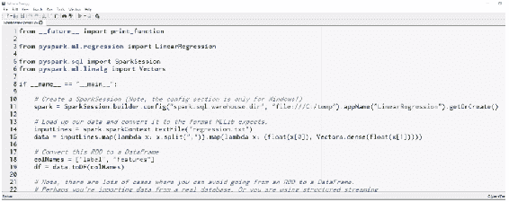

正如您所看到的，首先，我们使用`ml`而不是`MLlib`，这是因为新的基于数据帧的 API 就在其中。

# 实施线性回归

在这个例子中，我们要做的是实现线性回归，而线性回归只是将直线拟合到一组数据的一种方式。 在这个练习中，我们要做的是拿出一堆捏造的二维数据，然后试着用线性模型来拟合一条直线。

我们将把我们的数据分成两组，一组用于建立模型，另一组用于评估模型，我们将比较这个线性模型在实际预测实际值方面的表现。 首先，在 Spark 2 中，如果要使用`SparkSQL`接口和数据集进行操作，则必须使用`SparkSession`对象而不是`SparkContext`对象。 要设置一个，请执行以下操作：

```py
spark = SparkSession.builder.config("spark.sql.warehouse.dir", "file:///C:/temp").appName("LinearRegression").getOrCreate() 

```

Note that the middle bit is only necessary on Windows and in Spark 2.0\. It kind of works around a little bug that they have, to be honest. So, if you're on Windows, make sure you have a `C:/temp` folder. If you want to run this, go create that now if you need to. If you're not on Windows, you can delete that whole middle section to leave: `spark = SparkSession.builder.appName("LinearRegression").getOrCreate()`.

好的，你可以说`spark`，给它一个`appName`和`getOrCreate()`。

这很有趣，因为一旦您创建了 Spark 会话，如果它意外终止，您可以在下一次运行它时从那里恢复。 因此，如果我们有一个检查点目录，它实际上可以使用`getOrCreate`从它停止的地方重新开始。

现在，我们将使用我在课程材料中包含的`regression.txt`文件：

```py
inputLines = spark.sparkContext.textFile("regression.txt")  

```

这只是一个具有两列逗号分隔值的文本文件，它们只是两列或多或少随机线性相关的数据。 它可以代表你想要的任何东西。 例如，让我们假设它代表高度和体重。 因此，第一列可能代表高度，第二列可能代表重量。

In the lingo of machine learning, we talk about labels and features, where labels are usually the thing that you're trying to predict, and features are a set of known attributes of the data that you use to make a prediction from.

在本例中，高度可能是标签，特征可能是权重。 也许我们是想根据你的体重来预测身高。 它可以是任何东西，都无关紧要。 这都是归一化到-1 到 1 之间的数据。数据的规模在任何地方都没有真正的意义，你可以假装它意味着任何你想要的东西，真的。

要将其与 MLlib 一起使用，我们需要将数据转换为它期望的格式：

```py
data = inputLines.map(lambda x: x.split(",")).map(lambda x: (float(x[0]), Vectors.dense(float(x[1]))))  

```

我们要做的第一件事是用这个`map`函数拆分数据，该函数将每一行都拆分成一个列表中的两个不同的值，然后我们将把它映射到 MLlib 期望的格式。 这将是一个浮点标签，然后是要素数据的密集向量。

在这种情况下，我们只有一位特征数据，即权重，所以我们有一个只有一个东西的向量，但即使只有一个东西，MLlib 线性回归模型也需要一个稠密的向量。 这类似于旧 API 中的`labeledPoint`，但在这里我们必须以很难的方式完成它。

接下来，我们需要实际为这些列指定名称。 下面是执行此操作的语法：

```py
colNames = ["label", "features"] 
df = data.toDF(colNames) 

```

我们将告诉 MLlib，生成的 RDD 中的这两列实际上对应于标签和特性，然后我可以将该 RDD 转换为 DataFrame 对象。 在这一点上，我有一个实际的数据帧，或者，如果您愿意，我有一个包含两列的数据集，标签和要素，其中标签是浮点高度，而要素列是浮点权重的密集向量。 这是 MLlib 所要求的格式，而 MLlib 对此可能非常挑剔，因此请注意这些格式，这一点很重要。

现在，就像我说的，我们要把我们的数据一分为二。

```py
trainTest = df.randomSplit([0.5, 0.5]) 
trainingDF = trainTest[0] 
testDF = trainTest[1] 

```

我们将训练数据和测试数据各占一半。 这将返回两个数据帧，一个将用于实际创建我的模型，另一个将用于评估我的模型。

接下来，我将使用这里设置的几个标准参数创建我的实际线性回归模型。

```py
lir = LinearRegression(maxIter=10, regParam=0.3, elasticNetParam=0.8) 

```

我们将调用`lir = LinearRegression`，然后我会将该模型与我保留用于训练的数据集(训练数据框)相匹配：

```py
model = lir.fit(trainingDF) 

```

这给了我一个可以用来做预测的模型。

我们就这么做吧。

```py
fullPredictions = model.transform(testDF).cache() 

```

我将调用`model.transform(testDF)`，这将根据我的测试数据集中的权重预测高度。 我实际上有已知的标签，实际的、正确的高度，这将向该数据帧添加一个新的列，称为预测，它具有基于该线性模型的预测值。

我将缓存这些结果，现在我只需提取它们并将它们进行比较。 因此，让我们提取预测列，就像在 SQL 中一样使用`select`，然后我将实际转换该数据帧并从中提取 RDD，并使用它将其映射到一个普通的、充满浮点高度的旧 RDD，在本例中：

```py
predictions = fullPredictions.select("prediction").rdd.map(lambda x: x[0]) 

```

这些是预测的高度。 接下来，我们将从标签列中获取实际高度：

```py
labels = fullPredictions.select("label").rdd.map(lambda x: x[0]) 

```

最后，我们可以将它们压缩在一起，并排打印出来，看看效果如何：

```py
predictionAndLabel = predictions.zip(labels).collect() 

for prediction in predictionAndLabel: 
    print(prediction) 

spark.stop() 

```

这是一种令人费解的方法；我这样做是为了与前面的示例更一致，但更简单的方法是只需实际选择预测并将其一起标记到单个 RDD 中，该 RDD 将这两列映射在一起，然后我不必将它们压缩，但无论哪种方式，它都可以工作。 您还会注意到，就在最后，我们需要停止 Spark 会话。

所以让我们看看它是不是起作用了。 让我们转到 Tools(工具)，Canopy Command Prompt(Canopy 命令提示符)，然后键入`spark-submit SparkLinearRegression.py`，看看会发生什么。

使用数据集实际运行这些 API 需要更多一点的前期时间，但是一旦开始运行，速度就会非常快。 好的，这就对了。


这里我们把实际值和预测值并排放在一起，你可以看到它们还不算太差。 他们往往大同小异。 现在，您有了一个正在使用 Spark 2.0 的线性回归模型，它使用了用于 MLlib 的新的基于数据帧的 API。 在 Spark 中，随着 MLlib 的发展，您将越来越多地使用这些 API，因此请确保在可能的情况下选择这些 API。 好的，这就是 Spark 中的 MLlib，一种在整个集群中实际分配大量计算任务的方法，用于在大数据集上进行机器学习。 所以，这是一项很好的技能。 让我们继续前进吧。

# 简略的 / 概括的 / 简易判罪的 / 简易的

在本章中，我们从安装 Spark 开始，然后深入介绍 Spark，同时了解 Spark 如何与 RDDS 结合使用。 我们还介绍了创建 RDDS 的各种方法，同时探索了不同的操作。 然后，我们介绍了 MLlib，并详细介绍了 Spark 中决策树和 K-均值聚类的一些详细示例。 然后，我们完成了使用 TF-IDF 在短短几行代码中创建搜索引擎的神来之笔。 最后，我们了解了 Spark 2.0 的新特性。

在下一章中，我们将看看 A/B 测试和实验设计。