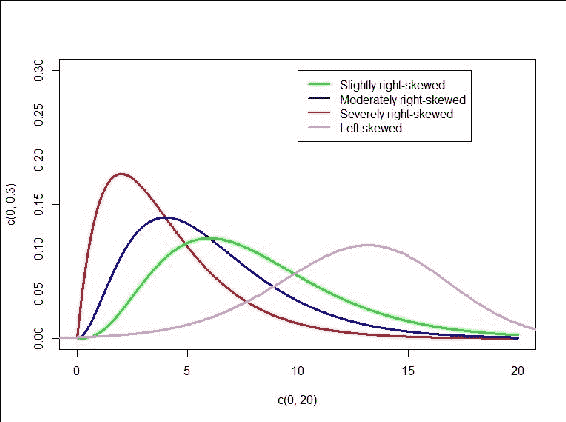
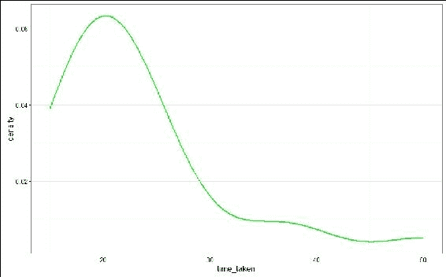
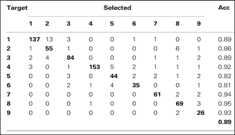
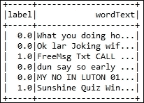
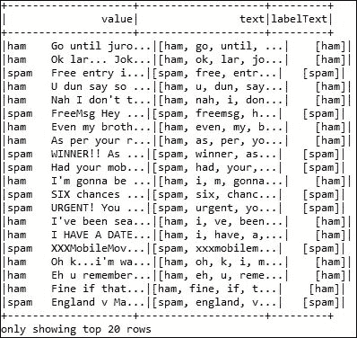
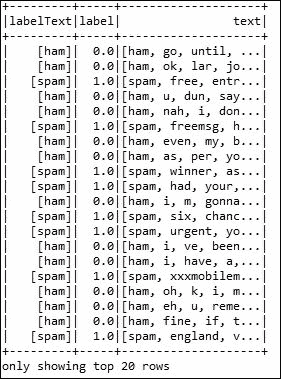
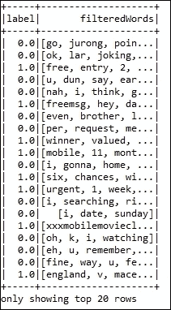

# 四、通过特征工程提取知识

应该使用哪些特征来创建预测模型不仅是一个至关重要的问题，也是一个困难的问题，可能需要对要回答的问题领域有深入的了解。可以自动选择数据中最有用或与某人正在处理的问题最相关的特征。考虑到这些问题，本章详细介绍了特征工程，解释了应用它的原因以及特征工程中的一些最佳实践。

除此之外，我们将使用 Spark MLlib 和 Spark ML APIs，提供应用于大规模机器学习技术的特征提取、转换和选择的理论描述和示例。此外，本章还介绍了高级特征工程(也称为极限特征工程)的基本思想。

请注意，在继续本章之前，您需要在机器上安装 R 和 RStudio，因为将使用 R 显示探索性数据分析的示例

简而言之，本章将涵盖以下主题:

*   特征工程的现状
*   特征工程的最佳实践
*   Spark的特征工程
*   高级特征工程

# 特征工程的现状

尽管特征工程是一个非正式的话题，但是它被认为是应用机器学习中必不可少的部分。机器学习领域的主要科学家之一吴恩达在他的著作*机器学习和通过大脑模拟的 AI*中定义了术语特征工程(另请参见，特征工程定义于:[https://en . Wikipedia . org/wiki/Andrew _ Nghttps://en . Wikipedia . org/wiki/Andrew _ Ng](https://en.wikipedia.org/wiki/Andrew_Nghttps://en.wikipedia.org/wiki/Andrew_Ng))如下:

> *想出特征难度大，耗时长，需要专家知识。应用机器学习基本上是特征工程。*

基于前面的定义，我们可以认为特征工程实际上是人类智能，而不是人工智能。此外，我们将从其他角度解释什么是特征工程。特征工程也可以定义为将原始数据转换为有用特征(也通常称为特征向量)的过程。这些特性有助于您最终向预测模型更好地表示潜在的问题；从而预测建模可以应用于新的数据类型，以获得高预测精度。

或者，我们可以将术语“特征工程”定义为使用或重用某人关于底层问题的高级领域知识和可用数据来创建特征的软件工程过程，这使得机器学习算法能够轻松工作。

这就是我们如何定义特征工程这个术语。如果您仔细阅读它，您会在这些定义中看到四个依赖项:

*   问题本身
*   您将使用原始数据来找出有用的模式或特征
*   机器学习问题或类别的类型
*   您将使用的预测模型

现在基于这四个依赖项，我们可以由此得出一个工作流。首先，你必须了解你的问题本身，然后你必须知道你的数据，如果它是有序的，如果不是，处理你的数据，以找到某种模式或特征，这样你就可以建立你的模型。

一旦你确定了特征，你需要知道你的问题属于哪一类。换句话说，你必须能够识别这是一个基于特征的分类、聚类还是回归问题。最后，您将使用众所周知的方法(如随机森林或**支持向量机** ( **支持向量机**)构建模型，对测试集或验证集进行预测。

在这一章中，你将看到并论证特征工程是一门处理不确定且通常是非结构化数据的艺术。同样真实的是，有许多定义明确的应用分类、聚类、回归模型的过程，或者像支持向量机这样既有方法又可证明的方法；然而，数据是一个变量，在不同的时间往往具有不同的特征。

## 特征提取与特征选择

你将会知道什么时候以及如何从经验学徒制中决定哪些程序需要遵循。特征工程涉及的主要任务是:

*   **数据探索与特征提取**:这是揭开原始数据中隐藏宝藏的过程。一般来说，这个过程不会因算法消耗特征而有很大变化。然而，更好地理解实践经验、业务领域和直觉在这方面起着至关重要的作用。
*   **特征选择**:这是根据你正在处理的机器学习问题来决定选择哪些特征的过程。您可以使用不同的技术来选择功能；但是，在算法和使用功能方面可能会有所不同。

## 特征工程的重要性

当最终目标是从预测模型中获得最准确和可靠的结果时，你必须尽最大努力投资于你所拥有的东西。在这种情况下，最好的投资是三个参数:时间和耐心、数据和可用性以及最佳算法。然而，*如何从数据中获取最有价值的宝藏用于预测建模？*是特征工程的过程和实践以一种新兴的方式解决的问题。

事实上，大多数机器学习算法的成功取决于您如何正确和智能地利用价值并呈现您的数据。人们通常认为，数据中隐藏的宝藏(即特征或模式)将直接刺激预测模型的结果。

因此，更好的特征(即您从数据集提取和选择的内容)意味着更好的结果(即您将从模型中获得的结果)。然而，请记住一件事，在你为你的机器学习模型概括前面的陈述之前，你需要一个伟大的特性，尽管如此，这个特性是真实的，它描述了你的数据中固有的结构。

总之，更好的特性意味着三个优点:灵活性、调整和更好的结果:

*   **更好的特征(更好的灵活性)**:如果你成功地提取和选择了更好的特征，你肯定会得到更好的结果，即使你选择了一个非最优或错误的模型。事实上，最佳或最合适的模型可以根据您拥有的原始数据的良好结构来选择或挑选。除此之外，良好的特性将允许您使用不太复杂但高效、更快、易于理解且最终易于维护的模型。
*   **更好的特性(更好的调优)**:正如我们已经说过的，如果你没有智能地选择你的机器学习模型，或者你的特性状态不佳，你更有可能从 ML 模型中得到更差的结果。但是，即使您在构建模型时选择了一些错误的参数，并且您确实拥有一些精心设计的特征，您仍然可以从模型中期待更好的结果。此外，您不需要太担心，甚至更努力地选择最佳模型和相关参数。原因很简单，这是一个很好的特性，你实际上已经很好地理解了这个问题，并准备通过描述问题本身来使用所有数据所代表的更好的东西。
*   **更好的特征(更好的结果)**:即使你将大部分精力花在特征工程上，以获得更好的特征选择，你也最有可能获得更好的结果。

我们也建议读者不要只对功能过于自信。前面的说法往往是对的；然而，有时它们会误导人。我们想进一步澄清前面的发言。实际上，如果你从一个模型中得到最好的预测结果，它实际上是由三个因素组成的:你选择的模型、你拥有的数据和你准备的特性。

因此，如果你有足够的时间和计算资源，总是尝试使用标准模型，因为简单并不意味着更好的准确性。尽管如此，更好的特性将在这三个因素中贡献最大。你应该知道的一件事是，不幸的是，即使你掌握了许多实践的特征工程，并研究了其他人在艺术状态下做得很好的东西，一些机器学习项目最终还是失败了。

## 特色工程与数据探索

通常，从更好的特性中为训练和测试样本做出明智的选择会带来更好的解决方案。虽然在上一节中我们讨论了在特征工程中有两个任务:从原始数据中提取特征和特征选择。然而，特征工程没有确定或固定的路径。

相反，特征工程的整个步骤在很大程度上是由可用的原始数据指导的。如果数据结构良好，你会感到幸运。然而，现实往往是原始数据来自多种格式的不同来源。因此，在进行特征提取和特征选择之前，探索这些数据非常重要。

### 类型

我们建议您在文献中使用直方图和异常值计算数据的偏斜度和峰度，并使用 Data Sidekick 技术(由 Abe Gong 引入)引导数据(参见:[https://好奇号. com/path/Abe-Gong-building-for resili-solid-2014-keynote-oreily/# Abe-Gong-building-for resili-solid-2014-keynote-oreily](https://curiosity.com/paths/abe-gong-building-for-resilience-solid-2014-keynote-oreilly/#abe-gong-building-for-resilience-solid-2014-keynote-oreilly))。

在应用特征工程之前，需要通过数据探索来回答和了解以下问题:

*   所有可用字段中存在或不存在空值或缺失值的数据占总数据的百分比是多少？然后尝试处理那些丢失的值，并在不丢失数据语义的情况下很好地解释它们。
*   字段之间的相关性是什么？每个字段与预测变量的相关性如何？它们取什么值(即分类或非分类、数值或α-数值等等)？
*   然后找出数据分布是否有偏差。你可以通过看到异常值或长尾来识别偏斜度(稍微向右偏斜或正偏斜，稍微向左偏斜或负偏斜，如图*图 1* )。现在确定异常值是否有助于做出预测。
*   之后，观察数据峰度。更严格地说，检查你的峰度是中峰度(小于但几乎等于 3)、细峰度(大于 3)还是扁峰度(小于 3)。注意，任何单变量正态分布的峰度都被认为是 3。
*   Now play with the tail and observe (do the predictions get better?) what happens when you remove the long tail?

    

    图 1:数据分布的偏斜度(x 轴=数据，y 轴=密度)。

您可以使用简单的可视化工具(如密度图)来实现这一点，如下例所示。

例 1。假设你对健身散步感兴趣，并且在过去四周(不包括周末)你在运动场或乡村散步。您花了以下时间(以分钟为单位)完成了 4 公里的步行轨迹:15、16、18、17.16、16.5、18.6、19.0、20.4、20.6、25.15、27.27、25.24、21.05、21.65、20.92、22.61、23.71、35、39 和 50。现在让我们用 r 来计算和解释这些值的偏斜度和峰度。

### 类型

我们将在[第 10 章](10.html#2BASE2-0b803698e2de424b8aa3c56ad52b005d "Chapter 10.  Configuring and Working with External Libraries")、*配置和使用外部库*中展示如何配置和使用 SparkR，并展示如何在 SparkR 上执行相同的代码。这背后的原因是一些绘图包如`ggplot2`在当前版本的 Spark 中仍然没有实现，直接用于 SparkR。但是，`ggplot2`在 GitHub 上以名为`ggplot2.SparkR`的组合包的形式提供，可以使用以下命令进行安装和配置:

**`devtools::install_github("SKKU-SKT/ggplot2.SparkR")`**

然而，在配置过程之前和期间，有许多依赖项需要确保。因此，我们应该在后面的章节中解决这个问题。目前，我们假设您具有使用 R 的基本知识，并且如果您的计算机上安装并配置了 R，请使用以下步骤。但是，如何使用 RStudio 安装和配置 SparkR 的分步示例将在[第 10 章](10.html#2BASE2-0b803698e2de424b8aa3c56ad52b005d "Chapter 10.  Configuring and Working with External Libraries")、*配置和使用外部库*中显示。

现在只需复制以下代码片段并尝试执行，以确保您有正确的偏斜度和峰度值。

安装`moments`包计算偏斜度和峰度:

```scala
install.packages("moments")  

```

使用`moments`包:

```scala
library(moments) 

```

为您在锻炼过程中花费的时间制作一个矢量:

```scala
time_taken <- c (15, 16, 18, 17.16, 16.5, 18.6, 19.0, 20.4, 20.6, 25.15, 27.27, 25.24, 21.05, 21.65, 20.92, 22.61, 23.71, 35, 39, 50) 

```

将时间转换为数据帧:

```scala
df<- data.frame(time_taken) 

```

现在计算`skewness`:

```scala
skewness(df) 
[1]1.769592  

```

现在计算`kurtosis`:

```scala
> kurtosis(df) 
[1]5.650427  

```

**结果解读**:你的锻炼时间偏斜度为 1.769592，说明你的数据向右偏斜或者正向偏斜。另一方面，峰度为 5.650427，这意味着数据的分布是细峰度的。现在检查异常值或尾部，检查下面的直方图。同样，为了简单起见，我们将使用 R 来绘制密度图，该密度图将解释您的锻炼时间。

安装`ggplot2package`绘制直方图:

```scala
install.packages("ggplot2") 

```

使用`moments`包:

```scala
library(ggplot2)

```

现在使用`ggplot2`的`qplot()`方法绘制直方图:

```scala
ggplot(df, aes(x = time_taken)) + stat_density(geom="line", col=  
"green", size = 1, bw = 4) + theme_bw() 

```



图 2。锻炼时间直方图(右偏)。

*图 2* 中给出的数据分布(锻炼时间)的解释显示，密度图向右倾斜，细曲线也是如此。除了密度图，您还可以查看每个单独要素的箱线图。其中箱线图显示基于五个数字汇总的数据分布:**最小值**、**第一个四分位数**、中值、**第三个四分位数**和**最大值**，如图*图 3* 所示，我们可以在其中寻找超出三(3) **四分位数区间** ( **IQR** )的异常值:


图 3。锻炼时间直方图(图由 Box Plot 提供:分布显示，[http://www . physics . csb sju . edu/stats/Box 2 . html http://www . physics . csb sju . edu/stats/Box 2 . html](http://www.physics.csbsju.edu/stats/box2.htmlhttp://www.physics.csbsju.edu/stats/box2.html))。

引导数据集有时也提供了对异常值的见解。如果数据量太大(即大数据)，做数据助手，评估和预测也是有用的。Data Sidekick 的想法是使用一小部分可用数据来找出可以从数据集得出什么见解，通常也称为*使用小数据乘以大数据的价值*。

它对于大规模文本分析非常有用。例如，假设您有一个巨大的文本语料库，当然您可以使用其中的一小部分来测试各种情感分析模型，并选择在性能(计算时间、内存使用、可伸缩性和吞吐量)方面给出最佳结果的模型。

现在，我们想提请您注意功能工程的其他方面。此外，将连续变量转换为分类变量(具有特定的特征组合)会产生更好的预测变量。

### 类型

在统计语言中，数据中的一个变量要么代表某种连续尺度上的测量值，要么代表某种分类或离散特征上的测量值。例如，运动员的体重、身高和年龄将代表连续变量。或者，生存或失败在时间方面也被认为是连续变量。另一方面，一个人的性别、职业或婚姻状况是分类或离散变量。从统计学上来说，有些变量可以用两种方式来考虑。例如，电影观众对 10 分制移动的评价可以被认为是一个连续变量，或者我们可以认为它是一个具有 10 个类别的离散变量。时间序列数据或实时流数据通常是为连续变量收集的，直到某个时间。

并行地，考虑正方形或立方体甚至使用特征的非线性模型也可以提供更好的见解。此外，明智地考虑向前选择或向后选择，因为这两种选择的计算量都很大。

最后，当特征数量变得非常大时，明智的决定是使用**主成分分析** ( **主成分分析**)或**奇异值分解** ( **奇异值分解**)技术来找到合适的特征组合。

## 特征提取–从数据中创建特征

特征提取是从您已经或将要收集的原始数据中构建新特征的自动方法。在特征提取过程中，降低复杂原始数据的维数通常是通过将观察值自动转换成更小的集合来实现的，该集合可以在以后的阶段进行建模。投影方法(如主成分分析和无监督聚类方法)用于 TXT、CSV、TSV 或 RDB 格式的表格数据。然而，从另一种数据格式中提取特征是非常复杂的。如果要提取的字段数量很大，特别是解析许多数据格式(如 XML 和 SDRF)是一个繁琐的过程。

对于诸如图像数据的多媒体数据，最常见的技术类型包括线或边缘检测或图像分割。然而，受领域和图像的限制，视频和音频观测发展到许多相同类型的**数字信号处理** ( **数字信号处理器**)方法，其中模拟观测通常以数字格式存储。

最积极的优点和特征提取的关键是开发和可用的方法是自动的；因此，它可以解决无法管理的高维数据问题。正如我们在[第 3 章](03.html#TI1E2-0b803698e2de424b8aa3c56ad52b005d "Chapter 3. Understanding the Problem by Understanding the Data")、*通过理解数据来理解问题*中所述，更多的数据探索和更好的特征提取最终会提高你的 ML 模型的性能(因为特征提取也涉及到特征选择)。事实是，更多的数据最终将为预测模型的性能提供更多的见解。然而，数据必须是有用的，转储不需要的数据会浪费你宝贵的时间；因此，在收集你的数据之前，考虑一下这句话的意思。

特征提取过程涉及几个步骤；包括数据转换和特征转换。正如我们多次指出的那样，如果机器学习模型经过良好的训练，能够从原始数据中获得更好的特征，那么该模型可能会提供更好的结果。针对学习和泛化进行优化是良好数据的关键特征。因此，以这种最佳格式将数据放在一起的过程是通过一些数据处理步骤来实现的，例如清理、缺失值处理和一些中间转换，如从文本文档到单词的转换。

帮助创建新特征作为预测变量的方法称为特征变换，它实际上是一组方法。降维本质上需要特征变换。通常，当转换后的要素具有描述性维度时，与原始要素相比，它可能具有更好的顺序。

因此，在构建机器学习模型时，较少描述的特征可以从训练或测试样本中删除。特征变换中最常见的任务包括非负矩阵分解、主成分分析和使用缩放、分解和聚合操作的因子分析。

特征提取的例子包括提取图像中的轮廓、从文本中提取图表、从口述文本的记录中提取音素等等。特征提取涉及特征的变换，这种变换往往是不可逆的，因为一些信息最终会在降维过程中丢失。

## 特征选择–从数据中过滤特征

特征选择是为预测建模和分析准备训练数据集或验证数据集的过程。特征选择在大多数机器学习问题类型中都有实际意义，包括分类、聚类、降维、协同过滤、回归等。

因此，最终目标是从原始数据集中的大量特征集合中选择一个子集。并且经常应用降维算法，如**奇异值分解** ( **奇异值分解**)和**主成分分析** ( **主成分分析**)。

特征选择技术的一个有趣的优点是可以应用最小特征集来表示可用数据中的最大方差。换句话说，特征的最小子集足以非常有效地训练你的机器学习模型。

该特征子集用于训练模型。有两种类型的特征选择技术，即向前选择和向后选择。正向选择从最强的功能开始，并不断添加更多功能。相反，向后选择从所有特征开始，并移除最弱的特征。然而，这两种技术在计算上都很昂贵。

### 特征选择的重要性

因为不是所有的特征都同等重要；因此，为了使模型更加精确，您会发现一些特征比其他特征更重要。因此，这些属性可以被视为与问题无关。因此，您需要在准备培训和测试集之前删除这些功能。有时，同样的技术可能会应用于验证集。

与重要性并行的是，您总是会发现一些功能在其他功能的上下文中是多余的。特征选择不仅涉及移除不相关或冗余的特征，它还服务于对提高模型精度很重要的其他目的，如下所述:

*   特征选择通过消除不相关的、空的/缺失的和冗余的特征，提高了所用模型的预测精度。它还处理高度相关的特征。
*   特征选择技术通过减少特征的数量使模型训练过程更加健壮和快速。

### 特征选择与降维

虽然通过使用特征选择技术，通过选择数据集中的某些特征来减少特征数量是可能的。稍后，子集用于训练模型。然而，整个过程通常不能与术语**降维**互换使用。

实际情况是，特征选择方法用于从数据的总集中提取子集，而不改变它们的底层属性。

相反，另一方面，降维方法采用已经设计的特征，这些特征可以通过在机器学习问题的某些考虑和要求下减少变量的数量来将原始特征转换成相应的特征向量。

因此，它实际上修改了底层数据，通过压缩数据从原始和有噪声的特征中提取原始特征，但保持了原始结构，并且大多数时间是不可逆的。降维方法的典型例子包括**主成分分析** ( **PCA** )、**典型相关分析** ( **CCA** )和**奇异值分解** ( **SVD** )。

其他特征选择技术使用基于过滤器的包装器方法和嵌入式方法，通过在监督上下文中评估每个特征和目标属性之间的相关性来选择特征。这些方法应用一些统计测量来给每个特征分配分数，也称为过滤方法。

然后根据有助于消除特定特征的评分系统对特征进行排名。这种技术的例子是信息增益、相关系数分数和卡方检验。包装方法的一个例子是递归特征消除算法，它是作为搜索问题的特征选择过程。另一方面，**最小绝对收缩和选择算子** ( **拉索**)、弹性网和岭回归是特征选择的嵌入方法的典型例子，也称为正则化方法。

Spark MLlib 的当前实现只为奇异值分解和主成分分析提供对`RowMatrix`类降维的支持。另一方面，从原始数据收集到特征选择的一些典型步骤是特征提取、特征变换和特征选择。

### 类型

建议感兴趣的读者阅读关于特征选择和降维的 API 文档，网址为:[http://spark . Apache . org/docs/latest/mllib-降维. html](http://spark.apache.org/docs/latest/mllib-dimensionality-reduction.html) 。

# 特征工程的最佳实践

在本节中，我们已经找出了一些在对可用数据执行功能工程时的良好实践。机器学习的一些最佳实践在[第 2 章](02.html#LTSU2-5afe140a04e845e0842b44be7971e11a "Chapter 2. Machine Learning Best Practices")、*机器学习最佳实践*中进行了描述。然而，这些对于整个机器学习领域来说太笼统了。当然，这些最佳实践在功能工程中也是有用的。此外，我们将在以下小节中提供更多关于特征工程的具体示例。

## 了解数据

尽管特性工程这个术语更具技术性，但是它是一门艺术，可以帮助你理解特性来自哪里。现在，一些重要的问题也在演变，需要在理解数据之前回答这些问题:

*   这些特征的起源是什么？数据是实时的还是来自静态来源？
*   特征是连续的、离散的还是没有？
*   特征的分布是怎样的？分布很大程度上取决于所考虑的示例子集吗？
*   这些特征是否包含缺失值(即空)？如果是，是否有可能处理这些值？有没有可能在现在、未来或即将到来的数据中消除它们？
*   是否有重复或多余的条目？
*   我们是否应该进行被证明有用的手动特征创建？如果是，在模型训练阶段融入这些特性有多难？
*   是否有可用作标准功能的功能？

知道前面问题的答案很重要。因为数据起源可以帮助你更快地准备你的特性工程技术。您需要知道您的功能是离散的还是连续的，或者请求是否是实时响应。此外，您需要知道数据分布以及它们的偏斜度和峰度，以处理异常值。

您需要为缺失值或空值做好准备，无论它们是可以删除还是需要用替代值填充。此外，您需要首先删除重复的条目，这一点非常重要，因为重复的数据点如果没有正确排除，可能会严重影响模型验证的结果。最后，您需要了解您的机器学习问题本身，因为了解问题类型将有助于您相应地标记您的数据。

## 创新的特征提取方式

在提取和选择特征时要有创新精神。在这里，我们总共提供了八个技巧，将帮助您在机器学习应用程序开发过程中推广相同的内容。

### 类型

通过将现有数据字段汇总到更广泛的级别或类别来创建输入。

更具体一点，给大家举几个例子。显然，你可以根据你的同事的头衔将其分为战略或战术。例如，您可以将具有*副总裁或副总裁以上级别的员工编码为战略型，而将*总监以下级别的员工编码为战术型。**

将几个行业归入一个更高层次的行业可能是这种分类的另一个例子。将石油和天然气公司与商品公司进行对比；黄金、白银或铂金作为贵金属公司；高科技巨头与电信行业同为*科技*；例如，将 1B 营收超过 100 万美元的公司定义为净资产为 100 万美元的大型公司*和小型公司*。**

 **### 类型

将数据分成不同的类别或箱。

更具体一点，给大家举几个例子。假设您正在对年收入从 5000 万美元到 100 万美元以上的公司进行分析。因此，很明显，您可以将收入分成几个连续的部分，例如 5000 万-2 亿美元、2010 万-5 亿美元、5.01 亿-1 亿美元的 1 B 和 1B+。现在，您如何以一种可呈现的格式来表示特征？很简单，每当一家公司陷入收入困境时，就试着给它一个值；否则，该值为零。现在有四个新的数据字段是从年收入字段创建的，对吗？

### 类型

想一个创新的方法将现有的数据字段合并成新的。

更具体一点，给大家举几个例子。在第一个技巧中，我们讨论了如何通过将现有的领域扩展到更广泛的领域来创建新的输入。现在，假设您想创建一个布尔标志来标识某人是否属于具有 10 年以上经验的副总裁或更高级别。因此，在这种情况下，您实际上是通过将一个数据字段乘以、除以、加上或减去另一个数据字段来创建新字段。

### 类型

思考手头的问题，同时发挥创造力。

在前面的技巧中，假设您已经创建了足够多的箱和字段或输入。现在，首先不要太担心创建太多变量。明智的做法是让头脑风暴成为特征选择步骤的正常流程。

### 类型

别傻了。

小心创建不必要的字段；因为从少量的数据中创建太多的特征可能会过度填充模型，从而导致虚假的结果。当你面对数据相关性时，记住相关性并不总是意味着因果关系。我们对这一共同点的逻辑是，模拟观测数据只能向我们表明两个变量是相关的，但它不能告诉我们原因。

书中的研究文章 *Freakonomics* (也可参见 *Steven D. Levitt，Stephen J. Dubner，Freakonomics:一个流氓经济学家探索一切事物的隐藏的一面*，[http://www . barnesandnoble . com/w/Freakonomics-Steven-d-Levitt/1100550563 http://www . barnesandnoble . com/w/Freakonomics-Steven-d-Levitt/11005500](http://www.barnesandnoble.com/w/freakonomics-steven-d-levitt/1100550563http://www.barnesandnoble.com/w/freakonomics-steven-d-levitt/1100550563)

因此，在创建和构造不必要的特征之前要谨慎，这意味着不要做一个傻瓜。

### 类型

不要过度设计。

在特性工程阶段，判断一次迭代是花几分钟还是半天是微不足道的。因为功能工程阶段最有效率的时间通常是在白板上度过的。因此，确保正确完成的最有效方法是向您的数据提出正确的问题。诚然，如今大数据这个术语正在取代特征工程这个术语。没有黑客攻击的空间，所以过度工程:


图 4:假阳性和假阴性的真实解释。

### 类型

当心假阳性和假阴性。

另一个重要的方面是比较假阴性和假阳性。根据问题的不同，在一个或另一个上获得更高的精度是很重要的。例如，如果你在医疗保健部门做研究，并试图开发一个机器学习模型，用于疾病预测，获得假阳性可能比获得假阴性结果更好。因此，我们在这方面的建议是查看混淆矩阵，它将帮助您以可视化的方式查看分类器做出的预测。

行表示每个观察的真实类别，而列对应于模型本身预测的类别，如图 4*所示。然而，*图 5* 会提供更多的见解。请注意，对角线元素，也称为正确决策，用粗体标记。最后一列 **Acc** ，表示每个键的精度，如下所示:*

 *

图 5:一个简单的混淆矩阵。

### 类型

在选择特征之前，考虑精度和召回率。

最后，需要考虑的两个更重要的量是精度和召回率。更确切地说，你的分类器正确预测+ve 结果的频率叫做回忆。相反，当你的分类器预测一个+ve 输出时，它实际上是真的频率就是精度。

这两个数值确实很难预测。然而，仔细的特征选择将有助于您最终更好地获得这两个值。

在 *Matthew Shardlow* 撰写的一篇研究论文中，你会发现更多关于特征选择的有趣和出色的描述(另请参见*Matthew Shardlow 的《特征选择技术分析》*，[https://studentnet . cs . Manchester . AC . uk/pgt/comp 61011/good projects/Shardlow . pdf](https://studentnet.cs.manchester.ac.uk/pgt/COMP61011/goodProjects/Shardlow.pdf))。现在，让我们在下一节开始一段旅程，进入 Spark 的特性工程特性领域。

# 用Spark进行特色工程

基于大数据的机器学习是一个既深又广的领域，它需要一个新的配方，其要素将是特征工程和从数据中稳定优化模型。优化后的模型可以称为大模型(另见 *S. Martinez* 、【a】Chen、【G. I. Webb 、 *N. A. Zaidi* 、*贝叶斯网络分类器的可扩展学习*，已被接受发表在*机器学习研究杂志*上)，可以从大数据中学习，掌握大数据之外的突破关键。

大模型还意味着，您从多样而复杂的大数据中得出的结果将具有低偏差(参见 *D. Brain 和 G. I. Webb* ，*从小数据集*，*中的 PKDD* ，*第 62、73、2002 页*)和核外(参见[中定义的核外学习，https://en.wikipedia.org/wiki/Out-of-core_algorithm](https://en.wikipedia.org/wiki/Out-of-core_algorithm)和[https://en.wikipedia.org/wiki/Out-of-core_algorithm](https://en.wikipedia.org/wiki/Out-of-core_algorithm))使用多

Spark 为我们大规模部署机器学习应用引入了这个大模型。在本节中，我们将描述 Spark 如何开发机器学习库和 Spark core，以有效地处理大规模数据集和不同数据结构的特征工程的高级功能。

正如我们已经说过的，Spark 的机器学习模块包含两个 API，包括`spark.mllib`和`spark.ml`。MLlib 包构建在 RDD 之上，而 ML 包构建在数据框架和数据集之上，后者为构建 ML 管道提供了更高的标签 API。接下来的几个部分将向您展示 ML (MLlib 将在[第 5 章](05.html#190862-0b803698e2de424b8aa3c56ad52b005d "Chapter 5.  Supervised and Unsupervised Learning by Examples")、*通过示例进行监督和非监督学习*中讨论)包的细节，示例以一个实际的机器学习问题结束。

## 机器学习管道-概述

Spark 的 ML 包提供了一套统一的高级 API，有助于创建一个实用的机器学习管道。这个管道的主要概念是将机器学习的多种算法结合在一起，形成一个完整的工作流。在机器学习领域，通常的做法是运行一系列算法来处理可用数据并从中学习。

例如，假设您想要开发一个文本分析机器学习应用程序。对于一些简单文本文档的集合，整个过程可以分为几个阶段。自然，处理工作流可能包括几个阶段。在第一步中，您需要将每个文档中的文本拆分成单词。一旦有了拆分的单词，就应该将这些单词转换成每个文档中单词的数字特征向量。

最后，您可能希望使用您在阶段 2 中获得的特征向量来学习预测模型，并且还希望标记每个向量以使用有监督的机器学习算法。简而言之，这四个阶段可以概括如下。对于每个文档，请执行以下操作:

*   拆分文本= >单词
*   转换单词= >数字特征向量
*   数字特征向量= >标记
*   使用向量和标签建立一个最大似然模型作为预测模型

这四个阶段可以视为一个工作流程。Spark ML 将这类工作流表示为由一系列管道标签组成的管道；其中变换器和估计器在流水线的每一级中起作用，以特定的顺序运行。转换器实际上是一种将一个数据集转换成另一个数据集的算法。

另一方面，估计器也是一种算法，它负责拟合数据集以产生一个转换器。从技术上来说，估计器实现了一种叫做`fit()`的方法，它接受一个数据集并产生一个模型，这就是一个转换器。

### 类型

感兴趣的读者应该参考这个网址[http://spark.apache.org/docs/latest/ml-pipeline.html](http://spark.apache.org/docs/latest/ml-pipeline.html)了解更多关于变压器的细节，一个管道中的估算器。


图 6:管道是一个估计器。

更具体地说，让我们画一个例子，假设一个机器学习算法，如逻辑回归(或线性回归)被用作估计器。现在通过调用`fit()`方法，训练一个**逻辑回归模型**(它本身是一个模型，因此是一个变压器)。从技术上讲，Transformer 实现了一种方法，即`transform()`，它将一个数据集转换成另一个数据集。

在转换过程中，根据选择和列位置，会多一列。需要注意的是，Spark 开发的管道概念主要受 Scikit-learn 项目的启发，该项目是一个简单高效的数据挖掘和数据分析工具(另请参见 Scikit-learn 项目，[http://scikit-learn.org/stable/](http://scikit-learn.org/stable/))。

如[第 1 章](01.html#DB7S2-0b803698e2de424b8aa3c56ad52b005d "Chapter 1. Introduction to Data Analytics with Spark")、*带 Spark* 的数据分析介绍中所述，Spark 已经将 RDD 操作实现为**有向无环图** ( **DAG** )风格。同样的方式也适用于流水线操作；其中每个 DAG 流水线级被指定为有序阵列。我们之前描述的具有四个阶段的文本处理管道实际上是一个线性管道；其中每个阶段消耗前一阶段产生的数据。只要特征工程图的数据流以 DAG 样式形成和对齐，也可以创建非线性管道。

需要注意的是，如果一个管道形成一个 DAG，那么这些阶段本质上需要按照拓扑顺序来指定。我们正在讨论的管道可以在数据集(包括各种文件类型)的基础上运行，因此需要管道一致性的运行时和编译时检查。不幸的是，Spark Pipeline 的当前实现不提供编译时类型检查。但是，Spark 提供了管道和管道模型使用的运行时检查，这是使用数据集模式完成的。

由于 RDD 的概念是不可变的，这意味着一旦创建了 RDD，就不可能改变 RDD 的内容，同样，管道阶段的唯一性也应该是持久的(请参考图 6 中的*和图 7 中的*以获得清晰的视图)，具有唯一的标识。为了简单起见，前面的文本处理工作流可以像图 5 一样可视化；我们已经展示了具有三个阶段的文本处理管道。**令牌器**和**哈希函数**是两个独特的变形金刚。**

 **另一方面，物流出口是一个估计量。在底部一行中，圆柱体表示数据集。管道中的`fit()`方法在包含带有标签的文本文档的原始数据集上调用。现在`Tokenizer.transform()`方法将原始文本文档分割成单词，另一方面`HashingTF.transform()`方法将单词列转换成特征向量。

请注意，在每种情况下，都会在数据集上添加一列。现在调用`LogisticRegression.fit()`方法产生一个`LogisticRegressionModel`:


图 7:管道是一个估计器。

在*图 7* 中，管线模型的级数与原始管线相同。然而，在这种情况下，来自原始管道的所有估计器都需要转换成变压器。

当在测试数据集(即数字特征向量)上调用来自**管道模型**的`transform()`方法时，数据以一定的顺序通过拟合的管道。

简而言之，管道和管道模型有助于确保训练和测试数据经过相同的特征处理步骤。下一节展示了我们之前描述的流水线过程的一个实际例子。

## 管道–Spark ML 示例

本节将展示一个名为**垃圾邮件过滤**的实用机器学习问题，该问题在[第 3 章](03.html#TI1E2-0b803698e2de424b8aa3c56ad52b005d "Chapter 3. Understanding the Problem by Understanding the Data")、*中介绍，通过了解 Spark 管道的数据*来了解问题。我们将使用从[https://archive.ics.uci.edu/ml/datasets/SMS+Spam+Collection](https://archive.ics.uci.edu/ml/datasets/SMS+Spam+Collection)下载的`SMSSpamCollection`数据集，用 Spark 展示特征工程。下面的代码使用一个**普通旧 Java 对象** ( **POJO** )类将一个样本数据集读取为一个数据集(详见[https://en.wikipedia.org/wiki/Plain_Old_Java_Object](https://en.wikipedia.org/wiki/Plain_Old_Java_Object))。请注意，`SMSSpamHamLabelDocument`类包含标签(`label: double`)和短信线路(`text: String`)。

要运行代码，只需在您的 Eclipse IDE 中创建一个 Maven 项目，方法是在 Maven 项目下指定所提供的`pom.xml`文件的主 URL 和依赖项，并将应用程序打包为 jar 文件。或者，在 Eclipse 上作为独立的 Java 应用程序运行该示例。

创建Spark会话的代码如下:

```scala
  static SparkSession spark = SparkSession 
      .builder().appName("JavaLDAExample") 
      .master("local[*]") 
      .config("spark.sql.warehouse.dir", "E:/Exp/") 
      .getOrCreate(); 

```

这里Spark SQL 仓库设置为 Windows 的`E:/Exp/`目录。根据操作系统类型相应地设置您的路径。

`smsspamdataset`样本的代码如下:

```scala
public static void main(String[] args) { 
 // Prepare training documents, which are labelled. 
 Dataset<Row> smsspamdataset = spark.createDataFrame(Arrays.asList( 
      new SMSSpamHamLabelDocument(0.0, "What you doing how are you"), 
      new SMSSpamHamLabelDocument(0.0, "Ok lar Joking wif u oni"), 
      new SMSSpamHamLabelDocument(1.0, "FreeMsg Txt CALL to No 86888 & claim your reward of 3 hours talk time to use from your phone now ubscribe6GBP mnth inc 3hrs 16 stop txtStop"), 
      new SMSSpamHamLabelDocument(0.0, "dun say so early hor U c already then say"), 
      new SMSSpamHamLabelDocument(0.0, "MY NO IN LUTON 0125698789 RING ME IF UR AROUND H"), 
      new SMSSpamHamLabelDocument(1.0, "Sunshine Quiz Win a super Sony DVD recorder if you canname the capital of Australia Text MQUIZ to 82277 B") 
    ), SMSSpamHamLabelDocument.class); 

```

现在让我们通过调用`show()`方法来查看数据集的结构，如下所示:

```scala
Smsspamdataset.show(); 

```

输出如下所示:



POJO 类的代码如下:

```scala
public class SMSSpamHamLabelDocument implements Serializable { 
    private double label; 
    private String wordText; 
    public SMSSpamHamLabelDocument(double label, String wordText) { 
      this.label = label; 
      this.wordText = wordText; 
    } 
    public double getLabel() { return this.label; } 
    public void setLabel(double id) { this.label = label; } 
    public String getWordText() { return this.wordText; }    public void setWordText(String wordText) { this.wordText = wordText; } 
}  } 

```

现在，为了模型训练的目的，让我们将数据集分成`trainingData` (60%)和`testData` (40%)。

拆分代码如下:

```scala
Dataset<Row>[] splits = smsspamdataset.randomSplit(new double[] { 0.6, 0.4 }); 
Dataset<Row> trainingData = splits[0]; 
Dataset<Row> testData = splits[1]; 

```

数据集的目标是使用分类算法构建预测模型，正如我们从数据集所知；有两种类型的消息。一个是垃圾邮件，表示为 1.0，另一个是 ham，表示为 0.0 标签。为了简化训练和使用，我们可以考虑用逻辑回归或线性回归算法来训练模型。

然而，使用回归的更复杂的分类器，例如广义回归，将在[第 8 章](08.html#1VSLM1-5afe140a04e845e0842b44be7971e11a "Chapter 8.  Adapting Your Machine Learning Models")、*调整你的机器学习模型*中讨论。因此，根据我们的数据集，我们的工作流或管道将如下所示:

*   将文本行标记为训练数据中的单词
*   使用哈希技术提取特征
*   应用物流误差估计器建立模型

Spark 的管道组件可以轻松完成前面的三个步骤。您可以将所有阶段定义到一个管道类中，该类将以高效的方式构建模型。下面的代码显示了构建预测模型的整个管道。标记器类定义了输入和输出列(例如，`wordText`到单词)，`HashTF`类定义了如何从标记器类的单词中提取特征。

`LogisticRegression`类配置其参数。最后，您可以看到管道类将前面的方法放入管道阶段数组并返回一个估计器。将`fit()`方法应用于训练集后，它将返回最终模型，为预测做好准备。应用预测模型后，您可以看到测试数据的输出。

管道的代码如下:

```scala
Tokenizer tokenizer = new Tokenizer() 
      .setInputCol("wordText") 
      .setOutputCol("words"); 
HashingTF hashingTF = new HashingTF() 
      .setNumFeatures(100) 
      .setInputCol(tokenizer.getOutputCol()) 
      .setOutputCol("features"); 
LogisticRegression logisticRegression = new LogisticRegression() 
      .setMaxIter(10) 
      .setRegParam(0.01); 
Pipeline pipeline = new Pipeline().setStages(new PipelineStage[] {tokenizer, hashingTF, logisticRegression}); 
    // Fit the pipeline to training documents. 
PipelineModel model = pipeline.fit(trainingData); 
Dataset<Row> predictions = model.transform(testData); 
for (Row r: predictions.select("label", "wordText", "prediction").collectAsList()) { 
  System.out.println("(" + r.get(0) + ", " + r.get(1) + ") --> prediction=" + r.get(2)); 
    } } 

```

输出如下:

```scala
(0.0, What you doing how are you)  
--> prediction=0.0 
(0.0, MY NO IN LUTON 0125698789 RING ME IF UR AROUND H)  
--> prediction=0.0 
(1.0, Sunshine Quiz Win a super Sony DVD recorder if you canname the capital of Australia Text MQUIZ to 82277 B)  
--> prediction=0.0 

```

## 特征变换、提取和选择

上一节向您展示了管道的整个过程。这个管道或工作流基本上是一些操作的集合，例如转换到另一个数据集的一个数据集、提取特征和选择特征。这些是我们在前面章节中已经描述过的特征工程的基本操作符。本节将使用 Spark 机器学习包向您展示这些操作的详细信息。Spark 为包括 MLlib 和 ML 在内的特性工程提供了一些高效的 API。

在本节中，我们将继续垃圾邮件过滤器示例，从 ML 包开始。让我们从文本文件中读取一个大数据集作为数据集，它包含以 ham 或垃圾词开头的行。此处给出了该数据集的示例输出。现在我们将使用这个数据集进行特征提取，并使用 Spark 的 API 构建一个模型。

`Input DF`的代码如下:

```scala
Dataset<Row> df = spark.read().text("input/SMSSpamCollection.txt"); 
df.show();  

```

输出如下:


### 转换–正则表达式器

从前面的输出中，您可以看到我们必须将其转换为两列，用于识别垃圾邮件和 ham 消息。为此，我们可以使用`RegexTokenizer` Transformer，它可以从正则表达式(`regex`)中获取输入，并将其转换为新的数据集。该代码产生`labelFeatured`。例如，参考以下输出中显示的数据集:

```scala
// Feature Transformers (RegexTokenizer) 
RegexTokenizer regexTokenizer1 = new RegexTokenizer() 
        .setInputCol("value") 
        .setOutputCol("labelText") 
        .setPattern("\\t.*$");     
Dataset<Row> labelTextDataFrame = regexTokenizer1.transform(df); 
RegexTokenizer regexTokenizer2 = new RegexTokenizer() 
        .setInputCol("value").setOutputCol("text").setPattern("\\W"); 
Dataset<Row> labelFeatureDataFrame = regexTokenizer2 
        .transform(labelTextDataFrame); 
for (Row r : labelFeatureDataFrame.select("text", "labelText").collectAsList()) { 
      System.out.println( r.getAs(1) + ": " + r.getAs(0)); 
    } 

```

以下是`labelFeature`数据集的输出:

```scala
WrappedArray(ham): WrappedArray(ham, what, you, doing, how, are, you) 
WrappedArray(ham): WrappedArray(ham, ok, lar, joking, wif, u, oni) 
WrappedArray(ham): WrappedArray(ham, dun, say, so, early, hor, u, c, already, then, say) 
WrappedArray(ham): WrappedArray(ham, my, no, in, luton, 0125698789, ring, me, if, ur, around, h) 
WrappedArray(spam): WrappedArray(spam, freemsg, txt, call, to, no, 86888, claim, your, reward, of, 3, hours, talk, time, to, use, from, your, phone, now, ubscribe6gbp, mnth, inc, 3hrs, 16, stop, txtstop) 
WrappedArray(ham): WrappedArray(ham, siva, is, in, hostel, aha) 
WrappedArray(ham): WrappedArray(ham, cos, i, was, out, shopping, wif, darren, jus, now, n, i, called, him, 2, ask, wat, present, he, wan, lor, then, he, started, guessing, who, i, was, wif, n, he, finally, guessed, darren, lor) 
WrappedArray(spam): WrappedArray(spam, sunshine, quiz, win, a, super, sony, dvd, recorder, if, you, canname, the, capital, of, australia, text, mquiz, to, 82277, b) 

```

现在，让我们从刚刚创建的`labelFeatured`数据集创建一个新的数据集，方法是选择标签文本，如下所示:

```scala
Dataset<Row> newDF = labelFeatureDataFrame.withColumn("labelTextTemp",        labelFeatureDataFrame.col("labelText").cast(DataTypes.StringType))        .drop(labelFeatureDataFrame.col("labelText"))        .withColumnRenamed("labelTextTemp", "labelText"); 

```

现在让我们通过调用`show()`方法来进一步探索新数据集中的内容，如下所示:



### 转换–字符串索引

前面的输出有 ham 和垃圾邮件的分类，但是我们必须将 ham 和垃圾邮件文本设为双值。`StringIndexer`变压器可以轻松做到。它可以将标签的字符串列编码成另一列的索引。索引按标签频率排序。`StringIndexer`为我们的数据集生成两个指数，0.0 和 1.0:

```scala
// Feature Transformer (StringIndexer) 
StringIndexer indexer = new StringIndexer().setInputCol("labelText") 
        .setOutputCol("label"); 
Dataset<Row> indexed = indexer.fit(newDF).transform(newDF); 
    indexed.select(indexed.col("labelText"), indexed.col("label"), indexed.col("text")).show();  

```

以下是`indexed.show()`功能的输出:



### 转换–停止词移除器

前面的输出包含单词或标记，但有些单词不如特征重要。因此，我们需要删除这些词。为了使这项任务更容易，Spark 通过`StopWordsRemover`类提供了停止词列表，将在[第 6 章](06.html#1ENBI2-0b803698e2de424b8aa3c56ad52b005d "Chapter 6.  Building Scalable Machine Learning Pipelines")、*构建可扩展的机器学习管道*中详细讨论。

我们可以用这些词来过滤不想要的词。此外，我们将从文本栏中删除火腿和垃圾词。`StopWordsRemover`类将通过从要素中移除停止工作，将前面的数据集转换为过滤数据集。以下输出将向我们显示没有垃圾邮件和火腿单词标记的单词:

```scala
// Feature Transformers (StopWordsRemover) 
StopWordsRemover remover = new StopWordsRemover(); 
String[] stopwords = remover.getStopWords(); 
String[] newStopworks = new String[stopwords.length+2]; 
newStopworks[0]="spam"; 
newStopworks[1]="ham"; 
for(int i=2;i<stopwords.length;i++){ 
      newStopworks[i]=stopwords[i];}   
remover.setStopWords(newStopworks).setInputCol("text").setOutputCol("filteredWords"); 
Dataset<Row> filteredDF = remover.transform(indexed); 
filteredDF.select(filteredDF.col("label"), filteredDF.col("filteredWords")).show();  

```

输出如下:



### 提取–TF

现在我们有了数据集，它包含一个带有双精度值的标签和过滤的单词或标记。下一个任务是向量化(产生数值)特征或从单词或标记中提取特征。

**TF-IDF** ( `HashingTF`和`IDF`；也被称为**术语频率-逆文档频率**)是一种广泛用于提取特征的特征矢量化方法，它基本上计算术语对语料库中文档的重要性。

`TF`统计文档或行中术语的出现频率，`IDF`统计文档或行的出现频率，即包含特定术语的文档或行的数量。下面的代码使用有效的 Spark`HashingTF`类解释了前面数据集的术语频率。`HashingTF`是接受多组术语的变压器；并将这些集合转换成固定长度的特征向量。还显示了特征数据的输出:

```scala
// Feature Extractors (HashingTF transformer) 
int numFeatures = 100; 
HashingTF hashingTF = new HashingTF().setInputCol("filteredWords") 
        .setOutputCol("rawFeatures").setNumFeatures(numFeatures); 
Dataset<Row> featurizedData = hashingTF.transform(filteredDF); 
    for (Row r : featurizedData.select("rawFeatures", "label").collectAsList()) { 
Vector features = r.getAs(0); ////Problematic line 
Double label = r.getDouble(1); 
System.out.println(label + "," + features); 
    }  

```

输出如下:

```scala
0.0,(100,[19],[1.0]) 
0.0,(100,[9,16,17,48,86,96],[1.0,1.0,1.0,1.0,1.0,1.0]) 
0.0,(100,[17,37,43,71,99],[1.0,1.0,2.0,1.0,2.0]) 
0.0,(100,[4,41,42,47,92],[1.0,1.0,1.0,1.0,1.0]) 
1.0,(100,[3,12,19,26,28,29,34,41,46,51,71,73,88,93,94,98],[1.0,1.0,1.0,1.0,1.0,1.0,1.0,1.0,1.0,1.0,1.0,1.0,1.0,1.0,1.0,2.0]) 
0.0,(100,[19,25,38],[1.0,1.0,1.0]) 
0.0,(100,[8,10,16,30,37,43,48,49,50,55,76,82,89,95,99],[1.0,4.0,2.0,1.0,1.0,2.0,1.0,1.0,1.0,1.0,1.0,1.0,1.0,1.0,2.0]) 
1.0,(100,[0,24,36,39,42,48,53,58,67,86,95,97,98],[1.0,1.0,1.0,1.0,1.0,1.0,1.0,1.0,2.0,1.0,1.0,2.0,1.0]) 

```

### 提取–以色列国防军

同样，我们可以对特征数据应用`IDF`来统计文档频率。`IDF`是一个估计器，适用于前面的数据集，并产生一个`IDFModel`，转换为包含要素和标签的重新缩放数据集:

```scala
// Feature Extractors (IDF Estimator) 
IDF idf = new IDF().setInputCol("rawFeatures").setOutputCol("features"); 
IDFModel idfModel = idf.fit(featurizedData); 
Dataset<Row> rescaledData = idfModel.transform(featurizedData); 
for (Row r : rescaledData.select("features", "label").collectAsList()) { 
Vector features = r.getAs(0); 
Double label = r.getDouble(1); 
System.out.println(label + "," + features); 
    }  

```

输出如下:

```scala
0.0,(100,[19],[0.8109302162163288]) 
0.0,(100,[9,16,17,48,86,96],[1.5040773967762742,1.0986122886681098,1.0986122886681098,0.8109302162163288,1.0986122886681098,1.5040773967762742]) 
0.0,(100,[17,37,43,71,99],[1.0986122886681098,1.0986122886681098,2.1972245773362196,1.0986122886681098,2.1972245773362196]) 
0.0,(100,[4,41,42,47,92],[1.5040773967762742,1.0986122886681098,1.0986122886681098,1.5040773967762742,1.5040773967762742]) 
1.0,(100,[3,12,19,26,28,29,34,41,46,51,71,73,88,93,94,98],[1.5040773967762742,1.5040773967762742,0.8109302162163288,1.5040773967762742,1.5040773967762742,1.5040773967762742,1.5040773967762742,1.0986122886681098,1.5040773967762742,1.5040773967762742,1.0986122886681098,1.5040773967762742,1.5040773967762742,1.5040773967762742,1.5040773967762742,2.1972245773362196]) 
0.0,(100,[19,25,38],[0.8109302162163288,1.5040773967762742,1.5040773967762742]) 
0.0,(100,[8,10,16,30,37,43,48,49,50,55,76,82,89,95,99],[1.5040773967762742,6.016309587105097,2.1972245773362196,1.5040773967762742,1.0986122886681098,2.1972245773362196,0.8109302162163288,1.5040773967762742,1.5040773967762742,1.5040773967762742,1.5040773967762742,1.5040773967762742,1.5040773967762742,1.0986122886681098,2.1972245773362196]) 
1.0,(100,[0,24,36,39,42,48,53,58,67,86,95,97,98],[1.5040773967762742,1.5040773967762742,1.5040773967762742,1.5040773967762742,1.0986122886681098,0.8109302162163288,1.5040773967762742,1.5040773967762742,3.0081547935525483,1.0986122886681098,1.0986122886681098,3.0081547935525483,1.0986122886681098]) 

```

前面的输出从原始文本中提取特征。第一个条目是标签，其余的是提取的特征向量。

### 选择–chiqselector

前面的输出准备使用分类算法进行训练，如`LogisticRegression`。但是我们可以从分类特征中使用更重要的特征。为此，Spark 提供了一些功能选择器 API，如`ChiSqSelector`。`ChiSqSelector`被称为**卡方特征选择**。

它对带有分类特征的标记数据进行操作。它基于独立于类的卡方检验对特征进行排序，然后过滤类标签最依赖的顶级特征。该选择器对于提高模型的预测能力非常有用。下面的代码将从特征向量中选择前三个特征，并给出输出:

```scala
org.apache.spark.ml.feature.ChiSqSelector selector = new org.apache.spark.ml.feature.ChiSqSelector(); 
selector.setNumTopFeatures(3).setFeaturesCol("features") 
        .setLabelCol("label").setOutputCol("selectedFeatures"); 
Dataset<Row> result = selector.fit(rescaledData).transform(rescaledData); 
    for (Row r : result.select("selectedFeatures", "label").collectAsList()) { 
  Vector features = r.getAs(0); 
  Double label = r.getDouble(1); 
  System.out.println(label + "," + features); 
    } 

```

### 类型

我们将在[第 6 章](06.html#1ENBI2-0b803698e2de424b8aa3c56ad52b005d "Chapter 6.  Building Scalable Machine Learning Pipelines")、*构建可扩展机器学习管道*中详细讨论`ChiSqSelector`、`IDFModel`、`IDF`、`StopWordsRemover`和`RegexTokenizer`课程。

输出如下:

```scala
0.0,(3,[],[]) 
0.0,(3,[],[]) 
0.0,(3,[],[]) 
0.0,(3,[],[]) 
1.0,(3,[1,2],[1.5040773967762742,2.1972245773362196]) 
0.0,(3,[],[]) 
0.0,(3,[],[]) 
1.0,(3,[0,2],[1.5040773967762742,1.0986122886681098]) 

```

现在，你可以在用特征向量建立模型时应用`LogisticRegression`。Spark 为特性工程提供了许多不同的 API。然而，为了简洁和页面限制，我们没有使用 Spark 的另一种机器学习(即 Spark MLlib)。我们将在以后的章节中用例子逐步讨论使用`spark.mllib`的特征工程。

# 高级特征工程

在这一节中，我们将讨论一些在特征工程过程中也涉及到的高级特征，例如手动特征构建、特征学习、特征工程的迭代过程和深度学习。

## 特征构建

通过手动特征工程或特征构造，最好的结果会降临到你身上。因此，手动构建是从原始数据创建新特征的过程。基于特征重要性的特征选择可以告知你特征的客观效用；然而，这些功能必须来自其他地方。事实上，有时，您需要手动创建它们。

与特征选择相反，特征构建技术需要花费大量的精力和时间，不是聚集或挑选特征，而是实际的原始数据，以便新的特征可以有助于提高模型的预测精度。因此，它还涉及到对数据底层结构的思考以及 ML 问题。

在这方面，为了从复杂的高维数据集中构建新的特征，您需要知道数据的整体结构。除此之外，如何在预测建模算法中使用和应用它们。在表格、文本和多媒体数据集方面有三个方面:

*   从表格数据中处理和手动创建通常意味着混合组合特征来创建新特征。您可能还需要分解或拆分一些原始要素来创建新要素。
*   对于文本数据，它通常意味着设计与问题相关的文档或特定于上下文的指标。例如，当您对大型原始数据(如来自推特标签的数据)应用文本分析时。
*   对于像图像数据这样的多媒体数据，通常意味着要花费大量的时间来人工挑选相关的结构。

不幸的是，特征构建技术不仅是手动的，而且整个过程更慢，需要像你我这样的人进行大量的研究。然而，从长远来看，这可能会有很大的不同。事实上，特征工程和特征选择并不相互排斥；然而，这两者在机器学习领域都很重要。

## 特征学习

是否有可能避免手动规定如何从原始数据中构建或提取特征的过程？特征学习帮助你摆脱这种情况。因此，特征学习是一个高级的过程；或者，自动识别和使用原始数据中的特征。这也被称为表示学习，它帮助机器学习算法识别有用的特征。

特征学习技术常用于深度学习算法。因此，最近的深度学习技术在这方面取得了一些成功。自动编码器和受限玻尔兹曼机器就是这样一个使用特征学习概念的例子。特征学习背后的关键思想是使用无监督或半监督学习算法以压缩形式自动和抽象地表示特征。

语音识别、图像分类和物体识别是一些成功的例子；在那里，研究人员发现了得到支持的最先进的结果。由于篇幅太短，本书没有详细介绍。

不幸的是，Spark 没有实现任何用于自动特征提取或构造的 API。

## 特征工程的迭代过程

特征工程的整个过程不是独立的，而是或多或少的迭代。因为您实际上是在与表单交互，所以数据选择会一次又一次地为评估建模，直到您完全满意或者时间不多了。迭代可以想象成一个四步工作流程，随着时间的推移迭代运行。当您聚集或收集原始数据时，您可能没有进行足够的头脑风暴。然而，当你开始探索数据时，你就真正进入了更深层次的问题。

在那之后，你将会看到大量的数据，研究特征工程的最佳技术和在艺术状态中呈现的相关问题，你将会看到你能窃取多少。当你做了足够多的头脑风暴后，你将开始根据你的问题类型或类别设计所需的特征或提取特征。您可以使用自动特征提取或手动特征构建(有时两者都使用)。如果您对性能不满意，您可以重做特征提取过程以提高性能。特征工程迭代过程的清晰视图请参考*图 7* :


图 8:特征工程中的迭代处理。

设计或提取特征后，需要选择特征。您可以根据功能重要性应用不同的评分或排名机制。类似地，您可能会重复相同的过程，例如设计特性来改进模型。最后，您将评估您的模型，以估计模型在新数据上的准确性，从而使您的模型具有适应性。

您还需要一个定义良好的问题来帮助您停止整个迭代。完成后，您可以继续尝试其他型号。一旦你的想法稳定下来，或者你的最大限度地提高了准确性，未来会有收获等着你。

## 深度学习

我们可以说，数据表示中最有趣、最有希望的一步是深度学习。在张量计算应用和**人工智能神经网络** ( **AINN** )系统上非常流行。使用深度学习技术，网络学习如何在不同级别表示数据。

因此，您将具有指数能力来表示您所拥有的线性数据。Spark 可以利用这一优势，它可以用来提高深度学习。有关更多一般性讨论，请参考以下位于[https://en.wikipedia.org/wiki/Deep_learning](https://en.wikipedia.org/wiki/Deep_learning)的网址，并了解如何使用 TensorFlow 在集群上部署管道，请参见[https://www.tensorflow.org/](https://www.tensorflow.org/)。

Databricks 最近的一项研究和开发(也参见[https://databricks.com/](https://databricks.com/))表明，Spark 也可以用来为 AINN 训练找到最佳的超参数集。其优点是，Spark 的计算速度将比普通的深度学习或神经网络算法快 10 倍。

因此，您的模型训练时间将大幅减少 10 倍，错误率将降低 34%。此外，Spark 可以应用于基于大量数据的训练好的 AINN 模型，因此您可以大规模部署您的 ML 模型。我们将在后面的章节中作为高级机器学习讨论更多关于深度学习的内容。

# 总结

在准备构建机器学习模型的训练和测试集时，特征工程、特征选择和特征构建是三个最常用的步骤。通常，首先应用要素工程从可用数据集中生成附加要素。之后，应用特征选择技术来消除不相关的、缺失的或空的、冗余的、甚至高度相关的特征，从而可以获得高预测精度。

相比之下，要素构建是一种高级技术，用于构建原始数据集中缺少或微不足道的新要素。

请注意，并不总是需要执行特征工程或特征选择。是否进行特征选择和构造取决于你所拥有或收集的数据，你选择了什么样的 ML 算法，以及实验本身的目标。

在本章中，我们用实际的 Spark 示例详细描述了所有三个步骤。在下一章中，我们将使用两个机器学习 API:Spark MLlib 和 Spark ML 详细描述一些有监督和无监督学习的实际例子。*****