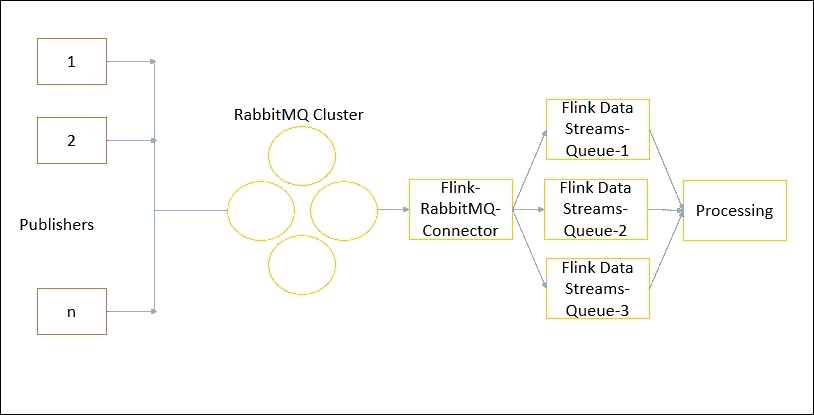
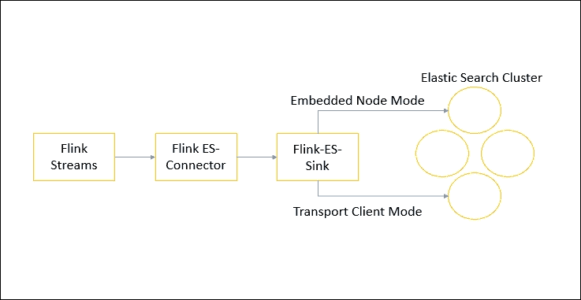
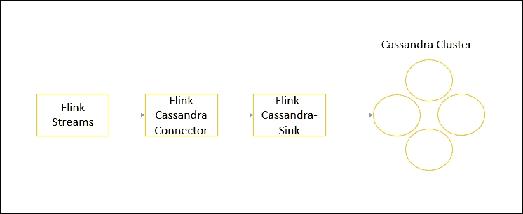
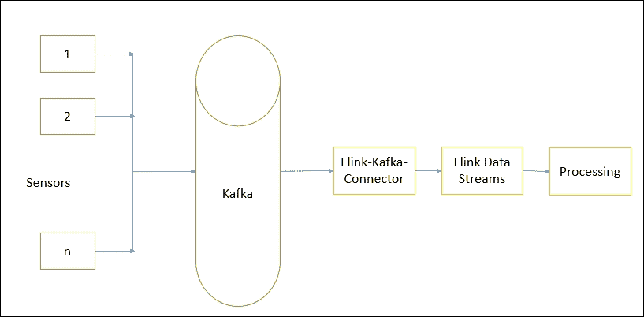

# 第二章。使用数据流应用编程接口的数据处理

实时分析目前是一个重要问题。许多不同的领域需要实时处理数据。到目前为止，已经有多种技术试图提供这种能力。像 Storm 和 Spark 这样的技术已经上市很长时间了。源自**物联网** ( **物联网**)的应用需要实时或接近实时地存储、处理和分析数据。为了迎合这样的需求，Flink 提供了一个叫做 DataStream API 的流数据处理 API。

在本章中，我们将了解与数据流应用编程接口相关的细节，涵盖以下主题:

*   执行环境
*   数据源
*   转换
*   数据接收器
*   连接器
*   用例传感器数据分析

任何 Flink 程序都在特定的解剖结构上工作，如下所示:


我们将研究每一步，以及如何在这种解剖结构中使用数据流应用编程接口。

# 执行环境

为了开始编写 Flink 程序，我们首先需要获得一个现有的执行环境或者创建一个。根据您尝试做的事情，Flink 支持:

*   获得一个已经存在的 Flink 环境
*   创造当地环境
*   创建远程环境

通常情况下，你只需要使用`getExecutionEnvironment()`。这将根据你的背景做正确的事情。如果您在集成开发环境的本地环境中执行，那么它将启动本地执行环境。否则，如果您正在执行 JAR，那么 Flink 集群管理器将以分布式方式执行程序。

如果您想自己创建一个本地或远程环境，那么您也可以选择使用`createLocalEnvironment()`和`createRemoteEnvironment` ( `String host`、`int port`、`String`和`.jar`文件)等方法来创建。

# 数据来源

来源是 Flink 计划希望从其中获取数据的地方。这是 Flink 程序解剖的第二步。Flink 支持许多预先实现的数据源功能。它还支持编写自定义数据源函数，这样任何不支持的东西都可以轻松编程。首先让我们试着理解内置的源函数。

## 基于套接字

DataStream API 支持从套接字读取数据。您只需要指定从中读取数据的主机和端口，它就可以完成以下工作:

```scala
socketTextStream(hostName, port); 

```

您也可以选择指定分隔符:

```scala
socketTextStream(hostName,port,delimiter) 

```

您还可以指定应用编程接口尝试获取数据的最大次数:

```scala
socketTextStream(hostName,port,delimiter, maxRetry) 

```

## 基于文件

您也可以选择使用 Flink 中基于文件的源函数从文件源流式传输数据。您可以使用`readTextFile(String path)`从路径中指定的文件中流式传输数据。默认情况下，它将读取`TextInputFormat`并将逐行读取字符串。

如果文件格式不是文本，您可以使用以下功能指定相同的格式:

```scala
readFile(FileInputFormat<Out> inputFormat, String path) 

```

Flink 还支持读取使用`readFileStream()`功能生成的文件流:

```scala
readFileStream(String filePath, long intervalMillis, FileMonitoringFunction.WatchType watchType) 

```

您只需要指定文件路径、轮询文件路径的轮询间隔以及监视类型。手表类型包括三种:

*   当系统只处理新文件时，使用`FileMonitoringFunction.WatchType.ONLY_NEW_FILES`
*   当系统只处理附加的文件内容时，使用`FileMonitoringFunction.WatchType.PROCESS_ONLY_APPENDED`
*   当系统不仅要重新处理文件的附加内容，还要重新处理文件中先前的内容时，使用`FileMonitoringFunction.WatchType.REPROCESS_WITH_APPENDED`

如果文件不是文本文件，那么我们可以选择使用下面的函数，它允许我们定义文件输入格式:

```scala
readFile(fileInputFormat, path, watchType, interval, pathFilter, typeInfo) 

```

在内部，它将读取文件任务分为两个子任务。一个子任务仅根据给定的`WatchType`监控文件路径。第二子任务并行执行实际的文件读取。监控文件路径的子任务是非并行子任务。它的工作是根据轮询间隔和要处理的报告文件继续扫描文件路径，分割文件，并将分割分配给相应的下游线程:


# 转换

数据转换将数据流从一种形式转换成另一种形式。输入可以是一个或多个数据流，输出也可以是零，或者一个或多个数据流。现在让我们试着逐一理解每个转换。

## 地图

这是最简单的转换之一，其中输入是一个数据流，输出也是一个数据流。

在 Java 中:

```scala
inputStream.map(new MapFunction<Integer, Integer>() { 
  @Override 
  public Integer map(Integer value) throws Exception { 
        return 5 * value; 
      } 
    }); 

```

在 Scala 中:

```scala
inputStream.map { x => x * 5 } 

```

## 平面图

FlatMap 获取一条记录，并输出零条、一条或多条记录。

在 Java 中:

```scala
inputStream.flatMap(new FlatMapFunction<String, String>() { 
    @Override 
    public void flatMap(String value, Collector<String> out) 
        throws Exception { 
        for(String word: value.split(" ")){ 
            out.collect(word); 
        } 
    } 
}); 

```

在 Scala 中:

```scala
inputStream.flatMap { str => str.split(" ") } 

```

## 过滤器

过滤函数评估条件，如果结果为真，则只发出记录。过滤函数可以输出零记录。

在 Java 中:

```scala
inputStream.filter(new FilterFunction<Integer>() { 
    @Override 
    public boolean filter(Integer value) throws Exception { 
        return value != 1; 
    } 
}); 

```

在 Scala 中:

```scala
inputStream.filter { _ != 1 } 

```

## 按键

KeyBy 根据关键字对基于流的进行逻辑分区。在内部，它使用散列函数来划分流。它返回`KeyedDataStream`。

在 Java 中:

```scala
inputStream.keyBy("someKey"); 

```

在 Scala 中:

```scala
inputStream.keyBy("someKey") 

```

## 减少

通过用当前值减少最后一个减少的值来减少滚动`KeyedDataStream`。下面的代码做了一个`KeyedDataStream`的和减。

在 Java 中:

```scala
keyedInputStream. reduce(new ReduceFunction<Integer>() { 
    @Override 
    public Integer reduce(Integer value1, Integer value2) 
    throws Exception { 
        return value1 + value2; 
    } 
}); 

```

在 Scala 中:

```scala
keyedInputStream. reduce { _ + _ } 

```

## 折叠

Fold 通过将最后一个文件夹流与当前记录相结合来展开`KeyedDataStream`。它会发出一个数据流。

在 Java 中:

```scala
keyedInputStream keyedStream.fold("Start", new FoldFunction<Integer, String>() { 
    @Override 
    public String fold(String current, Integer value) { 
        return current + "=" + value; 
    } 
  }); 

```

在 Scala 中:

```scala
keyedInputStream.fold("Start")((str, i) => { str + "=" + i }) 

```

前面给定的函数在应用于(1，2，3，4，5)流时会发出如下流:`Start=1=2=3=4=5`

## 聚合

数据流应用编程接口支持各种聚合，如`min`、`max`、`sum`等。这些功能可以在`KeyedDataStream`上应用，以获得滚动聚合。

在 Java 中:

```scala
keyedInputStream.sum(0) 
keyedInputStream.sum("key") 
keyedInputStream.min(0) 
keyedInputStream.min("key") 
keyedInputStream.max(0) 
keyedInputStream.max("key") 
keyedInputStream.minBy(0) 
keyedInputStream.minBy("key") 
keyedInputStream.maxBy(0) 
keyedInputStream.maxBy("key") 

```

在 Scala 中:

```scala
keyedInputStream.sum(0) 
keyedInputStream.sum("key") 
keyedInputStream.min(0) 
keyedInputStream.min("key") 
keyedInputStream.max(0) 
keyedInputStream.max("key") 
keyedInputStream.minBy(0) 
keyedInputStream.minBy("key") 
keyedInputStream.maxBy(0) 
keyedInputStream.maxBy("key") 

```

`max`和`maxBy`的区别在于，max 返回流中的最大值，而`maxBy`返回具有最大值的键。这同样适用于`min`和`minBy`。

## 窗口

`window`功能允许按时间或其他条件对现有的`KeyedDataStreams`进行分组。下面的转换以 10 秒的时间窗口发出记录组。

在 Java 中:

```scala
inputStream.keyBy(0).window(TumblingEventTimeWindows.of(Time.seconds(10))); 

```

在 Scala 中:

```scala
inputStream.keyBy(0).window(TumblingEventTimeWindows.of(Time.seconds(10))) 

```

Flink 定义了数据切片，以便处理(潜在的)无限数据流。这些切片称为窗口。这种切片通过应用转换来帮助处理数据块。要对一个流进行开窗，我们需要分配一个可以进行分发的密钥和一个描述对开窗的流执行什么转换的函数。

要将流分割成窗口，我们可以使用预先实现的 Flink 窗口分配器。我们有滚动窗口、滑动窗口、全局窗口和会话窗口等选项。Flink 还允许你通过扩展`WindowAssginer`类来编写自定义窗口分配器。让我们试着理解这些不同的分配器是如何工作的。

### 全局窗口

除非由触发器指定，否则全局窗口是永不结束的窗口。通常在这种情况下，每个元素被分配给一个单独的每键全局窗口。如果我们不指定任何触发器，任何计算都不会被触发。

### 翻滚的窗户

翻滚窗口是根据特定时间创建的。它们是固定长度的窗户，不重叠。当你需要在特定时间计算元素时，滚动窗口应该是有用的。例如，10 分钟的翻滚窗口可用于计算 10 分钟内发生的一组事件。

### 推拉窗

推拉窗就像翻滚的窗户，但它们是重叠的。它们是固定长度的窗口，通过用户给定的窗口滑动参数与前面的窗口重叠。当您想要从某个时间范围内发生的一组事件中计算一些东西时，这种类型的窗口非常有用。

### 会话窗口

当需要根据输入数据决定窗口边界时，会话窗口非常有用。会话窗口允许窗口开始时间和窗口大小的灵活性。我们还可以提供会话间隙配置参数，该参数指示在考虑关闭会话之前要等待多长时间。

## 窗口全部

`windowAll`功能允许对常规数据流进行分组。通常，这是非并行数据转换，因为它运行在非分区数据流上。

在 Java 中:

```scala
inputStream.windowAll(TumblingEventTimeWindows.of(Time.seconds(10))); 

```

在 Scala 中:

```scala
inputStream.windowAll(TumblingEventTimeWindows.of(Time.seconds(10))) 

```

类似于常规的数据流函数，我们也有窗口数据流函数。唯一不同的是，它们处理的是窗口数据流。因此，窗口缩减的工作方式类似于`Reduce`函数，窗口折叠的工作方式类似于`Fold`函数，并且还有聚合。

## 工会

`Union`功能将两个或多个数据流合并在一起。这是并行合并数据流。如果我们把一个流和它自己结合起来，那么它输出每个记录两次。

在 Java 中:

```scala
inputStream. union(inputStream1, inputStream2, ...); 

```

在 Scala 中:

```scala
inputStream. union(inputStream1, inputStream2, ...) 

```

## 窗口连接

我们还可以通过公共窗口中的一些键来连接两个数据流。以下示例显示了两个流在`5`秒的窗口中的连接，其中第一个流的第一个属性的连接条件等于另一个流的第二个属性。

在 Java 中:

```scala
inputStream. join(inputStream1) 
   .where(0).equalTo(1) 
    .window(TumblingEventTimeWindows.of(Time.seconds(5))) 
    .apply (new JoinFunction () {...}); 

```

在 Scala 中:

```scala
inputStream. join(inputStream1) 
    .where(0).equalTo(1) 
    .window(TumblingEventTimeWindows.of(Time.seconds(5))) 
    .apply { ... }
```

## 分裂

该函数根据标准将流分成两个或多个流。当您得到一个混合流，并且您可能想要分别处理每个数据时，可以使用这种方法。

在 Java 中:

```scala
SplitStream<Integer> split = inputStream.split(new OutputSelector<Integer>() { 
    @Override 
    public Iterable<String> select(Integer value) { 
        List<String> output = new ArrayList<String>(); 
        if (value % 2 == 0) { 
            output.add("even"); 
        } 
        else { 
            output.add("odd"); 
        } 
        return output; 
    } 
}); 

```

在 Scala 中:

```scala
val split = inputStream.split( 
  (num: Int) => 
    (num % 2) match { 
      case 0 => List("even") 
      case 1 => List("odd") 
    } 
) 

```

## 选择

此功能允许您从分割流中选择特定的流。

在 Java 中:

```scala
SplitStream<Integer> split; 
DataStream<Integer> even = split.select("even"); 
DataStream<Integer> odd = split.select("odd"); 
DataStream<Integer> all = split.select("even","odd"); 

```

在 Scala 中:

```scala
val even = split select "even" 
val odd = split select "odd" 
val all = split.select("even","odd") 

```

## 项目

`Project`功能允许您从事件流中选择属性子集，并且只将选定的元素发送到下一个处理流。

在 Java 中:

```scala
DataStream<Tuple4<Integer, Double, String, String>> in = // [...] 
DataStream<Tuple2<String, String>> out = in.project(3,2); 

```

在 Scala 中:

```scala
val in : DataStream[(Int,Double,String)] = // [...] 
val out = in.project(3,2) 

```

前面的函数从给定的记录中选择属性号`2`和`3`。以下是示例输入和输出记录:

```scala
(1,10.0, A, B )=> (B,A) 
(2,20.0, C, D )=> (D,C) 

```

# 物理分区

Flink 允许我们对流数据进行物理分区。您可以选择提供自定义分区。让我们看看不同类型的分区。

## 自定义分区

如前所述，您可以提供分区器的自定义实现。

在 Java 中:

```scala
inputStream.partitionCustom(partitioner, "someKey"); 
inputStream.partitionCustom(partitioner, 0); 

```

在 Scala 中:

```scala
inputStream.partitionCustom(partitioner, "someKey") 
inputStream.partitionCustom(partitioner, 0) 

```

在编写自定义分区器时，您需要确保实现了一个高效的哈希函数。

## 随机分区

随机分区以均匀的方式随机划分数据流。

在 Java 中:

```scala
inputStream.shuffle(); 

```

在 Scala 中:

```scala
inputStream.shuffle() 

```

## 重新平衡分区

这种类型的分区有助于均匀分布数据。它使用循环法进行分配。当数据有偏差时，这种类型的分区是很好的。

在 Java 中:

```scala
inputStream.rebalance(); 

```

在 Scala 中:

```scala
inputStream.rebalance() 

```

## 重新缩放

重新缩放用于跨操作分布数据，对数据子集执行转换，并将它们组合在一起。这种重新平衡仅发生在单个节点上，因此不需要任何跨网络的数据传输。

下图显示了分布情况:


在 Java 中:

```scala
inputStream.rescale(); 

```

在 Scala 中:

```scala
inputStream.rescale() 

```

## 广播

广播将所有记录分发到每个分区。这会将每个元素分散到所有分区。

在 Java 中:

```scala
inputStream.broadcast(); 

```

在 Scala 中:

```scala
inputStream.broadcast() 

```

# 数据接收器

数据转换完成后，我们需要将结果保存到某个地方。以下是 Flink 为我们提供的一些保存结果的选项:

*   `writeAsText()`:以字符串形式一次写入一行记录。
*   `writeAsCsV()`:将元组写成逗号分隔值文件。还可以配置行和字段分隔符。
*   `print()/printErr()`:将记录写入标准输出。您也可以选择写入标准错误。
*   `writeUsingOutputFormat()`:也可以选择提供自定义输出格式。在定义自定义格式时，您需要扩展`OutputFormat`，它负责序列化和反序列化。
*   `writeToSocket()` : Flink 也支持将数据写入特定的套接字。需要定义`SerializationSchema` 进行适当的序列化和格式化。

# 事件时间和水印

弗林克流媒体应用编程接口从谷歌数据流模型中获得灵感。它的流式应用编程接口支持不同的时间概念。总的来说，在流媒体环境中，我们有三个地方可以捕捉时间。它们如下

## 事件时间

事件在其生成设备上发生的时间。例如，在物联网项目中，传感器捕捉读数的时间。一般来说，这些事件时间在进入 Flink 之前需要嵌入到记录中。在时间处理时，这些时间戳被提取并考虑用于开窗。事件时间处理可用于无序事件。

## 处理时间

处理时间是机器执行数据流处理的时间。处理时间窗口只考虑事件被处理的时间戳。处理时间是流处理的最简单方式，因为它不需要处理机器和生产机器之间的任何同步。在分布式异步环境中，处理时间不提供确定性，因为它取决于记录在系统中流动的速度。

## 摄入时间

这是特定事件进入 Flink 的时间。所有基于时间的操作都引用这个时间戳。摄取时间是比处理更昂贵的操作，但是它给出了可预测的结果。摄取时间程序不能处理任何无序事件，因为它只在事件进入 Flink 系统后才分配时间戳。

下面是一个示例，展示了如何设置事件时间和水印。在摄取时间和处理时间的情况下，我们只需要对时间特征和水印生成进行自动处理。下面是相同的代码片段。

在 Java 中:

```scala
final StreamExecutionEnvironment env = StreamExecutionEnvironment.getExecutionEnvironment(); 
env.setStreamTimeCharacteristic(TimeCharacteristic.ProcessingTime); 
//or 
env.setStreamTimeCharacteristic(TimeCharacteristic.IngestionTime); 

```

在 Scala 中:

```scala
val env = StreamExecutionEnvironment.getExecutionEnvironment 
env.setStreamTimeCharacteristic(TimeCharacteristic.ProcessingTime) 
//or  
env.setStreamTimeCharacteristic(TimeCharacteristic.IngestionTime) 

```

在事件时间流程序的情况下，我们需要指定分配水印和时间戳的方式。分配水印和时间戳有两种方式:

*   直接从数据源属性
*   使用时间戳受理人

为了处理事件时间流，我们需要如下分配时间特性

在 Java 中:

```scala
final StreamExecutionEnvironment env = StreamExecutionEnvironment.getExecutionEnvironment(); 
env.setStreamTimeCharacteristic(TimeCharacteristic.EventTime; 

```

在 Scala 中:

```scala
val env = StreamExecutionEnvironment.getExecutionEnvironment 
env.setStreamTimeCharacteristic(TimeCharacteristic.EventTime) 

```

在源中存储记录时，最好总是存储事件时间。Flink 还支持一些预定义的时间戳提取器和水印生成器。参考[https://ci . Apache . org/project/flink/flink-docs-release-1.2/dev/event _ timestamp _ extractors . html](https://ci.apache.org/projects/flink/flink-docs-release-1.2/dev/event_timestamp_extractors.html)。

# 连接器

Apache Flink 支持各种连接器，允许跨各种技术进行数据读/写。让我们了解更多这方面的信息。

## Kafka连接器

Kafka 是一个发布-订阅、分布式的消息队列系统，允许用户发布某个主题的消息；然后分发给该主题的订阅者。弗林克提供了在弗林克流中定义Kafka消费者作为数据源的选项。为了使用 Flink Kafka 连接器，我们需要使用一个特定的 JAR 文件。

下图显示了 Flink Kafka连接器的工作原理:


我们需要使用以下 Maven 依赖项来使用连接器。我一直在使用Kafka 0.9 版本，所以我将在`pom.xml`中添加以下依赖项:

```scala
<dependency> 
  <groupId>org.apache.flink</groupId> 
  <artifactId>flink-connector-kafka-0.9_2.11/artifactId> 
  <version>1.1.4</version> 
</dependency> 

```

现在让我们试着理解如何使用Kafka消费者作为Kafka的来源:

在 Java 中:

```scala
Properties properties = new Properties(); 
  properties.setProperty("bootstrap.servers", "localhost:9092"); 
  properties.setProperty("group.id", "test"); 
DataStream<String> input  = env.addSource(new FlinkKafkaConsumer09<String>("mytopic", new SimpleStringSchema(), properties)); 

```

在 Scala 中:

```scala
val properties = new Properties(); 
properties.setProperty("bootstrap.servers", "localhost:9092"); 
// only required for Kafka 0.8 
properties.setProperty("zookeeper.connect", "localhost:2181"); 
properties.setProperty("group.id", "test"); 
stream = env 
    .addSource(new FlinkKafkaConsumer09[String]("mytopic", new SimpleStringSchema(), properties)) 
    .print 

```

在前面的代码中，我们首先设置了 Kafka 主机以及 zookeeper 主机和端口的属性。接下来我们需要指定主题名称，在本例中为`mytopic`。因此，如果任何消息发布到`mytopic`主题，它们将由 Flink 流处理。

如果您以不同的格式获取数据，那么您也可以为反序列化指定您的自定义模式。默认情况下，Flink 支持字符串和 JSON 反序列化程序。

为了启用容错，我们需要在 Flink 中启用检查点。弗林克热衷于定期拍摄该州的快照。如果出现故障，它将恢复到最后一个检查点，然后重新开始处理。

我们也可以把Kafka的生产者定义为一个水槽。这将把数据写入一个Kafka式的主题。以下是将数据写入Kafka主题的一种方式:

在 Scala 中:

```scala
stream.addSink(new FlinkKafkaProducer09<String>("localhost:9092", "mytopic", new SimpleStringSchema())); 

```

在 Java 中:

```scala
stream.addSink(new FlinkKafkaProducer09[String]("localhost:9092", "mytopic", new SimpleStringSchema())) 

```

## 推特连接器

如今，能够从推特上获取数据并进行处理是非常重要的。许多公司使用推特数据对各种产品、服务、电影、评论等进行情绪分析。Flink 提供了 Twitter 连接器作为一个数据源。要使用连接器，你需要有一个推特账户。一旦你有了一个推特账户，你需要创建一个推特应用程序，并生成连接器使用的认证密钥。这里有一个链接可以帮助你生成令牌:[https://dev . Twitter . com/oauth/overview/application-owner-access-token](https://dev.twitter.com/oauth/overview/application-owner-access-tokens)。

推特连接器可以通过 Java 或 Scala 应用编程接口使用:


一旦令牌生成，我们就可以开始编写程序，从 Twitter 获取数据。首先，我们需要添加一个 Maven 依赖项:

```scala
<dependency> 
  <groupId>org.apache.flink</groupId> 
  <artifactId>flink-connector-twitter_2.11/artifactId> 
  <version>1.1.4</version> 
</dependency> 

```

接下来我们添加 Twitter 作为数据源。以下是示例代码:

在 Java 中:

```scala
Properties props = new Properties(); 
props.setProperty(TwitterSource.CONSUMER_KEY, ""); 
props.setProperty(TwitterSource.CONSUMER_SECRET, ""); 
props.setProperty(TwitterSource.TOKEN, ""); 
props.setProperty(TwitterSource.TOKEN_SECRET, ""); 
DataStream<String> streamSource = env.addSource(new TwitterSource(props)); 

```

在 Scala 中:

```scala
val props = new Properties(); 
props.setProperty(TwitterSource.CONSUMER_KEY, ""); 
props.setProperty(TwitterSource.CONSUMER_SECRET, ""); 
props.setProperty(TwitterSource.TOKEN, ""); 
props.setProperty(TwitterSource.TOKEN_SECRET, ""); 
DataStream<String> streamSource = env.addSource(new TwitterSource(props)); 

```

在前面的代码中，我们首先为获得的令牌设置属性。然后我们加上`TwitterSource`。如果给定的信息是正确的，那么你将开始从推特获取数据。`TwitterSource`以 JSON 字符串格式发出数据。推特 JSON 示例如下所示:

```scala
{ 
... 
"text": ""Loyalty 3.0: How to Revolutionize Customer &amp; Employee Engagement with Big Data &amp; #Gamification" can be ordered here: http://t.co/1XhqyaNjuR", 
  "geo": null, 
  "retweeted": false, 
  "in_reply_to_screen_name": null, 
  "possibly_sensitive": false, 
  "truncated": false, 
  "lang": "en", 
    "hashtags": [{ 
      "text": "Gamification", 
      "indices": [90, 
      103] 
    }], 
  }, 
  "in_reply_to_status_id_str": null, 
  "id": 330094515484508160 
... 
} 

```

`TwitterSource`提供各种端点。默认情况下，它使用`StatusesSampleEndpoint`，这将返回一组随机推文。如果需要添加一些过滤器，又不想使用默认端点，可以实现`TwitterSource.EndpointInitializer`界面。

既然我们知道了如何从推特上获取数据，我们就可以根据我们的用例来决定如何处理这些数据。我们可以处理、存储或分析数据。

## 兔 MQ 连接器

RabbitMQ 是一个广泛使用的分布式、高性能的消息队列系统。它被用作高吞吐量操作的消息传递系统。它允许您创建分布式消息队列，并在队列中包含发布者和订阅者。更多关于 RabbitMQ 的阅读可以在以下链接[https://www.rabbitmq.com/](https://www.rabbitmq.com/)进行

Flink 支持从 RabbitMQ 获取和发布数据。它提供了一个连接器，可以充当数据流的数据源。

为了让 RabbitMQ 连接器正常工作，我们需要提供以下信息:

*   RabbitMQ 配置，如主机、端口、用户凭据等。
*   队列，您希望订阅的 RabbitMQ 队列名称。
*   关联标识是一个 RabbitMQ 特性，用于在分布式世界中通过唯一的标识将请求和响应关联起来。Flink RabbitMQ 连接器提供了一个接口，根据您是否使用它来设置它的真假。
*   反序列化模式-Rabbtmq 以序列化的方式存储和传输数据，以避免网络流量。因此，当收到消息时，订阅者应该知道如何对消息进行反序列化。Flink 连接器为我们提供了一些默认的反序列化程序，比如字符串反序列化程序。

RabbitMQ source 为我们提供了以下关于流交付的选项:

*   只有一次:使用 Rabbtmq 相关标识和 Flink 检查点机制处理 Rabbtmq 事务
*   至少一次:启用 Flink 检查点但未设置 RabbitMQ 相关标识时
*   RabbitMQ 自动提交模式没有强有力的交付保证

以下图表有助于您更好地理解 RabbitMQ 连接器:



现在让我们看看如何编写代码来让这个连接器工作。像其他连接器一样，我们需要在代码中添加一个 Maven 依赖项:

```scala
<dependency> 
  <groupId>org.apache.flink</groupId> 
  <artifactId>flink-connector-rabbitmq_2.11/artifactId> 
  <version>1.1.4</version> 
</dependency> 

```

下面的代码片段展示了如何在 Java 中使用 RabbitMQ 连接器:

```scala
//Configurations 
RMQConnectionConfig connectionConfig = new RMQConnectionConfig.Builder() 
.setHost(<host>).setPort(<port>).setUserName(..) 
.setPassword(..).setVirtualHost("/").build(); 

//Get Data Stream without correlation ids 
DataStream<String> streamWO = env.addSource(new RMQSource<String>(connectionConfig, "my-queue", new SimpleStringSchema())) 
  .print 
//Get Data Stream with correlation ids 
DataStream<String> streamW = env.addSource(new RMQSource<String>(connectionConfig, "my-queue", true, new SimpleStringSchema())) 
  .print 

```

同样，在 Scala 中，代码可以编写如下:

```scala
val connectionConfig = new RMQConnectionConfig.Builder() 
.setHost(<host>).setPort(<port>).setUserName(..) 
.setPassword(..).setVirtualHost("/").build() 
streamsWOIds = env 
    .addSource(new RMQSource[String](connectionConfig, " my-queue", new SimpleStringSchema)) 
    .print 

streamsWIds = env 
    .addSource(new RMQSource[String](connectionConfig, "my-queue", true, new SimpleStringSchema)) 
    .print 

```

我们也可以使用 RabbitMQ 连接器作为 Flink 接收器。如果您想将进程发送回一些不同的 RabbitMQ 队列，下面是一种方法。我们需要提供三种重要的配置:

*   rabbitmq 配置
*   队列名称-将处理后的数据发送回哪里
*   序列化模式-用于将数据转换为字节的模式

下面是用 Java 编写的示例代码，展示了如何将这个连接器用作 Flink 接收器:

```scala
RMQConnectionConfig connectionConfig = new RMQConnectionConfig.Builder() 
.setHost(<host>).setPort(<port>).setUserName(..) 
.setPassword(..).setVirtualHost("/").build(); 
stream.addSink(new RMQSink<String>(connectionConfig, "target-queue", new StringToByteSerializer())); 

```

同样的事情也可以在 Scala 中完成:

```scala
val connectionConfig = new RMQConnectionConfig.Builder() 
.setHost(<host>).setPort(<port>).setUserName(..) 
.setPassword(..).setVirtualHost("/").build() 
stream.addSink(new RMQSink[String](connectionConfig, "target-queue", new StringToByteSerializer 

```

## 弹性搜索连接器

ElasticSearch 是一个分布式、低延迟的全文搜索引擎系统，它允许我们对自己选择的文档进行索引，然后允许我们对文档集进行全文搜索。更多关于弹性搜索的内容可以在[https://www.elastic.co/](https://www.elastic.co/)阅读。

在许多用例中，您可能希望使用 Flink 处理数据，然后将其存储在弹性搜索中。为此，Flink 支持弹性搜索连接器。到目前为止，弹性搜索已经发布了两个主要版本。弗林克支持他们两个。

对于弹性搜索 1。x，需要添加以下 Maven 依赖项:

```scala
<dependency> 
  <groupId>org.apache.flink</groupId> 
  <artifactId>flink-connector-elasticsearch_2.11</artifactId> 
  <version>1.1.4</version> 
</dependency> 

```

Flink 连接器提供了一个将数据写入弹性搜索的接收器。它使用两种方法连接到弹性搜索:

*   嵌入式节点
*   传输客户端

下图说明了这一点:



### 嵌入式节点模式

在嵌入式节点模式下，接收器使用 BulkProcessor 将文档发送到 ElasticSearch。我们可以配置在将文档发送到弹性搜索之前缓冲多少请求。

以下是代码片段:

```scala
DataStream<String> input = ...; 

Map<String, String> config = Maps.newHashMap(); 
config.put("bulk.flush.max.actions", "1"); 
config.put("cluster.name", "cluster-name"); 

input.addSink(new ElasticsearchSink<>(config, new IndexRequestBuilder<String>() { 
    @Override 
    public IndexRequest createIndexRequest(String element, RuntimeContext ctx) { 
        Map<String, Object> json = new HashMap<>(); 
        json.put("data", element); 

        return Requests.indexRequest() 
                .index("my-index") 
                .type("my-type") 
                .source(json); 
    } 
})); 

```

在前面的代码片段中，我们创建了一个哈希映射，其中包含一些配置，例如集群名称以及在发送请求之前要缓冲多少文档。然后，我们将接收器添加到流中，指定要存储的索引、类型和文档。Scala 中类似的代码如下:

```scala
val input: DataStream[String] = ... 

val config = new util.HashMap[String, String] 
config.put("bulk.flush.max.actions", "1") 
config.put("cluster.name", "cluster-name") 

text.addSink(new ElasticsearchSink(config, new IndexRequestBuilder[String] { 
  override def createIndexRequest(element: String, ctx: RuntimeContext): IndexRequest = { 
    val json = new util.HashMap[String, AnyRef] 
    json.put("data", element) 
    Requests.indexRequest.index("my-index").`type`("my-type").source(json) 
  } 
})) 

```

### 传输客户端模式

ElasticSearch 允许通过端口 9300 上的传输客户端进行连接。Flink 支持通过其连接器使用这些连接。这里我们唯一需要提到的是配置中集群中的所有弹性搜索节点。

以下是 Java 中的代码片段:

```scala
DataStream<String> input = ...; 

Map<String, String> config = Maps.newHashMap(); 
config.put("bulk.flush.max.actions", "1"); 
config.put("cluster.name", "cluster-name"); 

List<TransportAddress> transports = new ArrayList<String>(); 
transports.add(new InetSocketTransportAddress("es-node-1", 9300)); 
transports.add(new InetSocketTransportAddress("es-node-2", 9300)); 
transports.add(new InetSocketTransportAddress("es-node-3", 9300)); 

input.addSink(new ElasticsearchSink<>(config, transports, new IndexRequestBuilder<String>() { 
    @Override 
    public IndexRequest createIndexRequest(String element, RuntimeContext ctx) { 
        Map<String, Object> json = new HashMap<>(); 
        json.put("data", element); 

        return Requests.indexRequest() 
                .index("my-index") 
                .type("my-type") 
                .source(json); 
    } 
})); 

```

在这里，我们还提供了关于集群名称、节点、端口、批量发送的最大请求数等详细信息。Scala 中类似的代码可以编写如下:

```scala
val input: DataStream[String] = ... 

val config = new util.HashMap[String, String] 
config.put("bulk.flush.max.actions", "1") 
config.put("cluster.name", "cluster-name") 

val transports = new ArrayList[String] 
transports.add(new InetSocketTransportAddress("es-node-1", 9300)) 
transports.add(new InetSocketTransportAddress("es-node-2", 9300)) 
transports.add(new InetSocketTransportAddress("es-node-3", 9300)) 

text.addSink(new ElasticsearchSink(config, transports, new IndexRequestBuilder[String] { 
  override def createIndexRequest(element: String, ctx: RuntimeContext): IndexRequest = { 
    val json = new util.HashMap[String, AnyRef] 
    json.put("data", element) 
    Requests.indexRequest.index("my-index").`type`("my-type").source(json) 
  } 
})) 

```

## 卡珊德拉连接器

Cassandra 是一个分布式、低延迟的 NoSQL 数据库。这是一个基于键值的数据库。许多高吞吐量应用程序使用 Cassandra 作为它们的主数据库。Cassandra 采用分布式集群模式，没有主从架构。任何节点都可以支持读写。关于卡珊德拉的更多信息，请访问:http://cassandra.apache.org/。

Apache Flink 提供了一个可以向 Cassandra 写入数据的连接器。在许多应用程序中，人们可能希望将 Flink 的流数据存储到 Cassandra 中。下图显示了卡珊德拉水槽的简单设计:



像其他连接器一样，为了获得这一点，我们需要将其作为 maven 依赖项添加:

```scala
<dependency> 
  <groupId>org.apache.flink</groupId> 
  <artifactId>flink-connector-cassandra_2.11</artifactId> 
  <version>1.1.4</version> 
</dependency>
```

一旦添加了依赖项，我们只需要添加 Cassandra 接收器及其配置，如下所示:

在 Java 中:

```scala
CassandraSink.addSink(input) 
  .setQuery("INSERT INTO cep.events (id, message) values (?, ?);") 
  .setClusterBuilder(new ClusterBuilder() { 
    @Override 
    public Cluster buildCluster(Cluster.Builder builder) { 
      return builder.addContactPoint("127.0.0.1").build(); 
    } 
  }) 
  .build() 

```

前面的代码将数据流写入名为**事件**的表中。该表需要一个事件标识和一条消息。同样，在 Scala 中:

```scala
CassandraSink.addSink(input) 
  .setQuery("INSERT INTO cep.events (id, message) values (?, ?);") 
  .setClusterBuilder(new ClusterBuilder() { 
    @Override 
    public Cluster buildCluster(Cluster.Builder builder) { 
      return builder.addContactPoint("127.0.0.1").build(); 
    } 
  }) 
  .build(); 

```

# 用例传感器数据分析

既然我们已经了解了数据流应用编程接口的各个方面，让我们尝试使用这些概念来解决一个真实的用例。考虑一台安装了传感器的机器，我们希望从这些传感器收集数据，并每五分钟计算一次每个传感器的平均温度。

以下是架构:



在这个场景中，我们假设传感器正在向名为 **temp** 的Kafka主题发送信息，信息为(时间戳、温度、传感器-ID)。现在我们需要编写代码来读取Kafka主题中的数据，并使用 Flink 转换对其进行处理。

这里需要考虑的重要事情是，由于我们已经有了来自传感器的时间戳值，我们可以使用事件时间计算时间因素。这意味着我们将能够处理事件，即使它们超出了正常范围。

我们从简单的流执行环境开始，它将从Kafka那里读取数据。由于事件中有时间戳，我们将编写一个自定义时间戳和水印提取器来读取时间戳值，并基于此进行窗口处理。下面是相同的代码片段。

```scala
// set up the streaming execution environment 
final StreamExecutionEnvironment env = StreamExecutionEnvironment.getExecutionEnvironment(); 
// env.enableCheckpointing(5000); 
nv.setStreamTimeCharacteristic(TimeCharacteristic.EventTime); 
Properties properties = new Properties(); 
properties.setProperty("bootstrap.servers", "localhost:9092"); 

properties.setProperty("zookeeper.connect", "localhost:2181"); 
properties.setProperty("group.id", "test"); 

FlinkKafkaConsumer09<String> myConsumer = new FlinkKafkaConsumer09<>("temp", new SimpleStringSchema(), 
                      properties); 
myConsumer.assignTimestampsAndWatermarks(new CustomWatermarkEmitter()); 

```

这里我们假设我们以字符串的形式接收Kafka主题中的事件，格式如下:

```scala
Timestamp,Temperature,Sensor-Id
```

下面是从记录中提取时间戳的示例代码:

```scala
public class CustomWatermarkEmitter implements AssignerWithPunctuatedWatermarks<String> {
    private static final long serialVersionUID = 1L;

    @Override
    public long extractTimestamp(String arg0, long arg1) {
        if (null != arg0 && arg0.contains(",")) {
           String parts[] = arg0.split(",");
           return Long.parseLong(parts[0]);
           }

          return 0;
    }
    @Override
    public Watermark checkAndGetNextWatermark(String arg0, long arg1) {
        if (null != arg0 && arg0.contains(",")) {
            String parts[] = arg0.split(",");
            return new Watermark(Long.parseLong(parts[0]));
        }
        return null;
    }
}
```

现在，我们只需创建键控数据流，并对温度值执行平均计算，如以下代码片段所示:

```scala
DataStream<Tuple2<String, Double>> keyedStream = env.addSource(myConsumer).flatMap(new Splitter()).keyBy(0)
.timeWindow(Time.seconds(300))
.apply(new WindowFunction<Tuple2<String, Double>, Tuple2<String, Double>, Tuple, TimeWindow>() {
    @Override
    public void apply(Tuple key, TimeWindow window, 
    Iterable<Tuple2<String, Double>> input,
    Collector<Tuple2<String, Double>> out) throws Exception {
        double sum = 0L;
            int count = 0;
            for (Tuple2<String, Double> record : input) {
                sum += record.f1;
                count++;
            }
     Tuple2<String, Double> result = input.iterator().next();
     result.f1 = (sum/count);
     out.collect(result);
   }
});
```

当执行前面给定的代码时，如果在Kafka主题上发布了适当的传感器事件，那么我们将每五分钟获得每个传感器的平均温度。

完整的代码可在 GitHub 上的[https://GitHub . com/deshandeltanmay/mastering-flink/tree/master/chapter 02/flink-streaming](https://github.com/deshpandetanmay/mastering-flink/tree/master/chapter02/flink-streaming)获得。

# 总结

在这一章中，我们从 Flink 最强大的 API: DataStream API 开始。我们研究了数据源、转换和接收器是如何协同工作的。然后我们看了各种技术连接器，比如 ElasticSearch、Cassandra、Kafka、RabbitMQ 等等。

最后，我们还尝试应用我们的学习来解决一个真实世界的传感器数据分析用例。

在下一章中，我们将从 Flink 生态系统的角度了解另一个非常重要的应用编程接口——数据集应用编程接口。