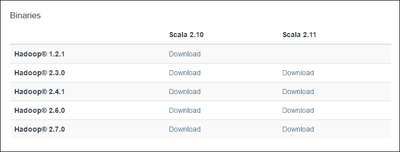
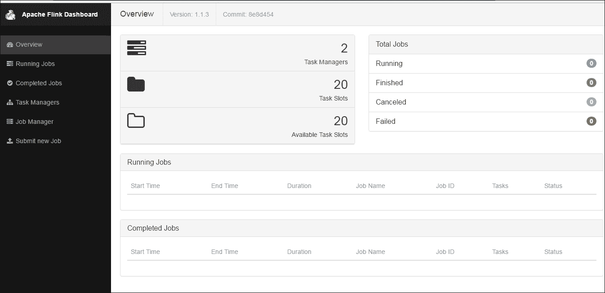
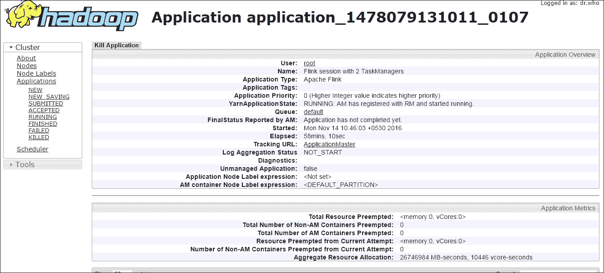
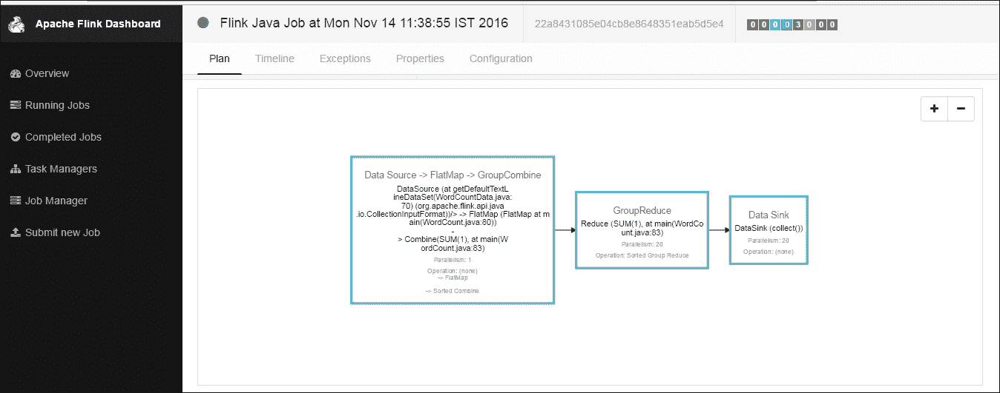

# 第八章。基于 Flink 和 Hadoop 的分布式数据处理

在过去几年中，Apache Hadoop 已经成为数据处理和分析基础架构的核心和重要部分。借助 Hadoop 1。x，社区学习了使用 MapReduce 框架的分布式数据处理，而 Hadoop 的下一个版本 2。x 教会了我们资源的有效利用和使用纱框架的调度。纱线框架是 Hadoop 数据处理的核心部分，它处理复杂的任务，如作业执行、分配、资源分配、调度等。它支持多租户、可扩展性和高可用性。

关于纱最好的部分是，它不仅仅是一个框架，更像是一个完整的操作系统，开发者可以自由地开发和执行他们选择的应用程序。它通过让开发人员只专注于应用程序开发，而忘记并行数据和执行分布的痛苦，来提供抽象。纱线位于 Hadoop 分布式文件系统之上，也可以从文件系统(如 AWS S3)中读取数据。

纱应用程序框架已经建立得很好，它可以托管任何分布式处理引擎。近年来，诸如 Spark、Flink 等新型分布式数据处理引擎出现了显著的增长。由于它们是为在一个纱簇上执行而构建的，人们很容易在同一个纱簇上并行尝试新事物。这意味着我们可以使用纱在同一个集群上运行 Spark 和 Flink 作业。在这一章中，我们将看到如何利用现有的 Hadoop/SHEAN 集群来并行执行我们的 Flink 作业。

让我们开始吧。

# Hadoop 快速概述

你们中的大多数人可能已经知道 Hadoop 及其功能，但是对于那些对分布式计算世界不熟悉的人，让我试着简单介绍一下 Hadoop。

Hadoop 是一个分布式、开源的数据处理框架。它由两个重要部分组成:一个数据存储单元 **Hadoop 分布式文件系统** ( **HDFS** )和资源管理单元**再一个资源协商器** ( **纱**)。下图显示了 Hadoop 生态系统的高级概述:


## HDFS

顾名思义，HDFS 是一个用于数据存储的高可用性分布式文件系统。如今，这是大多数公司的核心框架之一。HDFS 由一个主从式架构组成，具有名称节点、辅助名称节点和数据节点等守护程序。

在 HDFS，名称节点存储关于要存储的文件的元数据，而数据节点存储构成文件的实际块。默认情况下，为了实现高可用性，数据块会进行三重复制。辅助名称节点用于备份名称节点上存储的文件系统元数据。

### 注

这里有一个链接，你可以在这里阅读更多关于 HDFS 的信息。

## 纱

在纱之前，MapReduce 是运行在 HDFS 之上的数据处理框架。但是人们开始意识到一个任务跟踪器所能处理的任务跟踪器的数量是有限的。这就产生了纱。纱背后的基本思想是分开资源管理和调度任务。纱有全球资源管理器和每个应用程序-应用程序主。资源管理器在主节点上工作，而它有一个每个工作节点的代理——节点管理器，它负责管理容器，监视它们的使用情况(CPU、磁盘、内存)并向资源管理器报告。

资源管理器有两个重要组件- **调度器**和**应用程序管理器**。Scheduler 负责调度队列中的应用程序，而 applications manager 负责接受作业提交，与特定于应用程序的应用程序主机协商第一个容器。它还负责在出现故障时重启**应用主程序**。

由于操作系统像自然一样，纱提供的应用编程接口可以扩展到构建应用程序。 **Spark** 和 **Flink** 就是很好的例子。

### 注

这里有一个链接，你可以在[http://Hadoop . Apache . org/docs/current/Hadoop-SHART/Hadoop-SHART-site/SHART . html](http://hadoop.apache.org/docs/current/hadoop-yarn/hadoop-yarn-site/YARN.html)上阅读更多关于 SHART 的内容。

现在让我们看看如何在纱线上使用 Flink。

# 在纱线上打转

Flink 已经内置了支持执行就绪的纱。任何使用 Flink APIs 的应用程序构建都可以在纱线上执行，而无需太多努力。如果用户已经有了一个纱簇，他们不需要设置或安装任何东西。Flink 希望满足以下要求:

*   Hadoop 版本应该是 2.2 或以上
*   HDFS 应该开始运转了

## 配置

为了在纱线上运行 Flink，需要进行以下配置。首先，我们需要下载 Flink 发行版的 Hadoop 兼容版本。

### 注

二进制文件可以在[http://flink.apache.org/downloads.html](http://flink.apache.org/downloads.html)下载。你必须从以下选项中选择。



假设我们运行的是 Hadoop 2.7 和 Scala 2.11。我们将下载特定的二进制文件，并将其存储在安装和运行 Hadoop 的节点上。

下载后，我们需要提取`tar`文件，如下所示:

```scala
$tar -xzf flink-1.1.4-bin-hadoop27-scala_2.11.tgz
$cd flink-1.1.4

```

## 开始弗林克纱会话

一旦提取了二进制文件，我们就可以启动 Flink 会话了。Flink 会话是在各个节点上启动所有必需的 Flink 服务(作业管理器和任务管理器)的会话，以便我们可以开始执行 Flink 作业。要启动 Flink 会话，我们有以下具有给定选项的可执行文件:

```scala
# bin/yarn-session.sh
Usage:
 Required
 -n,--container <arg>            Number of YARN container to     
                                         allocate (=Number of Task  
                                         Managers)
 Optional
 -D <arg>                        Dynamic properties
 -d,--detached                   Start detached
 -id,--applicationId <arg>       Attach to running YARN session
 -j,--jar <arg>                  Path to Flink jar file
 -jm,--jobManagerMemory <arg>    Memory for JobManager 
                                         Container [in MB]
 -n,--container <arg>            Number of YARN container to 
                                         allocate (=Number of Task 
                                         Managers)
 -nm,--name <arg>                Set a custom name for the 
                                         application on YARN
 -q,--query                      Display available YARN 
                                         resources (memory, cores)
 -qu,--queue <arg>               Specify YARN queue.
 -s,--slots <arg>                Number of slots per 
                                         TaskManager
 -st,--streaming                 Start Flink in streaming mode
 -t,--ship <arg>                 Ship files in the specified 
                                         directory (t for transfer)
 -tm,--taskManagerMemory <arg>   Memory per TaskManager  
                                         Container [in MB]
 -z,--zookeeperNamespace <arg>   Namespace to create the 
                                         Zookeeper sub-paths for high 
                                         availability mode

```

我们必须确保设置`YARN_CONF_DIR`和`HADOOP_CONF_DIR`环境变量，以便 Flink 可以找到所需的配置。现在让我们通过提供信息来开始 Flink 会话。

下面是如何开始 Flink 会话的，给出了任务管理器的数量、每个任务管理器的内存以及要使用的插槽的详细信息:

```scala
# bin/yarn-session.sh -n 2 -tm 1024 -s 10
2016-11-14 10:46:00,126 WARN    
    org.apache.hadoop.util.NativeCodeLoader                                   
    - Unable to load native-hadoop library for your platform... using 
    builtin-java classes where applicable
2016-11-14 10:46:00,184 INFO  
    org.apache.flink.yarn.YarnClusterDescriptor                            
    - The configuration directory ('/usr/local/flink/flink-1.1.3/conf') 
    contains both LOG4J and Logback configuration files. Please delete 
    or rename one of them.
2016-11-14 10:46:01,263 INFO  org.apache.flink.yarn.Utils                                   
    - Copying from file:/usr/local/flink/flink-
    1.1.3/conf/log4j.properties to 
    hdfs://hdpcluster/user/root/.flink/application_1478079131011_0107/
    log4j.properties
2016-11-14 10:46:01,463 INFO  org.apache.flink.yarn.Utils                                      
    - Copying from file:/usr/local/flink/flink-1.1.3/lib to   
    hdfs://hdp/user/root/.flink/application_1478079131011_0107/lib
2016-11-14 10:46:02,337 INFO  org.apache.flink.yarn.Utils                                     
    - Copying from file:/usr/local/flink/flink-1.1.3/conf/logback.xml    
    to hdfs://hdpcluster/user/root/.flink/
    application_1478079131011_0107/logback.xml
2016-11-14 10:46:02,350 INFO  org.apache.flink.yarn.Utils                                      
    - Copying from file:/usr/local/flink/flink-1.1.3/lib/flink-  
    dist_2.11-1.1.3.jar to hdfs://hdpcluster/user/root/.flink/
    application_1478079131011_0107/flink-dist_2.11-1.1.3.jar
2016-11-14 10:46:03,157 INFO  org.apache.flink.yarn.Utils                                      
    - Copying from /usr/local/flink/flink-1.1.3/conf/flink-conf.yaml to    
    hdfs://hdpcluster/user/root/.flink/application_1478079131011_0107/
    flink-conf.yaml
org.apache.flink.yarn.YarnClusterDescriptor                           
    - Deploying cluster, current state ACCEPTED
2016-11-14 10:46:11,976 INFO  
    org.apache.flink.yarn.YarnClusterDescriptor                               
    - YARN application has been deployed successfully.
Flink JobManager is now running on 10.22.3.44:43810
JobManager Web Interface: 
    http://myhost.com:8088/proxy/application_1478079131011_0107/
2016-11-14 10:46:12,387 INFO  Remoting                                                      
    - Starting remoting
2016-11-14 10:46:12,483 INFO  Remoting                                                      
    - Remoting started; listening on addresses :
    [akka.tcp://flink@10.22.3.44:58538]
2016-11-14 10:46:12,627 INFO     
    org.apache.flink.yarn.YarnClusterClient                                
    - Start application client.
2016-11-14 10:46:12,634 INFO  
    org.apache.flink.yarn.ApplicationClient                                
    - Notification about new leader address 
    akka.tcp://flink@10.22.3.44:43810/user/jobmanager with session ID 
    null.
2016-11-14 10:46:12,637 INFO    
    org.apache.flink.yarn.ApplicationClient                                
    - Received address of new leader   
    akka.tcp://flink@10.22.3.44:43810/user/jobmanager 
    with session ID null.
2016-11-14 10:46:12,638 INFO  
    org.apache.flink.yarn.ApplicationClient                                
    - Disconnect from JobManager null.
2016-11-14 10:46:12,640 INFO  
    org.apache.flink.yarn.ApplicationClient                                
    - Trying to register at JobManager 
    akka.tcp://flink@10.22.3.44:43810/user/jobmanager.
2016-11-14 10:46:12,649 INFO  
    org.apache.flink.yarn.ApplicationClient                                
    - Successfully registered at the ResourceManager using JobManager 
    Actor[akka.tcp://flink@10.22.3.44:43810/user/jobmanager#-862361447]

```

如果没有正确设置配置目录，您将会看到同样的错误。在这种情况下，首先您可以设置配置目录，然后启动 Flink 纱会话。

以下命令设置配置目录:

```scala
export HADOOP_CONF_DIR=/etc/hadoop/conf
export YARN_CONF_DIR=/etc/hadoop/conf

```

### 注

我们也可以通过点击以下网址来查看 Flink 网络用户界面:`http://host:8088/proxy/application_<id>/#/overview.`

下面是同样的截图:



同样的，我们也可以在`http://myhost:8088/cluster/app/application_1478079131011_0107`查看纱应用 UI。



## 向弗林克提交作业

现在，我们有一个链接到纱的弗林克会话，我们都准备提交一个弗林克工作给纱。

我们可以使用以下带有选项的命令来提交 Flink 作业:

```scala
#./bin/flink
./flink <ACTION> [OPTIONS] [ARGUMENTS]

```

我们可以使用 run 操作来执行 Flink 作业。我们在运行中有以下选项:

<colgroup><col> <col></colgroup> 
| **选项** | **描述** |
| `-c`、`--class <classname>` | 用程序入口点(`main()`方法或`getPlan()`方法)初始化。仅当 JAR 文件没有在其清单中指定类时才需要。 |
| `-C`、`--classpath <url>` | 向群集中所有节点上的每个用户代码类加载器添加一个 URL。路径必须指定一个协议(例如， `file://`)，并且在所有节点上都可以访问(例如，通过 NFS 共享)。您可以多次使用此选项来指定多个网址。该协议必须得到`{@link java.net.URLClassLoader}`的支持。如果您希望在 Flink YARN 会话中使用某些第三方库，则可以使用此选项。 |
| `-d`、`--detached` | 如果存在，以分离模式运行作业。当您不想一直运行 Flink 纱会话时，分离模式会很有用。在这种情况下，Flink 客户端将只提交作业，并将自行分离。我们无法使用 Flink 命令停止分离的 Flink 纱会话。为此，我们必须使用纱命令`yarn application -kill <appId>`杀死应用程序 |
| `-m`、`--jobmanager <host:port>` | 要连接的作业管理器(主机)的地址。使用此标志连接到不同于配置中指定的作业管理器。 |
| `-p`、`--parallelism <parallelism>` | 运行程序的并行度。可选标志，用于覆盖配置中指定的默认值。 |
| `-q`、`--sysoutLogging` | 如果存在，将日志输出抑制到标准`OUT`。 |
| `-s`、`--fromSavepoint <savepointPath>` | 将作业重置回的保存点的路径，例如`file:///flink/savepoint-1537`。保存点是 Flink 程序的外部存储状态。它们是存储在某个位置的快照。如果 Flink 程序失败，我们可以从上次存储的保存点恢复它。保存点的更多细节[https://ci . Apache . org/project/flink/flink-docs-release-1.2/setup/savets . html](https://ci.apache.org/projects/flink/flink-docs-release-1.2/setup/savepoints.html) |
| `-z`、`--zookeeperNamespace <zookeeperNamespace>` | 命名空间，为高可用性模式创建 Zookeeper 子路径 |

以下选项可用于`yarn-cluster`模式:

<colgroup><col> <col></colgroup> 
| **选项** | **描述** |
| `-yD <arg>` | 动态性能 |
| `yd`、`--yarndetached` | 开始分离 |
| `-yid`、`--yarnapplicationId <arg>` | 连接到运行的纱会话 |
| `-yj`、`--yarnjar <arg>` | Flink jar 文件的路径 |
| `-yjm`、`--yarnjobManagerMemory <arg>` | 作业管理器容器的内存(兆字节) |
| `-yn`、`--yarncontainer <arg>` | 要分配的纱容器数量(=任务管理器数量) |
| `-ynm`、`--yarnname <arg>` | 为纱上的应用程序设置自定义名称 |
| `-yq`、`--yarnquery` | 显示可用的纱资源(内存、核心) |
| `-yqu`、`--yarnqueue <arg>` | 指定纱线队列 |
| `-ys`、`--yarnslots <arg>` | 每个任务管理器的插槽数量 |
| `-yst`、`--yarnstreaming` | 在流模式下启动 Flink |
| `-yt`、`--yarnship <arg>` | 将文件存放在指定的控制器中(用于传输) |
| `-ytm`、`--yarntaskManagerMemory <arg>` | 每个任务管理器容器的内存(MB) |
| `-yz`、`--yarnzookeeperNamespace <arg>` | 命名空间，为高可用性模式创建 Zookeeper 子路径 |

现在，让我们尝试运行一个关于纱的字数示例。以下是这样做的步骤。

首先让我们将输入文件存储在 HDFS，作为字数统计程序的输入。在这里，我们将对 Apache 许可证文本进行字数统计。以下是我们在 HDFS 下载和存储的方式:

```scala
wget -O LICENSE-2.0.txt http://www.apache.org/licenses/LICENSE-
    2.0.txt
hadoop fs -mkdir in
hadoop fs -put LICENSE-2.0.txt in

```

现在，我们将提交示例字数统计作业:

```scala
./bin/flink run ./examples/batch/WordCount.jar 
    hdfs://myhost/user/root/in  hdfs://myhost/user/root/out

```

这将调用将在纱簇上执行的 Flink 作业。您应该将控制台视为:

```scala
 **# ./bin/flink run ./examples/batch/WordCount.jar** 
2016-11-14 11:26:32,603 INFO  
    org.apache.flink.yarn.cli.FlinkYarnSessionCli               
    - YARN properties set default parallelism to 20
2016-11-14 11:26:32,603 INFO   
    org.apache.flink.yarn.cli.FlinkYarnSessionCli                 
    - YARN properties set default parallelism to 20
YARN properties set default parallelism to 20
2016-11-14 11:26:32,603 INFO    
    org.apache.flink.yarn.cli.FlinkYarnSessionCli               
    - Found YARN properties file /tmp/.yarn-properties-root
2016-11-14 11:26:32,603 INFO  
    org.apache.flink.yarn.cli.FlinkYarnSessionCli              
    - Found YARN properties file /tmp/.yarn-properties-root
Found YARN properties file /tmp/.yarn-properties-root
2016-11-14 11:26:32,603 INFO  
    org.apache.flink.yarn.cli.FlinkYarnSessionCli             
    - Using Yarn application id from YARN properties  
    application_1478079131011_0107
2016-11-14 11:26:32,603 INFO  
    org.apache.flink.yarn.cli.FlinkYarnSessionCli                        
    - Using Yarn application id from YARN properties  
    application_1478079131011_0107
Using Yarn application id from YARN properties   
    application_1478079131011_0107
2016-11-14 11:26:32,604 INFO  
    org.apache.flink.yarn.cli.FlinkYarnSessionCli               
    - YARN properties set default parallelism to 20
2016-11-14 11:26:32,604 INFO  
    org.apache.flink.yarn.cli.FlinkYarnSessionCli                
    - YARN properties set default parallelism to 20
YARN properties set default parallelism to 20
2016-11-14 11:26:32,823 INFO  
    org.apache.hadoop.yarn.client.api.impl.TimelineClientImpl     
    - Timeline service address: http://hdpdev002.pune-
    in0145.slb.com:8188/ws/v1/timeline/
2016-11-14 11:26:33,089 INFO  
    org.apache.flink.yarn.YarnClusterDescriptor               
    - Found application JobManager host name myhost.com' and port  
    '43810' from supplied application id 
    'application_1478079131011_0107'
Cluster configuration: Yarn cluster with application id 
    application_1478079131011_0107
Using address 163.183.206.249:43810 to connect to JobManager.
Starting execution of program
2016-11-14 11:26:33,711 INFO  
    org.apache.flink.yarn.YarnClusterClient                  
    - TaskManager status (2/1)
TaskManager status (2/1)
2016-11-14 11:26:33,712 INFO  
    org.apache.flink.yarn.YarnClusterClient                
    - All TaskManagers are connected
All TaskManagers are connected
2016-11-14 11:26:33,712 INFO  
    org.apache.flink.yarn.YarnClusterClient                       
    - Submitting job with JobID: b57d682dd09f570ea336b0d56da16c73\. 
    Waiting for job completion.
Submitting job with JobID: b57d682dd09f570ea336b0d56da16c73\. 
    Waiting for job completion.
Connected to JobManager at 
    Actor[akka.tcp://flink@163.183.206.249:43810/user/
    jobmanager#-862361447]
11/14/2016 11:26:33     Job execution switched to status RUNNING.
11/14/2016 11:26:33     CHAIN DataSource (at   
    getDefaultTextLineDataSet(WordCountData.java:70) 
    (org.apache.flink.api.java.io.CollectionInputFormat)) -> FlatMap 
    (FlatMap at main(WordCount.java:80)) -> Combine(SUM(1), at 
    main(WordCount.java:83)(1/1) switched to RUNNING
11/14/2016 11:26:34     DataSink (collect())(20/20) switched to 
    FINISHED
...
11/14/2016 11:26:34     Job execution switched to status FINISHED.
(after,1)
(coil,1)
(country,1)
(great,1)
(long,1)
(merit,1)
(oppressor,1)
(pangs,1)
(scorns,1)
(what,1)
(a,5)
(death,2)
(die,2)
(rather,1)
(be,4)
(bourn,1)
(d,4)
(say,1)
(takes,1)
(thy,1)
(himself,1)
(sins,1)
(there,2)
(whips,1)
(would,2)
(wrong,1)
...
 **Program execution finished** 
 **Job with JobID b57d682dd09f570ea336b0d56da16c73 has finished.** 
 **Job Runtime: 575 ms** 
Accumulator Results:
- 4950e35c195be901e0ad6a8ed25790de (java.util.ArrayList) [170 
      elements]
2016-11-14 11:26:34,378 INFO    
      org.apache.flink.yarn.YarnClusterClient             
      - Disconnecting YarnClusterClient from ApplicationMaster

```

以下是来自 Flink 应用程序主用户界面的作业执行截图。以下是 Flink 执行计划的截图:



接下来，我们可以看到为此作业执行的步骤的屏幕截图:


最后我们有了 Flink 作业执行时间线的截图。时间线显示了可以并行执行的所有步骤以及需要顺序执行的步骤:


## 停止弗林克纱会话

处理完成后，您可以通过两种方式停止 Flink 纱会话。首先，您可以在启动纱会话的控制台上简单地执行一个*Clr*+*C*。这将发送终止信号并停止纱会话。

第二种方法是执行以下命令来停止会话:

```scala
./bin/yarn-session.sh -id application_1478079131011_0107 stop

```

我们可以立即看到 Flink 纱应用程序被杀死:

```scala
2016-11-14 11:56:59,455 INFO  
    org.apache.flink.yarn.YarnClusterClient  
    Sending shutdown request to the Application Master
2016-11-14 11:56:59,456 INFO    
    org.apache.flink.yarn.ApplicationClient  
    Sending StopCluster request to JobManager.
2016-11-14 11:56:59,464 INFO  
    org.apache.flink.yarn.YarnClusterClient  
    - Deleted Yarn properties file at /tmp/.yarn-properties-root
2016-11-14 11:56:59,464 WARN  
    org.apache.flink.yarn.YarnClusterClient  
    Session file directory not set. Not deleting session files
2016-11-14 11:56:59,565 INFO  
    org.apache.flink.yarn.YarnClusterClient  
    - Application application_1478079131011_0107 finished with state   
    FINISHED and final state SUCCEEDED at 1479104819469
 **2016-11-14 11:56:59,565 INFO  
    org.apache.flink.yarn.YarnClusterClient  
    - YARN Client is shutting down** 

```

## 在纱线上运行单个 Flink 作业

我们还可以在纱线上运行单个 Flink 作业，而不会阻塞纱线会话的资源。如果您只希望在纱线上运行一个 Flink 作业，这是一个很好的选择。在前面的例子中，当我们在纱上启动 Flink 会话时，它会阻塞资源和核心，直到我们停止会话，而在这种情况下，资源会被阻塞，直到作业正在执行，作业完成后资源就会被释放。下面的命令显示了我们如何在不使用会话的情况下在纱上执行单个 Flink 作业:

```scala
./bin/flink run -m yarn-cluster -yn 2  
    ./examples/batch/WordCount.jar

```

我们可以看到与前面案例相似的结果。我们还可以使用 SHARE 应用程序用户界面跟踪它的进度和调试。以下是相同内容的示例屏幕截图:


## 纱线上燧石的回复行为

纱线上的 Flink 为调整恢复行为提供了以下配置参数:

<colgroup><col> <col></colgroup> 
| **参数** | **描述** |
| `yarn.reallocate-failed` | 设置 Flink 是否应该重新分配失败的任务管理器容器。默认为`true`。 |
| `yarn.maximum-failed-containers` | 设置在纱会话失败之前应用程序主机接受的失败容器的最大数量。默认值为启动期间请求的任务管理器数量。 |
| `yarn.application-attempts` | 设置应用程序主机尝试的次数。默认值为`1`，这意味着如果完成，如果应用程序主机失败，纱会话将失败。 |

这些配置需要在`conf/flink-conf.yaml`中，或者可以在会话启动期间使用`-D`参数进行设置。

## 工作细节

在前几节中，我们研究了如何在纱线上使用 Flink。现在让我们试着理解它在内部是如何工作的:


上图显示了 Flink on YARN 的内部工作原理。它经过以下步骤:

1.  检查是否设置了 Hadoop 和 are 配置目录。
2.  如果是，联系 HDFS，并将 JAR 和配置存储在 HDFS。
3.  联系节点管理器以分配应用程序主机。
4.  一旦分配了应用程序主机，将启动 Flink 作业管理器。
5.  稍后，根据给定的配置参数启动 Flink 任务管理器。

现在，我们都准备提交关于纱弗林克的工作。

# 总结

在本章中，我们讨论了如何使用现有的纱簇以分布式模式执行 Flink 作业。我们看了一步一步的细节，了解了一些实际的例子。

在下一章中，我们将看到如何在云环境中执行 Flink 作业。