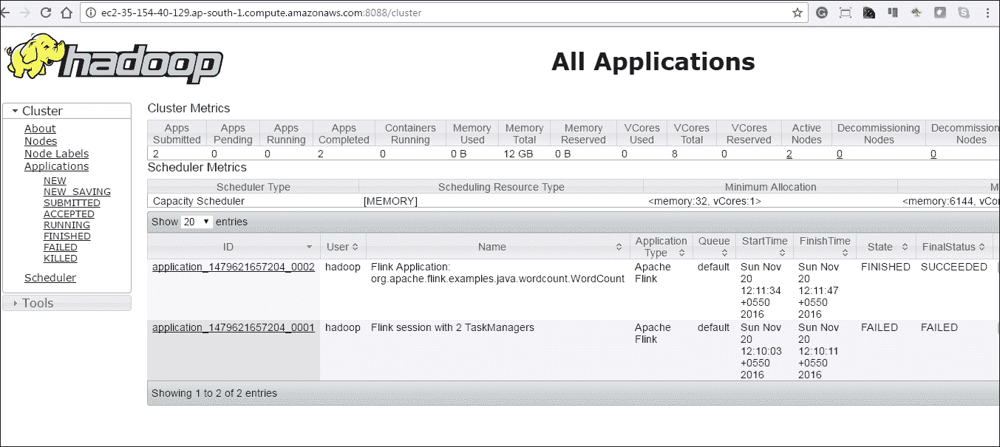
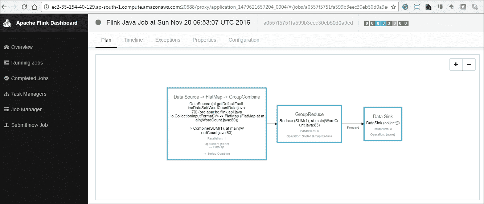

# 九、在云上部署 Flink

最近，越来越多的公司投资于基于云的解决方案，从我们通过云实现的成本和效率来看，这是合理的。**亚马逊网络服务**(**AWS**)**谷歌云平台** ( **GCP** )和微软 Azure 是这一业务迄今为止的明显领导者。几乎所有这些都提供了使用起来非常方便的大数据解决方案。云及时提供高效的解决方案，人们无需担心硬件购买、网络等问题。

在本章中，我们将了解如何在云上部署 Flink。我们将看到在 AWS 和谷歌云上安装和部署应用程序的详细方法。让我们开始吧。

# 谷歌云上的 Flink

Flink 可以使用一个名为 BDUtil 的实用程序部署在谷歌云上。这是一个开源工具，每个人都可以使用[https://cloud.google.com/hadoop/bdutil](https://cloud.google.com/hadoop/bdutil)。我们需要做的第一步是安装**谷歌云软件开发工具包**。

## 安装谷歌云 SDK

谷歌云软件开发工具包是一个可执行的实用程序，可以安装在视窗、苹果或 UNIX 操作系统上。您可以根据自己的操作系统选择安装模式。这里有一个链接，引导用户了解 https://cloud.google.com/sdk/downloads 的详细安装情况。

这里我假设你已经熟悉了谷歌云的概念和术语；如果不是，我会推荐阅读 https://cloud.google.com/docs/。

在我的例子中，我将使用 UNIX 机器启动一个 Flink-Hadoop 集群。让我们开始安装。

首先，我们需要下载云软件开发工具包的安装程序。

```scala
wget 
    https://dl.google.com/dl/cloudsdk/channels/rapid/downloads/google-
    cloud-sdk-135.0.0-linux-x86_64.tar.gz

```

接下来，我们通过以下命令解压缩文件:

```scala
tar -xzf google-cloud-sdk-135.0.0-linux-x86_64.tar.gz

```

完成后，我们需要初始化软件开发工具包:

```scala
cd google-cloud-sdk
bin/gcloud init

```

这将启动交互式安装过程，并要求您在需要时提供输入。下面的截图显示了这个过程:


还建议通过执行以下命令进行身份验证:

```scala
gcloud auth login

```

这将为您提供一个在机器浏览器中打开的网址。点击该网址后，您将获得一个用于身份验证的代码。

一旦身份验证完成，我们就都准备好进行 BDUtil 安装了。

## 安装 BDUtil

如前所述，BDUtil 是谷歌开发的一个实用程序，用于在谷歌云上实现无中断的大数据安装。您可以安装以下服务:

*   Hadoop - HDP 和 CDH
*   很好
*   哈马
*   巴什
*   火花
*   暴风雨
*   塔霍河

安装 BDUtil 需要以下步骤。首先，我们需要下载源代码:

```scala
wget 
    https://github.com/GoogleCloudPlatform/bdutil/archive/master.zip

```

通过以下命令解压缩代码:

```scala
unzip master.zip
cd bdutil-master

```

### 注

如果您在谷歌计算机器上使用**非根帐户**，建议将其用于 BDUtil 操作。通常，默认情况下，所有计算引擎计算机上都禁用根登录。

现在，我们已经完成了 BDUtil 的安装，并准备进行部署。

## 发射Flink星团

BDUtil 至少需要一个我们将在其中进行安装的项目，以及一个可以保存临时文件的存储桶。要创建存储桶，您可以进入**云存储**部分，选择创建存储桶，如下图所示:


我们在**将这个桶命名为**桶。接下来我们需要编辑`bdutil_env.sh`文件来配置要使用的项目名、桶名和谷歌云区域的信息。我们还可以设置其他东西，如机器类型和操作系统。`bdutil_env.sh`如下图所示:

```scala
 # A GCS bucket used for sharing generated SSH keys and GHFS configuration. 
CONFIGBUCKET="bdutil-flink-bucket" 

# The Google Cloud Platform text-based project-id which owns the GCE resources. 
PROJECT="bdutil-flink-project" 

###################### Cluster/Hardware Configuration ######### 
# These settings describe the name, location, shape and size of your cluster, 
# though these settings may also be used in deployment-configuration--for 
# example, to whitelist intra-cluster SSH using the cluster prefix. 

# GCE settings. 
GCE_IMAGE='https://www.googleapis.com/compute/v1/projects/debian-cloud/globimg/backports-debian-7-wheezy-v20160531' 
GCE_MACHINE_TYPE='n1-standard-4' 
GCE_ZONE="europe-west1-d" 
# When setting a network it's important for all nodes be able to communicate 
# with eachother and for SSH connections to be allowed inbound to complete 
# cluster setup and configuration. 

```

默认情况下，该配置启动三个节点，Hadoop/Flink 集群，具有一个主节点和两个工作节点。

### 注

如果您使用的是 GCP 的试用版，那么建议使用机器类型为 **n1-standard-2** 。这将限制节点类型的 CPU 和存储。

现在，我们都准备好启动集群，使用以下命令:

```scala
./bdutil -e extensions/flink/flink_env.sh deploy

```

这将开始创建机器，并将在其上部署所需的软件。如果一切正常，通常需要 10-20 分钟的时间来启动和运行集群。在开始执行之前，您应该回顾一下屏幕截图告诉我们的内容。


完成后，您将看到如下所示的一些消息:

```scala
gcloud --project=bdutil ssh --zone=europe-west1-c hadoop-m 
Sat Nov 19 06:12:27 UTC 2016: Staging files successfully deleted. 
Sat Nov 19 06:12:27 UTC 2016: Invoking on master: ./deploy-ssh-master-setup.sh 
.Sat Nov 19 06:12:27 UTC 2016: Waiting on async 'ssh' jobs to finish. Might take a while... 
. 
Sat Nov 19 06:12:29 UTC 2016: Step 'deploy-ssh-master-setup,*' done... 
Sat Nov 19 06:12:29 UTC 2016: Invoking on workers: ./deploy-core-setup.sh 
..Sat Nov 19 06:12:29 UTC 2016: Invoking on master: ./deploy-core-setup.sh 
.Sat Nov 19 06:12:30 UTC 2016: Waiting on async 'ssh' jobs to finish. Might take a while... 
... 
Sat Nov 19 06:13:14 UTC 2016: Step 'deploy-core-setup,deploy-core-setup' done... 
Sat Nov 19 06:13:14 UTC 2016: Invoking on workers: ./deploy-ssh-worker-setup.sh 
..Sat Nov 19 06:13:15 UTC 2016: Waiting on async 'ssh' jobs to finish. Might take a while... 
.. 
Sat Nov 19 06:13:17 UTC 2016: Step '*,deploy-ssh-worker-setup' done... 
Sat Nov 19 06:13:17 UTC 2016: Invoking on master: ./deploy-master-nfs-setup.sh 
.Sat Nov 19 06:13:17 UTC 2016: Waiting on async 'ssh' jobs to finish. Might take a while... 
. 
Sat Nov 19 06:13:23 UTC 2016: Step 'deploy-master-nfs-setup,*' done... 
Sat Nov 19 06:13:23 UTC 2016: Invoking on workers: ./deploy-client-nfs-setup.sh 
..Sat Nov 19 06:13:23 UTC 2016: Invoking on master: ./deploy-client-nfs-setup.sh 
.Sat Nov 19 06:13:24 UTC 2016: Waiting on async 'ssh' jobs to finish. Might take a while... 
... 
Sat Nov 19 06:13:33 UTC 2016: Step 'deploy-client-nfs-setup,deploy-client-nfs-setup' done... 
Sat Nov 19 06:13:33 UTC 2016: Invoking on master: ./deploy-start.sh 
.Sat Nov 19 06:13:34 UTC 2016: Waiting on async 'ssh' jobs to finish. Might take a while... 
. 
Sat Nov 19 06:13:49 UTC 2016: Step 'deploy-start,*' done... 
Sat Nov 19 06:13:49 UTC 2016: Invoking on workers: ./install_flink.sh 
..Sat Nov 19 06:13:49 UTC 2016: Invoking on master: ./install_flink.sh 
.Sat Nov 19 06:13:49 UTC 2016: Waiting on async 'ssh' jobs to finish. Might take a while... 
... 
Sat Nov 19 06:13:53 UTC 2016: Step 'install_flink,install_flink' done... 
Sat Nov 19 06:13:53 UTC 2016: Invoking on master: ./start_flink.sh 
.Sat Nov 19 06:13:54 UTC 2016: Waiting on async 'ssh' jobs to finish. Might take a while... 
. 
Sat Nov 19 06:13:55 UTC 2016: Step 'start_flink,*' done... 
Sat Nov 19 06:13:55 UTC 2016: Command steps complete. 
Sat Nov 19 06:13:55 UTC 2016: Execution complete. Cleaning up temporary files... 
Sat Nov 19 06:13:55 UTC 2016: Cleanup complete. 

```

如果在此期间出现任何故障，请查看日志。您可以访问谷歌云计算引擎控制台，以获得主机和从机的确切 IP。

现在，如果您检查作业管理器用户界面，您应该有两个任务管理器和四个任务槽可供使用。可以点击网址 `http://<master-node-ip>:8081` 。以下是相同的示例截图:


## 执行示例作业

您可以通过启动一个示例字数统计程序来检查是否一切正常。为了做到这一点，我们首先需要登录到 Flink Master 节点。以下命令启动 Flink 安装提供的示例字数统计程序。

```scala
/home/hadoop/flink-install/bin$ ./flink run   
    ../examples/WordCount.jar

11/19/2016 06:56:05     Job execution switched to status RUNNING. 
11/19/2016 06:56:05     CHAIN DataSource (at getDefaultTextLineDataSet(WordCountData.java:70) (org.apache.flink.api.java.io.CollectionInputFormat)) -> FlatMap (FlatMap at main(WordCount.java:69)) -> Combine(SUM(1), at main(WordCount.java:72)(1/1) switched to SCHEDULED 
11/19/2016 06:56:05     CHAIN DataSource (at getDefaultTextLineDataSet(WordCountData.java:70) (org.apache.flink.api.java.io.CollectionInputFormat)) -> FlatMap (FlatMap at main(WordCount.java:69)) -> Combine(SUM(1), at main(WordCount.java:72)(1/1) switched to DEPLOYING 
11/19/2016 06:56:05     CHAIN DataSource (at getDefaultTextLineDataSet(WordCountData.java:70) (org.apache.flink.api.java.io.CollectionInputFormat)) -> FlatMap (FlatMap at main(WordCount.java:69)) -> Combine(SUM(1), at main(WordCount.java:72)(1/1) switched to RUNNING 
11/19/2016 06:56:05     CHAIN Reduce (SUM(1), at main(WordCount.java:72) -> FlatMap (collect())(1/4) switched to SCHEDULED 
11/19/2016 06:56:05     CHAIN DataSource (at getDefaultTextLineDataSet(WordCountData.java:70) (org.apache.flink.api.java.io.CollectionInputFormat)) -> FlatMap (FlatMap at main(WordCount.java:69)) -> Combine(SUM(1), at main(WordCount.java:72)(1/1) switched to FINISHED 
... 
RUNNING 
11/19/2016 06:56:06     DataSink (collect() sink)(3/4) switched to SCHEDULED 
11/19/2016 06:56:06     DataSink (collect() sink)(3/4) switched to DEPLOYING 
11/19/2016 06:56:06     DataSink (collect() sink)(1/4) switched to SCHEDULED 
11/19/2016 06:56:06     DataSink (collect() sink)(1/4) switched to DEPLOYING 
11/19/2016 06:56:06     CHAIN Reduce (SUM(1), at main(WordCount.java:72) -> FlatMap (collect())(1/4) switched to FINISHED 
11/19/2016 06:56:06     CHAIN Reduce (SUM(1), at main(WordCount.java:72) -> FlatMap (collect())(3/4) switched to FINISHED 
11/19/2016 06:56:06     DataSink (collect() sink)(3/4) switched to  
11/19/2016 06:56:06     CHAIN Reduce (SUM(1), at  
11/19/2016 06:56:06     DataSink (collect() sink)(2/4) switched to FINISHED 
11/19/2016 06:56:06     Job execution switched to status FINISHED. 
(after,1) 
(arms,1) 
(arrows,1) 
(awry,1) 
(bare,1) 
(be,4) 
(coil,1) 
(consummation,1) 
(contumely,1) 
(d,4) 
(delay,1) 
(despis,1) 
... 

```

以下屏幕截图显示了作业的执行图:


以下是执行所有任务的时间线的另一个截图:


## 关闭集群

一旦我们完成了所有的执行，如果我们不再希望进一步使用集群，那么最好将其关闭。

下面是一个命令，我们需要执行来关闭我们启动的集群:

```scala
./bdutil -e extensions/flink/flink_env.sh delete

```

请确保在删除群集之前确认配置。下面是一个截图，显示了将要删除的内容和整个过程:


# 自动气象站上的Flink

现在我们来看看如何在**亚马逊网络服务** ( **AWS** )上使用 Flink。亚马逊提供了一项名为**弹性地图缩减** ( **EMR** )的托管 Hadoop 服务。我们可以结合使用和 Flink。我们可以在[https://aws.amazon.com/documentation/elastic-mapreduce/](https://aws.amazon.com/documentation/elastic-mapreduce/)阅读电子病历。

在这里，我假设你已经有了一个 AWS 帐户，并且了解 AWS 的基础知识。

## 启动 EMR 集群

我们首先要做的就是启动 EMR 集群。我们首先需要登录 AWS 账号，从控制台选择 **EMR** 服务，如下图截图所示:


接下来，我们转到 EMR 控制台，启动一个包含一个主节点和两个从节点的三节点集群。在这里，我们选择最小集群大小，以避免意外计费。以下屏幕截图显示了 EMR 集群创建屏幕:


通常，集群启动并运行需要 10-15 分钟。一旦集群准备好，我们就可以对集群进行 SSH。为此，我们首先需要点击**创建安全组**部分并添加规则以添加 SSH 端口 22 规则。下面的屏幕显示了安全组部分，我们需要在其中编辑 SSH 的 **In Bound** 流量规则:


现在，我们都设置为使用带有私钥的 SSH 登录到主节点。使用 Hadoop 用户名登录后，您将看到以下屏幕:


## 在电动车组上安装 Flink

一旦我们准备好 EMR 集群，安装 Flink 就非常容易了。我们需要执行以下步骤:

1.  从链接-[http://flink.apache.org/downloads.html](http://flink.apache.org/downloads.html)下载与右侧 Hadoop 版本兼容的 Flink。我正在下载与 Hadoop 2.7 版本兼容的 Flink】
2.  接下来，我们需要卸载安装程序:

    ```scala
    tar -xzf flink-1.1.4-bin-hadoop27-scala_2.11.tgz

    ```

3.  就是这样，只需进入未标记的文件夹，设置以下环境变量，我们就都设置好了:

    ```scala
    cd flink-1.1.4
    export HADOOP_CONF_DIR=/etc/hadoop/conf
    export YARN_CONF_DIR=/etc/hadoop/conf

    ```

## 在电磁线圈上执行Flink

在纱线上执行 Flink 非常容易。在上一章中，我们已经学习了关于 SYOT 上的 Flink 的细节。以下步骤显示了作业执行的示例。这将向纱提交一个单一的Flink工作:

```scala
./bin/flink run -m yarn-cluster -yn 2 
    ./examples/batch/WordCount.jar

```

您将看到 Flink 立即开始执行，完成后，您将看到字数结果:

```scala
2016-11-20 06:41:45,760 INFO  org.apache.flink.yarn.YarnClusterClient                       - Submitting job with JobID: 0004040e04879e432365825f50acc80c. Waiting for job completion. 
Submitting job with JobID: 0004040e04879e432365825f50acc80c. Waiting for job completion. 
Connected to JobManager at Actor[akka.tcp://flink@172.31.0.221:46603/user/jobmanager#478604577] 
11/20/2016 06:41:45     Job execution switched to status RUNNING. 
11/20/2016 06:41:46     CHAIN DataSource (at getDefaultTextLineDataSet(WordCountData.java:70) (org.apache.flink.api.java.io.CollectionInputFormat)) -> FlatMap (FlatMap at main(WordCount.java:80)) -> Combine(SUM(1), at main(WordCount.java:83)(1/1) switched to RUNNING 
11/20/2016 06:41:46     Reduce (SUM(1), at  
getDefaultTextLineDataSet(WordCountData.java:70) (org.apache.flink.api.java.io.CollectionInputFormat)) -> FlatMap (FlatMap at main(WordCount.java:80)) -> Combine(SUM(1), at main(WordCount.java:83)(1/1) switched to FINISHED 
11/20/2016 06:41:46     Reduce (SUM(1), at main(WordCount.java:83)(1/2) switched to DEPLOYING 
11/20/2016 06:41:46     Reduce (SUM(1), at main(WordCount.java:83)(1/2) switched to RUNNING 
11/20/2016 06:41:46     Reduce (SUM(1), at main(WordCount.java:83)(2/2) switched to RUNNING 
1/20/2016 06:41:46     Reduce (SUM(1), at main(WordCount.java:83)(1/2) switched to FINISHED 
11/20/2016 06:41:46     DataSink (collect())(2/2) switched to DEPLOYING 
11/20/2016 06:41:46     Reduce (SUM(1), at main(WordCount.java:83)(2/2) switched to FINISHED 
11/20/2016 06:41:46     DataSink (collect())(2/2) switched to RUNNING 
11/20/2016 06:41:46     DataSink (collect())(2/2) switched to FINISHED 
11/20/2016 06:41:46     Job execution switched to status FINISHED. 
(action,1) 
(after,1) 
(against,1) 
(and,12) 
(arms,1) 
(arrows,1) 
(awry,1) 
(ay,1) 
(bare,1) 
(be,4) 
(bodkin,1) 
(bourn,1) 
(calamity,1) 
(cast,1) 
(coil,1) 
(come,1) 

```

我们还可以查看纱簇 UI，如下面的截图所示:



## 开始Flink纱会话

或者，我们也可以通过阻塞我们在上一章已经看到的资源来启动一个纱会话。Flink纱线会话将创建一个连续运行的纱线会话，可用于执行多个Flink作业。这个会话一直运行，直到我们停止它。

要启动 Flink 纱会话，我们需要执行以下命令:

```scala
$ bin/yarn-session.sh -n 2 -tm 768 -s 4

```

在这里，我们启动两个任务管理器，每个管理器有 768 兆内存和 4 个插槽。您将看到控制台日志中显示的纱线会话准备就绪:

```scala
2016-11-20 06:49:09,021 INFO  org.apache.flink.yarn.YarnClusterDescriptor                 
- Using values: 
2016-11-20 06:49:09,023 INFO  org.apache.flink.yarn.YarnClusterDescriptor                   
-   TaskManager count = 2
2016-11-20 06:49:09,023 INFO  org.apache.flink.yarn.YarnClusterDescriptor                   
-   JobManager memory = 1024
2016-11-20 06:49:09,023 INFO  org.apache.flink.yarn.YarnClusterDescriptor                   
-   TaskManager memory = 768 
2016-11-20 06:49:09,488 INFO  org.apache.hadoop.yarn.client.api.impl.TimelineClientImpl     
- Timeline service address: http://ip-172-31-2-68.ap-south-1.compute.internal:8188/ws/v1/timeline/ 
2016-11-20 06:49:09,613 INFO  org.apache.hadoop.yarn.client.RMProxy                         - Connecting to ResourceManager at ip-172-31-2-68.ap-south-1.compute.internal/172.31.2.68:8032 
2016-11-20 06:49:10,309 WARN  org.apache.flink.yarn.YarnClusterDescriptor                   
- The configuration directory ('/home/hadoop/flink-1.1.3/conf') contains both LOG4J and Logback configuration files. Please delete or rename one of them. 
2016-11-20 06:49:10,325 INFO  org.apache.flink.yarn.Utils                                   - Copying from file:/home/hadoop/flink-1.1.3/conf/log4j.properties to hdfs://ip-172-31-2-68.ap-south-1.compute.internal:8020/user/hadoop/.flink/application_1479621657204_0004/log4j.properties 
2016-11-20 06:49:10,558 INFO  org.apache.flink.yarn.Utils                                   - Copying from file:/home/hadoop/flink-1.1.3/lib to hdfs://ip-172-31-2-68.ap-south-1.compute.internal:8020/user/hadoop/.flink/application_1479621657204_0004/lib 
2016-11-20 06:49:12,392 INFO  org.apache.flink.yarn.Utils                                   - Copying from /home/hadoop/flink-1.1.3/conf/flink-conf.yaml to hdfs://ip-172-31-2-68.ap-south-1.compute.internal:8020/user/hadoop/.flink/application_1479621657204_0004/flink-conf.yaml 
2016-11-20 06:49:12,825 INFO  org.apache.flink.yarn.YarnClusterDescriptor                   
- Submitting application master application_1479621657204_0004 
2016-11-20 06:49:12,893 INFO  org.apache.hadoop.yarn.client.api.impl.YarnClientImpl         
- Submitted application application_1479621657204_0004 
2016-11-20 06:49:12,893 INFO  org.apache.flink.yarn.YarnClusterDescriptor                   
- Waiting for the cluster to be allocated 
2016-11-20 06:49:17,929 INFO  org.apache.flink.yarn.YarnClusterDescriptor                   
- YARN application has been deployed successfully. 
Flink JobManager is now running on 172.31.0.220:45056 
JobManager Web Interface: http://ip-172-31-2-68.ap-south-1.compute.internal:20888/proxy/application_1479621657204_0004/ 
2016-11-20 06:49:18,117 INFO  org.apache.flink.yarn.YarnClusterClient                       - Starting client actor system. 
2016-11-20 06:49:18,591 INFO  akka.event.slf4j.Slf4jLogger                                  - Slf4jLogger started 
2016-11-20 06:49:18,671 INFO  Remoting                                                       
akka.tcp://flink@172.31.0.220:45056/user/jobmanager. 
2016-11-20 06:49:19,343 INFO  org.apache.flink.yarn.ApplicationClient                       - Successfully registered at the ResourceManager using JobManager Actor[akka.tcp://flink@172.31.0.220:45056/user/jobmanager#1383364724] 
Number of connected TaskManagers changed to 2\. Slots available: 8 

```

这里是 Flink 作业管理器用户界面的截图，我们可以看到两个任务管理器和八个任务槽:


## 在纱会话上执行Flink作业

现在，我们可以通过执行以下命令来使用这个纱会话提交Flink作业:

```scala
$./bin/flink run ./examples/batch/WordCount.jar

```

您将看到字数统计作业被执行，如以下代码所示:

```scala
2016-11-20 06:53:06,439 INFO  org.apache.flink.yarn.cli.FlinkYarnSessionCli                 
- Found YARN properties file /tmp/.yarn-properties-hadoop 
2016-11-20 06:53:06,439 INFO  org.apache.flink.yarn.cli.FlinkYarnSessionCli                 
- Found YARN properties file /tmp/.yarn-properties-hadoop 
Found YARN properties file /tmp/.yarn-properties-hadoop 
2016-11-20 06:53:06,508 INFO  org.apache.flink.yarn.cli.FlinkYarnSessionCli                 
-  
org.apache.flink.yarn.cli.FlinkYarnSessionCli                 
- YARN properties set default parallelism to 8 
YARN properties set default parallelism to 8 
2016-11-20 06:53:06,510 INFO  org.apache.flink.yarn.cli.FlinkYarnSessionCli                 
- Found YARN properties file /tmp/.yarn-properties-hadoop 
2016-11-20 06:53:07,069 INFO  org.apache.hadoop.yarn.client.api.impl.TimelineClientImpl     
- Timeline service address: http://ip-172-31-2-68.ap-south-1.compute.internal:8188/ws/v1/timeline/ 
Executing WordCount example with default input data set. 
Use --input to specify file input. 
Printing result to stdout. Use --output to specify output path. 
2016-11-20 06:53:07,728 INFO  org.apache.flink.yarn.YarnClusterClient                       - Waiting until all TaskManagers have connected 
Waiting until all TaskManagers have connected 
2016-11-20 06:53:07,729 INFO  org.apache.flink.yarn.YarnClusterClient                        
Submitting job with JobID: a0557f5751fa599b3eec30eb50d0a9ed. Waiting for job completion. 
Connected to JobManager at Actor[akka.tcp://flink@172.31.0.220:45056/user/jobmanager#1383364724] 
11/20/2016 06:53:09     Job execution switched to status RUNNING. 
11/20/2016 06:53:09     CHAIN DataSource (at getDefaultTextLineDataSet(WordCountData.java:70) (org.apache.flink.api.java.io.CollectionInputFormat)) -> FlatMap (FlatMap at main(WordCount.java:80)) -> Combine(SUM(1), at main(WordCount.java:83)(1/1) switched to SCHEDULED 
11/20/2016 06:53:09     CHAIN DataSource (at getDefaultTextLineDataSet(WordCountData.java:70) (org.apache.flink.api.java.io.CollectionInputFormat)) -> FlatMap (FlatMap at main(WordCount.java:80)) -> Combine(SUM(1), at main(WordCount.java:83)(1/1) switched to DEPLOYING 
11/20/2016 06:53:09     CHAIN DataSource (at getDefaultTextLineDataSet(WordCountData.java:70) (org.apache.flink.api.java.io.CollectionInputFormat)) -> FlatMap (FlatMap at main(WordCount.java:80)) -> Combine(SUM(1), at  
11/20/2016 06:53:10     DataSink (collect())(7/8) switched to FINISHED 
11/20/2016 06:53:10     DataSink (collect())(8/8) switched to FINISHED 
11/20/2016 06:53:10     Job execution switched to status FINISHED. 
(bourn,1) 
(coil,1) 
(come,1) 
(d,4) 
(dread,1) 
(is,3) 
(long,1) 
(make,2) 
(more,1) 
(must,1) 
(no,2) 
(oppressor,1) 
(pangs,1) 
(perchance,1) 
(sicklied,1) 
(something,1) 
(takes,1) 
(these,1) 
(us,3) 
(what,1) 
Program execution finished 
Job with JobID a0557f5751fa599b3eec30eb50d0a9ed has finished. 
Job Runtime: 903 ms 
Accumulator Results: 
- f895985ab9d76c97aba23bc6689c7936 (java.util.ArrayList) [170 elements] 

```

下面是作业执行细节和任务分解的截图:



我们还可以看到所有任务并行执行和顺序执行的时间线细节。下面是同样的截图:


## 关闭集群

完成所有工作后，关闭集群非常重要。为此，我们再次需要前往 AWS 控制台，点击**终止**按钮。

## EMR 5.3+上的 Flink

AWS 现在已经开始在其 EMR 集群中默认支持 Flink。为了做到这一点，我们必须遵循这些指示。

首先，我们必须进入 AWS EMR 创建集群屏幕，然后点击**进入高级选项链接**，如下图所示:


接下来，您将看到一个屏幕，让您选择想要的附加服务。您需要检查 Flink 1.1.4:


然后点击**下一步**按钮继续剩下的设置。剩下的步骤将与我们在前面几节中看到的相同。一旦集群启动并运行，您就可以直接使用 Flink 了。

## 在 Flink 应用中使用 S3

**亚马逊简单存储服务** ( **S3** )是由 AWS 提供的软件即服务，用于存储在 AWS 云中。许多公司将 S3 用于廉价的数据存储。它是一个作为服务的托管文件系统。S3 可以作为 HDFS 的替代品。如果不想投资完整的 Hadoop 集群，可以考虑使用 S3 而不是 HDFS。Flink 为您提供了允许读取存储在 S3 的数据的 API。

我们可以像使用简单文件一样使用 S3 对象。下面的代码片段显示了如何在 Flink 中使用 S3 对象:

```scala
// Read data from S3 bucket 
env.readTextFile("s3://<bucket>/<endpoint>"); 

// Write data to S3 bucket 
stream.writeAsText("s3://<bucket>/<endpoint>"); 

// Use S3 as FsStatebackend 
env.setStateBackend(new FsStateBackend("s3://<your-bucket>/<endpoint>"));

```

Flink 将 S3 视为任何其他文件系统。它使用 S3 客户端进行 Hadoop。

要访问 S3 对象，Flink 需要身份验证。这可以通过使用 AWS IAM 服务来提供。这种方法有助于维护安全性，因为我们不需要分发访问和密钥。

# 总结

在本章中，我们学习了如何在 AWS 和 GCP 上部署 Flink。这对于更快的部署和安装非常方便。我们可以用最少的努力产生和删除 Flink 集群。

在下一章中，我们将学习有效使用 Flink 应该遵循的最佳实践。