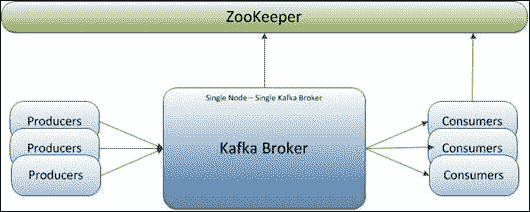
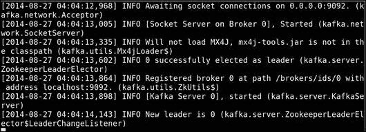
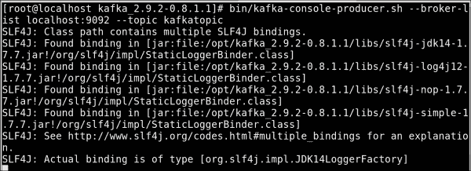
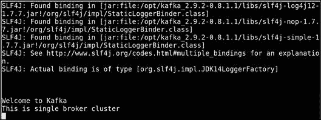
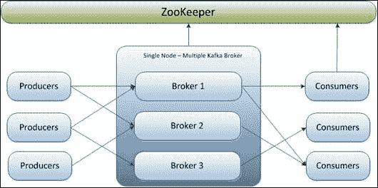
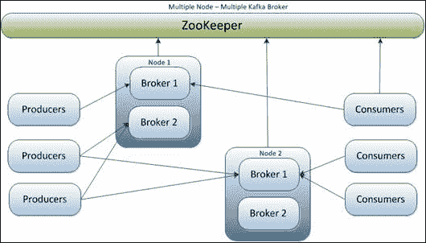

# 二、建立Kafka集群

现在，我们已经准备好使用 Apache Kafka 发布者-订阅者消息传递系统。借助Kafka，我们可以创建多种类型的集群，例如:

*   单个节点—单个代理集群
*   单个节点—多个代理集群
*   多个节点—多个代理集群

Kafka集群主要有五个主要组成部分:

*   **主题**:主题是由消息制作者向其发布消息的类别或提要名称。在Kafka中，主题被划分，每个划分由有序的不可变的消息序列表示。Kafka集群为每个主题维护分区日志。分区中的每个消息都被分配了一个唯一的顺序标识，称为*偏移量*。
*   **代理**:Kafka集群由一个或多个服务器组成，每个服务器可能有一个或多个服务器进程在运行，被称为代理。主题是在代理进程的上下文中创建的。
*   **Zookeeper**: ZooKeeper serves as the coordination interface between the Kafka broker and consumers. The ZooKeeper overview given on the Hadoop Wiki site is as follows ([http://wiki.apache.org/hadoop/ZooKeeper/ProjectDescription](http://wiki.apache.org/hadoop/ZooKeeper/ProjectDescription)):

    > *“ZooKeeper 允许分布式进程通过共享的数据寄存器分层名称空间(我们称这些寄存器为 znodes)相互协调，很像一个文件系统。”*

    ZooKeeper 和标准文件系统之间的主要区别在于，每个 znode 都可以有与之关联的数据，并且 z node 受限于它们可以拥有的数据量。ZooKeeper 旨在存储协调数据:状态信息、配置、位置信息等。

*   **生产者**:生产者通过在主题内选择合适的分区，向主题发布数据。对于负载平衡，可以以循环方式或使用自定义函数将消息分配给主题分区。
*   **消费者**:消费者是订阅主题并处理发布消息的订阅源的应用或进程。

让我们从一个非常基本的集群设置开始。

# 单个节点–单个代理集群

这是学习Kafka的起点。在前一章中，我们在一台机器上安装了Kafka。现在是时候设置一个基于单节点单代理的 Kafka 集群了，如下图所示:



## 启动动物园管理员服务器

Kafka 提供了默认的和简单的 ZooKeeper 配置文件，用于启动单个本地 ZooKeeper 实例，尽管在设置 Kafka 集群时也可以进行单独的 ZooKeeper 安装。首先使用以下命令启动本地 ZooKeeper 实例:

```scala
[root@localhost kafka_2.9.2-0.8.1.1]# bin/zookeeper-server-start.sh  config/zookeeper.properties

```

您应该会得到如下截图所示的输出:


### 注

Kafka 附带了所需的属性文件，定义了单个代理(单节点集群)所需的最小属性。

`zookeeper.properties`中定义的重要属性如下代码所示:

```scala
# Data directory where the zookeeper snapshot is stored.
dataDir=/tmp/zookeeper

# The port listening for client request
clientPort=2181
# disable the per-ip limit on the number of connections since this is a non-production config
maxClientCnxns=0
```

默认情况下，动物园管理员服务器将监听`*:2181/tcp`。有关如何设置多个动物园管理员服务器的详细信息，请访问[http://zookeeper.apache.org/](http://zookeeper.apache.org/)。

## 启动Kafka经纪人

现在使用以下命令在新的控制台窗口中启动Kafka经纪人:

```scala
[root@localhost kafka_2.9.2-0.8.1.1]# bin/kafka-server-start.sh config/server.properties

```

您现在应该会看到如下图所示的输出:



`server.properties`文件定义了Kafka经纪人所需的以下重要属性:

```scala
# The id of the broker. This must be set to a unique integer for each broker.
Broker.id=0

# The port the socket server listens on
port=9092

# The directory under which to store log files
log.dir=/tmp/kafka8-logs

# The default number of log partitions per topic. 
num.partitions=2

# Zookeeper connection string 
zookeeper.connect=localhost:2181
```

本章的最后一节定义了Kafka经纪人的一些额外的重要属性。

## 创造一个Kafka的话题

Kafka 提供了一个命令行工具，用于在 Kafka 服务器上创建主题。让我们使用这个实用程序创建一个名为`kafkatopic`的主题，它只有一个分区和一个副本:

```scala
[root@localhost kafka_2.9.2-0.8.1.1]#bin/kafka-topics.sh --create --zookeeper localhost:2181 --replication-factor 1 --partitions 1 --topic kafkatopic

Created topic "kafkatopic".

```

您应该在 Kafka 服务器窗口上获得输出，如下图所示:


`kafka-topics.sh`实用程序将创建一个主题，将默认分区数从 2 覆盖为 1，并显示一条成功创建消息。它还接受 ZooKeeper 服务器信息，如本例所示:`localhost:2181`。要获取任何 Kafka 服务器上的主题列表，请在新的控制台窗口中使用以下命令:

```scala
[root@localhost kafka_2.9.2-0.8.1.1]# bin/kafka-topics.sh --list --zookeeper localhost:2181
kafkatopic

```

## 启动生产者发送消息

Kafka 为用户提供了一个命令行生成器客户端，它接受来自命令行的输入，并将它们作为消息发布给 Kafka 集群。默认情况下，输入的每一个新行都被视为新消息。以下命令用于在新的控制台窗口中启动基于控制台的生成器来发送消息:

```scala
[root@localhost kafka_2.9.2-0.8.1.1]# bin/kafka-console-producer.sh --broker-list localhost:9092 --topic kafkatopic

```

输出将如下图所示:



启动生产者的命令行客户端时，需要以下参数:

*   `broker-list`
*   `topic`

`broker-list`参数指定要连接的经纪人为`<node_address:port>`，即`localhost:9092`。`kafkatopic`主题创建于*创建Kafka主题*部分。主题名称是向订阅了同一主题的特定消费者群`kafkatopic`发送消息所必需的。

现在在控制台窗口中键入以下消息:

*   键入`Welcome to Kafka`并按*进入*
*   键入`This is single broker cluster`并按*进入*

您应该会看到如下图所示的输出:


尝试更多消息。消费者的默认属性在`producer.properties`中定义。重要的属性是:

```scala
# list of brokers used for bootstrapping knowledge about the rest of the cluster
# format: host1:port1,host2:port2 ...
metadata.broker.list=localhost:9092

# specify the compression codec for all data generated: none , gzip, snappy.
compression.codec=none
```

关于如何为Kafka写制作人和制作人属性的详细信息将在[第 4 章](4.html "Chapter 4. Writing Producers")、*写制作人*中讨论。

## 启动消费者消费消息

Kafka 还为消息消费提供了一个命令行消费客户端。下面的命令用于启动一个基于控制台的消费程序，一旦它订阅了在 Kafka 代理中创建的主题，就会在命令行显示输出:

```scala
[root@localhost kafka_2.9.2-0.8.1.1]# bin/kafka-console-consumer.sh --zookeeper localhost:2181 --topic kafkatopic --from-beginning

```

在执行前面的命令时，您应该会得到如下截图所示的输出:



消费者的默认属性在`/config/consumer.properties`中定义。重要的属性是:

```scala
# consumer group id (A string that uniquely identifies a set of consumers # within the same consumer group)
group.id=test-consumer-group
```

关于如何为Kafka和消费者属性写消费者的详细信息，在[第 5 章](5.html "Chapter 5. Writing Consumers")、*写消费者*中讨论。

通过在不同的终端中运行所有四个组件(`zookeeper`、`broker`、`producer`和`consumer`)，您将能够从生产者的终端输入消息，并看到它们出现在订阅消费者的终端中。

通过运行不带参数的命令，可以查看生产者和消费者命令行工具的使用信息。

# 单个节点–多个代理集群

现在我们来到了Kafka星团的下一个层次。现在让我们设置一个基于单节点多代理的 Kafka 集群，如下图所示:



## 启动动物园管理员

启动动物园管理员的第一步对于这种类型的集群保持不变。

## 启动Kafka经纪人

为了在单个节点上设置多个代理，每个代理需要不同的服务器属性文件。每个属性文件将为以下属性定义唯一的不同值:

*   `broker.id`
*   `port`
*   `log.dir`

例如，在用于`broker1`的`server-1.properties`中，我们定义如下:

*   `broker.id=1`
*   `port=9093`
*   `log.dir=/tmp/kafka-logs-1`

同样，对于用于`broker2`的`server-2.properties`，我们定义如下:

*   `broker.id=2`
*   `port=9094`
*   `log.dir=/tmp/kafka-logs-2`

所有新经纪人都遵循类似的程序。在定义属性时，我们更改了端口号，因为所有其他代理仍将在同一台机器上运行，但是在生产环境中，代理将在多台机器上运行。现在，我们使用以下命令在单独的控制台窗口中启动每个新代理:

```scala
[root@localhost kafka_2.9.2-0.8.1.1]# bin/kafka-server-start.sh config/server-1.properties
[root@localhost kafka_2.9.2-0.8.1.1]# bin/kafka-server-start.sh config/server-2.properties
…

```

## 使用命令行创建Kafka主题

使用命令行工具在Kafka服务器上创建主题，让我们创建一个名为`replicated-kafkatopic`的主题，它有两个分区和两个副本:

```scala
[root@localhost kafka_2.9.2-0.8.1.1]# bin/kafka-topics.sh --create --zookeeper localhost:2181 --replication-factor 3 --partitions 1 --topic replicated-kafkatopic
Created topic "replicated-kafkatopic".

```

## 启动生产者发送消息

如果我们使用单个生产者来连接所有的经纪人，我们需要传递经纪人的初始列表，并且通过查询`broker-list`内传递的经纪人来识别剩余经纪人的信息，如下命令所示。此元数据信息基于主题名称:

```scala
--broker-list localhost:9092, localhost:9093

```

使用以下命令启动生成器:

```scala
[root@localhost kafka_2.9.2-0.8.1.1]# bin/kafka-console-producer.sh --broker-list localhost:9092, localhost:9093 --topic replicated-kafkatopic

```

如果我们需要运行连接到不同代理组合的多个生产者，我们需要为每个生产者指定代理列表，就像我们在多个代理的情况下所做的那样。

## 启动消费者消费消息

在这个过程中，将使用相同的消费者客户端，如前面的示例。就像以前一样，一旦它订阅了在Kafka代理中创建的主题，它就会在命令行上显示输出:

```scala
[root@localhost kafka_2.9.2-0.8.1.1]# bin/kafka-console-consumer.sh --zookeeper localhost:2181 --from-beginning --topic replicated-kafkatopic

```

# 多个节点–多个代理集群

本书没有详细讨论这个集群场景，但是就像单节点——多代理 Kafka 集群的情况一样，我们在每个节点上设置多个代理，我们应该在集群的每个节点上安装 Kafka，来自不同节点的所有代理都需要连接到同一个 ZooKeeper。

出于测试目的，所有命令将保持与我们在单个节点(多代理集群)中使用的命令相同。

下图显示了集群场景，其中多个代理配置在多个节点上(本例中为节点 1 和节点 2)，生产者和消费者以不同的组合连接:



# Kafka经纪人财产清单

以下是可以为Kafka经纪人配置的几个重要属性的列表。完整列表，请访问[http://kafka.apache.org/documentation.html#brokerconfig](http://kafka.apache.org/documentation.html#brokerconfig)。

<colgroup><col style="text-align: left"> <col style="text-align: left"> <col style="text-align: left"></colgroup> 
| 

属性名

 | 

描述

 | 

缺省值

 |
| --- | --- | --- |
| `broker.id` | 每个经纪人由一个非负整数标识唯一标识。该标识用作代理的名称，允许代理移动到不同的主机/端口，而不会使消费者感到困惑。 | `0` |
| `log.dirs` | 这些是存储日志数据的目录。创建的每个新分区都将被放置在当前分区最少的目录中。 | `/tmp/kafka-logs` |
| `zookeeper.connect` | 这以`hostname:port/chroot`形式指定了动物园管理员的连接字符串。在这里，`chroot`是一个基础目录，它被添加到所有的路径操作中(这有效地将所有的 Kafka 节点命名为，允许与同一个 ZooKeeper 集群上的其他应用程序共享)。 | `localhost:2181` |
| `host.name` | 这是代理的主机名。如果设置了此选项，它将只绑定到此地址。如果没有设置，它将绑定到所有接口，并将一个发布到 ZooKeeper。 | `Null` |
| `num.partitions` | 如果在创建主题时没有给出分区计数，这是每个主题的默认分区数。 | `1` |
| `auto.create.topics.enable` | 这使得能够在服务器上自动创建主题。如果设置为真，则尝试为不存在的主题生成、使用或获取元数据时，将使用默认的复制因子和分区数自动创建它。 | `True` |
| `default.replication.factor` | 这是自动创建的主题的默认复制因子。 | `1` |

# 总结

在本章中，您学习了如何在单个节点上设置一个带有单个/多个代理的 Kafka 集群，运行命令行生产者和消费者，以及交换一些消息。我们还讨论了Kafka经纪人的重要背景。

在下一章，我们将看看Kafka的内部设计。