# 使用火花 SQL 进行数据探索

在本章中，我们将向您介绍如何使用 Spark SQL 进行探索性数据分析。我们将介绍计算一些基本统计数据、识别异常值以及可视化、采样和透视数据的初步技术。本章中的一系列实践练习将使您能够使用 Spark SQL 以及 Apache Zeppelin 等工具来开发对数据的直觉。

在本章中，我们将研究以下主题:

*   什么是探索性数据分析
*   EDA 为什么重要？
*   使用 Spark SQL 进行基础数据分析
*   使用阿帕奇齐柏林飞船可视化数据
*   使用 Spark SQL APIs 对数据进行采样
*   使用火花 SQL 创建数据透视表

# 引入探索性数据分析

**探索性数据分析** ( **EDA** )或**初始数据分析** ( **IDA** )是一种数据分析方法，试图最大限度地洞察数据。这包括评估数据的质量和结构，计算汇总或描述性统计数据，以及绘制适当的图表。它可以揭示底层结构，并建议如何对数据建模。此外，EDA 帮助我们检测数据中的异常值、错误和异常，决定如何处理这些数据通常比其他更复杂的分析更重要。EDA 使我们能够测试我们的底层假设，发现数据中的集群和其他模式，并识别各种变量之间的可能关系。仔细的 EDA 过程对于理解数据至关重要，有时足以揭示如此差的数据质量，以至于使用更复杂的基于模型的分析是不合理的。

通常，EDA 中使用的图形技术很简单，包括绘制原始数据和简单的统计数据。重点是数据揭示的或最适合数据的结构和模型。EDA 技术包括散点图、箱线图、直方图、概率图等。在大多数 EDA 技术中，我们使用所有的数据，而不做任何潜在的假设。作为这种探索的结果，分析师为数据集建立直觉，或获得“感觉”。更具体地说，图形技术允许我们有效地选择和验证适当的模型，测试我们的假设，识别关系，选择估计值，检测异常值，等等。

EDA 涉及大量的试错和多次迭代。最好的方法是从简单开始，然后在进行的过程中加入复杂性。在简单模型和更精确的模型之间有一个主要的权衡。简单的模型可能更容易解释和理解。这些模型可以让你很快达到 90%的准确率，而一个更复杂的模型可能需要几周或几个月才能让你额外提高 2%。例如，您应该绘制简单的直方图和散点图，以便快速开始为您的数据开发直觉。

# 使用 Spark SQL 进行基础数据分析

交互式地，处理和可视化大数据具有挑战性，因为查询可能需要很长时间来执行，并且视觉界面不能容纳像数据点一样多的像素。Spark 支持内存计算和高度并行，以实现与大型分布式数据的交互。此外，Spark 能够处理千兆字节的数据，并提供了一套通用的编程接口和库。其中包括 SQL、Scala、Python、Java 和 R APIs，以及用于分布式统计和机器学习的库。

对于适合单个计算机的数据，有许多好的工具可用，如 R、MATLAB 等。然而，如果数据不适合一台机器，或者如果将数据传送到那台机器非常复杂，或者如果一台计算机不能轻松处理数据，那么这一部分将为数据探索提供一些好的工具和技术。

在本节中，我们将通过一些基本的数据探索练习来了解示例数据集。我们将使用一个数据集，其中包含与葡萄牙银行机构的直接营销活动(电话)相关的数据。营销活动是以给顾客打电话为基础的。我们将使用`bank-additional-full.csv`文件，该文件包含 41，188 条记录和 20 个输入字段，按日期排序(从 2008 年 5 月到 2010 年 11 月)。该数据集由莫罗、科尔特斯和丽塔提供，可从[https://archive.ics.uci.edu/ml/datasets/Bank+Marketing](https://archive.ics.uci.edu/ml/datasets/Bank+Marketing)下载。

1.  作为第一步，让我们定义一个模式并读入 CSV 文件来创建一个数据帧。您可以使用`:paste`命令在 Spark shell 会话中粘贴初始语句集(使用 *Ctrl* + *D* 退出粘贴模式)，如图所示:

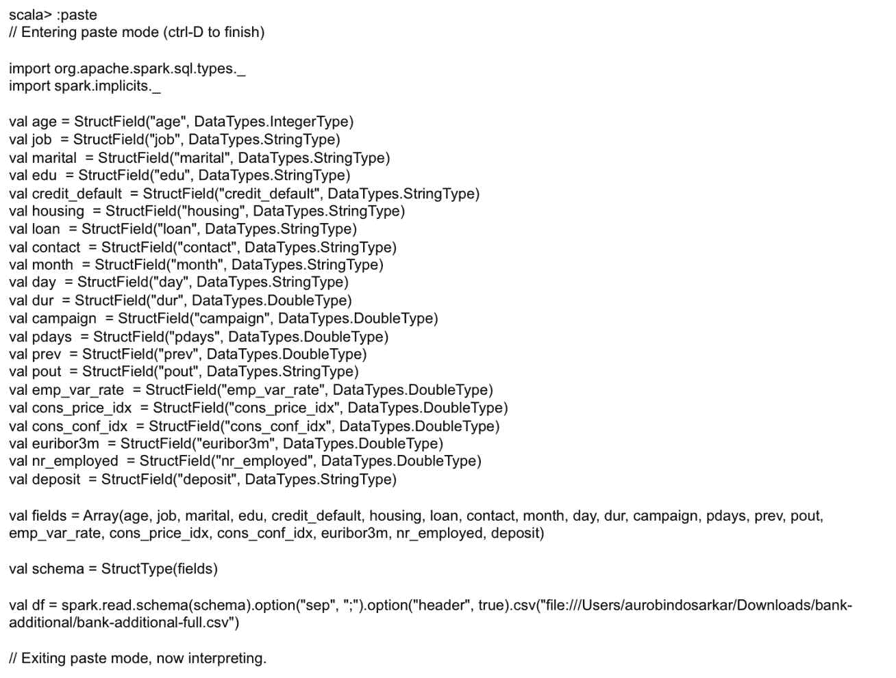

2.  创建数据框后，我们首先验证记录的数量:


3.  我们还可以为输入记录定义一个名为`Call`的`case`类，然后创建一个强类型数据集，如下所示:


在下一节中，我们将通过识别数据集中缺失的数据来开始数据探索。

# 识别丢失的数据

数据集中可能会出现数据缺失，原因从疏忽到响应者拒绝提供特定数据点。然而，在所有情况下，缺失数据在现实世界的数据集中都很常见。缺少数据会在数据分析中产生问题，有时会导致错误的决策或结论。因此，识别丢失的数据并设计有效的策略来处理它是非常重要的。

在本节中，我们将分析样本数据集中缺少数据字段的记录数量。为了模拟丢失的数据，我们将通过用空字符串替换包含“未知”值的字段来编辑示例数据集。

首先，我们从编辑过的文件中创建了一个数据框/数据集，如图所示:


以下两个语句给出了某些字段缺少数据的行数:

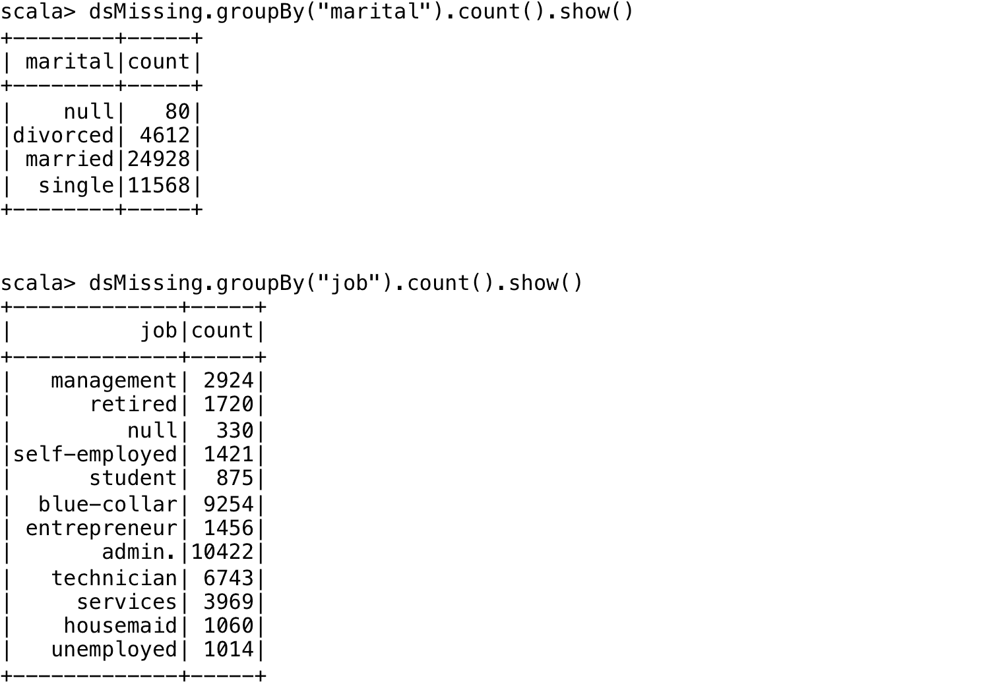

在[第 4 章](04.html#1MBG20-e9cbc07f866e437b8aa14e841622275c)、*使用 Spark SQL 进行数据蒙版*中，我们将了解处理缺失数据的有效方法。在下一节中，我们将计算样本数据集的一些基本统计数据，以提高我们对数据的理解。

# 计算基本统计

计算基本统计数据对于很好地初步理解我们的数据至关重要。首先，为了方便起见，我们创建了一个案例类和一个数据集，该数据集包含来自原始数据框的字段子集。在以下示例中，我们选择了一些数字字段和结果字段，即“定期存款预订”字段:

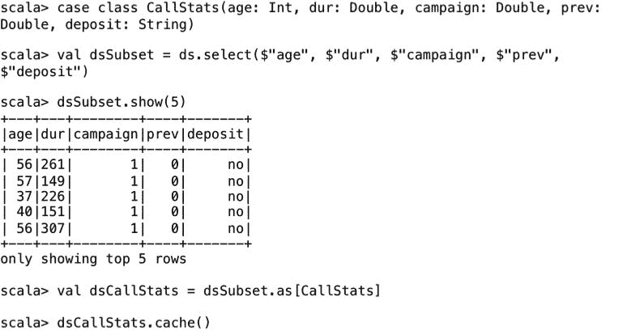

接下来，我们使用`describe()`计算数据集中数值列的`count`、`mean`、`stdev`、`min`和`max`值。`describe()`命令提供了一种快速检查数据的方法。例如，每个选定列的行数与数据框中的记录总数相匹配(无空或无效行)，年龄列的平均值和范围是否符合您的预期，等等。根据平均值和标准差的值，您可以选择某些数据元素进行更深入的分析。例如，假设正态分布，年龄的平均值和标准偏差值表明大多数年龄值在 30 至 50 岁的范围内，对于其他列，标准偏差值可能表示数据的偏差(因为标准偏差大于平均值)。


此外，我们可以使用 stat 包来计算其他统计数据，如协方差和皮尔逊相关系数。协方差表示两个随机变量的联合可变性。由于我们正处于电子设计自动化阶段，这些测量可以为我们提供一个变量相对于另一个变量如何变化的指标。例如，协方差的符号表示两个变量之间的变化方向。在下面的示例中，年龄和最后一次接触的持续时间之间的协方差向相反的方向移动，即随着年龄的增加，持续时间减少。相关性给出了这两个变量之间关系强度的大小。


我们可以在两个变量之间创建交叉表格或交叉表来评估它们之间的相互关系。例如，在下面的示例中，我们在年龄和婚姻状况之间创建了一个交叉表，表示为 2x2 的应急表。从表中，我们了解到，对于给定的年龄，不同婚姻状况下的个体总数的分裂。我们还可以提取数据框的数据列中最频繁出现的项目。这里，我们选择教育水平作为列，并指定支持水平`0.3`，也就是说，我们希望在数据框中找到出现频率大于`0.3`(至少观察到 30%的时间)的教育水平。最后，我们还可以计算数据帧中数值列的近似分位数。在这里，我们用指定的分位数概率`0.25`、`0.5`和`0.75`来计算年龄列(值`0`是最小值，`1`是最大值，`0.5`是中值)。

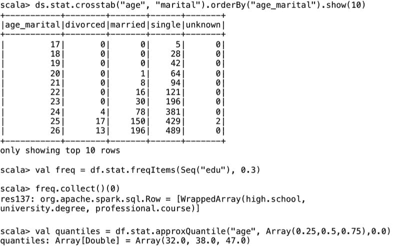

接下来，我们使用类型化聚合函数来总结我们的数据，以便更好地理解它。在下面的陈述中，我们按照是否订阅了定期存款、联系的客户总数、每个客户的平均通话次数、平均通话持续时间以及之前给这些客户的平均通话次数来汇总结果。结果四舍五入到小数点后两位:

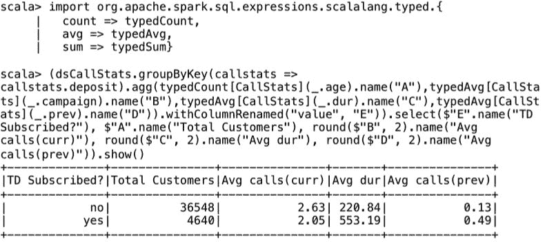

同样，按照客户的年龄，执行以下语句会得到类似的结果:


在通过计算基本统计数据更好地理解我们的数据后，我们将重点转移到识别数据中的异常值上。

# 识别数据异常值

离群值或异常值是对数据的观察，它与数据集中的其他观察有很大的偏差。这些错误的异常值可能是由于数据收集的错误或测量的可变性。它们会对结果产生重大影响，因此在 EDA 过程中识别它们是非常必要的。

然而，这些技术将异常值定义为点，这些点不在簇中。用户必须使用统计分布对数据点进行建模，异常值是根据它们相对于底层模型的表现来识别的。这些方法的主要问题是，在 EDA 期间，用户通常没有足够的关于底层数据分布的知识。

EDA，使用建模和可视化的方法，是一个很好的方式来实现我们的数据更深的直觉。Spark MLlib 支持大量(且不断增长的)分布式机器学习算法，以简化这项任务。例如，我们可以应用聚类算法并可视化结果来检测组合列中的异常值。在下面的示例中，我们使用上次联系持续时间(以秒为单位)、此活动期间执行的联系人数、此客户(活动)、从上次活动中联系客户(pdays)后过去的天数以及先前:此活动之前执行的联系人数和此客户(prev)值，通过应用 k-means 聚类算法计算数据中的两个聚类:

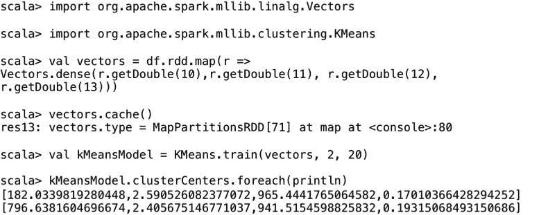

对 EDA 有用的其他分布式算法包括分类、回归、降维、相关和假设检验。更多关于使用火花 SQL 和这些算法的细节将在[第 6 章](06.html#3279U0-e9cbc07f866e437b8aa14e841622275c)、*在机器学习应用中使用火花 SQL 中介绍。*

# 使用阿帕奇齐柏林飞船可视化数据

通常，我们会生成许多图表来验证我们对数据的预感。EDA 过程中使用的许多这些快速而肮脏的图形最终都会被丢弃。探索性数据可视化对于数据分析和建模至关重要。然而，我们经常跳过大数据的探索性可视化，因为这很难。例如，浏览器通常不能处理数百万个数据点。因此，在我们能够有效地可视化数据之前，我们必须对数据进行总结、采样或建模。

传统上，商业智能工具提供广泛的聚合和旋转功能来可视化数据。但是，这些工具通常使用夜间作业来汇总大量数据。汇总的数据随后被下载并显示在医生的工作站上。Spark 可以消除许多这样的批处理作业，以支持交互式数据可视化。

在本节中，我们将探索一些使用 Apache Zeppelin 的基本数据可视化技术。Apache Zeppelin 是一个基于网络的工具，支持交互式数据分析和可视化。它支持多种语言解释器，并带有内置的 Spark 集成。因此，使用阿帕奇齐柏林飞船快速简单地开始探索性数据分析:

1.  你可以从[https://zeppelin.apache.org/](https://zeppelin.apache.org/)下载 Appache 齐柏林飞艇。解压缩硬盘上的软件包，并使用以下命令启动齐柏林飞艇:

```scala
      Aurobindos-MacBook-Pro-2:zeppelin-0.6.2-bin-all aurobindosarkar$ bin/zeppelin-daemon.sh start

```

2.  您应该会看到以下消息:

```scala
      Zeppelin start                                           [  OK  ]
```

3.  你应该可以在`http://localhost:8080/`看到齐柏林飞艇的主页:


4.  Click on the Create new note link and specify a path and name for your notebook, as shown:

    

5.  在下一步中，我们粘贴与本章开头相同的代码，为示例数据集创建一个数据框:


6.  我们可以执行典型的数据帧操作，如下所示:

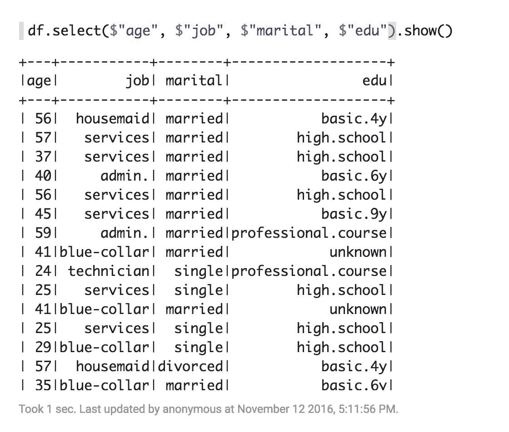

7.  接下来，我们从数据框中创建一个表，并在上面执行一些 SQL。可以通过单击所需的适当图表类型来绘制 SQL 语句的执行结果。这里，我们创建条形图作为汇总和可视化数据的示例:

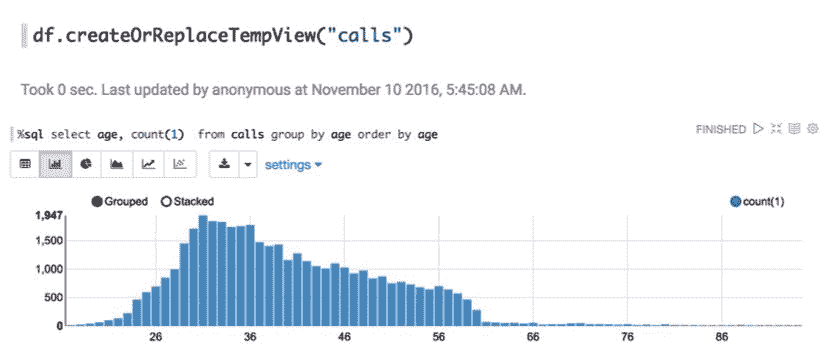

8.  我们可以创建散点图，如下图所示:


您还可以读取绘制的每个点的坐标值:


9.  此外，我们可以创建一个接受输入值的文本框，使体验具有交互性。在下图中，我们创建了一个文本框，可以接受不同的年龄参数值，条形图也相应地进行了更新:

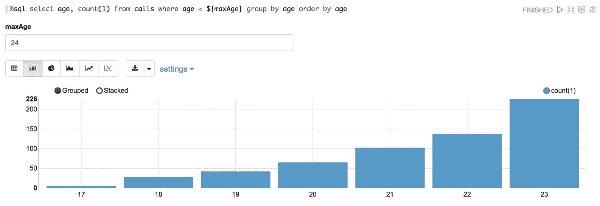

10.  同样，我们也可以创建下拉列表，用户可以在其中选择适当的选项:


并且，数值表或图表会自动更新:


我们将在[第 8 章](08.html#4E33Q0-e9cbc07f866e437b8aa14e841622275c)*中探索使用火花 SQL 和火花的更高级的可视化，使用火花 SQL 和火花* *。*在下一节中，我们将探讨用于从我们的数据生成样本的方法。

# 使用 Spark SQL APIs 对数据进行采样

通常，我们需要可视化单个数据点来理解数据的本质。统计学家广泛使用抽样技术进行数据分析。Spark 支持近似和精确的样本生成。近似采样速度更快，在大多数情况下通常足够好。

在本节中，我们将探索用于生成示例的 Spark SQL APIs。我们将通过使用数据框架/数据集应用编程接口和基于 RDD 的方法，生成近似和精确的分层样本的一些示例，有和没有替换。

# 使用数据框/数据集应用编程接口进行采样

我们可以使用`sampleBy`来创建分层样本，而无需替换。我们可以指定样本中要选择的每个值的百分比分数。

样本的大小和每种类型的记录数量如下所示:


接下来，我们创建一个替换示例，使用随机种子选择一小部分行(总记录的 10%)。使用`sample`不能保证提供数据集中记录总数的精确分数。我们还打印出样本中每种记录的编号:


在下一节中，我们将探索使用 RDDs 的采样方法。

# 使用 RDD 空气污染指数采样

在本节中，我们使用 rdd 创建分层样本，包括替换和不替换。

首先，我们从数据框中创建一个 RDD:

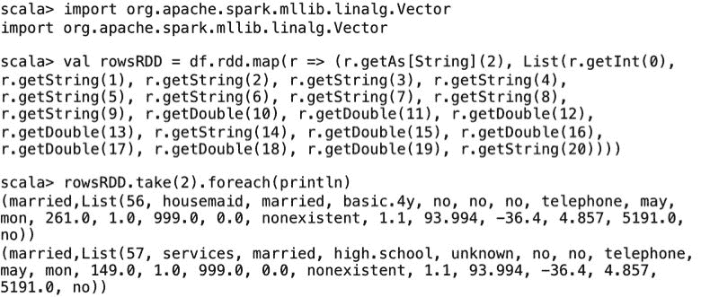

我们可以在示例中指定每个记录类型的分数，如图所示:


在下图中，我们使用`sampleByKey`和`sampleByKeyExact`方法来创建样本。前者是近似样本，后者是精确样本。第一个参数指定生成样本时是否进行替换:


接下来，我们打印出总体和每个样本中的记录总数。你会注意到`sampleByKeyExact`按照指定的分数给你精确的记录数:


sample 方法可用于创建一个随机样本，该样本包含样本中指定部分的记录。接下来，我们创建一个替换样本，包含总记录的 10%:


其他统计操作，如假设检验、随机数据生成、可视化概率分布等，将在后面的章节中介绍。在下一节中，我们将探索使用 Spark SQL 创建数据透视表的数据。

# 使用火花 SQL 创建数据透视表

数据透视表创建数据的备用视图，通常在数据浏览过程中使用。在下面的示例中，我们演示了如何使用 Spark 数据框进行旋转:


以下示例以获得的住房贷款为中心，并按婚姻状况计算数字:


在下一个示例中，我们为调用总数和平均调用数创建了一个带有适当列名的数据框:

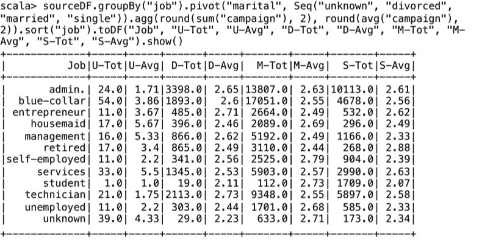

在下面的示例中，我们创建了一个 DataFrame，该 data frame 具有相应的列名，用于表示每个职务类别的总呼叫持续时间和平均呼叫持续时间:

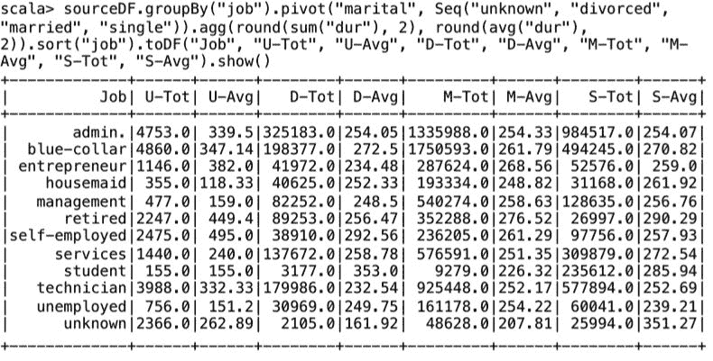

在下面的示例中，我们展示了旋转以计算每个工作类别的平均呼叫持续时间，同时还指定了婚姻状况的子集:


以下示例与前一个示例相同，只是在这种情况下，我们也按住房贷款字段划分了平均呼叫持续时间值:

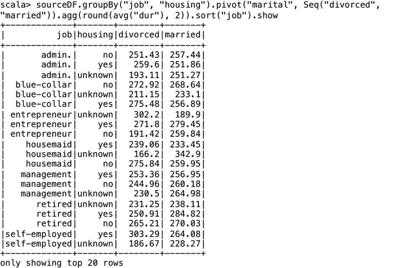

接下来，我们将展示如何创建按月订阅的定期存款透视表的数据框，将其保存到磁盘，并将其读回 RDD:


此外，我们使用上一步中的 RDD 计算认购和未认购定期贷款的客户的季度总数:


我们将在本书后面介绍对其他类型数据的详细分析，包括流数据、大规模图表、时间序列数据等。

# 摘要

在本章中，我们演示了如何使用 Spark SQL 来探索数据集、执行基本的数据质量检查、生成样本和数据透视表，以及使用 Apache Zeppelin 可视化数据。

在下一章中，我们将把重点转移到数据收集/争论上。我们将介绍处理缺失数据、错误数据、重复记录等的技术。我们还将使用大量的实践课程来演示如何将火花 SQL 用于常见的数据收集任务。