# 大规模应用架构中的Spark SQL

在这本书里，我们从 Spark SQL 及其组件的基础知识开始，以及它在 Spark 应用程序中的作用。随后，我们介绍了一系列章节，重点介绍了它在各种类型的应用程序中的使用。由于 DataFrame/Dataset API 和 Catalyst 优化器是 Spark SQL 的核心，因此它在基于 Spark 技术堆栈的所有应用程序中发挥关键作用也就不足为奇了。这些应用包括大规模机器学习、大规模图形和深度学习应用。此外，我们还展示了基于 Spark SQL 的结构化流应用程序，这些应用程序作为连续应用程序在复杂的环境中运行。在本章中，我们将探索在现实应用程序中利用 Spark 模块和 Spark SQL 的应用程序体系结构。

更具体地说，我们将涵盖大规模应用程序中的关键架构组件和模式，架构师和设计人员会发现这些组件和模式作为他们特定用例的起点非常有用。我们将描述用于批处理、流应用程序和机器学习管道的一些主要处理模型的部署。这些处理模型的底层架构需要支持在一端高速接收非常大量的各种类型的数据，同时在另一端使输出数据可供分析工具以及报告和建模软件使用。此外，我们将展示使用 Spark SQL 进行监控、故障排除和收集/报告指标的支持代码。

我们将在本章中讨论以下主题:

*   理解基于 Spark 的批处理和流处理架构
*   了解 Lambda 和 Kappa 架构
*   使用结构化流实现可扩展流处理
*   使用 Spark SQL 构建健壮的**提取-转换-加载** ( **ETL** )管道
*   使用 Spark SQL 实现可扩展的监控解决方案
*   部署 Spark 机器学习管道
*   使用集群管理器:Mesos 和 Kubernetes

# 了解基于 Spark 的应用程序架构

Apache Spark 是一个新兴平台，它利用分布式存储和处理框架来支持大规模的查询、报告、分析和智能应用程序。Spark SQL 具有必要的功能，并支持所需的关键机制，以跨多种数据源和格式访问数据，并为具有低延迟流数据或高吞吐量历史数据存储的下游应用程序做好准备。下图显示了在典型的基于 Spark 的批处理和流应用程序中包含这些需求的高级架构:


此外，随着组织开始在多个项目中采用大数据和基于 NoSQL 的解决方案，仅包含关系数据库管理系统的数据层不再被视为最适合现代企业应用程序中的所有用例。为了满足典型大数据应用程序的需求，下图所示的仅基于关系数据库管理系统的体系结构正在整个行业中迅速消失:


下图显示了由多种类型的数据存储组成的更典型的场景。今天的应用程序使用几种类型的数据存储，它们代表了最适合给定用例集的数据存储。使用多种数据存储技术，根据应用程序使用数据的方式进行选择，称为**多语种持久性**。Spark SQL 是云或内部部署中这一策略和其他类似持久性策略的优秀推动者:


此外，我们观察到只有一小部分真实世界的 ML 系统是由 ML 代码组成的(下图中最小的方框)。然而，围绕这个 ML 代码的基础设施是庞大而复杂的。在本章的后面，我们将使用 Spark SQL 来创建此类应用程序中的一些关键部分，包括可扩展的 ETL 管道和监控解决方案。随后，我们还将讨论机器学习管道的生产部署，以及集群管理器(如 Mesos 和 Kubernetes)的使用:


Reference: "Hidden Technical Debt in Machine Learning Systems," Google NIPS 2015

在下一节中，我们将讨论基于 Spark 的批处理和流处理架构中的关键概念和挑战。

# 使用 Apache Spark 进行批处理

通常，对海量数据进行批处理以创建批处理视图，从而支持临时查询和管理信息系统报告功能，和/或将可扩展的机器学习算法应用于分类、聚类、协作过滤和分析应用。

由于批处理中涉及的数据量，这些应用程序通常是长时间运行的作业，并且可以轻松地持续数小时、数天或数周，例如聚合查询，如页面的每日访问者计数、网站的唯一访问者以及每周的总销售额。

作为大规模数据处理的引擎，Apache Spark 越来越受欢迎。它运行程序的速度在内存上比 Hadoop MapReduce 快 100 倍，在磁盘上快 10 倍。快速采用 Spark 的一个重要原因是解决批处理和流处理需求所需的通用/相似编码。

在下一节中，我们将介绍流处理的关键特征和概念。

# 使用 Apache Spark 进行流处理

大多数现代企业都在努力处理高数据量(以及此类数据的相关快速和无限制增长)，同时满足低延迟处理要求。此外，与传统批量处理的管理信息系统报告相比，从实时流数据中获得的接近实时的业务洞察力带来了更高的价值。与流系统相反，传统的批处理系统被设计成处理大量的有界数据集。这样的系统在执行开始时会获得所需的所有数据。随着输入数据的不断增长，这种批处理系统提供的结果会很快过时。

通常，在流处理中，在触发所需的处理之前，不会在很长一段时间内收集数据。通常，传入的数据被移动到一个排队系统，如 Apache Kafka 或 Amazon Kinesis。然后，流处理器访问这些数据，并对其执行某些计算以生成结果输出。典型的流处理管道创建增量视图，这些视图通常根据流入系统的增量数据进行更新。

增量视图通过**服务层**提供，以支持查询和实时分析需求，如下图所示:


在流处理系统中有两种重要的时间:事件时间和处理时间。事件时间是事件实际发生的时间(在源头)，而处理时间是在处理系统中观察到事件的时间。事件时间通常嵌入在数据本身中，对于许多用例，它是您想要操作的时间。然而，从数据中提取事件时间以及处理延迟或无序的数据可能会给流式应用程序带来重大挑战。此外，由于资源限制、分布式处理模型等原因，事件时间和处理时间之间存在偏差。有许多用例需要按事件时间进行聚合；例如，一小时窗口中的系统错误数量。

也可能有其他问题；例如，在窗口功能中，我们需要确定是否已经观察到给定事件时间的所有数据。这些系统需要以一种允许它们在不确定环境中良好运行的方式来设计。例如，在 Spark 结构化流中，可以为数据流一致地定义基于事件时间和窗口的聚合查询，因为它可以处理延迟到达的数据，并适当地更新旧的聚合。

在处理大型数据流应用程序时，容错是至关重要的，例如，流处理作业会记录到目前为止看到的所有元组。这里，每个元组可以代表一个用户活动流，并且应用程序可能想要报告到目前为止看到的总活动。这种系统中的节点故障会导致计数不准确，因为(在故障节点上)有未处理的元组。

从这种情况中恢复的一种简单方法是重放整个数据集。考虑到所涉及的数据量，这是一项昂贵的操作。检查点是避免重新处理整个数据集的常用技术。在失败的情况下，应用程序数据状态被恢复到最后一个检查点，并且从此点开始的元组被重放。为了防止 Spark Streaming 应用程序中的数据丢失，使用了一个**预写日志** ( **WAL** )，故障后可以从该日志中重放数据。

在下一节中，我们将介绍 Lambda 架构，这是一种在以 Spark 为中心的应用程序中实现的流行模式，因为它可以使用非常相似的代码来满足批处理和流处理的需求。

# 了解 Lambda 架构

Lambda 架构模式试图结合两者的优点——批处理和流处理。该模式由几个层组成:**批处理层**(接收和处理持久存储(如 HDFS 和 S3)上的数据)**速度层**(接收和处理尚未由**批处理层**处理的流式数据)和**服务层**(组合来自**批处理**和**速度层**的输出以呈现合并结果)。这是 Spark 环境中非常流行的架构，因为它可以支持**批处理**和**速度层**实现，两者之间的代码差异最小。

给定的图将 Lambda 架构描述为批处理和流处理的组合:


下图显示了使用 AWS 云服务(**亚马逊驱动**、**亚马逊 S3** 存储、**亚马逊 EMR** 、**亚马逊 dynamic db**等等)和 Spark 的 Lambda 架构的实现:


For more details on the AWS implementation of Lambda architecture, refer to [https://d0.awsstatic.com/whitepapers/lambda-architecure-on-for-batch-aws.pdf](https://d0.awsstatic.com/whitepapers/lambda-architecure-on-for-batch-aws.pdf).

在下一节中，我们将讨论一个更简单的体系结构，称为卡帕体系结构，它完全取消了**批处理层**，仅在**速度层**中处理流。

# 理解卡帕建筑

**卡帕架构**比λ模式更简单，因为它只包含速度层和服务层。所有计算都以流处理的方式进行，并且没有对整个数据集进行批处理重新计算。重新计算仅用于支持变更和新需求。

通常，传入的实时数据流在内存中进行处理，并保存在数据库或 HDFS 中以支持查询，如下图所示:


Kappa 架构可以通过使用 Apache Spark 结合排队解决方案来实现，比如 Apache Kafka。如果数据保留时间被限制在几天到几周，那么 Kafka 也可以用于在有限的时间内保留数据。

在接下来的几节中，我们将介绍一些使用 Apache Spark、Scala 和 Apache Kafka 的实践练习，这些练习在现实世界的应用程序开发环境中非常有用。我们将首先使用 Spark SQL 和结构化流来实现一些流用例。

# 构建可扩展流处理应用程序的设计考虑

构建健壮的流处理应用程序具有挑战性。与流处理相关的典型复杂性包括:

*   **复杂数据**:多样化的数据格式和数据质量给流媒体应用带来了重大挑战。通常，数据有多种格式，如 JSON、CSV、AVRO 和二进制。此外，脏数据、延迟到达和无序数据会使此类应用程序的设计变得极其复杂。
*   **复杂工作负载**:流媒体应用需要支持多种多样的应用需求，包括交互查询、机器学习管道等等。
*   **复杂系统**:有着多样的存储系统，包括卡夫卡、S3、驱动等等，系统故障会导致重大的再处理或者不好的结果。

使用 Spark SQL 的蒸汽处理可以是快速的、可扩展的和容错的。它提供了一套广泛的高级 API 来处理复杂的数据和工作负载。例如，数据源应用编程接口可以与许多存储系统和数据格式集成。

For a detailed coverage of building scalable and fault-tolerant structured streaming applications, refer to [https://spark-summit.org/2017/events/easy-scalable-fault-tolerant-stream-processing-with-structured-streaming-in-apache-spark/](https://spark-summit.org/2017/events/easy-scalable-fault-tolerant-stream-processing-with-structured-streaming-in-apache-spark/).

流查询允许我们指定一个或多个数据源，使用 data frame/Dataset API 或 SQL 转换数据，并指定各种接收器来输出结果。有几个数据源的内置支持，如文件、卡夫卡和套接字，如果需要，我们还可以组合多个数据源。

Spark SQL Catalyst 优化器计算出增量执行转换的机制。该查询被转换为一系列对新批次数据进行操作的增量执行计划。接收器接受每个批处理的输出，更新在事务上下文中完成。您还可以指定各种输出模式(**完成**、**更新**或**追加**)和触发器来控制何时输出结果。如果未指定触发器，结果将持续更新。给定查询的进度和失败后的重新启动由持久化检查点管理。

Spark 结构化流支持流分析，而不必担心使流工作的复杂底层机制。在这个模型中，输入可以被认为是来自一个只追加的表(不断增长)的数据。触发器指定检查输入是否有新数据到达的时间间隔，查询表示对输入的映射、过滤和缩减等操作。结果表示在每个触发间隔中更新的最终表(根据指定的查询操作)。

For detailed illustrations on structured streaming internals, check out [http://spark.apache.org/docs/latest/structured-streaming-programming-guide.html](http://spark.apache.org/docs/latest/structured-streaming-programming-guide.html).

我们还可以对流式数据执行滑动窗口操作。在这里，我们通过滑动窗口定义聚合，在滑动窗口中，我们对数据进行分组，并计算适当的聚合(对于每个组)。

在下一节中，我们将讨论有助于构建健壮的 ETL 管道的 Spark SQL 特性。

# 使用 Spark SQL 构建健壮的 ETL 管道

ETL 管道对源数据执行一系列转换，以产生经过清理、结构化并可供后续处理组件使用的输出。需要在源上应用的转换将取决于数据的性质。输入或源数据可以是结构化的(RDBMS、Parquet 等)、半结构化的(CSV、JSON 等)或非结构化的数据(文本、音频、视频等)。在通过这样的管道处理之后，数据准备好用于下游数据处理、建模、分析、报告等等。

下图说明了一个应用程序架构，其中来自 Kafka 的输入数据以及其他来源(如应用程序和服务器日志)在存储到企业数据存储之前被清理和转换(使用 ETL 管道)。该数据存储最终可以为其他应用程序提供信息(通过 Kafka)，支持交互式查询，在服务数据库中存储数据的子集或视图，训练 ML 模型，支持报告应用程序，等等:


如缩写(ETL)所示，我们需要从各种来源检索数据(Extract)，转换数据以供下游使用(transform)，并将其传输到不同的目的地(Load)。

在接下来的几节中，我们将使用 Spark SQL 特性来访问和处理各种数据源和数据格式，以便进行 ETL。Spark SQL 灵活的 API，结合 Catalyst 优化器和钨执行引擎，使其非常适合构建端到端的 ETL 管道。

在下面的代码块中，我们展示了一个简单的 ETL 查询框架，它结合了所有三个函数(提取、转换和加载)。这些查询还可以扩展到在包含来自多个源和源格式的数据的表之间执行复杂的连接:

```scala
spark.read.json("/source/path") //Extract.filter(...) //Transform.agg(...) //Transform.write.mode("append") .parquet("/output/path") //Load
```

在下一节中，我们将介绍一些标准，这些标准可以帮助您在数据格式方面做出适当的选择，以满足您的特定用例的需求。

# 选择合适的数据格式

在企业设置中，数据有许多不同的数据源和格式。Spark SQL 支持一组内置和第三方连接器。此外，我们还可以定义自定义数据源连接器。数据格式包括结构化、半结构化和非结构化格式，如纯文本、JSON、XML、CSV、RDBMS 记录、图像和视频。最近，像拼花、ORC 和 Avro 这样的大数据格式变得越来越流行。一般来说，纯文本文件等非结构化格式更灵活，而从存储和性能角度来看，拼花和 AVRO 等结构化格式更高效。

在结构化数据格式的情况下，数据有一个严格的、定义良好的模式或结构与之相关联。例如，列数据格式使从列中提取值更加有效。然而，这种刚性会使模式或结构的改变具有挑战性。相比之下，非结构化数据源(如自由格式文本)不像 CSV 或 TSV 文件那样包含标记或分隔符。这种数据源通常需要数据周围的一些上下文；例如，您需要知道文件的内容包含来自博客的文本。

通常，我们需要许多转换和特征提取技术来解释不同的数据集。半结构化数据是在记录级别结构化的，但不一定跨越所有记录。因此，每个数据记录也包含相关的模式信息。

JSON 格式可能是半结构化数据最常见的例子。JSON 记录是人类可读的形式，这使得开发和调试更加方便。然而，这些格式受到解析相关开销的影响，并且通常不是支持即席查询功能的最佳选择。

通常，应用程序必须被设计为跨越和遍历各种数据源和格式，以有效地存储和处理数据。例如，当需要访问来完成数据行时，Avro 是一个很好的选择，就像在访问 ML 管道中的特性一样。在需要模式灵活性的情况下，使用 JSON 可能是数据格式最合适的选择。此外，在数据没有固定模式的情况下，最好使用纯文本文件格式。

# 在 ETL 管道中转换数据

通常，半结构化格式(如 JSON)包含结构、映射和数组数据类型；例如，REST web 服务的请求和/或响应有效载荷包含带有嵌套字段和数组的 JSON 数据。

在这一节中，我们将展示基于 Twitter 数据的 Spark SQL 转换的例子。输入数据集是一个文件(`cache-0.json.gz`)，包含来自一组数据集的`10 M`条推文，这些数据集包含在 2012 年美国总统选举前三个月收集的超过`170 M`条推文。该文件可从[https://datahub . io/dataset/Twitter-2012-总统选举](https://datahub.io/dataset/twitter-2012-presidential-election)下载。

在开始下面的例子之前，按照[第 5 章](05.html#2H1VQ0-e9cbc07f866e437b8aa14e841622275c)、*中的描述，在流应用程序*中使用 Spark SQL 启动 Zookeeper 和 Kafka 代理。另外，创建一个新的卡夫卡话题，叫做 tweetsa。我们从输入 JSON 数据集生成模式，如图所示。该模式定义将在本节后面使用:

```scala
scala> val jsonDF = spark.read.json("file:///Users/aurobindosarkar/Downloads/cache-0-json")scala> jsonDF.printSchema()scala> val rawTweetsSchema = jsonDF.schemascala> val jsonString = rawTweetsSchema.jsonscala> val schema = DataType.fromJson(jsonString).asInstanceOf[StructType]
```

设置为从 Kafka 主题( *tweetsa* )读取流式 tweets，然后使用上一步的模式解析 JSON 数据。

我们在此声明中通过`specifying data.*`选择推文中的所有字段:

```scala
scala> val rawTweets = spark.readStream.format("kafka").option("kafka.bootstrap.servers", "localhost:9092").option("subscribe", "tweetsa").load()scala> val parsedTweets = rawTweets.selectExpr("cast (value as string) as json").select(from_json($"json", schema).as("data")).select("data.*")
```

您将需要重复使用以下命令(在处理示例时)将输入文件中包含的推文传输到卡夫卡主题，如图所示:

```scala
Aurobindos-MacBook-Pro-2:kafka_2.11-0.10.2.1 aurobindosarkar$ bin/kafka-console-producer.sh --broker-list localhost:9092 --topic tweetsa < /Users/aurobindosarkar/Downloads/cache-0-json
```

考虑到输入文件的大小，这可能会导致机器上出现与空间相关的问题。如果出现这种情况，请使用适当的卡夫卡命令删除并重新创建主题(参见[https://kafka.apache.org/0102/documentation.html](https://kafka.apache.org/0102/documentation.html))。

在这里，我们重现了模式的一部分，以帮助理解我们在接下来的几个示例中使用的结构:


我们可以从 JSON 字符串的嵌套列中选择特定的字段。我们使用。(点)运算符选择嵌套字段，如图所示:

```scala
scala> val selectFields = parsedTweets.select("place.country").where($"place.country".isNotNull)
```

接下来，我们将输出流写入屏幕以查看结果。为了查看和评估结果，您需要在每次转换后执行以下语句。另外，为了节省时间，在屏幕上看到足够的输出后，应该执行`s5.stop()`。或者，您始终可以选择使用从原始输入文件中提取的较小数据集:

```scala
scala> val s5 = selectFields.writeStream.outputMode("append").format("console").start()
```


在下一个示例中，我们将使用星号(*)来展平结构，以选择结构中的所有子字段:

```scala
scala> val selectFields = parsedTweets.select("place.*").where($"place.country".isNotNull)
```

可以通过编写输出流来查看结果，如前面的示例所示:


我们可以使用 struct 函数创建一个新的结构(用于嵌套列)，如下面的代码片段所示。我们可以选择一个或多个特定的字段来创建新的结构。如果需要，我们还可以使用星号(*)嵌套所有列。

这里，我们重现了本例中使用的模式部分:


```scala
scala> val selectFields = parsedTweets.select(struct("place.country_code", "place.name") as 'locationInfo).where($"locationInfo.country_code".isNotNull)
```

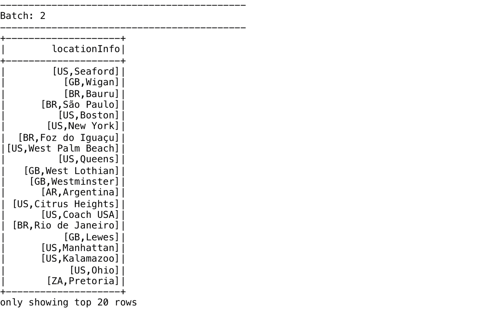

在下一个例子中，我们使用`getItem()`选择单个数组(或地图)元素。这里，我们操作模式的以下部分:


```scala
scala> val selectFields = parsedTweets.select($"entities.hashtags" as 'tags).select('tags.getItem(0) as 'x).select($"x.indices" as 'y).select($"y".getItem(0) as 'z).where($"z".isNotNull)
```


```scala
scala> val selectFields = parsedTweets.select($"entities.hashtags" as 'tags).select('tags.getItem(0) as 'x).select($"x.text" as 'y).where($"y".isNotNull)
```

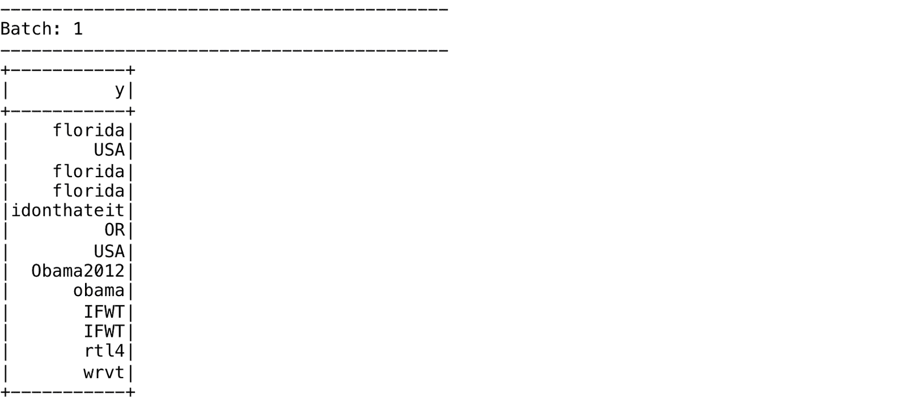

我们可以使用`explode()`函数为数组中的每个元素创建一个新行，如图所示。为了说明`explode()`的结果，我们首先显示包含数组的行，然后显示应用分解函数的结果:

```scala
scala> val selectFields = parsedTweets.select($"entities.hashtags.indices" as 'tags).select(explode('tags))
```

获得以下输出:


请注意应用分解函数后为数组元素创建的单独行:

```scala
scala> val selectFields = parsedTweets.select($"entities.hashtags.indices".getItem(0) as 'tags).select(explode('tags))
```

以下是获得的输出:

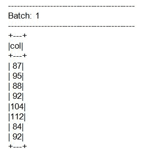

Spark SQL 还具有将`struct`转换为 JSON 字符串的`to_json()`和将 JSON 字符串转换为`struct`的`from_json()`等功能。这些功能对于阅读或书写卡夫卡主题非常有用。例如，如果“值”字段包含 JSON 字符串中的数据，那么我们可以使用`from_json()`函数提取数据，将其转换，然后将其推出到不同的卡夫卡主题，和/或将其写出到 Parquet 文件或服务数据库。

在下面的例子中，我们使用`to_json()`函数将一个结构转换为 JSON 字符串:

```scala
scala> val selectFields = parsedTweets.select(struct($"entities.media.type" as 'x, $"entities.media.url" as 'y) as 'z).where($"z.x".isNotNull).select(to_json('z) as 'c)
```

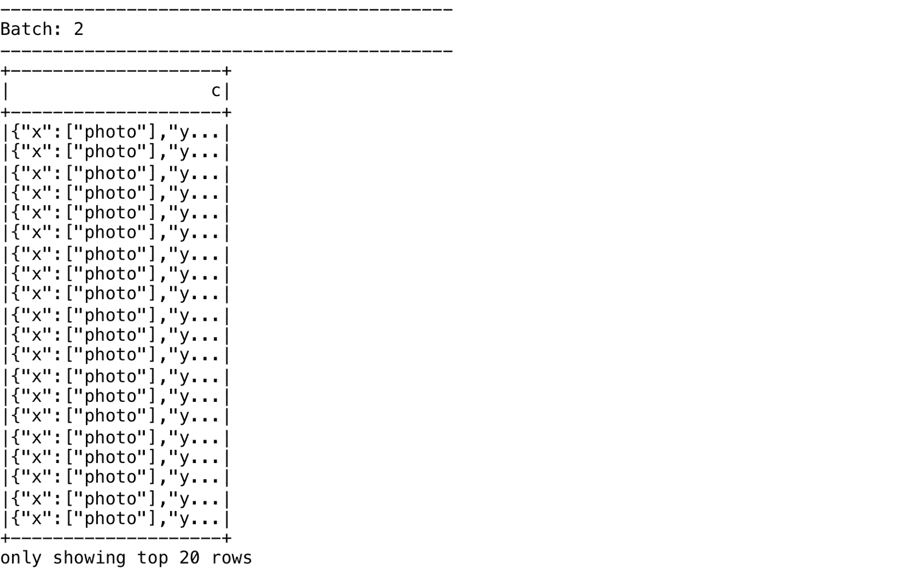

我们可以使用`from_json()`函数将包含 JSON 数据的列转换为`struct`数据类型。此外，我们可以将前面的结构展平为单独的列。我们将在后面的章节中展示一个使用这个函数的例子。

For more detailed coverage of transformation functions, refer to [https://databricks.com/blog/2017/02/23/working-complex-data-formats-structured-streaming-apache-spark-2-1.html](https://databricks.com/blog/2017/02/23/working-complex-data-formats-structured-streaming-apache-spark-2-1.html).

# 解决 ETL 管道中的错误

ETL 任务通常被认为是复杂、昂贵、缓慢和容易出错的。在这里，我们将研究 ETL 过程中的典型挑战，以及 Spark SQL 特性如何帮助解决这些挑战。

Spark 可以从 JSON 文件中自动推断模式。例如，对于下面的 JSON 数据，推断出的模式包括基于内容的所有标签和数据类型。这里，默认情况下，输入数据中所有元素的数据类型都是 longs:

**test1.json**

```scala
{"a":1, "b":2, "c":3}{"a":2, "d":5, "e":3}{"d":1, "c":4, "f":6}{"a":7, "b":8}{"c":5, "e":4, "d":3}{"f":3, "e":3, "d":4}{"a":1, "b":2, "c":3, "f":3, "e":3, "d":4}
```

您可以打印模式来验证数据类型，如图所示:

```scala
scala> spark.read.json("file:///Users/aurobindosarkar/Downloads/test1.json").printSchema()root|-- a: long (nullable = true)|-- b: long (nullable = true)|-- c: long (nullable = true)|-- d: long (nullable = true)|-- e: long (nullable = true)|-- f: long (nullable = true)
```

但是，在下面的 JSON 数据中，如果第三行的`e`的值和最后一行的`b`的值被更改为包含分数，并且倒数第二行的`f`的值被括在引号中，则推断的模式会将`b`和`e`的数据类型更改为双精度，将`f`更改为字符串类型:

```scala
{"a":1, "b":2, "c":3}{"a":2, "d":5, "e":3}{"d":1, "c":4, "f":6}{"a":7, "b":8}{"c":5, "e":4.5, "d":3}{"f":"3", "e":3, "d":4}{"a":1, "b":2.1, "c":3, "f":3, "e":3, "d":4}scala> spark.read.json("file:///Users/aurobindosarkar/Downloads/test1.json").printSchema()root|-- a: long (nullable = true)|-- b: double (nullable = true)|-- c: long (nullable = true)|-- d: long (nullable = true)|-- e: double (nullable = true)|-- f: string (nullable = true)
```

如果我们想将特定的结构或数据类型与元素相关联，我们需要使用用户指定的模式。在下一个例子中，我们使用了一个包含字段名的 CSV 文件。模式中的字段名是从头中派生出来的，用户定义的模式中指定的数据类型用于它们，如下所示:

```scala
a,b,c,d,e,f1,2,3,,,2,,,5,3,,,4,1,,,67,8,,,,f,,5,3,4.5,,,,4,3,"3"1,2.1,3,3,3,4scala> val schema = new StructType().add("a", "int").add("b", "double")scala> spark.read.option("header", true).schema(schema).csv("file:///Users/aurobindosarkar/Downloads/test1.csv").show()
```

获得以下输出:


由于文件和数据损坏，在 ETL 管道中也会出现问题。如果数据不是关键任务，损坏的文件可以安全忽略，我们可以设置`config property spark.sql.files.ignoreCorruptFiles = true`。此设置允许Spark作业继续运行，即使遇到损坏的文件。请注意，成功读取的内容将继续返回。

在下面的例子中，第`4`行`b`有不良数据。我们仍然可以使用`PERMISSIVE`模式读取数据。在这种情况下，一个名为`_corrupt_record`的新列被添加到数据框中，损坏行的内容出现在该列中，其余字段被初始化为空。我们可以通过查看本专栏中的数据来关注数据问题，并启动适当的操作来解决它们。通过设置`spark.sql.columnNameOfCorruptRecord`属性，我们可以配置损坏内容列的默认名称:

```scala
{"a":1, "b":2, "c":3}{"a":2, "d":5, "e":3}{"d":1, "c":4, "f":6}{"a":7, "b":{}{"c":5, "e":4.5, "d":3}{"f":"3", "e":3, "d":4}{"a":1, "b":2.1, "c":3, "f":3, "e":3, "d":4}scala> spark.read.option("mode", "PERMISSIVE").option("columnNameOfCorruptRecord", "_corrupt_record").json("file:///Users/aurobindosarkar/Downloads/test1.json").show()
```


现在，我们使用`DROPMALFORMED`选项删除所有格式错误的记录。这里，第四行由于`b`的错误值而被删除:

```scala
scala> spark.read.option("mode", "DROPMALFORMED").json("file:///Users/aurobindosarkar/Downloads/test1.json").show()
```


对于关键数据，我们可以使用`FAILFAST`选项在遇到不良记录时立即失败。例如，在以下示例中，由于第四行中`b`的值，操作抛出异常并立即退出:

```scala
{"a":1, "b":2, "c":3}{"a":2, "d":5, "e":3}{"d":1, "c":4, "f":6}{"a":7, "b":$}{"c":5, "e":4.5, "d":3}{"f":"3", "e":3, "d":4}{"a":1, "b":2.1, "c":3, "f":3, "e":3, "d":4}scala> spark.read.option("mode", "FAILFAST").json("file:///Users/aurobindosarkar/Downloads/test1.json").show()
```

在下面的例子中，我们有一个跨越两行的记录；我们可以通过将`wholeFile`选项设置为真来读取该记录:

```scala
{"a":{"a1":2, "a2":8},"b":5, "c":3}scala> spark.read.option("wholeFile",true).option("mode", "PERMISSIVE").option("columnNameOfCorruptRecord", "_corrupt_record").json("file:///Users/aurobindosarkar/Downloads/testMultiLine.json").show()+-----+---+---+|    a|  b|  c|+-----+---+---+|[2,8]|  5|  3|+-----+---+---+
```

For more details on Spark SQL-based ETL pipelines and roadmaps, visit [https://spark-summit.org/2017/events/building-robust-etl-pipelines-with-apache-spark/](https://spark-summit.org/2017/events/building-robust-etl-pipelines-with-apache-spark/).

前面的参考资料介绍了几个更高阶的 SQL 转换函数、DataframeWriter API 的新格式，以及 Spark 2.2 和 2.3-Snapshot 中的统一`Create Table`(作为`Select`)构造。

Spark SQL 解决的其他需求包括可伸缩性和使用结构化流的连续 ETL。我们可以使用结构化流，使原始数据能够尽快作为结构化数据用于分析、报告和决策，而不是导致通常与运行定期批处理作业相关的数小时延迟。这种类型的处理在诸如异常检测、欺诈检测等应用中尤其重要，在这些应用中，时间至关重要。

在下一节中，我们将把重点转移到使用 Spark SQL 构建可扩展的监控解决方案上。

# 实施可扩展的监控解决方案

为大规模部署构建可扩展的监控功能可能具有挑战性，因为每天可能会捕获数十亿个数据点。此外，如果没有一个支持流和可视化的合适的大数据平台，日志量和指标数量可能很难管理。

处理从应用程序、服务器、网络设备等收集的大量日志，以提供实时监控，帮助检测错误、警告、故障和其他问题。通常，使用各种守护程序、服务和工具来收集/发送日志记录到监控系统。例如，JSON 格式的日志条目可以发送到卡夫卡队列或亚马逊驱动程序。然后，这些 JSON 记录可以作为文件存储在 S3 和/或流式传输，以便实时分析(在 Lambda 架构实现中)。通常，运行一个 ETL 管道来清理日志数据，将其转换为更结构化的形式，然后将其加载到文件中，如 Parquet 文件或数据库，用于查询、警报和报告目的。

下图说明了一个使用**Spark流作业**、一个**可扩展时间序列数据库**如 OpenTSDB 或石墨、**可视化工具**如 Grafana 的平台:


For more details on this solution, refer to [https://spark-summit.org/2017/events/scalable-monitoring-using-apache-spark-and-friends/](https://spark-summit.org/2017/events/scalable-monitoring-using-apache-spark-and-friends/).

在大型分布式环境中，监控和故障排除问题是一项具有挑战性的任务，该环境由多个 Spark 集群组成，这些集群具有不同的配置和版本，运行不同类型的工作负载。在这些环境中，可能会收到数十万个指标。此外，每秒钟生成数百兆字节的日志。需要跟踪这些指标，并分析日志中的异常、故障、bug、环境问题等，以支持警报和故障排除功能。

下图展示了一个基于 AWS 的数据管道，它将所有的指标和日志(结构化的和非结构化的)推送到 Kinesis。结构化流作业可以从驱动程序中读取原始日志，并将数据保存为 S3 的拼花文件。

如果观察到新的错误类型，结构化流查询可以去除已知的错误模式并发出适当的警报。其他 Spark 批处理和流应用程序可以使用这些拼花文件来执行额外的处理，并将其结果作为新的拼花文件输出到 S3:


在此体系结构中，可能需要从非结构化日志中发现问题，以确定其范围、持续时间和影响。**原始日志**通常包含许多近乎重复的错误消息。为了高效处理这些日志，我们需要对已知的错误情况进行规范化、重复数据消除和过滤，以发现和揭示新的错误情况。

For details on a pipeline to process raw logs, refer to [https://spark-summit.org/2017/events/lessons-learned-from-managing-thousands-of-production-apache-spark-clusters-daily/](https://spark-summit.org/2017/events/lessons-learned-from-managing-thousands-of-production-apache-spark-clusters-daily/).

在本节中，我们将探索 Spark SQL 和结构化流提供的一些功能，以创建可扩展的监控解决方案。

首先，用卡夫卡包启动Spark外壳:

```scala
Aurobindos-MacBook-Pro-2:spark-2.2.0-bin-hadoop2.7 aurobindosarkar$ ./bin/spark-shell --packages org.apache.spark:spark-streaming-kafka-0-10_2.11:2.1.1,org.apache.spark:spark-sql-kafka-0-10_2.11:2.1.1 --driver-memory 12g
```

下载 1995 年 7 月的轨迹，包含从[http://ita.ee.lbl.gov/html/contrib/NASA-HTTP.html](http://ita.ee.lbl.gov/html/contrib/NASA-HTTP.html)到佛罗里达州 NASA 肯尼迪航天中心 WWW 服务器的 HTTP 请求。

为本章的实践练习导入以下软件包:

```scala
scala> import org.apache.spark.sql.types._scala> import org.apache.spark.sql.functions._scala> import spark.implicits._scala> import org.apache.spark.sql.streaming._
```

接下来，为文件中的记录定义模式:

```scala
scala> val schema = new StructType().add("clientIpAddress", "string").add("rfc1413ClientIdentity", "string").add("remoteUser", "string").add("dateTime", "string").add("zone", "string").add("request","string").add("httpStatusCode", "string").add("bytesSent", "string").add("referer", "string").add("userAgent", "string")
```

为简单起见，我们将输入文件读取为带有空格分隔符的 CSV 文件，如下所示:

```scala
scala> val rawRecords = spark.readStream.option("header", false).schema(schema).option("sep", " ").format("csv").load("file:///Users/aurobindosarkar/Downloads/NASA")scala> val ts = unix_timestamp(concat($"dateTime", lit(" "), $"zone"), "[dd/MMM/yyyy:HH:mm:ss Z]").cast("timestamp")
```

接下来，我们创建一个包含日志事件的数据帧。由于上一步中时间戳更改为本地时区(默认情况下)，我们还在`original_dateTime`列中保留了带有时区信息的原始时间戳，如图所示:

```scala
scala> val logEvents = rawRecords.withColumn("ts", ts).withColumn("date", ts.cast(DateType)).select($"ts", $"date", $"clientIpAddress", concat($"dateTime", lit(" "), $"zone").as("original_dateTime"), $"request", $"httpStatusCode", $"bytesSent")
```

我们可以检查流式读取的结果，如图所示:

```scala
scala> val query = logEvents.writeStream.outputMode("append").format("console").start()
```

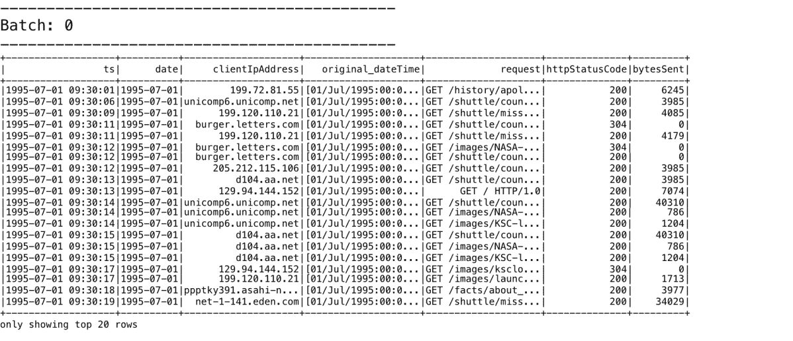

我们可以将流输入保存到按日期分区的 Parquet 文件中，以更有效地支持查询，如下所示:

```scala
scala> val streamingETLQuery = logEvents.writeStream.trigger(Trigger.ProcessingTime("2 minutes")).format("parquet").partitionBy("date").option("path", "file:///Users/aurobindosarkar/Downloads/NASALogs").option("checkpointLocation", "file:///Users/aurobindosarkar/Downloads/NASALogs/checkpoint/").start()
```

我们可以通过指定`latestFirst`选项读取输入，以便最新的记录首先可用:

```scala
val rawCSV = spark.readStream.schema(schema).option("latestFirst", "true").option("maxFilesPerTrigger", "5").option("header", false).option("sep", " ").format("csv").load("file:///Users/aurobindosarkar/Downloads/NASA")
```

我们还可以用 JSON 格式轻松地写出按日期划分的输出，如下所示:

```scala
val streamingETLQuery = logEvents.writeStream.trigger(Trigger.ProcessingTime("2 minutes")).format("json").partitionBy("date").option("path", "file:///Users/aurobindosarkar/Downloads/NASALogs").option("checkpointLocation", "file:///Users/aurobindosarkar/Downloads/NASALogs/checkpoint/").start()
```

现在，我们展示了在流 Spark 应用程序中使用卡夫卡进行输入和输出。这里我们要指定格式参数为`kafka`，以及卡夫卡经纪人和话题:

```scala
scala> val kafkaQuery = logEvents.selectExpr("CAST(ts AS STRING) AS key", "to_json(struct(*)) AS value").writeStream.format("kafka").option("kafka.bootstrap.servers", "localhost:9092").option("topic", "topica").option("checkpointLocation", "file:///Users/aurobindosarkar/Downloads/NASALogs/kafkacheckpoint/").start()
```

现在，我们正在阅读来自卡夫卡的 JSON 数据流。起始偏移量被设置为最早，以指定查询的起始点。这仅适用于启动新的流查询时:

```scala
scala> val kafkaDF = spark.readStream.format("kafka").option("kafka.bootstrap.servers", "localhost:9092").option("subscribe", "topica").option("startingOffsets", "earliest").load()
```

我们可以打印出从卡夫卡那里读取的记录的模式，如下所示:

```scala
scala> kafkaDF.printSchema()root|-- key: binary (nullable = true)|-- value: binary (nullable = true)|-- topic: string (nullable = true)|-- partition: integer (nullable = true)|-- offset: long (nullable = true)|-- timestamp: timestamp (nullable = true)|-- timestampType: integer (nullable = true)
```

接下来，我们定义输入记录的模式，如图所示:

```scala
scala> val kafkaSchema = new StructType().add("ts", "timestamp").add("date", "string").add("clientIpAddress", "string").add("rfc1413ClientIdentity", "string").add("remoteUser", "string").add("original_dateTime", "string").add("request", "string").add("httpStatusCode", "string").add("bytesSent", "string")
```

接下来，我们可以指定模式，如图所示。星号`*`操作符用于选择一个`struct`中的所有`subfields`:

```scala
scala> val kafkaDF1 = kafkaDF.select(col("key").cast("string"), from_json(col("value").cast("string"), kafkaSchema).as("data")).select("data.*")
```

接下来，我们展示一个选择特定字段的示例。这里，我们将`outputMode`设置为追加，以便只有追加到结果表的新行被写入外部存储器。这仅适用于结果表中现有行预计不会更改的查询:

```scala
scala> val kafkaQuery1 = kafkaDF1.select($"ts", $"date", $"clientIpAddress", $"original_dateTime", $"request", $"httpStatusCode", $"bytesSent").writeStream.outputMode("append").format("console").start()
```

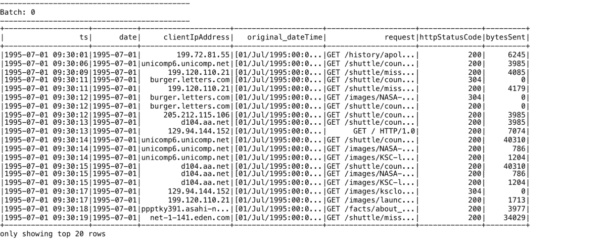

我们也可以指定`read`(不是`readStream`)将记录读入一个常规的数据帧:

```scala
scala> val kafkaDF2 = spark.read.format("kafka").option("kafka.bootstrap.servers","localhost:9092").option("subscribe", "topica").load().selectExpr("CAST(value AS STRING) as myvalue")
```

我们现在可以对这个数据帧执行所有标准的数据帧操作；例如，我们创建一个表并查询它，如图所示:

```scala
scala> kafkaDF2.registerTempTable("topicData3")scala> spark.sql("select myvalue from topicData3").take(3).foreach(println)
```


然后，我们阅读卡夫卡的记录并应用这个模式:

```scala
scala> val parsed = spark.readStream.format("kafka").option("kafka.bootstrap.servers", "localhost:9092").option("subscribe", "topica").option("startingOffsets", "earliest").load().select(from_json(col("value").cast("string"), kafkaSchema).alias("parsed_value"))
```

我们可以执行以下查询来检查记录的内容:

```scala
scala> val query = parsed.writeStream.outputMode("append").format("console").start()
```


我们可以从记录中选择所有字段，如下所示:

```scala
scala> val selectAllParsed = parsed.select("parsed_value.*")
```

我们还可以从数据框中选择感兴趣的特定字段:

```scala
scala> val selectFieldsParsed = selectAllParsed.select("ts", "clientIpAddress", "request", "httpStatusCode")
```

接下来，我们可以使用窗口操作，如所示，并维护各种 HTTP 代码的计数。这里，我们使用`outputMode`设置为`complete`，因为我们希望将整个更新的结果表写入外部存储器:

```scala
scala> val s1 = selectFieldsParsed.groupBy(window($"ts", "10 minutes", "5 minutes"), $"httpStatusCode").count().writeStream.outputMode("complete").format("console").start()
```


接下来，我们展示另一个使用`groupBy`的例子，并计算这些窗口中各种页面请求的计数。这可用于计算和报告顶级页面访问类型指标:

```scala
scala> val s2 = selectFieldsParsed.groupBy(window($"ts", "10 minutes", "5 minutes"), $"request").count().writeStream.outputMode("complete").format("console").start()
```


请注意，前面给出的示例是有状态处理的实例。计数必须保存为触发器之间的分布式状态。每个触发器读取先前的状态并写入更新的状态。这种状态存储在内存中，并由持久的 WAL 支持，通常位于 HDFS 或 S3 存储上。这允许流应用程序自动处理迟到的数据。保持这种状态允许后期数据更新旧窗口的计数。

但是，如果旧窗口没有被删除，状态的大小可以无限增加。水印方法被用来解决这个问题。水印是一个移动的阈值，表示数据预计有多晚，以及何时放弃旧状态。它落后于最大可见事件时间。比水印新的数据可能会延迟，但允许进入聚合，而比水印旧的数据被认为“太晚”并被丢弃。此外，会自动删除早于水印的窗口，以限制系统需要维护的中间状态的数量。

这里给出了为前一个查询指定的水印:

```scala
scala> val s4 = selectFieldsParsed.withWatermark("ts", "10 minutes").groupBy(window($"ts", "10 minutes", "5 minutes"), $"request").count().writeStream.outputMode("complete").format("console").start()
```

For more details on watermarking, refer to [https://databricks.com/blog/2017/05/08/event-time-aggregation-watermarking-apache-sparks-structured-streaming.html](https://databricks.com/blog/2017/05/08/event-time-aggregation-watermarking-apache-sparks-structured-streaming.html).

在下一节中，我们将把重点转移到在生产中部署基于 Spark 的机器学习管道。

# 部署 Spark 机器学习管道

下图从概念层面说明了机器学习管道。然而，现实生活中的 ML 管道要复杂得多，需要对几个模型进行训练、调整、组合等等:


下图显示了分为两部分的典型机器学习应用程序的核心元素:建模(包括模型训练)和部署的模型(用于流数据以输出结果):

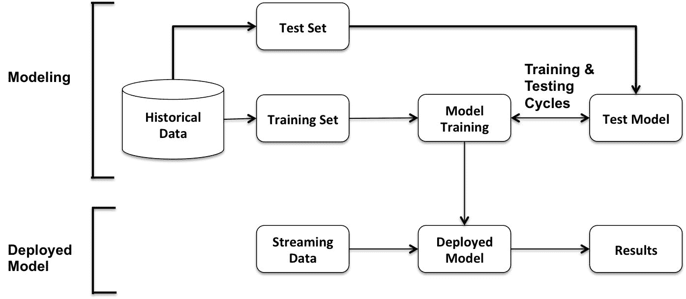

通常，数据科学家用 Python 和/或 r 进行实验或建模工作。然后，在生产环境中部署之前，他们的工作在 Java/Scala 中重新实现。企业生产环境通常由 web 服务器、应用服务器、数据库、中间件等组成。原型模型到生产就绪模型的转换会导致额外的设计和开发工作，从而导致更新模型的推出延迟。

我们可以使用 Spark MLlib 2.x 模型序列化直接使用数据科学家在生产环境中保存的模型和管道(到磁盘)，方法是从持久化模型文件中加载它们。

在下面的例子中(来源:[https://spark.apache.org/docs/latest/ml-pipeline.html](https://spark.apache.org/docs/latest/ml-pipeline.html)，我们将说明在 Python 中创建和保存一个 ML 管道(使用`pyspark` shell)，然后在 Scala 环境中检索它(使用 Spark shell)。

启动`pyspark` shell，执行以下 Python 语句序列:

```scala
>>> from pyspark.ml import Pipeline>>> from pyspark.ml.classification import LogisticRegression>>> from pyspark.ml.feature import HashingTF, Tokenizer>>> training = spark.createDataFrame([... (0, "a b c d e spark", 1.0),... (1, "b d", 0.0),... (2, "spark f g h", 1.0),... (3, "hadoop mapreduce", 0.0)... ], ["id", "text", "label"])>>> tokenizer = Tokenizer(inputCol="text", outputCol="words")>>> hashingTF = HashingTF(inputCol=tokenizer.getOutputCol(), outputCol="features")>>> lr = LogisticRegression(maxIter=10, regParam=0.001)>>> pipeline = Pipeline(stages=[tokenizer, hashingTF, lr])>>> model = pipeline.fit(training)>>> model.save("file:///Users/aurobindosarkar/Downloads/spark-logistic-regression-model")>>> quit()
```

启动 Spark shell 并执行以下 Scala 语句序列:

```scala
scala> import org.apache.spark.ml.{Pipeline, PipelineModel}scala> import org.apache.spark.ml.classification.LogisticRegressionscala> import org.apache.spark.ml.feature.{HashingTF, Tokenizer}scala> import org.apache.spark.ml.linalg.Vectorscala> import org.apache.spark.sql.Rowscala> val sameModel = PipelineModel.load("file:///Users/aurobindosarkar/Downloads/spark-logistic-regression-model")
```

接下来，我们创建一个`test`数据集，并通过 ML 管道运行它:

```scala
scala> val test = spark.createDataFrame(Seq(| (4L, "spark i j k"),| (5L, "l m n"),| (6L, "spark hadoop spark"),| (7L, "apache hadoop")| )).toDF("id", "text")
```

在`test`数据集上运行模型的结果如下所示:

```scala
scala> sameModel.transform(test).select("id", "text", "probability", "prediction").collect().foreach { case Row(id: Long, text: String, prob: Vector, prediction: Double) => println(s"($id, $text) --> prob=$prob, prediction=$prediction")}(4, spark i j k) --> prob=[0.15554371384424398,0.844456286155756], prediction=1.0(5, l m n) --> prob=[0.8307077352111738,0.16929226478882617], prediction=0.0(6, spark hadoop spark) --> prob=[0.06962184061952888,0.9303781593804711], prediction=1.0(7, apache hadoop) --> prob=[0.9815183503510166,0.018481649648983405], prediction=0.0
```

保存的逻辑回归模型的关键参数被读入数据框，如下面的代码块所示。之前，当模型保存在`pyspark` shell 中时，这些参数被保存到一个 Parquet 文件中，该文件位于与我们管道的最后阶段相关联的子目录中:

```scala
scala> val df = spark.read.parquet("file:///Users/aurobindosarkar/Downloads/spark-logistic-regression-model/stages/2_LogisticRegression_4abda37bdde1ddf65ea0/data/part-00000-415bf215-207a-4a49-985e-190eaf7253a7-c000.snappy.parquet")scala> df.show()
```

获得以下输出:


```scala
scala> df.collect.foreach(println)
```

输出如下所示:


For more details on how to productionize ML models, refer to [https://spark-summit.org/2017/events/how-to-productionize-your-machine-learning-models-using-apache-spark-mllib-2x/](https://spark-summit.org/2017/events/how-to-productionize-your-machine-learning-models-using-apache-spark-mllib-2x/).

# 了解典型 ML 部署环境中的挑战

ML 模型的生产部署环境可能非常多样和复杂。例如，模型可能需要部署在网络应用程序、门户、实时和批处理系统中，并作为应用编程接口或 REST 服务，嵌入设备或大型遗留环境中。

此外，企业技术堆栈可以由 Java 企业、C/C++、传统大型机环境、关系数据库等组成。与响应时间、吞吐量、可用性和正常运行时间相关的非功能性需求和客户服务级别协议也可能有很大差异。然而，在几乎所有的情况下，我们的部署过程都需要支持 A/B 测试、实验、模型性能评估，并且要敏捷和响应业务需求。

通常，从业者使用各种方法来基准化和逐步引入新的或更新的模型，以避免高风险、大爆炸的生产部署。

在下一节中，我们将探讨一些模型部署架构。

# 了解模型评分架构的类型

最简单的模型是使用 Spark(批处理)预先计算模型结果，将结果保存到数据库，然后将结果从数据库提供给 web 和移动应用程序。许多大规模推荐引擎和搜索引擎都使用这种架构:

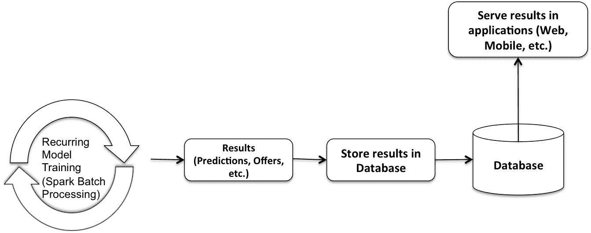

第二个模型评分架构使用 Spark Streaming 计算特征并运行预测算法。预测结果可以使用缓存解决方案(如 Redis)进行缓存，并且可以通过应用编程接口获得。然后，其他应用程序可以使用这些 API 从部署的模型中获得预测结果。该选项如图所示:


在第三个架构模型中，我们可以将 Spark 仅用于模型训练目的。然后将模型复制到生产环境中。例如，我们可以从 JSON 文件中加载逻辑回归模型的系数和截距。这种方法节约资源，并产生高性能的系统。在现有或复杂的环境中部署也容易得多。

这里举例说明:


继续前面的例子，我们可以从拼花文件中读入保存的模型参数，并将其转换为 JSON 格式，然后可以方便地导入到任何应用程序中(在 Spark 环境内部或外部)，并应用于新数据:

```scala
scala> spark.read.parquet("file:///Users/aurobindosarkar/Downloads/spark-logistic-regression-model/stages/2_LogisticRegression_4abda37bdde1ddf65ea0/data/part-00000-415bf215-207a-4a49-985e-190eaf7253a7-c000.snappy.parquet").write.mode("overwrite").json("file:///Users/aurobindosarkar/Downloads/lr-model-json")
```

我们可以使用标准操作系统命令显示截距、系数和其他关键参数，如下所示:

```scala
Aurobindos-MacBook-Pro-2:lr-model-json aurobindosarkar$ more part-00000-e2b14eb8-724d-4262-8ea5-7c23f846fed0-c000.json
```


随着模型变得越来越大和越来越复杂，部署和服务它们可能会很有挑战性。模型可能无法很好地扩展，并且它们的资源需求可能会变得非常昂贵。Databricks 和 Redis-ML 提供了部署训练好的模型的解决方案。

在 Redis-ML 解决方案中，该模型直接应用于 Redis 环境中的新数据。

这可以以比在 Spark 环境中运行模型低得多的价格提供所需的整体性能、可扩展性和可用性。

下图显示了 Redis-ML 被用作服务引擎(实现第三个模型评分架构模式，如前所述):


在下一节中，我们将简要讨论在生产环境中使用 Mesos 和 Kubernetes 作为集群管理器。

# 使用集群管理器

在本节中，我们将在概念层面上简要讨论介子和库本内特。Spark 框架可以通过 Apache **Mesos** 、**纱**、Spark Standalone 或 **Kubernetes** 集群管理器进行部署，如图所示:

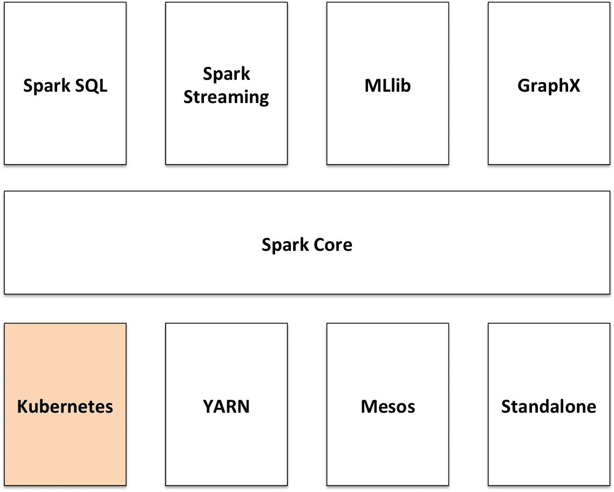

Mesos 可以轻松实现数据的可扩展性和复制性，是一个很好的异构工作负载统一集群管理解决方案。

要使用来自Spark的介子，Spark二进制文件应该可以被介子访问，并且Spark驱动程序被配置为连接到介子。或者，您也可以在所有的 Mesos 从机上安装 Spark 二进制文件。驱动程序创建一个作业，然后发布任务进行调度，而 Mesos 确定处理这些任务的机器。

Spark 可以以两种模式在 Mesos 上运行:粗粒度(默认)和细粒度(在 Spark 2.0.0 中不推荐使用)。在粗粒度模式下，每个 Spark 执行器作为单个 Mesos 任务运行。这种模式的启动开销明显较低，但会在应用程序运行期间保留 Mesos 资源。Mesos 还支持动态分配，即根据应用程序的统计数据调整执行器的数量。

下图展示了一个配置 **Mesos Master** 和 **Zookeeper** 节点的部署。 **Mesos 从节点**和 **Cassandra 节点**也是为了更好的数据局部性而配置的。此外，Spark 二进制文件部署在所有工作节点上:

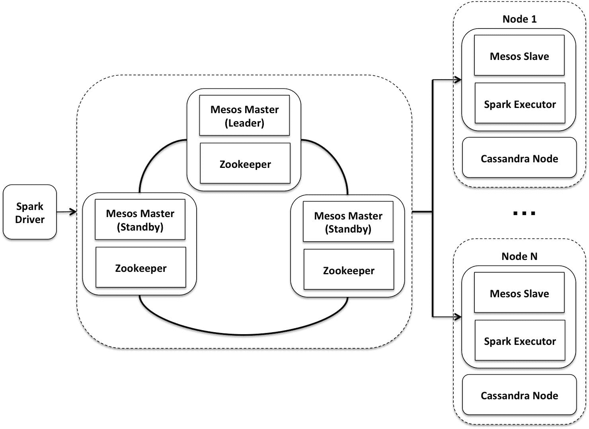

另一个新兴的 Spark 集群管理解决方案是 Kubernetes，它是作为 Spark 的本地集群管理器开发的。这是一个开源系统，可用于自动化容器化 Spark 应用程序的部署、扩展和管理。

下图描绘了 Kubernetes 的高级视图。每个节点都包含一个名为**库布里特**的守护进程，它与**主**节点进行对话。用户还与主服务器对话，以声明方式指定他们想要运行的内容。例如，用户可以请求运行特定数量的 web 服务器实例。主节点将接受用户的请求，并在节点上安排工作负载:

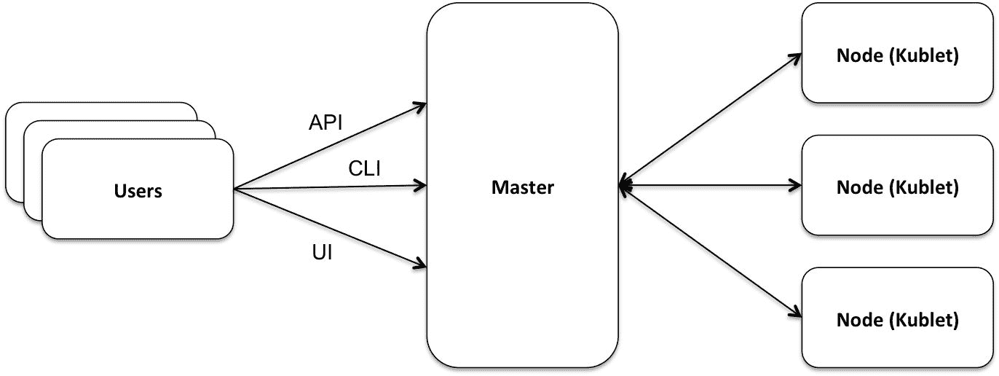

节点运行一个或多个吊舱。一个容器是容器的更高级抽象，每个容器可以包含一组协同定位的容器。每个 pod 都有自己的 IP 地址，可以与其他节点中的 pod 进行通信。存储卷可以是本地的，也可以是网络连接的。这可以从下图中看出:

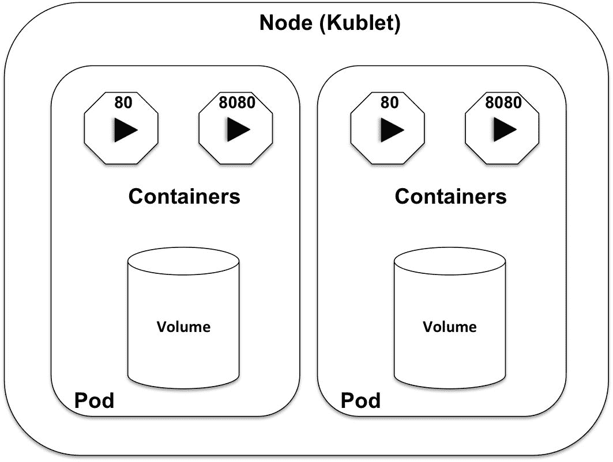

Kubernetes 促进不同类型的 Spark 工作负载之间的资源共享，以降低运营成本并提高基础架构利用率。此外，一些附加服务可以与 Spark 应用程序一起使用，包括日志记录、监控、安全、容器到容器的通信等。

For more details on Spark on Kubernetes, visit [https://github.com/apache-spark-on-k8s/spark](https://github.com/apache-spark-on-k8s/spark).

在下图中，虚线将 Kubernetes 与 Spark 分开。Spark Core 负责获取新的执行器、推送新的配置、移除执行器等等。 **Kubernetes 调度器后端**接收 Spark Core 请求，并将其转换为 Kubernetes 能够理解的原语。此外，它还处理所有资源请求以及与 Kubernetes 的所有通信。

其他服务，如文件暂存服务器，可以使您的本地文件和 jar 对 Spark 集群可用，Spark shuffle 服务可以存储用于资源动态分配的 shuffle 数据；例如，它能够在特定阶段弹性地改变执行者的数量。您还可以扩展 Kubernetes API，以包括自定义或特定于应用程序的资源；例如，您可以创建仪表板来显示作业进度:


Kubernetes 还提供了有用的管理功能来帮助管理集群，例如，RBAC 和命名空间级别的资源配额、审核日志记录、监控节点、pod、集群级别的指标等。

# 摘要

在本章中，我们介绍了几种基于 Spark SQL 的应用程序体系结构，用于构建高度可扩展的应用程序。我们探讨了批处理和流处理中的主要概念和挑战。我们讨论了 Spark SQL 的特性，这些特性有助于构建健壮的 ETL 管道。我们还展示了一些构建可伸缩监控应用程序的代码。此外，我们探索了机器学习管道的有效部署技术，以及使用集群管理器(如 Mesos 和 Kubernetes)所涉及的一些基本概念。

总之，这本书试图帮助您在 Spark SQL 和 Scala 中建立一个强大的基础。然而，仍有许多领域可以更深入地探索，以建立更深入的专业知识。根据您的特定领域，数据和问题的性质可能会有很大的不同，您解决它们的方法通常包括本书中描述的一个或多个领域。然而，在所有情况下，电子设计自动化和数据管理技能都是必需的，你练习得越多，你就会越熟练。尝试下载和处理不同类型的数据，包括结构化、半结构化和非结构化数据。此外，阅读所有章节中提到的参考资料，深入了解其他数据科学从业者如何处理问题。参考 Apache Spark 网站了解该软件的最新版本，并探索您可以在您的 ML 管道中使用的其他机器学习算法。最后，诸如深度学习和基于成本的优化等主题仍在 Spark 中不断发展，请尝试跟上这些领域的发展，因为它们将是在不久的将来解决许多有趣问题的关键。