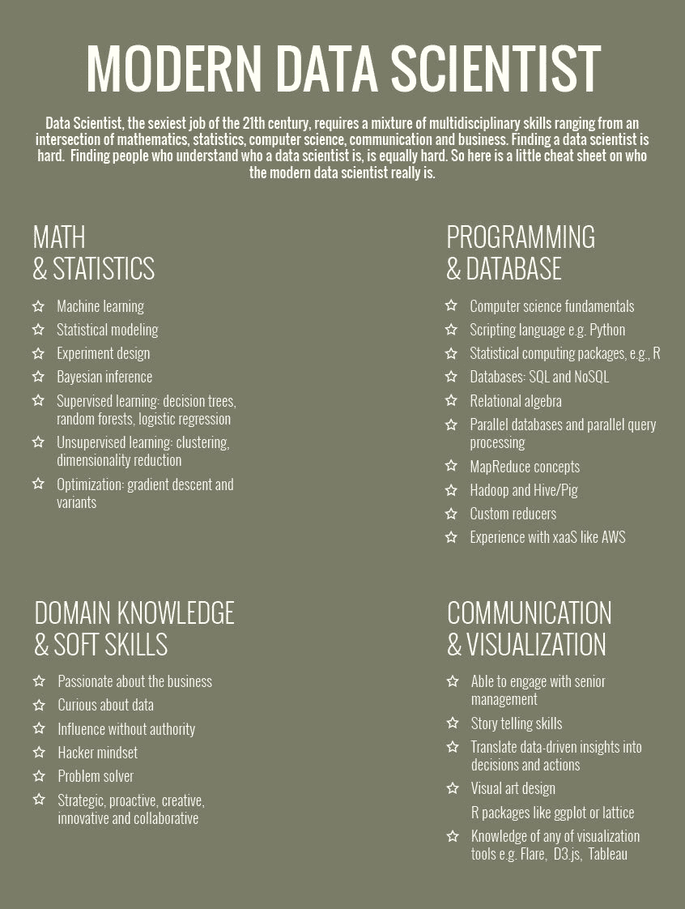
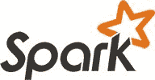
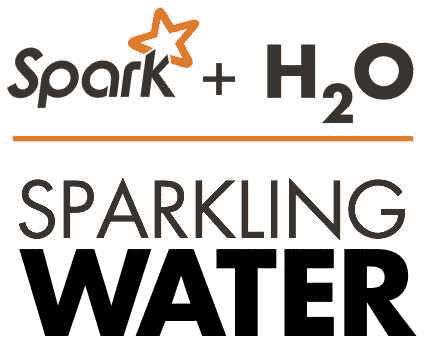
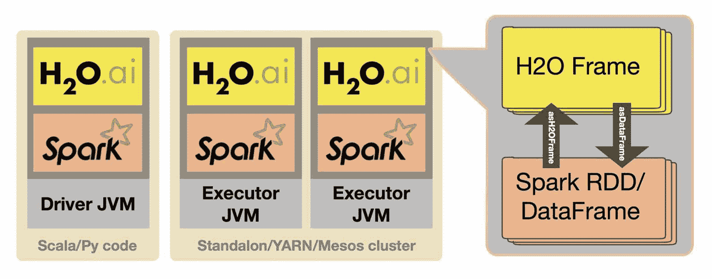
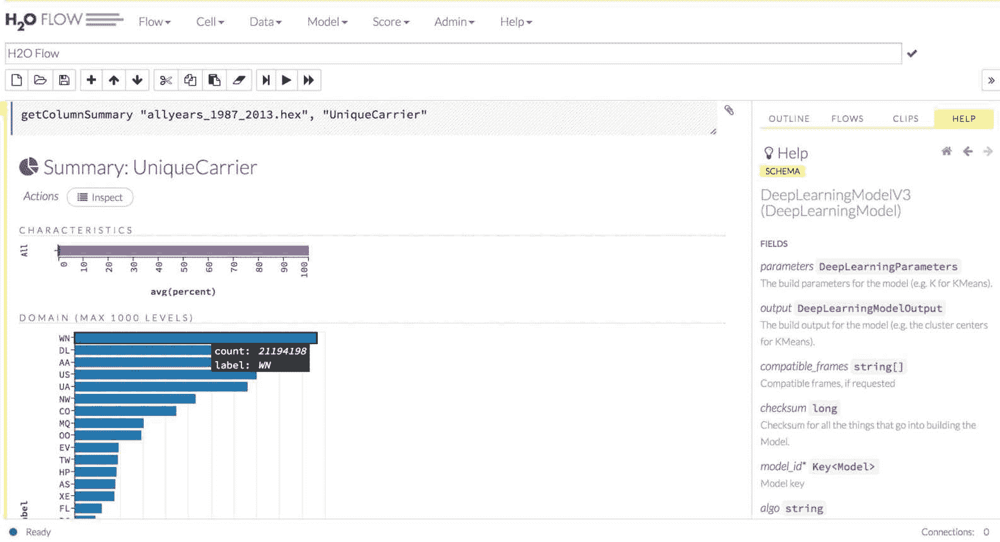

# 大规模机器学习和 Spark 导论

"Information is the oil of the 21<sup class="calibre21">st</sup> century, and analytics is the combustion engine." 

-高德纳研究公司的彼得·桑德加德

预计到 2018 年，公司在大数据相关项目上的支出将达到 1140 亿美元，与 2013 年相比增长约 300%([https://www . capgemini-consulting . com/resource-file-access/resource/pdf/big _ data _ POV _ 03-02-15 . pdf](https://www.capgemini-consulting.com/resource-file-access/resource/pdf/big_data_pov_03-02-15.pdf))。支出的增加很大程度上是由于创建了多少数据，以及我们如何通过利用分布式文件系统(如 Hadoop)来更好地存储这些数据。

然而，收集数据只是成功的一半；另一半涉及数据提取、转换和加载到计算系统中，该系统利用现代计算机的能力来应用各种数学方法，以便更多地了解数据和模式，并提取有用的信息来做出相关决策。在过去的几年里，整个数据工作流不仅通过提高计算能力和提供易于访问和扩展的云服务(例如，亚马逊 AWS、微软 Azure 和 Heroku)得到了推动，而且还通过许多工具和库来帮助轻松管理、控制和扩展基础架构和构建应用程序。计算能力的这种增长也有助于处理更大数量的数据，并应用以前无法应用的算法。最后，各种计算昂贵的统计或机器学习算法已经开始帮助从数据中提取信息块。

最早被广泛采用的大数据技术之一是 Hadoop，它允许通过将中间结果保存在磁盘上来进行 MapReduce 计算。然而，它仍然缺乏合适的大数据工具来提取信息。然而，Hadoop 只是一个开始。随着机器内存的不断增长，新的内存计算框架出现了，它们也开始为进行数据分析和建模提供基本支持——例如，用于 Spark 的 SystemML 或 Spark ML 和用于 Flink 的 FlinkML。这些框架仅代表了冰山一角——大数据生态系统中还有很多，而且它在不断发展，因为数据量在不断增长，需要新的大数据算法和处理方法。例如，**物联网** ( **物联网**)代表了一个新的领域，它从各种来源(例如，家庭安全系统、Alexa Echo 或重要传感器)产生大量的流数据，不仅从数据中带来无限的潜在有用信息，而且要求新的数据处理和建模方法。

尽管如此，在本章中，我们将从头开始并解释以下主题:

*   数据科学家的基本工作任务
*   分布式环境中的大数据计算
*   大数据生态系统
*   Spark 及其机器学习支持

# 数据科学

然而，找到数据科学的统一定义类似于品尝葡萄酒和在朋友之间比较风味特征——每个人都有自己的定义，没有一个描述比另一个描述更准确。然而，数据科学的核心是提出关于数据的智能问题，并接收对关键利益相关者至关重要的智能答案的艺术。不幸的是，相反的情况也成立——问糟糕的数据问题，得到糟糕的答案！因此，仔细制定问题是从您的数据中提取有价值见解的关键。出于这个原因，公司现在正在雇佣*数据科学家*来帮助制定和提出这些问题。


Figure 1 - Growing Google Trend of big data and data science

# 21 世纪最性感的角色——数据科学家？

首先，很容易描绘出典型数据科学家的刻板形象:t 恤、运动裤、厚框眼镜，以及在 IntelliJ 中调试大量代码...你明白了。抛开美学不谈，数据科学家有哪些特质？下图显示了我们最喜欢的描述该角色的海报之一:



Figure 2 - What is a data scientist?

给出了数学、统计和计算机科学的一般知识，但我们在从业者中看到的一个陷阱与理解商业问题有关，这可以追溯到对数据提出智能问题。再怎么强调也不为过:对数据提出更智能的问题是数据科学家对业务问题和数据局限性理解的函数；没有这种基本的理解，即使是最智能的算法也无法基于不稳定的基础得出可靠的结论。

# 数据科学家生命中的一天

这可能会让你们中的一些人感到震惊——成为一名数据科学家不仅仅是阅读学术论文、研究新工具和建立模型，直到凌晨，喝着浓咖啡；事实上，这只是数据科学家真正玩*的一小部分时间(然而浓缩咖啡的部分对每个人来说都是 100%真实的)！然而，一天的大部分时间都花在会议上，更好地理解业务问题，处理数据以了解其局限性(鼓起勇气，这本书将让你接触大量不同的特征工程或特征提取任务)，以及如何最好地向非数据科学人员展示这些发现。这就是真正的*香肠制作*过程发生的地方，最好的数据科学家是那些喜欢这个过程的人，因为他们对成功的要求和基准有了更多的了解。事实上，我们完全可以写一本全新的书，从头到尾描述这个过程！*

 *那么，问数据问题涉及到什么(和谁)？有时，它是将数据保存到关系数据库中并运行 SQL 查询来发现对数据的见解的过程:“对于购买了这种特定产品的数百万用户来说，还购买了前 3 名的其他产品是什么？”其他时候，问题就比较复杂了，比如“给定一部电影的评价，这是正面评价还是负面评价？”这本书主要关注复杂的问题，就像后者一样。回答这些类型的问题是企业真正从其大数据项目中获得最大影响的地方，也是我们看到新兴技术激增的地方，这些技术旨在使问答系统变得更容易，具有更多功能。

一些看起来有助于回答数据问题的最受欢迎的开源框架包括 R、Python、Julia 和 Octave，所有这些框架在小型(X < 100 GB)数据集上的表现都相当不错。此时，值得停下来指出大数据和小数据之间的明显区别。我们在办公室的一般经验法则如下:

*如果可以使用 Excel 打开数据集，则是在处理小数据。*

# 使用大数据

当所讨论的数据集如此庞大，以至于无法容纳在单台计算机的内存中，并且必须分布在大型计算集群中的多个节点上时，会发生什么情况？比如，我们就不能重写一些 R 代码，并扩展它以考虑到不止一个单节点计算吗？要是事情这么简单就好了！将算法扩展到更多机器有很多困难的原因。想象一个包含名称列表的文件的简单示例:

```scala
BDXADA
```

我们想计算文件中个别单词的出现次数。如果文件适合一台机器，您可以通过使用 Unix 工具`sort`和`uniq`的组合来轻松计算出现的次数:

```scala
bash> sort file | uniq -c
```

输出如下所示:

```scala
2 A1 B1 D1 X
```

但是，如果文件很大，分布在多台机器上，就需要采用稍微不同的计算策略。例如，计算文件中适合内存的每个部分的单个单词的出现次数，并将结果合并在一起。因此，即使是简单的任务，如计算名字的出现，在分布式环境中也会变得更加复杂。

# 使用分布式环境的机器学习算法

机器学习算法将简单的任务组合成复杂的模式，这在分布式环境中更加复杂。让我们以一个简单的决策树算法(参考)为例。这种特殊的算法创建了一个二叉树，试图拟合训练数据并最小化预测误差。然而，为了做到这一点，它必须决定它必须将每个数据点发送到树的哪个分支(不要担心，我们将介绍该算法的工作原理以及一些非常有用的参数，您可以在本书的后面部分学习)。让我们用一个简单的例子来演示一下:


Figure 3 - Example of red and blue data points covering 2D space.

考虑上图中描述的情况。一种有许多点的二维板，有两种颜色:红色和蓝色。决策树的目标是学习和概括数据的形状，并帮助决定新点的颜色。在我们的例子中，我们可以很容易地看到这些点几乎遵循棋盘模式。然而，算法必须自己找出结构。它从找到一条垂直线或水平线的最佳位置开始，这将把红点和蓝点分开。

找到的决策存储在树根中，这些步骤递归地应用于两个分区。当分区中只有一个点时，算法结束:


Figure 4 - The final decision tree and projection of its prediction to the original space of points.

# 将数据拆分成多台机器

现在，让我们假设点的数量是巨大的，并且不能放入单台机器的内存中。因此，我们需要多台机器，并且我们必须以每台机器只包含数据子集的方式来划分数据。这样，我们解决了记忆问题；然而，这也意味着我们需要将计算分布在一群机器上。这是与单机计算的第一个区别。如果你的数据放在一个机器内存中，就很容易做出关于数据的决定，因为算法可以一次访问它们，但是在分布式算法的情况下，这不再是真的，算法必须“聪明”地访问数据。由于我们的目标是构建一个决策树来预测电路板上新点的颜色，因此我们需要弄清楚如何使该树与在单台机器上构建的树相同。

天真的解决方案是建立一个琐碎的树，根据机器边界来分隔这些点。但这显然是一个糟糕的解决方案，因为数据分布根本不反映色点。

另一种解决方案在 *X* 和 *Y* 轴的方向上尝试所有可能的分割决策，并试图在分离两种颜色方面做得最好，即，将点分成两组并最小化另一种颜色的点的数量。假设算法正在通过线路测试分割， *X = 1.6* 。这意味着算法必须要求集群中的每台机器报告拆分机器本地数据的结果，合并结果，并决定它是否是正确的拆分决策。如果它找到了一个最佳分割，它需要通知所有的机器这个决定，以便记录每个点属于哪个分区。

与单机场景相比，构造决策树的分布式算法更加复杂，需要一种在机器间分配计算的方式。如今，随着对机器集群的便捷访问以及对更大数据集分析需求的不断增长，这已成为一项标准要求。

即使这两个简单的例子也表明，对于更大的数据，需要适当的计算和分布式基础设施，包括以下内容:

*   分布式数据存储，也就是说，如果数据不能放入单个节点，我们需要一种方法在多台机器上分发和处理它们
*   处理和转换分布式数据以及应用数学(和统计)算法和工作流的计算范例
*   支持持久化和重用已定义的工作流和模型
*   支持在生产中部署统计模型

简而言之，我们需要一个支持常见数据科学任务的框架。这可以被认为是一个不必要的要求，因为数据科学家更喜欢使用现有的工具，如 R、Weka 或 Python 的 scikit。然而，这些工具既不是为大规模分布式处理设计的，也不是为大数据的并行处理设计的。即使有支持有限并行或分布式编程的 R 或 Python 库，它们的主要限制是基础平台，即 R 和 Python，不是为这种数据处理和计算而设计的。

# 从 Hadoop MapReduce 到 Spark

随着数据量的不断增长，单机工具无法满足行业需求，从而为新的数据处理方法和工具创造了空间，尤其是 Hadoop MapReduce，它基于最初在谷歌论文 *MapReduce:大型集群上的简化数据处理*([https://research.google.com/archive/mapreduce.html](https://research.google.com/archive/mapreduce.html))中描述的一个想法。另一方面，它是一个通用框架，没有任何明确的支持或库来创建机器学习工作流。经典 MapReduce 的另一个限制是，它在计算过程中执行许多磁盘 I/O 操作，而不是受益于机器内存。

正如您所看到的，现有的机器学习工具和分布式平台有好几种，但没有一种完全适合在大数据和分布式环境下执行机器学习任务。所有这些主张都为 Apache Spark 打开了大门。

进入房间，阿帕奇Spark！



Apache Spark 项目于 2010 年在加州大学伯克利分校放大器实验室(算法、机器、人)创建，旨在实现速度、易用性和高级分析。Spark 和其他分布式框架(如 Hadoop)的一个关键区别是数据集可以缓存在内存中，考虑到它的迭代特性，这非常适合机器学习(稍后将详细介绍这一点！)以及数据科学家如何不断多次访问相同的数据。

Spark 可以通过多种方式运行，例如:

*   **本地模式:**这需要在单个主机上执行单个 **Java 虚拟机** ( **JVM** )
*   **独立Spark集群:**这需要多个主机上的多个 JVM
*   **通过资源管理器，如纱/Mesos:** 该应用程序部署由资源管理器驱动，该资源管理器控制节点、应用程序、分发和部署的分配

# 什么是数据库？

如果你知道Spark项目，那么你很有可能也听说过一家名为 *Databricks* 的公司。但是，您可能不知道 Databricks 和 Spark 项目是如何相互关联的。简而言之，Databricks 是由 Apache Spark 项目的创建者创建的，占 Spark 项目代码库的 75%以上。除了在开发方面是 Spark 项目背后的一股巨大力量之外，Databricks 还为开发人员、管理员、培训师和分析师提供了 Spark 中的各种认证。然而，Databricks 并不是代码库的唯一主要贡献者；IBM、Cloudera 和微软等公司也积极参与 Apache Spark 的开发。

顺便说一下，Databricks 还组织了Spark峰会(在欧洲和美国)，这是首要的Spark会议，也是了解项目最新发展以及其他人如何在其生态系统中使用Spark的绝佳场所。

在这本书里，我们会给出我们每天阅读的推荐链接，这些链接提供了关于新版 Spark 的深刻见解和重要变化。这里最好的资源之一是 Databricks 博客，它不断更新，内容丰富。请务必定期到[https://databricks.com/blog](https://databricks.com/blog)查看。

此外，这里还有一个链接可以看到过去的Spark峰会会谈，你可能会发现这很有帮助:[http://slideshare.net/databricks](http://slideshare.net/databricks)。

# 盒子里面

所以，你已经下载了最新版本的 Spark(取决于你计划如何启动 Spark)，并且你已经运行了标准的*你好，世界！*例....现在怎么办？！

Spark 配备了五个库，可以单独使用，也可以统一使用，具体取决于我们试图解决的任务。请注意，在本书中，我们计划使用各种不同的库，所有库都在同一个应用程序中，这样您将最大限度地接触 Spark 平台，并更好地了解每个库的优势(和局限性)。这五个库如下:

*   **核心**:这是 Spark 核心基础设施，提供了表示和存储数据的原语**弹性分布式数据集** ( **RDDs** )并通过任务和作业操纵数据。
*   **SQL** :这个库通过引入数据框架和 SQL 来处理存储的数据，从而在核心关系数据库上提供了用户友好的应用编程接口。
*   **MLlib(机器学习库)**:这是 Spark 自己的机器学习算法库，由内部开发，可以在您的 Spark 应用程序中使用。
*   **Graphx** :用于图形和图形计算；我们将在后面的章节中深入探讨这个特定的库。
*   **流**:这个库允许实时流式传输来自各种来源的数据，例如卡夫卡、推特、Flume 和 TCP 套接字，仅举几例。我们将在本书中构建的许多应用程序将利用 MLlib 和 Streaming 库来构建我们的应用程序。


Spark 平台还可以通过第三方软件包进行扩展。其中有很多，例如，对读取 CSV 或 Avro 文件的支持，与红移的集成，以及封装了 H2O 机器学习库的气泡水。

# 引入 H2O.ai

H2O 是一个开源的机器学习平台，在 Spark 上玩得非常好；事实上，它是首批被视为“在 Spark 上认证”的第三方软件包之一。



波光粼粼的水(H2O +Spark)是 H2O 将他们的平台整合到Spark项目中，该项目将 H2O 的机器学习能力与Spark的所有功能相结合。这意味着用户可以在 Spark RDD/DataFrame 上运行 H2O 算法，用于探索和部署目的。这之所以成为可能，是因为 H2O 和 Spark 共享同一个 JVM，这允许两个平台之间的无缝转换。H2O 将数据存储在 H2O 框架中，这是数据集的列压缩表示，可以从Spark RDD 和/或数据框架创建。在本书的大部分内容中，我们将参考 Spark 的 MLlib 库和 H2O 平台的算法，展示如何使用这两个库来获得给定任务的最佳结果。

以下是气泡水配备的功能概述:

*   Spark工作流中 H2O 算法的使用
*   Spark 和 H2O 数据结构之间的转换
*   使用Spark RDD 和/或数据帧作为 H2O 算法的输入
*   使用 H2O 帧作为 MLlib 算法的输入(当我们稍后进行特性工程时会派上用场)
*   在 Spark 之上透明地执行气泡水应用程序(例如，我们可以在 Spark 流中运行气泡水应用程序)
*   探索Spark数据的 H2O 用户界面

# 苏打水的设计

气泡水旨在作为常规Spark应用来执行。因此，它在提交应用程序后创建的 Spark 执行器中启动。此时，H2O 开始提供服务，包括分布式键值存储和内存管理器，并将它们编排到云中。创建的云的拓扑遵循底层 Spark 集群的拓扑。

如前所述，波光粼粼的水能够在不同类型的 RDDs/数据帧和 H2O 帧之间转换，反之亦然。当从十六进制框架转换为 RDD 时，会在六进制框架周围创建一个包装器，以提供类似 RDD 的 API。在这种情况下，数据不会被复制，而是直接从底层的十六进制框架提供。从 RDD/数据帧转换到 H2O 帧需要数据复制，因为它将数据从 Spark 转换到 H2O 专用存储。但是，存储在 H2O 帧中的数据被高度压缩，不再需要保存为 RDD:



Data sharing between sparkling water and Spark

# H2O 和斯帕克的 MLlib 有什么区别？

如前所述，MLlib 是一个使用 Spark 构建的流行机器学习算法库。毫不奇怪，H2O 和 MLlib 共享许多相同的算法，但在实现和功能上都有所不同。H2O 的一个非常方便的特性是，它允许用户可视化他们的数据并执行特性工程任务，我们将在后面的章节中深入讨论。数据的可视化是通过一个网络友好的图形用户界面完成的，并允许用户在一个代码外壳和一个笔记本友好的环境之间无缝切换的友好界面。下面是一个你很快就会熟悉的 H2O 笔记本的例子——叫做 *Flow* :



另一个很好的补充是，H2O 允许数据科学家对他们的算法附带的许多超参数进行网格搜索。网格搜索是一种优化算法所有超参数的方法，使模型配置更容易。通常，很难知道要改变哪些超参数以及如何改变它们；网格搜索允许我们同时探索许多超参数，测量输出，并根据我们的质量要求帮助选择最佳模型。H2O 网格搜索可以与模型交叉验证和各种停止标准相结合，从而产生高级策略，例如*从巨大的参数超空间中挑选 1000 个随机参数，并找到能够在两分钟内训练且 AUC 大于 0.7 的最佳模型*

# 数据收集

问题的原始数据通常来自多个来源，格式不同且通常不兼容。Spark 编程模型的美妙之处在于，它能够定义数据操作来处理传入的数据，并将其转换为可用于进一步的功能工程和模型构建的常规形式。这个过程通常被称为数据收集，也是数据科学项目取得胜利的地方。我们有意让这一部分保持简短，因为展示力量和必要性的最佳方式！数据收集的例子。所以，鼓起勇气；我们在这本书里有大量的*练习要经历，这本书强调了这个必不可少的过程。*

 *# 数据科学——一个迭代过程

往往很多大数据项目的流程都是迭代的，这就意味着要以*快速失败*的态度，来来回回的测试很多新的想法、要包含的新特性、调整各种超参数等等。这些项目的最终结果通常是一个可以回答提出的问题的模型。请注意，我们没有准确回答正在提出的问题*！如今，许多数据科学家的一个缺陷是他们无法为新数据归纳出一个模型，这意味着他们过度填充了数据，以至于当给定新数据时，该模型提供的结果很差。准确性非常依赖于任务，通常由业务需求决定，需要进行一些敏感性分析来权衡模型结果的成本效益。然而，我们将在本书中讨论一些标准的精度度量，以便您可以比较各种模型，了解*对模型的*更改如何影响结果。*

*H2O is constantly giving meetup talks and inviting others to give machine learning meetups around the US and Europe. Each meetup or conference slides is available on SlideShare ([http://www.slideshare.com/0xdata](http://www.slideshare.com/0xdata)) or YouTube. Both the sites serve as great sources of information not only about machine learning and statistics but also about distributed systems and computation. For example, one of the most interesting presentations highlights the "Top 10 pitfalls in a data scientist job" ([http://www.slideshare.net/0xdata/h2o-world-top-10-data-science-pitfalls-mark-landry](http://www.slideshare.net/0xdata/h2o-world-top-10-data-science-pitfalls-mark-landry))

# 摘要

在这一章中，我们想让你简单了解一下数据科学家的生活，这意味着什么，以及数据科学家一直面临的一些挑战。鉴于这些挑战，我们认为 Apache Spark 项目是帮助解决这些问题的理想选择，这些问题从数据摄取和特征提取/创建到模型构建和部署。我们有意保持这一章的简短，避免冗长，因为我们觉得通过例子和不同的用例来工作是对时间的更好利用，而不是抽象地、详细地谈论给定的数据科学主题。在本书的其余部分，我们将只关注这个过程，同时为希望了解更多的用户提供最佳实践提示和推荐阅读。请记住，在开始下一个数据科学项目之前，一定要事先明确定义问题，这样你就可以对你的数据提出一个明智的问题，并(希望)得到一个明智的答案！

一个令人敬畏的数据科学网站是 kd 掘金([http://www.kdnuggets.com](http://www.kdnuggets.com))。这里有一篇关于所有数据科学家为了成功必须学习的语言的伟大文章。***