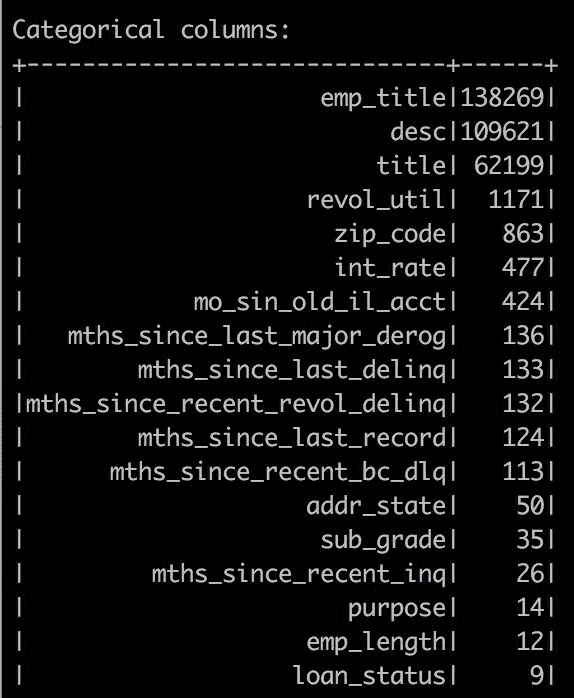
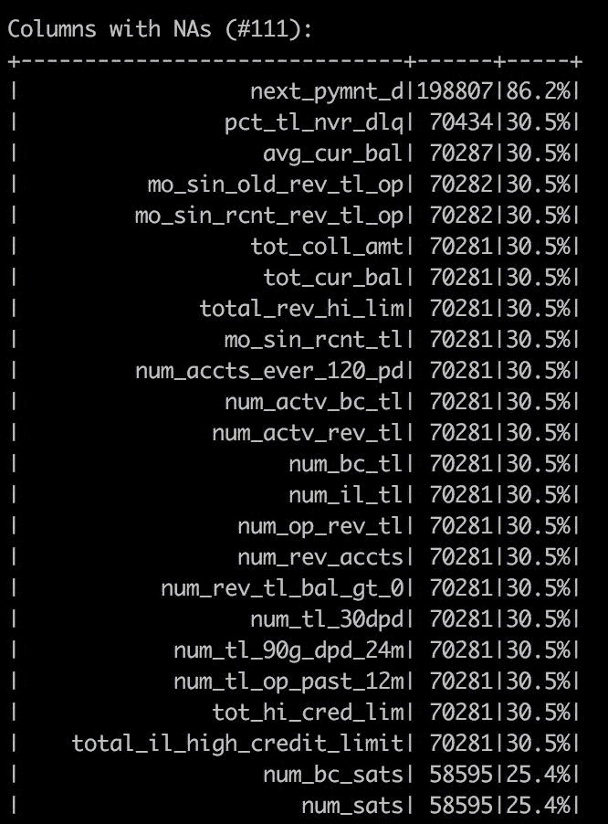
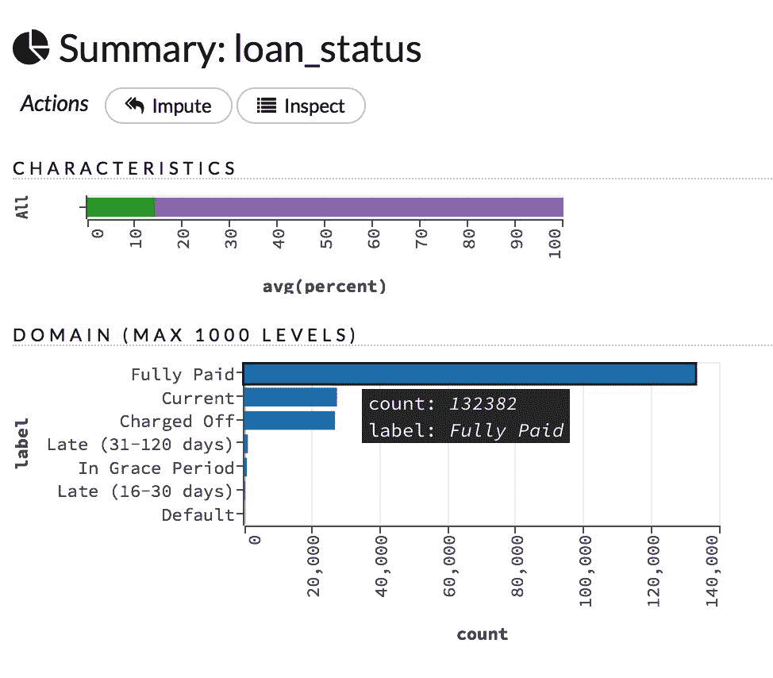
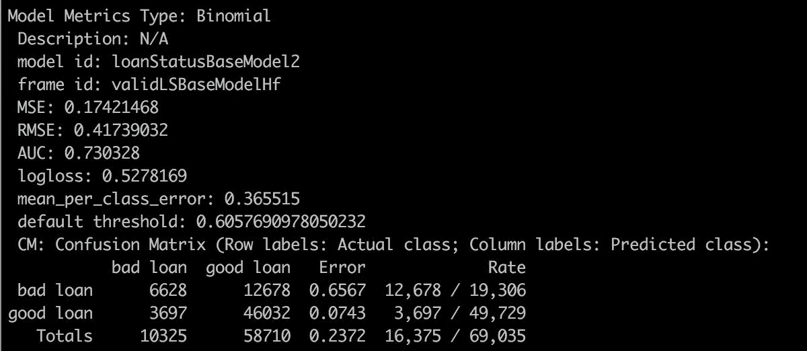
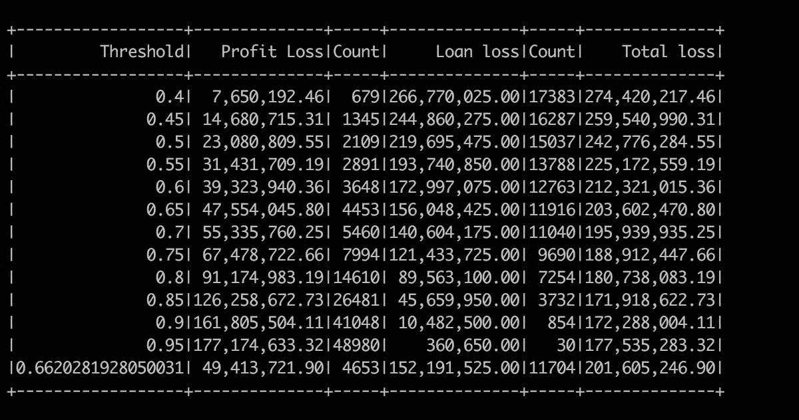
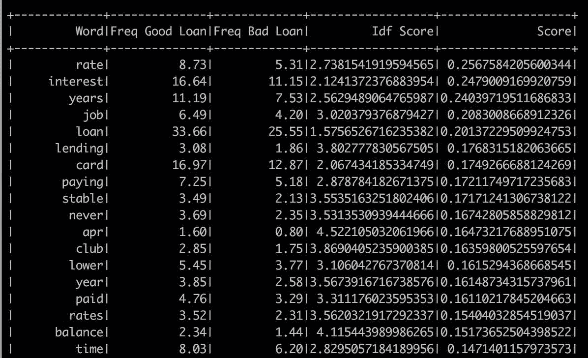

# 贷款俱乐部贷款预测

我们已经接近本书的结尾，但最后一章将利用我们在前面几章中介绍的所有技巧和知识。我们向您展示了如何利用 Spark 的力量进行数据操作和转换，并向您展示了不同的数据建模方法，包括线性模型、树模型和模型集成。本质上，这一章将是章节中的*厨房水槽*，我们将一次性处理许多问题，从数据摄取、操作、预处理、异常处理和建模，一直到模型部署。

我们的主要目标之一是为数据科学家的日常生活提供一个真实的画面——从几乎原始的数据开始，探索数据，构建几个模型，比较它们，找到最佳模型，并部署到生产中——如果一直这么简单就好了！在这最后一章中，我们将从一家提供点对点贷款的公司 Lending Club 那里借用一个真实的场景。我们将运用你学到的所有技能，看看我们是否能建立一个决定贷款风险的模型。此外，我们将把结果与借贷俱乐部的实际数据进行比较，以评估我们的流程。

# 动机

贷款俱乐部的目标是最大限度地降低提供不良贷款的投资风险，不良贷款是违约或延迟的高概率贷款，但也要避免拒绝良好的贷款，从而损失利润。在这里，主要标准是由可接受的风险驱动的——贷款俱乐部可以接受多少风险来保持盈利。

此外，对于预期贷款，贷款俱乐部需要提供反映风险和产生收入的适当利率或提供贷款调整。因此，如果给定的贷款利率很高，我们可能会推断出比利率较低的贷款存在更大的内在风险。

在我们的书中，我们可以从借贷俱乐部的经验中受益，因为他们不仅提供了良好贷款的历史记录，还提供了不良贷款的历史记录。此外，所有的历史数据都是可用的，包括最终贷款状态，这代表着一个独特的机会，适合贷款俱乐部数据科学家的角色，并试图匹配甚至击败他们的预测模型。

我们甚至可以更进一步——我们可以想象一个“自动驾驶模式”。对于每一笔提交的贷款，我们可以定义投资策略(即我们希望接受多大的风险)。自动驾驶仪将接受/拒绝贷款，并提出机器生成的利率和计算预期回报。唯一的条件是，如果你用我们的模型赚了一些钱，我们希望利润减少！

# 目标

总体目标是创建一个机器学习应用，该应用能够根据给定的投资策略训练模型，并将这些模型部署为可调用的服务，处理传入的贷款申请。该服务将能够决定一个给定的贷款申请和计算利率。我们可以从业务需求出发，采用自上而下的方法来定义我们的意图。请记住，一名优秀的数据科学家对所提出的问题有着坚定的理解，这取决于对业务需求的理解，具体如下:

*   我们需要定义投资策略的含义，以及它如何优化/影响我们的机器学习模型创建和评估。然后，我们将把模型的发现应用到我们的贷款组合中，根据特定的投资策略来优化我们的利润。
*   我们需要根据投资策略定义预期回报的计算，应用应该提供贷款人的预期回报。对于投资者来说，这是一个重要的贷款属性，因为它直接关系到贷款申请、投资策略(即风险)和可能的利润。我们应该记住这个事实，因为在现实生活中，建模管道是由非数据科学或统计学专家的用户使用的，他们对建模输出的更高级解释更感兴趣。
*   此外，我们需要设计和实现贷款预测管道的方法，包括以下内容:
    *   一个基于贷款申请数据和投资策略的模型决定了贷款的状态——贷款应该被接受还是拒绝。
        *   模型需要足够稳健，拒绝所有不良贷款(即会导致投资损失的贷款)，但另一方面，不要错过任何好的贷款(即不要错过任何投资机会)。
        *   这个模型应该是可解释的——它应该解释为什么贷款被拒绝。有趣的是，有很多关于这个主题的研究；模型的可解释性，关键利益相关者想要比模型所说的更具体的东西。

For those interested in further reading regarding model interpretability, Zachary Lipton (UCSD) has an outstanding paper titled *The Mythos of Model Interpretability**, *[https://arxiv.org/abs/1606.03490](https://arxiv.org/abs/1606.03490) which directly addresses this topic. This is an especially useful paper for those data scientists who are constantly in the hot seat of explaining all their magic!

# 数据

贷款俱乐部公开提供所有可用的贷款申请及其结果。2007-2012 年和 2013-2014 年的数据可以直接从[https://www.lendingclub.com/info/download-data.action](https://www.lendingclub.com/info/download-data.action)下载。

下载拒绝贷款数据，如下图所示:


下载的文件包含`filesLoanStats3a.CSV`和`LoanStats3b.CSV`。

我们的文件包含大约 230 k 行，这些行被分成两部分:

*   符合信贷政策的贷款:168 k
*   不符合信贷政策的贷款:62 k(注意不平衡数据集)

像往常一样，最好通过查看一个样本行或前 10 行来查看数据；给定我们这里数据集的大小，我们可以使用 Excel 查看一行的样子:


Be careful since the downloaded file can contain a first line with a Lending Club download system comment. The best way is to remove it manually before loading into Spark.

# 数据字典

借贷俱乐部下载页面还提供了一个数据字典，其中包含对各个列的解释。具体来说，数据集包含 115 个具有特定含义的列，收集关于借款人的数据，包括他们的银行历史、信用历史和他们的贷款申请。此外，对于已接受的贷款，数据包括支付进度或贷款的最终状态-如果贷款已全部支付或违约。研究数据字典至关重要的一个原因是防止使用可能预先提示您试图预测的结果的列，从而导致模型不准确。信息很清楚，但非常重要:研究和了解你的数据！

# 环境准备

在本章中，我们将使用 Scala API 构建两个独立的 Spark 应用，而不是使用 Spark shell:一个用于模型准备，另一个用于模型部署。就 Spark 而言，Spark 应用是一个普通的 Scala 应用，其主方法作为执行的入口点。例如，下面是模型训练的应用框架:

```scala
object Chapter8 extends App {val spark = SparkSession.builder().master("local[*]").appName("Chapter8").getOrCreate()val sc = spark.sparkContextsc.setLogLevel("WARN")script(spark, sc, spark.sqlContext)def script(spark: SparkSession, sc: SparkContext, sqlContext: SQLContext): Unit = {// ...code of application
}
}

```

此外，我们将尝试将可以在两个应用之间共享的部分提取到库中。这将允许我们遵循“不重复自己”的原则:

```scala
object Chapter8Library {// ...code of library
  }
```

# 数据加载

像往常一样，第一步包括将数据加载到内存中。此时，我们可以决定使用 Spark 或 H2O 的数据加载功能。由于数据以 CSV 文件格式存储，我们将使用 H2O 解析器快速直观地了解数据:

```scala
val DATASET_DIR = s"${sys.env.get("DATADIR").getOrElse("data")}"val DATASETS = Array("LoanStats3a.CSV", "LoanStats3b.CSV")import java.net.URIimport water.fvec.H2OFrameval loanDataHf = new H2OFrame(DATASETS.map(name => URI.create(s"${DATASET_DIR}/${name}")):_*)
```

可以在 H2O 流程用户界面中直接浏览加载的数据集。我们可以直接验证存储在内存中的数据的行数、列数和大小:


# 探索-数据分析

现在，是时候探索数据了。我们可以问很多问题，例如:

*   我们希望用什么目标特性来支持我们的目标？
*   每个目标特征有哪些有用的训练特征？
*   哪些特征不适合建模，因为它们会泄露目标特征的信息(参见上一节)？
*   哪些特征没有用(例如，常量特征，或包含大量缺失值的特征)？
*   如何清理数据？缺少值怎么办？我们能设计新功能吗？

# 基本清理

在数据探索期间，我们将执行基础数据清理。在我们的案例中，我们可以一起利用展台工具的力量:我们使用 H2O 流量用户界面来探索数据，找到数据中可疑的部分，并直接与 H2O，或者更好的是，与 Spark 进行转换。

# 无用的列

第一步是删除每行包含唯一值的列。这方面的典型例子是用户标识或交易标识。在我们的案例中，我们将根据数据描述手动识别它们:

```scala
import com.packtpub.mmlwspark.utils.Tabulizer.tableval idColumns = Seq("id", "member_id")println(s"Columns with Ids: ${table(idColumns, 4, None)}")
```

输出如下:


下一步是识别无用的列，如下所示:

*   常量列
*   错误的列(只包含缺少的值)

以下代码将帮助我们做到这一点:

```scala
val constantColumns = loanDataHf.names().indices.filter(idx => loanDataHf.vec(idx).isConst || loanDataHf.vec(idx).isBad).map(idx => loanDataHf.name(idx))println(s"Constant and bad columns: ${table(constantColumns, 4, None)}")
```

输出如下:


# 字符串列

现在，是时候探索数据集中不同类型的列了。简单的步骤是查看包含字符串的列——这些列类似于标识列，因为它们包含唯一的值:

```scala
val stringColumns = loanDataHf.names().indices.filter(idx => loanDataHf.vec(idx).isString).map(idx => loanDataHf.name(idx))println(s"String columns:${table(stringColumns, 4, None)}")
```

输出如下图所示:


问题是`url`特征是否包含任何我们可以提取的有用信息。我们可以直接在 H2O 流程中探索数据，并在下面的截图中查看功能列中的一些数据示例:


我们可以直接看到`url`功能只包含指向借贷俱乐部网站的指针，使用我们已经删除的应用标识。因此，我们可以决定放弃它。

# 贷款进度栏

我们的目标是根据贷款申请数据预测固有风险，但有些列包含贷款支付进度信息，或者它们是由贷款俱乐部自己分配的。在这个例子中，为了简单起见，我们将删除它们，只关注贷款申请过程中的列。值得一提的是，在现实场景中，即使是这些列也可以携带有趣的信息(例如，支付进度)用于预测。然而，我们希望基于贷款的初始申请来构建我们的模型，而不是当贷款已经 a)被接受和 b)存在接收申请时不知道的历史支付历史时。基于数据字典，我们检测到以下列:

```scala
val loanProgressColumns = Seq("funded_amnt", "funded_amnt_inv", "grade", "initial_list_status","issue_d", "last_credit_pull_d", "last_pymnt_amnt", "last_pymnt_d","next_pymnt_d", "out_prncp", "out_prncp_inv", "pymnt_plan","recoveries", "sub_grade", "total_pymnt", "total_pymnt_inv","total_rec_int", "total_rec_late_fee", "total_rec_prncp")
```

现在，我们可以直接记录所有需要删除的列，因为它们不会为建模带来任何价值:

```scala
val columnsToRemove = (idColumns ++ constantColumns ++ stringColumns ++ loanProgressColumns)
```

# 分类列

下一步，我们将探索分类列。只有当一列包含一组有限的字符串值时，H2O 解析器才会将该列标记为分类列。这是与标记为字符串列的列的主要区别。它们包含 90%以上的唯一值(例如，参见我们在上一段中探讨的`url`列)。让我们收集数据集中所有分类列的列表，以及单个要素的稀疏性:

```scala
val categoricalColumns = loanDataHf.names().indices.filter(idx => loanDataHf.vec(idx).isCategorical).map(idx => (loanDataHf.name(idx), loanDataHf.vec(idx).cardinality())).sortBy(-_._2)println(s"Categorical columns:${table(tblize(categoricalColumns, true, 2))}")
```

输出如下:



现在，我们可以探索单个列。例如，“目的”一栏包含 13 个类别，其主要目的是债务合并:


这个列看起来是有效的，但是现在，我们应该关注可疑的列，也就是第一个高基数的列:`emp_title`、`title`、`desc`。有几个观察结果:

*   每列的最高值是一个空的“值”。这可能意味着缺少一个值。然而，对于这些类型的列(即，表示一组值的列)，缺失值的专用级别非常有意义。它只是代表了另一种可能的状态，“失踪”。因此，我们可以保持现状。
*   “标题”栏与目的栏重叠，可以删除。
*   `emp_title`和`desc`栏纯粹是文字描述。在这种情况下，我们不会将它们视为绝对的，而是稍后应用自然语言处理技术来提取重要信息。

现在，我们将重点关注以“mths_”开头的列，正如列名所示，该列应该包含数值，但是我们的解析器决定这些列是分类的。这可能是由于收集的数据不一致造成的。例如，当我们探索“mths _ after _ last _ major _ derog”列的域时，我们可以很容易地发现一个原因:


该列中最常见的值是一个空值(也就是说，我们前面已经探讨过的缺陷)。在这种情况下，我们需要决定如何替换这个值来将一个列转换为一个数字列:它应该被缺少的值替换吗？

如果我们想尝试不同的策略，我们可以为这类列定义一个灵活的转换。在这种情况下，我们将离开 H2O 应用编程接口，切换到Spark，并定义我们自己的Spark UDF。因此，如前几章一样，我们将定义一个函数。在这种情况下，一种函数，对于给定的替换值和字符串，它产生一个代表给定字符串的浮点值，如果字符串为空，则返回指定的值。然后，该功能被包装到Spark UDF:

```scala
import org.apache.spark.sql.functions._val toNumericMnths = (replacementValue: Float) => (mnths: String) => {if (mnths != null && !mnths.trim.isEmpty) mnths.trim.toFloat else replacementValue}val toNumericMnthsUdf = udf(toNumericMnths(0.0f))
```

A good practice is to keep our code flexible enough to allow for experimenting, but do not make it over complicated. In this case, we simply keep an open door for cases that we expect to be explored in more detail.

还有两栏需要我们注意:`int_rate`和`revol_util`。两者都应该是表示百分比的数字列；然而，如果我们探究它们，我们很容易看到一个问题——该列包含“%”符号，而不是数值。因此，我们还有两个候选列转换:


但是，我们不会直接处理数据，而是定义 Spark UDF 转换，它将基于字符串的速率转换为数字速率。但是，在定义我们的 UDF 时，我们将只使用 H2O 提供的信息，该信息确认两列中的类别列表只包含以百分号结尾的数据:

```scala
import org.apache.spark.sql.functions._val toNumericRate = (rate: String) => {val num = if (rate != null) rate.stripSuffix("%").trim else ""if (!num.isEmpty) num.toFloat else Float.NaN}val toNumericRateUdf = udf(toNumericRate)
```

定义的 UDF 将在后面的Spark变换中应用。此外，我们需要意识到，这些转换需要在训练和评分期间应用。因此，我们将把它们放入我们的共享库中。

# 文本列

在上一节中，我们将`emp_title`和`desc`列确定为文本转换的目标。我们的理论是，这些专栏可以承载有用的信息，有助于区分好贷款和坏贷款。

# 缺失数据

我们数据探索之旅的最后一步是探索缺失的价值。我们已经观察到，有些列包含一个代表缺失值的值；但是，在这一节中，我们将关注纯缺失值。首先，我们需要收集它们:

```scala
val naColumns = loanDataHf.names().indices.filter(idx => loanDataHf.vec(idx).naCnt() >0).map(idx =>(loanDataHf.name(idx),loanDataHf.vec(idx).naCnt(),f"${100*loanDataHf.vec(idx).naCnt()/loanDataHf.numRows().toFloat}%2.1f%%")).sortBy(-_._2)println(s"Columns with NAs (#${naColumns.length}):${table(naColumns)}")
```

该列表包含 111 列，缺失值的数量从 0.2%到 86%不等:



有很多列缺少五个值，这可能是由于错误的数据收集造成的，如果它们以模式表示，我们可以很容易地过滤掉它们。对于更多的“污染列”(例如，有许多缺失值的列)，我们需要根据数据字典中描述的列语义，为每列找出正确的策略。

In all these cases, H2O Flow UI allows us to easily and quickly explore basic properties of data or even execute basic data cleanup. However, for more advanced data manipulations, Spark is the right tool to utilize because of a provided library of pre-cooked transformations and native SQL support.

咻！正如我们所看到的，数据清理虽然相当费力，但对数据科学家来说是一项极其重要的任务，并且有望为深思熟虑的问题提供好的答案。这个过程必须在每一个寻求解决的新问题之前仔细考虑。正如老广告时代所说的，“G *arbage in，垃圾 out”-*如果输入不对，我们的模型就会遭受后果。

在这一点上，可以将所有识别的转换组合成共享库函数:

```scala
def basicDataCleanup(loanDf: DataFrame, colsToDrop: Seq[String] = Seq()) = {((if (loanDf.columns.contains("int_rate"))loanDf.withColumn("int_rate", toNumericRateUdf(col("int_rate")))elseloanDf).withColumn("revol_util", toNumericRateUdf(col("revol_util"))).withColumn("mo_sin_old_il_acct", toNumericMnthsUdf(col("mo_sin_old_il_acct"))).withColumn("mths_since_last_delinq", toNumericMnthsUdf(col("mths_since_last_delinq"))).withColumn("mths_since_last_record", toNumericMnthsUdf(col("mths_since_last_record"))).withColumn("mths_since_last_major_derog", toNumericMnthsUdf(col("mths_since_last_major_derog"))).withColumn("mths_since_recent_bc", toNumericMnthsUdf(col("mths_since_recent_bc"))).withColumn("mths_since_recent_bc_dlq", toNumericMnthsUdf(col("mths_since_recent_bc_dlq"))).withColumn("mths_since_recent_inq", toNumericMnthsUdf(col("mths_since_recent_inq"))).withColumn("mths_since_recent_revol_delinq", toNumericMnthsUdf(col("mths_since_recent_revol_delinq")))).drop(colsToDrop.toArray :_*)}
```

该方法将 Spark 数据帧作为输入，并应用所有已识别的清理转换。现在，是时候建立一些模型了！

# 预测目标

执行完数据清理后，是时候检查我们的预测目标了。我们理想的建模管道包括两个模型:一个控制贷款的接受，另一个估计利率。你应该已经想到第一个模型是一个二元分类问题(接受或拒绝贷款)，而第二个模型是一个回归问题，其结果是一个数值。

# 贷款状态模型

第一种模式需要区分不良贷款和良贷款。数据集已经提供了`loan_status` 列，这是我们建模目标的最佳特征表示。让我们更详细地看看这个专栏。

贷款状态由七个级别的分类特征表示:

*   全额支付:借款人支付了贷款和所有利息
*   当前:贷款按照计划积极支付
*   宽限期:延迟付款 1-15 天
*   延迟(16-30 天):延迟付款
*   延迟(31-120 天):延迟付款
*   冲销:贷款逾期 150 天
*   违约:贷款损失

对于第一个建模目标，我们需要区分好贷款和坏贷款。好的贷款可能是已经还清的贷款。除了需要更多关注的当前贷款(例如，生存分析)之外，其余贷款可以被视为不良贷款，或者我们可以简单地删除所有包含“当前”状态的行。为了将`loan_status`特征转换为二元特征，我们将定义一个Spark UDF:

```scala
val toBinaryLoanStatus = (status: String) => status.trim.toLowerCase() match {case "fully paid" =>"good loan"case _ =>"bad loan"}val toBinaryLoanStatusUdf = udf(toBinaryLoanStatus)
```

我们可以更详细地探索单个类别的分布。在下面的截图中，我们也可以看到，好贷和坏账的比例是高度不平衡的。我们需要在模型的训练和评估过程中保持这一事实，因为我们希望优化不良贷款检测的召回概率:



Properties of the loan_status column.

# 基础模型

此时，我们已经准备好了目标预测列并清理了输入数据，现在可以构建基础模型了。基础模型给了我们关于数据的基本直觉。为此，我们将使用除被检测为无用的列之外的所有列。我们还将跳过缺失值的处理，因为我们将使用 H2O 和 RandomForest 算法，该算法可以处理缺失值。但是，第一步是在定义的 Spark 转换的帮助下准备数据集:

```scala
import com.packtpub.mmlwspark.chapter8.Chapter8Library._val loanDataDf = h2oContext.asDataFrame(loanDataHf)(sqlContext)val loanStatusBaseModelDf = basicDataCleanup(loanDataDf.where("loan_status is not null").withColumn("loan_status", toBinaryLoanStatusUdf($"loan_status")),colsToDrop = Seq("title") ++ columnsToRemove)
```

我们将简单地删除所有与我们的目标预测列相关的已知列，所有带有文本描述的高分类列(除了`title`和`desc`，我们将在后面使用)，并应用我们在前面部分中识别的所有基本清理转换。

下一步包括将数据分成两部分。像往常一样，我们将保留大部分数据用于模型验证的培训和休息，并将其转换为 H2O 模型构建者接受的形式:

```scala
val loanStatusDfSplits = loanStatusBaseModelDf.randomSplit(Array(0.7, 0.3), seed = 42)val trainLSBaseModelHf = toHf(loanStatusDfSplits(0).drop("emp_title", "desc"), "trainLSBaseModelHf")(h2oContext)val validLSBaseModelHf = toHf(loanStatusDfSplits(1).drop("emp_title", "desc"), "validLSBaseModelHf")(h2oContext)def toHf(df: DataFrame, name: String)(h2oContext: H2OContext): H2OFrame = {val hf = h2oContext.asH2OFrame(df, name)val allStringColumns = hf.names().filter(name => hf.vec(name).isString)hf.colToEnum(allStringColumns)hf}
```

有了清理数据，我们可以很容易地建立一个模型。我们将盲目使用 RandomForest 算法，因为它让我们直接了解数据和单个特征的重要性。我们说“盲目”是因为正如您从[第 2 章](2.html#147LC0-d18ba71168a441bd917775fac13ca893)、*探测暗物质-希格斯玻色子粒子、*中回忆的那样，RandomForest 模型可以接受许多不同类型的输入，并使用不同的特征构建许多不同的树，这让我们有信心将该算法用作我们的开箱即用模型，因为它在包含我们的所有特征时表现得非常好。因此，该模型还定义了一个基线，我们希望通过工程化新特性来改进该基线。

我们将使用默认设置。RandomForest 带来了基于现成样本的现成验证模式，因此我们现在可以跳过交叉验证。然而，我们将增加构建的树的数量，但是通过基于`Logloss`的停止标准来限制模型构建器的执行。此外，我们知道预测目标是不平衡的，其中好贷款的数量远远高于坏贷款，因此我们将通过启用`balance_classes`选项来要求对少数类进行上采样:

```scala
import _root_.hex.tree.drf.DRFModel.DRFParametersimport _root_.hex.tree.drf.{DRF, DRFModel}import _root_.hex.ScoreKeeper.StoppingMetricimport com.packtpub.mmlwspark.utils.Utils.letval loanStatusBaseModelParams = let(new DRFParameters) { p =>p._response_column = "loan_status"p._train = trainLSBaseModelHf._keyp._ignored_columns = Array("int_rate")p._stopping_metric = StoppingMetric.loglossp._stopping_rounds = 1p._stopping_tolerance = 0.1p._ntrees = 100p._balance_classes = truep._score_tree_interval = 20}val loanStatusBaseModel1 = new DRF(loanStatusBaseModelParams, water.Key.make[DRFModel]("loanStatusBaseModel1")).trainModel().get()
```

当模型被构建时，我们可以探索它的质量，就像我们在前面的章节中所做的那样，但是我们首先要看的是特性的重要性:


最令人惊讶的事实是，邮政编码和**收款 _ 回收 _ 费用**功能的重要性远远高于其余栏目。这是可疑的，可能表明列和目标变量之间存在直接关联。

我们可以重温一下数据字典，其中**邮政编码**一栏描述为“借款人在贷款申请中提供的邮政编码的前三位数字”，第二栏描述为“收取后的清收费”。后一个表示直接连接到响应列，因为“良好贷款”的值等于零。我们也可以通过探索数据来验证这个事实。在 zip_code 的情况下，与响应列没有明显的联系。

因此，我们将再运行一次模型，但在这种情况下，我们将尝试忽略`zip_code`和`collection_recovery_fee`列:

```scala
loanStatusBaseModelParams._ignored_columns = Array("int_rate", "collection_recovery_fee", "zip_code")val loanStatusBaseModel2 = new DRF(loanStatusBaseModelParams, water.Key.make[DRFModel]("loanStatusBaseModel2")).trainModel().get()
```

模型建立后，我们可以再次探索变量重要性图，看到变量之间更有意义的重要性分布。基于该图，我们可以决定只使用前 10 个输入特征来简化模型的复杂性并减少建模时间。重要的是，我们仍然需要将移除的列视为相关的输入特性:


**基础车型性能**

现在，我们可以看看创建的模型的模型性能。我们需要记住，在我们的案例中，以下内容适用:

*   该模型的性能是在袋外样品上报告的，而不是在看不见的数据上。
*   我们使用固定参数作为最佳猜测；然而，执行随机参数搜索以了解输入参数如何影响模型的性能将是有益的。


我们可以看到，在袋外数据样本上测量的 AUC 相当高。甚至单个类的错误都是针对一个选定的阈值，这使得单个类的准确性最小化，低。然而，让我们探索模型在看不见的数据上的性能。我们将使用数据的准备部分进行验证:

```scala
import _root_.hex.ModelMetricsval lsBaseModelPredHf = loanStatusBaseModel2.score(validLSBaseModelHf)println(ModelMetrics.getFromDKV(loanStatusBaseModel2, validLSBaseModelHf))
```

输出如下:



计算出的模型度量也可以在流程用户界面中可视化地探索。

我们可以看到，AUC 较低，个别类错误较高，但仍然相当好。然而，所有测量的统计属性并没有给我们任何模型“商业”价值的概念——借出了多少钱，违约贷款损失了多少钱，等等。在下一步中，我们将尝试为模型设计特定的评估指标。

模型做了错误预测的说法是什么意思？它可以认为好的贷款申请是坏的，这将导致申请被拒绝。这也意味着贷款利息利润的损失。或者，该模型可以将不良贷款申请推荐为良好，这将导致全部或部分贷款金额的损失。让我们更详细地看看这两种情况。

前一种情况可以用下面的函数来描述:

```scala
def profitMoneyLoss = (predThreshold: Double) =>(act: String, predGoodLoanProb: Double, loanAmount: Int, intRate: Double, term: String) => {val termInMonths = term.trim match {case "36 months" =>36case "60 months" =>60}val intRatePerMonth = intRate / 12 / 100if (predGoodLoanProb < predThreshold && act == "good loan") {termInMonths*loanAmount*intRatePerMonth / (1 - Math.pow(1+intRatePerMonth, -termInMonths)) - loanAmount} else 0.0}
```

如果模型预测到不良贷款，但实际数据表明贷款是好的，则该函数返回损失的金额。返回的金额考虑了预测的利率和期限。重要的变量是`predGoodLoanProb`，它持有模型预测的将实际贷款视为好贷款的概率，以及`predThreshold`，它允许我们在预测好贷款的概率对我们来说足够好的时候设置一个条。

同样，我们将描述后一种情况:

```scala
val loanMoneyLoss = (act: String, predGoodLoanProb: Double, predThreshold: Double, loanAmount: Int) => {if (predGoodLoanProb > predThreshold /* good loan predicted */&& act == "bad loan" /* actual is bad loan */) loanAmount else 0}
```

意识到我们只是遵循误报和漏报的混淆矩阵定义，并应用我们对输入数据的领域知识来定义特定的模型评估指标，这是很好的。

现在，是时候利用这两个功能并定义`totalLoss`-如果我们遵循我们模型的建议，我们在接受不良贷款和错过良好贷款时会损失多少钱:

```scala
import org.apache.spark.sql.Rowdef totalLoss(actPredDf: DataFrame, threshold: Double): (Double, Double, Long, Double, Long, Double) = {val profitMoneyLossUdf = udf(profitMoneyLoss(threshold))val loanMoneyLossUdf = udf(loanMoneyLoss(threshold))val lostMoneyDf = actPredDf.where("loan_status is not null and loan_amnt is not null").withColumn("profitMoneyLoss", profitMoneyLossUdf($"loan_status", $"good loan", $"loan_amnt", $"int_rate", $"term")).withColumn("loanMoneyLoss", loanMoneyLossUdf($"loan_status", $"good loan", $"loan_amnt"))lostMoneyDf.agg("profitMoneyLoss" ->"sum", "loanMoneyLoss" ->"sum").collect.apply(0) match {case Row(profitMoneyLossSum: Double, loanMoneyLossSum: Double) =>(threshold,profitMoneyLossSum, lostMoneyDf.where("profitMoneyLoss > 0").count,loanMoneyLossSum, lostMoneyDf.where("loanMoneyLoss > 0").count,profitMoneyLossSum + loanMoneyLossSum)}}
```

`totalLoss`功能是为Spark数据帧和阈值定义的。Spark DataFrame 保存实际验证数据和预测，由三列组成:违约阈值的实际预测、良好贷款的概率和不良贷款的概率。门槛帮助我们定义好贷款概率的正确标准；也就是说，如果好贷概率高于门槛，我们可以认为模型建议接受贷款。

如果我们针对不同的阈值运行函数，包括最小化单个类错误的阈值，我们将得到下表:

```scala
import _root_.hex.AUC2.ThresholdCriterionval predVActHf: Frame = lsBaseModel2PredHf.add(validLSBaseModelHf)water.DKV.put(predVActHf)val predVActDf = h2oContext.asDataFrame(predVActHf)(sqlContext)val DEFAULT_THRESHOLDS = Array(0.4, 0.45, 0.5, 0.55, 0.6, 0.65, 0.7, 0.75, 0.8, 0.85, 0.9, 0.95)println(table(Array("Threshold", "Profit Loss", "Count", "Loan loss", "Count", "Total loss"),(DEFAULT_THRESHOLDS :+ThresholdCriterion.min_per_class_accuracy.max_criterion(lsBaseModel2PredModelMetrics.auc_obj())).map(threshold =>totalLoss(predVActDf, threshold)),Map(1 ->"%,.2f", 3 ->"%,.2f", 5 ->"%,.2f")))
```

输出如下:



从表中我们可以看出，我们的指标的最低总损失是基于阈值`0.85`，这代表了一种相当保守的策略，侧重于避免不良贷款。

我们甚至可以定义一个找到最小总损失和相应阈值的函数:

```scala
// @Snippetdef findMinLoss(model: DRFModel,validHf: H2OFrame,defaultThresholds: Array[Double]): (Double, Double, Double, Double) = {import _root_.hex.ModelMetricsimport _root_.hex.AUC2.ThresholdCriterion// Score modelval modelPredHf = model.score(validHf)val modelMetrics = ModelMetrics.getFromDKV(model, validHf)val predVActHf: Frame = modelPredHf.add(validHf)water.DKV.put(predVActHf)//val predVActDf = h2oContext.asDataFrame(predVActHf)(sqlContext)val min = (DEFAULT_THRESHOLDS :+ ThresholdCriterion.min_per_class_accuracy.max_criterion(modelMetrics.auc_obj())).map(threshold =>totalLoss(predVActDf, threshold)).minBy(_._6)( /* Threshold */ min._1, /* Total loss */ min._6, /* Profit loss */ min._2, /* Loan loss */ min._4)}val minLossModel2 = findMinLoss(loanStatusBaseModel2, validLSBaseModelHf, DEFAULT_THRESHOLDS)println(f"Min total loss for model 2: ${minLossModel2._2}%,.2f (threshold = ${minLossModel2._1})")
```

输出如下:


基于报告的结果，我们可以看到该模型最小化了阈值~ `0.85`的总损失，该阈值高于模型识别的默认阈值(F1 = 0.66)。但是，我们仍然需要认识到，这只是一个基础的幼稚模型；我们没有对正确的训练参数进行任何调整和搜索。我们还有两个领域，`title`和`desc`，我们可以利用。是时候改进模型了！

# emp_title 列转换

第一栏`emp_title`描述的是就业职称。然而，它并不统一——有多个版本具有相同的含义(“美国银行”对“美国银行”)或相似的含义(“AT & T”和“AT & T Mobility”)。我们的目标是将标签统一成一个基本的形式，检测相似的标签，并用一个通用的标题替换它们。该理论认为，就业头衔对偿还贷款的能力有直接影响。

标签的基本统一是一个简单的任务——将标签转换成小写形式，并删除所有非字母数字字符(“&”或“.”).对于这一步，我们将使用用户定义函数的 Spark API:

```scala
val unifyTextColumn = (in: String) => {if (in != null) in.toLowerCase.replaceAll("[^\\w ]|", "") else null}val unifyTextColumnUdf = udf(unifyTextColumn)
```

下一步定义了一个标记器，这个函数将一个句子分成单独的标记，并删除无用的和停止的单词(例如，太短的单词或连词)。在我们的例子中，我们将使最小令牌长度和停止字列表作为输入参数变得灵活:

```scala
val ALL_NUM_REGEXP = java.util.regex.Pattern.compile("\\d*")val tokenizeTextColumn = (minLen: Int) => (stopWords: Array[String]) => (w: String) => {if (w != null)w.split(" ").map(_.trim).filter(_.length >= minLen).filter(!ALL_NUM_REGEXP.matcher(_).matches()).filter(!stopWords.contains(_)).toSeqelseSeq.empty[String]}import org.apache.spark.ml.feature.StopWordsRemoverval tokenizeUdf = udf(tokenizeTextColumn(3)(StopWordsRemover.loadDefaultStopWords("english")))
```

It is important to mention that Spark API provides a list of stop words already as part of `StopWordsRemover` transformation. Our definition of `tokenizeUdf` directly utilizes the provided list of English stop words.

现在，是时候更详细地看看这个专栏了。我们将从已经创建的数据框`loanStatusBaseModelDf`中选择`emp_title`列开始，并应用前面定义的两个函数:

```scala
val empTitleColumnDf = loanStatusBaseModelDf.withColumn("emp_title", unifyTextColumnUdf($"emp_title")).withColumn("emp_title_tokens", tokenizeUdf($"emp_title"))
```

现在，我们有一个 Spark DataFrame，它有两个重要的列:第一个包含统一的`emp_title`，第二个由令牌列表表示。借助 Spark SQL API，我们可以轻松计算出`emp_title`列中唯一值的个数或者出现频率超过 100 的唯一令牌的个数(也就是说这个词用在了 100 多个`emp_titles`):

```scala
println("Number of unique values in emp_title column: " +empTitleColumn.select("emp_title").groupBy("emp_title").count().count())println("Number of unique tokens with freq > 100 in emp_title column: " +empTitleColumn.rdd.flatMap(row => row.getSeq[String](1).map(w => (w, 1))).reduceByKey(_ + _).filter(_._2 >100).count)
```

输出如下:


可以看到`emp_title`列有很多唯一的值。另一方面，只有重复出现的`717`代币。我们的目标是*压缩*列中唯一值的数量，并将相似值组合在一起。我们可以尝试不同的方法。例如，用一个有代表性的标记对每个`emp_title`进行编码，或者使用一种基于 Word2Vec 算法的更高级的技术。

In the preceding code, we combined DataFrame query capabilities with the computation power of raw RDDs. Many queries can be expressed with powerful SQL-based DataFrame APIs; however, if we need to process structured data (such as the sequence of string tokens in the preceding example), often the RDD API is a quick way to go.

让我们看看第二个选项。Word2Vec 算法将文本特征转换成向量空间，在向量空间中，相对于表示单词的相应向量的余弦距离，相似的单词被闭合在一起。这是一个很好的财产；然而，我们仍然需要检测“相似单词组”。对于这个任务，我们可以简单地使用 KMeans 算法。

第一步是创建 Word2Vec 模型。由于我们在 Spark DataFrame 中有数据，我们将简单地使用`ml`包中的 Spark 实现:

```scala
import org.apache.spark.ml.feature.Word2Vecval empTitleW2VModel = new Word2Vec().setInputCol("emp_title_tokens").setOutputCol("emp_title_w2vVector").setMinCount(1).fit(empTitleColumn)
```

算法输入由表示存储在“标记”列中的句子的标记序列定义。`outputCol`参数定义了模型的输出，如果它用于转换数据:

```scala
val empTitleColumnWithW2V =   w2vModel.transform(empTitleW2VModel)empTitleColumnWithW2V.printSchema()
```

输出如下:


从转换的输出中，可以直接看到 DataFrame 输出中不仅包含`emp_title`和`emp_title_tokens`输入列，还包含`emp_title_w2vVector`列，代表 w2vModel 转换的输出。

It is important to mention that the Word2Vec algorithm is defined only for words, but the Spark implementation transforms sentences (that is, the sequence of words) into a vector as well by averaging all the word vectors that the sentence represents.

在下一步中，我们将建立一个 K-means 模型，将代表个人就业头衔的向量空间划分为预定义数量的聚类。在做这件事之前，重要的是要考虑为什么这是一件好事。想想你所知道的“软件工程师”的许多不同说法:程序员分析师、工程师、软件工程师等等。考虑到所有这些变化本质上都意味着相同的事情，并且将由相似的向量来表示，聚类为我们提供了一种将相似的标题组合在一起的方法。然而，我们需要指定我们应该检测多少个 K 簇——这需要更多的实验，但是为了简单起见，我们将尝试`500`簇:

```scala
import org.apache.spark.ml.clustering.KMeansval K = 500val empTitleKmeansModel = new KMeans().setFeaturesCol("emp_title_w2vVector").setK(K).setPredictionCol("emp_title_cluster").fit(empTitleColumnWithW2V)
```

该模型允许我们转换输入数据并探索集群。簇号存储在一个名为`emp_title_cluster`的新列中。

Specifying the number of clusters is tricky given that we are dealing with the unsupervised world of machine learning. Often, practitioners will use a simple heuristic known as the elbow method( refer the following link: [https://en.wikipedia.org/wiki/Determining_the_number_of_clusters_in_a_data_set](https://en.wikipedia.org/wiki/Determining_the_number_of_clusters_in_a_data_set)), which basically runs through many K-means models, increasing the number of K-clusters as a function of the heterogeneity (uniqueness) among each of the clusters. Usually, there is a diminishing gain as we increase the number of K-clusters and the trick is to find where the increase becomes marginal to the point where the benefit is no longer "worth" the run time.
Alternatively, there are some information criteria statistics known as **AIC** (**Akaike Information Criteria**) ([https://en.wikipedia.org/wiki/Akaike_information_criterion](https://en.wikipedia.org/wiki/Akaike_information_criterion)) and **BIC** (**Bayesian Information Criteria**) ([https://en.wikipedia.org/wiki/Bayesian_information_criterion](https://en.wikipedia.org/wiki/Bayesian_information_criterion)) that those of you who are interested should look into for further insight. Note that at of the time of writing this book, Spark has yet to implement these information criteria, and hence, we will not cover this in more detail. Take a look at the following code snippet:

```scala
val clustered = empTitleKmeansModel.transform(empTitleColumnWithW2V)clustered.printSchema()
```

输出如下:


此外，我们可以探索与随机聚类相关联的单词:

```scala
println(s"""Words in cluster '133': |${clustered.select("emp_title").where("emp_title_cluster = 133").take(10).mkString(", ")} |""".stripMargin)
```

输出如下:


看看前面的集群，问问自己，“这些标题看起来像逻辑集群吗？”也许需要更多的训练，或者我们需要考虑进一步的特征转换，比如运行一个 n-grammer，它可以识别出现频率很高的单词序列。感兴趣的人可以在这里查看 Spark 的 n-grammer 部分。

此外，`emp_title_cluster`列定义了一个新特性，我们将使用它来替换原来的`emp_title`列。我们还需要记住我们在色谱柱准备过程中使用的所有步骤和模型，因为我们需要重现它们来丰富新数据。为此，Spark管道定义如下:

```scala
import org.apache.spark.ml.Pipelineimport org.apache.spark.sql.types._val empTitleTransformationPipeline = new Pipeline().setStages(Array(new UDFTransformer("unifier", unifyTextColumn, StringType, StringType).setInputCol("emp_title").setOutputCol("emp_title_unified"),new UDFTransformer("tokenizer",tokenizeTextColumn(3)(StopWordsRemover.loadDefaultStopWords("english")),StringType, ArrayType(StringType, true)).setInputCol("emp_title_unified").setOutputCol("emp_title_tokens"),empTitleW2VModel,empTitleKmeansModel,new ColRemover().setKeep(false).setColumns(Array("emp_title", "emp_title_unified", "emp_title_tokens", "emp_title_w2vVector"))))
```

前两个管道步骤代表用户定义函数的应用。在定义的`UDFTransformer`类的帮助下，我们使用了[第 4 章](4.html#2C9D00-d18ba71168a441bd917775fac13ca893)、*使用自然语言处理和Spark流预测电影评论、*中使用的相同技巧，将 UDF 包装到Spark管道转换器中。剩下的步骤代表我们构建的模型。

The defined `UDFTransformer` class is a nice way to wrap UDF into Spark pipeline transformer, but for Spark, it is a black box and it cannot perform all the powerful transformations. However, it could be replaced by an existing concept of the Spark SQLTransformer, which can be understood by the Spark optimizer; on the other hand, its usage is not so straightforward.

管道仍需安装；然而，在我们的例子中，由于我们只使用了 Spark 变压器，fit 操作将所有定义的阶段捆绑到管道模型中:

```scala
val empTitleTransformer = empTitleTransformationPipeline.fit(loanStatusBaseModelDf)
```

现在，是时候评估新功能对模型质量的影响了。我们将重复前面评估基础模型质量时的相同步骤:

*   准备培训和验证部分，并用新功能`emp_title_cluster`丰富它们。
*   建立一个模型。
*   计算金钱损失总额，找出最小损失。

第一步，我们将重用准备好的训练和验证部分；但是，我们需要用准备好的管道对它们进行转换，并删除“原始”列`desc`:

```scala
val trainLSBaseModel3Df = empTitleTransformer.transform(loanStatusDfSplits(0))val validLSBaseModel3Df = empTitleTransformer.transform(loanStatusDfSplits(1))val trainLSBaseModel3Hf = toHf(trainLSBaseModel3Df.drop("desc"), "trainLSBaseModel3Hf")(h2oContext)val validLSBaseModel3Hf = toHf(validLSBaseModel3Df.drop("desc"), "validLSBaseModel3Hf")(h2oContext)
```

当我们准备好数据后，我们可以使用与基础模型训练相同的参数重复模型训练，除了我们使用准备好的输入训练部分:

```scala
loanStatusBaseModelParams._train = trainLSBaseModel3Hf._keyval loanStatusBaseModel3 = new DRF(loanStatusBaseModelParams, water.Key.make[DRFModel]("loanStatusBaseModel3")).trainModel().get()
```

最后，我们可以根据验证数据评估模型，并根据总资金损失计算我们的评估指标:

```scala
val minLossModel3 = findMinLoss(loanStatusBaseModel3, validLSBaseModel3Hf, DEFAULT_THRESHOLDS)println(f"Min total loss for model 3: ${minLossModel3._2}%,.2f (threshold = ${minLossModel3._1})")
```

输出如下所示:


我们可以看到，使用自然语言处理技术来检测类似的职位稍微提高了模型的质量，从而减少了根据看不见的数据计算的总损失。然而，问题是我们是否可以基于`desc`列改进我们的模型，该列可能包含有用的信息。

# desc 柱变换

我们接下来要探讨的专栏是`desc`。我们的动机仍然是从中挖掘任何可能的信息，提高模型的质量。`desc`栏包含贷款人希望贷款的原因的纯文本描述。在这种情况下，我们不会将它们视为绝对价值，因为它们中的大多数都是独特的。然而，我们将应用自然语言处理技术来提取重要信息。与`emp_title`专栏相反，我们不会使用 Word2Vec 算法，但我们会尝试找到区分不良贷款和良贷款的词。

为了实现这个目标，我们将简单地将描述分解成单个单词(即标记化)，并在 tf-idf 的帮助下为每个使用的单词分配权重，并探索哪些单词最有可能代表好贷款或坏贷款。我们可以不使用 tf-idf，而只帮助字数统计，但是 tf-idf 值更好地区分了信息词(如“信用”)和常用词(如“贷款”)。

让我们从我们在`emp_title`列定义转换的情况下执行的相同过程开始，该转换将`desc`列转录成统一令牌列表:

```scala
import org.apache.spark.sql.types._val descColUnifier = new UDFTransformer("unifier", unifyTextColumn, StringType, StringType).setInputCol("desc").setOutputCol("desc_unified")val descColTokenizer = new UDFTransformer("tokenizer",tokenizeTextColumn(3)(StopWordsRemover.loadDefaultStopWords("english")),StringType, ArrayType(StringType, true)).setInputCol("desc_unified").setOutputCol("desc_tokens")
```

该转换准备了一个`desc_tokens`列，其中包含每个输入`desc`值的单词列表。现在，我们需要将字符串标记转换成数字形式来构建 tf-idf 模型。在这种情况下，我们将使用`CountVectorizer`，它提取已用单词的词汇，并为每行生成一个数字向量。数字向量中的一个位置对应于词汇表中的一个单词，该值表示出现的次数。因为我们希望保持向量中的一个数字和代表它的记号之间的关系，所以不要将哪个 g 记号转换成一个数字向量。与 Spark HashingTF 相反，`CountVectorizer`保留了单词之间的双射和它在生成的向量中出现的次数。我们将在以后重用这一功能:

```scala
import org.apache.spark.ml.feature.CountVectorizerval descCountVectorizer = new CountVectorizer().setInputCol("desc_tokens").setOutputCol("desc_vector").setMinDF(1).setMinTF(1)
```

定义 IDF 模型:

```scala
import org.apache.spark.ml.feature.IDFval descIdf = new IDF().setInputCol("desc_vector").setOutputCol("desc_idf_vector").setMinDocFreq(1)
```

当我们将所有定义的转换放入一个管道中时，我们可以直接在输入数据上训练它:

```scala
import org.apache.spark.ml.Pipelineval descFreqPipeModel = new Pipeline().setStages(Array(descColUnifier,descColTokenizer,descCountVectorizer,descIdf)).fit(loanStatusBaseModelDf)
```

现在，我们有一个管道模型，可以为每个输入`desc`值转换一个数值向量。此外，我们可以检查管道模型的内部，并从计算的`CountVectorizerModel`中提取词汇，从`IDFModel`中提取单个单词的权重:

```scala
val descFreqDf = descFreqPipeModel.transform(loanStatusBaseModelDf)import org.apache.spark.ml.feature.IDFModelimport org.apache.spark.ml.feature.CountVectorizerModelval descCountVectorizerModel = descFreqPipeModel.stages(2).asInstanceOf[CountVectorizerModel]val descIdfModel = descFreqPipeModel.stages(3).asInstanceOf[IDFModel]val descIdfScores = descIdfModel.idf.toArrayval descVocabulary = descCountVectorizerModel.vocabularyprintln(s"""~Size of 'desc' column vocabulary: ${descVocabulary.length}~Top ten highest scores:~${table(descVocabulary.zip(descIdfScores).sortBy(-_._2).take(10))}""".stripMargin('~'))
```

输出如下:


此时，我们知道单个单词的权重；然而，我们仍然需要计算“好贷款”和“坏贷款”使用了哪些词。为此，我们将利用由准备好的管道模型计算并存储在`desc_vector`列中的词频信息(实际上，这是`CountVectorizer`的输出)。我们将对所有这些向量分别进行求和，先求好的，然后求坏的贷款:

```scala
import org.apache.spark.ml.linalg.{Vector, Vectors}val rowAdder = (toVector: Row => Vector) => (r1: Row, r2: Row) => {Row(Vectors.dense((toVector(r1).toArray, toVector(r2).toArray).zipped.map((a, b) => a + b)))}val descTargetGoodLoan = descFreqDf.where("loan_status == 'good loan'").select("desc_vector").reduce(rowAdder((row:Row) => row.getAs[Vector](0))).getAs[Vector](0).toArrayval descTargetBadLoan = descFreqDf.where("loan_status == 'bad loan'").select("desc_vector").reduce(rowAdder((row:Row) => row.getAs[Vector](0))).getAs[Vector](0).toArray
```

计算出数值后，我们可以很容易地找到仅用于好/坏贷款的单词，并探究它们的计算 IDF 权重:

```scala
val descTargetsWords = descTargetGoodLoan.zip(descTargetBadLoan).zip(descVocabulary.zip(descIdfScores)).map(t => (t._1._1, t._1._2, t._2._1, t._2._2))println(s"""~Words used only in description of good loans:~${table(descTargetsWords.filter(t => t._1 >0 && t._2 == 0).sortBy(-_._1).take(10))}~~Words used only in description of bad loans:~${table(descTargetsWords.filter(t => t._1 == 0 && t._2 >0).sortBy(-_._1).take(10))}""".stripMargin('~'))
```

输出如下:


产生的信息似乎没有帮助，因为我们只得到非常罕见的词，使我们只能发现有限的高度具体的贷款描述。然而，我们希望更通用，找到两种贷款类型都使用的更常见的词，但仍然允许我们区分不良贷款和良好贷款。

因此，我们需要设计一个单词评分，它将针对在好(或坏)贷款中使用频率高的单词，但惩罚罕见的单词。例如，我们可以将其定义如下:

```scala
def descWordScore = (freqGoodLoan: Double, freqBadLoan: Double, wordIdfScore: Double) =>Math.abs(freqGoodLoan - freqBadLoan) * wordIdfScore * wordIdfScore
```

如果我们对词汇表中的每个单词应用单词评分方法，我们将根据降序获得单词的排序列表:

```scala
val numOfGoodLoans = loanStatusBaseModelDf.where("loan_status == 'good loan'").count()val numOfBadLoans = loanStatusBaseModelDf.where("loan_status == 'bad loan'").count()val descDiscriminatingWords = descTargetsWords.filter(t => t._1 >0 && t. _2 >0).map(t => {val freqGoodLoan = t._1 / numOfGoodLoansval freqBadLoan = t._2 / numOfBadLoansval word = t._3val idfScore = t._4(word, freqGoodLoan*100, freqBadLoan*100, idfScore, descWordScore(freqGoodLoan, freqBadLoan, idfScore))})println(table(Seq("Word", "Freq Good Loan", "Freq Bad Loan", "Idf Score", "Score"),descDiscriminatingWords.sortBy(-_._5).take(100),Map(1 ->"%.2f", 2 ->"%.2f")))
```

输出如下:



根据生成的列表，我们可以识别有趣的单词。我们可以带走 10 个或 100 个。然而，我们仍然需要弄清楚如何处理它们。解决方法很简单；对于每个单词，我们将生成一个新的二进制特征-1 如果一个单词出现在`desc`值中；否则，0:

```scala
val descWordEncoder = (denominatingWords: Array[String]) => (desc: String) => {if (desc != null) {val unifiedDesc = unifyTextColumn(desc)Vectors.dense(denominatingWords.map(w =>if (unifiedDesc.contains(w)) 1.0 else 0.0))} else null}
```

我们可以在准备好的训练和验证样本上测试我们的想法，并测量模型的质量。同样，第一步是准备具有新功能的增强数据。在这种情况下，新特征是包含由描述代码生成的二进制特征的向量:

```scala
val trainLSBaseModel4Df = trainLSBaseModel3Df.withColumn("desc_denominating_words", descWordEncoderUdf($"desc")).drop("desc")val validLSBaseModel4Df = validLSBaseModel3Df.withColumn("desc_denominating_words", descWordEncoderUdf($"desc")).drop("desc")val trainLSBaseModel4Hf = toHf(trainLSBaseModel4Df, "trainLSBaseModel4Hf")val validLSBaseModel4Hf = toHf(validLSBaseModel4Df, "validLSBaseModel4Hf")loanStatusBaseModelParams._train = trainLSBaseModel4Hf._keyval loanStatusBaseModel4 = new DRF(loanStatusBaseModelParams, water.Key.make[DRFModel]("loanStatusBaseModel4")).trainModel().get()
```

现在，我们只需要计算模型的质量:

```scala
val minLossModel4 = findMinLoss(loanStatusBaseModel4, validLSBaseModel4Hf, DEFAULT_THRESHOLDS)println(f"Min total loss for model 4: ${minLossModel4._2}%,.2f (threshold = ${minLossModel4._1})")
```

输出如下:


我们可以看到，新功能有助于提高我们模型的精度。另一方面，它也为实验打开了很大的空间——如果单词是`desc`列的一部分，我们可以选择不同的单词，甚至可以使用 IDF 权重来代替二进制值。

为了总结我们的实验，我们将比较我们产生的三个模型的计算结果:(1)基础模型，(2)在由`emp_title`特征扩充的数据上训练的模型，以及(3)在由`desc`特征丰富的数据上训练的模型:

```scala
println(s"""~Results:~${table(Seq("Threshold", "Total loss", "Profit loss", "Loan loss"),Seq(minLossModel2, minLossModel3, minLossModel4),Map(1 ->"%,.2f", 2 ->"%,.2f", 3 ->"%,.2f"))}""".stripMargin('~'))
```

输出如下:


我们的小实验展示了特征生成的强大概念。相对于我们的模型评估标准，每个新生成的特征都提高了基础模型的质量。

此时，我们可以结束对第一个模型的探索和训练，以检测好/坏贷款。我们将使用我们准备的最后一个模型，因为它给我们最好的质量。还有很多方法可以探索数据，提高我们的模型质量；然而，现在，是时候构建我们的第二个模型了。

# 利率模型

第二个模型预测接受贷款的利率。在这种情况下，我们将只使用对应于良好贷款的那部分培训数据，因为他们已经分配了适当的利率。然而，我们需要理解，剩余的不良贷款可能携带与利率预测相关的有用信息。

和其他案例一样，我们将从准备培训数据开始。我们将使用初始数据，过滤掉不良贷款，并删除字符串列:

```scala
val intRateDfSplits = loanStatusDfSplits.map(df => {df.where("loan_status == 'good loan'").drop("emp_title", "desc", "loan_status").withColumn("int_rate", toNumericRateUdf(col("int_rate")))})val trainIRHf = toHf(intRateDfSplits(0), "trainIRHf")(h2oContext)val validIRHf = toHf(intRateDfSplits(1), "validIRHf")(h2oContext)
```

下一步，我们将利用 H2O 随机超空间搜索的能力，在定义的参数超空间中找到最佳的 GBM 模型。我们还将根据请求的模型精度和整体搜索时间，通过附加的停止标准来限制搜索。

第一步是定义通用的 GBM 模型构建器参数，如训练、验证数据集和响应列:

```scala
import _root_.hex.tree.gbm.GBMModel.GBMParametersval intRateModelParam = let(new GBMParameters()) { p =>p._train = trainIRHf._keyp._valid = validIRHf._keyp._response_column = "int_rate"p._score_tree_interval  = 20}
```

下一步包括定义要探索的参数超空间。我们可以对任何感兴趣的值进行编码，但请记住，搜索可以使用任何参数组合，甚至是那些无用的参数:

```scala
import _root_.hex.grid.{GridSearch}import water.Keyimport scala.collection.JavaConversions._val intRateHyperSpace: java.util.Map[String, Array[Object]] = Map[String, Array[AnyRef]]("_ntrees" -> (1 to 10).map(v => Int.box(100*v)).toArray,"_max_depth" -> (2 to 7).map(Int.box).toArray,"_learn_rate" ->Array(0.1, 0.01).map(Double.box),"_col_sample_rate" ->Array(0.3, 0.7, 1.0).map(Double.box),"_learn_rate_annealing" ->Array(0.8, 0.9, 0.95, 1.0).map(Double.box))
```

现在，我们将定义如何遍历定义的参数超空间。H2O 提供了两种策略:一种是简单的笛卡尔搜索，逐步为每个参数的组合建立模型，另一种是随机搜索，从定义的超空间中随机挑选参数。令人惊讶的是，随机搜索具有相当好的性能，尤其是如果它用于探索一个巨大的参数空间:

```scala
import _root_.hex.grid.HyperSpaceSearchCriteria.RandomDiscreteValueSearchCriteriaval intRateHyperSpaceCriteria = let(new RandomDiscreteValueSearchCriteria) { c =>c.set_stopping_metric(StoppingMetric.RMSE)c.set_stopping_tolerance(0.1)c.set_stopping_rounds(1)c.set_max_runtime_secs(4 * 60 /* seconds */)}
```

在这种情况下，我们还将通过两个停止条件来限制搜索:基于 RMSE 的模型性能和整个网格搜索的最大运行时间。至此，我们已经定义了所有必要的输入，是时候启动超级搜索了:

```scala
val intRateGrid = GridSearch.startGridSearch(Key.make("intRateGridModel"),intRateModelParam,intRateHyperSpace,new GridSearch.SimpleParametersBuilderFactory[GBMParameters],intRateHyperSpaceCriteria).get()
```

搜索的结果是一组名为`grid`的模型。让我们找一个 RMSE 最低的:

```scala
val intRateModel = intRateGrid.getModels.minBy(_._output._validation_metrics.rmse())println(intRateModel._output._validation_metrics)
```

输出如下:


在这里，我们可以定义我们的评估标准，不仅基于选择的模型指标来选择合适的模型，还可以考虑预测值和实际值之间的期限和差异，并优化利润。然而，相反，我们将相信我们的搜索策略，它找到了最好的模型，并直接开始部署我们的解决方案。

# 使用模型进行评分

在前面的部分中，我们探索了不同的数据处理步骤，并构建和评估了几个模型来预测已接受贷款的贷款状态和利率。现在，是时候使用所有构建的工件，并将其组合在一起以获得新的贷款了。

我们需要考虑多个步骤:

1.  数据清理
2.  `emp_title`柱制备管线
3.  `desc`列转换为表示重要单词的向量
4.  预测贷款接受状态的二项式模型
5.  贷款利率预测的回归模型

为了重用这些步骤，我们需要将它们连接到一个单一的函数中，该函数接受输入数据并生成涉及贷款接受状态和利率的预测。

评分功能很简单——它会回放我们在前面章节中完成的所有步骤:

```scala
import _root_.hex.tree.drf.DRFModeldef scoreLoan(df: DataFrame,empTitleTransformer: PipelineModel,loanStatusModel: DRFModel,goodLoanProbThreshold: Double,intRateModel: GBMModel)(h2oContext: H2OContext): DataFrame = {val inputDf = empTitleTransformer.transform(basicDataCleanup(df)).withColumn("desc_denominating_words", descWordEncoderUdf(col("desc"))).drop("desc")val inputHf = toHf(inputDf, "input_df_" + df.hashCode())(h2oContext)// Predict loan status and int rateval loanStatusPrediction = loanStatusModel.score(inputHf)val intRatePrediction = intRateModel.score(inputHf)val probGoodLoanColName = "good loan"val inputAndPredictionsHf = loanStatusPrediction.add(intRatePrediction).add(inputHf)inputAndPredictionsHf.update()// Prepare field loan_status based on thresholdval loanStatus = (threshold: Double) => (predGoodLoanProb: Double) =>if (predGoodLoanProb < threshold) "bad loan" else "good loan"val loanStatusUdf = udf(loanStatus(goodLoanProbThreshold))h2oContext.asDataFrame(inputAndPredictionsHf)(df.sqlContext).withColumn("loan_status", loanStatusUdf(col(probGoodLoanColName)))}
```

我们使用之前准备的所有定义- `basicDataCleanup`方法、`empTitleTransformer`、`loanStatusModel`、`intRateModel`-并以相应的顺序应用它们。

Note that in the definition of the `scoreLoan` functions, we do not need to remove any columns. All the defined Spark pipelines and models use only features they were defined on and keep the rest untouched.

该方法使用所有生成的工件。例如，我们可以通过以下方式对输入数据进行评分:

```scala
val prediction = scoreLoan(loanStatusDfSplits(0), empTitleTransformer, loanStatusBaseModel4, minLossModel4._4, intRateModel)(h2oContext)prediction.show(10)
```

输出如下:


然而，为了独立于我们的训练代码获得新的贷款，我们仍然需要以某种可重用的形式导出训练好的模型和管道。对于 Spark 模型和管道，我们可以直接使用 Spark 序列化。例如，定义的`empTitleTransormer`可以这样导出:

```scala
val MODELS_DIR = s"${sys.env.get("MODELSDIR").getOrElse("models")}"val destDir = new File(MODELS_DIR)empTitleTransformer.write.overwrite.save(new File(destDir, "empTitleTransformer").getAbsolutePath)
```

We also defined the transformation for the `desc` column as a `udf` function, `descWordEncoderUdf`. However, we do not need to export it, since we defined it as part of our shared library.

对于 H2O 模型，情况更复杂，因为有几种模型导出方式:二进制、POJO 和 MOJO。二进制导出类似于 Spark 导出；但是，要重用导出的二进制模型，必须有一个正在运行的 H2O 集群实例。其他方法消除了这一限制。POJO 将模型导出为 Java 代码，可以独立于 H2O 集群进行编译和运行。最后，MOJO 导出模型采用二进制形式，无需运行 H2O 集群即可解释和使用。在本章中，我们将使用 MOJO 导出，因为它很简单，也是模型重用的推荐方法:

```scala
loanStatusBaseModel4.getMojo.writeTo(new FileOutputStream(new File(destDir, "loanStatusModel.mojo")))intRateModel.getMojo.writeTo(new FileOutputStream(new File(destDir, "intRateModel.mojo")))
```

我们还可以导出定义输入数据的 Spark 模式。这将有助于定义新数据的解析器:

```scala
def saveSchema(schema: StructType, destFile: File, saveWithMetadata: Boolean = false) = {import java.nio.file.{Files, Paths, StandardOpenOption}import org.apache.spark.sql.types._val processedSchema = StructType(schema.map {case StructField(name, dtype, nullable, metadata) =>StructField(name, dtype, nullable, if (saveWithMetadata) metadata else Metadata.empty)case rec => rec})Files.write(Paths.get(destFile.toURI),processedSchema.json.getBytes(java.nio.charset.StandardCharsets.UTF_8),StandardOpenOption.TRUNCATE_EXISTING, StandardOpenOption.CREATE)}
```

```scala
saveSchema(loanDataDf.schema, new File(destDir, "inputSchema.json"))
```

Note that the `saveSchema` method processes a given schema and removes all metadata. This is not common practice. However, in this case, we will remove them to save space. It is also important to mention that the data-creation process from the H2O frame implicitly attaches plenty of useful statistical information to the resulting Spark DataFrame.

# 模型部署

模型部署是模型生命周期中最重要的部分。在这个阶段，模型由现实生活中的数据提供，并产生支持决策的结果(例如，接受或拒绝贷款)。

在本章中，我们将构建一个简单的应用，它结合了我们之前导出的 Spark 流模型和我们在编写模型训练应用时定义的共享代码库。

最新的 Spark 2.1 引入了结构化流，它建立在 Spark SQL 之上，允许我们透明地利用 SQL 接口处理流数据。此外，它以“恰好一次”语义的形式带来了一个强大的特性，这意味着事件不会被多次丢弃或传递。流式Spark应用具有与“常规”Spark应用相同的结构:

```scala
object Chapter8StreamApp extends App {val spark = SparkSession.builder().master("local[*]").appName("Chapter8StreamApp").getOrCreate()script(spark,sys.env.get("MODELSDIR").getOrElse("models"),sys.env.get("APPDATADIR").getOrElse("appdata"))def script(ssc: SparkSession, modelDir: String, dataDir: String): Unit = {// ...val inputDataStream = spark.readStream/* (1) create stream */val outputDataStream = /* (2) transform inputDataStream *//* (3) export stream */ outputDataStream.writeStream.format("console").start().awaitTermination()}}
```

有三个重要部分:(1)输入流的创建，(2)创建流的转换，以及(3)写入结果流。

# 流创建

创建流的方法有多种，在 Spark 文档([https://Spark . Apache . org/docs/2 . 1 . 1/structured-streaming-programming-guide . html)](https://spark.apache.org/docs/2.1.1/structured-streaming-programming-guide.html))中有描述，包括基于套接字、基于 Kafka 或基于文件的流。在本章中，我们将使用基于文件的流，指向一个目录的流，并传送目录中出现的所有新文件。

而且，我们的应用会读取 CSV 文件；因此，我们将使用 Spark CSV 解析器连接流输入。我们还需要用从模式训练应用中导出的输入数据模式来配置解析器。让我们首先加载模式:

```scala
def loadSchema(srcFile: File): StructType = {import org.apache.spark.sql.types.DataTypeStructType(DataType.fromJson(scala.io.Source.fromFile(srcFile).mkString).asInstanceOf[StructType].map {case StructField(name, dtype, nullable, metadata) =>StructField(name, dtype, true, metadata)case rec => rec})}
```

```scala
val inputSchema = Chapter8Library.loadSchema(new File(modelDir, "inputSchema.json"))
```

`loadSchema`方法通过将所有加载的字段标记为可空来修改加载的模式。这是允许输入数据在任何列中包含缺失值的必要步骤，而不仅仅是在模型训练期间包含缺失值的列中。

在下一步中，我们将直接配置 CSV 解析器和输入流，以便从给定的数据文件夹中读取 CSV 文件:

```scala
val inputDataStream = spark.readStream.schema(inputSchema).option("timestampFormat", "MMM-yyy").option("nullValue", null).CSV(s"${dataDir}/*.CSV")
```

CSV 解析器需要一个小的配置来设置时间戳特征的格式和缺失值的表示。在这一点上，我们甚至可以探索流的结构:

```scala
inputDataStream.schema.printTreeString()
```

输出如下:


# 流转换

输入流发布了一个类似于 Spark DataSet 的接口；因此，它可以通过常规的 SQL 接口或机器学习转换器进行转换。在我们的例子中，我们将重用前面几节中保存的所有训练好的模型和转换。

首先，我们将加载`empTitleTransformer`-它是一个普通的 Spark 管道变压器，可以借助 Spark `PipelineModel`类进行加载:

```scala
val empTitleTransformer = PipelineModel.load(s"${modelDir}/empTitleTransformer")
```

`loanStatus`和`intRate`模型以 H2O MOJO 格式保存。要加载它们，需要使用`MojoModel`类:

```scala
val loanStatusModel = MojoModel.load(new File(s"${modelDir}/loanStatusModel.mojo").getAbsolutePath)val intRateModel = MojoModel.load(new File(s"${modelDir}/intRateModel.mojo").getAbsolutePath)
```

此时，我们已经准备好了所有必要的工件；但是，我们不能直接使用 H2O MOJO 模型来转换 Spark 流。然而，我们可以把它们包装成一个Spark变压器。我们已经在[第 4 章](4.html#2C9D00-d18ba71168a441bd917775fac13ca893)、*中定义了一个名为 UDFTransfomer 的转换器，使用 NLP 和 Spark Streaming* 预测电影评论，因此我们将遵循类似的模式:

```scala
class MojoTransformer(override val uid: String,mojoModel: MojoModel) extends Transformer {case class BinomialPrediction(p0: Double, p1: Double)case class RegressionPrediction(value: Double)implicit def toBinomialPrediction(bmp: AbstractPrediction) =BinomialPrediction(bmp.asInstanceOf[BinomialModelPrediction].classProbabilities(0),bmp.asInstanceOf[BinomialModelPrediction].classProbabilities(1))implicit def toRegressionPrediction(rmp: AbstractPrediction) =RegressionPrediction(rmp.asInstanceOf[RegressionModelPrediction].value)val modelUdf = {val epmw = new EasyPredictModelWrapper(mojoModel)mojoModel._category match {case ModelCategory.Binomial =>udf[BinomialPrediction, Row] { r: Row => epmw.predict(rowToRowData(r)) }case ModelCategory.Regression =>udf[RegressionPrediction, Row] { r: Row => epmw.predict(rowToRowData(r)) }}}val predictStruct = mojoModel._category match {case ModelCategory.Binomial =>StructField("p0", DoubleType)::StructField("p1", DoubleType)::Nilcase ModelCategory.Regression =>StructField("pred", DoubleType)::Nil}val outputCol = s"${uid}Prediction"override def transform(dataset: Dataset[_]): DataFrame = {val inputSchema = dataset.schemaval args = inputSchema.fields.map(f => dataset(f.name))dataset.select(col("*"), modelUdf(struct(args: _*)).as(outputCol))}private def rowToRowData(row: Row): RowData = new RowData {row.schema.fields.foreach(f => {row.getAs[AnyRef](f.name) match {case v: Number => put(f.name, v.doubleValue().asInstanceOf[Object])case v: java.sql.Timestamp => put(f.name, v.getTime.toDouble.asInstanceOf[Object])case null =>// nopcase v => put(f.name, v)}})}override def copy(extra: ParamMap): Transformer =  defaultCopy(extra)override def transformSchema(schema: StructType): StructType =  {val outputFields = schema.fields :+ StructField(outputCol, StructType(predictStruct), false)StructType(outputFields)}}
```

定义的`MojoTransformer`支持二项式和回归 MOJO 模型。它接受一个 Spark 数据集，并通过新的列来丰富它:两个列保存二项式模型的真/假概率，一个列表示回归模型的预测值。这反映在`transform`方法中，该方法使用 MOJO 包装器`modelUdf`来转换输入数据集:

dataset . select(*col*(**“***)，*model UDF*(*struct*(args:_ *))。as( *outputCol* ))

`modelUdf`模型实现了从表示为 Spark Row 的数据到 MOJO 接受的格式的转换，MOJO 的调用，以及 MOJO 预测到 Spark Row 格式的转换。

定义的`MojoTransformer`允许我们将加载的 MOJO 模型包装到 Spark 转换器 API 中:

```scala
val loanStatusTransformer = new MojoTransformer("loanStatus", loanStatusModel)val intRateTransformer = new MojoTransformer("intRate", intRateModel)
```

此时，我们已经准备好了所有必要的构建块，可以将它们应用于输入流:

```scala
val outputDataStream =intRateTransformer.transform(loanStatusTransformer.transform(empTitleTransformer.transform(Chapter8Library.basicDataCleanup(inputDataStream)).withColumn("desc_denominating_words", descWordEncoderUdf(col("desc"))))
```

代码首先调用共享库函数`basicDataCleanup`，然后用另一个共享库函数`descWordEncoderUdf`转换`desc`列:这两种情况都是在 Spark DataSet SQL 接口之上实现的。其余步骤将适用于已定义的变压器。同样，我们可以探索转换后的流的结构，并验证它包含由我们的转换引入的字段:

```scala
outputDataStream.schema.printTreeString()
```

输出如下:


我们可以看到模式中有几个新的领域:空字符串的表示、命名单词的向量和模型预测。概率来自 loab 状态模型，真实值来自利率模型。

# 流输出

Spark 为流提供了所谓的“输出接收器”。接收器定义流的写入方式和位置；例如，作为拼花文件或作为内存表。但是，对于我们的应用，我们将简单地在控制台中显示流输出:

```scala
outputDataStream.writeStream.format("console").start().awaitTermination()
```

前面的代码直接开始流处理，并一直等到应用终止。应用只需处理给定文件夹中的每个新文件(在我们的例子中，由环境变量“APPDATADIR”给出)。例如，给定一个包含五个贷款申请的文件，该流会生成一个包含五个评分事件的表:


事件的重要部分由包含预测值的最后几列表示:


如果我们将另一个带有单个贷款申请的文件写入该文件夹，该申请将显示另一个评分批次:


这样，我们可以部署训练好的模型和相应的数据处理操作，并让它们对实际事件进行评分。当然，我们只是演示了一个简单的用例；现实场景会复杂得多，包括适当的模型验证、当前使用的模型的 A/B 测试以及模型的存储和版本控制。

# 摘要

本章用端到端的例子总结了你在整本书中学到的一切。我们分析了数据，转换了数据，做了几个实验来弄清楚如何建立模型训练管道，并建立了模型。本章还强调了设计良好的代码的必要性，这些代码可以在几个项目中共享。在我们的例子中，我们创建了一个共享库，在训练时使用，在评分时也使用。这一点在被称为“模型部署”的关键操作中得到了证明，当训练好的模型和相关工件被用来记录看不见的数据时。

这一章也把我们带到了书的结尾。我们的目标是表明，用 Spark 解决机器学习挑战主要是对数据、参数、模型进行实验，调试数据/模型相关问题，编写可测试和重用的代码，并通过获得令人惊讶的数据见解和观察获得乐趣。