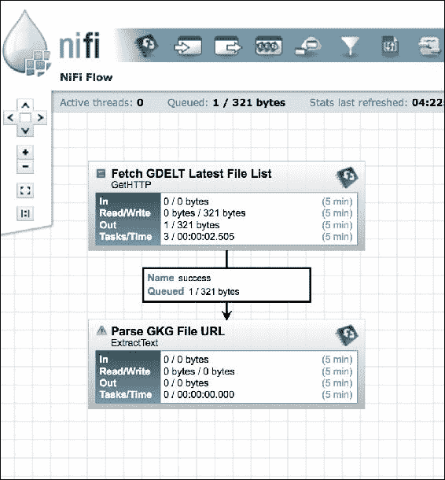
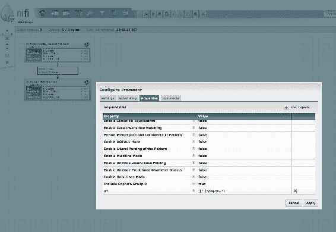
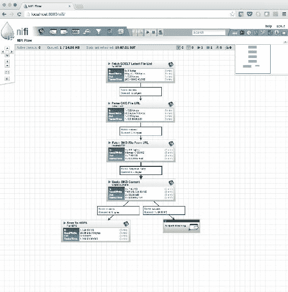
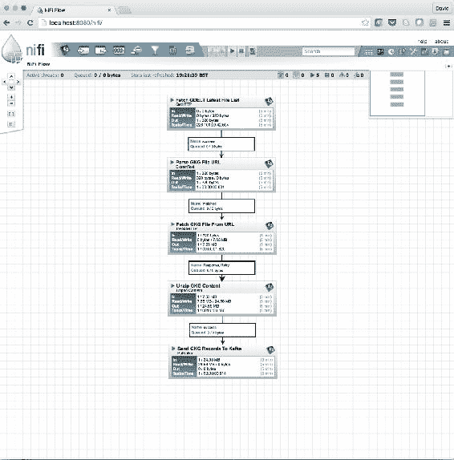
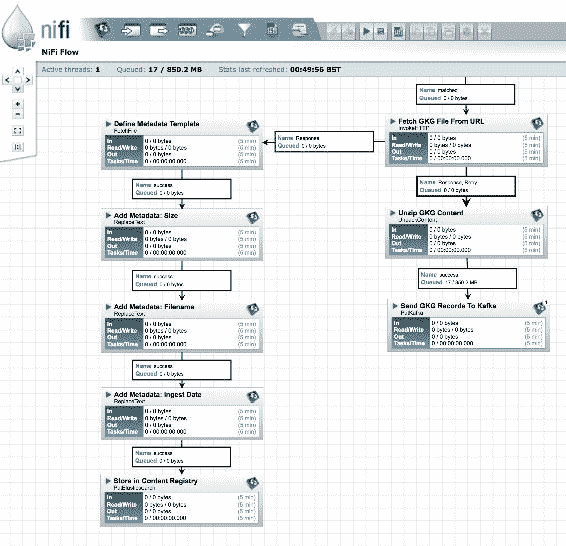
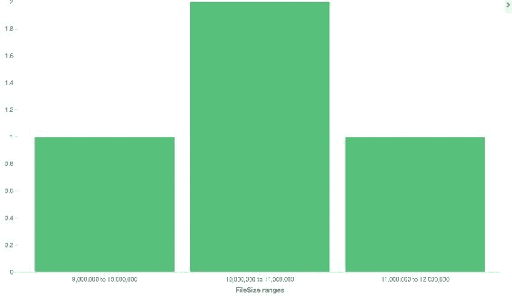

# 二、数据采集

作为数据科学家，最重要的任务之一是将数据加载到您的数据科学平台中。本章解释了如何在 Spark 中构建一个通用的数据接收管道，作为输入数据的许多输入的可重用组件，而不是无控制的、特别的过程。我们浏览了一个配置，并演示了它如何在各种运行条件下提供重要的饲料管理信息。

读者将学习如何构建一个*内容寄存器*，并使用它来跟踪加载到系统中的所有输入，并在接收管道上传递度量，以便这些流可以作为一个自动化的熄灯过程可靠地运行。

在本章中，我们将涵盖以下主题:

*   介绍**事件、语言和音调全球数据库** ( **GDELT** )数据集
*   数据管道
*   通用摄取框架
*   实时监控新数据
*   通过卡夫卡接收流数据
*   为跟踪目的注册新内容和保险存储
*   在基巴纳可视化内容指标，以监控摄取过程和数据运行状况

# 数据管道

即使是最基本的分析，我们也总是需要一些数据。事实上，找到*正确的数据*可能是数据科学中最难解决的问题之一(但这是另一本书的全部主题！).我们在上一章已经看到，我们获取数据的方式可以根据需要变得简单或复杂。实际上，我们可以将这个决定分为两个不同的领域:*临时*和*预定*。

*   **临时数据采集**:是原型制作和小规模分析期间最常见的方法，因为它通常不需要任何额外的软件来实现。用户获取一些数据，并在需要时从源下载。这种方法通常是点击一个网络链接，将数据存储在方便的地方，尽管数据可能仍然需要版本化和安全。
*   **预定数据采集**:用于更受控的环境，用于大规模和生产分析；还有一个很好的例子，可以将数据集摄入数据湖，以备将来使用。随着**物联网** ( **物联网**)的增加，在许多情况下会产生大量的数据，如果数据没有被立即吸收，就会永远丢失。这些数据中的大部分在今天可能没有明显的用途，但在未来可能会有；因此，心态是收集所有的数据，以防需要，并在我们确定不需要时将其删除。

很明显，我们需要一种灵活的数据采集方法来支持各种采购选项。

## 通用摄取框架

有许多方法可以获取数据，从国产 bash 脚本到高端商业工具。本节的目的是介绍一个高度灵活的框架，我们可以将其用于小规模的数据接收，然后随着我们的需求的变化而增长，如果需要的话，可以一直发展到一个完整的、公司管理的工作流。该框架将使用 Apache NiFi 构建。NiFi 使我们能够构建大规模、集成的数据管道，在地球上移动数据。此外，构建简单的管道也非常灵活和容易，通常比使用 bash 或任何其他传统的脚本方法都要快。

### 注

如果在许多情况下采用临时方法来获取相同的数据集，那么应该认真考虑它是否属于预定类别，或者至少是否应该引入更健壮的存储和版本设置。

我们选择使用 Apache NiFi，因为它提供了一种解决方案，能够创建许多不同复杂性的管道，这些管道可以扩展到真正的大数据和物联网级别，它还提供了一个很好的拖放界面(使用所谓的*基于流的编程*[*【https://en.wikipedia.org/wiki/Flow-based_programming】*](https://en.wikipedia.org/wiki/Flow-based_programming))。有了工作流生产的模式、模板和模块，它可以自动处理许多传统上困扰开发人员的复杂功能，如多线程、连接管理和可扩展处理。就我们的目的而言，它将使我们能够快速构建简单的原型管道，并在需要时将其扩展到完全生产。

它被很好地记录下来，并且很容易按照 https://nifi.apache.org/download.html 的信息运行。它在浏览器中运行，如下所示:


我们将 NiFi 的安装留给读者，我们鼓励您这样做，因为我们将在下一节中使用它。

## 介绍 GDELT 新闻流

希望我们现在已经启动并运行了 NiFi，并且可以开始接收一些数据。那么，让我们从一些来自 GDELT 的全球新闻媒体数据开始。以下是我们的简介，摘自 GDELT 网站[http://blog . GDELT project . org/GDELT-2-0-我们的全球实时世界/](http://blog.gdeltproject.org/gdelt-2-0-our-global-world-in-realtime/) :

*“在 GDELT 监测到一篇新闻报道在世界任何地方爆发后的 15 分钟内，它已经翻译了它，对它进行了处理，以识别所有事件、计数、引用、人物、组织、地点、主题、情感、相关图像、视频和嵌入的社交媒体帖子，将其放入全球背景中，并通过一个实时开放元数据 firehose 提供所有这些，从而能够对地球本身进行开放研究。*

*【作为】情感分析世界中最大的单一部署，我们希望通过将跨越如此多语言和学科的如此多情感和主题维度聚集在一起，并将所有这些实时应用于来自全球的突发新闻，这将激发一个全新的时代，即我们如何思考情感，以及情感如何帮助我们更好地理解我们如何将全球事件置于背景中，如何解释、响应和理解全球事件。”*

相当有挑战性的职权范围，我想你会同意的！因此，与其拖延，不如停下来在这里说明细节，让我们直接开始。我们将在接下来的章节中介绍 GDELT 的各个方面。

为了开始消费这些开放数据，我们需要连接到元数据防火墙，并将新闻流摄取到我们的平台上。我们如何做到这一点？让我们从找出可用的数据开始。

### 实时发现 GDELT

GDELT 在他们的网站上发布了最新文件的列表。该列表每 15 分钟更新一次。在 NiFi 中，我们可以设置一个数据流来轮询 GDELT 网站，从这个列表中获取一个文件，并将其保存到 HDFS，以便我们以后使用。

在 NiFi 数据流设计器中，通过将处理器拖到画布上并选择`GetHTTP`函数来创建一个 HTTP 连接器。


要配置此处理器，您需要输入文件列表的网址:

[http://data.gdeltproject.org/gdeltv2/lastupdate.txt](http://data.gdeltproject.org/gdeltv2/lastupdate.txt)

另外，为将要下载的文件列表提供一个临时文件名。在下面的例子中，我们使用了 NiFi 的表达式语言来生成一个通用的唯一键，这样文件就不会被覆盖(`UUID()`)。


值得注意的是，对于这种类型的处理器(`GetHTTP`方法)，NiFi 支持许多轮询和检索的调度和定时选项。现在，我们将使用默认选项，让 NiFi 为我们管理轮询间隔。

GDELT 的最新文件列表示例如下所示:


接下来，我们将解析 GKG 新闻流的网址，以便稍后获取。通过将处理器拖到画布上并选择`ExtractText`，创建正则表达式解析器。现在，将新处理器放在现有处理器的下面，并从顶部处理器向底部处理器拖动一条线。在弹出的连接对话框中选择`success`关系完成。

这在以下示例中显示:



接下来，让我们将`ExtractText`处理器配置为使用仅匹配文件列表相关文本的正则表达式，例如:

```scala
([^ ]*gkg.csv.*) 

```

根据这个正则表达式，NiFi 将创建一个与流设计相关联的新属性(在这种情况下，称为`url`)，当每个特定实例通过流时，该属性将采用一个新值。它甚至可以配置为支持多线程。

同样，这个例子如下所示:



这里值得注意的是，虽然这是一个相当具体的例子，但该技术是有意通用的，可以在许多情况下使用。

### 我们的第一个 GDELT 饲料

现在我们有了 GKG 提要的 URL，我们通过配置一个`InvokeHTTP`处理器来获取它，以使用我们之前创建的`url`属性作为它的远程端点，并像以前一样拖动该行。


剩下的就是用`UnpackContent`处理器(使用基本的`.zip`格式)解压缩压缩的内容，然后用`PutHDFS`处理器保存到 HDFS，如下所示:


### 通过发布和订阅进行改进

到目前为止，这个流看起来非常*点对点*，这意味着如果我们要引入一个新的数据消费者，例如，Spark-streaming 作业，这个流必须改变。例如，流程设计可能必须更改为如下所示:



如果我们再增加一个，流程必须再次改变。事实上，每次我们添加一个新的消费者，流程都会变得更复杂一点，尤其是在添加了所有的错误处理之后。这显然并不总是令人满意的，因为引入或移除数据的消费者(或生产者)，可能是我们想要经常做的事情，甚至是经常做的事情。此外，尽量保持流程的简单性和可重用性也是一个好主意。

因此，对于更灵活的模式，我们可以发布到 *Apache Kafka* ，而不是直接写给 HDFS。这使我们能够随时添加和删除消费者，而无需更改数据接收管道。如果需要，我们还可以从卡夫卡那里给 HDFS 写信，甚至可能通过设计一个单独的 NiFi 流，或者使用 Spark-streaming 直接连接到卡夫卡。

为此，我们通过将处理器拖到画布上并选择`PutKafka`来创建一个卡夫卡作家。



我们现在有了一个简单的流程，可以持续轮询可用的文件列表，在新的流可用时定期通过网络检索它的最新副本，解压缩内容，并将其逐记录地流式传输到 Kafka(一个持久的、容错的分布式消息队列)，供 HDFS 的 Spark-streaming 或 storage 处理。更重要的是，没有写一行 bash！

# 内容注册

我们在本章中看到，数据摄取是一个经常被忽视的领域，其重要性不可低估。在这一点上，我们有一个管道，使我们能够从一个源接收数据，安排接收，并将数据定向到我们选择的存储库。但故事并没有就此结束。现在我们有了数据，我们需要履行我们的数据管理职责。进入*内容注册表*。

我们将建立一个与我们所摄取的数据相关的元数据索引。数据本身仍将被定向到存储(在我们的例子中是 HDFS)，但是，此外，我们将存储关于数据的元数据，以便我们可以跟踪我们收到的内容并了解关于它的基本信息，例如，我们何时收到它，它来自哪里，它有多大，它是什么类型，等等。

## 选择和更多选择

正如我们所看到的，选择使用哪种技术来存储这些元数据是基于知识和经验的。对于元数据索引，我们至少需要以下属性:

*   易于搜索
*   可攀登的
*   并行写入能力
*   裁员

有许多方法可以满足这些要求，例如，我们可以将元数据写入到 Parquet，存储在 HDFS，并使用 Spark SQL 进行搜索。然而，这里我们将使用*弹性搜索*，因为它稍微更好地满足了需求，最显著的是因为它有助于通过 REST 应用编程接口对我们的元数据进行低延迟查询，这对创建仪表板非常有用。事实上，弹性搜索具有直接与**基巴纳**集成的优势，这意味着它可以快速生成我们内容注册的丰富可视化。出于这个原因，我们将继续进行弹性搜索。

## 随波逐流

使用我们当前的 NiFi 管道流，让我们分叉“从 URL 获取 GKG 文件”的输出，以添加一组额外的步骤，允许我们在 Elasticsearch 中捕获和存储这些元数据。这些是:

1.  用我们的元数据模型替换流内容。
2.  捕获元数据。
3.  直接存储在弹性搜索中。

这是 NiFi 中的样子:



## 元数据模型

因此，这里的第一步是定义我们的元数据模型。我们可以考虑许多领域，但是让我们选择一组有助于解决早期讨论中的几个关键点的领域。如果需要，这将为将来添加更多数据提供良好的基础。因此，让我们保持简单，使用以下三个属性:

*   文件大小
*   摄入日期
*   文件名

这些将提供接收文件的基本注册。

接下来，在 NiFi 流中，我们需要用这个新的元数据模型替换实际的数据内容。一个简单的方法是从我们的模型中创建一个 JSON 模板文件。我们将把它保存到本地磁盘，并在`FetchFile`处理器中使用它来用这个骨架对象替换流的内容。该模板看起来类似于:

```scala
{ 
  "FileSize": SIZE, 
  "FileName": "FILENAME", 
  "IngestedDate": "DATE" 
} 

```

请注意使用占位符名称(`SIZE, FILENAME, DATE`)代替属性值。这些将被一系列的`ReplaceText`处理器一个接一个地替换，这些处理器使用由 NiFi 表达式语言提供的正则表达式将占位符名称交换为适当的流属性，例如`DATE`变成`${now()}`。

最后一步是将新的元数据负载输出到 Elasticsearch。NiFi 再次为此配备了处理器；`PutElasticsearch`处理器。

弹性搜索中的元数据条目示例:

```scala
{
         "_index": "gkg",
         "_type": "files",
         "_id": "AVZHCvGIV6x-JwdgvCzW",
         "_score": 1,
         "source": {
            "FileSize": 11279827,
            "FileName": "20150218233000.gkg.csv.zip",
            "IngestedDate": "2016-08-01T17:43:00+01:00"
         }
```

现在我们已经增加了收集和查询元数据的能力，我们现在可以访问更多可用于分析的统计数据。这包括:

*   基于时间的分析，例如，文件大小随时间的变化
*   数据丢失，例如，时间线中是否存在数据漏洞？

如果需要特定的分析，可以调整 NIFI 元数据组件以提供相关的数据点。事实上，如果元数据不存在于当前数据中，可以构建一个分析来查看历史数据并相应地更新索引。

## 基巴纳仪表盘

在本章中，我们已经多次提到基巴纳。现在我们在 Elasticsearch 中有了元数据的索引，我们可以使用该工具来可视化一些分析。这个简短部分的目的是演示我们可以立即开始建模和可视化我们的数据。要查看更复杂场景中使用的 Kibana，请看[第 9 章](09.html "Chapter 9.  News Dictionary and Real-Time Tagging System") *、新闻词典和实时标签系统*。在这个简单的例子中，我们已经完成了以下步骤:

1.  将我们的 GDELT 元数据的弹性搜索索引添加到**设置**选项卡。
2.  在**发现**选项卡下选择文件大小。
3.  文件大小选择**可视化**。
4.  将`Aggregation`字段更改为`Range`。
5.  范围的输入值。

生成的图形显示了文件大小分布:



从这里，我们可以自由地创建新的可视化，甚至是一个功能齐全的仪表板，可以用来监控我们的文件摄取状态。通过增加从 NiFi 写入 Elasticsearch 的元数据的种类，我们可以在 Kibana 提供更多的领域，甚至可以从这里开始我们的数据科学之旅，获得一些基于摄取的可操作的见解。

现在，我们有了一个功能齐全的数据管道来为我们提供实时数据，我们如何确保我们接收的有效负载的数据质量？让我们来看看选项。

# 质量保证

随着初始数据接收能力的实现，以及数据流向您的平台，您将需要决定在“前门”需要多少质量保证。从没有初始质量控制开始，并随着时间的推移逐步建立质量控制是完全可行的(在时间和资源允许的情况下，回顾性地扫描历史数据)。然而，从一开始就安装基本级别的验证可能是谨慎的。例如，基本检查，如文件完整性、奇偶校验、完整性、校验和、类型检查、字段计数、过期文件、安全字段预填充、反规范化等。

你应该注意你的预付支票不要花太长时间。根据检查的强度和数据的大小，在下一个数据集到达之前没有足够的时间执行所有处理的情况并不少见。您将始终需要监控集群资源并计算最有效的时间利用。

以下是您可以执行的粗略产能规划计算类型的一些示例:

## 示例 1 -基本质量检查，无竞争用户

*   每 15 分钟摄入一次数据，从源中提取数据需要 1 分钟
*   质量检查(完整性、现场计数、现场预填充)需要 4 分钟
*   计算群集中没有其他用户

*还有 10 分钟的资源可用于其他任务。*

由于集群上没有其他用户，这是令人满意的-不需要采取任何行动。

## 示例 2 -高级质量检查，无竞争用户

*   每 15 分钟摄入一次数据，从源中提取数据需要 1 分钟
*   质量检查(完整性、字段计数、字段预填充、反规格化、子数据集构建)需要 13 分钟
*   计算群集中没有其他用户

*只有 1 分钟的资源*可用于*的其他任务。*

你可能需要考虑:

*   配置资源调度策略
*   减少摄入的数据量
*   减少我们承担的加工量
*   向群集添加额外的计算资源

## 示例 3 -基本质量检查，50%效用来自竞争用户

*   每 15 分钟摄入一次数据，从源中提取数据需要 1 分钟
*   质量检查(完整性、字段计数、字段预填充)需要 4 分钟(100%实用)
*   计算集群上还有其他用户

*还有 6 分钟的资源可用于其他任务(15 - 1 - (4 * (100 / 50))。因为有其他用户，所以存在这样的危险，至少在某些时候，我们将无法完成我们的处理，并且会出现工作积压。*

当您遇到时间问题时，您有许多选择来避免任何积压:

*   在特定时间协商资源的单独使用
*   Configuring a resource scheduling policy, including:
    *   纱线集市调度程序:允许您定义具有不同优先级的队列，并通过在启动时设置`spark.yarn.queue`属性来定位您的Spark作业，以便您的作业总是优先
    *   动态资源分配:允许并发运行的作业自动扩展以匹配其利用率
    *   Spark 调度程序池:允许您在使用多线程模型共享`SparkContext`时定义队列，并通过为每个执行线程设置`spark.scheduler.pool`属性来定位您的 Spark 作业，以便您的线程优先
    *   群集安静时通宵运行处理作业

无论如何，你最终会对你工作的各个部分的表现有一个很好的了解，然后就能计算出可以做哪些改变来提高效率。我们总是可以选择投入更多的资源来解决这个问题，尤其是在使用云提供商时，但是我们肯定会鼓励对现有资源的智能使用——这种方式更具可扩展性、成本更低，并且可以积累数据专业知识。

# 总结

在这一章中，我们完成了 Apache NiFi GDELT 摄取管道的完整设置，包括元数据分叉和可视化结果数据的简单介绍。这一部分尤其重要，因为 GDELT 在整本书中被广泛使用，而 NiFi 方法是以可扩展和模块化的方式获取数据的一种非常有效的方法。

在下一章中，我们将通过查看模式和格式来了解数据落地后该如何处理。