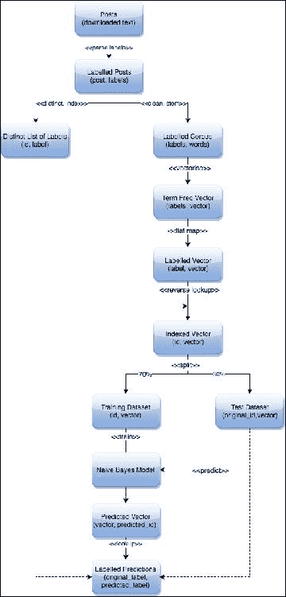
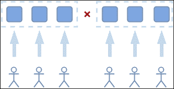
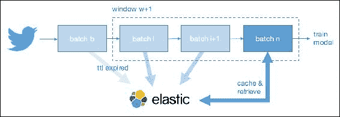
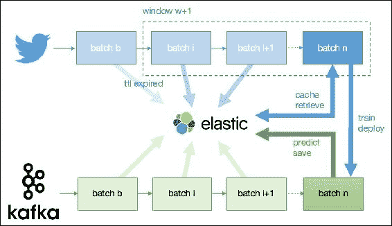

# 九、新闻词典和实时标签系统

虽然分层数据仓库将数据存储在文件夹的文件中，但典型的基于 Hadoop 的系统依赖于平面架构来存储数据。如果没有适当的数据治理，或者对数据的本质没有清晰的理解，数据湖变成沼泽的可能性是不可否认的，像 GDELT 这样有趣的数据集只不过是一个包含大量非结构化文本文件的文件夹。因此，数据分类可能是大规模组织中最广泛使用的机器学习技术之一，因为它允许用户对他们的数据进行适当的分类和标记，将这些类别作为元数据解决方案的一部分发布，从而以最有效的方式访问特定信息。如果没有预先执行的适当的标记机制，理想情况下是在摄取时，找到关于特定主题的所有新闻文章将需要解析整个数据集来寻找特定的关键词。在本章中，我们将描述一种创新的方法，使用 Spark Streaming 和 1% Twitter fire 软管，以非监督方式和接近实时的方式标记传入的 GDELT 数据。

我们将涵盖以下主题:

*   使用堆栈交换数据引导朴素贝叶斯分类器
*   针对实时流应用的 Lambda 与 Kappa 架构
*   Spark 流应用中的卡夫卡和推特 4J
*   部署模型时的线程安全
*   使用弹性搜索作为缓存层

# 机械土耳其人

数据分类是一种监督学习技术。这意味着您只能预测从训练数据集中学习到的标签和类别。因为后者必须被正确地标记，这成为我们将在本章中讨论的主要挑战。

## 人类的智力任务

在新闻文章的上下文中，我们的数据没有一个被正确地标记在前面；严格来说，我们从中学不到什么。数据科学家的常识是开始手动标记一些输入记录，这些记录将作为训练数据集。然而，因为类的数量可能相对较大，至少在我们的情况下(数百个标签)，所以要标记的数据量可能很大(数千篇文章)，并且需要巨大的努力。第一个解决方案是将这项艰巨的任务外包给“机械土耳其人”，这个术语被用来指历史上最著名的恶作剧之一，一名自动象棋选手愚弄了大多数世界领导人([https://en.wikipedia.org/wiki/The_Turk](https://en.wikipedia.org/wiki/The_Turk))。这通常描述了一个可以由机器完成的过程，但实际上它是由一个隐藏的人完成的，因此称为人类智能任务。

对于读者的信息，机械土耳其人计划已经在亚马逊([https://www.mturk.com/mturk/welcome](https://www.mturk.com/mturk/welcome))开始，在那里个人可以注册来执行人类智能任务，例如标记输入数据或检测文本内容的情感。假设您可以将这个内部(并且可能是机密的)数据集共享给第三方，那么将这个任务众包可能是一个可行的解决方案。这里描述的另一种解决方案是使用预先存在的标记数据集引导分类模型。

## 引导分类模型

文本分类算法通常从词频向量中学习；一种可能的方法是使用具有相似上下文的外部资源来训练模型。例如，可以使用从堆栈溢出网站的完整转储中学习的类别对未标记的信息技术相关内容进行分类。因为堆栈交换不仅仅是为信息技术专业人员保留的，所以人们可以在许多不同的上下文中找到各种数据集，这些数据集可以用于许多目的([https://archive.org/download/stackexchange](https://archive.org/download/stackexchange))。

### 从栈交换中学习

我们将在这里演示如何使用 Stack Exchange 网站上的家庭酿造相关数据集引导一个简单的朴素贝叶斯分类模型:

```scala
$ wget https://archive.org/download/stackexchange/beer.stackexchange.com.7z
$ 7z e beer.stackexchange.com.7z
```

我们创建了几个方法，从所有的 XML 文档中提取正文和标签，从 HTML 编码的正文中提取干净的文本内容(使用[第 6 章](06.html "Chapter 6. Scraping Link-Based External Data")、*中介绍的 Goose 刮刀刮基于链接的外部数据*)，最后将我们的 XML 文档 RDD 转换成 Spark 数据帧。这里没有报告不同的方法，但是它们可以在我们的代码库中找到。需要注意的是，可以通过在虚拟网址旁边提供 HTML 内容(作为字符串)来离线使用 Goose 刮板。

我们为读者提供了一种方便的`parse`方法，可用于预处理来自 Stack Exchange 网站的任何`Post.xml`数据。该功能是我们代码库中可用的`StackBootstraping`代码的一部分:

```scala
import io.gzet.tagging.stackoverflow.StackBootstraping

val spark = SparkSession.builder()
  .appName("StackExchange")
  .getOrCreate()

val sc = spark.sparkContext
val rdd = sc.textFile("/path/to/posts.xml")
val brewing = StackBootstraping.parse(rdd)

brewing.show(5)

+--------------------+--------------------+
|                body|                tags|
+--------------------+--------------------+
|I was offered a b...|              [hops]|
|As far as we know...|           [history]|
|How is low/no alc...|           [brewing]|
|In general, what'...|[serving, tempera...|
|Currently I am st...| [pilsener, storage]|
+--------------------+--------------------+
```

### 构建文本特征

有了我们的啤酒内容适当的标签，剩下的过程是引导算法本身。为此，我们使用简单的朴素贝叶斯分类算法来确定给定项目特征的标签的条件概率。我们首先收集所有不同的标签，分配一个唯一的标识符(如`Double`)，并向 Spark 执行者广播我们的标签字典:

```scala
val labelMap = brewing
  .select("tags")
  .withColumn("tag", explode(brewing("tags")))
  .select("tag")
  .distinct()
  .rdd
  .map(_.getString(0)).zipWithIndex()
  .mapValues(_.toDouble + 1.0d)
labelMap.take(5).foreach(println)

/*
(imperal-stout,1.0)
(malt,2.0)
(lent,3.0)
(production,4.0)
(local,5.0)
*/
```

### 类型

如前所述，确保 Spark 转换中使用的大型集合已经广播给所有 Spark 执行器。这降低了与网络传输相关的成本。

一个`LabeledPoint`由一个标签(作为`Double`)和特征(作为 `Vector`)组成。从文本内容中构建特征的一种常见做法是构建术语频率向量，其中所有文档中的每个单词都对应于一个特定的维度。大约有几十万个维度(英语单词的估计数量为 1，025，109)，这种高维空间对于大多数机器学习算法来说效率特别低。事实上，当朴素贝叶斯乘以概率(小于 1)时，由于机器精度问题(数值下溢，如[第 14 章](14.html "Chapter 14. Scalable Algorithms")、*可扩展算法*所述)，存在达到 0 的一定风险。数据科学家利用降维原理克服了这一限制，将稀疏向量投影到更密集的空间，同时保留距离度量(降维原理将在[第 10 章](10.html "Chapter 10. Story De-duplication and Mutation")、*故事去重和变异*中介绍)。尽管我们可以找到许多用于此目的的算法和技术，但我们将使用 Spark 提供的哈希实用程序。

向量大小为 *n* (缺省为 2 <sup class="calibre78">20</sup> ，其`transform`方法将 *n* 个不同桶中的所有单词按照其哈希值分组，并对桶频率进行求和以构建更密集的向量。

降维可能是一项昂贵的操作，在降维之前，可以通过词干和清理文本内容来大大减小向量大小。我们在这里使用 Apache Lucene 分析器:

```scala
<dependency>
   <groupId>org.apache.lucene</groupId>
   <artifactId>lucene-analyzers-common</artifactId>
   <version>4.10.1</version>
 </dependency>
```

我们删除所有标点符号和数字，并将纯文本对象馈送到 Lucene 分析器，将每个干净的单词收集为一个`CharTermAttribute`:

```scala
def stem(rdd: RDD[(String, Array[String])]) = {

  val replacePunc = """\\W""".r
  val replaceDigitOnly = """\\s\\d+\\s""".r

  rdd mapPartitions { it =>

    val analyzer = new EnglishAnalyzer
    it map { case (body, tags) =>
      val content1 = replacePunc.replaceAllIn(body, " ")
      val content = replaceDigitOnly.replaceAllIn(content1, " ")
      val tReader = new StringReader(content)
      val tStream = analyzer.tokenStream("contents", tReader)
      val term = tStream.addAttribute(classOf[CharTermAttribute])
       tStream.reset()
      val terms = collection.mutable.MutableList[String]()
      while (tStream.incrementToken) {
        val clean = term.toString
        if (!clean.matches(".*\\d.*") && clean.length > 3) {
           terms += clean
        }
      }
      tStream.close()
      (terms.toArray, tags)
     }

  }
```

通过这种方法，我们将文本[掌握数据科学 Spark- V1]转换为[掌握 Spark 数据科学]，从而减少输入向量的字数(因此减少维数)。最后，我们使用 MLlib `normalizer`类来规范化我们的词频向量:

```scala
val hashingTf = new HashingTF()
val normalizer = new Normalizer()

val labeledCorpus = stem(df map { row =>
  val body = row.getString(0)
  val tags = row.getAs[mutable.WrappedArray[String]](1)
  (body, tags)
})

val labeledPoints = labeledCorpus flatMap { case (corpus, tags) =>
  val vector = hashingTf.transform(corpus)
  val normVector = normalizer.transform(vector)
  tags map { tag =>
    val label = bLabelMap.value.getOrElse(tag, 0.0d)
    LabeledPoint(label, normVector)
  }
}
```

### 类型

由于冲突，散列函数可能导致戏剧性的高估(两个完全不同含义的不同单词可能共享同一个散列值)。我们将在[第 10 章](10.html "Chapter 10. Story De-duplication and Mutation")、*故事去重和突变*中讨论随机索引技术，以便在保留距离度量的同时限制碰撞次数。

### 训练朴素贝叶斯模型

我们如下训练一个朴素贝叶斯算法，并使用一个没有包含在训练数据点中的测试数据集来测试我们的分类器。我们最终在下面的示例中显示了前五个预测。左边的标签是我们测试内容的原始标签；右边是朴素贝叶斯分类的结果。一个`ipa`已经被预测为`hangover`，肯定地验证了我们的分类算法的准确性:

```scala
labeledPoints.cache()
val model: NaiveBayesModel = NaiveBayes.train(labeledPoints)
labeledPoints.unpersist(blocking = false)

model
  .predict(testPoints)
  .map { prediction =>
     bLabelMap.value.map(_.swap).get(prediction).get
   }
  .zip(testLabels)
  .toDF("predicted","original")
  .show(5)

+---------+-----------+
| original|  predicted|
+---------+-----------+
|  brewing|    brewing|
|      ipa|   hangover|
| hangover|   hangover|
| drinking|   drinking|
| pilsener|   pilsener|
+---------+-----------+
```

为了方便起见，我们抽象了所有这些方法，并在稍后将使用的`Classifier`对象中公开了以下方法:

```scala
def train(rdd: RDD[(String, Array[String])]): ClassifierModel
def predict(rdd: RDD[String]): RDD[String]
```

我们已经演示了如何从外部来源导出标记数据，如何构建术语频率向量，以及如何训练简单的朴素贝叶斯分类模型。下图显示了此处使用的高级工作流，它在大多数分类用例中都很常见:



图 1:分类工作流程

下一步是开始对原始的未标记数据进行分类(假设我们的内容仍然与啤酒厂相关)。这就结束了朴素贝叶斯分类的介绍，以及自举模型如何从外部资源窃取基本事实。这两种技术都将在下一节的分类系统中使用。

## 懒惰、不耐烦和傲慢

接下来是我们将在新闻文章中面临的第二个主要挑战。假设有人花了几天时间手动标记数据，这将解决我们在特定时间点对已知类别的分类问题，并且可能仅在回测我们的数据时有效。谁知道明天报纸的新闻标题会是什么？没有人能够定义所有的细粒度标签和主题，这些标签和主题将在不久的将来被覆盖(尽管仍然可以定义更广泛的类别)。这将需要大量的努力来不断地重新评估、重新训练和重新部署我们的模型。举个具体的例子，一年前没有人谈论英国退出欧盟这个话题；这个话题现在在新闻文章中被大量提及。

根据我们的经验，数据科学家应该记住 Perl 编程语言的发明者拉里·沃尔的一句名言:

> *“我们会鼓励你养成程序员的三大美德，懒惰、急躁、狂妄”。*

*   *懒惰*让你去下大力气减少整体的能量消耗
*   *不耐烦*让你写的程序不仅仅是对你的需求做出反应，而是预测它们
*   *狂妄自大*让你写出人们不想说坏话的程序

我们希望避免与分类模型的准备和维护相关的努力(懒惰)，并有计划地预测新主题的出现(不耐烦)，尽管这听起来像是一项雄心勃勃的任务(但如果不是对实现不可能的过度骄傲，那还有什么骄傲呢？).社交网络是窃取基本事实的绝佳场所。事实上，当人们在推特上发布新闻文章时，他们会不自觉地帮助我们给数据贴上标签。当我们有数百万用户为我们工作时，我们不需要为机械土耳其人付费。换句话说，我们向推特用户众包 GDELT 数据的标签。

推特上提到的任何文章都将帮助我们建立一个术语频率向量，而相关的标签将被用作适当的标签。在下面的例子中，关于奥巴马总统穿着浴袍会见乔治王子的可爱新闻被分为【#奥巴马】和【#王子】[http://www . wfmynews 2 . com/entertainment/萌-王子-乔治-错过-就寝时间-会见-总统-奥巴马/149828772](http://www.wfmynews2.com/entertainment/adorable-prince-george-misses-bedtime-meets-president-obama/149828772) :


图 2:奥巴马总统会见乔治王子，#奥巴马，#王子

在下面的例子中，我们在《卫报》[https://www . The Guardian . com/music/2016/dec/29/death-stars-music-2016 年最大损失](https://www.theguardian.com/music/2016/dec/29/death-stars-musics-greatest-losses-of-2016)的同一篇新闻文章中，通过机器学习主题[#DavidBowie]、[#Prince]、[# georgimechael]和[# leonardchen]向 2016 年所有音乐最大损失致敬:


图 3:2016 年音乐的巨大损失-来源

使用这种方法，我们的算法将被不断地自动重新评估，根据自己产生的主题进行学习，因此以非监督的方式工作(尽管在正确的意义上是监督学习算法)。

# 设计 Spark 流应用

构建实时应用与批处理在所涉及的架构和组件方面有所不同。虽然后者可以很容易地自下而上构建，程序员在需要时添加功能和组件，但前者通常需要自上而下构建，并有一个可靠的架构。事实上，由于容量和速度(或流上下文中的准确性)的限制，不适当的架构会阻止程序员添加新功能。人们总是需要清楚地了解数据流是如何相互连接的，它们是如何以及在哪里被处理、缓存和检索的。

## 两座建筑的故事

在使用 Apache Spark 进行流处理方面，有两种新兴的架构应该考虑:Lambda 架构和 Kappa 架构。在我们深入研究这两种架构的细节之前，让我们讨论一下它们试图解决的问题，它们有什么共同点，以及在什么样的上下文中使用它们。

### CAP 定理

多年来，在高度分布式系统上工作的工程师一直在关注网络中断的处理。下面是一个特别有趣的场景，请考虑:


图 4:分布式系统中断

典型分布式系统的正常操作是用户执行操作，系统使用复制、缓存和索引等技术来确保正确性和及时响应。但是出了问题会发生什么:



图 5:分布式系统裂脑综合征

在这里，网络中断有效地阻止了用户安全地执行他们的操作。是的，一个简单的网络故障会导致一个复杂的问题，它不仅会影响您所期望的功能和性能，还会影响系统的正确性。

事实上，该系统现在患有所谓的*裂脑综合征*。在这种情况下，系统的两个部分不再能够相互对话，因此用户在一侧执行的任何修改在另一侧都不可见。几乎就像有两个独立的系统，每个系统都保持自己的内部状态，随着时间的推移，它们会变得完全不同。至关重要的是，当在任意一侧运行相同的查询时，用户可能会报告不同的答案。

这只是分布式系统中一般故障情况下的一个例子，尽管已经花了很多时间来解决这些问题，但仍然只有三种实用的方法:

1.  防止用户进行任何更新，直到基础问题得到解决，同时保持系统的当前状态(故障前的最后已知状态)正确(即牺牲*分区容差*)。
2.  允许用户像以前一样继续进行更新，但要接受答案可能不同，并且在底层问题得到纠正时必须在某个点收敛(即牺牲*一致性*)。
3.  将所有用户转移到系统的一个部分，并允许他们像以前一样继续进行更新。系统的另一部分被视为故障，并接受处理能力的部分降低，直到问题得到解决-系统可能会因此变得不太响应(即牺牲*可用性*)。

前面的连词更正式地表述为 CAP 定理([http://nathanmarz.com/blog/how-to-beat-the-cap-theorem.html](http://nathanmarz.com/blog/how-to-beat-the-cap-theorem.html))。它的原因是，在一个环境中，失败是生活中的事实，你不能牺牲功能(1)，你必须在拥有一致的答案(2)或完全的能力(3)之间做出选择。你不能两者兼得，因为这是一种交换。

### 类型

事实上，在这里将“故障”描述为更通用的术语“分区容限”更为正确，因为这种类型的故障可能指系统的任何部分-网络中断、服务器重新启动、磁盘已满等-它不一定是特定的网络问题。

不用说，这是一种简化，但尽管如此，如果出现故障，大多数数据处理系统将属于这些大类之一。此外，事实证明，大多数传统数据库系统都倾向于一致性，使用众所周知的计算机科学方法来实现这一点，例如事务、提前写日志和悲观锁定。

然而，在当今的在线世界，用户期望全天候获得服务，其中许多是创收的；物联网或实时决策，需要一种可扩展的容错方法。因此，出现了生产替代品的努力，以确保在出现故障时的可用性(事实上，互联网本身就是从这一需求中诞生的)。

事实证明，在实现高可用性系统和提供可接受的一致性之间取得适当的平衡是一项挑战。为了管理必要的权衡，方法倾向于提供较弱的一致性定义，即*最终一致性*，其中陈旧数据通常会被容忍一段时间，随着时间的推移，正确的数据会被认可。然而，即使有这种折衷，它们仍然需要使用复杂得多的技术，因此它们更难构建和维护。

### 类型

在更繁重的实现中，需要向量时钟和读取修复来处理并发性和防止数据损坏

### 希腊人是来帮忙的

Lambda 和 Kappa 架构都为前面描述的问题提供了更简单的解决方案。他们提倡使用现代大数据技术，如 Apache Spark 和 Apache Kafka 作为一致可用处理系统的基础，在这些系统中，可以开发逻辑，而无需对故障进行推理。它们适用于具有以下特征的情况:

*   可能来自多个来源的无限的入站信息流
*   对非常大的累积数据集进行分析处理
*   基于时间保证数据一致性的用户查询
*   对性能下降或停机时间零容忍

如果你有这些条件，你可以考虑任何一个架构作为一般的候选。每个人都遵循以下核心原则，这些原则有助于简化数据一致性、并发访问和防止数据损坏方面的问题:

*   **数据不变性**:数据只被创建或读取。它永远不会被更新或删除。以这种方式处理数据大大简化了保持数据一致性所需的模型。
*   **人的容错**:在软件开发生命周期的正常过程中修复或升级软件时，往往需要通过系统部署新版本的分析和重放历史数据，以便产生修订后的答案。事实上，当管理直接处理数据的系统时，这种能力通常是至关重要的。批处理层提供了历史数据的持久存储，因此允许恢复任何错误。

正是这些原则构成了他们最终一致的解决方案的基础，而不需要担心读取修复或向量时钟等复杂性；它们绝对是对开发人员更友好的架构！

所以，让我们讨论一下选择其中一个的原因。让我们首先考虑一下 Lambda 架构。

## Lambda 架构的重要性

最初由 Nathan Marz 提出的 Lambda 架构通常是这样的:


图 6: Lambda 架构

本质上，数据被双重路由到两层:

*   能够计算给定时间点的快照的**批处理层**
*   能够处理自上次快照以来的增量更改的**实时层**

然后使用**服务层**将这两个数据视图合并在一起，产生一个最新版本的真相。

除了前面描述的一般特征之外，当您具有以下任一特定条件时，Lambda 体系结构是最合适的:

*   复杂或耗时的批量或批处理算法，没有等效或替代的增量迭代算法(近似值不可接受)，因此您需要批处理层。
*   Guarantees on data consistency cannot be met by the batch layer alone, regardless of parallelism of the system, so you need a real-time layer. For example, you have:
    *   低延迟写读
    *   任意宽范围的数据，即年
    *   严重的数据不对称

如果您有这些条件中的任何一个，您应该考虑使用 Lambda 架构。但是，在继续之前，请注意它会带来以下可能带来挑战的品质:

*   两个数据管道:批处理和流处理有单独的工作流，尽管在可能的情况下，您可以尝试重用核心逻辑和库，但流本身必须在运行时单独管理。
*   复杂的代码维护:除了简单的聚合，批处理和实时层中的算法需要不同。对于机器学习算法来说尤其如此，有一个完整的领域致力于这项名为在线机器学习([https://en.wikipedia.org/wiki/Online_machine_learning](https://en.wikipedia.org/wiki/Online_machine_learning))的研究，它可以包括在现有框架之外实现增量迭代算法或近似算法。
*   服务层的复杂性增加:为了将增量与聚合合并，服务层需要聚合、联合和联接。工程师应该注意，这不会分裂成消耗系统。

尽管有这些挑战，Lambda 架构是一种健壮且有用的方法，已经在许多机构和组织中成功实现，包括雅虎！、网飞和推特。

## 卡帕建筑的重要性

Kappa 架构通过将*分布式日志*的概念放在其中心，将简化向前推进了一步。这允许完全去除批次层，因此创建了一个非常简单的设计。Kappa 有许多不同的实现，但通常看起来是这样的:


图 7:卡帕建筑

在这种体系结构中，分布式日志本质上提供了数据不变性和可重用性的特征。通过在处理层引入*可变状态存储*的概念，将所有处理都视为流处理，甚至批处理，统一了计算模型，这被认为只是流的一种特例。当您具有以下任一特定条件时，Kappa 体系结构最为合适:

*   通过增加系统的并行性以减少延迟，使用现有的批处理算法可以满足数据一致性的保证
*   通过实现增量迭代算法可以保证数据的一致性

如果这些选项中的任何一个是可行的，那么 Kappa 架构应该提供一种现代的、可扩展的方法来满足您的批处理和流要求。然而，值得考虑的是为您可能决定的任何实现选择的技术的限制和挑战。潜在的限制包括:

*   一次性语义:许多流行的分布式消息传递系统，如 Apache Kafka，目前不支持一次性消息传递语义。这意味着，就目前而言，消费系统必须自己处理接收数据副本。这通常是通过使用检查点、唯一密钥、幂等写入或其他类似的重复数据消除技术来完成的，但它确实增加了复杂性，因此使解决方案更难构建和维护。
*   无序事件处理:许多流实现(如 Apache Spark)目前不支持按事件时间排序的更新，而是使用处理时间，即系统首次观察到事件的时间。因此，更新可能会被无序接收，系统需要能够处理这种情况。同样，这增加了代码的复杂性，使解决方案更难构建和维护。
*   没有强一致性，即可线性化:由于所有更新都是异步应用的，因此不能保证写入会立即生效(尽管它们最终是一致的)。这意味着在某些情况下，您将无法立即“阅读您的文章”。

在下一章中，我们将讨论增量迭代算法、数据倾斜或服务器故障如何影响一致性，以及 Spark Streaming 中的背压功能如何帮助减少故障。关于本节中已经解释的内容，我们将按照 Kappa 架构构建我们的分类系统。

# 消耗数据流

类似于批处理作业，我们使用一个`SparkConf`对象和一个上下文创建一个新的 Spark 应用。在流式应用中，上下文是使用批处理大小参数创建的，该参数将用于任何传入的流(作为同一上下文的一部分，GDELT 和 Twitter 层都将绑定到相同的批处理大小)。每 15 分钟发布一次 GDELT 数据，我们的批量自然是 15 分钟，因为我们希望以伪实时方式预测类别:

```scala
val sparkConf = new SparkConf().setAppName("GZET")
val ssc = new StreamingContext(sparkConf, Minutes(15))
val sc = ssc.sparkContext
```

## 创建 GDELT 数据流

有许多方法可以将外部数据发布到 Spark 流应用中。人们可以打开一个简单的套接字，开始通过 netcat 实用程序发布数据，或者可以通过一个监视外部目录的 Flume 代理来流式传输数据。生产系统通常使用 Kafka 作为默认代理，以实现高吞吐量和整体可靠性(数据在多个分区上复制)。当然，我们可以使用与[第 10 章](10.html "Chapter 10. Story De-duplication and Mutation")、*故事重复数据消除和突变*中描述的相同的 Apache NiFi 堆栈，但是我们想在这里描述一个简单得多的路线，通过卡夫卡主题将文章 URL(从 GDELT 记录中提取)“管道”到我们的 Spark 应用中。

### 创造一个卡夫卡的话题

创建一个新的卡夫卡主题相当容易(在测试环境中)。在生产环境中，必须通过选择正确的分区数量和复制因素来格外小心。还要注意，必须安装和配置适当的动物园管理员法定人数。我们启动 Kafka 服务器，创建一个名为`gzet`的主题，仅使用一个分区，复制因子为 1:

```scala
$ kafka-server-start /usr/local/etc/kafka/server.properties > /var/log/kafka/kafka-server.log 2>&1 &

$ kafka-topics --create --zookeeper localhost:2181 --replication-factor 1 --partitions 1 --topic gzet
```

### 向卡夫卡主题发布内容

我们可以通过向`kafka-console-producer`实用程序传送内容来为卡夫卡队列提供内容。我们使用`awk`、`sort`和`uniq`命令，因为我们只对来自 GDELT 记录的不同 URL 感兴趣(`URL`是标签分隔值的最后一个字段，因此是`$NF`):

```scala
$ cat ${FILE} | awk '{print $NF}' | sort | uniq | kafka-console-producer --broker-list localhost:9092 --topic gzet
```

为了方便起见，我们创建了一个简单的 bash 脚本，它监听 GDELT 网站上的新文件，将内容下载并提取到一个临时目录中，然后执行前面的命令。该脚本可以在我们的代码库中找到(`gdelt-stream.sh`)。

### 从 Spark 流消费卡夫卡

Kafka 是 Spark Streaming 的官方来源，可通过以下依赖项获得:

```scala
<dependency>
   <groupId>org.apache.spark</groupId>
   <artifactId>spark-streaming-kafka-0-8_2.11</artifactId>
   <version>2.0.0</version>
</dependency>
```

我们定义了将用于处理来自 gzet 主题(这里是 10)的数据的 Spark 分区的数量以及 zookeeper 仲裁。我们返回消息本身(链接到我们的卡夫卡制作人)，以便建立我们的文章链接流:

```scala
def createGdeltStream(ssc: StreamingContext) = {
   KafkaUtils.createStream(
     ssc,
     "localhost:2181",
     "gzet",
     Map("gzet" -> 10)
   ).values
 }

val gdeltUrlStream: DStream[String] = createGdeltStream(ssc)
```


图 8: GDELT 在线层

在上图中，我们通过听一个卡夫卡式的话题展示了如何批量处理 GDELT 数据。将使用[第 6 章](06.html "Chapter 6. Scraping Link-Based External Data")、*基于抓取链接的外部数据*中描述的 HTML 解析器对每一批进行分析并下载文章。

## 创建推特数据流

使用 Twitter 的明显限制就是规模的限制。每天有超过 5 亿条推文，我们的应用需要以最分布式和可伸缩的方式编写，以便处理大量的输入数据。此外，如果只有 2%的推文包含对外部网址的引用，我们每天仍然有一百万个网址要获取和分析(除了来自 GDELT 的数千个)。因为我们没有专门的架构来处理这本书的数据准确性，我们将使用推特免费提供的 1%消防软管。只需要在推特网站([https://apps.twitter.com](https://apps.twitter.com))注册一个新的应用，并检索相关的应用设置和授权令牌。然而，请注意，自版本`2.0.0`以来，推特连接器不再是核心 Spark 流的一部分。作为 Apache Bahir 项目([http://bahir.apache.org/](http://bahir.apache.org/))的一部分，它可以用于以下 maven `dependency`:

```scala
<dependency>
   <groupId>org.apache.bahir</groupId>
   <artifactId>spark-streaming-twitter_2.11</artifactId>
   <version>2.0.0</version>
</dependency>
```

因为 Spark 流在后台使用`twitter4j`，所以配置是使用`twitter4j`库中的`ConfigurationBuilder`对象完成的:

```scala
import twitter4j.auth.OAuthAuthorization
import twitter4j.conf.ConfigurationBuilder

def getTwitterConfiguration = {

  val builder = new ConfigurationBuilder()

  builder.setOAuthConsumerKey("XXXXXXXXXXXXXXX")
  builder.setOAuthConsumerSecret("XXXXXXXXXXXX")
  builder.setOAuthAccessToken("XXXXXXXXXXXXXXX")
  builder.setOAuthAccessTokenSecret("XXXXXXXXX")

  val configuration = builder.build()
  Some(new OAuthAuthorization(configuration))

}
```

我们通过提供关键字数组(可以是特定的标签)来创建数据流。在我们的例子中，我们希望监听所有 1%，不管使用的关键字或标签(发现新标签实际上是我们应用的一部分)，因此提供了一个空数组:

```scala
def createTwitterStream(ssc: StreamingContext) = {
   TwitterUtils.createStream(
     ssc,
     getTwitterConfiguration,
     Array[String]()
   )
}

val twitterStream: DStream[Status] = createTwitterStream(ssc)
```

返回的对象是一个`status`、`twitter4j`类的流，嵌入了所有的推文属性，比如在下面的代码片段中报告的属性。在本申请的范围内，我们只对返回推文正文的`getText`方法感兴趣:

```scala
val body: String = status.getText()
val user: User = status.getUser()
val contributors: Array[Long] = status.getContributors()
val createdAt: Long = status.getCreatedAt()
../..
```

# 处理推特数据

使用 Twitter 的第二个主要限制是噪音的限制。当大多数分类模型针对几十个不同的类进行训练时，我们将每天针对几十万个不同的标签进行工作。我们将只关注热门话题，也就是在一个定义的批处理窗口中出现的趋势话题。然而，因为在推特上 15 分钟的批量不足以检测趋势，我们将应用一个 24 小时的移动窗口，在那里所有的标签将被观察和计数，并且只有最受欢迎的标签将被保留。


图 9:推特在线层、批次和窗口大小

使用这种方法，我们减少了不受欢迎的哈希表的噪音，使我们的分类器更加准确和可扩展，并显著减少了要获取的文章数量，因为我们只关注热门话题旁边提到的趋势网址。这允许我们节省大量时间和资源用于分析不相关的数据(关于分类模型)。

## 提取网址和标签

我们提取干净的标签(长度超过 x 个字符并且不包含数字；另一种减少噪音的措施)和对有效网址的引用。注意当测试一个`URL`对象时捕捉任何异常的 Scala `Try`方法。只有同时符合这两个条件的推文才会被保留:

```scala
def extractTags(tweet: String) = {
  StringUtils.stripAccents(tweet.toLowerCase())
    .split("\\s")
    .filter { word =>
      word.startsWith("#") &&
        word.length > minHashTagLength &&
        word.matches("#[a-z]+")
    }
}

def extractUrls(tweet: String) = {
  tweet.split("\\s")
    .filter(_.startsWith("http"))
    .map(_.trim)
    .filter(url => Try(new URL(url)).isSuccess)
}

def getLabeledUrls(twitterStream: DStream[Status]) = {
  twitterStream flatMap { tweet =>
    val tags = extractTags(tweet.getText)
    val urls = extractUrls(tweet.getText)
    urls map { url =>
      (url, tags)
    }
  }
}

val labeledUrls = getLabeledUrls(twitterStream)
```

## 保留流行的标签

这个步骤的基本思想是在 24 小时的时间窗口内执行简单的字数统计。我们提取所有的 hashtags，赋值 1，并使用 reduce 函数计算出现的次数。在流上下文中，`reduceByKey`功能可以使用`reduceByKeyAndWindow`方法应用于窗口(必须大于批处理大小)。尽管该术语频率字典将始终在每个批次中可用，但当前前十个标签每 15 分钟打印一次，数据将在更长的时间(24 小时)内计数:

```scala
def getTrends(twitterStream: DStream[Status]) = {

  val stream = twitterStream
    .flatMap { tweet =>
      extractTags(tweet.getText)
    }
    .map(_ -> 1)
    .reduceByKeyAndWindow(_ + _, Minutes(windowSize))

  stream.foreachRDD { rdd =>
    val top10 = rdd.sortBy(_._2, ascending = false).take(10)
    top10.foreach { case (hashTag, count) =>
      println(s"[$hashTag] - $count")
    }
  }

  stream
}

val twitterTrend = getTrends(twitterStream)
```

在批处理环境中，人们可以很容易地将 RDD 的标签与推特 RDD 联系起来，以便只保留“最热门”的推文(在热门标签旁边提到一篇文章的推文)。在流上下文中，数据流不能连接，因为每个流包含几个关系数据库。相反，我们使用`transformWith`函数将一个`DStream`转换为另一个`DStream`，该函数将一个匿名函数作为参数，并将其应用于每个 RDD。我们通过应用过滤不受欢迎的推文的功能，用我们的标签流来转换我们的推文流。请注意，我们使用 Spark 上下文来广播我们当前的顶级 *n* 标签(仅限于此处的前 100 个):

```scala
val joinFunc = (labeledUrls: RDD[(String, Array[String])], twitterTrend: RDD[(String, Int)]) => {

   val sc = twitterTrend.sparkContext
   val leaderBoard = twitterTrend
     .sortBy(_._2, ascending = false)
     .take(100)
     .map(_._1)

   val bLeaderBoard = sc.broadcast(leaderBoard)

   labeledUrls
     .flatMap { case (url, tags) =>
       tags map (tag => (url, tag))
     }
     .filter { case (url, tag) =>
       bLeaderBoard.value.contains(tag)
     }
     .groupByKey()
     .mapValues(_.toArray.distinct)

 }

 val labeledTrendUrls = labeledUrls
   .transformWith(twitterTrend, joinFunc)
```

因为返回的流将只包含“最热”的网址，所以数据量应该大大减少。虽然在这个阶段我们不能保证网址是否指向正确的文本内容(可能是 YouTube 视频或简单的图像)，但至少我们知道我们不会浪费精力获取关于无用主题的内容。

## 扩展缩短的网址

推特上可用的网址被缩短了。以编程方式检测真正来源的唯一方法是为所有这些内容“打开盒子”，可悲的是，在潜在不相关的内容上浪费了大量时间和精力。还值得一提的是，许多网页抓取器无法有效处理缩短的网址(包括古斯抓取器)。我们通过打开一个 HTTP 连接，禁用重定向，查看`Location`头来扩展 URL。我们还为该方法提供了一个“不可信”来源列表，对于分类模型的上下文，这些来源不提供任何有用的内容(例如来自[https://www.youtube.com](https://www.youtube.com)的视频):

```scala
def expandUrl(url: String) : String = {

  var connection: HttpURLConnection = null
  try {

    connection = new URL(url)
                    .openConnection
                    .asInstanceOf[HttpURLConnection]

    connection.setInstanceFollowRedirects(false)
    connection.setUseCaches(false)
    connection.setRequestMethod("GET")
    connection.connect()

    val redirectedUrl = connection.getHeaderField("Location")

    if(StringUtils.isNotEmpty(redirectedUrl)){
       redirectedUrl
     } else {
       url
     }

   } catch {
     case e: Throwable => url
   } finally {
     if(connection != null)
       connection.disconnect()
   }
 }

 def expandUrls(tStream: DStream[(String, Array[String])]) = {
   tStream
     .map { case (url, tags) =>
       (HtmlHandler.expandUrl(url), tags)
     }
     .filter { case (url, tags) =>
       !untrustedSources.value.contains(url)
     }
}

val expandedUrls = expandUrls(labeledTrendUrls)
```

### 类型

与前一章中所做的类似，我们彻底捕捉到了由 HTTP 连接引起的任何可能的异常。任何未捕获的异常(可能是一个简单的 404 错误)都会使该任务在引发致命异常之前在不同的 Spark 执行器上重新评估，从而退出我们的 Spark 应用。

# 抓取 HTML 内容

在前一章中，我们已经介绍了网络抓取器，使用了为 Scala 2.11 重新编译的 Goose 库。我们将创建一个以`DStream`代替 RDD 作为输入的方法，并且只保留至少 500 字的有效文本内容。最后，我们将返回一个文本流和相关的标签(流行的标签):

```scala
def fetchHtmlContent(tStream: DStream[(String, Array[String])]) = {

  tStream
    .reduceByKey(_++_.distinct)
    .mapPartitions { it =>

      val htmlFetcher = new HtmlHandler()
      val goose = htmlFetcher.getGooseScraper
      val sdf = new SimpleDateFormat("yyyyMMdd")

      it.map { case (url, tags) =>
        val content = htmlFetcher.fetchUrl(goose, url, sdf)
        (content, tags)
      }
      .filter { case (contentOpt, tags) =>
        contentOpt.isDefined &&
          contentOpt.get.body.isDefined &&
          contentOpt.get.body.get.split("\\s+").length >= 500
      }
      .map { case (contentOpt, tags) =>
        (contentOpt.get.body.get, tags)
      }

}

val twitterContent = fetchHtmlContent(expandedUrls)
```

我们对 GDELT 数据应用相同的方法，其中所有内容(文本、标题、描述等)也将被返回。注意`reduceByKey`方法，它作为我们数据流的一个独特函数:

```scala
def fetchHtmlContent(urlStream: DStream[String]) = {

  urlStream
    .map(_ -> 1)
    .reduceByKey()
    .keys
    .mapPartitions { urls =>

      val sdf = new SimpleDateFormat("yyyyMMdd")
      val htmlHandler = new HtmlHandler()
      val goose = htmlHandler.getGooseScraper
      urls.map { url =>
         htmlHandler.fetchUrl(goose, url, sdf)
      }

    }
    .filter { content =>
      content.isDefined &&
        content.get.body.isDefined &&
        content.get.body.get.split("\\s+").length > 500
    }
    .map(_.get)
}

val gdeltContent = fetchHtmlContent(gdeltUrlStream)
```

# 使用 Elasticsearch 作为缓存层

我们的最终目标是在每一批(每 15 分钟)训练一个新的分类器。然而，分类器将使用不仅仅是我们在当前批次中下载的几条记录来训练。我们必须在更长的时间内(设置为 24 小时)缓存文本内容，并在需要训练新分类器时检索它。记住拉里·沃尔的话，我们将尽可能懒地维护这个在线层上的数据一致性。基本思想是使用**生存时间** ( **TTL** )参数，该参数将无缝丢弃任何过时的记录。Cassandra 数据库开箱即用地提供了这一特性(HBase 或 Accumulo 也是如此)，但 Elasticsearch 已经是我们核心架构的一部分，可以很容易地用于这一目的。我们将为启用了`_ttl`参数的`gzet` / `twitter`索引创建以下映射:

```scala
$ curl -XPUT 'http://localhost:9200/gzet'
$ curl -XPUT 'http://localhost:9200/gzet/_mapping/twitter' -d '
{
    "_ttl" : {
           "enabled" : true
    },
    "properties": {
      "body": {
        "type": "string"
      },
      "time": {
        "type": "date",
        "format": "yyyy-MM-dd HH:mm:ss"
      },
      "tags": {
        "type": "string",
        "index": "not_analyzed"
      },
      "batch": {
        "type": "integer"
      }
    }
}'
```

我们的记录将在弹性搜索中存在 24 小时(TTL 值在插入时定义)，之后任何记录都将被丢弃。当我们将维护任务委托给弹性搜索时，我们可以安全地从我们的在线缓存中提取所有可能的记录，而不用太担心任何过时的值。所有检索到的数据将被用作我们的分类器的训练集。下图显示了高级流程:



图 10:使用弹性搜索作为缓存层

对于数据流中的每个 RDD，我们检索之前 24 小时的所有现有记录，缓存我们当前的一组推特内容，并训练一个新的分类器。使用`foreachRDD`功能将数据流转换为 RDDs 是一个简单的操作。

我们使用弹性搜索应用编程接口的`saveToEsWithMeta`函数将当前记录保存到弹性搜索中。该函数接受`TTL`参数作为元数据映射的一部分(设置为 24 小时，单位为秒，格式为字符串):

```scala
import org.elasticsearch.spark._
import org.elasticsearch.spark.rdd.Metadata._

def saveCurrentBatch(twitterContent: RDD[(String, Array[String])]) = {
  twitterContent mapPartitions { it =>
    val sdf = new SimpleDateFormat("yyyy-MM-dd HH:mm:ss")
    it map { case (content, tags) =>
      val data = Map(
        "time" -> sdf.format(new Date()),
        "body" -> content,
        "tags" -> tags
      )
      val metadata = Map(
        TTL -> "172800s"
      )
      (metadata, data)
     }
   } saveToEsWithMeta "gzet/twitter"
 }
```

值得在 Elasticsearch 上执行一个简单的检查，以确保`TTL`参数已经正确设置，并且每秒钟都在有效减少。一旦达到 0，就应该删除索引文档。以下简单命令每秒打印出文档标识[ `AVRr9LaCoYjYhZG9lvBl` ]的`_ttl`值。这使用一个简单的`jq`实用程序([https://stedolan.github.io/jq/download](https://stedolan.github.io/jq/download)/)从命令行解析 JSON 对象:

```scala
$ while true ; do TTL=`curl -XGET 'http://localhost:9200/gzet/twitter/AVRr9LaCoYjYhZG9lvBl' 2>/dev/null | jq "._ttl"`; echo "TTL is $TTL"; sleep 1; done

../..
TTL is 48366081
TTL is 48365060
TTL is 48364038
TTL is 48363016
../..
```

可以使用以下功能将所有在线记录(TTL 未过期的记录)检索到 RDD 中。与我们在[第 7 章](07.html "Chapter 7. Building Communities")、*构建社区*中所做的类似，使用 JSON 解析从 Elasticsearch 中提取列表要比 Spark DataFrame 容易得多:

```scala
import org.elasticsearch.spark._
import org.json4s.DefaultFormats
import org.json4s.jackson.JsonMethods._

def getOnlineRecords(sc: SparkContext) = {
  sc.esJsonRDD("gzet/twitter").values map { jsonStr =>
    implicit val format = DefaultFormats
     val json = parse(jsonStr)
     val tags = (json \ "tags").extract[Array[String]]
     val body = (json \ "body").extract[String]
     (body, tags)
   }
 }
```

我们从缓存层下载所有推特内容，同时保存我们当前的批次。剩下的过程就是训练我们的分类算法。这种方法将在下一节中讨论:

```scala
twitterContent foreachRDD { batch =>

  val sc = batch.sparkContext 
  batch.cache()

  if(batch.count() > 0) {
    val window = getOnlineRecords(sc)
    saveCurrentBatch(batch)
    val trainingSet = batch.union(window)
    //Train method described hereafter
    trainAndSave(trainingSet, modelOutputDir)
  }

  batch.unpersist(blocking = false)
}
```

# 对数据进行分类

我们应用的剩余部分是开始对数据进行分类。如前所述，使用推特的原因是从外部资源窃取基本事实。我们将使用推特数据训练一个朴素贝叶斯分类模型，同时预测 GDELT 网址的类别。使用 Kappa 架构方法的便利之处在于，我们不必太担心跨不同应用或不同环境导出一些通用代码。更好的是，我们不必在批处理和速度层之间导出/导入我们的模型(共享相同 Spark 上下文的 GDELT 和 Twitter 都是同一物理层的一部分)。出于审计的目的，我们可以将模型保存到 HDFS，但是我们只需要在两个类之间传递对 Scala 对象的引用。

## 训练朴素贝叶斯模型

我们已经介绍了使用堆栈交换数据集引导朴素贝叶斯模型的概念，以及使用从文本内容构建`LabeledPoints`的`Classifier`对象。我们将创建一个包装朴素贝叶斯模型及其相关标签字典的`ClassifierModel`案例类，并公开一个`predict`和一个`save`方法:

```scala
case class ClassifierModel(
  model: NaiveBayesModel,
  labels: Map[String, Double]
) {

   def predictProbabilities(vectors: RDD[Vector]) = {
     val sc = vectors.sparkContext
     val bLabels = sc.broadcast(labels.map(_.swap))
     model.predictProbabilities(vectors).map { vector =>
       bLabels.value
         .toSeq
         .sortBy(_._1)
         .map(_._2)
         .zip(vector.toArray)
         .toMap
     }
   }

   def save(sc: SparkContext, outputDir: String) = {
     model.save(sc, s"$outputDir/model")
     sc.parallelize(labels.toSeq)
       .saveAsObjectFile(s"$outputDir/labels")
   }

}
```

因为要完整描述一篇文章的内容，可能需要一个以上的标签，所以我们将使用`predictProbabilities`函数来预测概率分布。我们使用保存在模型旁边的标签字典将标签标识符(作为`Double`)转换为原始类别(作为`String`)。最后，我们可以将我们的模型和标签字典保存到 HDFS，仅供审核之用。

### 类型

所有 MLlib 模型都支持保存和加载功能。数据将作为`ObjectFile`保存在 HDFS，可以很容易地检索和反序列化。使用 ML 库，对象被保存为拼花格式。然而，人们需要保存更多的信息；例如在我们的例子中，用于训练该模型的标签字典。

## 螺纹安全

我们的`Classifier`是一个单例对象，按照单例模式，应该是线程安全的。这意味着并行线程不应该使用例如 setter 方法修改相同的状态。在我们目前的架构中，只有 Twitter 会每 15 分钟训练和更新一个新模型，这些模型将只被 GDELT 服务使用(没有并发更新)。然而，有两件重要的事情需要考虑:

1.  首先，我们的模型已经使用不同的标签(在 24 小时时间窗口中找到的标签，每 15 分钟提取一次)进行了训练。将根据更新的字典训练新模型。模型和标签紧密耦合，因此必须同步。如果在推特更新模型的时候，GDELT 拉标签，我们的预测将会不一致。我们通过将标签和模型包装在同一个`ClassifierModel`案例类中来确保线程安全。
2.  第二个(虽然不太关键)问题是我们的过程是平行的。这意味着相似的任务将从不同的执行器在不同的数据块上同时执行。在某个时间点，我们需要确保每个执行器上的所有模型都是相同的版本，尽管用稍微不太最新的模型预测特定的数据块在技术上仍然有效(只要模型和标签是同步的)。我们用下面两个例子来说明这种说法。第一个不能保证不同执行者模型的一致性:

```scala
val model = NaiveBayes.train(points)
vectors.map { vector =>
  model.predict(vector)
 }
```

第二个例子(默认情况下由 Spark 使用)一次向所有执行者广播一个模型，因此保证了预测阶段的整体一致性:

```scala
val model = NaiveBayes.train(points)
val bcModel = sc.broadcast(model)
vectors mapPartitions { it =>
  val model = bcModel.value
  it.map { vector =>
    model.predict(vector)
  }
}
```

在我们的`Classifier`单例对象中，我们将我们的模型定义为一个全局变量(可选的，因为它可能还不存在)，该变量将在每次调用`train`方法后更新:

```scala
var model = None: Option[ClassifierModel]

def train(rdd: RDD[(String, Array[String])]): ClassifierModel = {
  val labeledPoints = buildLabeledPoints(rdd)
  val labels = getLabels(rdd)
  labeledPoints.cache()
  val nbModel = NaiveBayes.train(labeledPoints)
  labeledPoints.unpersist(blocking = false)
  val cModel = ClassifierModel(nbModel, labels)
  model = Some(cModel)
  cModel
}
```

回到我们的推特流，对于每个 RDD，我们构建我们的训练集(在我们的`Classifier`中抽象)，训练一个新模型，然后保存到 HDFS:

```scala
def trainAndSave(trainingSet: RDD[(String, Array[String])],  modelOutputDir: String) = {
  Classifier
     .train(trainingSet)
     .save(batch.sparkContext, modelOutputDir)
}
```

## 预测 GDELT 数据

使用`Classifier` singleton 对象，我们可以访问从 Twitter 处理器发布的最新模型。对于每篇 RDD，每篇文章，我们只需预测描述每篇文章文本内容的标签概率分布:

```scala
gdeltContent.foreachRDD { batch =>

  val textRdd = batch.map(_.body.get)
  val predictions = Classifier.predictProbabilities(textRdd)

  batch.zip(predictions).map { case (content, dist) =>
    val hashTags = dist.filter { case (hashTag, proba) =>
      proba > 0.25d
    }
    .toSeq
    .map(_._1)
    (content, hashTags)
  }
  .map { case (content, hashTags) =>
    val sdf = new SimpleDateFormat("yyyy-MM-dd HH:mm:ss")
    Map(
      "time"  -> sdf.format(new Date()),
      "body"  -> content.body.get,
      "url"   -> content.url,
      "tags"  -> hashTags,
      "title" -> content.title
    )
  }
  .saveToEs("gzet/gdelt")

}
```

我们只将概率保持在 25%以上，并将每篇文章及其预测的标签一起发布到我们的弹性搜索集群中。公布结果正式标志着我们分类申请的结束。我们在此报告完整的体系结构:



图 11:标记新闻文章的创新方式

# 我们的推特机械土耳其人

分类算法的准确性应该根据测试数据集来衡量，这意味着有标签的数据集不包括在训练阶段。我们无法访问这样的数据集(这是我们最初引导模型的原因)，因此我们无法比较原始类别和预测类别。我们可以通过可视化我们的结果来估计总体置信度，而不是真正的准确性。有了 Elasticsearch 上的所有数据，我们构建了一个带有标签云可视化插件的 Kibana 仪表盘([https://github.com/stormpython/tagcloud](https://github.com/stormpython/tagcloud))。

下图显示了 2016 年 5 月 1 日分析和预测的 GDELT 文章数量。在不到 24 小时的时间里，大约有 18，000 篇文章被下载(按 15 分钟的批量间隔)。在每一批中，我们观察到不超过 100 个不同的预测标签；这是幸运的，因为我们只保留了 24 小时内出现的前 100 个流行标签。此外，它给了我们关于 GDELT 和 Twitter 都遵循相对正态分布的提示(批次不围绕特定类别倾斜)。


图 12:5 月 1 日预测文章

除了这 18，000 篇文章之外，我们还提取了大约 700 篇贴有我们 100 个流行标签的推特文本内容，使每个主题平均包含 7 篇文章。虽然这个训练集已经是这本书内容的一个好的开始，但是我们可能可以通过在内容方面减少限制或者通过将相似的标签分组到更广泛的类别来扩展它。我们还可以增加弹性搜索的 TTL 值。在限制推特噪音的同时增加观察次数肯定会提高整体模型的准确性。

我们观察到那个特定窗口中最流行的标签是[#mayday]和[#trump]。我们还观察到至少和[#maga]一样多的[#nevertrump]，因此满足了美国两个政党。这将使用[第 11 章](11.html "Chapter 11. Anomaly Detection on Sentiment Analysis")、*情绪分析异常检测*中的美国选举数据来确认。

最后，我们选择一个特定的 hashtag 并检索其所有相关的关键字。这很重要，因为它基本上验证了我们分类算法的一致性。我们希望，对于来自 Twitter 的每个标签，来自 GDELT 的重要术语将足够一致，并且应该都与相同的标签含义相关。我们关注[ **#trump** ]标签，访问下图中的 trump 云:


图 13:特朗普云

我们观察到大多数重要术语(每篇文章都预测为[ **#trump** ])都与总统竞选、美国、初选等有关。它还包含了总统候选人的名字(希拉里和特德·克鲁兹)。虽然我们仍然发现一些与唐纳德·特朗普无关的文章和关键词，但这验证了我们算法的某种一致性。对于许多记录(超过 30%)，结果甚至超出了我们最初的所有预期。

# 总结

尽管我们对许多整体模型的一致性印象深刻，但我们意识到我们肯定没有建立有史以来最准确的分类系统。将这项任务群发给数百万用户是一项雄心勃勃的任务，也不是获得明确定义的类别的最简单方法。然而，这个简单的概念证明向我们展示了几件重要的事情:

1.  它在技术上验证了我们的 Spark 流架构。
2.  它验证了我们使用外部数据集引导 GDELT 的假设。
3.  这让我们变得懒惰、不耐烦和骄傲。
4.  它在没有任何监督的情况下学习，最终在每一批都变得更好。

没有一个数据科学家能在短短几周内构建出一个功能齐全、高度准确的分类系统，尤其是在动态数据上；一个合适的分类器至少在前几个月需要被评估、训练、重新评估、调整和重新训练，然后至少每半年重新评估一次。我们在这里的目标是描述实时机器学习应用中涉及的组件，并帮助数据科学家提高他们的创造性思维(创新思维是现代数据科学家的头号美德)。

在下一章中，我们将重点介绍文章突变和故事去重；一个话题随时间演变的可能性有多大，一群人(或社区)随时间变异的可能性有多大？通过将文章复制成故事，将故事复制成史诗，我们能根据以前的观察预测可能的结果吗？