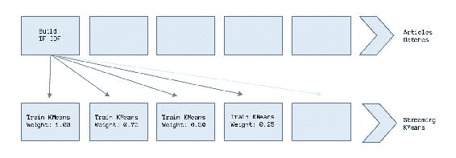
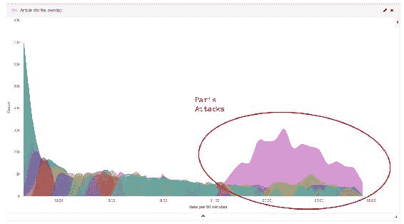
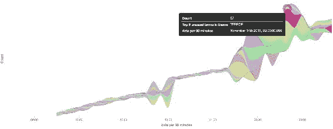
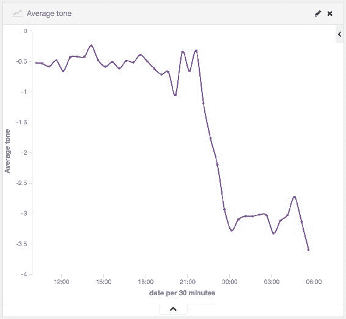
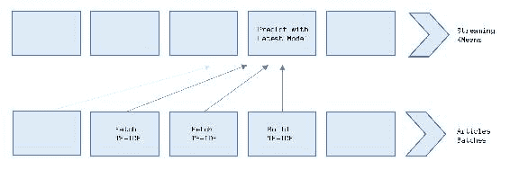

# 第十章。故事重复和突变

万维网有多大？尽管不可能知道确切的大小——更不用说深度和黑暗网络了——但据估计，2008 年它的页面容量超过了 1 万亿页，在数据时代，这在某种程度上是中年时期。差不多十年后，我们可以有把握地假设，互联网的集体大脑比我们塞在耳朵之间的实际灰质有更多的神经元。但是在这些万亿以上的网址中，有多少网页是真正相同的、相似的，或者覆盖了相同的主题？

在这一章中，我们将对 GDELT 数据库进行去重复和索引。然后，我们将随着时间的推移跟踪故事，了解它们之间的联系，它们可能如何变异，以及它们是否可能在不久的将来导致任何后续事件。

我们将涵盖以下主题:

*   理解 *Simhash* 的概念，检测近似重复
*   构建在线重复数据消除应用编程接口
*   使用 TF-IDF 构建向量，并使用*随机索引*降维
*   使用流知识管理器以伪实时方式建立故事连接

# 检测近似重复

虽然这一章是关于将文章分组到故事中，但第一部分是关于检测近似重复。在深入研究重复数据消除算法本身之前，值得在新闻文章的上下文中引入故事和重复数据消除的概念。给定两篇不同的文章——我们所说的不同是指两个不同的网址——我们可以观察到以下场景:

*   第 1 条的 URL 实际上重定向到第 2 条，或者是第 2 条中提供的 URL 的扩展(例如，一些附加的 URL 参数，或者一个缩短的 URL)。两篇内容相同的文章，虽然网址不同，但都被认为是*真副本*。
*   第 1 条和第 2 条涵盖了完全相同的事件，但可能是由两个不同的出版商写的。它们有许多共同的内容，但并不真正相似。基于下文解释的某些规则，它们可能被认为是*的近似副本*。
*   第 1 条和第 2 条涵盖了相同类型的事件。我们观察到风格的主要差异或同一主题的不同*风味*。他们可以归入一个共同的*故事*。
*   第 1 条和第 2 条涵盖了两个不同的事件。两个内容*不同*，不应该归入同一个故事，也不应该认为是近似重复。

脸书用户一定注意到了*相关文章的*功能。当你喜欢一篇新闻文章时——点击一篇文章的链接或播放一篇文章的视频，脸书认为这个链接很有趣，并更新了它的时间线(或不管它叫什么)，以显示更多看起来相似的内容。在*图 1* 中，看到三星 Galaxy Note 7 智能手机冒烟或着火，我真的被逗乐了，因此被禁止乘坐大多数美国航班。脸书自动向我推荐了关于三星惨败的类似文章。可能发生的情况是，通过打开这个链接，我可能已经查询了脸书的内部 API，并要求类似的内容。这里出现了实时查找近似副本的概念，这是我们将在第一部分中尝试构建的内容。


图 1:脸书推荐相关文章

## 散列法的第一步

找到真正的副本很容易。如果两篇文章的内容相同，将被视为完全相同。但是，我们可以比较它们的哈希值，就像比较手写签名一样，而不是比较字符串(字符串可能很大，因此效率不高)；具有相同签名的两条应被视为相同。一个简单的`groupBy`函数将检测字符串数组中的真实重复，如下所示:

```scala
Array("Hello Spark", "Hello Hadoop", "Hello Spark")
  .groupBy(a => Integer.toBinaryString(a.hashCode))
  .foreach(println)

11001100010111100111000111001111 List(Hello Spark, Hello Spark)
10101011110110000110101101110011 List(Hello Hadoop)
```

但是即使是最复杂的散列函数也会导致一些冲突。Java 内置的`hashCode`函数是将一个字符串编码成 32 位整数，这意味着理论上我们*只有*有 2 <sup class="calibre78">32</sup> 的可能得到不同的单词共享相同的哈希值。在实践中，碰撞应该始终小心处理，因为根据*生日悖论*，它们将比每 2 个 <sup class="calibre78">32 个</sup>值出现一次更频繁。为了证明我们的观点，以下示例认为四个不同的字符串是相同的:

```scala
Array("AaAa", "BBBB", "AaBB", "BBAa")
  .groupBy(a => Integer.toBinaryString(a.hashCode))
  .foreach(Sprintln)

11111000000001000000 List(AaAa, BBBB, AaBB, BBAa)
```

此外，有些文章有时可能只有很小一部分文本不同，例如，一则广告、一个额外的页脚或 HTML 代码中的一个额外的位，使得哈希签名不同于几乎相同的内容。事实上，即使是一个单词上的一个小的错别字也会导致完全不同的哈希值，使得两篇几乎重复的文章被认为是完全不同的。

```scala
Array("Hello, Spark", "Hello Spark")
  .groupBy(a => Integer.toBinaryString(a.hashCode))
  .foreach(println)

11100001101000010101000011010111  List(Hello, Spark)
11001100010111100111000111001111  List(Hello Spark)
```

虽然字符串`Hello Spark`和`Hello, Spark`非常接近(它们仅相差 1 个字符)，但它们的哈希值相差 16 位(总共 32 位)。幸运的是，互联网的前辈们可能已经找到了一种使用哈希值检测近似重复的解决方案。

## 站在互联网巨头的肩膀上

不用说，谷歌相当擅长索引网页。有超过一万亿个不同的网址，检测重复是索引网络内容的关键。毫无疑问，互联网巨头多年来一定开发出了解决这一规模问题的技术，因此限制了索引整个互联网所需的计算资源数量。这里描述的其中一种技术叫做 *Simhash* ，它是如此简单和整洁，尽管如此高效，以至于如果你真的想要*掌握数据科学的Spark*，那么它是值得了解的。

### 注

更多关于*辛哈什*的信息可以在[http://www.wwwconference.org/www2007/papers/paper215.pdf](http://www.wwwconference.org/www2007/papers/paper215.pdf)找到。

### Simhashing

**Simhash** 背后的主要思想不是一次计算一个哈希值，而是查看文章内容并计算多个单独的哈希值。对于每个单词、每对单词，甚至每个双字符瓦片区，我们可以使用前面描述的简单的 Java 内置`hashCode`函数轻松计算哈希值。在下面的*图 2* 中，我们报告了包含在字符串 **hello simhash** 中的两个字符集的所有 32 位哈希值(省略了前 20 个零值):


图 2:构建 hello simhash 瓦片区

接下来报告一个简单的 Scala 实现:

```scala
def shingles(content: String) = {
  content.replaceAll("\\s+", "")
    .sliding(2)
    .map(s => s.mkString(""))
    .map(s => (s, s.hashCode)) 
}

implicit class BitOperations(i1: Int) {
  def toHashString: String = {
    String.format(
      "%32s",
      Integer.toBinaryString(i1)
    ).replace(" ", "0")
  }
}

shingles("spark").foreach { case (shingle, hash) =>
  println("[" + shingle + "]\t" + hash.toHashString)
}

[sp]  00000000000000000000111001011101
[pa]  00000000000000000000110111110001
[ar]  00000000000000000000110000110001
[rk]  00000000000000000000111000111001
```

计算完所有这些哈希值后，我们将一个`Simhash`对象初始化为一个零整数。对于 32 位整数中的每一位，我们计算列表中该特定位设置为 1 的哈希值的数量，并减去同一列表中该特定位未设置的值的数量。这给了我们在*图 3* 中报告的数组。最后，任何大于 0 的值都将设置为 1，任何小于或等于 0 的值都将保留为 0。这里唯一棘手的部分是处理移位操作，但是算法本身相当琐碎。请注意，我们在这里使用递归来避免使用可变变量(使用`var`)或列表。


图 3:构建 hello simhash

```scala
implicit class BitOperations(i1: Int) {

  // ../.. 

  def isBitSet(bit: Int): Boolean = {
    ((i1 >> bit) & 1) == 1
  }
}

implicit class Simhash(content: String) {

  def simhash = {
    val aggHash = shingles(content).flatMap{ hash =>
      Range(0, 32).map { bit =>
        (bit, if (hash.isBitSet(bit)) 1 else -1)
      }
    }
    .groupBy(_._1)
    .mapValues(_.map(_._2).sum > 0)
    .toArray

    buildSimhash(0, aggHash)
  }

 private def buildSimhash(
      simhash: Int,
      aggBit: Array[(Int, Boolean)]
     ): Int = {

    if(aggBit.isEmpty) return simhash
    val (bit, isSet) = aggBit.head
    val newSimhash = if(isSet) {
      simhash | (1 << bit)
    } else {
      simhash
    }
    buildSimhash(newSimhash, aggBit.tail)

  }
}

val s = "mastering spark for data science"
println(toHashString(s.simhash))

00000000000000000000110000110001
```

### 海明重量

很容易理解，两篇文章的共同点越多，它们就越会在各自的 Simhash 中共享一个设置为 1 的相同位 *b* 。但是 Simhash 的美妙之处在于这个聚合步骤。我们的语料库中的许多其他单词(因此是其他哈希)可能没有设置这个特定的位 *b* ，因此当观察到一些不同的哈希时，这个值也会降低。共用一套常用词是不够的，同类文章还必须共用同一个词频。以下示例显示了为字符串 **hello simhash** 、**hello minash**和 **hello world** 计算的三个 Simhash 值。


图 4:比较 hello simhash

当 **hello simhash** 和 **hello world** 相差 3 位时， **hello simhash** 和**hello minash**仅相差 **1** 。事实上，我们可以将它们之间的距离表示为它们的异或(**异或**)乘积的汉明权重。**海明权重**是我们需要改变的位数，以便将给定的数字变成零元素。因此，两个数字的**异或**运算的汉明权重是这两个元素之间不同的位数，在这种情况下为 **1** 。


图 hello simhash 的汉明权重

我们只需使用 Java 的`bitCount`函数，该函数返回指定整数值的二进制补码二进制表示中的一位数。

```scala
implicit class BitOperations(i1: Int) {

  // ../..

  def distance(i2: Int) = {
    Integer.bitCount(i1 ^ i2) 
  }
}

val s1 = "hello simhash"
val s2 = "hello minhash"
val dist = s1.simhash.distance(s2.simhash)
```

我们已经能够成功地构建 Simhash 并执行一些简单的成对比较。下一步是扩大规模，开始从 GDELT 数据库中检测实际的副本。

## 检测 GDELT 中的近似重复

我们在[第二章](02.html "Chapter 2. Data Acquisition")、*数据采集*中深入讲述了数据采集过程。对于这个用例，我们将在*图 6* 中使用一个 NiFi 流，该流监听 GDELT 主 URL，获取并解压缩最新的 GKG 档案，并将该文件以压缩格式存储在 HDFS。


图 6:下载 GKG 数据

我们首先使用我们之前创建的解析器集合解析我们的 GKG 记录(在我们的 GitHub repo 中提供)，提取所有不同的 URL，并使用在[第 6 章](06.html "Chapter 6. Scraping Link-Based External Data") *中介绍的 Goose 提取器提取 HTML 内容，抓取基于链接的外部数据*。

```scala
val gdeltInputDir = args.head
val gkgRDD = sc.textFile(gdeltInputDir)
  .map(GKGParser.toJsonGKGV2)
  .map(GKGParser.toCaseClass2)

val urlRDD = gkgRDD.map(g => g.documentId.getOrElse("NA"))
  .filter(url => Try(new URL(url)).isSuccess)
  .distinct()
  .repartition(partitions)

val contentRDD = urlRDD mapPartitions { it =>
  val html = new HtmlFetcher()
  it map html.fetch
}
```

因为`hashcode`函数区分大小写*(Spark*和*Spark*导致哈希值完全不同)，强烈建议在使用`simhash`函数之前清理我们的文本。类似于[第 9 章](09.html "Chapter 9.  News Dictionary and Real-Time Tagging System") *、新闻词典和实时标注系统*中的描述，我们首先使用以下 Lucene 分析器来词干:

```scala
<dependency>
  <groupId>org.apache.lucene</groupId>
  <artifactId>lucene-analyzers-common</artifactId>
  <version>4.10.1</version>
</dependency>
```

您可能已经注意到，我们在一个隐式类中编写了 Simhash 算法；我们可以使用下面的 import 语句直接在字符串上应用我们的`simhash`函数。在开发的早期阶段付出一点额外的努力总是有回报的。

```scala
import io.gzet.story.simhash.SimhashUtils._
val simhashRDD = corpusRDD.mapValues(_.simhash)
```

我们现在有了一个内容 RDD(`Content`是一个包装文章 URL、标题和正文的案例类)以及它的 Simhash 值和一个我们稍后可能会用到的唯一标识符。让我们首先尝试验证我们的算法，找到我们的第一个副本。从现在开始，我们只将 32 位 Simhash 值相差不超过 2 位的文章视为重复。

```scala
hamming match {
  case 0 => // identical articles - true-duplicate
  case 1 => // near-duplicate (mainly typo errors)
  case 2 => // near-duplicate (minor difference in style)
  case _ => // different articles
}
```

但是这里有一个可伸缩性的挑战:我们当然不希望执行笛卡尔乘积来比较来自我们的辛哈什 RDD 的成对文章。相反，我们希望利用 MapReduce 范例(使用`groupByKey`函数)，并且只对重复的文章进行分组。我们的方法遵循*扩展和征服*模式，首先扩展我们的初始数据集，利用 Spark shuffle，然后在执行器级别本地解决我们的问题。由于我们只需要处理 1 位差异(然后我们将对 2 位应用相同的逻辑)，因此我们的策略是扩展我们的 RDD，以便对于每个 Simhash `s`，我们使用相同的 1 位掩码输出所有其他 31 个 1 位组合的**。**

```scala
def oneBitMasks: Set[Int] = {
  (0 to 31).map(offset => 1 << offset).toSet
}

00000000000000000000000000000001
00000000000000000000000000000010
00000000000000000000000000000100
00000000000000000000000000001000
...
```

取一个辛杂凑值`s`，我们使用每个前面的掩码和辛杂凑值`s`之间的异或来输出**的可能的 1 位组合。**

```scala
val s = 23423
oneBitMasks foreach { mask =>
  println((mask ^ s).toHashString)
}

00000000000000000101101101111111
00000000000000000101101101111110
00000000000000000101101101111101
00000000000000000101101101111011
...
```

处理 2 位并没有什么不同，尽管在可伸缩性方面有点激进(我们现在有 496 种可能的组合可以输出，这意味着 32 位中的任何 2 位组合)。

```scala
def twoBitsMasks: Set[Int] = {
  val masks = oneBitMasks
  masks flatMap { e1 =>
    masks.filter( e2 => e1 != e2) map { e2 =>
      e1 | e2
    }
  }
}

00000000000000000000000000000011
00000000000000000000000000000101
00000000000000000000000000000110
00000000000000000000000000001001
...
```

最后，我们构建要应用的掩码集(注意，我们还希望通过应用 0 位差异掩码来输出原始的 Simhash)，以便检测重复项，如下所示:

```scala
val searchmasks = twoBitsMasks ++ oneBitMasks ++ Set(0) 

```

这也有助于我们相应地扩展我们的初始 RDD。这无疑是一个昂贵的操作，因为它将 RDD 的大小增加了一个常数因子(496 + 32 + 1 个可能的组合)，但在时间复杂度方面保持线性，而笛卡尔连接是一个二次操作- *O(n <sup class="calibre78">2</sup> )。*

```scala
val duplicateTupleRDD = simhashRDD.flatMap {
  case ((id, _), simhash) =>
    searchmasks.map { mask =>
      (simhash ^ mask, id)
    }
}
.groupByKey()
```

我们发现文章 A 是文章 B 的复件，文章 B 是文章 c 的复件，这是一个简单的图问题，可以通过 *GraphX* 使用连通分量算法轻松解决。

```scala
val edgeRDD = duplicateTupleRDD
  .values
  .flatMap { it =>
    val list = it.toList
    for (x <- list; y <- list) yield (x, y)
  }
  .filter { case (x, y) =>
    x != y
  }
  .distinct()
  .map {case (x, y) =>
    Edge(x, y, 0)
  }

val duplicateRDD = Graph.fromEdges(edgeRDD, 0L)
  .connectedComponents()
  .vertices
  .join(simhashRDD.keys)
  .values
```

在用于该测试的 15000 篇文章中，我们提取了大约 3000 个不同的故事。我们在*图 7* 中报告了一个例子，其中包括我们能够检测到的两篇接近重复的文章，这两篇文章高度相似，但并不完全相同。


图 7:来自 GDELT 数据库的 Galaxy Note 7 惨败

## 对 GDELT 数据库进行索引

下一步是开始构建我们的在线应用编程接口，这样任何用户都可以实时检测几乎重复的事件，就像脸书在用户的时间线上所做的那样。我们在这里使用*玩法框架*，但是我们将保持简短的描述，因为这已经在[第 8 章](08.html "Chapter 8. Building a Recommendation System")、*构建推荐系统*中介绍过了。

### 坚持我们的 rdd

首先，我们需要从我们的 RDD 中提取数据，并将其保存在可靠、可扩展且高效的地方，以便通过关键字进行搜索。由于该数据库的主要目的是检索给定特定关键字(关键字是 Simhash)的文章，因此**Cassandra**(maven dependency 如下)听起来非常适合这项工作。

```scala
<dependency>
  <groupId>com.datastax.spark</groupId>
  <artifactId>spark-cassandra-connector_2.11</artifactId>
</dependency>
```

我们的数据模型相当简单，由一个简单的表组成:

```scala
CREATE TABLE gzet.articles (
  simhash int PRIMARY KEY,
  url text,
  title text,
  body text
);
```

将我们的 RDD 存储到 Cassandra 中最简单的方法是将我们的结果包装在一个 case 类对象中，该对象与我们之前的表定义相匹配，并调用`saveToCassandra`函数:

```scala
import com.datastax.spark.connector._

corpusRDD.map { case (content, simhash) =>
  Article(
    simhash,
    content.body,
    content.title,
    content.url
  )
}
.saveToCassandra(cassandraKeyspace, cassandraTable)
```

### 构建 REST 应用编程接口

下一步是对应用编程接口本身进行操作。我们创建一个新的 maven 模块(打包为`play2`)并导入以下依赖项:

```scala
<packaging>play2</packaging>

<dependencies>
  <dependency>
    <groupId>com.typesafe.play</groupId>
    <artifactId>play_2.11</artifactId>
  </dependency>
  <dependency>
    <groupId>com.datastax.cassandra</groupId>
    <artifactId>cassandra-driver-core</artifactId>
  </dependency>
</dependencies>
```

我们首先创建一个新的**数据访问层**，给定一个输入 Simhash，构建前面讨论的所有可能的 1 位和 2 位掩码的列表，并从 Cassandra 提取所有匹配的记录:

```scala
class CassandraDao() {

  private val session = Cluster.builder()
                               .addContactPoint(cassandraHost)
                               .withPort(cassandraPort)
                               .build()
                               .connect()

  def findDuplicates(hash: Int): List[Article] = {
    searchmasks.map { mask =>
      val searchHash = mask ^ hash
      val stmt = s"SELECT simhash, url, title, body FROM gzet.articles WHERE simhash = $searchHash;"
      val results = session.execute(stmt).all()
      results.map { row =>
        Article(
           row.getInt("simhash"),
           row.getString("body"),
           row.getString("title"),
           row.getString("url")
        )
      }
      .head
    }
    .toList
  }
}
```

在我们的**控制器**中，给定一个输入 URL，我们提取 HTML 内容，对文本进行标记化，构建一个 Simhash 值，并调用我们的服务层最终以 JSON 格式返回我们的匹配记录。

```scala
object Simhash extends Controller {

  val dao = new CassandraDao()
  val goose = new HtmlFetcher()

  def detect = Action { implicit request =>
    val url = request.getQueryString("url").getOrElse("NA")
    val article = goose.fetch(url)
    val hash = Tokenizer.lucene(article.body).simhash
    val related = dao.findDuplicates(hash)
    Ok(
        Json.toJson(
          Duplicate(
            hash,
            article.body,
            article.title,
            url,
            related
          )
       )
    )
  }
}
```

以下`play2`路由将把任何 GET 请求重定向到我们前面看到的`detect`方法:

```scala
GET /simhash io.gzet.story.web.controllers.Simhash.detect 

```

最后，我们的 API 可以如下启动并向最终用户公开:

```scala
curl -XGET 'localhost:9000/simhash?url= http://www.detroitnews.com/story/tech/2016/10/12/samsung-damage/91948802/'

{
  "simhash": 1822083259,
  "body": "Seoul, South Korea - The fiasco of Samsung's [...]
  "title": "Fiasco leaves Samsung's smartphone brand [...]",
  "url": "http://www.detroitnews.com/story/tech/2016/[...]",
  "related": [
    {
      "hash": 1821919419,
      "body": "SEOUL, South Korea - The fiasco of [...]
      "title": "Note 7 fiasco leaves Samsung's [...]",
      "url": "http://www.chron.com/business/technology/[...]"
    },
    {
      "hash": -325433157,
      "body": "The fiasco of Samsung's fire-prone [...]
      "title": "Samsung's Smartphone Brand [...]",
      "url": "http://www.toptechnews.com/[...]"
    }
  ]
}
```

恭喜你！你现在已经建立了一个在线应用编程接口，可以用来检测类似的重复，如围绕银河笔记 7 惨败；但是与脸书的空气污染指数相比，我们的空气污染指数有多准确呢？这肯定足够准确，可以通过将高度相似的事件分组到故事中来开始去噪 GDELT 数据。

### 改进领域

虽然我们已经对我们的 API 返回的结果的整体质量感到满意，但这里我们讨论新闻文章上下文中的一个主要改进。事实上，文章不仅仅是由不同的单词组成的，而是遵循一个清晰的结构，在这个结构中，顺序才是真正重要的。事实上，标题总是妙语连珠，主要内容仅在前几行就涵盖得很好。文章的其余部分确实很重要，但可能不如引言重要。给定这个假设，我们可以稍微修改我们的 Simhash 算法，通过给每个单词赋予不同的权重来考虑顺序。

```scala
implicit class Simhash(content: String) {

  // ../..

  def weightedSimhash = {

    val features = shingles(content)
    val totalWords = features.length
    val aggHashWeight = features.zipWithIndex
      .map {case (hash, id) =>
        (hash, 1.0 - id / totalWords.toDouble)
      }
      .flatMap { case (hash, weight) =>
        Range(0, 32).map { bit =>
          (bit, if(hash.isBitSet(bit)) weight else -weight)
        }
      }
      .groupBy(_._1)
      .mapValues(_.map(_._2).sum > 0)
      .toArray

    buildSimhash(0, aggHashWeight)
  }

}
```

无论是否设置了相同的位值，我们都不会添加 1 或-1，而是根据该单词在文章中的位置添加相应的权重。类似的文章要有相同的词，相同的词频，还要有相似的结构。换句话说，与每篇文章的真正底线相比，我们对文本前几行中出现的任何差异都不太宽容。

# 建筑故事

*Simhash* 应该只用于检测近似重复的文章。将我们的搜索扩展到 3 位或 4 位差异会变得非常低效(3 位差异需要对 Cassandra 进行 5，488 次不同的查询，而检测多达 4 位差异将需要 41，448 次查询)，并且似乎比相关文章带来更多的噪音。如果用户想要构建更大的故事，那么必须应用典型的聚类技术。

## 建立术语频率向量

我们将开始使用 KMeans 算法将事件分组到故事中，将文章的词频作为输入向量。TF-IDF 简单、高效，是从文本内容构建矢量的成熟技术。基本思想是计算词频，我们使用数据集上的反向文档频率对词频进行归一化，从而降低常用词(如停止词)的权重，同时增加特定于文档定义的词的权重。它的实现是 MapReduce 处理基础的一部分，即*字数*算法。我们首先计算每个文档中每个单词的词频 RDD。

```scala
val tfRDD = documentRDD.flatMap { case (docId, body) =>
  body.split("\\s").map { word =>
    ((docId, word), 1)
  }
}
.reduceByKey(_+_)
.map { case ((docId, word), tf) =>
  (docId, (word, tf))
}
```

IDF 是文档总数除以包含字母 *w* 的文档数的对数值:


```scala
val n = sc.broadcast(documentRDD.count())
val dfMap = sc.broadcast(
  tfRDD.map { case (docId, (word, _)) =>
    (docId, word)
  }
  .distinct()
  .values
  .map { word =>
    (word, 1)
  }
  .reduceByKey(_+_)
  .collectAsMap()
)

val tfIdfRDD = tfRDD.mapValues { case (word, tf) =>
  val df = dfMap.value.get(word).get
  val idf = math.log((n.value + 1) / (df + 1))
  (word, tf * idf)
}
```

由于我们的输出向量是由单词组成的，我们需要为语料库中的每个单词分配一个序列标识。我们这里可能有两种解决方案。要么我们构建字典并为每个单词分配一个标识，要么使用哈希函数将不同的单词分组到同一个桶中。前者是理想的，但是会产生大约一百万个特征长的向量(和我们拥有的唯一单词一样多的特征)，而后者要小得多(和用户指定的一样多的特征)，但是可能会由于散列冲突而导致不希望的效果(特征越少，冲突越多)。

```scala
val numFeatures = 256

val vectorRDD = tfIdfRDD.mapValues { case (word, tfIdf) =>
  val rawMod = word.hashCode % numFeatures
  rawMod + (if (rawMod < 0) numFeatures else 0)
  (word.hashCode / numFeatures, tfIdf)
}
.groupByKey()
.values
.map { it =>
  Vectors.sparse(numFeatures, it.toSeq)
}
```

虽然我们详细描述了 TF-IDF 技术，但是由于 MLlib 实用程序，这种散列 TF 只需几行就可以完成，我们将在下面看到。我们构建了由 256 个大向量组成的 RDD，这些向量(技术上)可以在 KMeans 集群中使用，但是，由于我们刚才解释的哈希属性，我们会遇到戏剧性的哈希冲突。

```scala
val tfModel = new HashingTF(1 << 20)
val tfRDD = documentRDD.values.map { body =>
  tfModel.transform(body.split("\\s"))
}

val idfModel = new IDF().fit(tfRDD)
val tfIdfRDD = idfModel.transform(tfRDD)
val normalizer = new Normalizer()
val sparseVectorRDD = tfIdfRDD map normalizer.transform
```

## 维度的诅咒，数据科学的瘟疫

将我们的特征尺寸从 256 增加到比如 2 <sup class="calibre78">20</sup> 会强烈限制碰撞的次数，但这是有代价的，我们的数据点现在被嵌入到一个高度维度的空间中。

这里我们描述一个聪明的方法来克服*维度的诅咒*([http://www . stat . UCLA . edu/~ Saba tti/statar ray/textr/node 5 . html](http://www.stat.ucla.edu/~sabatti/statarray/textr/node5.html))而无需深入研究围绕矩阵计算的模糊数学理论(如奇异值分解)，也无需计算密集型运算。这种方法被称为*随机索引*，类似于前面描述的*辛哈希*概念。

### 注

更多关于随机索引的信息可以在[http://eprints.sics.se/221/1/RI_intro.pdf](http://eprints.sics.se/221/1/RI_intro.pdf)找到。

其思想是为每个不同的特征(这里是一个单词)生成一个稀疏的、随机生成的唯一表示，由+1、-1 和主要是 0 组成。然后，每当我们在上下文(文档)中遇到一个单词时，我们将这个单词的签名添加到上下文向量中。文档向量是每个单词向量的和，如下图 8 所示(或者在我们的例子中是每个 TF-IDF 向量的和):


图 8:构建随机索引向量

我们邀请纯粹的数学极客读者来深入研究一下*Johnson-linden Strauss*([http://ttic . uchicago . edu/~ Gregory/courses/large scale learning/讲座/jl.pdf](http://ttic.uchicago.edu/~gregory/courses/LargeScaleLearning/lectures/jl.pdf) )引理，该引理基本上陈述了*“如果我们将向量空间中的点投影到足够高维度的随机选择的子空间中，则点之间的距离被近似保留”*。虽然*随机索引*技术本身可以实现(付出了相当大的努力)，但是*约翰逊-林登施特劳斯*引理非常有用，但是要掌握起来要困难得多。幸运的是，一个实现是来自 *Derrick Burns* 的优秀 spark-package *广义-kmeans-clustering*([https://github . com/derickburns/广义-kmeans-clustering](https://github.com/derrickburns/generalized-kmeans-clustering) )的一部分。

```scala
val embedding = Embedding(Embedding.MEDIUM_DIMENSIONAL_RI)
val denseVectorRDD = sparseVectorRDD map embedding.embed
denseVectorRDD.cache()
```

我们最终能够将我们的 2 <sup class="calibre78">20</sup> 大向量投影到*只有* 256 个维度。至少可以说，这项技术带来了巨大的好处。

*   我们有固定数量的功能。如果我们将来遇到一个不属于我们最初字典的新单词，我们的向量永远不会变大。这在流环境中特别有用。
*   我们的输入特征集非常大(2 <sup class="calibre78">20</sup> )。尽管碰撞仍会发生，但风险已经降低。
*   由于约翰逊-林登施特劳斯引理，距离得以保留。
*   我们的输出向量相对较小(256)。我们克服了维度的诅咒。

当我们将向量 RDD 缓存到内存中时，我们现在可以看到 KMeans 集群本身。

## 优化知识产权

我们假设我们的读者已经熟悉了 KMeans 聚类，因为该算法可能是最著名和最广泛使用的无监督聚类算法。任何试图在这里做另一种解释的尝试，都不如你在半个多世纪的积极研究之后，在那里能够找到的许多资源好。

我们之前基于文章的内容创建了我们的向量。下一步是开始根据文章的相似性将文章分组为故事。在 KMeans 的 Spark 实现中，只支持*欧氏距离*度量。有人会说*余弦距离*更适合文本分析，但我们假设前者足够精确，因为我们不想为该练习重新打包 MLlib 分布。关于使用余弦距离进行文本分析的更多说明，请参考[http://www . CSE . MSU . edu/~ pramanik/research/papers/2003 papers/sac 04 . pdf](http://www.cse.msu.edu/~pramanik/research/papers/2003Papers/sac04.pdf)。我们在下面的代码中报告了可以应用于任何双数组(密集向量后面的逻辑数据结构)的欧几里德和余弦函数:

```scala
def euclidean(xs: Array[Double], ys: Array[Double]) = {
  require(xs.length == ys.length)
  math.sqrt((xs zip ys)
    .map { case (x, y) =>
      math.pow(y - x, 2)
    }
    .sum
  )
}

def cosine(xs: Array[Double], ys: Array[Double]) = {

  require(xs.length == ys.length)
  val magX = math.sqrt(xs.map(i => i * i).sum)
  val magY = math.sqrt(ys.map(i => i * i).sum)
  val dotP = (xs zip ys).map { case (x, y) =>
    x * y
  }.sum

  dotP / (magX * magY)
}
```

使用 MLlib 包训练一个新的 KMeans 集群相当简单。我们指定了一个 0.01 的阈值，在此阈值之后，我们认为我们的集群中心收敛，并将最大迭代次数设置为 1，000。

```scala
val model: KMeansModel = new KMeans()
  .setEpsilon(0.01)
  .setK(numberOfClusters)
  .setMaxIterations(1000)
  .run(denseVectorRDD)
```

但是在我们的特定用例中，正确的集群数量是多少呢？每 1500 万批次有 500 到 1000 篇不同的文章，我们能构建多少故事？正确的问题是，*我们认为在 1500 万个批处理窗口中发生了多少真实事件？*事实上，为新闻文章优化 KMeans 与其他任何用例都没有区别；这是通过优化其相关成本来实现的，成本是从点到其各自质心的平方距离 ( **SSE** )的总和**。**

```scala
val wsse = model.computeCost(denseVectorRDD) 

```

*k* 等于文章数，关联成本为 0(每篇文章都是自己簇的中心)。同样，当 *k* 等于 1 时，成本将最大。因此， *k* 的最佳值是最小可能值，在此值之后，添加新集群不会带来相关成本的任何收益，通常表示为下图所示的上证综指曲线中的一个弯头。

使用我们到目前为止收集的所有 15，000 篇文章，最佳集群数量在这里并不明显，但可能在 300 个左右。


图 9:使用成本函数的肘方法

一个经验法则是使用 *k* 作为 *n* 的函数(文章数量)。超过 15，000 篇文章，遵循这个规则将返回 *k*  100 篇。


我们使用值 100，开始预测每个数据点的聚类。

```scala
val clusterTitleRDD = articleRDD
  .zip(denseVectorRDD)
  .map { case ((id, article), vector) =>
    (model.predict(vector), article.title)
  }
```

虽然这可以大大改进，但我们确认许多看起来相似的文章都被归入了相同的故事中。我们在此报告一些属于同一集群的三星相关文章:

*   *三星能从泰诺、美泰、捷蓝学到什么...*
*   *华为 Mate 9 似乎是三星 Galaxy Note 7 克隆版...*
*   *鉴于 Note 7 的惨败，三星可能准备...*
*   *三星股价的螺旋上升吸引了投资者押注...*
*   *Note 7 惨败留给三星智能手机品牌...*
*   *三星智能手机品牌在 Note 7 惨败中遭受重创...*
*   *Note 7 惨败让三星的智能手机品牌受到质疑...*
*   *Note 7 惨败让三星的智能手机品牌受到质疑...*
*   *三星智能手机品牌在 Note 7 惨败中遭受重创...*
*   *惨败让三星的智能手机品牌受到质疑...*

当然，这些类似的文章没有资格进行 Simhash 查找，因为它们的差异超过了 1 位或 2 位。聚类技术可用于将相似(但不重复)的文章分组到更广泛的故事中。值得一提的是，优化 KMeans 是一项繁琐的任务，需要多次迭代和彻底的分析。然而，这不是本文的范围，因为我们将实时关注更大的集群和更小的数据集。

# 故事突变

我们现在有足够的材料进入主题的核心。我们能够检测到几乎重复的事件，并在一个故事中对相似的文章进行分组。在这一部分中，我们将实时工作(在 Spark Streaming 上下文中)，收听新闻文章，将它们分组为故事，但也要了解这些故事如何随着时间的推移而变化。我们理解故事的数量是不确定的，因为我们事先不知道未来几天可能会发生什么。由于为每个批处理间隔优化 KMeans(GDELT 中为 15 mn)并不理想，也不高效，我们决定不将此约束作为限制因素，而是将其真正作为检测突发新闻文章的优势。

## 平衡状态

如果我们要把世界新闻文章分成 10 或 15 个簇，并固定这个数字不随时间变化，那么训练一个 KMeans 簇应该可以把相似的(但不一定是重复的)文章组合成通用的故事。为方便起见，我们给出以下定义:

*   一篇**文章**是在时间 T 报道特定事件的新闻文章
*   一个**故事**是一组类似的文章，在时间 T 报道一个事件
*   A **话题**是一组类似的故事，涵盖了 P 期内的不同事件
*   一部**史诗**是一组类似的故事，涵盖了 P 时期的同一事件

我们假设在没有任何重大新闻事件的一段时间后，任何故事都将被分成不同的*主题*(每个主题涵盖一个或几个主题)。例如，任何关于政治的文章——无论政治事件的性质如何——都可以归入政治范畴。这就是我们所说的*平衡状态*，世界被平均分为 15 个截然不同且清晰的类别(战争、政治、金融、技术、教育等等)。

但是如果一个重大事件刚刚突破会发生什么呢？一个事件可能变得如此重要，以至于随着时间的推移，(因为集群的数量是固定的)它可能会掩盖最不重要的*话题*，并成为其自身*话题*的一部分。与限制在 3000 万窗口的英国广播公司广播类似，一些小活动，如惠特斯特布尔的*牡蛎节*可能会被跳过，转而举办一个大型国际活动(令牡蛎爱好者非常沮丧)。这个主题不再是通用的，而是与一个特定的事件相关联。我们称这个话题为*史诗*。举个例子，通用*话题*【恐怖主义、战争、暴力】在去年 11 月一次重大恐怖袭击爆发时成为史诗[ **巴黎袭击**；被认为是关于暴力和恐怖主义的广泛讨论，变成了一个专门报道巴黎事件的分支。

现在想象一部*史诗*不断变大；当第一批关于“T2”巴黎袭击的文章报道事实时，几个小时后，整个世界都在向恐怖主义致敬并予以谴责。与此同时，法国和比利时警方领导了调查，以追踪和摧毁恐怖主义网络。这两个故事都被大量报道，因此成为同一部*史诗*的两个不同版本。以下*图 10* 中报告了分支的概念:


图 10:故事突变分支的概念

当然，有些史诗会比其他史诗持续更长时间，但当它们消失时——如果它们消失了——它们的分支可能会被回收，以覆盖新的突破性文章(记住固定数量的集群)，或者被重新用于将一般故事分组回它们的一般主题。在某个时间点，我们最终会达到一个新的平衡状态，在这个状态下，世界在 15 个不同的主题中再次完美契合。然而，我们假设一个新的均衡可能不是前一个均衡的完美克隆，因为这个扰动可能以某种方式雕刻和重新塑造了世界。举个具体的例子，我们今天还是提到 9/11 相关的文章；2001 年发生在纽约的世贸中心袭击事件仍在为【暴力、战争和恐怖主义】*话题*的定义做出贡献。

## 追踪一段时间内的故事

虽然前面的描述比任何东西都更具概念性，并且可能值得一个应用于地理政治的数据科学博士的主题，但我们想进一步挖掘这个想法，看看流知识管理是如何成为该用例的一个神奇工具的。

### 构建流式应用

第一件事是实时获取我们的数据，因此修改我们现有的 NiFi 流，将我们下载的存档分支到 Spark Streaming 上下文。人们可以简单地将文件的内容发送到一个开放的套接字，但是我们希望这个过程具有弹性和容错性。默认情况下，NiFi 带有输出端口的概念，它提供了一种使用*站点到站点*将数据传输到远程实例的机制。在这种情况下，端口像队列一样工作，希望在传输过程中不会丢失任何数据。我们通过分配端口号在`nifi.properties`文件中启用该功能。

```scala
nifi.remote.input.socket.port=8055 

```

我们在画布上创建了一个名为[ `Send_To_Spark` ]的端口，每条记录(也就是`SplitText`处理器)都将被发送给它，就像我们在卡夫卡主题上所做的那样。


图 11:向Spark流发送 GKG 记录

### 类型

虽然我们正在设计一个流式应用，但我们建议始终将数据的不可变副本保存在弹性数据存储中(这里是 HDFS)。在我们之前的 NiFi 流中，我们没有修改现有的流程，而是将其分叉，以便也将记录发送到我们的 Spark Streaming。当/如果我们需要重放数据集的一部分时，这将特别有用。

在 Spark 方面，我们需要构建一个 Nifi 接收器。这可以通过使用以下 maven 依赖项来实现:

```scala
<dependency>
  <groupId>org.apache.nifi</groupId>
  <artifactId>nifi-spark-receiver</artifactId>
  <version>0.6.1</version>
</dependency>
```

我们定义了 NiFi 端点以及前面分配的端口名[ `Send_To_Spark` ]。我们的数据流将作为数据包流接收，可以使用`getContent`方法轻松转换为字符串。

```scala
def readFromNifi(ssc: StreamingContext): DStream[String] = {

  val nifiConf = new SiteToSiteClient.Builder()
    .url("http://localhost:8090/nifi")
    .portName("Send_To_Spark")
    .buildConfig()

  val receiver = new NiFiReceiver(nifiConf, StorageLevel.MEMORY_ONLY)
  ssc.receiverStream(receiver) map {packet =>
    new String(packet.getContent, StandardCharsets.UTF_8)
  }
}
```

我们开始我们的流媒体环境，每隔 1500 万秒收听新的 GDELT 数据。

```scala
val ssc = new StreamingContext(sc, Minutes(15)) 
val gdeltStream: DStream[String] = readFromNifi(ssc) 
val gkgStream = parseGkg(gdeltStream) 

```

下一步是下载每篇文章的 HTML 内容。这里棘手的部分是只为不同的网址下载文章。由于`DStream`上没有内置的`distinct`操作，我们需要使用`transform`操作来访问底层的 RDDs，在此基础上我们传递一个`extractUrlsFromRDD`函数:

```scala
val extractUrlsFromRDD = (rdd: RDD[GkgEntity2]) => {
  rdd.map { gdelt =>
    gdelt.documentId.getOrElse("NA")
  }
  .distinct()
}
val urlStream = gkgStream.transform(extractUrlsFromRDD)
val contentStream = fetchHtml(urlStream)
```

类似地，构建向量需要访问底层关系数据库，因为我们需要计算整个批次的文档频率(用于 TF-IDF)。这也是在`transform`功能中完成的。

```scala
val buildVectors = (rdd: RDD[Content]) => {

  val corpusRDD = rdd.map(c => (c, Tokenizer.stem(c.body)))

  val tfModel = new HashingTF(1 << 20)
  val tfRDD = corpusRDD mapValues tfModel.transform

  val idfModel = new IDF() fit tfRDD.values
  val idfRDD = tfRDD mapValues idfModel.transform

  val normalizer = new Normalizer()
  val sparseRDD = idfRDD mapValues normalizer.transform

  val embedding = Embedding(Embedding.MEDIUM_DIMENSIONAL_RI)
  val denseRDD = sparseRDD mapValues embedding.embed

  denseRDD
}

val vectorStream = contentStream transform buildVectors
```

### 流式 KMeans

我们的用例完全符合流知识管理算法。流知识管理的概念与经典的知识管理没有区别，只是它适用于动态数据，因此需要不断地重新训练和更新。

在每一批中，我们为每个新的数据点找到最近的中心，对新的集群中心进行平均，并更新我们的模型。当我们跟踪真正的集群并适应伪实时的变化时，跨不同批次跟踪相同的主题将变得特别容易。

流媒体的第二个重要特征是健忘。这确保了在时间 t 接收到的新数据点将比过去历史上的任何其他点对我们的集群的定义做出更大的贡献，因此允许我们的集群中心随着时间平滑地漂移(故事将会突变)。这是由衰减因子及其半衰期参数(以批次数或点数表示)控制的，半衰期参数指定了给定点仅贡献其原始重量一半的时间。

*   有了无限衰减因子，所有的历史都将被考虑在内，我们的集群中心将慢慢漂移，如果一个重大新闻事件刚刚爆发，我们将不会有任何反应
*   有了一个小的衰变因子，我们的星系团对任何一点都将过于活跃，并可能在观察到新事件的任何时候发生剧烈变化

流式 KMeans 的第三个也是最重要的特性是检测和回收即将死亡的集群的能力。当我们观察到输入数据的剧烈变化时，一个聚类可能会远离任何已知的数据点。流式 KMeans 将消除这个垂死的集群，并将最大的集群一分为二。这完全符合我们的故事分支概念，即多个故事可能共享一个共同的祖先。

这里我们使用两个批次的半衰期参数。由于我们每隔 15 mn 获得新数据，任何新数据点都将保持*活动状态*仅 1 小时。*图 12* 中报告了培训流媒体工具的过程:



图 12:训练一个流 KMeans

我们创建了一个新的流 KMeans，如下所示。因为我们还没有观察到任何数据点，所以我们用 256 个大向量(我们的 TF-IDF 向量的大小)的 15 个随机中心初始化它，并使用`trainOn`方法实时训练它:

```scala
val model = new StreamingKMeans()
  .setK(15)
  .setRandomCenters(256, 0.0)
  .setHalfLife(2, "batches")

model.trainOn(vectorStream.map(_._2))
```

最后，我们预测任何新数据点的聚类:

```scala
val storyStream = model predictOnValues vectorStream  

```

然后，我们使用以下属性(通过一系列连接操作访问)将结果保存到弹性搜索集群中。我们在这里不报告如何将 RDD 坚持到弹性搜索，因为我们相信这已经在前面的章节中深入讨论过了。请注意，我们还保存了向量本身，因为我们可能会在以后的过程中再次使用它。

```scala
Map(
  "uuid" -> gkg.gkgId,
  "topic" -> clusterId,
  "batch" -> batchId,
  "simhash" -> content.body.simhash, 
  "date" -> gkg.date,
  "url" -> content.url,
  "title" -> content.title,
  "body" -> content.body,
  "tone" -> gkg.tones.get.averageTone,
  "country" -> gkg.v2Locations,
  "theme" -> gkg.v2Themes,
  "person" -> gkg.v2Persons,
  "organization" -> gkg.v2Organizations,
  "vector" -> v.toArray.mkString(",")
)
```

### 可视化

当我们在 Elasticsearch 上存储我们的文章以及它们各自的故事和*主题*时，我们可以使用关键词搜索(当文章被完全分析和索引时)或者针对特定的人、主题、组织等浏览任何事件。我们在故事的基础上构建可视化，并试图在基巴纳仪表板上检测它们的潜在漂移。11 月 13 日<sup class="calibre78">第</sup>期(35，000 篇文章已编入索引)，不同时间的不同集群标识(我们不同的*主题*)在以下*图 13* 中报告:



图 13:基巴纳对巴黎袭击的可视化

结果很有希望。11 月 13 日晚上 9:30 左右，也就是第一次袭击开始后的几分钟，我们就能探测到巴黎袭击。我们还确认了我们的聚类算法的相对良好的一致性，因为特定的聚类仅由从晚上 9:30 到凌晨 3:00 与**巴黎攻击**相关的事件组成(5000 篇文章)

但我们可能想知道，在第一次袭击发生之前，这个特殊的集群是关于什么的。由于我们将所有文章与它们的聚类标识和 GKG 属性一起编入索引，我们可以很容易地在时间上向后跟踪一个故事，并检测其突变。原来这个特殊的*话题*主要涵盖了与【MAN_MADE_DISASTER】主题相关的事件(以及其他)，直到晚上 9 点到 10 点才变成**巴黎袭击** *史诗*，主题围绕【恐怖】、【紧急状态】、【TAX _ nogence _ FRENCH】、【杀戮】和【撤离】。



图 14:巴黎攻击集群的基巴纳流图

不用说，我们从 GDELT 获得的 1500 万平均音调在晚上 9 点后急剧下降，因为那个特殊的*话题*:



图 15:基巴纳平均音调-巴黎攻击集群

使用这三个简单的可视化，我们证明了我们可以随着时间的推移跟踪一个故事，并研究它在体裁、关键词、人物或组织(基本上是我们可以从 GDELT 中提取的任何实体)方面的潜在突变。但是我们也可以从 GKG 记录中查看地理位置；有了足够的文章，我们就有可能在地图上伪实时追踪巴黎和布鲁塞尔之间的恐怖分子追捕行动！

虽然我们发现了一个特定于巴黎袭击的主要集群，并且这个特定集群是第一个涵盖这一系列事件的集群，但这可能不是唯一的一个。根据流媒体早期的定义，这个*话题*变得如此之大，以至于它肯定引发了一场或几场后续的*史诗*。我们在下面的*图 16* 中报告了与*图 13* 相同的结果，但是这次过滤掉了任何与关键字 *Paris* 匹配的文章:


图 16:基巴纳巴黎袭击多个史诗

似乎在午夜前后，这部*史诗*引发了同一事件的多个版本(至少三个主要版本)。在攻击后一小时(1 小时是我们的衰减因子)，流式 KMeans 开始回收垂死的集群，因此从最重要的事件(我们的*巴黎攻击*集群)中创建新的分支。

虽然主要的*史诗*仍在报道事件本身(事实)，但第二重要的是更多关于社交网络的相关文章。一个简单的词频分析告诉我们这部*史诗*是关于**#门户网站**(开门)和**#巴黎人**的标签，巴黎人团结一致应对恐怖。我们还发现了另一组更关注所有向法国致敬并谴责恐怖主义的政治家。所有这些新故事都分享了*巴黎进攻* *史诗*作为共同的祖先，但却掩盖了它不同的味道。

## 建立楼层连接

我们如何将这些分支联系在一起？我们如何随着时间的推移追踪一部*史诗*并观察它何时、如果、如何或者为什么会分裂？当然，可视化有所帮助，但我们正在寻找一个图形问题来解决。

因为我们的 KMeans 模型在每一批都在不断更新，所以我们的方法是检索我们使用模型的过时版本预测的文章，从 Elasticsearch 中提取它们，并根据我们更新的 KMeans 预测它们。我们的假设如下:

*如果我们一次观察很多文章* **t** *那属于一个故事***s***而现在属于一个故事*s**s***在一个时间**那么*s**s**T19】最有可能迁移到 s**s**T23 在T26】时间。

作为一个具体的例子，第一篇 **#prayForParis** 文章肯定属于*巴黎袭击* *史诗*。几个批次后，同一篇文章属于*巴黎攻击/社交网络*集群。因此*巴黎进攻* *史诗*可能已经衍生出*巴黎进攻/社交网络* *史诗*。该过程报告如下*图 17* :



图 17:检测故事联系

我们从弹性搜索中读取了一个 JSON RDD，并使用批处理标识应用了一个范围查询。在下面的例子中，我们希望访问过去一个小时内构建的所有向量(最后四个批次)及其原始聚类标识，并根据我们更新的模型(通过`latestModel`函数访问)重新预测它们:

```scala
import org.json4s.DefaultFormats
import org.json4s.native.JsonMethods._

val defaultVector = Array.fill[Double](256)(0.0d).mkString(",")
val minBatchQuery = batchId - 4
val query = "{"query":{"range":{"batch":{"gte": " + minBatchQuery + ","lte": " + batchId + "}}}}"
val nodesDrift = sc.esJsonRDD(esArticles, query)
  .values
  .map { strJson =>
    implicit val format = DefaultFormats
    val json = parse(strJson)
    val vectorStr = (json \ "vector").extractOrElse[String](defaultVector)
    val vector = Vectors.dense(vectorStr.split(",").map(_.toDouble))
    val previousCluster = (json \ "topic").extractOrElse[Int](-1)
    val newCluster = model.latestModel().predict(vector)
    ((previousCluster, newCluster), 1)
  }
  .reduceByKey(_ + _)
```

最后，一个简单的`reduceByKey`函数将计算过去一小时内不同边缘的数量。在大多数情况下，故事 *s* 中的文章将停留在故事 *s* 中，但是在巴黎袭击的情况下，我们可能会观察到一些故事随着时间的推移而走向不同的*史诗*。最重要的是，两个分支有越多的共同联系，它们就越相似(因为它们的许多文章是相互关联的)，因此在面向力的布局中它们看起来最接近。同样，在同一个图形可视化中，没有共享许多连接的分支看起来会彼此相距甚远。使用 Gephi 软件完成了我们故事联系的力图谱表示，并在下面的*图 18* 中报告。每个节点是一个批次 *b* 的一个故事，每个边是我们在两个故事之间找到的联系数。这 15 行是我们的 15 个*主题*，它们共享一个共同的祖先(当第一次启动流上下文时，最初的集群派生)。


图 18:故事突变的强制导向布局

我们能做的第一个观察就是这个线形。这一观察令人惊讶地证实了我们的平衡状态理论，在巴黎袭击发生之前，世界很好地符合 15 个不同的主题。在活动之前，大部分*话题*都是孤立和内部联系的(因此形成了这种线形)。事后，我们看到我们的主力*巴黎进攻* *史诗*密集，相互连接，随着时间的推移而漂移。由于互连数量的增加，它似乎也拖累了几个分支。这两个相似的分支就是前面提到的另外两个集群(社交网络和贡品)。这部*史诗*随着时间的推移越来越具体，它自然变得与众不同，因此将所有这些不同的故事向上推，并导致这种分散的形状。

我们还想知道这些不同的分支是关于什么的，以及我们是否能解释为什么一个故事可能会分裂成两个。为此，我们发现每个故事的主要部分都是最接近其重心的地方。

```scala
val latest = model.latestModel()
val topTitles = rdd.values
  .map { case ((content, v, cId), gkg) =>
    val dist = euclidean(
                  latest.clusterCenters(cId).toArray,
                  v.toArray
                  )
    (cId, (content.title, dist))
  }
  .groupByKey()
  .mapValues { it =>
    Try(it.toList.sortBy(_._2).map(_._1).head).toOption
  }
  .collectAsMap()
```

在*图 19* 中，我们报告了用故事标题丰富的同一图表。虽然很难找到明确的模式，但我们发现了一个有趣的案例。一个*话题*正在报道一个与*哈里王子*开玩笑说他的发型有关的事件(除了别的以外)，这个事件稍微转移到*奥巴马*对巴黎袭击事件发表声明，最后变成了巴黎袭击事件和政客们支付的贡品。这个分支不是突然冒出来的，而是似乎遵循一个逻辑流程:

1.  [皇家，哈里王子，笑话]
2.  (皇家，哈里王子)
3.  [哈里王子，奥巴马]
4.  [哈里王子，奥巴马，政治]
5.  [奥巴马，政治]
6.  [奥巴马，政治，巴黎]
7.  [POLITICS，PARIS]


图 19:故事突变标题的强制布局

总而言之，突发新闻事件似乎是对平衡态的突然扰动。现在我们可能想知道这种干扰会持续多久，未来是否会达到一个新的平衡，以及这种*创伤*会导致什么样的世界形态。最重要是，不同的衰变因子会对世界形状产生什么影响。

如果有足够的时间和动力，我们可能会对应用一些关于*微扰理论*([http://www.tcm.phy.cam.ac.uk/~bds10/aqp/handout_dep.pdf](http://www.tcm.phy.cam.ac.uk/~bds10/aqp/handout_dep.pdf))的物理概念感兴趣。我个人对找到这个平衡点附近的谐波很感兴趣。巴黎袭击事件之所以如此令人难忘，肯定是因为它的暴力性质，但也因为它发生在巴黎发生的《T4 查理周刊》袭击事件后几个月。

# 总结

这一章真的很复杂，故事突变的问题不能在交付这一章的时间框架内轻易解决。然而，我们的发现确实令人惊讶，因为它提出了许多问题。然而，我们不想得出任何结论，所以我们在观察到巴黎袭击骚乱后立即停止了我们的过程，并让读者自由讨论。请随意下载我们的代码库，并研究任何突发新闻及其在我们定义的平衡状态下的潜在影响。我们非常期待您的回复，并了解您的发现和不同的解释。

令人惊讶的是，在写这一章之前，我们对 *Galaxy Note 7 惨败*一无所知，如果没有第一节创建的 API，相关文章肯定无法与大众区分开来。使用*消除内容重复确实帮助我们更好地了解世界新闻事件。*

 *在下一章中，我们将尝试检测与美国大选和新当选总统相关的异常推文(*唐纳德·特朗普*)。我们将涵盖用于情感分析的 *Word2Vec* 算法和斯坦福自然语言处理程序。*****