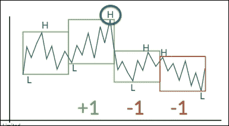
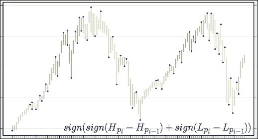
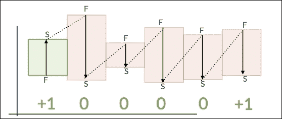
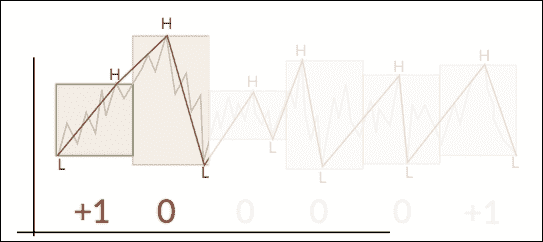
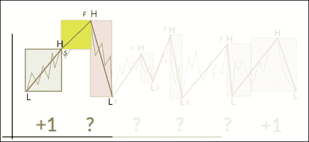
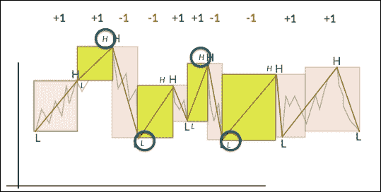
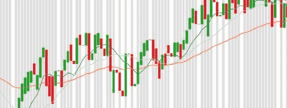

# 十二、趋势演算

在什么是趋势这个概念成为数据科学家研究的热门话题之前很久，就有一个古老的概念仍然没有被数据科学很好地服务:它就是趋势。目前，对趋势的分析，如果可以称之为趋势的话，主要是由人们“目测”时间序列图表并提供解释来进行的。但是人们的眼睛在做什么呢？

本章描述了一种在 Apache Spark 中实现的新算法，该算法被称为趋势演算，由安德鲁·摩根发明。最初的参考实现是用 Lua 语言编写的，并于 2015 年开源，代码可以在[https://bitbucket.org/bytesumo/trendcalculus-public](https://bitbucket.org/bytesumo/trendcalculus-public)查看。

本章解释了核心方法，该方法可以快速提取时间序列上的趋势变化点；这是趋势改变方向的时刻。我们将详细描述我们的趋势演算算法，同时在 Apache Spark 中实现它。其结果是一组可扩展的函数，用于快速比较时间序列的趋势，推断趋势并检查时间范围内的相关性。使用这些颠覆性的新方法，我们演示了如何构建因果排序技术，从数千个时间序列输入中提取潜在的因果模型。

在本章中，我们将学习:

*   如何高效构建时间窗汇总数据
*   如何有效地总结时间序列数据以减少噪音，为进一步的趋势研究做准备
*   如何使用新的趋势演算算法从汇总数据中提取趋势反转*变化点*
*   如何创建**用户定义的聚合函数** ( **UDAFs** )，这些函数对通过复杂的*窗口*功能创建的分区以及通过方法更常见的*分组进行操作*
*   如何从 UDAFs 返回多个值
*   如何使用滞后函数比较当前和以前的记录

当遇到问题时，数据科学家首先考虑的假设是那些与趋势相关的假设；趋势是提供数据可视化的一种极好的方式，特别适合大型数据集，在这些数据集上经常可以看到数据变化的大致方向。在第 5 章*地理分析Spark*中，我们制作了一个简单的算法来尝试预测原油价格。在那项研究中，我们集中于价格的变化方向，也就是说，根据定义，价格的趋势。我们看到趋势是思考、解释和预测的自然方式。

为了解释和演示我们的新趋势方法，本章分为两个部分。第一个是技术性的，交付我们执行新算法所需的代码。第二部分是关于该方法在真实数据上的应用。我们希望它能证明，趋势作为一个概念的表面简单性往往比我们最初想象的要复杂得多，尤其是在有噪音的情况下。噪声会导致许多局部高点和低点(在本章中称为抖动)，这可能会使寻找趋势转折点和发现随时间变化的大致方向变得难以确定。忽略时间序列中的噪声，提取可解释的趋势信号，是我们演示如何克服的主要挑战。

# 研究趋势

趋势的字典定义是事物发展或变化的总方向，但是还有其他更集中的定义可能对指导数据科学更有帮助。两个这样的定义来自研究社会趋势的萨洛梅·阿雷阿斯和欧盟官方统计机构欧统局:

*“趋势是较长时间内(通常是几年)的缓慢变化，通常与影响被测现象的结构性原因有关。”* -欧盟官方统计机构欧统局

*“趋势是指影响大量人的行为或心态的转变。”* -萨洛梅·阿雷亚斯，社会趋势评论员([https://salomeareias.wordpress.com/what-is-a-trend/](https://salomeareias.wordpress.com/what-is-a-trend/))

我们通常认为趋势只不过是股票市场价格的长期上涨或下跌。然而，趋势也可以指与经济、政治、流行文化和社会相关的许多其他用例:例如，研究媒体在报道新闻时透露的情绪。在本章中，我们将使用石油价格作为一个简单的示范；然而，该技术可以应用于任何以下列方式出现趋势的数据:

*   **上升趋势**:当连续的波峰和波谷较高(高点和低点较高)时，称为上升或上升趋势。例如，下图中的第一个箭头是一系列波峰和波谷的结果，其中整体效果是增加。
*   **下跌趋势**:当连续的波峰和波谷较低(较低的高点和较低的低点)时，称为下跌或下跌趋势。例如，下图中的第二个箭头是一系列波峰和波谷的结果，这些波峰和波谷的总体效果是下降的。
*   **横向趋势**:严格来说，这不是一个趋势本身，而是两个方向都缺乏明确的趋势。我们在现阶段并不特别关注这一点，但这将在本章后面讨论。


### 注

如果你搜索“更高的高点”“更高的低点”“趋势”“更低的高点”“更低的低点”，你会看到超过 16，000 次点击，包括许多高知名度的金融网站。这是金融业趋势的标准做法和经验定义。

# 趋势演算算法

在本节中，我们将使用第 5 章*Spark for geography Analysis*中看到的布伦特油价数据集作为示例用例，来解释 Brent 微积分实现的细节。

## 趋势窗口

为了衡量任何类型的变化，我们必须首先以某种方式量化它。对于趋势，我们将以以下方式定义:

*   总体正变化(通常表示为价值增加)

更高的高点和更高的低点=> +1

*   总体负变化(通常表示为数值下降)

较低的高点和较低的低点=> -1

因此，我们必须将我们的数据转化为趋势方向的时间序列，要么是+1，要么是-1。通过将我们的数据分成一系列窗口，大小为 *n* ，我们可以计算每个窗口的日期高点和低点:


因为这种类型的窗口在数据科学中是一种常见的做法，所以有理由认为 Spark 中一定有实现；如果你读过[第 5 章](05.html "Chapter 5. Spark for Geographic Analysis")、*Spark for Geographic Analysis*你就会看到它们，以 Spark SQL 窗口函数的形式出现。让我们读入一些布伦特原油数据，在本例中，它只是一个日期和该日期的原油收盘价(示例数据位于我们的代码库中):

```scala
// Read in the data
val oilPriceDF = spark
   .read
   .option("header","true")
   .option("inferSchema", "true")
   .csv("brent_oil_prices.csv")
```

接下来，我们应该确保日期字段模式是正确的，以便我们可以在`window`函数中使用它。我们的示例数据集具有格式为`dd/MM/yyyy`的`String`日期，因此我们将使用`java.text.SimpleDateFormat`将其转换为`yyyy-MM-dd`:

```scala
// A date conversion UDF
def convertDate(date:String) : String = {
     val dt = new SimpleDateFormat("dd/MM/yyyy").parse(date)
     val newDate = new SimpleDateFormat("yyyy-MM-dd").format(dt)
     newDate
}
```

这将允许我们创建一个**用户定义函数** ( **UDF** )来替换我们已经在`oilPriceDF`数据框中拥有的日期列:

```scala
val convertDateUDF = udf {(Date: String) => convertDate(Date)}
val oilPriceDatedDF = oilPriceDF
    .withColumn("DATE", convertDate(oilPriceDF("DATE")))
```

顺便说一下，如果我们想专注于特定范围的数据，我们可以对其进行过滤:

```scala
val oilPriceDated2015DF = oilPriceDatedDF.filter("year(DATE)==2015")
```

现在，我们可以使用 Spark 2.0 中引入的窗口功能来实现该窗口:

```scala
val windowDF = oilPriceDatedDF.groupBy(
   window(oilPriceDatedDF.col("DATE"),"1 week", "1 week", "4 days"))
```

前面语句中的参数允许我们提供窗口大小、窗口偏移量和数据偏移量，因此这个模式实际上产生了一个在数据开头有偏移量的翻转窗口。这使我们能够确保每个窗口的构建总是包含周一至周五(石油的交易日)的数据，并且每个后续窗口包含下周的数据。

在此阶段查看数据框，确保一切正常；我们不能以通常的方式使用`show`方法，因为`windowDF`是一个`RelationalGroupedDataset`。因此，我们可以运行一个简单的内置函数来创建可读的输出。统计每个窗口内容，显示前二十行，不截断输出:

```scala
windowDF.count.show(20, false)
```

看起来类似于这样:

```scala
+---------------------------------------------+-----+ 
|window                                       |count| 
+---------------------------------------------+-----+ 
|[2011-11-07 00:00:00.0,2011-11-14 00:00:00.0]|5    | 
|[2011-11-14 00:00:00.0,2011-11-21 00:00:00.0]|5    | 
|[2011-11-21 00:00:00.0,2011-11-28 00:00:00.0]|5    | 
+---------------------------------------------+-----+ 

```

这里，count 是窗口中的条目数，也就是我们这里的价格数。根据所使用的数据，我们可能会发现由于数据丢失，一些窗口包含的条目少于五个。我们将把这些保留在数据集中，否则我们的输出中会有空白。

### 注

数据质量永远不应被忽视，在使用新数据集之前，应始终进行尽职调查，参见第 4 章*探索性数据分析*。

改变窗口的大小 *n* (在这种情况下，1 周)将调整我们的调查规模。例如，大小为 1 周的 *n* 将提供周变化，大小为 1 年的 *n* 将提供年变化(使用我们的数据，每个窗口的大小将为:【石油交易周数* 5】)。当然，这完全与数据集的结构有关，也就是说，取决于它是每小时还是每天的价格，等等。在本章的后面，我们将看到如何在迭代的基础上轻松地检查趋势，将一次数据传递的变化点作为第二次迭代的输入。

## 简单趋势

现在我们有了窗口化的数据，我们可以计算每个窗口的+1 或-1 值(简单的趋势)，所以我们需要开发一个趋势计算公式。我们可以通过前面图表中的一个例子直观地做到这一点:


对于这组计算窗口，我们可以将当前窗口与前一个窗口进行比较，从而显示较高的高点、较高的低点和较低的高点、较低的低点。

我们通过从每个窗口中选择以下内容来实现:

*   最早的高价
*   最新低价

利用这些信息，我们可以推导出趋势演算公式:


其中:

*   **符号**:功能(x > 0 吗？1 : ((x < 0)？-1 : 0)
*   **H** :高
*   **L** :低
*   **Pi** :当前窗口
*   **Pi -1** :上一个窗口

例如，给定以下场景:


*   简单趋势=符号(符号(HighDiff) +符号(LowDiff))
*   简单趋势=符号(符号(1000-970) +符号(800-780))
*   简单趋势=符号(符号(30) +符号(20))
*   简单趋势=符号(1 + 1)
*   简单趋势=符号(2)
*   简单趋势= +1

也有可能得到 0 的答案。这将在本章后面详细解释。，参见*边缘案例*。

## 用户定义的聚合函数

有许多方法可以通过编程来执行上述任务，我们将查看聚合数据的 UDF(Spark`UserDefinedAggregateFunction`)，这样我们就可以使用之前收集的窗口化数据。

我们希望能够在我们的窗口上使用类似于我们之前的 UDF 示例的功能。然而，一个标准的 UDF 是不可能的，因为我们的窗口被表示为`RelationalGroupedDataset`。在运行时，此类集合的数据可能保存在多个 Spark 节点上，因此功能是并行执行的，而 UDF 的数据必须位于同一位置。因此，UDAF 对我们来说是一个好消息，因为这意味着我们可以安全地实现我们的程序逻辑，因为我们知道并行效率的问题已经被抽象出来，代码将自动扩展到大规模数据集！

总之，我们希望输出最早的高价及其日期和最新的低价及其日期(对于每个窗口)，以便我们可以使用这些数据来计算前面描述的简单趋势。我们将编写一个扩展`UserDefinedAggregateFunction`的 Scala 类，它包含以下函数:

*   `inputSchema`:提供给函数的输入数据的结构
*   `bufferSchema`:为该实例保存的内部信息(聚合缓冲区)的结构
*   `dataType`:输出数据结构的类型
*   `deterministic`:功能是否为`deterministic`(即同一个输入总是返回同一个输出)
*   `initialize`:聚合缓冲区的初始状态；将两个初始缓冲区合并在一起必须总是返回相同的初始状态
*   `update`:用输入数据更新聚合缓冲区
*   `merge`:合并两个聚合缓冲区
*   `evaluate`:根据聚合缓冲区计算最终结果

我们课程的完整代码如下所示，在阅读时请参考前面的定义，以了解每个定义的目的。代码被故意留得相当冗长，以便更容易理解功能。实际上，我们当然可以重构`update`和`merge`函数。

```scala
import java.text.SimpleDateFormat
import java.util.Date
import org.apache.spark.sql.Row
import org.apache.spark.sql.expressions.{MutableAggregationBuffer, UserDefinedAggregateFunction}
import org.apache.spark.sql.types._

class HighLowCalc extends UserDefinedAggregateFunction {

// we will input (date, price) tuples
def inputSchema: org.apache.spark.sql.types.StructType = StructType(
  StructField("date", StringType) ::
  StructField("price", DoubleType) :: Nil)

// these are the values we will keep a track of internally
def bufferSchema: StructType = StructType(
  StructField("HighestHighDate", StringType) ::
  StructField("HighestHighPrice", DoubleType) ::
  StructField("LowestLowDate", StringType) ::
  StructField("LowestLowPrice", DoubleType) :: Nil
)

// the schema of our final output data
def dataType: DataType = DataTypes.createStructType(
  Array(
    StructField("HighestHighDate", StringType),
    StructField("HighestHighPrice", DoubleType),
    StructField("LowestLowDate", StringType),
    StructField("LowestLowPrice", DoubleType)
  )
)

// this function is deterministic
def deterministic: Boolean = true

// define our initial state using the bufferSchema
def initialize(buffer: MutableAggregationBuffer): Unit = {
  // the date of the highest price so far
  buffer(0) = ""
  // the highest price seen so far
  buffer(1) = 0d
  // the date of the lowest price so far
  buffer(2) = ""
  // the lowest price seen so far
  buffer(3) = 1000000d
}

// how to behave given new input (date, price)
def update(buffer: MutableAggregationBuffer,input: Row): Unit = {

  // find out how the input price compares
  // to the current internal value - looking for highest price only
  (input.getDouble(1) compare buffer.getAs[Double](1)).signum match {
    // if the input price is lower then do nothing
    case -1 => {}
    // if the input price is higher then update the internal status
    case  1 => {
      buffer(1) = input.getDouble(1)
      buffer(0) = input.getString(0)
    }
    // if the input price is the same then ensure we have the earliest date
    case  0 => {
      // if new date earlier than current date, replace
      (parseDate(input.getString(0)),parseDate(buffer.getAs[String](0)))
      match {
        case (Some(a), Some(b)) => {
          if(a.before(b)){
            buffer(0) = input.getString(0)
          }
        }
        // anything else do nothing
        case _ => {}
      }
    }
  }
  // now repeat to find the lowest price
  (input.getDouble(1) compare buffer.getAs[Double](3)).signum match {
    // if the input price is lower then update the internal state
    case -1 => {
      buffer(3) = input.getDouble(1)
      buffer(2) = input.getString(0)
    }
    // if the input price is higher then do nothing
    case  1 => {}
    // if the input price is the same then ensure we have the latest date
    case  0 => {
      // if new date later than current date, replace
      (parseDate(input.getString(0)),parseDate(buffer.getAs[String](2)))
      match {
        case (Some(a), Some(b)) => {
          if(a.after(b)){
            buffer(2) = input.getString(0)
          }
        }
        // anything else do nothing
        case _ => {}
      }
    }
  }
}

// define the behaviour to merge two aggregation buffers together
def merge(buffer1: MutableAggregationBuffer, buffer2: Row): Unit = {
  // first deal with the high prices
  (buffer2.getDouble(1) compare buffer1.getAs[Double](1)).signum match {
    case -1 => {}
    case  1 => {
      buffer1(1) = buffer2.getDouble(1)
      buffer1(0) = buffer2.getString(0)
    }
    case  0 => {
      // work out which date is earlier
      (parseDate(buffer2.getString(0)),parseDate(buffer1.getAs[String](0)))
      match {
        case (Some(a), Some(b)) => {
          if(a.before(b)){
            buffer1(0) = buffer2.getString(0)
          }
        }
        case _ => {}
      }
    }
  }
  // now deal with the low prices
  (buffer2.getDouble(3) compare buffer1.getAs[Double](3)).signum match {
    case -1 => {
      buffer1(3) = buffer2.getDouble(3)
      buffer1(2) = buffer2.getString(2)
    }
    case  1 => {}
    case  0 => {
      // work out which date is later
      (parseDate(buffer2.getString(2)),parseDate(buffer1.getAs[String](2)))
      match {
        case (Some(a), Some(b)) => {
          if(a.after(b)){
            buffer1(2) = buffer2.getString(2)
          }
        }
        case _ => {}
      }
    }
  }
}

// when all is complete, output:
// (highestDate, highestPrice, lowestDate, lowestPrice)
def evaluate(buffer: Row): Any = {
  (buffer(0), buffer(1), buffer(2), buffer(3))
}

// convert a String to a Date for easy comparison
def parseDate(value: String): Option[Date] = {
  try {
    Some(new SimpleDateFormat("yyyy-MM-dd").parse(value))
  } catch {
    case e: Exception => None
  }
}

}
```

你会注意到`signum`功能有常用。这对于比较非常有用，因为它会产生以下结果:

*   如果第一个值小于第二个值，输出-1
*   如果第一个值大于第二个值，输出+1
*   如果两个值相等，输出 0

当我们编写代码来计算实际的简单趋势值时，这个函数将在本章后面真正显示它的价值。我们还使用了`option`类(在`parseDate`中)，它使我们能够返回一个`Some`或`None`的实例。这有许多优点:首先，它消除了立即检查 null 的需要，从而促进了关注点的分离，而且还支持使用模式匹配，允许我们将许多 Scala 函数链接在一起，而不需要冗长的类型检查。例如，如果我们编写一个返回`Some(Int)`或`None`的函数，那么我们可以`flatMap`这些值，而无需额外的检查:

```scala
List("1", "2", "a", "b", "3", "c").flatMap(a =>
   try {
      Some(Integer.parseInt(a.trim))
   } catch {
      case e: NumberFormatException => None
   }
}).sum
```

前面的代码返回`Int = 6`。

## 简单趋势计算

现在我们有了聚合函数，我们可以注册它，并使用它将值输出到我们的 DataFrame:

```scala
val hlc = new HighLowCalc
spark.udf.register("hlc", hlc)

val highLowDF = windowDF.agg(expr("hlc(DATE,PRICE) as highLow"))
highLowDF.show(20, false)
```

产生类似这样的输出:

```scala
+-----------------------------+----------------------+
|window                       |highLow               |        
|                             |                      |
+-----------------------------+----------------------+
|[2011-11-07 00:00:00.0,… ]   |[2011-11-08,115.61,… ]|
|[2011-11-14 00:00:00.0,… ]   |[2011-11-14,112.57,… ]|
|[2011-11-21 00:00:00.0,… ]   |[2011-11-22,107.77,… ]|
```

我们已经提到，我们需要将当前窗口与前一个窗口进行比较。通过实现 Spark `lag`函数，我们可以创建一个包含先前窗口细节的新数据帧:

```scala
// ensure our data is in correct date order by sorting
// on each first date in the window column window
// Struct contains the values start and end
val sortedWindow = Window.orderBy("window.start")

// define the lag of just one row
val lagCol = lag(col("highLow"), 1).over(sortedWindow)

// create a new DataFrame with the additional column "highLowPrev"
// where the previous row does not exist, null will be entered
val highLowPrevDF = highLowDF.withColumn("highLowPrev", lagCol)
```

我们现在有了一个数据框架，其中每一行都包含计算简单趋势值所需的所有信息。我们可以再次实现一个 UDF，这次使用前面提到的`signum`函数来表示简单的趋势方程:

```scala
val simpleTrendFunc = udf {
  (currentHigh : Double, currentLow : Double,
   prevHigh : Double, prevLow : Double) => {
     (((currentHigh - prevHigh) compare 0).signum +
     ((currentLow - prevLow) compare 0).signum compare 0).signum }
}
```

最后，将 UDF 应用于我们的数据框:

```scala
val simpleTrendDF = highLowPrevDF.withColumn("sign",   
    simpleTrendFunc(highLowPrevDF("highLow.HighestHighPrice"),
     highLowPrevDF("highLow.LowestLowPrice"),
     highLowPrevDF("highLowPrev.HighestHighPrice"),
     highLowPrevDF("highLowPrev.LowestLowPrice")
    )
)

// view the DataFrame
simpleTrendDF.show(20, false)

+----------------------+----------------------+-----+
|highLow               |highLowPrev           |sign |
+----------------------+----------------------+-----+
|[2011-11-08,115.61,...|null                  |null |
|[2011-11-14,112.57,...|2011-11-08,115.61,... |-1   |
|[2011-11-22,107.77,...|[2011-11-14,112.57,...|1    |
```

## 反转规则

在所有确定的窗口中运行代码后，我们现在将数据表示为一系列+1 和-1，我们可以进一步分析这些数据，以加深对趋势的理解。你会注意到数据看起来是随机的，但是有一个模式我们可以识别:趋势值经常翻转，从+1 到-1 或者从-1 到+1。仔细观察这些点的图形，我们可以看到这些翻转实际上代表了趋势的逆转:



这可以总结如下:

*   如果趋势从+1 移动到-1，那么之前的高点就是反转
*   如果趋势从-1 移动到+1，那么之前的低点就是反转

使用这个简单的规则，我们可以输出一个新的时间序列，它只包含在我们的尺度上发现的反转点。在这个时间序列中，我们将创建(日期、价格)元组，该元组相当于前面讨论的 a +1 反转的较高上限和 a -1 反转的较低下限。我们可以使用与之前相同的方法对此进行编码，即使用`lag`函数捕获前一个符号，并实现一个 UDF 来计算反转，如下所示:

```scala
// define the lag of just one row
val lagSignCol = lag(col("sign"), 1).over(sortedWindow)

// create a new DataFrame with the additional column signPrev
val lagSignColDF = simpleTrendDF.withColumn("signPrev", lagSignCol)

// define a UDF that calculates the reversals
val reversalFunc = udf {
  (currentSign : Int, prevSign : Int,
    prevHighPrice : Double, prevHighDate : String,
    prevLowPrice : Double, prevLowDate : String) => {
      (currentSign compare prevSign).signum match {
        case 0 => null
        // if the current SimpleTrend is less than the
        // previous, the previous high is a reversal
        case -1 => (prevHighDate, prevHighPrice)
        // if the current SimpleTrend is more than the
        // previous, the previous low is a reversal
        case 1 => (prevLowDate, prevLowPrice)
      }
    }
}

// use the UDF to create a new DataFrame with the
// additional column reversals
val reversalsDF = lagSignColDF.withColumn("reversals",
  reversalFunc(lagSignColDF("sign"),
    lagSignColDF("signPrev"),
    lagSignColDF("highLowPrev.HighestHighPrice"),
    lagSignColDF("highLowPrev.HighestHighDate"),
    lagSignColDF("highLowPrev.LowestLowPrice"),
    lagSignColDF("highLowPrev.LowestLowDate")
  )
)

reversalsDF.show(20, false)

+----------------------+------+--------+--------------------+
|highLowPrev           |sign  |signPrev|reversals           |
+----------------------+------+-----------------------------+
|null                  |null  |null    |null                |
|[2011-11-08,115.61,… ]|-1    |null    |null                |
|[2011-11-14,112.57,… ]|-1    |-1      |null                |
|[2011-11-22,107.77,… ]|1     |-1      |[2011-11-24,105.3]  |
|[2011-11-29,111.25,… ]|-1    |1       |[2011-11-29,111.25] |
```

总之，我们已经成功地消除了价格数据中的抖动(不明显的涨跌)，我们可以直接显示这些数据。它肯定会显示原始数据集的简化表示，并且假设我们主要对价格发生显著变化的点感兴趣，它会保留与重要波峰和波谷相关的关键信息。然而，我们还可以做更多的事情，以一种可呈现且易于阅读的方式来表示数据。

## 介绍 FHLS 杆结构

在金融领域，**开盘、高、低、收盘** ( **OHLC** )图表非常常见，因为它们显示了每个分析师需要的关键数据；该物品的开盘价和收盘价，以及该期间(通常为一天)的最高价和最低价。我们可以把同样的想法用于我们自己的目的。**第一、高、低、第二** ( **FHLS** )图表将使我们能够可视化我们的数据，并在此基础上产生新的见解。

FHLS 数据格式描述如下:

*   开放日期
*   **高/低值的第一个**-先出现哪个高或低
*   **高**值
*   **低**值
*   **高/低值的第二个**-高/低值的第一个的另一个值
*   高日期
*   低日期
*   结束日期

我们几乎有所有我们需要的数据在`reversalsDF`中被普遍描述，我们唯一没有确定的项目是第一和第二个值，也就是说，无论最高或最低价格是在任何给定的窗口中第一次看到的。我们可以使用 UDF 或 select 语句来计算这一点，但是从早期更新`UserDefinedAggregateFunction`将使我们能够在确保有效方法的同时进行小的更改。只有评估功能需要更改:

```scala
def evaluate(buffer: Row): Any = {
  // compare the highest and lowest dates
  (parseDate(buffer.getString(0)), parseDate(buffer.getString(2))) match {
     case (Some(a), Some(b)) => {
       // if the highest date is the earlier
       if(a.before(b)){
         // highest date, highest price, lowest date,
         // lowest price, first(highest price), second
         (buffer(0), buffer(1), buffer(2), buffer(3), buffer(1), buffer(3))
       }
       else {
         // the lowest date is earlier or they are
         // both the same (shouldn’t be possible)
         // highest date, highest price, lowest date,
         // lowest price, first(lowest price), second
         (buffer(0), buffer(1), buffer(2), buffer(3), buffer(3), buffer(1))
       }
     }
     // we couldn’t parse one or both of the dates -shouldn’t reach here
     case _ =>
       (buffer(0), buffer(1), buffer(2), buffer(3), buffer(1), buffer(3))
  }
}
```

最后，我们可以编写一条语句来选择所需的字段，并将数据写入文件:

```scala
val fhlsSelectDF = reversalsDF.select(
 "window.start",
 "highLow.firstPrice",
 "highLow.HighestHighPrice",
 "highLow.LowestLowPrice",
 "highLow.secondPrice",
 "highLow.HighestHighDate",
 "highLow.LowestLowDate",
 "window.end",
 "reversals._1",
 "reversals._2")
```

您会注意到 reversals 列并不像其他列一样实现一个`Struct`，而是一个元组。如果你检查`reversalsUDF`，你会看到这是如何做到的。出于演示目的，我们将展示如何在选择组件字段后对其进行重命名:

```scala
val lookup = Map("_1" -> "reversalDate", "_2" -> "reversalPrice")
val fhlsDF = fhlsSelectDF.select { fhlsSelectDF.columns.map(c =>
   col(c).as(lookup.getOrElse(c, c))):_*
}
fhlsDF.orderBy(asc("start")).show(20, false)
```

将数据写入文件:

```scala
   fhlsDF.write
     .format("com.databricks.spark.csv")
     .option("header", "true")
     .save("fhls");
```

您可以通过添加以下行来加密数据:

```scala
.option("codec", "org.apache.hadoop.io.compress.CryptoCodec")
```

这一重要的编解码器和其他安全相关技术在[第 13 章](13.html "Chapter 13. Secure Data")、*安全数据*中有所描述。

## 可视化数据

现在我们已经将数据保存在一个文件中，我们可以利用这个机会显示它；有许多用于创建图表的包，作为一名数据科学家，其中一个关键包可能是 D3.js。正如我们在本书的其他部分中提到的，我们无意在这里探索任何超出产生最终结果所需的细节。也就是说，值得概述的是，D3 是一个基于数据操作文档的 JavaScript 库，生态系统有许多贡献者，因此可用的数据可视化数量巨大。了解基础知识将允许我们用相对较少的努力提供真正令人印象深刻的结果。

使用 FHLS 格式，我们可以说服图表软件接受我们的数据，就像它是 OHLC 格式一样。所以我们应该在网上搜索一个我们可以使用的 D3 OHLC 图书馆。在这个例子中，我们选择了[techanjs.org](http://techanjs.org/)，因为它不仅提供了 OHLC，还提供了一些以后可能有用的其他可视化。

实现 D3 代码通常很简单，只需剪切并粘贴到文本文件中，修改源代码中数据目录的任何路径。如果您以前从未在这一领域工作过，下面有一些有用的提示可以帮助您入门:

*   如果你正在使用 Chrome 浏览器使用网络技术，在 ****选项** | **更多工具** | **开发者工具**** 下有一套非常有用的工具。如果没有其他问题，这将提供您试图运行的代码的错误输出，否则这些错误将会丢失，从而使空白页结果更容易调试。
*   如果您在代码中使用单个文件，如下例所示，请始终使用`index.html`作为文件名。
*   如果您的代码引用了本地文件，这通常是实现 D3 时的情况，那么您将需要运行一个 web 服务器来为它们提供服务。默认情况下，由于固有的安全风险(恶意代码访问本地文件)，web 浏览器无法访问本地文件。运行 web 服务器的一个简单方法是在代码的源目录中执行:`nohup python -m SimpleHTTPServer &`。你绝不能让你的浏览器访问本地文件，因为它会被攻击。例如，不运行:`chrome --allow-file-access-from-files`
*   在源代码中使用 D3 时，尽可能始终使用`<script src="https://d3js.org/d3.v4.min.js"></script>`以确保导入库的最新版本。

我们可以按原样使用代码，唯一应该做的更改是引用列的方式:

```scala
data = data.slice(0, 200).map(function(d) {
  return {
    date: parseDate(d.start),
    open: +d.firstPrice,
    high: +d.HighestHighPrice,
    low: +d.LowestLowPrice,
    close: +d.SecondPrice
  };
});
```

这将生成一个类似如下的图表:


在这个图表上，绿色条表示从低价的**第一**到高价的**第二**的增加，红色条表示从**第一高价的**到**第二低价的**的减少。与典型的 OHLC 图表相比，这种微妙的变化至关重要。我们现在一眼就能很容易地看到时间序列在汇总栏中上升和下降时的流动。这有助于我们理解价格在我们固定的查询尺度或窗口大小上的涨跌流，而不会像在原始价格值的折线图上那样不得不解释时间尺度的影响。生成的图表提供了一种在较小的时间范围内减少噪音的方法，提供了一种简洁且可重复的方式来直观地总结我们的时间序列。然而，我们还能做更多的事情。

### FHLS 逆转

我们之前已经使用我们的趋势演算方程计算了趋势反转，将这些与上面的 FHLS 总结数据一起绘制将真正增强我们的可视化，一起显示高/低条和趋势反转点。我们可以通过修改 D3 代码来实现 D3 散点图代码。所需代码可以在很多地方的互联网上找到，和以前一样；我们下面有一些代码，可以通过将相关部分添加到`<script>`来集成:

添加`reversalPrice`字段:

```scala
data = data.slice(0, 200).map(function(d) {
  return {
    date: parseDate(d.start),
    open: +d.firstPrice,
    high: +d.HighestHighPrice,
    low: +d.LowestLowPrice,
    close: +d.secondPrice,
    price: +d.reversalPrice
  };
}).sort(function(a, b) {
  return d3.ascending(accessor.d(a), accessor.d(b));
});
```

画点:

```scala
svg.selectAll(".dot")
  .data(data)
  .enter().append("circle")
  .attr("class", "dot")
  .attr("r", 1)
  .attr("cx", function(d) { return x(d.date); })
  .attr("cy", function(d) { return y(d.price); })
  .style("fill","black"); 
```

一旦成功集成，我们将看到类似如下的图表:



或者，只用一个简单的折线图，反转就能非常有效。以下是此类图表的示例，以展示趋势反转绘图的视觉影响:


### 边缘病例

在我们之前的计算中，我们简单地提到了值 0 可以在执行简单趋势算法时产生。根据我们的算法，这可能发生在以下场景中:

*   符号(-1 + (+1))
*   符号(+1 + (-1))
*   符号(0 + (0))

通过示例图，我们可以使用我们的算法识别这些值，因此:


### 注

在货币市场中，我们可以将每个窗口识别为内栏或外栏。Inner 是定义市场不确定性的条；没有更高的高点或更低的低点。外部是已经达到较高或较低低点的地方；当然，只有当数据可用时，才能分配这些术语。

从我们目前看到的情况来看，这些零似乎破坏了我们的算法。然而，情况并非如此，事实上有一个有效的解决办法，使我们能够考虑到这些问题。

#### 零值

当回顾前面的图表时，我们可以想象价格穿过 FHLS 酒吧的路径，考虑到绿色酒吧意味着价格及时上涨，红色酒吧意味着价格及时下跌，这个过程变得很容易。理解时间的路径如何帮助解决零趋势问题？答案很简单，但不一定直观。

我们之前在整个数据处理过程中记录了所有高点和低点的日期；虽然我们还没有全部使用。我们的**第一**和**第二**使用这些日期计算的值实际上指示了该局部趋势的流向或方向，如下图所示，一旦你研究了一段时间的汇总图表，你的眼睛自然会随着这个流向移动来解释时间序列:



如果我们看下一张图表，我们可以看到显示我们的眼睛如何解读时间流动的虚线不仅仅是隐含的。在我们的日期高点和低点之间，有一些数据值没有在图表中用我们专门构造的条进行总结，这意味着条之间的覆盖范围存在时间差距。我们可以利用这个属性来解决问题。考虑下图，价格线重新添加进来:



#### 完成间隙

使用同一个示例的延续，我们将找出其中一个差距，并演示一种可以用来填补这些差距的方法:



步骤如下:

*   寻找 0 趋势(内/外条)
*   为从上一个窗口借用第二个值和从当前窗口借用第一个值所隐含的差距插入一个新的 FHLS 摘要(见上图)
*   在正常的 FHLS 施工期间发射这些特殊的棒线，按照常规的高点/低点窗口格式化它们，并使用它们以正常的方式发现趋势

现在我们已经创建了一个新的酒吧，我们可以以已经定义的方式使用它；我们等式的一个符号(高 diff 或低 diff)的值为 0，另一个符号现在为+1 或-1。然后像以前一样计算反转。在前面的例子中，当我们找到一个较低的低点时，问号在我们的新系统下变成了-1；因此，上一个高点是反转。

我们可以通过以下方式修改代码，从之前的`simpleTrendDF`开始:

1.  Filter all of the rows with a sign of 0.

    `val zeroSignRowsDF = simpleTrendDF.filter("sign == 0")`。

2.  Drop the sign column as we are going to use the schema of this new DataFrame.

    `val zeroRowsDF = zeroSignRowsDF.drop("sign")`。

3.  Iterate each row and output an updated row that has been amended in the following way:

    `window.start`日期是来自`highLowPrev`列的**第二个**值的日期

    `window.end`日期可以保持不变，因为它不用于 FHLS 计算

    `highLow`条目是这样构建的:

    1.  `HighestHighDate`:第一个日期和第二个`highLowPrev`日期中较早的一个
    2.  `HighestHighPrice`:与以上相关的价格
    3.  `LowestLowDate`:第一个 `highLow`日期和第二个**`highLowPrev`日期中较晚的一个**
    ***   `LowestLowPrice`:与以上相关的价格*   `firstPrice`:最早新`highLow`日期相关的价格*   `secondPrice`: The price related to the latest new `highLow` date

        `highLowPrev`列可以保留，因为它将在下一步被删除

        ```scala
        val tempHighLowDF =
        spark.createDataFrame(highLowDF.rdd.map(x => {
                       RowFactory.create(x.getAs("window")., x.getAs("highLow"),
                                         x.getAs("highLowPrev"))

                     }), highLowDF.schema)
        ```** 
***   Drop the `highLowPrev` column

    `val newHighLowDF = tempHighLowDF.drop("highLowPrev")`

    *   Union the new DataFrame with `highLowDF`, which has the effect of inserting new rows

    `val updatedHighLowDF = newHighLowDF.union(highLowDF)`

    *   Proceed with the simple trend process as before, using `updatedHighLowDF` instead of `highLowDF` and starting with:

    `val sortedWindow = Window.orderBy("window.start")`** 

 **继续前面的例子，我们看到(可能)不再有任何零，反转仍然清晰且计算快速。如果选定的时间窗口非常小，例如秒或分钟，那么输出中可能仍然有零，表明价格在该时间段内没有变化。差距过程可以重复，或者窗口的大小可以改变，以延长静态价格的周期:



我们已经使用 D3 看到了时间序列，但是现在可以使用图表软件来显示覆盖隐含间隙的新条添加到了哪里，这些新条是下图中显示的白色条。整体结果非常直观，我们只需用眼睛就能轻松看到趋势及其逆转:



### 可堆叠加工

现在我们有了这个能力，我们可以将趋势反转列表作为算法第二遍的输入。为此，我们可以调整我们的窗口函数，以便输入是 N 阶观测值的窗口，而不是固定的时间段。如果我们这样做，我们可以*堆叠*并创建多尺度*趋势树*趋势演算，这意味着我们可以在后续过程中将算法的输出反馈到其中。这将创建一个多比例反转查找器。以这种*堆叠*的方式在几个通道中处理数据是一个高效的过程，这是由于在随后的通道中固有的数据减少。通过多次运行，分区自下而上构建成一个分层结构。以这种方式工作，我们可以使用这种方法来*放大和缩小*趋势的更长和更短的范围，这取决于我们需要的细节水平；当我们*缩小*时，趋势模式变得更容易用肉眼看到。

从我们的`reversalsDF`数据框中选择相关数据将使我们能够简单地再次运行该过程；`highLow`栏包含:

*   `HighestHigh`的日期和价格
*   `LowestLow`的日期和价格

可以选择并输出为包含(日期、价格)的文件；正是我们用来接收原始文件的格式:

```scala
val newColumnNames = Seq("DATE", "PRICE")

val highLowHighestDF = simpleTrendDF.select("highLow.HighestHighDate", "highLow.HighestHighPrice").toDF(newColumnNames:_*)

val highLowLowestDF = simpleTrendDF.select("highLow.LowestLowDate", "highLow.LowestLowPrice").toDF(newColumnNames:_*)

val stackedDF = highLowHighestDF.union(highLowLowestDF)

stackedDF.write
     .option("header", "true")
     .csv("stackData.csv")
```

让我们回顾一下我们已经构建的内容:

*   我们已经构建了代码来处理一个时间序列，并在固定的时间窗口内有效地将它总结成过时的高点和低点窗口
*   我们为每个时间窗口指定了一个积极或消极的趋势
*   我们有一种方法来处理边缘情况，消除了零值趋势问题
*   我们有一个计算来找到实际的时刻，以及趋势逆转时的价格值。

这样做的结果是，我们构建了一个非常快速的代理方法来传递类似于时间序列的分段线性回归的东西。从另一个角度来看，趋势反转的列表代表了我们的时间序列简化成一个压缩的形式，忽略了小时间框架上的噪声。

# 实际应用

现在我们已经对算法进行了编码，让我们看看这种方法在真实数据上的实际应用。我们将从了解算法如何运行开始，这样我们就可以确定在哪里可以使用它。

## 算法特征

那么，这个算法有什么特点呢？以下是优势和劣势的列表。

### 优势

优点如下:

*   该算法是通用的，适合基于流和 Spark 的实现
*   这个理论很简单，但是很有效
*   实施快速高效
*   结果是直观和可解释的
*   该方法是可堆叠的，允许多尺度研究；这在使用 Spark 窗口时非常简单

### 缺点

缺点如下:

*   滞后指标该算法发现过去发生的趋势逆转，不能直接用于预测趋势变化
*   滞后在更高的尺度上累积，这意味着需要更多的数据(以及时间滞后)来发现长期趋势变化，而不是在更短的时间范围内发现趋势逆转

理解这个算法的局限性很重要。我们创建了一个非常有用的分析工具，可以用来研究趋势。然而，它本身不是一个预测工具，而是一个更容易识别后续处理趋势的工具。

## 可能的用例

随着我们新发现的将时间序列转换成变更点列表的能力，许多曾经困难的用例变得容易了。让我们来看看一些潜在的应用。

### 图表注释

我们可以在趋势发生变化的时刻，在主要高点或低点，从 GDELT 提要中检索新闻标题，从而用上下文注释我们的图表。

### 同向

我们可以利用噪音的减少来比较不同时间序列的趋势，并设计计算来衡量哪些趋势是共同的。

### 数据约简

我们可以使用该算法简化时间序列并减少数据量，同时保留关键时刻，堆叠该算法允许更大的减少。

### 索引

我们可以将变化点视为时间序列索引的一种新形式，例如，允许检索数据中与较长时间内的趋势相反的短时间内的部分。

### 分形维数

我们可以在不同的时间尺度上找到变化点，并利用这些信息来研究时间序列的分形维数。

### 分段线性回归的流代理

在需要分段线性回归的情况下，该方法可以用作计算代理的非常快速的方法。

# 总结

在本章中，我们介绍了一种用趋势演算分析趋势的方法。我们已经概述了这样一个事实，尽管趋势分析是一个非常常见的用例，但是除了非常通用的可视化软件之外，很少有工具可以在这方面帮助数据科学家。我们已经通过趋势演算算法引导读者，演示了我们如何在 Spark 中实现该理论的高效和可扩展的实现。我们已经描述了识别算法的关键输出的过程:在一个指定的尺度上的趋势反转。在计算了逆转之后，我们使用 D3.js 来可视化一周窗口的时间序列数据，并绘制趋势逆转。本章继续解释如何克服主要的边缘情况:在简单的趋势计算中发现的零值。最后，我们简要概述了算法特性和潜在的用例，展示了该方法是如何优雅的，并且可以很容易地在 Spark 中描述和实现。

在下一章中，我们将揭开数据安全主题的神秘面纱。我们将从数据科学的角度来描述最重要的安全领域，重点是处理高度机密数据的授权访问的理论和实现。**