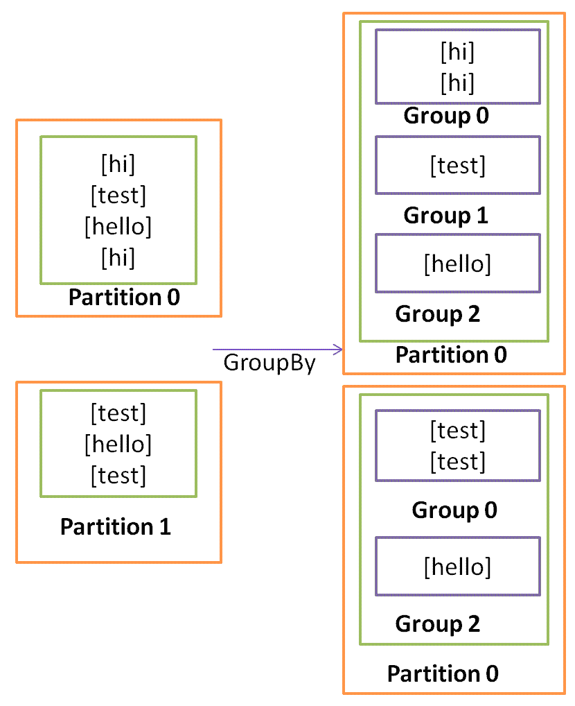

# 三叉戟拓扑及其用途

在上一章中，我们对三叉戟进行了概述。 在本章中，我们将介绍三叉戟拓扑的发展。 以下是我们将在本章中介绍的重要要点：

*   三叉戟`groupBy`手术
*   非事务拓扑
*   三叉戟你好世界拓扑
*   三叉戟状态
*   分布式 RPC
*   何时使用三叉戟

# 三叉戟组按操作

`groupBy`操作不涉及任何重新分区。 `groupBy`操作将输入流转换为分组流。 `groupBy`操作的主要功能是修改后续聚合函数的行为。



# GroupBy Been PartitionAggregate

如果在`partitionAggregate`之前使用`groupBy`操作，则`partitionAggregate`将在分区内创建的每个组上运行`aggregate`。

# 聚合前的 GROUPBY

如果在`aggregate`之前使用`groupBy`运算，则首先重新划分输入元组，然后对每个组执行`aggregate`运算。

# 非事务拓扑

在非事务性拓扑中，输出会发出一批元组，并且不能保证每批中有什么。 使用处理机制，我们可以将管道分为两类：

*   **至多处理一次**：在这种类型的拓扑中，不会重试失败的元组。 因此，喷嘴不会等待确认。
*   **至少一次处理**：在处理管道中重试失败的元组。 因此，这种类型的拓扑保证进入处理管道的每个元组必须至少处理一次。

我们可以通过实现`org.apache.storm.trident.spout.IBatchSpout`接口来编写非事务性输出。

此示例显示如何编写三叉戟喷嘴：

```scala
public class FakeTweetSpout implements IBatchSpout{ 

   private static final long serialVersionUID = 10L; 
   private intbatchSize; 
   private HashMap<Long, List<List<Object>>>batchesMap = new HashMap<Long, List<List<Object>>>(); 
   public FakeTweetSpout(intbatchSize) { 
         this.batchSize = batchSize; 
   } 

   private static final Map<Integer, String> TWEET_MAP = new HashMap<Integer, String>(); 
   static { 
         TWEET_MAP.put(0, "#FIFA worldcup"); 
         TWEET_MAP.put(1, "#FIFA worldcup"); 
         TWEET_MAP.put(2, "#FIFA worldcup"); 
         TWEET_MAP.put(3, "#FIFA worldcup"); 
         TWEET_MAP.put(4, "#Movie top 10"); 
   } 

   private static final Map<Integer, String> COUNTRY_MAP = new HashMap<Integer, String>(); 
   static { 
         COUNTRY_MAP.put(0, "United State"); 
         COUNTRY_MAP.put(1, "Japan"); 
         COUNTRY_MAP.put(2, "India"); 
         COUNTRY_MAP.put(3, "China"); 
         COUNTRY_MAP.put(4, "Brazil"); 
   } 

   private List<Object>recordGenerator() { 
         final Random rand = new Random(); 
         intrandomNumber = rand.nextInt(5); 
         int randomNumber2 = rand.nextInt(5); 
         return new Values(TWEET_MAP.get(randomNumber),COUNTRY_MAP.get(randomNumber2)); 
   } 

   public void ack(long batchId) { 
         this.batchesMap.remove(batchId); 

   } 

   public void close() { 
         // Here we should close all the external connections 

   } 

   public void emitBatch(long batchId, TridentCollector collector) { 
         List<List<Object>> batches = this.batchesMap.get(batchId); 
         if(batches == null) { 
               batches = new ArrayList<List<Object>>();; 
               for (inti=0;i<this.batchSize;i++) { 
                     batches.add(this.recordGenerator()); 
               } 
               this.batchesMap.put(batchId, batches); 
         } 
         for(List<Object>list : batches){ 
collector.emit(list); 
        } 

   } 

   public Map getComponentConfiguration() { 
         // TODO Auto-generated method stub 
         return null; 
   } 

   public Fields getOutputFields() { 
         return new Fields("text","Country"); 
   } 

   public void open(Map arg0, TopologyContext arg1) { 
         // TODO Auto-generated method stub 

   } 

} 
```

`FakeTweetSpout`类实现`org.apache.storm.trident.spout.IBatchSpout`接口。 `FakeTweetSpout(intbatchSize)`的构造以`batchSize`作为参数。 如果`batchSize`为`3`，则`FakeTweetSpout`类发出的每个批都包含三个元组。 `recordGenerator`方法包含生成假 tweet 的逻辑。 以下是这条虚假推文的示例：

```scala
["Adidas #FIFA World Cup Chant Challenge", "Brazil"] 
["The Great Gatsby is such a good movie","India"] 
```

`getOutputFields`方法返回两个字段`text`和`Country`。 `emitBatch(long batchId, TridentCollector collector)`方法使用`batchSize`变量来决定每个批次中的元组数量，并将批次发送到处理流水线。

`batchesMap`集合包含`batchId`作为键，包含一批元组作为值。 `emitBatch(long batchId, TridentCollector collector)`发出的所有批次都将添加到`batchesMap`中。

`ack(long batchId)`方法接收`batchId`作为确认，并将从`batchesMap`中删除相应的批次。

# 三叉戟你好世界拓扑

本节解释如何编写一个三叉戟 hello world 拓扑。 执行以下步骤创建三叉戟 hello world 拓扑：

1.  使用`com.stormadvance`作为`groupId`，使用`storm_trident`作为`artifactId`来创建一个 Maven 项目。
2.  将以下依赖项和存储库添加到`pom.xml`文件：

```scala
         <dependencies> 
         <dependency> 
               <groupId>junit</groupId> 
               <artifactId>junit</artifactId> 
               <version>3.8.1</version> 
               <scope>test</scope> 
         </dependency> 
         <dependency> 
               <groupId>org.apache.storm</groupId> 
               <artifactId>storm-core</artifactId> 
               <version>1.0.2</version> 
               <scope>provided</scope> 
         </dependency> 
   </dependencies> 
```

3.  在`com.stormadvance.storm_trident`包中创建`TridentUtility`类。 此类包含我们将在三叉戟 hello world 示例中使用的三叉戟过滤器和函数：

```scala
public class TridentUtility { 
   /** 
    * Get the comma separated value as input, split the field by comma, and 
    * then emits multiple tuple as output. 
    *  
    */ 
   public static class Split extends BaseFunction { 

         private static final long serialVersionUID = 2L; 

         public void execute(TridentTuple tuple, TridentCollector collector) { 
               String countries = tuple.getString(0); 
               for (String word :countries.split(",")) { 
                     // System.out.println("word -"+word); 
                     collector.emit(new Values(word)); 
               } 
         } 
   } 

   /** 
    * This class extends BaseFilter and contain isKeep method which emits only 
    * those tuple which has #FIFA in text field. 
    */ 
   public static class TweetFilter extends BaseFilter { 

         private static final long serialVersionUID = 1L; 

         public booleanisKeep(TridentTuple tuple) { 
               if (tuple.getString(0).contains("#FIFA")) { 
                     return true; 
               } else { 
                     return false; 
               } 
         } 

   } 

   /** 
    * This class extends BaseFilter and contain isKeep method which will print 
    * the input tuple. 
    *  
    */ 
   public static class Print extends BaseFilter { 

         private static final long serialVersionUID = 1L; 

         public booleanisKeep(TridentTuple tuple) { 
               System.out.println(tuple); 
               return true; 
         } 

   } 
} 
```

`TridentUtility`类包含三个内部类：`Split`、`TweetFilter`和`Print`。

`Split`类扩展了`org.apache.storm.trident.operation.BaseFunction`类，并包含`execute(TridentTuple tuple, TridentCollector collector)`方法。 `execute()`方法接受逗号分隔值作为输入，拆分输入值，并发出多个元组作为输出。

`TweetFilter`类扩展了`org.apache.storm.trident.operation.BaseFilter`类，并包含`isKeep(TridentTuple tuple)`方法。 `isKeep()`方法接受元组作为其输入，并检查输入元组是否包含`text`字段中的值`#FIFA`。 如果元组在`text`字段中包含`#FIFA`，则该方法返回 TRUE。 否则，它返回 FALSE。

`Print`类扩展了`org.apache.storm.trident.operation.BaseFilter`类，并包含`isKeep(TridentTuple tuple)`方法。 `isKeep()`方法打印输入元组并返回 TRUE。

4.  在`com.stormadvance.storm_trident`包中创建`TridentHelloWorldTopology`类。 此类定义 hello world 三叉戟拓扑：

```scala
public class TridentHelloWorldTopology {   
   public static void main(String[] args) throws Exception { 
         Config conf = new Config(); 
         conf.setMaxSpoutPending(20); 
         if (args.length == 0) { 
               LocalCluster cluster = new LocalCluster(); 
               cluster.submitTopology("Count", conf, buildTopology()); 
         } else { 
               conf.setNumWorkers(3); 
               StormSubmitter.submitTopology(args[0], conf, buildTopology()); 
         } 
   } 

   public static StormTopologybuildTopology() { 

         FakeTweetSpout spout = new FakeTweetSpout(10); 
         TridentTopology topology = new TridentTopology(); 

         topology.newStream("spout1", spout) 
                     .shuffle() 
                     .each(new Fields("text", "Country"), 
                                 new TridentUtility.TweetFilter()) 
                     .groupBy(new Fields("Country")) 
                     .aggregate(new Fields("Country"), new Count(), 
                                 new Fields("count")) 
                     .each(new Fields("count"), new TridentUtility.Print()) 
                     .parallelismHint(2); 

         return topology.build(); 
   } 
} 
```

让我们逐行理解代码。 首先，我们创建了一个`TridentTopology`类的对象，用于定义三叉戟计算。

`TridentTopology`包含一个名为`newStream()`的方法，该方法将接受一个输入源作为参数。 在本例中，我们使用在非事务性拓扑部分中创建的`FakeTweetSpout`作为输入源。 与 Storm 一样，三叉戟还维护 ZooKeeper 中每个输入源的状态。 这里，`FakeTweetSpout`字符串指定了 ZooKeeper 中维护元数据的节点。

喷嘴发出具有两个字段`text`和`Country`的流。

我们使用`shuffle`操作重新划分输入源发出的一批元组。 拓扑定义的下一行对每个元组应用`TweetFilter`。 `TweetFilter`筛选出所有不包含`#FIFA`关键字的元组。

`TweetFilter`的输出按`Country`字段分组。 然后，我们应用`Count`聚合器对每个国家的 tweet 进行计数。 最后，我们应用`Print`过滤器来打印`aggregate`方法的输出。

下面是`TridentHelloWorldTopology`类的控制台输出：


下图显示了 hello world 三叉戟拓扑的执行情况：


# 三叉戟状态

三叉戟提供了从有状态源读取结果和向有状态源写入结果的抽象。 我们可以在拓扑(内存)内部维护状态，也可以将其存储在外部源(memcached 或 Cassandra)中。

让我们考虑一下，我们正在数据库中维护前面的 hello world 三叉戟拓扑的输出。 每次处理元组时，数据库中出现在元组中的国家/地区计数都会增加。 我们不能通过仅在数据库中维护计数来实现精确的一次处理。 原因是，如果任何元组在处理过程中失败，则会重试失败的元组。 这在更新状态时给我们带来了一个问题，因为我们不确定这个元组的状态以前是否更新过。 如果元组在更新状态之前失败，则重试元组将增加数据库中的计数并使状态保持一致。 但是，如果元组在更新状态后失败，则重试相同的元组将再次增加数据库中的计数并使状态不一致。 因此，通过只在数据库中维护计数，我们不知道这个元组以前是否被处理过。 我们需要更多细节才能做出正确的决定。 我们需要遵循以下步骤来实现精确的一次处理语义：

1.  对元组进行小批量处理。
2.  为每个批次分配唯一的 ID(事务 ID)。 如果重试该批处理，则会为其提供相同的唯一 ID。
3.  状态更新按批次排序。 例如，在批次 1 的状态更新完成之前，批次 2 的状态更新是不可能的。

如果我们使用前面三个语义创建拓扑，那么我们可以很容易地决定是否在之前处理元组。

# 分布式 RPC

分布式 RPC 用于动态查询和检索三叉戟拓扑的结果。 Storm 有一个内置的分布式 RPC 服务器。 分布式 RPC 服务器从客户端接收 RPC 请求，并将其传递到 Storm 拓扑。 拓扑处理请求并将结果发送到分布式 RPC 服务器，该服务器由分布式 RPC 服务器重定向到客户端。

我们可以使用`storm.yaml`文件中的以下属性配置分布式 RPC 服务器：

```scala
drpc.servers: 
     - "nimbus-node" 
```

这里，`nimbus-node`是分布式 RPC 服务器的 IP。

现在，在`nimbus-node`机器上运行此命令以启动分布式 RPC 服务器：

```scala
> bin/storm drpc 
```

让我们假设我们正在数据库中存储 hello world 三叉戟拓扑的计数聚合，并希望动态检索给定国家/地区的计数。 我们需要使用分布式 RPC 功能来实现这一点。 此示例显示了如何将分布式 RPC 合并到上一节创建的 hello world 三叉戟拓扑中：

我们正在创建一个包含`buildTopology()`方法的`DistributedRPC`类：

```scala
public class DistributedRPC { 

  public static void main(String[] args) throws Exception { 
    Config conf = new Config(); 
    conf.setMaxSpoutPending(20); 
    LocalDRPCdrpc = new LocalDRPC(); 
    if (args.length == 0) { 

      LocalCluster cluster = new LocalCluster(); 
      cluster.submitTopology("CountryCount", conf, buildTopology(drpc)); 
      Thread.sleep(2000); 
      for(inti=0; i<100 ; i++) { 
        System.out.println("Result - "+drpc.execute("Count", "Japan India Europe")); 
        Thread.sleep(1000); 
      } 
    } else { 
      conf.setNumWorkers(3); 
      StormSubmitter.submitTopology(args[0], conf, buildTopology(null)); 
      Thread.sleep(2000); 
      DRPCClient client = new DRPCClient(conf, "RRPC-Server", 1234); 
      System.out.println(client.execute("Count", "Japan India Europe")); 
    } 
  } 

  public static StormTopologybuildTopology(LocalDRPCdrpc) { 

    FakeTweetSpout spout = new FakeTweetSpout(10); 
    TridentTopology topology = new TridentTopology(); 
    TridentStatecountryCount = topology.newStream("spout1", spout) 
                     .shuffle() 
                     .each(new Fields("text","Country"), new TridentUtility.TweetFilter()).groupBy(new Fields("Country")) 
                     .persistentAggregate(new MemoryMapState.Factory(),new Fields("Country"), new Count(), new Fields("count")) 
                     .parallelismHint(2); 

    try { 
      Thread.sleep(2000); 
    } catch (InterruptedException e) { 
    } 

    topology.newDRPCStream("Count", drpc) 
         .each(new Fields("args"), new TridentUtility.Split(), new Fields("Country"))                        
         .stateQuery(countryCount, new Fields("Country"), new MapGet(), 
                     new Fields("count")).each(new Fields("count"), 
                             new FilterNull()); 

    return topology.build(); 
  } 
} 
```

让我们逐行理解代码。

我们使用`FakeTweetSpout`作为输入源，使用`TridentTopology`类定义三叉戟计算。

在下一行中，我们将使用`persistentAggregate`函数来表示发出的所有批次的计数聚合。 `MemoryMapState.Factory()`用于保持计数状态。 `persistentAggregate`函数知道如何存储和更新源状态中的聚合：

```scala
persistentAggregate(new MemoryMapState.Factory(),new Fields("Country"), new Count(), new Fields("count")) 
```

内存数据库将国家名称存储为键，将聚合计数存储为值，如下所示：

```scala
India 124 
United State 145 
Japan 130 
Brazil 155 
China 100 
```

`persistentAggregate`将流转换为三叉戟`State`对象。 在本例中，三叉戟`State`对象表示到目前为止每个国家的计数。

拓扑的下一部分定义了一个分布式查询，以动态获取每个国家的计数。 分布式 RPC 查询将逗号分隔的国家/地区列表作为输入，并返回每个国家/地区的计数。 下面是定义分布式查询部分的一段代码：

```scala
topology.newDRPCStream("Count", drpc) 
         .each(new Fields("args"), new TridentUtility.Split(), new Fields("Country"))                        
         .stateQuery(countryCount, new Fields("Country"), new MapGet(), 
                     new Fields("count")).each(new Fields("count"), 
                             new FilterNull()); 
```

`Split`函数用于分割逗号分隔的国家/地区列表。 我们使用了`stateQuery()`方法来查询拓扑的第一部分中定义的三叉戟`State`对象。 `stateQuery()`接受状态源--在本例中，是由拓扑的第一部分和用于查询该函数的函数计算的国家计数。 我们使用的是`MapGet()`函数，该函数获取每个国家的计数。 最后，返回每个国家/地区的计数作为查询输出。

下面这段代码展示了如何将输入传递给本地分布式 RPC：

```scala
System.out.println(drpc.execute("Count", "Japan,India,Europe")); 
```

我们已经创建了`backtype.storm.LocalDRPC`的一个实例来模拟分布式 RPC。

如果您运行的是分布式 RPC 服务器，那么我们需要创建一个分布式 RPC 客户端实例来执行查询。 下面这段代码展示了如何将输入传递给分布式 RPC 服务器：

```scala
DRPCClient client = new DRPCClient(conf,"RRPC-Server", 1234); 
System.out.println(client.execute("Count", "Japan,India,Europe")); 
```

三叉戟分布式 RPC 查询的执行方式与普通 RPC 查询类似，只是这些查询是并行运行的。

下面是`DistributedRPC`类的控制台输出：


# 何时使用三叉戟

使用三叉戟拓扑和三叉戟拓扑很容易实现只需一次的处理。 另一方面，在香草风暴的情况下，很难实现精确的一次处理。 因此，对于我们只需要一次处理用例，三叉戟将非常有用。

三叉戟并不适合所有的用例，尤其是高性能的用例，因为三叉戟增加了 Storm 的复杂性并管理状态。

# 简略的 / 概括的 / 简易判罪的 / 简易的

在本章中，我们主要关注三叉戟样本拓扑、三叉戟`groupBy`操作和非事务拓扑。 我们还介绍了如何使用分布式 RPC 在三叉戟拓扑上进行动态查询。

在下一章中，我们将介绍不同类型的 Storm Scheduler。