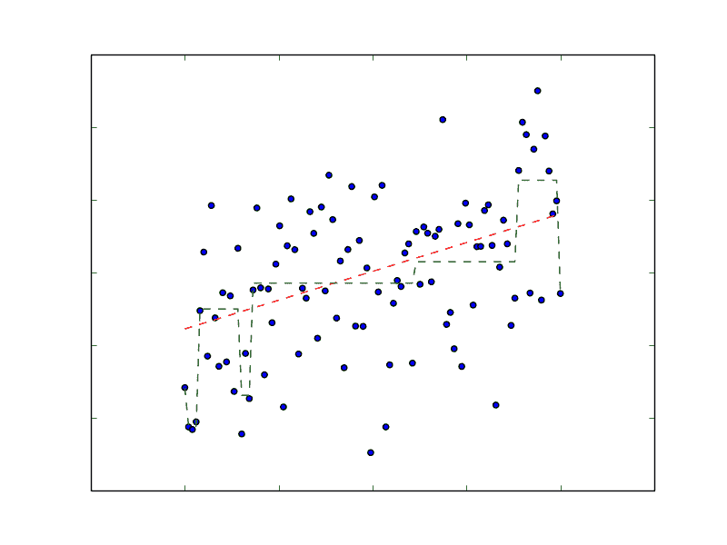
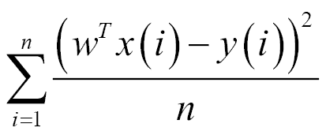
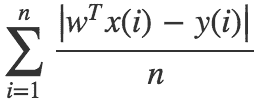
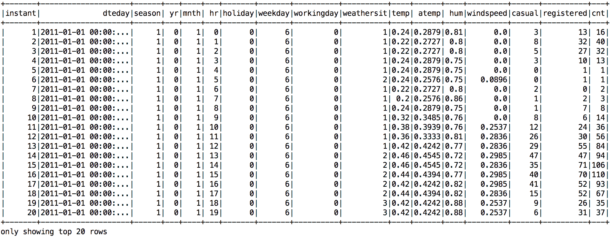
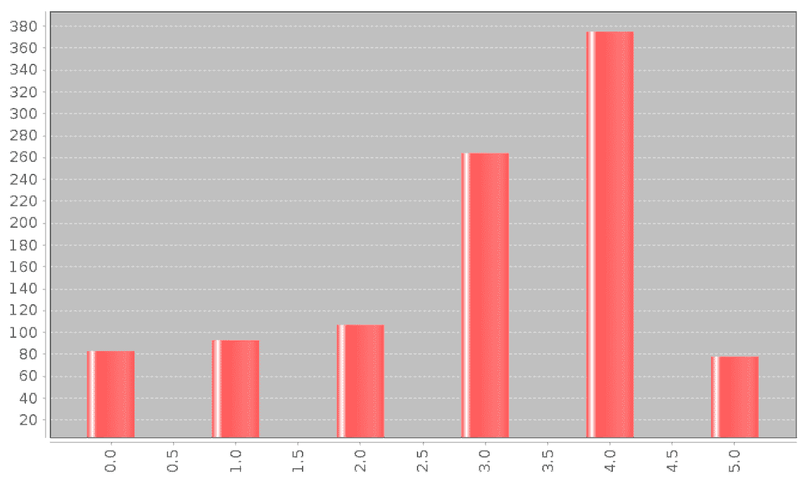
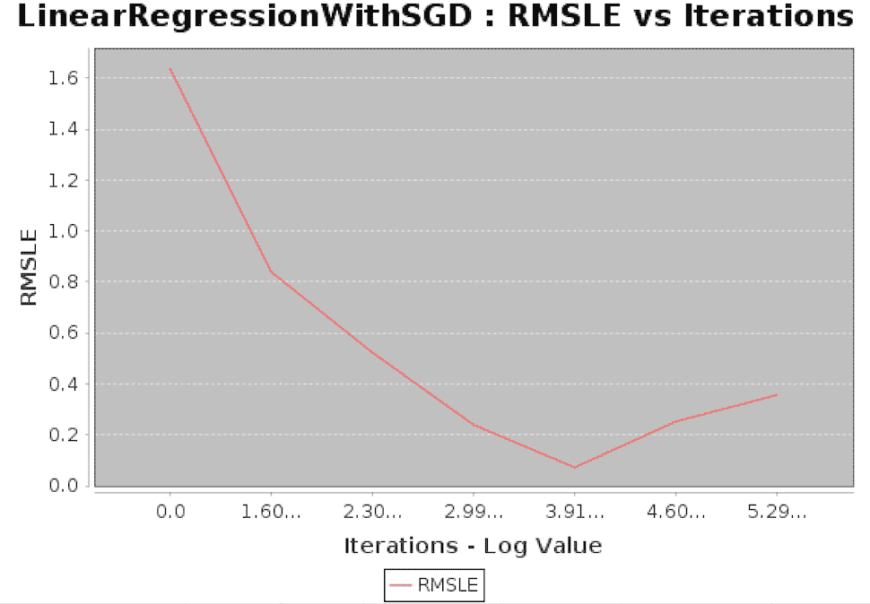
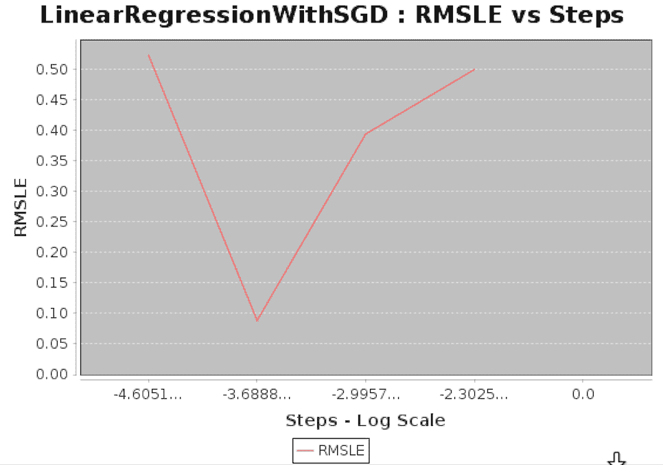
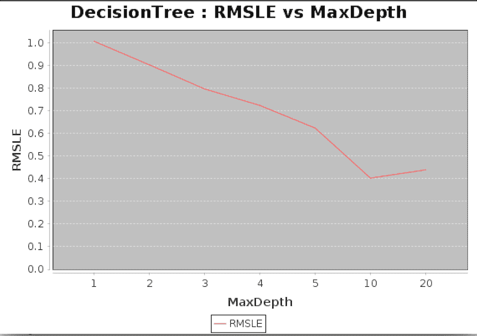
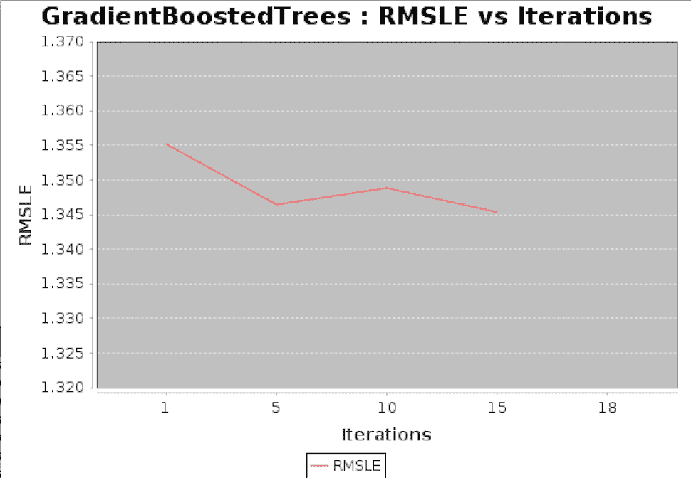
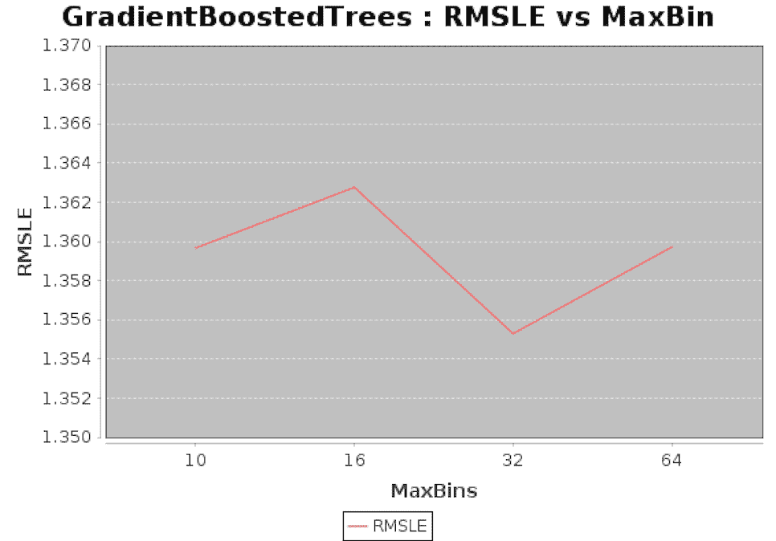

# 用 Spark 建立回归模型

在本章中，我们将以[章](06.html)，*使用 Spark*构建分类模型中介绍的内容为基础。 分类模型处理的是代表离散类的结果，而回归模型关注的是可以取任何实际值的目标变量。 其基本原理非常相似--我们希望找到一个将输入特性映射到预测目标变量的模型。 与分类一样，回归也是有监督学习的一种形式。

回归模型几乎可以用来预测任何感兴趣的变量。 以下是几个例子：

*   预测股票回报和其他经济变量
*   预测贷款违约的损失金额(这可以与预测违约概率的分类模型相结合，而回归模型预测违约情况下的损失金额)
*   推荐([章](05.html)，*中的交替最小二乘分解模型使用 Spark*构建推荐引擎，在每次迭代中使用线性回归)
*   根据用户行为和消费模式，预测零售、移动或其他业务中的**客户终身价值**(**CLTV[T3**

在本章的不同部分中，我们将执行以下操作：

*   介绍 ML 中可用的各种类型的回归模型
*   探索回归模型的特征提取和目标变量转换
*   使用 ML 训练多个回归模型
*   了解如何使用经过训练的模型进行预测
*   使用交叉验证研究回归的各种参数设置对性能的影响

# 回归模型的类型

线性模型(或广义线性模型)的核心思想是，我们将感兴趣的预测结果(通常称为目标或因变量)建模为应用于输入变量(也称为特征或自变量)的简单线性预测器的函数。

*y = f(w<sup>T</sup>x)*

这里，*y*是目标变量，*w*是参数向量(称为权重向量)，*x*是输入特征的向量。

*w<sup>T</sup>x*是权重向量*w*和特征向量*x*的线性预测器(或向量点积)。 对于这个线性预测器，我们应用了函数*f*(称为链接函数)。

事实上，只需改变连接函数，线性模型就可以用于分类和回归。 标准线性回归使用身份链接(即，*y=w<sup>T</sup>x*直接)，而二进制分类使用此处讨论的替代链接函数。

Spark 的 ML 库提供了不同的回归模型，如下所示：

*   线性回归
*   广义线性回归
*   逻辑回归
*   决策树
*   随机森林回归
*   梯度增强树
*   生存回归
*   等张回归
*   岭回归

回归模型定义了因变量和一个或多个自变量之间的关系。 它建立了符合自变量或特征值的最佳模型。

与支持向量机和 Logistic 回归等分类模型不同，线性回归用于预测具有广义值的因变量的值，而不是预测确切的类别标签。

线性回归模型与其对应的分类模型本质上是相同的，唯一的区别是线性回归模型使用不同的损失函数、相关链接函数和决策函数。 Spark ML 提供了标准的最小二乘回归模型(尽管还计划使用其他类型的广义线性回归模型)。

# 最小二乘回归

您可能还记得，在[第 6 章](06.html)，*使用 Spark*构建分类模型中，有多种损失函数可以应用于广义线性模型。 用于最小二乘的损失函数是平方损失，其定义如下：

*½ (w<sup>T</sup>x - y)<sup>2</sup>*

这里，对于分类设置，*y*是目标变量(这次是实数)，*w*是权重向量，*x*是特征向量。

相关链接函数是同一性链接，决策函数也是同一性函数，一般不采用阈值进行回归。 因此，该模型的预测简单地为*y=w<sup>T</sup>x*。

ML 库中的标准最小二乘回归不使用正则化。 采用正则化方法解决过拟合问题。 查看平方损失函数，我们可以看到，由于损失平方，应用于预测错误的点的损失将被放大。 这意味着最小二乘回归很容易受到数据集中的异常值的影响，也容易受到过度拟合的影响。 一般来说，对于分类，我们应该在实践中运用一定程度的正规化。

使用 L2 正则化的线性回归通常称为岭回归，而应用 L1 正则化的线性回归称为套索。

当数据集较小或样本数较少时，模型过度拟合的倾向很大，因此强烈建议使用 L1、L2 或弹性网等正则化函数。

See the section on linear least squares in the Spark MLlib documentation at [http://spark.apache.org/docs/latest/mllib-linear-methods.html#linear-least-squares-lasso-and-ridge-regression](http://spark.apache.org/docs/latest/mllib-linear-methods.html#linear-least-squares-lasso-and-ridge-regression) for further information.

# 用于回归的决策树

正如使用线性模型进行回归任务涉及更改使用的损失函数一样，使用决策树进行回归涉及更改使用的节点杂质的度量。 杂质度量称为**方差**，其定义方式与最小二乘线性回归的平方损失相同。

See the *MLlib - Decision Tree* section in the Spark documentation at [http://spark.apache.org/docs/latest/mllib-decision-tree.html](http://spark.apache.org/docs/latest/mllib-decision-tree.html) for further details on the decision tree algorithm and impurity measure for regression.

现在，我们将绘制一个简单的回归问题示例，其中只有一个输入变量显示在*x*轴上，目标变量显示在*y*轴上。 线性模型预测函数用红色虚线表示，而决策树预测函数用绿色虚线表示。 我们可以看到，决策树允许更复杂、更非线性的模型适用于数据：



# 评价回归模型的性能

我们在[第 6 章](06.html)，*使用 Spark*构建分类模型中看到，分类模型的评估方法通常侧重于与预测的类成员关系相对于实际类成员关系的度量。 这是两种结果(预测的类别是正确的还是不正确的)，模型只是勉强预测正确还是错误并不重要；我们最关心的是正确和错误预测的数量。

在处理回归模型时，我们的模型不太可能准确地预测目标变量，因为目标变量可以取任何实际值。 然而，我们自然希望了解我们的预测值与真实值之间的距离有多远，因此我们将利用一个考虑总体偏差的度量标准。

用于衡量回归模型性能的一些标准评估度量包括**均方误差**(**MSE**)和**均方根误差**(**RMSE**)、**平均绝对误差**(**MAE**)、R 平方系数等。

# 均方误差和均方根误差

MSE 是用作最小二乘回归损失函数的平方误差的平均值：



在所有数据点上，它是预测目标变量和实际目标变量之间差值的平方除以数据点数量的总和。

均方根是均方误差的平方根。 MSE 以目标变量的平方为单位进行测量，而 RMSE 以与目标变量相同的单位进行测量。 由于它的公式，MSE，就像它得到的平方损失函数一样，有效地惩罚了更大的错误。

为了基于误差度量的平均值评估我们的预测，我们将首先通过使用将预测和真实目标值作为输入的函数计算每个记录的误差来对`LabeledPoint`个实例的 RDD 中的每个输入特征向量进行预测。 这将返回包含错误值的`[Double]`RDD。 然后，我们可以使用包含双精度值的 RDDS 的平均值方法来计算平均值。

让我们定义平方误差函数，如下所示：

```scala
Scala  
def squaredError(actual:Double, pred : Double) : Double = { 
  return Math.pow( (pred - actual), 2.0) 
} 

```

# 平均绝对误差

MAE 是预测目标与实际目标的绝对差值的平均值，给出如下：



MAE 在原则上类似于 MSE，但它不会对较大的偏差进行同样程度的惩罚。

我们计算 MAE 的函数如下：

```scala
Scala 
def absError(actual:Double, pred: Double) : Double = { 
  return Math.abs( (pred - actual)) 
} 

```

# 均方根对数误差

这一衡量标准不像 MSE 和 MAE 那样被广泛使用，但它被用作使用共享单车数据集的 Kaggle 竞赛的衡量标准。 它实际上是对数变换后的预测值和目标值的均方根误差。 当目标变量的范围很大时，此度量很有用，并且当预测值和目标值本身都很高时，您不一定要惩罚较大的错误。 当您关心误差百分比而不是误差的绝对值时，它也很有效。

The Kaggle competition evaluation page can be found at [https://www.kaggle.com/c/bike-sharing-demand/details/evaluation](https://www.kaggle.com/c/bike-sharing-demand/details/evaluation).

计算 RMSLE 的函数如下所示：

```scala
Scala 
def squaredLogError(actual:Double, pred : Double) : Double = { 
  return Math.pow( (Math.log(pred +1) - Math.log(actual +1)), 2.0) 
} 

```

# R 平方系数

R 平方系数，也称为决定系数，是衡量模型与数据集拟合程度的指标。 它通常用于统计。 它测量目标变量的变化程度；这是由输入特征的变化来解释的。 R 平方系数通常取 0 到 1 之间的值，其中 1 等同于模型的完美拟合。

# 从数据中提取正确的要素

由于用于回归的底层模型与用于分类情况的模型相同，因此我们可以使用相同的方法来创建输入要素。 唯一的实际区别是，目标现在是实值变量，而不是绝对变量。 ML 库中的`LabeledPoint`类已经考虑到了这一点，因为`label`字段是`Double`类型，所以它可以处理这两种情况。

# 从共享单车数据集中提取要素

为了说明本章中的概念，我们将使用共享单车数据集。 此数据集包含首都自行车共享系统中自行车租赁次数的每小时记录。 它还包含与日期、时间、天气、季节和假日信息相关的变量。

The dataset is available at [http://archive.ics.uci.edu/ml/datasets/Bike+Sharing+Dataset](http://archive.ics.uci.edu/ml/datasets/Bike+Sharing+Dataset).
Click on the Data Folder link, and then download the `Bike-Sharing-Dataset.zip` file.
The bike sharing data was enriched with weather and seasonal data by Hadi Fanaee-T at the University of Porto and used in the following paper:
Fanaee-T, Hadi and Gama Joao, Event labeling combining ensemble detectors and background knowledge, *Progress in Artificial Intelligence*, pp. 1-15, Springer Berlin Heidelberg, 2013.
The paper is available at [http://link.springer.com/article/10.1007%2Fs13748-013-0040-3](http://link.springer.com/article/10.1007%2Fs13748-013-0040-3).

下载`Bike-Sharing-Dataset.zip`文件后，将其解压缩。 这将创建一个名为`Bike-Sharing-Dataset`的目录，其中包含`day.csv`、`hour.csv`和`Readme.txt`文件。

`Readme.txt`文件包含有关数据集的信息，包括变量名称和描述。 查看该文件，您将看到我们有以下变量可用：

*   `instant`：这是记录 ID
*   `dteday`：这是原始日期
*   `season`：指春、夏、冬、秋等不同季节
*   `yr`：今年(2011 或 2012)
*   `mnth`：这是一年中的月份
*   `hr`：这是一天中的一小时
*   `holiday`：显示当天是否放假
*   `weekday`：这是一周中的某一天
*   `workingday`：指当天是否工作日
*   `weathersit`：这是描述特定时间天气的分类变量
*   `temp`：这是归一化温度
*   `atemp`：这是归一化表观温度
*   `hum`：这是归一化湿度
*   `windspeed`：这是归一化风速
*   `cnt`：这是目标变量，即该小时的自行车租赁次数

我们将使用`hour.csv`中包含的每小时数据。 如果查看数据集的第一行，您将看到它包含作为标题的列名。 以下代码片段打印标题和前 20 条记录：

```scala
val spark = SparkSession 
  .builder 
  .appName("BikeSharing") 
  .master("local[1]") 
  .getOrCreate() 

// read from csv 
val df = spark.read.format("csv").option("header", 
   "true").load("/dataset/BikeSharing/hour.csv") 
df.cache() 

df.registerTempTable("BikeSharing") 
print(df.count()) 

spark.sql("SELECT * FROM BikeSharing").show() 

```

前面的代码片段应该输出以下结果：

```scala
 root
 |-- instant: integer (nullable = true)
 |-- dteday: timestamp (nullable = true)
 |-- season: integer (nullable = true)
 |-- yr: integer (nullable = true)
 |-- mnth: integer (nullable = true)
 |-- hr: integer (nullable = true)
 |-- holiday: integer (nullable = true)
 |-- weekday: integer (nullable = true)
 |-- workingday: integer (nullable = true)
 |-- weathersit: integer (nullable = true)
 |-- temp: double (nullable = true)
 |-- atemp: double (nullable = true)
 |-- hum: double (nullable = true)
 |-- windspeed: double (nullable = true)
 |-- casual: integer (nullable = true)
 |-- registered: integer (nullable = true)
 |-- cnt: integer (nullable = true)

```



我们将使用 Scala 来演示本章中的示例。 本章的源代码可以在位置[https://github.com/ml-resources/spark-ml/tree/branch-ed2/Chapter_07](https://github.com/ml-resources/spark-ml/tree/branch-ed2/Chapter_07)找到。

我们将像往常一样开始加载数据集并检查它；从前面的数据帧中获取记录计数，如下所示：

```scala
print(df.count()) 

```

这应该会输出以下结果：

```scala
    17,379

```

因此，我们的数据集中有`17,379`个小时记录。 我们已经检查了列名。 我们将忽略记录 ID 和原始日期列。 我们还将忽略`casual`和`registered`计数目标变量，而关注总体计数变量`cnt`(它是其他两个计数的总和)。 我们只剩下 12 个变量了。 前八个变量是绝对变量，后四个变量是归一化实值变量。

```scala
// drop record id, date, casual and registered columns 
val df1 = 
   df.drop("instant").drop("dteday").drop("casual")
   .drop("registered") 
df1.printSchema() 

```

这最后一段代码应该会输出以下结果：

```scala
 root
 |-- season: integer (nullable = true)
 |-- yr: integer (nullable = true)
 |-- mnth: integer (nullable = true)
 |-- hr: integer (nullable = true)
 |-- holiday: integer (nullable = true)
 |-- weekday: integer (nullable = true)
 |-- workingday: integer (nullable = true)
 |-- weathersit: integer (nullable = true)
 |-- temp: double (nullable = true)
 |-- atemp: double (nullable = true)
 |-- hum: double (nullable = true)
 |-- windspeed: double (nullable = true)
 |-- cnt: integer (nullable = true)

```

所有列都强制转换为双精度；以下代码片段显示了如何执行此操作：

```scala
// convert to double: season,yr,mnth,hr,holiday,weekday,workingday,weathersit,temp,atemp,hum,windspeed,casual,registered,cnt 
val df2 = df1.withColumn("season", 
   df1("season").cast("double")).withColumn("yr", 
   df1("yr").cast("double")) 
  .withColumn("mnth", df1("mnth").cast("double")).withColumn("hr", 
     df1("hr").cast("double")).withColumn("holiday", 
     df1("holiday").cast("double")) 
  .withColumn("weekday", 
     df1("weekday").cast("double")).withColumn("workingday", 
     df1("workingday").cast("double")).withColumn("weathersit", 
     df1("weathersit").cast("double")) 
  .withColumn("temp", 
     df1("temp").cast("double")).withColumn("atemp", 
     df1("atemp").cast("double")).withColumn("hum", 
     df1("hum").cast("double")) 
  .withColumn("windspeed", 
     df1("windspeed").cast("double")).withColumn("label", 
     df1("label").cast("double")) 

df2.printSchema() 

```

前面的代码应该输出以下结果：

```scala
 root
 |-- season: double (nullable = true)
 |-- yr: double (nullable = true)
 |-- mnth: double (nullable = true)
 |-- hr: double (nullable = true)
 |-- holiday: double (nullable = true)
 |-- weekday: double (nullable = true)
 |-- workingday: double (nullable = true)
 |-- weathersit: double (nullable = true)
 |-- temp: double (nullable = true)
 |-- atemp: double (nullable = true)
 |-- hum: double (nullable = true)
 |-- windspeed: double (nullable = true)
 |-- label: double (nullable = true)

```

共享单车数据集本质上是分类的，需要使用**矢量汇编器**和**矢量索引器**进行处理，如下所述：

*   向量汇编器是一种转换器，它将列的列表组合成单个向量列。 它将原始特征组合成特征向量，以训练线性回归和决策树等 ML 模型。
*   向量索引器索引分类特征，在本例中是从向量汇编器传递的。 它自动决定哪些特征是分类的，并将实际值转换为类别索引。

在我们的示例中，df2 中除`label`之外的所有列都由`VectorAssembler`转换为`rawFeatures`。

给定类型为`Vector`的输入列和名为`maxCategories`的`param`，它根据不同的值决定哪些特性应该是分类的，其中最多包含`maxCategories`的特性被声明为分类的。

```scala
// drop label and create feature vector 
val df3 = df2.drop("label") 
val featureCols = df3.columns 

val vectorAssembler = new 
   VectorAssembler().setInputCols(featureCols)
   .setOutputCol("rawFeatures") 
val vectorIndexer = new 
   VectorIndexer().setInputCol("rawFeatures")
   .setOutputCol("features").setMaxCategories(4) 

```

The complete code-listing is available at [https://github.com/ml-resources/spark-ml/blob/branch-ed2/Chapter_07/scala/2.0.0/scala-spark-app/src/main/scala/org/sparksamples/regression/bikesharing/BikeSharingExecutor.scala](https://github.com/ml-resources/spark-ml/blob/branch-ed2/Chapter_07/scala/2.0.0/scala-spark-app/src/main/scala/org/sparksamples/regression/bikesharing/BikeSharingExecutor.scala).

# 训练和使用回归模型

回归模型的训练过程与分类模型的训练过程相同。 我们只需将训练数据传递给相关的训练方法。

# BikeSharingExecutor

可以使用`BikeSharingExecutor`对象选择并运行各自的回归模型，例如，要运行`LinearRegression`并执行线性回归管道，将程序参数设置为`LR_<type>`，其中`type`为数据格式；其他命令请参见以下代码片段：

```scala
def executeCommand(arg: String, vectorAssembler: VectorAssembler, 
   vectorIndexer: VectorIndexer, dataFrame: DataFrame, spark: 
   SparkSession) = arg match { 
    case "LR_Vectors" => 
     LinearRegressionPipeline.linearRegressionWithVectorFormat
     (vectorAssembler, vectorIndexer, dataFrame) 
    case "LR_SVM" => 
     LinearRegressionPipeline.linearRegressionWithSVMFormat(spark) 

    case "GLR_Vectors" => 
     GeneralizedLinearRegressionPipeline
     .genLinearRegressionWithVectorFormat(vectorAssembler, 
      vectorIndexer, dataFrame) 
    case "GLR_SVM"=> 
     GeneralizedLinearRegressionPipeline
     .genLinearRegressionWithSVMFormat(spark) 

    case "DT_Vectors" => DecisionTreeRegressionPipeline
     .decTreeRegressionWithVectorFormat(vectorAssembler, 
     vectorIndexer, dataFrame) 
    case "DT_SVM"=> 
     GeneralizedLinearRegressionPipeline
     .genLinearRegressionWithSVMFormat(spark) 

    case "RF_Vectors" => 
     RandomForestRegressionPipeline
     .randForestRegressionWithVectorFormat(vectorAssembler, 
     vectorIndexer, dataFrame) 
    case "RF_SVM"=> 
     RandomForestRegressionPipeline
     .randForestRegressionWithSVMFormat(spark) 

    case "GBT_Vectors" => 
     GradientBoostedTreeRegressorPipeline
     .gbtRegressionWithVectorFormat(vectorAssembler, vectorIndexer, 
     dataFrame) 
    case "GBT_SVM"=> 
     GradientBoostedTreeRegressorPipeline
     .gbtRegressionWithSVMFormat(spark) 

} 

```

The code-listing can be found at this link:
[https://github.com/ml-resources/spark-ml/blob/branch-ed2/Chapter_07/scala/2.0.0/scala-spark-app/src/main/scala/org/sparksamples/regression/bikesharing/BikeSharingExecutor.scala](https://github.com/ml-resources/spark-ml/blob/branch-ed2/Chapter_07/scala/2.0.0/scala-spark-app/src/main/scala/org/sparksamples/regression/bikesharing/BikeSharingExecutor.scala)

# 在共享单车数据集上训练回归模型

### 线性回归

线性回归是最常用的算法。 回归分析的核心是通过数据图拟合单线的任务。 线性方程由*y=c+b*x*描述，其中*y*=估计因变量，*c*=常数，*b*=回归系数，*x*=自变量。

让我们通过将共享单车数据集分为 80%的训练和 20%的测试来训练它，使用`LinearRegression`和 Spark 的回归赋值器来构建模型，并获得围绕测试数据的评估指标。 `linearRegressionWithVectorFormat`方法使用分类数据，而`linearRegressionWithSVMFormat`使用`Bike-sharing`数据集的`libsvm`格式。

```scala
def linearRegressionWithVectorFormat(vectorAssembler: 
   VectorAssembler, vectorIndexer: VectorIndexer, dataFrame: 
   DataFrame) = { 
  val lr = new LinearRegression() 
    .setFeaturesCol("features") 
    .setLabelCol("label") 
    .setRegParam(0.1) 
    .setElasticNetParam(1.0) 
    .setMaxIter(10) 

  val pipeline = new Pipeline().setStages(Array(vectorAssembler, 
   vectorIndexer, lr)) 

  val Array(training, test) = dataFrame.randomSplit(Array(0.8, 
   0.2), seed = 12345) 

  val model = pipeline.fit(training) 

  val fullPredictions = model.transform(test).cache() 
  val predictions = 
   fullPredictions.select("prediction").rdd.map(_.getDouble(0)) 
  val labels = 
   fullPredictions.select("label").rdd.map(_.getDouble(0)) 
  val RMSE = new 
   RegressionMetrics(predictions.zip(labels)).rootMeanSquaredError 
  println(s"  Root mean squared error (RMSE): $RMSE") 
} 

def linearRegressionWithSVMFormat(spark: SparkSession) = { 
  // Load training data 
  val training = spark.read.format("libsvm") 
    .load("/dataset/BikeSharing/lsvmHours.txt") 

  val lr = new LinearRegression() 
    .setMaxIter(10) 
    .setRegParam(0.3) 
    .setElasticNetParam(0.8) 

  // Fit the model 
  val lrModel = lr.fit(training) 

  // Print the coefficients and intercept for linear regression 
  println(s"Coefficients: ${lrModel.coefficients} Intercept: 
   ${lrModel.intercept}") 

  // Summarize the model over the training set and print out some 
   metrics 
  val trainingSummary = lrModel.summary 
  println(s"numIterations: ${trainingSummary.totalIterations}") 
  println(s"objectiveHistory: 
   ${trainingSummary.objectiveHistory.toList}") 
  trainingSummary.residuals.show() 
  println(s"RMSE: ${trainingSummary.rootMeanSquaredError}") 
  println(s"r2: ${trainingSummary.r2}") 
} 

```

上述代码应显示以下输出。 请注意，残差代表表达式残差：(标签-预测值)

```scala
+-------------------+
|          residuals|
+-------------------+
|  32.92325797801143|
|  59.97614044359903|
|  35.80737062786482|
|-12.509886468051075|
|-25.979774633117792|
|-29.352862474201224|
|-5.9517346926691435|
| 18.453701019500947|
|-24.859327293384787|
| -47.14282080103287|
| -27.50652100848832|
| 21.865309097336535|
|  4.037722798853395|
|-25.691348213368343|
| -13.59830538387368|
|  9.336691727080336|
|  12.83461983259582|
|  -20.5026155752185|
| -34.83240621318937|
| -34.30229437825615|
+-------------------+
only showing top 20 rows
RMSE: 149.54567868651284
r2: 0.3202369690447968

```

The code-listing can be found at [https://github.com/ml-resources/spark-ml/blob/branch-ed2/Chapter_07/scala/2.0.0/scala-spark-app/src/main/scala/org/sparksamples/regression/bikesharing/LinearRegressionPipeline.scala](https://github.com/ml-resources/spark-ml/blob/branch-ed2/Chapter_07/scala/2.0.0/scala-spark-app/src/main/scala/org/sparksamples/regression/bikesharing/LinearRegressionPipeline.scala).

# 广义线性回归

线性回归服从高斯分布，而**广义线性模型**(**GLMS**)是线性模型的规范，其中响应变量`Y`服从指数分布族中的某个分布。

让我们通过将共享单车数据集分为 80%的训练和 20%的测试来训练它，使用`GeneralizedLinearRegression`和 Spark 的回归赋值器来构建模型，并获得围绕测试数据的评估指标。

```scala
@transient lazy val logger = Logger.getLogger(getClass.getName) 

def genLinearRegressionWithVectorFormat(vectorAssembler: 
   VectorAssembler, vectorIndexer: VectorIndexer, dataFrame: 
   DataFrame) = { 
   val lr = new GeneralizedLinearRegression() 
    .setFeaturesCol("features") 
    .setLabelCol("label") 
    .setFamily("gaussian") 
    .setLink("identity") 
    .setMaxIter(10) 
    .setRegParam(0.3) 

  val pipeline = new Pipeline().setStages(Array(vectorAssembler, 
   vectorIndexer, lr)) 

  val Array(training, test) = dataFrame.randomSplit(Array(0.8, 
   0.2), seed = 12345) 

  val model = pipeline.fit(training) 

  val fullPredictions = model.transform(test).cache() 
  val predictions = 
   fullPredictions.select("prediction").rdd.map(_.getDouble(0)) 
  val labels = 
   fullPredictions.select("label").rdd.map(_.getDouble(0)) 
  val RMSE = new 
   RegressionMetrics(predictions.zip(labels)).rootMeanSquaredError 
  println(s"  Root mean squared error (RMSE): $RMSE") 
} 

def genLinearRegressionWithSVMFormat(spark: SparkSession) = { 
  // Load training data 
  val training = spark.read.format("libsvm") 
    .load("/dataset/BikeSharing/lsvmHours.txt") 

  val lr = new GeneralizedLinearRegression() 
    .setFamily("gaussian") 
    .setLink("identity") 
    .setMaxIter(10) 
    .setRegParam(0.3) 

  // Fit the model 
  val model = lr.fit(training) 

  // Print the coefficients and intercept for generalized linear 
   regression model 
  println(s"Coefficients: ${model.coefficients}") 
  println(s"Intercept: ${model.intercept}") 

  // Summarize the model over the training set and print out some 
   metrics 
  val summary = model.summary 
  println(s"Coefficient Standard Errors: 
   ${summary.coefficientStandardErrors.mkString(",")}") 
  println(s"T Values: ${summary.tValues.mkString(",")}") 
  println(s"P Values: ${summary.pValues.mkString(",")}") 
  println(s"Dispersion: ${summary.dispersion}") 
  println(s"Null Deviance: ${summary.nullDeviance}") 
  println(s"Residual Degree Of Freedom Null: 
   ${summary.residualDegreeOfFreedomNull}") 
  println(s"Deviance: ${summary.deviance}") 
  println(s"Residual Degree Of Freedom: 
   ${summary.residualDegreeOfFreedom}") 
  println(s"AIC: ${summary.aic}") 
  println("Deviance Residuals: ") 
  summary.residuals().show()   
} 

```

这应该会输出以下结果：

估计系数和截距的标准误差。

如果`[GeneralizedLinearRegression.fitIntercept]`设置为 TRUE，则返回的最后一个元素对应于截取。

前面代码中的系数标准误差如下：

```scala
1.1353970394903834,2.2827202289405677,0.5060828045490352,0.1735367945
   7103457,7.062338310890969,0.5694233355369813,2.5250738792716176,
2.0099641224706573,0.7596421898012983,0.6228803024758551,0.0735818071
   8894239,0.30550603737503224,12.369537640641184

```

估计系数和截距的 t 统计量如下：

```scala
T Values: 15.186791802016964,33.26578339676457,-
   11.27632316133038,8.658129103690262,-
   3.8034120518318013,2.6451862430890807,0.9799958329796699,
3.731755243874297,4.957582264860384,6.02053185645345,-
   39.290272209592864,5.5283417898112726,-0.7966500413552742

```

估计系数和截距的双边 p 值如下：

```scala
P Values: 0.0,0.0,0.0,0.0,1.4320532622846827E-
   4,0.008171946193283652,0.3271018275330657,1.907562616410008E-
   4,7.204877614519489E-7,
1.773422964035376E-9,0.0,3.2792739856901676E-8,0.42566519676340153

```

分布情况如下：

```scala
Dispersion: 22378.414478769333

```

The dispersion of the fitted model is taken as 1.0 for the "binomial" and "poisson" families, and otherwise estimated by the residual Pearson's Chi-Squared statistic (which is defined as the sum of the squares of the Pearson residuals) divided by the residual degrees of freedom.

上述代码的零偏差输出如下：

```scala
Null Deviance: 5.717615910707208E8

```

剩余自由度如下：

```scala
Residual Degree Of Freedom Null: 17378

```

在 Logistic 回归分析中，用偏差代替平方和计算。 偏差类似于线性回归中平方计算的总和，是对 Logistic 回归模型中数据不匹配的度量。 当“饱和”模型可用时(理论上完全符合的模型)，通过比较给定的模型和饱和模型来计算偏差。

偏差：`3.886235458383082E8`

Reference: [https://en.wikipedia.org/wiki/Logistic_regression](https://en.wikipedia.org/wiki/Logistic_regression)

**自由度**：

自由度的概念是根据人口样本估计人口统计数据的原则的核心。 “自由度”通常缩写为 DF。

可以将 df 看作一个数学限制，当根据一个统计数据估计另一个统计数据时，需要将其放在适当的位置。 前面的代码将给出以下输出：

```scala
Residual Degree Of Freedom: 17366

```

**Akaike 信息准则**(**AIC**)是对给定数据集的统计模型的相对质量的度量。 在给定数据模型集合的情况下，AIC 估计每个模型相对于其他模型的质量。 因此，AIC 为选型提供了一种手段。

Reference : [https://en.wikipedia.org/wiki/Akaike_information_criterion](https://en.wikipedia.org/wiki/Akaike_information_criterion)

装配模型输出的 AIC 如下：

```scala
AIC: 223399.95490762248
+-------------------+
|  devianceResiduals|
+-------------------+
| 32.385412453563546|
|   59.5079185994115|
|  34.98037491140896|
|-13.503450469022432|
|-27.005954440659032|
|-30.197952952158246|
| -7.039656861683778|
| 17.320193923055445|
|  -26.0159703272054|
| -48.69166247116218|
| -29.50984967584955|
| 20.520222192742004|
| 1.6551311183207815|
|-28.524373674665213|
|-16.337935852841838|
|  6.441923904310045|
|   9.91072545492193|
|-23.418896074866524|
|-37.870797650696346|
|-37.373301622332946|
+-------------------+
only showing top 20 rows

```

The complete code listing is available at this link:
[https://github.com/ml-resources/spark-ml/blob/branch-ed2/Chapter_07/scala/2.0.0/scala-spark-app/src/main/scala/org/sparksamples/regression/bikesharing/GeneralizedLinearRegressionPipeline.scala](https://github.com/ml-resources/spark-ml/blob/branch-ed2/Chapter_07/scala/2.0.0/scala-spark-app/src/main/scala/org/sparksamples/regression/bikesharing/GeneralizedLinearRegressionPipeline.scala)

# 决策树回归

决策树模型是一种强大的、非概率的技术，可以捕捉更复杂的非线性模式和特征交互。 事实证明，它们在许多任务中表现良好，相对容易理解和解释，可以处理分类和数字特征，并且不需要对输入数据进行缩放或标准化。 它们非常适合包含在集成方法中(例如，决策树模型集成，称为决策森林)。

决策树算法是一种自上而下的方法，它从根节点(或特征)开始，然后在每个步骤选择一个特征，该特征给出数据集的最佳分裂，如该分裂的信息增益所衡量的那样。 信息增益是通过节点杂质(这是节点处的标签相似或同质的程度)减去拆分将产生的两个子节点的杂质的加权和来计算的。

让我们通过将共享单车数据集分为 80%的训练和 20%的测试来训练它，使用`DecisionTreeRegression`和 Spark 的回归赋值器来构建模型，并获得围绕测试数据的评估指标。

```scala
@transient lazy val logger = Logger.getLogger(getClass.getName) 

def decTreeRegressionWithVectorFormat(vectorAssembler: 
   VectorAssembler, vectorIndexer: VectorIndexer, dataFrame: 
   DataFrame) = { 
  val lr = new DecisionTreeRegressor() 
    .setFeaturesCol("features") 
    .setLabelCol("label") 

  val pipeline = new Pipeline().setStages(Array(vectorAssembler, 
   vectorIndexer, lr)) 

  val Array(training, test) = dataFrame.randomSplit(Array(0.8, 
   0.2), seed = 12345) 

  val model = pipeline.fit(training) 

  // Make predictions. 
  val predictions = model.transform(test) 

  // Select example rows to display. 
  predictions.select("prediction", "label", "features").show(5) 

  // Select (prediction, true label) and compute test error. 
  val evaluator = new RegressionEvaluator() 
    .setLabelCol("label") 
    .setPredictionCol("prediction") 
    .setMetricName("rmse") 
  val rmse = evaluator.evaluate(predictions) 
  println("Root Mean Squared Error (RMSE) on test data = " + rmse) 

  val treeModel = 
   model.stages(1).asInstanceOf[DecisionTreeRegressionModel] 
  println("Learned regression tree model:\n" + 
   treeModel.toDebugString)  } 

def decTreeRegressionWithSVMFormat(spark: SparkSession) = { 
  // Load training data 
  val training = spark.read.format("libsvm") 
    .load("/dataset/BikeSharing/lsvmHours.txt") 

  // Automatically identify categorical features, and index them. 
  // Here, we treat features with > 4 distinct values as 
   continuous. 
  val featureIndexer = new VectorIndexer() 
    .setInputCol("features") 
    .setOutputCol("indexedFeatures") 
    .setMaxCategories(4) 
    .fit(training) 

  // Split the data into training and test sets (30% held out for 
   testing). 
  val Array(trainingData, testData) = 
   training.randomSplit(Array(0.7, 0.3)) 

  // Train a DecisionTree model. 
  val dt = new DecisionTreeRegressor() 
    .setLabelCol("label") 
    .setFeaturesCol("indexedFeatures") 

  // Chain indexer and tree in a Pipeline. 
  val pipeline = new Pipeline() 
    .setStages(Array(featureIndexer, dt)) 

  // Train model. This also runs the indexer. 
  val model = pipeline.fit(trainingData) 

  // Make predictions. 
  val predictions = model.transform(testData) 

  // Select example rows to display. 
  predictions.select("prediction", "label", "features").show(5) 

  // Select (prediction, true label) and compute test error. 
  val evaluator = new RegressionEvaluator() 
    .setLabelCol("label") 
    .setPredictionCol("prediction") 
    .setMetricName("rmse") 
  val rmse = evaluator.evaluate(predictions) 
  println("Root Mean Squared Error (RMSE) on test data = " + rmse) 

  val treeModel = 
   model.stages(1).asInstanceOf[DecisionTreeRegressionModel] 
  println("Learned regression tree model:\n" + 
   treeModel.toDebugString) 
} 

```

这应该会输出以下结果：

```scala
Coefficients: [17.243038451366886,75.93647669134975,-5.7067532504873215,1.5025039716365927,-26.86098264575616,1.5062307736563205,2.4745618796519953,7.500694154029075,3.7659886477986215,3.7500707038132464,-2.8910492341273235,1.6889417934600353]
Intercept: -9.85419267296242

Coefficient Standard Errors: 1.1353970394903834,2.2827202289405677,0.5060828045490352,0.17353679457103457,7.062338310890969,0.5694233355369813,2.5250738792716176,2.0099641224706573,0.7596421898012983,0.6228803024758551,0.07358180718894239,0.30550603737503224,12.369537640641184
T Values: 15.186791802016964,33.26578339676457,-11.27632316133038,8.658129103690262,-3.8034120518318013,2.6451862430890807,0.9799958329796699,3.731755243874297,4.957582264860384,6.02053185645345,-39.290272209592864,5.5283417898112726,-0.7966500413552742
P Values: 0.0,0.0,0.0,0.0,1.4320532622846827E-4,0.008171946193283652,0.3271018275330657,1.907562616410008E-4,7.204877614519489E-7,1.773422964035376E-9,0.0,3.2792739856901676E-8,0.42566519676340153
Dispersion: 22378.414478769333

Null Deviance: 5.717615910707208E8
Residual Degree Of Freedom Null: 17378
Deviance: 3.886235458383082E8
Residual Degree Of Freedom: 17366

AIC: 223399.95490762248
Deviance Residuals:
+-------------------+
|  devianceResiduals|
+-------------------+
| 32.385412453563546|
|   59.5079185994115|
|  34.98037491140896|
|-13.503450469022432|
|-27.005954440659032|
|-30.197952952158246|
| -7.039656861683778|
| 17.320193923055445|
|  -26.0159703272054|
| -48.69166247116218|
| -29.50984967584955|
| 20.520222192742004|
| 1.6551311183207815|
|-28.524373674665213|
|-16.337935852841838|
|  6.441923904310045|
|   9.91072545492193|
|-23.418896074866524|
|-37.870797650696346|
|-37.373301622332946|
+-------------------+
only showing top 20 rows

```

请参考上一节(广义线性回归)了解如何解释结果。

The code listing is available at [https://github.com/ml-resources/spark-ml/blob/branch-ed2/Chapter_07/scala/2.0.0/scala-spark-app/src/main/scala/org/sparksamples/regression/bikesharing/DecisionTreeRegressionPipeline.scala](https://github.com/ml-resources/spark-ml/blob/branch-ed2/Chapter_07/scala/2.0.0/scala-spark-app/src/main/scala/org/sparksamples/regression/bikesharing/DecisionTreeRegressionPipeline.scala).

# 成群的树木

集成方法是一种机器学习算法，它创建由一组其他基本模型组成的模型。 Spark 机器学习支持两种主要的集成算法：`RandomForest`和`GradientBoostedTrees`。

# 随机森林回归

随机森林是由多棵决策树组合而成的决策树集合。 与决策树一样，随机森林可以处理分类特征，支持多类，并且不需要特征缩放。

让我们通过将共享单车数据集分为 80%的训练和 20%的测试来训练它，使用`RandomForestRegressor`和 Spark 的回归赋值器来构建模型，并获得围绕测试数据的评估指标。

```scala
@transient lazy val logger = Logger.getLogger(getClass.getName) 

def randForestRegressionWithVectorFormat(vectorAssembler: 
  VectorAssembler, vectorIndexer: VectorIndexer, dataFrame: 
   DataFrame) = { 
   val lr = new RandomForestRegressor() 
    .setFeaturesCol("features") 
    .setLabelCol("label") 

  val pipeline = new Pipeline().setStages(Array(vectorAssembler, 
   vectorIndexer, lr)) 

  val Array(training, test) = dataFrame.randomSplit(Array(0.8, 
   0.2), seed = 12345) 

  val model = pipeline.fit(training) 

  // Make predictions. 
  val predictions = model.transform(test) 

  // Select example rows to display. 
  predictions.select("prediction", "label", "features").show(5) 

  // Select (prediction, true label) and compute test error. 
  val evaluator = new RegressionEvaluator() 
    .setLabelCol("label") 
    .setPredictionCol("prediction") 
    .setMetricName("rmse") 
  val rmse = evaluator.evaluate(predictions) 
  println("Root Mean Squared Error (RMSE) on test data = " + rmse) 

  val treeModel = 
   model.stages(1).asInstanceOf[RandomForestRegressionModel] 
  println("Learned regression tree model:\n" + treeModel.toDebugString)  } 

def randForestRegressionWithSVMFormat(spark: SparkSession) = { 
  // Load training data 
  val training = spark.read.format("libsvm") 
    .load("/dataset/BikeSharing/lsvmHours.txt") 

  // Automatically identify categorical features, and index them. 
  // Set maxCategories so features with > 4 distinct values are 
   treated as continuous. 
  val featureIndexer = new VectorIndexer() 
    .setInputCol("features") 
    .setOutputCol("indexedFeatures") 
    .setMaxCategories(4) 
    .fit(training) 

  // Split the data into training and test sets (30% held out for 
   testing). 
  val Array(trainingData, testData) = 
   training.randomSplit(Array(0.7, 0.3)) 

  // Train a RandomForest model. 
  val rf = new RandomForestRegressor() 
    .setLabelCol("label") 
    .setFeaturesCol("indexedFeatures") 

  // Chain indexer and forest in a Pipeline. 
  val pipeline = new Pipeline() 
    .setStages(Array(featureIndexer, rf)) 

  // Train model. This also runs the indexer. 
  val model = pipeline.fit(trainingData) 

  // Make predictions. 
  val predictions = model.transform(testData) 

  // Select example rows to display. 
  predictions.select("prediction", "label", "features").show(5) 

  // Select (prediction, true label) and compute test error. 
  val evaluator = new RegressionEvaluator() 
    .setLabelCol("label") 
    .setPredictionCol("prediction") 
    .setMetricName("rmse") 
  val rmse = evaluator.evaluate(predictions) 
  println("Root Mean Squared Error (RMSE) on test data = " + rmse) 

  val rfModel = 
   model.stages(1).asInstanceOf[RandomForestRegressionModel] 
  println("Learned regression forest model:\n" + 
   rfModel.toDebugString) 
} 

```

这应该会输出以下结果：

```scala
RandomForest:   init: 2.114590873
total: 3.343042855
findSplits: 1.387490192
findBestSplits: 1.191715923
chooseSplits: 1.176991821

+------------------+-----+--------------------+
|        prediction|label|            features|
+------------------+-----+--------------------+
| 70.75171441904584|  1.0|(12,[0,1,2,3,4,5,...|
| 53.43733657257549|  1.0|(12,[0,1,2,3,4,5,...|
| 57.18242812368521|  1.0|(12,[0,1,2,3,4,5,...|
| 49.73744636247659|  1.0|(12,[0,1,2,3,4,5,...|
|56.433579398691144|  1.0|(12,[0,1,2,3,4,5,...|

Root Mean Squared Error (RMSE) on test data = 123.03866156451954
Learned regression forest model:
RandomForestRegressionModel (uid=rfr_bd974271ffe6) with 20 trees
 Tree 0 (weight 1.0):
 If (feature 9 <= 40.0)
 If (feature 9 <= 22.0)
 If (feature 8 <= 13.0)
 If (feature 6 in {0.0})
 If (feature 1 in {0.0})
 Predict: 35.0945945945946
 Else (feature 1 not in {0.0})
 Predict: 63.3921568627451
 Else (feature 6 not in {0.0})
 If (feature 0 in {0.0,1.0})
 Predict: 83.05714285714286
 Else (feature 0 not in {0.0,1.0})
 Predict: 120.76608187134502
 Else (feature 8 > 13.0)
 If (feature 3 <= 21.0)
 If (feature 3 <= 12.0)
 Predict: 149.56363636363636
 Else (feature 3 > 12.0)
 Predict: 54.73593073593074
 Else (feature 3 > 21.0)
 If (feature 6 in {0.0})
 Predict: 89.63333333333334
 Else (feature 6 not in {0.0})
 Predict: 305.6588235294118

```

前面的代码使用各种功能及其值来创建决策树。

The code listing can be found at [https://github.com/ml-resources/spark-ml/blob/branch-ed2/Chapter_07/scala/2.0.0/scala-spark-app/src/main/scala/org/sparksamples/regression/bikesharing/RandomForestRegressionPipeline.scala](https://github.com/ml-resources/spark-ml/blob/branch-ed2/Chapter_07/scala/2.0.0/scala-spark-app/src/main/scala/org/sparksamples/regression/bikesharing/RandomForestRegressionPipeline.scala).

# 梯度增强树回归

梯度增强树是决策树的集成。 梯度增强树迭代训练决策树以最小化损失函数。 梯度增强树处理分类特征，支持多类，并且不需要特征缩放。

Spark ML 使用现有的决策树实现了梯度增强树。 它既支持分类又支持回归。

让我们训练共享单车数据集，将其分为 80%的训练和 20%的测试，使用 GBTRegressor 和 Spark 的回归评估器来构建模型，并获得围绕测试数据的评估指标。

```scala
@transient lazy val logger = Logger.getLogger(getClass.getName) 

def gbtRegressionWithVectorFormat(vectorAssembler: 
   VectorAssembler, vectorIndexer: VectorIndexer, dataFrame: 
   DataFrame) = { 
  val lr = new GBTRegressor() 
    .setFeaturesCol("features") 
    .setLabelCol("label") 
    .setMaxIter(10) 

  val pipeline = new Pipeline().setStages(Array(vectorAssembler, 
   vectorIndexer, lr)) 

  val Array(training, test) = dataFrame.randomSplit(Array(0.8, 
   0.2), seed = 12345) 

  val model = pipeline.fit(training) 

  // Make predictions. 
  val predictions = model.transform(test) 

  // Select example rows to display. 
  predictions.select("prediction", "label", "features").show(5) 

  // Select (prediction, true label) and compute test error. 
  val evaluator = new RegressionEvaluator() 
    .setLabelCol("label") 
    .setPredictionCol("prediction") 
    .setMetricName("rmse") 
  val rmse = evaluator.evaluate(predictions) 
  println("Root Mean Squared Error (RMSE) on test data = " + rmse) 

  val treeModel = model.stages(1).asInstanceOf[GBTRegressionModel] 
  println("Learned regression tree model:\n" + 
   treeModel.toDebugString)  } 

def gbtRegressionWithSVMFormat(spark: SparkSession) = { 
  // Load training data 
  val training = spark.read.format("libsvm") 
    .load("/dataset/BikeSharing/lsvmHours.txt") 

  // Automatically identify categorical features, and index them. 
  // Set maxCategories so features with > 4 distinct values are 
   treated as continuous. 
  val featureIndexer = new VectorIndexer() 
    .setInputCol("features") 
    .setOutputCol("indexedFeatures") 
    .setMaxCategories(4) 
    .fit(training) 

  // Split the data into training and test sets (30% held out for 
   testing). 
  val Array(trainingData, testData) = 
   training.randomSplit(Array(0.7, 0.3)) 

  // Train a GBT model. 
  val gbt = new GBTRegressor() 
    .setLabelCol("label") 
    .setFeaturesCol("indexedFeatures") 
    .setMaxIter(10) 

  // Chain indexer and GBT in a Pipeline. 
  val pipeline = new Pipeline() 
    .setStages(Array(featureIndexer, gbt)) 

  // Train model. This also runs the indexer. 
  val model = pipeline.fit(trainingData) 

  // Make predictions 
  val predictions = model.transform(testData) 

  // Select example rows to display.
   predictions.select("prediction", "label", "features").show(5) 

  // Select (prediction, true label) and compute test error. 
  val evaluator = new RegressionEvaluator() 
    .setLabelCol("label") 
    .setPredictionCol("prediction") 
    .setMetricName("rmse") 
  val rmse = evaluator.evaluate(predictions) 
  println("Root Mean Squared Error (RMSE) on test data = " + rmse) 

  val gbtModel = model.stages(1).asInstanceOf[GBTRegressionModel] 
  println("Learned regression GBT model:\n" + 
   gbtModel.toDebugString) 
} 

```

这应该会输出以下结果：

```scala
RandomForest:   init: 1.366356823
total: 1.883186039
findSplits: 1.0378687
findBestSplits: 0.501171071
chooseSplits: 0.495084674

+-------------------+-----+--------------------+
|         prediction|label|            features|
+-------------------+-----+--------------------+
|-20.753742348814352|  1.0|(12,[0,1,2,3,4,5,...|
|-20.760717579684087|  1.0|(12,[0,1,2,3,4,5,...|
| -17.73182527714976|  1.0|(12,[0,1,2,3,4,5,...|
| -17.73182527714976|  1.0|(12,[0,1,2,3,4,5,...|
|   -21.397094071362|  1.0|(12,[0,1,2,3,4,5,...|
+-------------------+-----+--------------------+
only showing top 5 rows

Root Mean Squared Error (RMSE) on test data = 73.62468541448783
Learned regression GBT model:
GBTRegressionModel (uid=gbtr_24c6ef8f52a7) with 10 trees
 Tree 0 (weight 1.0):
 If (feature 9 <= 41.0)
 If (feature 3 <= 12.0)
 If (feature 3 <= 3.0)
 If (feature 3 <= 2.0)
 If (feature 6 in {1.0})
 Predict: 24.50709219858156
 Else (feature 6 not in {1.0})
 Predict: 74.94945848375451
 Else (feature 3 > 2.0)
 If (feature 6 in {1.0})
 Predict: 122.1732283464567
 Else (feature 6 not in {1.0})
 Predict: 206.3304347826087
 Else (feature 3 > 3.0)
 If (feature 8 <= 18.0)
 If (feature 0 in {0.0,1.0})
 Predict: 137.29818181818183
 Else (feature 0 not in {0.0,1.0})
 Predict: 257.90157480314963

```

The code listing is available at [https://github.com/ml-resources/spark-ml/blob/branch-ed2/Chapter_07/scala/2.0.0/scala-spark-app/src/main/scala/org/sparksamples/regression/bikesharing/GradientBoostedTreeRegressorPipeline.scala](https://github.com/ml-resources/spark-ml/blob/branch-ed2/Chapter_07/scala/2.0.0/scala-spark-app/src/main/scala/org/sparksamples/regression/bikesharing/GradientBoostedTreeRegressorPipeline.scala).

# 改进模型性能并调整参数

在[第 6 章](06.html)，*使用 Spark*构建分类模型中，我们展示了特征转换和选择如何对模型的性能产生很大影响。 在本章中，我们将重点介绍可应用于数据集的另一种类型的转换：转换目标变量本身。

# 转换目标变量

回想一下，许多机器学习模型，包括线性模型，都假设输入数据以及目标变量的分布。 特别地，线性回归假设为正态分布。

在许多实际情况下，线性回归的分布假设并不成立。 例如，在这种情况下，我们知道租赁自行车的数量永远不能为负。 仅此一点就应该表明，常态假设可能是有问题的。 为了更好地了解目标分布，绘制目标值的直方图通常是一个好主意。

现在，我们将在以下代码中创建目标变量分布的曲线图：

斯卡拉

The code for plotting raw data can be found at [https://github.com/ml-resources/spark-ml/blob/branch-ed2/Chapter_07/scala/1.6.2/scala-spark-app/src/main/scala/org/sparksamples/PlotRawData.scala](https://github.com/ml-resources/spark-ml/blob/branch-ed2/Chapter_07/scala/1.6.2/scala-spark-app/src/main/scala/org/sparksamples/PlotRawData.scala).

```scala
object PlotRawData { 

  def main(args: Array[String]) { 
    val records = Util.getRecords()._1 
    val records_x = records.map(r => r(r.length -1)) 
    var records_int = new Array[Int](records_x.collect().length) 
    print(records_x.first()) 
    val records_collect = records_x.collect() 

    for (i <- 0 until records_collect.length){ 
      records_int(i) = records_collect(i).toInt 
    } 
    val min_1 = records_int.min 
    val max_1 = records_int.max 

    val min = min_1 
    val max = max_1 
    val bins = 40 
    val step = (max/bins).toInt 

    var mx = Map(0 -> 0) 
    for (i <- step until (max + step) by step) { 
      mx += (i -> 0); 
    } 

    for(i <- 0 until records_collect.length){ 
      for (j <- 0 until (max + step) by step) { 
        if(records_int(i) >= (j) && records_int(i) < (j + step)){ 
          mx = mx + (j -> (mx(j) + 1)) 
        } 
      } 
    } 
    val mx_sorted = ListMap(mx.toSeq.sortBy(_._1):_*) 
    val ds = new org.jfree.data.category.DefaultCategoryDataset 
    var i = 0 
    mx_sorted.foreach{ case (k,v) => ds.addValue(v,"", k)} 

    val chart = ChartFactories.BarChart(ds) 
    val font = new Font("Dialog", Font.PLAIN,4); 

    chart.peer.getCategoryPlot.getDomainAxis(). 
      setCategoryLabelPositions(CategoryLabelPositions.UP_90); 
    chart.peer.getCategoryPlot.getDomainAxis.setLabelFont(font) 
    chart.show() 
    Util.sc.stop() 
  } 
} 

```

前面输出的曲线图如下所示：


处理这种情况的一种方法是对目标变量应用转换，这样我们就可以取目标值的对数，而不是原始值。 这通常被称为目标变量的对数转换(此转换也可以应用于特征值)。

我们将对以下目标变量应用对数转换，并使用以下代码绘制对数转换后的值的直方图：

斯卡拉

```scala
object PlotLogData { 

  def main(args: Array[String]) { 
    val records = Util.getRecords()._1 
    val records_x = records.map( 
      r => Math.log(r(r.length -1).toDouble)) 
    var records_int = new Array[Int](records_x.collect().length) 
    print(records_x.first()) 
    val records_collect = records_x.collect() 

    for (i <- 0 until records_collect.length){ 
      records_int(i) = records_collect(i).toInt 
    } 
    val min_1 = records_int.min 
    val max_1 = records_int.max 

    val min = min_1.toFloat 
    val max = max_1.toFloat 
    val bins = 10 
    val step = (max/bins).toFloat 

    var mx = Map(0.0.toString -> 0) 
    for (i <- step until (max + step) by step) { 
      mx += (i.toString -> 0); 
    } 

    for(i <- 0 until records_collect.length){ 
      for (j <- 0.0 until (max + step) by step) { 
        if(records_int(i) >= (j) && records_int(i) < (j + step)){ 
          mx = mx + (j.toString -> (mx(j.toString) + 1)) 
        } 
      } 
    } 
    val mx_sorted = ListMap(mx.toSeq.sortBy(_._1.toFloat):_*) 
    val ds = new org.jfree.data.category.DefaultCategoryDataset 
    var i = 0 
    mx_sorted.foreach{ case (k,v) => ds.addValue(v,"", k)} 

    val chart = ChartFactories.BarChart(ds) 
    val font = new Font("Dialog", Font.PLAIN,4); 

    chart.peer.getCategoryPlot.getDomainAxis(). 
      setCategoryLabelPositions(CategoryLabelPositions.UP_90); 
    chart.peer.getCategoryPlot.getDomainAxis.setLabelFont(font) 
    chart.show() 
    Util.sc.stop() 
  } 
} 

```

前面输出的曲线图如下所示：



第二种类型的转换在目标值不采用负值的情况下非常有用，此外，还可能采用非常广泛的值范围，即取变量的平方根。

我们将在以下代码中应用平方根变换，再次绘制生成的目标变量分布：

从对数和平方根变换的曲线图中，我们可以看到这两种变换相对于原始值都会产生更均匀的分布。 虽然它们仍然不是正态分布，但与原始目标变量相比，它们更接近正态分布。

# 训练对原木变换目标的影响

那么，应用这些转换对模型性能有影响吗？ 让我们以对数转换后的数据为例，评估我们之前使用的各种度量。

我们将首先对线性模型执行此操作，方法是将 LOG 函数应用于每个`LabeledPoint`RDD 的`label`字段。 在这里，我们将只转换目标变量，而不会对功能应用任何转换。

然后，我们将在转换后的数据上训练一个模型，并形成预测值与真实值的 RDD。

请注意，现在我们已经转换了目标变量，模型的预测将是对数级的，转换后的数据集的目标值也是如此。 因此，为了使用我们的模型并评估其性能，我们必须首先通过使用`numpy exp`函数取预测值和真实值的指数，将日志数据转换回原始尺度。

最后，我们将计算模型的 MSE、MAE 和 RMSLE 指标：

斯卡拉

```scala
object LinearRegressionWithLog{ 

  def main(args: Array[String]) { 

    val recordsArray = Util.getRecords() 
    val records = recordsArray._1 
    val first = records.first() 
    val numData = recordsArray._2 

    println(numData.toString()) 
    records.cache()
     print("Mapping of first categorical feature column: " + 
       Util.get_mapping(records, 2)) 
    var list = new ListBuffer[Map[String, Long]]() 
    for( i <- 2 to 9){ 
      val m =  Util.get_mapping(records, i) 
      list += m 
    } 
    val mappings = list.toList 
    var catLen = 0 
    mappings.foreach( m => (catLen +=m.size)) 

    val numLen = records.first().slice(11, 15).size 
    val totalLen = catLen + numLen
    print("Feature vector length for categorical features:"+ 
       catLen)
     print("Feature vector length for numerical features:" +
       numLen)
     print("Total feature vector length: " + totalLen) 

    val data = { 
      records.map(r => LabeledPoint(Math.log(Util.extractLabel(r)),
         Util.extractFeatures(r, catLen, mappings)))
    } 
    val first_point = data.first() 
    println("Linear Model feature vector:" + 
       first_point.features.toString) 
    println("Linear Model feature vector length: " + 
       first_point.features.size) 

    val iterations = 10 
    val step = 0.025 
    val intercept =true 
    val linear_model = LinearRegressionWithSGD.train(data, 
       iterations, step) 
    val x = linear_model.predict(data.first().features) 
    val true_vs_predicted = data.map(p => (Math.exp(p.label), 
       Math.exp(linear_model.predict(p.features)))) 
    val true_vs_predicted_csv = data.map(p => p.label + " ," + 
       linear_model.predict(p.features)) 
    val format = new java.text.SimpleDateFormat(
       "dd-MM-yyyy-hh-mm-ss") 
    val date = format.format(new java.util.Date()) 
    val save = false 
    if (save){ 
         true_vs_predicted_csv.saveAsTextFile( 
           "./output/linear_model_" + date + ".csv") 
    } 
    val true_vs_predicted_take5 = true_vs_predicted.take(5) 
    for(i <- 0 until 5) { 
      println("True vs Predicted: " + "i :" + 
         true_vs_predicted_take5(i)) 
    } 

    Util.calculatePrintMetrics(true_vs_predicted, 
       "LinearRegressioWithSGD Log")
  } 
} 

```

上述代码的输出将类似于以下内容：

```scala
LinearRegressioWithSGD Log - Mean Squared Error: 5055.089410453301
LinearRegressioWithSGD Log - Mean Absolute Error: 51.56719871511336
LinearRegressioWithSGD Log - Root Mean Squared Log 
   Error:1.7785399629180894

```

代码清单可通过以下链接获得：

*   [https://github.com/ml-resources/spark-ml/tree/branch-ed2/Chapter_07/scala/2.0.0/scala-spark-app/src/main/scala/org/sparksamples/regression/linearregression/LinearRegressionWithLog.scala](https://github.com/ml-resources/spark-ml/tree/branch-ed2/Chapter_07/scala/2.0.0/scala-spark-app/src/main/scala/org/sparksamples/regression/%20linearregression/LinearRegressionWithLog.scala)
*   [https://github.com/ml-resources/spark-ml/tree/branch-ed2/Chapter_07/scala/2.0.0/scala-spark-app/src/main/scala/org/sparksamples/regression/线性回归/线性回归.scala](https://github.com/ml-resources/spark-ml/tree/branch-ed2/Chapter_07/scala/2.0.0/scala-spark-app/src/main/scala/org/sparksamples/regression/%20linearregression/LinearRegression.scala)

如果我们将前面的结果与原始目标变量的结果进行比较，我们会发现这三个值都变得更差了。

```scala
LinearRegressioWithSGD - Mean Squared Error: 35817.9777663029
LinearRegressioWithSGD - Mean Absolute Error: 136.94887209426008
LinearRegressioWithSGD - Root Mean Squared Log Error: 
    1.4482391780194306
LinearRegressioWithSGD Log - Mean Squared Error: 60192.54096079104
LinearRegressioWithSGD Log - Mean Absolute Error: 
    170.82191606911752
LinearRegressioWithSGD Log - Root Mean Squared Log Error: 
    1.9587586971094555

```

# 调整模型参数

到目前为止，我们已经通过对同一数据集的训练和测试，说明了 MLlib 回归模型的模型训练和评估的概念。 现在，我们将使用与之前类似的交叉验证方法来评估不同参数设置对模型性能的影响。

# 创建训练和测试集以评估参数

第一步是创建用于交叉验证目的的测试和训练集。

在 Scala 中，拆分更容易实现，并且可以使用`randomSplit`函数：

```scala
val splits = data.randomSplit(Array(0.8, 0.2), seed = 11L) 
val training = splits(0).cache() 
val test = splits(1) 

```

# 对决策树进行数据拆分

最后一步是将相同的方法应用于为决策树模型提取的特征。

斯卡拉

```scala
val splits = data_dt.randomSplit(Array(0.8, 0.2), seed = 11L) 
val training = splits(0).cache() 
val test = splits(1) 

```

# 参数设置对线性模型的影响

既然我们已经准备好了训练和测试集，我们就可以调查不同参数设置对模型性能的影响了。 我们先对线性模型进行这个评估。 我们将创建一个便利函数来评估相关的性能度量，方法是在训练集上训练模型，并在测试集上针对不同的参数设置对其进行评估。

我们将使用 RMSLE 评估指标，因为它是 Kaggle 比赛中使用此数据集的指标，这使我们可以将我们的模型结果与竞争排行榜进行比较，看看我们的表现如何。

评估函数定义如下：

斯卡拉

```scala
def evaluate(train: RDD[LabeledPoint],test: RDD[LabeledPoint], 
  iterations:Int,step:Double, 
  intercept:Boolean): Double ={ 
  val linReg =  
    new LinearRegressionWithSGD().setIntercept(intercept) 

  linReg.optimizer.setNumIterations(iterations).setStepSize(step) 
  val linear_model = linReg.run(train) 

  val true_vs_predicted = test.map(p => (p.label,  
    linear_model.predict(p.features))) 
  val rmsle = Math.sqrt(true_vs_predicted.map{  
    case(t, p) => Util.squaredLogError(t, p)}.mean()) 
  return rmsle 
} 

```

Note that in the following sections, you might get slightly different results due to some random initialization for SGD. However, your results will be comparable.

# 迭代

正如我们在评估分类模型时看到的那样，我们通常预计，使用 SGD 训练的模型将随着迭代次数的增加而获得更好的性能，尽管随着迭代次数超过某个最小值，性能的增长将会放缓。 请注意，在这里，我们将步长设置为 0.01，以便更好地说明迭代次数较高时的影响。

我们在 Scala 中使用不同的迭代值实现了相同的功能，如下所示：

```scala
val data = LinearRegressionUtil.getTrainTestData() 
val train_data = data._1 
val test_data = data._2 
val iterations = 10 
//LinearRegressionCrossValidationStep$ 
//params = [1, 5, 10, 20, 50, 100, 200] 
val iterations_param = Array(1, 5, 10, 20, 50, 100, 200) 
val step =0.01 
//val steps_param = Array(0.01, 0.025, 0.05, 0.1, 1.0) 
val intercept =false 

val i = 0 
val results = new Array[String](5) 
val resultsMap = new scala.collection.mutable.HashMap[String, 
   String] 
val dataset = new DefaultCategoryDataset() 
for(i <- 0 until iterations_param.length) { 
  val iteration = iterations_param(i) 
  val rmsle = LinearRegressionUtil.evaluate(train_data, 
   test_data,iteration,step,intercept) 
  //results(i) = step + ":" + rmsle 
  resultsMap.put(iteration.toString,rmsle.toString) 
  dataset.addValue(rmsle, "RMSLE", iteration) 
} 

```

对于 Scala 实现，我们使用 JfreChart 的 Scala 版本。 实施在 20 次迭代中达到最低 RMSLE：

```scala
  Map(5 -> 0.8403179051522236, 200 -> 0.35682322830872604, 50 -> 
   0.07224447567763903, 1 -> 1.6381266770967882, 20 -> 
   0.23992956602621263, 100 -> 0.2525579338412989, 10 -> 
   0.5236271681647611) 

```

前面输出的曲线图如下所示：



# 步长

我们将在以下代码中对步长执行类似的分析：

斯卡拉

```scala
val steps_param = Array(0.01, 0.025, 0.05, 0.1, 1.0) 
val intercept =false 

val i = 0 
val results = new Array[String](5) 
val resultsMap = new scala.collection.mutable.HashMap[String, String] 
val dataset = new DefaultCategoryDataset() 
for(i <- 0 until steps_param.length) { 
  val step = steps_param(i) 
  val rmsle = LinearRegressionUtil.evaluate(train_data, 
         test_data,iterations,step,intercept) 
  resultsMap.put(step.toString,rmsle.toString) 
  dataset.addValue(rmsle, "RMSLE", step) 
} 

```

前面代码的输出如下所示：

```scala
    [1.7904244862988534, 1.4241062778987466, 1.3840130355866163, 
   1.4560061007109475, nan]

```

前面输出的曲线图如下所示：



现在我们可以看到为什么我们在最初训练线性模型时避免使用默认步长。 默认值设置为*1.0*，在这种情况下，这将导致 RMSLE 指标的输出为`nan`。 这通常意味着 SGD 模型在其优化的误差函数中已经收敛到非常差的局部最小值。 当步长相对较大时可能会发生这种情况，因为优化算法更容易超越好的解。

我们还可以看到，对于较小的步长和相对较少的迭代次数(我们这里使用 10 次)，模型的性能略差一些。 然而，在前面的*次*部分中，我们看到对于较低的步长设置，较高的迭代次数通常会收敛到更好的解决方案。

一般来说，设置步长和迭代次数需要权衡。 步长越小，收敛速度越慢，但稍微更有把握。 然而，它需要更多的迭代次数，这在计算和时间方面成本更高，特别是在非常大的规模下。

Selecting the best parameter settings can be an intensive process, which involves training a model on many combinations of parameter settings and selecting the best outcome. Each instance of model training involves a number of iterations, so this process can be very expensive and time consuming when performed on very large datasets. Model initialization also has an impact on the results, both on reaching global minima, or reaching a sub-optimal local minima in the gradient descent graph.

# L2 正则化

在[第 6 章](06.html)，*使用 Spark*建立分类模型中，我们看到正则化具有以附加损失项的形式惩罚模型复杂性的效果，该损失项是模型权重向量的函数。 L2 正则化惩罚权重向量的 L2 范数，而 L1 正则化惩罚 L1 范数。

我们预计训练集性能会随着正则化程度的增加而恶化，因为模型不能很好地拟合数据集。 然而，我们也会期待一定数量的正则化，这将导致最优的泛化性能，正如在测试集上的最佳性能所证明的那样。

# L1 正则化

我们可以对不同级别的 L1 正则化应用相同的方法，如下所示：

```scala
params = [0.0, 0.01, 0.1, 1.0, 10.0, 100.0, 1000.0] 
metrics = [evaluate(train_data, test_data, 10, 0.1, param, 'l1', 
   False) for param in params] 
print params 
print metrics 
plot(params, metrics) 
fig = matplotlib.pyplot.gcf() 
pyplot.xscale('log') 

```

同样，当在下面的图表中绘制时，结果会更清楚地看到。 我们看到 RMSLE 有一个微妙得多的下降，需要一个非常高的值才能导致跳升。 在这里，所需的 L1 正则化水平比 L2 形式高得多；但是，总体性能较差：

```scala
[0.0, 0.01, 0.1, 1.0, 10.0, 100.0, 1000.0]
[1.5384660954019971, 1.5384518080419873, 1.5383237472930684, 
    1.5372017600929164, 1.5303809928601677, 1.4352494587433793, 
    4.7551250073268614]

```

使用 L1 正则化可以鼓励稀疏权重向量。 在这种情况下，这是真的吗？ 随着正则化程度的增加，我们可以通过检查权重向量中为零的条目数量来找出答案。

```scala
model_l1 = LinearRegressionWithSGD.train(train_data, 10, 0.1, 
   regParam=1.0, regType='l1', intercept=False) 
model_l1_10 = LinearRegressionWithSGD.train(train_data, 10, 0.1, 
   regParam=10.0, regType='l1', intercept=False) 
model_l1_100 = LinearRegressionWithSGD.train(train_data, 10, 0.1, 
   regParam=100.0, regType='l1', intercept=False) 
print "L1 (1.0) number of zero weights: " + 
   str(sum(model_l1.weights.array == 0)) 
print "L1 (10.0) number of zeros weights: " + 
   str(sum(model_l1_10.weights.array == 0)) 
print "L1 (100.0) number of zeros weights: " + 
   str(sum(model_l1_100.weights.array == 0)) 

```

我们可以从结果中看到，正如我们可能预期的那样，模型权重向量中的零特征权重的数量随着 L1 正则化级别的提高而增加。

```scala
L1 (1.0) number of zero weights: 4
L1 (10.0) number of zeros weights: 20
L1 (100.0) number of zeros weights: 55

```

# 拦截 / 截断 / 窃听 / 使偏转

线性模型的最后一个参数选项是是否使用截取。 截距是添加到权重向量中的常量项，并且有效地说明了目标变量的平均值。 如果数据已经居中或标准化，则不需要截取；但是，在任何情况下使用截取通常都不会有什么坏处。

我们将在此处评估向模型添加截取项的效果：

斯卡拉

```scala
object LinearRegressionCrossValidationIntercept{ 
  def main(args: Array[String]) { 
    val data = LinearRegressionUtil.getTrainTestData() 
    val train_data = data._1 
    val test_data = data._2 

    val iterations = 10 
    val step = 0.1 
    val paramsArray = new Array[Boolean](2) 
    paramsArray(0) = true 
    paramsArray(1) = false 
    val i = 0 
    val results = new Array[String](2) 
    val resultsMap = new scala.collection.mutable.HashMap[ 
    String, String] 
    val dataset = new DefaultCategoryDataset() 
    for(i <- 0 until 2) { 
      val intercept = paramsArray(i) 
      val rmsle = LinearRegressionUtil.evaluate(train_data,  
        test_data,iterations,step,intercept) 
      results(i) = intercept + ":" + rmsle 
      resultsMap.put(intercept.toString,rmsle.toString) 
      dataset.addValue(rmsle, "RMSLE", intercept.toString) 
    } 
    val chart = new LineChart( 
      "Steps" , 
      "LinearRegressionWithSGD : RMSLE vs Intercept") 
    chart.exec("Steps","RMSLE",dataset) 
    chart.lineChart.getCategoryPlot().getRangeAxis().setRange( 
    1.56, 1.57) 
    chart.pack( ) 
    RefineryUtilities.centerFrameOnScreen( chart ) 
    chart.setVisible( true ) 
    println(results) 
  } 
} 

```

前面输出的曲线图如下所示：


如上图所示，与 Intercept=False 相比，Intercept=true 的 RMSLE 值略高。

# 决策树参数设置的影响

决策树提供两个主要参数：最大树深度和最大箱数。 现在，我们将对决策树模型的参数设置的效果执行相同的评估。 我们的出发点是为模型创建一个评估函数，类似于早先用于线性回归的评估函数。 此处提供此功能：

斯卡拉

```scala
def evaluate(train: RDD[LabeledPoint],test: RDD[LabeledPoint], 
  categoricalFeaturesInfo: scala.Predef.Map[Int, Int], 
  maxDepth :Int, maxBins: Int): Double = { 
    val impurity = "variance" 
    val decisionTreeModel = DecisionTree.trainRegressor(train, 
      categoricalFeaturesInfo, 
      impurity, maxDepth, maxBins) 
    val true_vs_predicted = test.map(p => (p.label,  
      decisionTreeModel.predict(p.features))) 
    val rmsle = Math.sqrt(true_vs_predicted.map{  
      case(t, p) => Util.squaredLogError(t, p)}.mean()) 
      return rmsle 
  } 

```

# 树深

我们通常期望性能随着更复杂的树(即更深的树)的增加而提高。 具有较低的树深度作为正则化的一种形式，并且可能的情况是，与线性模型中的 L2 或 L1 正则化一样，存在关于测试集性能最优的树深度。

在这里，我们将尝试增加树的深度，以查看它们对测试集 RMSLE 有何影响，从而将箱的数量保持在默认级别`32`：

斯卡拉

```scala
val data = DecisionTreeUtil.getTrainTestData() 
  val train_data = data._1 
  val test_data = data._2 
  val iterations = 10 
  val bins_param = Array(2, 4, 8, 16, 32, 64, 100) 
  val depth_param = Array(1, 2, 3, 4, 5, 10, 20) 
  val bin = 32 
  val categoricalFeaturesInfo = scala.Predef.Map[Int, Int]() 
  val i = 0 
  val results = new Array[String](7) 
  val resultsMap = new scala.collection.mutable.HashMap[ 
    String, String] 
  val dataset = new DefaultCategoryDataset() 
  for(i <- 0 until depth_param.length) { 
    val depth = depth_param(i) 
    val rmsle = DecisionTreeUtil.evaluate( 
    train_data, test_data, categoricalFeaturesInfo, depth, bin) 

    resultsMap.put(depth.toString,rmsle.toString) 
    dataset.addValue(rmsle, "RMSLE", depth) 
  } 
  val chart = new LineChart( 
    "MaxDepth" , 
    "DecisionTree : RMSLE vs MaxDepth") 
  chart.exec("MaxDepth","RMSLE",dataset) 
  chart.pack() 
  RefineryUtilities.centerFrameOnScreen( chart ) 
  chart.setVisible( true ) 
  print(resultsMap) 
} 

```

前面输出的曲线图如下所示：



# 最大垃圾箱

最后，我们将对为决策树设置箱数的影响进行评估。 与树深度一样，较大数量的存储箱应该会使模型变得更加复杂，并且可能有助于提高较大特征维度的性能。 在某个时间点之后，它不太可能再有任何帮助，事实上，可能会由于过度拟合而阻碍测试集的性能。

斯卡拉

```scala
object DecisionTreeMaxBins{ 
  def main(args: Array[String]) { 
    val data = DecisionTreeUtil.getTrainTestData() 
    val train_data = data._1 
    val test_data = data._2 
    val iterations = 10 
    val bins_param = Array(2, 4, 8, 16, 32, 64, 100) 
    val maxDepth = 5 
    val categoricalFeaturesInfo = scala.Predef.Map[Int, Int]() 
    val i = 0 
    val results = new Array[String](5) 
    val resultsMap = new scala.collection.mutable.HashMap[ 
        String, String] 
    val dataset = new DefaultCategoryDataset() 
    for(i <- 0 until bins_param.length) { 
      val bin = bins_param(i) 
      val rmsle = { 
        DecisionTreeUtil.evaluate(train_data, test_data, 
         categoricalFeaturesInfo, 5, bin) 
      } 
      resultsMap.put(bin.toString,rmsle.toString) 
      dataset.addValue(rmsle, "RMSLE", bin) 
    } 
    val chart = new LineChart( 
      "MaxBins" , 
      "DecisionTree : RMSLE vs MaxBins") 
    chart.exec("MaxBins","RMSLE",dataset) 
    chart.pack( ) 
    RefineryUtilities.centerFrameOnScreen( chart ) 
    chart.setVisible( true ) 
    print(resultsMap) 
  } 

```

前面输出的曲线图如下所示：


# 梯度增强树的参数设置的影响

梯度增强树有两个主要参数迭代和最大深度。 我们将在这些方面做一些改变，看看效果如何。

# 迭代

斯卡拉

```scala
object GradientBoostedTreesIterations{ 

  def main(args: Array[String]) { 
    val data = GradientBoostedTreesUtil.getTrainTestData() 
    val train_data = data._1 
    val test_data = data._2 

    val iterations_param = Array(1, 5, 10, 15, 18) 

    val i = 0 
    val resultsMap = new scala.collection.mutable.HashMap[ 
        String, String] 
    val dataset = new DefaultCategoryDataset() 
    for(i <- 0 until iterations_param.length) { 
      val iteration = iterations_param(i) 
      val rmsle = GradientBoostedTreesUtil.evaluate(train_data,  
        test_data,iteration,maxDepth) 
      resultsMap.put(iteration.toString,rmsle.toString) 
      dataset.addValue(rmsle, "RMSLE", iteration) 
    } 
    val chart = new LineChart( 
      "Iterations" , 
      "GradientBoostedTrees : RMSLE vs Iterations") 
    chart.exec("Iterations","RMSLE",dataset) 
    chart.pack( ) 
    chart.lineChart.getCategoryPlot().
       getRangeAxis().setRange(1.32, 1.37) 
    RefineryUtilities.centerFrameOnScreen( chart ) 
    chart.setVisible( true ) 
    print(resultsMap) 
  } 
} 

```

前面输出的曲线图如下所示：



# MaxBins

接下来，我们来看看更改最大箱数对 RMSLE 值有何影响。

斯卡拉

让我们看一下 Scala 中的示例实现。 我们将计算最大箱数的 RMSLE 值：`10`、`16`、`32`和`64`。

```scala
object GradientBoostedTreesMaxBins{ 

  def main(args: Array[String]) { 
    val data = GradientBoostedTreesUtil.getTrainTestData() 
    val train_data = data._1 
    val test_data = data._2 

    val maxBins_param = Array(10,16,32,64) 
    val iteration = 10 
    val maxDepth = 3 

    val i = 0 
    val resultsMap =  
    new scala.collection.mutable.HashMap[String, String] 
    val dataset = new DefaultCategoryDataset() 
    for(i <- 0 until maxBins_param.length) { 
      val maxBin = maxBins_param(i) 
      val rmsle = GradientBoostedTreesUtil.evaluate(train_data, 
         test_data,iteration,maxDepth, maxBin) 

      resultsMap.put(maxBin.toString,rmsle.toString) 
      dataset.addValue(rmsle, "RMSLE", maxBin) 
    } 
    val chart = new LineChart( 
      "Max Bin" , 
      "GradientBoostedTrees : RMSLE vs MaxBin") 
    chart.exec("MaxBins","RMSLE",dataset) 
    chart.pack( ) 
    chart.lineChart.getCategoryPlot(). 
        getRangeAxis().setRange(1.35, 1.37) 
    RefineryUtilities.centerFrameOnScreen( chart ) 
    chart.setVisible(true) 
    print(resultsMap) 
  } 

```

前面输出的曲线图如下所示：



# 简略的 / 概括的 / 简易判罪的 / 简易的

在本章中，您了解了如何在回归模型上下文中使用 ML Library 的线性模型、决策树、梯度增强树、岭回归和 Scala 中的保序回归功能。 我们探索了分类特征提取，以及在回归问题中对目标变量应用转换的影响。 最后，我们实现了各种性能评估度量，并使用它们实现了交叉验证练习，以探索线性模型和决策树中可用的各种参数设置对测试集模型性能的影响。

在下一章中，我们将介绍一种不同的机器学习方法，即无监督学习，特别是在集群模型中。