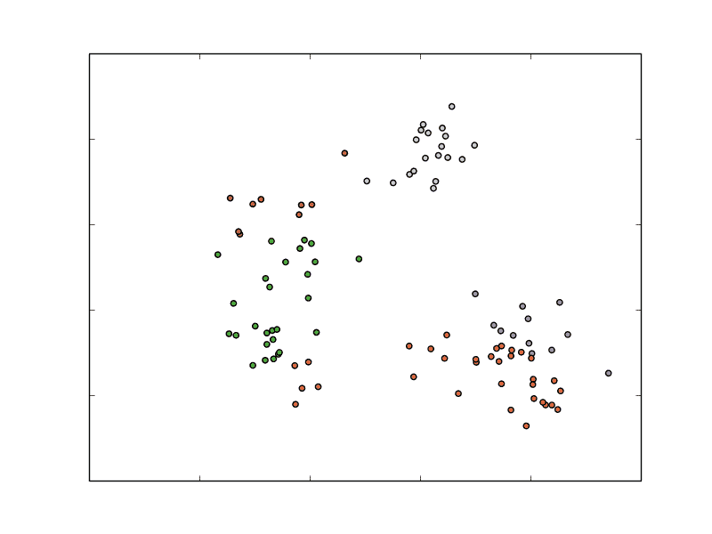
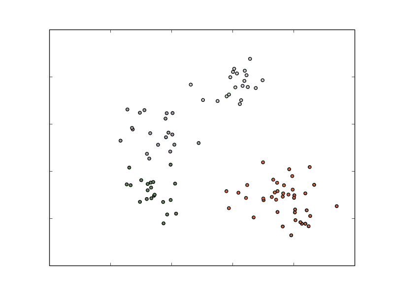
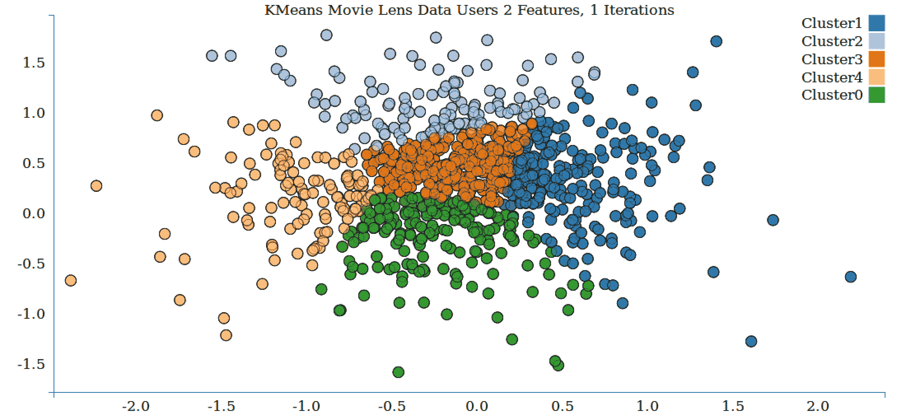
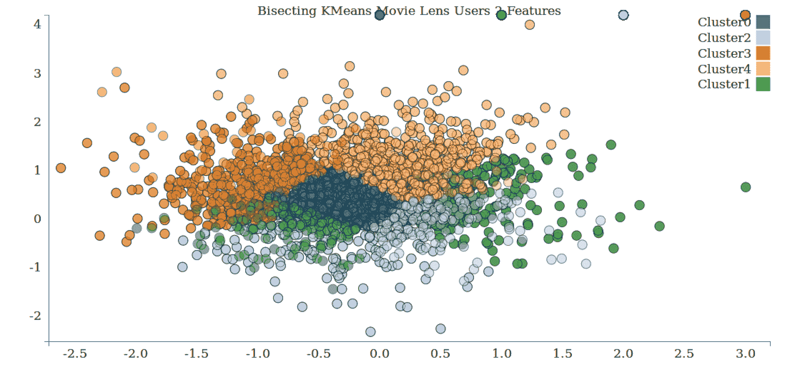
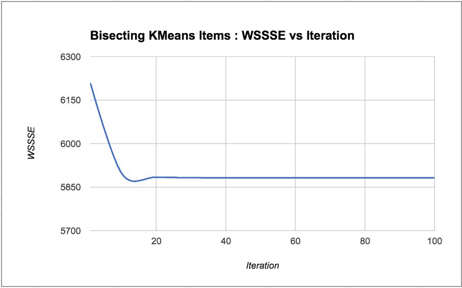
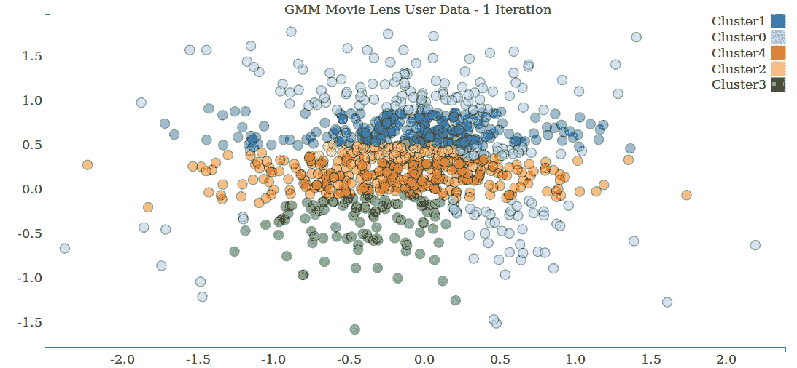
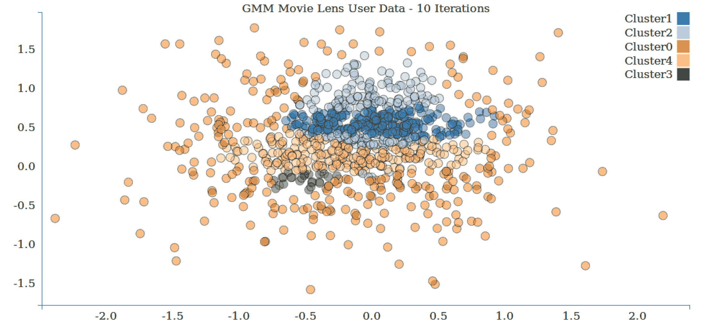
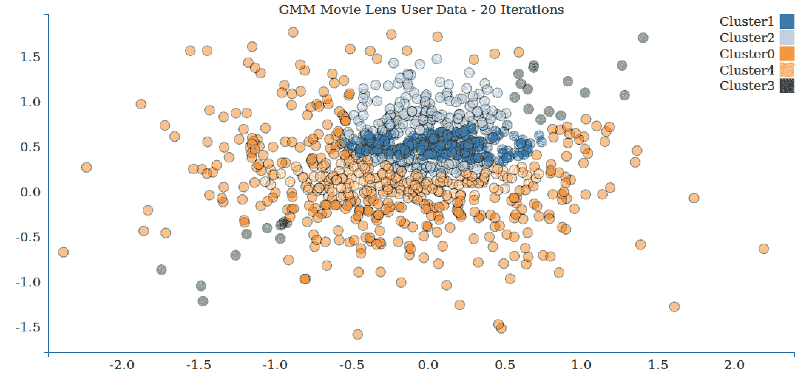

# 用 Spark 构建集群模型

在最后几章中，我们讨论了监督学习方法，其中训练数据被标记为我们想要预测的真实结果(例如，对建议的评级和分类的班级分配，或者在回归的情况下是真实的目标变量)。

接下来，我们将考虑没有可用的标签数据的情况。 这称为**无监督学习**，因为模型没有使用真实的目标标签进行监督。 无人监督的情况在实践中非常常见，因为在许多真实世界的场景中，获得带标签的训练数据可能非常困难或昂贵(例如，让人类用分类标签来标记训练数据)。 然而，我们仍然希望了解数据中的一些基本结构，并使用这些结构进行预测。

这就是无监督学习方法可以派上用场的地方。 非监督学习模型也经常与监督模型相结合；例如，应用非监督技术为监督模型创建新的输入特征。

在许多方面，聚类模型是分类模型的无监督等价物。 通过分类，我们试图学习一个模型，该模型将预测给定的训练示例属于哪个类。 该模型本质上是从一组功能到类的映射。

在聚类中，我们希望对数据进行分段，以便将每个训练示例分配到称为**聚类**的分段。 除了真实的班级分配是未知的之外，群集的作用与班级非常相似。

集群模型有许多与分类相同的用例；其中包括：

*   根据行为特征和元数据将用户或客户划分为不同的组
*   对零售企业中的网站或产品上的内容进行分组
*   寻找相似基因的簇
*   生态学中的群落划分
*   创建用于图像分析应用(例如对象检测)的图像段

在本章中，我们将：

*   简要介绍几种类型的集群模型
*   具体使用一个模型的输出作为聚类模型的输入要素，从数据中提取要素
*   训练群集模型并使用它进行预测
*   应用性能评估和参数选择技术来选择要使用的最佳群集数量

# 集群模型的类型

有许多不同形式的集群模型可用，从简单的到极其复杂的。 Spark MLlib 目前提供 k-均值聚类，这是可用的最简单的方法之一。 但是，它通常非常有效，而且它的简单性意味着它相对容易理解和可伸缩。

# K-均值聚类

K-Means 尝试将一组数据点划分为*K*个不同的群集(其中，*K*是模型的输入参数)。

更正式地说，k-Means 试图找到簇，以便最小化每个簇内的平方误差(或距离)之和。 该目标函数被称为群集误差平方和内的**(**WCSS**)。**


它是每个群集上每个点与群集中心之间的平方误差之和。

从一组*K*初始聚类中心(作为聚类中所有数据点的平均向量计算)开始，K 均值的标准方法在两个步骤之间迭代：

1.  将每个数据点分配到最小化 WCSS 的群集。 平方和等同于欧几里德距离的平方；因此，这等同于按照欧几里德距离度量将每个点分配给最近的**群集中心。**
***   根据第一步中的聚类分配计算新的聚类中心。**

 **算法继续进行，直到达到最大迭代次数或达到收敛。 **收敛**意味着集群分配在第一步期间不再改变；因此，WCSS 目标函数的值也不改变。

For more details, refer to Spark's documentation on clustering at [http://spark.apache.org/docs/latest/mllib-clustering.html](http://spark.apache.org/docs/latest/mllib-clustering.html) or refer to [http://en.wikipedia.org/wiki/K-means_clustering](http://en.wikipedia.org/wiki/K-means_clustering).

为了说明 K-Means 的基础知识，我们将使用我们在[第 6 章](06.html)，*使用 Spark*构建分类模型的多类分类示例中展示的简单数据集。 回想一下，我们有五个类，如下图所示：


Multiclass dataset

然而，假设我们实际上并不知道真正的类。 如果我们使用具有五个簇的 k-Means，则在第一步之后，模型的簇分配可能如下所示：



Cluster assignments after the first K-means iteration

我们可以看到，k-Means 已经相当好地挑选出了每个星团的中心。 在下一次迭代之后，工作分配可能如下图所示：


Cluster assignments after the second K-means iteration

情况开始稳定下来，但总体集群分配与第一次迭代后大致相同。 一旦模型收敛，最终任务可能如下所示：


Final cluster assignments for K-means

正如我们所看到的，该模型在分离这五个集群方面做得不错。 最左边的三个是相当准确的(有几个不正确的点)。 但是，右下角的两个簇的精确度较低。

这说明了：

*   K-均值的迭代性质
*   模型对初始选择群集中心的方法的依赖性(这里，我们将使用随机方法)
*   最终的群集分配对于分隔良好的数据可能非常好，但对于更困难的数据可能很差

# 初始化方法

用于 k-Means 的标准初始化方法通常简称为随机方法，其开始于在进行第一更新步骤之前随机地将每个数据点分配给群集。

Spark ML 为该初始化方法提供了一个并行变体，称为**K-Means++**，这是使用的默认初始化方法。

See [http://en.wikipedia.org/wiki/K-means_clustering#Initialization_methods](http://en.wikipedia.org/wiki/K-means_clustering) and [http://en.wikipedia.org/wiki/K-means%2B%2B](http://en.wikipedia.org/wiki/K-means%2B%2B) for more information.

这里显示了使用 K-Means++的结果。 请注意，这一次，困难的右下角点大多已正确组合：



Final cluster assignments for K-means++

K-Means 还有许多其他变体；它们侧重于初始化方法或核心模型。 比较常见的变体之一是**模糊 K-均值**。 该模型不像 K-Means 那样将每个点分配给一个簇(所谓的硬分配)。 相反，它是 K-Means 的软版本，其中每个点可以属于多个簇，并由每个簇的相对隶属度来表示。 因此，对于*K*簇，每个点被表示为 K 维隶属度向量，该向量中的每个条目指示每个簇中的隶属度比例。

# 混合模型

**混合模型**本质上是模糊 K-均值背后思想的扩展；然而，它假设存在生成数据的潜在概率分布。 例如，我们可以假设数据点是从一组 K 独立的高斯(正态)概率分布中提取的。 群集分配也是软的，因此每个点由*K*个基本概率分布中的*K*成员权重表示。

See [http://en.wikipedia.org/wiki/Mixture_model](http://en.wikipedia.org/wiki/Mixture_model) for further details and for a mathematical treatment of mixture models.

# 层次聚类

**层次聚类**是一种结构化的聚类方法，它产生多级集群层次结构，其中每个集群可能包含许多子集群(或子集群)。 因此，每个子群集都链接到父群集。 这种形式的聚类通常也称为**树聚类**。

凝聚群集是一种自下而上的方法，其中：

*   每个数据点都从其自己的群集开始
*   评估每对聚类之间的相似性(或距离
*   找到最相似的一对聚类；然后将这对聚类合并成一个新聚类
*   重复该过程，直到只剩下一个顶级群集

**分离式群集**是一种自上而下的方法，它从一个群集开始，在每个阶段将一个群集一分为二，直到所有数据点都分配到它们自己的底层群集。

**自上而下聚类**比自下而上聚类更复杂，因为需要第二个平面聚类算法作为“子例程”。如果我们不为单个文档叶子生成完整的层次结构，自上而下聚类的优势是更高效。

You can find more information at [http://en.wikipedia.org/wiki/Hierarchical_clustering](http://en.wikipedia.org/wiki/Hierarchical_clustering).

# 从数据中提取正确的要素

像我们到目前为止遇到的大多数机器学习模型一样，k-均值聚类需要数值向量作为输入。 我们所看到的用于分类和回归的相同的特征提取和变换方法也适用于聚类。

与最小二乘回归一样，k-均值算法使用平方误差函数作为优化目标，容易受到离群点和方差较大的特征的影响。

集群可以用来检测离群值，因为它们可能会导致很多问题。

对于回归和分类案例，可以对输入数据进行标准化和标准化，以克服这一问题，这可能会提高准确性。 然而，在某些情况下，可能不希望对数据进行标准化，例如，如果目标是根据某些特定特征找到分段。

# 从 MovieLens 数据集中提取要素

在这种情况下，我们将使用 ALS 算法来获取用户和项目(电影)的数字特征，然后才能对数据使用聚类算法：

1.  首先，我们将数据`u.data`加载到 DataFrame 中：

```scala
      val ratings = spark.sparkContext 
      .textFile(DATA_PATH + "/u.data") 
      .map(_.split("\t")) 
      .map(lineSplit => Rating(lineSplit(0).toInt, 
        lineSplit(1).toInt,  lineSplit(2).toFloat, 
        lineSplit(3).toLong)) 
      .toDF()

```

2.  然后我们将其分成 80：20 的比例，以获得训练和测试数据：

```scala
      val Array(training, test) =  
        ratings.randomSplit(Array(0.8, 0.2))

```

3.  我们实例化`ALS`类，将最大迭代次数设置为`5`，并将正则化参数设置为`0.01`：

```scala
      val als = new ALS() 
        .setMaxIter(5) 
        .setRegParam(0.01) 
        .setUserCol("userId") 
        .setItemCol("movieId") 
        .setRatingCol("rating")

```

4.  然后我们创建一个模型，然后计算预测：

```scala
      val model = als.fit(training) 
      val predictions = model.transform(test)

```

5.  然后计算`userFactors`和`itemFactors`：

```scala
      val itemFactors = model.itemFactors 
      itemFactors.show() 

      val userFactors = model.userFactors 
      userFactors.show()

```

6.  我们将它们转换为 libsvm 格式，并将其持久化到一个文件中。 请注意，我们保留了所有功能以及两个功能：

```scala
      val itemFactorsOrdererd = itemFactors.orderBy("id") 
      val itemFactorLibSVMFormat = 
        itemFactorsOrdererd.rdd.map(x => x(0) + " " + 
        getDetails(x(1).asInstanceOf
          [scala.collection.mutable.WrappedArray[Float]])) 
      println("itemFactorLibSVMFormat.count() : " + 
        itemFactorLibSVMFormat.count()) 
      print("itemFactorLibSVMFormat.first() : " + 
        itemFactorLibSVMFormat.first()) 

      itemFactorLibSVMFormat.coalesce(1)
        .saveAsTextFile(output + "/" + date_time + 
        "/movie_lens_items_libsvm")

```

`movie_lens_items_libsvm`的输出将如下所示：

```scala
          1 1:0.44353345 2:-0.7453435 3:-0.55146646 4:-0.40894786 
          5:-0.9921601 6:1.2012635 7:0.50330496 8:-0.23256435     
          9:0.55483425 10:-1.4781344
 2 1:0.34384087 2:-1.0242497 3:-0.20907198 4:-0.102892995 
          5:-1.0616653 6:1.1338154 7:0.5742042 8:-0.46505615  
          9:0.3823278 10:-1.0695107 3 1:-0.04743084 2:-0.6035447  
          3:-0.7999673 4:0.16897096    
          5:-1.0216197 6:0.3304353 7:1.5495727 8:0.2972699  
          9:-0.6855238 
          10:-1.5391738
 4 1:0.24745995 2:-0.33971268 3:0.025664425 4:0.16798466 
          5:-0.8462472 6:0.6734541 7:0.7537076 8:-0.7119413  
          9:0.7475001 
          10:-1.965572
 5 1:0.30903652 2:-0.8523586 3:-0.54090345 4:-0.7004097 
          5:-1.0383878 6:1.1784278 7:0.5125761 8:0.2566347         
          9:-0.020201845   
          10:-1.118083
 ....
 1681 1:-0.14603947 2:-0.4475343 3:-0.50514024 4:-0.7221697 
          5:-0.7997808 6:0.21069092 7:0.22631708 8:-0.32458723 
          9:0.20187362 10:-1.2734087
 1682 1:0.21975909 2:0.45303428 3:-0.73912954 4:-0.40584692 
          5:-0.5299451 6:0.79586357 7:0.5154468 8:-0.4033669  
          9:0.2220822 
          10:-0.70235217

```

7.  接下来，我们持久化前两个特性(变化最大)，并将它们持久化到一个文件中：

```scala
      var itemFactorsXY = itemFactorsOrdererd.rdd.map( 
        x => getXY(x(1).asInstanceOf
        [scala.collection.mutable.WrappedArray[Float]])) 
      itemFactorsXY.first() 
      itemFactorsXY.coalesce(1).saveAsTextFile(output + "/" + 
        date_time + "/movie_lens_items_xy")

```

`movie_lens_items_xy`的输出如下所示：

```scala
          2.254384458065033, 0.5487040132284164
          -2.0540390759706497, 0.5557805597782135
          -2.303591560572386, -0.047419726848602295
          -0.7448508385568857, -0.5028514862060547
          -2.8230229914188385, 0.8093537855893373
          -1.4274845123291016, 1.4835840165615082
          -1.3214656114578247, 0.09438827633857727
          -2.028286747634411, 1.0806758720427752
          -0.798517256975174, 0.8371041417121887
          -1.556841880083084, -0.8985426127910614
          -1.0867036543786526, 1.7443277575075626
          -1.4234793484210968, 0.6246072947978973
          -0.04958712309598923, 0.14585793018341064

```

8.  接下来，我们计算`userFactors`的 libsvm 格式：

```scala
      val userFactorsOrdererd = userFactors.orderBy("id") 
      val userFactorLibSVMFormat = 
        userFactorsOrdererd.rdd.map(x => x(0) + " " + 
        getDetails(x(1).asInstanceOf
          [scala.collection.mutable.WrappedArray[Float]])) 
      println("userFactorLibSVMFormat.count() : " + 
        userFactorLibSVMFormat.count()) 
      print("userFactorLibSVMFormat.first() : " + 
        userFactorLibSVMFormat.first()) 

      userFactorLibSVMFormat.coalesce(1)
        .saveAsTextFile(output + "/" + date_time + 
        "/movie_lens_users_libsvm")

```

`movie_lens_users_libsvm`的输出将如下所示：

```scala
 1 1:0.75239724 2:0.31830165 3:0.031550772 4:-0.63495475 
          5:-0.719721 6:0.5437525 7:0.59800273 8:-0.4264512  
          9:0.6661331 
          10:-0.9702077
 2 1:-0.053673547 2:-0.24080916 3:-0.6896337 4:-0.3918436   
          5:-0.4108574 6:0.663401 7:0.1975566 8:0.43086317 9:1.0833738 
          10:-0.9398713
 3 1:0.6261427 2:0.58282375 3:-0.48752788 4:-0.36584544 
          5:-1.1869227 6:0.14955235 7:-0.17821303 8:0.3922112 
          9:0.5596394 10:-0.83293504
 4 1:1.0485783 2:0.2569924 3:-0.48094323 4:-1.8882223 
          5:-1.4912299 6:0.50734115 7:1.2781366 8:0.028034585 
          9:1.1323715 10:0.4267411
 5 1:0.31982875 2:0.13479441 3:0.5392742 4:0.33915272 
          5:-1.1892766 6:0.33669636 7:0.38314193 8:-0.9331541 
          9:0.531006 10:-1.0546529
 6 1:-0.5351592 2:0.1995535 3:-0.9234565 4:-0.5741345 
          5:-0.4506062 6:0.35505387 7:0.41615438 8:-0.32665777 
          9:0.22966743 10:-1.1040379
 7 1:0.41014928 2:-0.32102737 3:-0.73221415 4:-0.4017513 
          5:-0.87815255 6:0.3717881 7:-0.070220165 8:-0.5443932 
          9:0.24361002 10:-1.2957898
 8 1:0.2991327 2:0.3574251 3:-0.03855041 4:-0.1719838 
          5:-0.840421 6:0.89891523 7:0.024321048 8:-0.9811069 
          9:0.57676667 10:-1.2015694
 9 1:-1.4988179 2:0.42335498 3:0.5973782 4:-0.11305857 
          5:-1.3311529 6:0.91228217 7:1.461522 8:1.4502159 9:0.5554214 
          10:-1.5014526
 10 1:0.5876411 2:-0.26684982 3:-0.30273324 4:-0.78348076 
          5:-0.61448336 6:0.5506227 7:0.2809167 8:-0.08864456 
          9:0.57811487 10:-1.1085391

```

9.  接下来，我们提取前两个特性，并将它们持久化到一个文件中：

```scala
      var userFactorsXY = userFactorsOrdererd.rdd.map( 
        x => getXY(x(1).asInstanceOf
        [scala.collection.mutable.WrappedArray[Float]])) 
      userFactorsXY.first() 
      userFactorsXY.coalesce(1).saveAsTextFile(output + "/" + 
        date_time + "/movie_lens_user_xy")

```

The output of `movie_lens_user_xy` will look like this:

```scala
          -0.2524261102080345, 0.4112294316291809
 -1.7868174277245998, 1.435323253273964
 -0.8313295543193817, 0.09025487303733826
 -2.55482479929924, 3.3726249802857637
 0.14377352595329285, -0.736962765455246
 -2.283802881836891, -0.4298199713230133
 -1.9229961037635803, -1.2950050458312035
 -0.39439742639660835, -0.682673366740346
 -1.9222962260246277, 2.8779889345169067
 -1.3799060583114624, 0.21247059851884842

```

我们将需要*XY*个特征来对两个特征进行聚类，这样我们就可以创建一个二维图。

# K-均值--训练聚类模型

Spark ML 中的 K-Means 训练采用与其他模型类似的方法--我们将包含训练数据的 DataFrame 传递给`KMeans`对象的 Fit 方法。

Here we use the libsvm data format.

# 在 MovieLens 数据集上训练聚类模型

我们将为我们通过运行推荐模型生成的电影和用户因素训练一个模型。

我们需要传入簇数*K*和算法运行的最大迭代次数。 如果目标函数从一个小版本到下一个小版本的更改小于公差级别(此公差的默认值为 0.0001)，则模型训练运行的次数可能少于最大迭代次数。

Spark ML 的 k-Means 提供随机和 K-Means||初始化，缺省为 K-Means||。 由于这两种初始化方法在某种程度上都是基于随机选择的，所以每次模型训练运行都会返回不同的结果。

K-均值算法通常不会收敛到全局最优模型，因此执行多个训练运行并从这些运行中选择最优模型是一种常见的做法。 MLlib 的训练方法提供了完成多个模型训练运行的选项。 通过评估损失函数来衡量最佳训练运行，选择最佳训练运行作为最终模型。

1.  首先，我们创建一个`SparkSession`实例，并使用它加载第一个`movie_lens_users_libsvm`数据：

```scala
      val spConfig = (new 
        SparkConf).setMaster("local[1]").setAppName("SparkApp"). 
        set("spark.driver.allowMultipleContexts", "true") 

      val spark = SparkSession 
        .builder() 
        .appName("Spark SQL Example") 
        .config(spConfig) 
        .getOrCreate() 

      val datasetUsers = spark.read.format("libsvm").load( 
        "./OUTPUT/11_10_2016_10_28_56/movie_lens_users_libsvm/part-
        00000") 
      datasetUsers.show(3)

```

The output is:

```scala
          +-----+--------------------+
 |label|            features|
 +-----+--------------------+
 |  1.0|(10,[0,1,2,3,4,5,...|
 |  2.0|(10,[0,1,2,3,4,5,...|
 |  3.0|(10,[0,1,2,3,4,5,...|
 +-----+--------------------+
 only showing top 3 rows

```

2.  然后我们创建一个模型：

```scala
      val kmeans = new KMeans().setK(5).setSeed(1L) 
      val modelUsers = kmeans.fit(datasetUsers)

```

3.  最后，我们使用用户向量的数据集训练 K-Means 模型：

```scala
      val modelUsers = kmeans.fit(datasetUsers)

```

**K-means**: Making predictions using a clustering model.

使用经过训练的 K-Means 模型非常简单，与我们到目前为止遇到的其他模型(如分类和回归)相似。

我们可以通过将 DataFrame 传递给模型的转换方法来预测多个输入：

```scala
      val predictedUserClusters = modelUsers.transform(datasetUsers) 
      predictedUserClusters.show(5)

```

结果输出是预测列中每个数据点的聚类分配：

```scala
+-----+--------------------+----------+
|label|            features|prediction|
+-----+--------------------+----------+
|  1.0|(10,[0,1,2,3,4,5,...|         2|
|  2.0|(10,[0,1,2,3,4,5,...|         0|
|  3.0|(10,[0,1,2,3,4,5,...|         0|
|  4.0|(10,[0,1,2,3,4,5,...|         2|
|  5.0|(10,[0,1,2,3,4,5,...|         2|
+-----+--------------------+----------+
only showing top 5 rows

```

Due to random initialization, the cluster assignments might change from one run of the model to another, so your results might differ from those shown earlier. The cluster IDs themselves have no inherent meaning; they are simply arbitrarily labeled, starting from 0.

# K-Means-解释 MovieLens 数据集上的群集预测

我们已经讨论了如何对一组输入向量进行预测，但是我们如何评估预测的好坏呢？ 稍后我们将介绍性能指标；但是，在这里，我们将了解如何手动检查和解释由 k-Means 模型进行的集群分配。

虽然无监督技术的优点是它们不需要我们提供带标签的数据来进行训练，但缺点是结果通常需要人工解释。 通常，我们希望进一步检查发现的群集，并可能尝试解释它们，并为它们分配某种标签或分类。

例如，我们可以检查我们发现的电影集群，以尝试查看每个集群是否有一些有意义的解释，例如集群中的电影之间是否有共同的流派或主题。 我们可以使用很多方法，但我们将从每个群集中最靠近群集中心的几个电影开始。 我们认为，这些电影在群集分配方面是最不可能处于边缘的电影，因此，它们应该是群集中最具代表性的电影之一。 通过检查这些电影集，我们可以看到每个集群中的电影共享哪些属性。

# 解读电影集群

我们将尝试通过将具有电影名称的数据集与预测输出数据集相结合来列出与每个群集相关联的电影：

```scala
Cluster : 0
--------------------------
+--------------------+
|                name|
+--------------------+
|    GoldenEye (1995)|
|   Four Rooms (1995)|
|Shanghai Triad (Y...|
|Twelve Monkeys (1...|
|Dead Man Walking ...|
|Usual Suspects, T...|
|Mighty Aphrodite ...|
|Antonia's Line (1...|
|   Braveheart (1995)|
|  Taxi Driver (1976)|
+--------------------+
only showing top 10 rows

Cluster : 1
--------------------------
+--------------------+
|                name|
+--------------------+
|     Bad Boys (1995)|
|Free Willy 2: The...|
|        Nadja (1994)|
|     Net, The (1995)|
|       Priest (1994)|
|While You Were Sl...|
|Ace Ventura: Pet ...|
|   Free Willy (1993)|
|Remains of the Da...|
|Sleepless in Seat...|
+--------------------+
only showing top 10 rows

Cluster : 2
--------------------------
+--------------------+
|                name|
+--------------------+
|    Toy Story (1995)|
|   Get Shorty (1995)|
|      Copycat (1995)|
|  Richard III (1995)|
|Seven (Se7en) (1995)|
|Mr. Holland's Opu...|
|From Dusk Till Da...|
|Brothers McMullen...|
|Batman Forever (1...|
|   Disclosure (1994)|
+--------------------+
only showing top 10 rows

Cluster : 3
--------------------------
+--------------------+
|                name|
+--------------------+
|         Babe (1995)|
|  Postino, Il (1994)|
|White Balloon, Th...|
|Muppet Treasure I...|
|Rumble in the Bro...|
|Birdcage, The (1996)|
|    Apollo 13 (1995)|
|Belle de jour (1967)|
| Crimson Tide (1995)|
|To Wong Foo, Than...|
+--------------------+
only showing top 10 rows

```

# 解读电影集群

在本节中，我们将回顾代码，其中我们将获得每个标签的预测，并将其保存在文本文件中，然后绘制二维散点图。

我们将创建两个散点图，一个用于用户，另一个用于项目(在本例中为电影)：

```scala
object MovieLensKMeansPersist { 

  val BASE= "./data/movie_lens_libsvm_2f" 
  val time = System.currentTimeMillis() 
  val formatter = new SimpleDateFormat("dd_MM_yyyy_hh_mm_ss") 

  import java.util.Calendar 
  val calendar = Calendar.getInstance() 
  calendar.setTimeInMillis(time) 
  val date_time = formatter.format(calendar.getTime()) 

  def main(args: Array[String]): Unit = { 

    val spConfig = ( 
    new SparkConf).setMaster("local[1]"). 
    setAppName("SparkApp"). 
      set("spark.driver.allowMultipleContexts", "true") 

    val spark = SparkSession 
      .builder() 
      .appName("Spark SQL Example") 
      .config(spConfig) 
      .getOrCreate() 

    val datasetUsers = spark.read.format("libsvm").load( 
      BASE + "/movie_lens_2f_users_libsvm/part-00000") 
    datasetUsers.show(3) 

    val kmeans = new KMeans().setK(5).setSeed(1L) 
    val modelUsers = kmeans.fit(datasetUsers) 

    // Evaluate clustering by computing Within  
    //Set Sum of Squared Errors. 

    val predictedDataSetUsers = modelUsers.transform(datasetUsers) 
    print(predictedDataSetUsers.first()) 
    print(predictedDataSetUsers.count()) 
    val predictionsUsers = 
    predictedDataSetUsers.select("prediction"). 
    rdd.map(x=> x(0)) 
    predictionsUsers.saveAsTextFile( 
    BASE + "/prediction/" + date_time + "/users") 

    val datasetItems = spark.read.format("libsvm").load( 
      BASE + "/movie_lens_2f_items_libsvm/part-00000") 
    datasetItems.show(3) 

    val kmeansItems = new KMeans().setK(5).setSeed(1L) 
    val modelItems = kmeansItems.fit(datasetItems) 
    // Evaluate clustering by computing Within  
    //Set Sum of Squared Errors. 
    val WSSSEItems = modelItems.computeCost(datasetItems) 
    println(s"Items :  Within Set Sum of Squared Errors = 
      $WSSSEItems") 

    // Shows the result. 
    println("Items - Cluster Centers: ") 
    modelUsers.clusterCenters.foreach(println) 
    val predictedDataSetItems = modelItems.transform(datasetItems) 
    val predictionsItems = predictedDataSetItems. 
      select("prediction").rdd.map(x=> x(0)) 
    predictionsItems.saveAsTextFile(BASE + "/prediction/" +  
      date_time + "/items") 
    spark.stop() 
  }

```


K-means clustering with user data

上图显示了用户数据的 K-Means 群集。


K-means clustering plot with item data

上图显示了项目数据的 K-Means 聚类。



K-means plotting effect of number of clusters

上图显示了具有两个功能和一个迭代的用户数据的 K-Means 群集。


上图显示了具有两个功能和 10 次迭代的用户数据的 K-Means 群集。 请注意群集边界是如何移动的。


上图显示了具有两个功能和 10 次迭代的用户数据的 K-Means 群集。 请注意簇边界是如何移动的。

# K-均值--评估聚类模型性能的一种方法

通过回归、分类和推荐引擎等模型，有许多评估指标可以应用于聚类模型，以分析它们的性能和数据点聚类的优劣。 聚类评价一般分为内部评价和外部评价。 内部评估是指使用用于训练模型的相同数据进行评估的情况。 外部评估是指使用培训数据之外的数据进行评估。

# 内部评估指标

常见的内部评估指标包括我们前面介绍的 WCSS(这正是 k-Means 目标函数)、Davies-Bouldin 指数、Dunn 指数和轮廓系数。 所有这些措施都倾向于奖励集群，其中集群中的元素相对较近，而不同集群中的元素彼此相对较远。

The Wikipedia page on clustering evaluation at [http://en.wikipedia.org/wiki/Cluster_analysis#Internal_evaluation](http://en.wikipedia.org/wiki/Cluster_analysis) has more details.

# 外部评估指标

由于聚类可以被认为是无监督分类，如果我们有某种形式的标记(或部分标记)数据可用，我们可以使用这些标记来评估一个聚类模型。 我们可以使用该模型对群集(即，类标签)进行预测，并使用类似于我们在分类评估中看到的一些度量(即，基于真阳性和阴性以及假阳性和阴性比率)来评估针对真实标签的预测。

这些指标包括兰德度量、F 度量、贾卡德指数等。

See [http://en.wikipedia.org/wiki/Cluster_analysis#External_evaluation](http://en.wikipedia.org/wiki/Cluster_analysis) for more information on external evaluation for clustering.

# 计算 MovieLens 数据集的性能指标

Spark ML 提供了一个方便的`computeCost`函数来计算给定的 DataFrame 的 WSSS 目标函数。 我们将为以下项目和用户培训数据计算此指标：

```scala
val WSSSEUsers = modelUsers.computeCost(datasetUsers) 
println(s"Users :  Within Set Sum of Squared Errors = $WSSSEUsers") 
val WSSSEItems = modelItems.computeCost(datasetItems)   
println(s"Items :  Within Set Sum of Squared Errors = $WSSSEItems")

```

这应该会输出类似于以下内容的结果：

```scala
Users :  Within Set Sum of Squared Errors = 2261.3086181660324
Items :  Within Set Sum of Squared Errors = 5647.825222497311

```

衡量 WSSSE 有效性的最好方法是绘制迭代图，如下一节所示。

# 迭代次数对 WSSSE 的影响

让我们了解迭代对 MovieLens 数据集的 WSSSE 的影响。 我们将计算各种迭代值的 WSSSE，并绘制输出。

代码清单为：

```scala
object MovieLensKMeansMetrics { 
  case class RatingX(userId: Int, movieId: Int, rating: Float, 
    timestamp: Long) 
  val DATA_PATH= "../../../data/ml-100k" 
  val PATH_MOVIES = DATA_PATH + "/u.item" 
  val dataSetUsers = null 

  def main(args: Array[String]): Unit = { 

    val spConfig = (new 
      SparkConf).setMaster("local[1]").setAppName("SparkApp"). 
      set("spark.driver.allowMultipleContexts", "true") 

    val spark = SparkSession 
      .builder() 
      .appName("Spark SQL Example") 
      .config(spConfig) 
      .getOrCreate() 

    val datasetUsers = spark.read.format("libsvm").load( 
      "./data/movie_lens_libsvm/movie_lens_users_libsvm/part-
      00000") 
    datasetUsers.show(3) 

    val k = 5 
    val itr = Array(1,10,20,50,75,100) 
    val result = new Array[String](itr.length) 
    for(i <- 0 until itr.length){ 
      val w = calculateWSSSE(spark,datasetUsers,itr(i),5,1L) 
      result(i) = itr(i) + "," + w 
    } 
    println("----------Users----------") 
    for(j <- 0 until itr.length) { 
      println(result(j)) 
    } 
    println("-------------------------") 

    val datasetItems = spark.read.format("libsvm").load( 
      "./data/movie_lens_libsvm/movie_lens_items_libsvm/"+     
      "part-00000") 

    val resultItems = new Array[String](itr.length) 
    for(i <- 0 until itr.length){ 
      val w = calculateWSSSE(spark,datasetItems,itr(i),5,1L) 
      resultItems(i) = itr(i) + "," + w 
    } 

    println("----------Items----------") 
    for(j <- 0 until itr.length) { 
      println(resultItems(j)) 
    } 
    println("-------------------------") 

    spark.stop() 
  } 

  import org.apache.spark.sql.DataFrame 

  def calculateWSSSE(spark : SparkSession, dataset : DataFrame,  
    iterations : Int, k : Int, seed : Long) : Double = { 
    val x = dataset.columns 

    val kmeans =  
      new KMeans().setK(k).setSeed(seed).setMaxIter(iterations) 

    val model = kmeans.fit(dataset) 
    val WSSSEUsers = model.computeCost(dataset) 
    return WSSSEUsers 

  }

```

输出为：

```scala
----------Users----------
1,2429.214784372865
10,2274.362593105573
20,2261.3086181660324
50,2261.015660051977
75,2261.015660051977
100,2261.015660051977
-------------------------

----------Items----------
1,5851.444935665099
10,5720.505597821477
20,5647.825222497311
50,5637.7439669472005
75,5637.7439669472005
100,5637.7439669472005

```

让我们将这些数字绘制成图表，以获得更好的想法：


Users WSSSE versus iterations


Items WSSSE versus iterations

# 将 KMeans 一分为二

它是泛型 KMeans 的变体。

Reference: [http://www.siam.org/meetings/sdm01/pdf/sdm01_05.pdf](http://www.siam.org/meetings/sdm01/pdf/sdm01_05.pdf)

该算法的步骤为：

1.  通过随机选择一个点进行初始化，比如，然后计算*M*的质心*w*，并计算：

** 

The **centroid** is the center of the cluster. A centroid is a vector containing one number for each variable, where each number is the mean of a variable for the observations in that cluster.

2.  除*M=[x1，x2，...。 Xn]*根据以下规则分为两个子簇*M<sub>L</sub>*和*M<sub>R</sub>*：


3.  与步骤 2 相同，计算*M<sub>L</sub>*和*M<sub>R</sub>*、*w<sub>L</sub>*和*w<sub>R</sub>*的质心。

4.  如果*w<sub>L</sub>=c<sub>L</sub>*和*w<sub>R</sub>=c<sub>R</sub>*，则停止。

Otherwise, let c<sub>L</sub>= w<sub>L</sub> c<sub>R</sub> = w<sub>R</sub> , go to step 2.

# 二分 K 均值--训练聚类模型

在 Spark ML 中对 K-Means 一分为二的训练涉及到采取类似于其他模型的方法--我们将包含训练数据的 DataFrame 传递给`KMeans`对象的 Fit 方法。 请注意，这里我们使用的是 libsvm 数据格式：

1.  实例化集群对象：

```scala
        val spConfig = (new                         
        SparkConf).setMaster("local[1]").setAppName("SparkApp"). 
        set("spark.driver.allowMultipleContexts", "true") 

        val spark = SparkSession 
          .builder() 
          .appName("Spark SQL Example") 
          .config(spConfig) 
          .getOrCreate() 

        val datasetUsers = spark.read.format("libsvm").load( 
          BASE + "/movie_lens_2f_users_libsvm/part-00000") 
        datasetUsers.show(3)

```

The output of the command `show(3)` is shown here:

```scala
 +-----+--------------------+
 |label|            features|
 +-----+--------------------+
 |  1.0|(2,[0,1],[0.37140...|
 |  2.0|(2,[0,1],[-0.2131...|
 |  3.0|(2,[0,1],[0.28579...|
 +-----+--------------------+
 only showing top 3 rows

```

Create the `BisectingKMeans` object and set the parameters:

```scala
          val bKMeansUsers = new BisectingKMeans() 
          bKMeansUsers.setMaxIter(10) 
          bKMeansUsers.setMinDivisibleClusterSize(5)

```

2.  培训数据：

```scala
          val modelUsers = bKMeansUsers.fit(datasetUsers) 

          val movieDF = Util.getMovieDataDF(spark) 
          val predictedUserClusters = 
            modelUsers.transform(datasetUsers) 
          predictedUserClusters.show(5)

```

The output is:

```scala
          +-----+--------------------+----------+
 |label|            features|prediction|
 +-----+--------------------+----------+
 |  1.0|(2,[0,1],[0.37140...|         3|
 |  2.0|(2,[0,1],[-0.2131...|         3|
 |  3.0|(2,[0,1],[0.28579...|         3|
 |  4.0|(2,[0,1],[-0.6541...|         1|
 |  5.0|(2,[0,1],[0.90333...|         2|
 +-----+--------------------+----------+
 only showing top 5 rows

```

3.  按群集显示电影：

```scala
        val joinedMovieDFAndPredictedCluster = 
          movieDF.join(predictedUserClusters,predictedUserClusters
          ("label") === movieDF("id")) 
        print(joinedMovieDFAndPredictedCluster.first()) 
        joinedMovieDFAndPredictedCluster.show(5)

```

输出为：

```scala
 +--+---------------+-----------+-----+--------------------+----------+
 |id|          name|       date|label|      features|prediction|
 +--+---------------+-----------+-----+--------------------+----------+
 | 1| Toy Story (1995)  |01-Jan-1995|  1.0|(2,[0,1],[0.37140...|3|
 | 2| GoldenEye (1995)  |01-Jan-1995|  2.0|(2,[0,1],[-0.2131...|3|
 | 3|Four Rooms (1995)  |01-Jan-1995|  3.0|(2,[0,1],[0.28579...|3|
 | 4| Get Shorty (1995) |01-Jan-1995|  4.0|(2,[0,1],[-0.6541...|1|
 | 5| Copycat (1995)    |01-Jan-1995|  5.0|(2,[0,1],[0.90333...|2|
 +--+----------------+-----------+-----+--------------------+----------+
 only showing top 5 rows

```

让我们打印按簇号分隔的电影：

```scala
        for(i <- 0 until 5) { 
          val prediction0 =     
          joinedMovieDFAndPredictedCluster.filter("prediction == " + i) 
          println("Cluster : " + i) 
          println("--------------------------") 
          prediction0.select("name").show(10) 
        }

```

The output is:

```scala
          Cluster : 0
 +--------------------+
 |                name|
 +--------------------+
 |Antonia's Line (1...|
 |Angels and Insect...|
 |Rumble in the Bro...|
 |Doom Generation, ...|
 |     Mad Love (1995)|
 | Strange Days (1995)|
 |       Clerks (1994)|
 |  Hoop Dreams (1994)|
 |Legends of the Fa...|
 |Professional, The...|
 +--------------------+
 only showing top 10 rows

 Cluster : 1
 --------------------------

 +--------------------+
 |                name|
 +--------------------+
 |   Get Shorty (1995)|
 |Dead Man Walking ...|
 |  Richard III (1995)|
 |Seven (Se7en) (1995)|
 |Usual Suspects, T...|
 |Mighty Aphrodite ...|
 |French Twist (Gaz...|
 |Birdcage, The (1996)|
 |    Desperado (1995)|
 |Free Willy 2: The...|
 +--------------------+
 only showing top 10 rows

 Cluster : 2
 --------------------------
 +--------------------+
          |                name|
 +--------------------+
          |      Copycat (1995)|
          |Shanghai Triad (Y...|
 |  Postino, Il (1994)|
          |From Dusk Till Da...|
          |   Braveheart (1995)|
 |Batman Forever (1...|
 |        Crumb (1994)|
          |To Wong Foo, Than...|
 |Billy Madison (1995)|
 |Dolores Claiborne...|
          +--------------------+
 only showing top 10 rows

          Cluster : 3
          --------------------------
          +--------------------+
 |                name|
          +--------------------+
          |    Toy Story (1995)|
 |    GoldenEye (1995)|
 |   Four Rooms (1995)|
 |Twelve Monkeys (1...|
          |         Babe (1995)|
 |Mr. Holland's Opu...|
 |White Balloon, Th...|
 |Muppet Treasure I...|
          |  Taxi Driver (1976)|
          |Brothers McMullen...|
 +--------------------+
          only showing top 10 rows

```

让我们计算一下 WSSSE：

```scala
          val WSSSEUsers = modelUsers.computeCost(datasetUsers) 
          println(s"Users : Within Set Sum of Squared Errors =                      $WSSSEUsers") 

          println("Users : Cluster Centers: ") 
          modelUsers.clusterCenters.foreach(println)

```

输出为：

```scala
          Users : Within Set Sum of Squared Errors = 220.213984126387
          Users : Cluster Centers: 
          [-0.5152650631965345,-0.17908608684257435]
          [-0.7330009110582011,0.5699292831746033]
          [0.4657482296168242,0.07541218866995708]
          [0.07297392612510972,0.7292946749843259]

```

接下来，我们对这些项目运行预测：

```scala
          val datasetItems = spark.read.format("libsvm").load( 
            BASE + "/movie_lens_2f_items_libsvm/part-00000") 
          datasetItems.show(3) 

          val kmeansItems = new BisectingKMeans().setK(5).setSeed(1L) 
          val modelItems = kmeansItems.fit(datasetItems) 

          // Evaluate clustering by computing Within Set 
          // Sum of Squared Errors. 
          val WSSSEItems = modelItems.computeCost(datasetItems) 
          println(s"Items : Within Set Sum of Squared Errors = 
            $WSSSEItems") 

          // Shows the result. 
          println("Items - Cluster Centers: ") 
          modelUsers.clusterCenters.foreach(println) 

          Items: within Set Sum of Squared Errors = 538.4272487824393 
          Items - Cluster Centers:  
            [-0.5152650631965345,-0.17908608684257435] 
            [-0.7330009110582011,0.5699292831746033] 
            [0.4657482296168242,0.07541218866995708] 
            [0.07297392612510972,0.7292946749843259]

```

Source code:
[https://github.com/ml-resources/spark-ml/blob/branch-ed2/Chapter_08/scala/2.0.0/src/main/scala/org/sparksamples/kmeans/BisectingKMeans.scala](https://github.com/ml-resources/spark-ml/blob/branch-ed2/Chapter_08/scala/2.0.0/src/main/scala/org/sparksamples/kmeans/BisectingKMeans.scala)

4.  绘制用户和项目群集。

作为下一步，让我们使用两个功能，并将用户和项目集群与它们各自的集群绘制在一起：

```scala
          object BisectingKMeansPersist { 
            val PATH = "/home/ubuntu/work/spark-2.0.0-bin-hadoop2.7/" 
            val BASE = "./data/movie_lens_libsvm_2f" 

            val time = System.currentTimeMillis() 
            val formatter = new 
              SimpleDateFormat("dd_MM_yyyy_hh_mm_ss") 

            import java.util.Calendar 
            val calendar = Calendar.getInstance() 
            calendar.setTimeInMillis(time) 
            val date_time = formatter.format(calendar.getTime()) 

            def main(args: Array[String]): Unit = { 

              val spConfig = (new     
                SparkConf).setMaster("local[1]")
                .setAppName("SparkApp"). 
              set("spark.driver.allowMultipleContexts", "true") 

              val spark = SparkSession 
                .builder() 
                .appName("Spark SQL Example") 
                .config(spConfig) 
                .getOrCreate() 

              val datasetUsers = spark.read.format("libsvm").load( 
                BASE + "/movie_lens_2f_users_libsvm/part-00000") 

              val bKMeansUsers = new BisectingKMeans() 
              bKMeansUsers.setMaxIter(10) 
              bKMeansUsers.setMinDivisibleClusterSize(5) 

              val modelUsers = bKMeansUsers.fit(datasetUsers) 
              val predictedUserClusters = 
                modelUsers.transform(datasetUsers) 

              modelUsers.clusterCenters.foreach(println) 
              val predictedDataSetUsers = 
                modelUsers.transform(datasetUsers) 
              val predictionsUsers =       
                predictedDataSetUsers.select("prediction")
                .rdd.map(x=> x(0)) 
               predictionsUsers.saveAsTextFile(BASE + 
                 "/prediction/" +      
               date_time + "/bkmeans_2f_users")    

               val datasetItems = 
                 spark.read.format("libsvm").load(BASE + 
                 "/movie_lens_2f_items_libsvm/part-00000") 

               val kmeansItems = new 
                 BisectingKMeans().setK(5).setSeed(1L) 
               val modelItems = kmeansItems.fit(datasetItems) 

               val predictedDataSetItems = 
                 modelItems.transform(datasetItems) 
               val predictionsItems =      
                 predictedDataSetItems.select("prediction")
                 .rdd.map(x=> x(0)) 
                 predictionsItems.saveAsTextFile(BASE + 
                 "/prediction/" +         
               date_time + "/bkmeans_2f_items") 
               spark.stop() 
            } 
          }

```



Plotting of MovieLens user data with clusters The preceding plot shows what user clusters look like for two features.


Plotting of MovieLens item (movies) data with clusters The preceding plot shows what item clusters look like for two features.

# WSSSE 和迭代

在这一部分中，我们将评估将 K-Means 算法一分为二对 WSSSE 的影响或迭代。

源代码为：

```scala
object BisectingKMeansMetrics { 
  case class RatingX(userId: Int, movieId: Int,  
    rating: Float, timestamp: Long) 
  val DATA_PATH= "../../../data/ml-100k" 
  val PATH_MOVIES = DATA_PATH + "/u.item" 
  val dataSetUsers = null 

  def main(args: Array[String]): Unit = { 

    val spConfig = ( 
      new SparkConf).setMaster("local[1]").setAppName("SparkApp"). 
      set("spark.driver.allowMultipleContexts", "true") 

    val spark = SparkSession 
      .builder() 
      .appName("Spark SQL Example") 
      .config(spConfig) 
      .getOrCreate() 

    val datasetUsers = spark.read.format("libsvm").load( 
      "./data/movie_lens_libsvm/movie_lens_users_libsvm/part-
      00000") 
    datasetUsers.show(3) 

    val k = 5 
    val itr = Array(1,10,20,50,75,100) 
    val result = new Array[String](itr.length) 
    for(i <- 0 until itr.length){ 
      val w = calculateWSSSE(spark,datasetUsers,itr(i),5) 
      result(i) = itr(i) + "," + w 
    } 
    println("----------Users----------") 
    for(j <- 0 until itr.length) { 
      println(result(j)) 
    } 
    println("-------------------------") 

    val datasetItems = spark.read.format("libsvm").load( 
      "./data/movie_lens_libsvm/movie_lens_items_libsvm/part-
      00000") 
    val resultItems = new Array[String](itr.length) 
    for(i <- 0 until itr.length){ 
      val w = calculateWSSSE(spark,datasetItems,itr(i),5) 
      resultItems(i) = itr(i) + "," + w 
    } 

    println("----------Items----------") 
    for(j <- 0 until itr.length) { 
      println(resultItems(j)) 
    } 
    println("-------------------------") 

    spark.stop() 
  } 

  import org.apache.spark.sql.DataFrame 

  def calculateWSSSE(spark : SparkSession, dataset : DataFrame, 
    iterations : Int, k : Int) : Double = 
  { 
    val x = dataset.columns 

    val bKMeans = new BisectingKMeans() 
    bKMeans.setMaxIter(iterations) 
    bKMeans.setMinDivisibleClusterSize(k) 

    val model = bKMeans.fit(dataset) 
    val WSSSE = model.computeCost(dataset) 
    return WSSSE 

  } 
}

```


Plot: WSSSE versus iterations for users



Plot: WSSSE versus iterations for items in the case of bisecting K-means

很明显，对于用户和项目，该算法都通过 20 次迭代达到最优的 WSSSE。

# 高斯混合模型

混合模型是种群内的子种群的概率模型。 这些模型被用来对一个子种群进行统计推断，给出了集合种群的观测结果。

**高斯混合模型**(**GMM**)是表示为高斯分量密度的加权和的混合模型。 其模型系数是使用迭代**期望最大化**(**EM**)算法或从训练模型的**最大后验**(**MAP**)估计从训练数据估计的。

`spark.ml`实现使用 EM 算法。

它有以下参数：

*   **k**：所需簇数
*   **ConvergenceTol**：认为达到收敛的对数似然率的最大变化
*   **maxIterations**：在不收敛的情况下执行的最大迭代次数
*   **initialModel**：启动 EM 算法的可选起点

(if this parameter is omitted, a random starting point will be constructed from the data)

# 使用 GMM 进行群集

我们将为用户和项目(在本例中为电影)创建集群，以便更好地理解算法如何对用户和项目进行分组。

执行以下步骤：

1.  为用户加载`libsvm`文件。
2.  创建高斯混合实例。 该实例具有以下可配置的参数：

```scala
       final val featuresCol: Param[String] 
       Param for features column name. 
       final val k: IntParam 
       Number of independent Gaussians in the mixture model. 
       final val 
       maxIter: IntParam 
       Param for maximum number of iterations (>= 0). 
       final val predictionCol: Param[String] 
       Param for prediction column name. 
       final val probabilityCol: Param[String] 
       Param for Column name for predicted class conditional 
       probabilities. 
       final val seed: LongParam 
       Param for random seed. 
       final val tol: DoubleParam

```

3.  在我们的示例中，我们将仅设置高斯分布的数量和种子数：

```scala
       val gmmUsers = new GaussianMixture().setK(5).setSeed(1L)

```

4.  创建用户模型：

```scala
       Print Covariance and Mean
      for (i <- 0 until modelUsers.gaussians.length) { 
        println("Users: weight=%f\ncov=%s\nmean=\n%s\n" format 
          (modelUsers.weights(i), modelUsers.gaussians(i).cov,                           
          modelUsers.gaussians(i).mean)) 
      }

```

The full code listing is:

```scala
          object GMMClustering { 

            def main(args: Array[String]): Unit = { 
              val spConfig = (new SparkConf).setMaster("local[1]"). 
                setAppName("SparkApp"). 
                set("spark.driver.allowMultipleContexts", "true") 

              val spark = SparkSession 
                .builder() 
                .appName("Spark SQL Example") 
                .config(spConfig) 
                .getOrCreate() 

              val datasetUsers = spark.read.format("libsvm").                
               load("./data/movie_lens_libsvm/movie_lens_users_libsvm/"
               + "part-00000") 
              datasetUsers.show(3) 

              val gmmUsers = new GaussianMixture().setK(5).setSeed(1L) 
              val modelUsers = gmmUsers.fit(datasetUsers) 

              for (i <- 0 until modelUsers.gaussians.length) { 
                println("Users : weight=%f\ncov=%s\nmean=\n%s\n" 
                   format (modelUsers.weights(i),  
                   modelUsers.gaussians(i).cov,  
                   modelUsers.gaussians(i).mean)) 
                } 

              val dataSetItems = spark.read.format("libsvm").load( 
                "./data/movie_lens_libsvm/movie_lens_items_libsvm/" + 
                "part-00000") 

              val gmmItems = new 
                  GaussianMixture().setK(5).setSeed(1L) 
              val modelItems = gmmItems.fit(dataSetItems) 

              for (i <- 0 until modelItems.gaussians.length) { 
                println("Items : weight=%f\ncov=%s\nmean=\n%s\n" 
                   format (modelUsers.weights(i), 
                   modelUsers.gaussians(i).cov, 
                   modelUsers.gaussians(i).mean)) 
              } 
              spark.stop() 
            }

```

# 使用 GMM 集群绘制用户和项目数据

在本节中，我们将了解基于 GMM 的集群边界如何随着迭代次数的增加而移动：


Plot of MovieLens user data clusters assigned by GMM


Plot of MovieLens item data clusters assigned by GMM

# GMM-迭代对星团边界的影响

让我们看看集群边界是如何随着 GMM 迭代次数的增加而变化的：



Cluster plot for GMM for user data with one iteration

上图使用一次迭代绘制了用户数据的 GMM 集群。



Cluster plot for GMM for user data with 10 iterations

上图绘制了具有 10 次迭代的用户数据的 GMM 集群。



Cluster plot for GMM for user data with 20 iterations

上图绘制了具有 20 次迭代的用户数据的 GMM 集群。

# 简略的 / 概括的 / 简易判罪的 / 简易的

在本章中，我们探索了一类新的从未标记数据中学习结构的模型-无监督学习。 我们仔细研究了所需的输入数据和特征提取，并了解了如何使用一个模型(在我们的示例中是推荐模型)的输出作为另一个模型(我们的 k-均值聚类模型)的输入。 最后，我们使用手动解释集群分配和使用数学性能度量来评估集群模型的性能。

在下一章中，我们将介绍另一种类型的无监督学习，用于将我们的数据归结为其最重要的特征或组成部分--降维模型。**