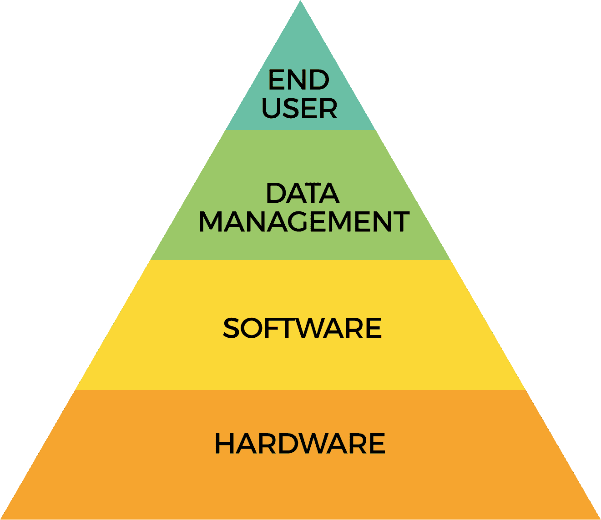

# 一、大还是不大

大数据分析构成了与大规模数据集的挖掘、分析和预测建模相关的广泛功能。 信息和技术发展的快速增长为世界各地的个人和企业提供了一个独特的机会，可以利用大规模分析来获取利润和开发新的能力，重新定义传统的商业模式。 本章旨在简单概述大数据的显著特征，为后续章节更深入地研究大数据分析的各个方面奠定基础。

总体而言，本书将提供整个行业使用的大数据分析系统的理论和实践实践经验。 本书以讨论大数据和大数据相关平台(如 Hadoop、Spark 和 NoSQL Systems)开始，然后是机器学习，其中将涵盖实践和理论主题，最后全面分析大数据以及更广泛的数据科学在行业中的使用情况。 本书将包括以下主题：

*   大数据平台：Hadoop 生态系统和 Spark NoSQL 数据库，如 Cassandra Advanced Platform，如 KDB+
*   机器学习：使用 R 和 SCRICKIT 的基本算法和概念-在 C/C++和 Unix 中使用 C/C++和 Unix 高级工具学习使用神经网络大数据基础架构的机器学习
*   采用 AWS(Amazon Web Services)的企业云体系结构内部企业体系结构高级分析的高性能计算大数据分析和机器学习的业务和企业使用案例构建世界一流的大数据分析解决方案

为了推进讨论，我们将在本章中明确以下概念：

*   大数据的定义
*   如果数据一直存在，为什么我们现在还在谈论大数据？
*   大数据简史
*   大数据类型
*   您应该从哪里开始搜索大数据解决方案？

# 什么是大数据？

术语*大*是相对的，通常可以有不同的含义，无论是在大小上还是在不同情况下的应用。 大数据的一个简单而幼稚的定义是一个庞大的信息集合，无论是存储在您的个人笔记本电脑中的数据，还是使用现有或传统工具进行分析的大型企业服务器上存储的数据都不是微不足道的。

如今，业界通常将 TB 级或 PB 级以上的数据视为大数据。 在本章中，我们将讨论是什么导致了大数据范式的出现，以及它的广泛特征。 稍后，我们将详细研究这两个不同的领域。

# 数据简史

计算机的历史是一个引人入胜的故事，从 19 世纪 30 年代中期查尔斯·巴贝奇的分析引擎开始，到今天的超级计算机，计算技术如何引领全球变革。 由于篇幅所限，要涵盖所有领域是不可行的，但为历史背景提供数据和数据存储的高级介绍。

# 信息时代的曙光

大数据一直存在。 美国国会图书馆是世界上最大的图书馆，馆藏有 1.64 亿件藏品，其中 2400 万册图书和 1.25 亿件非机密藏品。 [来源：[https://www.loc.gov/about/general-information/](https://www.loc.gov/about/general-information/)]。

可以说，机械数据存储最早是由赫尔曼·霍尔瑞斯(Herman Hollerith)于 1880 年发明的穿孔卡片。 大致基于 Basile Bouchon 之前的工作，他在 1725 年发明了穿孔带来控制织布机，Hollerith 的穿孔卡片提供了一个执行制表甚至打印聚合的界面。

IBM 率先实现了穿孔卡片的工业化，并很快成为存储信息的*事实上的选择。*

 *# 艾伦·图灵博士与现代计算机

穿孔卡片建立了一个强大的存在，但仍然缺少一个元素--这些机器虽然在设计上很复杂，但不能被认为是**计算设备**。 一种正式的通用机器还没有发明出来，它可以有足够的通用性来解决一系列不同的问题。

1936 年，从剑桥国王学院毕业后，图灵发表了一篇开创性的论文，题为*on Computable Numbers，An Application to the EntscheidungsProblem*，其中他建立了 Kurt Gödel 的不完全性定理，以形式化我们今天的数字计算的概念。

# 存储程序计算机的出现

存储程序计算机(一种可以在内存中保存程序的设备)的第一个实现是曼彻斯特**小型实验机**(**SSEM**)，由曼彻斯特维多利亚大学于 1948 年开发[来源：[https://en.wikipedia.org/wiki/Manchester_Small-Scale_Experimental_Machine](https://en.wikipedia.org/wiki/Manchester_Small-Scale_Experimental_Machine)]。 这在今天的计算机中引入了 RAM、随机存取存储器(或者更广泛地说，**存储器**)的概念。 在 SSEM 之前，计算机有固定存储器；也就是说，所有功能都必须预先连接到系统中。 在临时存储设备(如 RAM)中动态存储数据的能力意味着机器不再受存储设备容量的限制，而是可以容纳任意数量的信息。

# 从磁性设备到固态硬盘

在 20 世纪 50 年代早期，IBM 推出了磁带，这种磁带基本上是利用金属磁带上的磁化来存储数据。 紧随其后的是硬盘驱动器，在 1956 年，硬盘驱动器取代了磁带，使用磁盘盘片来存储数据。

第一批型号的硬盘容量不到 4MB，占据了大约两台中型冰箱的空间，价格超过 3.6 万美元--这是目前硬盘价格的 3 亿倍。 磁化表面很快成为二级存储的标准，到目前为止，它们的变体已经在各种可移动设备上实现，如 90 年代末的软盘、CD 和 DVD。

**固态硬盘**(**SSD**)是硬盘的后继者，最早由 IBM 在 20 世纪 50 年代中期发明。 与硬盘不同，固态硬盘使用非易失性存储器存储数据，非易失性存储器使用带电的硅衬底存储数据。 由于没有机械移动部件，检索存储在 SSD(寻道时间)中的数据的时间比硬盘等设备快一个数量级。

# 如果数据一直存在，为什么我们现在谈论大数据

到了 2000 年代初，计算和存储等技术的快速发展使用户能够以前所未有的效率收集和存储数据。 互联网提供了一个在全球范围内交换信息的无限能力的平台，进一步推动了这一努力。 技术以惊人的速度发展，并在社交媒体、智能手机等互联设备和宽带连接的可用性等工具的推动下，导致了重大的范式转变，进而导致了用户参与，甚至在世界的偏远地区也是如此。

大体上，这些数据中的大部分是由基于网络的来源产生的信息，比如 Facebook 这样的社交网络和 YouTube 这样的视频分享网站。 在大数据术语中，这也称为**非结构化**数据；即不是固定格式的数据，如电子表格或可轻松存储在传统数据库系统中的数据。

The simultaneous advances in computing capabilities meant that although the rate of data being generated was very high, it was still computationally feasible to analyze it. Algorithms in machine learning, which were once considered intractable due to both the volume as well as algorithmic complexity, could now be analyzed using various new paradigms such as cluster or multinode processing in a much simpler manner that would have earlier necessitated special-purpose machines.

Chart of data generated per minute. Credit: DOMO Inc.

# 大数据的定义

总体而言，产生的数据量已被称为大数据和分析，其中包括从基本数据挖掘到高级机器学习的各种能力，称为**大数据分析**。 因此，没有确切的定义，因为量化什么可以足够大以满足将任何特定用例归类为大数据分析的标准的相对性质。 相反，在一般意义上，对数百千兆字节到千兆字节的大规模数据集执行分析可以称为大数据分析。 这可以简单到查找大型数据集中的行数，再到对其应用机器学习算法。

# 大数据分析的构建块

从根本上说，大数据系统可以被认为有四个主要层面，每一个层面都是不可或缺的。 在不同的教科书和文学作品中有许多这样的层面，因此，它可能是模棱两可的。 尽管如此，在较高级别上，这里定义的层既直观又简单：

Big Data Analytics Layers

这些级别细分如下：

*   **硬件**：提供计算主干的服务器、存储数据的存储设备以及跨不同服务器组件的网络连接是定义硬件堆栈的一些元素。 本质上，提供计算和存储功能的系统以及支持这些设备的互操作性的系统构成了构建块的基础层。
*   **软件**：有助于对硬件层中托管的数据集进行分析的软件资源，如 Hadoop 和 NoSQL 系统，代表了大数据堆栈的下一个级别。 分析软件可以分为不同的细分。 分析软件的两个主要高级分类是促进以下功能的工具：
    *   **数据挖掘**：提供聚合、跨数据集联接和大型数据集上的透视表的工具的软件就属于这一类。 Cassandra、Redis 等标准 NoSQL 平台是用于大数据分析的高级数据挖掘工具。
    *   **统计分析**：提供简单数据挖掘之外的分析功能的平台，例如运行从简单回归到高级神经网络(如 Google TensorFlow 或 R)的算法，都属于这一类。

*   **数据管理**：数据加密、治理、访问、法规遵从性以及任何企业和生产环境的其他突出功能，用于管理下一个基本层，并在某些方面降低操作复杂性。 尽管数据管理工具不如硬件或软件那么有形，但数据管理工具提供了一个定义的框架，组织可以使用该框架履行其义务，如安全性和合规性。

*   **最终用户**：分析软件的最终用户构成了大数据分析项目的最终方面。 毕竟，数据平台的好坏取决于它能够被有效利用的程度，以及能够处理特定于业务的用例的程度。 这就是利用分析平台获取价值的从业者发挥作用的地方。 术语数据科学家通常用来表示实施底层大数据分析功能的个人，而业务用户则从传统系统中无法获得的更快访问和分析功能中获益。

# 大数据类型

数据可以大致分为结构化、非结构化或半结构化。 尽管这些区别一直存在，但随着大数据的出现，数据归入这些类别的问题变得更加突出。

# 有组织的 / 结构严密的 / 条理清楚的

顾名思义，结构化数据表示具有已定义组织结构的数据集，如 Microsoft Excel 或 CSV 文件。 在纯数据库术语中，数据应该可以使用模式表示。 例如，联合国在其 2017 年世界幸福指数排名中发布的代表世界上最幸福的五个*个*个国家的下表将是结构化数据的非典型代表。

我们可以清楚地定义列的数据类型--排名、得分、人均 GDP、社会支持、健康预期寿命、信任、慷慨和 Dystopia 是数字列，而国家是用字母表示的，或者更具体地说，是用**字符串**表示的。

请参阅下表以更清楚地了解：

| **排名** | **国家** | **分数** | **人均国内生产总值** | **社会支持** | **健康预期寿命** | **慷慨** | **信任** | **视障碍症** |
| 1. | 挪威 （欧洲一个多山国家） | 7.537 | 1.616 | 1.534 | 0.797 | 0.362 | 0.316 | 2.277 |
| 2 个 | 丹麦 （斯堪的纳维亚国家） | 7.522 | 1.482 | 1.551 | 0.793 | 0.355 | 0.401 | 2.314 |
| 3. | 冰岛 （北大西洋岛国） | 7.504 | 1.481 | 1.611 | 0.834 | 0.476 | 0.154 | 2.323 |
| 4. | 瑞士（欧洲国家） | 7.494 | 1.565 | 1.517 | 0.858 | 0.291 | 0.367 | 2.277 |
| 5. | 芬兰 （波罗的海沿岸国家） | 7.469 | 1.444 | 1.54 | 0.809 | 0.245 | 0.383 | 2.43 |

2017 年世界幸福报告[来源：[https://en.wikipedia.org/wiki/World_Happiness_Report#cite_note-4](https://en.wikipedia.org/wiki/World_Happiness_Report#cite_note-4)]

开放源码域中的商业数据库(如 Teradata、Greenplum 以及 Redis、Cassandra 和 Have)就是提供管理和查询结构化数据能力的技术的示例。

# 没有正式结构的 / 无社会组织的 / 松散的

非结构化数据由任何没有预定义组织架构的数据集组成，如上一节中的表所示。 口语、音乐、视频，甚至书籍，*，包括这个*，都会被认为是**非结构化的**。 这并不意味着内容没有条理。 的确，一本书有目录、章节、子章和索引--从这个意义上说，它遵循一定的组织结构。

然而，将每个单词和句子都表述为一套严格规则的一部分是徒劳的。 句子可以由单词、数字、标点符号等组成，并且不像电子表格那样具有预定义的数据类型。 要有*结构*，这本书需要在每个句子中都有一组精确的特征，这既不合理又不切实际。

Data from social media, such as posts on Twitter, messages from friends on Facebook, and photos on Instagram, are all examples of unstructured data.

非结构化数据可以以各种格式存储。 它们可以是二进制大对象，或者在文本数据的情况下，可以是保存在数据存储介质中的自由格式文本。 对于文本数据，诸如 Lucene/Solr、Elasticsearch 等技术通常用于查询、索引和其他操作。

# 半结构化

半结构化数据是指既具有组织架构元素又具有任意方面的数据。 私人电话日记(这几天越来越少见了！)。 包含姓名、地址、电话号码和备注的列可以被视为半结构化数据集。 用户可能不知道所有个人的地址，因此一些条目可能只有一个电话号码，反之亦然。

同样，备注栏可能包含额外的描述性信息(例如传真号、与个人相关的亲戚的姓名等)。 它是允许用户添加补充信息的任意字段。 因此，姓名、地址和电话号码的栏可以被认为是结构化的，因为它们可以以表格格式呈现，而笔记部分是非结构化的，因为它可能包含不能在日记中的其他栏中表示的任意一组描述性信息。

在计算中，**半结构化**数据通常由格式(如 JSON)表示，这些格式可以封装结构化的、无模式的或任意的关联，通常使用键-值对。 更常见的示例可以是电子邮件消息，其既具有所有电子邮件消息所共有的结构化部分(例如发送者姓名、消息被接收的时间等)，也具有由电子邮件正文或内容表示的非结构化部分。

Mongo 和 CouchDB 等平台通常用于存储和查询半结构化数据集。

# 大数据的来源

今天的技术使我们能够以惊人的速度收集数据--无论是在数量上还是在种类上。 生成数据的来源有多种，但在大数据环境中，主要来源如下：

*   **社交网络**：可以说，我们今天所知的所有大数据的主要来源是在过去 5-10 年间激增的社交网络。 这基本上是由数百万条社交媒体帖子和其他数据所代表的非结构化数据，这些数据是通过世界各地的网络用户交互以每秒为基础生成的。 对于社交网络中数据的增长，世界各地互联网接入的增加一直是一种自我实现的行为。

*   **媒体**：在很大程度上是社交网络发展的结果，媒体代表着每天上载的数百万(如果不是数十亿)音频和视频。 上传到 YouTube 上的视频，SoundCloud 上的音乐录音，以及发布在 Instagram 上的图片都是媒体的典型例子，其数量继续以不受限制的方式增长。

*   **数据仓库**：公司长期以来一直在投资专门的数据存储设施，通常称为数据仓库。 数据仓库本质上是公司希望维护和编目的历史数据集合，以便于检索，无论是出于内部使用还是出于监管目的。 随着行业逐渐转向在 Hadoop 和 NoSQL 等平台上存储数据的做法，越来越多的公司正在将数据从原有的数据仓库转移到一些较新的技术。 公司电子邮件、会计记录、数据库和内部文档是 DW 数据的一些示例，这些数据现在正被卸载到 Hadoop 或类似 Hadoop 的平台上，这些平台利用多个节点来提供高可用性和容错平台。
*   **传感器**：大数据领域最近出现的一个现象是从传感器设备收集数据。 虽然传感器一直存在，石油和天然气等行业几十年来一直在石油钻井平台使用钻井传感器进行测量，但可穿戴设备(也被称为物联网，如 Fitbit 和 Apple Watch)的出现意味着，现在每个人都可以像 10 年前几个石油钻井平台那样传输数据。

可穿戴设备可以在任何给定的时间点收集个人的数百个尺寸。 虽然目前还不是这样的大数据问题，但随着该行业的不断发展，与传感器相关的数据可能会变得更类似于通过社交网络活动在网络上产生的那种自发数据。

# 大数据的 4V

在大数据的背景下，4V 的话题已经变得过度使用，它已经开始失去一些最初的魅力。 尽管如此，记住这些动词所表达的意思是有帮助的，这样才能意识到进行对话的背景语境。

大体上，4V 表示以下几点：

*   **卷**：正在生成的数据量
*   **多样性**：不同类型的数据，如文本、媒体和传感器或流数据
*   **Velocity**：生成数据的速度，例如在任何给定时间通过社交网络交换数百万条消息
*   **准确性**：这是最近添加到 3VS 中的，表示数据中固有的噪声，例如需要额外验证的记录信息中的不一致

# 您何时知道自己遇到了大数据问题，从哪里开始搜索大数据解决方案？

最后，大数据分析指的是将数据投入使用的实践--换句话说，通过使用适当的技术从海量数据中提取有用信息的过程。 许多用来表示不同类型分析的术语没有确切的定义，因为它们可以用不同的方式解释，因此含义可能是主观的。

不过，这里提供的一些内容可作为参考或起点，帮助您形成初步印象：

*   **数据挖掘**：数据挖掘是指通过运行查询或聚合等基本汇总方法从数据集中提取信息的过程。 从包含在线网站上 100 万种产品的所有销售记录的数据集中根据销售数量找到排名前 10 位的产品将是挖掘的过程：即从数据集中提取有用的信息。 Cassandra、Redis 和 MongoDB 等 NoSQL 数据库是具有强大数据挖掘功能的工具的主要示例。
*   **商业智能**：商业智能指的是 Tableau、Spotfire、QlikView 等工具，它们提供前端仪表板，使用户能够使用图形界面查询数据。 随着用户寻求提取信息，仪表板产品随着数据的增长而变得突出起来。 易于使用的界面具有查询和可视化功能，技术用户和非技术用户都可以普遍使用这些功能，这为数据分析访问的大众化奠定了基础。
*   **可视化**：使用易于理解的结果可视化描述，可以简洁直观地表示数据。 可视化在更好地理解数据方面发挥了关键作用，特别是在更深入的分析之前分析数据集的性质及其分布的上下文中。 JavaScript 的开发在经历了很长一段时间的沉寂之后出现了复苏，比如百度的 D3.js 和 ECharts，它们是开源领域可视化包的一些主要例子。 大多数 BI 工具都包含高级可视化功能，因此，它已成为任何成功的分析产品不可或缺的资产。
*   **统计分析**：统计分析是指允许最终用户对数据集运行统计操作的工具或平台。 这些工具传统上已存在多年，但随着大数据的出现以及海量数据在执行高效统计操作方面带来的挑战，它们获得了吸引力。 诸如 R 之类的语言和诸如 SAS 之类的产品是计算统计领域中常用的工具的主要示例。
*   **机器学习**：机器学习通常被称为预测分析、预测建模等各种名称，本质上是应用超越传统统计领域的高级算法的过程。 这些算法不可避免地涉及数百或数千次迭代。 这样的算法不仅本质上很复杂，而且计算量也很大。

技术的进步一直是分析学中机器学习增长的关键驱动力，以至于它现在已经成为整个行业的一个常用术语。 自动驾驶汽车、根据交通模式调整的地图上的交通数据，以及 Siri 和 Cortana 等数字助手等创新，都是机器学习在实体产品中商业化的例子。

# 简略的 / 概括的 / 简易判罪的 / 简易的

大数据无疑是一个庞大的主题，乍一看可能过于复杂。 熟能生巧，对大数据的学习也是如此--你参与的越多，主题和术语就越熟悉，主题也就变得越熟悉。

深入研究大数据分析主题的各个维度将帮助您对该主题有一个直观的认识。 本书旨在提供该主题的整体概述，并将涵盖 Hadoop、Spark、NoSQL 数据库等广泛领域，以及基于硬件设计和云基础架构的主题。 在下一章中，我们将介绍大数据挖掘的概念，并讨论大数据技术的技术要素以及选择标准。*