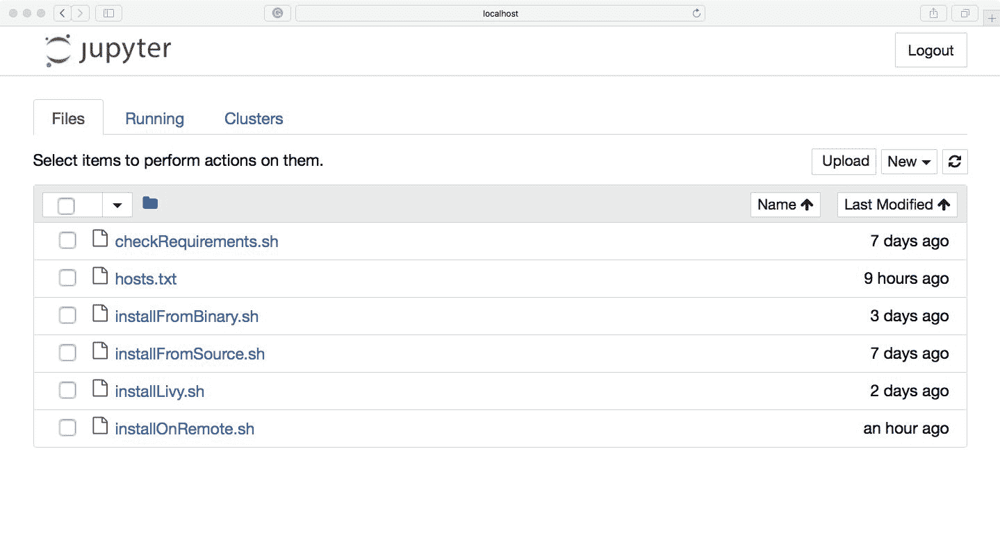
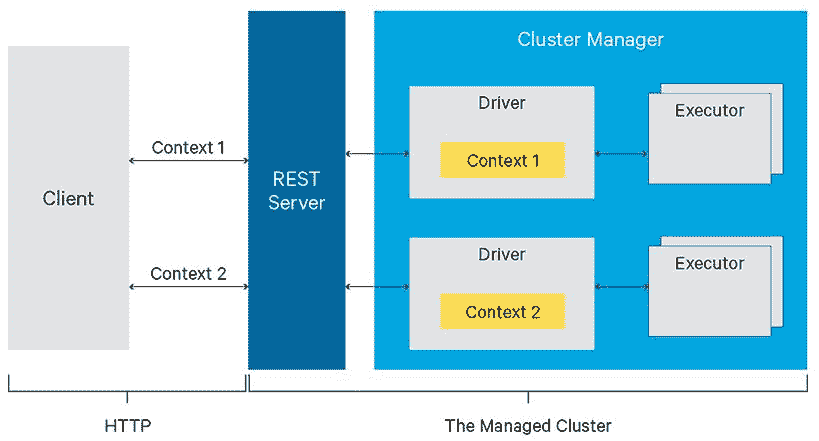
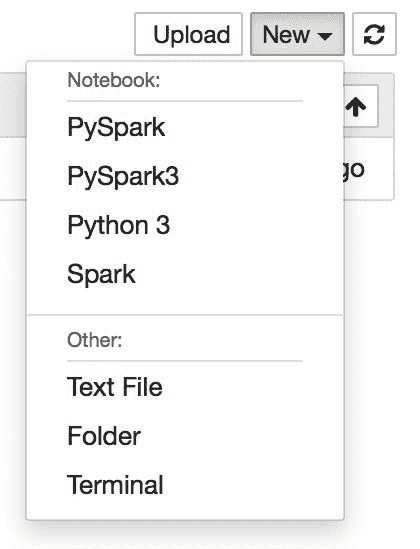
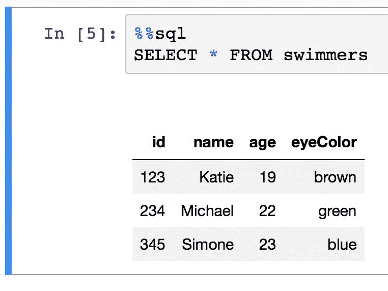
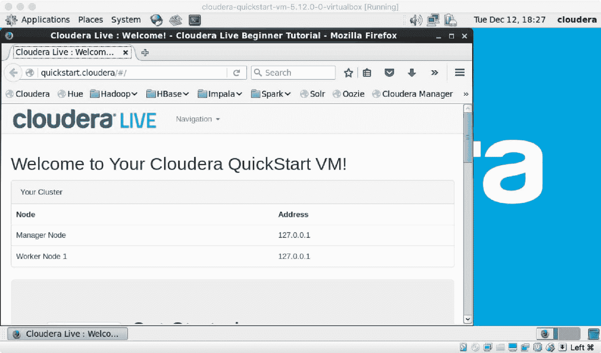
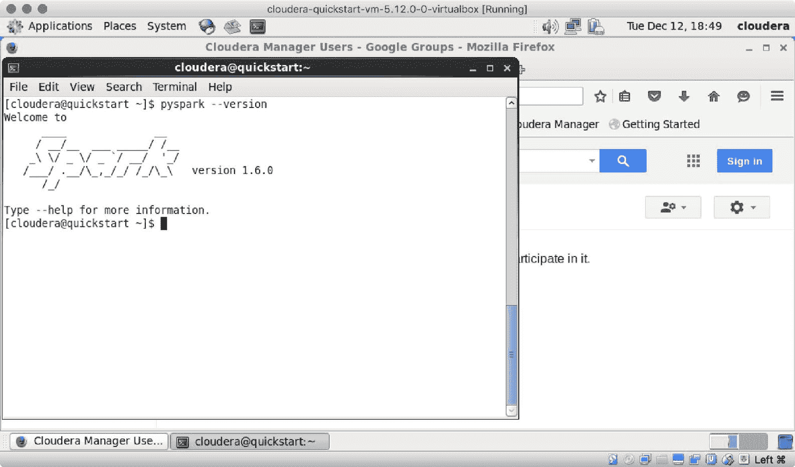

# 安装和配置Spark

在本章中，我们将介绍如何在本地实例、多节点集群或虚拟环境中安装和配置 Spark。您将学习以下食谱:

*   安装Spark要求
*   从源头安装Spark
*   从二进制文件安装 Spark
*   配置Spark的本地实例
*   配置 Spark 的多节点实例
*   安装 Jupyter
*   在 Jupyter 中配置会话
*   使用 Cloudera Spark图像

# 介绍

我们不能在没有首先说明什么是Spark的情况下就开始写一本关于Spark的书。Spark 是一个强大、灵活、开源的数据处理和查询引擎。它非常易于使用，并提供了解决各种各样问题的方法，从处理非结构化、半结构化或结构化数据，到流式传输，再到机器学习。Spark 拥有来自 250 多个组织的 1，000 多名贡献者(更不用说全球 3，000 多名 Spark Meetup 社区成员)，现在是 Apache 软件基金会产品组合中最大的开源项目之一。

Spark 的起源可以在 2012 年首次发布时找到；Matei Zacharia 在加州大学伯克利分校开发了第一个版本的 Spark 处理引擎，作为他博士论文的一部分。从那以后，Spark 变得非常受欢迎，它的受欢迎源于许多原因:

*   **很快**:估计 Spark 在纯内存工作时比 Hadoop 快 100 倍，在读写磁盘数据时快 10 倍左右。
*   **它是灵活的**:你可以从多种编程语言中利用 Spark 的力量；Spark 原生支持 Scala、Java、Python 和 r 中的接口。
*   **它是可扩展的**:由于 Spark 是一个开源包，你可以通过引入自己的类或者扩展现有的类来轻松扩展它。
*   **它功能强大**:很多机器学习算法已经在 Spark 中实现，所以你不需要在你的栈中添加更多的工具——大部分数据工程和数据科学任务都可以在单一环境下工作的同时完成。
*   **熟悉的**:习惯使用 Python 的`pandas`，或者 R 的`data.frames`或者`data.tables`的数据科学家和数据工程师，应该有一个温和得多的学习曲线(虽然这些数据类型之间存在差异)。而且，如果你懂 SQL，也可以用它在 Spark 里面抬杠数据！
*   **它是可扩展的** : Spark 可以在你的机器上本地运行(尽管有这样一个解决方案带来的所有限制)。但是，在本地运行的相同代码可以部署到数千台机器的集群中，几乎没有变化。

在本书的剩余部分，我们将假设您在类似 Unix 的环境中工作，例如 Linux(在本书中，我们将使用 Ubuntu Server 16.04 LTS)或 macOS(运行 MacOS High Sierra)；提供的所有代码都在这两个环境中进行了测试。对于这一章(以及其他一些章节)，互联网连接也是必需的，因为我们将从互联网下载一堆二进制文件和源代码。

We will not be focusing on installing Spark in a Windows environment as it is not truly supported by the Spark developers. However, if you are inclined to try, you can follow some of the instructions you will find online, such as from the following link: [http://bit.ly/2Ar75ld](http://bit.ly/2Ar75ld).

了解如何使用命令行以及如何在系统上设置一些环境变量是有用的，但不是真正必需的——我们将指导您完成这些步骤。

# 安装Spark要求

Spark 要求在您安装和使用之前，在您的机器上有一些环境。在本食谱中，我们将着重于让您的机器为安装 Spark 做好准备。

# 准备好

要执行这个方法，您需要一个 bash 终端和一个互联网连接。

此外，在我们开始任何工作之前，您应该为这本书克隆 GitHub 存储库。存储库包含所有代码(以笔记本的形式)和所有数据，您将需要遵循本书中的示例。要克隆存储库，请转到[http://bit.ly/2ArlBck](http://bit.ly/2ArlBck)，单击克隆或下载按钮，并通过单击旁边的图标复制显示的网址:


接下来，转到您的终端并发出以下命令:

```py
git clone git@github.com:drabastomek/PySparkCookbook.git
```

如果你的`git`环境设置正确，整个 GitHub 存储库应该克隆到你的磁盘上。不需要其他先决条件。

# 怎么做...

安装 PySpark 真正有两个主要需求:Java 和 Python。此外，如果您想使用 Scala 和 R 语言，您也可以安装它们，我们还将检查 Maven，我们将使用它来编译Spark源。

为此，我们将使用`checkRequirements.sh`脚本检查所有需求:该脚本位于 GitHub 存储库中的`Chapter01`文件夹中。

下面的代码块显示了在`Chapter01/checkRequirements.sh`文件中找到的脚本的高级部分。请注意，为了简洁起见，这里省略了部分代码:

```py
#!/bin/bash# Shell script for checking the dependencies ## PySpark Cookbook# Author: Tomasz Drabas, Denny Lee# Version: 0.1# Date: 12/2/2017_java_required=1.8_python_required=3.4_r_required=3.1_scala_required=2.11_mvn_required=3.3.9# parse command line arguments_args_len="$#"...printHeadercheckJavacheckPythonif [ "${_check_R_req}" = "true" ]; thencheckRfiif [ "${_check_Scala_req}" = "true" ]; thencheckScalafiif [ "${_check_Maven_req}" = "true" ]; thencheckMavenfi
```

# 它是如何工作的...

首先，我们将指定所有必需的包及其必需的最低版本；查看前面的代码，您可以看到 Spark 2.3.1 需要 Java 1.8+和 Python 3.4 或更高版本(我们将始终检查这两种环境)。此外，如果您想使用 R 或 Scala，这两个包的最低要求分别是 3.1 和 2.11。如前所述，Maven 将用于编译 Spark 源代码，为此，Spark 至少需要 Maven 的 3.3.9 版本。

You can check the Spark requirements here: [https://spark.apache.org/docs/latest/index.html](https://spark.apache.org/docs/latest/index.html) 
You can check the requirements for building Spark here: [https://spark.apache.org/docs/latest/building-spark.html](https://spark.apache.org/docs/latest/building-spark.html).

接下来，我们解析命令行参数:

```py
if [ "$_args_len" -ge 0 ]; thenwhile [[ "$#" -gt 0 ]]dokey="$1"case $key in-m|--Maven)_check_Maven_req="true"shift # past argument;;-r|--R)_check_R_req="true"shift # past argument;;-s|--Scala)_check_Scala_req="true"shift # past argument;;*)shift # past argumentesacdonefi
```

作为用户，您可以指定是否要额外检查 R、Scala 和 Maven 依赖项。为此，请从命令行运行以下代码(以下代码将检查所有代码):

```py
./checkRequirements.sh -s -m -r
```

以下也是完全有效的用法:

```py
./checkRequirements.sh --Scala --Maven --R
```

接下来，我们调用三个函数:`printHeader`、`checkJava`和`checkPython`。`printHeader`功能只不过是脚本陈述它所做的事情的一种简单方式，真的没那么有趣，所以我们在这里跳过它；然而，它是相当不言自明的，所以欢迎你自己阅读`checkRequirements.sh`剧本的相关部分。

接下来，我们将检查是否安装了 Java。首先，我们只需向终端打印我们正在对 Java 执行的检查(这在我们所有的功能中都是常见的，因此我们在此仅提及):

```py
function checkJava() {echoecho "##########################"echoecho "Checking Java"echo
```

接下来，我们将检查您的机器上是否安装了 Java 环境:

```py
if type -p java; thenecho "Java executable found in PATH"_java=javaelif [[ -n "$JAVA_HOME" ]] && [[ -x "$JAVA_HOME/bin/java" ]]; thenecho "Found Java executable in JAVA_HOME"_java="$JAVA_HOME/bin/java"elseecho "No Java found. Install Java version $_java_required or higher first or specify JAVA_HOME variable that will point to your Java binaries."exitfi
```

首先，我们使用`type`命令检查`java`命令是否可用；`type -p`命令返回`java`二进制文件的位置(如果存在)。这也意味着包含 Java 二进制文件的`bin`文件夹已经被添加到`PATH`中。

If you are certain you have the binaries installed (be it Java, Python, R, Scala, or Maven), you can jump to the *Updating PATH* section in this recipe to see how to let your computer know where these binaries live.

如果失败，我们将恢复检查是否设置了`JAVA_HOME`环境变量，如果设置了，我们将尝试查看它是否包含所需的`java`二进制:`[[ -x "$JAVA_HOME/bin/java" ]]`。如果失败，程序将打印出找不到 Java 环境的消息，并退出(不检查其他必需的包，如 Python)。

但是，如果找到了 Java 二进制文件，那么我们可以检查它的版本:

```py
_java_version=$("$_java" -version 2>&1 | awk -F '"' '/version/ {print $2}')echo "Java version: $_java_version (min.: $_java_required)"if [[ "$_java_version" < "$_java_required" ]]; thenecho "Java version required is $_java_required. Install the required version first."exitfiecho
```

我们首先在终端中执行`java -version`命令，它通常会产生类似于下面截图的输出:


然后，我们将之前的输出通过管道传输到`awk`来分割(使用`-F`开关)引用`'"'`字符处的行(并且在我们将行过滤到包含`/version/`的行时，将只使用输出的第一行)，并将第二个(T4)元素作为安装在我们机器上的 Java 二进制文件的版本。我们将它存储在`_java_version`变量中，我们也使用`echo`命令将其打印到屏幕上。

If you do not know what `awk` is or how to use it, we recommend this book from Packt: [http://bit.ly/2BtTcBV](http://bit.ly/2BtTcBV).

最后，我们检查一下刚刚得到的`_java_version`是否低于`_java_required`。如果评估结果为真，我们将停止执行，而是告诉您安装所需版本的 Java。

在`checkPython`、`checkR`、`checkScala`和`checkMaven`功能中实现的逻辑遵循非常相似的方式。唯一的区别是我们所称的二进制和我们检查版本的方式:

*   对于 Python，我们运行`"$_python" --version 2>&1 | awk -F ' ' '{print $2}'`，因为检查 Python 版本(对于 Anaconda 发行版)会在屏幕上打印出以下内容:Python 3 . 5 . 2::Anaconda 2 . 4 . 1(x86 _ 64)
*   对于 R，我们使用`"$_r" --version 2>&1 | awk -F ' ' '/R version/ {print $3}'`，因为检查 R 的版本会写(很多)到屏幕上；我们只用以`R version`开头的那句台词:R 版本 3.4.2 (2017-09-28) -“短暂的夏天”
*   对于 Scala，我们利用`"$_scala" -version 2>&1 | awk -F ' ' '{print $5}'`，假设检查 Scala 的版本打印如下:Scala 代码运行器版本 2.11.8 -版权所有 2002-2016，LAMP/EPFL
*   对于 Maven，我们检查`"$_mvn" --version 2>&1 | awk -F ' ' '/Apache Maven/ {print $3}'`，因为 Maven 打印出以下内容(以及更多！)询问其版本时:Apache Maven 3 . 5 . 2(138 edd 61 FD 100 EC 658 bfa2d 307 c 43 b 76940 a5d 7d；2017-10-18T00:58:13-07:00)

如果你想了解更多，你现在应该能够轻松地阅读其他功能。

# 还有更多...

如果没有安装任何依赖项，您需要在继续下一个配方之前安装它们。指导您一步一步地完成所有这些的安装过程超出了本书的范围，但是这里有一些有用的链接来告诉您如何做。

# 安装 Java

安装 Java 非常简单。

在 macOS 上，转到[https://www.java.com/en/download/mac_download.jsp](https://www.java.com/en/download/mac_download.jsp)并下载适合您系统的版本。下载后，按照说明将其安装到您的机器上。如果您需要更详细的说明，请查看此链接:[http://bit.ly/2idEozX](http://bit.ly/2idEozX)。

在 Linux 上，查看以下链接[http://bit.ly/2jGwuz1](http://bit.ly/2jGwuz1)获取 Linux Java 安装说明。

# 安装 Python

我们一直在使用(并且强烈推荐)Python 的 Anaconda 版本，因为它附带了安装程序中最常用的包。它还内置了`conda`包管理工具，使得安装其他包变得轻而易举。

可以从[http://www.continuum.io/downloads](http://www.continuum.io/downloads)下载蟒蛇；选择合适的版本来满足 Spark 的要求。关于 macOS 的安装说明，可以去[http://bit.ly/2zZPuUf](http://bit.ly/2zZPuUf)查看，Linux 安装手册可以去[http://bit.ly/2ASLUvg](http://bit.ly/2ASLUvg)查看。

# 安装拆装工具

R 通过**综合 R 档案网** ( **CRAN** )分发。macOS 版本可以在这里[https://cran.r-project.org/bin/macosx/](https://cran.r-project.org/bin/macosx/)下载，Linux 版本可以在这里:[https://cran.r-project.org/bin/linux/](https://cran.r-project.org/bin/linux/)。

下载适合您机器的版本，并按照屏幕上的安装说明进行操作。对于 macOS 版本，您可以选择只安装 R 核心包，而不安装 GUI 和其他任何东西，因为 Spark 不需要这些。

# 安装 Scala

安装 Scala 甚至更简单。

去[http://bit.ly/2Am757R](http://bit.ly/2Am757R)下载`sbt-*.*.*.tgz`档案(写这本书的时候最新版本是`sbt-1.0.4.tgz`)。接下来，在您的终端中，导航到您刚刚下载 Scala 的文件夹，并发出以下命令:

```py
tar -xvf sbt-1.0.4.tgzsudo mv sbt-1.0.4/ /opt/scala/
```

就这样。现在，您可以跳到本食谱中的*更新路径*部分来更新您的`PATH`。

# 安装 Maven

Maven 的安装与 Scala 非常相似。前往[https://maven.apache.org/download.cgi](https://maven.apache.org/download.cgi)下载`apache-maven-*.*.*-bin.tar.gz`档案。在写这本书的时候，最新的版本是 3.5.2。与 Scala 类似，打开终端，导航到刚刚下载归档文件的文件夹，然后键入:

```py
tar -xvf apache-maven-3.5.2-bin.tar.gz
```

```py
sudo mv apache-maven-3.5.2-bin/ /opt/apache-maven/
```

同样，这也是您在安装 Maven 时需要做的。查看下一小节，了解如何更新您的`PATH`的说明。

# 更新 PATH

类似 Unix 的操作系统(Windows 也是如此)使用`PATH`的概念来搜索二进制文件(或可执行文件，在 Windows 的情况下)。`PATH`只不过是一个由冒号字符`':'`分隔的文件夹列表，告诉操作系统在哪里寻找二进制文件。

要给你的`PATH`添加一些东西(并使其永久改变)，你需要编辑`.bash_profile` (macOS)或`.bashrc` (Linux)文件；这些文件位于用户的根文件夹中。因此，要将 Scala 和 Maven 二进制文件都添加到路径中，您可以(在 macOS 上)执行以下操作:

```py
cp ~/.bash_profile ~/.bash_profile_old   # make a copy just in case
```

```py
echo export SCALA_HOME=/opt/scala >> ~/.bash_profile
```

```py
echo export MAVEN_HOME=/opt/apache-maven >> ~/.bash_profile
```

```py
echo PATH=$SCALA_HOME/bin:$MAVEN_HOME/bin:$PATH >> ~/.bash_profile
```

在 Linux 上，等价的如下所示:

```py
cp ~/.bashrc ~/.bashrc_old   # make a copy just in case
```

```py
echo export SCALA_HOME=/opt/scala >> ~/.bashrc
```

```py
echo export MAVEN_HOME=/opt/apache-maven >> ~/.bashrc
```

```py
echo PATH=$SCALA_HOME/bin:$MAVEN_HOME/bin:$PATH >> ~/.bashrc
```

使用重定向操作符`>>`，上述命令简单地附加到`.bash_profile`或`.bashrc`文件的末尾。

执行上述命令后，重新启动终端，并且:

```py
echo $PATH
```

它现在应该包括 Scala 和 Maven 二进制文件的路径。

# 从源头安装Spark

Spark 以两种方式分发:要么作为预编译的二进制文件，要么作为源代码，让您可以灵活选择，例如，您是否需要对 Hive 的支持。在这个食谱中，我们将重点关注后者。

# 准备好

要执行这个方法，您需要一个 bash 终端和一个互联网连接。此外，要完成此配方，您必须已经检查和/或安装了我们在上一个配方中完成的所有所需环境。此外，您需要有管理权限(通过`sudo`命令)，这是将编译后的二进制文件移动到目标文件夹所必需的。

If you are not an administrator on your machine, you can call the script with the `-ns` (or `--nosudo`) parameter. The destination folder will then switch to your home directory and will create a `spark` folder within it. By default, the binaries will be moved to the `/opt/spark` folder and that's why you need administrative rights.

不需要其他先决条件。

# 怎么做...

我们将采取五个主要步骤从源代码安装 Spark(检查代码中突出显示的部分):

1.  从 Spark 的网站下载来源
2.  打开档案

3.  建设
4.  移动到最终目的地
5.  创建必要的环境变量

我们代码的框架如下(参见`Chapter01/installFromSource.sh`文件):

```py
#!/bin/bash
```

```py
# Shell script for installing Spark from sources## PySpark Cookbook# Author: Tomasz Drabas, Denny Lee# Version: 0.1# Date: 12/2/2017
```

```py
_spark_source="http://mirrors.ocf.berkeley.edu/apache/spark/spark-2.3.1/spark-2.3.1.tgz"_spark_archive=$( echo "$_spark_source" | awk -F '/' '{print $NF}' )_spark_dir=$( echo "${_spark_archive%.*}" )_spark_destination="/opt/spark"
```

```py
...
```

```py
checkOSprintHeaderdownloadThePackageunpackbuildmoveTheBinariessetSparkEnvironmentVariablescleanUp
```

# 它是如何工作的...

首先，我们指定 Spark 源代码的位置。`_spark_archive`包含档案的名称；我们使用`awk`从`_spark_source`中提取最后一个元素(这里由`$NF`标志指定)。`_spark_dir`包含我们的档案将解压到的目录的名称；在我们目前的情况下，这将是`spark-2.3.1`。最后，我们指定我们要将二进制文件移动到的目标文件夹:如果您在调用`./installFromSource.sh`脚本时使用`-ns`(或`--nosudo`)开关，它将是`/opt/spark`(默认)或您的主目录。

接下来，我们检查正在使用的操作系统名称:

```py
function checkOS(){_uname_out="$(uname -s)"case "$_uname_out" inLinux*) _machine="Linux";;Darwin*) _machine="Mac";;*) _machine="UNKNOWN:${_uname_out}"esac
```

```py
 if [ "$_machine" = "UNKNOWN:${_uname_out}" ]; thenecho "Machine $_machine. Stopping."exitfi}
```

首先，我们使用`uname`命令得到操作系统的简称；`-s`开关返回操作系统名称的缩短版本。如前所述，我们只关注两个操作系统:macOS 和 Linux，因此如果您尝试在 Windows 或任何其他系统上运行此脚本，它将停止。这部分代码是正确设置`_machine`标志所必需的:macOS 和 Linux 使用不同的方法来下载 Spark 源代码，使用不同的 bash 配置文件来设置环境变量。

接下来，我们打印出标题(这里我们将跳过这部分的代码，但欢迎您查看`Chapter01/installFromSource.sh`脚本)。接下来，我们下载必要的源代码:

```py
function downloadThePackage() {...if [ -d _temp ]; thensudo rm -rf _tempfi
```

```py
 mkdir _temp cd _temp
```

```py
 if [ "$_machine" = "Mac" ]; thencurl -O $_spark_sourceelif [ "$_machine" = "Linux"]; thenwget $_spark_sourceelseecho "System: $_machine not supported."exitfi
```

```py
}
```

首先，我们检查一个`_temp`文件夹是否存在，如果存在，我们就删除它。接下来，我们重新创建一个空的`_temp`文件夹，并将源代码下载到其中；在 macOS 上，我们使用`curl`方法，而在 Linux 上，我们使用`wget`下载源代码。

Did you notice the ellipsis `'...'` character in our code? Whenever we use such a character, we omit some less relevant or purely informational portions of the code. They are still present, though, in the sources checked into the GitHub repository.

一旦资源到达我们的机器上，我们使用`tar`工具`tar -xf $_spark_archive`打开它们。这发生在`unpack`函数内部。

最后，我们可以开始将源代码构建成二进制文件:

```py
function build(){...
```

```py
 cd "$_spark_dir"./dev/make-distribution.sh --name pyspark-cookbook -Phadoop-2.7 -Phive -Phive-thriftserver -Pyarn
```

```py
}
```

我们使用`make-distribution.sh`脚本(用 Spark 分发)创建自己的 Spark 分发版，命名为`pyspark-cookbook`。前面的命令将为 Hadoop 2.7 构建 Spark 发行版，并支持 Hive。我们还可以将其部署在纱上。在引擎盖下，`make-distribution.sh`脚本正在使用马文编译源代码。

一旦编译完成，我们需要将二进制文件移动到`_spark_destination`文件夹:

```py
function moveTheBinaries() {
```

```py
 ...if [ -d "$_spark_destination" ]; then sudo rm -rf "$_spark_destination"fi
```

```py
 cd ..sudo mv $_spark_dir/ $_spark_destination/
```

```py
}
```

首先，我们检查目标中的文件夹是否存在，如果存在，我们将删除它。接下来，我们只需将`$_spark_dir`文件夹移动(`mv`)到它的新家。

This is when you will need to type in the password if you did not use the `-ns` (or `--nosudo`) flag when invoking the `installFromSource.sh` script.

最后一步是向 bash 概要文件中添加新的环境变量:

```py
function setSparkEnvironmentVariables() {...
```

```py
 if [ "$_machine" = "Mac" ]; then_bash=~/.bash_profileelse_bash=~/.bashrcfi_today=$( date +%Y-%m-%d )
```

```py
 # make a copy just in case if ! [ -f "$_bash.spark_copy" ]; thencp "$_bash" "$_bash.spark_copy"fi
```

```py
 echo >> $_bash echo "###################################################" >> $_bashecho "# SPARK environment variables" >> $_bashecho "#" >> $_bashecho "# Script: installFromSource.sh" >> $_bashecho "# Added on: $_today" >>$_bashecho >> $_bash
```

```py
 echo "export SPARK_HOME=$_spark_destination" >> $_bashecho "export PYSPARK_SUBMIT_ARGS=\"--master local[4]\"" >> $_bashecho "export PYSPARK_PYTHON=$(type -p python)" >> $_bashecho "export PYSPARK_DRIVER_PYTHON=jupyter" >> $_bash
```

```py
 echo "export PYSPARK_DRIVER_PYTHON_OPTS=\"notebook --NotebookApp.open_browser=False --NotebookApp.port=6661\"" >> $_bashecho "export PATH=$SPARK_HOME/bin:\$PATH" >> $_bash}
```

首先，我们检查我们在什么操作系统上，并选择合适的 bash 配置文件。我们还获取当前日期(变量`_today`)以便将该信息包含在我们的 bash 概要文件中，并创建它的安全副本(以防万一，如果还不存在的话)。接下来，我们开始向 bash 概要文件添加新的行:

*   我们首先将`SPARK_HOME`变量设置为`_spark_destination`；这要么是`/opt/spark`要么是`~/spark`地点。
*   调用`pyspark`时使用`PYSPARK_SUBMIT_ARGS`变量。它指示 Spark 使用您的 CPU 的四个内核；将其更改为`--master local[*]`将使用所有可用的内核。
*   我们指定了`PYSPARK_PYTHON`变量，因此，如果机器上存在多个 Python 安装，`pyspark`将使用我们在第一个配方中检查的那个。
*   将`PYSPARK_DRIVER_PYTHON`设置为`jupyter`将启动一个 Jupyter 会话(而不是 PySpark 交互外壳)。
*   `PYSPARK_DRIVER_PYTHON_OPS`指示朱皮特:
    *   开始一个`notebook`
    *   默认不打开浏览器:使用`--NotebookApp.open_browser=False`标志
    *   将默认端口(`8888`)更改为`6661`(因为出于安全考虑，我们非常支持不默认任何东西)

最后，我们将`SPARK_HOME`中的`bin`文件夹添加到`PATH`中。

最后一步是`cleanUp`追自己；我们只需移除`_temp`文件夹中的所有内容。

现在我们已经安装了 Spark，让我们测试一下是否一切正常。首先，为了使终端的会话中所有环境变量都可以访问，我们需要刷新`bash`会话:您可以关闭并重新打开终端，或者执行以下命令(在 macOS 上):

```py
source ~/.bash_profile
```

在 Linux 上，执行以下命令:

```py
source ~/.bashrc
```

接下来，您应该能够执行以下操作:

```py
pyspark --version
```

如果一切顺利，您应该会看到类似于下面截图中所示的响应:


# 还有更多...

不用使用 Spark 的`make-distribution.sh`脚本，可以直接使用 Maven 编译源码。例如，如果您想要构建 Spark 的默认版本，您可以简单地键入(从`_spark_dir`文件夹):

```py
./build/mvn clean package
```

这将默认为 Hadoop 2.6。如果您的 Hadoop 版本是 2.7.2，并且部署在纱上，您可以执行以下操作:

```py
./build/mvn -Pyarn -Phadoop-2.7 -Dhadoop.version=2.7.2 -DskipTests clean package
```

您也可以使用 Scala 来构建 Spark:

```py
./build/sbt package
```

# 请参见

*   如果您想了解更多关于如何构建和/或启用 Spark 某些功能的信息，请访问 Spark 的网站:[http://spark.apache.org/docs/latest/building-spark.html](http://spark.apache.org/docs/latest/building-spark.html)

# 从二进制文件安装 Spark

从已经预编译的二进制文件安装 Spark 甚至比从源代码安装 Spark 更容易。在本食谱中，我们将向您展示如何通过从网络下载二进制文件或使用`pip`来实现这一点。

# 准备好

要执行这个方法，您需要一个 bash 终端和一个互联网连接。此外，要完成此配方，您需要已经检查和/或安装了我们在*安装Spark要求*配方中所经历的所有所需环境。此外，您需要拥有管理权限(通过`sudo`命令)，因为这些权限对于将编译后的二进制文件移动到目标文件夹是必要的。

If you are not an administrator on your machine, you can call the script with the `-ns` (or `--nosudo`) parameter. The destination folder will then switch to your home directory and will create a `spark` folder within it; by default, the binaries will be moved to the `/opt/spark` folder and that's why you need administrative rights.

不需要其他先决条件。

# 怎么做...

要从二进制文件安装，我们只需要四个步骤(参见下面的源代码)，因为我们不需要编译源代码:

1.  从 Spark 的网站下载预编译的二进制文件。
2.  打开档案。
3.  移动到最终目的地。
4.  创建必要的环境变量。

我们代码的框架如下(参见`Chapter01/installFromBinary.sh`文件):

```py
#!/bin/bash
```

```py
# Shell script for installing Spark from binaries
```

```py
## PySpark Cookbook# Author: Tomasz Drabas, Denny Lee# Version: 0.1# Date: 12/2/2017
```

```py
_spark_binary="http://mirrors.ocf.berkeley.edu/apache/spark/spark-2.3.1/spark-2.3.1-bin-hadoop2.7.tgz"_spark_archive=$( echo "$_spark_binary" | awk -F '/' '{print $NF}' )_spark_dir=$( echo "${_spark_archive%.*}" )_spark_destination="/opt/spark"
```

```py
...
```

```py
checkOSprintHeaderdownloadThePackageunpackmoveTheBinariessetSparkEnvironmentVariablescleanUp
```

# 它是如何工作的...

代码与之前的配方完全相同，因此我们在此不再重复；唯一的主要区别是我们在这个脚本中没有`build`阶段，而`_spark_source`变量是不同的。

和前面的食谱一样，我们从指定 Spark 源代码的位置开始，它在`_spark_source`中。`_spark_archive`包含档案的名称；我们使用`awk`来提取最后一个元素。`_spark_dir`包含我们的归档文件将解压到的目录的名称；在我们目前的情况下，这将是`spark-2.3.1`。最后，我们指定我们将二进制文件移动到的目标文件夹:如果您在调用`./installFromBinary.sh`脚本时使用`-ns`(或`--nosudo`)开关，它将是`/opt/spark`(默认)或您的主目录。

接下来，我们检查操作系统名称。根据您是在 Linux 还是 macOS 环境下工作，我们会使用不同的工具从互联网下载存档文件(勾选`downloadThePackage`功能)。此外，在设置环境变量时，我们将输出到不同的 bash 配置文件:macOS 上的`.bash_profile`和 Linux 上的`.bashrc`(检查`setEnvironmentVariables`功能)。

在操作系统检查之后，我们下载了这个包:在 macOS 上，我们使用`curl`，在 Linux 上，我们使用`wget`工具来达到这个目标。一旦包被下载，我们使用`tar`工具打开包，然后将其移动到目标文件夹。如果您以`sudo`权限运行(没有`-ns`或`--nosudo`参数)，二进制文件将被移动到`/opt/spark`文件夹；如果没有——它们将被放在`~/spark`文件夹中。

最后，我们将环境变量添加到适当的 bash 概要文件中:查看前面的配方，了解添加了什么以及添加的原因。此外，按照上一个食谱末尾的步骤测试您的环境是否正常工作。

# 还有更多...

如今，有一种更简单的方法可以在你的机器上安装 PySpark，那就是使用 pip。

`pip` is Python's package manager. If you installed Python 2.7.9 or Python 3.4 from [http://python.org](http://python.org), then `pip` is already present on your machine (the same goes for our recommended Python distribution—Anaconda). If you do not have `pip`, you can easily install it from here:  [https://pip.pypa.io/en/stable/installing/](https://pip.pypa.io/en/stable/installing/).

要通过`pip`安装 PySpark，只需在终端中发出以下命令:

```py
pip install pyspark
```

或者，如果您使用 Python 3.4+，您也可以尝试:

```py
pip3 install pyspark
```

您应该会在终端中看到以下屏幕:


# 配置Spark的本地实例

实际上，配置 Spark 的本地实例不需要做太多事情。Spark 的美妙之处在于，您需要做的只是遵循前面两个方法中的任何一个(从源代码或二进制文件安装)，然后就可以开始使用它了。然而，在本食谱中，我们将向您介绍最有用的`SparkSession`配置选项。

# 准备好

为了遵循这个配方，需要一个工作的Spark环境。这意味着您必须已经完成了前面的三个方法，并且已经成功安装和测试了您的环境，或者已经建立了一个工作的 Spark 环境。

不需要其他先决条件。

# 怎么做...

要配置您的会话，在低于 2.0 版本的 Spark 版本中，您通常必须创建一个`SparkConf`对象，将所有选项设置为正确的值，然后构建`SparkContext`(如果您想使用`DataFrames``SqlContext`，如果您想访问 Hive 表`HiveContext`)。从 Spark 2.0 开始，你只需要创建一个`SparkSession`，就像下面的片段:

```py
spark = SparkSession.builder \.master("local[2]") \.appName("Your-app-name") \.config("spark.some.config.option", "some-value") \.getOrCreate() 
```

# 它是如何工作的...

为了创建一个`SparkSession`，我们将使用`Builder`类(通过`SparkSession`类的`.builder`属性访问)。您可以在这里指定`SparkSession`的一些基本属性:

*   `.master(...)`允许您指定驱动程序节点(在前面的示例中，我们将运行一个具有两个内核的本地会话)

*   `.appName(...)`为您提供了为应用程序指定友好名称的方法

*   `.config(...)`方法允许您进一步细化会话的行为；下表列出了最重要的`SparkSession`参数
*   `.getOrCreate()`方法返回一个新的`SparkSession`(如果还没有创建的话),或者返回一个指向已经存在的`SparkSession`的指针

下表给出了Spark本地实例最有用的配置参数示例列表:

Some of these parameters are also applicable if you are working in a cluster environment with multiple worker nodes. In the next recipe, we will explain how to set up and administer a multi-node Spark cluster deployed over YARN. 

| **参数** | **功能** | **默认** |
| `spark.app.name` | 为应用程序指定友好名称 | (无) |
| `spark.driver.cores` | 驱动程序节点要使用的内核数量。这仅适用于集群模式下的应用部署(参见以下`spark.submit.deployMode`参数)。 | one |
| `spark.driver.memory` | 指定驱动程序进程的内存量。如果在客户端模式下使用`spark-submit`，您应该使用`--driver-memory`开关在命令行中指定这个参数，而不是使用这个参数配置您的会话，因为此时 JVM 已经启动了。 | 第一代 |
| `spark.executor.cores` | 执行器要使用的内核数量。在本地运行时设置此参数允许您使用机器上的所有可用内核。 | 1 在纱部署中，独立和 Mesos 部署中工作机上的所有可用核心 |
| `spark.executor.memory` | 指定每个执行器进程的内存量。 | 第一代 |
| `spark.submit.pyFiles` | `.zip`、`.egg`或`.py`文件列表，用逗号分隔。这些将被添加到`PYTHONPATH`中，以便 Python 应用程序可以访问它们。 | (无) |
| `spark.submit.deployMode` | Spark驱动程序的部署模式。指定`'client'`将在机器上本地启动驱动程序(可以是驱动程序节点)，而指定`'cluster'`将利用远程集群上的一个节点。 | (无) |
| `spark.pyspark.python` | 驱动程序和所有执行器应该使用的 Python 二进制文件。 | (无) |

有一些环境变量也允许您进一步微调您的 Spark 环境。具体来说，我们说的是`PYSPARK_DRIVER_PYTHON`和`PYSPARK_DRIVER_PYTHON_OPTS`变量。我们已经在*安装Spark源*配方中介绍了这些。

# 请参见

*   在此查看所有可用配置选项的完整列表:[https://spark.apache.org/docs/latest/configuration.html](https://spark.apache.org/docs/latest/configuration.html)

# 配置 Spark 的多节点实例

设置多节点 Spark 集群需要更多的步骤来做好准备。在这个食谱中，我们将一步一步地通过脚本来帮助您完成这个过程；脚本需要在驱动程序节点和所有执行器上运行，以设置环境。

# 准备好

在这个食谱中，我们只关注 Linux 环境(我们使用的是 Ubuntu 服务器 16.04 LTS)。在您可以遵循食谱的其余部分之前，需要满足以下先决条件:

*   Linux 发行版的干净安装；在我们的案例中，我们在由三台戴尔 R710s 组成的集群中的每台机器上都安装了 Ubuntu Server 16.04 LTS。
*   每台机器都需要连接到互联网，并且可以从本地机器访问。您需要机器的 IP 地址和主机名；在 Linux 上，您可以通过发出`ifconfig`命令并读取`inet addr`来检查 IP。要检查您的主机名，请键入`cat/etc/hostname`。

*   在每台服务器上，我们添加了一个名为`hadoop`的用户组。接下来，我们创建了一个名为`hduser`的用户，并将其添加到`hadoop`组。另外，确保`hduser`拥有`sudo`权利。如果您不知道如何操作，请查看本食谱的*部分。*
*   确保您已经添加了通过 SSH 访问服务器的功能。如果无法做到这一点，请在每台服务器上运行`sudo apt-get install openssh-server openssh-client`来安装必要的环境。
*   如果您想读写 Hadoop 和 Hive，您需要在集群上安装和配置这两个环境。查看[https://data-flair . training/blogs/Install-hadoop-2-x-On-Ubuntu/](https://data-flair.training/blogs/install-hadoop-2-x-on-ubuntu/)了解 Hadoop 的安装和配置，查看[http://www . bogotobogo . com/Hadoop/BigData _ Hadoop _ Hive _ Install _ On _ Ubuntu _ 16 _ 04 . PHP](http://www.bogotobogo.com/Hadoop/BigData_hadoop_Hive_Install_On_Ubuntu_16_04.php)了解 Hive。

If you have these two environments set up, some of the steps from our script would be obsolete. However, we will present all of the steps as follows, assuming you only want the Spark environment.

不需要其他先决条件。

为了在集群设置中自动部署 Spark 环境，您还必须:

1.  创建`hosts.txt`文件。列表中的每个条目都是其中一台服务器的 IP 地址，后跟两个空格和一个主机名。**不删除`driver:`也不删除`executors:`行**。另外，请注意，我们的集群中只允许一个驱动程序(有些集群支持冗余驱动程序)。该文件的内容示例如下:

```py
driver:192.168.17.160  pathfinder
```

```py
executors:192.168.17.161  discovery1192.168.17.162  discovery2
```

2.  在您的本地机器上，将入侵防御系统和主机名添加到您的`/etc/hosts`文件中，这样您就可以通过主机名而不是入侵防御系统来访问服务器(同样，我们假设您运行的是类似 Unix 的系统，如 macOS 或 Linux)。例如，以下命令会将`pathfinder`添加到我们的`/etc/hosts`文件中:`sudo echo 192.168.1.160  pathfinder >> /etc/hosts`。对服务器上的所有计算机重复此操作。

3.  将`hosts.txt`文件复制到集群中的每台机器上；我们假设该文件将被放置在`hduser`的根文件夹中。您可以使用`scp hosts.txt hduser@<your-server-name>:~`命令轻松实现这一点，其中`<your-server-name>`是机器的主机名。
4.  要从本地机器运行`installOnRemote.sh`脚本(参见`Chapter01/installOnRemote.sh`文件)，请执行以下操作:`ssh -tq hduser@<your-server-name> "echo $(base64 -i installOnRemote.sh) | base64 -d | sudo bash"`。我们将在下一节的`installOnRemote.sh`脚本中详细介绍这些步骤。
5.  按照屏幕上的提示完成安装和配置步骤。对集群中的每台计算机重复步骤 4。

# 怎么做...

这个食谱的`installOnRemote.sh`脚本可以在 GitHub 存储库中的`Chapter01`文件夹中找到:[http://bit.ly/2ArlBck](http://bit.ly/2ArlBck)。脚本的某些部分与我们在前面的食谱中概述的非常相似，因此我们将跳过这些部分；更多信息可以参考之前的菜谱(尤其是*安装星火要求*和*从二进制*菜谱安装星火)。

脚本的顶层结构如下:

```py
#!/bin/bash
```

```py
# Shell script for installing Spark from binaries# on remote servers## PySpark Cookbook# Author: Tomasz Drabas, Denny Lee# Version: 0.1# Date: 12/9/2017
```

```py
_spark_binary="http://mirrors.ocf.berkeley.edu/apache/spark/spark-2.3.1/spark-2.3.1-bin-hadoop2.7.tgz"_spark_archive=$( echo "$_spark_binary" | awk -F '/' '{print $NF}' )_spark_dir=$( echo "${_spark_archive%.*}" )_spark_destination="/opt/spark"_java_destination="/usr/lib/jvm/java-8-oracle"_python_binary="https://repo.continuum.io/archive/Anaconda3-5.0.1-Linux-x86_64.sh"
```

```py
_python_archive=$( echo "$_python_binary" | awk -F '/' '{print $NF}' )_python_destination="/opt/python"
```

```py
_machine=$(cat /etc/hostname)_today=$( date +%Y-%m-%d )
```

```py
_current_dir=$(pwd) # store current working directory
```

```py
...
```

```py
printHeaderreadIPscheckJavainstallScalainstallPythonupdateHostsconfigureSSHdownloadThePackageunpackmoveTheBinariessetSparkEnvironmentVariablesupdateSparkConfigcleanUp
```

我们用粗体突出显示了脚本中与此食谱更相关的部分。

# 它是如何工作的...

与前面的食谱一样，我们将首先指定从哪里下载 Spark 二进制文件，并创建所有相关的全局变量，我们将在以后使用。

接下来，我们在`hosts.txt`文件中读到:

```py
function readIPs() {input="./hosts.txt"
```

```py
 driver=0executors=0_executors=""IFS=''while read linedo
```

```py
 if [[ "$master" = "1" ]]; then_driverNode="$line"driver=0fi
```

```py
 if [[ "$slaves" = "1" ]]; then_executors=$_executors"$line\n"fi
```

```py
 if [[ "$line" = "driver:" ]]; thendriver=1executors=0fi
```

```py
 if [[ "$line" = "executors:" ]]; thenexecutors=1driver=0fi
```

```py
 if [[ -z "${line}" ]]; thencontinuefidone < "$input"}
```

我们将文件的路径存储在`input`变量中。`driver`和`executors`变量是我们用来跳过输入文件中`"driver:"`和`"executors:"`行的标志。`_executors`空字符串将存储由换行符`"\n"`分隔的执行者列表。

**IFS** 代表**内场分离器**。每当`bash`从文件中读取一行时，它会在该字符上进行拆分。在这里，我们将它设置为一个空字符`''`，这样我们就保留了 IP 地址和主机名之间的双空格。

接下来，我们开始逐行读取文件。让我们看看循环内部的逻辑是如何工作的；我们将从一点混乱开始，这样逻辑更容易理解:

*   如果我们刚刚读取的`line`等于`"driver:"`(T2】条件)，我们将`driver`标志设置为`1`，这样当读取下一个`line`时，我们将其存储为`_driverNode`(这是在`if [[ "$driver" = "1" ]];`条件内完成的)。在该条件中，我们还将`executors`标志重置为`0`。后者是这样做的，以防您首先从执行者开始，然后在`hosts.txt`中有一个驱动程序。读取带有驱动节点信息的`line`后，我们将`driver`标志重置为`0`。

*   另一方面，如果我们刚刚读取的`line`等于`"executors:"`(T2 条件)，我们将`executors`标志设置为`1`(并将`driver`标志重置为`0`)。这保证了下一行读数将被追加到`_executors`字符串中，由`"\n"`换行符分隔(这发生在`if [[ "$executors" = "1" ]];`条件内部)。请注意，我们不将`executor`标志设置为`0`，因为我们允许多个执行器。
*   如果我们遇到一个空行——我们可以在 bash 中用`if [[ -z "${line}" ]];`条件检查——我们就跳过它。

您可能会注意到，我们使用`"<"`重定向管道读入数据(这里由输入变量指示)。

You can read more about the redirection pipes here: [http://www.tldp.org/LDP/abs/html/io-redirection.html](http://www.tldp.org/LDP/abs/html/io-redirection.html).

由于 Spark 需要 Java 和 Scala 才能工作，接下来我们必须检查是否安装了 Java，我们将安装 Scala(因为它通常不存在，而 Java 可能存在)。这是通过以下功能实现的:

```py
function checkJava() {if type -p java; thenecho "Java executable found in PATH"_java=javaelif [[ -n "$JAVA_HOME" ]] && [[ -x "$JAVA_HOME/bin/java" ]]; thenecho "Found Java executable in JAVA_HOME"_java="$JAVA_HOME/bin/java"elseecho "No Java found. Install Java version $_java_required or higher first or specify JAVA_HOME     variable that will point to your Java binaries."installJavafi}
```

```py
function installJava() {sudo apt-get install python-software-propertiessudo add-apt-repository ppa:webupd8team/javasudo apt-get updatesudo apt-get install oracle-java8-installer}
```

```py
function installScala() {sudo apt-get install scala}function installPython() {curl -O "$_python_binary"chmod 0755 ./"$_python_archive"sudo bash ./"$_python_archive" -b -u -p "$_python_destination"}
```

这里的逻辑与我们在*安装Spark要求*配方中提出的没有太大区别。`checkJava`函数中唯一值得注意的区别是，如果我们在`PATH`变量上或`JAVA_HOME`文件夹中找不到 Java，我们不会退出，而是运行`installJava`。

安装 Java 的方法有很多；我们已经在本书的前面向您展示了其中的一个——查看*安装Spark要求*食谱中的*安装 Java* 部分。这里，我们使用了内置的`apt-get`工具。

The `apt-get` tool is a convenient, fast, and efficient utility for installing packages on your Linux machine. **APT** stands for **Advanced Packaging Tool**.

首先，我们安装`python-software-properties`。这组工具提供了所使用的`apt`存储库的抽象。它支持轻松管理分发以及独立的软件供应商软件来源。我们需要这个，因为在下一行我们添加了`add-apt-repository`；我们添加了一个新的存储库，因为我们想要 Oracle Java 发行版。`sudo apt-get update`命令刷新存储库的内容，在我们当前的例子中，获取`ppa:webupd8team/java`中所有可用的包。最后，我们安装 Java 包:只需按照屏幕上的提示进行操作。我们将以同样的方式安装 Scala。

The default location where the package should install is `/usr/lib/jvm/java-8-oracle`. If this is not the case or you want to install it in a different folder, you will have to alter the `_java_destination` variable inside the script to reflect the new destination.

使用该工具的好处是:如果机器上已经安装了 Java 和 Scala 环境，使用`apt-get`将跳过安装(如果环境与服务器上可用的环境是最新的)，或者要求您更新到最新版本。

我们还将安装 Python 的 Anaconda 发行版(正如前面多次提到的，因为我们强烈推荐这个发行版)。为了达到这个目的，我们必须先下载`Anaconda3-5.0.1-Linux-x86_64.sh`脚本，然后按照屏幕上的提示进行操作。脚本的`-b`参数不会更新`.bashrc`文件(我们稍后会这样做)，`-u`开关会在`/usr/local/python`已经存在的情况下更新 Python 环境，`-p`会强制安装到该文件夹。

通过所需的安装步骤后，我们现在将更新远程机器上的`/etc/hosts`文件:

```py
function updateHosts() {
```

```py
 _hostsFile="/etc/hosts"
```

```py
 # make a copy (if one already doesn't exist)if ! [ -f "/etc/hosts.old" ]; thensudo cp "$_hostsFile" /etc/hosts.oldfi
```

```py
 t="###################################################\n"t=$t"#\n"t=$t"# IPs of the Spark cluster machines\n"t=$t"#\n"t=$t"# Script: installOnRemote.sh\n"t=$t"# Added on: $_today\n"t=$t"#\n"t=$t"$_driverNode\n"t=$t"$_executors\n"
```

```py
 sudo printf "$t" >> $_hostsFile
```

```py
}
```

这是一个简单的函数，首先创建`/etc/hosts`文件的副本，然后附加我们集群中机器的 IP 和主机名。请注意，`/etc/hosts`文件所需的格式与我们使用的`hosts.txt`文件相同:每行一个机器的 IP 地址，后跟两个空格和主机名。

We use two spaces for readability purposes—one space separating an IP and the hostname would also work.

另外，注意我们这里不使用`echo`命令，而是使用`printf`；这背后的原因是,`printf`命令打印出字符串的格式化版本，正确处理换行符`"\n"`。

接下来，我们配置无密码 SSH 会话(检查下面的*参见*小节)来帮助驱动程序节点和执行器之间的通信:

```py
function configureSSH() {# check if driver nodeIFS=" "read -ra temp <<< "$_driverNode"_driver_machine=( ${temp[1]} )_all_machines="$_driver_machine\n"if [ "$_driver_machine" = "$_machine" ]; then# generate key pairs (passwordless)sudo -u hduser rm -f ~/.ssh/id_rsasudo -u hduser ssh-keygen -t rsa -P "" -f ~/.ssh/id_rsaIFS="\n"read -ra temp <<< "$_executors"for executor in ${temp[@]}; do # skip if empty lineif [[ -z "${executor}" ]]; thencontinuefi# split on spaceIFS=" "read -ra temp_inner <<< "$executor"echoecho "Trying to connect to ${temp_inner[1]}"cat ~/.ssh/id_rsa.pub | ssh "hduser"@"${temp_inner[1]}" 'mkdir -p .ssh && cat >> .ssh/authorized_keys'_all_machines=$_all_machines"${temp_inner[1]}\n"donefiecho "Finishing up the SSH configuration"}
```

在这个函数中，我们首先检查我们是否在`hosts.txt`文件中定义的驱动程序节点上，因为我们只需要在驱动程序上执行这些任务。`read -ra temp <<< "$_driverNode"`命令读取`_driverNode`(在我们这里是`192.168.1.160  pathfinder`)，并在空格字符处拆分(还记得`IFS`代表什么吗？).`-a`开关指示`read`方法将拆分的`_driverNode`字符串存储在`temp`数组中，`-r`参数确保反斜杠不作为转义字符。我们将驱动程序的名称存储在`_driver_machine`变量中，并将其附加到`_all_machines`字符串中(我们将在后面使用)。

如果我们在驱动机器上执行这个脚本，我们必须做的第一件事是移除旧的 SSH 密钥(使用`-f`的`rm`功能，强制切换)并创建一个新的。`sudo -u hduser`开关允许我们作为`hduser`(而不是`root`用户)执行这些操作。

When we submit the script to run from our local machine, we start an SSH session as a root on the remote machine. You will see how this is done shortly, so take our word on that for now. 

我们将使用`ssh-keygen`方法来创建 SSH 密钥对。`-t`开关允许我们选择加密算法(我们使用的是 RSA 加密)，`-P`开关确定要使用的密码(我们想要这个无密码，所以我们选择`""`，`-f`参数指定存储密钥的文件名。

接下来，我们循环遍历所有的执行器:我们需要将`~/.ssh/id_rsa.pub`的内容追加到它们的`~/.ssh/authorized_keys`文件中。我们在`"\n"`角色处分割`_executors`并循环遍历所有角色。为了将`id_rsa.pub`文件的内容传递给执行者，我们使用`cat`工具打印出`id_rsa.pub`文件的内容，然后将其传送到`ssh`工具。我们传递给`ssh`的第一个参数是我们想要连接的用户名和主机名。接下来，我们传递想要在远程机器上执行的命令。首先，如果不存在`.ssh`文件夹，我们尝试创建该文件夹。随后将`id_rsa.pub`文件输出到`.ssh/authorized_keys`。

根据 SSH 会话在集群上的配置，我们下载 Spark 二进制文件，将其解包，并将其移动到`_spark_destination`。

We have outlined these steps in the *Installing Spark from sources* and *Installing Spark from binaries* sections, so we recommend that you check them out.

最后，我们需要设置两个 Spark 配置文件:`spark-env.sh`和`slaves`文件:

```py
function updateSparkConfig() {cd $_spark_destination/confsudo -u hduser cp spark-env.sh.template spark-env.shecho "export JAVA_HOME=$_java_destination" >> spark-env.shecho "export SPARK_WORKER_CORES=12" >> spark-env.shsudo -u hduser cp slaves.template slavesprintf "$_all_machines" >> slaves}
```

我们需要将`JAVA_HOME`变量追加到`spark-env.sh`中，这样 Spark 就可以找到必要的库。我们还必须规定每个工人的核心数量为`12`；这个目标通过设置`SPARK_WORKER_CORES`变量来实现。

You might want to tune the `SPARK_WORKER_CORES` value to your needs. Check this spreadsheet for help: [http://c2fo.io/img/apache-spark-config-cheatsheet/C2FO-Spark-Config-Cheatsheet.xlsx](http://c2fo.io/img/apache-spark-config-cheatsheet/C2FO-Spark-Config-Cheatsheet.xlsx) (which is available from here: [http://c2fo.io/c2fo/spark/aws/emr/2016/07/06/apache-spark-config-cheatsheet/](http://c2fo.io/c2fo/spark/aws/emr/2016/07/06/apache-spark-config-cheatsheet/)).

接下来，我们必须将集群中所有机器的主机名输出到`slaves`文件中。

为了在远程机器上执行脚本，并且由于我们需要在提升模式下运行它(如使用`sudo`的`root`，我们需要在通过网络发送脚本之前对其进行加密。如何做到这一点的一个例子如下(从 macOS 到远程 Linux):

```py
ssh -tq hduser@pathfinder "echo $(base64 -i installOnRemote.sh) | base64 -d | sudo bash"
```

或者从 Linux 到远程 Linux:

```py
ssh -tq hduser@pathfinder "echo $(base64 -w0 installOnRemote.sh) | base64 -d | sudo bash"
```

前面的脚本使用`base64`加密工具对`installOnRemote.sh`脚本进行加密，然后将其推送到远程。在遥控器上，我们再次使用`base64`解密脚本(T3 开关)，并以`root`的身份运行(通过`sudo`)。请注意，为了运行这种类型的脚本，我们还将`-tq`开关传递给`ssh`工具；`-t`选项强制一个伪终端分配，这样我们就可以在远程机器上执行任意的基于屏幕的脚本，而`-q`选项让除了来自我们脚本的消息之外的所有消息安静下来。

假设一切顺利，一旦脚本在您的所有机器上完成执行，Spark 就已经在您的集群上成功安装和配置。但是，在使用 Spark 之前，您需要关闭与驱动程序的连接并再次对其进行 SSH，或者键入:

```py
source ~/.bashrc
```

这是为了使新创建的环境变量可用，并且更新您的`PATH`。

要启动集群，您可以键入:

```py
start-all.sh
```

集群中的所有机器都应该起死回生，并被Spark识别。

要检查一切是否正常启动，请键入:

```py
jps
```

它应该返回类似于下面的内容(在我们的例子中，我们的集群中有三台机器):

```py
40334 Master41297 Worker41058 Worker
```

# 请参见

这里有一个有用的链接列表，可以帮助你完成这个食谱:

*   如果您不知道如何添加用户组，请查看此链接:[https://www . techmontenet . com/Linux/sysadmin/Ubuntu/create _ group _ 14 _ 04 . PHP](https://www.techonthenet.com/linux/sysadmin/ubuntu/create_group_14_04.php)
*   要添加`sudo`用户，请查看此链接:[https://www . digitalocean . com/community/tutories/如何在 ubuntu-16-04 上添加和删除用户](https://www.digitalocean.com/community/tutorials/how-to-add-and-delete-users-on-ubuntu-16-04)
*   以下是如何安装 Spark 的分步手册说明:[https://data-flair . training/blogs/install-Apache-Spark-多节点-cluster/](https://data-flair.training/blogs/install-apache-spark-multi-node-cluster/) 。
*   下面是如何设置机器之间的无密码 SSH 通信:[https://www . tec mint . com/SSH-无密码-登录-使用-SSH-key gen-in-5-easy-steps/](https://www.tecmint.com/ssh-passwordless-login-using-ssh-keygen-in-5-easy-steps/)

# 安装 Jupyter

Jupyter 提供了一种方便地与您的 Spark 环境合作的方法。在本食谱中，我们将指导您如何在本地机器上安装 Jupyter。

# 准备好了

我们需要一个工作安装的Spark。这意味着你将遵循第一个步骤，或者第二个或者第三个食谱。此外，还需要一个工作的 Python 环境。

不需要其他先决条件。

# 怎么做...

如果您的机器上没有安装`pip`，您需要在继续之前安装它。

1.  为此，请打开您的终端并键入(在 macOS 上):

```py
curl -O https://bootstrap.pypa.io/get-pip.py
```

或者 Linux 上的以下内容:

```py
wget https://bootstrap.pypa.io/get-pip.py
```

2.  接下来，键入(适用于两种操作系统):

```py
python get-pip.py
```

这将在您的机器上安装`pip`。

3.  您现在要做的就是使用以下命令安装 Jupyter:

```py
pip install jupyter
```

# 它是如何工作的...

`pip`是为 **PyPI** 、 **Python 包索引**安装 Python 包的管理工具。该服务托管各种各样的 Python 包，是分发您的 Python 包的最简单、最快的方法。

但是，调用`pip install`并不仅仅搜索 PyPI 上的包:此外，还会扫描 VCS 项目 URL、本地项目目录以及本地或远程源档案。

Jupyter 是最受欢迎的交互式 shells 之一，支持在各种环境中开发代码:Python 不是唯一受支持的。

直接来自[http://jupyter.org](http://jupyter.org):

"The Jupyter Notebook is an open-source web application that allows you to create and share documents that contain live code, equations, visualizations, and narrative text. Uses include: data cleaning and transformation, numerical simulation, statistical modeling, data visualization, machine learning, and much more."

另一种安装 Jupyter 的方法，如果你使用的是 Python 的 Anaconda 发行版，那就是使用它的包管理工具`conda`。以下是如何:

```py
conda install jupyter
```

注意`pip install`也会在 Anaconda 工作。

# 还有更多...

现在你的机器上已经有了 Jupyter，假设你遵循了*从源*安装 Spark 或者*从二进制*食谱安装 Spark 的步骤，你应该可以开始使用 Jupyter 与 PySpark 交互了。

为了刷新内存，作为安装 Spark 脚本的一部分，我们在 bash 概要文件中添加了两个环境变量:`PYSPARK_DRIVER_PYTHON`和`PYSPARK_DRIVER_PYTHON_OPTS`。使用这两个环境变量，我们设置前者使用`jupyter`，后者启动`notebook`服务。

如果您现在打开终端并键入:

```py
pyspark
```

当您打开浏览器并导航至`http://localhost:6661`时，您应该会看到一个与以下截图中的窗口没有太大不同的窗口:



# 请参见

*   看看[https://pypi.python.org/pypi](https://pypi.python.org/pypi)，Python 真正酷的项目数量多得令人难以置信

# 在 Jupyter 中配置会话

在 Jupyter 工作很棒，因为它允许您交互式地开发代码，并记录和与同事共享您的笔记本。然而，针对本地 Spark 实例运行 Jupyter 的问题是`SparkSession`会自动创建，并且在笔记本运行时，您无法对该会话的配置进行太多更改。

在这个食谱中，我们将学习如何安装 Livy 和`sparkmagic`，Livy 是一个与 Spark 交互的 REST 服务，而`sparkmagic`是一个允许我们交互配置会话的包:



Source: http://bit.ly/2iO3EwC

# 准备好

我们假设您已经通过二进制文件安装了 Spark，或者像我们在前面的食谱中向您展示的那样编译了源代码。换句话说，到现在，你应该有一个工作的 Spark 环境。您还需要 Jupyter:如果您没有它，请按照上一个食谱中的步骤安装它。

不需要其他先决条件。

# 怎么做...

为了安装 Livy 和`sparkmagic`，我们已经创建了一个脚本，它将在您最少的交互下自动完成这项工作。可以在`Chapter01/installLivy.sh`文件夹中找到。到目前为止，您应该已经熟悉了我们将在这里使用的大多数函数，因此我们将只关注那些不同的函数(在下面的代码中以粗体突出显示)。以下是脚本结构的高级视图:

```py
#!/bin/bash# Shell script for installing Spark from binaries ## PySpark Cookbook# Author: Tomasz Drabas, Denny Lee# Version: 0.1# Date: 12/2/2017_livy_binary="http://mirrors.ocf.berkeley.edu/apache/incubator/livy/0.4.0-incubating/livy-0.4.0-incubating-bin.zip"_livy_archive=$( echo "$_livy_binary" | awk -F '/' '{print $NF}' )_livy_dir=$( echo "${_livy_archive%.*}" )_livy_destination="/opt/livy"_hadoop_destination="/opt/hadoop"...checkOSprintHeadercreateTempDirdownloadThePackage $( echo "${_livy_binary}" )unpack $( echo "${_livy_archive}" )moveTheBinaries $( echo "${_livy_dir}" ) $( echo "${_livy_destination}" )# create log directory inside the foldermkdir -p "$_livy_destination/logs"checkHadoopinstallJupyterKernelssetSparkEnvironmentVariablescleanUp
```

# 它是如何工作的...

和我们到目前为止介绍的所有其他脚本一样，我们将从设置一些全局变量开始。

If you do not know what these mean, check the *Installing Spark from sources* recipe.

Livy 需要一些 Hadoop 的配置文件。因此，作为这个脚本的一部分，如果 Hadoop 不在您的机器上，我们允许您安装它。这就是为什么我们现在允许您将参数传递给`downloadThePackage`、`unpack`和`moveTheBinaries`函数。

The changes to the functions are fairly self-explanatory, so for the sake of space, we will not be pasting the code here. You are more than welcome, though, to peruse the relevant portions of the `installLivy.sh` script.

安装 Livy 从字面上向下钻取到下载包，拆包，并将其移动到最终目的地(在我们的例子中，这是`/opt/livy`)。

检查是否安装了 Hadoop 是我们要做的下一件事。要用本地会话运行 Livy，我们需要两个环境变量:`SPARK_HOME`和`HADOOP_CONF_DIR`；`SPARK_HOME`已经设置好了，但是如果您没有安装 Hadoop，您很可能没有后一个环境变量设置:

```py
function checkHadoop() {if type -p hadoop; thenecho "Hadoop executable found in PATH"_hadoop=hadoopelif [[ -n "$HADOOP_HOME" ]] && [[ -x "$HADOOP_HOME/bin/hadoop" ]]; thenecho "Found Hadoop executable in HADOOP_HOME"_hadoop="$HADOOP_HOME/bin/hadoop"elseecho "No Hadoop found. You should install Hadoop first. You can still continue but some functionality might not be available. "echo echo -n "Do you want to install the latest version of Hadoop? [y/n]: "read _install_hadoopcase "$_install_hadoop" iny*) installHadoop ;;n*) echo "Will not install Hadoop" ;;*)  echo "Will not install Hadoop" ;;esacfi}function installHadoop() {_hadoop_binary="http://mirrors.ocf.berkeley.edu/apache/hadoop/common/hadoop-2.9.0/hadoop-2.9.0.tar.gz"_hadoop_archive=$( echo "$_hadoop_binary" | awk -F '/' '{print $NF}' )_hadoop_dir=$( echo "${_hadoop_archive%.*}" )_hadoop_dir=$( echo "${_hadoop_dir%.*}" )downloadThePackage $( echo "${_hadoop_binary}" )
```

```py
unpack $( echo "${_hadoop_archive}" )moveTheBinaries $( echo "${_hadoop_dir}" ) $( echo "${_hadoop_destination}" )}
```

`checkHadoop`功能首先检查`PATH`上是否存在`hadoop`二进制；如果没有，它将检查是否设置了`HADOOP_HOME`变量，如果设置了，它将检查在`$HADOOP_HOME/bin`文件夹中是否可以找到`hadoop`二进制文件。如果两次尝试都失败，脚本会询问您是否要安装最新版本的 Hadoop 默认答案是`n`但是如果你回答`y`，安装就会开始。

安装完成后，我们将开始为 Jupyter 笔记本安装额外的内核。

A kernel is a piece of software that translates the commands from the frontend notebook to the backend environment (like Python). For a list of available Jupyter kernels check out the following link: [https://github.com/jupyter/jupyter/wiki/Jupyter-kernels](https://github.com/jupyter/jupyter/wiki/Jupyter-kernels). Here are some instructions on how to develop a kernel yourself: [http://jupyter-client.readthedocs.io/en/latest/kernels.html](http://jupyter-client.readthedocs.io/en/latest/kernels.html).

下面是处理内核安装的函数:

```py
function installJupyterKernels() {# install the library pip install sparkmagicecho# ipywidgets should work properlyjupyter nbextension enable --py --sys-prefix widgetsnbextension echo# install kernels# get the location of sparkmagic_sparkmagic_location=$(pip show sparkmagic | awk -F ':' '/Location/ {print $2}') _temp_dir=$(pwd) # store current working directorycd $_sparkmagic_location # move to the sparkmagic folderjupyter-kernelspec install sparkmagic/kernels/sparkkerneljupyter-kernelspec install sparkmagic/kernels/pysparkkerneljupyter-kernelspec install sparkmagic/kernels/pyspark3kernelecho# enable the ability to change clusters programmaticallyjupyter serverextension enable --py sparkmagicecho# install autowizwidgetpip install autovizwidgetcd $_temp_dir}
```

首先，我们为 Python 安装`sparkmagic`包。直接引用[https://github.com/jupyter-incubator/sparkmagic](https://github.com/jupyter-incubator/sparkmagic)的话:

"Sparkmagic is a set of tools for interactively working with remote Spark clusters through Livy, a Spark REST server, in Jupyter Notebooks. The Sparkmagic project includes a set of magics for interactively running Spark code in multiple languages, as well as some kernels that you can use to turn Jupyter into an integrated Spark environment."

以下命令启用 Jupyter 笔记本中的 Javascript 扩展，使`ipywidgets`可以正常工作；如果你有 Python 的 Anaconda 发行版，这个包会自动安装。

接下来，我们安装内核。我们需要切换到安装`sparkmagic`的文件夹。`pip show <package>`命令显示已安装软件包的所有相关信息；从输出中，我们仅使用`awk`提取`Location`。

要安装内核，我们使用`jupyter-kernelspec install <kernel>`命令。例如，该命令将为 Spark 的 Scala API 安装`sparkmagic`内核:

```py
jupyter-kernelspec install sparkmagic/kernels/sparkkernel 
```

一旦所有的内核都安装好了，我们就可以让 Jupyter 使用`sparkmagic`了，这样我们就可以通过编程改变集群了。最后，我们将安装`pandas dataframes`的自动可视化库`autovizwidget`。

Livy 和`sparkmagic`安装部分到此结束。

# 还有更多...

现在我们已经准备好了一切，让我们看看这能做什么。

首先，启动 Jupyter(注意我们没有使用`pyspark`命令):

```py
jupyter notebook
```

如果您想添加新笔记本，现在应该可以看到以下选项:



如果你点击 PySpark，它会打开一个笔记本并连接到一个内核。

有许多可用的*魔法*与笔记本互动；键入`%%help`将它们全部列出。以下是最重要的清单:

| **魔法** | **例** | **解释** |
| `info` | `%%info` | 从 Livy 输出会话信息。 |
| `cleanup` | `%%cleanup -f` | 删除当前 Livy 端点上运行的所有会话。`-f`开关强制清理。 |
| `delete` | `%%delete -f -s 0` | 删除`-s`开关指定的会话；`-f`开关强制删除。 |
| `configure` | `%%configure -f``{"executorMemory": "1000M", "executorCores": 4}` | 可以说是最有用的魔法。允许您配置会话。有关可用配置参数的完整列表，请查看[http://bit.ly/2kSKlXr](http://bit.ly/2kSKlXr)。 |
| `sql` | `%%sql -o tables -q``SHOW TABLES` | 对当前`SparkSession`执行一个 SQL 查询。 |
| `local` | `%%local``a=1` | 具有这种魔力的笔记本单元中的所有代码都将在本地针对 Python 环境执行。 |

配置会话后，您将从 Livy 处获得当前正在运行的活动会话的信息:


让我们尝试使用以下代码创建一个简单的数据框:

```py
from pyspark.sql.types import *# Generate our data ListRDD = sc.parallelize([(123, 'Skye', 19, 'brown'), (223, 'Rachel', 22, 'green'), (333, 'Albert', 23, 'blue')])# The schema is encoded using StructType schema = StructType([StructField("id", LongType(), True), StructField("name", StringType(), True),StructField("age", LongType(), True),StructField("eyeColor", StringType(), True)])# Apply the schema to the RDD and create DataFramedrivers = spark.createDataFrame(ListRDD, schema)# Creates a temporary view using the data framedrivers.createOrReplaceTempView("drivers")
```

一旦你在笔记本的一个单元格中执行了前面的代码，那么`SparkSession`才会被创建:


如果你执行`%%sql`魔法，你会得到以下结果:



# 请参见

*   如果您想以编程方式提交作业，请检查 Livy REST API:[https://livy.incubator.apache.org/docs/latest/rest-api.html](https://livy.incubator.apache.org/docs/latest/rest-api.html)。此外，有关`sparkmagic`中可用的可配置参数列表，请访问:[https://github . com/jupyter-孵化器/sparkmagic/blob/master/examples/Pyspark % 20kernel . ipynb](https://github.com/jupyter-incubator/sparkmagic/blob/master/examples/Pyspark%20Kernel.ipynb)。

# 使用 Cloudera Spark图像

Cloudera 是一家由谷歌、雅虎的前员工于 2008 年创立的公司！、甲骨文和脸书。它是像 Apache Hadoop 这样的开源技术的早期采用者，当时它还是刚刚起步；事实上，Hadoop 本身的作者在此后不久就加入了该公司。如今，Cloudera 销售各种开源产品的许可证，大部分来自 Apache 软件基金会，并且还提供咨询服务。

在这个食谱中，我们将看一个来自 Cloudera 的免费虚拟映像，我们可以用它来学习如何使用该公司支持的最新技术。

# 准备好了

要完成这个方法，您需要一个 VirtualBox 的工作安装，这是一个来自甲骨文的免费虚拟化工具。

Here are the instructions for installing VirtualBox:
On Windows: [https://www.htpcbeginner.com/install-virtualbox-on-windows/](https://www.htpcbeginner.com/install-virtualbox-on-windows/) 
On Linux: [https://www.packtpub.com/books/content/installing-virtualbox-linux](https://www.packtpub.com/books/content/installing-virtualbox-linux) On Mac: [https://www.youtube.com/watch?v=lEvM-No4eQo](https://www.youtube.com/watch?v=lEvM-No4eQo).

要运行虚拟机，您需要:

*   64 位主机；Windows 10、macOS 和大多数 Linux 发行版都是 64 位系统
*   虚拟机至少需要 4 GB 内存，因此系统至少需要 8 GB 内存

不需要其他先决条件。

# 怎么做...

首先，为了下载 Cloudera 快速启动虚拟机:

1.  前往[https://www.cloudera.com/downloads/quickstart_vms/5-12.html](https://www.cloudera.com/downloads/quickstart_vms/5-12.html)。
2.  从右侧的下拉列表中选择 VirtualBox 作为您的平台，然后单击立即获取按钮。
3.  将显示一个注册窗口；根据需要填写，并按照屏幕上的说明进行操作:


注意，这是 6 GB+的下载，所以可能需要一段时间。

4.  下载后，打开 VirtualBox。
5.  转到文件|导入设备，点击路径选择旁边的按钮，找到`.ovf`文件(应该附带`.vmdk`文件，适合你刚下载的版本)。

On macOS, the image is automatically decompressed upon downloading. On Windows and Linux, you might need to unzip the archive first.

您应该会看到一个与此类似的进度条:


导入后，您应该会看到如下窗口:


6.  如果您现在单击开始，您应该会看到一个新窗口弹出，Cloudera 虚拟机(构建在 CentOS 上)应该开始启动。完成后，屏幕上会出现一个类似下面的窗口:



# 它是如何工作的...

真正需要配置的东西并不多:Cloudera QuickStart VM 拥有一切您需要的东西。事实上，对于 Windows 用户来说，这是一个比安装所有必要环境简单得多的解决方案。然而，在撰写本书时，它只附带了 Spark 1.6.0:



然而，没有什么能阻止你按照我们在本书前面介绍的*从源*安装Spark或*从二进制*安装Spark的方法升级到Spark 2.3.1。