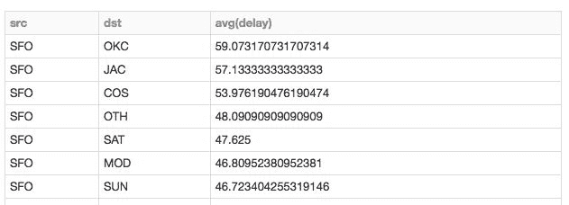
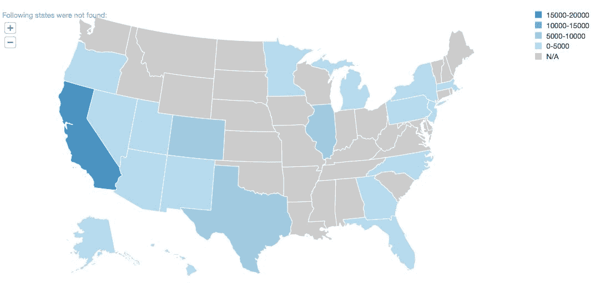
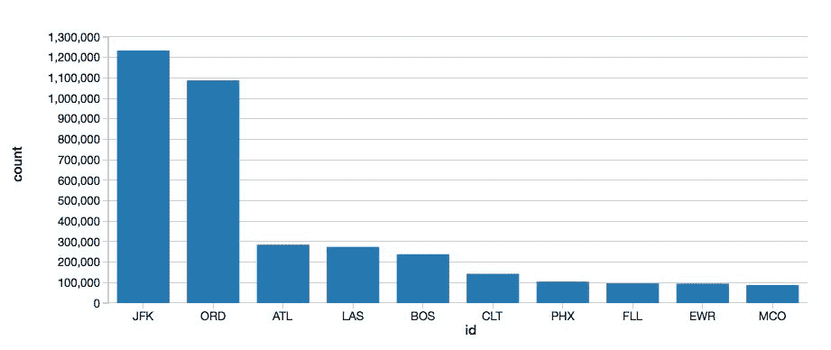
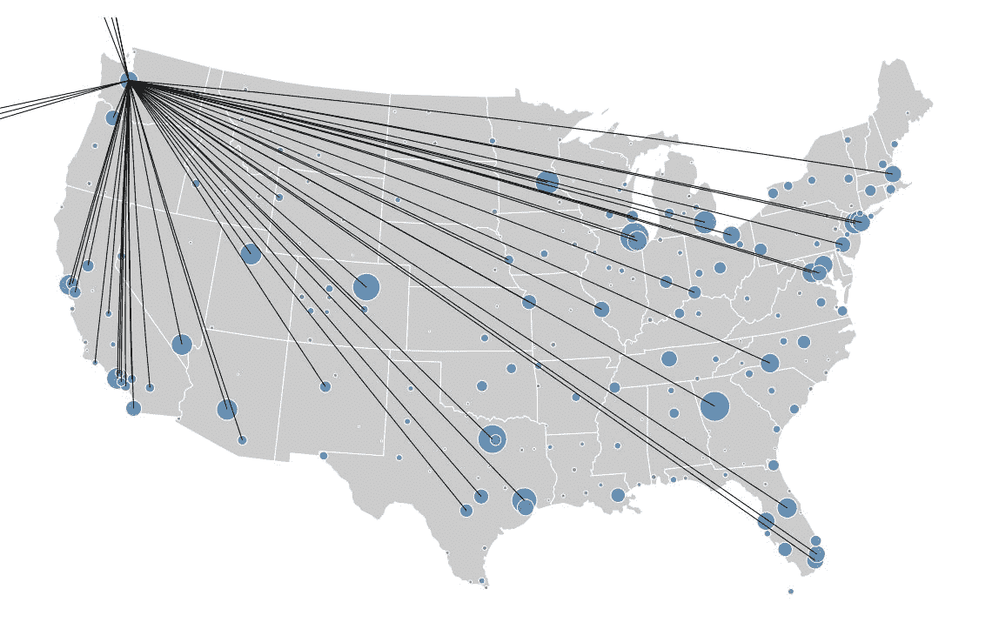

# 图形框架–带 PySpark 的图论

在本章中，我们将介绍如何为 Apache Spark 使用 GraphFrames。您将学习以下食谱:

*   阿帕奇火花的图论和图形框架快速入门
*   安装图形框架
*   准备数据
*   构建图表
*   对图表运行查询
*   理解图表
*   使用 PageRank 确定机场等级
*   寻找最少数量的连接
*   可视化您的图表

# 介绍

图形可以更容易、更直观地解决某些数据问题。图的核心是边、节点(或顶点)及其属性的概念。例如，下面是两个看似不相连的图。左边一个代表社交网络和朋友之间的关系(图中的*边*)(图中的*顶点*，而右边一个是代表餐厅推荐的图。请注意，我们餐厅推荐的顶点不仅是餐厅本身，还包括菜肴类型(例如拉面)和位置(例如加拿大不列颠哥伦比亚省温哥华市)；这些是顶点的属性。这种将节点分配给几乎任何东西并使用边来定义这些节点之间的关系的能力是图的最大优点，也就是它们的灵活性:


这种灵活性允许我们在概念上将这两个看似不同的图形连接成一个公共图形。在这种情况下，我们可以加入带有餐馆推荐的社交网络，其中朋友和餐馆之间的边缘(即联系)是通过他们的评级:


例如，如果伊莎贝拉想在温哥华(vertex: location)找到一家很棒的拉面餐厅(vertex:cuision type)，那么遍历她朋友的评论(edge: ratings)，她很可能会选择金子坚太郎拉面(vertex: restaurant)，因为 Samantha (vertex: friend)和 Juliette (vertex: friend)都对这家餐厅评价很高。

虽然图是直观和灵活的，但是图的一个关键问题是图的遍历和图算法的计算通常是资源密集型和缓慢的。借助 Apache Spark 的图形框架，您可以利用 Apache Spark 数据框架的速度和性能，以分布式和高性能的方式遍历和计算您的图形。

# 安装图形框架

在图形框架的下面是两个火花数据框架:一个用于顶点，另一个用于边缘。GraphFrames 可能被认为是 Spark 的 GraphX 库的下一代，对后者进行了一些重大改进:

*   GraphFrames 利用了 DataFrame API 的性能优化和简单性。
*   通过使用数据框架应用编程接口，图形框架可以通过 Python、Java 和 Scala 应用编程接口进行交互。相比之下，GraphX 只能通过 Scala 接口获得。

您可以在[https://graphframes.github.io/](https://graphframes.github.io/)的 GraphFrames 概览中找到 GraphFrames 的最新信息。

# 准备好

我们需要一个工作安装的火花。这意味着您将按照[第 1 章](1.html#OPEK0-dc04965c02e747b9b9a057725c821827)、*中概述的步骤安装和配置火花*。提醒一下，要为本地 Spark 集群启动 PySpark shell，您可以运行以下命令:

```py
./bin/pyspark --master local[n]
```

其中`n`为芯数。

# 怎么做...

如果您正在从 Spark CLI(例如，`spark-shell`、`pyspark`、`spark-sql`或`spark-submit`)运行您的作业，您可以使用`–-packages`命令，该命令将提取、编译和执行您使用 GraphFrames 包所需的代码。

例如，要使用带有 Spark 2.1 的最新 GraphFrames 包(在撰写本书时，该包是 0.5 版)和带有`spark-shell`的 Scala 2.11，命令是:

```py
$SPARK_HOME/bin/pyspark --packages graphframes:graphframes:0.5.0-spark2.3-s_2.11
```

然而，为了在 Spark 2.3 中使用 GraphFrames，您需要从源代码中构建包。

Check out the steps outlined here: [https://github.com/graphframes/graphframes/issues/267](https://github.com/graphframes/graphframes/issues/267).

如果您使用的是像 Databricks 这样的服务，您将需要用 GraphFrames 创建一个库。更多信息请参考如何在[https://docs.databricks.com/user-guide/libraries.html](https://docs.databricks.com/user-guide/libraries.html)的 Databricks 中创建库，以及如何在[https://CD N2 . hubspot . net/hubfs/438089/notebooks/help/Setup _ graph frames _ package . html](https://cdn2.hubspot.net/hubfs/438089/notebooks/help/Setup_graphframes_package.html)安装 GraphFrames Spark 包。

# 它是如何工作的...

您可以通过在位于[https://github.com/graphframes/graphframes](https://github.com/graphframes/graphframes)的 GraphFrames GitHub 存储库中构建 GraphFrames 之类的包来安装它，但是更简单的方法是使用位于[https://spark-packages.org/package/graphframes/graphframes](https://spark-packages.org/package/graphframes/graphframes)的 GraphFrames Spark 包。Spark Packages 是一个包含 Apache Spark 第三方包索引的存储库。通过使用 Spark 包，PySpark 将下载最新版本的 GraphFrames Spark 包，编译它，然后在您的 Spark 作业的上下文中执行它。

当您使用以下命令包含 GraphFrames 包时，请注意调用`graphframes`控制台输出，表示包正在从`spark-packages`存储库中被拉进来进行编译:

```py
$ ./bin/pyspark --master local --packages graphframes:graphframes:0.5.0-spark2.1-s_2.11...graphframes#graphframes added as a dependency:: resolving dependencies :: org.apache.spark#spark-submit-parent;1.0confs: [default]found graphframes#graphframes;0.5.0-spark2.1-s_2.11 in spark-packagesfound com.typesafe.scala-logging#scala-logging-api_2.11;2.1.2 in centralfound com.typesafe.scala-logging#scala-logging-slf4j_2.11;2.1.2 in centralfound org.scala-lang#scala-reflect;2.11.0 in centralfound org.slf4j#slf4j-api;1.7.7 in centraldownloading http://dl.bintray.com/spark-packages/maven/graphframes/graphframes/0.5.0-spark2.1-s_2.11/graphframes-0.5.0-spark2.1-s_2.11.jar ...[SUCCESSFUL ] graphframes#graphframes;0.5.0-spark2.1-s_2.11!graphframes.jar (600ms):: resolution report :: resolve 1503ms :: artifacts dl 608ms:: modules in use:com.typesafe.scala-logging#scala-logging-api_2.11;2.1.2 from central in [default]com.typesafe.scala-logging#scala-logging-slf4j_2.11;2.1.2 from central in [default]graphframes#graphframes;0.5.0-spark2.1-s_2.11 from spark-packages in [default]org.scala-lang#scala-reflect;2.11.0 from central in [default]org.slf4j#slf4j-api;1.7.7 from central in [default]---------------------------------------------------------------------| | modules || artifacts || conf | number| search|dwnlded|evicted|| number|dwnlded|
```

```py
---------------------------------------------------------------------| default | 5 | 1 | 1 | 0 || 5 | 1 |---------------------------------------------------------------------:: retrieving :: org.apache.spark#spark-submit-parentconfs: [default]1 artifacts copied, 4 already retrieved (323kB/9ms)
```

# 准备数据

我们将用于烹饪书的示例场景是准时飞行性能数据(即飞行场景)，它将使用两组数据:

*   航空公司准时表现和航班延误原因，可在[http://bit.ly/2ccJPPM](http://bit.ly/2ccJPPM)获得。这些数据集包含航班的计划和实际出发和到达时间以及延误原因的信息。数据由美国航空公司报告，由**运输统计局航空信息办公室** ( **BTS** )收集。
*   开放航班、机场和航空公司数据可在[http://openflights.org/data.html](http://openflights.org/data.html)获得。该数据集包含美国机场数据列表，包括国际航空运输协会代码、机场名称和机场位置。

我们将创建两个数据帧:一个用于机场，一个用于航班。`airports`数据框将构成我们的顶点，`flights`数据框将代表我们的图形框的所有边。

# 准备好

如果在本地运行，请将链接文件复制到本地文件夹；为了这个食谱的目的，我们将这个位置称为`/data`:

*   航空公司在[http://bit.ly/2xs0XLH](http://bit.ly/2xs0XLH)的准点表现及原因
*   开放航班-http://bit.ly/2J1CU7D 的机场和航空公司数据

如果使用的是 Databricks，数据已经加载到`/databricks-datasets`文件夹中；文件的位置可以分别在机场和航班数据的`/databricks-datasets/flights/airport-codes-na.txt`和`/databricks-datasets/flights/departuredelays.csv`找到。

# 怎么做...

为了给我们的图表准备数据，我们将首先清理数据，只包括可用航班数据中存在的机场代码。也就是说，我们排除了`DepartureDelays.csv`数据集中不存在的任何机场。即将到来的配方执行以下操作:

1.  设置下载文件的路径
2.  通过读取 CSV 文件并推断配置有标题的模式，创建`apts`和`deptDelays`数据帧
3.  `iata`仅包含存在于`deptDelays`数据框中的机场代码(T1)列
4.  加入`iata`和`apts`数据框，创建`apts_df`数据框

我们过滤数据以创建`airports`数据框的原因是，当我们在下面的方法中创建我们的图形框时，我们的图形只有带边的顶点:

```py
# Set File Pathsdelays_fp = "/data/departuredelays.csv"apts_fp = "/data/airport-codes-na.txt"# Obtain airports datasetapts = spark.read.csv(apts_fp, header='true', inferSchema='true', sep='\t')apts.createOrReplaceTempView("apts")# Obtain departure Delays datadeptsDelays = spark.read.csv(delays_fp, header='true', inferSchema='true')deptsDelays.createOrReplaceTempView("deptsDelays")deptsDelays.cache()# Available IATA codes from the departuredelays sample datasetiata = spark.sql("""select distinct iata from (select distinct origin as iata from deptsDelays union all select distinct destination as iata from deptsDelays) as a""")iata.createOrReplaceTempView("iata")
```

```py
# Only include airports with atleast one trip from the departureDelays datasetairports = sqlContext.sql("""select f.IATA, f.City, f.State, f.Country from apts as f join iata as t on t.IATA = f.IATA""")airports.registerTempTable("airports")airports.cache()
```

# 它是如何工作的...

该代码片段使用的两个关键概念是:

*   `spark.read.csv`:这个`SparkSession`方法返回一个`DataFrameReader`对象，它包含了允许我们从文件系统中读取 CSV 文件的类和函数
*   `spark.sql`:这允许我们执行 Spark SQL 语句

欲了解更多信息，请参考前面关于 Spark DataFrames 的章节，或参考[模块的 PySpark 主文档，网址为 http://Spark . Apache . org/doc/2 . 3 . 0/API/python/PySpark . SQL . html](http://spark.apache.org/docs/2.3.0/api/python/pyspark.sql.html)。

# 还有更多...

在我们将数据读入图形框架之前，让我们再创建一个数据框架:

```py
import pyspark.sql.functions as fimport pyspark.sql.types as t@f.udfdef toDate(weirdDate):year = '2014-'month = weirdDate[0:2] + '-'day = weirdDate[2:4] + ' 'hour = weirdDate[4:6] + ':'minute = weirdDate[6:8] + ':00'
```

```py
return year + month + day + hour + minute deptsDelays = deptsDelays.withColumn('normalDate', toDate(deptsDelays.date))deptsDelays.createOrReplaceTempView("deptsDelays")# Get key attributes of a flightdeptsDelays_GEO = spark.sql("""select cast(f.date as int) as tripid, cast(f.normalDate as timestamp) as `localdate`, cast(f.delay as int), cast(f.distance as int), f.origin as src, f.destination as dst, o.city as city_src, d.city as city_dst, o.state as state_src, d.state as state_dst from deptsDelays as f join airports as o on o.iata = f.origin join airports as d on d.iata = f.destination""") # Create Temp ViewdeptsDelays_GEO.createOrReplaceTempView("deptsDelays_GEO")# Cache and CountdeptsDelays_GEO.cache()deptsDelays_GEO.count()
```

前面的代码片段打包了一些额外的优化来创建`deptsDelays_GEO`数据帧:

*   它创建了一个`tripid`列，允许我们唯一地识别每个行程。请注意，这有点麻烦，因为我们已经将日期(在这个数据集中，每次旅行都有一个唯一的日期)转换为 int 列。
*   `date`栏本身并不是一个传统的日期，因为它的格式是`MMYYHHmm`。因此，我们首先应用`udf`将其转换为适当的格式(T3)方法。然后，我们将其转换为实际的时间戳格式。
*   将`delay`和`distance`列重新转换为整数值，而不是字符串。
*   在接下来的部分中，我们将使用机场代码(`iata`列)作为我们的顶点。为了创建图表的边，我们需要为来源(始发机场)和目的地(目的地机场)指定 IATA 代码。`join`声明和将`f.origin`重命名为`src`和`f.destination`重命名为`dst`是为创建指定边的图形框做准备(它们明确地寻找`src`和`dst`列)。

# 构建图表

在前面几节中，您安装了 GraphFrames 并构建了图表所需的数据框架；现在，您可以开始构建图表本身了。

# 怎么做...

该方法的第一个组成部分涉及导入必要的库，在本例中，是 PySpark SQL 函数(`pyspark.sql.functions`)和 GraphFrames ( `graphframes`)。在之前的配方中，我们创建了`src`和`dst`列，作为创建`deptsDelays_geo`数据框的一部分。当在图形框中创建边时，它专门寻找`src`和`dst`列来按照`edges`创建边。类似地，GraphFrames 正在寻找列`id`来表示图形顶点(以及连接到`src`和`dst`列)。因此，在创建顶点`vertices`时，我们将`IATA`列重命名为`id`:

```py
from pyspark.sql.functions import *from graphframes import *# Create Vertices (airports) and Edges (flights)vertices = airports.withColumnRenamed("IATA", "id").distinct()edges = deptsDelays_geo.select("tripid", "delay", "src", "dst", "city_dst", "state_dst")# Cache Vertices and Edgesedges.cache()vertices.cache()# This GraphFrame builds up on the vertices and edges based on our trips (flights)graph = GraphFrame(vertices, edges)
```

注意`edges`和`vertices`分别是包含图的边和顶点的数据帧。您可以通过查看下面截图中记录的数据来检查这一点(在本例中，我们使用了 Databricks 中的`display`命令)。

例如，命令`display(vertices)`显示`vertices`数据框的`id`(国际航空运输协会代码)`City``State`和`Country`列:


同时，命令`display(edges)`显示`edges`数据框的`tripid`、`delay`、`src`、`dst`、`city_dst`和`state_dst`:


最后的语句`GraphFrame(vertices, edges)`执行将两个数据帧合并到我们的 graph frame`graph`中的任务。

# 它是如何工作的...

如前一节所述，在创建 GraphFrame 时，它会专门查找以下列:

*   `id`:这标识了顶点并将连接到`src`和`dst`列。在我们的例子中，国际航空运输协会代码`LAX`(代表**洛杉矶机场**)是构成我们图表中顶点的许多机场之一(`graph`)。
*   `src`:我们的图的边的源顶点；例如，从洛杉矶飞往纽约的航班有`src = LAX`。
*   `dst`:我们的图的边的目的顶点；例如，从洛杉矶飞往纽约的航班有`dst = JFK`。

通过创建两个数据帧(`vertices`和`edges`)，其中属性遵循前面提到的命名约定，我们可以调用 GraphFrame 来创建我们的图形，利用下面两个数据帧的性能优化。

# 对图表运行查询

现在您已经创建了您的图形，开始创建并运行一些简单的查询。

# 准备好

确保您已经从上一节创建了`graph`图形框架(从`vertices`和`edges`数据框架派生而来)。

# 怎么做...

让我们从一些简单的计数查询开始，以确定机场的数量(节点或顶点；还记得吗？)和条数(边缘)，这可以通过应用`count()`来确定。对`count()`的调用类似于数据帧，除了您还需要包括您是在计数`vertices`还是`edges`:

```py
print "Airport count: %d" % graph.vertices.count()print "Trips count: %d" % graph.edges.count()
```

这些查询的输出应该类似于下面的输出，表示 279 个顶点(即机场)和 130 多万条边(即航班):

```py
Output:Airports count: 279 Trips count: 1361141
```

与数据框类似，您也可以执行`filter`和`groupBy`子句，以更好地了解延误航班的数量。为了了解准时或早班航班的数量，我们在`delay <= 0`处使用过滤器；另一方面，延误的航班显示`delay > 0`:

```py
print "Early or on-time: %d" % graph.edges.filter("delay <= 0").count()print "Delayed: %d" % graph.edges.filter("delay > 0").count()# OutputEarly or on-time: 780469Delayed: 580672
```

进一步潜水，可以过滤从旧金山出发的延迟航班(`delay > 0`)(`src = 'SFO'`)按目的地机场分组，按平均延迟递减排序(`desc("avg(delay)")`):

```py
display(graph.edges.filter("src = 'SFO' and delay > 0").groupBy("src", "dst").avg("delay").sort(desc("avg(delay)")))
```



如果您正在使用 Databricks 笔记本，您可以可视化 GraphFrame 查询。例如，我们可以使用以下查询确定从西雅图出发的`delay > 100`分钟的目的地州:

```py
# States with the longest cumulative delays (with individual delays > 100 minutes) # origin: Seattledisplay(graph.edges.filter("src = 'SEA' and delay > 100"))
```

前面的代码生成了下面的映射。蓝色调越暗，航班经历的延误就越多。从下图中，您可以看到大多数从西雅图出发的延迟航班的目的地都在加利福尼亚州:



# 它是如何工作的...

如前所述，图形框架建立在两个数据框架之上:一个用于顶点，一个用于边。这仅仅意味着 GraphFrames 利用了与 DataFrames 相同的性能优化(不像旧的 GraphX)。同样重要的是，它们还采用了 Spark SQL 语法的许多组件。

# 理解图表

为了容易理解城市机场和每个机场之间航班的复杂关系，我们可以使用**图案**的概念来寻找航班连接的机场的模式。结果是一个数据框，其中列名由基元键给出。

# 准备好了

为了更容易在 Motifs 的上下文中查看我们的数据，让我们首先创建一个名为`graphSmall`的较小版本的`graph` GraphFrame:

```py
edgesSubset = deptsDelays_GEO.select("tripid", "delay", "src", "dst")graphSmall = GraphFrame(vertices, edgesSubset)
```

# 怎么做...

要执行模体，请执行以下命令:

```py
motifs = (graphSmall.find("(a)-[ab]->(b); (b)-[bc]->(c)").filter("""(b.id = 'SFO') and (ab.delay > 500 or bc.delay > 500) and bc.tripid > ab.tripid and bc.tripid < ab.tripid + 10000"""))display(motifs)
```

该查询的结果如下所示:


Output of the motif query

# 它是如何工作的...

这个示例 motif 查询有很多需要解包的地方，所以让我们从查询本身开始。查询的第一部分是确定我们的 Motif 是什么，即确定我们正在寻找顶点`(a)`、`(b)`和`(c)`之间的关系。具体来说，我们关注的是两组顶点之间的边，`(a)`和`(b)`之间，如`[ab]`所示，以及顶点`(b)`和`(c)`之间，如`[bc]`所示:

```py
graphSmall.find("(a)-[ab]->(b); (b)-[bc]->(c)")
```

例如，我们试图确定洛杉矶是中途停留城市的两个不同城市之间的所有航班(例如，西雅图-洛杉矶->纽约，波特兰-洛杉矶->亚特兰大，等等):

*   `(b)`:这代表了洛杉矶这座城市
*   `(a)`:代表始发城市，如本例中的西雅图和波特兰
*   `[ab]`:这代表航班，比如这个例子中的西雅图-洛杉矶和波特兰-洛杉矶
*   `(c)`:代表目的地城市，如本例中的纽约、亚特兰大
*   `[bc]`:这代表航班，比如这个例子中的洛杉矶- >纽约州和洛杉矶- >亚特兰大

与前面的例子不同，在我们的代码片段中，我们指定旧金山作为我们的中途停留点(`b.id = 'SFO'`)。我们还指定了延迟大于 500 分钟(`ab.delay > 500 or bc.delay > 500`)的任何行程(即图边)。我们还规定行程的第二段必须在行程的第一段之后(`bc.tripid > ab.tripid and bc.tripid < ab.tripid + 10000"`)。

请注意，最后一条语句是对航班的过度简化，因为它没有考虑哪些航班是有效的连接器航班。另外，回想一下`tripid`是基于时间生成的，格式为`MMDDHHMM`转换为整数:

```py
filter("(b.id = 'SFO') and (ab.delay > 500 or bc.delay > 500) and bc.tripid > ab.tripid and bc.tripid < ab.tripid + 10000")
```

上一小节中显示的输出表示中途停留在旧金山的所有航班，并且到达或离开`SFO`的航班延迟超过 500 分钟。进一步深入到单个航班，让我们回顾第一行的输出，尽管我们已经对其进行了旋转，以便于回顾:

| **顶点** | **值** |
| `[ab]` | 

*   `tripid: 2021900`
*   `delay: 39`
*   `src: STL`
*   `dst: SFO`

 |
| `(a)` | 

*   `id: STL`
*   `City: St. Louis`
*   `State: MO`
*   `Country: USA`

 |
| `(b)` | 

*   `id: SFO`
*   `City: San Francisco`
*   `State: CA`
*   `Country: USA`

 |
| `[bc]` | 

*   `tripid: 2030906`
*   `delay: 516`
*   `src: SFO`
*   `dst: PHL`

 |
| `(c)` | 

*   `id: PHL`
*   `City: Philadelphia`
*   `State: PA`
*   `Country: USA`

 |

如前所述，`[ab]`和`[bc]`是航班，而`[a]`、`[b]`和`[c]`是机场。在本例中，从圣路易斯(`STL`)出发飞往旧金山的航班延迟了 39 分钟，但其飞往费城(`PHL`)的潜在转接航班延迟了 516 分钟。当你挖掘结果时，你可以看到以旧金山为中心的始发和最终目的地城市之间有许多不同的潜在飞行模式，作为主要的中途停留。当您在更大的中心城市(如亚特兰大、达拉斯和芝加哥)工作时，这个查询会变得更加复杂。

# 使用 PageRank 确定机场排名

PageRank 是谷歌搜索引擎推广的算法，由拉里·佩奇创建。伊恩·罗杰斯说(见[http://www . cs . Princeton . edu/~ chazelle/courses/BIB/page rank . htm](http://www.cs.princeton.edu/~chazelle/courses/BIB/pagerank.htm)):

"(...)PageRank is a “vote”, by all the other pages on the Web, about how important a page is. A link to a page counts as a vote of support. If there’s no link there’s no support (but it’s an abstention from voting rather than a vote against the page)."

正如你可能想象的那样，这种方法可以应用于其他问题，而不仅仅是网页排名。在我们的上下文中，我们可以使用它来确定机场排名。为了实现这一点，我们可以使用该出发延迟数据集中包含的往返于各个机场的航班和连接的数量。

# 准备好

确保您已经根据前面的小节创建了`graph`图形框架。

# 怎么做...

执行以下代码片段，通过 PageRank 算法确定我们数据集中最重要的机场:

```py
# Determining Airport ranking of importance using `pageRank`ranks = graph.pageRank(resetProbability=0.15, maxIter=5)display(ranks.vertices.orderBy(ranks.vertices.pagerank.desc()).limit(20))
```

从下图的输出可以看出，亚特兰大、达拉斯和芝加哥是最重要的三个城市(请注意，此数据集仅包含美国数据):


# 它是如何工作的...

在撰写本书时，GraphFrames 的当前版本是 v0.5，其中包含 PageRank 的两个实现:

*   我们使用的是 GraphFrame 接口，通过设置`maxIter`运行 PageRank 固定迭代次数
*   另一个版本使用`org.apache.spark.graphx.Pregel`界面，通过设置`tol`运行 PageRank 直到收敛

更多信息请参考 PageRank 上的 GraphFrames Scala 文档，网址为[https://graph frames . github . io/API/Scala/index . html # org . graph frames . lib . page rank](https://graphframes.github.io/api/scala/index.html#org.graphframes.lib.PageRank)。

如前所述，我们使用 PageRank 的独立 GraphFrame 版本，方法是设置:

*   `resetProbability`:当前设置为`0.15`的默认值，代表重置为随机顶点的概率。如果数值太高，意味着完成计算需要更长的时间，但如果数值太低，计算可能会超调而不收敛。

*   `maxIter`:本次演示，我们已经将数值设置为`5`；数字越高，进行更精确计算的概率就越高。

# 寻找最少数量的连接

当你飞往许多城市时，一个经常出现的问题是确定两个城市之间的最短路径或最短旅行时间。从航空旅行者的角度来看，目标是找到两个城市之间最短的航班集。从航空公司的角度来看，确定如何尽可能高效地在城市之间运送乘客可以提高客户满意度并降低价格(减少燃油、设备磨损、机组人员的便利性等)。在 GraphFrames 和 graph 算法中，一种方法是使用**广度优先搜索** ( **BFS** )算法来帮助我们找到这些机场之间的最短路径。

# 准备好了

确保您已经根据前面的小节创建了`graph`图形框架。

# 怎么做...

让我们开始使用我们的 BFS 算法来确定`SFO`和`SEA`之间是否有直飞航班:

```py
subsetOfPaths = graph.bfs(fromExpr = "id = 'SEA'",toExpr = "id = 'SFO'",maxPathLength = 1)display(subsetOfPaths)
```

从输出中可以看出，西雅图(`SEA`)和旧金山(`SFO`)之间有很多直飞航班:


# 它是如何工作的...

调用 BFS 算法时，关键参数为`fromExpr`、`toExpr`、`maxPathLength`。由于我们的顶点包含机场，为了了解从西雅图到旧金山的直飞航班数量，我们将指定:

```py
fromExpr = "id = 'SEA'",toExpr = "id = 'SFO'
```

`maxPathLength`是用于指定两个顶点之间最大边数的参数。如果`maxPathLength = 1`，则意味着我们在两个顶点之间只有一条边。也就是说，这两个机场之间只有一个航班，或者这两个城市之间有一个直飞航班。增加这个值意味着 BFS 将试图在你的两个城市之间找到多重联系。例如，如果我们指定`maxPathLength = 2`，这将意味着西雅图和三藩市之间的两条边或两个航班。表示中途停留的城市，例如，SEA - POR - > SFO、SEA - LAS - > SFO、SEA - DEN - > SFO 等等。

# 还有更多...

如果你想在两个通常没有直飞航班的城市之间找到转机怎么办？例如，让我们找出旧金山和布法罗之间可能的路线:

```py
subsetOfPaths = graph.bfs(fromExpr = "id = 'SFO'",toExpr = "id = 'BUF'",maxPathLength = 1)display(subsetOfPaths)Output:OK
```

这种情况下的`OK`表示旧金山和布法罗之间没有直飞航班，因为我们无法检索到一条边(至少从这个数据集)。但要想知道是否有中途停留的航班，只需更改`maxPathLength = 2`(注明单个中途停留城市):

```py
subsetOfPaths = graph.bfs(fromExpr = "id = 'SFO'",toExpr = "id = 'BUF'",maxPathLength = 2)display(subsetOfPaths)
```

正如你在这里看到的，有很多航班在旧金山和布法罗之间中途停留:


# 请参见

但是旧金山和布法罗之间最常见的中途停留是什么？看前面的结果，好像是明尼阿波利斯，但是长相是会骗人的。相反，运行以下查询:

```py
display(subsetOfPaths.groupBy("v1.id", "v1.City").count().orderBy(desc("count")).limit(10))
```

从下图可以看出，JFK 是这两个城市之间最常见的换乘点:



# 可视化图表

在前面的食谱中，我们一直在使用 Databrick 笔记本的原生可视化(例如，条形图、折线图、地图等)来可视化我们的航班。但是我们还没有把我们的图形想象成一个图形。在这一部分中，我们将在我们的 Databricks 笔记本中利用 Mike Bostock 的 Airports D3.js 可视化工具([https://mbostock.github.io/d3/talk/20111116/airports.html](https://mbostock.github.io/d3/talk/20111116/airports.html))。

# 准备好

确保您已经从前面的小节创建了`graph`图形框架和源`deptsDelays_GEO`数据框架。

# 怎么做...

我们将利用我们的 Python 数据库笔记本，但是我们将包括以下 Scala 单元。在顶层，下面是代码的流程:

```py
%scalapackage d3aimport org.apache.spark.sql._import com.databricks.backend.daemon.driver.EnhancedRDDFunctions.displayHTMLcase class Edge(src: String, dest: String, count: Long)case class Node(name: String)case class Link(source: Int, target: Int, value: Long)case class Graph(nodes: Seq[Node], links: Seq[Link])object graphs {val sqlContext = SQLContext.getOrCreate(org.apache.spark.SparkContext.getOrCreate())import sqlContext.implicits._def force(clicks: Dataset[Edge], height: Int = 100, width: Int = 960): Unit = {val data = clicks.collect()val nodes = (data.map(_.src) ++ data.map(_.dest)).map(_.replaceAll("_", " ")).toSet.toSeq.map(Node)val links = data.map { t =>Link(nodes.indexWhere(_.name == t.src.replaceAll("_", " ")), nodes.indexWhere(_.name == t.dest.replaceAll("_", " ")), t.count / 20 + 1)}showGraph(height, width, Seq(Graph(nodes, links)).toDF().toJSON.first())}/*** Displays a force directed graph using d3* input: {"nodes": [{"name": "..."}], "links": [{"source": 1, "target": 2, "value": 0}]}*/def showGraph(height: Int, width: Int, graph: String): Unit = {displayHTML(s"""<!DOCTYPE html><html><head><link type="text/css" rel="stylesheet" href="https://mbostock.github.io/d3/talk/20111116/style.css"/><style type="text/css">#states path {fill: #ccc;stroke: #fff;}path.arc {pointer-events: none;fill: none;stroke: #000;display: none;}path.cell {fill: none;pointer-events: all;}circle {fill: steelblue;fill-opacity: .8;stroke: #fff;}#cells.voronoi path.cell {stroke: brown;}#cells g:hover path.arc {display: inherit;}</style></head><body><script src="https://mbostock.github.io/d3/talk/20111116/d3/d3.js"></script><script src="https://mbostock.github.io/d3/talk/20111116/d3/d3.csv.js"></script><script src="https://mbostock.github.io/d3/talk/20111116/d3/d3.geo.js"></script><script src="https://mbostock.github.io/d3/talk/20111116/d3/d3.geom.js"></script><script>var graph = $graph;var w = $width;var h = $height;var linksByOrigin = {};var countByAirport = {};var locationByAirport = {};var positions = [];var projection = d3.geo.azimuthal().mode("equidistant").origin([-98, 38]).scale(1400).translate([640, 360]);var path = d3.geo.path().projection(projection);var svg = d3.select("body").insert("svg:svg", "h2").attr("width", w).attr("height", h);var states = svg.append("svg:g").attr("id", "states");var circles = svg.append("svg:g").attr("id", "circles");var cells = svg.append("svg:g").attr("id", "cells");var arc = d3.geo.greatArc().source(function(d) { return locationByAirport[d.source]; }).target(function(d) { return locationByAirport[d.target]; });d3.select("input[type=checkbox]").on("change", function() {cells.classed("voronoi", this.checked);});// Draw US map.d3.json("https://mbostock.github.io/d3/talk/20111116/us-states.json", function(collection) {states.selectAll("path").data(collection.features).enter().append("svg:path").attr("d", path);});// Parse linksgraph.links.forEach(function(link) {var origin = graph.nodes[link.source].name;var destination = graph.nodes[link.target].name;var links = linksByOrigin[origin] || (linksByOrigin[origin] = []);links.push({ source: origin, target: destination });countByAirport[origin] = (countByAirport[origin] || 0) + 1;countByAirport[destination] = (countByAirport[destination] || 0) + 1;});d3.csv("https://mbostock.github.io/d3/talk/20111116/airports.csv", function(data) {// Build list of airports.var airports = graph.nodes.map(function(node) {return data.find(function(airport) {if (airport.iata === node.name) {var location = [+airport.longitude, +airport.latitude];locationByAirport[airport.iata] = location;positions.push(projection(location));return true;} else {return false;}});});// Compute the Voronoi diagram of airports' projected positions.var polygons = d3.geom.voronoi(positions);var g = cells.selectAll("g").data(airports).enter().append("svg:g");g.append("svg:path").attr("class", "cell").attr("d", function(d, i) { return "M" + polygons[i].join("L") + "Z"; }).on("mouseover", function(d, i) { d3.select("h2 span").text(d.name); });g.selectAll("path.arc").data(function(d) { return linksByOrigin[d.iata] || []; }).enter().append("svg:path").attr("class", "arc").attr("d", function(d) { return path(arc(d)); });circles.selectAll("circle").data(airports).enter().append("svg:circle").attr("cx", function(d, i) { return positions[i][0]; }).attr("cy", function(d, i) { return positions[i][1]; }).attr("r", function(d, i) { return Math.sqrt(countByAirport[d.iata]); }).sort(function(a, b) { return countByAirport[b.iata] - countByAirport[a.iata]; });});</script></body></html>""")}def help() = {displayHTML("""<p>Produces a force-directed graph given a collection of edges of the following form:</br><tt><font color="#a71d5d">case class</font> <font color="#795da3">Edge</font>(<font color="#ed6a43">src</font>: <font color="#a71d5d">String</font>, <font color="#ed6a43">dest</font>: <font color="#a71d5d">String</font>, <font color="#ed6a43">count</font>: <font color="#a71d5d">Long</font>)</tt></p><p>Usage:<br/><tt>%scala</tt></br><tt><font color="#a71d5d">import</font> <font color="#ed6a43">d3._</font></tt><br/><tt><font color="#795da3">graphs.force</font>(</br><font color="#ed6a43">height</font> = <font color="#795da3">500</font>,<br/><font color="#ed6a43">width</font> = <font color="#795da3">500</font>,<br/><font color="#ed6a43">clicks</font>: <font color="#795da3">Dataset</font>[<font color="#795da3">Edge</font>])</tt></p>""")}}
```

在下一个单元格中，您将调用以下 Scala 单元格:

```py
%scala// On-time and Early Arrivalsimport d3a._graphs.force(height = 800,width = 1200,clicks = sql("""select src, dst as dest, count(1) as count from deptsDelays_GEO where delay <= 0 group by src, dst""").as[Edge])
```

这会产生以下可视化效果:



# 它是如何工作的...

当我们使用 Databricks 笔记本时，即使它的默认语言是 Python，我们也可以通过使用`%scala`作为单元格内的第一行来指定 Scala。第一个代码片段引用了`package d3a`，它指定了定义我们的机场可视化的 JavaScript 调用。当你深入代码时，你会注意到这是一个力导向的图形(`def force`)可视化，它显示了一个图形(`show graph`)，构建了美国地图和机场位置(蓝色气泡)。

`force`功能有以下定义:

```py
def force(clicks: Dataset[Edge], height: Int = 100, width: Int = 960): Unit = {...showGraph(height, width, Seq(Graph(nodes, links)).toDF().toJSON.first())}
```

回想一下，我们在下一个单元格中使用下面的代码片段调用了这个函数:

```py
%scala// On-time and Early Arrivalsimport d3a._graphs.force(height = 800,width = 1200,clicks = sql("""select src, dst as dest, count(1) as count from deptsDelays_GEO where delay <= 0 group by src, dst""").as[Edge])
```

高度和宽度是显而易见的，但关键的一点是，我们对`deptsDelays_GEO`数据框使用了一个 Spark SQL 查询来定义边(即来源和目的地 IATA 代码)。由于国际航空运输协会代码已经在`showGraph`内的调用中定义，我们已经有了可视化的顶点。请注意，因为我们已经创建了数据框`deptsDelays_GEO`，即使它是使用 PySpark 创建的，它也可以由 Scala 在同一个数据框笔记本中访问。