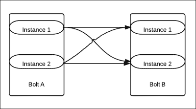

# 第三章。通过示例了解风暴内部

这本书的这一章致力于让你理解风暴的内部，以及它是如何使用实际例子工作的。这样做的目的是让你习惯于写自己的观点，浏览可靠和不可靠的拓扑，并让你熟悉风暴提供的各种分组。

本章将涉及以下主题:

*   风暴喷口和定制喷口
*   锚定和包装
*   不同的流分组

在这一章结束时，你应该能够理解各种分组和使用锚定的可靠性概念，你将能够创造你自己的喷。

# 定制风暴喷口

在前几章中，您已经探索并理解了由 Storm-starter 项目提供的拓扑。现在是我们继续下一步的时候了，与风暴一起做自己的旅程；因此，让我们进行下一次飞跃，用我们自己从各种来源读到的滔滔不绝来做一些令人兴奋的事情。

## 创建文件程序

这里我们将创建我们自己的喷口，从一个文件源读取事件或元组，并将它们发送到拓扑中；我们将替换上一章中在`WordCount`拓扑中使用的`RandomSentenceSpout`。

首先，将我们在[第 2 章](02.html#page "Chapter 2. Getting Started with Your First Topology")、*中创建的项目【第一拓扑结构入门】*复制到一个新项目中，并在`RandomSentenceSpout`中进行以下更改，以在 Storm-starter 项目中创建一个名为`FileSpout`的新类。

现在我们将在`FileSpout`中进行更改，使其从文件中读取句子，如以下代码所示:

```scala
public class FileSpout extends BaseRichSpout {
  //declaration section
  SpoutOutputCollector _collector;
  DataInputStream in ;
  BufferedReader br;
  Queue qe;

  //constructor
    public FileSpout() {
        qe = new LinkedList();
    }

  // the messageId builder method
  private String getMsgId(int i) {
    return (new StringBuilder("#@#MsgId")).append(i).toString();
    }

  //The function that is called at every line being read by  readFile
  //method and adds messageId at the end of each line and then add
  // the line to the linked list
    private void queueIt() {
      int msgId = 0;
      String strLine;
      try {
          while ((strLine = br.readLine()) != null) {
              qe.add((new  StringBuilder(String.valueOf(strLine))).append("#@#"  + getMsgId(msgId)).toString());
              msgId++;
          }
      } catch (IOException e) {
          e.printStackTrace();
      } catch (Exception e) {
          e.printStackTrace();
      }
    }

  //function to read line from file at specified location 
  private void readFile() {
        try {
          FileInputStream fstream = new  FileInputStream("/home/mylog"); in =  new DataInputStream(fstream);
          br = new BufferedReader(new InputStreamReader( in ));
          queueIt();
          System.out.println("FileSpout file reading done");
        } catch (FileNotFoundException e) {
            e.printStackTrace();
        }
    }

  //open function that is called at the time of spout  initialization
  // it calls the readFile method that reads the file , adds  events 
  // to the linked list to be fed to the spout as tuples
  @
    Override
    public void open(Map conf, TopologyContext context,  SpoutOutputCollector  collector) {
      _collector = collector;
      readFile();
    }

  //this method is called every 100 ms and it polls the list
  //for message which is read off as next tuple and emit the spout  to
  //the topology. When queue doesn't have any events, it reads the
  //file again calling the readFile method
    @
    Override
    public void nextTuple() {
      Utils.sleep(100);
      String fullMsg = (String) qe.poll();
      String msg[] = (String[]) null;
      if (fullMsg != null) {
          msg = (new String(fullMsg)).split("#@#");
          _collector.emit(new Values(msg[0]));
          System.out.println((new StringBuilder("nextTuple done  ")).append(msg[1]).toString());
      } else {
          readFile();
      }
    }

  @
  Override
  public void ack(Object id) {}

  @
  Override
  public void fail(Object id) {}

  @
  Override
  public void declareOutputFields(OutputFieldsDeclarer declarer) {
      declarer.declare(new Fields("word"));
  }
}
```

### 类型

**下载示例代码**

您可以下载您在[http://www.packtpub.com](http://www.packtpub.com)账户购买的所有 Packt 书籍的示例代码文件。如果您在其他地方购买了这本书，您可以访问[http://www.packtpub.com/support](http://www.packtpub.com/support)并注册，以便将文件直接通过电子邮件发送给您。

### 调整字数拓扑以使用文件 pout

现在我们需要将`FileSpout`装配到我们的`WordCount`拓扑中并执行它。为此，您需要更改`WordCount`拓扑中的一行代码，并实例化`FileSpout`而不是`TopologyBuilder`中的`RandomSentenceSpout`，如下所示:

```scala
public static void main(String[] args) throws Exception {
  TopologyBuilder builder = new TopologyBuilder();
//builder.setSpout("spout", new RandomSentenceSpout(), 5);
  builder.setSpout("spout", new FileSpout(), 1);
```

这一行更改将处理从指定文件`/home/mylog`读取的新喷口的实例化(请在执行程序之前创建该文件)。以下是输出截图，供您参考:


### socket pout 类

作为的下一步，为了更好地理解喷动，让我们创建一个`SocketSpout`类。假设您精通编写 Socket Server 或 Producer，我将引导您完成创建自定义`SocketSpout`类的过程，以使用 Storm 拓扑中的 Socket 输出:

```scala
public class SocketSpout extends BaseRichSpout{
  static SpoutOutputCollector collector;
  //The socket
    static Socket myclientSocket;
    static ServerSocket myserverSocket;
    static int myport;

  public SocketSpout(int port){
    myport=port;
  }

  public void open(Map conf,TopologyContext context,  SpoutOutputCollector collector){
    _collector=collector;
    myserverSocket=new ServerSocket(myport);
  }

  public void nextTuple(){
    myclientSocket=myserverSocket.accept();
    InputStream incomingIS=myclientSocket.getInputStream();
    byte[] b=new byte[8196];
    int len=b.incomingIS.read(b);
    _collector.emit(new Values(b));
  }
}
```

# 锚定和包装

我们已经讨论了为执行 Storm 拓扑而创建的 DAG。现在，当您设计拓扑以满足可靠性时，有两个项目需要添加到 Storm 中:

*   每当一个新的链接，也就是一个新的流被添加到 DAG 中时，它就被称为锚定
*   当元组被完整处理时，它被称为打包

当 Storm 知道这些前面的事实时，那么在元组的处理过程中，它可以测量它们，并根据它们是否被完全处理而相应地失败或确认元组。

让我们看看下面的`WordCount`拓扑螺栓，以更好地理解风暴应用编程接口锚定和打包:

*   `SplitSentenceBolt`:这个弩箭的目的是把句子拆分成不同的词，发出来。现在让我们详细检查这个螺栓的输出声明器和执行方法(特别是突出显示的部分)，如下面的代码所示:

    ```scala
      public void execute(Tuple tuple) {
          String sentence = tuple.getString(0);
          for(String word: sentence.split(" ")) {
              _collector.emit(tuple, new Values(word)); //1
          }
          _collector.ack(tuple); //2
      }
      public void declareOutputFields(OutputFieldsDeclarer  declarer) {
          declarer.declare(new Fields("word")); //3
      }
    }
    ```

前面代码的输出声明器功能详述如下:

*   `_collector.emit`:这里由名为`word`(第二个参数)的流上的螺栓发出的每个元组都是使用方法的第一个参数(元组)锚定的。在这种布置中，如果发生故障，锚定在树根处的元组将由喷口重放。
*   `collector.ack`:这里我们通知风暴，元组已经被这个螺栓成功处理了。在失败的情况下，程序员可以显式地调用`fail`方法，或者 Storm 在内部调用它，就像超时事件的情况一样，以便它可以被重放。
*   `declarer.declare`:这是调用的方法，用于指定将在其上发出成功处理的元组的流。请注意，我们在`_collector.emit`方法中使用了相同的`word`流。同样，如果你研究`WordCount`拓扑的`Builder`方法，你会发现`word`流的整体集成中的另一部分，如下所示:

    ```scala
      builder.setBolt("count", new WordCount(), 12).fieldsGrouping("split", new Fields("word"));
    ```

## 不可靠的拓扑

现在我们来看看相同拓扑的不可靠版本。这里，如果 tuple 没有被 Storm 完整地处理，它就不会被框架重放。我们之前在此拓扑中使用的代码如下所示:

```scala
java _collector.emit(new Values(word));
```

因此，螺栓发出一个未锚定的元组。有时，由于编程需要处理各种问题，开发人员故意创建不可靠的拓扑。

# 溪流分组

接下来，我们需要熟悉 Storm 提供的各种流分组(流分组基本上是机制，它定义了 Storm 如何在螺栓任务之间划分和分配元组流)。流是 Storm 拓扑的基本布线组件，理解它们为开发人员有效处理程序中的各种问题提供了很大的灵活性。

## 本地或洗牌分组

局部或混洗分组是最常见的分组，它随机地分配由源发出的元组，确保相等的分布，也就是说，bolt 的每个实例处理相同数量的事件。负载平衡由该分组自动处理。

由于这种分组分布的随机性，它只对原子操作有用，只需指定一个参数——流的来源。以下片段来自`WordCount`拓扑(我们之前创建过)，它演示了无序分组的用法:

```scala
TopologyBuilder myBuilder = new TopologyBuilder();
builder.setSpout("spout", new RandomSentenceSpout(), 5);
builder.setBolt("split", new SplitSentence(),  8).shuffleGrouping("spout");
builder.setBolt("count", new WordCount(),  12).fieldsGrouping("split", new Fields("word"));
```

在下图中，描绘了混洗分组:



这里**螺栓 A** 和**螺栓 B** 平行度均为 2；因此，每个螺栓的两个实例都是由 Storm 框架产生的。这些螺栓通过*洗牌组合*连接在一起。我们现在将讨论事件的分布。

从**螺栓 A** 的**实例 1** 开始的 50%事件将转到**螺栓 B** 的**实例 1** ，剩下的 50%将转到**螺栓 B** 的**实例 2** 。同样的，**螺栓 B** 的**实例 2** 发出的事件有 50%会去**螺栓 B** 的**实例 1** ，剩下的 50%会去**螺栓 B** 的**实例 2** 。

## 字段分组

在这个分组中，我们指定了两个参数——流的来源和字段。字段的值实际上用于控制元组到各种螺栓的路由。这种分组保证了对于相同的字段值，元组将总是被路由到相同的 bolt 实例。

在下图中， **螺栓 A** 和**螺栓 B** 之间描绘了字段分组，这些螺栓中的每一个都有两个实例。请注意基于字段分组参数值的事件流。


从**螺栓 A** 的**实例 1** 和**实例 2** 开始的所有事件，其中**字段**的值为 **P** 被发送到**螺栓 B** 的**实例 1** 。

从**螺栓 A** 的**实例 1** 和**实例 2** 开始的所有事件，其中**字段**的值为 **Q** 被发送到**螺栓 B** 的**实例 2** 。

## 全部分组

所有分组是一种广播分组，可用于相同消息需要发送到目的地螺栓的所有实例的情况。这里，每个元组被发送到 bolt 的所有实例。

这种分组应该在非常特定的情况下使用，对于特定的流，我们希望将相同的信息复制到下游的所有 bolt 实例。让我们来看一个用例，它有一些关于一个国家及其货币价值的信息，以及螺栓后面的螺栓，它确实需要这些信息来进行一些货币转换。现在每当*货币*螺栓有任何变化时，它使用 *all* 分组将其发布到以下螺栓的所有实例:


这里我们有一个*所有*分组的图解表示，其中来自**螺栓 A** 的所有元组被发送到**螺栓 B** 的所有实例。

## 全局分组

全局分组确保来自源组件(喷口或螺栓)的整个流到达目标螺栓的单个实例，更准确地说，特定于具有最低标识的目标螺栓的实例。让我们用一个例子来理解这个概念，假设我的拓扑如下:


我将为组件分配以下并行度:


此外，我将使用以下流分组:


然后，该框架将把来自 *myboltA* 流实例的所有数据发送到 *myboltB* 流的一个实例上，该实例将是 Storm 在实例化时分配了较低 ID 的一个:


如上图所示，在全局分组的情况下，来自**螺栓 A** 的两个实例的所有元组将转到**螺栓 B** 的**实例 1** ，假设其具有比**螺栓 B** 的**实例 2** 更低的 ID。

### 注

Storm 基本上为它在拓扑中创建的螺栓或喷口的每个实例分配标识。在全局分组中，分配被定向到在从 Storm 分配的 ID 上具有较低值的实例。

## 自定义分组

Storm 是一个可扩展的框架，它为开发人员创建自己的流分组提供了“T2”工具。这可以通过向`backtype.storm.grouping.CustomStreamGroupinginterface`类提供一个实现来实现。

## 直接分组

在这种分组中，Storm 框架为发送者提供了能力

组件(spout 或 bolt)来决定当发送方组件向流发送元组时，消费者 bolt 的哪个任务将接收元组。

必须使用流的特殊`emitDirect`方法将元组发送到流，并且必须指定消耗组件的任务(注意，可以使用`TopologyContext`方法获取任务)。

# 测验时间

问题 1:陈述以下陈述是对还是错:

1.  可靠拓扑的所有组件都使用锚定。
2.  在失败的情况下，所有元组都被再次回放。
3.  无序分组进行负载平衡。
4.  全球分组就像一个广播公司。

问题 2:填空:

1.  _____ 是告诉框架元组已经成功处理的方法。
2.  _____ 方法指定流的名称。
3.  _____ 方法用于在 DAG 中向下游推送元组。

更改 Storm-starter 项目的`WordCount`拓扑结构，创建一个自定义分组，这样从一个特定字母开始的所有单词总是指向`WordCount`螺栓的同一个实例。

# 总结

在这一章中，我们已经理解了风暴喷口的复杂性。我们还创建了一个自定义文件喷口，并将其与`WordCount`拓扑集成在一起。我们还向您介绍了可靠性、打包和锚定的概念。由当前版本的 Storm 提供的各种分组的知识进一步增强了用户探索和实验的能力。

在下一章中，我们将让您熟悉 Storm 的集群设置，并让您了解集群模式的各种监控工具。