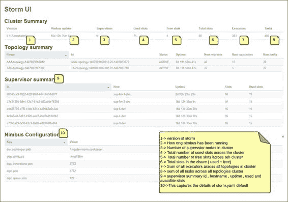
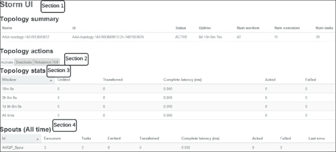
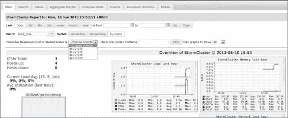
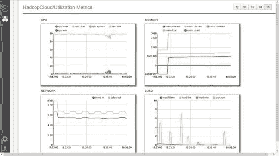

# 第四章。集群模式中的风暴

我们现在已经到达了风暴之旅的下一步，即了解风暴的集群模式设置及其相关组件。我们将浏览风暴和动物园管理员中的各种配置，并了解它们背后的概念。

本章将涉及的主题如下:

*   设置风暴集群
*   了解集群的配置及其对系统运行的影响
*   风暴用户界面和理解用户界面参数
*   为生产设置调配和监控应用程序

到本章结束时，您应该能够理解 Storm 和 Zookeeper 节点的配置。此外，您应该能够理解风暴用户界面，设置风暴集群，并使用各种工具对其进行监控。

# 风暴集群设置

下图描绘的是我们在[第 2 章](02.html#page "Chapter 2. Getting Started with Your First Topology")、*开始你的第一个拓扑*中建立的风暴和动物园管理员参考集群。

我们有一个三节点风暴集群的三节点动物园管理员集群(它有一个光轮和两个管理器)。

我们使用推荐的三节点 Zookeeper 集群来避免风暴设置中的单点故障。

动物园管理员集群应该有奇数个节点。这一要求的原因是动物园管理员选举逻辑要求领导者拥有奇数张选票，并且只有当奇数个节点在法定人数中时，这种组合才是可能的，如下图所示:


# 动物园管理员配置

让我们假设您已经在所有三个 Zookeeper 节点上安装了 Zookeeper；现在，我们将向您介绍这些配置，以便您更好地了解它们。

在我们的例子中，`zoo.cfg`的摘录位于`<zookeeper_installation_dir>/ zookeeper-3.4.5/conf/`。动物园管理员的配置如下:

*   `dataDir=/usr/local/zookeeper/tmp`: This is the path where Zookeeper stores its snapshots; these snapshots are actually the state log where the current cluster state is maintained for the purpose of coordination. In the event of a failure, these snapshots are used to restore the cluster to the last stable state. This directory also contains a file containing a single entry called `myID`. This value starts from `1` and is different for each Zookeeper node, so we will keep it as follows:

    ```scala
    zkp-1.mydomain.net – value of myId =1
    zkp-2.mydomain.net – value of myId =2
    zkp-3.mydomain.net – value of myId =3
    ```

    每当您想要从头开始，或者升级或缩小 Storm 或 Zookeeper 集群时，建议您清理这个`local.dir`文件，以便清除陈旧数据。

*   `clientPort=2182`: This configuration specifies the port on which the clients build connections with Zookeeper:

    ```scala
    server.1=zkp-1.mydomain.net:2888:3888
    server.2=zkp-2\. mydomain.net:2888:3888
    server.3=zkp-3\. mydomain.net:2888:3888
    ```

    前面代码中的这三行实际上指定了构成 Zookeeper 集群一部分的服务器的 IP 或名称。在这个配置中，我们创建了三节点 Zookeeper 集群。

*   `maxClientCnxns=30l`: This number specifies the maximum number of connections a single client can make with this Zookeeper node. Here is how the calculation will go in our case:

    一个主管最多可以与一个 Zookeeper 节点建立 30 个连接。因此，一个主管可以用三个 Zookeeper 节点创建的最大连接数是 90(即 30*3)。

下面的截图显示了 Storm 用户界面的截图，描述了已用、可用和可用的插槽:


### 注

风暴集群中的工作人员数量与动物园管理员集群中可用的连接数有关。如果您没有足够的动物园管理员集群连接，风暴管理员将无法启动。

## 清理动物园管理员

我们已经看到动物园管理员如何以快照的形式在`dataDir`配置中指定的路径中存储其所有的协调数据。这需要定期清理或归档以删除旧快照，这样我们就不会消耗整个磁盘空间。这里有一个小的清理脚本，需要在所有 Zookeeper 节点上配置:

```scala
numBackUps=3
dataDir=/usr/local/zookeeper/tmp
logDir=/mnt/my_logs/
echo `date`' Time to clean up StormZkTxn logs' >>  $logDir/cleanStormZk.out
java -cp /usr/local/zookeeper/zookeeper-3.4.5/zookeeper- 3.4.5.jar:/usr/local/zookeeper/zookeeper-3.4.5/lib/log4j- 1.2.15.jar:/usr/local/zookeeper/zookeeper-3.4.5/lib/slf4j-api- 1.6.1.jar org.apache.zookeeper.server.PurgeTxnLog $dataDir -n  $numBackUps >> $logDir/cleanStormZk.out
```

这里我们有如下清理脚本:

*   `numBackUps`:这里我们指定清理后要保留多少快照；最小三个，最大可以根据需要变化。
*   `dataDir`:这里我们指定需要清理快照的数据目录路径。
*   `logDir`:这是路径，清理脚本将在这里存储它的日志。
*   `org.apache.zookeeper.server.PurgeTxnLog`:这是实用程序类，清除除最后三个快照外的所有快照，如`n` `umBackups`中所述。

# 风暴配置

我们将查看风暴守护程序以及围绕守护程序的配置。对于 Nimbus 节点，我们在`storm.yaml`中有以下配置设置。让我们理解下面代码中给出的这些配置:

```scala
storm.zookeeper.servers:
- "zkp-1.mydomain.net "
- "zkp-2.mydomain.net "
- "zkp-3.mydomain.net "

storm.zookeeper.port: 2182
storm.local.dir: "/usr/local/storm/tmp"
nimbus.host: "nim-zkp-flm-3.mydomain.net"
topology.message.timeout.secs: 60
topology.debug: false

supervisor.slots.ports:
    - 6700
    - 6701
    - 6702
    - 6703
```

前面代码中使用的配置功能如下:

*   `storm.zookeeper.servers`:这里我们指定动物园管理员集群中动物园管理员服务器的名称或 IP；请注意，我们使用的主机名与上一节`zoo.cfg`配置中提到的主机名相同。
*   `storm.zookeeper.port`:这里我们指定风暴节点连接的动物园管理员节点上的端口。同样，我们指定了上一节中在`zoo.cfg`上指定的相同端口。
*   `storm.local.dir` : Storm 有自己的临时数据，存储在本地目录中。这些数据会被自动清除，但是无论何时您想要从头开始，或者当您升级或缩小 Storm 或 Zookeeper 集群时，建议您清除此`local.dir`配置，以便清除陈旧数据。
*   `nimbus.host`:指定正在设置为光轮的主机名的主机名或 IP。
*   `topology.message.timeout.secs`:该值指定拓扑正在处理的元组被声明为超时并被丢弃的持续时间(以秒为单位)。此后，根据它是可靠的还是不可靠的拓扑，它会被重放或不重放。该值应谨慎设置；如果设置得太低，所有消息都将超时。如果设置得太高，人们可能永远不会知道拓扑中的性能瓶颈。
*   `topology.debug`:此参数表示您是想在调试模式下还是在节点上运行拓扑。调试模式是打印所有调试日志的模式，建议在开发和试运行模式下使用，但不要在生产模式下使用，因为在这种模式下输入/输出非常高，因此会影响整体性能。
*   `supervisor.slots.ports`:此参数指定主管工人的端口。这个数字直接关系到可以在主管上产生的员工数量。当拓扑产生时，必须指定要分配的工作人员数量，这又与分配给拓扑的实际资源相关联。工作人员的数量非常重要，因为他们实际上确定了集群上可以运行多少拓扑，进而可以实现多少并行性。例如，默认情况下，我们每个主管有四个插槽，因此在我们的集群中，我们将有*插槽/工人总数= 4*2 = 8* 。每个工作人员从系统中获取一定数量的 CPU 和 RAM 资源，因此在主管上产生多少工作人员取决于系统配置。

## 风暴测井配置

现在我们来看看风暴的测井配置。他们使用 Log4J 的`logback`实现，其配置可以从位于`<storm-installation-dir>/apache-storm-0.9.2-incubating/logback`的`cluster.xml`找到并调整，使用以下代码:

```scala
<appender name="A1"  class="ch.qos.logback.core.rolling.RollingFileAppender">
    <file>${storm.log.dir}/${logfile.name}</file>
    <rollingPolicy  class="ch.qos.logback.core.rolling.FixedWindowRollingPolicy">
      <fileNamePattern>${storm.log.dir}/${logfile.name}.%i</fileNamePattern >
      <minIndex>1</minIndex>
 <maxIndex>9</maxIndex>
    </rollingPolicy>

    <triggeringPolicy  class="ch.qos.logback.core.rolling.SizeBasedTriggeringPolicy">
      <maxFileSize>100MB</maxFileSize>
    </triggeringPolicy>

    <encoder>
      <pattern>%d{yyyy-MM-dd HH:mm:ss} %c{1} [%p] %m%n</pattern>
    </encoder>
 </appender>

  <root level="INFO">
    <appender-ref ref="A1"/>
  </root>
```

在前面的代码片段中，突出显示了几个部分，我们将仔细查看这些部分。它们如下:

*   `<file>`:这个标签保存了 Storm 框架生成日志的日志目录路径和文件名。
*   `<filenamepattern>`:这是模式，文件形成并翻转；例如，使用前面的代码模式，我们将工作日志文件设置为`worker-6700.log`和`worker-6700.1.log`。
*   `<minIndex> and <maxIndex>`:为了明确我们要用这个滚动追加器保留多少文件，这些非常重要；在这种情况下，我们将有九个备份文件，编号从 1 到 9，以及一个运行日志文件。
*   `maxFileSize`:此参数指定文件应该翻转到什么大小，例如，在我们的例子中，它是 100 MB 这意味着当工作日志文件达到这个大小时，它将滚动到下一个索引。
*   `root level`:指定测井级别；在我们的案例中，我们将其指定为*信息*，这意味着`Info`和上面的日志将被打印在日志文件中，但是来自低于`Info`级别的日志将不会被写入日志。以下是供参考的日志记录级别层次结构:
    *   `OFF`
    *   `FATAL`
    *   `ERROR`
    *   `WARN`
    *   `INFO`
    *   `DEBUG`
    *   `TRACE`
    *   `ALL`

## 风暴界面

Storm 提供了一个用户界面，可以访问该界面来检查 Storm 配置和拓扑度量中的各种参数。在本节中，我们将了解风暴用户界面的各种组件。

下面的截图描述了风暴用户界面的登陆页面。图中显示了各个部分的详细信息:



下面的截图是对风暴 UI 更深层次的审视；这里我们看一下特定拓扑的用户界面投影:



我已经在前面的截图上划分了部分；让我们详细讨论它们，以便您完全理解它们。

### 第一节

本节总结了风暴集群中运行的拓扑。以下是本节中捕获的各种属性的详细信息:

*   **Topology Name**: This is specified when submitting the topology. You can refer to the `WordCountTopology.java` file, which we created earlier. The following snippet, `word-count`, is the name of that topology:

    ```scala
    cluster.submitTopology("word-count", conf,  builder.createTopology());
    ```

    在我们前面的示例截图中，**AAA-topology-1407803669812**是拓扑的名称。

*   **ID** :这是风暴生成的唯一 ID，它是拓扑名称、时间戳和 ID 的组合，风暴使用它来识别和区分拓扑。
*   **状态**:这表示拓扑的状态，对于活动拓扑可以是*活动的*，当使用 UI 或 CLI 终止拓扑时可以是*终止的*，对于停用的拓扑可以是*非活动的*，对于执行重新平衡命令的拓扑可以是*重新平衡*，其中分配给拓扑的工作进程的数量增加或减少。
*   **正常运行时间**:顾名思义指的是拓扑运行的持续时间。例如，我们的示例拓扑已经运行了 8 天 15 小时 6 个月 16 秒。
*   **工人数量**:这个指定分配给拓扑的工人数量。同样，如果我们引用`WordCountTopology.java`，我们会看到这个片段，它被声明为`3` :

    ```scala
    conf.setNumWorkers(3);
    ```

*   **Num executors**: This specifies the sum total of the number of executors in the topology. This is connected to the parallelism hint that is specified during the overall integration of the topology in the topology builder as follows:

    ```scala
    builder.setSpout("spout", new RandomSentenceSpout(), 5);
    ```

    这里，在我们的`WordCount`拓扑中，我们已经将喷口的平行度指定为`5`，因此在拓扑中将产生喷口的五个实例。

*   **Num tasks**: This gains the sum total of another parameter that is specified at the time of overall integration in the topology, as shown:

    ```scala
    builder.setSpout("spout", new RandomSentenceSpout(),  5).setNumTasks(10);
    ```

    在这里，我们指定对于专用于喷口的`5`执行器，`numtasks`的总值为`10`，因此将在每个执行器上分别产生两个任务。

    我们在用户界面上看到的是所有拓扑组件的所有`numtasks`值的总和。

### 第二节

本节包含可在拓扑上执行的各种操作:

*   **激活**:UI提供了一个工具来恢复或重新激活之前暂停的拓扑。一旦被激活，它可以再次开始消费来自喷口的信息并处理它们。
*   **停用**:当执行此动作时，拓扑会立即关闭喷口，也就是说，没有新的消息从喷口读取，并向下游推送到 DAG。已经在各种螺栓中处理的现有消息将被完全处理。
*   **重新平衡**:当对活动拓扑的工作者分配发生改变时，将执行此操作。
*   **Kill** :顾名思义，这是用来向 Storm 框架发送拓扑终止信号。提供一个合理的终止时间总是明智的，这样拓扑就会完全耗尽，并且能够在终止之前清除流水线事件。

### 第三节

此部分显示时间线上已处理的邮件数量。它有以下几个关键部分:

*   **窗口**:此字段指定以下时间段的持续时间:持续 10 分钟、持续 3 小时、过去一天或所有时间。拓扑的进度是根据这些时间段来获取的。
*   **发出**:这个捕捉各个时间段喷口发出的元组数量。
*   **转移**:这个指定发送到拓扑中其他组件的元组数量。请注意，发出的元组的数量可能等于也可能不等于传输的元组的数量，因为前者是执行喷口的发出方法的确切次数，而后者是基于所使用的分组传输的数量；例如，如果我们使用所有分组将一个喷口绑定到一个具有两个元组并行性的螺栓，那么对于喷口发出的每个`x`元组，`2x`元组将被转移。
*   **完全延迟** ( **毫秒**):这是整个拓扑中一个元组执行所花费的平均总时间。
*   **分组**:保存成功处理的分组事件数。
*   **失败**:这是未能成功处理的事件数。

### 第四节

本节与*第 3 节*相同，唯一不同的是，在此，术语显示在组件级别，即喷口和螺栓，而在*第 3 节*中，则显示在拓扑级别。用户界面上还有几个术语需要介绍。它们如下:

*   **容量**:这是微调拓扑时要考虑的最重要的指标之一。它表示 bolt 在最后十分钟内执行元组所花费的时间百分比。任何接近 1 或以上的值都表示增加了该螺栓的平行度。使用以下公式计算:

    ```scala
    Capacity = (Number of tuples Executed*Average execute  latency)/Window_Size*1000)
    ```

*   **执行延迟**:这是一个元组在处理过程中花费在 bolt 的执行方法上的平均时间。
*   **处理** **延迟**:处理延迟是从螺栓收到元组到数据包(确认表示成功处理)的平均时间。

### 可视化部分

风暴 0.9.2 中的改进之一是拓扑的可视化描述。下图描述了 Storm 用户界面中的示例拓扑:


在前面的截图中，您可以看到拓扑上由各种螺栓和喷口可视标记的所有流，以及延迟和其他关键属性。

Storm UI 提供了一个非常丰富的界面，用户可以从非常高的级别开始，在特定的区域进行更深层次的钻取，就像你在*中的截图中看到的一样，Storm 集群设置*部分，我们讨论了 Storm 集群级别的属性；在第二个层次，我们转移到一个特定的拓扑。接下来，在拓扑中，您可以单击任何螺栓或工人，组件级别的详细信息将呈现给您。下面截图中突出显示的一个项目对于集群设置中的调试和日志解密非常重要——工作人员标识。如果某个组件喷口或螺栓给我们带来了问题，我们想了解其工作原理，首先要看的是日志。为了能够查看日志，需要知道哪个主管和哪个工人正在执行哪个麻烦的螺栓；这可以通过在该组件上钻孔并查看执行器部分来推断，如下所示:


风暴用户界面捕获管理端口

在这里，主机告诉你这个组件运行在哪个管理器上，端口告诉你这个工作器，所以如果我想查找这个组件的日志，我会在`worker-6711.log`下的日志目录中查找`logdir` 中的`sup-flm-dev-1.mydomain.net`。

# 风暴监测工具

像 Storm 这样的集群设置需要持续监控，因为它们通常被开发为支持实时系统，其中停机时间可能是 **服务级别协议** ( **服务级别协议**)关注的问题。市场上有很多工具可以用来监控风暴集群并发出警报。一些风暴监控工具如下:

*   **Nagios**: This is a very powerful monitoring system that can be extended to generate e-mail alerts. It can monitor various processes and system KPIs and can be tweaked by writing custom scripts and plugins to restart certain components in the event of a failure.

    

    Nagios 服务控制台

    在前面带有 Nagios 监控的风暴集群的截图中，您可以看到各种进程和其他可以监控的系统级关键绩效指标，如中央处理器、内存、延迟、硬盘使用情况等。

*   **Ganglia**: This is another widely used open source tool that lets you set up a monitoring framework for Storm clusters.

    

    正如前面截图看到的，我们有很多下钻选项；我们可以看到负载和 CPU 级别的详细信息，以及其他系统和集群级别的 KPI，以捕获和绘制集群运行状况。

*   **SupervisorD**: This is another open source monitoring system that is widely used in conjunction with Storm to capture and retain the health of the cluster. SupervisorD also helps in provisioning and starting the Storm services and it can be configured to restart them in case of any failures.

    

*   **Ankush** : This is another provisioning and monitoring system that could be used for Storm and other big data cluster setup and man agement. It has both paid and open source v ersions ( [https://github.com/impetus-opensource/ankush](https://github.com/impetus-opensource/ankush) ) . it has the following salient features: T49 】 Template-based cluster creation

    <colgroup class="calibre19"><col class="calibre20"> <col class="calibre20"></colgroup> 
    | **Supply** | **The environment supported by this application****Physical node****Virtual node on the cloud (AWS or internal deployment)** |
    | Single technology cluster |
    | Multi-technology cluster |
    | Redeploy the wrong cluster |
    | Rack bracket[ | Pre-deployment enhanced node verification |
    | **Monitoring** | heat map 【 | Service monitoring |
    | Technology-based monitoring |
    | Rich graphics【 T99 01] | Alarm and notification of key events |
    | Centralized log view |
    | Audit tracking 【 T111 6] |
    | Alarm on dashboard and email |

以下截图是 Ankush 的仪表盘截图。所有的系统级 KPI，比如 CPU、负载、网络、内存等等都被很好的捕捉到了。



# 测验时间

问题 1 .陈述以下陈述是真是假:

1.  风暴配置存储在`cluster.xml`中。
2.  每个主管只能分配四名员工。
3.  动物园管理员集群总是有奇数个节点。
4.  Zookeeper 需要至少三个快照才能从故障中恢复其状态。
5.  如果 Nimbus 和主管死亡，拓扑可以继续执行。

问题 2 .填空:

1.  _____ 是元组被处理和分组的平均时间。
2.  _____ 是元组在执行方法中花费的平均时间。
3.  _____ 组件负责在出现故障时恢复 Storm 群集。

问题 3 .在三节点风暴集群(一个光轮和两个监控器)上执行`WordCount`拓扑，然后执行以下任务:

*   在拓扑运行时杀死 Nimbus 节点—观察拓扑不会失败；它将继续不受影响。
*   在拓扑运行时杀死主管—观察拓扑没有失败，它将继续不受影响。工人们将在动物园管理员的协调下继续执行。
*   尝试各种操作，如从风暴用户界面重新平衡和停用。

# 总结

在本章中，您详细了解了风暴和动物园管理员的配置。我们探索并指导您完成风暴用户界面及其属性。完成集群设置后，我们简要介绍了风暴中可用于运营生产支持的各种监控工具。

在下一章中，我们将向您介绍 RabbitMQ 及其与 Storm 的集成。