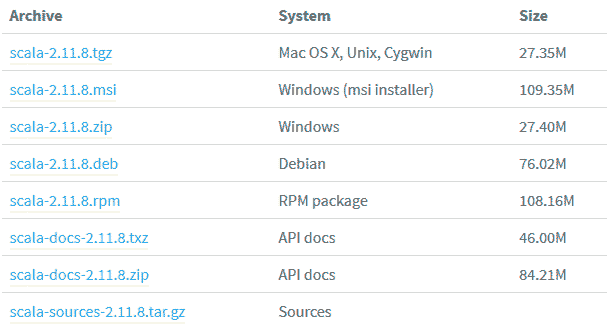
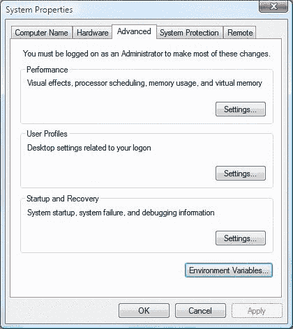
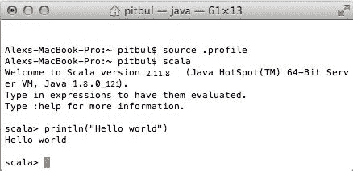

# 一、Scala 简介

*"I'm Scala. I'm a scalable, functional and object-oriented programming language. I can grow with you and you can play with me by typing one-line expressions and observing the results instantly"*

- Scala 报价

 *在过去的几年里，Scala 一直在稳步上升，并被开发人员和从业者广泛采用，尤其是在数据科学和分析领域。另一方面，ApacheSpark是；用 Scala 编写的是一个快速通用的大规模数据处理引擎。Spark 的成功得益于很多因素:易用的 API、干净的编程模型、性能等等。因此，Spark 自然对 Scala 有了更多的支持:与 Python 或 Java 相比，Scala 有更多的 API 可用；尽管如此，在 Java、Python 和 r 的 API 之前，已经有了新的 Scala APIs。

现在，在我们开始使用 Spark 和 Scala 编写您的数据分析程序之前(第二部分)，我们将首先详细了解 Scala 的功能编程概念、面向对象特性和 Scala 集合 API(第一部分)。作为起点，我们将在本章中简要介绍 Scala。我们将介绍 Scala 的一些基本方面，包括它的历史和用途。然后我们将看到如何在不同的平台上安装 Scala，包括视窗、Linux 和苹果操作系统，这样你的数据分析程序就可以写在你最喜欢的编辑器和 IDEs 上。在本章的后面，我们将提供 Java 和 Scala 之间的比较分析。最后，我们将通过一些例子深入研究 Scala 编程。

简而言之，将涵盖以下主题:

*   斯卡拉的历史和目的
*   平台和编辑
*   安装和设置 Scala
*   Scala:可伸缩的语言
*   面向 Java 程序员的 Scala
*   初学者用的 Scala
*   摘要

# 斯卡拉的历史和目的

Scala 是一种通用编程语言，支持`functional programming`和强大的`static type`系统。Scala 的源代码旨在编译成`Java`字节码，这样生成的可执行代码就可以在`Java virtual machine` (JVM)上运行。

马丁·奥德斯基早在 2001 年就在 T2 洛桑联邦理工学院(EPFL T4)开始设计斯卡拉。这是他关于漏斗的工作的延伸，漏斗是一种使用函数式编程和 Petri 网的编程语言。第一个公开发行版出现在 2004 年，但是只有在 Java 平台上支持。后来，紧接着。`NET`框架 2004 年 6 月。

Scala 已经变得非常流行，并被广泛采用，因为它不仅支持面向对象的编程范式，而且还包含函数式编程概念。此外，尽管 Scala 的符号运算符很难阅读，但与 Java 相比，Scala 的大多数代码都相对简洁且易于阅读——例如，Java 过于冗长。

像任何其他编程语言一样，Scala 是为特定目的而提出和开发的。现在，问题是，Scala 为什么被创建，它解决了什么问题？为了回答这些问题，奥德斯基在博客中表示:；

"The work on Scala stems from a research effort to develop better language support for component software. There are two hypotheses that we would like to validate with the Scala experiment. First, we postulate that a programming language for component software needs to be scalable in the sense that the same concepts can describe small as well as large parts. Therefore, we concentrate on mechanisms for abstraction, composition, and decomposition, rather than adding a large set of primitives, which might be useful for components at some level of scale but not at other levels. Second, we postulate that scalable support for components can be provided by a programming language which unifies and generalizes object-oriented and functional programming. For statically typed languages, of which Scala is an instance, these two paradigms were up to now largely separate."

尽管如此，Scala 中也提供了模式匹配和高阶函数等，不是为了填补 FP 和 OOP 之间的空白，而是因为；它们是函数式编程的典型特征。为此，它有一些非常强大的模式匹配特性，这是一个基于参与者的并发框架。此外，它还支持一阶和高阶函数。总的来说，“Scala”这个名字是可伸缩语言的组合体，意味着它是为满足用户需求而设计的。

# 平台和编辑

Scala 运行在 **Java 虚拟机** ( **JVM** )上，这也让 Scala 成为了 Java 程序员的一个不错的选择，他们希望自己的代码有一种函数式编程的味道。谈到编辑，有很多选择。对你来说，最好花点时间在可用的编辑器之间做一些比较研究，因为熟悉 IDE 是成功编程体验的关键因素之一。以下是可供选择的一些选项:

*   合并到这里
*   Eclipse 的 Scala 插件
*   IntelliJ IDEA
*   Emacs
*   精力

Eclipse 上的 Scala 支持编程使用大量测试插件有几个优点。Eclipse 为 Scala 提供了一些令人兴奋的功能，如本地、远程和高级调试工具，以及语义突出显示和代码完成。您可以同样轻松地将 Eclipse 用于 Java 和 Scala 应用开发。不过，我也建议使用 Scala IDE([http://scala-ide.org/](http://scala-ide.org/))——这是一个基于 Eclipse 的成熟的 Scala 编辑器，并且定制了一组有趣的特性(例如，Scala 工作表、ScalaTest 支持、Scala 重构等等)。；

在我看来，第二个最好的选择是 IntelliJ IDEA。第一个版本出现在 2001 年，是第一个集成了高级代码导航和重构功能的 Java IDEs。根据《信息世界》报告(见 http://www . InfoWorld . com/article/2683534/development-environments/InfoWorld-review-top-java-programming-tools.html)显示，在排名前四的 Java 编程 IDE(即 Eclipse、IntelliJ IDEA、NetBeans 和 JDeveloper)中，IntelliJ 的测试中心得分最高，为 10 分中的 8.5 分。

相应的评分如下图所示:


**Figure 1:** Best IDEs for Scala/Java developers

从前面；图中，您可能也对使用其他 ide 感兴趣，比如 NetBeans 和 JDeveloper。最终，这个选择是开发者之间永恒的争论，这意味着最终的选择是你的。

# 安装和设置 Scala

正如我们已经提到的，Scala 使用 JVM，因此请确保您已经安装了 Java 在你的机器上。如果没有，请参考下一小节，它展示了如何在 Ubuntu 上安装 Java。在本节中，首先，我们将向您展示如何在 Ubuntu 上安装 Java 8。然后，我们将看到如何在 Windows、Mac OS 和 Linux 上安装 Scala。

# 安装 Java

为了简单起见，我们将展示如何在 Ubuntu 14.04 LTS 64 位机器上安装 Java 8。但对于 Windows 和 Mac OS 来说，不如在谷歌身上投入一些时间，了解一下如何操作。对于 Windows 用户的最低提示:详情请参考此链接[https://Java . com/en/down/help/Windows _ manual _ download . XML](https://java.com/en/download/help/windows_manual_download.xml)[。](https://java.com/en/download/help/windows_manual_download.xml.)

现在，让我们看看如何用一步一步的命令和指令在 Ubuntu 上安装 Java 8。首先，检查是否；Java 已经安装:

```scala
$ java -version

```

如果返回`The program java cannot be found in the following packages`，Java 还没有安装。然后，您希望执行以下命令来摆脱:

```scala
 $ sudo apt-get install default-jre 

```

这将安装 **Java 运行时环境** ( **JRE** )。但是，如果您可能需要 **Java 开发工具包** ( **JDK** )，这通常是在 Apache Ant、Apache Maven、Eclipse 和 IntelliJ IDEA 上编译 Java 应用所需要的。

甲骨文 JDK 是官方的 JDK，但是，甲骨文不再提供它作为 Ubuntu 的默认安装。您仍然可以使用 apt-get 安装它。要安装任何版本，首先执行以下命令:

```scala
$ sudo apt-get install python-software-properties$ sudo apt-get update$ sudo add-apt-repository ppa:webupd8team/java$ sudo apt-get update

```

然后，根据要安装的版本，执行以下命令之一:

```scala
$ sudo apt-get install oracle-java8-installer

```

安装后，别忘了设置 Java home 环境变量。只需应用以下内容；命令(为简单起见，我们假设 Java 安装在`/usr/lib/jvm/java-8-oracle`):

```scala
$ echo "export JAVA_HOME=/usr/lib/jvm/java-8-oracle" >> ~/.bashrc  $ echo "export PATH=$PATH:$JAVA_HOME/bin" >> ~/.bashrc$ source ~/.bashrc 

```

现在，让我们来看看`Java_HOME`如下:

```scala
$ echo $JAVA_HOME

```

您应该在终端上观察以下结果:

```scala
 /usr/lib/jvm/java-8-oracle

```

现在，让我们通过发出以下命令来检查以确保已经成功安装了 Java(您可能会看到最新版本！):

```scala
$ java -version

```

您将获得以下输出:

```scala
java version "1.8.0_121"Java(TM) SE Runtime Environment (build 1.8.0_121-b13)Java HotSpot(TM) 64-Bit Server VM (build 25.121-b13, mixed mode)

```

太棒了！现在您的机器上已经安装了 Java，因此一旦安装了 Scala 代码，您就准备好了。让我们在接下来的几个小节中来做这件事。

# Windows 操作系统

这一部分将着重于在装有 Windows 7 的 PC 上安装 Scala，但最终，您目前运行哪个版本的 Windows 并不重要:

1.  第一步是从官方网站下载一个 Scala 的压缩文件。你会在 https://www.Scala-lang.org/download/all.html 找到它。在此页面的其他资源部分，您将找到一个归档文件列表，从中可以安装 Scala。我们将选择下载 Scala 2.11.8 的压缩文件，如下图所示:



**Figure 2:** Scala installer for Windows

2.  下载完成后，解压缩文件并将其放入您喜欢的文件夹中。为了导航的灵活性，您也可以重命名文件 Scala。最后，需要为 Scala 创建一个`PATH`变量，以便在您的操作系统上全局可见。为此，导航到计算机|属性，如下图所示:



**Figure 3:** Environmental variable tab on windows

3.  从那里选择环境变量，得到 Scala 的`bin`文件夹的位置；然后，将其追加到`PATH`环境变量中。应用更改，然后按“确定”；如下图所示:


**Figure 4:** Adding environmental variables for Scala

4.  现在，您已经准备好进行 Windows 安装了。打开 CMD，只需键入`scala`。如果您在安装过程中成功，那么您应该会看到类似于以下屏幕截图的输出:


**Figure 5:** Accessing Scala from "Scala shell"

# Mac OS 系统

现在是时候在你的 Mac 上安装 Scala 了。有很多方法可以在你的 Mac 上安装 Scala，在这里，我们将提到其中的两种:

# 使用自制安装程序

1.  首先，检查您的系统，看看它是否安装了 Xcode，因为这是这一步所必需的。你可以从苹果应用商店免费安装。
2.  接下来，您需要通过在您的终端中运行以下命令从终端安装`Homebrew`:

```scala
$ /usr/bin/ruby -e "$(curl -fsSL https://raw.githubusercontent.com/Homebrew/install/master/install)"

```

注:前一项；自制程序的人不时改变命令。如果命令似乎不起作用，请查看家酿网站了解最新咒语:[http://brew.sh/](http://brew.sh/)。

3.  现在，您可以通过键入以下命令`brew install scala`来安装 Scala 了；在终点站。
4.  最后，您只需在终端中键入 Scala(第二行)就可以开始了，您将在终端上看到以下内容:；



**Figure 6**: Scala shell on macOS

# 手动安装

手动安装 Scala 之前，选择自己喜欢的 Scala 版本，从[http://www.Scala-lang.org/download/](http://www.scala-lang.org/download/)下载该版本`Scala-verion.tgz`对应的`.tgz`文件。下载首选版本的 Scala 后，按如下方式提取:

```scala
$ tar xvf scala-2.11.8.tgz

```

然后，将其移动到`/usr/local/share`，如下所示:

```scala
$ sudo mv scala-2.11.8 /usr/local/share

```

现在，要使安装永久化，请执行以下命令:

```scala
$ echo "export SCALA_HOME=/usr/local/share/scala-2.11.8" >> ~/.bash_profile$ echo "export PATH=$PATH: $SCALA_HOME/bin" >> ~/.bash_profile 

```

就这样。现在，让我们在下一小节中看看如何在像 Ubuntu 这样的 Linux 发行版上实现它。

# Linux 操作系统

在这一小节中，我们将向您展示 Scala 在 Linux Ubuntu 发行版上的安装过程。在开始之前，让我们检查一下以确保 Scala 安装正确。使用以下命令检查这一点很简单:

```scala
$ scala -version

```

如果您的系统上已经安装了 Scala，您应该会在终端上看到以下消息:

```scala
Scala code runner version 2.11.8 -- Copyright 2002-2016, LAMP/EPFL

```

请注意，在编写本安装的过程中，我们使用了 Scala 的最新版本，即 2.11.8。如果您的系统上没有安装 Scala，请确保在继续下一步之前安装它。；您可以在[http://www.scala-lang.org/download/](http://www.scala-lang.org/download/)的 Scala 网站下载最新版本的 Scala(更清晰的视图请参考*图 2* )。为了方便起见，我们下载 Scala 2.11.8，如下所示:；

```scala
$ cd Downloads/$ wget https://downloads.lightbend.com/scala/2.11.8/scala-2.11.8.tgz

```

下载完成后，您应该在下载文件夹中找到 Scala tar 文件。

The user should first go into the `Download` directory with the following command: `$ cd /Downloads/`. Note that the name of the downloads folder may change depending on the system's selected language.

要从 Scala `tar`文件的位置或更多位置提取该文件，请键入以下命令。使用这个，可以从终端提取 Scala tar 文件:

```scala
$ tar -xvzf scala-2.11.8.tgz

```

现在，通过键入以下命令或手动操作，将 Scala 发行版移动到用户的视角(例如，`/usr/local/scala/share`):

```scala
 $ sudo mv scala-2.11.8 /usr/local/share/

```

使用以下命令移动到您的主目录问题:

```scala
$ cd ~

```

然后，使用以下命令设置 Scala 主页:

```scala
$ echo "export SCALA_HOME=/usr/local/share/scala-2.11.8" >> ~/.bashrc $ echo "export PATH=$PATH:$SCALA_HOME/bin" >> ~/.bashrc

```

然后，使用以下命令使该更改对会话永久有效:

```scala
$ source ~/.bashrc

```

安装完成后，最好使用以下命令进行验证:

```scala
$ scala -version

```

如果 Scala 已经在您的系统上成功配置，您应该会在您的终端上看到以下消息:

```scala
Scala code runner version 2.11.8 -- Copyright 2002-2016, LAMP/EPFL

```

干得好！现在，让我们通过输入；终端上的`scala`命令，如下图所示:

**** **Figure 7:** Scala shell on Linux (Ubuntu distribution)

最后，您还可以使用 apt-get 命令安装 Scala，如下所示:

```scala
$ sudo apt-get install scala

```

该命令将下载 Scala 的最新版本(即 2.12.x)。然而，Spark 还不支持 Scala 2.12(至少在我们写这一章的时候)。因此，我们推荐前面描述的手动安装。

# Scala:可伸缩的语言

Scala 这个名字来自一种可扩展的语言，因为 Scala 的概念可以很好地扩展到大型程序。其他语言的一些程序将需要几十行代码，但是在 Scala 中，您将获得以简洁有效的方式表达编程的一般模式和概念的能力。在本节中，我们将描述奥德斯基为我们创建的 Scala 的一些令人兴奋的特性:

# Scala 是面向对象的

Scala 是面向对象语言的一个很好的例子。要定义对象的类型或行为，您需要使用类和特征的概念，这将在下一章中解释。Scala 不支持直接多重继承，但是要实现这种结构，需要使用 Scala 对**子类**和**基于混合的组合**的扩展。这将在后面的章节中讨论。

 **# Scala 是功能性的

函数式编程将函数视为一等公民。在 Scala 中，这是通过语法糖和扩展特性的对象(如*函数 2* )来实现的，但这就是 Scala 中函数编程的实现方式。另外，Scala 定义了一种简单易行的方法来定义**匿名** **函数**(没有名字的函数)。它还支持高阶函数，并且允许嵌套函数**。**这些概念的语法将在接下来的章节中详细解释。

此外，它还可以帮助您以不可变的方式进行编码，通过这种方式，您可以轻松地将其应用于具有同步和并发的并行性。

# Scala 是静态类型的

与 Pascal、Rust 等其他静态类型语言不同，Scala 不希望您提供冗余类型信息。在大多数情况下，您不必指定类型。最重要的是，你甚至不需要重复它们。

A programming language is called statically typed if the type of a variable is known at compile time: this also means that, as a programmer, you must specify what the type of each variable is. For example, Scala, Java, C, OCaml, Haskell, and C++, and so on. On the other hand, Perl, Ruby, Python, and so on are dynamically typed languages, where the type is not associated with the variables or fields, but with the runtime values.

Scala 的静态类型特性确保所有类型的检查都由编译器完成。Scala 的这一极其强大的功能可以帮助您在执行之前的早期阶段发现/捕获最微不足道的错误。

# Scala 在 JVM 上运行

就像 Java 一样，Scala 也被编译成字节码，可以很容易地被 JVM 执行。这意味着 Scala 和 Java 的运行时平台是相同的，因为两者都生成字节码作为编译输出。所以，你可以很容易地从 Java 切换到 Scala，你可以；并且还可以轻松地将两者集成，甚至在您的 Android 应用中使用 Scala 来增加功能性的味道。；

Note that, while using Java code in a Scala program is quite easy, the opposite is very difficult, mostly because of Scala's syntactic sugar.

同样，就像将 Java 代码编译成字节码的`javac`命令一样，Scala 也有将 Scala 代码编译成字节码的`scalas`命令。

# Scala 可以执行 Java 代码

如前所述，Scala 也可以用来执行您的 Java 代码。不仅仅是安装你的 Java 代码；它还使您能够使用 Java SDK 中所有可用的类，甚至是您自己在 Scala 环境中预先定义的类、项目和包。

# Scala 可以做并发和；同步处理

其他语言的一些程序将需要几十行代码，但是在 Scala 中，您将获得以简洁有效的方式表达编程的一般模式和概念的能力。此外，它还可以帮助您以不可变的方式进行编码，通过这种方式，您可以轻松地将其应用于具有同步和并发的并行性。

# 面向 Java 程序员的 Scala

Scala 有一套完全不同于 Java 的特性。在本节中，我们将讨论其中的一些特性。本节将对那些来自 Java 背景或至少熟悉基本 Java 语法和语义的人有所帮助。

# 所有类型都是对象

如前所述，Scala 中的每个值看起来都像一个对象。这种说法意味着所有东西看起来都像一个对象，但其中一些实际上并不反对，您将在后面的章节中看到对此的解释(例如；引用类型和基元类型之间的区别在 Scala 中仍然存在，但它在很大程度上隐藏了这一点)。例如，在 Scala 中，字符串被隐式转换为字符集合，但在 Java 中不是！

# 类型推断

如果你不熟悉这个术语，它只不过是编译时类型的演绎。等等，动态打字不就是这个意思吗？嗯，没有。注意我说的类型演绎；这与动态类型语言完全不同，另外一点是，它是在编译时完成的，而不是在运行时。许多语言都内置了这一功能，但实现方式因语言而异。这在开始时可能会令人困惑，但通过代码示例会变得更加清晰。让我们跳到斯卡拉 REPL 进行一些实验。

# 比例缩放比例

Scala REPL 是一个强大的特性，使得编写 Scala 代码更加简单明了；Scala 外壳。 **REPL** 代表**读-评估-打印-循环**也叫**交互解释器**。这意味着它是一个用于以下目的的程序:

1.  ；阅读你输入的表达式。
2.  使用 Scala 编译器评估步骤 1 中的表达式。
3.  打印出步骤 2 中的评估结果。
4.  等待(循环)您输入进一步的表达式。


**Figure 8:** Scala REPL example 1

从图中可以明显看出，这并不神奇，变量会在编译时被自动推断为它们认为合适的最佳类型。如果你仔细看，当我试图声明:；

```scala
 i:Int = "hello"

```

然后，Scala 外壳抛出一个错误，它说:

```scala
<console>:11: error: type mismatch;found   : String("hello")required: Intval i:Int = "hello"^

```

根据奥德斯基的说法，*“将一个字符映射到一个 RichString 上的字符映射应该会再次产生一个 RichString，就像下面与 Scala REP 的交互一样”*。使用下面一行代码可以证明前面的语句:

```scala
scala> "abc" map (x => (x + 1).toChar) res0: String = bcd

```

但是，如果有人把`Char`到`Int`的方法应用到一个`String`上，那么会发生什么呢？在这种情况下，Scala 将它们转换为整数向量，也称为不可变，这是 Scala 集合的一个特性，如图 9 所示。我们将在[第 4 章](04.html#3FIHQ1-21aec46d8593429cacea59dbdcd64e1c)、*集合 API*中查看 Scala 集合 API 的详细信息。

```scala
"abc" map (x => (x + 1)) res1: scala.collection.immutable.IndexedSeq[Int] = Vector(98, 99, 100)

```

对象的静态和实例方法也是可用的。例如，如果您将`x`声明为字符串`hello`，然后尝试访问对象`x`的静态和实例方法，它们是可用的。在 Scala shell 中，键入`x`然后是`.`和`<tab>`，然后您会发现可用的方法:

```scala
scala> val x = "hello"x: java.lang.String = helloscala> x.re<tab>reduce             reduceRight         replaceAll            reversereduceLeft         reduceRightOption   replaceAllLiterally   reverseIteratorreduceLeftOption   regionMatches       replaceFirst          reverseMapreduceOption       replace             reprscala> 

```

由于这一切都是通过反射动态完成的，所以即使是您刚刚定义的匿名类也同样可以访问:

```scala
scala> val x = new AnyRef{def helloWord = "Hello, world!"}x: AnyRef{def helloWord: String} = $anon$1@58065f0c scala> x.helloWord def helloWord: String scala> x.helloWord warning: there was one feature warning; re-run with -feature for details res0: String = Hello, world!

```

前面两个例子可以在 Scala 外壳上显示，如下所示:


**Figure 9:** Scala REPL example 2 "So it turns out that map yields different types depending on what the result type of the passed function argument is!"

-奥斯基

# 嵌套函数

为什么在编程语言中需要嵌套函数支持？大多数情况下，我们希望将我们的方法保持为几行，并避免过大的函数。在 Java 中，这方面的典型解决方案是在类级别定义所有这些小函数，但是任何其他方法都可以轻松地引用和访问它们，即使它们是助手方法。Scala 中的情况不同，因此您可以在彼此内部使用定义函数，这样，就可以防止对这些函数的任何外部访问:

```scala
def sum(vector: List[Int]): Int = {// Nested helper method (won't be accessed from outside this functiondef helper(acc: Int, remaining: List[Int]): Int = remaining match {case Nil => acccase _   => helper(acc + remaining.head, remaining.tail)}// Call the nested methodhelper(0, vector)}

```

我们不期望您理解这些代码片段，它们显示了 Scala 和 Java 之间的区别。

# 导入语句

在 Java 中，您只能在代码文件的顶部导入包，就在 packages 语句之后。斯卡拉的情况不一样；您几乎可以在源文件中的任何地方编写导入语句(例如，您甚至可以在类或方法中编写导入语句)。您只需要注意导入语句的范围，因为它继承了类成员或方法内部局部变量的相同范围。Scala 中的`_`(下划线)用于通配符导入，类似于 java 中使用的`*`(星号):

```scala
// Import everything from the package math import math._

```

您也可以使用这些`{ }`来指示来自同一父包的一组导入，只需一行代码。在 Java 中，您可以使用多行代码来实现这一点:

```scala
// Import math.sin and math.cosimport math.{sin, cos}

```

与 Java 不同，Scala 没有静态导入的概念。换句话说，静态的概念在 Scala 中不存在。但是，作为开发人员，显然可以使用常规的 import 语句导入一个成员或一个对象的多个成员。前面的例子已经展示了这一点，我们从名为 math 的包对象中导入方法 sin 和 cos。为了演示一个例子，前面；从 Java 程序员的角度来看，代码片段可以定义如下:

```scala
import static java.lang.Math.sin;import static java.lang.Math.cos;

```

Scala 的另一个优点是，在 Scala 中，您也可以重命名导入的包。或者，您可以重命名导入的包，以避免类型与具有相似成员的包冲突。以下语句在 Scala 中有效:

```scala
// Import Scala.collection.mutable.Map as MutableMap import Scala.collection.mutable.{Map => MutableMap}

```

最后，出于冲突或其他目的，您可能希望排除包的成员。为此，您可以使用通配符:

```scala
// Import everything from math, but hide cos import math.{cos => _, _}

```

# 运算符作为方法

值得一提的是，Scala 不支持运算符重载。您可能会认为 Scala 中根本没有运算符。

调用采用单个参数的方法的另一种语法是使用中缀语法。中缀语法为您提供了一种风格，就像您应用运算符重载一样，就像您在 C++中所做的那样。例如:

```scala
val x = 45val y = 75

```

在以下情况下，`+`；表示类`Int`中的一个方法。；以下；代码是一种非常规的方法调用语法:

```scala
val add1 = x.+(y)

```

更正式地说，可以使用中缀语法完成同样的操作，如下所示:

```scala
val add2 = x + y

```

此外，您可以使用中缀语法。但是，该方法只有一个参数，如下所示:

```scala
val my_result = List(3, 6, 15, 34, 76) contains 5

```

使用中缀语法时有一种特殊情况。也就是说，如果方法名以`:`(冒号)结尾，那么调用将是右关联的。这意味着在右边的参数上调用方法，左边的表达式作为参数，而不是相反。例如，以下内容在 Scala 中有效:

```scala
val my_list = List(3, 6, 15, 34, 76)

```

前面的；声明表示:`my_list.+:(5)`而不是`5.+:(my_list)`，更正式地说:；

```scala
val my_result = 5 +: my_list

```

现在，让我们看看前面关于 REPL Scala 的例子:

```scala
scala> val my_list = 5 +: List(3, 6, 15, 34, 76) my_list: List[Int] = List(5, 3, 6, 15, 34, 76)scala> val my_result2 = 5+:my_list my_result2: List[Int] = List(5, 5, 3, 6, 15, 34, 76)scala> println(my_result2) List(5, 5, 3, 6, 15, 34, 76)scala>

```

除了上面的，这里的操作符只是方法，所以它们可以像方法一样简单地被覆盖。

# 方法和参数列表

在 Scala 中，一个方法可以有多个参数列表，甚至根本没有参数列表。另一方面，在 Java 中，一个方法总是有一个参数列表，参数为零或更多。例如，在 Scala 中，以下是有效的方法定义(写在`currie notation`中)，其中一个方法有两个参数列表:

```scala
def sum(x: Int)(y: Int) = x + y     

```

前面的；方法不能写成:

```scala
def sum(x: Int, y: Int) = x + y

```

比方说，一种方法；`sum2`，可以完全没有参数表，如下:

```scala
def sum2 = sum(2) _

```

现在，您可以调用方法`add2`，该方法返回一个带一个参数的函数。然后，它用参数`5`调用该函数，如下所示:

```scala
val result = add2(5)

```

# 方法中的方法

有时，您希望通过避免太长和复杂的方法来使您的应用、代码模块化。Scala 为您提供了这种工具，以避免您的方法变得过于庞大，这样您就可以将它们分成几个更小的方法。

另一方面，Java 只允许在类级别定义方法。例如，假设您有以下方法定义:

```scala
def main_method(xs: List[Int]): Int = {// This is the nested helper/auxiliary methoddef auxiliary_method(accu: Int, rest: List[Int]): Int = rest match {case Nil => accucase _   => auxiliary_method(accu + rest.head, rest.tail)}}

```

现在，您可以调用嵌套的 helper/辅助方法，如下所示:

```scala
auxiliary_method(0, xs)

```

考虑到以上情况，下面是有效的完整代码段:

```scala
def main_method(xs: List[Int]): Int = {// This is the nested helper/auxiliary methoddef auxiliary_method(accu: Int, rest: List[Int]): Int = rest match {case Nil => accucase _   => auxiliary_method(accu + rest.head, rest.tail)}auxiliary_method(0, xs)}
```

# Scala 中的构造函数

Scala 令人惊讶的一点是 Scala 类的主体本身就是一个构造函数。；然而，Scala 做到了；事实上，以更明确的方式。之后，创建并执行该类的新实例。此外，您可以在类声明行中指定构造函数的参数。

因此，可以从该类中定义的所有方法访问构造函数参数。例如，以下类和构造函数定义在 Scala 中有效:

```scala
class Hello(name: String) {// Statement executed as part of the constructorprintln("New instance with name: " + name)// Method which accesses the constructor argumentdef sayHello = println("Hello, " + name + "!")}

```

等效的 Java 类如下所示:

```scala
public class Hello {private final String name;public Hello(String name) {System.out.println("New instance with name: " + name);this.name = name;}public void sayHello() {System.out.println("Hello, " + name + "!");}}

```

# 对象，而不是静态方法

如前所述，静态在 Scala 中不存在。您不能进行静态导入，也不能向类中添加静态方法。在 Scala 中，当你定义一个与类同名且在同一源文件中的对象时，那么这个对象就被说成是那个类的同伴*。*您在类的这个伴随对象中定义的函数就像 Java 中类的静态方法:

```scala
class HelloCity(CityName: String) {def sayHelloToCity = println("Hello, " + CityName + "!") }

```

这是您可以为类 hello 定义伴随对象的方式:

```scala
object HelloCity { // Factory method def apply(CityName: String) = new Hello(CityName) }

```

Java 中的等效类如下所示:

```scala
public class HelloCity { private final String CityName; public HelloCity(String CityName) { this.CityName = CityName; }public void sayHello() {System.out.println("Hello, " + CityName + "!"); }public static HelloCity apply(String CityName) { return new Hello(CityName); } }

```

所以，这个简单的类里有很多冗长的内容，不是吗？；Scala 中的 apply 方法以不同的方式处理，因此您可以找到一种特殊的快捷语法来调用它。这是调用方法的常见方式:

```scala
val hello1 = Hello.apply("Dublin")

```

下面是快捷语法，与前面的语法相同:

```scala
 val hello2 = Hello("Dublin")

```

请注意，只有在代码中使用 apply 方法时，这才有效，因为 Scala 以这种不同的方式处理名为 apply 的方法。

# 特征

Scala 为您提供了一个很好的功能来扩展和丰富您的类的行为。这些特征类似于定义函数原型或签名的界面。因此，有了这个，你可以混合来自不同特性的功能，这样，你丰富了你的类的行为。那么，Scala 中的特性有什么好的呢？它们使得由这些特征组成的类成为可能，特征是构建的基础。和往常一样，让我们看一个例子。这就是在 Java 中设置常规日志记录例程的方式:

请注意，即使你可以混合任何你想要的特征。此外，与 Java 一样，Scala 不支持多重继承。然而，在 Java 和 Scala 中，一个子类只能扩展一个超类。例如，在 Java 中:

```scala
class SomeClass {//First, to have to log for a class, you must initialize itfinal static Logger log = LoggerFactory.getLogger(this.getClass());...//For logging to be efficient, you must always check, if logging level for current message is enabled                //BAD, you will waste execution time if the log level is an error, fatal, etc.log.debug("Some debug message");...//GOOD, it saves execution time for something more usefulif (log.isDebugEnabled()) { log.debug("Some debug message"); }//BUT looks clunky, and it's tiresome to write this construct every time you want to log something.}

```

有关更详细的讨论，请参考此网址[https://stack overflow . com/questions/963492/in-log4j-does-checking-is debugered-before-log-improve-performance/963681 # 963681](https://stackoverflow.com/questions/963492/in-log4j-does-checking-isdebugenabled-before-logging-improve-performance/963681#963681)。

然而，这是不同的特点。总是检查启用的日志级别是非常烦人的。如果你能编写一次这个例程，并立即在任何地方、任何类中重用它，那就太好了。Scala 的特性使这一切成为可能。例如:

```scala
trait Logging {lazy val log = LoggerFactory.getLogger(this.getClass.getName)     //Let's start with info level......//Debug level here...def debug() {if (log.isDebugEnabled) log.info(s"${msg}")}def debug(msg: => Any, throwable: => Throwable) {if (log.isDebugEnabled) log.info(s"${msg}", throwable)}...//Repeat it for all log levels you want to use}

```

如果你看看前面的代码，你会看到一个使用以`s`开头的字符串的例子。；这样，Scala 提供了一种从数据中创建字符串的机制，称为**字符串插值**。；

String Interpolation, allows you to embed variable references directly in processed string literals. For example:
; ; ;`scala> val name = "John Breslin"`
`; ;scala> println(s"Hello, $name") ; // Hello, John Breslin`.

现在，我们可以用更传统的方式获得一个高效的日志记录例程，作为一个可重用的块。要为任何类启用日志记录，我们只需混合我们的`Logging`特性！太棒了！现在，向您的类中添加一个日志功能就可以了:

```scala
class SomeClass extends Logging {...//With logging trait, no need for declaring a logger manually for every class//And now, your logging routine is either efficient and doesn't litter the code!log.debug("Some debug message")...}

```

甚至有可能将多种特征混合在一起。例如，对于前面的；特质(即`Logging`)你可以在下面不断延伸；订单:

```scala
trait Logging  {override def toString = "Logging "}class A extends Logging  {override def toString = "A->" + super.toString}trait B extends Logging  {override def toString = "B->" + super.toString}trait C extends Logging  {override def toString = "C->" + super.toString}class D extends A with B with C {override def toString = "D->" + super.toString}

```

但是，需要注意的是，一个 Scala 类可以同时扩展多个特性，但是 JVM 类只能扩展一个父类。

现在，要调用上述特性和类，使用来自 Scala REPL 的`new D()`，如下所示；图:


**Figure 10**: Mixing multiple traits

这一章到目前为止一切都很顺利。现在，让我们进入一个新的部分，我们将为想要进入 Scala 编程领域的初学者讨论一些主题。

# 初学者用的 Scala

在这一部分中，您会发现我们假设您对任何以前的编程语言都有基本的了解。如果 Scala 是你进入编码世界的第一步，那么你会发现大量的材料甚至在线课程为初学者解释 Scala。如上所述，有很多教程、视频和课程。

There is a whole Specialization, which contains this course, on Coursera: [https://www.coursera.org/specializations/scala](https://www.coursera.org/specializations/scala). Taught by the creator of Scala, Martin Odersky, this online class takes a somewhat academic approach to teaching the fundamentals of functional programming. You will learn a lot about Scala by solving the programming assignments. Moreover, this specialization includes a course on Apache Spark. Furthermore, Kojo ([http://www.kogics.net/sf:kojo](http://www.kogics.net/sf:kojo)) is an interactive learning environment that uses Scala programming to explore and play with math, art, music, animations, and games.

# 你的第一行代码

作为第一个例子，我们将使用非常常见的`Hello, world!`程序，以便向您展示如何在不太了解 Scala 的情况下使用它及其工具。让我们打开您最喜欢的编辑器(此示例在 Windows 7 上运行，但也可以在 Ubuntu 或 macOS 上类似地运行)，比如 Notepad++，并键入以下代码行:

```scala
object HelloWorld {def main(args: Array[String]){ println("Hello, world!")  } }

```

现在，用名称保存代码，说`HelloWorld.scala`，如下图:；


**Figure 11:** Saving your first Scala source code using Notepad++

让我们如下编译源文件:

```scala
C:\>scalac HelloWorld.scala C:\>scala HelloWorld Hello, world! C:\>

```

# 我是；你好世界节目，好好给我解释一下！

任何有编程经验的人都应该熟悉这个程序。它有一个将字符串`Hello, world!`打印到控制台的主要方法。接下来，看看我们是如何定义`main`函数的，我们使用了`def main()`奇怪的语法来定义它。`def`是一个用于声明/定义方法的 Scala 关键字，我们将在下一章中介绍更多关于方法和编写方法的不同方式。因此，我们有一个`Array[String]`作为这个方法的参数，它是一个字符串数组，可以用于程序的初始配置，省略是有效的。；然后，我们使用常见的`println()`方法，该方法获取一个字符串(或格式化的字符串)并将其打印到控制台。一个简单的 hello world 打开了很多可以学习的话题；特别是三个:

● ;；；方法(将在后面的章节中介绍)●；；；对象和类(在后面的章节中介绍)●；；；类型推断 Scala 是静态类型语言的原因——前面已经解释过了

# 交互式运行 Scala！

`scala`命令为您启动交互式外壳，您可以在其中交互式解释 Scala 表达式:

```scala
> scalaWelcome to Scala 2.11.8 (Java HotSpot(TM) 64-Bit Server VM, Java 1.8.0_121).Type in expressions for evaluation. Or try :help.scala>scala> object HelloWorld { |   def main(args: Array[String]){ |     println("Hello, world!") |   } | }defined object HelloWorldscala> HelloWorld.main(Array())Hello, world!scala>

```

The shortcut `:q` stands for the internal shell command `:quit`, ;used to exit the interpreter.

# 编译一下！

类似于`javac`命令的`scalac`命令编译一个或多个 Scala 源文件，并生成一个字节码作为输出，然后可以在任何 Java 虚拟机上执行。要编译 hello world 对象，请使用以下命令:

```scala
> scalac HelloWorld.scala

```

默认情况下，`scalac`将类文件生成到当前工作目录中。您可以使用`-d`选项指定不同的输出目录:

```scala
> scalac -d classes HelloWorld.scala

```

但是，请注意，在执行此命令之前，必须创建名为`classes`的目录。

# 用 Scala 命令执行它

`scala`命令执行解释器生成的字节码:

```scala
$ scala HelloWorld

```

Scala 允许我们指定命令选项，例如`-classpath`(别名`-cp`)选项:

```scala
$ scala -cp classes HelloWorld

```

在使用`scala`命令执行源文件之前，您应该有一个主方法作为应用的入口点。否则，你应该有一个扩展`Trait Scala.App`的`Object`，那么这个对象里面的所有代码都会被这个命令执行。以下同`Hello, world!`；例如，但是使用`App`特征:

```scala
#!/usr/bin/env Scala object HelloWorld extends App {  println("Hello, world!") }HelloWorld.main(args)

```

前面的；脚本可以直接从命令行运行:

```scala
./script.sh

```

注意:这里我们假设文件`script.sh`有执行权限:；

```scala
$ sudo chmod +x script.sh

```

然后，`scala`命令的搜索路径在`$PATH`环境变量中指定。

# 摘要

在本章中，您已经学习了 Scala 编程语言的基础知识、它的特性和可用的编辑器。我们还简要讨论了 Scala 及其语法。我们为初学 Scala 编程的初学者演示了安装和设置指南。在本章的后面，您学习了如何编写、编译和执行示例 Scala 代码。此外，一个关于 Scala 和 Java 的比较讨论为那些来自 Java 背景的人提供了。以下是 Scala 和 Python 之间的简短比较:

Scala 是静态类型的，但是 Python 是动态类型的。Scala(大部分)支持函数式编程范式，而 Python 不支持。Python 有一种独特的语法，缺少大部分括号，而 Scala(几乎)总是需要它们。在 Scala 中，几乎所有的东西都是表达式；而在 Python 中却不是这样。然而，有几个看似复杂的优点。类型复杂性大多是可选的。其次，根据[提供的文档 https://stackoverflow . com/questions/1065720/Scala-programming-language/5828684 # 5828684](https://stackoverflow.com/questions/1065720/what-is-the-purpose-of-scala-programming-language/5828684#5828684)、*随着圈复杂度和代码行数的增加，Scala 编译器就像是免费的测试和文档。当适当实现时，Scala 可以在一致和连贯的 API 后面执行几乎不可能的操作。*

在下一章，我们将讨论；如何改进我们在基础知识上的经验，以了解 Scala 如何实现面向对象的范例，从而允许构建模块化软件系统。***