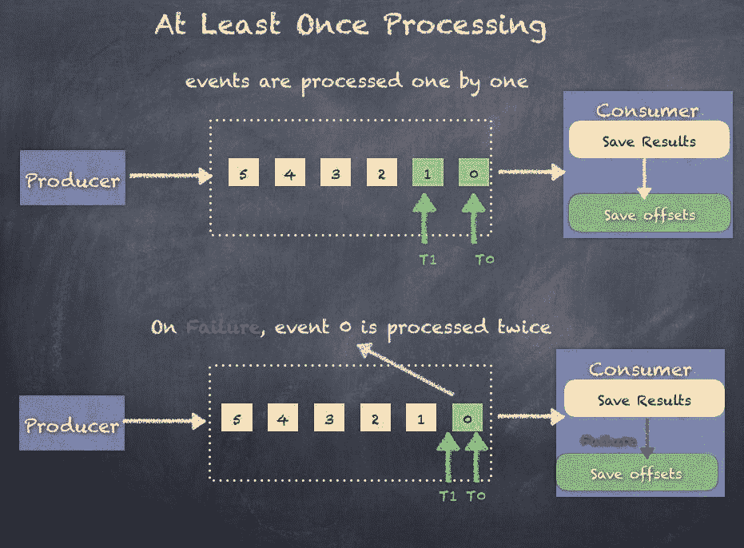
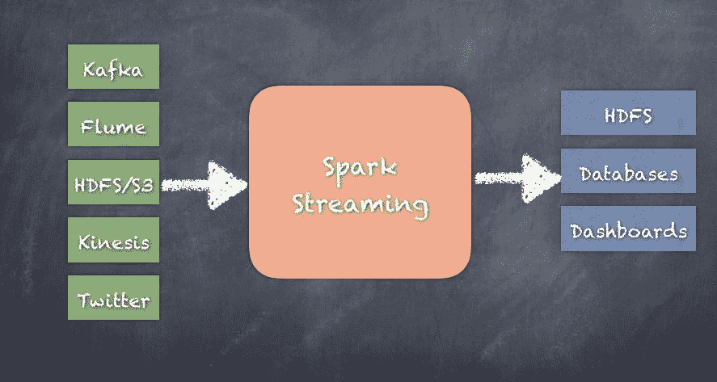
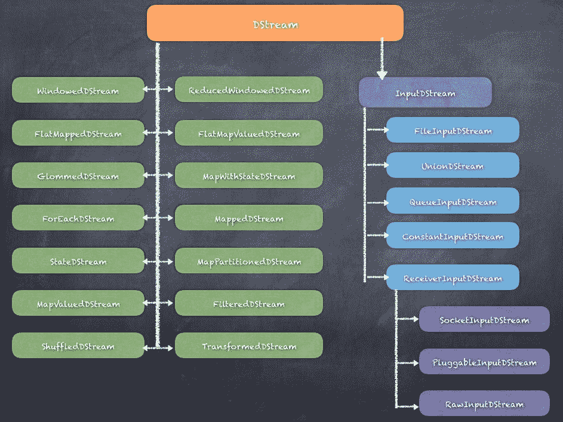
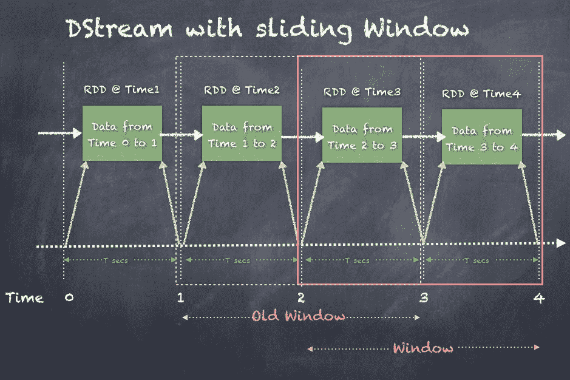
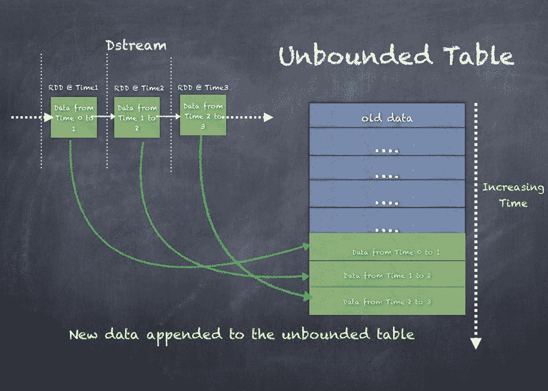

# 流我，斯科特-Spark流

*"I really like streaming services. It's a great way for people to find your music"*

- Kygo

 *在本章中，我们将学习Spark流，并了解如何利用它来使用Spark应用编程接口处理数据流。此外，在这一章中，我们将学习各种处理实时数据流的方法，使用一个实际的例子来消费和处理来自推特的推文。简而言之，本章将涵盖以下主题:

*   流媒体简介
*   Spark流
*   离散流
*   有状态/无状态转换
*   检查点
*   与流媒体平台的互操作性(Apache Kafka)
*   结构化流

# 流媒体简介

在如今这个设备和服务相互关联的世界里，如果没有我们的智能手机，你甚至很难每天花几个小时去看看脸书，或者去订一辆优步顺风车，或者在推特上发布一些关于你刚买的汉堡的消息，或者查看你最喜欢的球队的最新新闻或体育动态。我们依靠手机和互联网，做很多事情，无论是完成工作，还是只是浏览，或者给你的朋友发电子邮件。这种现象根本没有办法避免，应用程序和服务的数量和种类只会随着时间的推移而增长。

因此，智能设备无处不在，它们无时无刻不在产生大量数据。这种现象，也被广泛称为物联网，已经永远改变了数据处理的动态。每当你以某种形式使用 iPhone、Droid 或 Windows 手机上的任何服务或应用程序时，实时数据处理就会发挥作用。由于如此多的内容取决于应用程序的质量和价值，因此人们非常重视各种初创公司和老牌公司如何应对**服务级别协议** ( **服务级别协议**)的复杂挑战，以及数据的有用性和及时性。

组织和服务提供商正在研究和采用的范例之一是在非常尖端的平台或基础设施上构建非常可扩展、接近实时或实时的处理框架。一切都必须快速，并对变化和失败作出反应。如果你的脸书每小时更新一次，或者你每天只收到一封电子邮件，你不会喜欢的；因此，数据流、处理和使用都必须尽可能接近实时。我们感兴趣监控或实现的许多系统会生成大量的数据，作为不确定的连续事件流。

与任何其他数据处理系统一样，我们在数据收集、存储和数据处理方面面临着同样的基本挑战。然而，额外的复杂性是由于平台的实时需求。为了收集这种不确定的事件流，然后处理所有这种事件，以便产生可操作的见解，我们需要使用高度可扩展的专门架构来处理极高的事件率。因此，在过去的几十年里，从 AMQ、拉比兹、暴风、卡夫卡、Spark、弗林克、齿轮泵、Apex 等公司开始，已经建立了许多系统。

为处理如此大量的流数据而构建的现代系统具有非常灵活和可扩展的技术，这些技术不仅非常高效，而且有助于比以前更好地实现业务目标。使用这样的技术，可以使用来自各种数据源的数据，然后根据需要几乎立即或稍后在各种用例中使用它。

让我们来谈谈当你拿出智能手机，预定一辆优步汽车去机场时会发生什么。只需轻触智能手机屏幕，您就可以选择一个点，选择信用卡，进行支付，并预订旅程。一旦你完成交易，你就可以在手机上的地图上实时监控你的汽车进度。当汽车向你驶来时，你可以准确地监控汽车的位置，你也可以在等汽车来接你的时候，决定去当地的星巴克买咖啡。

您还可以通过查看汽车的预计到达时间，对汽车和随后的机场之旅做出明智的决定。如果这辆车看起来要花相当多的时间来接你，如果这会给你即将搭乘的航班带来风险，你可以取消行程，跳上刚好在附近的出租车。或者，如果碰巧交通状况不允许你准时到达机场，从而给你要赶的航班带来风险，那么你也可以决定重新安排或取消你的航班。

现在，为了理解这种实时流架构如何工作来提供如此宝贵的信息，我们需要理解流架构的基本原则。一方面，对于实时流体系结构来说，能够以非常高的速率消耗大量数据是非常重要的，另一方面，还要确保合理保证正在被摄取的数据也得到处理。

下图显示了一个通用的流处理系统，当消费者从消息系统中读取时，生产者将事件放入消息系统中:


实时流数据的处理可以分为以下三种基本模式:

*   至少一次加工
*   最多一次处理
*   一次加工

让我们看看这三个流处理范例对我们的业务用例意味着什么。虽然实时事件的一次处理对我们来说是最终的涅槃，但在不同的场景中很难总是达到这个目标。如果这种保证的好处超过了实现的复杂性，我们必须在一次处理的属性上妥协。

# 至少一次加工

至少一次处理范例涉及一种机制，该机制仅在事件被实际处理并且结果被保存在某处之后保存最后接收到的事件**的位置，使得如果出现故障并且消费者重启，消费者将再次读取旧事件并处理它们。然而，由于不能保证接收到的事件根本没有被处理或部分没有被处理，这导致了事件的潜在重复，因为它们被再次提取。这导致事件至少被处理一次的行为。**

理想情况下，至少一次适用于任何需要更新瞬时跑马灯或仪表以显示当前值的应用。任何累积总和、计数器或对聚合精度的依赖(`sum`、`groupBy`等)都不适合这种处理的用例，因为重复的事件会导致不正确的结果。

消费者的操作顺序如下:

1.  保存结果
2.  保存偏移量

下图显示了如果出现故障并且**用户**重新启动会发生什么。由于事件已经被处理，但是偏移量还没有被保存，消费者将从以前保存的偏移量中读取，从而导致重复。下图中事件 0 被处理了两次:



# 最多一次处理

“最多一次”处理范例涉及一种机制，用于保存在事件实际处理之前接收到的最后一个事件的位置，并将结果保存在某个地方，这样，如果出现故障并且消费者重新启动，消费者就不会再次尝试读取旧事件。然而，由于不能保证接收到的事件都被处理了，这导致事件的潜在丢失，因为它们再也不会被提取。这导致事件最多处理一次或根本不处理的行为。

最多一次非常适合任何需要更新瞬时跑马灯或仪表以显示当前值的应用程序，以及任何累计总和、计数器或其他聚合，前提是准确性不是强制性的，或者应用程序绝对需要所有事件。任何丢失的事件都会导致不正确的结果或丢失的结果。

消费者的操作顺序如下:

1.  保存偏移量
2.  保存结果

下图显示了如果出现故障并且**用户**重新启动会发生什么。由于事件尚未处理，但偏移已保存，消费者将从保存的偏移中读取，导致消耗的事件出现缺口。下图中从不处理事件 0:


# 一次加工

“恰好一次”处理范例类似于“至少一次”范例，并且涉及一种机制，该机制仅在事件实际被处理并且结果保存在某处之后保存最后接收到的事件的位置，这样，如果出现故障并且消费者重新启动，消费者将再次读取旧事件并处理它们。然而，由于不能保证接收到的事件根本没有被处理或被部分处理，这导致了事件的潜在重复，因为它们被再次提取。然而，与至少一次范例不同的是，重复的事件不会被处理，而是被丢弃，从而产生恰好一次范例。

精确一次处理范例适用于任何涉及精确计数器、聚合或者通常需要每个事件只处理一次并且肯定只处理一次(没有损失)的应用程序。

消费者的操作顺序如下:

1.  保存结果
2.  保存偏移量

下图显示了如果出现故障并且**消费者**重新启动会发生什么。由于事件已经被处理，但是偏移量还没有被保存，消费者将从以前保存的偏移量中读取，从而导致重复。事件 0 在下图中仅处理一次，因为**消费者**丢弃了重复的事件 0:


精确一次范例如何删除重复项？这里有两种技术可以提供帮助:

1.  幂等更新
2.  事务性更新

Spark Streaming also implements structured streaming in Spark 2.0+, which support Exactly once processing out of the box. We will look at structured streaming later in this chapter.

幂等更新包括基于生成的某个唯一标识/密钥保存结果，这样，如果有重复，生成的唯一标识/密钥将已经在结果中(例如，数据库)，这样消费者就可以删除重复，而无需更新结果。这很复杂，因为生成唯一密钥并不总是可能或容易的。它还需要消费者端的额外处理。另一点是，数据库可以将结果和偏移分开。

事务更新将结果保存在批处理中，批处理中有事务开始和事务提交阶段，这样，当提交发生时，我们就知道事件已成功处理。因此，当接收到重复的事件时，它们可以被丢弃而不更新结果。这种技术比幂等更新复杂得多，因为现在我们需要一些事务性数据存储。另一点是数据库的结果和偏移量必须相同。

You should look into the use case you're trying to build and see if at least once processing, or At most once processing, can be reasonably wide and still achieve an acceptable level of performance and accuracy.

在接下来的部分中，当我们了解Spark流以及如何使用Spark流和消费来自 Apache Kafka 的事件时，我们将密切关注范式。

# Spark流

Spark Streaming 并不是第一个出现的流架构。随着时间的推移，已经存在几种技术来处理各种业务用例的实时处理需求。推特风暴是最早流行的流处理技术之一，被许多组织用来满足许多企业的需求。

Apache Spark 附带了一个流库，它已经迅速发展成为使用最广泛的技术。与其他技术相比，Spark Streaming 有一些明显的优势，首先是 Spark Streaming APIs 和 Spark 核心 API 之间的紧密集成，使得构建一个双重用途的实时和批处理分析平台比其他方式更可行和高效。Spark Streaming 还集成了 Spark ML 和 Spark SQL，以及 GraphX，使其成为最强大的流处理技术，可以服务于许多独特而复杂的用例。在这一节中，我们将更深入地了解Spark流是关于什么的。

For more information on Spark Streaming, you can refer to [https://spark.apache.org/docs/2.1.0/streaming-programming-guide.html](https://spark.apache.org/docs/2.1.0/streaming-programming-guide.html).

Spark Streaming 支持多个输入源，并且可以将结果写入多个接收器。



虽然 Flink、Heron(Twitter Storm 的继任者)、Samza 等都在以最小的延迟收集事件时处理事件，但 Spark Streaming 消耗连续的数据流，然后以微批处理的形式处理收集的数据。微批次的大小可以低至 500 毫秒，但通常不能低于这个值。

Apache Apex, Gear pump, Flink, Samza, Heron, or other upcoming technologies compete with Spark Streaming in some use cases. If you need true event-by-event processing, then Spark Streaming is not the right fit for your use case.

流式传输的工作方式是根据配置以固定的时间间隔创建事件批次，并在每个指定的时间间隔传送微批次数据以供进一步处理。


就像`SparkContext,` Spark Streaming 有一个`StreamingContext`，是流作业/应用的主要入口点。`StreamingContext`是依赖`SparkContext`的。事实上，`SparkContext`可以直接用在流媒体作业中。`StreamingContext`与`SparkContext`类似，只是`StreamingContext`还要求程序指定配料间隔的时间间隔或持续时间，可以是毫秒或分钟。

Remember that `SparkContext` is the main point of entry, and the task scheduling and resource management is part of `SparkContext`, so `StreamingContext` reuses the logic.

# StreamingContext

`StreamingContext`是流的主要入口点，本质上负责流应用程序，包括检查点、转换和对 rdd 数据流的操作。

# 创建流上下文

可以通过两种方式创建新的流上下文:

1.  使用现有的`SparkContext`创建`StreamingContext`，如下所示:

```scala
 StreamingContext(sparkContext: SparkContext, batchDuration: Duration) scala> val ssc = new StreamingContext(sc, Seconds(10))

```

2.  通过提供新的`SparkContext`所需的配置来创建`StreamingContext`，如下所示:

```scala
 StreamingContext(conf: SparkConf, batchDuration: Duration) scala> val conf = new SparkConf().setMaster("local[1]").setAppName("TextStreams")scala> val ssc = new StreamingContext(conf, Seconds(10))

```

3.  第三种方法是使用`getOrCreate()`，该方法用于根据检查点数据重新创建一个`StreamingContext`或者创建一个新的`StreamingContext`。如果所提供的`checkpointPath`中存在检查点数据，则将从检查点数据中重新创建`StreamingContext`。如果数据不存在，则调用提供的`creatingFunc`创建`StreamingContext`:

```scala
        def getOrCreate(checkpointPath: String,creatingFunc: () => StreamingContext,hadoopConf: Configuration = SparkHadoopUtil.get.conf,createOnError: Boolean = false): StreamingContext

```

# 开始流上下文

`start()`方法开始执行使用`StreamingContext`定义的流。这实际上启动了整个流应用程序:

```scala
def start(): Unit scala> ssc.start()

```

# 停止流上下文

停止`StreamingContext`会停止所有处理，您必须重新创建一个新的`StreamingContext`并在其上调用`start()`来重新启动应用程序。有两种 API 可用于停止流处理应用程序。

立即停止流的执行(不要等待所有接收的数据被处理):

```scala
def stop(stopSparkContext: Boolean)scala> ssc.stop(false)

```

停止流的执行，可以选择确保所有接收到的数据都已被处理:

```scala
def stop(stopSparkContext: Boolean, stopGracefully: Boolean)scala> ssc.stop(true, true)

```

# 输入流

有几种类型的输入流，如`receiverStream`和`fileStream`，可以使用`StreamingContext`创建，如下小节所示:

# 接收流

使用任意用户实现的接收器创建输入流。它可以定制以满足用例。

Find more details at [http://spark.apache.org/docs/latest/streaming-custom-receivers.html](http://spark.apache.org/docs/latest/streaming-custom-receivers.html).

以下是`receiverStream`的应用编程接口声明:

```scala
 def receiverStream[T: ClassTag](receiver: Receiver[T]): ReceiverInputDStream[T]

```

# socketTextStream

这将从 TCP 源`hostname:port`创建一个输入流。使用 TCP 套接字接收数据，接收的字节被解释为 UTF8 编码的`\n`分隔行:

```scala
def socketTextStream(hostname: String, port: Int, storageLevel: StorageLevel = StorageLevel.MEMORY_AND_DISK_SER_2):ReceiverInputDStream[String]

```

# rawSocketStream

从网络源`hostname:port`创建一个输入流，在这里数据作为序列化的块(使用 Spark 的序列化器序列化)被接收，这些块可以直接推入块管理器，而无需反序列化它们。这是接收数据最有效的方式。

```scala
def rawSocketStream[T: ClassTag](hostname: String, port: Int, storageLevel: StorageLevel = StorageLevel.MEMORY_AND_DISK_SER_2):ReceiverInputDStream[T]

```

# fileStream

创建一个输入流，监视 Hadoop 兼容文件系统中的新文件，并使用给定的键值类型和输入格式读取它们。必须通过将文件从同一文件系统中的另一个位置移动来将它们写入受监控的目录。以点(`.`)开头的文件名会被忽略，因此这对于监控目录中的移动文件名来说是一个显而易见的选择。使用原子文件重命名函数调用，以`.`开头的文件名现在可以被重命名为实际可用的文件名，这样`fileStream`就可以提取它并让我们处理文件内容:

```scala
def fileStream[K: ClassTag, V: ClassTag, F <: NewInputFormat[K, V]: ClassTag] (directory: String): InputDStream[(K, V)]

```

# 文本文件流

创建一个输入流，监视 Hadoop 兼容文件系统中的新文件，并将它们作为文本文件读取(使用键作为`LongWritable`，值作为文本，输入格式作为`TextInputFormat`)。必须通过将文件从同一文件系统中的另一个位置移动来将它们写入受监控的目录。文件名以。被忽略:

```scala
def textFileStream(directory: String): DStream[String]

```

# 二进制记录流

创建一个输入流，监视 Hadoop 兼容文件系统中的新文件，并将它们作为平面二进制文件读取，假设每条记录的长度固定，每条记录生成一个字节数组。必须通过将文件从同一文件系统中的另一个位置移动来将它们写入受监控的目录。以`.`开头的文件名被忽略:

```scala
def binaryRecordsStream(directory: String, recordLength: Int): DStream[Array[Byte]]

```

# queueStream

从 rdd 队列中创建输入流。在每个批处理中，它将处理队列返回的一个或所有 rdd:

```scala
def queueStream[T: ClassTag](queue: Queue[RDD[T]], oneAtATime: Boolean = true): InputDStream[T]

```

# 文本文件流示例

下面显示了一个使用`textFileStream`的Spark流的简单示例。在这个例子中，我们从Spark壳`SparkContext` ( `sc`)创建一个`StreamingContext`，间隔 10 秒。这将启动`textFileStream`，它监控名为**流文件**的目录，并处理在该目录中找到的任何新文件。在本例中，我们只是打印 RDD 元素的数量:

```scala
scala> import org.apache.spark._scala> import org.apache.spark.streaming._scala> val ssc = new StreamingContext(sc, Seconds(10))scala> val filestream = ssc.textFileStream("streamfiles")scala> filestream.foreachRDD(rdd => {println(rdd.count())})scala> ssc.start

```

# twitterStream 示例

让我们看看另一个例子，我们如何使用 Spark Streaming 处理来自 Twitter 的推文:

1.  首先，打开一个终端，将目录改为`spark-2.1.1-bin-hadoop2.7`。
2.  在安装了 spark 的`spark-2.1.1-bin-hadoop2.7`文件夹下创建一个文件夹`streamouts`。当应用程序运行时，`streamouts`文件夹将已收集的推文转换为文本文件。

3.  将以下 jar 下载到目录中:
    *   [http://central . maven . org/maven 2/org/Apache/bahir/spark-streaming-Twitter _ 2.11/2 . 1 . 0/spark-streaming-Twitter _ 2.11-2 . 1 . 0 . jar](http://central.maven.org/maven2/org/apache/bahir/spark-streaming-twitter_2.11/2.1.0/spark-streaming-twitter_2.11-2.1.0.jar)
    *   [http://central . maven . org/maven 2/org/twiter 4j/twiter 4j-core/4 . 0 . 6/twiter 4j-core-4 . 0 . 6 . jar](http://central.maven.org/maven2/org/twitter4j/twitter4j-core/4.0.6/twitter4j-core-4.0.6.jar)
    *   [http://central . maven . org/maven 2/org/twiter 4j/twiter 4j-stream/4 . 0 . 6/twiter 4j-stream-4 . 0 . 6 . jar](http://central.maven.org/maven2/org/twitter4j/twitter4j-stream/4.0.6/twitter4j-stream-4.0.6.jar)

4.  使用指定的 Twitter 集成所需的 jars 启动 spark-shell:

```scala
 ./bin/spark-shell --jars twitter4j-stream-4.0.6.jar,twitter4j-core-4.0.6.jar,spark-streaming-twitter_2.11-2.1.0.jar

```

5.  现在，我们可以编写一个示例代码。下面显示了测试 Twitter 事件处理的代码:

```scala
        import org.apache.spark._import org.apache.spark.streaming._import org.apache.spark.streaming.Twitter._import twitter4j.auth.OAuthAuthorizationimport twitter4j.conf.ConfigurationBuilder//you can replace the next 4 settings with your own Twitteraccount settings.System.setProperty("twitter4j.oauth.consumerKey","8wVysSpBc0LGzbwKMRh8hldSm") System.setProperty("twitter4j.oauth.consumerSecret","FpV5MUDWliR6sInqIYIdkKMQEKaAUHdGJkEb4MVhDkh7dXtXPZ") System.setProperty("twitter4j.oauth.accessToken","817207925756358656-yR0JR92VBdA2rBbgJaF7PYREbiV8VZq") System.setProperty("twitter4j.oauth.accessTokenSecret","JsiVkUItwWCGyOLQEtnRpEhbXyZS9jNSzcMtycn68aBaS")val ssc = new StreamingContext(sc, Seconds(10))val twitterStream = TwitterUtils.createStream(ssc, None)twitterStream.saveAsTextFiles("streamouts/tweets", "txt")ssc.start()//wait for 30 secondsss.stop(false)

```

你会看到`streamouts`文件夹中包含了几个`tweets`输出的文本文件。您现在可以打开目录`streamouts`并检查文件是否包含`tweets`。

# 离散流

Spark流建立在一个被称为**离散流**的抽象之上，被称为**数据流**。数据流表示为一系列 RDD，在每个时间间隔创建每个 RDD。可以使用类似的概念，如基于有向循环图的执行计划(有向无环图)，以类似于常规关系数据库的方式处理数据流。就像常规的 RDD 处理一样，作为执行计划一部分的转换和动作是为数据流处理的。

数据流本质上是根据时间间隔将一个永不结束的数据流划分为称为微批处理的更小的块，将每个单独的微批处理具体化为一个 RDD，然后可以作为一个常规的 RDD 进行处理。每个这样的微批次都是独立处理的，并且微批次之间不保持任何状态，因此处理本质上是无状态的。假设批处理时间间隔为 5 秒，那么在消耗事件的同时，每隔 5 秒钟就会创建一个实时批处理和一个微批处理，该微批处理将作为 RDD 进行进一步处理。Spark Streaming 的一个主要优点是，用于处理微批处理事件的 API 调用非常紧密地集成到 Spark 中，以便 API 提供与架构其余部分的无缝集成。当一个小批量被创建时，它会变成一个 RDD，这使得它成为一个使用 spark APIs 的无缝过程。

`DStream`类在源代码中看起来像下面这样，显示了最重要的变量，一个`HashMap[Time, RDD]`对:

```scala
class DStream[T: ClassTag] (var ssc: StreamingContext)//hashmap of RDDs in the DStreamvar generatedRDDs = new HashMap[Time, RDD[T]]()

```

下图显示了一个数据流，其中包含每 **T** 秒创建的一个 RDD:


在下面的示例中，创建了一个流上下文，以每 5 秒创建一个微批次，并创建一个 RDD，这就像一个 Spark 核心 API RDD。数据流中的 RDD 可以像任何其他 RDD 一样进行处理。

构建流应用程序的步骤如下:

1.  从`SparkContext`创建一个`StreamingContext`。
2.  从`StreamingContext`创建`DStream`。
3.  提供适用于每个 RDD 的转换和操作。
4.  最后，通过调用`StreamingContext`上的`start()`启动流媒体应用。这将启动消费和处理实时事件的整个过程。

Once the Spark Streaming application has started, no further operations can be added. A stopped context cannot be restarted and you have to create a new streaming context if such a need arises.

下面显示了一个如何创建访问 Twitter 的简单流作业的示例:

1.  从`SparkContext`创建一个`StreamingContext`:

```scala
 scala> val ssc = new StreamingContext(sc, Seconds(5))ssc: org.apache.spark.streaming.StreamingContext =         org.apache.spark.streaming.StreamingContext@8ea5756

```

2.  从`StreamingContext`创建`DStream`:

```scala
 scala> val twitterStream = TwitterUtils.createStream(ssc, None)twitterStream: org.apache.spark.streaming.dstream .ReceiverInputDStream[twitter4j.Status] =      org.apache.spark.streaming.Twitter.TwitterInputDStream@46219d14

```

3.  提供适用于每个 RDD 的转换和操作:

```scala
 val aggStream = twitterStream .flatMap(x => x.getText.split(" ")).filter(_.startsWith("#")) .map(x => (x, 1)) .reduceByKey(_ + _)

```

4.  最后，通过调用`StreamingContext`上的`start()`启动流媒体应用。这将启动消耗和处理实时事件的整个过程:

```scala
 ssc.start()      //to stop just call stop on the StreamingContext ssc.stop(false)

```

5.  创建了类型为`ReceiverInputDStream`的`DStream`，它被定义为一个抽象类，用于定义任何需要在工作节点上启动接收器来接收外部数据的`InputDStream`。在这里，我们从推特流接收到:

```scala
        class InputDStream[T: ClassTag](_ssc: StreamingContext) extendsDStream[T](_ssc)class ReceiverInputDStream[T: ClassTag](_ssc: StreamingContext)extends InputDStream[T](_ssc)

```

6.  如果在`twitterStream`上运行一个变换`flatMap()`，会得到一个`FlatMappedDStream`，如下图所示:

```scala
 scala> val wordStream = twitterStream.flatMap(x => x.getText().split(" "))wordStream: org.apache.spark.streaming.dstream.DStream[String] =       org.apache.spark.streaming.dstream.FlatMappedDStream@1ed2dbd5

```

# 转换

数据流上的转换类似于适用于Spark核心 RDD 的转换。由于数据流由 RDD 组成，因此转换也适用于每个 RDD，为 RDD 生成转换后的 RDD，然后创建转换后的数据流。每次转换都会创建一个特定的`DStream`派生类。

下图显示了从父级`DStream`类开始的`DStream`类的层次结构。我们还可以看到继承自父类的不同类:



有很多`DStream`类是专门为功能而构建的。映射转换、窗口函数、缩减动作和不同类型的输入流都是使用从`DStream`类派生的不同类来实现的。

下图显示了在基本数据流上生成过滤数据流的转换。同样，任何转换都适用于数据流:


有关可能的转换类型，请参考下表。

| 转换 | 意义 |
| `map(func)` | 这会将转换函数应用于数据流的每个元素，并返回一个新的数据流。 |
| `flatMap(func)` | 这类似于地图；然而，就像 RDD 的`flatMap`对地图一样，使用`flatMap`对每个元素进行操作并应用`flatMap`，每个输入产生多个输出项。 |
| `filter(func)` | 这将过滤掉数据流的记录，以返回新的数据流。 |
| `repartition(numPartitions)` | 这会创建更多或更少的分区来重新分布数据，从而改变并行度。 |
| `union(otherStream)` | 这将合并两个源数据流中的元素，并返回一个新的数据流。 |
| `count()` | 这将通过计算源数据流的每个 RDD 中的元素数量来返回一个新的数据流。 |
| `reduce(func)` | 通过对源数据流的每个元素应用`reduce`函数，这将返回一个新的数据流。 |
| `countByValue()` | 这会计算每个键的频率，并返回一个新的(键，长)对数据流。 |
| `reduceByKey(func, [numTasks])` | 这将在源数据流的 RDDs 中按键聚合数据，并返回一个新的(键、值)对数据流。 |
| `join(otherStream, [numTasks])` | 这将连接两个数据流 *(K，V)* 和 *(K，W)* 对，并返回一个新的数据流 *(K，(V，W))* 对，组合来自两个数据流的值。 |
| `cogroup(otherStream, [numTasks])` | `cogroup()`在 *(K，V)* 和 *(K，W)* 对的数据流上调用时，将返回新的 *(K，Seq[V]，Seq[W])* 元组的数据流。 |
| `transform(func)` | 这将对源数据流的每个 RDD 应用一个转换函数，并返回一个新的数据流。 |
| `updateStateByKey(func)` | 这通过将给定函数应用于键的先前状态和键的新值来更新每个键的状态。通常，它用于维护状态机。 |

# 窗口操作

Spark流提供窗口处理，允许您在滑动事件窗口上应用转换。滑动窗口在指定的时间间隔内创建。每次窗口滑过一个源数据流时，属于窗口规范范围内的源数据流将被合并和操作以生成窗口数据流。需要为窗口指定两个参数:

*   **窗口长度:指定被认为是窗口的间隔长度**
*   滑动间隔:这是创建窗口的间隔

The window length and the sliding interval must both be a multiple of the block interval.

下图显示了带有滑动窗口操作的数据流，显示了旧窗口(虚线矩形)如何向右滑动一个间隔进入新窗口(实线矩形):



一些常见的窗口操作如下。

| 转换 | 意义 |
| `window(windowLength, slideInterval)` | 这将在源数据流上创建一个窗口，并返回与新数据流相同的内容。 |
| `countByWindow(windowLength, slideInterval)` | 这通过应用滑动窗口返回数据流中的元素计数。 |
| `reduceByWindow(func, windowLength, slideInterval)` | 在创建长度为`windowLength`的滑动窗口后，通过对源数据流的每个元素应用 reduce 函数，这将返回一个新的数据流。 |
| `reduceByKeyAndWindow(func, windowLength, slideInterval, [numTasks])` | 这将在应用于源数据流 RDDs 的窗口中按键聚合数据，并返回一个新的(键、值)对数据流。计算由函数`func`提供。 |
| `reduceByKeyAndWindow(func, invFunc, windowLength, slideInterval, [numTasks])` | 这将在应用于源数据流 RDDs 的窗口中按键聚合数据，并返回一个新的(键、值)对数据流。前一个函数和这个函数的关键区别是`invFunc`，它提供了在滑动窗口开始时要进行的计算。 |
| `countByValueAndWindow(windowLength, slideInterval, [numTasks])` | 这会计算每个键的频率，并在指定的滑动窗口内返回一个新的(键，长)对数据流。 |

让我们更详细地看看推特流的例子。我们的目标是每 5 秒打印一次推文中使用的前五个单词，使用一个 15 秒长的窗口，每 10 秒滑动一次。因此，我们可以在 15 秒内获得前五个单词。

要运行此代码，请按照下列步骤操作:

1.  首先，打开一个终端，将目录改为`spark-2.1.1-bin-hadoop2.7`。
2.  在安装了 spark 的`spark-2.1.1-bin-hadoop2.7`文件夹下创建一个文件夹`streamouts`。当应用程序运行时，`streamouts`文件夹会将推文收集到文本文件中。
3.  将以下 jar 下载到目录中:
    *   [http://central . maven . org/maven 2/org/Apache/bahir/spark-streaming-Twitter _ 2.11/2 . 1 . 0/spark-streaming-Twitter _ 2.11-2 . 1 . 0 . jar](http://central.maven.org/maven2/org/apache/bahir/spark-streaming-twitter_2.11/2.1.0/spark-streaming-twitter_2.11-2.1.0.jar)
    *   [http://central . maven . org/maven 2/org/twiter 4j/twiter 4j-core/4 . 0 . 6/twiter 4j-core-4 . 0 . 6 . jar](http://central.maven.org/maven2/org/twitter4j/twitter4j-core/4.0.6/twitter4j-core-4.0.6.jar)
    *   [http://central . maven . org/maven 2/org/twiter 4j/twiter 4j-stream/4 . 0 . 6/twiter 4j-stream-4 . 0 . 6 . jar](http://central.maven.org/maven2/org/twitter4j/twitter4j-stream/4.0.6/twitter4j-stream-4.0.6.jar)
4.  使用指定的 Twitter 集成所需的 jars 启动 spark-shell:

```scala
 ./bin/spark-shell --jars twitter4j-stream-4.0.6.jar,twitter4j-core-4.0.6.jar,spark-streaming-twitter_2.11-2.1.0.jar

```

5.  现在，我们可以编写代码了。下面显示了用于测试 Twitter 事件处理的代码:

```scala
        import org.apache.log4j.Loggerimport org.apache.log4j.LevelLogger.getLogger("org").setLevel(Level.OFF)import java.util.Dateimport org.apache.spark._import org.apache.spark.streaming._import org.apache.spark.streaming.Twitter._import twitter4j.auth.OAuthAuthorizationimport twitter4j.conf.ConfigurationBuilderSystem.setProperty("twitter4j.oauth.consumerKey","8wVysSpBc0LGzbwKMRh8hldSm")System.setProperty("twitter4j.oauth.consumerSecret","FpV5MUDWliR6sInqIYIdkKMQEKaAUHdGJkEb4MVhDkh7dXtXPZ")System.setProperty("twitter4j.oauth.accessToken","817207925756358656-yR0JR92VBdA2rBbgJaF7PYREbiV8VZq")System.setProperty("twitter4j.oauth.accessTokenSecret","JsiVkUItwWCGyOLQEtnRpEhbXyZS9jNSzcMtycn68aBaS")val ssc = new StreamingContext(sc, Seconds(5))val twitterStream = TwitterUtils.createStream(ssc, None)val aggStream = twitterStream.flatMap(x => x.getText.split(" ")).filter(_.startsWith("#")).map(x => (x, 1)).reduceByKeyAndWindow(_ + _, _ - _, Seconds(15),Seconds(10), 5)ssc.checkpoint("checkpoints")aggStream.checkpoint(Seconds(10))aggStream.foreachRDD((rdd, time) => {val count = rdd.count()if (count > 0) {val dt = new Date(time.milliseconds)println(s"\n\n$dt rddCount = $count\nTop 5 words\n")val top5 = rdd.sortBy(_._2, ascending = false).take(5)top5.foreach {case (word, count) =>println(s"[$word] - $count")}}})ssc.start//wait 60 secondsss.stop(false)

```

6.  输出每 15 秒钟在控制台上显示一次，如下所示:

```scala
 Mon May 29 02:44:50 EDT 2017 rddCount = 1453 Top 5 words [#RT] - 64 [#de] - 24 [#a] - 15 [#to] - 15 [#the] - 13 Mon May 29 02:45:00 EDT 2017 rddCount = 3312 Top 5 words [#RT] - 161 [#df] - 47 [#a] - 35 [#the] - 29 [#to] - 29
```

# 有状态/无状态转换

如前所述，Spark Streaming 使用了数据流的概念，数据流本质上是作为 rdd 创建的微批量数据。我们还看到了数据流上可能的转换类型。数据流上的转换可以分为两种类型:**无状态转换**和**状态转换。**

在无状态转换中，每一个小批量数据的处理不依赖于之前的批量数据。因此，这是一个无状态转换，每个批处理都独立于该批处理之前发生的任何事情进行自己的处理。

在有状态转换中，每一个小批量数据的处理都完全或部分依赖于前一批数据。因此，这是一个有状态的转换，每个批处理考虑在这个批处理之前发生了什么，然后在计算这个批处理中的数据时使用这些信息。

# 无状态转换

无状态转换通过对数据流中的每个关系数据库应用转换，将数据流转换为另一个数据流。像`map()`、`flatMap()`、`union()`、`join()`和`reduceByKey`这样的转换都是无状态转换的例子。

下图显示了在`inputDStream`上的`map()`变换，以生成新的`mapDstream`:


# 有状态转换

有状态转换在数据流上运行，但是计算取决于先前的处理状态。像`countByValueAndWindow`、`reduceByKeyAndWindow`、`mapWithState`和`updateStateByKey`这样的操作都是有状态转换的例子。事实上，所有基于窗口的转换都是有状态的，因为根据窗口操作的定义，我们需要跟踪 DStream 的窗口长度和滑动间隔。

# 检查点

实时流应用程序应该是长时间运行的，并且能够抵御各种故障。Spark Streaming 实现了一个检查点机制，该机制维护了足够的信息来从故障中恢复。

有两种类型的数据需要检查:

*   元数据检查点
*   数据检查点

通过调用`StreamingContext`上的`checkpoint()`功能可以启用检查点，如下所示:

```scala
def checkpoint(directory: String)
```

 **指定将可靠存储检查点数据的目录。

Note that this must be a fault-tolerant file system like HDFS.

一旦设置了检查点目录，任何数据流都可以根据指定的时间间隔检查点到目录中。看看推特的例子，我们可以每 10 秒检查一次每个数据流进入目录`checkpoints`:

```scala
val ssc = new StreamingContext(sc, Seconds(5))val twitterStream = TwitterUtils.createStream(ssc, None)val wordStream = twitterStream.flatMap(x => x.getText().split(" "))val aggStream = twitterStream.flatMap(x => x.getText.split(" ")).filter(_.startsWith("#")).map(x => (x, 1)).reduceByKeyAndWindow(_ + _, _ - _, Seconds(15), Seconds(10), 5)ssc.checkpoint("checkpoints")aggStream.checkpoint(Seconds(10))wordStream.checkpoint(Seconds(10))

```

几秒钟后`checkpoints`目录看起来如下，显示了元数据以及 RDDs，并且`logfiles`作为检查点的一部分被维护:


# 元数据检查点

**元数据检查点**保存定义流操作的信息，这些信息由到 HDFS 的**有向无环图** ( **DAG** )表示。如果出现故障并且应用程序重新启动，这可用于恢复 DAG。驱动程序重新启动并从 HDFS 读取元数据，重建 DAG 并恢复崩溃前的所有操作状态。

元数据包括以下内容:

*   **配置**:用于创建流应用程序的配置
*   **数据流操作**:定义流应用的一组数据流操作
*   **未完成批次**:作业已排队但尚未完成的批次

# 数据检查点

数据检查点将实际的 rdd 保存到 HDFS，这样，如果 Streaming 应用程序出现故障，应用程序可以恢复检查点的 rdd，并从停止的地方继续。虽然流应用程序恢复是数据检查点的一个很好的用例，但检查点也有助于在某些 rdd 由于缓存清理或执行器丢失而丢失时获得更好的性能，方法是实例化生成的 rdd，而不需要等待谱系(DAG)中的所有父 rdd 被重新计算。

必须为具有以下任何要求的应用程序启用检查点:

*   **状态转换**的用法:如果应用程序中使用了`updateStateByKey`或`reduceByKeyAndWindow`(带反函数)，则必须提供检查点目录以允许定期的 RDD 检查点。
*   **从运行应用程序的驱动程序故障中恢复**:元数据检查点用于恢复进度信息。

如果您的流应用程序没有状态转换，那么应用程序可以在不启用检查点的情况下运行。

There might be loss of data received but not processed yet in your streaming application.

请注意，RDD 的检查点会产生将每个 RDD 保存到存储的成本。这可能会导致 rdd 被检查点的那些批次的处理时间增加。因此，需要仔细设置检查点的间隔，以免引起性能问题。在小批量情况下(比如 1 秒)，过于频繁地检查每个小批量可能会显著降低操作吞吐量。相反，检查点过于频繁会导致沿袭和任务大小增加，这可能会导致处理延迟，因为要持久化的数据量很大。

对于需要 RDD 检查点的状态转换，默认时间间隔是批处理时间间隔的倍数，至少为 10 秒。

A checkpoint interval of 5 to 10 sliding intervals of a DStream is a good setting to start with.

# 驱动程序故障恢复

驱动程序故障恢复可以通过使用`StreamingContext.getOrCreate()`从现有检查点初始化`StreamingContext`或创建新的流上下文来完成。

流媒体应用程序启动时的两个条件如下:

*   当程序第一次启动时，需要新建一个`StreamingContext`，设置好所有的流，然后调用`start()`
*   当程序在失败后重新启动时，需要从检查点目录中的检查点数据初始化一个`StreamingContext`，然后调用`start()`

我们将实现一个函数`createStreamContext()`，该函数创建`StreamingContext`，并设置各种数据流来解析推文，并使用一个窗口每 15 秒生成前五个推文标签。但是我们将调用`getOrCreate()`而不是调用`createStreamContext(`，然后调用`ssc.start()`，这样如果`checkpointDirectory`存在，那么上下文将从检查点数据中重新创建。如果目录不存在(应用程序是第一次运行)，那么将调用函数`createStreamContext()`创建一个新的上下文并设置数据流:

```scala
val ssc = StreamingContext.getOrCreate(checkpointDirectory,createStreamContext _)

```

下面显示的代码显示了函数的定义以及如何调用`getOrCreate()`:

```scala
val checkpointDirectory = "checkpoints"// Function to create and setup a new StreamingContextdef createStreamContext(): StreamingContext = {val ssc = new StreamingContext(sc, Seconds(5))val twitterStream = TwitterUtils.createStream(ssc, None)val wordStream = twitterStream.flatMap(x => x.getText().split(" "))val aggStream = twitterStream.flatMap(x => x.getText.split(" ")).filter(_.startsWith("#")).map(x => (x, 1)).reduceByKeyAndWindow(_ + _, _ - _, Seconds(15), Seconds(10), 5)ssc.checkpoint(checkpointDirectory)aggStream.checkpoint(Seconds(10))wordStream.checkpoint(Seconds(10))aggStream.foreachRDD((rdd, time) => {val count = rdd.count()if (count > 0) {val dt = new Date(time.milliseconds)println(s"\n\n$dt rddCount = $count\nTop 5 words\n")val top10 = rdd.sortBy(_._2, ascending = false).take(5)top10.foreach {case (word, count) => println(s"[$word] - $count")}}})ssc}// Get StreamingContext from checkpoint data or create a new oneval ssc = StreamingContext.getOrCreate(checkpointDirectory, createStreamContext _)

```

# 与流媒体平台的互操作性(Apache Kafka)

Spark Streaming 与目前最流行的消息平台 Apache Kafka 有非常好的集成。Kafka 集成有几种方法，该机制随着时间的推移不断发展，以提高性能和可靠性。

将Spark流与卡夫卡相结合有三种主要方法:

*   基于接收者的方法
*   直接流方法
*   结构化流

# 基于接收者的方法

基于接收者的方法是 Spark 和 Kafka 之间的第一次整合。在这种方法中，驱动程序启动执行器上的接收器，这些接收器使用来自卡夫卡代理的高级 API 来提取数据。由于接收者正在从卡夫卡经纪人那里提取事件，接收者将偏移量更新到动物园管理员中，这也是卡夫卡集群所使用的。关键的方面是使用 **WAL** ( **提前写日志**)，接收器在使用卡夫卡的数据时会不断向其写入。因此，当出现问题，执行器或接收器丢失或重新启动时，可以使用 WAL 来恢复事件并处理它们。因此，这种基于日志的设计提供了耐用性和一致性。

每个接收者从卡夫卡主题创建一个事件输入数据流，同时向动物园管理员查询卡夫卡主题、经纪人、偏移量等等。在这之后，我们在前面几节中关于数据流的讨论就开始了。

长时间运行的接收器使并行变得复杂，因为当我们扩展应用程序时，工作负载不会被正确分配。对 HDFS 的依赖以及写操作的重复也是一个问题。至于一次处理范例所需要的可靠性，只有幂等方法会起作用。事务性方法不能在基于接收者的方法中工作的原因是，没有办法从 HDFS 位置或 Zookeeper 访问偏移范围。

The receiver-based approach works with any messaging system, so it's more general purpose.

您可以通过调用`createStream()`应用编程接口来创建基于接收器的流，如下所示:

```scala
def createStream( ssc: StreamingContext, // StreamingContext object zkQuorum: String, //Zookeeper quorum (hostname:port,hostname:port,..) groupId: String, //The group id for this consumer topics: Map[String, Int], //Map of (topic_name to numPartitions) toconsume. Each partition is consumed in its own thread storageLevel: StorageLevel = StorageLevel.MEMORY_AND_DISK_SER_2 Storage level to use for storing the received objects(default: StorageLevel.MEMORY_AND_DISK_SER_2)): ReceiverInputDStream[(String, String)] //DStream of (Kafka message key, Kafka message value)

```

下面显示了一个创建基于接收者的流的示例，该流从卡夫卡经纪人那里提取消息:

```scala
val topicMap = topics.split(",").map((_, numThreads.toInt)).toMapval lines = KafkaUtils.createStream(ssc, zkQuorum, group,topicMap).map(_._2)

```

下图显示了驱动程序如何在执行器上启动接收器，以使用高级应用编程接口从卡夫卡那里获取数据。接收者从 Kafka Zookeeper 集群中提取主题偏移范围，然后在从代理中提取事件时更新 Zookeeper:


# 直接流

基于直接流的方法是 Kafka 集成的较新方法，通过使用驱动程序直接连接到代理并拉事件来工作。关键的方面是，使用直接流 API，当查看 spark 分区与 Kafka 主题/分区时，Spark 任务以 1:1 的比例工作。不依赖 HDFS 或沃尔玛使其变得灵活。此外，由于现在我们可以直接访问偏移量，我们可以使用幂等或事务方法进行一次处理。

创建一个输入流，直接从卡夫卡经纪人那里提取消息，而不使用任何接收器。这个流可以保证来自卡夫卡的每条消息都被包含在一次转换中。

直接流的属性如下:

*   **无接收器**:这个流不使用任何接收器，而是直接查询卡夫卡。
*   **偏移量**:这个不使用 Zookeeper 存储偏移量，消耗的偏移量由流本身跟踪。您可以从生成的 rdd 中访问每个批次中使用的偏移量。
*   **故障恢复**:要从驱动程序故障中恢复，您必须在`StreamingContext`中启用检查点。
*   **端到端语义**:该流确保每条记录都被有效接收并准确转换一次，但不保证转换后的数据是否准确输出一次。

您可以使用 KafkaUtils`createDirectStream()`应用编程接口创建一个直接流，如下所示:

```scala
def createDirectStream[ K: ClassTag, //K type of Kafka message key V: ClassTag, //V type of Kafka message value KD <: Decoder[K]: ClassTag, //KD type of Kafka message key decoder VD <: Decoder[V]: ClassTag, //VD type of Kafka message value decoder R: ClassTag //R type returned by messageHandler]( ssc: StreamingContext, //StreamingContext object KafkaParams: Map[String, String], /*KafkaParams Kafka <a  href="http://Kafka.apache.org/documentation.html#configuration">configuration parameters</a>. Requires "metadata.broker.list" or   "bootstrap.servers"to be set with Kafka broker(s) (NOT zookeeper servers) specified inhost1:port1,host2:port2 form.*/ fromOffsets: Map[TopicAndPartition, Long], //fromOffsets Per- topic/partition Kafka offsets defining the (inclusive) starting point of the stream messageHandler: MessageAndMetadata[K, V] => R //messageHandler Function for translating each message and metadata into the desired type): InputDStream[R] //DStream of R
```

下面显示了一个直接流的示例，创建该流是为了从卡夫卡主题中提取数据并创建数据流:

```scala
val topicsSet = topics.split(",").toSetval KafkaParams : Map[String, String] =Map("metadata.broker.list" -> brokers,"group.id" -> groupid )val rawDstream = KafkaUtils.createDirectStream[String, String, StringDecoder, StringDecoder](ssc, KafkaParams, topicsSet)

```

The direct stream API can only be used with Kafka, so this is not a general purpose approach.

下图显示了驱动程序如何从 Zookeeper 中提取偏移信息，并根据驱动程序规定的偏移范围指示执行器启动任务从代理中提取事件:


# 结构化流

结构化流在 Apache Spark 2.0+中是新的，现在从 Spark 2.2 版本开始在 GA 中使用。您将在下一节看到详细信息以及如何使用结构化流的示例。

For more details on the Kafka integration in structured streaming, refer to [https://spark.apache.org/docs/latest/structured-streaming-kafka-integration.html](https://spark.apache.org/docs/latest/structured-streaming-kafka-integration.html).

如何在结构化流中使用卡夫卡源流的一个例子如下:

```scala
val ds1 = spark.readStream.format("Kafka").option("Kafka.bootstrap.servers", "host1:port1,host2:port2").option("subscribe", "topic1").load()ds1.selectExpr("CAST(key AS STRING)", "CAST(value AS STRING)").as[(String, String)]

```

下面是一个如何使用 Kafka source 而不是 source stream(如果您想要更多的批处理分析方法)的示例:

```scala
val ds1 = spark.read.format("Kafka").option("Kafka.bootstrap.servers", "host1:port1,host2:port2").option("subscribe", "topic1").load()ds1.selectExpr("CAST(key AS STRING)", "CAST(value AS STRING)").as[(String, String)]

```

# 结构化流

结构化流是建立在 Spark SQL 引擎之上的可扩展的容错流处理引擎。这使得流处理和计算更接近于批处理，而不是现在 Spark 流 API 所涉及的数据流范例和挑战。结构化流引擎解决了几个挑战，如一次性流处理、处理结果的增量更新、聚合等。

结构化流应用编程接口还提供了应对 Spark 流的一大挑战的手段，即 Spark 流以微批处理方式处理传入数据，并使用接收时间作为拆分数据的手段，从而不考虑数据的实际事件时间。结构化流允许您在接收的数据中指定这样的事件时间，以便自动处理任何延迟到来的数据。

The structured streaming is GA in Spark 2.2, and the APIs are marked GA. Refer to [https://spark.apache.org/docs/latest/structured-streaming-programming-guide.html](https://spark.apache.org/docs/latest/structured-streaming-programming-guide.html).

结构化流背后的关键思想是将实时数据流视为一个无界的表，当从该流处理事件时，该表被连续追加。然后，您可以像对批处理数据一样，在这个无界表上运行计算和 SQL 查询。例如，Spark SQL 查询将处理无界表:



随着数据流随着时间不断变化，越来越多的数据将被处理以生成结果。因此，无界输入表用于生成结果表。输出或结果表可以写入外部接收器，称为**输出**。

**输出**是写出来的内容，可以用不同的模式定义:

*   **完成模式**:将整个更新后的结果表写入外部存储器。存储连接器决定如何处理整个表的写入。
*   **追加模式**:只有自上次触发后追加到结果表的任何新行才会被写入外部存储器。这仅适用于结果表中现有行预计不会更改的查询。
*   **更新模式**:只有上次触发后结果表中更新的行才会写入外部存储器。请注意，这与完整模式不同，因为该模式仅输出自上次触发以来已更改的行。如果查询不包含聚合，则相当于追加模式。

下图显示了无界表的输出:


我们将展示一个通过监听本地主机端口 9999 上的输入来创建结构化流查询的示例。

If using a Linux or Mac, it's easy to start a simple server on port 9999: nc -lk 9999.

下面显示了一个例子，我们从创建一个`inputStream`调用 SparkSession 的`readStream`应用编程接口开始，然后从行中提取单词。然后，我们对单词进行分组，并对出现的单词进行计数，最后将结果写入输出流:

```scala
//create stream reading from localhost 9999val inputLines = spark.readStream .format("socket") .option("host", "localhost") .option("port", 9999) .load()inputLines: org.apache.spark.sql.DataFrame = [value: string]// Split the inputLines into wordsval words = inputLines.as[String].flatMap(_.split(" "))words: org.apache.spark.sql.Dataset[String] = [value: string]// Generate running word countval wordCounts = words.groupBy("value").count()wordCounts: org.apache.spark.sql.DataFrame = [value: string, count: bigint]val query = wordCounts.writeStream .outputMode("complete") .format("console")query: org.apache.spark.sql.streaming.DataStreamWriter[org.apache.spark.sql.Row] = org.apache.spark.sql.streaming.DataStreamWriter@4823f4d0query.start()

```

当您在终端中不断输入单词时，查询会不断更新并生成结果，这些结果会打印在控制台上:

```scala
scala> -------------------------------------------Batch: 0-------------------------------------------+-----+-----+|value|count|+-----+-----+| dog| 1|+-----+-----+-------------------------------------------Batch: 1-------------------------------------------+-----+-----+|value|count|+-----+-----+| dog| 1|| cat| 1|+-----+-----+scala> -------------------------------------------Batch: 2-------------------------------------------+-----+-----+|value|count|+-----+-----+| dog| 2|| cat| 1|+-----+-----+

```

# 处理事件时间和延迟数据

**事件时间**是数据本身内部的时间。传统的Spark流仅将时间作为数据流的接收时间，但这对于许多需要事件时间的应用程序来说是不够的。例如，如果您想要获得每分钟哈希表在推文中出现的次数，那么您应该想要使用数据生成的时间，而不是 Spark 收到事件的时间。为了将事件时间加入到混合中，通过将事件时间视为行/事件中的一列，在结构化流中很容易做到这一点。这允许使用事件时间而不是接收时间运行基于窗口的聚合。此外，这个模型根据事件时间自然地处理比预期晚到达的数据。由于 Spark 正在更新结果表，因此它可以完全控制在有延迟数据时更新旧聚合，以及清理旧聚合以限制中间状态数据的大小。还支持对事件流添加水印，这允许用户指定后期数据的阈值，并允许引擎相应地清理旧状态。

水印使引擎能够跟踪当前的事件时间，并通过检查可以多晚接收数据的阈值来确定事件是需要处理还是已经处理。例如，如果事件时间由`eventTime`表示，并且延迟到达数据的阈值间隔为`lateThreshold`，则通过检查`max(eventTime) - lateThreshold`之间的差异并与在时间 T 开始的特定窗口进行比较，引擎可以确定是否可以考虑在该窗口中处理该事件。

下面显示的是前面关于端口 9999 上结构化流侦听的示例的扩展。这里我们启用`Timestamp`作为输入数据的一部分，这样我们就可以在无界表上执行窗口操作来生成结果:

```scala
import java.sql.Timestampimport org.apache.spark.sql.SparkSessionimport org.apache.spark.sql.functions._// Create DataFrame representing the stream of input lines from connection to host:portval inputLines = spark.readStream .format("socket") .option("host", "localhost") .option("port", 9999) .option("includeTimestamp", true) .load()// Split the lines into words, retaining timestampsval words = inputLines.as[(String, Timestamp)].flatMap(line => line._1.split(" ").map(word => (word, line._2))).toDF("word", "timestamp")// Group the data by window and word and compute the count of each groupval windowedCounts = words.withWatermark("timestamp", "10 seconds").groupBy( window($"timestamp", "10 seconds", "10 seconds"), $"word").count().orderBy("window")// Start running the query that prints the windowed word counts to the consoleval query = windowedCounts.writeStream .outputMode("complete") .format("console") .option("truncate", "false")query.start()query.awaitTermination()

```

# 容错语义

将**端到端精确地传递一次语义**是结构化流设计背后的关键目标之一，该设计实现了结构化流源、输出接收器和执行引擎，以可靠地跟踪处理的确切进度，从而可以通过重启和/或再处理来处理任何类型的故障。假设每个流源都有偏移(类似于卡夫卡偏移)来跟踪流中的读取位置。引擎使用检查点和提前写入日志来记录每个触发器中正在处理的数据的偏移范围。流式接收器被设计为幂等的，用于处理再处理。通过使用可重放的源和幂等的接收器，结构化流可以确保在任何失败情况下端到端地只有一次语义。

Remember that exactly once the paradigm is more complicated in traditional streaming using some external database or store to maintain the offsets.

结构化流技术仍在发展中，在广泛应用之前，还需要克服几个挑战。其中一些如下:

*   流数据集中尚不支持多个流聚合
*   流式数据集不支持限制和获取第一 *N* 行
*   不支持对流式数据集进行不同的操作
*   只有在执行聚合步骤之后，并且在完全输出模式下，才支持对流式数据集进行排序操作
*   尚不支持两个流式数据集之间的任何连接操作
*   仅支持几种类型的接收器-文件接收器和每个接收器

# 摘要

在本章中，我们讨论了流处理系统、Spark 流、Apache Spark 数据流、数据流是什么、数据流的 Dag 和谱系、转换和动作的概念。我们还研究了流处理的窗口概念。我们还看了一个使用Spark流消费推特推文的实际例子。

此外，我们还研究了基于接收者和直接流的方法来消费来自卡夫卡的数据。最后，我们还看了新的结构化流，它有望解决许多挑战，如容错和流上的一次语义。我们还讨论了结构化流如何简化与消息系统(如卡夫卡或其他消息系统)的集成。

在下一章中，我们将研究图形处理及其工作原理。***