# 十一、学习机器学习——Spark MLlib 和Spark ML

"Each of us, actually every animal, is a data scientist. We collect data from our sensors, and then we process the data to get abstract rules to perceive our environment and control our actions in that environment to minimize pain and/or maximize pleasure. We have memory to store those rules in our brains, and then we recall and use them when needed. Learning is lifelong; we forget rules when they no longer apply or revise them when the environment changes."

-埃塞姆·阿尔帕丁，《机器学习:新人工智能》

本章的目的是为那些在典型的统计培训中通常不会接触到这种方法的人提供统计机器学习技术的概念性介绍。本章还旨在让一个新手从对机器学习知之甚少，一路走来，通过几个步骤成为一个知识渊博的实践者。我们将从理论和实践两个方面重点介绍 Spark 的机器学习 API，称为 Spark MLlib 和 ML。此外，我们将提供一些例子，包括特征提取和转换、降维、回归和分类分析。简而言之，我们将在本章中讨论以下主题:

*   机器学习导论
*   Spark机器学习应用编程接口
*   特征提取和转换
*   基于主成分分析的回归降维
*   二元和多元分类

# 机器学习导论

在本节中，我们将尝试从计算机科学、统计学和数据分析的角度来定义机器学习。**机器学习(ML)** 是计算机科学的一个分支，它为计算机提供了无需明确编程就能学习的能力(阿瑟·塞缪尔，1959 年)。这个研究领域是从人工智能中的模式识别和计算学习理论的研究发展而来的。

更具体地说，ML 探索可以从启发式学习并对数据进行预测的算法的研究和构建。这种算法通过从样本输入建立模型，进行数据驱动的预测或决策，从而克服了严格的静态程序指令。现在让我们从汤姆·米切尔教授那里得到更明确和通用的定义，他从计算机科学的角度解释了机器学习的真正含义:

A computer program is said to learn from experience E with respect to some class of tasks T and performance measure P, if its performance at tasks in T, as measured by P, improves with experience E.

基于这个定义，我们可以得出结论，计算机程序或机器可以:

*   从数据和历史中学习
*   凭经验得到提高
*   交互式增强可用于预测问题结果的模型

典型的机器学习任务是概念学习、预测建模、聚类和寻找有用的模式。最终的目标是改进学习，使其变得自动化，从而不再需要人类交互，或者尽可能降低人类交互的水平。虽然机器学习有时与**知识发现和数据挖掘** ( **KDDM** )混为一谈，但 KDDM，更侧重于探索性数据分析，被称为无监督学习。典型的机器学习应用可以分为科学知识发现和更多的商业应用，从机器人或**人机交互** ( **HCI** )到反垃圾邮件过滤和推荐系统。

# 典型的机器学习工作流程

一个典型的机器学习应用包括从输入、处理到输出的几个步骤，形成了一个科学的工作流程，如图*图 1* 所示。典型的机器学习应用包括以下步骤:

1.  加载样本数据。
2.  将数据解析为算法的输入格式。
3.  预处理数据并处理缺失的值。

4.  将数据分成两组:一组用于构建模型(训练数据集)，另一组用于测试模型(验证数据集)。
5.  运行算法来构建或训练你的 ML 模型。
6.  用训练数据做预测，观察结果。
7.  使用测试数据测试和评估模型，或者，使用交叉验证技术使用第三个数据集(称为验证数据集)验证模型。
8.  调整模型以获得更好的性能和准确性。
9.  扩大模型规模，以便将来能够处理大量数据集。
10.  商业化部署 ML 模型。


**Figure 1:** Machine learning workflow

通常，机器学习算法有一些方法来处理数据集的偏斜度。不过，这种偏斜有时是巨大的。在第 4 步中，实验数据集被随机分割，通常分为训练集和测试集，这被称为采样。训练数据集用于训练模型，而测试数据集用于最终评估最佳模型的性能。更好的做法是尽可能多地使用训练数据集来提高泛化性能。另一方面，建议只使用一次测试数据集，以避免在计算预测误差和相关度量时出现过拟合问题。

# 机器学习任务

根据学习系统可用的学习反馈的性质，ML 任务或过程通常分为三大类:监督学习、无监督学习和强化学习，如图 2 所示。此外，还有其他机器学习任务，例如降维、推荐系统、频繁模式挖掘等。

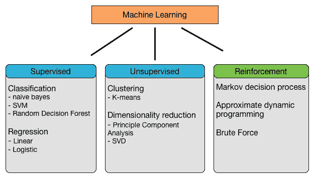

**Figure 2:** Machine learning tasks

# 监督学习

监督学习应用基于一组示例进行预测，目标是学习将输入映射到与现实世界一致的输出的一般规则。例如，垃圾邮件过滤数据集通常包含垃圾邮件和非垃圾邮件。因此，我们能够知道训练集中的消息是垃圾邮件还是火腿。然而，我们可能有机会使用这些信息来训练我们的模型，以便对新的看不见的消息进行分类。下图是监督学习的示意图。在算法找到所需的模式后，这些模式可用于对未标记的测试数据进行预测。这是最流行和最有用的机器学习任务类型，Spark 也不例外，它的大多数算法都是监督学习技术:


**Figure 3**: Supervised learning in action

例子包括用于解决监督学习问题的分类和回归。我们将在本书中提供几个监督学习的例子，如逻辑回归、随机森林、决策树、朴素贝叶斯、一对一对其余等等。但是，为了使讨论具体化，将只讨论逻辑回归和随机森林，其他算法将在[第 12 章](12.html#BD87E1-21aec46d8593429cacea59dbdcd64e1c)、*高级机器学习最佳实践*中讨论，并附有一些实际例子。另一方面，回归分析将讨论线性回归。

# 无监督学习

在无监督学习中，数据点没有与之相关的标签。因此，我们需要在算法上给它贴上标签，如下图所示。换句话说，无监督学习中训练数据集的正确类别是未知的。因此，必须从非结构化数据集中推断类别，这意味着无监督学习算法的目标是通过描述数据的结构，以某种结构化的方式对数据进行预处理。

为了克服无监督学习中的这一障碍，聚类技术通常用于基于某些相似性度量对未标记样本进行分组。因此，这项任务还涉及到挖掘面向特征学习的隐藏模式。聚类是对数据集中的项目进行智能分类的过程。总的想法是，同一个集群中的两个项目比属于不同集群的项目彼此“更接近”。这是一般的定义，对“亲密度”的解释是开放的。

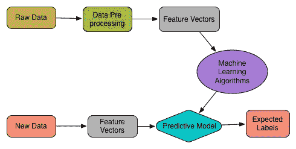

**Figure 4**: Unsupervised learning

例子包括聚类、频繁模式挖掘和用于解决无监督学习问题的降维(它也可以应用于有监督学习问题)。我们将在本书中提供几个无监督学习的例子，如 k-means、平分 k-means、高斯混合模型、**潜在狄利克雷分配** ( **LDA** )等等。我们还将通过回归分析展示如何在监督学习中使用降维算法，如**主成分分析** ( **PCA** )或**奇异值分解** ( **SVD** )。

**Dimensionality reduction** (**DR**): Dimensionality reduction is a technique used to reduce the number of random variables under certain considerations. This technique is used for both supervised and unsupervised learning. Typical advantages of using DR techniques are as follows:

*   它减少了机器学习任务所需的时间和存储空间
*   它有助于消除多重共线性，提高机器学习模型的性能
*   当缩小到非常低的维度(如 2D 或三维)时，数据可视化变得更加容易

# 强化学习

作为一个人，你和我们也从过去的经历中学习。我们并非偶然变得如此迷人。多年的正面赞扬和负面批评都帮助我们塑造了今天的自己。你通过与朋友、家人甚至陌生人的互动来学习什么能让人快乐，你通过尝试不同的肌肉运动直到它发出咔哒声来弄清楚如何骑自行车。当你采取动作时，你有时会立即得到回报。例如，在附近找到一个购物中心可能会带来即时的满足感。其他时候，奖励不会马上出现，比如长途跋涉找一个打赏的地方吃饭。这些都是关于强化学习(RL) **。**

因此，RL 是一种技术，模型本身从一系列动作或行为中学习。数据集的复杂性，或者说样本的复杂性，在算法成功学习目标函数所需的强化学习中非常重要。此外，为了响应实现最终目标的每个数据点，在与外部环境交互时，应确保奖励功能的最大化，如下图所示:


**Figure 5**: Reinforcement learning

强化学习技术正在许多领域得到应用。这里有一个非常简短的列表，包括以下内容:

*   广告有助于学习排名，对新兴项目使用一次性学习，新用户会带来更多的钱
*   教机器人新任务，同时保留先前的知识
*   从棋局到交易策略，衍生出复杂的层次结构
*   路线问题，例如，运输车队的管理，将哪些卡车/货车分配给哪些货物
*   在机器人技术中，算法必须根据一组传感器读数来选择机器人的下一步动作
*   这也是物联网应用的天然契合点，在物联网应用中，计算机程序与动态环境交互，在动态环境中，计算机程序必须在没有明确导师的情况下实现特定目标
*   一个最简单的 RL 问题叫做 n 型武装匪徒。问题是有 n 多台老虎机，但每台都有不同的固定支付概率。目标是通过始终选择具有最佳支出的机器来实现利润最大化

*   一个新兴的应用领域是股票市场交易。当一个交易者扮演强化代理人的角色，因为买卖(即动作)特定的股票通过产生利润或损失(即回报)来改变交易者的状态。

# 推荐系统

推荐系统是信息过滤系统的一个子类，它着眼于预测用户通常为某个项目提供的评级或偏好。近年来，推荐系统的概念变得非常普遍，随后被应用于不同的应用中。


**Figure 6**: Different recommender system

最受欢迎的可能是产品(例如，电影、音乐、书籍、研究文章、新闻、搜索查询、社交标签等)。推荐系统通常可以分为以下四类:

*   协同过滤，也称为社交过滤，通过使用他人的推荐来过滤信息。问题是，过去在评估某些项目时达成一致的人，将来很可能会再次达成一致。因此，一个想看电影的人可能会向他/她的朋友寻求建议。现在，一旦他收到他/她的一些有相似兴趣的朋友的推荐，他/她比其他人的推荐更受信任。这些信息用于决定看哪部电影。
*   基于内容的过滤(也称为认知过滤)，它基于项目内容和用户配置文件之间的比较来推荐项目。每个项目的内容都表示为一组描述符或术语，通常是出现在文档中的单词。用户简档用相同的术语表示，并通过分析用户已经看到的项目的内容来建立。然而，在实施这些类型的推荐系统时，需要考虑的一些问题如下:
    *   首先，术语可以自动或手动分配。对于自动分配，必须选择一种方法，以便可以从项目列表中提取这些项目。第二，术语必须以一种方式表示，以便用户配置文件和项目都可以以有意义的方式进行比较。必须明智地选择学习算法本身，以便它能够基于已经观察到的(即看到的)项目来学习用户简档，并基于该用户简档做出适当的推荐。基于内容的过滤系统主要用于文本文档，其中术语分析器用于从文档中选择单个单词。向量空间模型和潜在语义索引是使用这些术语在多维空间中将文档表示为向量的两种方法。此外，它还用于相关反馈、遗传算法、神经网络和贝叶斯分类器，以学习用户简档。
*   混合推荐系统是一种最新的研究和混合方法(即结合协同过滤和基于内容的过滤)。网飞就是这种推荐系统的一个很好的例子，它使用了**限制性玻尔兹曼机器** ( **RBM** )和一种像 IMDb 这样的大型电影数据库的矩阵分解算法(更多信息请参见[https://pdf . semantic scholar . org/789 a/d 4218 D1 e2e 920 B4 d 192023 f 840 Fe 8246d 746 . pdf](https://pdfs.semanticscholar.org/789a/d4218d1e2e920b4d192023f840fe8246d746.pdf))。这种简单地通过比较相似用户的观看和搜索习惯来推荐电影、电视剧或流媒体的推荐，被称为分级预测。
*   基于知识的系统，其中关于用户和产品的知识被用来推理满足用户需求的东西，使用感知树、决策支持系统和基于案例的推理。

在本章中，我们将讨论基于协同过滤的电影推荐系统。

# 半监督学习

在有监督学习和无监督学习之间，有一个小地方是半监督学习。在这种情况下，ML 模型通常会收到不完整的训练信号。更具统计意义的是，ML 模型接收的训练集缺少一些目标输出。半监督学习或多或少是基于假设的，通常使用三种假设算法作为未标记数据集的学习算法。使用以下假设:平滑度、聚类和流形。换句话说，半监督学习还可以表示为弱监督或自举技术，用于使用未标记示例的隐藏财富来增强从少量标记数据的学习。

如前所述，为学习问题获取标记数据通常需要熟练的人工智能。因此，与标记过程相关联的成本因此可能使得完全标记的训练集不可行，而获取未标记的数据相对便宜。

例如:转录音频片段，确定蛋白质的 3D 结构或确定特定位置是否有油，期望最小化和人类认知，以及传递。在这种情况下，半监督学习可能有很大的实用价值。

# Spark机器学习应用编程接口

在本节中，我们将描述 Spark 机器学习库(Spark MLlib 和 Spark ML)引入的两个关键概念，以及与我们在前面几节中讨论的监督和非监督学习技术相一致的最广泛使用的实现算法。

# Spark 机器学习库

如前所述，在前 Spark 时代，大数据建模人员通常使用统计语言(如 R、STATA 和 SAS)来构建他们的 ML 模型。然而，这种工作流(即这些 ML 算法的执行流程)缺乏效率、可伸缩性和吞吐量，以及准确性，当然，执行时间会延长。

然后，数据工程师过去常常在 Java 中重新实现相同的模型，例如，在 Hadoop 上部署。使用 Spark，可以重建、采用和部署相同的 ML 模型，从而使整个工作流更加高效、健壮和快速，让您能够提供实际的洞察力来提高性能。而且，在 Hadoop 中实现这些算法意味着这些算法可以并行运行，而不能在 R、STATA 和 SAS 等上运行。Spark 机器学习库分为两个包:Spark MLlib ( `spark.mllib`)和 Spark ML ( `spark.ml`)。

# Spark MLlib(消歧义)

MLlib 是 Spark 的可扩展机器学习库，是 Spark Core API 的扩展，它提供了一个易于使用的机器学习算法库。Spark 算法在 Scala 中实现，然后公开 Java、Scala、Python 和 r 的 API。Spark 提供对存储在单台机器上的本地向量和矩阵数据类型的支持，以及由一个或多个 rdd 支持的分布式矩阵。星火 MLlib 的美不胜收。例如，算法是高度可扩展的，并利用 Spark 处理大量数据的能力。

*   它们是为并行计算设计的 fast foward，基于内存的操作比 MapReduce 数据处理快 100 倍(它们还支持基于磁盘的操作，比 MapReduce 的正常数据处理快 10 倍)。
*   它们是多样的，因为它们涵盖了回归分析、分类、聚类、推荐系统、文本分析和频繁模式挖掘的常见机器学习算法，并且显然涵盖了构建可扩展机器学习应用所需的所有步骤。

# Spark毫升

Spark ML 增加了一套新的机器学习 API，让用户在数据集之上快速组装和配置实用的机器学习管道。Spark ML 旨在提供一套统一的高级应用编程接口，这些接口建立在数据框架而不是关系数据库之上，帮助用户创建和调整实用的机器学习管道。Spark ML API 将机器学习算法标准化，使学习任务更容易为数据科学家将多种算法组合到单个管道或数据工作流中。Spark ML 使用了 DataFrame 和 Datasets 的概念，这是在 Spark 1.6 中引入(作为实验)的更新概念，然后在 Spark 2.0+中使用。

In Scala and Java, DataFrame and Dataset have been unified, that is, DataFrame is just a type alias for a dataset of row. In Python and R, given the lack of type safety, DataFrame is the main programming interface.

数据集包含不同的数据类型，如存储文本的列、特征向量和数据的真实标签。除此之外，Spark ML 还使用转换器将一个数据帧转换成另一个数据帧，反之亦然，其中估计器的概念用于拟合数据帧以产生新的转换器。另一方面，管道应用编程接口可以将多个转换器和估计器约束在一起，以指定一个最大似然数据工作流。引入参数的概念是为了在 ML 应用的开发过程中，指定所有的转换器和估计器共享一个通用的 API。

# Spark MLlib 还是Spark ML？

Spark ML 提供了一个构建在数据框架之上的高级应用编程接口，用于构建 ML 管道。基本上，Spark ML 为您提供了一个工具集，用于在数据上创建不同机器学习相关转换的管道。例如，它使得将链特征提取、降维和分类器训练成一个模型变得容易，该模型作为一个整体可以在以后用于分类。然而，MLlib 更老，开发时间更长，因此它有更多的特性。因此，建议使用 Spark ML，因为该 API 在数据帧方面更加通用和灵活。

# 特征提取和转换

假设您将构建一个机器学习模型，该模型将预测信用卡交易是否是欺诈性的。现在，基于可用的背景知识和数据分析，您可能会决定哪些数据字段(又名特征)对训练模型很重要。例如，金额、客户名称、购买公司名称和信用卡所有者的地址都值得为整个学习过程提供。这些都是需要考虑的重要因素，因为如果您只是提供一个随机生成的事务标识，那么它将不会携带任何信息，因此根本没有用。因此，一旦您决定了在您的训练集中包括哪些特征，您就需要转换这些特征来训练模型，以便更好地学习。特征转换帮助您向训练数据添加附加的背景信息。这些信息使机器学习模型最终能够从这种体验中受益。为了使前面的讨论更加具体，假设您拥有字符串中表示的一个客户的以下地址:

`"123 Main Street, Seattle, WA 98101"`

如果您看到前面的地址，该地址缺乏适当的语义。换句话说，弦的表现力有限。例如，该地址仅用于学习与数据库中的确切地址相关联的地址模式。但是，将其分解为基本部分可以提供其他功能，例如:

*   “地址”(主街 123 号)
*   《城市》(西雅图)
*   “国家”
*   “Zip”(98101)

如果您看到前面的模式，您的 ML 算法现在可以将更多不同的事务组合在一起，并发现更广泛的模式。这是正常的，因为一些客户的邮政编码比其他人造成更多的欺诈活动。Spark 为特征提取提供了几种算法，并使转换变得更加容易。例如，当前版本提供了以下特征提取算法:

*   TF-以色列国防军
*   Word2vec
*   数理器

另一方面，特征转换器是一种抽象，包括特征转换器和学习模型。从技术上讲，转换器实现了一种名为`transform()`的方法，该方法通常通过附加一列或多列将一个数据帧转换为另一个数据帧。Spark 支持以下到 RDD 或数据帧的变压器:

*   Tokenizer
*   停止词移除器
*   n-克
*   二值化器
*   污染控制局(Pollution Control Agency)
*   多项式展开
*   离散余弦变换
*   StringIndexer
*   索引字符串
*   OneHotEncoder
*   矢量混合器
*   互动
*   标准化者
*   标准鞋匠
*   最小最大缩放器
*   MaxAbsScaler
*   桶化器
*   elemontwiseproduct
*   SQLTransformer
*   VectorAssembler
*   quantiledisecretizer

由于页面限制，我们无法描述所有内容。但是我们会讨论一些广泛使用的算法，比如`CountVectorizer`、`Tokenizer`、`StringIndexer`、`StopWordsRemover`、`OneHotEncoder`等等。在降维中常用的 PCA 将在下一节中讨论。

# 数理器

`CountVectorizer`和`CountVectorizerModel`旨在帮助将文本文档集合转换为标记计数向量。当先验字典不可用时，`CountVectorizer`可以用作提取词汇的估计器，并生成`CountVectorizerModel`。该模型为词汇表上的文档生成稀疏表示，然后可以将其传递给其他算法，如 LDA。

假设我们有如下文本语料库:


**Figure 7**: Text corpus containing name only

现在，如果我们想将前面的文本集合转换成标记计数的向量，Spark 提供了`CountVectorizer ()` API 来实现。首先，让我们为前面的表创建一个简单的数据框，如下所示:

```scala
val df = spark.createDataFrame(Seq((0, Array("Jason", "David")),(1, Array("David", "Martin")),(2, Array("Martin", "Jason")),(3, Array("Jason", "Daiel")),(4, Array("Daiel", "Martin")),(5, Array("Moahmed", "Jason")),(6, Array("David", "David")),(7, Array("Jason", "Martin")))).toDF("id", "name")df.show(false)

```

很多情况下，可以用`setInputCol`设置输入栏。让我们看一个例子，让我们从语料库中拟合一个`CountVectorizerModel`对象，如下所示:

```scala
val cvModel: CountVectorizerModel = new CountVectorizer().setInputCol("name").setOutputCol("features").setVocabSize(3).setMinDF(2).fit(df)

```

现在让我们使用提取器对矢量器进行下游处理，如下所示:

```scala
val feature = cvModel.transform(df)spark.stop()

```

现在让我们检查一下，确保它正常工作:

```scala
feature.show(false)

```

前一行代码产生以下输出:


**Figure 8**: Name text corpus has been featurized

现在让我们来看看变形金刚。最重要的转换器之一是标记器，它经常用于处理分类数据的机器学习任务。我们将在下一节看到如何使用这个转换器。

# Tokenizer

标记化是从原始文本中提取重要的组成部分，如单词和句子，并将原始文本分成单个术语(也称为单词)的过程。如果您想在正则表达式匹配上有更高级的标记化，那么`RegexTokenizer`是一个很好的选择。默认情况下，参数*模式*(正则表达式，默认值:`s+`)用作分隔符来分割输入文本。否则，您也可以将参数*间隙*设置为假，表示正则表达式*模式*表示*标记*，而不是分割间隙。这样，您可以找到所有匹配的匹配项作为标记化结果。

假设你有以下句子:

*   花拳绣腿，就是妖娆文字的过程，从原始文字开始。
*   如果想要，有更多的高级令牌化，`RegexTokenizer`，是一个不错的选择。
*   这里，将提供一个如何标记句子的示例。
*   这样，您可以找到所有匹配的匹配项。

现在，您要标记前面四个句子中的每个有意义的单词。让我们根据前面的句子创建一个数据帧，如下所示:

```scala
val sentence = spark.createDataFrame(Seq((0, "Tokenization,is the process of enchanting words,from the raw text"),(1, " If you want,to have more advance tokenization,RegexTokenizer,is a good option"),(2, " Here,will provide a sample example on how to tockenize sentences"),(3, "This way,you can find all matching occurrences"))).toDF("id","sentence")

```

现在让我们通过实例化`Tokenizer ()`应用编程接口来创建一个标记器，如下所示:

```scala
val tokenizer = new Tokenizer().setInputCol("sentence").setOutputCol("words") 

```

现在，使用 UDF 计算每个句子中的标记数量，如下所示:`import org.apache.spark.sql.functions._`

```scala
val countTokens = udf { (words: Seq[String]) => words.length } 

```

现在标记每个句子中的单词，如下所示:

```scala
val tokenized = tokenizer.transform(sentence) 

```

最后，针对每个原始句子显示每个标记，如下所示:

```scala
tokenized.select("sentence", "words").withColumn("tokens", countTokens(col("words"))).show(false) 

```

前一行代码打印标记化数据帧的快照，其中包含原始句子、单词包和标记数:


**Figure 9**: Tokenized words from the raw texts

但是如果使用`RegexTokenizer` API，会得到更好的效果。具体如下:通过实例化`RegexTokenizer ()`应用编程接口创建正则表达式标记器:

```scala
val regexTokenizer = new RegexTokenizer().setInputCol("sentence").setOutputCol("words").setPattern("\\W+").setGaps(true)

```

现在标记每个句子中的单词，如下所示:

```scala
val regexTokenized = regexTokenizer.transform(sentence) regexTokenized.select("sentence", "words") .withColumn("tokens", countTokens(col("words"))).show(false)

```

前一行代码使用 RegexTokenizer 打印标记化数据帧的快照，其中包含原始句子、单词包和标记数量:


**Figure 10**: Better tokenization using RegexTokenizer

# 停止词移除器

停止词是应该从输入中排除的词，通常是因为这些词经常出现，没有太多的含义。Spark 的`StopWordsRemover`将一系列字符串作为输入，这些字符串由`Tokenizer`或`RegexTokenizer`标记。然后，它从输入序列中删除所有的停止字。停止词列表由`stopWords`参数指定。`StopWordsRemover`应用编程接口的当前实现为丹麦语、荷兰语、芬兰语、法语、德语、匈牙利语、意大利语、挪威语、葡萄牙语、俄语、西班牙语、瑞典语、土耳其语和英语提供了选项。为了提供一个例子，我们可以简单地扩展前面章节中的`Tokenizer`例子，因为它们已经被标记化了。然而，对于这个例子，我们将使用`RegexTokenizer` API。

首先，从`StopWordsRemover ()` API 创建一个停用词移除器实例，如下所示:

```scala
val remover = new StopWordsRemover().setInputCol("words").setOutputCol("filtered")

```

现在，让我们删除所有的停止字，并按如下方式打印结果:

```scala
val newDF = remover.transform(regexTokenized)newDF.select("id", "filtered").show(false)

```

前一行代码从过滤后的数据帧中打印一个快照，不包括停止字:


**Figure 11**: Filtered (that is, without stop words) tokens

# StringIndexer

StringIndexer 将一列字符串标签编码为一列标签索引。索引在`[0, numLabels)`中，按标签频率排序，所以最频繁的标签得到索引 0。如果输入列是数字，我们将其转换为字符串，并对字符串值进行索引。当下游管道组件(如估计器或转换器)使用此字符串索引标签时，必须将组件的输入列设置为此字符串索引列名。很多情况下，可以用`setInputCol`设置输入栏。假设您有一些如下格式的分类数据:

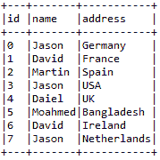

**Figure 12**: DataFrame for applying String Indexer

现在，我们想要索引名称列，以便最频繁的名称(也就是我们这里的 Jason)获得索引 0。为了做到这一点，Spark 为此提供了`StringIndexer` API。对于我们的示例，可以这样做，如下所示:

首先，让我们为前面的表创建一个简单的数据框:

```scala
val df = spark.createDataFrame(Seq((0, "Jason", "Germany"),(1, "David", "France"),(2, "Martin", "Spain"),(3, "Jason", "USA"),(4, "Daiel", "UK"),(5, "Moahmed", "Bangladesh"),(6, "David", "Ireland"),(7, "Jason", "Netherlands"))).toDF("id", "name", "address")

```

现在让我们对名称列进行索引，如下所示:

```scala
val indexer = new StringIndexer().setInputCol("name").setOutputCol("label").fit(df)

```

现在让我们使用转换器对索引器进行下游处理，如下所示:

```scala
val indexed = indexer.transform(df)

```

现在让我们检查一下，看看它是否正常工作:

```scala
indexed.show(false)

```


**Figure 13**: Label creation using StringIndexer

另一个重要的转换器是 OneHotEncoder，它经常用于处理分类数据的机器学习任务。我们将在下一节看到如何使用这个转换器。

# OneHotEncoder

一次性编码将一列标签索引映射到一列二进制向量，最多只有一个值。这种编码允许期望连续特征的算法(如逻辑回归)使用分类特征。假设您有一些分类数据，格式如下(与我们在上一节中描述`StringIndexer`的格式相同):


**Figure 14:** DataFrame for applying OneHotEncoder

现在，我们希望对名称列进行索引，以便数据集中最频繁出现的名称(在我们的例子中是 **Jason** )获得索引 **0** 。然而，仅仅索引它们有什么用呢？换句话说，您可以进一步向量化它们，然后您可以轻松地将数据帧馈送到任何 ML 模型。由于我们已经在上一节中看到了如何创建数据帧，在这里，我们将展示如何将它们编码为矢量:

```scala
val indexer = new StringIndexer().setInputCol("name").setOutputCol("categoryIndex").fit(df)val indexed = indexer.transform(df)val encoder = new OneHotEncoder().setInputCol("categoryIndex").setOutputCol("categoryVec")

```

现在让我们使用`Transformer`将其转换为向量，然后查看内容，如下所示:

```scala
val encoded = encoder.transform(indexed)encoded.show()

```

包含快照的结果数据帧如下:

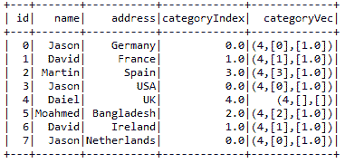

**Figure 15**: Creating category index and vector using OneHotEncoder

现在，您可以看到在结果数据框中添加了一个包含特征向量的新列。

# Spark毫升管道

MLlib 的目标是让实用的机器学习(ML)变得可扩展和容易。Spark 引入了管道应用编程接口，以便于创建和调整实用的 ML 管道。如前所述，在 ML 管道创建中通过特征工程提取有意义的知识涉及一系列数据收集、预处理、特征提取、特征选择、模型拟合、验证和模型评估阶段。例如，对文本文档进行分类可能涉及文本分割和清理、提取特征，以及训练分类模型，并对其进行交叉验证以进行调整。大多数 ML 库不是为分布式计算设计的，或者它们不为管道创建和调优提供本地支持。

# 数据集抽象

当从另一种编程语言(例如，Java)运行 SQL 查询时，结果作为数据框返回。数据框是组织成命名列的分布式数据集合。另一方面，数据集是一个接口，它试图从Spark SQL 中提供关系数据库的好处。数据集可以由一些 JVM 对象构建，例如原语类型(例如，`String`、`Integer`和`Long`)、Scala 案例类和 Java Beans。ML 管道涉及数据集转换和模型的多个序列。每个转换都获取一个输入数据集，并输出转换后的数据集，该数据集将成为下一阶段的输入。因此，数据导入和导出是 ML 管道的起点和终点。为了使这些更容易，Spark MLlib 和 Spark ML 为几个特定于应用的类型提供了数据集、数据框、RDD 和模型的导入和导出实用程序，包括:

*   分类和回归的标记点
*   交叉验证和潜在狄利克雷分配的标记文档
*   协作过滤的评级和排名

然而，真实数据集通常包含许多类型，如用户标识、项目标识、标签、时间戳和原始记录。不幸的是，当前 Spark 实现的实用程序无法轻松处理由这些类型组成的数据集，尤其是时间序列数据集。特征转换通常构成实际 ML 管道的大部分。要素转换可视为追加或删除从现有列创建的新列。

在下图中，您将看到文本标记器将文档分成一袋单词。之后，TF-IDF 算法将一包单词转换成特征向量。在转换过程中，需要为模型拟合阶段保留标签:


**Figure 16**: Text processing for machine learning model (DS indicates data sources)

这里，ID、文本和单词在转换步骤中被允许。它们在进行预测和模型检查时很有用。然而，它们实际上对于模型拟合状态是不必要的。如果预测数据集只包含预测标签，这些也不会提供太多信息。因此，如果您想要检查预测度量，例如准确性、精确度、召回率、加权真阳性和加权假阳性，查看预测标签以及原始输入文本和标记化单词是非常有用的。同样的建议也适用于使用 Spark ML 和 Spark MLlib 的其他机器学习应用。

因此，对于内存、磁盘或外部数据源(如 Hive 和 Avro)来说，RDDs、数据集和数据帧之间的简单转换成为可能。虽然使用用户定义的函数从现有列创建新列很容易，但是数据集的表现形式是一种惰性操作。相比之下，数据集只支持一些标准数据类型。然而，为了提高可用性并更好地适应机器学习模型，Spark 还增加了对`Vector`类型的支持，作为支持`mllib.linalg.DenseVector`和`mllib.linalg.Vector`下密集和稀疏特征向量的用户定义类型。

在 Spark 发行版下的`examples/src/main/`文件夹中可以找到 Java、Scala 和 Python 中完整的 DataFrame、dataset 和 RDD 示例。感兴趣的读者可以参考 Spark SQL 的用户指南，了解更多关于 DataFrame、数据集及其支持的操作的信息。

# 创建简单的管道

Spark 在 Spark ML 下提供管道 API。流水线包括由变压器和估计器组成的一系列阶段。有两种基本类型的管道级，称为转换器和估算器:

*   转换器将数据集作为输入，并生成一个扩充数据集作为输出，以便输出可以被馈送到下一步。比如**令牌器**和**哈希函数**就是两个变压器。标记器将包含文本的数据集转换为包含标记化单词的数据集。另一方面，哈希函数产生频率项。标记化和哈希函数的概念通常用于文本挖掘和文本分析。
*   相反，估计量必须是输入数据集中产生模型的第一个。在这种情况下，模型本身将被用作将输入数据集转换为扩充输出数据集的转换器。例如，在用相应的标签和特征拟合训练数据集之后，可以使用**逻辑回归**或线性回归作为估计器。

之后，它产生一个逻辑或线性回归模型，这意味着开发一个管道是容易和简单的。嗯，你需要做的就是声明需要的阶段，然后配置相关阶段的参数；最后，将它们链接到管道对象中，如下图所示:


**Figure 17**: Spark ML pipeline model using logistic regression estimator (DS indicates data store, and the steps inside the dashed line only happen during pipeline fitting)

如果看一下*图 17* ，拟合模型由一个 Tokenizer、一个 HashingTF 特征提取器和一个拟合 logistic 回归模型组成。拟合的管道模型充当转换器，可用于预测、模型验证、模型检查以及最终的模型部署。然而，为了提高预测精度方面的性能，需要调整模型本身。

现在我们已经知道了 Spark MLlib 和 ML 中可用的算法，现在是时候在开始以正式的方式使用它们来解决有监督和无监督的学习问题之前做好准备了。在下一节中，我们将开始特征提取和转换。

# 无监督机器学习

在本节中，为了使讨论具体化，将只讨论使用主成分分析和线性判别分析进行主题建模的降维以进行文本聚类。无监督学习的其他算法将在[第 13 章](13.html#C9ROA1-21aec46d8593429cacea59dbdcd64e1c)、*中讨论，我的名字是 Bayes，Naive Bayes* 中有一些实际的例子。

# 降维

降维是减少所考虑的变量数量的过程。它可以用来从原始和有噪声的特征中提取潜在特征，或者在保持结构的同时压缩数据。Spark MLlib 为`RowMatrix`类提供降维支持。最常用的数据降维算法是主成分分析和奇异值分解。但是，在本节中，我们将讨论 PCA，只是为了使讨论更加具体。

# 污染控制局(Pollution Control Agency)

主成分分析是一种统计过程，它使用正交变换将一组可能相关变量的观测值转换成一组称为主成分的线性不相关变量的值。主成分分析算法可用于使用主成分分析将向量投影到低维空间。然后，基于简化的特征向量，可以训练最大似然模型。以下示例显示了如何将 6D 特征向量投影到四维主成分中。假设您有一个如下所示的特征向量:

```scala
val data = Array(Vectors.dense(3.5, 2.0, 5.0, 6.3, 5.60, 2.4),Vectors.dense(4.40, 0.10, 3.0, 9.0, 7.0, 8.75),Vectors.dense(3.20, 2.40, 0.0, 6.0, 7.4, 3.34) )

```

现在让我们从中创建一个数据帧，如下所示:

```scala
val df = spark.createDataFrame(data.map(Tuple1.apply)).toDF("features")df.show(false)

```

上述代码为主成分分析生成具有 6D 特征向量的特征数据帧:

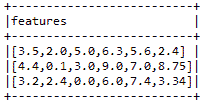

**Figure 18**: Creating a feature DataFrame (6-dimensional feature vectors) for PCA

现在让我们通过如下设置必要的参数来实例化 PCA 模型:

```scala
val pca = new PCA().setInputCol("features").setOutputCol("pcaFeatures").setK(4) .fit(df)

```

现在，为了有所不同，我们使用`setOutputCol()`方法将输出列设置为`pcaFeatures`。然后，我们设置主成分分析的维度。最后，我们拟合数据帧进行转换。请注意，主成分分析模型包括一个`explainedVariance`成员。模型可以从这样的旧数据中加载，但是`explainedVariance`将有一个空向量。现在让我们展示由此产生的特性:

```scala
val result = pca.transform(df).select("pcaFeatures") result.show(false)

```

前面的代码使用主成分分析产生了以 4D 特征向量为主要成分的特征数据帧:


**Figure 19**: Four-dimensional principal components (PCA features)

# 使用主成分分析

主成分分析是一种有助于寻找旋转矩阵的统计方法，在降维中得到广泛应用。例如，如果我们想检查第一个坐标是否具有最大可能的方差。此外，它有助于检查是否有任何后续坐标将转向最大可能的差异。

最终，主成分分析模型计算这些参数，并将它们作为旋转矩阵返回。旋转矩阵的列称为主成分。Spark MLlib 支持以面向行的格式和任意向量存储的高矩阵和瘦矩阵的 PCA。

# 回归分析——主成分分析的实际应用

在本节中，我们将首先探索用于回归分析的 **MSD** ( **百万歌曲数据集**)。然后我们将展示如何使用主成分分析来降低数据集的维度。最后，我们将评估线性回归模型的回归质量。

# 数据集收集和探索

在本节中，我们将描述非常著名的 MNIST 数据集。本章将使用该数据集。MNIST 手写数字数据库(下载自[https://www . csie . NTU . edu . tw/~ cjlin/libsvmtols/datasets/multiclass . html](https://www.csie.ntu.edu.tw/~cjlin/libsvmtools/datasets/multiclass.html))有 6 万个示例的训练集和 1 万个示例的测试集。这是一个更大的子集，可从 NIST。数字已经过大小标准化，并在固定大小的图像中居中。因此，对于那些试图在真实数据上学习技术和模式识别方法，同时在预处理和格式化上花费最少努力的人来说，这是一个非常好的示例数据集。来自 NIST 的原始黑白(二级)图像经过尺寸归一化，以适合 20×20 像素的盒子，同时保持它们的纵横比。

MNIST 数据库由 NIST 的特殊数据库 3 和特殊数据库 1 构成，其中包含手写数字的二进制图像。数据集示例如下:

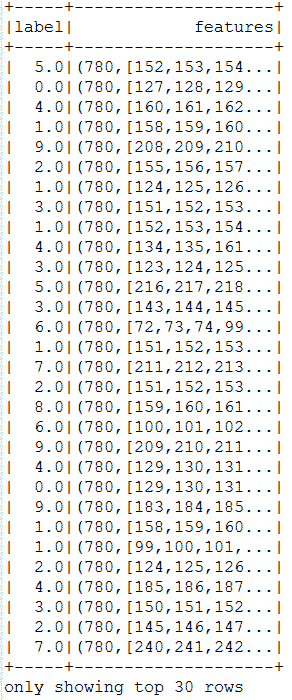

**Figure 20**: A snap of the MNIST dataset

你可以看到总共有 780 个功能。因此，有时，由于数据集的高维特性，许多机器学习算法会失败。因此，为了解决这个问题，在下一节中，我们将向您展示如何在不牺牲机器学习任务(如分类)质量的情况下减少维度。然而，在深入问题之前，让我们先了解一些回归分析的背景知识。

# 什么是回归分析？

线性回归属于回归算法家族。回归的目标是找到变量之间的关系和依赖关系。它使用线性函数对连续标量因变量 *y* (也是机器学习术语中的标签或目标)和一个或多个(D 维向量)解释变量(也是自变量、输入变量、特征、观测数据、观察值、属性、维度、数据点等)之间的关系进行建模，解释变量表示为 *x* 。在回归分析中，目标是预测连续的目标变量，如下图所示:

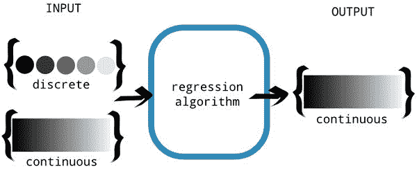

Figure 21: A regression algorithm is meant to produce continuous output. The input is allowed to be eitherdiscrete or continuous (source: Nishant Shukla, Machine Learning with TensorFlow, Manning Publications co. 2017)

现在，你可能对分类和回归问题的基本区别有些困惑。以下信息框将使其更加清晰:

**Regression versus classification:** On the other hand, another area, called classification, is about predicting a label from a finite set but with discrete values. This distinction is important to know because discrete-valued output is handled better by classification, which will be discussed in upcoming sections.

包含输入变量线性组合的多元回归模型采用以下形式:

y = ss<sub class="calibre43">0</sub>+ss<sub class="calibre43">1</sub>x<sub class="calibre43">1</sub>+ss<sub class="calibre43">2</sub>x<sub class="calibre43">2</sub>+ss<sub class="calibre43">3</sub>x<sub class="calibre43">3</sub>+.....+ e

图 22 显示了一个带有一个自变量( *x* 轴)的简单线性回归的例子。模型(红线)是使用训练数据(蓝点)计算的，其中每个点都有一个已知的标签( *y* 轴)，通过最小化所选损失函数值来尽可能精确地拟合这些点。然后我们可以用模型预测未知标签(我们只知道 *x* 值，想预测 *y* 值)。

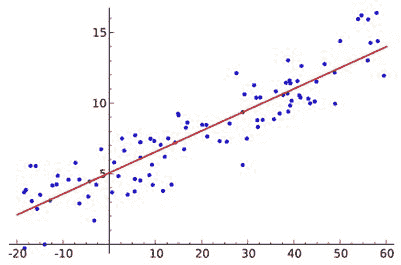

Figure 22: Regression graph that separates data points (the dots [.] refer to data points in the graph and the red line refers to the regression) Spark provides an RDD-based implementation of the linear regression algorithm. You can train a linear regression model with no regularization using stochastic gradient descent. This solves the least squares regression formulation *f (weights) = 1/n ||A weights-y||^2* (which is the mean squared error). Here, the data matrix has *n* rows, and the input RDD holds the set of rows of *A*, each with its corresponding right-hand side label *y*. For more information, refer to [https://github.com/apache/spark/blob/master/mllib/src/main/scala/org/apache/spark/mllib/regression/LinearRegression.scala](https://github.com/apache/spark/blob/master/mllib/src/main/scala/org/apache/spark/mllib/regression/LinearRegression.scala).

**第一步。加载数据集并创建 RDD**

为了以 LIBSVM 格式加载 MNIST 数据集，这里我们使用了来自 Spark MLlib 的名为 MLUtils 的内置 API:

```scala
val data = MLUtils.loadLibSVMFile(spark.sparkContext, "data/mnist.bz2") 

```

**第二步。计算特征数量，使降维更容易:**

```scala
val featureSize = data.first().features.sizeprintln("Feature Size: " + featureSize)

```

这将导致以下输出:

```scala
Feature Size: 780

```

因此，数据集有 780 列，即要素，因此这可以被视为高维(要素)。因此，有时减少数据集的维度是值得的。**第三步。现在准备如下训练和测试集:**

事情是这样的，我们将训练`LinearRegressionwithSGD`模型两次。首先，我们将使用具有原始维度的特征的正常数据集，其次，使用一半的特征。对于原始版本，培训和测试集准备如下:

```scala
val splits = data.randomSplit(Array(0.75, 0.25), seed = 12345L)val (training, test) = (splits(0), splits(1))

```

现在，对于简化的功能，培训如下:

```scala
val pca = new PCA(featureSize/2).fit(data.map(_.features))val training_pca = training.map(p => p.copy(features = pca.transform(p.features)))val test_pca = test.map(p => p.copy(features = pca.transform(p.features))) 

```

**第四步。训练线性回归模型**现在迭代 20 次，分别为正常特征和简化特征训练`LinearRegressionWithSGD`，如下所示:

```scala
val numIterations = 20val stepSize = 0.0001val model = LinearRegressionWithSGD.train(training, numIterations)val model_pca = LinearRegressionWithSGD.train(training_pca, numIterations)

```

当心！有时，`LinearRegressionWithSGD()`返回`NaN`。在我看来，发生这种情况有两个原因:

*   如果`stepSize`大。在这种情况下，您应该使用更小的东西，例如 0.0001、0.001、0.01、0.03、0.1、0.3、1.0 等等。
*   您的列车数据有`NaN`。如果是这样，结果很可能是`NaN`。因此，建议在训练模型之前移除空值。

**第五步。评估两款车型**

在我们评估分类模型之前，首先，让我们准备计算正态的均方误差，以查看降维对原始预测的影响。显然，如果你想要一个正式的方法来量化模型的准确性，并潜在地提高精度和避免过度拟合。尽管如此，你可以从残差分析中得出结论。此外，还值得分析用于建模和评估的训练和测试集的选择。最后，选择技术帮助您描述模型的各种属性:

```scala
val valuesAndPreds = test.map { point =>val score = model.predict(point.features)(score, point.label)}

```

现在计算主成分分析预测集，如下所示:

```scala
val valuesAndPreds_pca = test_pca.map { point =>val score = model_pca.predict(point.features)(score, point.label)}

```

现在计算均方误差，并按如下方式打印每种情况:

```scala
val MSE = valuesAndPreds.map { case (v, p) => math.pow(v - p 2) }.mean()val MSE_pca = valuesAndPreds_pca.map { case (v, p) => math.pow(v - p, 2) }.mean()println("Mean Squared Error = " + MSE)println("PCA Mean Squared Error = " + MSE_pca)

```

您将获得以下输出:

```scala
Mean Squared Error = 2.9164359135973043E78PCA Mean Squared Error = 2.9156682256149184E78

```

请注意，MSE 实际上是使用以下公式计算的:


**第六步。** **观察两个模型的模型系数**

计算模型系数如下:

```scala
println("Model coefficients:"+ model.toString())println("Model with PCA coefficients:"+ model_pca.toString())

```

现在，您应该在终端/控制台上观察到以下输出:

```scala
Model coefficients: intercept = 0.0, numFeatures = 780Model with PCA coefficients: intercept = 0.0, numFeatures = 390

```

# 二元和多元分类

二进制分类器用于将给定数据集的元素分成两个可能的组之一(例如，欺诈或非欺诈)，是多类分类的一种特殊情况。大多数二元分类度量可以推广到多类分类度量。多类分类描述了一个分类问题，其中每个数据点都有 *M > 2* 个可能的标签(其中 *M=2* 是二进制分类问题)。

对于多类度量，肯定和否定的概念略有不同。预测和标签仍然可以是正的或负的，但是它们必须在特定类别的上下文中考虑。每个标签和预测采用多个类中的一个的值，因此它们被认为对于它们的特定类是正的，而对于所有其他类是负的。因此，当预测和标签匹配时，就会出现真正，而当预测和标签都不采用给定类的值时，就会出现真负。按照这个惯例，对于给定的数据样本，可以有多个真阴性。假阴性和假阳性从阳性和阴性标签的先前定义的扩展是直接的。

# 性能指标

虽然有许多不同类型的分类算法，但评估指标或多或少都有类似的原则。在监督分类问题中，每个数据点存在真实输出和模型生成的预测输出。因此，每个数据点的结果可以分为四类:

*   **真阳性** ( **TP** ):标签阳性，预测也阳性。
*   **真阴性** ( **TN** ):标签为阴性，预测也为阴性。
*   **假阳性** ( **FP** ):标签为阴性但预测为阳性。
*   **假阴性** ( **FN** ):标签为阳性，但预测为阴性。

现在，要更清楚地了解这些参数，请参考下图:

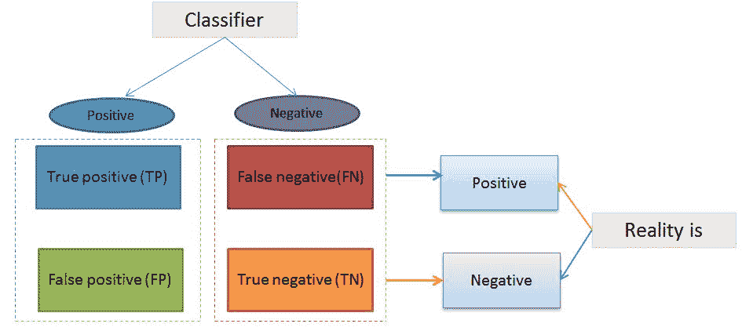

**Figure 23**: Prediction classifier (that is, confusion matrix)

TP、FP、TN、FN 是大多数分类器评估指标的构建模块。考虑分类器评估时的一个基本要点是，纯粹的准确性(即预测是正确的还是不正确的)通常不是一个好的度量标准。原因是数据集可能非常不平衡。例如，如果一个模型被设计为从一个数据集预测欺诈，其中 95%的数据点不是欺诈，5%的数据点是欺诈。然后假设一个天真的分类器预测不欺诈(不管输入)将有 95%的准确性。出于这个原因，通常使用诸如精确度和召回率之类的度量标准，因为它们考虑了错误的类型。在大多数应用中，精度和召回率之间存在某种期望的平衡，这可以通过将两者组合成一个称为 **F-measure** 的单一指标来实现。

精确表示多少积极分类是相关的。另一方面，回忆意味着测试在检测阳性方面有多好？在二元分类中，回忆被称为敏感度。需要注意的是，查准率可能不会随着查全率而降低。回忆和精确之间的关系可以在图中的阶梯区域观察到:

*   接收机工作特性
*   ROC 曲线下面积
*   精度-召回曲线下的区域

这些曲线通常用于二进制分类，以研究分类器的输出。然而，有时结合精度和召回率在两个模型之间进行选择是很好的。相比之下，将精度和召回率与多数字评估指标结合使用会使算法比较变得更加困难。假设您有两个算法，其执行如下:

| **分类器** | **精度** | **召回** |
| X | 96% | 89% |
| Y | 99% | 84% |

这里，两个分类器都不明显优越，所以它不会立即引导你选择最优的。但是使用 F1 分数，这是一个结合了精度和召回率(即精度和召回率的调和平均值)的度量，平衡了 F1 分数。让我们计算一下，并把它放在表中:

| **分类器** | **精度** | **召回** | **F1 得分** |
| X | 96% | 89% | 92.36% |
| Y | 99% | 84% | 90.885% |

因此，拥有 F1 分数有助于从大量分类器中进行选择。它给出了它们之间的明确的偏好排序，因此给出了明确的前进方向，即分类器 **X** 。

对于二进制分类，前面的性能指标可以计算如下:

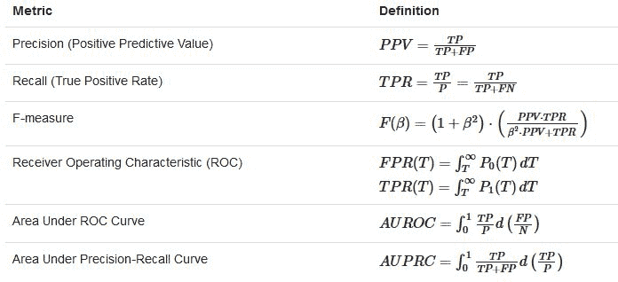

**Figure 24**: Mathematical formula for computing performance metrics for binary classifiers (source: [https://spark.apache.org/docs/2.1.0/mllib-evaluation-metrics.html](https://spark.apache.org/docs/2.1.0/mllib-evaluation-metrics.html))

然而，在多个预测标签相关联的多类分类问题中，计算较早的度量更复杂，但是可以使用以下数学等式来计算:

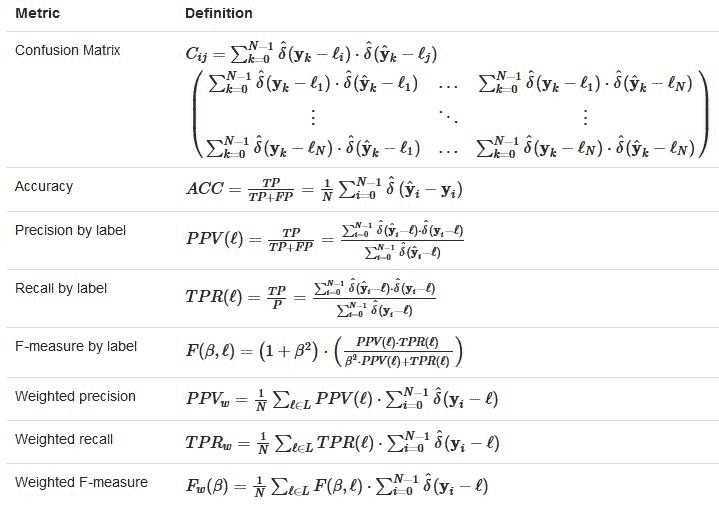

**Figure 25**: Mathematical formula for computing performance metrics for multiclass classifiers

其中 *δ* ^( *x* 被称为修改后的δ函数，可以定义如下(来源:[https://spark . Apache . org/docs/2 . 1 . 0/mllib-evaluation-metrics . html](https://spark.apache.org/docs/2.1.0/mllib-evaluation-metrics.html)):


# 使用逻辑回归的二元分类

逻辑回归被广泛用于预测二元反应。这是一种线性方法，可以用数学方法表述如下:


在上式中，*L(w；x，y)* 是损失函数称为 logistic 损失。

对于二元分类问题，算法将输出二元逻辑回归模型。给定一个新的数据点，由 *x* 表示，模型通过应用逻辑函数进行预测:


其中 *z = w <sup class="calibre26">T</sup> x，*默认情况下，如果 *f(w <sup class="calibre26">T</sup> x) > 0.5* ，则结果为正，否则为负，但与线性支持向量机不同的是，逻辑回归模型的原始输出 *f(z)* 具有概率解释(即 *x* 为正的概率)。

**线性 SVM** 是最新的极快机器学习(数据挖掘)算法，用于解决超大规模数据集的多类分类问题，它实现了用于设计线性支持向量机的切割平面算法的原始专有版本(来源:[www.linearsvm.com/](http://www.linearsvm.com/))。

# Spark最大似然逻辑回归预测乳腺癌

在本节中，我们将了解如何使用 Spark ML 开发癌症诊断管道。一个真实的数据集将被用来预测乳腺癌的概率。更具体地说，将使用威斯康星乳腺癌数据集。

# 数据集集合

在这里，我们使用了更简单的数据集，这些数据集是为机器学习应用开发而结构化和手动精选的，当然，其中许多数据集显示出良好的分类精度。来自 UCI 机器学习存储库的威斯康星乳腺癌数据集(https://archive . ics . UCI . edu/ml/datasets/乳腺+癌症+威斯康星+(Original) )包含由威斯康星大学的研究人员捐赠的数据，并包括对乳腺肿块细针穿刺的数字化图像的测量。这些值代表下一小节中描述的数字图像中存在的细胞核的特征:

```scala
0\. Sample code number id number1\. Clump Thickness 1 - 102\. Uniformity of Cell Size 1 - 103\. Uniformity of Cell Shape 1 - 104\. Marginal Adhesion 1 - 105\. Single Epithelial Cell Size 1 - 106\. Bare Nuclei 1 - 107\. Bland Chromatin 1 - 108\. Normal Nucleoli 1 - 109\. Mitoses 1 - 1010\. Class: (2 for benign, 4 for malignant)

```

欲了解更多有关威斯康星乳腺癌数据集的信息，请参考作者的出版物:*乳腺肿瘤诊断的核特征提取*， *IS & T/SPIE* 1993 *国际电子成像研讨会:科学与技术*，第 1905 卷，第 861-870 页作者: *W.N. Street* ， *W.H. Wolberg* ，以及 *O.L. Mangasarian* ，1993

# 使用 Spark ML 开发管道

现在我们将通过一步一步的例子向您展示如何预测乳腺癌的可能性:

**第一步:加载并解析数据**

```scala
val rdd = spark.sparkContext.textFile("data/wbcd.csv") val cancerRDD = parseRDD(rdd).map(parseCancer) 

```

`parseRDD()`方法如下:

```scala
def parseRDD(rdd: RDD[String]): RDD[Array[Double]] = { rdd.map(_.split(",")).filter(_(6) != "?").map(_.drop(1)).map(_.map(_.toDouble)) } 

```

`parseCancer()`方法如下:

```scala
def parseCancer(line: Array[Double]): Cancer = { Cancer(if (line(9) == 4.0) 1 else 0, line(0), line(1), line(2), line(3), line(4), line(5), line(6), line(7), line(8)) }  

```

请注意，这里我们已经简化了数据集。对于值 4.0，我们已经将它们转换为 1.0，否则为 0.0。`Cancer`类是一个案例类，可以定义如下:

```scala
case class Cancer(cancer_class: Double, thickness: Double, size: Double, shape: Double, madh: Double, epsize: Double, bnuc: Double, bchrom: Double, nNuc: Double, mit: Double)

```

**步骤 2:将 RDD 转换为 ML 管道的数据帧**

```scala
import spark.sqlContext.implicits._val cancerDF = cancerRDD.toDF().cache() cancerDF.show() 

```

数据框如下所示:

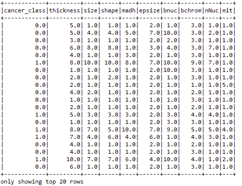

**Figure 26:** A snap of the cancer dataset

**第三步:特征提取和变换**

首先，让我们选择特征列，如下所示:

```scala
val featureCols = Array("thickness", "size", "shape", "madh", "epsize", "bnuc", "bchrom", "nNuc", "mit") 

```

现在让我们将它们组合成一个特征向量，如下所示:

```scala
val assembler = new VectorAssembler().setInputCols(featureCols).setOutputCol("features") 

```

现在将它们转换成数据帧，如下所示:

```scala
val df2 = assembler.transform(cancerDF) 

```

让我们看看转换后的数据帧的结构:

```scala
df2.show() 

```

现在，您应该观察到一个数据框，其中包含根据左侧的列计算的特征:

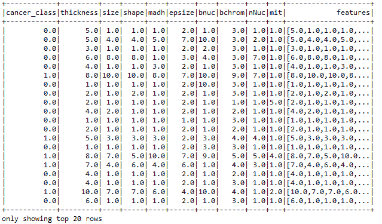

**Figure 27:** New DataFrame containing features

最后，让我们使用`StringIndexer`为训练数据集创建标签，如下所示:

```scala
val labelIndexer = new StringIndexer().setInputCol("cancer_class").setOutputCol("label")val df3 = labelIndexer.fit(df2).transform(df2)df3.show() 

```

现在，您应该会看到一个数据框，其中包含根据左侧的列计算的要素和标签:

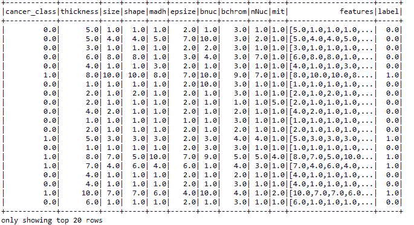

**Figure 28:** New DataFrame containing features and labels to training the ML models

**第四步:创建测试和训练集**

```scala
val splitSeed = 1234567 val Array(trainingData, testData) = df3.randomSplit(Array(0.7, 0.3), splitSeed)

```

**步骤 5:使用训练集**创建估计器

让我们使用逻辑回归`elasticNetParam`为管道创建一个估计器。我们还指定了最大迭代和回归参数，如下所示:

```scala
val lr = new LogisticRegression().setMaxIter(50).setRegParam(0.01).setElasticNetParam(0.01) val model = lr.fit(trainingData)  

```

**第六步:获取测试集的原始预测、概率和预测**

使用测试集转换模型，以获得测试集的原始预测、概率和预测:

```scala
val predictions = model.transform(testData) predictions.show() 

```

生成的数据帧如下:

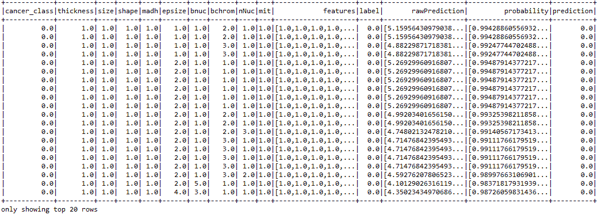

**Figure 29:** New DataFrame with raw prediction and actual prediction against each row

**第七步:生成训练的客观历史**

让我们在每次迭代中生成模型的客观历史，如下所示:

```scala
val trainingSummary = model.summary val objectiveHistory = trainingSummary.objectiveHistory objectiveHistory.foreach(loss => println(loss))

```

就训练损失而言，前面的代码段产生以下输出:

```scala
    0.65622918764965950.60878677610814310.5389725889045560.49284559134053320.462692580749993860.35279148199731980.202069013374049780.164594548749969930.137834370512765120.114780531647100950.114204336214381570.111388847880593780.110418890323380360.108494772363738750.108188805378795130.106828686400747230.106413952292532670.105554117045747490.105051864140449050.104704255801309150.103762197547471620.103311396090331120.102761732902254060.102459822019049230.101988333663940710.101682483131035520.101632425519554430.101628262093114040.101621193672929530.101612353767912030.10161148032094950.101610905055560390.10161072612547950.101610560821127380.101610503813326080.101610485153413870.101610439003019850.101610420574362880.101610409712677370.101610408469233540.101610406255423470.101610405952075250.101610405756643540.101610405658708350.101610405195599750.101610404898345730.101610404452152660.10161040434695770.10161040427935530.10161040426060480.10161040423579716 

```

正如你所看到的，损失在以后的迭代中逐渐减少。

**第八步:评估模型**

首先，我们必须确保我们使用的分类器来自二元逻辑回归总结:

```scala
val binarySummary = trainingSummary.asInstanceOf[BinaryLogisticRegressionSummary]

```

现在让我们获得 ROC 作为`DataFrame`和`areaUnderROC`。接近 1.0 的值更好:

```scala
val roc = binarySummary.roc roc.show() println("Area Under ROC: " + binarySummary.areaUnderROC)

```

前几行打印`areaUnderROC`的值，如下所示:

```scala
Area Under ROC: 0.9959095884623509

```

这太棒了！现在，让我们计算其他指标，如真阳性率、假阳性率、假阴性率和总计数，以及一些正确和错误预测的实例，如下所示:

```scala
import org.apache.spark.sql.functions._// Calculate the performance metricsval lp = predictions.select("label", "prediction") val counttotal = predictions.count() val correct = lp.filter($"label" === $"prediction").count() val wrong = lp.filter(not($"label" === $"prediction")).count() val truep = lp.filter($"prediction" === 0.0).filter($"label" === $"prediction").count() val falseN = lp.filter($"prediction" === 0.0).filter(not($"label" === $"prediction")).count() val falseP = lp.filter($"prediction" === 1.0).filter(not($"label" === $"prediction")).count() val ratioWrong = wrong.toDouble / counttotal.toDouble val ratioCorrect = correct.toDouble / counttotal.toDouble println("Total Count: " + counttotal) println("Correctly Predicted: " + correct) println("Wrongly Identified: " + wrong) println("True Positive: " + truep) println("False Negative: " + falseN) println("False Positive: " + falseP) println("ratioWrong: " + ratioWrong) println("ratioCorrect: " + ratioCorrect) 

```

现在，您应该观察到前面代码的输出，如下所示:

**总计数:209** **正确预测:202** **错误识别:7** **真阳性:140** **假阴性:4** **假阳性:3** **比值错误:0.0334928296650718****比值正确:0.966507177034929**

最后，让我们来判断模型的准确性。但是，首先我们需要设置模型阈值最大化`fMeasure`:

```scala
val fMeasure = binarySummary.fMeasureByThreshold val fm = fMeasure.col("F-Measure") val maxFMeasure = fMeasure.select(max("F-Measure")).head().getDouble(0) val bestThreshold = fMeasure.where($"F-Measure" === maxFMeasure).select("threshold").head().getDouble(0) model.setThreshold(bestThreshold) 

```

现在让我们计算精度，如下所示:

```scala
val evaluator = new BinaryClassificationEvaluator().setLabelCol("label") val accuracy = evaluator.evaluate(predictions) println("Accuracy: " + accuracy)     

```

前面的代码产生了下面的输出，几乎是 99.64%:

```scala
Accuracy: 0.9963975418520874

```

# 使用逻辑回归的多类分类

二元逻辑回归可以推广为多项式逻辑回归，用于训练和预测多类分类问题。例如，对于 *K* 可能的结果，可以选择其中一个结果作为轴心，另一个*K-1*结果可以相对于轴心结果分别回归。在`spark.mllib`中，第一个类 0 被选为`pivot`类。

对于多类分类问题，该算法将输出一个多项式逻辑回归模型，该模型包含针对第一类回归的*k-1 二元*逻辑回归模型。给定一个新的数据点，运行*k-1 模型*，选择概率最大的类作为预测类。在本节中，我们将向您展示一个使用逻辑回归和 L-BFGS 进行快速收敛的分类示例。

**第一步。加载并解析 LIVSVM 格式的 MNIST 数据集**

```scala
// Load training data in LIBSVM format.val data = MLUtils.loadLibSVMFile(spark.sparkContext, "data/mnist.bz2")

```

**第二步。准备培训和测试集**

将数据分为培训(75%)和测试(25%)，如下所示:

```scala
val splits = data.randomSplit(Array(0.75, 0.25), seed = 12345L)val training = splits(0).cache()val test = splits(1)

```

**第三步。运行训练算法建立模型**

运行训练算法，通过设置多个类(此数据集为 10 个)来构建模型。为了提高分类精度，还可以使用布尔真值指定截取和验证数据集，如下所示:

```scala
val model = new LogisticRegressionWithLBFGS().setNumClasses(10).setIntercept(true).setValidateData(true).run(training)

```

如果算法应该使用`setIntercept()`添加截距，则将截距设置为真。如果您希望算法在模型构建之前验证训练集，您应该使用`setValidateData()`方法将该值设置为真。

**第四步。清除默认阈值**

清除默认阈值，使培训不会使用默认设置进行，如下所示:

```scala
model.clearThreshold()

```

**第五步。计算测试集的原始分数**

计算测试集的原始分数，以便我们可以使用上述性能指标评估模型，如下所示:

```scala
val scoreAndLabels = test.map { point =>val score = model.predict(point.features)(score, point.label)}

```

**第六步。为评估实例化多类指标**

```scala
val metrics = new MulticlassMetrics(scoreAndLabels)

```

**第七步。构建混淆矩阵**

```scala
println("Confusion matrix:")println(metrics.confusionMatrix)

```

在混淆矩阵中，矩阵的每一列代表预测类中的实例，而每一行代表实际类中的实例(反之亦然)。这个名字源于这样一个事实，即它很容易看出系统是否混淆了两个类。更多信息，请参考矩阵([https://en.wikipedia.org/wiki/Confusion_matrix.Confusion](https://en.wikipedia.org/wiki/Confusion_matrix.Confusion)):


**Figure 30:** Confusion matrix generated by the logistic regression classifier

**第八步。整体统计**

现在让我们计算总体统计数据来判断模型的性能:

```scala
val accuracy = metrics.accuracyprintln("Summary Statistics")println(s"Accuracy = $accuracy")// Precision by labelval labels = metrics.labelslabels.foreach { l =>println(s"Precision($l) = " + metrics.precision(l))}// Recall by labellabels.foreach { l =>println(s"Recall($l) = " + metrics.recall(l))}// False positive rate by labellabels.foreach { l =>println(s"FPR($l) = " + metrics.falsePositiveRate(l))}// F-measure by labellabels.foreach { l =>println(s"F1-Score($l) = " + metrics.fMeasure(l))}

```

前面的代码段产生以下输出，包含一些性能指标，如准确性、精确度、召回率、真阳性率、假阳性率和 f1 分数:

```scala
Summary Statistics----------------------Accuracy = 0.9203609775377116Precision(0.0) = 0.9606815203145478Precision(1.0) = 0.9595732734418866..Precision(8.0) = 0.8942172073342737Precision(9.0) = 0.9027210884353741Recall(0.0) = 0.9638395792241946Recall(1.0) = 0.9732346241457859..Recall(8.0) = 0.8720770288858322Recall(9.0) = 0.8936026936026936FPR(0.0) = 0.004392386530014641FPR(1.0) = 0.005363128491620112..FPR(8.0) = 0.010927369417935456FPR(9.0) = 0.010441004672897197F1-Score(0.0) = 0.9622579586478502F1-Score(1.0) = 0.966355668645745..F1-Score(9.0) = 0.8981387478849409

```

现在我们来计算一下总体，也就是汇总统计:

```scala
println(s"Weighted precision: ${metrics.weightedPrecision}")println(s"Weighted recall: ${metrics.weightedRecall}")println(s"Weighted F1 score: ${metrics.weightedFMeasure}")println(s"Weighted false positive rate: ${metrics.weightedFalsePositiveRate}") 

```

前面的代码段打印了以下输出，包含加权精度、召回率、f1 分数和误报率:

```scala
Weighted precision: 0.920104303076327Weighted recall: 0.9203609775377117Weighted F1 score: 0.9201934861645358Weighted false positive rate: 0.008752250453215607

```

整体统计表明，该模型的准确率在 92%以上。但是，我们仍然可以使用更好的算法来改进它，例如**随机森林** ( **射频**)。在下一节中，我们将查看随机森林实现来对同一模型进行分类。

# 利用随机森林提高分类精度

随机森林(有时也称为随机决策森林)是决策树的集合。随机森林是最成功的分类和回归机器学习模型之一。他们结合了许多决策树，以减少过度拟合的风险。像决策树一样，随机森林处理分类特征，扩展到多类分类设置，不需要特征缩放，并且能够捕捉非线性和特征交互。有许多有利的 RFs。他们可以通过组合许多决策树来克服训练数据集中的过拟合问题。

射频或 RDF 中的森林通常由成千上万棵树组成。这些树实际上是在同一训练集的不同部分上训练的。更严格地说，一棵已经长得很深的单独的树倾向于从高度不可预测的模式中学习。这种性质的树会在训练集上产生过拟合问题。此外，低偏差使分类器表现不佳，即使您的数据集在所呈现的特征方面质量良好。另一方面，射频有助于对多棵决策树进行平均，目标是通过计算案例对之间的接近度来减少方差以确保一致性。

然而，这增加了小的偏差或结果的可解释性的一些损失。但是，最终，最终模型的性能会显著提高。当使用射频作为分类器时，参数设置如下:

*   如果树的数量是 1，则根本不使用自举；但是，如果树的数量为 *> 1* ，则完成自举。支持的值有`auto`、`all`、`sqrt`、`log2`和`onethird`。
*   支持的数值为*(0.0-1.0)**【1-n】*。但是如果选择`featureSubsetStrategy`作为`auto`，算法会自动选择最佳特征子集策略。
*   如果`numTrees == 1`，则`featureSubsetStrategy`设置为`all`。但是如果`numTrees > 1`(即森林)`featureSubsetStrategy`设为`sqrt`分类。
*   此外，如果在 *(0，1.0)*的范围内设置真实值 *n* ，将使用`n*number_of_features`。然而，如果一个整数值说 *n* 在`range (1, the number of features)`中，则只有`n`特征被交替使用。
*   `categoricalFeaturesInfo`参数是一个映射，用于存储任意分类特征。条目 *(n - > k)* 表示特征 *n* 与从 *0: {0，1，...，k-1}。*
*   杂质标准仅用于信息增益计算。支持的值分别是用于分类和回归的*基尼系数*和*方差*。
*   `maxDepth`是树的最大深度(例如，深度 0 表示 1 个叶节点，深度 1 表示 1 个内部节点 *+ 2 个*叶节点，以此类推)。
*   `maxBins`表示用于分割特征的最大箱数，其中建议值为 100 以获得更好的结果。
*   最后，随机种子用于自举和选择特征子集，以避免结果的随机性。

如前所述，由于射频对于大规模数据集来说足够快且可扩展，因此 Spark 是实现射频以获得巨大可扩展性的合适技术。但是，如果计算接近度，存储需求也会呈指数级增长。

# 使用随机森林对 MNIST 数据集进行分类

在本节中，我们将展示一个使用随机森林的分类示例。我们将逐步分解代码，以便您能够轻松理解解决方案。

**第一步。加载并解析 LIVSVM 格式的 MNIST 数据集**

```scala
// Load training data in LIBSVM format.val data = MLUtils.loadLibSVMFile(spark.sparkContext, "data/mnist.bz2")

```

**第二步。准备培训和测试集**

将数据分为训练(75%)和测试(25%)，并为再现性设定种子，如下所示:

```scala
val splits = data.randomSplit(Array(0.75, 0.25), seed = 12345L)val training = splits(0).cache()val test = splits(1)

```

**第三步。运行训练算法建立模型**

训练一个空的随机森林模型`categoricalFeaturesInfo. This required`，因为所有的特征在数据集中是连续的:

```scala
val numClasses = 10 //number of classes in the MNIST datasetval categoricalFeaturesInfo = Map[Int, Int]()val numTrees = 50 // Use more in practice.More is betterval featureSubsetStrategy = "auto" // Let the algorithm choose.val impurity = "gini" // see above notes on RandomForest for explanationval maxDepth = 30 // More is better in practiceval maxBins = 32 // More is better in practice val model = RandomForest.trainClassifier(training, numClasses, categoricalFeaturesInfo, numTrees, featureSubsetStrategy, impurity, maxDepth, maxBins)

```

请注意，训练一个随机森林模型是非常耗费资源的。因此，它将需要更多的内存，所以要小心 OOM。我会说在运行这段代码之前增加 Java 堆空间。

**第四步。计算测试集的原始分数**

计算测试集的原始分数，以便我们可以使用上述性能指标评估模型，如下所示:

```scala
val scoreAndLabels = test.map { point =>val score = model.predict(point.features)(score, point.label)}

```

**第五步。为评估实例化多类指标**

```scala
val metrics = new MulticlassMetrics(scoreAndLabels)

```

**第六步。构建混淆矩阵**

```scala
println("Confusion matrix:")println(metrics.confusionMatrix)

```

上面的代码为我们的分类打印了以下混淆矩阵:


**Figure 31:** Confusion matrix generated by the random forest classifier

**第七步。整体统计**

现在让我们计算总体统计数据来判断模型的性能:

```scala
val accuracy = metrics.accuracyprintln("Summary Statistics")println(s"Accuracy = $accuracy")// Precision by labelval labels = metrics.labelslabels.foreach { l =>println(s"Precision($l) = " + metrics.precision(l))}// Recall by labellabels.foreach { l =>println(s"Recall($l) = " + metrics.recall(l))}// False positive rate by labellabels.foreach { l =>println(s"FPR($l) = " + metrics.falsePositiveRate(l))}// F-measure by labellabels.foreach { l =>println(s"F1-Score($l) = " + metrics.fMeasure(l))} 

```

前面的代码段产生以下输出，包含一些性能指标，如准确性、精确度、召回率、真阳性率、假阳性率和 F1 分数:

```scala
Summary Statistics:------------------------------Precision(0.0) = 0.9861932938856016Precision(1.0) = 0.9891799544419134..Precision(8.0) = 0.9546079779917469Precision(9.0) = 0.9474747474747475Recall(0.0) = 0.9778357235984355Recall(1.0) = 0.9897435897435898..Recall(8.0) = 0.9442176870748299Recall(9.0) = 0.9449294828744124FPR(0.0) = 0.0015387997362057595FPR(1.0) = 0.0014151646059883808..FPR(8.0) = 0.0048136532710962FPR(9.0) = 0.0056967572304995615F1-Score(0.0) = 0.9819967266775778F1-Score(1.0) = 0.9894616918256907..F1-Score(8.0) = 0.9493844049247605F1-Score(9.0) = 0.9462004034969739

```

现在让我们计算一下总体统计数据，如下所示:

```scala
println(s"Weighted precision: ${metrics.weightedPrecision}")println(s"Weighted recall: ${metrics.weightedRecall}")println(s"Weighted F1 score: ${metrics.weightedFMeasure}")println(s"Weighted false positive rate: ${metrics.weightedFalsePositiveRate}")val testErr = labelAndPreds.filter(r => r._1 != r._2).count.toDouble / test.count()println("Accuracy = " + (1-testErr) * 100 + " %")

```

前面的代码段打印了以下输出，包含加权精度、召回率、F1 分数和误报率:

```scala
Overall statistics ---------------------------- Weighted precision: 0.966513107682512 Weighted recall: 0.9664712469534286 Weighted F1 score: 0.9664794711607312 Weighted false positive rate: 0.003675328222679072 Accuracy = 96.64712469534287 %

```

总体统计表明，该模型的准确率在 96%以上，优于逻辑回归模型。然而，我们仍然可以使用更好的模型调整来改进它。

# 摘要

在这一章中，我们对这个主题进行了简单的介绍，并掌握了简单但强大且常见的 ML 技术。最后，您看到了如何使用 Spark 构建自己的预测模型。您学习了如何构建分类模型，如何使用模型进行预测，最后，如何使用常见的 ML 技术，如降维和 One-Hot Encoding。

在后面的小节中，您将看到如何将回归技术应用于高维数据集。然后，您看到了如何将二进制和多类分类算法应用于预测分析。最后，您看到了如何使用随机森林算法实现出色的分类精度。然而，我们在机器学习中还有其他主题需要涉及，例如，推荐系统和模型调优，以便在最终部署模型之前获得更稳定的性能。

在下一章中，我们将介绍 Spark 的一些高级主题。我们将提供机器学习模型调整的示例，以获得更好的性能，我们还将分别介绍电影推荐和文本聚类的两个示例。