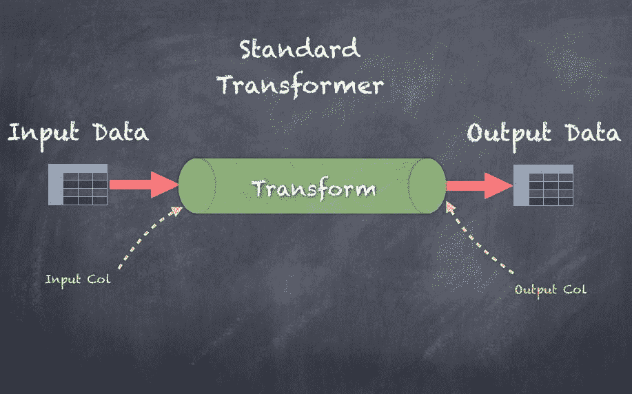
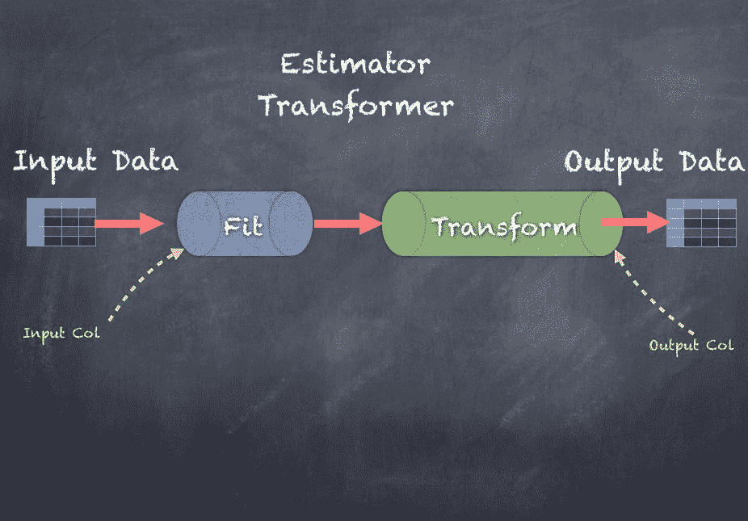
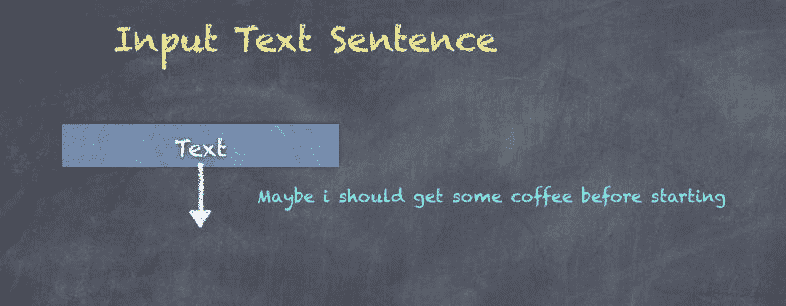
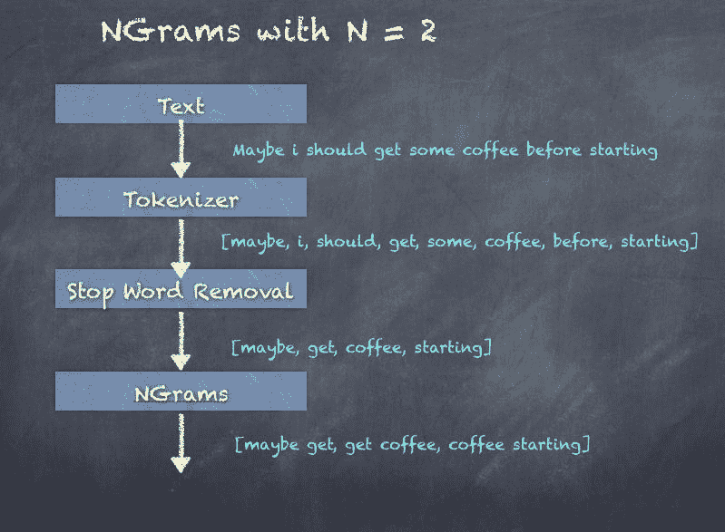
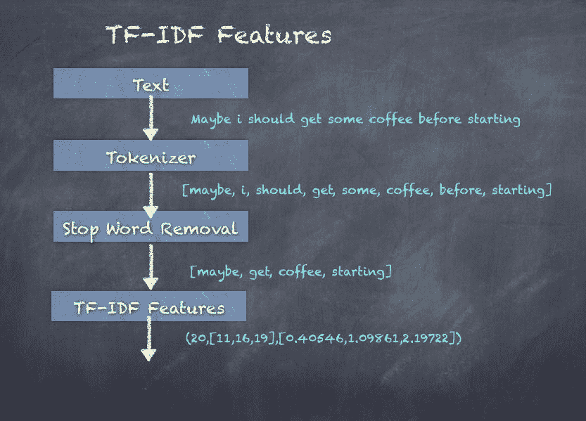
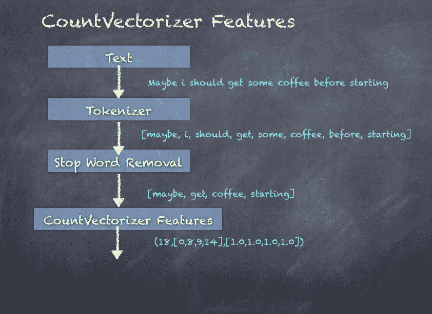

# 使用Spark毫升的文本分析

"Programs must be written for people to read, and only incidentally for machines to execute."

-哈罗德·阿别森

在本章中，我们将讨论使用 Spark ML 进行文本分析的精彩领域。文本分析是机器学习中的一个广泛领域，在许多用例中非常有用，例如情感分析、聊天机器人、电子邮件垃圾检测和自然语言处理。我们将学习如何使用 Spark 进行文本分析，重点是使用 10，000 个样本推特数据集进行文本分类的用例。

简而言之，本章将涵盖以下主题:

*   理解文本分析
*   变压器和估算器
*   Tokenizer
*   停止词移除器
*   NGrams
*   TF-以色列国防军
*   Word2Vec
*   数理器
*   使用 LDA 的主题建模
*   实现文本分类

# 理解文本分析

在最后几章中，我们已经探索了机器学习的世界和 Apache Spark 对机器学习的支持。正如我们所讨论的，机器学习有一个工作流程，将在以下步骤中进行解释:

1.  加载或接收数据。
2.  清理数据。
3.  从数据中提取特征。
4.  基于数据训练模型，以基于特征生成期望的结果。
5.  根据数据评估或预测一些结果。

典型管道的简化视图如下图所示:


因此，在模型被训练和随后被部署之前，有几个可能的数据转换阶段。此外，我们应该期望细化特征和模型属性。我们甚至可以探索一种完全不同的算法，作为新工作流的一部分，重复整个任务序列。

可以使用几个转换步骤来创建步骤流水线，为此，我们使用**域特定语言** ( **DSL** )来定义节点(数据转换步骤)，以创建节点的 **DAG** ( **有向无环图**)。因此，最大似然管道是一系列转换器和估计器，用于将管道模型与输入数据集相匹配。管道中的每个阶段称为*管道阶段*，如下所示:

*   估计量
*   模型
*   管道
*   变压器
*   预言者

当你看一行文本时，我们看到句子、短语、单词、名词、动词、标点符号等等，当它们放在一起时，就有了意义和目的。人类非常善于理解句子、单词、俚语、注释或上下文。这来自于多年的练习和学习如何读/写，正确的语法，标点符号，感叹词，等等。那么，我们如何编写一个计算机程序来尝试复制这种能力呢？

# 文本分析

文本分析是从文本集合中解开含义的方法。通过使用各种技术和算法来处理和分析文本数据，我们可以发现数据中的模式和主题。所有这些的目标是理解非结构化的文本，以便获得上下文意义和关系。

文本分析利用了几大类技术，我们接下来将介绍这些技术。

# 情感分析

分析脸书、推特和其他社交媒体上人们的政治观点是情感分析的一个很好的例子。同样，分析 Yelp 上餐馆的评论也是情感分析的另一个很好的例子。

**自然语言处理** ( **NLP** )框架和库，如 OpenNLP 和 Stanford NLP，通常用于实现情感分析。

# 主题建模

主题建模是一种用于检测文档语料库中的主题的有用技术。这是一种无监督算法，可以在一组文档中找到主题。一个例子是检测新闻文章中涉及的主题。另一个例子是检测专利申请中的想法。

**潜在狄利克雷分配** ( **LDA** )是使用无监督算法的流行聚类模型，而**潜在语义分析** ( **LSA** )对同现数据使用概率模型。

# 术语频率-反向文档频率

TF-IDF 衡量单词在文档中出现的频率以及在整个文档集中的相对频率。这些信息可用于构建分类器和预测模型。例如垃圾邮件分类、聊天对话等等。

# 命名实体识别(NER)

命名实体识别检测句子中单词和名词的用法，以提取有关人员、组织、位置等信息。这提供了关于文档实际内容的重要上下文信息，而不仅仅是将单词视为主要实体。

斯坦福自然语言处理程序和开放自然语言处理程序有 NER 算法的实现。

# 事件提取

事件提取扩展了围绕检测到的实体建立关系的 NER。这可以用来推断两个实体之间的关系。因此，有一个额外的语义理解层来理解文档内容。

# 变压器和估算器

**Transformer** 是一个函数对象，通过将转换逻辑(函数)应用于输入数据集，将一个数据集转换为另一个数据集，从而产生输出数据集。有两种类型的变压器标准变压器和评估变压器。

# 标准变压器

标准转换器将输入数据集转换为输出数据集，将转换函数显式应用于输入数据。除了读取输入列和生成输出列之外，不依赖于输入数据。

这样的转换器被调用，如下所示:

```scala
*outputDF = transfomer.*transform*(inputDF)*

```

标准变压器的示例如下，将在后续章节中详细说明:

*   `Tokenizer`:这将使用空格作为分隔符将句子拆分成单词
*   `RegexTokenizer`:这是用正则表达式将句子拆分成单词来拆分
*   `StopWordsRemover`:这将从单词列表中删除常用的停止单词
*   `Binarizer`:这将字符串转换为二进制数 0/1
*   `NGram`:这将从句子中创建 N 个单词短语
*   `HashingTF`:这将使用哈希表来索引单词，从而创建术语频率计数
*   `SQLTransformer`:这实现了由 SQL 语句定义的转换
*   `VectorAssembler`:这将一个给定的列列表合并成一个向量列

标准 Transformer 的示意图如下，其中输入数据集的输入列被转换为生成输出数据集的输出列:



# 估计变压器

估计器转换器通过首先基于输入数据集生成转换器来将输入数据集转换成输出数据集。然后，转换器处理输入数据，读取输入列，并在输出数据集中生成输出列。

这样的转换器被调用，如下所示:

```scala
*transformer = estimator.*fit*(inputDF)**outputDF = transformer.*transform*(inputDF)*

```

估算器转换器的示例如下:

*   综合资料的文件（intergrated Data File）
*   皱胃向左移
*   Word2Vec

估算器转换器的示意图如下，其中来自输入数据集的输入列被转换为生成输出数据集的输出列:



在接下来的几节中，我们将使用一个简单的示例数据集来更深入地研究文本分析，该数据集由文本行(句子)组成，如下图所示:



接下来的代码用于将文本数据加载到输入数据集中。

使用一系列 ID 和文本对初始化一系列称为行的句子，如下所示。

```scala
val lines = Seq( | (1, "Hello there, how do you like the book so far?"), | (2, "I am new to Machine Learning"), | (3, "Maybe i should get some coffee before starting"), | (4, "Coffee is best when you drink it hot"), | (5, "Book stores have coffee too so i should go to a book store") | )lines: Seq[(Int, String)] = List((1,Hello there, how do you like the book so far?), (2,I am new to Machine Learning), (3,Maybe i should get some coffee before starting), (4,Coffee is best when you drink it hot), (5,Book stores have coffee too so i should go to a book store))

```

接下来，调用`createDataFrame()`函数，根据我们之前看到的句子序列创建一个数据帧。

```scala
scala> val sentenceDF = spark.createDataFrame(lines).toDF("id", "sentence")sentenceDF: org.apache.spark.sql.DataFrame = [id: int, sentence: string]

```

现在，您可以看到新创建的数据集，它显示了包含两个列标识和句子的句子数据框。

```scala
scala> sentenceDF.show(false)|id|sentence ||1 |Hello there, how do you like the book so far? ||2 |I am new to Machine Learning ||3 |Maybe i should get some coffee before starting ||4 |Coffee is best when you drink it hot ||5 |Book stores have coffee too so i should go to a book store|

```

# 标记化

**标记器**将输入字符串转换为小写，然后将带有空格的字符串拆分为单个标记。给定的句子使用默认的空格分隔符或基于客户正则表达式的标记符拆分成单词。无论是哪种情况，输入列都会转换为输出列。特别是，输入列通常是字符串，输出列是单词序列。

通过导入下面显示的两个包，即`Tokenizer`和`RegexTokenize`，可以获得令牌化器:

```scala
import org.apache.spark.ml.feature.Tokenizerimport org.apache.spark.ml.feature.RegexTokenizer

```

首先，需要初始化一个指定输入列和输出列的`Tokenizer`:

```scala
scala> val tokenizer = new Tokenizer().setInputCol("sentence").setOutputCol("words")tokenizer: org.apache.spark.ml.feature.Tokenizer = tok_942c8332b9d8

```

接下来，在输入数据集上调用`transform()`函数产生一个输出数据集:

```scala
scala> val wordsDF = tokenizer.transform(sentenceDF)wordsDF: org.apache.spark.sql.DataFrame = [id: int, sentence: string ... 1 more field]

```

以下是显示输入列标识、句子和输出列单词的输出数据集，其中包含单词序列:

```scala
scala> wordsDF.show(false)|id|sentence |words ||1 |Hello there, how do you like the book so far? |[hello, there,, how, do, you, like, the, book, so, far?] ||2 |I am new to Machine Learning |[i, am, new, to, machine, learning] ||3 |Maybe i should get some coffee before starting |[maybe, i, should, get, some, coffee, before, starting] ||4 |Coffee is best when you drink it hot |[coffee, is, best, when, you, drink, it, hot] ||5 |Book stores have coffee too so i should go to a book store|[book, stores, have, coffee, too, so, i, should, go, to, a, book, store]|

```

另一方面，如果你想建立一个基于正则表达式的`Tokenizer`，你必须使用`RegexTokenizer`而不是`Tokenizer`。为此，您需要初始化一个`RegexTokenizer`，指定输入列和输出列以及要使用的正则表达式模式:

```scala
scala> val regexTokenizer = new RegexTokenizer().setInputCol("sentence").setOutputCol("regexWords").setPattern("\\W")regexTokenizer: org.apache.spark.ml.feature.RegexTokenizer = regexTok_15045df8ce41

```

接下来，在输入数据集上调用`transform()`函数产生一个输出数据集:

```scala
scala> val regexWordsDF = regexTokenizer.transform(sentenceDF)regexWordsDF: org.apache.spark.sql.DataFrame = [id: int, sentence: string ... 1 more field]

```

以下是显示输入列标识、句子和输出列`regexWordsDF`的输出数据集，其中包含单词序列:

```scala
scala> regexWordsDF.show(false)|id|sentence |regexWords ||1 |Hello there, how do you like the book so far? |[hello, there, how, do, you, like, the, book, so, far] ||2 |I am new to Machine Learning |[i, am, new, to, machine, learning] ||3 |Maybe i should get some coffee before starting |[maybe, i, should, get, some, coffee, before, starting] ||4 |Coffee is best when you drink it hot |[coffee, is, best, when, you, drink, it, hot] ||5 |Book stores have coffee too so i should go to a book store|[book, stores, have, coffee, too, so, i, should, go, to, a, book, store]|

```

a `Tokenizer`的图示如下，其中来自输入文本的句子使用空格分隔符分割成单词:


# 停止词移除器

`StopWordsRemover`是一个 Transformer，它接受一个`String`字数组，并在移除所有定义的停止字后返回一个`String`数组。停止词的一些例子是我，你，我的，和，或，等等，它们在英语中相当常用。您可以覆盖或扩展停止词集，以适应用例的目的。如果没有这个清理过程，后续的算法可能会因为常用词而产生偏差。

要调用`StopWordsRemover`，需要导入以下包:

```scala
import org.apache.spark.ml.feature.StopWordsRemover

```

首先需要初始化一个`StopWordsRemover`，指定输入列和输出列。这里，我们选择由`Tokenizer`创建的单词列，并在移除停止单词后为过滤的单词生成输出列:

```scala
scala> val remover = new StopWordsRemover().setInputCol("words").setOutputCol("filteredWords")remover: org.apache.spark.ml.feature.StopWordsRemover = stopWords_48d2cecd3011

```

接下来，在输入数据集上调用`transform()`函数产生一个输出数据集:

```scala
scala> val noStopWordsDF = remover.transform(wordsDF)noStopWordsDF: org.apache.spark.sql.DataFrame = [id: int, sentence: string ... 2 more fields]

```

以下是显示输入列标识、句子和输出列`filteredWords`的输出数据集，其中包含单词序列:

```scala
scala> noStopWordsDF.show(false)|id|sentence |words |filteredWords ||1 |Hello there, how do you like the book so far? |[hello, there,, how, do, you, like, the, book, so, far?] |[hello, there,, like, book, far?] ||2 |I am new to Machine Learning |[i, am, new, to, machine, learning] |[new, machine, learning] ||3 |Maybe i should get some coffee before starting |[maybe, i, should, get, some, coffee, before, starting] |[maybe, get, coffee, starting] ||4 |Coffee is best when you drink it hot |[coffee, is, best, when, you, drink, it, hot] |[coffee, best, drink, hot] ||5 |Book stores have coffee too so i should go to a book store|[book, stores, have, coffee, too, so, i, should, go, to, a, book, store]|[book, stores, coffee, go, book, store]|

```

以下是仅显示句子和`filteredWords`的输出数据集，其中包含过滤后的单词序列:

```scala
scala> noStopWordsDF.select("sentence", "filteredWords").show(5,false)|sentence |filteredWords ||Hello there, how do you like the book so far? |[hello, there,, like, book, far?] ||I am new to Machine Learning |[new, machine, learning] ||Maybe i should get some coffee before starting |[maybe, get, coffee, starting] ||Coffee is best when you drink it hot |[coffee, best, drink, hot] ||Book stores have coffee too so i should go to a book store|[book, stores, coffee, go, book, store]|
```

`StopWordsRemover`的图示如下，显示了过滤掉了 I、should、some、before 等停止词的词:


停止词是默认设置的，但是可以很容易地被覆盖或修改，如下面的代码片段所示，我们将把 hello 作为停止词从过滤的词中删除:

```scala
scala> val noHello = Array("hello") ++ remover.getStopWordsnoHello: Array[String] = Array(hello, i, me, my, myself, we, our, ours, ourselves, you, your, yours, yourself, yourselves, he, him, his, himself, she, her, hers, herself, it, its, itself, they, them, their, theirs, themselves, what, which, who, whom, this, that, these, those, am, is, are, was, were ...scala>//create new transfomer using the amended Stop Words listscala> val removerCustom = new StopWordsRemover().setInputCol("words").setOutputCol("filteredWords").setStopWords(noHello)removerCustom: org.apache.spark.ml.feature.StopWordsRemover = stopWords_908b488ac87f//invoke transform functionscala> val noStopWordsDFCustom = removerCustom.transform(wordsDF)noStopWordsDFCustom: org.apache.spark.sql.DataFrame = [id: int, sentence: string ... 2 more fields]//output dataset showing only sentence and filtered words - now will not show helloscala> noStopWordsDFCustom.select("sentence", "filteredWords").show(5,false)+----------------------------------------------------------+---------------------------------------+|sentence |filteredWords |+----------------------------------------------------------+---------------------------------------+|Hello there, how do you like the book so far? |[there,, like, book, far?] ||I am new to Machine Learning |[new, machine, learning] ||Maybe i should get some coffee before starting |[maybe, get, coffee, starting] ||Coffee is best when you drink it hot |[coffee, best, drink, hot] ||Book stores have coffee too so i should go to a book store|[book, stores, coffee, go, book, store]|+----------------------------------------------------------+---------------------------------------+

```

# NGrams

NGrams 是作为单词序列创建的单词组合。n 代表序列中的字数。例如，2 克是两个单词在一起，3 克是三个单词在一起。`setN()`用于指定`N`的值。

为了生成 NGrams，您需要导入包:

```scala
import org.apache.spark.ml.feature.NGram

```

首先，需要初始化一个指定输入列和输出列的`NGram`生成器。这里，我们选择由`StopWordsRemover`创建的过滤词列，并在去除停止词后为过滤词生成输出列:

```scala
scala> val ngram = new NGram().setN(2).setInputCol("filteredWords").setOutputCol("ngrams")ngram: org.apache.spark.ml.feature.NGram = ngram_e7a3d3ab6115

```

接下来，在输入数据集上调用`transform()`函数产生一个输出数据集:

```scala
scala> val nGramDF = ngram.transform(noStopWordsDF)nGramDF: org.apache.spark.sql.DataFrame = [id: int, sentence: string ... 3 more fields]

```

以下是显示输入列标识、句子和输出列`ngram`的输出数据集，其中包含 n 克序列:

```scala
scala> nGramDF.show(false)|id|sentence |words |filteredWords |ngrams ||1 |Hello there, how do you like the book so far? |[hello, there,, how, do, you, like, the, book, so, far?] |[hello, there,, like, book, far?] |[hello there,, there, like, like book, book far?] ||2 |I am new to Machine Learning |[i, am, new, to, machine, learning] |[new, machine, learning] |[new machine, machine learning] ||3 |Maybe i should get some coffee before starting |[maybe, i, should, get, some, coffee, before, starting] |[maybe, get, coffee, starting] |[maybe get, get coffee, coffee starting] ||4 |Coffee is best when you drink it hot |[coffee, is, best, when, you, drink, it, hot] |[coffee, best, drink, hot] |[coffee best, best drink, drink hot] ||5 |Book stores have coffee too so i should go to a book store|[book, stores, have, coffee, too, so, i, should, go, to, a, book, store]|[book, stores, coffee, go, book, store]|[book stores, stores coffee, coffee go, go book, book store]|

```

以下是显示句子和 2 克的输出数据集:

```scala
scala> nGramDF.select("sentence", "ngrams").show(5,false)|sentence |ngrams ||Hello there, how do you like the book so far? |[hello there,, there, like, like book, book far?] ||I am new to Machine Learning |[new machine, machine learning] ||Maybe i should get some coffee before starting |[maybe get, get coffee, coffee starting] ||Coffee is best when you drink it hot |[coffee best, best drink, drink hot] ||Book stores have coffee too so i should go to a book store|[book stores, stores coffee, coffee go, go book, book store]|
```

NGram 的示意图如下所示，它显示了在标记化和移除停止词后从句子生成的 2 克:



# TF-以色列国防军

TF-IDF 代表术语频率-逆文档频率，它衡量一个单词对文档集合中的一个文档有多重要。它在信息检索中被广泛使用，反映了单词在文档中的权重。TF-IDF 值与单词的出现次数成比例增加，也称为单词/术语的频率，由两个关键元素组成，术语频率和反向文档频率。

TF 是术语频率，它是文档中某个单词/术语的频率。对于术语 *t* ， *tf* 测量术语 *t* 在文件 *d* 中出现的次数。 *tf* 在 Spark 中使用哈希实现，其中通过应用哈希函数将术语映射到索引中。

IDF 是文档频率的倒数，它表示术语提供的关于术语在文档中出现趋势的信息。IDF 是包含以下术语的文档的对数标度反函数:

IDF =总文档/包含术语的文档

一旦我们有了 *TF* 和 *IDF* ，我们可以通过将 *TF* 和 *IDF* 相乘来计算 *TF-IDF* 值:

TF-IDF = TF * IDF

我们现在来看看如何使用 Spark ML 中的 HashingTF Transformer 来生成 *TF* 。

# 哈希

**HashingTF** 是一个 Transformer，它获取一组术语，并通过使用哈希函数对每个术语进行哈希运算来为每个术语生成索引，从而将它们转换为固定长度的向量。然后，使用哈希表的索引生成术语频率。

In Spark, the HashingTF uses the **MurmurHash3** algorithm to hash terms.

要使用`HashingTF`，需要导入以下包:

```scala
import org.apache.spark.ml.feature.HashingTF

```

首先，需要初始化一个`HashingTF`，指定输入列和输出列。这里，我们选择由`StopWordsRemover`转换器创建的过滤单词列，并生成输出列`rawFeaturesDF`。我们还选择功能数量为 100:

```scala
scala> val hashingTF = new HashingTF().setInputCol("filteredWords").setOutputCol("rawFeatures").setNumFeatures(100)hashingTF: org.apache.spark.ml.feature.HashingTF = hashingTF_b05954cb9375

```

接下来，在输入数据集上调用`transform()`函数产生一个输出数据集:

```scala
scala> val rawFeaturesDF = hashingTF.transform(noStopWordsDF)rawFeaturesDF: org.apache.spark.sql.DataFrame = [id: int, sentence: string ... 3 more fields]

```

以下是显示输入列标识、句子和输出列`rawFeaturesDF`的输出数据集，其中包含由向量表示的特征:

```scala
scala> rawFeaturesDF.show(false)|id |sentence |words |filteredWords |rawFeatures ||1 |Hello there, how do you like the book so far? |[hello, there,, how, do, you, like, the, book, so, far?] |[hello, there,, like, book, far?] |(100,[30,48,70,93],[2.0,1.0,1.0,1.0]) ||2 |I am new to Machine Learning |[i, am, new, to, machine, learning] |[new, machine, learning] |(100,[25,52,72],[1.0,1.0,1.0]) ||3 |Maybe i should get some coffee before starting |[maybe, i, should, get, some, coffee, before, starting] |[maybe, get, coffee, starting] |(100,[16,51,59,99],[1.0,1.0,1.0,1.0]) ||4 |Coffee is best when you drink it hot |[coffee, is, best, when, you, drink, it, hot] |[coffee, best, drink, hot] |(100,[31,51,63,72],[1.0,1.0,1.0,1.0]) ||5 |Book stores have coffee too so i should go to a book store|[book, stores, have, coffee, too, so, i, should, go, to, a, book, store]|[book, stores, coffee, go, book, store]|(100,[43,48,51,77,93],[1.0,1.0,1.0,1.0,2.0])|

```

让我们看看前面的输出，以便更好地理解。如果单看`filteredWords`和`rawFeatures`两栏，就可以看出，

1.  单词数组`[hello, there, like, book, and far]`被转换为原始特征向量`(100,[30,48,70,93],[2.0,1.0,1.0,1.0])`。
2.  单词数组`(book, stores, coffee, go, book, and store)`被转换为原始特征向量`(100,[43,48,51,77,93],[1.0,1.0,1.0,1.0,2.0])`。

向量在这里代表什么？底层逻辑是将每个单词散列成一个整数，并根据单词数组中出现的次数进行计数。

Spark 内部为此`mutable.HashMap.empty[Int, Double]`使用一个`hashMap`，将每个单词的哈希值存储为`Integer`键，出现次数存储为双精度值。使用 Double 是为了让我们可以将其与 IDF 结合使用(我们将在下一节中讨论)。使用这张地图，数组`[book, stores, coffee, go, book, store]`可以看作`[hashFunc(book), hashFunc(stores), hashFunc(coffee), hashFunc(go), hashFunc(book), hashFunc(store)]`*，相当于`[43,48,51,77,93]` *。*然后，如果你也计算出现的次数，也就是`book-2, coffee-1,go-1,store-1,stores-1`。*

 *结合前面的信息，我们可以生成一个向量`(numFeatures, hashValues, Frequencies)`**，在这种情况下将是`(100,[43,48,51,77,93],[1.0,1.0,1.0,1.0,2.0])`。**

 **# 反向文档频率

**逆文档频率** ( **IDF** )是一种估计器，它适合于数据集，然后通过缩放输入特征来生成特征。因此，IDF 对一个哈希函数变压器的输出进行处理。

为了调用 IDF，您需要导入包:

```scala
import org.apache.spark.ml.feature.IDF

```

首先，需要初始化一个指定输入列和输出列的`IDF`。这里，我们选择由哈希函数创建的单词列`rawFeatures`，并生成一个输出列特征:

```scala
scala> val idf = new IDF().setInputCol("rawFeatures").setOutputCol("features")idf: org.apache.spark.ml.feature.IDF = idf_d8f9ab7e398e

```

接下来，对输入数据集调用`fit()`函数会产生一个输出转换器:

```scala
scala> val idfModel = idf.fit(rawFeaturesDF)idfModel: org.apache.spark.ml.feature.IDFModel = idf_d8f9ab7e398e

```

此外，对输入数据集调用`transform()`函数会产生一个输出数据集:

```scala
scala> val featuresDF = idfModel.transform(rawFeaturesDF)featuresDF: org.apache.spark.sql.DataFrame = [id: int, sentence: string ... 4 more fields]

```

以下是显示输入列标识和输出列要素的输出数据集，其中包含由哈希函数在之前的转换中生成的缩放要素向量:

```scala
scala> featuresDF.select("id", "features").show(5, false)|id|features ||1 |(20,[8,10,13],[0.6931471805599453,3.295836866004329,0.6931471805599453]) ||2 |(20,[5,12],[1.0986122886681098,1.3862943611198906]) ||3 |(20,[11,16,19],[0.4054651081081644,1.0986122886681098,2.1972245773362196]) ||4 |(20,[3,11,12],[0.6931471805599453,0.8109302162163288,0.6931471805599453]) ||5 |(20,[3,8,11,13,17],[0.6931471805599453,0.6931471805599453,0.4054651081081644,1.3862943611198906,1.0986122886681098])|
```

以下是显示输入列标识、句子、`rawFeatures`和输出列特征的输出数据集，其中包含 HashingTF 在前一次转换中生成的缩放特征向量:

```scala
scala> featuresDF.show(false)|id|sentence |words |filteredWords |rawFeatures |features ||1 |Hello there, how do you like the book so far? |[hello, there,, how, do, you, like, the, book, so, far?] |[hello, there,, like, book, far?] |(20,[8,10,13],[1.0,3.0,1.0]) |(20,[8,10,13],[0.6931471805599453,3.295836866004329,0.6931471805599453]) ||2 |I am new to Machine Learning |[i, am, new, to, machine, learning] |[new, machine, learning] |(20,[5,12],[1.0,2.0]) |(20,[5,12],[1.0986122886681098,1.3862943611198906]) ||3 |Maybe i should get some coffee before starting |[maybe, i, should, get, some, coffee, before, starting] |[maybe, get, coffee, starting] |(20,[11,16,19],[1.0,1.0,2.0]) |(20,[11,16,19],[0.4054651081081644,1.0986122886681098,2.1972245773362196]) ||4 |Coffee is best when you drink it hot |[coffee, is, best, when, you, drink, it, hot] |[coffee, best, drink, hot] |(20,[3,11,12],[1.0,2.0,1.0]) |(20,[3,11,12],[0.6931471805599453,0.8109302162163288,0.6931471805599453]) ||5 |Book stores have coffee too so i should go to a book store|[book, stores, have, coffee, too, so, i, should, go, to, a, book, store]|[book, stores, coffee, go, book, store]|(20,[3,8,11,13,17],[1.0,1.0,1.0,2.0,1.0])|(20,[3,8,11,13,17],[0.6931471805599453,0.6931471805599453,0.4054651081081644,1.3862943611198906,1.0986122886681098])|

```

TF-IDF 的示意图如下，显示了 **TF-IDF 特性**的生成:



# Word2Vec

Word2Vec 是一个复杂的神经网络风格的自然语言处理工具，它使用一种叫做**跳跃式语法**的技术将一句话转换成一个嵌入的向量表示。让我们看一个例子，通过看一组关于动物的句子来说明这是如何使用的:

*   一只狗在叫
*   一些奶牛正在吃草
*   狗通常会随机吠叫
*   这头牛喜欢草

使用具有隐藏层的神经网络(许多无监督学习应用中使用的机器学习算法)，我们可以(用足够多的例子)了解到*狗*和*吠叫*是相关的，*牛*和*草*是相关的，因为它们看起来彼此非常接近，这是用概率来衡量的。`Word2vec`的输出是`Double`特征的向量。

要调用`Word2vec`，需要导入包:

```scala
import org.apache.spark.ml.feature.Word2Vec

```

首先，需要初始化一个指定输入列和输出列的`Word2vec`转换器。这里，我们选择由`Tokenizer`创建的单词列，并为大小为 3 的单词向量生成一个输出列:

```scala
scala> val word2Vec = new Word2Vec().setInputCol("words").setOutputCol("wordvector").setVectorSize(3).setMinCount(0)word2Vec: org.apache.spark.ml.feature.Word2Vec = w2v_fe9d488fdb69

```

接下来，对输入数据集调用`fit()`函数会产生一个输出转换器:

```scala
scala> val word2VecModel = word2Vec.fit(noStopWordsDF)word2VecModel: org.apache.spark.ml.feature.Word2VecModel = w2v_fe9d488fdb69

```

此外，对输入数据集调用`transform()`函数会产生一个输出数据集:

```scala
scala> val word2VecDF = word2VecModel.transform(noStopWordsDF)word2VecDF: org.apache.spark.sql.DataFrame = [id: int, sentence: string ... 3 more fields]

```

以下是显示输入列标识、句子和输出列`wordvector`的输出数据集:

```scala
scala> word2VecDF.show(false)|id|sentence |words |filteredWords |wordvector ||1 |Hello there, how do you like the book so far? |[hello, there,, how, do, you, like, the, book, so, far?] |[hello, there,, like, book, far?] |[0.006875938177108765,-0.00819675214588642,0.0040686681866645815]||2 |I am new to Machine Learning |[i, am, new, to, machine, learning] |[new, machine, learning] |[0.026012470324834187,0.023195965060343344,-0.10863214979569116] ||3 |Maybe i should get some coffee before starting |[maybe, i, should, get, some, coffee, before, starting] |[maybe, get, coffee, starting] |[-0.004304863978177309,-0.004591284319758415,0.02117823390290141]||4 |Coffee is best when you drink it hot |[coffee, is, best, when, you, drink, it, hot] |[coffee, best, drink, hot] |[0.054064739029854536,-0.003801364451646805,0.06522738828789443] ||5 |Book stores have coffee too so i should go to a book store|[book, stores, have, coffee, too, so, i, should, go, to, a, book, store]|[book, stores, coffee, go, book, store]|[-0.05887459063281615,-0.07891856770341595,0.07510609552264214] |

```

**Word2Vec 特性**的示意图如下，显示了正在转换为向量的单词:


# 数理器

`CountVectorizer`用于将文本文档的集合转换成标记计数的向量，实质上在词汇表上产生文档的稀疏表示。最终结果是一个特征向量，然后可以传递给其他算法。稍后，我们将看到如何使用 LDA 算法中`CountVectorizer`的输出来执行主题检测。

要调用`CountVectorizer`，需要导入包:

```scala
import org.apache.spark.ml.feature.CountVectorizer

```

首先，需要初始化一个指定输入列和输出列的`CountVectorizer`转换器。这里，我们选择由`StopWordRemover`创建的`filteredWords`列，并生成输出列特征:

```scala
scala> val countVectorizer = new CountVectorizer().setInputCol("filteredWords").setOutputCol("features")countVectorizer: org.apache.spark.ml.feature.CountVectorizer = cntVec_555716178088

```

接下来，对输入数据集调用`fit()`函数会产生一个输出转换器:

```scala
scala> val countVectorizerModel = countVectorizer.fit(noStopWordsDF)countVectorizerModel: org.apache.spark.ml.feature.CountVectorizerModel = cntVec_555716178088

```

此外，对输入数据集调用`transform()`函数会产生一个输出数据集。

```scala
scala> val countVectorizerDF = countVectorizerModel.transform(noStopWordsDF)countVectorizerDF: org.apache.spark.sql.DataFrame = [id: int, sentence: string ... 3 more fields]

```

以下是显示输入列标识、句子和输出列特征的输出数据集:

```scala
scala> countVectorizerDF.show(false)|id |sentence |words |filteredWords |features ||1 |Hello there, how do you like the book so far? |[hello, there,, how, do, you, like, the, book, so, far?] |[hello, there,, like, book, far?] |(18,[1,4,5,13,15],[1.0,1.0,1.0,1.0,1.0])||2 |I am new to Machine Learning |[i, am, new, to, machine, learning] |[new, machine, learning] |(18,[6,7,16],[1.0,1.0,1.0]) ||3 |Maybe i should get some coffee before starting |[maybe, i, should, get, some, coffee, before, starting] |[maybe, get, coffee, starting] |(18,[0,8,9,14],[1.0,1.0,1.0,1.0]) ||4 |Coffee is best when you drink it hot |[coffee, is, best, when, you, drink, it, hot] |[coffee, best, drink, hot] |(18,[0,3,10,12],[1.0,1.0,1.0,1.0]) ||5 |Book stores have coffee too so i should go to a book store|[book, stores, have, coffee, too, so, i, should, go, to, a, book, store]|[book, stores, coffee, go, book, store]|(18,[0,1,2,11,17],[1.0,2.0,1.0,1.0,1.0])|

```

一个`CountVectorizer`的示意图如下，显示了`StopWordsRemover`变换生成的特征:



# 使用 LDA 的主题建模

LDA 是一个主题模型，它从一组文本文档中推断主题。LDA 可以被认为是一种无监督聚类算法，如下所示:

*   主题对应于聚类中心，文档对应于数据集中的行
*   主题和文档都存在于特征空间中，其中特征向量是字数的向量
*   LDA 不是使用传统的距离来估计聚类，而是使用基于如何生成文本文档的统计模型的函数

为了调用 LDA，您需要导入包:

```scala
import org.apache.spark.ml.clustering.LDA

```

**第一步。**首先，需要初始化一个 LDA 模型，设置 10 个主题和 10 次聚类迭代:

```scala
scala> val lda = new LDA().setK(10).setMaxIter(10)lda: org.apache.spark.ml.clustering.LDA = lda_18f248b08480

```

**第二步。**接下来调用输入数据集上的`fit()`函数，产生一个输出转换器:

```scala
scala> val ldaModel = lda.fit(countVectorizerDF)ldaModel: org.apache.spark.ml.clustering.LDAModel = lda_18f248b08480

```

**第三步。**提取`logLikelihood`，计算给定推断主题的所提供文档的下限:

```scala
scala> val ll = ldaModel.logLikelihood(countVectorizerDF)ll: Double = -275.3298948279124

```

**第四步。**摘录`logPerplexity`，其计算给定推断主题的所提供文档的困惑度的上限:

```scala
scala> val lp = ldaModel.logPerplexity(countVectorizerDF)lp: Double = 12.512670220189033

```

**第五步。**现在，我们可以使用`describeTopics()`获取 LDA 生成的话题:

```scala
scala> val topics = ldaModel.describeTopics(10)topics: org.apache.spark.sql.DataFrame = [topic: int, termIndices: array<int> ... 1 more field]

```

**第六步。**以下是显示通过 LDA 模型计算的`topic`、`termIndices`和`termWeights`的输出数据集:

```scala
scala> topics.show(10, false)|topic|termIndices |termWeights ||0 |[2, 5, 7, 12, 17, 9, 13, 16, 4, 11] |[0.06403877783050851, 0.0638177222807826, 0.06296749987731722, 0.06129482302538905, 0.05906095287220612, 0.0583855194291998, 0.05794181263149175, 0.057342702589298085, 0.05638654243412251, 0.05601913313272188] ||1 |[15, 5, 13, 8, 1, 6, 9, 16, 2, 14] |[0.06889315890755099, 0.06415969116685549, 0.058990446579892136, 0.05840283223031986, 0.05676844625413551, 0.0566842803396241, 0.05633554021408156, 0.05580861561950114, 0.055116582320533423, 0.05471754535803045] ||2 |[17, 14, 1, 5, 12, 2, 4, 8, 11, 16] |[0.06230542516700517, 0.06207673834677118, 0.06089143673912089, 0.060721809302399316, 0.06020894045877178, 0.05953822260375286, 0.05897033457363252, 0.057504989644756616, 0.05586725037894327, 0.05562088924566989] ||3 |[15, 2, 11, 16, 1, 7, 17, 8, 10, 3] |[0.06995373276880751, 0.06249041124300946, 0.061960612781077645, 0.05879695651399876, 0.05816564815895558, 0.05798721645705949, 0.05724374708387087, 0.056034215734402475, 0.05474217418082123, 0.05443850583761207] ||4 |[16, 9, 5, 7, 1, 12, 14, 10, 13, 4] |[0.06739359010780331, 0.06716438619386095, 0.06391509491709904, 0.062049068666162915, 0.06050715515506004, 0.05925113958472128, 0.057946856127790804, 0.05594837087703049, 0.055000929117413805, 0.053537418286233956]||5 |[5, 15, 6, 17, 7, 8, 16, 11, 10, 2] |[0.061611492476326836, 0.06131944264846151, 0.06092975441932787, 0.059812552365763404, 0.05959889552537741, 0.05929123338151455, 0.05899808901872648, 0.05892061664356089, 0.05706951425713708, 0.05636134431063274] ||6 |[15, 0, 4, 14, 2, 10, 13, 7, 6, 8] |[0.06669864676186414, 0.0613859230159798, 0.05902091745149218, 0.058507882633921676, 0.058373998449322555, 0.05740944364508325, 0.057039150886628136, 0.057021822698594314, 0.05677330199892444, 0.056741558062814376]||7 |[12, 9, 8, 15, 16, 4, 7, 13, 17, 10]|[0.06770789917351365, 0.06320078344027158, 0.06225712567900613, 0.058773135159638154, 0.05832535181576588, 0.057727684814461444, 0.056683575112703555, 0.05651178333610803, 0.056202395617563274, 0.05538103218174723]||8 |[14, 11, 10, 7, 12, 9, 13, 16, 5, 1]|[0.06757347958335463, 0.06362319365053591, 0.063359294927315, 0.06319462709331332, 0.05969320243218982, 0.058380063437908046, 0.057412693576813126, 0.056710451222381435, 0.056254581639201336, 0.054737785085167814] ||9 |[3, 16, 5, 7, 0, 2, 10, 15, 1, 13] |[0.06603941595604573, 0.06312775362528278, 0.06248795574460503, 0.06240547032037694, 0.0613859713404773, 0.06017781222489122, 0.05945655694365531, 0.05910351349013983, 0.05751269894725456, 0.05605239791764803] |

```

线性判别分析的图表如下，它显示了从 TF-IDF 的特性创建的主题:


# 实现文本分类

文本分类是机器学习领域中使用最广泛的范例之一，在垃圾邮件检测和电子邮件分类等用例中非常有用，就像任何其他机器学习算法一样，工作流是由 Transformers 和算法构建的。在文本处理领域，停止词去除、词干、标记化、n-gram 提取、TF-IDF 特征加权等预处理步骤发挥作用。一旦所需的处理完成，模型就被训练成将文档分类成两个或多个类。

二进制分类是输入两个输出类别的分类，例如垃圾邮件/非垃圾邮件，并且给定的信用卡交易是否是欺诈性的。多类分类可以生成多个输出类，如热、冷、冻和雨。还有一种技术叫做 Multilabel 分类，它可以生成多个标签，比如速度、安全和燃油效率可以从汽车特征的描述中产生。

为此，我们将使用一个 10k 的推文样本数据集，并且我们将在这个数据集上使用前面的技术。然后，我们将文本行标记为单词，删除停止单词，然后使用`CountVectorizer`构建单词的向量(特征)。

然后我们将数据分为训练(80%)-测试(20%)和训练逻辑回归模型。最后，我们将根据测试数据进行评估，并看看它是如何执行的。

工作流中的步骤如下图所示:


**第一步。**加载包含 10k 条推文的输入文本数据以及标签和标识:

```scala
scala> val inputText = sc.textFile("Sentiment_Analysis_Dataset10k.csv")inputText: org.apache.spark.rdd.RDD[String] = Sentiment_Analysis_Dataset10k.csv MapPartitionsRDD[1722] at textFile at <console>:77

```

**第二步。**将输入行转换为数据帧:

```scala
scala> val sentenceDF = inputText.map(x => (x.split(",")(0), x.split(",")(1), x.split(",")(2))).toDF("id", "label", "sentence")sentenceDF: org.apache.spark.sql.DataFrame = [id: string, label: string ... 1 more field]

```

**第三步。**使用带空格分隔符的`Tokenizer`将数据转换为单词:

```scala
scala> import org.apache.spark.ml.feature.Tokenizerimport org.apache.spark.ml.feature.Tokenizerscala> val tokenizer = new Tokenizer().setInputCol("sentence").setOutputCol("words")tokenizer: org.apache.spark.ml.feature.Tokenizer = tok_ebd4c89f166escala> val wordsDF = tokenizer.transform(sentenceDF)wordsDF: org.apache.spark.sql.DataFrame = [id: string, label: string ... 2 more fields]scala> wordsDF.show(5, true)| id|label| sentence| words|| 1| 0|is so sad for my ...|[is, so, sad, for...|| 2| 0|I missed the New ...|[i, missed, the, ...|| 3| 1| omg its already ...|[, omg, its, alre...|| 4| 0| .. Omgaga. Im s...|[, , .., omgaga.,...|| 5| 0|i think mi bf is ...|[i, think, mi, bf...|

```

**第四步。**删除停止词，并使用过滤后的词创建新的数据框:

```scala
scala> import org.apache.spark.ml.feature.StopWordsRemoverimport org.apache.spark.ml.feature.StopWordsRemoverscala> val remover = new StopWordsRemover().setInputCol("words").setOutputCol("filteredWords")remover: org.apache.spark.ml.feature.StopWordsRemover = stopWords_d8dd48c9cdd0scala> val noStopWordsDF = remover.transform(wordsDF)noStopWordsDF: org.apache.spark.sql.DataFrame = [id: string, label: string ... 3 more fields]scala> noStopWordsDF.show(5, true)| id|label| sentence| words| filteredWords|| 1| 0|is so sad for my ...|[is, so, sad, for...|[sad, apl, friend...|| 2| 0|I missed the New ...|[i, missed, the, ...|[missed, new, moo...|| 3| 1| omg its already ...|[, omg, its, alre...|[, omg, already, ...|| 4| 0| .. Omgaga. Im s...|[, , .., omgaga.,...|[, , .., omgaga.,...|| 5| 0|i think mi bf is ...|[i, think, mi, bf...|[think, mi, bf, c...|

```

**第五步。**根据过滤后的单词创建特征向量:

```scala
scala> import org.apache.spark.ml.feature.CountVectorizerimport org.apache.spark.ml.feature.CountVectorizerscala> val countVectorizer = new CountVectorizer().setInputCol("filteredWords").setOutputCol("features")countVectorizer: org.apache.spark.ml.feature.CountVectorizer = cntVec_fdf1512dfcbdscala> val countVectorizerModel = countVectorizer.fit(noStopWordsDF)countVectorizerModel: org.apache.spark.ml.feature.CountVectorizerModel = cntVec_fdf1512dfcbdscala> val countVectorizerDF = countVectorizerModel.transform(noStopWordsDF)countVectorizerDF: org.apache.spark.sql.DataFrame = [id: string, label: string ... 4 more fields]scala> countVectorizerDF.show(5,true)| id|label| sentence| words| filteredWords| features|| 1| 0|is so sad for my ...|[is, so, sad, for...|[sad, apl, friend...|(23481,[35,9315,2...|| 2| 0|I missed the New ...|[i, missed, the, ...|[missed, new, moo...|(23481,[23,175,97...|| 3| 1| omg its already ...|[, omg, its, alre...|[, omg, already, ...|(23481,[0,143,686...|| 4| 0| .. Omgaga. Im s...|[, , .., omgaga.,...|[, , .., omgaga.,...|(23481,[0,4,13,27...|| 5| 0|i think mi bf is ...|[i, think, mi, bf...|[think, mi, bf, c...|(23481,[0,33,731,...|

```

**第六步。**用一个标签和以下特征创建`inputData`数据框:

```scala
scala> val inputData=countVectorizerDF.select("label", "features").withColumn("label", col("label").cast("double"))inputData: org.apache.spark.sql.DataFrame = [label: double, features: vector]

```

**第七步。**使用随机分割将数据分割成 80%的训练数据集和 20%的测试数据集:

```scala
scala> val Array(trainingData, testData) = inputData.randomSplit(Array(0.8, 0.2))trainingData: org.apache.spark.sql.Dataset[org.apache.spark.sql.Row] = [label: double, features: vector]testData: org.apache.spark.sql.Dataset[org.apache.spark.sql.Row] = [label: double, features: vector]

```

**第八步。**创建逻辑回归模型:

```scala
scala> import org.apache.spark.ml.classification.LogisticRegressionimport org.apache.spark.ml.classification.LogisticRegressionscala> val lr = new LogisticRegression()lr: org.apache.spark.ml.classification.LogisticRegression = logreg_a56accef5728

```

**第九步。**通过拟合`trainingData`建立逻辑回归模型:

```scala
scala> var lrModel = lr.fit(trainingData)lrModel: org.apache.spark.ml.classification.LogisticRegressionModel = logreg_a56accef5728scala> lrModel.coefficientsres160: org.apache.spark.ml.linalg.Vector = [7.499178040193577,8.794520490564185,4.837543313917086,-5.995818019393418,1.1754740390468577,3.2104594489397584,1.7840290776286476,-1.8391923375331787,1.3427471762591,6.963032309971087,-6.92725055841986,-10.781468845891563,3.9752.836891070557657,3.8758544006087523,-11.760894935576934,-6.252988307540...scala> lrModel.interceptres161: Double = -5.397920610780994

```

**第 10 步。**特别考察车型总结`areaUnderROC`，好的车型应该是 *> 0.90* :

```scala
scala> import org.apache.spark.ml.classification.BinaryLogisticRegressionSummaryimport org.apache.spark.ml.classification.BinaryLogisticRegressionSummaryscala> val summary = lrModel.summarysummary: org.apache.spark.ml.classification.LogisticRegressionTrainingSummary = org.apache.spark.ml.classification.BinaryLogisticRegressionTrainingSummary@1dce712cscala> val bSummary = summary.asInstanceOf[BinaryLogisticRegressionSummary]bSummary: org.apache.spark.ml.classification.BinaryLogisticRegressionSummary = org.apache.spark.ml.classification.BinaryLogisticRegressionTrainingSummary@1dce712cscala> bSummary.areaUnderROCres166: Double = 0.9999231930196596scala> bSummary.rocres167: org.apache.spark.sql.DataFrame = [FPR: double, TPR: double]scala> bSummary.pr.show()| recall|precision|| 0.0| 1.0|| 0.2306543172990738| 1.0|| 0.2596354944726621| 1.0|| 0.2832387212429041| 1.0||0.30504929787869733| 1.0|| 0.3304451747833881| 1.0||0.35255452644158947| 1.0|| 0.3740663280549746| 1.0|| 0.3952793546459516| 1.0|

```

**第 11 步。**使用训练好的模型转换训练和测试数据集:

```scala
scala> val training = lrModel.transform(trainingData)training: org.apache.spark.sql.DataFrame = [label: double, features: vector ... 3 more fields]scala> val test = lrModel.transform(testData)test: org.apache.spark.sql.DataFrame = [label: double, features: vector ... 3 more fields]

```

**第 12 步。**统计标签和预测列匹配的记录数。它们应该匹配正确的模型评估，否则会不匹配:

```scala
scala> training.filter("label == prediction").countres162: Long = 8029scala> training.filter("label != prediction").countres163: Long = 19scala> test.filter("label == prediction").countres164: Long = 1334scala> test.filter("label != prediction").countres165: Long = 617

```

结果可以放入如下所示的表格中:

| **数据集** | **总计** | **标签==预测** | **标签！=预测** |
| **训练** | Eight thousand and forty-eight | 8029 ( 99.76%) | 19 (0.24%) |
| **测试** | One thousand nine hundred and fifty-one | 1334 (68.35%) | 617 (31.65%) |

当训练数据产生优秀匹配时，测试数据只有 68.35%匹配。因此，可以通过探索模型参数来进行改进。

逻辑回归是一种易于理解的方法，用于使用逻辑随机变量形式的输入和随机噪声的线性组合来预测二元结果。因此，逻辑回归模型可以使用几个参数进行调整。(全套参数以及如何调整这样的逻辑回归模型不在本章讨论范围之内。)

可用于调整模型的一些参数有:

*   模型超参数包括以下参数:
    *   `elasticNetParam`:此参数指定您希望如何混合 L1 和 L2 正则化
    *   `regParam`:该参数决定了输入在模型中传递之前应该如何正则化
*   训练参数包括以下参数:
    *   `maxIter`:这是停止前的交互总数
    *   `weightCol`:这是权重列的名称，用来比其他行重一些
*   预测参数包括以下参数:
    *   `threshold`:这是二进制预测的概率阈值。这决定了给定类别被预测的最小概率。

我们现在已经看到了如何构建一个简单的分类模型，因此任何新的推文都可以基于训练集进行标记。逻辑回归只是可以使用的模型之一。

可以用来代替逻辑回归的其他模型如下:

*   决策树
*   随机森林
*   梯度增强树
*   多层感知器

# 摘要

在本章中，我们介绍了使用 Spark ML 进行文本分析的世界，重点是文本分类。我们已经了解了变形金刚和估算师。我们已经看到了如何使用记号化器将句子分解成单词，如何移除停止单词，以及如何生成 n-gram。我们还看到了如何实现`HashingTF`和`IDF`来生成基于 TF-IDF 的特征。我们还研究了将单词序列转换成向量的`Word2Vec`。

然后，我们还研究了 LDA，这是一种流行的技术，用于在不太了解实际文本的情况下从文档中生成主题。最后，我们对来自推特数据集的 10k 条推文进行了文本分类，看看如何使用变形金刚、估计器和逻辑回归模型来执行二进制分类。

在下一章中，我们将更深入地研究如何调整 Spark 应用以获得更好的性能。***