# Spark调谐

*"Harpists spend 90 percent of their lives tuning their harps and 10 percent playing out of tune."*

伊戈尔斯特拉文斯基

在这一章中，我们将深入挖掘 Apache Spark 的内部，并看到虽然 Spark 让我们感觉自己只是在使用另一个 Scala 集合，但我们不必忘记 Spark 实际上是在分布式系统中运行的。因此，应该格外小心。简而言之，本章将涵盖以下主题:

*   监控Spark作业
*   Spark配置
*   Spark 应用程序开发中的常见错误
*   优化技术

# 监控Spark作业

Spark 提供了 web UI，用于监控计算节点(驱动程序或执行器)上运行或完成的所有作业。在本节中，我们将通过适当的示例简要讨论如何使用 Spark web UI 监控 Spark 作业。我们将看到如何监控作业的进度(包括提交、排队和运行的作业)。Spark网络用户界面中的所有选项卡将被简要讨论。最后，我们将讨论 Spark 中的日志记录过程，以便进行更好的调整。

# Spark web 界面

网络用户界面(也称为Spark用户界面)是运行Spark应用程序的网络界面，用于监控网络浏览器(如火狐或谷歌浏览器)上作业的执行。当一个 SparkContext 启动时，一个显示应用程序有用信息的网络用户界面在端口 4040 上以独立模式启动。根据应用程序是仍在运行还是已完成执行，Spark web UI 有不同的可用方式。

此外，您可以在应用程序完成执行后，通过使用`EventLoggingListener`持久化所有事件来使用网络用户界面。但是`EventLoggingListener`不能单独工作，需要合并Spark历史服务器。结合这两个特性，可以实现以下功能:

*   调度程序阶段和任务的列表
*   RDD 尺码汇总
*   内存使用
*   环境情报中心
*   关于正在运行的执行者的信息

您可以在网络浏览器中的`http://<driver-node>:4040`处访问用户界面。例如，可以在`http://localhost:4040`访问以独立模式提交和运行的Spark作业。

Note that if multiple SparkContexts are running on the same host, they will bind to successive ports beginning with 4040, 4041, 4042, and so on. By default, this information will be available for the duration of your Spark application only. This means that when your Spark job finishes its execution, the binding will no longer be valid or accessible.

只要作业正在运行，就可以在 Spark UI 上观察到阶段。但是，要在作业完成执行后查看网络用户界面，您可以尝试在提交Spark作业之前将`spark.eventLog.enabled`设置为真。这将强制 Spark 记录用户界面中显示的所有事件，这些事件已经保存在本地文件系统或 HDFS 等存储上。

在前一章中，我们看到了如何向集群提交 Spark 作业。让我们重复使用一个命令来提交 k 均值聚类，如下所示:

```scala
# Run application as standalone mode on 8 coresSPARK_HOME/bin/spark-submit \ --class org.apache.spark.examples.KMeansDemo \ --master local[8] \ KMeansDemo-0.1-SNAPSHOT-jar-with-dependencies.jar \ Saratoga_NY_Homes.txt

```

如果使用前面的命令提交作业，您将无法看到已完成执行的作业的状态，因此要使更改永久化，请使用以下两个选项:

```scala
spark.eventLog.enabled=true spark.eventLog.dir=file:///home/username/log"

```

通过设置前面两个配置变量，我们要求 Spark 驱动程序在`file:///home/username/log`保存事件日志。

总之，通过以下更改，您的提交命令将如下所示:

```scala
# Run application as standalone mode on 8 coresSPARK_HOME/bin/spark-submit \ --conf "spark.eventLog.enabled=true" \ --conf "spark.eventLog.dir=file:///tmp/test" \ --class org.apache.spark.examples.KMeansDemo \ --master local[8] \ KMeansDemo-0.1-SNAPSHOT-jar-with-dependencies.jar \ Saratoga_NY_Homes.txt

```

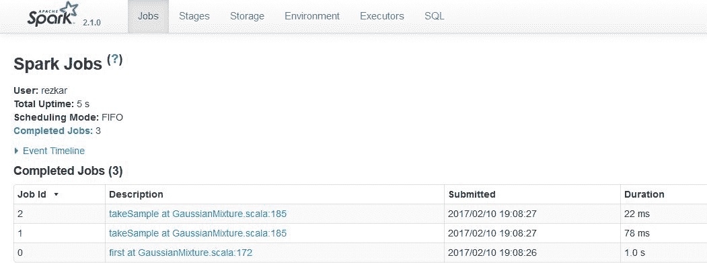

**Figure 1:** Spark web UI

如前面的截图所示，Spark web UI 提供了以下选项卡:

*   乔布斯
*   阶段
*   储存；储备
*   环境
*   实施者
*   结构化查询语言

需要注意的是，所有的特征可能不会一次可见，因为它们是根据需要(例如，在运行流作业时)缓慢创建的。

# 乔布斯

根据Spark上下文，“作业”选项卡显示Spark应用程序中所有Spark作业的状态。当您在`http://localhost:4040`使用网络浏览器访问Spark界面上的作业选项卡时(对于独立模式)，您应该注意以下选项:

*   用户:显示提交Spark作业的活动用户
*   总正常运行时间:显示作业的总正常运行时间
*   调度模式:在大多数情况下，它是先进先出(又名先进先出)
*   活动作业:显示活动作业的数量
*   已完成作业:显示已完成作业的数量
*   事件时间线:显示已完成执行的作业的时间线

在内部，作业选项卡由`JobsTab`类表示，这是一个带有作业前缀的自定义 SparkUI 选项卡。“作业”选项卡使用`JobProgressListener`访问有关Spark作业的统计信息，以在页面上显示上述信息。请看下面的截图:


**Figure 2:** The jobs tab in the Spark web UI

如果在“作业”选项卡中进一步展开“活动作业”选项，您将能够看到该特定作业的执行计划、状态、已完成阶段数和作业标识，如以下所示:


**Figure 3:** The DAG visualization for task in the Spark web UI (abridged)

当用户在 Spark 控制台中输入代码时(例如，Spark shell 或使用 Spark submit)，Spark Core 会创建一个操作员图形。这基本上是当用户在特定节点上对 RDD(不可变对象)执行一个操作(例如，减少、收集、计数、第一、获取、计数键、保存文本文件)或转换(例如，映射、平面映射、过滤器、映射分区、样本、并集、交集、相异)时发生的情况。


**Figure 4:** DAG scheduler transforming RDD lineage into stage DAG

在转换或动作期间，**有向无环图** ( **DAG** )信息用于将节点恢复到最后的转换和动作(更清晰的图片请参考*图 4* 和*图 5* )以保持数据弹性。最后，该图被提交给一个 DAG 调度器。

How does Spark compute the DAG from the RDD and subsequently execute the task?
At a high level, when any action is called on the RDD, Spark creates the DAG and submits it to the DAG scheduler. The DAG scheduler divides operators into stages of tasks. A stage comprises tasks based on partitions of the input data. The DAG scheduler pipelines operators together. For example, many map operators can be scheduled in a single stage. The final result of a DAG scheduler is a set of stages. The stages are passed on to the task scheduler. The task scheduler launches tasks through the cluster manager (Spark Standalone/YARN/Mesos). The task scheduler doesn't know about the dependencies of the stages. The worker executes the tasks on the stage.

然后，DAG 调度器跟踪阶段输出从哪个 RDD 具体化。然后，它找到运行作业的最小计划，并将相关操作员划分为任务阶段。基于输入数据的划分，一个阶段包括多个任务。然后，操作符与 DAG 调度程序一起被流水线化。实际上，可以在单个阶段中调度多个映射或缩减操作符(例如)。


**Figure 5:** Executing action leads to new ResultStage and ActiveJob in DAGScheduler

DAG 调度器中的两个基本概念是作业和阶段。因此，它必须通过内部注册表和计数器来跟踪它们。从技术上讲，DAG 调度程序是 SparkContext 初始化的一部分，专门在驱动程序上工作(在任务调度程序和调度程序后端准备好之后立即工作)。DAG 调度器负责 Spark 执行中的三个主要任务。它计算一个作业的执行 DAG，即阶段的 DAG。它确定运行每个任务的首选节点，并处理由于无序输出文件丢失而导致的故障。


**Figure 6:** DAGScheduler as created by SparkContext with other services

DAG 调度器的最终结果是一组阶段。因此，使用这种可视化可以看到作业的大多数统计信息和状态，例如，执行计划、状态、已完成阶段的数量以及该特定作业的作业标识。

# 阶段

Spark UI 中的“阶段”选项卡显示了 Spark 应用程序中所有作业的所有阶段的当前状态，包括两个可选的任务页面以及阶段和池详细信息的统计信息。请注意，只有当应用程序在公平调度模式下工作时，此信息才可用。您应该可以在`http://localhost:4040/stages`访问阶段选项卡。请注意，当没有提交的作业时，选项卡除了标题什么也不显示。“阶段”选项卡显示Spark应用程序中的阶段。在该选项卡中可以看到以下阶段:

*   活动阶段
*   待定阶段
*   已完成的阶段

例如，当您在本地提交Spark作业时，您应该能够看到以下状态:


**Figure 7:** The stages for all jobs in the Spark web UI

在这种情况下，只有一个阶段是活动阶段。然而，在接下来的章节中，我们将能够观察到向 AWS EC2 集群提交Spark作业的其他阶段。

要进一步深入了解已完成作业的摘要，请单击“描述”列中包含的任何链接，您应该会发现相关的执行时间统计数据作为指标。下图还显示了指标的最小、中值、第 25 百分位、第 75 百分位和最大值的大致时间:

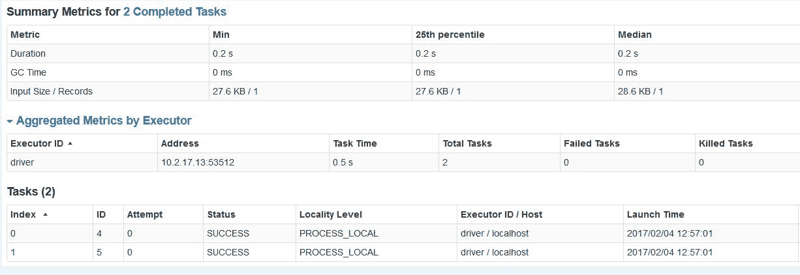

**Figure 8:** The summary for completed jobs on the Spark web UI

你的情况可能会有所不同，因为在撰写本书期间，我只执行并提交了两份工作用于演示目的。您还可以看到关于执行者的其他统计数据。就我而言，我在独立模式下提交了这些作业，使用了 8 个内核和 32 GB 内存。除此之外，还会显示与执行器相关的信息，如 ID、带有关联端口号的 IP 地址、任务完成时间、任务数量(包括失败任务、终止任务和成功任务的数量)以及每个记录的数据集输入大小。

图像中的另一部分显示了与这两个任务相关的其他信息，例如，索引、ID、尝试、状态、位置级别、主机信息、启动时间、持续时间、**垃圾收集** ( **GC** )时间等等。

# 储存；储备

存储选项卡显示每个 RDD、数据帧或数据集的大小和内存使用情况。您应该能够看到关系数据库、数据框或数据集的存储相关信息。下图显示了存储元数据，如 RDD 名称、存储级别、缓存分区数、缓存数据的百分比以及主内存中 RDD 的大小:

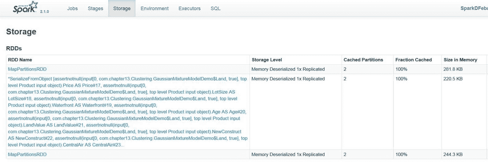

**Figure 9:** Storage tab shows space consumed by an RDD in disk

请注意，如果 RDD 不能缓存在主内存中，将使用磁盘空间。更详细的讨论将在本章的后面部分进行。


**Figure 10:** Data distribution and the storage used by the RDD in disk

# 环境

“环境”选项卡显示当前在您的机器上设置的环境变量(即驱动程序)。更具体地说，运行时信息，如 Java 主页、Java 版本和 Scala 版本，可以在运行时信息下看到。可以看到Spark属性，如Spark应用程序标识、应用程序名称和驱动程序主机信息、驱动程序端口、执行器标识、主网址以及计划模式。此外，其他与系统相关的属性和作业属性，如 AWT 工具包版本、文件编码类型(例如，UTF-8)和文件编码包信息(例如，sun.io)，可以在系统属性下看到。


**Figure 11:** Environment tab on Spark web UI

# 实施者

“执行者”选项卡使用`ExecutorsListener`来收集Spark应用程序的执行者信息。执行器是负责执行任务的分布式代理。执行器以不同的方式实例化。例如，当`CoarseGrainedExecutorBackend`收到“Spark独立”和“纱”的`RegisteredExecutor`消息时，它们可以被实例化。第二种情况是当 Spark 作业提交给 Mesos 时。Mesos 的`MesosExecutorBackend`注册了。第三种情况是当您在本地运行您的 Spark 作业时，即创建了`LocalEndpoint`。执行器通常在 Spark 应用程序的整个生命周期内运行，这被称为执行器的静态分配，尽管您也可以选择动态分配。执行器后端专门管理计算节点或集群中的所有执行器。执行器定期向驱动程序上的**心跳接收器** RPC 端点报告活动任务的心跳和部分指标，并将结果发送给驱动程序。它们还为用户程序通过块管理器缓存的 rdd 提供内存存储。有关这方面的更清晰的想法，请参考下图:

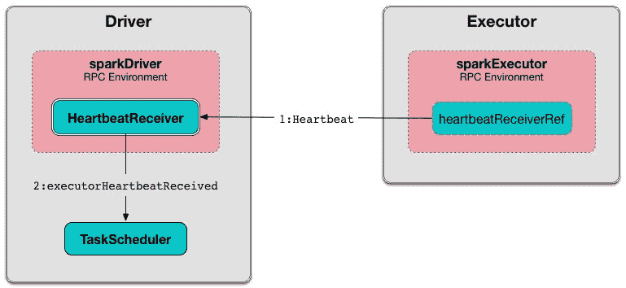

**图 12:** Spark 驱动程序实例化了一个执行器，负责 HeartbeatReceiver 的 Heartbeat 消息处理程序

当执行器启动时，它首先向驱动程序注册，并直接通信以执行任务，如下图所示:

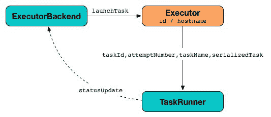

**图 13:** 使用任务运行器在执行器上启动任务

您应该可以在`http://localhost:4040/executors`访问“执行者”标签。

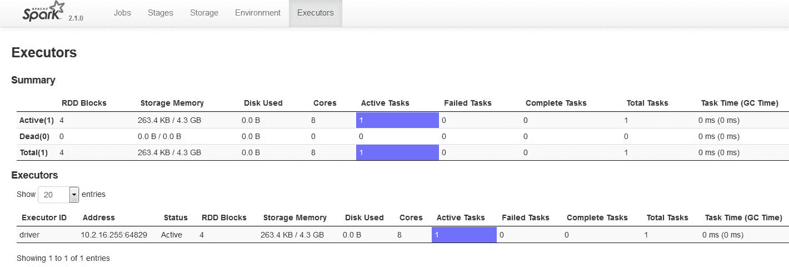

**Figure 14:** Executor tab on Spark web UI

如上图所示，可以看到执行器的执行器 ID、地址、状态、RDD 块、存储内存、已用磁盘、核心、活动任务、失败任务、完成任务、总任务、任务时间(GC 时间)、输入、随机读取、随机写入和线程转储。

# 结构化查询语言

“Spark”用户界面中的“SQL”选项卡显示每个运算符的所有累加器值。您应该可以在`http://localhost:4040/SQL/`访问 SQL 选项卡。默认情况下，它显示所有的 SQL 查询执行和底层信息。但是，“SQL”选项卡仅在选择查询后才显示 SQL 查询执行的详细信息。

关于 SQL 的详细讨论超出了本章的范围。感兴趣的读者可以参考[http://spark . Apache . org/docs/latest/sql-programming-guide . html # SQL](http://spark.apache.org/docs/latest/sql-programming-guide.html#sql)了解更多关于如何提交一个 SQL 查询并查看其结果输出。

# 使用网络用户界面可视化Spark应用程序

当Spark作业提交执行时，会启动一个网络应用程序用户界面，显示关于该应用程序的有用信息。事件时间线显示应用程序事件的相对顺序和交错。时间轴视图有三个级别:跨所有作业、在一个作业内和在一个阶段内。时间线还显示执行器分配和解除分配。


**Figure 15:** Spark jobs executed as DAG on Spark web UI

# 观察正在运行和已完成的Spark作业

要访问和观察正在运行和已完成的Spark作业，请在网络浏览器中打开`http://spark_driver_host:4040`。请注意，您必须相应地用 IP 地址或主机名替换`spark_driver_host`。

Note that if multiple SparkContexts are running on the same host, they will bind to successive ports beginning with 4040, 4041, 4042, and so on. By default, this information will be available for the duration of your Spark application only. This means that when your Spark job finishes its execution, the binding will no longer be valid or accessible.

现在，要访问仍在执行的活动作业，请单击活动作业链接，您将看到这些作业的相关信息。另一方面，要访问已完成作业的状态，请单击已完成作业，您将看到如前一节所述的 DAG 样式的信息。

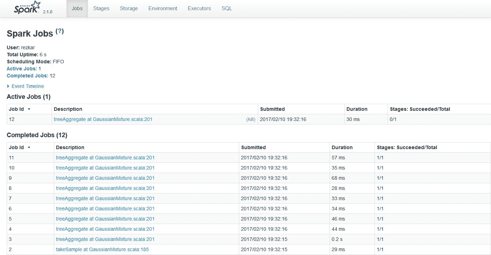

**Figure 16:** Observing the running and completed Spark jobs

您可以通过单击“活动作业”或“已完成作业”下的作业描述链接来实现这些目标。

# 使用日志调试 Spark 应用程序

查看所有正在运行的 Spark 应用程序的信息取决于您使用的集群管理器。调试 Spark 应用程序时，您应该遵循以下说明:

*   **Spark独立**:进入`http://master:18080`Spark主界面。主节点和每个工作节点显示集群和相关的作业统计信息。此外，每个作业的详细日志输出也被写入每个工作人员的工作目录。我们将讨论如何使用带有Spark的`log4j`手动启用日志记录。
*   **纱**:如果您的集群管理器是纱，并且假设您正在 Cloudera(或任何其他基于纱的平台)上运行您的 Spark 作业，那么转到 Cloudera 管理器管理控制台中的纱应用程序页面。现在，要调试运行在纱上的Spark应用程序，查看节点管理器角色的日志。为此，请打开日志事件查看器，然后过滤事件流以选择时间窗口和日志级别，并显示节点管理器源。您也可以通过命令访问日志。该命令的格式如下:

```scala
 yarn logs -applicationId <application ID> [OPTIONS]

```

例如，以下是这些标识的有效命令:

```scala
 yarn logs -applicationId application_561453090098_0005     yarn logs -applicationId application_561453090070_0005 userid

```

请注意，用户标识是不同的。但是，只有在`yarn-site.xml`中`yarn.log-aggregation-enable`为真，并且应用程序已经完成执行时，这种情况才成立。

# 使用 log4j 和 Spark 记录

Spark 使用`log4j`进行自己的测井。后端发生的所有操作都被记录到 Spark shell 控制台(它已经被配置到底层存储)。Spark 提供了一个`log4j`的模板作为属性文件，我们可以扩展和修改该文件来登录 Spark。移动到`SPARK_HOME/conf`目录，你应该会看到`log4j.properties.template`文件。这可以帮助我们作为自己的日志系统的起点。

现在，让我们在运行 Spark 作业时创建自己的自定义日志记录系统。完成后，将文件重命名为`log4j.properties`，并将其放在同一目录下(即项目树)。该文件的示例快照如下所示:


**Figure 17:** A snap of the log4j.properties file

默认情况下，一切都转到控制台和文件。但是，如果您想绕过所有的噪声日志到一个位于，比如说，`/var/log/sparkU.log`的系统文件，那么您可以在`log4j.properties`文件中设置这些属性如下:

```scala
log4j.logger.spark.storage=INFO, RollingAppenderlog4j.additivity.spark.storage=falselog4j.logger.spark.scheduler=INFO, RollingAppenderlog4j.additivity.spark.scheduler=falselog4j.logger.spark.CacheTracker=INFO, RollingAppenderlog4j.additivity.spark.CacheTracker=falselog4j.logger.spark.CacheTrackerActor=INFO, RollingAppenderlog4j.additivity.spark.CacheTrackerActor=falselog4j.logger.spark.MapOutputTrackerActor=INFO, RollingAppenderlog4j.additivity.spark.MapOutputTrackerActor=falselog4j.logger.spark.MapOutputTracker=INFO, RollingAppenderlog4j.additivty.spark.MapOutputTracker=false

```

基本上，我们希望隐藏 Spark 生成的所有日志，这样我们就不必在 shell 中处理它们。我们将它们重定向到文件系统中进行记录。另一方面，我们希望我们自己的日志记录在 shell 和一个单独的文件中，这样它们就不会与 Spark 中的日志混淆。从这里，我们将 Splunk 指向我们自己的日志所在的文件，在这个特定的例子中是`/var/log/sparkU.log` *。*

然后`log4j.properties`文件在应用程序启动时被 Spark 拾取，所以除了把它放在提到的位置之外，我们什么都不用做。

现在让我们看看如何创建我们自己的日志系统。看看下面的代码，试着理解这里发生了什么:

```scala
import org.apache.spark.{SparkConf, SparkContext}import org.apache.log4j.LogManagerimport org.apache.log4j.Levelimport org.apache.log4j.Loggerobject MyLog {def main(args: Array[String]):Unit= {// Stting logger level as WARNval log = LogManager.getRootLoggerlog.setLevel(Level.WARN)// Creating Spark Contextval conf = new SparkConf().setAppName("My App").setMaster("local[*]")val sc = new SparkContext(conf)//Started the computation and printing the logging informationlog.warn("Started")                        val data = sc.parallelize(1 to 100000)log.warn("Finished")}}

```

前面的代码在概念上只记录警告消息。它首先打印警告消息，然后通过将 1 到 100，000 的数字并行化来创建 RDD。一旦 RDD 作业完成，它将打印另一个警告日志。然而，我们还没有注意到早期代码段的一个问题。

`org.apache.log4j.Logger`类的一个缺点是它不可序列化(更多细节请参考优化技术部分)，这意味着我们不能在对 Spark API 的某些部分进行操作时在*闭包*中使用它。例如，如果您尝试执行以下代码，您应该会遇到一个异常，显示任务不可序列化:

```scala
object MyLog {def main(args: Array[String]):Unit= {// Stting logger level as WARNval log = LogManager.getRootLoggerlog.setLevel(Level.WARN)// Creating Spark Contextval conf = new SparkConf().setAppName("My App").setMaster("local[*]")val sc = new SparkContext(conf)//Started the computation and printing the logging informationlog.warn("Started")val i = 0val data = sc.parallelize(i to 100000)data.foreach(i => log.info("My number"+ i))log.warn("Finished")}}

```

解决这个问题也很容易；只需用`extends Serializable`声明 Scala 对象，现在代码如下:

```scala
class MyMapper(n: Int) extends Serializable{@transient lazy val log = org.apache.log4j.LogManager.getLogger("myLogger")def MyMapperDosomething(rdd: RDD[Int]): RDD[String] =rdd.map{ i =>log.warn("mapping: " + i)(i + n).toString}}

```

所以在前面的代码中发生的是闭包不能整齐地分布到所有分区，因为它不能在记录器上关闭；因此，类型`MyMapper`的整个实例被分配给所有分区；完成后，每个分区都会创建一个新的日志记录程序，并将其用于日志记录。

总之，下面是帮助我们解决这个问题的完整代码:

```scala
package com.example.Personalimport org.apache.log4j.{Level, LogManager, PropertyConfigurator}import org.apache.spark._import org.apache.spark.rdd.RDDclass MyMapper(n: Int) extends Serializable{@transient lazy val log = org.apache.log4j.LogManager.getLogger("myLogger")def MyMapperDosomething(rdd: RDD[Int]): RDD[String] =rdd.map{ i =>log.warn("Serialization of: " + i)(i + n).toString}}object MyMapper{def apply(n: Int): MyMapper = new MyMapper(n)}object MyLog {def main(args: Array[String]) {val log = LogManager.getRootLoggerlog.setLevel(Level.WARN)val conf = new SparkConf().setAppName("My App").setMaster("local[*]")val sc = new SparkContext(conf)log.warn("Started")val data = sc.parallelize(1 to 100000)val mapper = MyMapper(1)val other = mapper.MyMapperDosomething(data)other.collect()log.warn("Finished")}}

```

输出如下:

```scala
17/04/29 15:33:43 WARN root: Started ..17/04/29 15:31:51 WARN myLogger: mapping: 1 17/04/29 15:31:51 WARN myLogger: mapping: 4999217/04/29 15:31:51 WARN myLogger: mapping: 4999917/04/29 15:31:51 WARN myLogger: mapping: 50000 .. 17/04/29 15:31:51 WARN root: Finished

```

我们将在下一节讨论 Spark 的内置日志记录。

# Spark配置

有许多方法可以配置您的 Spark 作业。在本节中，我们将讨论这些方法。更具体地说，根据 Spark 2.x 版本，有三个位置可以配置系统:

*   Spark属性
*   环境变量
*   记录

# Spark属性

如前所述，Spark属性控制大多数特定于应用程序的参数，并且可以使用Spark的`SparkConf`对象进行设置。或者，可以通过 Java 系统属性来设置这些参数。`SparkConf`允许您配置一些常见属性，如下所示:

```scala
setAppName() // App name setMaster() // Master URL setSparkHome() // Set the location where Spark is installed on worker nodes. setExecutorEnv() // Set single or multiple environment variables to be used when launching executors. setJars() // Set JAR files to distribute to the cluster. setAll() // Set multiple parameters together.

```

应用程序可以配置为使用机器上的多个可用内核。例如，我们可以用如下两个线程初始化一个应用程序。请注意，我们使用`local [2]`运行，这意味着两个线程，这代表最小的并行性，并使用`local [*]`，这利用了您机器中所有可用的内核。或者，您可以在使用以下Spark提交脚本提交Spark作业时指定执行者的数量:

```scala
val conf = new SparkConf() .setMaster("local[2]") .setAppName("SampleApp") val sc = new SparkContext(conf)

```

在某些特殊情况下，您可能需要在需要时动态加载Spark属性。您可以在通过 spark-submit 脚本提交 Spark 作业时执行此操作。更具体地说，您可能希望避免在`SparkConf`中硬编码某些配置。

Apache Spark precedence:
Spark has the following precedence on the submitted jobs: configs coming from a config file have the lowest priority. The configs coming from the actual code have higher priority with respect to configs coming from a config file, and configs coming from the CLI through the Spark-submit script have higher priority.

例如，如果您希望使用不同的主设备、执行器或不同的内存量来运行应用程序，Spark 允许您简单地创建一个空的配置对象，如下所示:

```scala
val sc = new SparkContext(new SparkConf())

```

然后，您可以在运行时为您的 Spark 作业提供如下配置:

```scala
SPARK_HOME/bin/spark-submit  --name "SmapleApp" \ --class org.apache.spark.examples.KMeansDemo \ --master mesos://207.184.161.138:7077 \ # Use your IP address --conf spark.eventLog.enabled=false --conf "spark.executor.extraJavaOptions=-XX:+PrintGCDetails" \     --deploy-mode cluster \ --supervise \ --executor-memory 20G \ myApp.jar

```

`SPARK_HOME/bin/spark-submit`还将从`SPARK_HOME /conf/spark-defaults.conf`读取配置选项，其中每行由一个键和值组成，用空格隔开。一个例子如下:

```scala
spark.master  spark://5.6.7.8:7077 spark.executor.memor y   4g spark.eventLog.enabled true spark.serializer org.apache.spark.serializer.KryoSerializer

```

属性文件中指定为标志的值将被传递给应用程序，并与通过`SparkConf`指定的值合并。最后，如前所述，`http://<driver>:4040`处的应用程序网络用户界面列出了环境选项卡下的所有Spark属性。

# 环境变量

环境变量可用于在计算节点或机器设置中设置设置。例如，可以通过每个计算节点上的`conf/spark-env.sh`脚本设置 IP 地址。下表列出了需要设置的环境变量的名称和功能:

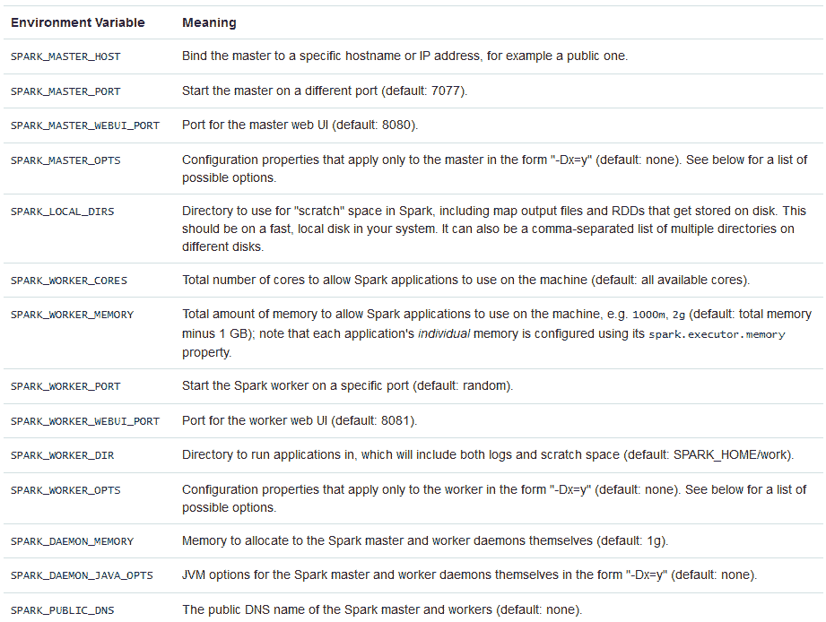

**Figure 18:** Environmental variables and their meaning

# 记录

最后，可以通过 Spark 应用程序树下的`log4j.properties`文件配置日志记录，如前一节所述。Spark 使用 log4j 进行日志记录。带有 Spark 的 log4j 支持几种有效的日志记录级别；它们如下:

| **日志级别** | 用途 |
| 离开 | 这是最具体的，不允许任何日志记录 |
| 致命的 | 这是最具体的一个，显示致命的错误，几乎没有数据 |
| 错误 | 这仅显示一般错误 |
| 警告 | 这显示了建议修复但非强制的警告 |
| 信息 | 这显示了您的 Spark 工作所需的信息 |
| 调试 | 调试时，将打印这些日志 |
| 找到；查出 | 这为大量数据提供了最不具体的错误跟踪 |
| 全部 | 包含所有数据的最不具体的消息 |

**Table 1:** Log level with log4j and Spark

您可以在`conf/log4j.properties`中设置Spark外壳的默认日志记录。在独立的Spark应用程序中或在Spark外壳会话中，使用`conf/log4j.properties.template`作为起点。在本章的前一节中，我们建议您在基于 IDE 的环境(如 Eclipse)中工作时，将`log4j.properties`文件放在项目目录下。但是，要完全禁用日志记录，您应该使用下面的`conf/log4j.properties.template`作为`log4j.properties`。只需将`log4j.logger.org`标志设置为关闭，如下所示:

```scala
log4j.logger.org=OFF

```

在下一节中，我们将讨论开发人员或程序员在开发和提交 Spark 作业时犯的一些常见错误。

# Spark 应用程序开发中的常见错误

经常发生的常见错误是应用程序故障、由于众多因素而陷入停滞的缓慢作业、聚合、动作或转换中的错误、主线程中的异常，当然还有内存不足(T0)(**OOM**)。

# 应用程序失败

大多数情况下，应用程序失败是因为一个或多个阶段最终失败。正如本章前面所讨论的，Spark作业包括几个阶段。阶段不是独立执行的:例如，处理阶段不能发生在相关的输入-读取阶段之前。因此，假设阶段 1 执行成功，但阶段 2 执行失败，整个应用程序最终会失败。这可以显示如下:


**Figure 19:** Two stages in a typical Spark job

为了展示一个例子，假设您有以下三个 RDD 操作作为阶段。同样可以可视化的有*图 20**图 21**图 22* :

```scala
val rdd1 = sc.textFile(“hdfs://data/data.csv”).map(someMethod).filter(filterMethod)   

```


**Figure 20:** Stage 1 for rdd1

```scala
val rdd2 = sc.hadoopFile(“hdfs://data/data2.csv”).groupByKey().map(secondMapMethod)

```

从概念上来说，这可以在*图 21* 中显示，首先使用`hadoopFile()`方法解析数据，使用`groupByKey()`方法分组，最后映射:


**Figure 21:** Stage 2 for rdd2

```scala
val rdd3 = rdd1.join(rdd2).map(thirdMapMethod)

```

从概念上讲，这可以在*图 22* 中显示，首先解析数据，连接数据，最后映射数据:

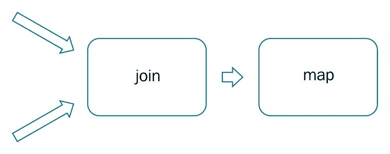

**Figure 22:** Stage 3 for rdd3

现在，您可以执行聚合功能，例如，收集，如下所示:

```scala
rdd3.collect()

```

嗯！你已经开发了一个由三个阶段组成的Spark工作。从概念上讲，这可以如下所示:


**Figure 23:** three stages for the rdd3.collect() operation

现在，如果其中一个阶段失败了，你的工作最终会失败。因此，最终的`rdd3.collect()`语句将抛出一个关于阶段失败的异常。此外，您可能对以下四个因素有疑问:

*   聚合操作中的错误
*   主线程中的异常
*   面向对象的程序设计(Object Oriented Programming)
*   使用`spark-submit`脚本提交作业时，类未发现异常
*   对 Spark 核心库中一些 API/方法的误解

为了解决上述问题，我们的一般建议是确保您在执行任何地图、平面地图或聚合操作时没有犯任何错误。其次，在用 Java 或 Scala 开发应用程序时，确保主方法没有缺陷。有时您在代码中看不到任何语法错误，但是为您的应用程序开发一些小的测试用例是很重要的。主方法中最常见的异常如下:

*   `java.lang.noclassdeffounderror`
*   `java.lang.nullpointerexception`
*   `java.lang.arrayindexoutofboundsexception`
*   `java.lang.stackoverflowerror`
*   `java.lang.classnotfoundexception`
*   `java.util.inputmismatchexception`

通过仔细编写 Spark 应用程序，可以避免这些异常。或者，广泛使用 Eclipse(或任何其他 IDEs)的代码调试功能来消除语义错误以避免异常。对于第三个问题，也就是 OOM，这是一个很常见的问题。需要注意的是，Spark 需要至少 8 GB 的主内存，并且有足够的磁盘空间用于独立模式。另一方面，要获得完整的集群计算设施，这一要求往往很高。

Preparing a JAR file including all the dependencies to execute Spark jobs is of paramount importance. Many practitioners use Google's Guava; it is included in most distributions, yet it doesn't guarantee backward compatibility. This means that sometimes your Spark job won't find a Guava class even if you explicitly provided it; this happens because one of the two versions of the Guava libraries takes precedence over the other, and this version might not include a required class. In order to overcome this issue, you usually resort to shading.

如果您使用 IntelliJ、Vim、Eclipse、记事本等进行编码，请确保您已经使用–Xmx 参数将 Java 堆空间设置为足够大的值。使用集群模式时，您应该在使用 Spark-submit 脚本提交 Spark 作业时指定执行器内存。假设您有一个要解析的 CSV，并使用随机森林分类器进行一些预测性分析，您可能需要指定正确的内存量，比如 20 GB，如下所示:

```scala
--executor-memory 20G

```

即使您收到 OOM 错误，您也可以将这个数量增加到例如 32 GB 或更多。由于随机森林是计算密集型的，需要更大的内存，这只是随机森林的一个例子。在解析数据时，您可能会遇到类似的问题。甚至一个特定的阶段也可能因为这个 OOM 错误而失败。因此，请确保您知道此错误。

对于`class not found exception`，确保您已经在生成的 JAR 文件中包含了您的主类。JAR 文件应该准备好在集群节点上执行 Spark 作业的所有依赖项。我们将在[第 17 章](17.html#F7AFE1-21aec46d8593429cacea59dbdcd64e1c)、*前往集群地的时间-在集群上部署Spark中提供一个逐步的 JAR 准备指南。*

对于最后一期，我们可以提供一些关于 Spark Core 库的一些误解的例子。例如，当您使用`wholeTextFiles`方法从多个文件中准备 RDDs 或数据帧时，Spark 不会并行运行；在纱的集群模式下，有时可能会耗尽内存。

有一次，我遇到了一个问题，起初，我将 S3 存储中的六个文件复制到了 HDFS。然后，我试图创建一个 RDD，如下所示:

```scala
sc.wholeTextFiles("/mnt/temp") // note the location of the data files is /mnt/temp/

```

然后，我尝试使用 UDF 一行一行地处理这些文件。当我查看我的计算节点时，我看到每个文件只有一个执行器在运行。然而，我随后收到一条错误消息，说纱已耗尽内存。为什么这样原因如下:

*   `wholeTextFiles`的目标是每个要处理的文件只有一个执行器
*   例如，如果使用`.gz`文件，每个文件最多只有一个执行者

# 工作缓慢或无响应

有时，如果 SparkContext 无法连接到 Spark 独立主机，则驱动程序可能会显示如下错误:

```scala
02/05/17 12:44:45 ERROR AppClient$ClientActor: All masters are unresponsive! Giving up. 02/05/17 12:45:31 ERROR SparkDeploySchedulerBackend: Application has been killed. Reason: All masters are unresponsive! Giving up. 02/05/17 12:45:35 ERROR TaskSchedulerImpl: Exiting due to error from cluster scheduler: Spark cluster looks down

```

在其他时候，驱动程序能够连接到主节点，但是主节点不能与驱动程序通信。然后，进行多次连接尝试，即使驱动程序会报告它无法连接到主服务器的日志目录。

此外，你可能经常在你的星火工作中经历非常缓慢的表现和进展。发生这种情况是因为你的驱动程序没有那么快计算你的工作。如前所述，有时一个特定的阶段可能需要比平时更长的时间，因为可能涉及到洗牌、映射、加入或聚合操作。即使计算机磁盘存储或主内存不足，您也可能会遇到这些问题。例如，如果您的主节点没有响应，或者您在一段时间内没有收到计算节点的响应，您可能会认为您的 Spark 作业已经停止，并在某个阶段停滞不前:


**Figure 24:** An example log for executor/driver unresponsiveness

可能的解决方案有几种，包括以下几种:

1.  检查以确保工作人员和驱动程序被正确配置为连接到Spark主机，确切地址列在Spark主机网络用户界面/日志中。然后，在启动 Spark shell 时显式提供 Spark 集群的主 URL:

```scala
 $ bin/spark-shell --master spark://master-ip:7077

```

2.  将`SPARK_LOCAL_IP`设置为驱动程序、主进程和工作进程的集群可寻址主机名。

有时，由于硬件故障，我们会遇到一些问题。例如，如果计算节点中的文件系统意外关闭，即输入/输出异常，您的 Spark 作业最终也会失败。这是显而易见的，因为您的 Spark 作业无法将生成的 RDDs 或数据写入本地文件系统或 HDFS。这也意味着由于阶段故障，无法执行 DAG 操作。

有时，这种输入/输出异常是由于底层磁盘故障或其他硬件故障造成的。这通常会提供日志，如下所示:

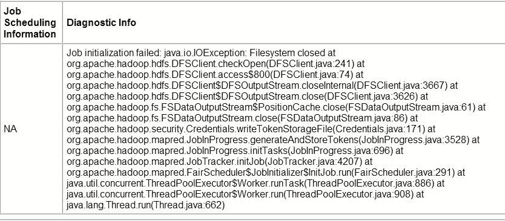

**Figure 25:** An example filesystem closed

然而，您经常会遇到工作计算性能慢的情况，因为您的 Java 垃圾收集有点忙，或者不能快速完成垃圾收集。例如，下图显示，对于任务 0，完成 GC 需要 10 个小时！我在 2014 年经历过这个问题，当时我刚接触 Spark。然而，这类问题的控制权不在我们手中。因此，我们建议您释放 JVM，并尝试再次提交作业。


**Figure 26:** An example where GC stalled in between

第四个因素可能是响应慢，或者作业性能慢是由于缺乏数据序列化。这将在下一节中讨论。第五个因素可能是代码中的内存泄漏，这将使您的应用程序消耗更多内存，使文件或逻辑设备保持打开状态。因此，请确保没有可能导致内存泄漏的选项。例如，通过调用`sc.stop()`或`spark.stop()`来完成您的 Spark 应用程序是一个很好的做法。这将确保一个迷你图上下文仍然打开并处于活动状态。否则，您可能会得到不想要的异常或问题。第六个问题是我们经常保留太多打开的文件，这有时会在洗牌或合并阶段产生`FileNotFoundException`。

# 优化技术

针对更好的优化技术调整 Spark 应用程序有几个方面。在本节中，我们将讨论如何通过调整主内存以更好地管理内存来应用数据序列化，从而进一步优化 Spark 应用程序。我们还可以在开发 Spark 应用程序时，通过调整 Scala 代码中的数据结构来优化性能。另一方面，通过使用序列化 RDD 存储，可以很好地维护存储。

最重要的一个方面是垃圾收集，如果您已经使用 Java 或 Scala 编写了您的 Spark 应用程序，它将进行调优。我们将看看如何调整它以优化性能。对于基于分布式环境和集群的系统，必须确保一定程度的并行性和数据局部性。此外，使用广播变量可以进一步提高性能。

# 数据序列化

序列化对于任何分布式计算环境中的性能改进和优化都是一项重要的调整。Spark 也不例外，但 Spark 的工作往往是数据和计算广泛的。因此，如果您的数据对象格式不好，那么您首先需要将它们转换成序列化的数据对象。这需要大量的内存。最终，整个过程将大大降低整个处理和计算的速度。

因此，您经常会遇到计算节点响应缓慢的情况。这意味着我们有时无法 100%地利用计算资源。诚然，Spark 试图在便利性和性能之间保持平衡。这也意味着数据序列化应该是 Spark 调优以获得更好性能的第一步。

Spark 为数据序列化提供了两个选项:Java 序列化和 Kryo 序列化库:

*   **Java 序列化:** Spark 使用 Java 的`ObjectOutputStream`框架序列化对象。您可以通过创建任何实现`java.io.Serializable`的类来处理序列化。Java 序列化非常灵活，但通常相当慢，不适合大数据对象序列化。
*   **Kryo 序列化:**你也可以使用 Kryo 库更快地序列化你的数据对象。与 Java 序列化相比，Kryo 序列化要快得多，加速比 Java 快 10 倍，而且紧凑。但是，它有一个问题，那就是它不支持所有的可序列化类型，但是您需要注册您的类。

您可以通过用`SparkConf`初始化您的 Spark 作业并调用`conf.set(spark.serializer, org.apache.spark.serializer.KryoSerializer)`来开始使用 Kryo。要向 Kryo 注册您自己的自定义类，请使用`registerKryoClasses`方法，如下所示:

```scala
val conf = new SparkConf().setMaster(“local[*]”).setAppName(“MyApp”)conf.registerKryoClasses(Array(classOf[MyOwnClass1], classOf[MyOwnClass2]))val sc = new SparkContext(conf)

```

如果你的对象很大，你可能还需要增加`spark.kryoserializer.buffer`配置。该值需要足够大，以容纳您序列化的最大对象。最后，如果你没有注册你的自定义类，Kryo 仍然可以工作；但是，需要存储每个对象的完整类名，这确实很浪费。

例如，在监视 Spark 作业部分末尾的日志记录小节中，可以使用`Kryo`序列化来优化日志记录和计算。首先，只需将`MyMapper`类创建为普通类(即没有任何序列化)，如下所示:

```scala
class MyMapper(n: Int) { // without any serialization@transient lazy val log = org.apache.log4j.LogManager.getLogger("myLogger")def MyMapperDosomething(rdd: RDD[Int]): RDD[String] = rdd.map { i =>log.warn("mapping: " + i)(i + n).toString}}

```

现在，让我们将这个类注册为`Kyro`序列化类，然后按如下方式设置`Kyro`序列化:

```scala
conf.registerKryoClasses(Array(classOf[MyMapper])) // register the class with Kyroconf.set("spark.serializer", "org.apache.spark.serializer.KryoSerializer") // set Kayro serialization

```

这就是你所需要的。下面给出了这个例子的完整源代码。与前面的示例相比，您应该能够运行并观察到相同的输出，但是是优化的输出:

```scala
package com.chapter14.Serilazitionimport org.apache.spark._import org.apache.spark.rdd.RDDclass MyMapper(n: Int) { // without any serilization@transient lazy val log = org.apache.log4j.LogManager.getLogger("myLogger")def MyMapperDosomething(rdd: RDD[Int]): RDD[String] = rdd.map { i =>log.warn("mapping: " + i)(i + n).toString}}//Companion objectobject MyMapper {def apply(n: Int): MyMapper = new MyMapper(n)}//Main objectobject KyroRegistrationDemo {def main(args: Array[String]) {val log = LogManager.getRootLoggerlog.setLevel(Level.WARN)val conf = new SparkConf().setAppName("My App").setMaster("local[*]")conf.registerKryoClasses(Array(classOf[MyMapper2]))// register the class with Kyroconf.set("spark.serializer", "org.apache.spark.serializer.KryoSerializer") // set Kayro serilazationval sc = new SparkContext(conf)log.warn("Started")val data = sc.parallelize(1 to 100000)val mapper = MyMapper(1)val other = mapper.MyMapperDosomething(data)other.collect()log.warn("Finished")}}

```

输出如下:

```scala
17/04/29 15:33:43 WARN root: Started ..17/04/29 15:31:51 WARN myLogger: mapping: 1 17/04/29 15:31:51 WARN myLogger: mapping: 4999217/04/29 15:31:51 WARN myLogger: mapping: 4999917/04/29 15:31:51 WARN myLogger: mapping: 50000 ..                                                                                17/04/29 15:31:51 WARN root: Finished

```

干得好！现在让我们快速了解一下如何调整内存。在下一节中，我们将研究一些高级策略，以确保有效利用主内存。

# 记忆调谐

在本节中，我们将讨论一些高级策略，像您这样的用户可以使用这些策略来确保在执行 Spark 作业时有效利用内存。更具体地说，我们将展示如何计算对象的内存使用。我们将通过优化您的数据结构或使用 Kryo 或 Java 序列化程序将您的数据对象转换为序列化格式，来建议一些改进它的高级方法。最后，我们将看看如何调整 Spark 的 Java 堆大小、缓存大小和 Java 垃圾收集器。

调整内存使用时有三个注意事项:

*   对象使用的内存量:您甚至可能希望整个数据集都适合内存
*   访问这些对象的成本
*   垃圾收集的开销:如果对象的周转率很高

尽管 Java 对象的访问速度足够快，但它们很容易比原始字段中的实际(也就是原始)数据多消耗 2 到 5 倍的空间。例如，每个不同的 Java 对象都有 16 字节的对象头开销。例如，一个 Java 字符串比原始字符串多了将近 40 个字节的额外开销。而且还使用了`Set`、`List`、`Queue`、`ArrayList`、`Vector`、`LinkedList`、`PriorityQueue`、`HashSet`、`LinkedHashSet`、`TreeSet`等 Java 集合类。另一方面，链接的数据结构太复杂，占用了太多的额外空间，因为数据结构中的每个条目都有一个包装对象。最后，基元类型的集合经常将它们作为装箱对象存储在内存中，例如`java.lang.Double`和`java.lang.Integer`。

# 内存使用和管理

Spark 应用程序和底层计算节点的内存使用可以分为执行和存储。执行内存在合并、混洗、连接、排序和聚合的计算过程中使用。另一方面，存储内存用于缓存和在集群中传播内部数据。简而言之，这是由于网络上的大量输入/输出。

Technically, Spark caches network data locally. While working with Spark iteratively or interactively, caching or persistence are optimization techniques in Spark. These two help in saving interim partial results so that they can be reused in subsequent stages. Then these interim results (as RDDs) can be kept in memory (default) or more solid storage, such as disk, and/or replicated. Furthermore, RDDs can be cached using cache operations too. They can also be persisted using a persist operation. The difference between cache and persist operations is purely syntactic. The cache is a synonym of persisting or persists (`MEMORY_ONLY`), that is, cache is merely persisted with the default storage level `MEMORY_ONLY`.

如果您在 Spark web UI 中的“存储”选项卡下，您应该观察 RDD、数据框或数据集对象使用的内存/存储，如图 10 所示。虽然 Spark 中有两种相关的内存调优配置，但用户不需要重新调整。原因是配置文件中设置的默认值足以满足您的需求和工作负载。

spark.memory.fraction 是统一区域的大小，以(JVM 堆空间- 300 MB)的分数表示(默认为 0.6)。剩余的空间(40%)保留给用户数据结构、Spark 中的内部元数据，以及在记录稀疏和异常大的情况下防止 OOM 错误。另一方面，`spark.memory.storageFraction`将 R 存储空间的大小表示为统一区域的分数(默认值为 0.5)。这个参数的默认值是 50%的 Java 堆空间，也就是 300 MB。

A more detailed discussion on memory usage and storage is given in [Chapter 15](15.html#DKP1K1-21aec46d8593429cacea59dbdcd64e1c), *Text Analytics Using Spark ML*.

现在，您可能会想到一个问题:选择哪个存储级别？为了回答这个问题，Spark 存储级别为您提供了内存使用和 CPU 效率之间的不同权衡。如果您的 rdd 与默认存储级别(MEMORY_ONLY)非常匹配，那么让您的 Spark 驱动程序或主设备与之搭配。这是最节省内存的选项，允许 RDDs 上的操作尽可能快地运行。你应该随它去，因为这是最节省内存的选择。这也允许在 rdd 上尽可能快地完成许多操作。

如果你的 RDDs 不适合主存，也就是说如果`MEMORY_ONLY`不工作，你应该尝试使用`MEMORY_ONLY_SER`。强烈建议不要将您的 RDDs 溢出到磁盘，除非您的 **UDF** (也就是您为处理数据集而定义的**用户定义函数**)太贵。如果您的 UDF 在执行阶段过滤了大量数据，这也适用。在其他情况下，重新计算分区，即重新分区，可能会更快地从磁盘读取数据对象。最后，如果您想要快速故障恢复，请使用复制的存储级别。

总之，Spark 2.x 中提供并支持以下存储级别:(名称中的 number _2 表示 2 个副本):

*   `DISK_ONLY`:这是针对 RDDs 的基于磁盘的操作
*   `DISK_ONLY_2`:这是用于 2 个副本的 RDDs 的基于磁盘的操作
*   `MEMORY_ONLY`:这是 RDDs 内存中缓存操作的默认值
*   `MEMORY_ONLY_2`:对于具有 2 个副本的 rdd，这是内存中缓存操作的默认值
*   `MEMORY_ONLY_SER`:如果你的 RDDs 不适合主存，也就是说如果`MEMORY_ONLY`不工作，这个选项特别有助于以序列化的形式存储数据对象
*   `MEMORY_ONLY_SER_2`:如果你的 RDDs 不适合主存，也就是说如果`MEMORY_ONLY`没有 2 个副本，这个选项也有助于以序列化的形式存储数据对象
*   `MEMORY_AND_DISK`:基于内存和磁盘(又称组合)的 RDD 持久性
*   `MEMORY_AND_DISK_2`:基于内存和磁盘(又称组合)的 RDD 持久性，带有 2 个副本
*   `MEMORY_AND_DISK_SER`:如果`MEMORY_AND_DISK`不工作，可以使用
*   `MEMORY_AND_DISK_SER_2`:如果`MEMORY_AND_DISK`不能处理 2 个副本，可以使用该选项
*   `OFF_HEAP`:不允许写入 Java 堆空间

Note that cache is a synonym of persist (`MEMORY_ONLY`). This means that cache is solely persist with the default storage level, that is, `MEMORY_ONLY`. Detailed information can be found at [https://jaceklaskowski.gitbooks.io/mastering-apache-spark/content/spark-rdd-StorageLevel.html](https://jaceklaskowski.gitbooks.io/mastering-apache-spark/content/spark-rdd-StorageLevel.html).

# 调整数据结构

减少额外内存使用的第一种方法是避免 Java 数据结构中的某些特性带来额外的开销。例如，基于指针的数据结构和包装对象造成了不小的开销。为了用更好的数据结构调整您的源代码，我们在这里提供了一些有用的建议。

首先，设计数据结构，以便更多地使用对象数组和基元类型。因此，这也建议更频繁地使用标准的 Java 或 Scala 集合类，如`Set`、`List`、`Queue`、`ArrayList`、`Vector`、`LinkedList`、`PriorityQueue`、`HashSet`、`LinkedHashSet`和`TreeSet`。

其次，在可能的情况下，避免使用带有大量小对象和指针的嵌套结构，以便您的源代码变得更加优化和简洁。第三，在可能的情况下，考虑使用数字标识，有时使用枚举对象，而不是使用字符串作为键。推荐这样做是因为，正如我们已经说过的，一个 Java 字符串对象会产生 40 字节的额外开销。最后，如果你的主存(也就是 RAM)小于 32 GB，设置 JVM 标志`-XX:+UseCompressedOops`使指针变成 4 字节而不是 8 字节。

The earlier option can be set in the `SPARK_HOME/conf/spark-env.sh.template`. Just rename the file as `spark-env.sh` and set the value straight away!

# 序列化 RDD 存储

如前所述，尽管有其他类型的内存调优，但当对象太大而无法有效地放入主内存或磁盘时，减少内存使用的更简单、更好的方法是以序列化的形式存储它们。

This can be done using the serialized storage levels in the RDD persistence API, such as `MEMORY_ONLY_SER`. For more information, refer to the previous section on memory management and start exploring available options.

如果指定使用`MEMORY_ONLY_SER`，那么 Spark 会将每个 RDD 分区存储为一个大字节数组。然而，这种方法的唯一缺点是它会减慢数据访问时间。这也是合理和明显的；公平地说，没有办法避免它，因为每个对象都需要在重用时动态反序列化。

As discussed previously, we highly recommend using Kryo serialization instead of Java serialization to make data access a bit faster.

# 垃圾收集优化

虽然在您的 Java 或 Scala 程序中，只按顺序或随机读取一次 RDD，然后对其执行大量操作并不是一个大问题，但是如果您的驱动程序中存储了大量的数据对象，那么 **Java 虚拟机** ( **JVM** ) GC 可能会有问题且复杂。当 JVM 需要从旧对象中移除过时的和未使用的对象来为新对象腾出空间时，必须识别它们并最终从内存中移除它们。然而，就处理时间和存储而言，这是一项昂贵的操作。您可能想知道 GC 的成本与存储在主内存中的 Java 对象的数量成正比。因此，我们强烈建议您调整数据结构。此外，建议在内存中存储较少的对象。

GC 调优的第一步是收集 JVM 垃圾收集在您的机器上发生频率的相关统计数据。这方面需要的第二个统计数据是 JVM 在机器或计算节点上花费在垃圾收集上的时间。这可以通过在 JVM 启动参数中向 IDE 中的 Java 选项(如 Eclipse)添加`-verbose:gc -XX:+PrintGCDetails -XX:+PrintGCTimeStamps`并为我们的 GC 日志文件指定名称和位置来实现，如下所示:


**Figure 27:** Setting GC verbose on Eclipse

或者，您可以在使用Spark提交脚本提交Spark作业时指定`verbose:gc`，如下所示:

```scala
--conf “spark.executor.extraJavaOptions = -verbose:gc -XX:-PrintGCDetails -XX:+PrintGCTimeStamps"

```

简而言之，在为 Spark 指定 GC 选项时，您必须确定希望 GC 选项指定在哪里，在执行器上还是在驱动程序上。提交作业时，指定`--driver-java-options -XX:+PrintFlagsFinal -verbose:gc`等。对于执行者，指定`--conf spark.executor.extraJavaOptions=-XX:+PrintFlagsFinal -verbose:gc`等。

现在，当您的 Spark 作业被执行时，您将能够在每次 GC 发生时看到打印在工人节点中的日志和消息。这种方法的缺点是，这些日志不会在您的驱动程序上，而是在集群的工作节点上。

It is to be noted that `verbose:gc` only prints appropriate message or logs after each GC collection. Correspondingly, it prints details about memory. However, if you are interested in looking for more critical issues, such as a memory leak, `verbose:gc` may not be enough. In that case, you can use some visualization tools, such as jhat and VisualVM. A better way of GC tuning in your Spark application can be read at [https://databricks.com/blog/2015/05/28/tuning-java-garbage-collection-for-spark-applications.html](https://databricks.com/blog/2015/05/28/tuning-java-garbage-collection-for-spark-applications.html).

# 平行度

虽然您可以通过`SparkContext.text`文件的可选参数来控制要执行的地图任务的数量，但是 Spark 会根据每个文件的大小自动在每个文件上设置相同的参数。除此之外，对于像`groupByKey`和`reduceByKey`这样的分布式`reduce`操作，Spark 使用了最大的父 RDD 分区数。但是，有时我们会犯一个错误，那就是没有为计算集群中的节点利用全部计算资源。因此，除非您为您的 Spark 作业明确设置和指定并行级别，否则将无法充分利用全部计算资源。因此，您应该将并行级别设置为第二个参数。

For more on this option, please refer to [https://spark.apache.org/docs/latest/api/scala/index.html#org.apache.spark.rdd.PairRDDFunctions.](https://spark.apache.org/docs/latest/api/scala/index.html#org.apache.spark.rdd.PairRDDFunctions)

或者，您可以通过设置 config 属性 spark.default.parallelism 来更改默认值。对于没有父 rdd 的并行化等操作，并行化的级别取决于集群管理器，即独立、Mesos 或纱。对于本地模式，将并行级别设置为等于本地计算机上的内核数量。对于 Mesos 或纱，将细粒度模式设置为 8。在其他情况下，所有执行器节点上的核心总数或 2 个，以较大者为准，通常建议您的集群中每个 CPU 核心执行 2-3 个任务。

# 广播

广播变量使 Spark 开发人员能够将实例或类变量的只读副本缓存在每个驱动程序中，而不是将自己的副本与相关任务一起传输。然而，广播变量的显式创建仅在跨多个阶段的任务需要反序列化形式的相同数据时有用。

在 Spark 应用程序开发中，使用 SparkContext 的广播选项可以大大减少每个序列化任务的大小。这也有助于降低在集群中启动 Spark 作业的成本。如果您的 Spark 作业中有某项任务使用了驱动程序中的大型对象，则应该将其转换为广播变量。

要在 Spark 应用程序中使用广播变量，可以使用`SparkContext.broadcast`实例化它。稍后，使用类中的 value 方法访问共享值，如下所示:

```scala
val m = 5val bv = sc.broadcast(m)

```

输出/日志:`bv: org.apache.spark.broadcast.Broadcast[Int] = Broadcast(0)`

```scala
bv.value()

```

Output/log: `res0: Int = 1`

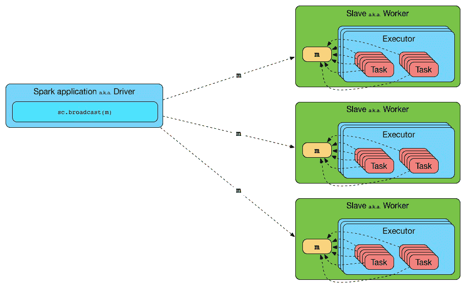

**Figure 28:** Broadcasting a value from driver to executors

Spark 的广播功能使用 **SparkContext** 来创建广播值。之后，使用**广播管理器**和**上下文清理器**来控制它们的生命周期，如下图所示:

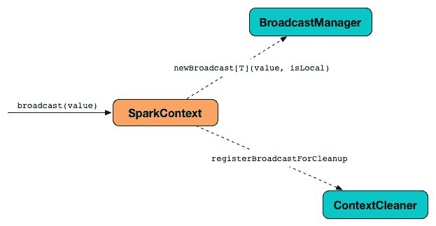

**Figure 29:** SparkContext broadcasts the variable/value using BroadcastManager and ContextCleaner

驱动程序中的 Spark 应用程序会自动在驱动程序上打印每个任务的序列化大小。因此，您可以决定您的任务是否太大而无法并行。如果您的任务大于 20 KB，可能值得优化。

# 数据局部性

数据局部性意味着数据离要处理的代码有多近。从技术上讲，数据局部性会对要在本地或集群模式下执行的 Spark 作业的性能产生重大影响。因此，如果要处理的数据和代码捆绑在一起，计算应该会快得多。通常，将序列化代码从驱动程序发送到执行器要快得多，因为代码的大小比数据的小得多。

在 Spark 应用程序开发和作业执行中，有几个层次的局部性。按照从最近到最远的顺序，级别取决于您必须处理的数据的当前位置:

| **数据位置** | **表示** | **特别说明** |
| `PROCESS_LOCAL` | 数据和代码在同一个位置 | 可能的最佳位置 |
| `NODE_LOCAL` | 数据和代码在同一个节点上，例如，数据存储在 HDFS | 比`PROCESS_LOCAL`慢一点，因为数据必须通过进程和网络传播 |
| `NO_PREF` | 数据同样可以从其他地方访问 | 没有位置偏好 |
| `RACK_LOCAL` | 数据位于网络上同一机架的服务器上 | 适合大规模数据处理 |
| `ANY` | 数据在网络的其他地方，而不在同一个机架中 | 除非没有其他选择，否则不建议使用 |

**Table 2:** Data locality and Spark

Spark 是这样开发的，它更喜欢在最好的局部级别调度所有的任务，但是这不能保证，也不总是可能的。因此，根据计算节点的情况，如果可用的计算资源被占用过多，Spark 会切换到较低的局部性级别。此外，如果您希望拥有最佳的数据位置，有两种选择:

*   等到繁忙的 CPU 有空时，再在同一服务器或同一节点上对您的数据启动任务
*   立即启动一个新的，这需要移动数据

# 摘要

在这一章中，我们讨论了Spark的一些高级主题，以使您的Spark工作表现更好。我们讨论了一些调整您的 Spark 工作的基本技术。我们讨论了如何通过访问 Spark 网络用户界面来监控您的工作。我们讨论了如何设置 Spark 配置参数。我们还讨论了 Spark 用户犯的一些常见错误，并提供了一些建议。最后，我们讨论了一些有助于调整 Spark 应用程序的优化技术。

在下一章中，您将看到如何测试 Spark 应用程序并进行调试以解决大多数常见问题。