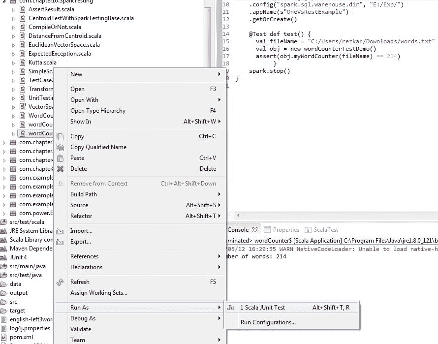
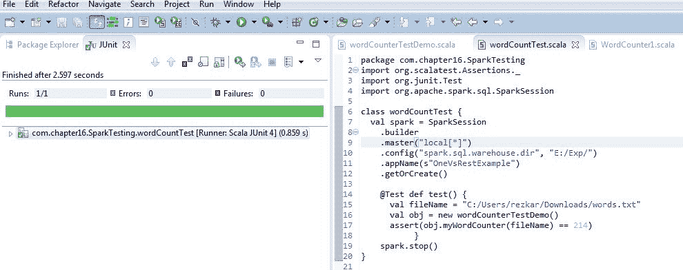
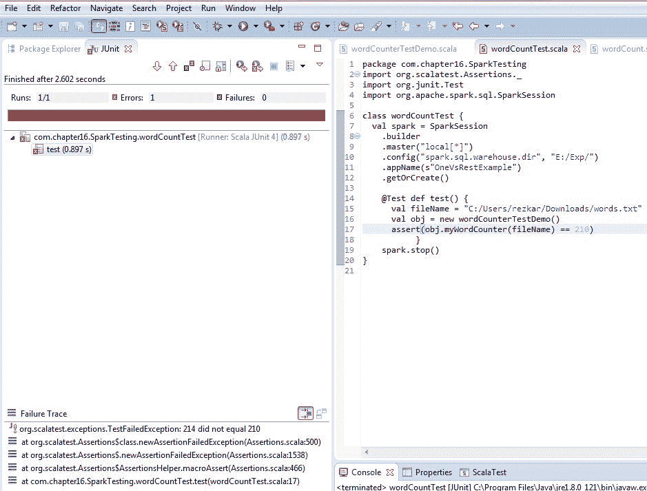
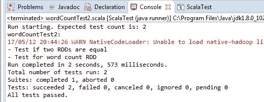
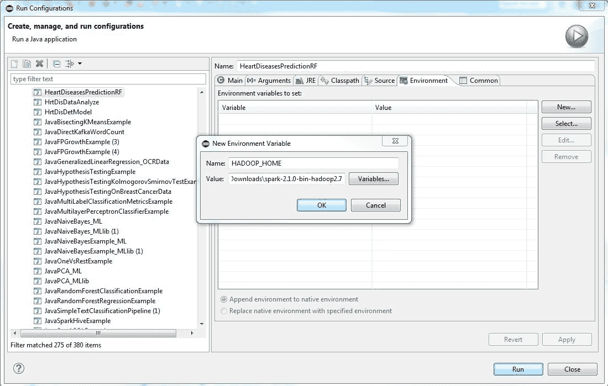
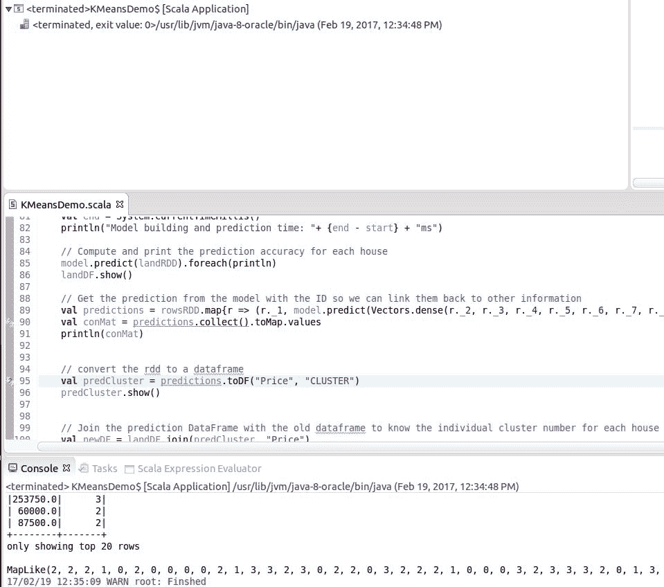
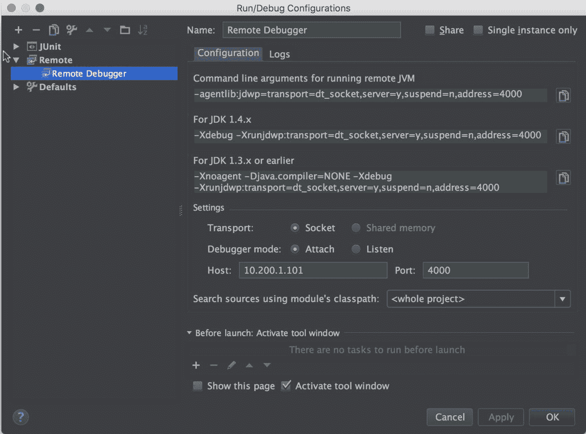
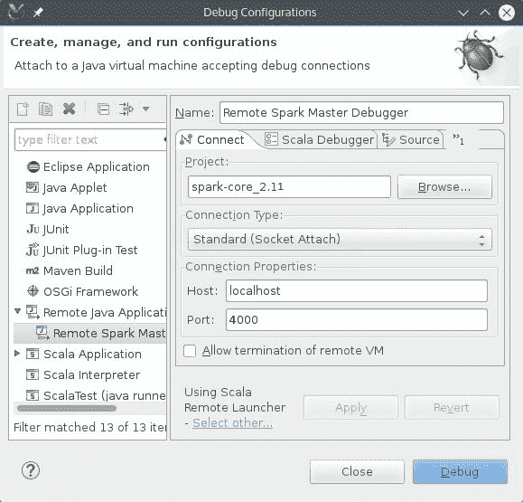

# Spark的测试和调试

"Everyone knows that debugging is twice as hard as writing a program in the first place. So if you're as clever as you can be when you write it, how will you ever debug it?"

-布莱恩·纽金格

在一个理想的世界里，我们编写完美的 Spark 代码，一切都一直完美运行，对吗？开玩笑的；在实践中，我们知道处理大规模数据集几乎从来都没有那么容易，不可避免地会有一些数据点会暴露您的代码的任何角落情况。

因此，考虑到前面提到的挑战，在本章中，我们将看到如果应用程序是分布式的，测试它会有多困难；然后，我们将看到解决这个问题的一些方法。简而言之，本章将涵盖以下主题:

*   分布式环境中的测试
*   测试Spark应用
*   调试 Spark 应用程序

# 分布式环境中的测试

莱斯利·兰波特对分布式系统的定义如下:

"A distributed system is one in which I cannot get any work done because some machine I have never heard of has crashed."

通过**万维网**(又名 **WWW** )的资源共享，这是一个连接的计算机网络(又名集群)，是分布式系统的一个很好的例子。这些分布式环境通常很复杂，并且经常出现大量的异构性。在这种异构环境中进行测试也很有挑战性。在本节中，首先，我们将观察在使用这种系统时经常提出的一些共有问题。

# 分布式环境

分布式系统有许多定义。让我们看一些定义，然后我们将尝试关联上述类别。库仑将分布式系统定义为*一个系统，在该系统中，位于联网计算机上的硬件或软件组件仅通过消息传递*进行通信并协调它们的动作。另一方面，Tanenbaum 以几种方式定义了该术语:

*   *独立计算机的集合，在系统的用户看来是一台计算机。*
*   *由两台或多台独立计算机的集合组成的系统，这些计算机通过交换同步或异步消息传递来协调它们的处理。*
*   *分布式系统是通过网络链接的自治计算机的集合，这些计算机具有设计用于产生集成计算设施的软件。*

现在，基于前面的定义，分布式系统可以分类如下:

*   只有硬件和软件是分布式的:本地分布式系统通过局域网连接。
*   用户是分布式的，但是有运行后端的计算和硬件资源，例如 WWW。
*   用户和硬件/软件都是分布式的:通过广域网连接的分布式计算集群。例如，您可以在使用亚马逊 AWS、微软 Azure、谷歌云或数字海洋的水滴时获得这些类型的计算设施。

# 分布式系统中的问题

在这里，我们将讨论在软件和硬件测试期间需要注意的一些主要问题，以便 Spark 作业在集群计算中平稳运行，集群计算本质上是一个分布式计算环境。

请注意，所有的问题都是不可避免的，但我们至少可以调整它们以获得更好的结果。你应该遵循前一章给出的说明和建议。根据*Kamal Sheel Mishra**阿尼尔·库马尔特里帕蒂**分布式软件系统的一些问题、挑战和问题**国际计算机科学与信息技术杂志*，第 5 卷(4 期)，2014，4922-4925。网址:[https://pdf s . semantic schooler . org/4c 6d/c4d 739 bad 13 BCD 0398 e 5180 c 1513 f 18275d 8 . pdf](https://pdfs.semanticscholar.org/4c6d/c4d739bad13bcd0398e5180c1513f18275d8.pdf)在分布式环境中使用软件或硬件时，有几个问题需要解决:

*   可量测性
*   异构语言、平台和架构
*   资源管理
*   安全和隐私
*   透明度
*   公开
*   互用性
*   服务质量
*   故障管理
*   同步
*   通信
*   软件架构
*   技术性能分析
*   生成测试数据
*   测试组件选择
*   测试顺序
*   测试系统可扩展性和性能
*   源代码的可用性
*   事件的再现性
*   死锁和竞争条件
*   容错测试
*   分布式系统的调度问题
*   分布式任务分配
*   测试分布式软件
*   硬件抽象层的监控机制

诚然，我们不能完全解决所有这些问题，但是，使用 Spark，我们至少可以控制其中一些与分布式系统相关的问题。例如，可伸缩性、资源管理、服务质量、故障管理、同步、通信、分布式系统的调度问题、分布式任务分配以及分布式软件测试中的监控机制。在前两章中讨论了其中的大部分。另一方面，我们可以解决测试和软件方面的一些问题:如软件架构、性能分析、生成测试数据、测试的组件选择、测试序列、系统可伸缩性和性能的测试以及源代码的可用性。这些将至少在本章中明确或隐含地涉及。

# 分布式环境中软件测试的挑战

敏捷软件开发中有一些与任务相关的常见挑战，在最终部署之前，在分布式环境中测试软件时，这些挑战会变得更加复杂。通常团队成员需要在 bug 激增后并行合并软件组件。然而，基于紧迫性，合并通常发生在测试阶段之前。有时，许多涉众分布在团队中。因此，误解的可能性很大，团队经常会在误解中失败。

例如，Cloud Foundry([https://www.cloudfoundry.org/](https://www.cloudfoundry.org/))是一个开源的高度分布式 PaaS 软件系统，用于管理云中应用程序的部署和可扩展性。它承诺了不同的功能，如可扩展性、可靠性和弹性，这些在云铸造上的部署固有地要求底层分布式系统实施措施来确保健壮性、弹性和故障转移。

众所周知，软件测试的过程包括*单元测试*、*集成测试*、*冒烟测试*、*验收测试*、*可扩展性测试*、*性能测试*、*服务质量测试*。在 Cloud Foundry 中，测试分布式系统的过程如下图所示:


**Figure 1:** An example of software testing in a distributed environment like Cloud

如上图(第一列)所示，在像 Cloud 这样的分布式环境中进行测试的过程从针对系统中最小的契约点运行单元测试开始。在成功执行所有单元测试之后，运行集成测试来验证交互组件作为在单个盒子(例如，**虚拟机** ( **虚拟机**)或裸机上运行的单个连贯软件系统(第二列)的一部分的行为。然而，尽管这些测试将系统的整体行为作为一个整体进行了验证，但它们并不能保证分布式部署中的系统有效性。一旦集成测试通过，下一步(第三列)是验证系统的分布式部署并运行冒烟测试。

如您所知，软件的成功配置和单元测试的执行为我们验证系统行为的可接受性做好了准备。该验证通过运行验收测试来完成(第四列)。现在，为了克服上述分布式环境中的问题和挑战，还有其他隐藏的挑战需要研究人员和大数据工程师解决，但这些实际上不在本书的范围内。

现在我们知道了分布式环境中软件测试的真正挑战是什么，现在让我们开始测试一下我们的 Spark 代码。下一节专门测试 Spark 应用程序。

# 测试Spark应用

有许多方法可以尝试测试您的 Spark 代码，这取决于它是 Java(您可以做基本的 JUnit 测试来测试非 Spark 代码)还是 Scala 代码的 ScalaTest。您也可以通过在本地或小型测试集群上运行 Spark 来进行完全集成测试。霍尔登·卡劳的另一个令人敬畏的选择是使用Spark测试基地。您可能知道，到目前为止，Spark 中还没有用于单元测试的本机库。然而，我们可以有以下两种选择来使用两个库:

*   ScalaTest
*   Spark测试基地

然而，在开始测试用 Scala 编写的Spark应用程序之前，一些关于单元测试和测试 Scala 方法的背景知识是一项任务。

# 测试 Scala 方法

在这里，我们将看到一些测试 Scala 方法的简单技术。对于 Scala 用户来说，这是最熟悉的单元测试框架(您也可以用它来测试 Java 代码，很快就可以用它来测试 JavaScript)。ScalaTest 支持多种不同的测试风格，每种风格都是为了支持特定类型的测试需求。详情见[http://www.scalatest.org/user_guide/selecting_a_style](http://www.scalatest.org/user_guide/selecting_a_style)ScalaTest 用户指南。虽然 ScalaTest 支持多种风格，但最快速的入门方法之一是使用以下 ScalaTest 特性，并以 **TDD** ( **测试驱动开发**)风格编写测试:

1.  `FunSuite`
2.  `Assertions`
3.  `BeforeAndAfter`

请随意浏览前面的网址，了解更多关于这些特征的信息；这将使本教程的其余部分顺利进行。

It is to be noted that the TDD is a programming technique to develop software, and it states that you should start development from tests. Hence, it doesn't affect how tests are written, but when tests are written. There is no trait or testing style to enforce or encourage TDD in `ScalaTest.FunSuite`, `Assertions`, and `BeforeAndAfter` are only more similar to the xUnit testing frameworks.

ScalaTest 中有三种风格特征的断言:

*   `assert`:这用于您的 Scala 程序中的一般断言。
*   `assertResult`:这有助于区分期望值和实际值。
*   `assertThrows`:这是用来保证一点代码抛出一个预期的异常。

ScalaTest 的断言被定义在特性`Assertions`中，这个特性又被`Suite`进一步扩展。简而言之，`Suite`特质是所有风格特质中的超级特质。根据[http://www.scalatest.org/user_guide/using_assertions](http://www.scalatest.org/user_guide/using_assertions)的 ScalaTest 文档，`Assertions`特性还提供了以下特性:

*   `assume`有条件取消测试
*   `fail`无条件通过测试
*   `cancel`无条件取消测试
*   `succeed`让测试无条件成功
*   `intercept`确保一点代码抛出一个预期的异常，然后对该异常进行断言
*   `assertDoesNotCompile`保证一位代码不编译
*   `assertCompiles`确保一点代码确实编译
*   `assertTypeError`确保一位代码不会因为类型(非解析)错误而编译
*   `withClue`添加故障的更多信息

从前面的列表中，我们将展示其中的一些。在您的 Scala 程序中，您可以通过调用`assert`并在中传递一个`Boolean`表达式来编写断言。您可以简单地使用`Assertions`开始编写您的简单单元测试用例。`Predef`是一个对象，在这里定义了断言的行为。请注意，`Predef`的所有成员都会被导入到你的每个 Scala 源文件中。以下源代码将为以下情况打印`Assertion success`:

```scala
package com.chapter16.SparkTestingobject SimpleScalaTest {def main(args: Array[String]):Unit= {val a = 5val b = 5assert(a == b)println("Assertion success")       }}

```

但是，例如，如果您进行`a = 2`和`b = 1`，断言将失败，并且您将体验到以下输出:


**Figure 2:** An example of assertion fail

如果传递真表达式，assert 将正常返回。但是，如果提供的表达式为假，断言将突然终止，并出现断言错误。与`AssertionError`和`TestFailedException`不同，ScalaTest 的断言提供了更多的信息，可以准确地告诉你测试用例在哪一行失败了，或者哪个表达式失败了。因此，ScalaTest 的断言比 Scala 的断言提供了更好的错误消息。

例如，对于下面的源代码，您应该会体验到`TestFailedException`会告诉您 5 不等于 4:

```scala
package com.chapter16.SparkTestingimport org.scalatest.Assertions._object SimpleScalaTest {def main(args: Array[String]):Unit= {val a = 5val b = 4assert(a == b)println("Assertion success")       }}

```

下图显示了前面 Scala 测试的输出:


**Figure 3:** An example of TestFailedException

下面的源代码解释了如何使用`assertResult`单元测试来测试你的方法的结果:

```scala
package com.chapter16.SparkTestingimport org.scalatest.Assertions._object AssertResult {def main(args: Array[String]):Unit= {val x = 10val y = 6assertResult(3) {x - y}}}

```

前面的断言将失败，Scala 将抛出异常`TestFailedException`并打印`Expected 3 but got 4` ( *图 4* ):


**Figure 4:** Another example of TestFailedException

现在，让我们看一个单元测试来显示预期的异常:

```scala
package com.chapter16.SparkTestingimport org.scalatest.Assertions._object ExpectedException {def main(args: Array[String]):Unit= {val s = "Hello world!"try {s.charAt(0)fail()} catch {case _: IndexOutOfBoundsException => // Expected, so continue}}}

```

如果您试图访问索引之外的数组元素，前面的代码将告诉您是否允许访问前面字符串`Hello world!`的第一个字符。如果您的 Scala 程序可以访问索引中的值，断言将会失败。这也意味着测试用例失败了。因此，前面的测试用例自然会失败，因为第一个索引包含字符`H`，您应该会遇到以下错误消息(*图 5* ):


**Figure 5:** Third example of TestFailedException

但是，现在让我们尝试访问位置`-1`处的索引，如下所示:

```scala
package com.chapter16.SparkTestingimport org.scalatest.Assertions._object ExpectedException {def main(args: Array[String]):Unit= {val s = "Hello world!"try {s.charAt(-1)fail()} catch {case _: IndexOutOfBoundsException => // Expected, so continue}}}

```

现在断言应该是真的，因此，测试用例将被通过。最后，代码将正常终止。现在，让我们检查一下我们的代码片段是否可以编译。通常，您可能希望确保代表出现的“用户错误”的某种代码顺序根本不会编译。目标是针对错误检查库的强度，以禁止不需要的结果和行为。ScalaTest 的`Assertions`特性包括以下语法:

```scala
assertDoesNotCompile("val a: String = 1")

```

如果希望确保代码片段不会因为类型错误(而不是语法错误)而编译，请使用以下方法:

```scala
assertTypeError("val a: String = 1")

```

语法错误仍然会导致抛出`TestFailedException`。最后，如果您想声明一段代码确实可以编译，那么您可以用下面的内容使它变得更加明显:

```scala
assertCompiles("val a: Int = 1")

```

完整的示例如下所示:

```scala
package com.chapter16.SparkTestingimport org.scalatest.Assertions._ object CompileOrNot {def main(args: Array[String]):Unit= {assertDoesNotCompile("val a: String = 1")println("assertDoesNotCompile True")assertTypeError("val a: String = 1")println("assertTypeError True")assertCompiles("val a: Int = 1")println("assertCompiles True")assertDoesNotCompile("val a: Int = 1")println("assertDoesNotCompile True")}}

```

下图显示了上述代码的输出:


**Figure 6:** Multiple tests together

现在，由于页面限制，我们希望完成基于 Scala 的单元测试。但是，对于其他单元测试案例，您可以参考位于[http://www.scalatest.org/user_guide](http://www.scalatest.org/user_guide)的 Scala 测试指南。

# 单元测试

在软件工程中，经常测试源代码的单个单元，以确定它们是否适合使用。这种方式的软件测试方法也被称为单元测试。该测试确保由软件工程师或开发人员开发的源代码符合设计规范并按预期工作。

另一方面，单元测试的目标是分离程序的每个部分(即以模块化的方式)。然后试着观察各个零件是否正常工作。在任何软件系统中，单元测试都有几个好处:

*   **早期发现问题:**它在开发周期早期发现规范的 bug 或缺失部分。
*   **促进变化:**它有助于重构和升级，而不用担心破坏功能。
*   **简化集成:**它使集成测试更容易编写。
*   **文档:**提供系统的活文档。
*   **设计:**可以作为项目的正式设计。

# 测试Spark应用

我们已经看到了如何使用内置的 Scala`ScalaTest`包测试您的 Scala 代码。然而，在这一小节中，我们将看到如何测试用 Scala 编写的 Spark 应用程序。将讨论以下三种方法:

*   **方法 1:** 使用 JUnit 测试 Spark 应用程序
*   **方法 2:** 使用`ScalaTest`包测试Spark应用
*   **方法 3:** 使用Spark测试基地测试Spark应用

方法 1 和 2 将在这里用一些实用的代码进行讨论。但是，下一小节将详细讨论方法 3。为了使理解简单明了，我们将使用著名的单词计数应用程序来演示方法 1 和 2。

# 方法 1:使用 Scala JUnit 测试

假设您用 Scala 编写了一个应用程序，可以告诉您文档或文本文件中有多少个单词，如下所示:

```scala
package com.chapter16.SparkTestingimport org.apache.spark._import org.apache.spark.sql.SparkSessionclass wordCounterTestDemo {val spark = SparkSession.builder.master("local[*]").config("spark.sql.warehouse.dir", "E:/Exp/").appName(s"OneVsRestExample").getOrCreate()def myWordCounter(fileName: String): Long = {val input = spark.sparkContext.textFile(fileName)val counts = input.flatMap(_.split(" ")).distinct()val counter = counts.count()counter}}

```

前面的代码只是解析一个文本文件，并通过简单地拆分单词来执行`flatMap`操作。然后，它执行另一个操作，只考虑不同的单词。最后，`myWordCounter`方法统计字数，返回计数器的值。

现在，在进行正式测试之前，让我们检查一下前面的方法是否工作良好。只需添加 main 方法并创建一个对象，如下所示:

```scala
package com.chapter16.SparkTestingimport org.apache.spark._import org.apache.spark.sql.SparkSessionobject wordCounter {val spark = SparkSession.builder.master("local[*]").config("spark.sql.warehouse.dir", "E:/Exp/").appName("Testing").getOrCreate()    val fileName = "data/words.txt";def myWordCounter(fileName: String): Long = {val input = spark.sparkContext.textFile(fileName)val counts = input.flatMap(_.split(" ")).distinct()val counter = counts.count()counter}def main(args: Array[String]): Unit = {val counter = myWordCounter(fileName)println("Number of words: " + counter)}}

```

如果执行前面的代码，您应该会观察到以下输出:`Number of words: 214`。太棒了！它真的可以作为本地应用程序使用。现在，使用 Scala JUnit 测试用例测试前面的测试用例。

```scala
package com.chapter16.SparkTestingimport org.scalatest.Assertions._import org.junit.Testimport org.apache.spark.sql.SparkSessionclass wordCountTest {val spark = SparkSession.builder.master("local[*]").config("spark.sql.warehouse.dir", "E:/Exp/").appName(s"OneVsRestExample").getOrCreate()   @Test def test() {val fileName = "data/words.txt"val obj = new wordCounterTestDemo()assert(obj.myWordCounter(fileName) == 214)}spark.stop()}

```

如果你仔细看前面的代码，我已经在`test()`方法之前使用了`Test`注释。在`test()`方法中，我调用了`assert()`方法，在那里进行实际测试。这里我们试着检查一下`myWordCounter()`方法的返回值是否等于 214。现在运行前面的代码作为 Scala 单元测试，如下所示(*图 7* ):



**Figure 7:** Running Scala code as Scala JUnit Test

现在，如果测试用例通过，您应该在您的 Eclipse IDE 上观察到以下输出(*图 8* ):



**Figure 8:** Word count test case passed

例如，现在试着用下面的方式断言:

```scala
assert(obj.myWordCounter(fileName) == 210)

```

如果前面的测试用例失败，您应该观察以下输出(*图 9* ):



**Figure 9:** Test case failed

现在让我们看看方法 2，以及它如何帮助我们改善。

# 方法 2:使用 FunSuite 测试 Scala 代码

现在，让我们重新设计前面的测试用例，只返回文档中文本的 RDD，如下所示:

```scala
package com.chapter16.SparkTestingimport org.apache.spark._import org.apache.spark.rdd.RDDimport org.apache.spark.sql.SparkSessionclass wordCountRDD {def prepareWordCountRDD(file: String, spark: SparkSession): RDD[(String, Int)] = {val lines = spark.sparkContext.textFile(file)lines.flatMap(_.split(" ")).map((_, 1)).reduceByKey(_ + _)}}

```

因此，前面类中的`prepareWordCountRDD()`方法返回一个由字符串和整数值组成的 RDD。现在，如果我们想要测试`prepareWordCountRDD()`方法的功能，我们可以通过从 Scala 的`ScalaTest`包中扩展带有`FunSuite`和`BeforeAndAfterAll`的测试类来更明确地进行测试。测试以下列方式进行:

*   从 Scala 的`ScalaTest`包中用`FunSuite`和`BeforeAndAfterAll`扩展测试类
*   覆盖创建Spark上下文的`beforeAll()`
*   使用`test()`方法进行测试，并在`test()`方法中使用`assert()`方法
*   覆盖停止Spark上下文的`afterAll()`方法

基于前面的步骤，我们来看一个测试前面`prepareWordCountRDD()`方法的类:

```scala
package com.chapter16.SparkTestingimport org.scalatest.{ BeforeAndAfterAll, FunSuite }import org.scalatest.Assertions._import org.apache.spark.sql.SparkSessionimport org.apache.spark.rdd.RDDclass wordCountTest2 extends FunSuite with BeforeAndAfterAll {var spark: SparkSession = nulldef tokenize(line: RDD[String]) = {line.map(x => x.split(' ')).collect()}override def beforeAll() {spark = SparkSession.builder.master("local[*]").config("spark.sql.warehouse.dir", "E:/Exp/").appName(s"OneVsRestExample").getOrCreate()}  test("Test if two RDDs are equal") {val input = List("To be,", "or not to be:", "that is the question-", "William Shakespeare")val expected = Array(Array("To", "be,"), Array("or", "not", "to", "be:"), Array("that", "is", "the", "question-"), Array("William", "Shakespeare"))val transformed = tokenize(spark.sparkContext.parallelize(input))assert(transformed === expected)}  test("Test for word count RDD") {val fileName = "C:/Users/rezkar/Downloads/words.txt"val obj = new wordCountRDDval result = obj.prepareWordCountRDD(fileName, spark)    assert(result.count() === 214)}override def afterAll() {spark.stop()}}

```

第一个测试说，如果两个 rdd 以两种不同的方式实现，那么内容应该是相同的。因此，第一次测试应该通过。我们将在下面的例子中看到这一点。现在，对于第二个测试，正如我们之前看到的，RDD 的字数是 214，但是让我们假设它暂时未知。如果是 214 巧合，那么测试用例应该通过，这是它的预期行为。

因此，我们希望这两项测试都能通过。现在，在 Eclipse 上，运行测试套件为`ScalaTest-File`，如下图所示:


**图 10:** 以 ScalaTest-File 的形式运行测试套件

现在您应该观察到以下输出(*图 11* )。输出显示了我们执行了多少测试用例，以及其中有多少通过、失败、取消、被忽略或处于待定状态。它还显示了执行整个测试的时间。



**Figure 11:** Test result when running the two test suites as ScalaTest-file

太棒了！测试用例通过了。现在，让我们尝试使用`test()`方法在两个单独的测试中更改断言中的比较值，如下所示:

```scala
test("Test for word count RDD") { val fileName = "data/words.txt"val obj = new wordCountRDDval result = obj.prepareWordCountRDD(fileName, spark)    assert(result.count() === 210)}test("Test if two RDDs are equal") {val input = List("To be", "or not to be:", "that is the question-", "William Shakespeare")val expected = Array(Array("To", "be,"), Array("or", "not", "to", "be:"), Array("that", "is", "the", "question-"), Array("William", "Shakespeare"))val transformed = tokenize(spark.sparkContext.parallelize(input))assert(transformed === expected)}

```

现在，您应该预料到测试用例将会失败。现在运行前面的类为`ScalaTest-File` ( *图 12* ):


**Figure 12:** Test result when running the preceding two test suites as ScalaTest-File

干得好！我们已经学习了如何使用 Scala 的 FunSuite 执行单元测试。然而，如果你仔细评估前面的方法，你应该同意有几个缺点。例如，您需要确保对`SparkContext`的创建和销毁进行明确的管理。作为开发人员或程序员，您必须编写更多的代码行来测试示例方法。有时，代码重复会发生，因为在所有测试套件中必须重复之前的*和*之后的*步骤。然而，这是有争议的，因为共同的代码可以放在一个共同的特点。*

现在的问题是我们如何改善我们的体验？我的建议是使用 Spark 测试基础，让生活变得更简单和直接。我们将讨论如何在 Spark 测试基地执行单元测试。

# 方法 3:使用 Spark 测试基础让生活变得更轻松

Spark 测试库帮助您轻松测试大多数 Spark 代码。那么，这种方法的优点是什么呢？其实有很多。例如，使用这个代码并不冗长，但是我们可以得到非常简洁的代码。该应用编程接口本身比 ScalaTest 或 JUnit 更丰富。多种语言支持，例如，Scala、Java 和 Python。它支持内置的 RDD 比较器。您也可以使用它来测试流应用程序。最后，也是最重要的，它支持本地和集群模式测试。这对于分布式环境中的测试来说是最重要的。

The GitHub repo is located at [https://github.com/holdenk/spark-testing-base](https://github.com/holdenk/spark-testing-base).

在使用 Spark 测试库开始单元测试之前，您应该在您的 Spark 2.x 项目树中的 Maven 友好`pom.xml`文件中包含以下依赖项，如下所示:

```scala
<dependency><groupId>com.holdenkarau</groupId><artifactId>spark-testing-base_2.10</artifactId><version>2.0.0_0.6.0</version></dependency>

```

对于 SBT，您可以添加以下依赖项:

```scala
"com.holdenkarau" %% "spark-testing-base" % "2.0.0_0.6.0"

```

请注意，对于 Maven 和 SBT 两种情况，建议通过指定`<scope>test</scope>`在`test`范围内添加前面的依赖关系。除了这些，还有其他考虑因素，例如内存需求和 oom 以及禁用并行执行。SBT 测试中的默认 Java 选项太小，无法支持运行多个测试。如果工作是以本地模式提交的，有时测试 Spark 代码会更难！现在你可以很自然地理解在真正的集群模式下会有多困难——也就是说，纱或介子。

要解决这个问题，可以在项目树中增加`build.sbt`文件的内存量。只需添加如下参数:

```scala
javaOptions ++= Seq("-Xms512M", "-Xmx2048M", "-XX:MaxPermSize=2048M", "-XX:+CMSClassUnloadingEnabled")

```

但是，如果您正在使用 Surefire，您可以添加以下内容:

```scala
<argLine>-Xmx2048m -XX:MaxPermSize=2048m</argLine>

```

在基于 Maven 的构建中，您可以通过设置环境变量中的值来实现。关于这个问题的更多信息，请参考[https://maven.apache.org/configure.html](https://maven.apache.org/configure.html)。

这只是运行Spark测试基地自己测试的一个例子。因此，您可能需要设置更大的值。最后，通过添加以下代码行，确保您已经禁用了 SBT 中的并行执行:

```scala
parallelExecution in Test := false

```

另一方面，如果你使用的是 surefire，确保`forkCount`和`reuseForks`分别设置为 1 和 true。让我们看一个使用 Spark 测试库的例子。下面的源代码有三个测试用例。第一个测试用例是比较 1 是否等于 1 的哑元，这显然会被通过。第二个测试用例统计句子的字数，说`Hello world! My name is Reza`，比较这个有没有六个单词。最后一个测试用例试图比较两个关系数据库:

```scala
package com.chapter16.SparkTestingimport org.scalatest.Assertions._import org.apache.spark.rdd.RDDimport com.holdenkarau.spark.testing.SharedSparkContextimport org.scalatest.FunSuiteclass TransformationTestWithSparkTestingBase extends FunSuite with SharedSparkContext {def tokenize(line: RDD[String]) = {line.map(x => x.split(' ')).collect()}test("works, obviously!") {assert(1 == 1)}test("Words counting") {assert(sc.parallelize("Hello world My name is Reza".split("\\W")).map(_ + 1).count == 6)}test("Testing RDD transformations using a shared Spark Context") {val input = List("Testing", "RDD transformations", "using a shared", "Spark Context")val expected = Array(Array("Testing"), Array("RDD", "transformations"), Array("using", "a", "shared"), Array("Spark", "Context"))val transformed = tokenize(sc.parallelize(input))assert(transformed === expected)}}

```

从前面的源代码中，我们可以看到我们可以使用 Spark 测试库执行多个测试用例。成功执行后，应观察以下输出(*图 13* ):


**Figure 13:** A successful execution and passed test using Spark testing base

# 在 Windows 上配置 Hadoop 运行时

我们已经看到了如何在 Eclipse 或 IntelliJ 上测试用 Scala 编写的 Spark 应用程序，但是还有另一个不应该被忽视的潜在问题。虽然 Spark 在 Windows 上工作，但 Spark 被设计为在类似 UNIX 的操作系统上运行。因此，如果您在 Windows 环境下工作，则需要格外小心。

在使用 Eclipse 或 IntelliJ 开发您的 Spark 应用程序以解决 Windows 上的数据分析、机器学习、数据科学或深度学习应用程序时，您可能会遇到输入/输出异常错误，并且您的应用程序可能无法成功编译或可能会中断。事实上，Spark 希望在 Windows 上也有一个运行时环境。例如，如果您第一次在 Eclipse 上运行 Spark 应用程序，比如说`KMeansDemo.scala`，您将会遇到一个输入/输出异常，比如说:

```scala
17/02/26 13:22:00 ERROR Shell: Failed to locate the winutils binary in the hadoop binary path java.io.IOException: Could not locate executable null\bin\winutils.exe in the Hadoop binaries.

```

原因是，默认情况下，Hadoop 是为 Linux 环境开发的，如果您在 Windows 平台上开发您的 Spark 应用程序，则需要一个桥，该桥将为 Hadoop 运行时提供一个环境，以便 Spark 正确执行。输入/输出异常的详细信息如下图所示:


**Figure 14:** I/O exception occurred due to the failure of not to locate the winutils binary in the Hadoop binary path

那么，如何解决这个问题呢？解决办法很简单。正如错误信息所说，我们需要有一个可执行文件，即`winutils.exe`。现在从[https://github . com/steveloughran/winutils/tree/master/Hadoop-2 . 7 . 1/bin](https://github.com/steveloughran/winutils/tree/master/hadoop-2.7.1/bin)下载`winutils.exe`文件，粘贴到 Spark 发行目录，配置 Eclipse。更具体地说，假设你的包含 Hadoop 的 Spark 发行版位于`C:/Users/spark-2.1.0-bin-hadoop2.7`。在 Spark 发行版内部，有一个名为 bin 的目录。现在，将可执行文件粘贴在那里(即`path = C:/Users/spark-2.1.0-binhadoop2.7/bin/`)。

解决方案的第二阶段是转到 Eclipse，然后选择主类(在这种情况下是`KMeansDemo.scala`)，然后转到 Run 菜单。从运行菜单中，转到运行配置选项，并从该选项中选择环境选项卡，如下图所示:



**Figure 15:** Solving the I/O exception occurred due to the absence of winutils binary in the Hadoop binary path

如果您选择该选项卡，您将可以选择为使用 JVM 的 Eclipse 创建一个新的环境变量。现在创建一个名为`HADOOP_HOME`的新环境变量，并将该值设为`C:/Users/spark-2.1.0-bin-hadoop2.7/`。现在按下应用按钮并重新运行您的应用程序，您的问题应该会得到解决。

需要注意的是，在 PySpark 中使用 Windows 上的 Spark 时，`winutils.exe`文件也是必需的。有关 PySpark 的参考资料，请参阅第 19 章、 *PySpark 和 SparkR* 。

请注意，前面的解决方案也适用于调试应用程序。有时，即使发生了前面的错误，您的 Spark 应用程序也会正常运行。但是，如果数据集的大小很大，很可能会出现前面的错误。

# 调试Spark应用程序

在这一节中，我们将看到如何调试在本地(在 Eclipse 或 IntelliJ 上)、独立或集群模式下运行的 Spark 应用程序。但是，在深入研究之前，有必要了解 Spark 应用程序中的日志记录。

# log4j 测井，带Spark回顾

我们已经在[第 14 章](14.html#CTSK41-21aec46d8593429cacea59dbdcd64e1c)、*下订单时间中讨论过这个话题——用 Spark MLlib* 将你的数据聚集起来。但是，让我们重放相同的内容，使您的大脑与当前的讨论*调试 Spark 应用程序*保持一致。如前所述，Spark 使用 log4j 进行自己的日志记录。如果您正确配置了 Spark，Spark 会将所有操作记录到 shell 控制台。从下图中可以看到该文件的示例快照:


**Figure 16:** A snap of the log4j.properties file

将默认Spark壳日志级别设置为 WARN。运行 spark-shell 时，此类的日志级别用于覆盖根记录器的日志级别，以便用户可以对 shell 和常规 spark 应用程序使用不同的默认值。当启动由执行器执行并由驱动程序管理的作业时，我们还需要附加 JVM 参数。为此，您应该编辑`conf/spark-defaults.conf`。简而言之，可以添加以下选项:

```scala
spark.executor.extraJavaOptions=-Dlog4j.configuration=file:/usr/local/spark-2.1.1/conf/log4j.properties spark.driver.extraJavaOptions=-Dlog4j.configuration=file:/usr/local/spark-2.1.1/conf/log4j.properties

```

为了让讨论更清晰，我们需要隐藏 Spark 生成的所有日志。然后，我们可以将它们重定向到文件系统中进行记录。另一方面，我们希望我们自己的日志记录在 shell 和一个单独的文件中，这样它们就不会与 Spark 中的日志混淆。从这里，我们将把 Spark 指向我们自己的日志所在的文件，在这个特殊的例子中是`/var/log/sparkU.log`。这个`log4j.properties`文件然后在应用程序启动时被 Spark 拾取，所以除了把它放在提到的位置之外，我们不需要做任何事情:

```scala
package com.chapter14.Serilazitionimport org.apache.log4j.LogManagerimport org.apache.log4j.Levelimport org.apache.spark.sql.SparkSessionobject myCustomLog {def main(args: Array[String]): Unit = {   val log = LogManager.getRootLogger    //Everything is printed as INFO once the log level is set to INFO untill you set the level to new level for example WARN. log.setLevel(Level.INFO)log.info("Let's get started!")    // Setting logger level as WARN: after that nothing prints other than WARNlog.setLevel(Level.WARN)    // Creating Spark Sessionval spark = SparkSession.builder.master("local[*]").config("spark.sql.warehouse.dir", "E:/Exp/").appName("Logging").getOrCreate()// These will note be printed!log.info("Get prepared!")log.trace("Show if there is any ERROR!")//Started the computation and printing the logging informationlog.warn("Started")spark.sparkContext.parallelize(1 to 20).foreach(println)log.warn("Finished")}}

```

在前面的代码中，一旦日志级别设置为`INFO`，所有内容都将打印为信息，直到您将级别设置为新级别，例如`WARN`。然而，在那之后没有信息或痕迹等等，那笔记将被打印。除此之外，log4j 和 Spark 还支持几种有效的日志记录级别。前面代码的成功执行应该会生成以下输出:

```scala
17/05/13 16:39:14 INFO root: Let's get started!17/05/13 16:39:15 WARN root: Started4 1 2 5 3 17/05/13 16:39:16 WARN root: Finished

```

您也可以在`conf/log4j.properties`中设置Spark外壳的默认日志记录。Spark 提供了一个 log4j 的模板作为属性文件，我们可以扩展和修改该文件来登录 Spark。移动到`SPARK_HOME/conf`目录，你会看到`log4j.properties.template`文件。更名为`log4j.properties`后，应使用以下`conf/log4j.properties.template`。在开发您的 Spark 应用程序时，您可以将`log4j.properties`文件放在您的项目目录下，同时在基于 IDE 的环境(如 Eclipse)中工作。但是，要完全禁用日志记录，只需将`log4j.logger.org`标志设置为`OFF`，如下所示:

```scala
log4j.logger.org=OFF

```

到目前为止，一切都很容易。然而，在前面的代码段中，有一个问题我们还没有注意到。`org.apache.log4j.Logger`类的一个缺点是它不可序列化，这意味着我们不能在对 Spark API 的某些部分进行操作时在闭包内部使用它。例如，假设我们在 Spark 代码中执行以下操作:

```scala
object myCustomLogger {def main(args: Array[String]):Unit= {// Setting logger level as WARNval log = LogManager.getRootLoggerlog.setLevel(Level.WARN)// Creating Spark Contextval conf = new SparkConf().setAppName("My App").setMaster("local[*]")val sc = new SparkContext(conf)//Started the computation and printing the logging information//log.warn("Started")val i = 0val data = sc.parallelize(i to 100000)data.map{number =>log.info(“My number”+ i)number.toString}//log.warn("Finished")}}

```

您应该会遇到一个异常，表示`Task`不可序列化，如下所示:

```scala
org.apache.spark.SparkException: Job aborted due to stage failure: Task not serializable: java.io.NotSerializableException: ...Exception in thread "main" org.apache.spark.SparkException: Task not serializable Caused by: java.io.NotSerializableException: org.apache.log4j.spi.RootLoggerSerialization stack: object not serializable

```

起初，我们可以尝试用一种天真的方式来解决这个问题。你能做的就是用`extends Serializable`做 Scala 类(做实际操作)`Serializable`。例如，代码如下所示:

```scala
class MyMapper(n: Int) extends Serializable {@transient lazy val log = org.apache.log4j.LogManager.getLogger("myLogger")def logMapper(rdd: RDD[Int]): RDD[String] =rdd.map { i =>log.warn("mapping: " + i)(i + n).toString}}

```

This section is intended for carrying out a discussion on logging. However, we take the opportunity to make it more versatile for general purpose Spark programming and issues. In order to overcome the `task not serializable` error in a more efficient way, compiler will try to send the whole object (not only the lambda) by making it serializable and forces SPark to accept that. However, it increases shuffling significantly, especially for big objects! The other ways are making the whole class `Serializable` or by declaring the instance only within the lambda function passed in the map operation. Sometimes, keeping the not `Serializable` objects across the nodes can work. Lastly, use the `forEachPartition()` or `mapPartitions()` instead of just `map()` and create the not `Serializable` objects. In summary, these are the ways to solve the problem around:

*   可序列化该类
*   仅在映射中传递的 lambda 函数内声明实例
*   将 NotSerializable 对象作为静态对象，并在每台机器上创建一次
*   调用`forEachPartition ()`或`mapPartitions()`而不是`map()`并创建不可列化的对象

在前面的代码中，我们使用了注释`@transient lazy`，它将`Logger`类标记为非持久性的。另一方面，包含实例化`MyMapper`类的对象的方法 apply(即`MyMapperObject`)的对象如下:

```scala
//Companion object object MyMapper {def apply(n: Int): MyMapper = new MyMapper(n)}

```

最后，包含`main()`方法的对象如下:

```scala
//Main objectobject myCustomLogwithClosureSerializable {def main(args: Array[String]) {val log = LogManager.getRootLoggerlog.setLevel(Level.WARN)val spark = SparkSession.builder.master("local[*]").config("spark.sql.warehouse.dir", "E:/Exp/").appName("Testing").getOrCreate()log.warn("Started")val data = spark.sparkContext.parallelize(1 to 100000)val mapper = MyMapper(1)val other = mapper.logMapper(data)other.collect()log.warn("Finished")}

```

现在，让我们看看另一个例子，它提供了更好的洞察力来继续解决我们正在讨论的问题。假设我们有以下计算两个整数相乘的类:

```scala
class MultiplicaitonOfTwoNumber {def multiply(a: Int, b: Int): Int = {val product = a * bproduct}}

```

现在，本质上，如果您尝试使用这个类来计算使用`map()`的 lambda 闭包中的乘法，您将得到我们前面描述的`Task Not Serializable`错误。现在我们可以简单地使用`foreachPartition()`和里面的λ如下:

```scala
val myRDD = spark.sparkContext.parallelize(0 to 1000)myRDD.foreachPartition(s => {val notSerializable = new MultiplicaitonOfTwoNumberprintln(notSerializable.multiply(s.next(), s.next()))})

```

现在，如果您编译它，它应该会返回期望的结果。为了方便起见，使用`main()`方法的完整代码如下:

```scala
package com.chapter16.SparkTestingimport org.apache.spark.sql.SparkSessionclass MultiplicaitonOfTwoNumber {def multiply(a: Int, b: Int): Int = {val product = a * bproduct}}object MakingTaskSerilazible {def main(args: Array[String]): Unit = {val spark = SparkSession.builder.master("local[*]").config("spark.sql.warehouse.dir", "E:/Exp/").appName("MakingTaskSerilazible").getOrCreate()val myRDD = spark.sparkContext.parallelize(0 to 1000)myRDD.foreachPartition(s => {val notSerializable = new MultiplicaitonOfTwoNumberprintln(notSerializable.multiply(s.next(), s.next()))})}}

```

输出如下:

```scala
057001406156403278322550650

```

# 调试Spark应用程序

在这一节中，我们将讨论如何在 Eclipse 或 IntelliJ 上调试本地运行的 Spark 应用程序，作为独立模式或集群模式。在开始之前，您还可以在[https://hortonworks . com/Hadoop-教程/设置-spark-开发-环境-scala/](https://hortonworks.com/hadoop-tutorial/setting-spark-development-environment-scala/) 处阅读调试文档。

# 在 Eclipse 上调试 Spark 应用程序作为 Scala 调试

要做到这一点，只需将您的 Eclipse 配置为像常规的 Scala 代码调试一样调试您的 Spark 应用程序。要进行配置，请选择运行|调试配置| Scala 应用程序，如下图所示:


**Figure 17:** Configuring Eclipse to debug Spark applications as a regular Scala code debug

假设我们想要调试我们的`KMeansDemo.scala`并要求 Eclipse(您可以在 InteliJ IDE 上有类似的选项)在第 56 行开始执行并在第 95 行设置断点。为此，在调试时运行您的 Scala 代码，您应该在 Eclipse 上观察到以下场景:


**Figure 18:** Debugging Spark applications on Eclipse

然后，Eclipse 将在您要求它停止执行的第 95 行暂停，如下图所示:



**Figure 19:** Debugging Spark applications on Eclipse (breakpoint)

总之，为了简化前面的例子，如果第 56 行和第 95 行之间有任何错误，Eclipse 将显示错误实际发生的位置。否则，如果不中断，它将遵循正常的工作流程。

# 调试以本地和独立模式运行的Spark作业

在本地或以独立模式调试您的 Spark 应用程序时，您应该知道调试驱动程序和调试其中一个执行器是不同的，因为使用这两种类型的节点需要不同的提交参数传递给`spark-submit`。在本节中，我将使用端口 4000 作为地址。例如，如果您想要调试驱动程序，您可以将以下内容添加到您的`spark-submit`命令中:

```scala
--driver-java-options -agentlib:jdwp=transport=dt_socket,server=y,suspend=y,address=4000

```

之后，您应该将远程调试器设置为连接到提交驱动程序的节点。对于前面的情况，指定了端口号 4000。但是，如果某个东西(即其他 Spark 作业、其他应用程序或服务等)已经在该端口上运行，您可能还需要自定义该端口，即更改端口号。

另一方面，连接到执行器类似于前面的选项，除了地址选项。更具体地说，您必须用本地机器的地址(IP 地址或带有端口号的主机名)替换该地址。但是，测试您是否可以从实际计算发生的 Spark 集群访问您的本地计算机始终是一个很好的做法，建议您这样做。例如，您可以使用以下选项来启用您的`spark-submit`命令的调试环境:

```scala
--num-executors 1\--executor-cores 1 \--conf "spark.executor.extraJavaOptions=-agentlib:jdwp=transport=dt_socket,server=n,address=localhost:4000,suspend=n"

```

总之，使用以下命令提交您的Spark作业(本例中为`KMeansDemo`应用程序):

```scala
$ SPARK_HOME/bin/spark-submit \--class "com.chapter13.Clustering.KMeansDemo" \--master spark://ubuntu:7077 \--num-executors 1\--executor-cores 1 \--conf "spark.executor.extraJavaOptions=-agentlib:jdwp=transport=dt_socket,server=n,address= host_name_to_your_computer.org:5005,suspend=n" \--driver-java-options -agentlib:jdwp=transport=dt_socket,server=y,suspend=y,address=4000 \KMeans-0.0.1-SNAPSHOT-jar-with-dependencies.jar \Saratoga_NY_Homes.txt

```

现在，以监听模式启动您的本地调试器，并启动您的 Spark 程序。最后，等待执行器连接到您的调试器。您将在终端上看到以下消息:

```scala
Listening for transport dt_socket at address: 4000 

```

重要的是要知道，您只需要将执行者的数量设置为 1。设置多个执行器将尝试连接到您的调试器，并最终会产生一些奇怪的问题。需要注意的是，有时设置`SPARK_JAVA_OPTS`有助于调试本地或独立运行的 Spark 应用程序。命令如下:

```scala
$ export SPARK_JAVA_OPTS=-agentlib:jdwp=transport=dt_socket,server=y,address=4000,suspend=y,onuncaught=n

```

但是，自 Spark 1 . 0 . 0 版本以来，`SPARK_JAVA_OPTS`已被弃用，并被`spark-defaults.conf`和命令行参数替换为 Spark-submit 或 Spark-shell。还需要注意的是，在`spark-defaults.conf`中设置`spark.driver.extraJavaOptions`和`spark.executor.extraJavaOptions`，我们在上一节中看到的，并不能代替`SPARK_JAVA_OPTS`。但是说实话，`SPARK_JAVA_OPTS`还是挺好用的，你也可以试试。

# 调试在纱簇或介子簇上的Spark应用

在纱线上运行Spark应用程序时，可以通过修改`yarn-env.sh`来启用一个选项:

```scala
YARN_OPTS="-agentlib:jdwp=transport=dt_socket,server=y,suspend=n,address=4000 $YARN_OPTS"

```

现在，远程调试将通过您的 Eclipse 或 IntelliJ IDE 上的端口 4000 可用。第二个选项是通过设置`SPARK_SUBMIT_OPTS`。您可以使用 Eclipse 或 IntelliJ 来开发您的 Spark 应用程序，这些应用程序可以提交到远程多节点纱集群上执行。我所做的是在 Eclipse 或 IntelliJ 上创建一个 Maven 项目，并将我的 Java 或 Scala 应用程序打包成 jar 文件，然后作为 Spark 作业提交。但是，为了将您的 IDE(如 Eclipse 或 IntelliJ 调试器)附加到您的 Spark 应用程序，您可以使用`SPARK_SUBMIT_OPTS`环境变量定义所有提交参数，如下所示:

```scala
$ export SPARK_SUBMIT_OPTS=-agentlib:jdwp=transport=dt_socket,server=y,suspend=y,address=4000

```

然后提交您的Spark作业如下(请根据您的要求和设置相应地更改值):

```scala
$ SPARK_HOME/bin/spark-submit \--class "com.chapter13.Clustering.KMeansDemo" \--master yarn \--deploy-mode cluster \--driver-memory 16g \--executor-memory 4g \--executor-cores 4 \--queue the_queue \--num-executors 1\--executor-cores 1 \--conf "spark.executor.extraJavaOptions=-agentlib:jdwp=transport=dt_socket,server=n,address= host_name_to_your_computer.org:4000,suspend=n" \--driver-java-options -agentlib:jdwp=transport=dt_socket,server=y,suspend=y,address=4000 \KMeans-0.0.1-SNAPSHOT-jar-with-dependencies.jar \Saratoga_NY_Homes.txt

```

运行前面的命令后，它会一直等到您连接调试器，如下所示:`Listening for transport dt_socket at address: 4000`。现在，您可以在 IntelliJ 调试器上配置您的 Java 远程应用程序(Scala 应用程序也可以工作)，如下图所示:



**Figure 20:** Configuring remote debugger on IntelliJ

对于前面的情况，10.200.1.101 是基本上运行 Spark 作业的远程计算节点的 IP 地址。最后，您必须通过单击 IntelliJ 的“运行”菜单下的“调试”来启动调试器。然后，如果调试器连接到您的远程 Spark 应用程序，您将在 IntelliJ 上的应用程序控制台中看到日志信息。现在如果你能设置断点，剩下的都是正常调试。下图显示了一个示例，当使用断点暂停Spark作业时，您将如何在智能界面上看到:


**Figure 21:** An example how will you see on the IntelliJ when pausing a Spark job with a breakpoint

虽然效果不错，但是有时候我体验到在 Eclipse 甚至 IntelliJ 上使用`SPARK_JAVA_OPTS`在调试过程中帮不了你多少。相反，在真实集群(纱、纱或 AWS)上运行Spark作业时，使用并导出`SPARK_WORKER_OPTS`和`SPARK_MASTER_OPTS`，如下所示:

```scala
$ export SPARK_WORKER_OPTS="-Xdebug -Xrunjdwp:server=y,transport=dt_socket,address=4000,suspend=n"$ export SPARK_MASTER_OPTS="-Xdebug -Xrunjdwp:server=y,transport=dt_socket,address=4000,suspend=n"

```

然后按如下方式启动主节点:

```scala
$ SPARKH_HOME/sbin/start-master.sh

```

现在打开到您的远程机器的 SSH 连接，在那里 Spark 作业实际上正在运行，并且将您的本地主机在 4000(也就是`localhost:4000`)映射到`host_name_to_your_computer.org:5000`，假设集群在`host_name_to_your_computer.org:5000`并且监听端口 5000。现在，您的 Eclipse 将认为您只是在调试作为本地 Spark 应用程序或进程的 Spark 应用程序。但是，要实现这一点，您必须在 Eclipse 上配置远程调试器，如下图所示:



**Figure 22:** Connecting remote host on Eclipse for debugging Spark application

就这样！现在，您可以在实时集群上进行调试，就像在桌面上一样。前面的例子是用Spark主控器作为纱客户端运行的。然而，当在 Mesos 集群上运行时，它也应该工作。如果您使用纱簇模式运行，您可能必须将驱动程序设置为附加到您的调试器，而不是将您的调试器附加到驱动程序，因为您不一定事先知道驱动程序将在什么模式下执行。

# 使用 SBT 调试 Spark 应用程序

上述设置主要在使用 Maven 项目的 Eclipse 或 IntelliJ 上工作。假设您已经完成了应用程序，并且正在使用您喜欢的 ide，如 IntelliJ 或 Eclipse，如下所示:

```scala
object DebugTestSBT {def main(args: Array[String]): Unit = {val spark = SparkSession.builder.master("local[*]").config("spark.sql.warehouse.dir", "C:/Exp/").appName("Logging").getOrCreate()      spark.sparkContext.setCheckpointDir("C:/Exp/")println("-------------Attach debugger now!--------------")Thread.sleep(8000)// code goes here, with breakpoints set on the lines you want to pause}}

```

现在，如果您想将这个作业放到本地集群(独立的)，第一步就是将应用程序及其所有依赖项打包到一个胖 JAR 中。为此，请使用以下命令:

```scala
$ sbt assembly

```

这将生成胖 JAR。现在的任务是将Spark作业提交到本地集群。您需要在系统上的某个地方安装 spark-submit 脚本:

```scala
$ export SPARK_JAVA_OPTS=-agentlib:jdwp=transport=dt_socket,server=y,suspend=n,address=5005

```

前面的命令导出了一个 Java 参数，该参数将用于使用调试器启动 Spark:

```scala
$ SPARK_HOME/bin/spark-submit --class Test --master local[*] --driver-memory 4G --executor-memory 4G /path/project-assembly-0.0.1.jar

```

在前面的命令中，`--class`需要指向您的作业的完全合格的类路径。成功执行此命令后，您的 Spark 作业将在断点处不中断地执行。现在要在集成开发环境中获得调试工具，比如 IntelliJ，您需要配置以连接到集群。有关 IDEA 官方文档的更多详细信息，请参考[http://stackoverflow . com/questions/21114066/attach-intellij-IDEA-debugger-to-running-Java-process](http://stackoverflow.com/questions/21114066/attach-intellij-idea-debugger-to-a-running-java-process)。

需要注意的是，如果您只是创建一个默认的远程运行/调试配置，并保留默认端口 5005，它应该可以正常工作。现在，当您下次提交作业并看到附加调试器的消息时，您有八秒钟的时间切换到 IntelliJ IDEA 并触发此运行配置。然后，程序将继续执行，并在您定义的任何断点处暂停。然后，您可以像任何普通的 Scala/Java 程序一样单步执行它。你甚至可以进入Spark功能，看看它在引擎盖下做什么。

# 摘要

在本章中，您看到了测试和调试 Spark 应用程序有多困难。这些在分布式环境中甚至更为关键。我们还讨论了一些先进的方法来解决它们。总之，您学习了在分布式环境中进行测试的方法。然后，您学习了测试 Spark 应用程序的更好方法。最后，我们讨论了调试 Spark 应用程序的一些高级方法。

我们相信这本书会帮助你更好地理解 Spark。然而，由于页面限制，我们无法涵盖许多 API 及其底层功能。如果您遇到任何问题，请不要忘记在`user@spark.apache.org`向 Spark 用户邮件列表报告。在这样做之前，请确保您已经订阅了它。

这或多或少是我们关于Spark的高级主题的小旅程的结束。现在，作为读者，或者如果你对数据科学、数据分析、机器学习、Scala 或 Spark 相对较新，我们给你的一个一般性建议是，你应该首先尝试理解你想要执行什么类型的分析。更具体地说，例如，如果您的问题是机器学习问题，请尝试猜测哪种类型的学习算法应该是最适合的，即分类、聚类、回归、推荐或频繁模式挖掘。然后定义和表述问题，之后，您应该基于我们前面讨论的 Spark 的特性工程概念生成或下载适当的数据。另一方面，如果你认为你可以使用深度学习算法或 APIs 来解决你的问题，你应该使用其他第三方算法，并与 Spark 集成，直接工作。

我们给读者的最终建议是定期浏览 Spark 网站(位于[http://spark.apache.org/](http://spark.apache.org/))以获取更新，并尝试将 Spark 提供的常规 API 与其他第三方应用程序或工具结合，以获得最佳的协作效果。