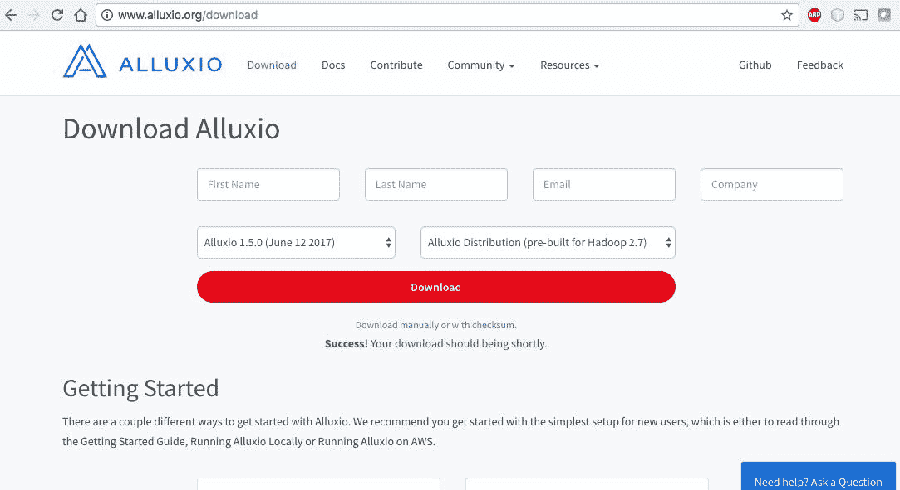
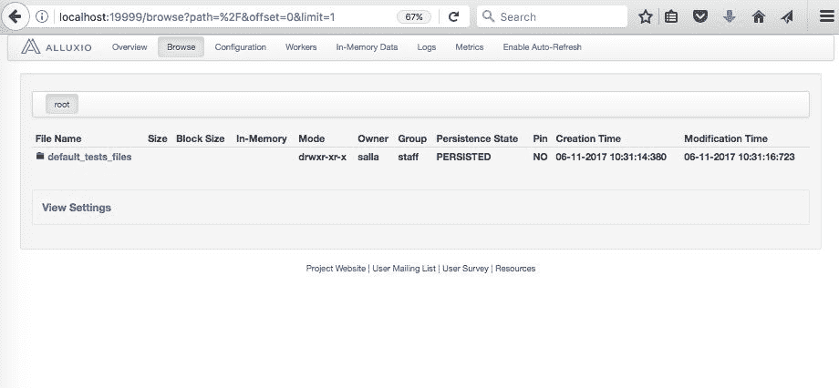
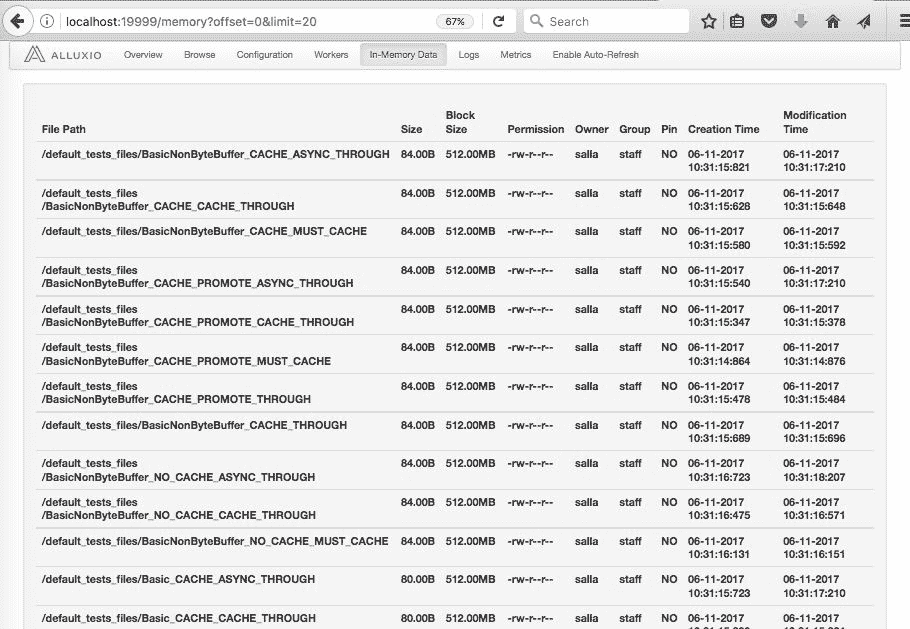
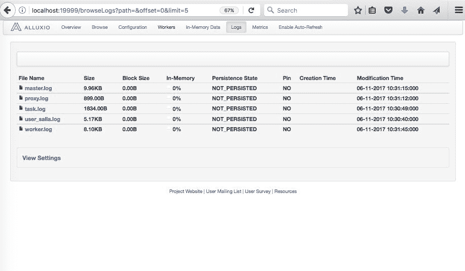
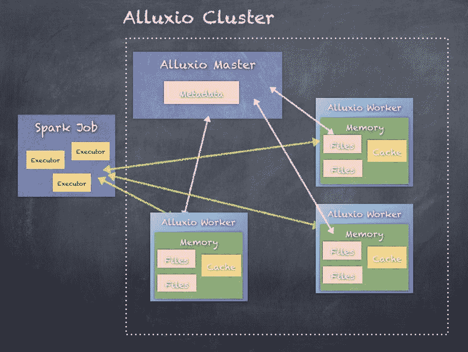

# 用 Alluxio 加速火花

"It has become appallingly obvious that our technology has exceeded our humanity."

阿尔伯特·爱因斯坦

在这里，您将学习如何将 Alluxio 与 Spark 一起使用，以加快处理速度。Alluxio 是一个开源的分布式内存存储系统，有助于加速跨平台的许多应用程序的速度，包括 Apache Spark。简而言之，本章将涵盖以下主题:

*   对全能的需求
*   Alluxio 入门
*   与纱的整合
*   在火花中使用 Alluxio

# 对全能的需求

我们已经看到了 Apache Spark 以及围绕 Spark 核心、Streaming、GraphX、Spark SQL 和 Spark 机器学习的各种功能。我们还研究了许多围绕数据操作和处理的用例和操作。任何处理任务的关键步骤都是数据输入、数据处理和数据输出。

此处显示的是火花作业的示例:


如这里所示，作业的输入和输出通常依赖于基于磁盘的较慢的存储选项，而处理通常使用内存/随机存取存储器来完成。由于内存比磁盘访问快 100 倍，如果我们能够减少磁盘使用并更多地使用内存，作业的性能显然可以显著提高。我们在任何工作中根本不使用任何磁盘是没有必要的，甚至是可能的；相反，我们只是想尽可能多地使用内存。

首先，我们可以尝试在内存中缓存尽可能多的数据，以便使用执行器加速处理。虽然这可能适用于某些作业，但对于运行 Spark 的分布式集群中运行的大型作业，不可能在 GBs 或 TBs 中有这么多内存。而且，即使有一个很大的集群供你使用，环境中也会有很多用户，因此很难为所有作业使用这么多资源。

我们知道分布式存储系统，如 HDFS、S3 和 NFS。同样，如果我们有一个分布式内存系统，我们可以将它用作所有作业的存储系统，以减少作业或管道中的中间作业所需的输入/输出。Alluxio 正是通过实现一个分布式内存文件系统来提供这一点，Spark 可以使用该文件系统来满足所有输入/输出需求。

# Alluxio 入门

Alluxio，以前被称为快子，统一了数据访问，并桥接了计算框架和底层存储系统。Alluxio 以内存为中心的体系结构使数据访问比现有解决方案快几个数量级。Alluxio 也与 Hadoop 兼容，因此可以无缝集成到现有基础架构中。现有的数据分析应用程序(如 Spark 和 MapReduce 程序)可以在 Alluxio 的基础上运行，无需任何代码更改，这意味着转换时间微不足道，但性能更好:


# 正在下载 Alluxio

您可以通过使用[http://www.alluxio.org/download](http://www.alluxio.org/download)网站注册您的姓名和电子邮件地址来下载 Alluxio:



或者也可以直接去[http://downloads.alluxio.org/downloads/files](http://downloads.alluxio.org/downloads/files)下载最新版本:


# 在本地安装和运行 Alluxio

我们将在本地安装并运行 1.5.0。你可以对任何其他版本做同样的事情。如果你下载了 1.5.0 版本，你会看到一个类似`alluxio-1.5.0-hadoop2.7-bin.tar.gz`的文件。

A prerequisite for Alluxio is to have JDK 7 or higher installed.

解压下载的`alluxio-1.5.0-hadoop2.7-bin.tar.gz`文件:

```scala
tar -xvzf alluxio-1.5.0-hadoop2.7-bin.tar.gzcd alluxio-1.5.0-hadoop-2.7

```

此外，如果在本地运行，Alluxio 将需要一个环境变量来正确绑定到主机，因此运行以下命令:

```scala
export ALLUXIO_MASTER_HOSTNAME=localhost

```

使用`/bin/alluxio`命令格式化 Alluxio 文件系统。

This step is only required when you run Alluxio for the first time and, when run, all the previously stored data and metadata in the Alluxio filesystem will be erased.

运行`/bin/alluxio`格式命令来格式化文件系统:

```scala
falcon:alluxio-1.5.0-hadoop-2.7 salla$ ./bin/alluxio formatWaiting for tasks to finish...All tasks finished, please analyze the log at /Users/salla/alluxio-1.5.0-hadoop-2.7/bin/../logs/task.log.Formatting Alluxio Master @ falcon

```

在本地启动 Alluxio 文件系统:

```scala
falcon:alluxio-1.5.0-hadoop-2.7 salla$ ./bin/alluxio-start.sh localWaiting for tasks to finish...All tasks finished, please analyze the log at /Users/salla/alluxio-1.5.0-hadoop-2.7/bin/../logs/task.log.Waiting for tasks to finish...All tasks finished, please analyze the log at /Users/salla/alluxio-1.5.0-hadoop-2.7/bin/../logs/task.log.Killed 0 processes on falconKilled 0 processes on falconStarting master @ falcon. Logging to /Users/salla/alluxio-1.5.0-hadoop-2.7/logsFormatting RamFS: ramdisk 2142792 sectors (1gb).Started erase on disk2Unmounting diskErasingInitialized /dev/rdisk2 as a 1 GB case-insensitive HFS Plus volumeMounting diskFinished erase on disk2 ramdiskStarting worker @ falcon. Logging to /Users/salla/alluxio-1.5.0-hadoop-2.7/logsStarting proxy @ falcon. Logging to /Users/salla/alluxio-1.5.0-hadoop-2.7/logs

```

您可以使用类似的语法来停止 Alluxio。

You can stop Alluxio by running `./bin/alluxio-stop.sh` local.

通过使用`runTests`参数运行 Alluxio 脚本来验证 Alluxio 是否正在运行:

```scala
falcon:alluxio-1.5.0-hadoop-2.7 salla$ ./bin/alluxio runTests2017-06-11 10:31:13,997 INFO type (MetricsSystem.java:startSinksFromConfig) - Starting sinks with config: {}.2017-06-11 10:31:14,256 INFO type (AbstractClient.java:connect) - Alluxio client (version 1.5.0) is trying to connect with FileSystemMasterClient master @ localhost/127.0.0.1:199982017-06-11 10:31:14,280 INFO type (AbstractClient.java:connect) - Client registered with FileSystemMasterClient master @ localhost/127.0.0.1:19998runTest Basic CACHE_PROMOTE MUST_CACHE2017-06-11 10:31:14,585 INFO type (AbstractClient.java:connect) - Alluxio client (version 1.5.0) is trying to connect with BlockMasterClient master @ localhost/127.0.0.1:199982017-06-11 10:31:14,587 INFO type (AbstractClient.java:connect) - Client registered with BlockMasterClient master @ localhost/127.0.0.1:199982017-06-11 10:31:14,633 INFO type (ThriftClientPool.java:createNewResource) - Created a new thrift client alluxio.thrift.BlockWorkerClientService$Client@36b4cef02017-06-11 10:31:14,651 INFO type (ThriftClientPool.java:createNewResource) - Created a new thrift client alluxio.thrift.BlockWorkerClientService$Client@4eb7f0032017-06-11 10:31:14,779 INFO type (BasicOperations.java:writeFile) - writeFile to file /default_tests_files/Basic_CACHE_PROMOTE_MUST_CACHE took 411 ms.2017-06-11 10:31:14,852 INFO type (BasicOperations.java:readFile) - readFile file /default_tests_files/Basic_CACHE_PROMOTE_MUST_CACHE took 73 ms.Passed the test!

```

Refer to [http://www.alluxio.org/docs/master/en/Running-Alluxio-Locally.html](http://www.alluxio.org/docs/master/en/Running-Alluxio-Locally.html) for additional options and details.

也可以通过打开浏览器，输入`http://localhost:19999/`，使用 web UI 查看 Alluxio 进程。

# 概观

“概述”选项卡显示摘要信息，如集群的主地址、运行工作人员、版本和正常运行时间。还显示了群集使用情况摘要，其中显示了工作人员容量和文件系统不足容量。然后，还会看到存储使用情况摘要，其中显示了空间容量和已用空间:


# 浏览

“浏览”选项卡允许您查看内存文件系统的当前内容。此选项卡显示文件系统中的内容、文件名、大小和块大小、我们是否将数据加载到内存中，以及文件的 ACL 和权限，指定谁可以访问它并执行读和写等操作。您将在“浏览”选项卡中看到所有在 Alluxio 中管理的文件:



# 配置

“配置”选项卡显示所有使用的配置参数。一些最重要的参数是所使用的配置目录、CPU 资源以及分配给主节点和工作节点的内存资源。还可以看到文件系统名称、路径、JDK 设置等。所有这些都可以被覆盖，为您的用例定制 Alluxio。此处的任何更改也需要重新启动群集:


# 工人

**Workers** 选项卡仅显示 Alluxio 集群中的工人。在我们的本地设置中，这将只显示本地机器，但是在一个典型的由许多工作人员组成的集群中，您将看到所有工作人员节点以及节点的状态、工作人员的容量、使用的空间和最后接收到的心跳，这显示了工作人员是否还活着并参与集群操作:


# 内存数据

内存中的数据选项卡显示了 Alluxio 文件系统内存中的当前数据。这显示了集群内存中的内容。内存中每个数据集的典型信息包括权限、所有权、创建和修改时间:



# 日志

“日志”选项卡允许您查看各种日志文件以进行调试和监控。您将看到主节点名为`master.log`的日志文件、工作节点名为`worker.log`、`task.log`、`proxy.log`的日志文件以及用户日志。每个日志文件都是独立增长的，在诊断问题或监控集群运行状况时非常有用:



# 韵律学

“指标”选项卡显示了用于监控 Alluxio 文件系统当前状态的指标。这里的主要信息包括主节点的容量和文件系统容量。还显示了各种操作的计数器，例如创建和删除的文件的逻辑操作，以及创建和删除的目录。另一部分显示了 RPC 调用，您可以使用这些调用来监视创建文件、删除文件和获取文件块信息等操作:


# 当前功能

如前所述，Alluxio 提供了许多功能来支持高速内存文件系统，从而大大加速了 Spark 或许多其他计算系统。当前版本有许多功能，其中一些主要功能可以描述如下:

*   **灵活的文件 API** 提供了一个 Hadoop 兼容的文件系统，允许 Hadoop MapReduce 和 Spark 使用 Alluxio。

*   **存储下可插拔**将内存中的数据检查点转移到底层存储系统，底层存储系统支持亚马逊 S3、谷歌云存储、OpenStack Swift、HDFS 等。

*   **分层存储**除了内存之外，还可以管理固态硬盘和硬盘，允许在 Alluxio 中存储更大的数据集。

*   **统一命名空间**通过装载功能实现不同存储系统之间的有效数据管理。此外，透明命名可确保在将 Alluxio 中创建的对象保存到底层存储系统时，这些对象的文件名和目录层次结构得以保留。

*   **沿袭**可以实现高吞吐量写入，而不会损害使用沿袭的容错性，其中丢失的输出通过重新执行创建输出的作业来恢复，就像 Apache Spark 中的 DAG 一样。

*   **网络用户界面和命令行**允许用户通过网络用户界面轻松浏览文件系统。在调试模式下，管理员可以查看每个文件的详细信息，包括位置和检查点路径。用户还可以使用`./bin/alluxio fs`与 Alluxio 进行交互，例如，将数据复制到文件系统中和从文件系统中复制数据。

Refer to [http://www.alluxio.org/](http://www.alluxio.org/) for the latest features and more up-to-date information.

这些都足以让 Alluxio 在本地启动。接下来，我们将看到如何与集群管理器集成，例如纱。

# 与纱的整合

纱线是最常用的集群管理器之一，其次是 Mesos。如果你能回忆起[第 5 章](05.html#4D4J81-21aec46d8593429cacea59dbdcd64e1c)、*应对大数据——火花来党*的话，那么纱可管理一个 Hadoop 集群的资源，允许数百个应用共享集群资源。我们可以运行长期运行的 Spark 作业来处理实时信用卡交易，例如，使用纱和 Spark 集成。

但是，不建议尝试将 Alluxio 作为 shate 应用程序运行；相反，Alluxio 应该作为一个独立的集群与纱一起运行。Alluxio 应该与纱一起运行，以便所有纱节点都可以访问本地 Alluxio 工作人员。为了让 YARN 和 Alluxio 共存，我们必须告知 YARN allu xio 使用的资源。例如，纱需要知道有多少内存和中央处理器留给所有。

# 所有的工作记忆

Alluxio 工作器需要一些内存用于其 JVM 进程，还需要一些内存用于其 RAM 磁盘；对于 JVM 内存来说，1 GB 通常没问题，因为这个内存只用于缓冲和元数据。

可通过设置`alluxio.worker.memory.size`来配置 RAM 磁盘存储器。

Data stored in non-memory tiers, such as SSD or HDD, does not need to be included in the memory-size calculation.

# 全能主存储器

Alluxio 主服务器存储关于 Alluxio 中每个文件的元数据，因此对于较大的集群部署，它应该至少为 1 GB，最多为 32 GB。

# 彩色 cpu

每个 Alluxio 工作人员至少应该有一个 vcore，并且 Alluxio 主服务器在生产部署中至少可以使用一个，最多可以使用四个 vcore。

要将每个节点上为 Alluxio 保留的资源通知给纱，请在`yarn-site.xml`中修改纱配置参数。更改`yarn.nodemanager.resource.memory-mb`为 Alluxio 工作人员保留一些内存。

After determining how much memory to allocate to Alluxio on the node, subtract this from `yarn.nodemanager.resource.memory-mb` and update the parameter with the new value.

更改`yarn.nodemanager.resource.cpu-vcores`为 Alluxio 工作人员保留 CPU vcores。

After determining how much memory to allocate to Alluxio on the node, subtract this from `yarn.nodemanager.resource.cpu-vcores` and update the parameter with the new value.

更新纱线配置后，重新启动纱线，使其接受更改。

# 使用带火花的 Alluxio

为了将 Alluxio 与 Spark 一起使用，您将需要几个依赖 jar。这是为了使 Spark 能够连接到 Alluxio 文件系统并读取/写入数据。一旦我们用 Alluxio 集成启动了 Spark，Spark 的大部分代码保持不变，只对代码的读写部分进行了更改，因为现在您必须使用`alluxio://`来表示 Alluxio 文件系统。

但是，一旦设置了 Alluxio 集群，Spark 作业(执行器)将连接到 Alluxio 主节点以获取元数据，并连接到 Alluxio 工作节点以进行实际的数据读/写操作。

此处显示的是火花作业中使用的 Alluxio 集群的图示:



以下是如何用 Alluxio 启动 Spark-shell 并运行一些代码的步骤:

**第 1 步**，将目录改为提取火花的目录:

```scala
 cd spark-2.2.0-bin-hadoop2.7

```

**第二步**，将罐子从 Alluxio 复制到 Spark:

```scala
cp ../alluxio-1.5.0-hadoop-2.7/core/common/target/alluxio-core-common-1.5.0.jar .cp ../alluxio-1.5.0-hadoop-2.7/core/client/hdfs/target/alluxio-core-client-hdfs-1.5.0.jar .cp ../alluxio-1.5.0-hadoop-2.7/core/client/fs/target/alluxio-core-client-fs-1.5.0.jar .cp ../alluxio-1.5.0-hadoop-2.7/core/protobuf/target/alluxio-core-protobuf-1.5.0.jar .

```

**步骤 3** ，用 Alluxio 罐子启动火花壳:

```scala
./bin/spark-shell --master local[2] --jars alluxio-core-common-1.5.0.jar,alluxio-core-client-fs-1.5.0.jar,alluxio-core-client-hdfs-1.5.0.jar,alluxio-otobuf-1.5.0.jar

```

步骤 4，将示例数据集复制到 Alluxio 文件系统中:

```scala
$ ./bin/alluxio fs copyFromLocal ../spark-2.1.1-bin-hadoop2.7/Sentiment_Analysis_Dataset10k.csv /Sentiment_Analysis_Dataset10k.csvCopied ../spark-2.1.1-bin-hadoop2.7/Sentiment_Analysis_Dataset10k.csv to /Sentiment_Analysis_Dataset10k.csv

```

您可以使用“浏览”选项卡在 Alluxio 中验证文件；它是大小为 801.29KB 的情绪分析数据集 10k.csv 文件:


第四步。使用和不使用 Alluxio 访问文件。

首先，在 shell 中设置 Alluxio 文件系统配置:

```scala
scala> sc.hadoopConfiguration.set("fs.alluxio.impl", "alluxio.hadoop.FileSystem")

```

从 Alluxio 加载文本文件:

```scala
scala> val alluxioFile = sc.textFile("alluxio://localhost:19998/Sentiment_Analysis_Dataset10k.csv")alluxioFile: org.apache.spark.rdd.RDD[String] = alluxio://localhost:19998/Sentiment_Analysis_Dataset10k.csv MapPartitionsRDD[39] at textFile at <console>:24scala> alluxioFile.countres24: Long = 9999

```

从本地文件系统加载相同的文本文件:

```scala
scala> val localFile = sc.textFile("Sentiment_Analysis_Dataset10k.csv")localFile: org.apache.spark.rdd.RDD[String] = Sentiment_Analysis_Dataset10k.csv MapPartitionsRDD[41] at textFile at <console>:24scala> localFile.countres23: Long = 9999

```

如果您可以用大量数据加载 Alluxio，Alluxio 集成将提供更高的性能，而不需要缓存数据。这产生了几个优点，包括每个使用 Spark 集群的用户都不需要缓存大型数据集。

# 摘要

在本附录中，我们探索了使用 Alluxio 作为一种利用 Alluxio 的内存文件系统功能加速 Spark 应用程序的方法。这产生了几个优点，包括每个使用 Spark 集群的用户都不需要缓存大型数据集。

在下一个附录中，我们将探讨如何使用 Apache Zeppelin，一个基于网络的笔记本来执行交互式数据分析。