# 与阿帕奇齐柏林飞船的交互式数据分析

从数据科学的角度来看，数据分析的交互式可视化也很重要。Apache Zeppelin，是一款用于交互式和大规模数据分析的网络笔记本，具有多个后端和解释器，例如 Spark、Scala、Python、JDBC、Flink、Hive、Angular、Livy、Alluxio、PostgreSQL、Ignite、Lens、Cassandra、Kylin、Elasticsearch、JDBC、HBase、BigQuery、Pig、Markdown、Shell 等等。

毫无疑问，Spark 能够以可扩展和快速的方式处理大规模数据集。然而，Spark 中缺少了一件事——它没有实时或交互式可视化支持。考虑到前面提到的齐柏林飞艇令人兴奋的特性，在本章中，我们将讨论如何使用 Apache 齐柏林飞艇进行大规模数据分析，在后端使用 Spark 作为解释器。总之，将涵盖以下主题:

*   阿帕奇齐柏林飞艇简介
*   安装和入门
*   数据摄取
*   数据分析
*   数据可视化
*   数据协作

# 阿帕奇齐柏林飞艇简介

Apache Zeppelin 是一款基于网络的笔记本，可让您以交互方式进行数据分析。使用 Zeppelin，您可以用 SQL、Scala 等制作漂亮的数据驱动、交互和协作文档。阿帕奇齐柏林解释器的概念允许任何语言/数据处理后端插入齐柏林。目前，Apache Zeppelin 支持许多解释器，例如 Apache Spark、Python、JDBC、Markdown 和 Shell。Apache Zeppelin 是 Apache 软件基金会的一项相对较新的技术，它使数据科学家、工程师和从业者能够利用数据探索、可视化、共享和协作功能。

# 安装和入门

因为使用其他解释器不是本书的目标，但是在齐柏林飞艇上使用 Spark 是，所有的代码都将使用 Scala 编写。因此，在本节中，我们将展示如何使用只包含 Spark 解释器的二进制包来配置齐柏林飞艇。Apache Zeppelin 正式支持并在以下环境中进行测试:

| **要求** | **数值/版本** | **其他要求** |
| Oracle JDK | 1.7 或更高 | 设置`JAVA_HOME` |
| 操作系统（Operating System） | MAC OS 10 . x+Ubuntu 14 . x+centos 6 . x+windows 7 pro SP1+ | - |

# 安装和配置

如上表所示，在齐柏林飞艇上执行 Spark 代码需要 Java。因此，如果没有设置，请在上述任何平台上安装和设置 Java。或者，您可以参考[第 1 章](01.html#KVCC1-21aec46d8593429cacea59dbdcd64e1c)、*Scala 简介*，了解如何在您的机器上设置 Java。

阿帕奇齐柏林飞艇的最新版本可以从[https://zeppelin.apache.org/download.html](https://zeppelin.apache.org/download.html)下载。每个版本都有三个选项:

1.  **包含所有解释器的二进制包**:包含对很多解释器的支持。例如，Spark、JDBC、Pig、Beam、Scio、BigQuery、Python、Livy、HDFS、Alluxio、Hbase、blanking、Elasticsearch、Angular、Markdown、Shell、Flink、Hive、Tajo、Cassandra、Geode、Ignite、Kylin、Lens、Phoenix 和 PostgreSQL 目前在齐柏林都支持。
2.  **带有 Spark 解释器的二进制包**:通常只包含 Spark 解释器。它还包含解释器网络安装脚本。
3.  **来源**:你也可以用 GitHub repo 的所有最新改动来打造齐柏林飞艇(更多后续)。

为了展示如何安装和配置齐柏林飞艇，我们从以下站点镜像下载了二进制包:

[http://www . Apache . org/dyn/closer . CGI/zeppelin/zeppelin-0 . 7 . 1/zeppelin-0 . 7 . 1-bin-net inst . tgz](http://www.apache.org/dyn/closer.cgi/zeppelin/zeppelin-0.7.1/zeppelin-0.7.1-bin-netinst.tgz)

一旦你下载了它，解压到你机器的某个地方。假设你解压文件的路径是`/home/Zeppelin/`。

# 从源构建

您还可以使用 GitHub repo 的所有最新更改来构建齐柏林飞艇。如果要从源代码构建，必须首先安装以下工具:

*   Git:任何版本
*   Maven: 3.1.x 或更高版本
*   JDK: 1.7 或更高
*   npm:最新版本
*   libfontconfig:最新版本

如果您还没有安装 Git 和 Maven，请查看[http://zeppelin . Apache . org/docs/0 . 8 . 0-SNAPSHOT/install/build . html # build-requirements](http://zeppelin.apache.org/docs/0.8.0-SNAPSHOT/install/build.html#build-requirements)的构建需求说明。但是，由于页面限制，我们没有详细讨论所有步骤。如果你感兴趣，你应该参考这个网址了解更多详情:[http://zeppelin.apache.org/docs/snapshot/install/build.html](http://zeppelin.apache.org/docs/snapshot/install/build.html)。

# 启动和停止阿帕奇齐柏林飞艇

在所有类似 Unix 的平台上(例如，Ubuntu、macOS 等)，使用以下命令:

```scala
$ bin/zeppelin-daemon.sh start

```

如果前面的命令成功执行，您应该在终端上观察以下日志:


**Figure 1**: Starting Zeppelin from the Ubuntu terminal

如果您在 Windows 上，请使用以下命令:

```scala
$ bin\zeppelin.cmd

```

齐柏林飞船成功启动后，用你的网络浏览器进入`http://localhost:8080`，你会看到齐柏林飞船正在运行。更具体地说，您将在浏览器上看到以下视图:


**Figure 2**: Zeppelin is running on http://localhost:8080

恭喜你；你已经成功安装了阿帕奇齐柏林飞船！现在，让我们转到齐柏林飞艇，一旦我们配置了首选的解释器，就开始我们的数据分析。

现在，要从命令行停止齐柏林飞艇，请发出以下命令:

```scala
$ bin/zeppelin-daemon.sh stop

```

# 创建笔记本

一旦你上了`http://localhost:8080/`，你可以探索不同的选项和菜单，帮助你了解如何熟悉齐柏林飞船。您可以在[https://Zeppelin . Apache . org/docs/0 . 7 . 1/quick start/explorezepelinui . html](https://zeppelin.apache.org/docs/0.7.1/quickstart/explorezeppelinui.html)上找到更多关于 Zeppelin 及其用户友好型 UI 的信息(您也可以根据可用版本参考最新的快速入门文档)。

现在，让我们首先创建一个示例笔记本并开始。如下图所示，您可以通过单击“创建新笔记”选项来创建新笔记本:


**Figure 3**: Creating a sample Zeppelin notebook

如上图所示，默认解释器选择为 Spark。在下拉列表中，您也将只看到Spark，因为我们已经为齐柏林飞船下载了只包含Spark的二进制包。

# 配置解释器

每个口译员都属于一个口译组。翻译组是启动/停止翻译的单位。默认情况下，每个解释器都属于一个组，但是该组可能包含更多的解释器。例如，Spark 解释器组包括 Spark 支持、pySpark、Spark SQL 和依赖项加载器。如果要在齐柏林飞艇上执行一条 SQL 语句，应该使用`%`符号指定解释器类型；比如对于使用 SQL，就应该使用`%sql`；对于降价，使用`%md`等等。

有关更多信息，请参考下图:


**Figure 4**: The interpreter properties for using Spark on Zeppelin Data ingestion

好吧，一旦你创建了笔记本，你就可以直接在代码部分开始编写 Spark 代码了。对于这个简单的例子，我们将使用银行数据集，该数据集可公开用于研究，并可从[https://archive . ics . UCI . edu/ml/机器学习数据库/00222/](https://archive.ics.uci.edu/ml/machine-learning-databases/00222/) 下载，由 S. Moro、R. Laureano 和 P. Cortez 提供，使用数据挖掘进行银行直接营销:CRISP-DM 方法的应用。数据集以 CSV 格式包含有关银行客户的数据，如年龄、职称、婚姻状况、教育程度、是否违约、银行余额、住房、借款人是否从银行贷款等。数据集示例如下:


**Figure 5**: A sample of the bank dataset

现在，让我们首先将数据加载到齐柏林飞艇笔记本上:

```scala
valbankText = sc.textFile("/home/asif/bank/bank-full.csv")

```

执行这一行代码后，创建一个新段落，并将其命名为数据接收段落:


**Figure 6**: Data ingesting paragraph

如果您仔细查看前面的图片，代码是有效的，我们不需要定义 Spark 上下文。原因是那里已经定义为`sc`。您甚至不需要隐式定义 Scala。我们将在后面看到一个这样的例子。

# 数据处理和可视化

现在，让我们创建一个 case 类，它将告诉我们如何从数据集中选择选定的字段:

```scala
case class Bank(age:Int, job:String, marital : String, education : String, balance : Integer)

```

现在，拆分每一行，过滤掉表头(从`age`开始)，映射到`Bank`案例类，如下:

```scala
val bank = bankText.map(s=>s.split(";")).filter(s => (s.size)>5).filter(s=>s(0)!="\"age\"").map( s=>Bank(s(0).toInt,  s(1).replaceAll("\"", ""), s(2).replaceAll("\"", ""), s(3).replaceAll("\"", ""), s(5).replaceAll("\"", "").toInt ) ) 

```

最后，转换为数据帧并创建临时表:

```scala
bank.toDF().createOrReplaceTempView("bank")

```

下面的屏幕截图显示，所有代码片段都成功执行，没有显示任何错误:

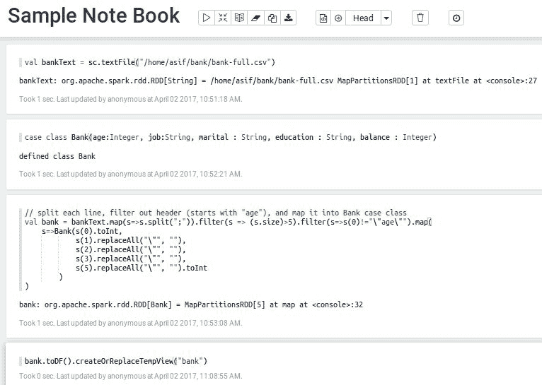

**Figure 7**: Data process paragraph

为了使它更透明，让我们看一下用绿色标记的状态(在图像的右上角)，如下所示，在为每种情况执行代码之后:

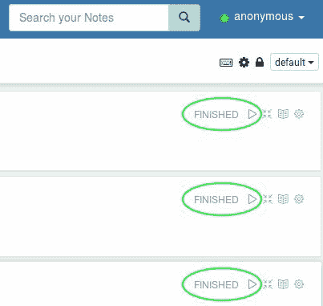

**Figure 8**: A successful execution of Spark code in each paragraph

现在，让我们加载一些数据来使用下面的 SQL 命令:

```scala
%sql select age, count(1) from bank where age >= 45 group by age order by age

```

请注意，前面的代码行是一个纯 SQL 语句，它选择年龄大于或等于 45 岁的所有客户的姓名(即年龄分布)。最后，它计算同一客户群的数量。

现在让我们看看前面的 SQL 语句是如何在 temp 视图(即`bank`)上工作的:

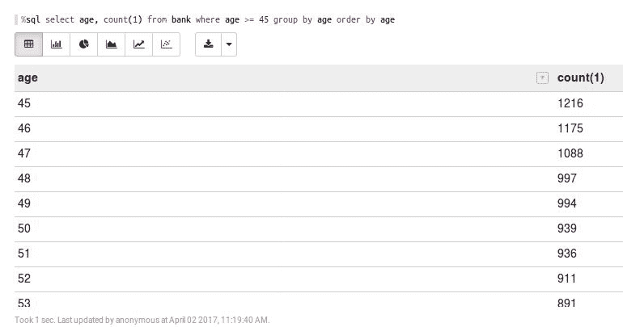

**Figure 9**: SQL query that selects the names of all the customers with age distribution [Tabular]

现在，您可以从表格图标附近的选项卡(在结果部分)中选择图表选项，如直方图、饼图、条形图等。例如使用直方图，可以看到`age group >=45`对应的计数。

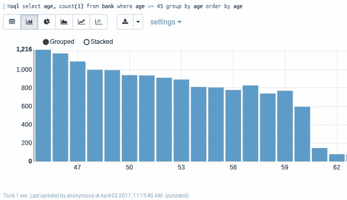

**Figure 10**: SQL query that selects the names of all the customers with age distribution [Histogram]

这是使用饼图的外观:


**Figure 11**: SQL query that selects the names all the customers with age distribution [pie-chart]

太棒了！我们现在几乎已经准备好使用齐柏林飞船解决更复杂的数据分析问题。

# 齐柏林飞艇的复杂数据分析

在本节中，我们将看到如何使用齐柏林飞艇执行更复杂的分析。首先，我们将形式化这个问题，然后，我们将探索将要使用的数据集。最后，我们将应用一些视觉分析和机器学习技术。

# 问题定义

在本节中，我们将构建一个垃圾邮件分类器，用于将原始文本分类为垃圾邮件或火腿。我们还将展示如何评估这样的模型。我们将尝试专注于使用和使用数据框架应用编程接口。最后，垃圾邮件分类器模型将帮助您区分垃圾邮件和火腿邮件。下图显示了两封邮件(分别是垃圾邮件和火腿)的概念视图:


**Figure 12**: Spam and Ham example

我们提供一些基本的机器学习技术来构建和评估这类问题的分类器。特别是，逻辑回归算法将用于这个问题。

# 数据集描述和探索

我们从[https://archive.ics.uci.edu/ml/datasets/SMS+Spam+Collection](https://archive.ics.uci.edu/ml/datasets/SMS+Spam+Collection)下载的垃圾短信数据集由 5564 条短信组成，这些短信被手工归类为火腿或垃圾短信。这些中小企业中只有 13.4%是垃圾邮件。这意味着数据集是倾斜的，只提供了几个垃圾邮件的例子。这一点需要记住，因为它会在训练模型时引入偏差:

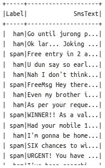

**Figure 13**: A snap of the SMS dataset

那么，这些数据是什么样的呢？正如您可能已经看到的，社交媒体文本确实会变得很脏，包含俚语词、拼错的词、缺失的空格、缩写词，例如 *u* 、 *urs* 、 *yrs* 等等，并且经常违反语法规则。它有时甚至在信息中包含琐碎的词语。因此，我们也需要处理这些问题。在以下步骤中，我们将遇到这些问题，以便更好地解释分析。

**第一步。在齐柏林飞船上加载所需的包和应用编程接口** -在我们摄取齐柏林飞船上的数据集之前，让我们加载所需的包和应用编程接口并创建第一段:


**Figure 14**: Package/APIs load paragraph

**第二步。加载并解析数据集** -我们将使用数据块的 CSV 解析库(即`com.databricks.spark.csv`)将数据读入数据框:

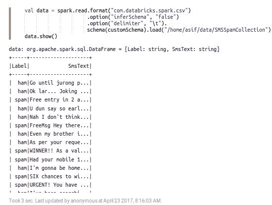

**Figure 15**: Data ingesting/load paragraph

**第三步。使用** `StringIndexer` **创建数字标签** -由于原始数据框中的标签是分类的，我们必须将它们转换回来，以便我们可以将它们输入或在机器学习模型中使用它们:


**Figure 16**: The StringIndexer paragraph, and the output shows the raw labels, original texts, and corresponding labels.

**第四步。使用** `RegexTokenizer` **创建单词包** -我们将使用`RegexTokenizer`删除不需要的单词并创建单词包:


**Figure 17**: The RegexTokenizer paragraph, and the output shows the raw labels, original texts, corresponding labels, and tokens

**第五步。移除停止词并创建过滤后的** **数据框** -我们将移除停止词并创建用于视觉分析的过滤后的数据框。最后，我们展示了数据框:

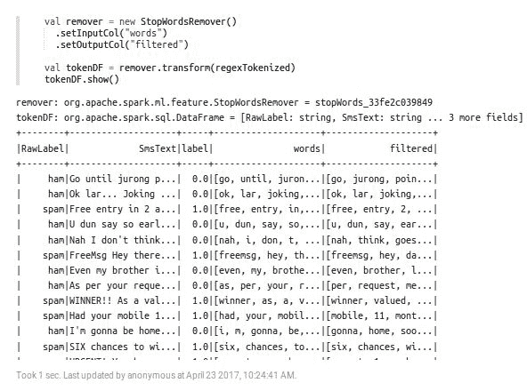

**Figure 18**: StopWordsRemover paragraph and the output shows the raw labels, original texts, corresponding labels, tokens, and filtered tokens without the stop words

**第六步。查找垃圾邮件/单词及其频率** -让我们尝试创建一个只包含垃圾邮件单词及其各自频率的数据框架，以了解数据集中邮件的上下文。我们可以在齐柏林飞艇上创建一个段落:


**Figure 19**: Spam tokens with a frequency paragraph

现在，让我们使用 SQL 查询在图表中看到它们。以下查询选择频率超过 100 的所有令牌。然后，我们按照频率的降序对令牌进行排序。最后，我们使用动态表单来限制记录的数量。第一种只是原始表格格式:


**Figure 20**: Spam tokens with a frequency visualization paragraph [Tabular]

然后，我们将使用条形图，它提供了更多的视觉洞察。我们现在可以看到垃圾邮件中最常见的单词是 call 和 free，频率分别为 355 和 224:


**Figure 21**: Spam tokens with a frequency visualization paragraph [Histogram]

最后，使用饼图提供了更好、更广的可见性，尤其是在指定列范围的情况下:

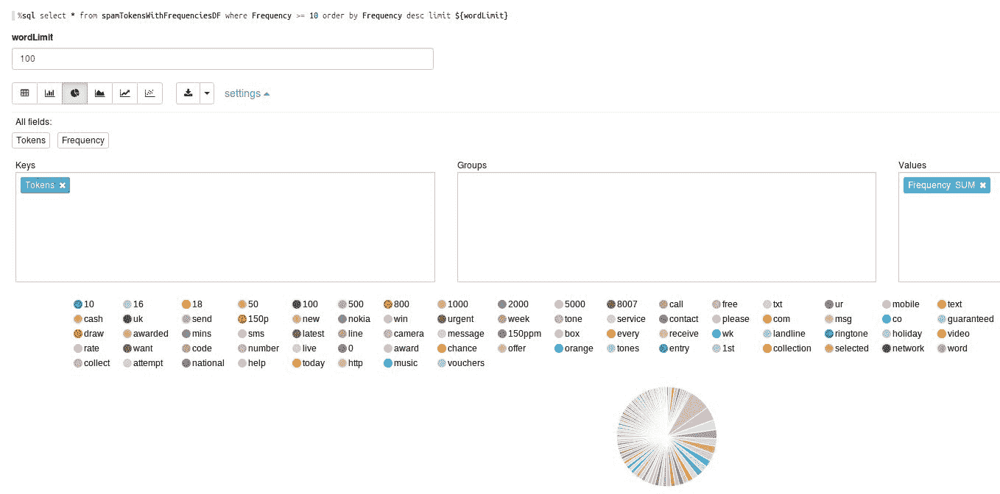

**Figure 22**: Spam tokens with a frequency visualization paragraph [Pie chart]

**第七步。将哈希函数用于词频** -使用`HashingTF`生成每个过滤后的令牌的词频，如下所示:


**Figure 23**: HashingTF paragraph, and the output shows the raw labels, original texts, corresponding labels, tokens, filtered tokens, and corresponding term-frequency for each row

**第八步。将 IDF 用于术语频率-逆文档频率(TF-IDF)** - TF-IDF 是一种在文本挖掘中广泛使用的特征矢量化方法，用于反映术语对语料库中文档的重要性:

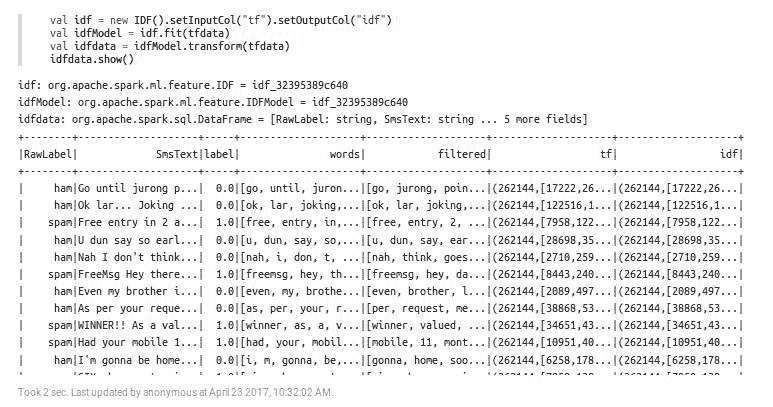

**Figure 24**: IDF paragraph, and the output shows the raw labels, original texts, corresponding labels, tokens, filtered tokens, term-frequency, and the corresponding IDFs for each row

**单词包:**单词包为句子中每个单词的出现分配一个值`1`。这大概是不理想的，因为句子的每个类别，很可能都有相同频率的*、*和*等词；而像*伟哥*和 *sale* 这样的词在判断文本是否为垃圾邮件时可能更为重要。*

 ***TF-IDF:** 这是文本频率–反向文档频率的缩写。这个术语本质上是每个单词的文本频率和反向文档频率的乘积。这通常用在自然语言处理或文本分析的单词包方法中。

**使用 TF-IDF:** 我们来看看词频。这里，我们考虑一个单词在单个条目中的出现频率，即术语。计算文本频率(TF)的目的是找到在每个条目中似乎很重要的术语。然而，像*和*这样的词可能在每个条目中出现得非常频繁。我们想要降低这些单词的重要性，因此我们可以想象将前面的 TF 乘以整个文档频率的倒数可能有助于找到重要的单词。然而，由于文本集合(语料库)可能相当大，所以通常采用文档频率倒数的对数。简而言之，我们可以想象 TF-IDF 的高值可能表示对确定文档内容非常重要的单词。创建 TF-IDF 向量需要我们将所有文本加载到内存中，并计算每个单词的出现次数，然后才能开始训练我们的模型。**

 ****第九步。使用 VectorAssembler 为 Spark ML 管道**生成原始特征-正如您在上一步中看到的，我们只有过滤后的令牌、标签、TF 和 IDF。然而，没有相关的特性可以被输入到任何 ML 模型中。因此，我们需要使用 Spark VectorAssembler API 基于前面数据框中的属性创建特性，如下所示:

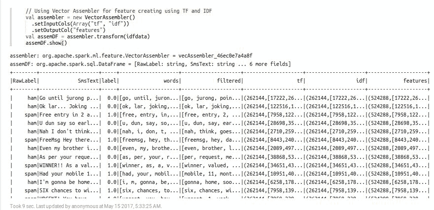

**Figure 25**: The VectorAssembler paragraph that shows using VectorAssembler for feature creations

**第十步。准备训练和测试集** -现在我们需要准备训练和测试集。训练集将用于在步骤 11 *、*中训练逻辑回归模型，测试集将用于在步骤 12 中评估模型。在这里，我把 75%用于培训，25%用于测试。您可以相应地调整它:


**Figure 26**: Preparing training/test set paragraph

**第 11 步。训练二元逻辑回归模型** -既然，问题本身就是二元分类问题，我们可以使用二元逻辑回归分类器，如下:


**Figure 27**: LogisticRegression paragraph that shows how to train the logistic regression classifier with the necessary labels, features, regression parameters, elastic net param, and maximum iterations

请注意，在这里，为了获得更好的结果，我们已经迭代了 200 次训练。我们将回归参数和弹性网络参数设置得非常低，即 0.0001，以使训练更加密集。

**第 12 步。模型评估** -让我们计算测试集的原始预测。然后，我们使用二进制分类器评估器实例化原始预测，如下所示:

**** **Figure 28**: Model evaluator paragraph

现在让我们计算测试集模型的准确性，如下所示:


**Figure 29**: Accuracy calculation paragraph

这令人印象深刻。然而，例如，如果您使用交叉验证来进行模型调优，您可以获得更高的精度。最后，我们将计算混淆矩阵以获得更多的洞察力:


**Figure 30**: Confusion paragraph shows the number of correct and incorrect predictions summarized with count values and broken down by each class

# 数据和结果协作

此外，阿帕奇齐柏林飞艇提供了一个发布你的笔记本段落结果的功能。使用此功能，您可以在自己的网站上显示齐柏林飞艇笔记本的段落结果。很直白；只需使用页面上的`<iframe>`标签。如果你想分享你的齐柏林飞艇笔记本的链接，发布你的段落结果的第一步是复制一个段落链接。在齐柏林飞艇笔记本上运行完一个段落后，点击位于右侧的齿轮按钮。然后，单击菜单中的链接此段落，如下图所示:


**Figure 31**: Linking the paragraph

然后，复制提供的链接，如下所示:

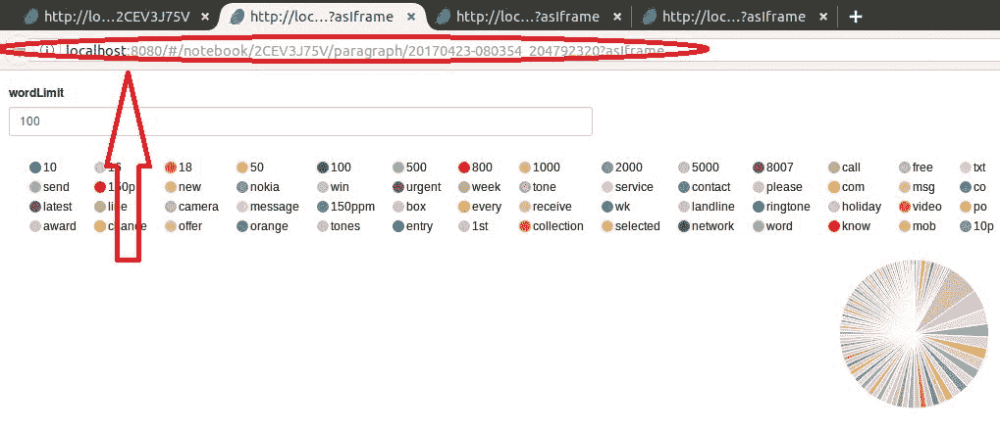

**Figure 32**: Getting the link for paragraph sharing with collaborators

现在，即使你想发布复制的段落，你也可以在你的网站上使用`<iframe>`标签。这里有一个例子:

```scala
<iframe src="http://<ip-address >:< port >/#/notebook/2B3QSZTKR/paragraph/...?asIframe" height="" width="" ></iframe>
```

现在，你可以在你的网站上展示你美丽的可视化结果。这或多或少是我们与阿帕奇齐柏林飞船的数据分析之旅的结束。更多信息及相关更新，请登陆[https://zeppelin.apache.org/](https://zeppelin.apache.org/)阿帕奇齐柏林飞艇官网；你甚至可以在[users-subscribe@zeppelin.apache.org](mailto:users-subscribe@zeppelin.apache.org)订阅齐柏林飞艇用户。

# 摘要

Apache Zeppelin 是一款基于网络的笔记本，可让您以交互方式进行数据分析。使用 Zeppelin，您可以用 SQL、Scala 等制作漂亮的数据驱动、交互和协作文档。它越来越受欢迎，因为更多的功能被添加到最近的版本中。但是，由于页面限制，为了让您更专注于只使用 Spark，我们展示了只适合在 Scala 中使用 Spark 的示例。但是，您可以用 Python 编写您的 Spark 代码，并以类似的轻松方式测试您的笔记本。

在这一章中，我们讨论了如何使用 Apache Zeppelin 进行大规模数据分析，在后端使用 Spark 作为解释器。我们看到了如何安装和开始使用齐柏林飞艇。然后，我们看到了如何摄取您的数据，并解析和分析它以获得更好的可见性。然后，我们看到了如何将其可视化以获得更好的洞察力。最后，我们看到了如何与合作者共享齐柏林飞艇笔记本。***