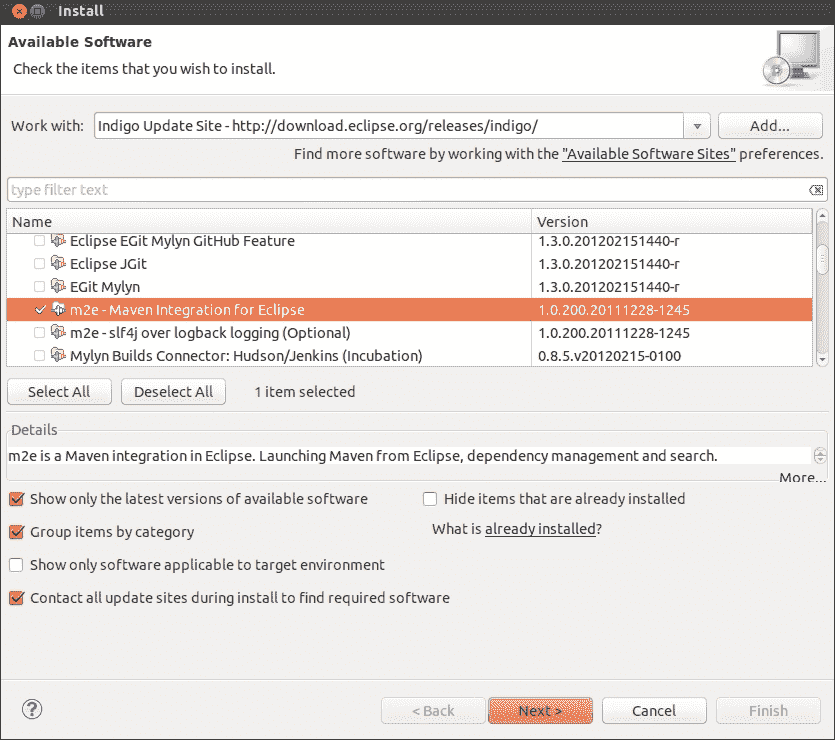
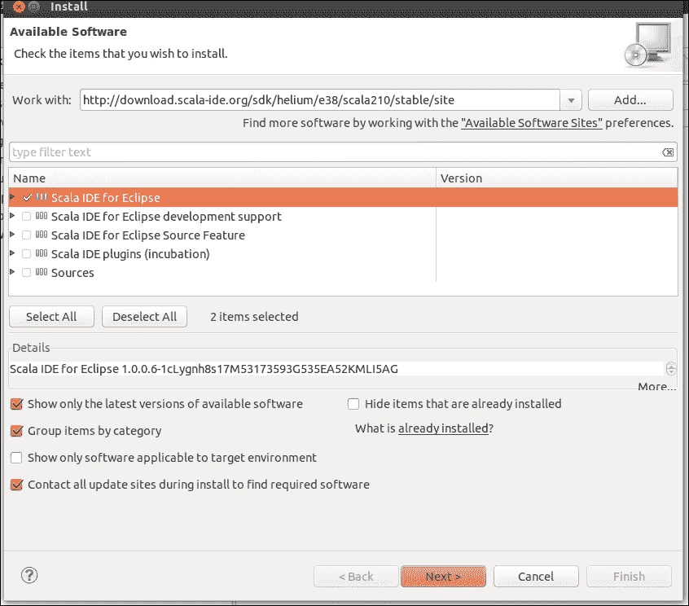
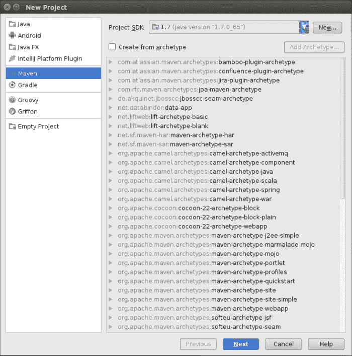
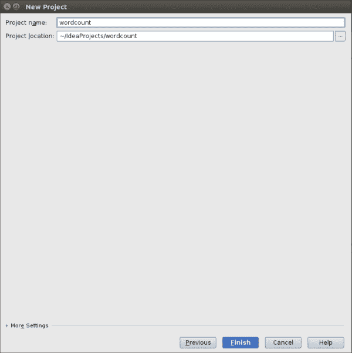

# 第二章使用 Spark 开发应用程序

在本章中，我们将介绍：

*   探索Spark壳
*   用 Maven 在 Eclipse 中开发 Spark 应用程序
*   用 SBT 在 Eclipse 中开发 Spark 应用程序
*   用 Maven 开发 IntelliJ IDEA 中的 Spark 应用程序
*   用 SBT 开发 IntelliJ IDEA 中的 Spark 应用程序

# 简介

要创建生产质量 Spark 作业/应用程序，使用各种**集成开发环境**(**IDE**)和构建工具非常有用。 本章将介绍各种 IDE 和构建工具。

# 探索Spark壳

Spark 与 REPL shell 捆绑在一起，后者是 Scala shell 的包装器。 虽然 Sparkshell 看起来像是处理简单事情的命令行，但实际上也可以使用它执行许多复杂的查询。 本章探讨可以在其中开发 Spark 应用程序的不同开发环境。

## 怎么做……

有了 Spark shell，Hadoop MapReduce 的字数统计变得非常简单。 在本食谱中，我们将创建一个简单的单行文本文件，将其上传到**Hadoop 分布式文件系统**(**HDFS**)，并使用 Spark 计算单词的出现次数。 让我们看看如何：

1.  使用以下命令创建`words`目录：

    ```scala
    $ mkdir words

    ```

2.  进入`words`目录：

    ```scala
    $ cd words

    ```

3.  创建`sh.txt`文本文件并在其中输入`"to be or not to be"`：

    ```scala
    $ echo "to be or not to be" > sh.txt

    ```

4.  启动 Spark Shell：

    ```scala
    $ spark-shell

    ```

5.  将`words`目录加载为 RDD：

    ```scala
    Scala> val words = sc.textFile("hdfs://localhost:9000/user/hduser/words")

    ```

6.  计数行数(结果：1)：

    ```scala
    Scala> words.count

    ```

7.  将行(或多行)分成多个字：

    ```scala
    Scala> val wordsFlatMap = words.flatMap(_.split("\\W+"))

    ```

8.  将`word`转换为(Word，1)-即输出`1`作为每次出现`word`的值，作为键：

    ```scala
    Scala> val wordsMap = wordsFlatMap.map( w => (w,1))

    ```

9.  使用`reduceByKey`方法将每个单词的出现次数添加为一个键(该函数一次对由`a`和`b`表示的两个连续值起作用)：

    ```scala
    Scala> val wordCount = wordsMap.reduceByKey( (a,b) => (a+b))

    ```

10.  对结果进行排序：

    ```scala
    Scala> val wordCountSorted = wordCount.sortByKey(true)

    ```

11.  打印 RDD：

    ```scala
    Scala> wordCountSorted.collect.foreach(println)

    ```

12.  上述操作一步完成如下：

    ```scala
    Scala> sc.textFile("hdfs://localhost:9000/user/hduser/words"). flatMap(_.split("\\W+")).map( w => (w,1)). reduceByKey( (a,b) => (a+b)).sortByKey(true).collect.foreach(println)

    ```

这为我们提供了以下输出：

```scala
(or,1)
(to,2)
(not,1)
(be,2)

```

现在，您了解了基本知识，向 HDFS 加载大量文本(例如，故事)，并了解其中的神奇之处。

如果您有压缩格式的文件，则可以按 HDFS 中的原样加载它们。 Hadoop 和 Spark 都有用于解压缩的编解码器，它们基于文件扩展名使用。

当`wordsFlatMap`转换为`wordsMap`RDD 时，存在隐式转换。 这会将 RDD 转换为`PairRDD`。 这是一个隐式转换，不需要执行任何操作。 如果您使用的是 Scala 代码，请添加以下`import`语句：

```scala
import org.apache.spark.SparkContext._
```

# 用 Maven 在 Eclipse 中开发 Spark 应用

Maven 作为的构建工具，多年来已经成为的事实标准。 如果我们稍微更深入地看看 Maven 带来的承诺，也就不足为奇了。 Maven有两个主要特性，它们是：

*   **配置约定**：Maven 之前的构建工具允许开发人员自由地决定将源文件放在哪里、将测试文件放在哪里、将编译文件放在哪里等等。 马文剥夺了这种自由。 有了这种自由，所有关于地点的困惑也就烟消云散了。 在 Maven 中，所有内容都有特定的目录结构。 下表显示了几个最常见的位置：

    <colgroup><col style="text-align: left"><col style="text-align: left"></colgroup>
    | `/src/main/scala` | Scala 中的源代码 |
    | `/src/main/java`[。 | JAVA 中的源代码 |
    | `/src/main/resources` | 源代码(如配置文件)要使用的资源 |
    | `/src/test/scala`[。 ] | Scala 中的测试代码 |
    | `/src/test/java` | JAVA 中的测试代码 |
    | `/src/test/resources`。 | 测试代码(如配置文件)要使用的资源 |

*   **Declarative dependency management** : In Maven, every library is defined by following three coordinates:

    <colgroup><col style="text-align: left"> <col style="text-align: left"></colgroup> 
    |  | A logical way to group libraries similar to packages in Java/Scala, which must be at least the domain name you own-for example. `org.apache.spark` |
    | `artifactId` | item and the name of JAR |
    | `version` | Standard version number. |

在`pom.xml`(告诉 Maven 有关项目的所有信息的配置文件)中，依赖项以这三个坐标的形式声明。 不需要在 Internet 上搜索以及下载、解包和复制库。 您所需要做的就是提供所需依赖 JAR 的三个坐标，Maven 将为您完成其余的工作。 以下是使用 JUnit 依赖项的示例：

```scala
<dependency>
  <groupId>junit</groupId>
  <artifactId>junit</artifactId>
  <version>4.12</version>
</dependency>
```

这个使得包括可传递的依赖项的依赖项管理变得非常容易。 在 Maven 之后出现的构建工具(如 SBT 和 Gradle)也按原样遵循这两条规则，并在其他方面提供了增强。

## 做好准备

从本配方开始，本章假设您已经安装了 Eclipse。 详情请访问[http://www.eclipse.org](http://www.eclipse.org)。

## 怎么做……

让我们看看如何安装用于 Eclipse 的 Maven 插件：

1.  打开 Eclipse 并导航到**Help**|**Install New Software**。
2.  单击**使用**下拉菜单。
3.  选择<eclipse version="">更新站点。</eclipse>
4.  单击**协作工具**。
5.  Check Maven's integration with Eclipse, as in the following screenshot:

    

6.  Click on **Next** and then click on **Finish**.

    将出现重新启动 Eclipse 的提示，重新启动后将安装 Maven。

现在让我们看看如何安装 Eclipse 的 Scala 插件：

1.  打开 Eclipse 并导航到**Help**|**Install New Software**。
2.  单击**使用**下拉菜单。
3.  选择<eclipse version="">更新站点。</eclipse>
4.  键入`http://download.scala-ide.org/sdk/helium/e38/scala210/stable/site`。
5.  按*输入*。
6.  Select **Scala IDE for Eclipse**:

    

7.  单击**下一个**上的，然后单击**完成**。 系统将提示您重新启动 Eclipse，重新启动后将安装 Scala。
8.  导航至**窗口**|**打开透视图**|**Scala**。

Eclipse现在已经为 Scala 开发做好了准备！

# 用 SBT 在 Eclipse 中开发 Spark 应用

**Simple Build Tool**(**SBT**)是一个专门为基于 Scala 的开发而设计的构建工具。 SBT 遵循基于 Maven 的命名约定和声明性依赖管理。

SBT在 Maven 上提供了以下增强功能：

*   与 Maven 中的`pom.xml`不同，依赖项在`build.sbt`文件中以键-值对的形式存在
*   它提供了一个外壳，可以非常方便地执行构建操作
*   对于没有依赖项的简单项目，您甚至不需要`build.sbt`文件

在`build.sbt`中，第一行是项目定义：

```scala
lazy val root = (project in file("."))
```

每个项目都有一个不变的键-值对映射。 此贴图通过 SBT 中的设置进行更改，如下所示：

```scala
lazy val root = (project in file("."))
  settings(
    name := "wordcount"
  )
```

设置中的每一次更改都会导致一个新的映射，因为它是一个不可变的映射。

## 怎么做……

下面是添加`sbteclipse`插件的方法：

1.  Add this to the global plugin file:

    ```scala
    $ mkdir /home/hduser/.sbt/0.13/plugins
    $ echo addSbtPlugin("com.typesafe.sbteclipse" % "sbteclipse-plugin" % "2.5.0" )  > /home/hduser/.sbt/0.12/plugins/plugin.sbt

    ```

    或者，您可以将以下内容添加到项目中：

    ```scala
    $ cd <project-home>
    $ echo addSbtPlugin("com.typesafe.sbteclipse" % "sbteclipse-plugin" % "2.5.0" )  > plugin.sbt

    ```

2.  在没有任何参数的情况下启动`sbt`shell：

    ```scala
    $sbt

    ```

3.  输入`eclipse`和它将生成一个 Eclipse 就绪项目：

    ```scala
    $ eclipse

    ```

4.  现在您可以导航到**File**|**Import**|**Import Existing project into workspace**以将项目加载到 Eclipse 中。

现在，您可以使用 Eclipse 和 SBT 在 Scala 中开发 Spark 应用程序。

# 用 Maven 开发 IntelliJ IDEA 中的 Spark 应用程序

IntelliJ Idea捆绑了对 Maven 的支持。 我们将在本食谱中了解如何创建新的 Maven 项目。

## 怎么做……

执行以下步骤，使用 Maven 在 IntelliJ IDEA 上开发 Spark 应用程序：

1.  Select **Maven** in new project window and click on **Next**:

    

2.  Enter three dimensions of the project:

    

3.  Enter the project's name and location:

    

4.  在**Finish**上单击，Maven项目准备就绪。

# 用 SBT 在 IntelliJ IDEA 中开发 Spark 应用程序

在 Eclipse成名之前，IntelliJ IDEA被认为是 IDE 中同类产品中最好的。 IDEA 还没有摆脱昔日的辉煌，很多开发者都热爱 IDEA。 Idea 还有一个免费的社区版。 IDEA 提供了对 SBT 的原生支持，这使得它成为 SBT 和 Scala 开发的理想之选。

## 怎么做……

执行以下步骤，使用 SBT 在 IntelliJ IDEA上开发Spark 应用程序：

1.  添加`sbt-idea`插件。
2.  Add to the global plugin file:

    ```scala
    $mkdir /home/hduser/.sbt/0.13/plugins
    $echo addSbtPlugin("com.github.mpeltone" % "sbt-idea" % "1.6.0" )  > /home/hduser/.sbt/0.12/plugins/plugin.sbt

    ```

    或者，您也可以添加到项目中：

    ```scala
    $cd <project-home>
    $ echo addSbtPlugin("com.github.mpeltone" % "sbt-idea" % "1.6.0" ) > plugin.sbt

    ```

IDEA 可以与 SBT 一起使用。

现在，您可以使用 Scala 开发 Spark 代码，并使用 SBT 进行构建。