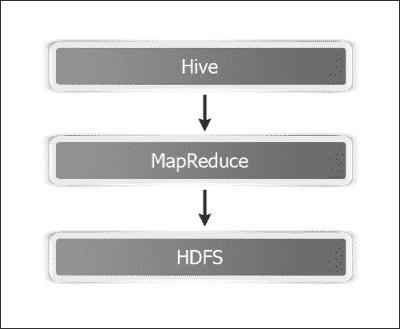
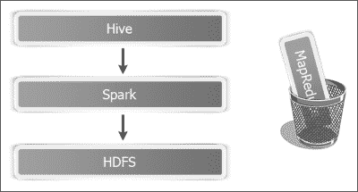
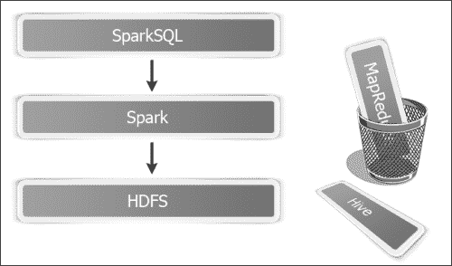
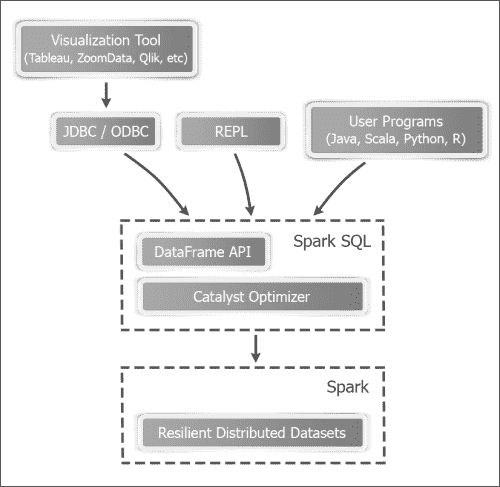
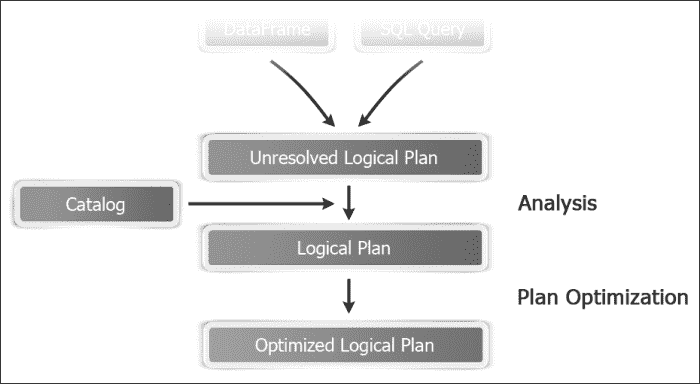

# 发帖主题：Re：Колибри0.7.0

Spark SQL是一个用于处理结构化数据的 Spark 模块。 本章分为以下食谱：

*   了解 Catalyst 优化器
*   正在创建 HiveContext
*   使用 CASE 类推断模式
*   以编程方式指定架构
*   使用 Parquet 格式加载和保存数据
*   使用 JSON 格式加载和保存数据
*   从关系数据库加载和保存数据
*   从任意来源加载和保存数据

# 简介

Spark 可以处理来自各种数据源(如 HDFS、Cassandra、HBase 和关系数据库，包括 HDFS)的数据。 大数据框架(与关系数据库系统不同)在编写时不强制使用模式。 HDFS 是一个完美的示例，其中在写入阶段欢迎任何任意文件。 然而，阅读数据则是另一回事。 您甚至需要为完全非结构化的数据赋予一定的结构，才能使其变得有意义。 有了这种结构化数据，SQL 在进行分析时非常方便。

Spark SQL 是 Spark 生态系统中相对较新的组件，在 Spark 1.0 中首次引入。 它包含了一个名为 Shark 的项目，该项目试图让蜂巢在 Spark 上运行。

配置单元本质上是一个关系抽象，它将 SQL 查询转换为 MapReduce 作业。



Shark 用 Spark 替换了MapReduce 部分，同时保留了大部分代码库。



最初，它运行良好，但很快，Spark 开发人员遇到了障碍，无法进一步优化它。 最后，他们决定从头开始编写 SQL 引擎，这就诞生了 Spark SQL。



Spark SQL解决了所有的性能挑战，但它必须提供与配置单元的兼容性，因此，在`SQLContext`之上创建了一个新的包装器上下文`HiveContext`。

Spark SQL 支持使用标准 SQL 查询和 HiveQL 访问数据，HiveQL 是 hive 使用的一种类似 SQL 的查询语言。 在本章中，我们将探讨 Spark SQL 的不同特性。 它支持 HiveQL 的子集以及 SQL92 的子集。 它与现有配置单元部署一起运行 SQL/HiveQL 查询，或替换现有配置单元部署。

运行 SQL 只是创建 Spark SQL 的部分原因。 一个重要原因是它有助于更快地创建和运行 Spark 程序。 它可以让开发人员编写更少的代码，程序读取更少的数据，并让 Catalyst 优化器来完成所有繁重的任务。

Spark SQL 使用称为**DataFrame**的编程抽象。 它是按命名列组织的分布式数据集合。 DataFrame 相当于数据库表，但提供了更精细的优化级别。 DataFrame API 还确保 Spark 的性能在不同的语言绑定中保持一致。

让我们将 DataFrames 与 RDDS 进行对比。 RDD 是一个不透明的对象集合，对底层数据的格式一无所知。 相反，DataFrame 具有与其相关联的架构。 您还可以将 DataFrame 视为添加了模式的 RDDS。 事实上，在 Spark 1.2 之前，有一个叫做**SchemaRDD**的工件，现在它已经演变成了DataFrame。 它们提供了比 SchemaRDDS 丰富得多的功能。

这些关于模式的额外信息使得进行大量优化成为可能，而这在其他情况下是不可能的。

DataFrames 还使用 JDBC 透明地从各种数据源加载，例如蜂窝表、Parquet 文件、JSON 文件和外部数据库。 DataFrame 可以看作 ROW 对象的 RDD，允许用户调用 MAP 等过程性 Spark API。

DataFrame API 可以在 Scala、Java、Python 和 R 版本的 Spark 1.4 中使用。

用户可以使用特定于**域的语言**(**DSL**)在 DataFrames 上执行关系操作。 DataFrames 支持所有常见的关系运算符，并且它们都在一个有限的 DSL 中获取表达式对象，该 DSL 让 Spark 捕获表达式的结构。

我们将从 Spark SQL 的入口点开始，即 SQLContext。 我们还将介绍 HiveContext，它是 SQLContext 的包装器，用于支持配置单元功能。 请注意，HiveContext 经过了更多的战斗考验，提供了更丰富的功能，所以强烈建议您即使不打算连接到 Have 也要使用它。 慢慢地，SQLContext 将达到与 HiveContext 相同的功能级别。

有两种方法可以将模式与 RDDS 关联以创建 DataFrame。 最简单的方法是利用 Scala Case 类，我们将首先介绍这一类。 Spark 使用 Java 反射从 Case 类推导出模式。 还有一种以编程方式指定模式以满足高级需求的方法，我们将在下一篇文章中介绍这一点。

Spark SQL 提供了一种加载和保存拼图文件的简单方法，我们也将对此进行介绍。 最后，我们将介绍从 JSON 加载数据和将数据保存到 JSON。

# 了解 Catalyst 优化器

Spark SQL 的大部分功能都来自于 Catalyst 优化器，所以花一些时间来理解它是有意义的。



## …的工作原理

Catalyst 优化器主要利用 Scala 的函数式编程构造，如模式匹配。 它提供了转换树的通用框架，我们使用该框架来执行分析、优化、规划和运行时代码生成。

Catalyst 优化器有两个主要目标：

*   轻松添加新的优化技术
*   使外部开发人员能够扩展优化器

Spark SQL 分四个阶段使用 Catalyst 的转换框架：

*   分析逻辑计划以解析引用
*   逻辑方案优化
*   物理规划
*   用于将查询的各个部分编译为 Java 字节码的代码生成

### 分析

分析阶段涉及查看 SQL 查询或 DataFrame，从中创建一个仍未解析的逻辑计划(引用的列可能不存在或数据类型可能错误)，然后使用 Catalog 对象(连接到物理数据源)解析此计划，并创建逻辑计划，如下图所示：


### 逻辑方案优化

逻辑计划优化阶段将标准的基于规则的优化应用于逻辑计划。 这些规则包括常量折叠、谓词下推、投影修剪、空传播、布尔表达式简化以及其他规则。

我想在这里特别提请注意谓词下推规则。 概念很简单；如果在一个地方对海量数据运行查询，而在另一个地方，可能会导致大量不必要的数据在网络上移动。

如果我们可以将查询的一部分下推到存储数据的位置，从而过滤掉不必要的数据，则可以显著减少网络流量。



### 物理规划

在物理计划阶段，Spark SQL 采用逻辑计划并生成一个或多个物理计划。 然后，它衡量每个实物计划的成本，并在此基础上生成一个实物计划。


### 代码生成

查询优化的最后阶段涉及生成在每台机器上运行的 Java 字节码。 它使用称为**准引号**的特殊 Scala 特性来实现这一点。

# 创建 HiveContext

`SQLContext`及其后代`HiveContext`是进入 Spark SQL 世界的两个入口点。 `HiveContext`提供SQLContext 提供的功能超集。 其他功能包括：

*   更完整且经过战斗测试的 HiveQL 解析器
*   访问配置单元 UDF
*   能够从配置单元表中读取数据

从Spark 1.3 开始，Spark shell 加载了 sqlContext(它是`HiveContext`而不是`SQLContext`的实例)。 如果您在 Scala 代码中创建`SQLContext`，则可以使用`SparkContext`创建它，如下所示：

```scala
val sc: SparkContext
val sqlContext = new org.apache.spark.sql.SQLContext(sc)
```

在本食谱中，我们将介绍如何创建`HiveContext`实例，然后通过 Spark SQL 访问配置单元功能。

## 做好准备

要启用配置单元功能，请确保在所有工作节点上都启用了配置单元(-Phive)程序集 JAR；另外，将`hive-site.xml`复制到 Spark 安装的`conf`目录中。 重要的是，Spark 有权访问`hive-site.xml`；否则，它将创建自己的蜂巢转储，并且不会连接到您现有的蜂巢仓库。

默认情况下，Spark SQL 创建的所有表都是配置单元管理的表，也就是说，配置单元完全控制表的生命周期，包括使用`drop table`命令删除表元数据时将其删除。 这只适用于持久表。 Spark SQL 还具有在 DataFrames 之外创建临时表的机制，以便于编写查询，并且这些临时表不是由配置单元管理的。

请注意，Spark 1.4 支持配置单元版本 0.13.1。 在使用 Maven 构建时，您可以使用`-Phive-<version> build`选项指定要构建的配置单元版本。 例如，要使用 0.12.0 构建，可以使用`-Phive-0.12.0`。

## 怎么做……

1.  启动 Spark shell 并给它一些额外的内存：

    ```scala
    $ spark-shell --driver-memory 1G

    ```

2.  创建`HiveContext`的实例：

    ```scala
    scala> val hc = new org.apache.spark.sql.hive.HiveContext(sc)

    ```

3.  创建以`first_name`、`last_name`和`age`作为列的配置单元表格`Person`：

    ```scala
    scala>  hc.sql("create table if not exists person(first_name string, last_name string, age int) row format delimited fields terminated by ','")

    ```

4.  打开另一个 shell 并在本地文件中创建`person`数据：

    ```scala
    $ mkdir person
    $ echo "Barack,Obama,53" >> person/person.txt
    $ echo "George,Bush,68" >> person/person.txt
    $ echo "Bill,Clinton,68" >> person/person.txt

    ```

5.  加载`person`表中的数据：

    ```scala
    scala> hc.sql("load data local inpath \"/home/hduser/person\" into table person")

    ```

6.  Alternatively, load that data in the `person` table from HDFS:

    ```scala
    scala> hc.sql("load data inpath \"/user/hduser/person\" into table person")

    ```

    ### 备注

    请注意，使用`load data inpath`将数据从另一个 HDFS 位置移动到配置单元的`warehouse`目录，默认情况下为`/user/hive/warehouse`。 您还可以指定完全限定的路径，如`hdfs://localhost:9000/user/hduser/person`。

7.  使用 HiveQL：

    ```scala
    scala> val persons = hc.sql("from person select first_name,last_name,age")
    scala> persons.collect.foreach(println)

    ```

    选择人员数据
8.  根据`select`查询的输出创建新表：

    ```scala
    scala> hc.sql("create table person2 as select first_name, last_name from person;")

    ```

9.  您还可以直接从一个表复制到另一个表：

    ```scala
    scala> hc.sql("create table person2 like person location '/user/hive/warehouse/person'")

    ```

10.  创建两个表`people_by_last_name`和`people_by_age`以保存计数：

    ```scala
    scala> hc.sql("create table people_by_last_name(last_name string,count int)")
    scala> hc.sql("create table people_by_age(age int,count int)")

    ```

11.  您还可以使用 HiveQL 查询将记录插入到多个表中：

    ```scala
    scala> hc.sql("""from person
     insert overwrite table people_by_last_name
     select last_name, count(distinct first_name)
     group by last_name
    insert overwrite table people_by_age
     select age, count(distinct first_name)
     group by age; """)

    ```

# 使用案例类推断模式

Case 类是 Scala 中的特殊类，它们为您提供构造函数、getters(访问器)、equals 和 hashCode 的样板实现，并实现`Serializable`。 Case 类可以很好地将数据封装为对象。 熟悉 Java的读者可以将其与**普通老式 Java 对象**(**POJOS**)或 Java bean 联系起来。

Case 类的美妙之处在于，Java 中所需的所有繁琐工作都可以通过 Case 类在一行代码中完成。 Spark 使用 Case 类上的反射来推断模式。

## 怎么做……

1.  启动Spark shell 并给它一些额外的内存：

    ```scala
    $ spark-shell --driver-memory 1G

    ```

2.  为隐式转换导入：

    ```scala
    scala> import sqlContext.implicits._

    ```

3.  创建`Person`案例类：

    ```scala
    scala> case class Person(first_name:String,last_name:String,age:Int)

    ```

4.  在另一个 shell 中，创建一些要放入 HDFS 中的示例数据：

    ```scala
    $ mkdir person
    $ echo "Barack,Obama,53" >> person/person.txt
    $ echo "George,Bush,68" >> person/person.txt
    $ echo "Bill,Clinton,68" >> person/person.txt
    $ hdfs dfs -put person person

    ```

5.  将`person`目录加载为 RDD：

    ```scala
    scala> val p = sc.textFile("hdfs://localhost:9000/user/hduser/person")

    ```

6.  根据逗号将每行拆分为字符串数组，作为分隔符：

    ```scala
    val pmap = p.map( line => line.split(","))

    ```

7.  将 Array[String]的 RDD 转换为`Person`Case 对象的 RDD：

    ```scala
    scala> val personRDD = pmap.map( p => Person(p(0),p(1),p(2).toInt))

    ```

8.  将`personRDD`转换为`personDF`数据帧：

    ```scala
    scala> val personDF = personRDD.toDF

    ```

9.  将`personDF`注册为表：

    ```scala
    scala> personDF.registerTempTable("person")

    ```

10.  对其运行 SQL 查询：

    ```scala
    scala> val people = sql("select * from person")

    ```

11.  从`persons`获取输出值：

    ```scala
    scala> people.collect.foreach(println)

    ```

# 以编程方式指定架构

很少有案例类可能不起作用；其中一种情况是案例类不能接受超过 22 个字段。 另一种情况可能是您事先不了解模式。 在此方法中，数据作为`Row`对象的 RDD 加载。 模式是使用`StructType`和`StructField`对象分别创建的，这两个对象分别表示一个表和一个字段。 将架构应用于`Row`RDD 以创建 DataFrame。

## 怎么做……

1.  启动 Spark shell 并给它一些额外的内存：

    ```scala
    $ spark-shell --driver-memory 1G

    ```

2.  隐式转换的导入：

    ```scala
    scala> import sqlContext.implicit._

    ```

3.  导入 Spark SQL 数据类型和`Row`对象：

    ```scala
    scala> import org.apache.spark.sql._
    scala> import org.apache.spark.sql.types._

    ```

4.  在另一个 shell 中，创建一些要放入 HDFS 中的示例数据：

    ```scala
    $ mkdir person
    $ echo "Barack,Obama,53" >> person/person.txt
    $ echo "George,Bush,68" >> person/person.txt
    $ echo "Bill,Clinton,68" >> person/person.txt
    $ hdfs dfs -put person person

    ```

5.  将`person`数据加载到 RDD：

    ```scala
    scala> val p = sc.textFile("hdfs://localhost:9000/user/hduser/person")

    ```

6.  根据逗号将每行拆分为字符串数组，作为分隔符：

    ```scala
    scala> val pmap = p.map( line => line.split(","))

    ```

7.  将数组[String]的 RDD 转换为`Row`对象的 RDD：

    ```scala
    scala> val personData = pmap.map( p => Row(p(0),p(1),p(2).toInt))

    ```

8.  使用`StructType`和`StructField`对象创建模式。 `StructField`对象采用参数名称、参数类型和可空性形式的参数：

    ```scala
    scala> val schema = StructType(
     Array(StructField("first_name",StringType,true),
    StructField("last_name",StringType,true),
    StructField("age",IntegerType,true)
    ))

    ```

9.  应用架构创建`personDF`DataFrame：

    ```scala
    scala> val personDF = sqlContext.createDataFrame(personData,schema)

    ```

10.  将`personDF`注册为表：

    ```scala
    scala> personDF.registerTempTable("person")

    ```

11.  对其运行 SQL 查询：

    ```scala
    scala> val persons = sql("select * from person")

    ```

12.  从`persons`：

    ```scala
    scala> persons.collect.foreach(println)

    ```

    获取输出值

在本食谱中，我们了解了如何通过编程指定模式来创建 DataFrame。

## …的工作原理

`StructType`对象定义架构。 您可以认为它等同于关系世界中的一个表或一行。 `StructType`接受`StructField`对象的数组，如以下签名所示：

```scala
StructType(fields: Array[StructField])
```

`StructField`对象具有以下签名：

```scala
StructField(name: String, dataType: DataType, nullable: Boolean = true, metadata: Metadata = Metadata.empty)
```

以下是有关使用的参数的更多信息：

*   `name`：表示字段的名称。
*   `dataType`: This shows the datatype of this field.

    允许使用以下数据类型：

    <colgroup><col style="text-align: left"> <col style="text-align: left"></colgroup> 
    | `IntegerType` | `FloatType` |
    | `BooleanType` | `ShortType` |
    | `LongType` | `ByteType` |
    | `DoubleType` | `StringType` |

*   `nullable`：this表示该字段是否可以为空。
*   `metadata`：显示该字段的元数据。 元数据是`Map[String,Any]`的包装器，因此它可以包含任意元数据。

# 使用拼图格式加载和保存数据

Apache Parquet 是一种柱状数据存储格式，专门为大数据存储和处理而设计。 拼花是基于 Google Dremel 文件中的记录粉碎和组装算法。 在拼花中，单个列中的数据是连续存储的。

柱状格式给拼花地板带来了一些独特的好处。 以为例，如果您有一个包含 100 列的表，并且您主要访问 10 列，那么在基于行的格式中，您必须加载所有 100 列，因为粒度级别在行级。 但是，在拼花地板上，您只能加载 10 根柱子。 另一个好处是，由于给定列中的所有数据都是相同的数据类型(根据定义)，压缩效率要高得多。

## 怎么做……

1.  打开终端，在本地文件

    ```scala
    $ mkdir person
    $ echo "Barack,Obama,53" >> person/person.txt
    $ echo "George,Bush,68" >> person/person.txt
    $ echo "Bill,Clinton,68" >> person/person.txt

    ```

    中创建`person`数据
2.  将`person`目录上载到 HDFS：

    ```scala
    $ hdfs dfs -put person /user/hduser/person

    ```

3.  启动 Spark shell 并给它一些额外的内存：

    ```scala
    $ spark-shell --driver-memory 1G

    ```

4.  隐式转换的导入：

    ```scala
    scala> import sqlContext.implicits._

    ```

5.  为`Person`：

    ```scala
    scala> case class Person(firstName: String, lastName: String, age:Int)

    ```

    创建案例类
6.  从 HDFS 加载`person`目录并将其映射到`Person`案例类：

    ```scala
    scala> val personRDD = sc.textFile("hdfs://localhost:9000/user/hduser/person").map(_.split("\t")).map(p => Person(p(0),p(1),p(2).toInt))

    ```

7.  将`personRDD`转换为`person`数据帧：

    ```scala
    scala> val person = personRDD.toDF

    ```

8.  将`person`DataFrame 注册为临时表，以便可以对其运行SQL 查询。 请注意，DataFrame名称不必与表名相同。

    ```scala
    scala> person.registerTempTable("person")

    ```

9.  选择所有 60 岁以上的人员：

    ```scala
    scala> val sixtyPlus = sql("select * from person where age > 60")

    ```

10.  打印值：

    ```scala
    scala> sixtyPlus.collect.foreach(println)

    ```

11.  让我们将此`sixtyPlus`RDD 保存为拼图格式：

    ```scala
    scala> sixtyPlus.saveAsParquetFile("hdfs://localhost:9000/user/hduser/sp.parquet")

    ```

12.  上一步在 HDFS 根目录中创建了一个名为`sp.parquet`的目录。 您可以在另一个 shell 中运行`hdfs dfs -ls`命令以确保它已创建：

    ```scala
    $ hdfs dfs -ls sp.parquet

    ```

13.  在 Spark shell 中加载拼图文件的内容：

    ```scala
    scala> val parquetDF = sqlContext.load("hdfs://localhost:9000/user/hduser/sp.parquet")

    ```

14.  将加载的`parquet`DF 注册为`temp`表：

    ```scala
    scala> 
    parquetDF
    .registerTempTable("sixty_plus")

    ```

15.  对前面的`temp`表运行查询：

    ```scala
    scala> sql("select * from sixty_plus")

    ```

## …的工作原理

让我们花一些时间更深入地理解拼花地板的格式。 以下是以表格格式表示的示例数据：

<colgroup><col style="text-align: left"> <col style="text-align: left"> <col style="text-align: left"></colgroup> 
| 

第一个 _

 | 

最后 _

 | 

年龄 / 时代 / 寿命，使用年限 / 阶段

 |
| --- | --- | --- |
| 巴拉克 | 奥巴马 | 53 |
| 乔治 （人名） | 布什 （人名） | 68 |
| 警察 | 克林顿 （人名） | 68 |

在行格式中，数据将按如下方式存储：

<colgroup><col style="text-align: left"> <col style="text-align: left"> <col style="text-align: left"> <col style="text-align: left"> <col style="text-align: left"> <col style="text-align: left"> <col style="text-align: left"> <col style="text-align: left"> <col style="text-align: left"></colgroup> 
| 巴拉克 | 奥巴马 | 53 | 乔治 （人名） | 布什 （人名） | 68 | 警察 | 克林顿 （人名） | 68 |

在列式布局中，数据将按如下方式存储：

<colgroup><col style="text-align: left"> <col style="text-align: left"> <col style="text-align: left"> <col style="text-align: left"> <col style="text-align: left"> <col style="text-align: left"> <col style="text-align: left"> <col style="text-align: left"> <col style="text-align: left"> <col style="text-align: left"></colgroup> 
| 行组=> | 巴拉克 | 乔治 （人名） | 警察 | 奥巴马 | 布什 （人名） | 克林顿 （人名） | 53 | 68 | 68 |
|   | 列块 | 列块 | 列块 |

下面是关于不同部分的简要说明：

*   **行组**：此显示数据到行的水平分区。 行组由列块组成。
*   **列块**：列块包含行组中给定列的数据。 列块在物理上总是连续的。 行组每列只有一个列块。
*   **第**页：一个列块被分成多个页面。 页面是一个存储单元，不能进一步划分。 页面按列块背靠背写入。 页面的数据可以压缩。

如果配置单元表格(例如`person`表格)中已有数据，您可以通过执行以下步骤直接将其保存为拼图格式：

1.  使用模式创建名为`person_parquet`的表，与`person`相同，但采用 Parquet 存储格式(对于配置单元 0.13 及更高版本)：

    ```scala
    hive> create table person_parquet like person stored as parquet

    ```

2.  通过从`person`表导入数据在`person_parquet`表中插入数据：

    ```scala
    hive> insert overwrite table person_parquet select * from person;

    ```

### 提示

有时，从其他来源(如黑斑羚)导入的数据会将字符串保存为二进制。 要在读取时将其转换为字符串，请在`SparkConf`中设置以下属性：

```scala
scala> sqlContext.setConf("spark.sql.parquet.binaryAsString","true")

```

## 还有更多的…

如果您使用的是 Spark 1.4 或更高版本，则有一个新的接口可以对 Parquet 进行写入和读取。 要将数据写入 Parquet(步骤 11 重写)，让我们将this`sixtyPlus`RDD 保存为 Parquet 格式(RDD 隐式转换为 DataFrame)：

```scala
scala>sixtyPlus.write.parquet("hdfs://localhost:9000/user/hduser/sp.parquet")

```

要从 Parquet 读取(步骤 13 重写；结果是 DataFrame)，请将 Parquet 文件的内容加载到 Spark shell 中：

```scala
scala>val parquetDF = sqlContext.read.parquet("hdfs://localhost:9000/user/hduser/sp.parquet")

```

# 使用 JSON 格式加载和保存数据

JSON 是一种轻量级数据交换格式。 它基于 JavaScript 编程语言的子集。 JSON 的流行与 XML 变得不流行直接相关。 XML 是一个很好的解决方案，可以为纯文本格式的数据提供结构。 随着时间的推移，XML 文档变得越来越重，这样的开销是不值得的。

JSON 通过提供开销最小的结构解决了这个问题。 有些人称 JSON**无脂 XML**。

JSON语法遵循以下规则：

*   数据采用键-值对的形式：

    ```scala
    "firstName" : "Bill"
    ```

*   JSON 中有四种数据类型：
    *   String(“First Name”：“Barack”)
    *   号码(“年龄”：53 岁)
    *   Boolean(“live”：true)
    *   零(“经理”：零)
*   数据由逗号分隔
*   大括号{}表示对象：

    ```scala
    { "firstName" : "Bill", "lastName": "Clinton", "age": 68 }
    ```

*   方括号[]表示数组：

    ```scala
    [{ "firstName" : "Bill", "lastName": "Clinton", "age": 68 },{"firstName": "Barack","lastName": "Obama", "age": 43}]
    ```

在本食谱中，我们将探索如何以 JSON 格式保存和加载它。

## 怎么做……

1.  打开终端，创建 JSON 格式的`person`数据：

    ```scala
    $ mkdir jsondata
    $ vi jsondata/person.json
    {"first_name" : "Barack", "last_name" : "Obama", "age" : 53}
    {"first_name" : "George", "last_name" : "Bush", "age" : 68 }
    {"first_name" : "Bill", "last_name" : "Clinton", "age" : 68 }

    ```

2.  上载`jsondata`目录到 HDFS：

    ```scala
    $ hdfs dfs -put jsondata /user/hduser/jsondata

    ```

3.  启动Spark shell 并给它一些额外的内存：

    ```scala
    $ spark-shell --driver-memory 1G

    ```

4.  创建`SQLContext`的实例：

    ```scala
    scala> val sqlContext = new org.apache.spark.sql.SQLContext(sc)

    ```

5.  隐式转换的导入：

    ```scala
    scala> import sqlContext.implicits._

    ```

6.  从 HDFS 加载`jsondata`目录：

    ```scala
    scala> val person = sqlContext.jsonFile("hdfs://localhost:9000/user/hduser/jsondata")

    ```

7.  将`person`DF 注册为`temp`表，以便可以对其运行 SQL 查询：

    ```scala
    scala> person.registerTempTable("person")

    ```

8.  选择所有 60 岁以上的人员：

    ```scala
    scala> val sixtyPlus = sql("select * from person where age > 60")

    ```

9.  打印值：

    ```scala
    scala> sixtyPlus.collect.foreach(println)
    ```

10.  让我们将这个`sixtyPlus`DF 保存为 JSON 格式

    ```scala
    scala> sixtyPlus.toJSON.saveAsTextFile("hdfs://localhost:9000/user/hduser/sp")

    ```

11.  上一步在 HDFS 根目录中创建了一个名为`sp`的目录。 您可以在另一个 shell 中运行`hdfs dfs -ls`命令以确保它已创建：

    ```scala
    $ hdfs dfs -ls sp

    ```

## …的工作原理

`sc.jsonFile`内部使用`TextInputFormat`，它一次处理一行。 因此，一条 JSON 记录不能在多行上。 如果您使用多行，那么它将是一个有效的 JSON 格式，但是它不能与Spark 一起使用，并且会抛出异常。

允许在一行中有多个对象。 例如，您可以将一行中的两个人的信息作为一个数组，如下所示：

```scala
[{"firstName":"Barack", "lastName":"Obama"},{"firstName":"Bill", "lastName":"Clinton"}]
```

本食谱总结了使用 Spark 以 JSON 格式保存和加载数据。

## 还有更多的…

如果您使用的是 Spark 1.4 或更高版本，`SqlContext`提供了从 HDFS 加载`jsondata`目录的更简单界面：

```scala
scala> val person = sqlContext.read.json ("hdfs://localhost:9000/user/hduser/jsondata")

```

版本 1.4 中不推荐使用`sqlContext.jsonFile`，建议使用`sqlContext.read.json`。

# 从关系数据库加载和保存数据

在上一章中，我们学习了如何使用 JdbcRDD 将数据从关系数据加载到 RDD。 Spark 1.4 支持将数据从 JDBC 资源直接加载到 Dataframe 中。 这份食谱将探索如何做到这一点。

## 做好准备

请确保 JDBC 驱动程序 JAR 在客户端节点和将在其上运行 Executor 的所有从节点上可见。

## 怎么做……

1.  使用以下 DDL 在 MySQL中创建名为`person`的表：

    ```scala
    CREATE TABLE 'person' (
      'person_id' int(11) NOT NULL AUTO_INCREMENT,
      'first_name' varchar(30) DEFAULT NULL,
      'last_name' varchar(30) DEFAULT NULL,
      'gender' char(1) DEFAULT NULL,
      'age' tinyint(4) DEFAULT NULL,
      PRIMARY KEY ('person_id')
    )
    ```

2.  加入时间：清华大学 2007 年 01 月 25 日下午 3：33
3.  从[http://dev.mysql.com/downloads/connector/j/](http://dev.mysql.com/downloads/connector/j/)下载`mysql-connector-java-x.x.xx-bin.jar`。
4.  Make MySQL driver available to the Spark shell and launch it:

    ```scala
    $ spark-shell --driver-class-path/path-to-mysql-jar/mysql-connector-java-5.1.34-bin.jar

    ```

    ### 备注

    请注意，`path-to-mysql-jar`不是实际的路径名。 您需要使用您的路径名。

5.  构造JDBC URL：

    ```scala
    scala> val url="jdbc:mysql://localhost:3306/hadoopdb"

    ```

6.  使用用户名和密码创建连接属性对象：

    ```scala
    scala> val prop = new java.util.Properties
    scala> prop.setProperty("user","hduser")
    scala> prop.setProperty("password","********")

    ```

7.  使用 JDBC 数据源(url、表名、属性)加载 DataFrame：

    ```scala
     scala> val people = sqlContext.read.jdbc(url,"person",prop)

    ```

8.  通过执行以下命令以漂亮的表格格式显示结果：

    ```scala
    scala> people.show

    ```

9.  这已经加载了整个表。 如果我只想加载男性(url、表名、谓词、属性)怎么办？ 为此，请运行以下命令：

    ```scala
    scala> val males = sqlContext.read.jdbc(url,"person",Array("gender='M'"),prop)
    scala> males.show

    ```

10.  通过执行以下命令仅显示名字：

    ```scala
    scala> val first_names = people.select("first_name")
    scala> first_names.show

    ```

11.  通过执行以下命令仅显示 60 岁以下的人：

    ```scala
    scala> val below60 = people.filter(people("age") < 60)
    scala> below60.show

    ```

12.  按性别分组人如下：

    ```scala
    scala> val grouped = people.groupBy("gender")

    ```

13.  通过执行以下命令，找出个男性和女性的数量：

    ```scala
    scala> val gender_count = grouped.count
    scala> gender_count.show

    ```

14.  通过执行以下命令找出男性和女性的平均年龄：

    ```scala
    scala> val avg_age = grouped.avg("age")
    scala> avg_age.show

    ```

15.  现在，如果要将此`avg_age`数据保存到新表中，请运行以下命令：

    ```scala
    scala> gender_count.write.jdbc(url,"gender_count",prop)

    ```

16.  以拼图格式保存 People DataFrame：

    ```scala
    scala> people.write.parquet("people.parquet")

    ```

17.  将 People DataFrame 保存为 JSON 格式：

    ```scala
    scala> people.write.json("people.json")

    ```

# 从任意来源加载和保存数据

到目前为止，我们已经介绍了内置了 DataFrames 的三个数据源-`parquet`(默认)、`json`和`jdbc`。 Dataframes不限于这三个，可以通过手动指定格式加载和保存到任何任意数据源。

在本指南中，我们将介绍从任意来源加载和保存数据。

## 怎么做……

1.  启动 Spark shell 并给它一些额外的内存：

    ```scala
    $ spark-shell --driver-memory 1G

    ```

2.  从拼接面板加载数据；由于`parquet`是默认数据源，因此您不必指定它：

    ```scala
    scala> val people = sqlContext.read.load("hdfs://localhost:9000/user/hduser/people.parquet") 

    ```

3.  通过手动指定格式

    ```scala
    scala> val people = sqlContext.read.format("org.apache.spark.sql.parquet").load("hdfs://localhost:9000/user/hduser/people.parquet") 

    ```

    从拼图加载数据
4.  For inbuilt datatypes (`parquet`,`json`, and `jdbc`), you do not have to specify the full format name, only specifying `"parquet"`, `"json"`, or `"jdbc"` works:

    ```scala
    scala> val people = sqlContext.read.format("parquet").load("hdfs://localhost:9000/user/hduser/people.parquet") 

    ```

    ### 备注

    写入数据时，有四种保存模式：`append`、`overwrite`、`errorIfExists`和`ignore`。 `append`模式将数据添加到数据源，`overwrite`覆盖它，`errorIfExists`抛出数据已经存在的异常，当数据已经存在时，`ignore`不执行任何操作。

5.  在`append`模式下将人员保存为 JSON：

    ```scala
    scala> val people = people.write.format("json").mode("append").save ("hdfs://localhost:9000/user/hduser/people.json") 

    ```

## 还有更多的…

Spark SQL 的数据源 API 保存到各种数据源。 要查找更多信息，请访问[http://spark-packages.org/](http://spark-packages.org/)。