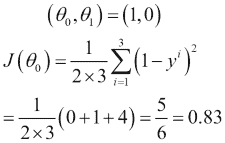
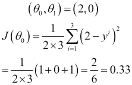
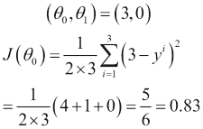
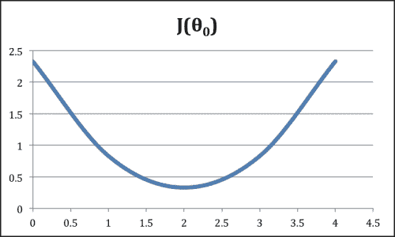
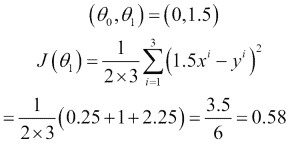
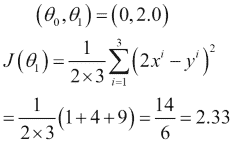
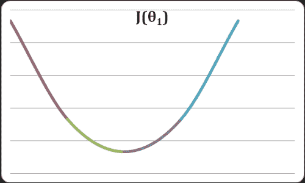

# 七、基于 MLlib 的回归监督学习

本章分为以下食谱：

*   使用线性回归
*   理解成本函数
*   用套索进行线性回归
*   做岭回归

# 简介

以下是维基百科对监督学习的定义：

> *“监督学习是从标记的训练数据中推断函数的机器学习任务。”*

监督学习有两个步骤：

*   用训练数据集训练算法；这就像是先给出问题和答案
*   使用测试数据集向经过训练的算法提出另一组问题

有两种监督学习算法：

*   **回归**：这个预测连续的价值输出，，比如房价。
*   **分类**：此预测称为标签的离散值输出(0 或 1)，例如电子邮件是否为垃圾邮件。 分类不限于两个值；它可以有多个值，例如将电子邮件标记为重要、不重要、紧急等(0、1、2…)。 。

### 备注

我们将在本章讨论回归，在下一章讨论分类。

作为回归的示例数据集，我们将使用加利福尼亚州萨拉托加市最近售出的房屋数据作为训练集来训练算法。 一旦算法被训练，我们将要求它根据给定的房屋大小预测房价。 下图说明了该工作流程：


假设，就它的作用而言，在这里听起来可能是一个用词不当的词，你可能认为预测函数可能是一个更好的名字，但假设这个词是出于历史原因而使用的。

如果我们只使用一个特征来预测结果，则称为**双变量分析**。 当我们有多个特征时，称为**多元分析**。 事实上，我们可以想要多少功能就有多少功能。 一种这样的算法，**支持向量机**(**SVM**)，我们将在下一章中介绍，实际上，它允许您拥有无限数量的特征。

本章将介绍如何使用 Spark 的机器学习库 MLlib 进行有监督的学习。

### 备注

数学解释已经以尽可能简单的方式提供，但您可以跳过数学，直接转到*How to Do……。* 节。

# 使用线性回归

线性回归是基于一个或多个预测变量或特征*x*对响应变量*y*的值进行建模的方法。

## 做好准备

让我们使用一些住房数据来根据房子的大小来预测它的价格。 以下是 2014 年初加利福尼亚州萨拉托加市房屋的大小和价格：

<colgroup><col style="text-align: left"> <col style="text-align: left"></colgroup> 
| 

房屋面积(平方英尺)

 | 

普赖斯 （人名）

 |
| --- | --- |
| 2100 | $1，620，000 |
| 二三零零 | $1，690，000 |
| 2046 年 | $1，400，000 |
| 4314 | $2，000，000 |
| 1244 | $1，060，000 |
| 4608 | $3，830，000 |
| 2173 | $1，230，000 |
| 2750 | $2，400，000 |
| 4010 | $3，380，000 |
| 一九五九年 | $1，480，000 |

下面是它们的图形表示：


## How to Do It…

1.  启动 Spark 外壳：

    ```scala
    $ spark-shell

    ```

2.  导入统计信息及相关类：

    ```scala
    scala> import org.apache.spark.mllib.linalg.Vectors
    scala> import org.apache.spark.mllib.regression.LabeledPoint
    scala> import org.apache.spark.mllib.regression.LinearRegressionWithSGD

    ```

3.  创建以房价为标签的`LabeledPoint`数组：

    ```scala
    scala> val points = Array(
    LabeledPoint(1620000,Vectors.dense(2100)),
    LabeledPoint(1690000,Vectors.dense(2300)),
    LabeledPoint(1400000,Vectors.dense(2046)),
    LabeledPoint(2000000,Vectors.dense(4314)),
    LabeledPoint(1060000,Vectors.dense(1244)),
    LabeledPoint(3830000,Vectors.dense(4608)),
    LabeledPoint(1230000,Vectors.dense(2173)),
    LabeledPoint(2400000,Vectors.dense(2750)),
    LabeledPoint(3380000,Vectors.dense(4010)),
    LabeledPoint(1480000,Vectors.dense(1959))
    )

    ```

4.  创建前面数据的 RDD：

    ```scala
    scala> val pricesRDD = sc.parallelize(points)

    ```

5.  使用此数据使用 100 次迭代训练模型。 这里，步长被保持得很小，以解释非常大的响应变量的值，也就是房价。 第四个参数是每次迭代要使用的数据集的一部分，最后一个参数是要使用的初始权重集(不同特征的权重)：

    ```scala
    scala> val model = LinearRegressionWithSGD.train(pricesRDD,100,0.0000006,1.0,Vectors.zeros(1))

    ```

6.  预测 2500 平方英尺的房子的价格：

    ```scala
    scala> val prediction = model.predict(Vectors.dense(2500))

    ```

房屋面积只是一个预测变量。 房价取决于其他变量，如地块大小、房龄等等。 你拥有的变量越多，你的预测就越准确。

# 理解成本函数

代价函数或损失函数是机器学习算法中一个非常重要的函数。 大多数算法都有某种形式的代价函数，目标是最小化这种代价函数。 影响成本函数的参数，如上一个配方中的`stepSize`，需要手工设置。 因此，理解成本函数的整体概念是非常重要的。

在这个配方中，我们将分析线性回归的成本函数。 线性回归是一种易于理解的算法，它将帮助读者理解成本函数对甚至复杂算法的作用。

让我们回到线性回归。 目标是找到最合适的直线，使均方误差最小。 这里，我们将误差称为最佳拟合线的值与训练数据集的响应变量的实际值之间的差值。

对于单谓词变量的简单情况，最适合的行可以写成：


此函数为，也称为**假设函数**，可写为：


线性回归的目标是找到最适合的直线。 在这条线上，θ<sub>0</sub>表示*y*轴上的截距，而θ<sub>1</sub>表示该线的坡度，如以下公式所示：


对于训练数据集，我们必须以*h(X)*最接近*y*的方式选择θ<sub>0</sub>和θ<sub>1</sub>。 因此，对于*i*<sup>第</sup>个数据点，直线与数据点之间距离的平方为：


简而言之，这是预测房价与实际成交价之差的平方。 现在，让我们取训练数据集中此值的平均值：


前面的方程式称为线性回归的成本函数*J*。 目标是最小化该成本函数。


该成本函数也称为**平方误差函数**。 如果θ<sub>0</sub>和θθ<sub>1</sub>都独立地跟随凸曲线，如果它们与*J*作图，则它们都独立地跟随凸曲线。

让我们举一个非常简单的示例，其中包含三个值(1，1)、(2，2)和(3，3)的数据集，以简化计算：


假设θ<sub>1</sub>为 0，即平行于*x*轴的最佳拟合直线。 在第一种情况下，假设最佳拟合直线是*x*轴，即*y=0*。 下面是成本函数的值：


现在，让将这条线稍微向上移动到*y=1*。 下面的将是成本函数的值：



现在，让我们将这条线进一步向上移动到*y=2*。 然后，下面将是成本函数的值：



现在，当我们将这条线进一步向上移动到*y=3*时，下面是成本函数的值：



现在，让我们将这条线进一步向上移动到*y=4*。 下面的将是成本函数的值：


因此，您可以看到成本函数值先是减少，然后又像这样增加：



现在，让我们重复该练习，将θ<sub>0</sub>设为 0，并使用不同的θ<sub>1</sub>值。

在第一种情况下，假设最佳拟合直线是*x*轴，即*y=0*。 下面是成本函数的值：


现在，让我们使用 0.5 的坡度。 下面是成本函数的值：


现在，让我们使用斜率 1。下面的将是成本函数的值：


现在，当我们使用斜率 1.5 时，下面是成本函数的值：



现在，让我们使用 2.0 的坡度。 下面是成本函数的值：



正如您在这两个图中所看到的，当曲线的斜率或坡度为 0 时，*J*的最小值。



当θ<sub>0</sub>和θ<sub>1</sub>都映射到 3D 空间时，它就像一个碗的形状，成本函数的最小值位于碗的底部。

这种使达到这个最小值的方法称为**梯度下降**。 在 Spark 中，实现方式是随机梯度下降。

# 用套索进行线性回归

套索是一种线性回归的收缩和选择方法。 它将通常的误差平方和最小化，并在系数的绝对值的和上设置的界限。 它是基于在[http://statweb.stanford.edu/~tibs/lasso/lasso.pdf](http://statweb.stanford.edu/~tibs/lasso/lasso.pdf)找到的原始套索纸张。

我们在上一个配方中使用的最小二乘法也称为**普通最小二乘法**(**OLS**)。 运营服务有两个挑战：

*   **预测精度**：使用 OLS 进行的预测通常具有较低的预测偏差和较高的方差。 可以通过缩小某些系数(甚至使其为零)来提高预测精度。 偏差会有一些增加，但总体预测精度将会提高。
*   **解释**：在有大量个预测器的情况下，希望找到它们中表现出最强效应(相关性)的子集。

### 备注

偏差与方差

预测误差背后有两个主要原因：偏差和方差。 理解偏差和方差的最好方法是查看一个案例，其中我们多次对同一数据集进行预测。

偏差是对预测结果与实际值有多远的估计，和方差是对不同预测之间预测值差异的估计。

一般来说，添加更多功能有助于减少偏见，这一点很容易理解。 在建立预测模型时，如果遗漏了一些相关性较大的特征，将会导致很大的误差。

如果您的模型具有较高的方差，则可以删除要素以减小方差。 更大的数据集也有助于减少方差。

这里，我们将使用一个简单的数据集，它是不适定的。 不适定数据集是样本数据大小小于预测器数量的数据集。

<colgroup><col style="text-align: left"> <col style="text-align: left"> <col style="text-align: left"> <col style="text-align: left"> <col style="text-align: left"> <col style="text-align: left"> <col style="text-align: left"> <col style="text-align: left"> <col style="text-align: left"> <col style="text-align: left"></colgroup> 
| 

年 / 年度 / 历年 / 年纪

 | 

X0

 | 

X1

 | 

X2

 | 

X3

 | 

X4

 | 

X5 X5

 | 

X6 x6

 | 

X7

 | 

X8

 |
| --- | --- | --- | --- | --- | --- | --- | --- | --- | --- |
| 1. | 5. | 3. | 1. | 2 个 | 1. | 3. | 2 个 | 2 个 | 1. |
| 2 个 | 9. | 8 个 | 8 个 | 9. | 7. | 9. | 8 个 | 7. | 9. |

你可以很容易地猜到，在九个预测因子中，只有两个与*y*有很强的相关性，即*x0*和*x1*。 我们将使用这个数据集和套索算法来检验它的有效性。

## How to Do It…

1.  启动 Spark Shell：

    ```scala
    $ spark-shell

    ```

2.  导入统计信息及相关类：

    ```scala
    scala> import org.apache.spark.mllib.linalg.Vectors
    scala> import org.apache.spark.mllib.regression.LabeledPoint
    scala> import org.apache.spark.mllib.regression.LassoWithSGD

    ```

3.  创建以房价为标签的`LabeledPoint`数组：

    ```scala
    scala> val points = Array(
    LabeledPoint(1,Vectors.dense(5,3,1,2,1,3,2,2,1)),
    LabeledPoint(2,Vectors.dense(9,8,8,9,7,9,8,7,9))
    )

    ```

4.  创建前面数据的 RDD：

    ```scala
    scala> val rdd = sc.parallelize(points)

    ```

5.  使用此数据使用 100 次迭代训练模型。 这里，步长和正则化参数已经手动设置：

    ```scala
    scala> val model = LassoWithSGD.train(rdd,100,0.02,2.0)

    ```

6.  检查有多少预测器的系数设置为零：

    ```scala
    scala> model.weights
    org.apache.spark.mllib.linalg.Vector = [0.13455106581619633,0.02240732644670294,0.0,0.0,0.0,0.01360995990267153,0.0,0.0,0.0]

    ```

如您所见，九个预测值中有六个的系数设置为零。 这是套索的主要特点：它认为没有用的任何预测值，都会通过将系数设为零来将它们移出方程式。

# 做岭回归

提高预测质量的另一种套索方法是岭回归。 而在套索中，许多特征的系数被设置为零，因此从方程中消除了，在脊线中，预测器或特征受到惩罚，但从未被设置为零。

## How to Do It…

1.  启动 Spark Shell：

    ```scala
    $ spark-shell

    ```

2.  导入统计信息及相关类：

    ```scala
    scala> import org.apache.spark.mllib.linalg.Vectors
    scala> import org.apache.spark.mllib.regression.LabeledPoint
    scala> import org.apache.spark.mllib.regression.RidgeRegressionWithSGD

    ```

3.  创建以房价为标签的`LabeledPoint`数组：

    ```scala
    scala> val points = Array(
    LabeledPoint(1,Vectors.dense(5,3,1,2,1,3,2,2,1)),
    LabeledPoint(2,Vectors.dense(9,8,8,9,7,9,8,7,9))
    )

    ```

4.  创建前面数据的 RDD：

    ```scala
    scala> val rdd = sc.parallelize(points)

    ```

5.  使用此数据使用 100 次迭代训练模型。 这里，步长和正则化参数已经手动设置：

    ```scala
    scala> val model = RidgeRegressionWithSGD.train(rdd,100,0.02,2.0)

    ```

6.  检查有多少预测器的系数设置为零：

    ```scala
    scala> model.weights
    org.apache.spark.mllib.linalg.Vector = [0.049805969577244584,0.029883581746346748,0.009961193915448916,0.019922387830897833,0.009961193915448916,0.029883581746346748,0.019922387830897833,0.019922387830897833,0.009961193915448916]

    ```

正如你可以看到的，与套索不同，岭回归不会给任何预测系数赋值为零，但它确实会使一些预测系数非常接近于零。